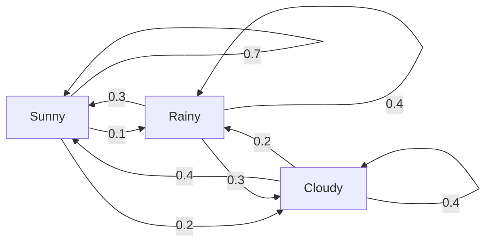
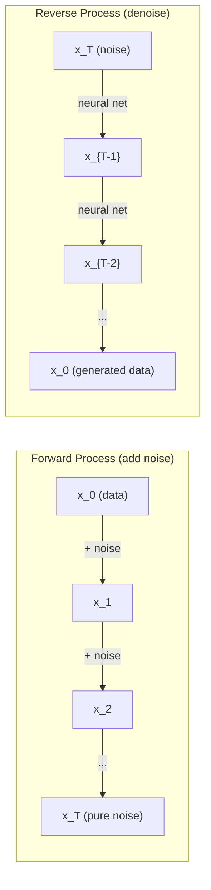

# स्टोकास्टिक प्रक्रियाएँ

> संरचना के साथ यादृच्छिकता, यादृच्छिक चलने, मार्कोव श्रृंखलाओं और विसारण मॉडल के पीछे गणित।
> संरचनात्मक आकस्मिकता── आकस्मिकता, मार्कोव चेन और विस्तार मॉडल के पीछे का गणित──

**Type:** Learn | **类型:** 学习
**Language:**पायथन**语言:**पायथन
**Prerequisites:** Phase 1, Lessons 06-07 (probability, Bayes) | **前置知识:** Phase 1, 第 06-07 课（概率、贝叶斯）
**Time:** ~75 minutes | **时间:** ~75 分钟

## सीखने के लक्ष्य

- 1D और 2D यादृच्छिक चलने का अनुकरण करें और विस्थापन के स्केलिंग की जांच करें
  模拟一维和二维随机游走,验证位移的 √n 缩放规律
- एक मार्कोव श्रृंखला सिम्युलेटर का निर्माण और अपने स्वयं के संरचना के माध्यम से इसकी स्थिर वितरण की गणना
  ् ् ् ् ् ् ् ् ् ् ् ् ् ् ् ् ् ् ् ् ् ् ् ् ् ् ् ् ् ् ् ् ् ् ् ् ् ् ् ् ् ् ् ् ् ् ् ् ् ् ् ् ् ् ् ् ् ् ् ् ् ् ् ् ् ् ् ् ् ् ् ् ् ् ् ् ् ् ् ् ् ् ् ् ् ् ् ् ् ् ् ् ् ् ् ् ् ् ् ् ् ् ् ् ् ् ् ् ् ् ् ् ् ् ् ् ् ् ् ् ् ् ् ् ् ् ् ् ् ् ् ् ् ् ् ् ् ् ् ् ् ् ् ् ् ् ् ् ् ् ् ् ् ् ् ् ् ् ् ् ् ् ् ् ् ् ् ् ् ् ् ् ् ् ् ् ् ् ् ् ् ् ् ् ् ् ् ् ् ् ् ् ् ् ् ् ् ् ् ् ् ् ् ् ् ् ् ् ् ् ् ् ् ् ् ् ् ् ् ् ् ् ् ् ् ् ् ् ् ् ् ् ् ् ् ् ् ् ् ् ् ् ् ् ् ् ् ् ् ् ् ् ् ् ्
- लक्ष्य वितरण से नमूना लेने के लिए मेट्रोपोलिस-हस्टिंग्स एमसीएमसी और लैंग्विन गतिशीलता को लागू करना
  实现 मेट्रोपोलिस-हस्टिंग्स MCMC 和 Langevin 动力学, from लक्ष्य वितरण中采样
- आगे फैलाव प्रक्रिया को ब्राउनियन गति से जोड़ें और समझाएं कि कैसे रिवर्स प्रक्रिया डेटा उत्पन्न करती है
  पूर्ववर्ती प्रसार प्रक्रिया को ब्रॉन्ग आंदोलन से जोड़ना, व्याख्या करना कि पूर्ववर्ती प्रक्रिया डेटा कैसे उत्पन्न करती है


> **【中文解读】**
> 随机过程是有结构的随机性――马尔可夫链(वर्तमान स्थिति केवल अगले चरण पर निर्भर करती है) पृष्ठरैंक का आधार है――扩散 मॉडल की पूर्ववर्ती प्रक्रिया है ब्राउन आंदोलन (Browning movement) 噪音), उलटवर्ती प्रक्रिया है 噪音 उत्पन्न करना MCMC है बेलीज सांख्यिकी की आधारशिला

## समस्या  समस्या परिचय

कई एआई सिस्टम में यादृच्छिकता शामिल होती है जो समय के साथ विकसित होती है. स्थैतिक यादृच्छिकता नहीं - संरचित, अनुक्रमिक यादृच्छिकता जहां प्रत्येक कदम पहले के बाद के पर निर्भर करता है।

> कई एआई सिस्टम समय के साथ विकसित होने की यादृच्छिकता से संबंधित हैं। यह स्थैतिक यादृच्छिकता नहीं है, बल्कि संरचनात्मक क्रमबद्धता है। प्रत्येक कदम पहले की घटनाओं पर निर्भर करता है।

भाषा मॉडल एक समय में एक टोकन उत्पन्न करते हैं। प्रत्येक टोकन पिछले संदर्भ पर निर्भर करता है। मॉडल एक संभावना वितरण, इसके नमूने आउटपुट करता है, और आगे बढ़ता है। यह एक स्टोकास्टिक प्रक्रिया है।

> 语言模型逐个生成 टोकन── प्रत्येक टोकन पहले के ऊपर नीचे के ऊपर निर्भर करता है──模型输出一个概率分布,从中采样,然后继续──这是随机过程──

विसारण मॉडल एक छवि में शोर को चरण-दर-चरण जोड़ते हैं जब तक कि यह शुद्ध स्थैतिक नहीं हो जाता। फिर वे प्रक्रिया को उलट देते हैं, एक नई छवि आने तक चरण-दर-चरण निरुत्साहित करते हैं। आगे की प्रक्रिया एक मार्कोव श्रृंखला है। उल्टा प्रक्रिया एक सीखी गई मार्कोव श्रृंखला है जो पीछे की ओर चलती है।

>  विस्तारा मॉडल धीरे-धीरे छवि में शोर जोड़ता है, जब तक कि यह शुद्ध स्थैतिकता में नहीं बदल जाता है।

एक संयोग की दुनिया में एक यादृच्छिक नीति का पालन करता है। पूरी बात एक मार्कोव निर्णय प्रक्रिया है।

> 强化学习智能体在环境中执行动作── प्रत्येक动作以一定概率导致新状态──智能体在随机世界中随机策略──整个系统是马尔可夫决策过程MDP)──

MCMC नमूनाकरण - Bayesian inference की रीढ़ की हड्डी - एक Markov श्रृंखला का निर्माण जिसका स्थिर वितरण है पिछली आप नमूना करना चाहते हैं से.

> MCMC 采采贝叶斯推理  की आधारशिला  एक मार्कोव श्रृंखला का निर्माण करती है, इसकी सफ़ल वितरण यही है कि आप मध्य से 采  के बाद के अनुभवों में से एक से  के वितरण को  का निर्माण करते हैं।

ये सभी चार बुनियादी विचारों पर आधारित हैंः
1. यादृच्छिक चलने -- सबसे सरल स्टोकैस्टिक प्रक्रिया
2. मार्कोव श्रृंखलाएं -- एक संक्रमण मैट्रिक्स के साथ संरचित यादृच्छिकता
3. लैंग्विन गतिशीलता - शोर के साथ ग्रेडिएंट गिरावट
4. मेट्रोपोलिस-हस्टिंग्स - किसी भी वितरण से नमूना लेना

> ये सभी चार बुनियादी अवधारणाओं पर आधारित हैंः १. 随机游走 सबसे सरल 随机过程; २. 马尔可夫链带转移矩阵的结构化随机性; ३. 长 ?? 动力学带噪音的梯度下降; ४.

## अवधारणा का मूल अवधारणा

### यादृच्छिक पैदल यात्रा

प्रत्येक चरण में एक निष्पक्ष सिक्का फ्लिप करें. सिरः दाएं (+1) आगे बढ़ें। पूंछः बाएं (-1) आगे बढ़ें।

> From position 0 开始── प्रत्येक कदम पर एक बराबर सिक्का फेंका──正面:向右 (+1)──反面:向左 (-1)──

n चरणों के बाद, आपकी स्थिति n यादृच्छिक +/-1 मानों का योग है। अपेक्षित स्थिति 0 है (चलाव निष्पक्ष है) । लेकिन मूल से अपेक्षित दूरी वर्ग ((n) के रूप में बढ़ जाती है।

> n 步后, आपकी स्थिति n 个随机 ±1 值的求和――期望位置为 0(游走无偏), लेकिन मूल बिंदु से अपेक्षित दूरी √n 增长

यह विपरीत है. चलने के लिए उचित है - किसी भी दिशा में कोई बहाव नहीं है. लेकिन समय के साथ, यह शुरू से आगे और आगे भटकता है. n चरणों के बाद मानक विचलन sqrt(n है।

> यह एक विपरीत है। यह एक समान है। यह दो दिशाओं में नहीं बढ़ता है। लेकिन समय के साथ-साथ यह एक अलग बिंदु से आगे बढ़ता है।

```
Step 0:  Position = 0
Step 1:  Position = +1 or -1
Step 2:  Position = +2, 0, or -2
...
Step 100: Expected distance from origin ~ 10 (sqrt(100))
Step 10000: Expected distance from origin ~ 100 (sqrt(10000))
```

**In 2D**, पैदल चलता है ऊपर, नीचे, बाएं, या दाएं के साथ समान संभावना है। समान वर्ग n) पैमाने मूल से दूरी पर लागू होता है। पथ एक फ्रैक्टल की तरह पैटर्न को ट्रैक करता है।

> **二维情况下**, , , , , , , , , , , , , , , , , , , , , , , , , , , , , , , , , , , , , , , , , , , , , , , , , , , , , , , , , , , , , , , , , , , , , , , , , , , , , , , , , , , , , , , , , , , , , , , , , , , , , , , , , , , , , , , , , , , , , , , , , , , , , , , , , , , , , , , , , , , , , , , , , , , , , , , , , , , , , , , , , , , , , , , , , , , , , , , , , , , , , , , , , , , , , , , , , , , , , , , , , , , , , , , , , , , , , , , , , , , , , , , , , , , , , , , , , , , , , , , , , , , , , , , , , , , , , , , , , , , , , , , , , , , , , , , , , , , , , , , , , , , , , , , , , , , , , , , , , , , , , , , , , , , , , , , , , , , , , , , , , , , , , , , , , , , , , , , , , , , , , , , , , , , , , , , , , , , , , , , , , , , , , , , , , , , , , , , , , , , , , , , , , , , , , , , , , , , , , , , , , , , , , , , , , , , , , , , , , , , , , , , , , , , , , , , , , , , , , , , , , , , , , , , , , , , , , , , , , , , , , , , , , , , , , , , , , , , , , , , , , , , , , , , , , , , , , , , , , , , , , , , , , , , , , ,

**Why sqrt(n)?**प्रत्येक चरण समान संभावना के साथ +1 या -1 है। n चरणों के बाद, स्थिति S_n = X_1 + X_2 + ... + X_n जहां प्रत्येक X_i +/-1 है। प्रत्येक चरण का भिन्नता 1 है, और चरण स्वतंत्र हैं, इसलिए Var(S_n) = n। मानक विचलन = sqrt(n। केंद्रीय सीमा प्रमेय द्वारा, S_n / sqrt(n) एक मानक सामान्य वितरण के लिए अभिसरण करता है।

> **为什么是 √n？**प्रत्येक चरण भिन्नता 1, चरण के साथ स्वतंत्र है, इसलिए Var(S_n) = n, मानक भिन्नता = √n。由中心极限定理,S_n/√n 收到标准正态分布──

यह स्क्वायररॉट स्केल ML में हर जगह दिखाई देता है। SGD शोर पैमाने 1/sqrt(बैच_साइज) । स्क्वायररॉट स्केल को स्क्वायररॉट के रूप में एम्बेड करना। स्क्वायररॉट स्वतंत्र यादृच्छिक जोड़ों का हस्ताक्षर है।

> √n 缩放放在 ML 中无处不在──SGD 噪音按1/√(批量_size) 缩放,嵌入维度按√d 缩放──平方根是独立随机叠加的标志──

**Connection to Brownian motion.**चरण आकार 1/sqrt(n) और n चरण प्रति इकाई समय के साथ यादृच्छिक पैदल चलें। जैसे ही n अंतहीन हो जाता है, पैदल ब्रोवनीयन गति B(t) - एक निरंतर समय प्रक्रिया में परिवर्तित होता है जहां B(t) को सामान्य रूप से औसत 0 और भिन्नता t के साथ वितरित किया जाता है।

> **与布朗运动的联系。**取步长 1/√n、 प्रति इकाई समय n 步的随机游走──当 n → ∞ 时,游走收到布朗运动 B(t) 一个连续时间过程,B(t) ~ N(0, t) 。

ब्राउनियन आंदोलन विसारण का गणितीय आधार है. यह द्रव में कणों के यादृच्छिक हिलाव, शेयर की कीमतों के उतार-चढ़ाव और - महत्वपूर्ण रूप से - विसारण मॉडल में शोर प्रक्रिया का मॉडल बनाता है.

> ब्राउन आंदोलन प्रसार मॉडल का गणितीय आधार है। यह प्रवाह में कणों की अस्थायी गति, शेयर मूल्य की उतार-चढ़ाव, तथा प्रसार मॉडल में शोर की प्रक्रिया का वर्णन करता है।

**Gambler's ruin.**एक यादृच्छिक पैदल यात्री 0 और N पर अवशोषित बाधाओं के साथ स्थिति k से शुरू होता है। 0 से पहले N तक पहुंचने की संभावना क्या है? निष्पक्ष पैदल यात्रा के लिएः P(reach N) = k/N। यह आश्चर्यजनक रूप से सरल और सुरुचिपूर्ण है। यह मार्टिंगाल्स के सिद्धांत से जुड़ा हुआ है - निष्पक्ष यादृच्छिक पैदल यात्रा एक मार्टिंगाल है (अन्तिम भविष्य का अनुमानित मूल्य = वर्तमान मूल्य) ।

> **赌徒破产问题。**0 और N में ग्रहणशीलता है। N तक पहुंचने की संभावना कितनी है?

### मार्कोव चेन

मार्कोव श्रृंखला एक ऐसी प्रणाली है जो निश्चित संभावनाओं के अनुसार राज्यों के बीच संक्रमण करती है। मुख्य गुणः अगला राज्य केवल वर्तमान राज्य पर निर्भर करता है, इतिहास पर नहीं।

>  मार्कोव चेन एक स्थिर संभावना के आधार पर राज्य के बीच स्थानांतरण का एक प्रणाली है

```
P(X_{t+1} = j | X_t = i, X_{t-1} = ...) = P(X_{t+1} = j | X_t = i)
```

यह मार्कोव गुण है. इसका मतलब है कि आप एक संक्रमण मैट्रिक्स P के साथ पूरे गतिशीलता का वर्णन कर सकते हैंः

> यह मार्कोव की प्रकृति है। इसका मतलब है कि आप पूरे गतिशीलता को परिभाषित करने के लिए P के साथ स्थानांतरण रक्शन्स का उपयोग कर सकते हैं।

```
P[i][j] = probability of going from state i to state j
```

P की प्रत्येक पंक्ति 1 के योग है (आप कहीं जाना होगा).

> आप को कहीं जाना होगा)

**Example -- Weather:**

> **示例——天气：**

```
States: Sunny (0), Rainy (1), Cloudy (2)

P = [[0.7, 0.1, 0.2],    (if sunny: 70% sunny, 10% rainy, 20% cloudy)
     [0.3, 0.4, 0.3],    (if rainy: 30% sunny, 40% rainy, 30% cloudy)
     [0.4, 0.2, 0.4]]    (if cloudy: 40% sunny, 20% rainy, 40% cloudy)
```

किसी भी स्थिति में शुरू करें। कई संक्रमणों के बाद, राज्यों का वितरण स्थिर वितरण pi के लिए अभिसरण करता है, जहां pi * P = pi। यह स्वयं मूल्य 1 के साथ P का बाएं स्ववेक्टर है।

> किसी भी स्थिति से शुरू होकर, पर्याप्त रूप से स्थानांतरित होने के बाद, स्थिति वितरण प्राप्त करने से समतल स्थिर वितरण π, पूरा π·P = π── यह P का विशेषता मूल्य 1 के बाईं विशेषता तरंग है।

मौसम श्रृंखला के लिए, स्थिर वितरण [0.53, 0.18, 0.29] हो सकता है -- लंबे समय में, यह समय के 53% धूप है, चाहे प्रारंभिक स्थिति क्या हो।
मौसम श्रृंखला के लिए, स्थिर वितरण [0.55, 0.18, 0.27] है -- लंबे समय में, यह समय का 55% धूप है, चाहे प्रारंभिक स्थिति क्या हो।

> मौसम श्रृंखला के लिए, समतल स्थिर वितरण संभव है [0.53, 0.18, 0.29] दीर्घकालिक लायेंगे 53% समय का मौसम, प्रारंभ स्थिति से कोई संबंध नहीं है।



**Computing the stationary distribution.**दो दृष्टिकोण हैंः

1. **Power method**: किसी भी प्रारंभिक वितरण को पी द्वारा बार-बार गुणा करें। पर्याप्त पुनरावृत्ति के बाद, यह अभिसरण करता है।
2. **Eigenvalue method**: स्वयं के मूल्य के साथ P के बाएं स्ववेक्टर को खोजें 1. यह स्वयं के मूल्य के साथ P^T का स्ववेक्टर है 1.

> **计算平稳分布。**两种方法:1. **幂法**: प्रतिकृतिः किसी भी प्रारम्भिक वितरण से गुणा P, पर्याप्त बार बाद प्राप्ति ──२।**特征值法**:P के लक्षण के मूल्य को 1 के बाईं विशेषता के लिए प्राप्त करें।

दोनों दृष्टिकोणों के लिए, अभिसरण की शर्तों को पूरा करने के लिए श्रृंखला की आवश्यकता होती है।

> 两种方法都要求链满足收条件――

**Convergence conditions.**एक मार्कोव श्रृंखला एक अद्वितीय स्थिर वितरण के लिए अभिसरण यदि यह हैः
- **Irreducible**: हर राज्य अन्य सभी राज्यों से पहुंच योग्य है
- **Aperiodic**: श्रृंखला एक निश्चित अवधि के साथ चक्र नहीं करती है

> **收敛条件。**मार्कोव श्रृंखला को प्राप्त करने के लिए एकमात्र स्थिर वितरण की आवश्यकता होती हैः**不可约**(प्रत्येक राज्य अन्य राज्यों से प्राप्त कर सकता है);**非周期**(कड़ियाँ स्थिर चक्र चक्र में नहीं चलेंगी)

एमएल में जो चेन मिलती है, उनमें से अधिकांश दोनों ही शर्तों को पूरा करती है।

> आप एमएल में मिलने वाले अधिकांश चेन इन दोनों शर्तों को पूरा करते हैं।

**Absorbing states.**एक राज्य अवशोषित है यदि आप इसे दर्ज करने के बाद, आप कभी नहीं छोड़ते हैं (पी[i][i] = 1) अवशोषित मार्कोव श्रृंखला टर्मिनल राज्यों के साथ मॉडल प्रक्रियाओं - एक खेल जो समाप्त होता है, एक ग्राहक जो झुकता है, एक टोकन अनुक्रम जो पाठ के अंत टोकन को हिट करता है।

> **吸收状态。**एक बार जब आप एक बार में प्रवेश करते हैं तो आप एक बार में एक बार में एक बार में एक बार में एक बार में एक बार में एक बार में एक बार में एक बार में एक बार में एक बार में एक बार में एक बार में एक बार में एक बार में एक बार में एक बार में एक बार में एक बार में एक बार में एक बार में एक बार में एक बार में एक बार में एक बार में एक बार में एक बार में एक बार में एक बार में एक बार में एक बार में एक बार में एक बार में एक बार में एक बार में एक बार में एक बार में एक बार में एक बार में एक बार में एक बार में एक बार में एक बार में एक बार में एक बार में एक बार में एक बार में एक बार में एक बार में एक बार में एक बार में एक बार में एक बार में एक बार में एक बार में एक बार में एक बार में एक बार में एक बार में एक बार में एक बार में एक बार में एक बार में एक बार में एक बार में एक बार में एक बार में एक बार में एक बार में एक बार में एक बार में एक बार में एक बार में एक बार में एक बार में एक बार में एक बार में एक बार में एक बार में एक बार में एक बार में एक बार में एक बार में एक बार में एक बार में एक बार में एक बार में एक बार में एक बार में एक बार में एक बार में एक बार में एक बार में एक बार में एक बार में एक बार में एक बार में एक बार में एक बार में एक बार में एक बार में एक बार में एक बार में एक बार में एक बार में एक बार में एक बार में एक बार में एक बार में एक बार में एक बार में एक बार में एक बार में एक बार में एक बार में एक बार में एक बार में एक बार में एक बार में एक बार में एक बार में एक बार में एक बार में एक बार में एक बार में एक बार में एक बार में एक बार में एक बार में एक बार में एक बार में एक बार में एक बार में एक बार में एक बार में एक बार में एक बार में एक बार में एक बार में एक बार में एक बार में एक एक बार में एक बार में एक एक एक बार में एक बार में एक एक बार में एक बार में एक एक बार में एक एक एक एक बार में एक बार में एक बार में एक एक एक एक बार में एक बार में एक एक एक बार में एक बार में एक एक बार में एक एक एक एक एक बार में एक एक एक बार में एक बार में एक

**Mixing time.**स्थिरता से कुल भिन्नता दूरी तक चरणों की संख्या कुछ सीमा से नीचे गिरती है। तेजी से मिश्रण = कुछ चरणों की आवश्यकता होती है। पी का स्पेक्ट्रल अंतर (1 - दूसरा सबसे बड़ा स्व-मूल्य) मिश्रण समय को नियंत्रित करता है। बड़ा अंतर = तेजी से मिश्रण।

> **混合时间。**链"接近"平稳分布需要多少步骤? रूप में, है के साथ平稳分布 के कुल परिवर्तन अंतर घटकर值以下 के चरण संख्या──快混合 = 步数少──谱间隙(1 - द्वितीय विशेषता मूल्य) नियंत्रण मिश्रित समय:间隙越大,混合越快──

### भाषा मॉडल से संबंध

भाषा मॉडल में टोकन उत्पादन लगभग एक मार्कोव प्रक्रिया है। वर्तमान संदर्भ को देखते हुए, मॉडल अगले टोकन पर एक वितरण आउटपुट करता है। तापमान तीक्ष्णता को नियंत्रित करता हैः

> 语言模型的代币 生成近似是一个马尔可夫过程――给定当前上下文,模型输出下一个代币的概率分布――温度 控制分布的尖度:

```
P(token_i) = exp(logit_i / temperature) / sum(exp(logit_j / temperature))
```

- तापमान = 1.0: मानक वितरण
- तापमान < 1.0: तेज (अधिक निर्धारक)
- तापमान > 1.0: सपाट (अधिक यादृच्छिक)
- तापमान -> 0: argmax (लाभिड)

> तापमान=1.0 标准分布;<1.0 更尖(更确定性);>1.0 更平坦(更随机);→0 退化为 argmax(贪心解码)

शीर्ष-के नमूनाकरण उच्चतम संभावना टोकन के लिए छोटा करता है। शीर्ष-पी (नक्लस) नमूनाकरण टोकन के सबसे छोटे सेट के लिए छोटा करता है जिनकी संचयी संभावना p से अधिक है। दोनों मार्कोव संक्रमण संभावनाओं को संशोधित करते हैं।

> शीर्ष-क 采样保留概率最高的 k 个 टोकन; शीर्ष-p 核采样) संचित概率 से अधिक के न्यूनतम टोकन 集合── दोनों में मार्कोव के स्थानांतरण概率 में संशोधन किया गया है──

### ब्राउनियन मोशन

आकस्मिक चाल की निरंतर समय सीमा। स्थिति B(t) में तीन गुण हैंः
1. B(0) = 0
2. B(t) - B(s) को सामान्यतः औसत 0 और भिन्नता t -s (t > s के लिए) के साथ वितरित किया जाता है
3. गैर-परचम अंतराल पर वृद्धि स्वतंत्र है

> 布朗运动是随机游走的连续时间极限──B(t) 有三条性质:B(0)=0;B(t) -B(s) ~ N(0, t-s);非重叠区间上的增量独立──

ब्राउनियन आंदोलन निरंतर है लेकिन कहीं भी भेद नहीं किया जा सकता है - यह हर पैमाने पर हिलाता है. पथ के विमान में फ्रैक्टल आयाम 2 है.

>                                                                                                                                                                                                                                                               

एक अलग अनुकरण में, आप अनुमानित Brownian गति सेः

```
B(t + dt) = B(t) + sqrt(dt) * z,    where z ~ N(0, 1)
```

sqrt(dt) स्केलिंग महत्वपूर्ण है। यह यादृच्छिक चलने पर लागू केंद्रीय सीमा प्रमेय से आता है।

> 离散仿真中用 B(t+dt) = B(t) + √dt × z 近似布朗运动(z ~ N(0,1)) √dt 缩放很关键,源自随机游走的中心极限理。

### लैंग्विन डायनामिक्स

ग्रेडिएंट अवतरण एक फ़ंक्शन का न्यूनतम स्थान पाता है। लैंग्विन गतिशीलता में संभावना वितरण exp(-U(x) /T के समान है, जहां U एक ऊर्जा फ़ंक्शन है और T तापमान है।

> 梯度下降找函数最小值──Langevin 动力学找概率分布  exp(-U(x) /T), जिसमें U ऊर्जा फ़ंक्शन है, T तापमान है──

```
x_{t+1} = x_t - dt * gradient(U(x_t)) + sqrt(2 * T * dt) * z_t
```

कण पर दो बल कार्य करते हैंः
1. **Gradient force**(-dt * ग्रेडिएंट(U)): कम ऊर्जा की ओर धक्का देता है (जैसे ग्रेडिएंट गिरावट)
2. **Random force**(sqrt(2*T*dt) * z): यादृच्छिक दिशाओं में धक्का (खोज)

> 两种力作用在粒子上:1. **梯度力**推向低能量(类似梯度下降);2. **随机力**推向随机方向 (अनुभव)

तापमान T = 0 पर यह शुद्ध ग्रेडिएंट गिरावट है। उच्च तापमान पर यह लगभग एक यादृच्छिक पैदल है। सही तापमान पर, कण ऊर्जा परिदृश्य की खोज करता है और कम ऊर्जा वाले क्षेत्रों में अधिक समय बिताता है।

> तापमान T=0 时是纯梯度下降──高温时近似随机游走──合适的温度下, कण ऊर्जा परिदृश्य का अन्वेषण करते हैं और कम ऊर्जा क्षेत्र में अधिक समय तक रुकते हैं──

**Connection to diffusion models.**विसारण मॉडल की आगे की प्रक्रिया हैः

```
x_t = sqrt(alpha_t) * x_{t-1} + sqrt(1 - alpha_t) * noise
```

यह एक मार्कोव श्रृंखला है जो धीरे-धीरे डेटा शोर के साथ मिश्रण. पर्याप्त चरणों के बाद, x_T शुद्ध गौशियन शोर है.

> 扩散模型的前向过程:x_t = √α_t × x_{t-1} + √(1-α_t) × शोर── यह शोर में धीरे-धीरे मिश्रित होने वाली मार्कोव श्रृंखला है, पर्याप्त कदम बाद x_T 变为纯高的噪音──

रिवर्स प्रक्रिया - शोर से वापस डेटा तक जाना - एक मार्कोव श्रृंखला भी है, लेकिन इसके संक्रमण की संभावनाएं न्यूरल नेटवर्क द्वारा सीखी जाती हैं। नेटवर्क हर कदम पर जो शोर जोड़ा गया है, उसकी भविष्यवाणी करना सीखता है, फिर उसे घटाता है।

> रिट्रेक्टिव प्रक्रिया शोर से डेटा में वापस भी मार्कोफ चेन है, लेकिन ट्रांसफर की संभावना न्यूरॉस्कोपिक सीखने से है



### MCMC: मार्कोव चेन मोंटे कार्लो

कभी कभी आप एक वितरण p ((x) से नमूना लेने की जरूरत है कि आप मूल्यांकन कर सकते हैं (एक स्थिर तक) लेकिन सीधे से नमूना नहीं कर सकते. Bayesian पोस्टियर क्लासिक उदाहरण हैं - आप संभावना पहले से गुणा पता है, लेकिन सामान्यीकरण स्थिर मुश्किल है.

> कभी-कभी आपको एक से गणना करने की आवश्यकता होती है जो गणना कर सकता है (पर कमी से एकीकरण की सामान्य संख्या) लेकिन सीधे रूप से नहीं लिया जा सकता है।

**Metropolis-Hastings**एक मार्कोव श्रृंखला का निर्माण करता है जिसका स्थिर वितरण p(x है):

1. कुछ स्थिति से शुरू करें x
2. प्रस्तावित प्रस्ताव वितरण से एक नई स्थिति x'
3. गणना स्वीकार्यता अनुपातः a(x') * Q(x यह है कि) / (p(x) * Q(x' यह है कि))
4. संभावना min ((1, a) के साथ x' स्वीकार करें अन्यथा x पर बने रहें।
5. दोहराएँ।

> **Metropolis-Hastings**构建一个平稳分布为 p(x) 的马尔可夫链:1) 从某点 x 出发;2) 从提议分布 Q(x'还x) 提出新位置 x';3) 计算接受率 a = p(x') Q(x'x') /(((x) Q(x'x'x));4) 以概率 min(1,a) 接受,否则停留;5) 重复.

यदि Q सममित है, उदाहरण के लिए, Q(x' (तैसेx) = Q(x (तैसेx') = N(x, सिग्मा^2)), अनुपात सरल हो जाता है a = p(x') / p(x। आपको केवल संभावनाओं के अनुपात की आवश्यकता है - सामान्यीकरण निरंतर रद्द करता है।

> यदि Q के लिए (जैसे कि高斯), स्वीकार दर को सरलता से a = p(x') / p(x)  से कम करना आवश्यक है, तो यह MCMC के लिए बहुत उपयोगी कारण है।

इस श्रृंखला को हल्के परिस्थितियों में p ((x) के लिए अभिसरण की गारंटी है। लेकिन अभिसरण धीमा हो सकता है यदि प्रस्ताव बहुत छोटा है (क्योंकि चलने) या बहुत बड़ा है (उच्च अस्वीकृति) । प्रस्ताव को समायोजित करना MCMC की कला है।

> में तापमान और शर्तों के तहत श्रृंखला गारंटी प्राप्त करने के लिए p  x)                                                                                                                                                                                                                                                      

**Why it works.**स्वीकृति अनुपात विस्तृत संतुलन सुनिश्चित करता हैः x पर होने की संभावना और x ' पर जाने की संभावना x ' पर होने और x ' पर जाने की संभावना के बराबर है। विस्तृत संतुलन का मतलब है कि p(x) श्रृंखला का स्थिर वितरण है। इसलिए पर्याप्त चरणों के बाद, नमूने p(x से आते हैं।

> **为什么有效**: स्वीकार्यता दर का आश्वासन  x से x' की संभावना x' से x' की संभावना से बराबर है                                                                                                                                                                                                                                                  

**Practical considerations:**
- **Burn-in**श्रृंखला को अपने प्रारंभिक बिंदु से स्थिर वितरण तक पहुंचने के लिए समय की आवश्यकता होती है।
- **Thinning**: ऑटोकोरेलेशन को कम करने के लिए प्रत्येक k-th नमूना रखें।
- **Multiple chains**यदि वे एक ही वितरण में अभिसरण करते हैं, तो आप अभिसरण के प्रमाण प्राप्त करते हैं।
- **Acceptance rate**: डी आयामों में गौसी प्रस्तावों के लिए, इष्टतम स्वीकृति दर लगभग 23% है (रॉबर्ट्स और रोसेंटल, 2001) ।

> 实战要点:**Burn-in**丢弃前 N 个样本(链需要时间到达平稳分布);**Thinning**प्रत्येक क 个样本取一个(降低自相关);**Multiple chains**विभिन्न बिंदुओं से कई श्रृंखलाओं को चलाने से प्राप्त होने के प्रमाण प्राप्त होते हैं।**Acceptance rate**d 维高斯提议 के लिए अधिकतम स्वीकृति दर लगभग 23% है

### एआई में स्टोकास्टिक प्रक्रियाएं

| Process | AI Application |
|---------|---------------|
| Random walk | Exploration in RL, Node2Vec embeddings |
| Markov chain | Text generation, MCMC sampling |
| Brownian motion | Diffusion models (forward process) |
| Langevin dynamics | Score-based generative models, SGLD |
| Markov decision process | Reinforcement learning |
| Metropolis-Hastings | Bayesian inference, posterior sampling |

> 随机过程在 AI 中的应用:随机游走:RL 探索、Node2Vec 嵌入) 、马尔可夫链 文本生成、MCMC) 、布朗运动 扩散模型前向) 、Langevin 动力学 √ स्कोर आधारित 模型、SGLD) 、马尔可夫 निर्णय प्रक्रिया √强化学习) √ मेट्रोपोलिस-हॅस्टिंग्स √贝叶斯推理、后验采样) 

## इसे बनाओ, इसे पूरा करो।
```figure
random-walk-diffusion
```

## इसे बनाओ

### चरण 1: यादृच्छिक चलने सिम्युलेटर

> 第1步:随机游走模拟器──1D उपयोग累加和,2D उपयोग चार दिशाओं(上下左右) के उपयोग累加──

```python
import numpy as np

def random_walk_1d(n_steps, seed=None):
    rng = np.random.RandomState(seed)
    steps = rng.choice([-1, 1], size=n_steps)
    positions = np.concatenate([[0], np.cumsum(steps)])
    return positions


def random_walk_2d(n_steps, seed=None):
    rng = np.random.RandomState(seed)
    directions = rng.choice(4, size=n_steps)
    dx = np.zeros(n_steps)
    dy = np.zeros(n_steps)
    dx[directions == 0] = 1   # right
    dx[directions == 1] = -1  # left
    dy[directions == 2] = 1   # up
    dy[directions == 3] = -1  # down
    x = np.concatenate([[0], np.cumsum(dx)])
    y = np.concatenate([[0], np.cumsum(dy)])
    return x, y
```

1D walk संचयी योग को संग्रहीत करता है. प्रत्येक चरण +1 या -1 है। n चरणों के बाद, स्थिति योग है। भिन्नता n के साथ रैखिक रूप से बढ़ती है, इसलिए मानक विचलन वर्ग (squart) n के रूप में बढ़ता है।

> एक आयाम के साथ-साथ भंडारण में वृद्धि और वृद्धि। प्रत्येक चरण में एक-एक या एक-एक-एक-एक-एक-एक-एक-एक-एक-एक-एक-एक-एक-एक-एक-एक-एक-एक-एक-एक-एक-एक-एक-एक-एक-एक-एक-एक-एक-एक-एक-एक-एक-एक-एक-एक-एक-एक-एक-एक-एक-एक-एक-एक-एक-एक-एक-एक-एक-एक-एक-एक-एक-एक-एक-एक-एक-एक-एक-एक-एक-एक-एक-एक-एक-एक-एक-एक-एक-एक-एक-एक-एक-एक-एक-एक-एक-एक-एक-एक-एक-एक-एक-एक-एक-एक-एक-एक-एक-एक-एक-एक-एक-एक-एक-एक-एक-एक-एक-एक-एक-एक-एक-एक-एक-एक-एक-एक-एक-एक-एक-एक-एक-एक-एक-एक-एक-एक-एक-एक-एक-एक-एक-एक-एक-एक-एक-एक-एक-एक-एक-एक-एक-एक-एक-एक-एक-एक-एक-एक-एक-एक-एक-एक-एक-एक-एक-एक-एक-एक-एक-एक-एक-एक-एक-एक-एक-एक-एक-एक-एक-एक-एक-एक-एक-एक-एक-एक-एक-एक-एक-एक-एक-एक-एक-एक-एक-एक-एक-एक-एक-एक-एक-एक-एक-एक-एक-एक-एक-एक-एक-एक-एक-एक-एक-एक-एक-एक-एक-एक-एक-एक-एक-एक-एक-एक-एक-एक-एक-एक-एक-एक-एक-एक-एक-एक-एक-एक-एक-एक-एक-एक-एक-एक-एक-एक-एक-एक-एक-एक-एक-एक-एक-एक-एक-एक-एक-एक-एक-एक-एक-एक-एक-एक-एक

### चरण 2: मार्कोव श्रृंखला

> 第2步:马尔可夫链――步骤() 按转移概率选下一状态;模拟() 跑多步生成轨迹; स्टेशनरी_分布() 用特征分解求平稳分布──

```python
class MarkovChain:
    def __init__(self, transition_matrix, state_names=None):
        self.P = np.array(transition_matrix, dtype=float)
        self.n_states = len(self.P)
        self.state_names = state_names or [str(i) for i in range(self.n_states)]

    def step(self, current_state, rng=None):
        if rng is None:
            rng = np.random.RandomState()
        probs = self.P[current_state]
        return rng.choice(self.n_states, p=probs)

    def simulate(self, start_state, n_steps, seed=None):
        rng = np.random.RandomState(seed)
        states = [start_state]
        current = start_state
        for _ in range(n_steps):
            current = self.step(current, rng)
            states.append(current)
        return states

    def stationary_distribution(self):
        eigenvalues, eigenvectors = np.linalg.eig(self.P.T)
        idx = np.argmin(np.abs(eigenvalues - 1.0))
        stationary = np.real(eigenvectors[:, idx])
        stationary = stationary / stationary.sum()
        return np.abs(stationary)
```

स्थैतिक वितरण P का बाएं स्ववेक्टर है जिसका स्वमूल्य 1 है। इसे P^T के स्ववेक्टरों की गणना करके पाया जाता है (बाएं स्ववेक्टरों को दाएं स्ववेक्टरों में बदलकर ट्रांसपोस करना) ।

> समतुल्य वितरण P के लक्षण के मान के लिए 1 के बाईं विशेषता के द्रव्यमान है।

### चरण 3: लैंग्विन गतिशीलता

> 第3步:लंज्विन 动力学──梯度下降 + 高斯噪音 = 探索能量景观并采样──

```python
def langevin_dynamics(grad_U, x0, dt, temperature, n_steps, seed=None):
    rng = np.random.RandomState(seed)
    x = np.array(x0, dtype=float)
    trajectory = [x.copy()]
    for _ in range(n_steps):
        noise = rng.randn(*x.shape)
        x = x - dt * grad_U(x) + np.sqrt(2 * temperature * dt) * noise
        trajectory.append(x.copy())
    return np.array(trajectory)
```

ग्रेडिएंट कम ऊर्जा की ओर एक्स को धक्का देता है। शोर इसे अटकने से रोकता है। संतुलन में, नमूनों का वितरण exp ((-U ((x) / तापमान के समानुपातिक है।

> 梯度把 x 推向低能量区,噪音防止陷入局部最优──平衡时样本分布  exp(-U(x) /温度) 

### चरण 4: मेट्रोपोलिस-हस्टिंग्स

> 第4步:मेट्रॉपॉलिस-हॅस्टिंग्स MCMC──从目标分布无需归归化常数)

```python
def metropolis_hastings(target_log_prob, proposal_std, x0, n_samples, seed=None):
    rng = np.random.RandomState(seed)
    x = np.array(x0, dtype=float)
    samples = [x.copy()]
    accepted = 0
    for _ in range(n_samples - 1):
        x_proposed = x + rng.randn(*x.shape) * proposal_std
        log_ratio = target_log_prob(x_proposed) - target_log_prob(x)
        if np.log(rng.rand()) < log_ratio:
            x = x_proposed
            accepted += 1
        samples.append(x.copy())
    acceptance_rate = accepted / (n_samples - 1)
    return np.array(samples), acceptance_rate
```

एल्गोरिथम एक नया बिंदु प्रस्तावित करता है, जांच करता है कि क्या इसकी उच्च संभावना है (या अनुपात के अनुपात में संभावना के साथ स्वीकार करता है), और दोहराता है। अच्छी मिश्रण के लिए स्वीकृति दर लगभग 23-50% होनी चाहिए।

> 算法流程:提议新点 → 检查概率是否更高 (或比例接受)→ 重复.

## इसे फ्रेमवर्क के साथ लागू करें

व्यवहार में, आप इन एल्गोरिदम के लिए स्थापित पुस्तकालयों का उपयोग करते हैं, लेकिन मैकेनिक्स को समझना डिबगिंग और ट्यूनिंग के लिए महत्वपूर्ण है।

> 实际上, आप इन एल्गोरिदम को परिपक्व पुस्तकालय के साथ प्राप्त करते हैं।

```python
import numpy as np

rng = np.random.RandomState(42)
walk = np.cumsum(rng.choice([-1, 1], size=10000))
print(f"Final position: {walk[-1]}")
print(f"Expected distance: {np.sqrt(10000):.1f}")
print(f"Actual distance: {abs(walk[-1])}")
```

> संख्या                                                                                                                                                                                                                                                               

### संक्रमण मैट्रिक्स के लिए नम्पी

```python
import numpy as np

P = np.array([[0.7, 0.1, 0.2],
              [0.3, 0.4, 0.3],
              [0.4, 0.2, 0.4]])

distribution = np.array([1.0, 0.0, 0.0])
for _ in range(100):
    distribution = distribution @ P

print(f"Stationary distribution: {np.round(distribution, 4)}")
```

> NumPy 处理转移矩阵: से [1,0,0] 出发,反复左乘 P 100 बार, स्वचालित प्राप्त到平稳分布── यही पेज रैंक आदि एल्गोरिदम का मूल है──

प्रारंभिक वितरण को पी द्वारा बार-बार गुणा करें। पर्याप्त पुनरावृत्ति के बाद, यह स्थिर वितरण में परिवर्तित हो जाता है, चाहे आप कहां से शुरू करें। यह प्रमुख बाएं स्ववेक्टर खोजने के लिए शक्ति विधि है।

> पुनरावृत्ति प्रारंभिक वितरण से गुणा P。 पर्याप्त बार पीढ़ी के बाद, चाहे जहां से शुरू हो सब प्राप्त हो तक平稳分布── यही मुख्य बाएं लक्षण के द्रव्यमान法──

### वास्तविक ढांचे से संबंध

- **PyTorch diffusion:**`DDPMScheduler`गले लगाते हुए चेहरे पर`diffusers`आगे और पीछे मार्कोव श्रृंखलाओं को लागू करता है
- **NumPyro / PyMC:**बेयिसियन इन्फेरेंस के लिए MCMC (NUTS नमूना, जो मेट्रोपोलिस-हस्टिंग्स पर सुधार करता है) का उपयोग करें
- **Gymnasium (RL):**पर्यावरण चरण समारोह एक मार्कोव निर्णय प्रक्रिया को परिभाषित करता है

>                                                                                                                                                                                                                                                               `diffusers`के डीडीपीएमएस शेड्यूलर ने विस्तार मॉडल के पूर्ववर्ती / विपरीत मार्कोफ चेन को प्राप्त किया;NumPyro/PyMC ने NUTS 采样器 (Metropolis-Hastings का सुधारित संस्करण) का उपयोग करके बेयलेस का सुझाव दिया;Gymnasium के चरण फ़ंक्शन ने मार्कोफ के निर्णय प्रक्रिया को परिभाषित किया।

### मार्कोव श्रृंखला अभिसरण की जांच

```python
import numpy as np

P = np.array([[0.9, 0.1], [0.3, 0.7]])

eigenvalues = np.linalg.eigvals(P)
spectral_gap = 1 - sorted(np.abs(eigenvalues))[-2]
print(f"Eigenvalues: {eigenvalues}")
print(f"Spectral gap: {spectral_gap:.4f}")
print(f"Approximate mixing time: {1/spectral_gap:.1f} steps")
```

स्पेक्ट्रल गैप आपको बताता है कि श्रृंखला कितनी जल्दी अपनी प्रारंभिक स्थिति भूल जाती है. 0.2 का अंतर लगभग 5 कदम है मिश्रण करने के लिए. 0.01 का अंतर लगभग 100 कदम है. हमेशा लंबे सिमुलेशन चलाने से पहले यह जांचें - एक धीमी मिश्रण श्रृंखला कचरे की गणना.

> 谱隙告诉你链多快忘初始状态――0.2 के间隙大约需要5步混合;0.01大约需要100步――运行长仿真前总要检查这个慢混合的链浪费算力――

## इसे भेजें उत्पाद

इस पाठ से उत्पन्न होता हैः
- `outputs/prompt-stochastic-process-advisor.md`-- एक संकेत जो यह पहचानने में मदद करता है कि किसी दिए गए समस्या के लिए स्टोकास्टिक प्रक्रिया ढांचे का क्या उपयोग किया जाता है

> इस वर्ग में निम्नलिखित प्रश्न दिए गए हैं।

## कनेक्शन अवधारणाएँ

| Concept | Where it shows up |
|---------|------------------|
| Random walk | Node2Vec graph embeddings, exploration in RL |
| Markov chain | Token generation in LLMs, MCMC sampling |
| Brownian motion | Forward diffusion process in DDPM, SDE-based models |
| Langevin dynamics | Score-based generative models, stochastic gradient Langevin dynamics (SGLD) |
| Stationary distribution | MCMC convergence target, PageRank |
| Metropolis-Hastings | Bayesian posterior sampling, simulated annealing |
| Temperature | LLM sampling, Boltzmann exploration in RL, simulated annealing |
| Mixing time | Convergence speed of MCMC, spectral gap analysis |
| Absorbing state | End-of-sequence token, terminal states in RL |
| Detailed balance | Correctness guarantee for MCMC samplers |

> 概念关联:随机游走(Node2Vec、RL 探索)、马尔可夫链(LLM टोकन 生成、MCMC)、布朗运动)(DDPM 前向过程)、Langevin 动力学(स्कोर आधारित 模型、SGLD)、平稳分布(MCMC 收目标、PageRank)、Metropolis-Hastings(贝叶斯后验、模拟退火)、तापमान √LLM 采样、Boltzmann 探索)、मिश्रण समय(MCMC 收速度)、 अवशोषण स्थिति(序列结束、RL 终止状态)、विस्तृत संतुलन √MCMC 采样器的正确性保证)、

विसारण मॉडल विशेष ध्यान देने योग्य हैं। डीडीपीएम (Ho et al., 2020) एक आगे मार्कोव श्रृंखला को परिभाषित करता हैः

```
q(x_t | x_{t-1}) = N(x_t; sqrt(1-beta_t) * x_{t-1}, beta_t * I)
```

जहां beta_t एक शोर अनुसूची है। T चरणों के बाद, x_T लगभग N(0, I है। रिवर्स प्रक्रिया को एक तंत्रिका नेटवर्क द्वारा पैरामीटर किया जाता है जो शोर की भविष्यवाणी करता हैः

```
p_theta(x_{t-1} | x_t) = N(x_{t-1}; mu_theta(x_t, t), sigma_t^2 * I)
```

प्रत्येक पीढ़ी के चरण एक सीखे हुए मार्कोव श्रृंखला में एक कदम है। मार्कोव श्रृंखला को समझने का मतलब यह समझना है कि कैसे और क्यों विसारण मॉडल डेटा उत्पन्न करते हैं।

SGLD (स्टोकास्टिक ग्रेडिएंट लैंग्विन डायनामिक्स) लैंग्विन शोर के साथ मिनी-बैच ग्रेडिएंट गिरावट को जोड़ता है। पूर्ण ग्रेडिएंट की गणना करने के बजाय, आप एक स्टोकास्टिक अनुमान का उपयोग करते हैं और कैलिब्रेटेड शोर जोड़ते हैं। जैसे-जैसे सीखने की दर घटती जाती है, SGLD अनुकूलन से नमूना लेने में बदलाव करता है -- आपको लगभग बेयिसियन पछाड़े के नमूने मुफ्त में मिलते हैं। यह एक तंत्रिका नेटवर्क से अनिश्चितता अनुमान प्राप्त करने का सबसे सरल तरीका है।

इन सभी कनेक्शनों में मुख्य अंतर्दृष्टिः स्टोकास्टिक प्रक्रियाएं केवल सैद्धांतिक उपकरण नहीं हैं। ये आधुनिक एआई प्रणालियों के भीतर गणनात्मक तंत्र हैं। जब आप LLM के तापमान को समायोजित करते हैं, आप एक Markov श्रृंखला समायोजित कर रहे हैं। जब आप एक विसारण मॉडल को प्रशिक्षित करते हैं, तो आप एक ब्राउनियन गति-जैसी प्रक्रिया को उलटना सीख रहे हैं। जब आप बेयसियन निष्कर्ष चलाते हैं, आप एक श्रृंखला का निर्माण कर रहे हैं जो पीछे की ओर परिवर्तित होता है.

>  इन सभी संपर्कों के मूल में से एक है:随机过程不仅仅是理论工具,它们是现代人工智能系统内部的计算机械――调节 LLM के तापमान 时,你调整了马尔可夫链;训练扩散模型时,你学习了反转布朗运动过程;运行了贝叶斯推理时,你构建了收收到到后验的链――

## अभ्यास विषय

1. **Simulate 1000 random walks of 10000 steps.**अंतिम स्थानों के वितरण का ग्राफ करें। यह औसत 0 और मानक विचलन sqrt ((10000) = 100 के साथ लगभग गौशियन है।

2. **Build a text generator using a Markov chain.**एक छोटे से कोरपस पर प्रशिक्षणः प्रत्येक शब्द के लिए, अगले शब्द के लिए संक्रमणों की गणना करें। संक्रमण मैट्रिक्स का निर्माण करें। श्रृंखला से नमूना करके नए वाक्य उत्पन्न करें।

3. **Implement simulated annealing**Metropolis-Hastings का उपयोग करें। उच्च तापमान पर शुरू करें (लगभग सब कुछ स्वीकार करें) और धीरे-धीरे ठंडा करें (केवल सुधार स्वीकार करें) । इसका उपयोग कई स्थानीय न्यूनतम के साथ एक फ़ंक्शन का न्यूनतम खोजने के लिए करें।

4. **Compare Langevin dynamics at different temperatures.**एक डबल-कुंडल संभावित U(x) = (x^2 - 1)^2 से नमूना। कम तापमान पर, नमूने एक कुंडल में क्लस्टर करते हैं। उच्च तापमान पर, वे दोनों में फैलते हैं। महत्वपूर्ण तापमान का पता लगाएं जहां श्रृंखला कुंडों के बीच मिश्रण करती है।

5. **Implement the forward diffusion process.**1D सिग्नल (जैसे, एक सिनेस वेव) से शुरू करें। रैखिक शोर कार्यक्रम के साथ 100 चरणों से अधिक शोर को धीरे-धीरे जोड़ें। दिखाएं कि कैसे सिग्नल शुद्ध शोर में गिरावट लाता है। फिर एक सरल डीनोइज़र लागू करें जो प्रक्रिया को उलट देता है (यहां तक कि एक साफ़ भी जो अनुमानित शोर को घटाता है) ।

## कीवर्ड्स  शब्द खोज तालिका

| Term | What people say | What it actually means |
|------|----------------|----------------------|
| Random walk | "Coin-flip movement" | A process where position changes by random increments at each step |
| Markov property | "Memoryless" | The future depends only on the present state, not on the history |
| Transition matrix | "The probability table" | P[i][j] = probability of moving from state i to state j |
| Stationary distribution | "The long-run average" | The distribution pi where pi*P = pi -- the chain's equilibrium |
| Brownian motion | "Random jiggling" | The continuous-time limit of a random walk, B(t) ~ N(0, t) |
| Langevin dynamics | "Gradient descent with noise" | Update rule that combines deterministic gradient and random perturbation |
| MCMC | "Walking toward the target" | Constructing a Markov chain whose stationary distribution is the one you want |
| Metropolis-Hastings | "Propose and accept/reject" | MCMC algorithm that uses acceptance ratios to ensure convergence |
| Temperature | "The randomness knob" | Parameter controlling the tradeoff between exploration and exploitation |
| Diffusion process | "Noise in, noise out" | Forward: gradually add noise. Reverse: gradually remove it. Generates data. |

> 术语速查:随机走)、मार्कोव गुण(无记忆性)、 संक्रमण मैट्रिक्स(转移矩阵 P[i][j])、स्थिर वितरण(平稳分布 π·P=π)、ब्राउनियन गति(布朗运动 B(t) ~N(0,t))、लंज्विन गतिशीलता(带噪音的梯度下降)、MCMC(构造平稳分布为目标分布的马尔可夫链)、मेट्रोपोलिस-हॅस्टिंग्स(提议-接受/拒绝MC 算法)、तापमान्यता(探索/利用平衡参数)、MC ∆ Diffusion process(前向增加噪音、反向去噪音生成数据) 

## आगे पढ़ना 延伸閱讀

- **Ho, Jain, Abbeel (2020)**-- "विभाजन संभावना मॉडल का खंडन करना। " डीडीपीएम पेपर जो विभाजन मॉडल क्रांति शुरू किया। आगे और पीछे मार्कोव श्रृंखलाओं का स्पष्ट व्युत्पन्न।
- **Song & Ermon (2019)**-- "डेटा वितरण के ग्रेडिएंट्स का अनुमान लगाकर जनरेटिव मॉडलिंग।" नमूना लेने के लिए लैंग्विन गतिशीलता का उपयोग करके स्कोर आधारित दृष्टिकोण।
- **Roberts & Rosenthal (2004)**-- "सामान्य राज्य अंतरिक्ष मार्कोव चेन और MCMC एल्गोरिदम। " MCMC काम करता है जब और क्यों के पीछे सिद्धांत.
- **Norris (1997)**-- "मार्कोव चेन". मानक पाठ्यपुस्तक. अभिसरण, स्थिर वितरण, और हिट समय को कवर करता है.
- **Welling & Teh (2011)**-- "स्टोकैस्टिक ग्रेडिएंट लैंग्विन डायनामिक्स के माध्यम से बेयिसियन लर्निंग". स्केलेबल बेयिसियन inference के लिए SGD और लैंग्विन डायनामिक्स को जोड़ता है।
