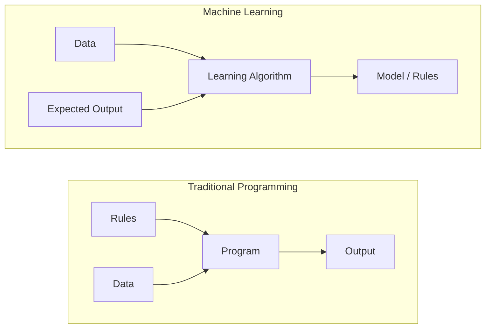
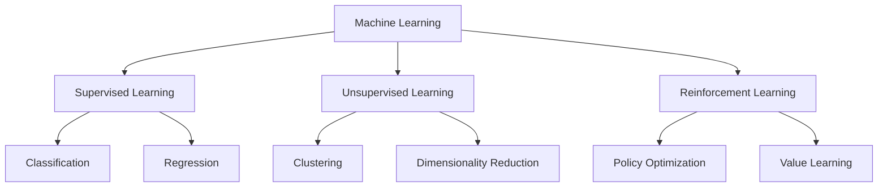
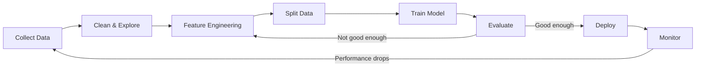
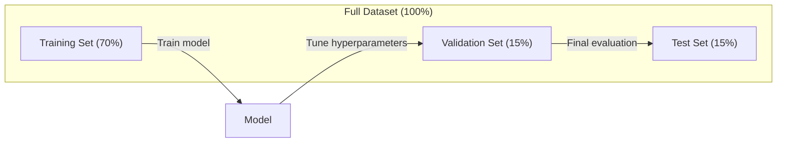
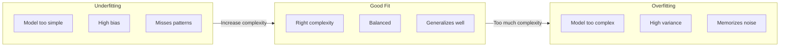
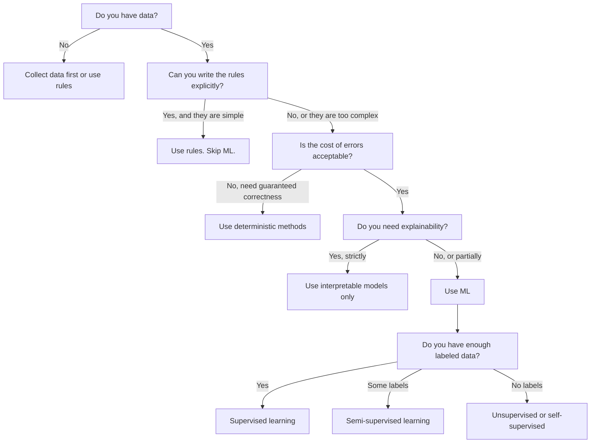

# मशीन लर्निंग क्या है
# 什么是机器学习


> मशीन लर्निंग कंप्यूटर को डेटा में पैटर्न खोजने के लिए सिखा रहा है, हाथ से नियम लिखने के बजाय।

> 机器学习 कंप्यूटर को डेटा में नियम खोजने का तरीका सिखाता है, न कि कृत्रिम लेखन नियमों पर।

**Type:** Learn | **类型：** 学习
**Languages:** Python
**Prerequisites:** Phase 1 (Math Foundations) | **前置知识：** Phase 1（数学基础）
**Time:** ~45 minutes | **时间：** 约 45 分钟

## सीखने के लक्ष्य

- पर्यवेक्षित, अनियंत्रित और सुदृढीकरण सीखने के बीच अंतर समझाएं और पहचानें कि किसी दिए गए समस्या के लिए किस प्रकार लागू होता है
  解释监督学习、无监督学习 और强化学习 के बीच अंतर, और निर्णय लें कि किस प्रकार के प्रश्नों के लिए उपयुक्त है
- शून्य से निकटतम सेंट्रोइड वर्गीकरण को लागू करें और इसे यादृच्छिक आधार रेखा के साथ मूल्यांकन करें
  0 से प्राप्त नवीनतम गुणवत्ता वर्गीकरण, और साथ आधार लाइन के साथ तुलना मूल्यांकन
- वर्गीकरण और प्रतिगमन कार्यों के बीच अंतर करें और प्रत्येक के लिए उपयुक्त हानि फ़ंक्शन का चयन करें
  区分分类和归归任务, प्रत्येक कार्य के लिए उपयुक्त हानि फ़ंक्शन का चयन करें
- यह आकलन करें कि क्या एक दी गई व्यावसायिक समस्या एमएल के लिए उपयुक्त है या निर्धारक नियमों से बेहतर हल किया गया है
   मूल्यांकन करना कि क्या एक व्यावसायिक समस्या एमएल के लिए उपयुक्त है या निश्चितता नियमों के साथ बेहतर है


> **【中文解读】**
> 机器学习是让计算机从数据中自动学习规律,而不是靠人工编写规则而设――监督学习 (监督学习) 无监督学习 (监督学习) 无监督学习 (监督学习) 强化学习 (奖励信号) 是三大范式――对应 sklearn 中的各类估计者──

> **【拓展：机器学习范式的产业应用】**
> GPT-4 उपयोग स्वयं पर्यवेक्षण सीख(预测下一个代币) में लगभग 13 बिलियन टोकन 上训练;BERT उपयोग掩码语言建模在 विकिपीडिया + BookCorpus 上预训;AlphaGo उपयोग强化学习通过自我对对超越人类围棋冠军。

## समस्या  समस्या परिचय

आप एक स्पैम फ़िल्टर बनाना चाहते हैं. पारंपरिक दृष्टिकोणः बैठो और सैकड़ों नियम लिखो. "यदि ईमेल में 'फ्री मनी' है, तो इसे स्पैम चिह्नित करें. यदि इसमें 3 से अधिक चिह्न हैं, तो इसे स्पैम चिह्नित करें। " आप नियम लिखते हुए हफ्तों बिताते हैं। फिर स्पैमर्स अपना वाक्यांश बदलते हैं। आपके नियम टूट जाते हैं। आप अधिक नियम लिखते हैं। चक्र कभी समाप्त नहीं होता है।

> आप एक कचरा मेल फ़िल्टर बनाना चाहते हैं। पारंपरिक विधि यह है कि आप बैठकर 100 नियम लिखें। "यदि मेल में 'फ्री मनी' है, तो इसे कचरा मेल के रूप में चिह्नित करें। यदि 3 से अधिक हैं, तो इसे कचरा मेल के रूप में चिह्नित करें।" आप कुछ सप्ताह के लिए नियम लिखते हैं। फिर कचरा मेल भेजने वाले ने अपनी वाक्यांश बदल दी है। आपके नियम विफल हो गए हैं। आप अधिक नियम लिखते हैं। यह चक्र अनंत है।

मशीन लर्निंग इसको उलट देता है। नियमों को लिखने के बजाय, आप कंप्यूटर को हजारों लेबल वाले ईमेल ("स्पैम" या "स्पैम नहीं") देते हैं और उसे अपने दम पर नियमों का पता लगाने देते हैं। कंप्यूटर आपको कभी नहीं सोचा होगा कि पैटर्न ढूंढता है। जब स्पैमर रणनीति बदलते हैं, तो आप कोड को फिर से लिखने के बजाय नए डेटा पर फिर से प्रशिक्षित करते हैं।

> 机器学习颠覆了这种方式──你不是编写规则,而是给计算机送数千个标记好的邮件 (("垃圾邮件"或"正常邮件"),让它自己找出规则──计算机能发现你从未想象过的模式──当垃圾邮件发送者改变策略时,你只需要在新数据上重新训练,而不是重写代码──

"प्रोग्रामिंग नियम" से "डेटा से सीखना" में यह बदलाव मशीन लर्निंग का मूल है। प्रत्येक सिफारिश इंजन, आवाज सहायक, स्व-चालक कार और भाषा मॉडल इस तरह काम करता है।

> "प्रोग्रामिंग नियम" से "डेटा से सीखने" में बदलाव मशीन सीखने का मूल है। प्रत्येक सुझाव इंजन, आवाज सहायक, स्वचालित ड्राइविंग वाहन और भाषा मॉडल इस तरह काम करते हैं।

> **【中文解读】**
> 傳統編程是"人寫規則,机器執行";机器學習是"人給資料,机器自己發現規則"──垃圾郵件過濾器 के उदाहरण के लिए: पारंपरिक विधि को हाथ से बनाए रखने और 100条規則 बनाए रखने की आवश्यकता होती है, जबकि एमएल 方法 को केवल बड़ी मात्रा में चिह्नित ईमेल प्रदान करने की आवश्यकता होती है, मॉडल स्वचालित रूप से सीखना निर्णय लेने का तरीका है── जब垃圾郵件 रणनीति बदलती है, तो केवल पुनः प्रशिक्षण की आवश्यकता होती है, न कि कोड को फिर से लिखने की बजाय।

> **【拓展：垃圾邮件过滤的演进】**
> जीमेल का कचरा मेल फ़िल्टर प्रति दिन लगभग 3 अरब फ़ोक्स को संसाधित करता है, सटीकता दर 99.9% से अधिक है।

## अवधारणा का मूल अवधारणा

### नियमों से नहीं, आंकड़ों से सीखें

पारंपरिक प्रोग्रामिंग और मशीन लर्निंग समस्याओं को विपरीत दिशा में हल करते हैं।

> 传统编程和机器学习相反方向解决问题──



पारंपरिक प्रोग्रामिंगः आप नियम लिखते हैं। प्रोग्राम उन्हें आउटपुट उत्पन्न करने के लिए डेटा पर लागू करता है।

> 傳統编程:你编寫规则──程序将规则应用于数据生成输出──

मशीन लर्निंगः आप डेटा और अपेक्षित आउटपुट प्रदान करते हैं। एल्गोरिथम नियमों की खोज करता है।

> 机器学习:你提供数据和期望输出――算法自动发现规则――

प्रशिक्षण से निकलने वाला "मॉडल" नियम है, जो संख्याओं (वजन, मापदंडों) के रूप में एन्कोड किया जाता है। यह उन उदाहरणों से सामान्यीकरण करता है जिन्हें उसने देखा है ताकि वह कभी नहीं देखे गए डेटा पर भविष्यवाणियां कर सके।

>  प्रशिक्षण से उत्पन्न "मॉडल" स्वयं नियम है, जो कि संख्यात्मक रूप से संकलित है।

> **【中文解读】**
> 传统编程与机器学习的本质区别:传统编程输入"规则+数据"得到"输出";机器学习输入"数据+期望输出"得到"模型 (规则) ⋅模型本质上是数字编码的规则 (权重和参数) का उपयोग करते हुए, यह नए डेटा पर पूर्वानुमान कर सकता है जो पहले कभी नहीं देखा गया है।

### मशीन लर्निंग के तीन प्रकार



**Supervised Learning**: आप इनपुट-आउटपुट जोड़े हैं. मॉडल इनपुट को आउटपुट में मैप करना सीखता है.
- "ये दस हजार तस्वीरें हैं, जिनमें बिल्ली या कुत्ता के नाम हैं। उन्हें अलग करना सीखिए।"
- "ये घर की विशेषताएं और कीमतें हैं। कीमत का अनुमान लगाना सीखिए।"

> **监督学习**:You have input-output对――模型学习将输入映射到输出――
> - "यहां 10,000 张 ने बिल्लियों या कुत्तों की तस्वीरें चिह्नित की हैं।
> - "यहां है घर की विशेषताएं और कीमतें.

**Unsupervised Learning**आप केवल इनपुट है. कोई लेबल नहीं. मॉडल अपने आप संरचना पाता है.
- "यहां 10,000 ग्राहक खरीद इतिहास है. प्राकृतिक समूहों को खोजें।"
- "यहाँ 1,000 आयामी डेटा बिंदु हैं. संरचना बनाए रखते हुए 2 आयामों तक कम करें। "

> **无监督学习**:आप केवल प्रविष्टि, कोई टैग नहीं है।
> - "यहां 10,000 ग्राहक खरीद रिकॉर्ड हैं।
> - "यहां 1,000 维 के डेटा बिंदु हैं। संरक्षित संरचना के साथ ही 2 维 तक घटते हैं। "

**Reinforcement Learning**: एक एजेंट एक वातावरण में कार्य करता है और पुरस्कार या दंड प्राप्त करता है। वह कुल पुरस्कार को अधिकतम करने के लिए एक रणनीति (नीति) सीखता है।
- "इस खेल को खेलो। जीत के लिए +1 और हार के लिए -1। एक रणनीति का पता लगाओ। "
- "इस रोबोट हाथ को नियंत्रित करें। वस्तु को लेने के लिए +1। हर बर्बाद सेकंड के लिए -0.01। "

> **强化学习**: पर्यावरण में कार्य करने के लिए एक बुद्धिमान व्यक्ति को पुरस्कार या दंड मिलता है।
> - "ये खेल खेलो, जीतो, हारो, हारो, खुद को रणनीति बनाओ"
> - " इस मशीन को नियंत्रित करें। "

आप अभ्यास में जो कुछ भी बनाएंगे, उसमें से अधिकांश में पर्यवेक्षित सीखने का उपयोग किया जाता है। पूर्व-प्रसंस्करण और अन्वेषण के लिए अनियंत्रित सीखने आम है। भाषा मॉडल के लिए खेल एआई, रोबोटिक्स और आरएलएचएफ को मजबूत करने वाले सीखने की शक्ति।

> अभ्यास में आप निर्माण की अधिकांश प्रणाली का उपयोग निगरानी सीखने हेतु किया जाता है।

> **【拓展：三种范式在真实系统中的分工】**
> नेटफ्लिक्स 推系统同时使用三种范式:协同过(无监督聚类用户群) 监督学习(预测用户对电影的评分 1-5 星) 强化学习(A/B 测试选择最优推策略) ;;टेस्ला ऑटोपायलट 使用监督学习(目标检测) + 强化学习(路径规划) ;; स्थिर प्रसारण का अभ्यास स्वयं पर निगरानी से संबंधित है(图像-文本对学习 CLIP) + 监督微调;;

### तीनों के परे

उपरोक्त तीन श्रेणियां साफ हैं, लेकिन वास्तविक दुनिया में एमएल अक्सर रेखाओं को धुंधला करता है।

> उपरोक्त तीन श्रेणियाँ स्पष्ट हैं, लेकिन वास्तविक दुनिया की एमएल इन सीमाओं को अक्सर अस्पष्ट करती है।

**Semi-supervised learning**लेबल वाले डेटा का एक छोटा सेट और लेबल रहित डेटा का एक बड़ा सेट है। आपके पास 100 लेबल वाले चिकित्सा चित्र और 100,000 लेबल रहित चित्र हो सकते हैं। तकनीक में शामिल हैंः

> **半监督学习**कम मात्रा में लेबल डेटा और बड़ी मात्रा में अनलेबल डेटा का उपयोग करके, आप 100 से अधिक लेबल वाली चिकित्सा छवियों और 100,000 से अधिक अनलेबल छवियों का उपयोग कर सकते हैंः

- **Label propagation:**एक ग्राफ बनाएं जो समान डेटा बिंदुओं को जोड़ता है। लेबल लेबल वाले नोड्स से लेबल रहित पड़ोसियों तक ग्राफ के माध्यम से फैलता है।
  **标签传播：**् ् ् ् ् ् ् ् ् ् ् ् ् ् ् ् ् ् ् ् ् ् ् ् ् ् ् ् ् ् ् ् ् ् ् ् ् ् ् ् ् ् ् ् ् ् ् ् ् ् ् ् ् ् ् ् ् ् ् ् ् ् ् ् ् ् ् ् ् ् ् ् ् ् ् ् ् ् ् ् ् ् ् ् ् ् ् ् ् ् ् ् ् ् ् ् ् ् ् ् ् ् ् ् ् ् ् ् ् ् ् ् ् ् ् ् ् ् ् ् ् ् ् ् ् ् ् ् ् ् ् ् ् ् ् ् ् ् ् ् ् ् ् ् ् ् ् ् ् ् ् ् ् ् ् ् ् ् ् ् ् ् ् ् ् ् ् ् ् ् ् ् ् ् ् ् ् ् ् ् ् ् ् ् ् ् ् ् ् ् ् ् ् ् ् ् ् ् ् ् ् ् ् ् ् ् ् ् ् ् ् ् ् ् ् ् ् ् ् ् ् ् ् ् ् ् ् ् ् ् ् ् ् ् ् ् ् ् ् ् ् ् ् ् ् ् ् ् ् ् ् ् ् ् ्
- **Pseudo-labeling:**लेबल किए गए डेटा पर एक मॉडल को प्रशिक्षित करें, इसका उपयोग लेबल किए बिना डेटा के लिए लेबल की भविष्यवाणी करने के लिए करें, फिर सब कुछ पर फिर से प्रशिक्षित करें। मॉडल अपने स्वयं के प्रशिक्षण सेट को बूटस्ट्रेप करता है।
  **伪标签：**मार्क डेटा पर प्रशिक्षण मॉडल, इसका उपयोग करके अप्रयुक्त डेटा के लेबल का पूर्वानुमान, फिर सभी डेटा पर पुनः प्रशिक्षण।
- **Consistency regularization:**मॉडल को इनपुट के लिए एक ही भविष्यवाणी और उस इनपुट के थोड़ा परेशान संस्करण देना चाहिए। यह लेबल के बिना भी काम करता है।
  **一致性正则化：**模型 को इनपुट और उसके हल्के विचलित संस्करणों के लिए समान पूर्वानुमान देना चाहिए।

**Self-supervised learning**डेटा की संरचना से अपना भविष्यवाणी कार्य बनाता है।

> **自监督学习**डेटा से स्वयं निर्माण निगरानी संकेतों। पूरी तरह से कोई कृत्रिम लेबल की आवश्यकता नहीं है। मॉडल डेटा के संरचना से स्वयं का पूर्वानुमान कार्य बनाने के लिए।

- **Masked language modeling (BERT):**एक वाक्य में 15% शब्दों को छिपाएं, मॉडल को याद रखने के लिए प्रशिक्षित करें। "लेबल" मूल पाठ से आते हैं।
  **掩码语言建模（BERT）：**遮盖句中 15% 的词,训练模型预测被遮盖的词──"标签"来自原始文本──
- **Contrastive learning (SimCLR):**एक छवि लें, दो वर्धित संस्करण बनाएं। मॉडल को पहचानने के लिए प्रशिक्षित करें कि वे एक ही छवि से आए हैं जबकि उन्हें अन्य छवियों के वर्धित संस्करणों से अलग करें।
  **对比学习（SimCLR）：**取一张图像,创建两个增强版本──训练模型识别它们来自同一张图像,同时与其他图像的增强版本分开──
- **Next-token prediction (GPT):**अगले शब्द की भविष्यवाणी करें, पहले के सभी शब्दों को देखते हुए। प्रत्येक पाठ दस्तावेज़ एक प्रशिक्षण उदाहरण बन जाता है।
  **下一 token 预测（GPT）：**给定前面所有词,预测下一个词―― प्रत्येक文本文档都成为训练样本――

> **【拓展：自监督学习如何驱动大模型革命】**
> जीपीटी-4 के प्रशिक्षण डेटा लगभग 13 बिलियन टोकन हैं, यदि कृत्रिम अंकन पर आधारित नहीं है तो यह बिल्कुल असंभव है।

ये तीनों बड़ी श्रेणियों से अलग नहीं हैं। ये रणनीतियाँ हैं जो पर्यवेक्षित और अनियंत्रित विचारों को जोड़ती हैं। आत्म-नियंत्रित सीखने की तकनीकी रूप से पर्यवेक्षण किया जाता है (मॉडल कुछ भविष्यवाणी करता है), लेकिन लेबल स्वचालित रूप से उत्पन्न होते हैं, न कि मनुष्यों द्वारा।

> 它们不是与三大类分离的新类别――它们是监督和无监督思想的结合策略――自监督学习在技术上属于监督学习 (अनुशासन सीखने में) ️模型预测某种东西), लेकिन 标签是自动生成的,不是人工标签的──

### वर्गीकरण बनाम प्रतिगमन

ये दो मुख्य पर्यवेक्षित सीखने के कार्य हैं।

> यह दो प्रमुख निगरानी कार्य हैं।

| Aspect | Classification | Regression |
|--------|---------------|------------|
| Output | Discrete categories | Continuous numbers |
| Example | "Is this email spam?" | "What will the house price be?" |
| Output space | {cat, dog, bird} | Any real number |
| Loss function | Cross-entropy, accuracy | Mean squared error, MAE |
| Decision | Boundaries between classes | A curve that fits the data |

| 方面 | 分类 | 回归 |
|------|------|------|
| 输出 | 离散类别 | 连续数值 |
| 示例 | "这封邮件是垃圾邮件吗？" | "房价会是多少？" |
| 输出空间 | {猫, 狗, 鸟} | 任意实数 |
| 损失函数 | 交叉熵、准确率 | 均方误差、MAE |
| 决策方式 | 类别之间的边界 | 拟合数据的曲线 |

वर्गीकरण का उत्तर है "कौन सी श्रेणी"?

> 分类回答"哪个类别?"回归回答"多少?"

कुछ समस्याओं को किसी भी तरह से ढांचा लगाया जा सकता है। यह अनुमान लगाना कि एक शेयर बढ़ता है या गिरता है वर्गीकरण है। सटीक मूल्य की भविष्यवाणी करना regression है।

> कुछ समस्याएं दो प्रकार से बन सकती हैं।

> **【中文解读】**
> विभाजन और पुनरावृत्ति अनुगमन सीखने के दो मुख्य कार्य हैं। विभाजन पूर्वानुमान विभाजन वर्ग (जैसे "垃圾邮件/正常邮件"), पुनरावृत्ति पूर्वानुमान निरंतर संख्या मूल्य (जैसे "房价 250万") । मुख्य अंतर आउटपुट अंतरिक्ष में हैः विभाजन के आउटपुट सीमित वर्गों का संग्रह है, पुनरावृत्ति के आउटपुट किसी भी वास्तविक संख्या है। चयन जो व्यवसाय की आवश्यकता पर निर्भर करता है कभी-कभी एक ही समस्या दो तरीकों से बनाई जा सकती है।

### एमएल कार्यप्रवाह

मशीन लर्निंग के हर प्रोजेक्ट में एल्गोरिथ्म की परवाह किए बिना एक ही पाइपलाइन होती है।

> प्रत्येक मशीन लर्निंग प्रोजेक्ट एक ही प्रक्रिया का पालन करता है, चाहे वह कौन सा एल्गोरिथ्म का उपयोग करता हो।



**Collect Data**: कच्चे डेटा एकत्र करें। अधिक डेटा लगभग हमेशा बेहतर होता है, लेकिन गुणवत्ता मात्रा से अधिक मायने रखती है।

> **收集数据**: मूल डेटा प्राप्त करना। अधिक डेटा लगभग हमेशा बेहतर होता है, लेकिन मात्रा से गुणवत्ता अधिक महत्वपूर्ण है।

**Clean & Explore**: गायब मानों को संभालें, डुप्लिकेट हटाएं, वितरण को दृश्यमान करें, विसंगतियों को स्पॉट करें। इस चरण में अक्सर परियोजना के कुल समय का 60-80% समय लगता है।

> **清洗与探索**: अनुपस्थिति को संसाधित करना, पुनःपूर्ति को हटाना, दृश्यता को वितरित करना, असामान्यताएँ खोजना। यह चरण आमतौर पर परियोजना के कुल समय का 60-80% हिस्सा लेता है।

**Feature Engineering**: कच्चे डेटा को सुविधाओं में बदल दें जो मॉडल उपयोग कर सकता है। दिनांक को सप्ताह के दिन में बदल दें। संख्यात्मक स्तंभों को सामान्य बनाएं। श्रेणीगत चर को एन्कोड करें। अच्छी सुविधाएं फैंसी एल्गोरिदम से अधिक मायने रखती हैं।

> **特征工程**: मूल डेटा को मॉडल के लिए उपयोग करने योग्य विशेषताओं में परिवर्तित करेगा।

**Split Data**: प्रशिक्षण, सत्यापन और परीक्षण सेट में विभाजित करें। मॉडल प्रशिक्षण डेटा पर प्रशिक्षित करता है, आप सत्यापन डेटा पर हाइपरपैरामीटर समायोजित करते हैं, और आप परीक्षण डेटा पर अंतिम प्रदर्शन की रिपोर्ट करते हैं।

> **划分数据**: प्रशिक्षण के लिए विभाजित ✓ परीक्षण के लिए विभाजित ✓ परीक्षण के लिए विभाजित ✓ परीक्षण के लिए विभाजित ✓ अभ्यास के लिए मॉडल पर अध्ययन करें, परीक्षण के लिए डेटा पर सुपर पैरामीटर को समायोजित करें, परीक्षण के लिए डेटा पर रिपोर्ट करें अंतिम प्रदर्शन ✓

**Train Model**: एक एल्गोरिथ्म में प्रशिक्षण डेटा फ़ीड करें। एल्गोरिथ्म नुकसान समारोह को कम करने के लिए आंतरिक मापदंडों को समायोजित करता है।

> **训练模型**:将训练数据输入算法――算法调整内部参数以最小化损失函数――

**Evaluate**: सत्यापन/परीक्षण डेटा पर प्रदर्शन मापें। यदि प्रदर्शन स्वीकार्य नहीं है, तो वापस जाएं और विभिन्न सुविधाओं, एल्गोरिदम या हाइपरपरपैरामीटर का परीक्षण करें।

> **评估**: परीक्षण/परीक्षण डेटा पर माप प्रदर्शन। यदि प्रदर्शन अस्वीकार्य है, तो विभिन्न विशेषताओं, एल्गोरिदम या सुपरपरमानुओं का पुनः प्रयास करें।

**Deploy**: मॉडल को उत्पादन में लाएं जहां यह नए डेटा पर भविष्यवाणियां करता है।

> **部署**: मॉडल उत्पादन वातावरण में डाला जाएगा, नए डेटा पर पूर्वानुमान किया जाएगा।

**Monitor**: समय के साथ प्रदर्शन का ट्रैक करें। डेटा वितरण बदलते हैं (डेटा ड्रिफ्ट), और मॉडल गिरावट। जब प्रदर्शन गिरता है, तो फिर से प्रशिक्षित करें।

> **监控**: समय के साथ प्रदर्शन का पता लगाने, डेटा वितरण में परिवर्तन, मॉडल में गिरावट, पुनः प्रशिक्षण

### प्रशिक्षण, सत्यापन और परीक्षाएं

यह सबसे महत्वपूर्ण अवधारणा है जो शुरुआती गलत हो जाते हैं। आपको अपने मॉडल का मूल्यांकन प्रशिक्षण के दौरान कभी नहीं देखे गए डेटा पर करना होगा। अन्यथा आप सीखने के बजाय याद रखने का माप कर रहे हैं।

> यह शुरुआती लोगों के लिए सबसे आसान गलती करने का सबसे महत्वपूर्ण अवधारणा है। आपको प्रशिक्षण के दौरान कभी नहीं देखे गए डेटा पर मॉडल का मूल्यांकन करना होगा। अन्यथा आप सीखने की क्षमता की तुलना में स्मृति क्षमता का माप करते हैं।



| Split | Purpose | When used | Typical size |
|-------|---------|-----------|-------------|
| Training | Model learns from this data | During training | 60-80% |
| Validation | Tune hyperparameters, compare models | After each training run | 10-20% |
| Test | Final unbiased performance estimate | Once, at the very end | 10-20% |

| 划分 | 用途 | 使用时机 | 典型比例 |
|------|------|---------|---------|
| 训练集 | 模型从中学习 | 训练期间 | 60-80% |
| 验证集 | 调节超参数，比较模型 | 每次训练后 | 10-20% |
| 测试集 | 最终无偏性能估计 | 最后仅使用一次 | 10-20% |

परीक्षण सेट पवित्र है. आप इसे एक बार ही देखते हैं। यदि आप परीक्षण प्रदर्शन के आधार पर अपने मॉडल को समायोजित करते रहते हैं, तो आप परीक्षण सेट पर प्रभावी ढंग से प्रशिक्षण कर रहे हैं और आपके रिपोर्ट किए गए संख्याएं अर्थहीन हैं।

> 测试集是神圣的──你只能一次查看它── यदि आप लगातार परीक्षण प्रदर्शन समायोजन मॉडल के आधार पर अभ्यास कर रहे हैं, तो आपकी रिपोर्ट का कोई अर्थ नहीं है──

> **【中文解读】**
> डेटा विभाजन ML में सबसे आसान गलतियों में से एक है। प्रशिक्षण सेट के लिए सीखने के पैरामीटर, परीक्षण सेट के लिए अनुक्रमणिक पैरामीटर और चयन मॉडल, परीक्षण सेट केवल अंतिम मूल्यांकन के लिए उपयोग किया जाता है। यदि परीक्षण सेट पर अनुक्रमणिक दोहराया जाता है, तो मॉडल प्रदर्शन का मूल्यांकन पूरी तरह से विफल हो जाता है।

छोटे डेटासेट के लिए, k-fold क्रॉस-वैलिडेशन का उपयोग करेंः डेटा को k भागों में विभाजित करें, k-1 भागों पर प्रशिक्षित करें, शेष भाग पर वैलिडेट करें, घूमें, और औसत परिणाम।

>  लघु डेटा सेट के लिए, प्रयोग करें k 折交叉验证:将数据分成 k 份,在 k-1 份训练,在剩余一份上验证,轮换并取平均──

### अति-अनुकूलन बनाम अति-अनुकूलन



**Underfitting**: मॉडल डेटा में पैटर्न को कैप्चर करने के लिए बहुत सरल है। एक सीधी रेखा एक घुमावदार संबंध फिट करने की कोशिश कर रही है। प्रशिक्षण त्रुटि उच्च है। परीक्षण त्रुटि उच्च है।

> **欠拟合**मॉडल बहुत सरल है, डेटा में मॉडल को पकड़ने में असमर्थ है।

**Overfitting**: मॉडल बहुत जटिल है और प्रशिक्षण डेटा को याद करता है, जिसमें इसकी शोर भी शामिल है। एक घुमावदार वक्र जो प्रत्येक प्रशिक्षण बिंदु से गुजरता है लेकिन नए डेटा पर विफल रहता है। प्रशिक्षण त्रुटि कम है। परीक्षण त्रुटि उच्च है।

> **过拟合**: मॉडल बहुत जटिल है, प्रशिक्षण डेटा में शोर को याद रखें। प्रत्येक प्रशिक्षण बिंदु के पार एक आंदोलन कर्षण, लेकिन नए डेटा पर प्रदर्शन बहुत खराब है।

**Good fit**: मॉडल शोर को याद किए बिना वास्तविक पैटर्न को कैप्चर करता है। प्रशिक्षण त्रुटि और परीक्षण त्रुटि दोनों काफी कम हैं।

> **良好拟合**: मॉडल ने वास्तविक मोड को पकड़ लिया है और शोर को याद नहीं किया है।

> **【中文解读】**
> 欠拟合 = 模型太简单,连训练数据中的规律都没学到;过拟合 = 模型太复杂,把训练数据中的噪音都记得,遇到新数据就就"露"――训练集和测试集中的好模型都表现良好――判断标准: यदि प्रशिक्षण सटीकता दर सत्यापन सटीकता दर से कहीं अधिक है, तो यह अति拟合 का विशिष्ट संकेत है――

अति-फिटिंग के संकेतः
- प्रशिक्षण सटीकता सत्यापन सटीकता से बहुत अधिक है
  प्रशिक्षण सटीकता दर सत्यापन सटीकता से अधिक है
- प्रशिक्षण डेटा पर मॉडल अच्छा प्रदर्शन करता है लेकिन नए डेटा पर खराब
  模型 प्रशिक्षण डेटा पर अच्छा प्रदर्शन करता है लेकिन नए डेटा पर खराब प्रदर्शन करता है
- अधिक प्रशिक्षण डेटा जोड़ने से प्रदर्शन में सुधार होता है (मॉडल याद करने वाला था, सीखने वाला नहीं)
  增加训练数据能提升性能 (अनुमानित मॉडल से पहले स्मृति है, न कि सीखने)

> 过拟合的迹象:

ओवरफिटिंग के लिए फिक्सः
- अधिक प्रशिक्षण डेटा प्राप्त करें
  Get more training डेटा
- मॉडल जटिलता को कम करना (कम पैरामीटर, सरल वास्तुकला)
  降低模型复杂度(更少参数、更简单的架构)
- नियमन (बड़े वजन के लिए दंड जोड़ें)
  正则化 (अधिकृत दंड)
- ड्रॉपअप (प्रशिक्षण के दौरान यादृच्छिक रूप से न्यूरॉन्स को शून्य)
  ड्रॉपअप (शिक्षा समय随机将神经元置零)
- प्रारंभिक रोक (जब सत्यापन त्रुटि बढ़ना शुरू हो जाती है तो प्रशिक्षण रोकना)
  早停 (जब सत्यापन त्रुटि बढ़ना शुरू होता है तब प्रशिक्षण बंद होता है)

> 过拟合的修复方法:

अनावश्यक फिटिंग के लिए फिक्सः
- अधिक जटिल मॉडल का उपयोग करें
  अधिक जटिल मॉडल का उपयोग करें
- अतिरिक्त सुविधाएँ जोड़ें
  添加更多 विशेषताएं
- नियमितता को कम करें
   减少正则化
- ट्रेन अधिक समय तक
  训练更长时间

> 欠拟合的修复方法:

### भेदभाव के बीच व्यापार

यह अति-फिटिंग और अंडरफिटिंग के पीछे का गणितीय ढांचा है।

> यह एक गणितीय ढांचा है जो अनुचित और अनुचित के पीछे है।

**Bias**: मॉडल में गलत धारणाओं से त्रुटि। एक रैखिक मॉडल में उच्च पूर्वाग्रह होता है जब वास्तविक संबंध गैर रैखिक होता है। उच्च पूर्वाग्रह अनुचितता का कारण बनता है।

> **偏差**: मॉडल गलत धारणा से गलतफहमी से उत्पन्न होते हैं।

**Variance**: प्रशिक्षण डेटा में संवेदनशीलता से लेकर छोटे उतार-चढ़ाव तक की त्रुटि। उच्च भिन्नता वाले मॉडल विभिन्न डेटा उपसमूहों पर प्रशिक्षित होने पर बहुत अलग भविष्यवाणियां देते हैं। उच्च भिन्नता से ओवरफिटिंग होती है।

> **方差**प्रशिक्षण डेटा से लघु-तर्रण संवेदनशील त्रुटियों से प्राप्तः उच्चतर अंतर मॉडल विभिन्न डेटा सेट पर प्रशिक्षण के दौरान बहुत अलग पूर्वानुमान देते हैं।

| Model complexity | Bias | Variance | Result |
|-----------------|------|----------|--------|
| Too low (linear model for curved data) | High | Low | Underfitting |
| Just right | Medium | Medium | Good generalization |
| Too high (degree-20 polynomial for 10 points) | Low | High | Overfitting |

| 模型复杂度 | 偏差 | 方差 | 结果 |
|-----------|------|------|------|
| 太低（用线性模型拟合弯曲数据） | 高 | 低 | 欠拟合 |
| 恰好 | 中 | 中 | 良好泛化 |
| 太高（10 个点用 20 次多项式） | 低 | 高 | 过拟合 |

कुल त्रुटि = पूर्वाग्रह^2 + भिन्नता + अपरिवर्तनीय शोर

> 总误差 = 偏差^2 + 方差 + अपरिहार्य शोर

आप अपरिवर्तनीय शोर को कम नहीं कर सकते (यह स्वयं डेटा में यादृच्छिकता है) आप उस मीठा बिंदु को ढूंढना चाहते हैं जहां पूर्वाग्रह^2 + भिन्नता को न्यूनतम किया जाता है।

> आप असंगत शोर को कम नहीं कर सकते हैं। यह डेटा की स्वयं की सहजता है। आप अंतर को कम करने के लिए सबसे अच्छा बिंदु ढूंढना चाहते हैं।

### कोई मुफ्त दोपहर का भोजन सिद्धांत नहीं

कोई भी एल्गोरिथ्म नहीं है जो हर समस्या के लिए सबसे अच्छा काम करता है। एक एल्गोरिथ्म जो किसी एक वर्ग की समस्याओं पर अच्छा प्रदर्शन करता है, वह दूसरे पर खराब प्रदर्शन करेगा। यही कारण है कि डेटा वैज्ञानिक कई एल्गोरिदम का परीक्षण करते हैं और परिणामों की तुलना करते हैं।

>  कोई एकल एल्गोरिथ्म सभी समस्याओं पर सबसे अच्छा प्रदर्शन नहीं कर सकता है  एक श्रेणी में अच्छे एल्गोरिथ्म दूसरे श्रेणी में खराब प्रदर्शन करते हैं  यही कारण है कि डेटा वैज्ञानिक कई प्रकार के एल्गोरिथ्म का प्रयोग करते हैं और परिणामों की तुलना करते हैं

> **【拓展：没有免费午餐定理的实践意义】**
> इस सिद्धांत से हमें पता चलता हैः Kaggle 竞赛冠军 लगभग एक एल्गोरिथ्म के साथ नहीं, बल्कि एक एकीकृत विधि के साथ है।

व्यवहार में, विकल्प इस पर निर्भर करता हैः
- आपके पास कितने डेटा हैं
  आप कितना डेटा है
- कितने विशेषताएं हैं
  कई विशेषताएं हैं
- संबंध रैखिक या गैर रैखिक है या नहीं
  संबंध है या तो रैखिक या गैर रैखिक
- क्या आपको व्याख्या की आवश्यकता है
  क्या इसकी व्याख्या की आवश्यकता है
- आप कितना कम्प्यूटिंग कर सकते हैं
  आप कितना गणना लागत वहन कर सकते हैं

> अभ्यास में, चयन निर्भर करता हैः

### मशीन लर्निंग का उपयोग कब नहीं करना चाहिए

एमएल शक्तिशाली है लेकिन हमेशा सही उपकरण नहीं होता है। मॉडल की तलाश करने से पहले पूछें कि क्या आपको वास्तव में इसकी आवश्यकता है।

> एमएल बहुत शक्तिशाली है, लेकिन हमेशा सही उपकरण नहीं है।

**Do not use ML when:**

> **以下情况不要使用 ML：**

- **Rules are simple and well-defined.**कर गणना, क्रमबद्ध एल्गोरिदम, इकाई रूपांतरण. यदि आप तर्क को कुछ if-statements में लिख सकते हैं, तो एक मॉडल किसी लाभ के लिए जटिलता जोड़ता है।
  **规则简单且明确。**税费计算、排序算法、单位转换―― यदि आप कुछ प्रयोग कर सकते हैं तो 语句写完逻辑, मॉडल केवल जटिलता बढ़ाएगा और कोई लाभ नहीं होगा――
- **You have no data or very little data.**एमएल को सीखने के लिए उदाहरण चाहिए। 10 डेटा पॉइंट्स के साथ, आप कुछ भी सार्थक नहीं प्रशिक्षित कर सकते। पहले डेटा एकत्र करें।
  **没有数据或数据极少。**ML 需要从样本中学习──只有10数据点,你不能训练任何有意义的东西──先收集数据──
- **The cost of being wrong is catastrophic and you need guaranteed correctness.**मेडिकल डोजिंग कैलकुलेशन, न्यूक्लियर रिएक्टर कंट्रोल, क्रिप्टोग्राफिक वेरिफिकेशन. एमएल मॉडल संभावनावादी हैं. वे कभी-कभी गलत होंगे। यदि "कभी-कभी गलत" अस्वीकार्य है, तो निर्धारात्मक तरीकों का उपयोग करें।
  **错误的代价是灾难性的且需要保证正确性。** चिकित्सा खुराक गणना 核反应堆控制 密码学验证 ML 模型 概率性, वे कभी कभी गलत निकलते हैं  यदि "कभी कभी गलत निकलते हैं" अस्वीकार्य है, तो निश्चितता विधि का उपयोग करें
- **A lookup table or heuristic solves the problem.**यदि एक सरल सीमा या तालिका 99% मामलों को कवर करती है, तो एमएल जोड़ने से रखरखाव लागत में कोई सार्थक सुधार नहीं होता है।
  **查找表或启发式规则就能解决问题。**यदि साधारण मूल्य या आकृति 99% की स्थिति को कवर कर सके तो अतिरिक्त एमएल केवल रखरखाव लागत में वृद्धि करेगा और कोई भौतिक सुधार नहीं होगा।
- **You cannot explain the decision and explainability is required.**नियामक उद्योग (ऋण, बीमा, आपराधिक न्याय) कभी-कभी प्रत्येक निर्णय को पूरी तरह से समझा जा सकता है की आवश्यकता होती है। कुछ एमएल मॉडल व्याख्या योग्य हैं (रेखीय regression, छोटे निर्णय पेड़) । अधिकांश नहीं हैं।
  **无法解释决策但需要可解释性。**⇒ ⇒ ⇒ ⇒ ⇒ ⇒ ⇒ ⇒ ⇒ ⇒ ⇒ ⇒ ⇒ ⇒ ⇒ ⇒ ⇒ ⇒ ⇒ ⇒ ⇒ ⇒ ⇒ ⇒ ⇒ ⇒ ⇒ ⇒ ⇒ ⇒ ⇒ ⇒ ⇒ ⇒ ⇒ ⇒ ⇒ ⇒ ⇒ ⇒ ⇒ ⇒ ⇒ ⇒ ⇒ ⇒ ⇒ ⇒ ⇒ ⇒ ⇒ ⇒ ⇒ ⇒ ⇒ ⇒ ⇒ ⇒ ⇒ ⇒ ⇒ ⇒ ⇒ ⇒ ⇒ ⇒ ⇒ ⇒ ⇒ ⇒ ⇒ ⇒ ⇒ ⇒ ⇒ ⇒ ⇒ ⇒ ⇒ ⇒ ⇒ ⇒ ⇒ ⇒ ⇒ ⇒ ⇒ ⇒ ⇒ ⇒ ⇒ ⇒ ⇒ ⇒ ⇒ ⇒ ⇒ ⇒ ⇒ ⇒ ⇒ ⇒ ⇒ ⇒ ⇒ ⇒ ⇒ ⇒ ⇒ ⇒ ⇒ ⇒ ⇒ ⇒ ⇒ ⇒ ⇒ ⇒ ⇒ ⇒ ⇒ ⇒ ⇒ ⇒ ⇒ ⇒ ⇒ ⇒ ⇒ ⇒ ⇒ ⇒ ⇒ ⇒ ⇒ ⇒ ⇒ ⇒ ⇒ ⇒ ⇒ ⇒ ⇒ ⇒ ⇒ ⇒ ⇒ ⇒ ⇒ ⇒ ⇒ ⇒ ⇒ ⇒ ⇒ ⇒ ⇒ ⇒ ⇒ ⇒ ⇒ ⇒ ⇒ ⇒ ⇒ ⇒ ⇒ ⇒ ⇒ ⇒ ⇒ ⇒ ⇒                                                                                                                                                                    
- **The problem changes faster than you can retrain.**यदि नियम रोज बदलते हैं और फिर से प्रशिक्षण एक सप्ताह लेता है, तो मॉडल हमेशा पुराना होता है।
  **问题变化的速度快于重训练速度。**यदि नियम प्रतिदिन बदलते हैं और पुनः प्रशिक्षण एक सप्ताह की आवश्यकता होती है, तो मॉडल हमेशा पुराना होता है।

इस निर्णय प्रवाह सारणी का उपयोग करें:

> निम्नलिखित निर्णय प्रक्रिया का उपयोग करेंः



## इसे बनाओ, इसे पूरा करो।
```figure
f3-learning-boundary
```

## इसे बनाओ

कोड में `code/ml_intro.py`यह सबसे सरल संभव एमएल एल्गोरिथ्म, शून्य से निकटतम सेंट्रोइड वर्गीकरण को लागू करता है। यह मूल विचार को प्रदर्शित करता हैः डेटा से सीखें, फिर नए डेटा पर भविष्यवाणी करें।

> `code/ml_intro.py`मध्य कोड ने शून्य से हालिया क्वांटिटी वर्गीकरण यंत्र को प्राप्त किया, यह सबसे सरल एमएल एल्गोरिथ्म है। यह परमाणु मनोविज्ञान का प्रदर्शन करता हैः डेटा से सीखना, फिर नए डेटा का पूर्वानुमान करना।

> **【中文解读】**
> हालिया गुणवत्ता वर्गीकरण सबसे सरल एमएल एल्गोरिथ्म हैः प्रशिक्षण के दौरान गणना प्रत्येक श्रेणी के केंद्र बिंदुओं के लिए औसत मूल्य), पूर्वानुमान के दौरान नए नमूने को निकटतम केंद्रों को वितरित किया जाएगा। हालांकि सरल, लेकिन यह पूरी तरह से एमएल के मूल प्रक्रम को प्रदर्शित करता हैः डेटा से सीखने से फिट होना।

### चरण 1: स्क्रैच से निकटतम सेंट्रॉइड वर्गीकरणकर्ता

निकटतम केंद्रस्थ वर्गीकरणकर्ता प्रशिक्षण डेटा में प्रत्येक वर्ग के केंद्र (औसत) की गणना करता है। भविष्यवाणी करने के लिए, यह प्रत्येक नए बिंदु को उस वर्ग को सौंपता है जिसका केंद्र सबसे करीब है।

> हालिया गुणवत्ता वर्गीकरण गणना प्रशिक्षण डेटा में प्रत्येक श्रेणी के केंद्रों में औसत मूल्य) 

```python
class NearestCentroid:
    def fit(self, X, y):
        self.classes = np.unique(y)  # 获取所有唯一类别标签
        self.centroids = np.array([
            X[y == c].mean(axis=0) for c in self.classes  # 计算每个类别的质心（均值向量）
        ])

    def predict(self, X):
        distances = np.array([
            np.sqrt(((X - c) ** 2).sum(axis=1))  # 计算每个样本到各质心的欧氏距离
            for c in self.centroids
        ])
        return self.classes[distances.argmin(axis=0)]  # 返回距离最近的质心对应的类别
```

यह पूरी एल्गोरिथ्म है। फिट दो साधनों की गणना करता है। भविष्यवाणी दूरी की गणना करती है। कोई ग्रेडिएंट गिरावट, कोई पुनरावृत्ति, कोई हाइपरपरपैरामीटर नहीं।

> यही पूरी एल्गोरिथ्म है। यह दो औसत मानों का अनुमान है।

### चरण 2: संश्लेषण संबंधी डेटा को प्रशिक्षित करें

हम दो वर्गों के साथ एक 2D वर्गीकरण डेटासेट उत्पन्न करते हैं जो थोड़ा ओवरलैप करते हैं। सेंट्रॉइड वर्गीकरण वर्ग केंद्रों के बीच एक रैखिक निर्णय सीमा खींचता है।

> हम दो श्रेणियों के बीच एक दो आयामी वर्गीकरण डेटा संग्रह उत्पन्न करते हैं।

```python
rng = np.random.RandomState(42)  # 设置随机种子以保证可复现
X_class0 = rng.randn(100, 2) + np.array([1.0, 1.0])  # 类别 0 的数据：中心在 (1,1) 附近
X_class1 = rng.randn(100, 2) + np.array([-1.0, -1.0])  # 类别 1 的数据：中心在 (-1,-1) 附近
X = np.vstack([X_class0, X_class1])  # 合并所有特征数据
y = np.array([0] * 100 + [1] * 100)  # 创建对应的标签数组
```

### चरण 3: मूल रेखा से तुलना करें

प्रत्येक एमएल मॉडल की तुलना एक तुच्छ आधार रेखा के साथ की जानी चाहिए। यहां, आधार रेखा एक यादृच्छिक वर्ग की भविष्यवाणी करती है। यदि आपका एमएल मॉडल यादृच्छिक अनुमानों को नहीं हराता है, तो कुछ गलत है।

> प्रत्येक एमएल मॉडल को एक साधारण आधार रेखा के साथ तुलना की जानी चाहिए। यहाँ की आधार रेखा अनुमानित प्रकार है। यदि आपका एमएल मॉडल आधारभूत अनुमानित है, तो समस्याएं हैं।

```python
baseline_preds = rng.choice([0, 1], size=len(y_test))  # 随机猜测作为基线
baseline_acc = np.mean(baseline_preds == y_test)  # 计算基线准确率
```

इस स्वच्छ डेटासेट पर सेंट्रोइड वर्गीकरणकर्ता को लगभग 90%+ सटीकता प्राप्त करनी चाहिए। यादृच्छिक आधार रेखा लगभग 50% है।

> इस शुद्ध डेटासेट में गुणवत्ता वर्गीकरण उपकरण लगभग 90%+ की सटीकता दर तक पहुंच सकता है।

### यह क्यों मायने रखता है

निकटतम सेंट्रॉइड वर्गीकरण सरल है। इसमें कोई हाइपरपैरामीटर, कोई पुनरावृत्ति, कोई ग्रेडिएंट गिरावट नहीं है। फिर भी यह मौलिक एमएल पैटर्न को कैप्चर करता हैः

> हालिया गुणवत्ता में यह बहुत सरल है। इसमें कोई सुपर पैरामीटर नहीं है, कोई 代 नहीं है, कोई तरंग नहीं है।

1. **Learn**प्रशिक्षण डेटा से एक प्रतिनिधित्व (सेंट्रोइड)
   **学习**训练数据的表示(质心)
2. **Predict**उस प्रतिनिधित्व का उपयोग करके नए डेटा पर (नज़दीकी दूरी)
   उपयोग करना है नए डेटा को प्रदर्शित करने के लिए**预测**(अभी से दूर)
3. **Evaluate**मूल रेखा के मुकाबले (क्योंकि आकस्मिक अनुमान)
   के साथ-साथ अनुमान लगाने के लिए**评估**

लॉजिस्टिक रेग्रिशन से लेकर ट्रांसफार्मर तक हर एमएल एल्गोरिदम इसी तीन चरणों के पैटर्न का पालन करता है। प्रतिनिधित्व अधिक जटिल हो जाता है, लेकिन वर्कफ़्लो समान रहता है।

> तर्क से लौटकर ट्रांसफार्मर तक, प्रत्येक एमएल एल्गोरिथ्म एक ही तीन चरण मोड का पालन करता है।

### चरण 4: सेंट्रोइड वर्गीकरणकर्ता क्या नहीं कर सकता

निकटतम सेंट्रॉइड वर्गीकरण प्रत्येक वर्ग को एक एकल ब्लाब बनाता है। यह रैखिक निर्णय सीमाएं बनाता है। यह विफल रहता है जबः

> हालिया गुणवत्ता वर्गीकरण परिकल्पना प्रत्येक वर्ग एक एकल समूह के ब्लॉक का गठन करती है। यह निर्णय लेने की सीमाओं को रेखांकित करती है। निम्नलिखित परिस्थितियों में यह विफल हो जाएगाः

- कक्षाओं में कई क्लस्टर होते हैं (जैसे, अंक "1" को कई अलग-अलग तरीकों से लिखा जा सकता है)
  类别有多个 (उदाहरण के लिए, संख्या "1" में कई प्रकार के लेखन विधि हो सकती है)
- निर्णय सीमा गैर रैखिक है (जैसे, एक वर्ग दूसरे के चारों ओर लपेटता है)
  决策边界非线性 (उदाहरण के लिए, एक श्रेणी दूसरे श्रेणी के आसपास)
- विशेषताओं के बहुत अलग पैमाने होते हैं (अंतर सबसे बड़े पैमाने पर विशेषता द्वारा हावी होता है)
  विशेषता मात्रा में अंतर बहुत बड़ा है (अधिकतम मात्रा में विशेषता से दूर)

इन सीमाओं से आप सीखेंगे कि हर अन्य एल्गोरिथ्म को प्रेरित करता है। K-अन्यतम पड़ोसी कई क्लस्टरों को संभालते हैं। निर्णय के पेड़ गैर-रैखिक सीमाओं को संभालते हैं। फीचर स्केलिंग पैमाने की समस्या को ठीक करता है। प्रत्येक पाठ पिछले एक की सीमाओं पर आधारित है।

> इन सीमाओं ने आपके द्वारा सीखे जाने वाले प्रत्येक अन्य एल्गोरिदम को बढ़ावा दिया है।

## इसे फ्रेमवर्क के साथ लागू करें

sklearn प्रदान करता है `NearestCentroid`और सिंथेटिक डेटा जनरेटरः

> दुकान  प्रदान `NearestCentroid`और संश्लेषित डेटा जनरेटरः

```python
from sklearn.neighbors import NearestCentroid
from sklearn.datasets import make_classification
from sklearn.model_selection import train_test_split

# 生成 500 个样本、2 个特征的合成分类数据集
X, y = make_classification(
    n_samples=500, n_features=2, n_redundant=0,
    n_clusters_per_class=1, random_state=42
)
# 按 70/30 比例划分训练集和测试集
X_train, X_test, y_train, y_test = train_test_split(X, y, test_size=0.3)

# 创建最近质心分类器并训练
clf = NearestCentroid()
clf.fit(X_train, y_train)
# 在测试集上评估准确率
print(f"Accuracy: {clf.score(X_test, y_test):.3f}")
```

## इसे भेजें उत्पाद

यह सबक हमें फल देता है`outputs/prompt-ml-problem-framer.md`-- एक संकेत जो अस्पष्ट व्यावसायिक समस्याओं को ठोस एमएल कार्यों में बदल देता है। समस्या का वर्णन ("हम चर्न को कम करना चाहते हैं" या "अगली तिमाही के लिए मांग की भविष्यवाणी करें") दें और यह सीखने के प्रकार की पहचान करता है, भविष्यवाणी लक्ष्य को परिभाषित करता है, उम्मीदवार विशेषताओं की सूची देता है, एक सफलता मीट्रिक चुनता है, एक आधार रेखा स्थापित करता है, और डेटा लीक या वर्ग असंतुलन जैसे जाल को चिह्नित करता है। इसे किसी भी एमएल परियोजना की शुरुआत में इस्तेमाल करें गलत चीज बनाने से बचने के लिए।

> 本课产 出 `outputs/prompt-ml-problem-framer.md` एक अस्पष्ट व्यवसाय समस्या को विशिष्ट ML 任务 के टिप्स शब्द में परिवर्तित करना  इसे एक समस्या विवरण देना  "हम चाहते हैं कि ग्राहक流失 को कम किया जाए" या "अनुमानित अगली तिमाही की आवश्यकता"), यह सीखने के प्रकार की पहचान करेगा  भविष्यवाणी लक्ष्य परिभाषित करेगा  उम्मीदवार लक्षण सूचीबद्ध करेगा  सफलता के संकेतकों का चयन करेगा  आधार रेखा स्थापित करेगा, और डेटा रिसाव या श्रेणी असंतुलन आदि की पहचान करेगा  किसी भी ML  परियोजना की शुरुआत में इसका उपयोग करते समय, गलत चीजों का निर्माण करने से बचें 

## कीवर्ड्स  शब्द खोज तालिका

| Term | What people say | What it actually means |
|------|----------------|----------------------|
| Model | "The AI" | A mathematical function with learnable parameters that maps inputs to outputs |
| Training | "Teaching the AI" | Running an optimization algorithm to adjust model parameters so predictions match known outputs |
| Feature | "An input column" | A measurable property of the data that the model uses to make predictions |
| Label | "The answer" | The known output for a training example, used to compute the error signal |
| Hyperparameter | "A setting you tweak" | A parameter set before training that controls the learning process (learning rate, number of layers) |
| Loss function | "How wrong the model is" | A function that measures the gap between predicted and actual outputs, which training tries to minimize |
| Overfitting | "It memorized the test" | The model learned training-specific noise instead of general patterns, so it fails on new data |
| Underfitting | "It didn't learn anything" | The model is too simple to capture the real patterns in the data |
| Generalization | "It works on new data" | The model's ability to make accurate predictions on data it was not trained on |
| Cross-validation | "Testing on different chunks" | Repeatedly splitting data into train/test folds and averaging results, giving a more robust performance estimate |
| Regularization | "Keeping weights small" | Adding a penalty term to the loss function that discourages overly complex models |
| Data drift | "The world changed" | The statistical distribution of incoming data shifts over time, debegrading model performance |

| 术语 | 俗称 | 实际含义 |
|------|------|---------|
| Model / 模型 | "AI" | 一个具有可学习参数的数学函数，将输入映射到输出 |
| Training / 训练 | "教 AI" | 运行优化算法调整模型参数，使预测匹配已知输出 |
| Feature / 特征 | "输入列" | 数据中模型用于做预测的可测量属性 |
| Label / 标签 | "答案" | 训练样本的已知输出，用于计算误差信号 |
| Hyperparameter / 超参数 | "你调的设置" | 训练前设置的参数，控制学习过程（学习率、层数） |
| Loss function / 损失函数 | "模型有多错" | 衡量预测与实际输出差距的函数，训练试图最小化它 |
| Overfitting / 过拟合 | "它记住了测试集" | 模型学习了训练数据的噪声而非通用模式，在新数据上失效 |
| Underfitting / 欠拟合 | "它什么都没学到" | 模型太简单，无法捕捉数据中的真实模式 |
| Generalization / 泛化 | "在新数据上有效" | 模型对未训练数据做出准确预测的能力 |
| Cross-validation / 交叉验证 | "在不同块上测试" | 反复将数据划分为训练/测试折并平均结果，给出更稳健的性能估计 |
| Regularization / 正则化 | "保持权重小" | 在损失函数中添加惩罚项，阻止过于复杂的模型 |
| Data drift / 数据漂移 | "世界变了" | 输入数据的统计分布随时间变化，导致模型性能下降 |

## अभ्यास विषय

1. किसी भी डेटासेट (जैसे, आईरिस, टाइटैनिक) को लें। इसे 70/15/15 को ट्रेन/मान्यीकरण/परीक्षण में विभाजित करें। यह समझाएं कि आपको परीक्षण सेट पर हाइपरपरपैरामीटर क्यों नहीं समायोजित करना चाहिए।
   1. 取任意数据集(如 Iris、Titanic) 〜按 70/15/15 划分为训练/验证/测试集──解释为什么不应在测试集上调节超参数──
2. वास्तविक दुनिया की तीन समस्याओं का नाम लिखिए। प्रत्येक के लिए, पहचानें कि क्या यह वर्गीकरण, प्रतिगमन या समूहबद्धता है, और क्या यह पर्यवेक्षित है या अनियंत्रित।
   2. 列出三个现实世界问题―― प्रत्येक प्रश्न पर, यह निर्णय लें कि यह वर्गीकरण है, पुनरावृत्ति है या संवर्धन, तथा यह भी कि निगरानी सीखने या बिना निगरानी सीखने है――
3. एक मॉडल को 99% सटीकता प्रशिक्षण डेटा पर प्राप्त होती है लेकिन 60% परीक्षण डेटा पर। समस्या का निदान करें और तीन चीजों की सूची बनाएं जिन्हें आप इसे ठीक करने की कोशिश करेंगे।
   3. एक मॉडल को प्रशिक्षण डेटा पर 99% सटीकता प्राप्त हुई, लेकिन परीक्षण डेटा पर केवल 60%।

## आगे पढ़ना 延伸閱讀

- [An Introduction to Statistical Learning](https://www.statlearning.com/)- व्यावहारिक उदाहरणों के साथ सभी क्लासिकल एमएल विधियों को कवर करने वाली निःशुल्क पाठ्यपुस्तक
  [An Introduction to Statistical Learning](https://www.statlearning.com/)- 免费教材, व्यावहारिक उदाहरणों के साथ सभी क्लासिक एमएल 方法 को कवर
- [Google's Machine Learning Crash Course](https://developers.google.com/machine-learning/crash-course)- एमएल अवधारणाओं का संक्षिप्त दृश्य परिचय
  [Google's Machine Learning Crash Course](https://developers.google.com/machine-learning/crash-course)- 简明的 ML 概念可视化介绍
- [Scikit-learn User Guide](https://scikit-learn.org/stable/user_guide.html)- पायथन में एमएल को लागू करने के लिए व्यावहारिक संदर्भ
  [Scikit-learn User Guide](https://scikit-learn.org/stable/user_guide.html)- पायथन 实现 ML का व्यावहारिक संदर्भ
