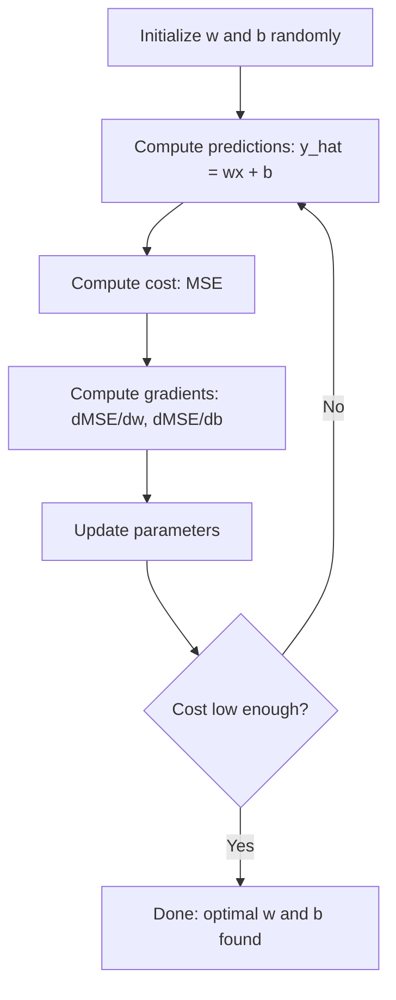

# रैखिक प्रतिगमन
# 线性归归


> रैखिक प्रतिगमन आपके डेटा के माध्यम से सबसे अच्छी सीधी रेखा खींचता है। यह मशीन लर्निंग की "हैलो दुनिया" है।

> 线性回归穿越你的数据画出最佳直线── यह मशीन सीखने का "हैलो वर्ल्ड"──

**Type:** Build | **类型：** 构建
**Languages:** Python
**Prerequisites:** Phase 1 (Linear Algebra, Calculus, Optimization), Phase 2 Lesson 1 | **前置知识：** Phase 1（线性代数、微积分、优化），Phase 2 第 1 课
**Time:** ~90 minutes | **时间：** 约 90 分钟

## सीखने के लक्ष्य

- औसत वर्ग त्रुटि के लिए ग्रेडिएंट गिरावट अद्यतन नियम निकालें और खरोंच से रैखिक प्रतिगमन को लागू करें
  推导平均差差的梯度下降更新规则并从零实现线性回归
- गणना जटिलता के मामले में ग्रेडिएंट गिरावट और सामान्य समीकरण की तुलना करें और प्रत्येक का उपयोग कब करें
  तुलना करें कि किस समय प्रत्येक विधि का उपयोग किया जाता है
- सुविधा मानकीकरण के साथ एक बहु रैखिक प्रतिगमन मॉडल का निर्माण करें और सीखे गए वजन की व्याख्या करें
  构建带特征标准化多线性归归模型并解释学习到的权重
- बताएं कि बड़े वजन को दंडित करके रidge रेग्रिशन (L2 नियमितता) कैसे ओवरफाइटिंग को रोकता है
  解释 Ridge लौट लौट लौट लौट लौट लौट लौट लौट लौट लौट लौट लौट लौट लौट लौट लौट लौट लौट लौट लौट लौट लौट लौट लौट लौट लौट लौट लौट लौट लौट लौट लौट लौट लौट लौट लौट लौट लौट लौट लौट लौट लौट लौट लौट लौट लौट लौट लौट लौट लौट लौट लौट लौट लौट लौट लौट लौट लौट लौट लौट लौट लौट लौट लौट लौट लौट लौट लौट लौट लौट लौट लौट लौट लौट लौट लौट लौट लौट लौट लौट लौट लौट लौट लौट लौट लौट लौट लौट लौट लौट लौट लौट लौट लौट लौट लौट लौट लौट लौट लौट लौट लौट लौट लौट लौट लौट लौट लौट लौट लौट लौट लौट लौट लौट लौट लौट लौट लौट लौट लौट लौट लौट लौट लौट लौट लौट लौट लौट लौट लौट लौट लौट लौट लौट लौट लौट लौट लौट लौट लौट लौट लौट लौट लौट लौट लौट लौट लौट लौट लौट लौट लौट लौट लौट लौट लौट लौट लौट लौट लौट लौट लौट लौट लौट लौट लौट लौट लौट लौट लौट लौट लौट लौट लौट लौट लौट लौट लौट लौट लौट लौट लौट लौट लौट लौट लौट लौट लौट लौट लौट लौट लौट लौट लौट लौट लौट लौट लौट लौट लौट लौट लौट लौट लौट लौट लौट लौट लौट लौट लौट लौट लौट लौट लौट लौट लौट लौट लौट लौट लौट लौट लौट लौट लौट लौट लौट लौट लौट लौट लौट लौट लौट लौट लौट लौट लौट लौट लौट लौट लौट लौट लौट लौट लौट लौट लौट लौट लौट लौट लौट लौट लौट लौट लौट लौट लौट लौट लौट लौट लौट लौट लौट लौट लौट लौट लौट लौट लौट लौट लौट लौट लौट लौट लौट लौट लौट लौट लौट लौट लौट लौट लौट लौट लौट लौट लौट लौट लौट लौट लौट लौट लौट लौट लौट लौट लौट लौट लौट लौट लौट लौट लौट लौट लौट लौट लौट लौट लौट लौट लौट लौट लौट लौट लौट लौट लौट लौट लौट लौट लौट लौट लौट लौट लौट लौट लौट लौट लौट लौट लौट लौट लौट लौट लौट लौट लौट लौट लौट लौट लौट लौट लौट लौट लौट लौट लौट लौट लौट लौट लौट लौट लौट लौट लौट लौट लौट लौट लौट लौट लौट लौट लौट लौट लौट लौट लौट लौट लौट लौट लौट लौट लौट लौट लौट लौट लौट लौट लौट लौट लौट लौट लौट लौट लौट लौट लौट लौट लौट लौट लौट लौट लौट लौट लौट लौट लौट लौट लौट लौट लौट लौट लौट लौट लौट लौट लौट लौट लौट लौट लौट लौट लौट लौट लौट लौट लौट लौट लौट लौट लौट लौट लौट लौट लौट लौट लौट लौट लौट लौट लौट लौट लौट लौट लौट लौट लौट लौट लौट लौट लौट लौट लौट लौट लौट लौट लौट लौट लौट लौट लौट लौट लौट लौट लौट लौट लौट लौट लौट लौट लौट लौट लौट लौट लौट लौट लौट लौट लौट लौट लौट लौट लौट लौट लौट लौट लौट लौट लौट लौट लौट लौट लौट लौट लौट लौट लौट लौट लौट लौट लौट लौट लौट लौट लौट लौट लौट लौट लौट लौट लौट लौट लौट लौट लौट लौट लौट


> **【中文解读】**
> 线性归归是最简单的预测模型使用一条直线(或超平面) 拟合数据──它也是最简单的神经网络:一个没有隐藏层、没有激活函数的网络──sklearn 中的线性回归/Ridge/Lasso──金融中的因子模型就是线性归归──

> **【拓展：线性回归在真实 AI 系统中的角色】**
> यद्यपि "गहन सीखने" पर अधिक ध्यान दिया जाता है, लेकिन रैखिक वापसी अभी भी उद्योग जगत में सबसे आम तौर पर उपयोग किए जाने वाले मॉडल में से एक है। Google ए / बी परीक्षण विश्लेषण में रैखिक वापसी का भारी उपयोग करता है कारण प्रभाव का अनुमान लगाने के लिए; उबर रैखिक वापसी के लिए मांग पूर्वानुमान आधार; वित्तीय क्षेत्र में प्रसिद्ध फ्रेंच तीन कारक मॉडल की मूलभूतता बहुवचन रैखिक वापसी है।

## समस्या  समस्या परिचय

आपके पास डेटा हैः घर के आकार और उनकी बिक्री कीमतें। आप अपने आकार को देखते हुए नए घर की कीमत का अनुमान लगाना चाहते हैं। आप इसे एक स्कैटर ग्राफ पर देख सकते हैं, लेकिन आपको एक सूत्र की आवश्यकता है। आपको एक रेखा की आवश्यकता है जो डेटा के सबसे अच्छी तरह से फिट बैठती है ताकि आप किसी भी आकार को प्लग कर सकें और मूल्य भविष्यवाणी प्राप्त कर सकें।

> आप के पास डेटा हैः घर के क्षेत्रफल और बिक्री मूल्य के अनुसार आप नए घर के क्षेत्रफल अनुमानित मूल्य के आधार पर सोच सकते हैं आप एक बिछाने बिंदु पर अनुमानित मूल्य प्राप्त कर सकते हैं, लेकिन आपको एक सूत्र की आवश्यकता है। आपको एक सर्वोत्तम फिट लाइन की आवश्यकता है, ताकि किसी भी क्षेत्रफल में अनुमानित मूल्य प्राप्त हो सके।

रैखिक प्रतिगमन आपको यह रेखा देता है। इससे भी महत्वपूर्ण बात यह है कि यह पूरे एमएल प्रशिक्षण लूप को पेश करता हैः एक मॉडल को परिभाषित करें, लागत फ़ंक्शन को परिभाषित करें, मापदंडों को अनुकूलित करें। प्रत्येक एमएल एल्गोरिदम इस एक ही पैटर्न का पालन करता है। इसे सबसे सरल मामले के साथ यहां मास्टर करें, और आप इसे हर जगह पहचानेंगे।

> 线性归归为你提供了那条线――更重要的是, यह पूरे ML 训练循环:定义模型、定义价格函数、优化参数―― के लिए पेश किया गया है। प्रत्येक ML 算法 एक ही मोड का पालन करता है। इस सबसे सरल मामले में, आप इसे कहीं भी पहचान सकते हैं।

यह केवल सरल समस्याओं के लिए नहीं है। उत्पादन प्रणालियों में मांग पूर्वानुमान, ए / बी परीक्षण विश्लेषण, वित्तीय मॉडलिंग के लिए रैखिक प्रतिगमन का उपयोग किया जाता है, और प्रत्येक प्रतिगमन कार्य के लिए एक आधार के रूप में।

> यह केवल सरल प्रश्नों के लिए ही नहीं है। उत्पादन प्रणाली में मांग पूर्वानुमान, ए/बी परीक्षण विश्लेषण, वित्तीय निर्माण, तथा प्रत्येक वापसी कार्य के आधार के रूप में उपयोग किया जाता है।

> **【中文解读】**
> 线性归归不仅是入门知识, बल्कि संपूर्ण机器学习训练循环的缩写:定义模型 → 定义损失函数 → 优化参数―― इस सबसे सरल उदाहरण को समझकर आप                                                                                                                                                                                                                                       

## अवधारणा का मूल अवधारणा

### आदर्श

रैखिक प्रतिगमन में इनपुट (x) और आउटपुट (y) के बीच रैखिक संबंध का अनुमान लगाया जाता हैः

> 线性归归假设输入 (x) और输出 (y) के बीच 线性关系 हैः

```
y = wx + b
```

- `w`(वेट/झल): जब x 1 से बढ़ता है तो y कितना बदलता है
  `w`(权重/斜率):x 增加 1 时 y 变化多少
- `b`(bias/intercept): y का मान जब x = 0
  `b`(偏置/截距): जब x = 0 时 y 的值

कई इनपुट (विशेषताओं) के लिए, यह निम्नलिखित तक फैला हैः

> 对于多个输入(特征), विस्तार为:

```
y = w1*x1 + w2*x2 + ... + wn*xn + b
```

या वेक्टर रूप मेंः `y = w^T * x + b`

> या प्रयोग से द्रव्यमान स्वरूप में व्यक्त करेंः`y = w^T * x + b`

लक्ष्य: सभी प्रशिक्षण उदाहरणों में w और b के मानों को ढूंढें जो भविष्यवाणी की गई y को वास्तविक y के जितना संभव हो उतना करीब बनाते हैं।

> 目標: w 和 b का मान ढूंढना, सभी प्रशिक्षण नमूने में पूर्वानुमान के y  यथासंभव वास्तविक y  के करीब लाने के लिए

> **【中文解读】**
> 线性归归的模型非常直观:`y = wx + b`,w है झुकाव, b है दूरी, b है झुकाव, b है दूरी, b है दूरी, b है दूरी, b है दूरी, b है दूरी, b है दूरी, b है दूरी, b है दूरी, b है दूरी, b है दूरी, b है दूरी, b है दूरी, b है दूरी, b है दूरी, b है दूरी, b है दूरी, b है दूरी, b है दूरी, b है दूरी, b है दूरी, b है दूरी, b है दूरी, b है दूरी, b है दूरी, b है दूरी, b है दूरी, b है दूरी, b है दूरी, b है दूरी, b है दूरी, b है दूरी, b है दूरी, b है दूरी, b है दूरी, b है दूरी, b है दूरी, b है दूरी, b है दूरी, b है, b है, b है, b है, b है, b है, b है, b है, b है, b है, b है, b है, b है, b है, b है, b है, b है, b है, b है, b है, b है, b है, b है, b है, b है, b है, b है, b है, b है, b है, b है, b है, b है, b है, b है, b है, b है, b है, b है, b है, b है, b है, b है, b है, b है, b है, b है, b है, b है, b है, b है, b है, b है, b है, b है, b है, b है, b है, b है, b है, b है, b है, b है, b है, b है, b है, b है, b है, b है, b है, b है, b है, b है, b है, b है, b है, b है, b है, b है, b है, b है, b है, b है, b है, b है, b है, b है, b है, b है, b है, b है, b है, b है, b है, b है, b है, b है, b है, b है, b है, b है, b है, b है, b है, b है, b है, b है, b है, b है, b है, b है, b है, b है, b है`y = w1*x1 + w2*x2 + ... + wn*xn + b`, यानी सुपरप्लेन-अनुकूलित डेटा का उपयोग करके प्रशिक्षण का उद्देश्य सबसे अच्छा w और b ढूंढना है, ताकि पूर्वानुमान मूल्य और वास्तविक मूल्य के अंतर को कम से कम किया जा सके।

### लागत फ़ंक्शन (मीडियन स्क्वायर त्रुटि)

आप "जितना संभव हो उतना करीब" कैसे मापते हैं? आपको एक एकल संख्या की आवश्यकता है जो आपकी भविष्यवाणियों को गलत तरीके से कैप्चर करती है। सबसे आम विकल्प औसत वर्ग त्रुटि (MSE) हैः

> आप "जितना संभव हो उतना करीब" कैसे मापें? आपको एक ऐसी संख्या की आवश्यकता है जो भविष्यवाणी की त्रुटि की डिग्री को पकड़ सके। सबसे आम उपयोग का विकल्प औसत त्रुटि है।

```
MSE = (1/n) * sum((y_predicted - y_actual)^2)
```

दो कारणों से। पहला, यह छोटी त्रुटियों की तुलना में बड़ी त्रुटियों को अधिक दंडित करता है (10 की त्रुटि 1 की त्रुटि से 100 गुना बदतर है, 10 की तुलना में) दूसरा, वर्ग फ़ंक्शन हर जगह चिकनी और भिन्न है, जो अनुकूलन को सीधा बनाता है।

> क्यों उपयोग करें वर्ग? दो कारणों से। सबसे पहले, यह बड़ी त्रुटियों के लिए दंडात्मक है, जो कि छोटी त्रुटियों के लिए अधिक भारी है।

लागत फ़ंक्शन एक सतह बनाता है. एकल वजन w और पूर्वाग्रह b के लिए, MSE सतह एक कटोरे (एक संकुचित पैराबोलाइड) की तरह दिखती है। कटोरे का निचला हिस्सा है जहां MSE को न्यूनतम किया जाता है। प्रशिक्षण का मतलब है कि नीचे की खोज करना।

> 代价函数 एक曲面创建── एकल भार भार w 和偏置 b के लिए,MSE 曲面看起来像一个碗凸抛物面)──碗的底部是MSE 最小的地方──训练就是找到那个底部──

### क्रमिक गिरावट

गिरती हुई तलछट नीचे की ओर कदम उठाकर कटोरे का तल ढूँढती है।

> 梯度下降 梯度下降 梯度下降 梯度下降 梯度下降 梯度下降 梯度下降 梯度下降 梯度下降 梯度下走步 梯度下降 梯度下降 梯度下降 梯度下降 梯度下降 梯度下降 梯度下降 梯度下降 梯度下降 梯度下降 梯度下降 梯度下降 梯度下降 梯度下降 梯度下降 梯度下降 梯度下降 梯度下降 梯度下降 梯度下降 梯度下降 梯度下降 梯度下降 梯度下降 梯度下降 梯度下降 梯度下降 梯度下降 梯度下降 梯度下降 梯度下降 梯度下降 梯度下降 梯度下降 梯度下降 梯度下降 梯度 下降 梯度 下降 梯度 下降 梯度 下降 梯度 下降 梯度 下降 梯度 下降 梯度 下降 梯度 下降 梯度 下降 梯度 下降 梯度 下降 梯度 下降 梯度 下降 梯度 下降 梯度 下降 梯度 下降 梯度 下降 梯度 下降 梯度 下 下降 梯度 下 下 下 下 下 下 下 下 下 下 下 下 下 下 下 下 下 下 下 下 下 下 下 下 下 下 下 下 下 下 下 下 下 下 下 下 下 下 下 下 下 下 下 下 下 下 下 下 下 下 下 下 下 下 下 下 下 下 下 下 下 下 下 下 下 下 下 下 下 下 下 下 下 下 下 下 下 下 下 下 下 下 下 下 下 下 下 下 下 下 下 下 下 下 下 下 下 下 下 下 下 下 下 下 下 下 下 下 下 下 下 下 下 下 下 下 下 下 下 下 下 下 下 下 下 下 下 下 下 下 下 下 下 下 下 下 下 下 下 下 下 下 下 下 下 下 下 下 下 下 下 下 下 下 下 下 下 下 下 下 下 下 下 下 下 下 下 下 下 下 下 下 下 下 下



ग्रेडिएंट आपको दो चीजें बताते हैंः प्रत्येक पैरामीटर को किस दिशा में स्थानांतरित करना है, और कितना स्थानांतरित करना है।

> 梯度 आपको दो बातें बताता हैः प्रत्येक तत्व को किस दिशा में स्थानांतरित होना चाहिए, तथा कितनी स्थानांतरित करनी चाहिए।

y_hat = wx + b के साथ MSE के लिएः

> 对于MSE 且 y_hat = wx + b:

```
dMSE/dw = (2/n) * sum((y_hat - y) * x)
dMSE/db = (2/n) * sum(y_hat - y)
```

अद्यतन नियमः

> 更新规则:

```
w = w - learning_rate * dMSE/dw
b = b - learning_rate * dMSE/db
```

सीखने की दर चरण के आकार को नियंत्रित करती है। बहुत बड़ाः आप न्यूनतम से अधिक हो जाते हैं और विचलित होते हैं। बहुत छोटाः प्रशिक्षण हमेशा के लिए लेता है। सामान्य प्रारंभिक मानः 0.01, 0.001, या 0.0001.

> सीखने की दर नियंत्रण चरण लम्बा── बहुत बड़ा: आप न्यूनतम मान से अधिक कूदेंगे并发散── बहुत छोटा: प्रशिक्षण को बहुत लंबा समय चाहिए── आम प्रारंभिक मूल्यः 0.01、0.001 या 0.0001──

> **【中文解读】**
> 梯度下降 मशीन सीखने के सबसे मूल अनुकूलन एल्गोरिथ्म है। इसका सहज सहज ज्ञान सरल हैः पहाड़ पर खड़े होकर सबसे नीचे की ओर बढ़ते हुए कदम से कदम आगे बढ़ते हैं, फिर से कदम आगे बढ़ते हैं।

> **【拓展：梯度下降在现代 AI 中的演进】**
> जीपीटी-4 का प्रशिक्षण एडमडब्ल्यू  अनुकूलक का उपयोग करके किया जाता है(आदम + 权重衰减), यह एक उच्च चर है जो नीचे की तरफ़ गिरता है।

### सामान्य समीकरण (बंद रूप समाधान)

रैखिक प्रतिगमन के लिए विशेष रूप से, एक सीधा सूत्र है जो बिना किसी पुनरावृत्ति के इष्टतम वजन देता हैः

>  विशेष रूप से रैखिक वापसी के लिए, एक सीधा सूत्र है जो अधिकतम वज़न देने में सक्षम हैः

```
w = (X^T * X)^(-1) * X^T * y
```

यह एक चरण में w के लिए हल करने के लिए एक मैट्रिक्स को उलट देता है। यह छोटे डेटासेट के लिए एकदम सही काम करता है। बड़े डेटासेट (मिलियनों पंक्तियों या हजारों सुविधाओं) के लिए, ग्रेडिएंट अवतरण को प्राथमिकता दी जाती है क्योंकि मैट्रिक्स विपरित सुविधाओं की संख्या में O(n ^ 3) है।

> यह छोटे डेटासेट के लिए बहुत प्रभावी है। बड़े डेटासेट के लिए, तरंग नीचे बढ़ जाती है क्योंकि रेंज में प्रतिकूलता O (n^3) है।

> **【拓展：正规方程 vs 梯度下降的选择】**
> सामान्य समीकरण की समय जटिलता O (n) है, जब विशेषताएं हजारों से अधिक समय पर गणना की जाती हैं, तो यह बहुत धीमी है। गहन सीखने के मॉडल में अरबों तत्व होते हैं, केवल ग्रेड डाउन के साथ ही उपयोग किए जा सकते हैं।

### बहु-रेखीय प्रतिगमन

कई विशेषताओं के साथ, मॉडल बन जाता हैः

> कई विशेषताएं हैं, मॉडल बदलते हैंः

```
y = w1*x1 + w2*x2 + ... + wn*xn + b
```

सब कुछ एक ही काम करता हैः एमएसई लागत फ़ंक्शन है, ग्रेडिएंट गिरावट एक साथ सभी भारों को अपडेट करती है। एकमात्र अंतर यह है कि आप एक रेखा के बजाय एक हाइपरप्लेन फिट कर रहे हैं।

> एक ही सिद्धांतः एमएसई मूल्य फ़ंक्शन है, तरंग घटता है और एक ही समय में सभी अधिकारों को अद्यतन करता है। एकमात्र अंतर यह है कि आप एक सुपरप्लेन के अनुरूप हैं, न कि एक सीधी रेखा।

यदि एक विशेषता 0 से 1 तक और दूसरी 0 से 1,000,000 तक है, तो ग्रेडिएंट गिरावट संघर्ष करेगी क्योंकि लागत सतह लंबा हो जाती है। प्रशिक्षण से पहले विशेषताएं (मध्यम घटाएं, मानक विचलन द्वारा विभाजित करें) को मानकीकृत करें।

> यदि एक विशेषता का दायरा 0 से 1 तक है, तो अन्य 0 से 1,000,000 तक है, तो डिग्री घटना मुश्किल हो जाएगा, क्योंकि मूल्य अनुक्रम को बढ़ाया जाएगा।

> **【中文解读】**
> बहुआयामी पुनर्गठन में, विशेषता संकुचन महत्वपूर्ण है। यदि विशेषता मात्रा स्तर अंतर बहुत बड़ा है जैसे कि क्षेत्रफल 500-3000 बनाम बेडरूम संख्या 1-5), तराजू घटने के नुकसान फ़ंक्शन के अनुभाग को गंभीर रूप से बढ़ाया जाएगा, जिससे प्राप्ति धीमी हो जाएगी या फिर प्राप्ति में असमर्थ हो जाएगी। समाधान विधिः मानकीकरणः औसत मूल्य में कमी (standard difference) या पुनर्गठनः 0-1 तक संकुचन, यह लगभग सभी एमएल एल्गोरिदम में आवश्यक पूर्व प्रसंस्करण चरणों में से एक है।

### बहुपद प्रतिगमन

यदि संबंध रैखिक नहीं है तो क्या होगा? आप अभी भी बहुपद विशेषताओं को बनाकर रैखिक प्रतिगमन का उपयोग कर सकते हैंः

> यदि संबंध रैखिक नहीं है तो आप कई प्रकार के लक्षणों को बनाने के माध्यम से रैखिक वापसी का उपयोग जारी रख सकते हैंः

```
y = w1*x + w2*x^2 + w3*x^3 + b
```

यह अभी भी "रैखिक" regression है क्योंकि मॉडल वजन में रैखिक है (w1, w2, w3) आप केवल x के गैर रैखिक गुणों का उपयोग कर रहे हैं.

> यह अभी भी "रेखीय" वापसी है, क्योंकि मॉडल वजन (w1, w2, w3) पर है।

उच्च डिग्री बहुपद अधिक जटिल वक्रों को फिट कर सकते हैं लेकिन ओवरफitting का जोखिम है। एक डिग्री-10 बहुपद 10 बिंदु डेटासेट में हर बिंदु से गुजरता है लेकिन नए डेटा पर खराब भविष्यवाणी करता है।

> उच्च बहुपद संरचना अधिक जटिल वक्रों के अनुरूप हो सकती है, लेकिन इसके अनुकूलन के जोखिम हैं। एक 10 बार बहुपद संरचना 10 डेटा सेट के प्रत्येक बिंदु को पार करती है, लेकिन नए डेटा पर पूर्वानुमान बहुत खराब है।

### आर-क्वायर स्कोर

एमएसई आपको बताता है कि आप कितना गलत हैं, लेकिन संख्या y के पैमाने पर निर्भर करती है। R-क्वायर (R^2) एक पैमाने-स्वतंत्र उपाय देता हैः

> एमएसई  आपको बताता है कि कितना गलत है, लेकिन यह संख्या y के मात्रा वर्ग पर निर्भर करती है। R-क्वायर (R ^ 2)  ने एक मात्रा वर्ग से संबंधित नहीं आयाम दियाः

```
R^2 = 1 - (sum of squared residuals) / (sum of squared deviations from mean)
    = 1 - SS_res / SS_tot
```

- R^2 = 1.0: सही भविष्यवाणी
  R^2 = 1.0:完美预测
- R^2 = 0.0: मॉडल प्रत्येक बार औसत की भविष्यवाणी से बेहतर नहीं है
  R^2 = 0.0: मॉडल प्रति पूर्वानुमान औसत मूल्य अच्छा नहीं है
- R^2 < 0.0: मॉडल औसत की भविष्यवाणी से भी बदतर है
  R^2 < 0.0: मॉडल比预测 औसत मूल्य भी差

### नियमन पूर्वावलोकन (रिज रिग्रेशन)

जब आपके पास कई विशेषताएं होती हैं, तो मॉडल बड़े वजन आवंटित करके ओवरफिट कर सकता है। रidge रेग्रिशन (L2 नियमितकरण) एक दंड जोड़ता हैः

> जब आपके पास बहुत सारे लक्षण होते हैं, तो मॉडल बड़े पैमाने पर वजन को समायोजित करने के लिए अधिक शक्ति प्रदान कर सकता है।

```
Cost = MSE + lambda * sum(w_i^2)
```

पेनल्टी शब्द बड़े वजन को मना करता है। हाइपरपरपैरामीटर लैम्बा कॉम्प्रेस को नियंत्रित करता हैः उच्च लैम्बा का अर्थ है छोटे वजन और अधिक नियमितता। यह एक बाद के पाठ में गहराई से कवर किया जाएगा। अभी के लिए, जानें कि यह मौजूद है और यह मदद क्यों करता है।

> 惩罚项阻止权重过大──超参数 lambda 控制权衡:lambda 越大意味着权重越小、正则化越强── यह अगले पाठ्यक्रम में गहन चर्चा में होगा── अब केवल इसके अस्तित्व और प्रभाव को समझने की आवश्यकता है──

> **【中文解读】**
> रिज लौट लौट लौटें (Ridge) L2 正则化) 重量平方和的惩罚项在损失函数中添加权重和的惩罚项中通过在损失函数中添加权重平方和的惩罚项中通过在损失函数中添加权重和的惩罚项以防止过拟合──直觉:权重大小限制,迫使模型"保守"地使用特征,而不是基于某个特征的极端权重来适应噪音──正则化强度由 lambda 控制lambda 越大,权重越小,模型越简单──यह गहन सीखने में सबसे आम तौर पर उपयोग की जाने वाली तकनीकों में से एक है权重衰减减减减减减重) 

## इसे बनाओ, इसे पूरा करो।
```figure
linear-regression-fit
```

## इसे बनाओ

### चरण 1: नमूना डेटा उत्पन्न करें

```python
import random
import math

random.seed(42)  # 设置随机种子以确保结果可复现

TRUE_W = 3.0  # 真实斜率（权重）
TRUE_B = 7.0  # 真实截距（偏置）
N_SAMPLES = 100  # 样本数量

X = [random.uniform(0, 10) for _ in range(N_SAMPLES)]  # 生成 0-10 之间的随机特征值
y = [TRUE_W * x + TRUE_B + random.gauss(0, 2.0) for x in X]  # 真实关系 + 高斯噪声

print(f"Generated {N_SAMPLES} samples")
print(f"True relationship: y = {TRUE_W}x + {TRUE_B} (+ noise)")
print(f"First 5 points: {[(round(X[i], 2), round(y[i], 2)) for i in range(5)]}")
```

### चरण 2: ग्रेडिएंट अवतरण के साथ खरोंच से रैखिक प्रतिगमन

```python
class LinearRegression:
    def __init__(self, learning_rate=0.01):
        self.w = 0.0  # 权重初始化为 0
        self.b = 0.0  # 偏置初始化为 0
        self.lr = learning_rate  # 学习率控制梯度下降步长
        self.cost_history = []  # 记录每轮的损失值

    def predict(self, X):
        return [self.w * x + self.b for x in X]  # y_hat = wx + b

    def compute_cost(self, X, y):
        predictions = self.predict(X)
        n = len(y)
        # 计算 MSE：均方误差
        cost = sum((pred - actual) ** 2 for pred, actual in zip(predictions, y)) / n
        return cost

    def compute_gradients(self, X, y):
        predictions = self.predict(X)
        n = len(y)
        # 对 w 的偏导数
        dw = (2 / n) * sum((pred - actual) * x for pred, actual, x in zip(predictions, y, X))
        # 对 b 的偏导数
        db = (2 / n) * sum(pred - actual for pred, actual in zip(predictions, y))
        return dw, db

    def fit(self, X, y, epochs=1000, print_every=200):
        for epoch in range(epochs):
            dw, db = self.compute_gradients(X, y)  # 计算梯度
            self.w -= self.lr * dw  # 沿梯度反方向更新权重
            self.b -= self.lr * db  # 沿梯度反方向更新偏置
            cost = self.compute_cost(X, y)
            self.cost_history.append(cost)
            if epoch % print_every == 0:
                print(f"  Epoch {epoch:4d} | Cost: {cost:.4f} | w: {self.w:.4f} | b: {self.b:.4f}")
        return self

    def r_squared(self, X, y):
        predictions = self.predict(X)
        y_mean = sum(y) / len(y)
        ss_res = sum((actual - pred) ** 2 for actual, pred in zip(y, predictions))  # 残差平方和
        ss_tot = sum((actual - y_mean) ** 2 for actual in y)  # 总变差
        return 1 - (ss_res / ss_tot)  # R² = 1 - SS_res/SS_tot


print("=== Training Linear Regression (Gradient Descent) ===")
model = LinearRegression(learning_rate=0.005)
model.fit(X, y, epochs=1000, print_every=200)
print(f"\nLearned: y = {model.w:.4f}x + {model.b:.4f}")
print(f"True:    y = {TRUE_W}x + {TRUE_B}")
print(f"R-squared: {model.r_squared(X, y):.4f}")
```

### चरण 3: सामान्य समीकरण (बंद रूप समाधान)

```python
class LinearRegressionNormal:
    def __init__(self):
        self.w = 0.0  # 斜率
        self.b = 0.0  # 截距

    def fit(self, X, y):
        n = len(X)
        x_mean = sum(X) / n  # 计算 x 的均值
        y_mean = sum(y) / n  # 计算 y 的均值
        # 协方差 / 方差 = 最优斜率
        numerator = sum((X[i] - x_mean) * (y[i] - y_mean) for i in range(n))
        denominator = sum((X[i] - x_mean) ** 2 for i in range(n))
        self.w = numerator / denominator
        # 截距 = y 均值 - 斜率 * x 均值
        self.b = y_mean - self.w * x_mean
        return self

    def predict(self, X):
        return [self.w * x + self.b for x in X]

    def r_squared(self, X, y):
        predictions = self.predict(X)
        y_mean = sum(y) / len(y)
        ss_res = sum((actual - pred) ** 2 for actual, pred in zip(y, predictions))
        ss_tot = sum((actual - y_mean) ** 2 for actual in y)
        return 1 - (ss_res / ss_tot)


print("\n=== Normal Equation (Closed-Form) ===")
model_normal = LinearRegressionNormal()
model_normal.fit(X, y)
print(f"Learned: y = {model_normal.w:.4f}x + {model_normal.b:.4f}")
print(f"R-squared: {model_normal.r_squared(X, y):.4f}")
```

### चरण 4: बहु रैखिक प्रतिगमन

```python
class MultipleLinearRegression:
    def __init__(self, n_features, learning_rate=0.01):
        self.weights = [0.0] * n_features
        self.bias = 0.0
        self.lr = learning_rate
        self.cost_history = []

    def predict_single(self, x):
        return sum(w * xi for w, xi in zip(self.weights, x)) + self.bias

    def predict(self, X):
        return [self.predict_single(x) for x in X]

    def compute_cost(self, X, y):
        predictions = self.predict(X)
        n = len(y)
        return sum((pred - actual) ** 2 for pred, actual in zip(predictions, y)) / n

    def fit(self, X, y, epochs=1000, print_every=200):
        n = len(y)
        n_features = len(X[0])
        for epoch in range(epochs):
            predictions = self.predict(X)
            errors = [pred - actual for pred, actual in zip(predictions, y)]
            for j in range(n_features):
                grad = (2 / n) * sum(errors[i] * X[i][j] for i in range(n))
                self.weights[j] -= self.lr * grad
            grad_b = (2 / n) * sum(errors)
            self.bias -= self.lr * grad_b
            cost = self.compute_cost(X, y)
            self.cost_history.append(cost)
            if epoch % print_every == 0:
                print(f"  Epoch {epoch:4d} | Cost: {cost:.4f}")
        return self

    def r_squared(self, X, y):
        predictions = self.predict(X)
        y_mean = sum(y) / len(y)
        ss_res = sum((actual - pred) ** 2 for actual, pred in zip(y, predictions))
        ss_tot = sum((actual - y_mean) ** 2 for actual in y)
        return 1 - (ss_res / ss_tot)


random.seed(42)
N = 100
X_multi = []
y_multi = []
for _ in range(N):
    size = random.uniform(500, 3000)
    bedrooms = random.randint(1, 5)
    age = random.uniform(0, 50)
    price = 50 * size + 10000 * bedrooms - 1000 * age + 50000 + random.gauss(0, 20000)
    X_multi.append([size, bedrooms, age])
    y_multi.append(price)


def standardize(X):
    n_features = len(X[0])
    means = [sum(X[i][j] for i in range(len(X))) / len(X) for j in range(n_features)]
    stds = []
    for j in range(n_features):
        variance = sum((X[i][j] - means[j]) ** 2 for i in range(len(X))) / len(X)
        stds.append(variance ** 0.5)
    X_scaled = []
    for i in range(len(X)):
        row = [(X[i][j] - means[j]) / stds[j] if stds[j] > 0 else 0 for j in range(n_features)]
        X_scaled.append(row)
    return X_scaled, means, stds


y_mean_val = sum(y_multi) / len(y_multi)
y_std_val = (sum((yi - y_mean_val) ** 2 for yi in y_multi) / len(y_multi)) ** 0.5
y_scaled = [(yi - y_mean_val) / y_std_val for yi in y_multi]

X_scaled, x_means, x_stds = standardize(X_multi)

print("\n=== Multiple Linear Regression (3 features) ===")
print("Features: house size, bedrooms, age")
multi_model = MultipleLinearRegression(n_features=3, learning_rate=0.01)
multi_model.fit(X_scaled, y_scaled, epochs=1000, print_every=200)

print(f"\nWeights (standardized): {[round(w, 4) for w in multi_model.weights]}")
print(f"Bias (standardized): {multi_model.bias:.4f}")
print(f"R-squared: {multi_model.r_squared(X_scaled, y_scaled):.4f}")
```

### चरण 5: बहुपद प्रतिगमन

```python
class PolynomialRegression:
    def __init__(self, degree, learning_rate=0.01):
        self.degree = degree
        self.weights = [0.0] * degree
        self.bias = 0.0
        self.lr = learning_rate

    def make_features(self, X):
        return [[x ** (d + 1) for d in range(self.degree)] for x in X]

    def predict(self, X):
        features = self.make_features(X)
        return [sum(w * f for w, f in zip(self.weights, row)) + self.bias for row in features]

    def fit(self, X, y, epochs=1000, print_every=200):
        features = self.make_features(X)
        n = len(y)
        for epoch in range(epochs):
            predictions = [sum(w * f for w, f in zip(self.weights, row)) + self.bias for row in features]
            errors = [pred - actual for pred, actual in zip(predictions, y)]
            for j in range(self.degree):
                grad = (2 / n) * sum(errors[i] * features[i][j] for i in range(n))
                self.weights[j] -= self.lr * grad
            grad_b = (2 / n) * sum(errors)
            self.bias -= self.lr * grad_b
            if epoch % print_every == 0:
                cost = sum(e ** 2 for e in errors) / n
                print(f"  Epoch {epoch:4d} | Cost: {cost:.6f}")
        return self

    def r_squared(self, X, y):
        predictions = self.predict(X)
        y_mean = sum(y) / len(y)
        ss_res = sum((actual - pred) ** 2 for actual, pred in zip(y, predictions))
        ss_tot = sum((actual - y_mean) ** 2 for actual in y)
        return 1 - (ss_res / ss_tot)


random.seed(42)
X_poly = [x / 10.0 for x in range(0, 50)]
y_poly = [0.5 * x ** 2 - 2 * x + 3 + random.gauss(0, 1.0) for x in X_poly]

x_max = max(abs(x) for x in X_poly)
X_poly_norm = [x / x_max for x in X_poly]
y_poly_mean = sum(y_poly) / len(y_poly)
y_poly_std = (sum((yi - y_poly_mean) ** 2 for yi in y_poly) / len(y_poly)) ** 0.5
y_poly_norm = [(yi - y_poly_mean) / y_poly_std for yi in y_poly]

print("\n=== Polynomial Regression (degree 2 vs degree 5) ===")
print("True relationship: y = 0.5x^2 - 2x + 3")

print("\nDegree 2:")
poly2 = PolynomialRegression(degree=2, learning_rate=0.1)
poly2.fit(X_poly_norm, y_poly_norm, epochs=2000, print_every=500)
print(f"  R-squared: {poly2.r_squared(X_poly_norm, y_poly_norm):.4f}")

print("\nDegree 5:")
poly5 = PolynomialRegression(degree=5, learning_rate=0.1)
poly5.fit(X_poly_norm, y_poly_norm, epochs=2000, print_every=500)
print(f"  R-squared: {poly5.r_squared(X_poly_norm, y_poly_norm):.4f}")

print("\nDegree 2 fits the true curve well. Degree 5 fits training data slightly better")
print("but risks overfitting on new data.")
```

### चरण 6: रिंग रेग्रिशन (L2 नियमितता)

```python
class RidgeRegression:
    def __init__(self, n_features, learning_rate=0.01, alpha=1.0):
        self.weights = [0.0] * n_features
        self.bias = 0.0
        self.lr = learning_rate
        self.alpha = alpha

    def predict_single(self, x):
        return sum(w * xi for w, xi in zip(self.weights, x)) + self.bias

    def predict(self, X):
        return [self.predict_single(x) for x in X]

    def fit(self, X, y, epochs=1000, print_every=200):
        n = len(y)
        n_features = len(X[0])
        for epoch in range(epochs):
            predictions = self.predict(X)
            errors = [pred - actual for pred, actual in zip(predictions, y)]
            mse = sum(e ** 2 for e in errors) / n
            reg_term = self.alpha * sum(w ** 2 for w in self.weights)
            cost = mse + reg_term
            for j in range(n_features):
                grad = (2 / n) * sum(errors[i] * X[i][j] for i in range(n))
                grad += 2 * self.alpha * self.weights[j]
                self.weights[j] -= self.lr * grad
            grad_b = (2 / n) * sum(errors)
            self.bias -= self.lr * grad_b
            if epoch % print_every == 0:
                print(f"  Epoch {epoch:4d} | Cost: {cost:.4f} | L2 penalty: {reg_term:.4f}")
        return self


print("\n=== Ridge Regression (L2 Regularization) ===")
print("Same data as multiple regression, with alpha=0.1")
ridge = RidgeRegression(n_features=3, learning_rate=0.01, alpha=0.1)
ridge.fit(X_scaled, y_scaled, epochs=1000, print_every=200)
print(f"\nRidge weights: {[round(w, 4) for w in ridge.weights]}")
print(f"Plain weights: {[round(w, 4) for w in multi_model.weights]}")
print("Ridge weights are smaller (shrunk toward zero) due to the L2 penalty.")
```

## इसे फ्रेमवर्क के साथ लागू करें

अब वही बात है स्किकट-लर्न के साथ, जो आप वास्तव में उत्पादन में उपयोग करेंगे।

> अब इस तरह के कार्य को सरल तरीके से सीखकर पूरा करें, यह वह उपकरण है जिसका उपयोग आप उत्पादन में कर रहे हैं।

```python
from sklearn.linear_model import LinearRegression as SklearnLR
from sklearn.linear_model import Ridge
from sklearn.preprocessing import PolynomialFeatures, StandardScaler
from sklearn.model_selection import train_test_split
from sklearn.metrics import mean_squared_error, r2_score
import numpy as np

# 生成与从零实现相同的数据
np.random.seed(42)
X_sk = np.random.uniform(0, 10, (100, 1))
y_sk = 3.0 * X_sk.squeeze() + 7.0 + np.random.normal(0, 2.0, 100)

# 划分训练集和测试集（80/20）
X_train, X_test, y_train, y_test = train_test_split(X_sk, y_sk, test_size=0.2, random_state=42)

# 线性回归
lr = SklearnLR()
lr.fit(X_train, y_train)
y_pred = lr.predict(X_test)

print("=== Scikit-learn Linear Regression ===")
print(f"Coefficient (w): {lr.coef_[0]:.4f}")
print(f"Intercept (b): {lr.intercept_:.4f}")
print(f"R-squared (test): {r2_score(y_test, y_pred):.4f}")
print(f"MSE (test): {mean_squared_error(y_test, y_pred):.4f}")

# 多项式回归（degree=2）
poly = PolynomialFeatures(degree=2, include_bias=False)
X_poly_sk = poly.fit_transform(X_train)  # 生成 x, x² 特征
X_poly_test = poly.transform(X_test)

lr_poly = SklearnLR()
lr_poly.fit(X_poly_sk, y_train)
print(f"\nPolynomial degree 2 R-squared: {r2_score(y_test, lr_poly.predict(X_poly_test)):.4f}")

# 标准化后使用 Ridge 回归
scaler = StandardScaler()
X_train_scaled = scaler.fit_transform(X_train)  # 在训练集上拟合并转换
X_test_scaled = scaler.transform(X_test)  # 在测试集上只转换

ridge = Ridge(alpha=1.0)  # alpha 即正则化强度 lambda
ridge.fit(X_train_scaled, y_train)
print(f"Ridge R-squared: {r2_score(y_test, ridge.predict(X_test_scaled)):.4f}")
print(f"Ridge coefficient: {ridge.coef_[0]:.4f}")
```

स्कीट-लर्न के साथ-साथ स्कीट-लर्न के साथ-साथ स्कीट-लर्न के साथ-साथ स्कीट-लर्न के साथ-साथ स्कीट-लर्न के साथ-साथ स्कीट-लर्न के साथ-साथ स्कीट-लर्न के साथ-साथ स्कीट-लर्न के साथ-साथ स्कीट-लर्न के साथ-साथ स्कीट-लर्न के साथ-साथ स्कीट-लर्न के साथ-साथ स्कीट-लर्न के साथ-साथ स्कीट-लर्न के साथ-साथ स्कीट-लर्न के साथ-साथ स्कीट-लर्न के साथ-साथ स्कीट-लर्न के साथ-साथ स्कीट-लर्न के साथ-साथ स्कीट-लर्न के साथ-साथ स्कीट-लर्न के साथ-साथ स्कीट-लर्न के साथ-साथ स्कीट-लर्न के साथ-साथ-साथ-साथ-साथ-साथ-साथ-साथ-साथ-साथ-साथ-साथ-साथ-साथ-साथ-साथ-साथ-साथ-साथ-साथ-साथ-साथ-साथ-साथ-साथ-साथ-साथ-साथ-साथ-साथ-साथ-साथ-साथ-साथ-साथ-साथ-साथ-साथ-साथ-साथ-साथ-साथ-साथ-साथ-साथ-साथ-साथ-साथ-साथ-साथ-साथ-साथ-साथ-साथ-साथ-साथ-साथ-साथ-साथ-साथ-साथ-साथ-साथ-साथ-साथ-साथ-साथ-साथ-साथ-साथ-साथ-साथ-साथ-साथ-साथ-साथ-साथ-साथ-साथ-साथ-साथ-साथ-साथ-साथ-साथ-साथ-साथ--साथ-साथ-साथ--साथ-साथ-साथ--साथ---साथ--साथ--साथ------साथ--साथ----------साथ----------------------------------------------------------------------------------

> आपके शून्य से प्राप्त करने और छोटे से सीखने के समान परिणाम उत्पन्न होते हैं। अंतर इस बात में है कि: लघु से सीखने के लिए सीमाओं की स्थिति को संभालना, संख्यात्मक स्थिरता और प्रदर्शन अनुकूलन करना।

## इसे भेजें उत्पाद

इस पाठ से उत्पन्न होता हैः
- `outputs/skill-regression.md`- समस्या के आधार पर सही प्रतिगमन दृष्टिकोण चुनने के लिए कौशल

> 本课产出:
> - `outputs/skill-regression.md`- एक समस्या के आधार पर सही वापसी विधि का चयन करने की कौशल

## अभ्यास विषय

1. बैच ग्रेडिएंट गिरावट, स्टोकास्टिक ग्रेडिएंट गिरावट (SGD) और मिनी बैच ग्रेडिएंट गिरावट को लागू करें। एक ही डेटासेट पर अभिसरण गति की तुलना करें। कौन सा सबसे तेजी से अभिसरण करता है?
   1. 实现批量梯度下降,随机梯度下降 (SGD) 和小批量梯度下降.                                                                                                                                                                                                                                                 
2. एक घन फ़ंक्शन से डेटा उत्पन्न करें (y = ax^3 + bx^2 + cx + d + शोर) । डिग्री 1, 3 और 10 के फिट बहुपदों की तुलना करें। प्रशिक्षण R^2 और परीक्षण R^2 की तुलना करें। किस स्तर पर ओवरफिटिंग स्पष्ट हो जाती है?
   2. तीन बार कार्य (y = ax^3 + bx^2 + cx + d + शोर) से उत्पन्न डेटा──拟合 1、3 和 10 बार多项式──比较训练 R^2 和测试 R^2──几次多项式时过拟合变得明显吗?
3. लासो रेग्रेसशन (L1 नियमितकरणः पेनाल्टी अल्फा *(पर पर आप = i i i i i i i i i i i)) लागू करें। बहु-गुणवत्ता आवास डेटा को प्रशिक्षित करें। तुलना करें कि कौन से वजन शून्य बनाम रिज तक जाते हैं। L1 दुर्लभ समाधान क्यों उत्पन्न करता है जबकि L2 नहीं करता है?
   3. 实现 लासो 回归(L1 正则化: दंड * अल्फा राशि *((                                                                                                                                                                                                                                                     

## कीवर्ड्स  शब्द खोज तालिका

| Term | What people say | What it actually means |
|------|----------------|----------------------|
| Linear regression | "Draw a line through data" | Find weight w and bias b that minimize the sum of squared differences between wx+b and actual y values |
| Cost function | "How bad the model is" | A function that maps model parameters to a single number measuring prediction error, which optimization minimizes |
| Mean squared error | "Average of squared errors" | (1/n) * sum of (predicted - actual)^2, penalizing large errors disproportionately |
| Gradient descent | "Walk downhill" | Iteratively adjust parameters in the direction that reduces the cost function, using partial derivatives |
| Learning rate | "Step size" | A scalar that controls how much parameters change per gradient descent step |
| Normal equation | "Solve it directly" | The closed-form solution w = (X^T X)^-1 X^T y that gives optimal weights without iteration |
| R-squared | "How good the fit is" | The fraction of variance in y explained by the model, ranging from negative infinity to 1.0 |
| Feature scaling | "Make features comparable" | Transforming features to similar ranges (e.g., zero mean, unit variance) so gradient descent converges faster |
| Regularization | "Penalize complexity" | Adding a term to the cost function that shrinks weights, preventing overfitting |
| Ridge regression | "L2 regularization" | Linear regression with a penalty of lambda * sum(w_i^2) added to MSE |
| Polynomial regression | "Fitting curves with linear math" | Linear regression on polynomial features (x, x^2, x^3, ...), still linear in the weights |
| Overfitting | "Memorizing training data" | Using a model so complex that it fits noise in training data and fails on new data |

## आगे पढ़ना 延伸閱讀

- [An Introduction to Statistical Learning (ISLR)](https://www.statlearning.com/)-- निःशुल्क पीडीएफ, अध्याय 3 और 6 व्यावहारिक आर उदाहरणों के साथ रैखिक प्रतिगमन और नियमितता को कवर करते हैं
  [An Introduction to Statistical Learning (ISLR)](https://www.statlearning.com/)-- 免费教材, अध्याय 3 और अध्याय 6 व्यावहारिक आर उदाहरणों से संबंधित है
- [The Elements of Statistical Learning (ESL)](https://hastie.su.domains/ElemStatLearn/)-- मुक्त पीडीएफ, आईएसएलआर के अधिक गणितीय साथी गहरे उपचार के साथ रिंग और लसो
  [The Elements of Statistical Learning (ESL)](https://hastie.su.domains/ElemStatLearn/)-- 免费教材,ISLR का गणित संस्करण, रिडज और लासो के लिए अधिक गहराई से संसाधित
- [Stanford CS229 Lecture Notes on Linear Regression](https://cs229.stanford.edu/main_notes.pdf)-- एंड्रयू एनजी के नोट्स सामान्य समीकरण और ग्रेडिएंट अवतरण के लिए पहले सिद्धांतों से प्राप्त
  [Stanford CS229 Lecture Notes on Linear Regression](https://cs229.stanford.edu/main_notes.pdf)-- एंड्रयू एनजी का नोट्स प्रथम प्रकृति के सिद्धांत से अनुप्रेषण
- [scikit-learn LinearRegression documentation](https://scikit-learn.org/stable/modules/linear_model.html)-- कोड उदाहरणों के साथ रैखिक रिग्रेशन, रिज, लासो और एलास्टिकनेट के लिए व्यावहारिक संदर्भ
  [scikit-learn LinearRegression documentation](https://scikit-learn.org/stable/modules/linear_model.html)-- LinearRegression、Ridge、Lasso 和 ElasticNet का व्यावहारिक संदर्भ及代码 उदाहरण
