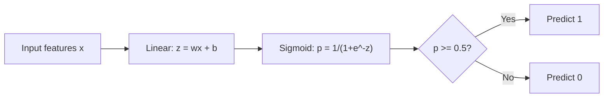
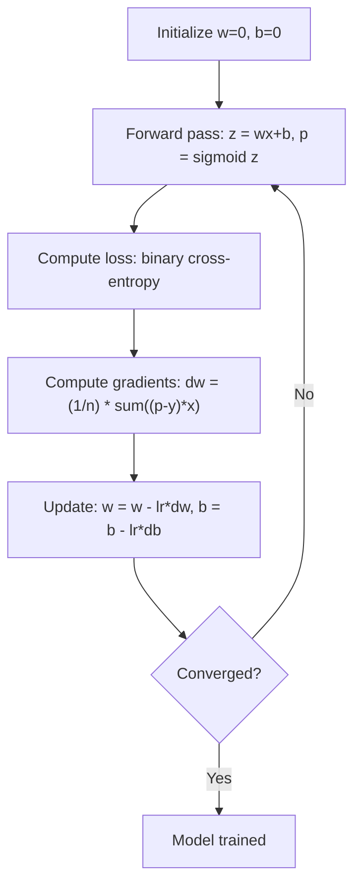

# रसदगत गिरावट
# 逻辑回归


> लॉजिस्टिक रेग्रिशन एक सीधी रेखा को S-क्रव में झुकाता है ताकि संभावनाओं के साथ हाँ या नहीं प्रश्नों का उत्तर दिया जा सके।

> 逻辑回归将直线成 S 形曲线,概率 से उत्तर देना是非问题──

**Type:** Build | **类型：** 构建
**Languages:** Python
**Prerequisites:** Phase 2 Lesson 1-2 (What Is ML, Linear Regression) | **前置知识：** Phase 2 第 1-2 课（什么是机器学习、线性回归）
**Time:** ~90 minutes | **时间：** 约 90 分钟

## सीखने के लक्ष्य

- सिग्मोइड फ़ंक्शन और बाइनरी क्रॉस-एंट्रोपी हानि का उपयोग करके खरोंच से लॉजिस्टिक प्रतिगमन को लागू करें
  शून्य से प्राप्त तर्कगत वापसी, सिग्मोइड  फ़ंक्शन और द्विवार्षिक交叉 हानि
- सटीकता, याद, F1 स्कोर और द्विआधारी वर्गीकरण के लिए भ्रम मैट्रिक्स की गणना और व्याख्या
  計算并解释精确率 (शुद्धता) 召回率 (याद)  F1 分数和混矩阵
- समझाएं कि एमएसई वर्गीकरण में क्यों विफल रहता है और क्यों द्विआधारी क्रॉस-एंट्रोपी एक कंवेक्स लागत सतह पैदा करती है
  解释为什么平均方差 (MSE) 分类任务 के लिए उपयुक्त नहीं है,以及为什么二元交叉能产生凸的价格曲面
- बहु-वर्ग वर्गीकरण के लिए एक softmax प्रतिगमन मॉडल का निर्माण करें और सीमा समायोजन समझौता का मूल्यांकन करें
  构建软max 回归模型进行多类,并评估值调优的权衡


> **【中文解读】**
> 逻辑归归是二分类的基石 函数将线性输出映射到 [0,1] के概率── हालांकि इसे归归 कहा जाता है, लेकिन यह एक分类器── स्क्लेयर में लॉजिस्टिक रिग्रेशन── क्रेडिट कार्ड धोखाधड़ी परीक्षण、 रोग निदान सर्वव्यापी逻辑归归──

> **【拓展：逻辑回归在工业界的广泛应用】**
> फेसबुक की शुरुआती विज्ञापन क्लिक दर पूर्वानुमान प्रणाली तार्किक वापसी पर आधारित है। यह जीबीएमटी विशेषता परियोजना के साथ जुड़ी हुई है। गूगल खोज विज्ञापनों का सीटीआर भी दीर्घकालिक उपयोग तार्किक वापसी पर आधारित है। बाद में इसे गहन सीखने के लिए उन्नत किया गया है।

## समस्या  समस्या परिचय

आप यह अनुमान लगाना चाहते हैं कि क्या एक ट्यूमर उसके आकार को देखते हुए दुर्भावनापूर्ण या सौम्य है। आप रैखिक प्रतिगमन का प्रयास करते हैं। यह 0.3 या 1.7 या -0.5 जैसे संख्याओं का उत्पादन करता है। इसका क्या मतलब है? क्या 1.7 "बहुत दुर्भावनापूर्ण" है? क्या -0.5 "बहुत सौम्य" है? रैखिक प्रतिगमन असीमित संख्याओं का उत्पादन करता है। वर्गीकरण के लिए 0 से 1 के बीच सीमित संभावनाओं की आवश्यकता होती है, और एक स्पष्ट निर्णयः हाँ या नहीं।

> आप क्या सोचते हैं कि यह रोगाणु के आकार के अनुसार बुरा या अच्छा है। आप रैखिक वापसी का प्रयोग करते हैं। यह 0.3 या 1.7 या -0.5 जैसे आंकड़े का उत्पादन करता है। इन आंकड़ों का क्या अर्थ है?1.7 "बहुत बुरा है"?-0.5 "बहुत अच्छा है"? रैखिक वापसी का उत्पादन अनंत संख्याएं है।

लॉजिस्टिक रेग्रिशन इस समस्या का समाधान करता है। यह उसी रैखिक संयोजन (wx + b) को लेता है और इसे सिग्मोइड फ़ंक्शन के माध्यम से पारित करता है, जो किसी भी संख्या को दायरे में कुचल देता है (0, 1). आउटपुट एक संभावना है। आप एक सीमा निर्धारित करते हैं (आमतौर पर 0.5) और एक निर्णय लेते हैं।

> 逻辑归归解决了这个问题──它取同样线性组合 (wx + b),通过Sigmoid 函数将任意数字压缩到 (0, 1) 范围内──输出是一个概率──你设定一个值(通常0.5) 做出决策──

यह अभ्यास में सबसे व्यापक रूप से उपयोग किए जाने वाले एल्गोरिदम में से एक है। इसके नाम के बावजूद, लॉजिस्टिक रेग्रिशन एक वर्गीकरण एल्गोरिदम है, रेग्रिशन एल्गोरिदम नहीं। इसका नाम लॉजिस्टिक (सिग्मोइड) फ़ंक्शन से आता है जिसका यह उपयोग करता है।

> यह अभ्यास में सबसे व्यापक रूप से उपयोग किए जाने वाले एल्गोरिदम में से एक है। हालांकि नाम में "वापस" है, तर्कगत वापसी एक वर्गीकृत एल्गोरिदम है, न कि एक वापसी एल्गोरिदम है।

> **【中文解读】**
> 线性归归不能直接用于分类: इसका आउटपुट है无界的实数(-∞到 +∞), जबकि分类需要0−1 之间的概率──逻辑归归通过Sigmoid 函数将线性输出"挤压"到 (0,1) 区间,从而输出概率──设值(通常0.5)即可做出二分类决策──Sigmoid का导数形式简洁:σ'(z) = σ(z) 1-σ(z)),使梯度计算高效──

## अवधारणा का मूल अवधारणा

### क्यों रैखिक प्रतिगमन वर्गीकरण में विफल रहता है

अध्ययन के घंटों के आधार पर पास/फेल (1/0) की भविष्यवाणी की कल्पना करें। रैखिक प्रतिगमन डेटा के माध्यम से एक रेखा फिट बैठता हैः

> 想象根据学习时间预测通过/不通过(1/0) ――线性归归拟合一根直线穿过数据:

```
hours:  1   2   3   4   5   6   7   8   9   10
actual: 0   0   0   0   1   1   1   1   1   1
```

एक रैखिक फिट 1 घंटे में -0.2 और 10 घंटे में 1.3 जैसी भविष्यवाणियां उत्पन्न कर सकता है। ये मान संभावनाएं नहीं हैं। वे 0 से नीचे और 1 से ऊपर जाते हैं। इससे भी बदतर, एक एकल आउटलियर (किसी ने 50 घंटे का अध्ययन किया) पूरी रेखा को खींच लेगा, सभी के लिए भविष्यवाणियों को बदल देगा।

> 线性拟合可能在 1 小时内产生 -0.2 की पूर्वानुमान, 10 小时内产生 1.3 की पूर्वानुमान। ये मान संभावना नहीं हैं। वे 0 से कम या 1 से अधिक हैं। इससे भी बदतर, एकल असामान्य मूल्य (आपने 50 小时 में अध्ययन किया है) पूरे लाइन को खींच लेगा, मालिकों की पूर्वानुमान को बदल देगा।

वर्गीकरण के लिए एक कार्य की आवश्यकता होती है जोः
- 0 से 1 के बीच के आउटपुट मान (संभाव्यता)
  输出 0  के बीच 1  के बीच मूल्य (概率)
- एक तेज संक्रमण (एक निर्णय सीमा) बनाता है
  创建急剧过渡(决策边界)
- सीमा से दूर विकृति से विकृत नहीं है
  सीमा से दूर नहीं विभोर

> 分类 एक फ़ंक्शन की आवश्यकता है, यह हैः

### सिग्मोइड फ़ंक्शन

सिग्मोइड फ़ंक्शन ठीक यही करता हैः

> सिग्मोइड  फ़ंक्शन恰好 इस बिंदु पर किया गया हैः

```
sigmoid(z) = 1 / (1 + e^(-z))
```

गुण:
- जब z बड़ा और सकारात्मक होता है, तो सिग्मोइड ((z) 1 के करीब आता है
  जब z है बड़ा सही संख्या में,sigmoid(z) 趋近 1
- जब z बड़ा और ऋणात्मक है, तो सिग्मोइड ((z) 0 के करीब आता है
  जब z है बड़ा नकारात्मक संख्या में,sigmoid(z) 趋近0
- जब z = 0, सिग्मोइड(z) = 0.5
  जब z = 0 时,sigmoid(z) = 0.5
- आउटपुट हमेशा 0 से 1 के बीच होता है
  输出始终在0和1 के बीच
- समारोह चिकनी है और हर जगह अंतर
  函数处处平滑可微

व्युत्पन्न का एक सुविधाजनक रूप हैः sigmoid'(z) = sigmoid(z) * (1 - sigmoid(z)). यह ग्रेडिएंट गणना कुशल बनाता है।

> 导数 का एक सुविधाजनक रूप हैः सिग्मोइड'(z) = सिग्मोइड(z) * (1 - सिग्मोइड(z))

### लॉजिस्टिक रिग्रेशन = रैखिक मॉडल + सिग्मोइड

मॉडल z = wx + b (सीधी regression के समान) की गणना करता है, फिर सिग्मोइड लागू करता हैः

> 模型计算 z = wx + b(与线性归归相同), फिर सिग्मोइड को लागू करेंः



आउटपुट p के रूप में व्याख्या की जाती है P ((y=1)) x), संभावना है कि इनपुट वर्ग 1 से संबंधित है निर्णय सीमा है जहां wx + b = 0, जो सिग्मोइड आउटपुट ठीक 0.5 बनाता है।

> 输出 p को P  y=1  x के रूप में व्याख्या की जाती है, यानी输入 श्रेणी 1 के अंतर्गत आता है संभावना                                                                                                                                                                                                                                               

### द्विआधारी क्रॉस-एंट्रोपी हानि

आप लॉजिस्टिक रेग्रेशन के लिए एमएसई का उपयोग नहीं कर सकते। सिग्मोइड के साथ एमएसई कई स्थानीय न्यूनतम के साथ एक गैर-घुंढ लागत सतह बनाता है। इसके बजाय, द्विआधारी क्रॉस-एंट्रोपी (लॉग हानि) का उपयोग करेंः

> आप MSE को उपयोग करके तर्क पर लौट नहीं सकते हैं। MSE को उपयोग करके एक गैर-आकार मूल्य अनुक्रम बनाने के लिए सिग्मोइड के साथ संयोजन में उपयोग करना चाहिए।

```
Loss = -(1/n) * sum(y * log(p) + (1-y) * log(1-p))
```

यह काम क्यों करता हैः
- जब y=1 और p 1: log(1) = 0 के करीब होता है, तो हानि 0 के करीब होती है (सही, कम लागत)
  जब y=1 且 p 接近 1 时:log(1) = 0, हानि निकट 0(正确,低代价)
- जब y=1 और p 0 के करीब होता है: log(0) नकारात्मक अनंत के करीब होता है, तो हानि बहुत बड़ी होती है (गलत, उच्च लागत)
  जब y=1 且 p 接近 0 时:log(0) 趋向负无穷,损失极大(错误,高代价)
- जब y=0 और p 0 के करीब होता हैः log(1) = 0, तो हानि 0 के करीब होती है (सही, कम लागत)
  जब y=0 且 p 接近 0 时:log(1) = 0, हानि निकट 0(正确,低代价)
- जब y=0 और p 1: log(0) के करीब होता है तो नकारात्मक अनंत के करीब होता है, इसलिए हानि बहुत बड़ी होती है (गलत, उच्च लागत)
  जब y=0 且 p 接近 1 时:log(0) 趋向负无穷,损失极大(错误,高代价)

लॉजिस्टिक रिग्रेशन के लिए यह हानि फ़ंक्शन घुमावदार है, जिससे एक वैश्विक न्यूनतम सुनिश्चित होता है।

> यह हानि कार्य तर्कात्मक वापसी के लिए एक कम्फ्यूजन फ़ंक्शन है, यह सुनिश्चित करता है कि एक अद्वितीय समग्र न्यूनतम मूल्य है।

> **【中文解读】**
> क्यों 分类不能使用MSE? क्योंकि MSE + Sigmoid 会产生非凸的损失函数曲面,存在许多局部最小值,梯度下降可能卡住──二元交叉(लॉग हानि) 逻辑归归为凸函数,保证找到全局最优解──核心原理:正确预测时损失趋近0,错误预测且高信度时损失趋向无穷"错得越自信,惩罚越重"──

> **【拓展：交叉熵损失在深度学习中的核心地位】**
> 交叉 हानि केवल तर्कसंगत वापसी के लिए नहीं है, यह सभी प्रकार के तंत्रिका नेटवर्क के लक्षण हानि कार्य है। GPT के भाषा मॉडल प्रशिक्षण मूल रूप से शब्दों के लिए एक सॉफ्टमैक्स + 交叉 हानि है। प्रत्येक चरण का भविष्यवाणी करने के लिए अगले टोकन, एक बार हजारों प्रकार के विभाजन प्रश्न हैं।

### लॉजिस्टिक रिग्रेशन के लिए क्रमिक गिरावट

सिग्मोइड के साथ द्विआधारी क्रॉस-एंट्रोपी के लिए ग्रेडिएंट्स का एक साफ रूप होता हैः

> द्विवचन  सिग्मोइड के साथ एक सरल रूप हैः

```
dL/dw = (1/n) * sum((p - y) * x)
dL/db = (1/n) * sum(p - y)
```

ये रैखिक प्रतिगमन ग्रेडिएंट के समान दिखते हैं। अंतर यह है कि p = sigmoid(wx + b) के बजाय p = wx + b। sigmoid गैर-रेखात्मकता को पेश करता है, लेकिन ग्रेडिएंट अपडेट नियम समान रहता है।

> ये दिखते हैं कि रैखिक वापसी की डिग्री पूरी तरह से समान है।

> **【中文解读】**
> 逻辑归归的梯度公式与线性归归惊人地相似:`dL/dw = (1/n) * sum((p-y)*x)`️ ️ ️ ️ ️ ️ ️ ️ ️ ️ ️ ️ ️ ️ ️ ️ ️ ️ ️ ️ ️ ️ ️ ️ ️ ️ ️ ️ ️ ️ ️ ️ ️ ️ ️ ️ ️ ️ ️ ️ ️ ️ ️ ️ ️ ️ ️ ️ ️ ️ ️ ️ ️ ️ ️ ️ ️ ️ ️ ️ ️ ️ ️ ️ ️ ️ ️ ️ ️ ️ ️ ️ ️ ️ ️ ️ ️ ️ ️ ️ ️ ️ ️ ️ ️ ️ ️ ️ ️ ️ ️ ️ ️ ️ ️ ️ ️ ️ ️ ️ ️ ️ ️ ️ ️ ️ ️ ️ ️ ️ ️ ️ ️ ️ ️ ️ ️ ️ ️ ️ ️ ️ ️ ️ ️ ️ ️ ️ ️ ️ ️ ️ ️ ️ ️ ️ ️ ️ ️ ️ ️ ️ ️ ️ ️ ️ ️ ️ ️ ️ ️  ️ ️  ️   ️ ️  ️   ️    ️       



### निर्णय सीमा

2D इनपुट (दो विशेषताएं) के लिए निर्णय सीमा वह रेखा है जहांः

>  2D 输入 (दो विशेषताएं) के लिए, निर्णय सीमा निम्नलिखित है:

```
w1*x1 + w2*x2 + b = 0
```

एक तरफ के बिंदुओं को 1 के रूप में वर्गीकृत किया जाता है, दूसरी तरफ 0 के रूप में। लॉजिस्टिक प्रतिगमन हमेशा एक रैखिक निर्णय सीमा उत्पन्न करता है। यदि आपको एक घुमावदार सीमा की आवश्यकता है, तो आप या तो बहुपद सुविधाओं को जोड़ते हैं या एक गैर-रेखीय मॉडल का उपयोग करते हैं।

> एक तरफ 1 में विभाजित बिंदुओं को 1 में विभाजित किया जाता है, दूसरी तरफ 0 में विभाजित किया जाता है। तर्कगत वापसी हमेशा रैखिक निर्णय सीमा उत्पन्न करती है। यदि आवश्यक हो तो 曲 की सीमा, आप कई प्रकार के लक्षण जोड़ना चाहते हैं, या गैर रैखिक मॉडल का उपयोग करना चाहते हैं।

### सॉफ्टमैक्स के साथ मल्टी-क्लास वर्गीकरण

द्विआधारी लॉजिस्टिक प्रतिगमन दो वर्गों को संभालता है। k वर्गों के लिए, softmax फ़ंक्शन का उपयोग करेंः

> दो वर्गों का प्रयोग करके सॉफ्टमैक्स फ़ंक्शन का उपयोग किया जाता हैः

```
softmax(z_i) = e^(z_i) / sum(e^(z_j) for all j)
```

प्रत्येक वर्ग का अपना वजन वेक्टर होता है। मॉडल प्रत्येक वर्ग के लिए एक स्कोर z_i की गणना करता है, फिर softmax स्कोर को संभावनाओं में परिवर्तित करता है जो 1 के योग में आता है। अनुमानित वर्ग सबसे अधिक संभावना वाला है।

> प्रत्येक वर्ग का अपना अपना वजन है। प्रत्येक वर्ग के लिए मॉडल एक अंक z_i की गणना करता है, फिर Softmax अंक को कुल और 1 की संभावना में बदल देगा।

हानि फ़ंक्शन श्रेणीगत क्रॉस-एंट्रोपी बन जाती हैः

> 损失函数变为分类交叉:

```
Loss = -(1/n) * sum(sum(y_k * log(p_k)))
```

जहां y_k वास्तविक वर्ग के लिए 1 और अन्य सभी के लिए 0 है (एक-गर्म एन्कोडिंग) ।

> उनमें से एक के लिए वास्तविक वर्ग के लिए 1, अन्य के लिए 0 ((एक गर्म 编码)

### मूल्यांकन मेट्रिक्स

केवल सटीकता ही पर्याप्त नहीं है. 95% नकारात्मक और 5% सकारात्मक डेटासेट के लिए, एक मॉडल जो हमेशा नकारात्मक भविष्यवाणी करता है, 95% सटीकता प्राप्त करता है लेकिन बेकार है।

>  केवल सटीकता दर पर निर्भर करना पर्याप्त नहीं है  95% नकारात्मक उदाहरण के लिए  5% नकारात्मक उदाहरण के लिए डेटा सेट के लिए, एक हमेशा नकारात्मक उदाहरण के लिए पूर्वानुमान मॉडल 95% सटीकता दर प्राप्त करता है लेकिन इसका कोई उपयोग नहीं होता है

**Confusion Matrix**:

> **混淆矩阵**:

| | Predicted Positive | Predicted Negative |
|---|---|---|
| Actually Positive | True Positive (TP) | False Negative (FN) |
| Actually Negative | False Positive (FP) | True Negative (TN) |

| | 预测为正 | 预测为负 |
|---|---|---|
| 实际为正 | 真正例 (TP) | 假负例 (FN) |
| 实际为负 | 假正例 (FP) | 真负例 (TN) |

**Precision**: सभी भविष्यवाणी की गई सकारात्मकताओं में से कितने वास्तव में सकारात्मक हैं?
```
Precision = TP / (TP + FP)
```

> **精确率**सभी पूर्वानुमानों के सही नमूने में, वहाँ कितने वास्तविक सही हैं?

**Recall**(संवेदनशीलता): सभी वास्तविक सकारात्मकताओं में से, हम कितने को पकड़े?
```
Recall = TP / (TP + FN)
```

> **召回率**(संवेदनशीलता): सभी वास्तविक वास्तविक नमूने में से, हम कितना पता चला है?

**F1 Score**: सटीकता और याद करने का सामंजस्यपूर्ण औसत। दोनों मीट्रिकों को संतुलित करता है।
```
F1 = 2 * (Precision * Recall) / (Precision + Recall)
```

> **F1 分数**: सटीकता दर और पुनर्विक्रय दर का समायोजन एवं औसत── दो सूचकांकों का संतुलन──

प्राथमिकताएं कब निर्धारित करेंः
- **Precision**: जब झूठी सकारात्मक लागतें महंगी होती हैं (स्पैम फ़िल्टर, आप वैध ईमेल को ब्लॉक नहीं करना चाहते हैं)
  **精确率**:当假正例代价高时(垃圾邮件过,不想误拦正常邮件)
- **Recall**: जब झूठी नकारात्मक रिपोर्टें महंगी होती हैं (कैंसर स्क्रीनिंग, आप ट्यूमर को याद नहीं करना चाहते)
  **召回率**:当假负例代价高时(癌查,不想漏掉瘤)
- **F1**: जब आपको एक एकल संतुलित मीट्रिक की आवश्यकता होती है
  **F1**: जब एक संतुलन के एकल सूचक की जरूरत होती है

>  प्राथमिकता में कौन सा सूचक विचार करेंः

> **【中文解读】**
> वर्गीकृत मूल्यांकन केवल सटीकता दर को नहीं देख सकता है। श्रेणी में असंतुलन के परिदृश्य में ((उदाहरण के लिए, धोखाधड़ी परीक्षण केवल 0.1% सही है), पूर्ण पूर्वानुमान नकारात्मक उदाहरणों में 99.9% सटीकता दर है लेकिन कोई मूल्य नहीं है। सटीकता दर ध्यान केंद्रित करें" भविष्यवाणी में सही में से कितना सही है", कॉल-अप दर ध्यान केंद्रित करें" वास्तव में सही में से कितना पता चला है"। F1 दोनों का समायोजन है। औसत। चयन करें जो सूचक व्यावसायिक परिदृश्य पर निर्भर करता हैः कचरा मेल फ़िल्टर प्राथमिकता सटीकता दर, कैंसर जांच प्राथमिकता कॉल-अप दर।

> **【拓展：评估指标在真实系统中的选择】**
> Google  खोज की गई कचरे के पृष्ठों की जांच प्राथमिकता सटीकता दर (((नहीं कुछ कचरे के पृष्ठों को छोड़ सकते हैं, न ही सामान्य पृष्ठों को गलत तरीके से कचरे के रूप में ठहरा सकते हैं); चिकित्सा छवि एआई (((जैसे Google स्वास्थ्य में स्तन कैंसर परीक्षण) प्राथमिकता पुनः प्राप्ति दर (((नहीं कुछ झूठे सकारात्मक डॉक्टर को डॉक्टर से रिप्लाई करने के लिए, न ही वास्तविक ट्यूमर को याद करने के लिए); स्वचालित ड्राइविंग के लिए यात्री परीक्षण नियमों की आवश्यकता सटीकता दर और पुनः प्राप्ति दर बहुत अधिक है, F1 अधिक उपयुक्त समग्र सूचक है।
```figure
logistic-sigmoid
```

## इसे बनाओ

### चरण 1: सिग्मोइड फ़ंक्शन और डेटा जनरेशन

```python
import random
import math

def sigmoid(z):
    z = max(-500, min(500, z))  # 裁剪防止数值溢出
    return 1.0 / (1.0 + math.exp(-z))  # Sigmoid 函数：将任意实数映射到 (0,1)


random.seed(42)
N = 200
X = []
y = []

# 生成类别 0 的数据：中心在 (2,2)
for _ in range(N // 2):
    X.append([random.gauss(2, 1), random.gauss(2, 1)])
    y.append(0)

# 生成类别 1 的数据：中心在 (5,5)
for _ in range(N // 2):
    X.append([random.gauss(5, 1), random.gauss(5, 1)])
    y.append(1)

combined = list(zip(X, y))
random.shuffle(combined)
X, y = zip(*combined)
X = list(X)
y = list(y)

print(f"Generated {N} samples (2 classes, 2 features)")
print(f"Class 0 center: (2, 2), Class 1 center: (5, 5)")
print(f"First 5 samples:")
for i in range(5):
    print(f"  Features: [{X[i][0]:.2f}, {X[i][1]:.2f}], Label: {y[i]}")
```

### चरण 2: स्क्रैच से लॉजिस्टिक रिग्रेशन

```python
class LogisticRegression:
    def __init__(self, n_features, learning_rate=0.01):
        self.weights = [0.0] * n_features  # 权重初始化为 0
        self.bias = 0.0  # 偏置初始化为 0
        self.lr = learning_rate  # 学习率
        self.loss_history = []  # 记录训练损失

    def predict_proba(self, x):
        z = sum(w * xi for w, xi in zip(self.weights, x)) + self.bias  # 线性组合 z = wx + b
        return sigmoid(z)  # 通过 Sigmoid 得到概率

    def predict(self, x, threshold=0.5):
        return 1 if self.predict_proba(x) >= threshold else 0  # 概率 >= 阈值则预测为 1

    def compute_loss(self, X, y):
        n = len(y)
        total = 0.0
        for i in range(n):
            p = self.predict_proba(X[i])
            p = max(1e-15, min(1 - 1e-15, p))  # 裁剪防止 log(0)
            # 二元交叉熵损失
            total += y[i] * math.log(p) + (1 - y[i]) * math.log(1 - p)
        return -total / n  # 取负号得到正值损失

    def fit(self, X, y, epochs=1000, print_every=200):
        n = len(y)
        n_features = len(X[0])
        for epoch in range(epochs):
            dw = [0.0] * n_features
            db = 0.0
            for i in range(n):
                p = self.predict_proba(X[i])
                error = p - y[i]  # 预测概率 - 真实标签
                for j in range(n_features):
                    dw[j] += error * X[i][j]  # 累积权重梯度
                db += error  # 累积偏置梯度
            # 梯度下降更新参数
            for j in range(n_features):
                self.weights[j] -= self.lr * (dw[j] / n)
            self.bias -= self.lr * (db / n)
            loss = self.compute_loss(X, y)
            self.loss_history.append(loss)
            if epoch % print_every == 0:
                print(f"  Epoch {epoch:4d} | Loss: {loss:.4f} | w: [{self.weights[0]:.3f}, {self.weights[1]:.3f}] | b: {self.bias:.3f}")
        return self

    def accuracy(self, X, y):
        correct = sum(1 for i in range(len(y)) if self.predict(X[i]) == y[i])
        return correct / len(y)


split = int(0.8 * N)
X_train, X_test = X[:split], X[split:]
y_train, y_test = y[:split], y[split:]

print("\n=== Training Logistic Regression ===")
model = LogisticRegression(n_features=2, learning_rate=0.1)
model.fit(X_train, y_train, epochs=1000, print_every=200)

print(f"\nTrain accuracy: {model.accuracy(X_train, y_train):.4f}")
print(f"Test accuracy:  {model.accuracy(X_test, y_test):.4f}")
print(f"Weights: [{model.weights[0]:.4f}, {model.weights[1]:.4f}]")
print(f"Bias: {model.bias:.4f}")
```

### चरण 3: खरोंच से भ्रमित मैट्रिक्स और मीट्रिक

```python
class ClassificationMetrics:
    def __init__(self, y_true, y_pred):
        # 统计混淆矩阵四个值
        self.tp = sum(1 for t, p in zip(y_true, y_pred) if t == 1 and p == 1)  # 真正例
        self.tn = sum(1 for t, p in zip(y_true, y_pred) if t == 0 and p == 0)  # 真负例
        self.fp = sum(1 for t, p in zip(y_true, y_pred) if t == 0 and p == 1)  # 假正例
        self.fn = sum(1 for t, p in zip(y_true, y_pred) if t == 1 and p == 0)  # 假负例

    def accuracy(self):
        total = self.tp + self.tn + self.fp + self.fn
        return (self.tp + self.tn) / total if total > 0 else 0

    def precision(self):
        denom = self.tp + self.fp
        return self.tp / denom if denom > 0 else 0

    def recall(self):
        denom = self.tp + self.fn
        return self.tp / denom if denom > 0 else 0

    def f1(self):
        p = self.precision()
        r = self.recall()
        return 2 * p * r / (p + r) if (p + r) > 0 else 0

    def print_confusion_matrix(self):
        print(f"\n  Confusion Matrix:")
        print(f"                  Predicted")
        print(f"                  Pos   Neg")
        print(f"  Actual Pos     {self.tp:4d}  {self.fn:4d}")
        print(f"  Actual Neg     {self.fp:4d}  {self.tn:4d}")

    def print_report(self):
        self.print_confusion_matrix()
        print(f"\n  Accuracy:  {self.accuracy():.4f}")
        print(f"  Precision: {self.precision():.4f}")
        print(f"  Recall:    {self.recall():.4f}")
        print(f"  F1 Score:  {self.f1():.4f}")


y_pred_test = [model.predict(x) for x in X_test]
print("\n=== Classification Report (Test Set) ===")
metrics = ClassificationMetrics(y_test, y_pred_test)
metrics.print_report()
```

### चरण 4: निर्णय सीमा विश्लेषण

```python
print("\n=== Decision Boundary ===")
w1, w2 = model.weights
b = model.bias
print(f"Decision boundary: {w1:.4f}*x1 + {w2:.4f}*x2 + {b:.4f} = 0")
if abs(w2) > 1e-10:
    print(f"Solved for x2:     x2 = {-w1/w2:.4f}*x1 + {-b/w2:.4f}")

print("\nSample predictions near the boundary:")
test_points = [
    [3.0, 3.0],
    [3.5, 3.5],
    [4.0, 4.0],
    [2.5, 2.5],
    [5.0, 5.0],
]
for point in test_points:
    prob = model.predict_proba(point)
    pred = model.predict(point)
    print(f"  [{point[0]}, {point[1]}] -> prob={prob:.4f}, class={pred}")
```

### चरण 5: सॉफ्टमैक्स के साथ मल्टी-क्लास

```python
class SoftmaxRegression:
    def __init__(self, n_features, n_classes, learning_rate=0.01):
        self.n_features = n_features
        self.n_classes = n_classes
        self.lr = learning_rate
        self.weights = [[0.0] * n_features for _ in range(n_classes)]
        self.biases = [0.0] * n_classes

    def softmax(self, scores):
        max_score = max(scores)
        exp_scores = [math.exp(s - max_score) for s in scores]
        total = sum(exp_scores)
        return [e / total for e in exp_scores]

    def predict_proba(self, x):
        scores = [
            sum(self.weights[k][j] * x[j] for j in range(self.n_features)) + self.biases[k]
            for k in range(self.n_classes)
        ]
        return self.softmax(scores)

    def predict(self, x):
        probs = self.predict_proba(x)
        return probs.index(max(probs))

    def fit(self, X, y, epochs=1000, print_every=200):
        n = len(y)
        for epoch in range(epochs):
            grad_w = [[0.0] * self.n_features for _ in range(self.n_classes)]
            grad_b = [0.0] * self.n_classes
            total_loss = 0.0
            for i in range(n):
                probs = self.predict_proba(X[i])
                for k in range(self.n_classes):
                    target = 1.0 if y[i] == k else 0.0
                    error = probs[k] - target
                    for j in range(self.n_features):
                        grad_w[k][j] += error * X[i][j]
                    grad_b[k] += error
                true_prob = max(probs[y[i]], 1e-15)
                total_loss -= math.log(true_prob)
            for k in range(self.n_classes):
                for j in range(self.n_features):
                    self.weights[k][j] -= self.lr * (grad_w[k][j] / n)
                self.biases[k] -= self.lr * (grad_b[k] / n)
            if epoch % print_every == 0:
                print(f"  Epoch {epoch:4d} | Loss: {total_loss / n:.4f}")
        return self

    def accuracy(self, X, y):
        correct = sum(1 for i in range(len(y)) if self.predict(X[i]) == y[i])
        return correct / len(y)


random.seed(42)
X_3class = []
y_3class = []

centers = [(1, 1), (5, 1), (3, 5)]
for label, (cx, cy) in enumerate(centers):
    for _ in range(50):
        X_3class.append([random.gauss(cx, 0.8), random.gauss(cy, 0.8)])
        y_3class.append(label)

combined = list(zip(X_3class, y_3class))
random.shuffle(combined)
X_3class, y_3class = zip(*combined)
X_3class = list(X_3class)
y_3class = list(y_3class)

split_3 = int(0.8 * len(X_3class))
X_train_3 = X_3class[:split_3]
y_train_3 = y_3class[:split_3]
X_test_3 = X_3class[split_3:]
y_test_3 = y_3class[split_3:]

print("\n=== Multi-class Softmax Regression (3 classes) ===")
softmax_model = SoftmaxRegression(n_features=2, n_classes=3, learning_rate=0.1)
softmax_model.fit(X_train_3, y_train_3, epochs=1000, print_every=200)
print(f"\nTrain accuracy: {softmax_model.accuracy(X_train_3, y_train_3):.4f}")
print(f"Test accuracy:  {softmax_model.accuracy(X_test_3, y_test_3):.4f}")

print("\nSample predictions:")
for i in range(5):
    probs = softmax_model.predict_proba(X_test_3[i])
    pred = softmax_model.predict(X_test_3[i])
    print(f"  True: {y_test_3[i]}, Predicted: {pred}, Probs: [{', '.join(f'{p:.3f}' for p in probs)}]")
```

### चरण 6: सीमा समायोजन

```python
print("\n=== Threshold Tuning ===")
print("Default threshold: 0.5. Adjusting the threshold trades precision for recall.\n")

thresholds = [0.3, 0.4, 0.5, 0.6, 0.7]
print(f"{'Threshold':>10} {'Accuracy':>10} {'Precision':>10} {'Recall':>10} {'F1':>10}")
print("-" * 52)

for t in thresholds:
    y_pred_t = [1 if model.predict_proba(x) >= t else 0 for x in X_test]
    m = ClassificationMetrics(y_test, y_pred_t)
    print(f"{t:>10.1f} {m.accuracy():>10.4f} {m.precision():>10.4f} {m.recall():>10.4f} {m.f1():>10.4f}")
```

## इसे फ्रेमवर्क के साथ लागू करें

अब वही बात है स्किट-लर्न के साथ।

> अब उसी प्रकार की कार्यक्षमता को प्राप्त करने के लिए थोड़ा-सा सीखना है।

```python
from sklearn.linear_model import LogisticRegression as SklearnLR
from sklearn.metrics import accuracy_score, precision_score, recall_score, f1_score
from sklearn.metrics import confusion_matrix, classification_report
from sklearn.model_selection import train_test_split
from sklearn.preprocessing import StandardScaler
import numpy as np

np.random.seed(42)
X_0 = np.random.randn(100, 2) + [2, 2]
X_1 = np.random.randn(100, 2) + [5, 5]
X_sk = np.vstack([X_0, X_1])
y_sk = np.array([0] * 100 + [1] * 100)

X_tr, X_te, y_tr, y_te = train_test_split(X_sk, y_sk, test_size=0.2, random_state=42)

scaler = StandardScaler()
X_tr_sc = scaler.fit_transform(X_tr)
X_te_sc = scaler.transform(X_te)

lr = SklearnLR()
lr.fit(X_tr_sc, y_tr)
y_pred = lr.predict(X_te_sc)

print("=== Scikit-learn Logistic Regression ===")
print(f"Accuracy:  {accuracy_score(y_te, y_pred):.4f}")
print(f"Precision: {precision_score(y_te, y_pred):.4f}")
print(f"Recall:    {recall_score(y_te, y_pred):.4f}")
print(f"F1:        {f1_score(y_te, y_pred):.4f}")
print(f"\nConfusion Matrix:\n{confusion_matrix(y_te, y_pred)}")
print(f"\nClassification Report:\n{classification_report(y_te, y_pred)}")
```

स्किट-लर्न में सॉल्वर विकल्प (लिबलाइनर, एलबीएफजीएस, सागा), स्वचालित नियमितकरण, बहु-वर्ग रणनीतियाँ (एक बनाम बाकी, बहु-मौजूद) और संख्यात्मक स्थिरता अनुकूलन शामिल हैं।

> आपके शून्य से प्राप्त करने के लिए समान निर्णय सीमा और सूचक हैं।

## इसे भेजें उत्पाद

इस पाठ से उत्पन्न होता हैः
- `code/logistic_regression.py`- मेट्रिक्स के साथ शून्य से लॉजिस्टिक प्रतिगमन

> 本课产出:
> - `code/logistic_regression.py`- शून्य से प्राप्त तर्कगत वापसी तथा मूल्यांकन सूचकांक

## अभ्यास विषय

1. एक डेटासेट उत्पन्न करें जो रैखिक रूप से अलग नहीं है (उदाहरण के लिए, दो केंद्रित वृत्त) । लॉजिस्टिक प्रतिगमन को प्रशिक्षित करें और इसकी विफलता का अवलोकन करें। फिर बहुपद विशेषताओं (x1^2, x2^2, x1*x2) जोड़ें और फिर से प्रशिक्षित करें। दिखाएं कि सटीकता में सुधार होता है।
   1. एक बन गया**非**线性可分的数据集 (जैसे दो सम心圆) ◊ प्रशिक्षण तर्क लौटा और उसकी विफलता को देखें ◊ फिर जोड़ना कई प्रकार के लक्षण ◊ x1^2, x2^2, x1*x2) पुनः प्रशिक्षण ◊ प्रदर्शन सटीकता दर का वृद्धि ◊
2. 3-वर्ग सॉफ्टमैक्स मॉडल के लिए मल्टी-क्लास भ्रम मैट्रिक्स लागू करें। प्रति-वर्ग सटीकता और यादगार गणना करें। किस वर्ग को वर्गीकृत करना सबसे कठिन है?
   2. 3. सॉफ्टमैक्स मॉडल में से अधिकांश वर्गों को मिलाकर रचने की क्षमता का अनुमान लगाएं।
3. आरओसी वक्र को खरोंच से बनाएं। 0 से 1 तक 100 सीमा मानों के लिए, सच्ची सकारात्मक दर और झूठी सकारात्मक दर की गणना करें। ट्रैपेज़ोइडल नियम का उपयोग करके एयूसी (वक्र के नीचे क्षेत्र) की गणना करें।
   3. शून्य से निर्माण आरओसी 曲线──0 से 1 के बीच 100 值 के लिए, वास्तविक घटना दर और झूठी घटना दर──तुल्यता विधि से गणना AUC曲线下面积 (AUC) 

## कीवर्ड्स  शब्द खोज तालिका

| Term | What people say | What it actually means |
|------|----------------|----------------------|
| Logistic regression | "Regression for classification" | A linear model followed by a sigmoid function that outputs class probabilities |
| Sigmoid function | "The S-curve" | The function 1/(1+e^(-z)) that maps any real number to the range (0, 1) |
| Binary cross-entropy | "Log loss" | The loss function -[y*log(p) + (1-y)*log(1-p)] that penalizes confident wrong predictions severely |
| Decision boundary | "The dividing line" | The surface where the model's output probability equals 0.5, separating predicted classes |
| Softmax | "Multi-class sigmoid" | A function that converts a vector of scores into probabilities that sum to 1 |
| Precision | "How many selected are relevant" | TP / (TP + FP), the fraction of positive predictions that are actually positive |
| Recall | "How many relevant are selected" | TP / (TP + FN), the fraction of actual positives that the model correctly identifies |
| F1 score | "Balanced accuracy" | The harmonic mean of precision and recall: 2*P*R / (P+R) |
| Confusion matrix | "The error breakdown" | A table showing TP, TN, FP, FN counts for each class pair |
| Threshold | "The cutoff" | The probability value above which the model predicts class 1 (default 0.5, tunable) |
| One-hot encoding | "Binary columns for categories" | Representing class k as a vector of zeros with a 1 at position k |
| Categorical cross-entropy | "Multi-class log loss" | The extension of binary cross-entropy to k classes using one-hot encoded labels |
