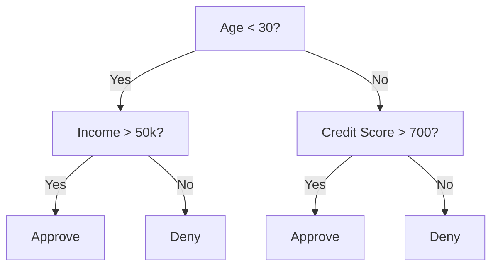
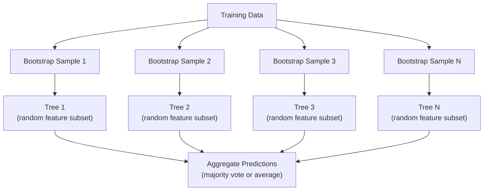

# निर्णय वृक्ष और आकस्मिक वन
# 决策树与随机森林


> निर्णय वृक्ष केवल एक प्रवाह चार्ट है, लेकिन उनमें से एक वन एमएल में सबसे शक्तिशाली उपकरणों में से एक है।

> एक निर्णय वृक्ष एक प्रक्रिया का चित्र है। लेकिन एक वन जो उनमें से बना है, यह मशीन सीखने का सबसे शक्तिशाली उपकरण है।

**Type:** Build | **类型：** 构建
**Language:**पायथन**语言：**पायथन
**Prerequisites:** Phase 1 (Lessons 09 Information Theory, 06 Probability) | **前置知识：** Phase 1（第 9 课信息论、第 6 课概率论）
**Time:** ~90 minutes | **时间：** 约 90 分钟

## सीखने के लक्ष्य

- निर्णय वृक्ष के इष्टतम विभाजन को खोजने के लिए जीनी अशुद्धता, एंट्रोपी और सूचना प्राप्ति गणनाएं लागू करें
                                                                                                                                                                                                                                                                
- पूर्व-संहार नियंत्रणों (अधिकतम गहराई, न्यूनतम नमूने) के साथ निर्णय वृक्ष वर्गीकरण को खरोंच से बनाएं
  निर्णय लेने के लिए एक प्रकार का उपकरण जो कि शून्य से निर्माण के साथ पूर्व-काटना नियंत्रण (अधिकतम गहराई, न्यूनतम नमूना संख्या)
- बूटस्ट्रैप नमूनाकरण और सुविधाओं के यादृच्छिककरण का उपयोग करके एक यादृच्छिक वन का निर्माण करें, और समझाएं कि यह भिन्नता को क्यों कम करता है
  उपयोग Bootstrap 采样和特征随机化随机森林构建,并解释为什么它能降低方差
- एमडीआई विशेषता महत्व की तुलना परमुटेशन महत्व के साथ करें और पहचानें कि एमडीआई पक्षपातपूर्ण कब है
  एमडीआई के लक्षणों के महत्व और प्रतिस्थापन के महत्व की तुलना में एमडीआई के भेदभाव की पहचान


> **【中文解读】**
> 决策树通过 if-else 规则分分数据,随机森林是多个决策树的投票组合之一──sklearn में सबसे आम इस्तेमाल किए जाने वाले मॉडल में से एक──金融风控、医疗诊断中随机森林是基线模型──

> **【拓展：树模型在 Kaggle 和工业界的主导地位】**
> कैगले  संरचनात्मक डेटा प्रतियोगिता में, लगभग 70% जीतने वाले कार्यक्रमों का उपयोग तरक्की वृद्धि वृक्ष (XGBoost/LightGBM/CatBoost)  में वित्तीय क्षेत्र, क्रेडिट मूल्यांकन (FICO) व्यापक रूप से निर्णय वृक्ष परिवर्तन का उपयोग; बैंकों के खिलाफ धोखाधड़ी प्रणाली का उपयोग हमेशा आधार के रूप में किया जाता है; चिकित्सा निदान में,随机森林 का उपयोग पूर्वानुमान पुनः प्रवेश जोखिमों में किया जाता है।

## समस्या  समस्या परिचय

आपके पास तालिकागत डेटा है। पंक्तियां नमूने हैं, कॉलम विशेषताएं हैं, और एक लक्ष्य स्तंभ है जिसे आप भविष्यवाणी करना चाहते हैं। आप उस पर एक तंत्रिका नेटवर्क फेंक सकते हैं। लेकिन तालिकागत डेटा के लिए, पेड़-आधारित मॉडल (निर्णय पेड़, यादृच्छिक जंगल, ग्रेडिएंट बूस्ट पेड़) लगातार गहरे सीखने से बेहतर प्रदर्शन करते हैं। संरचित डेटा पर कैगल प्रतियोगिताओं पर XGBoost और LightGBM का प्रभुत्व है, ट्रांसफार्मर नहीं।

> आप के पास एक नमूना है, एक विशेषता है, एक लक्ष्य है जिसे आप भविष्यवाणी करना चाहते हैं। आप तंत्रिका नेटवर्क का उपयोग करके इसे संसाधित कर सकते हैं। लेकिन निर्णय के पेड़ के लिए, एक निर्णय के पेड़ के लिए, एक परिवर्तनकारी पेड़ के बजाय, XGBoost और LightGBM द्वारा संसाधित किया जाता है।

क्यों? पेड़ पूर्व प्रसंस्करण के बिना मिश्रित विशेषता प्रकार (संख्यात्मक और श्रेणीगत) संभालते हैं। वे सुविधा इंजीनियरिंग के बिना गैर-रैखिक संबंधों को संभालते हैं। वे व्याख्या योग्य हैंः आप पेड़ को देख सकते हैं और सटीक रूप से देख सकते हैं कि भविष्यवाणी क्यों की गई थी। और यादृच्छिक वन, जो कई पेड़ों का औसत है, मध्यम आकार के डेटा सेट पर ओवरफिट करने के लिए अत्यधिक प्रतिरोधी हैं।

> क्यों? वृक्ष मॉडल को पूर्व-प्रक्रिया की आवश्यकता नहीं है मिश्रित विशेषता प्रकारों को संसाधित करने में सक्षम है।

इस पाठ में रिकर्सिव स्प्लिटिंग का उपयोग करके निर्णय के पेड़ को खरोंच से बनाया जाता है, फिर ऊपर पर एक यादृच्छिक जंगल बनाया जाता है। आप विभाजन मानदंडों (गिनी अशुद्धता, एंट्रोपी, सूचना लाभ) के पीछे गणित लागू करेंगे और समझेंगे कि कमजोर शिक्षार्थियों का एक समूह एक मजबूत क्यों बन जाता है।

> इस वर्ग में शून्य से पुनरावृत्ति विभाजन का उपयोग करके निर्णय लेने के पेड़ का निर्माण किया गया है, फिर इसके ऊपर एक साथ जंगल का निर्माण किया गया है।

> **【中文解读】**
> √ √ √ √ √ √ √ √ √ √ √ √ √ √ √ √ √ √ √ √ √ √ √ √ √ √ √ √ √ √ √ √ √ √ √ √ √ √ √ √ √ √ √ √ √ √ √ √ √ √ √ √ √ √ √ √ √ √ √ √ √ √ √ √ √ √ √ √ √ √ √ √ √ √ √ √ √ √ √ √ √ √ √ √ √ √ √ √ √ √ √ √ √ √ √ √ √ √ √ √ √ √ √ √ √ √ √ √ √ √ √ √ √ √ √ √ √ √ √ √ √ √ √ √ √ √ √ √ √ √ √ √ √ √ √ √ √ √ √ √ √ √ √ √ √ √ √ √ √ √ √ √ √ √ √ √ √ √ √ √ √ √ √ √ √ √ √ √ √ √ √ √ √ √ √ √ √ √ √ √ √ √ √ √ √ √ √ √ √ √ √ √ √ √ √ √ √ √ √ √ √ √ √ √ √ √ √ √ √ √ √ √ √ √ √ √ √ √ √ √ √ √ √ √ √ √ √ √ √ √ √ √ √ √ √ √ √ √ √ √ √ √ √ √ √ √ √ √ √ √ √ √ √ √ √

## अवधारणा का मूल अवधारणा

### निर्णय वृक्ष क्या करता है

निर्णय वृक्ष एक अनुक्रम के हां/नहीं प्रश्न पूछकर विशेषता स्थान को आयताकार क्षेत्रों में विभाजित करता है।

> 决策树通过一系列非问题将特征空间分为矩形区域――



प्रत्येक आंतरिक नोड एक विशेषता का एक सीमा के खिलाफ परीक्षण करता है। प्रत्येक पत्ती नोड एक भविष्यवाणी करता है। एक नए डेटा बिंदु को वर्गीकृत करने के लिए, आप जड़ से शुरू करते हैं और शाखाओं का पालन करते हैं जब तक आप एक पत्ती तक नहीं पहुंचते।

> प्रत्येक आंतरिक नोट एक विशेषता और मूल्य की तुलना करेगा। प्रत्येक पाना नोट एक नई डेटा पोइंट की श्रेणी में लाया जाएगा, जड़ नोट से शुरू होकर शाखा के साथ होकर पाना नोट तक।

प्रत्येक नोड पर, वह विशेषता और सीमा चुनकर पेड़ ऊपर से नीचे बनाया जाता है जो डेटा को सबसे अच्छा अलग करता है। "सर्वश्रेष्ठ" को एक विभाजन मानदंड द्वारा परिभाषित किया जाता है।

> 树自顶向下构建, प्रत्येक节点中选择最能分离数据的特征和值――"सर्वश्रेष्ठ" विभाजन मानदंड द्वारा परिभाषित है――

### विभाजन मानदंडः अशुद्धता का माप

प्रत्येक नोड पर, हमारे पास नमूने का एक सेट है. हम उन्हें विभाजित करना चाहते हैं ताकि परिणामस्वरूप बच्चे नोड जितना संभव हो उतना "शुद्ध" हो, जिसका अर्थ है कि प्रत्येक बच्चे में ज्यादातर एक वर्ग होता है।

> प्रत्येक खंड में, हमारे पास एक नमूना है। हम उन्हें विभाजित करना चाहते हैं ताकि प्रत्येक खंड में एक वर्ग हो।

**Gini impurity**यह इस बात की संभावना को मापता है कि यदि उस नोड पर वर्ग वितरण के अनुसार लेबल किया गया तो यादृच्छिक रूप से चुने गए नमूने को गलत वर्गीकृत किया जाएगा।

> **Gini 不纯度**️ किसी आकस्मिक चयन के नमूने का माप करें यदि उस खंड के वर्ग वितरण के अनुसार चिह्नित किया गया है, तो गलत वर्गीकरण की संभावना है

```
Gini(S) = 1 - sum(p_k^2)

where p_k is the proportion of class k in set S.
```

एक शुद्ध नोड (सभी एक वर्ग) के लिए, Gini = 0. 50/50 वर्गों के साथ द्विआधारी विभाजन के लिए, Gini = 0.5. निचला बेहतर है।

> 对于纯节点(全是一个类别),Gini = 0──对于 50/50 के द्विवचन,Gini = 0.5──越低越好──

```
Example: 6 cats, 4 dogs

Gini = 1 - (0.6^2 + 0.4^2) = 1 - (0.36 + 0.16) = 0.48
```

**Entropy**एक नोड में सूचना सामग्री (अराजकता) को मापता है। चरण 1 पाठ 09 में शामिल है।

> **熵**衡量节点中的信息内容 (message) 混乱度 (混乱度)                                                                                                                                                                                                                                                     

```
Entropy(S) = -sum(p_k * log2(p_k))
```

एक शुद्ध नोड के लिए, एंट्रोपी = 0. 50/50 द्विआधारी विभाजन के लिए, एंट्रोपी = 1.0. निचला बेहतर है।

> 对于纯节点, = 0──对于 50/50 के二元分裂, = 1.0──越低越好──

```
Example: 6 cats, 4 dogs

Entropy = -(0.6 * log2(0.6) + 0.4 * log2(0.4))
        = -(0.6 * -0.737 + 0.4 * -1.322)
        = 0.442 + 0.529
        = 0.971 bits
```

**Information gain**विभाजन के बाद अशुद्धता (एंट्रोपी या जिनी) में कमी है।

> **信息增益** या  की घटती हुई मात्रा

```
IG(S, feature, threshold) = Impurity(S) - weighted_avg(Impurity(S_left), Impurity(S_right))

where the weights are the proportions of samples in each child.
```

प्रत्येक नोड पर लालची एल्गोरिथ्मः हर सुविधा और हर संभव सीमा का परीक्षण करें। (विशेषता, सीमा) जो जानकारी की अधिकतम प्राप्ति का चयन करें।

> प्रत्येक बिंदु का व्याप्तिकरण एल्गोरिथ्म: प्रत्येक विशेषता और प्रत्येक संभावित मूल्य का प्रयास करें।

> **【中文解读】**
> विभाजन मानक मापने के लिए "अशुद्धता" के बिंदुओं में। ग्यापीयता का अर्थ है कि "अशुद्धता" के लिए एक महत्वपूर्ण तत्व है।

### विभाजन कैसे काम करता है

वर्तमान नोड पर n विशेषताएं और m नमूने वाले डेटासेट के लिएः

> 对于有 n 个特征和 m 个样本的当前节点:

1. प्रत्येक विशेषता j (j = 1 से n) के लिएः
    प्रत्येक विशेषता के लिए j(j = 1 से n):
   - नमूने को विशेषता j के अनुसार क्रमबद्ध करें
     पॉइंट के अनुसार j प्रति नमूना क्रम
   - एक सीमा के रूप में लगातार अलग मूल्यों के बीच प्रत्येक मध्य बिंदु की कोशिश करें
     尝试 प्रति प्रति आसन्न भिन्न मूल्य के मध्य बिंदु के रूप मेंमूल्य
   - प्रत्येक सीमा के लिए सूचना प्राप्ति की गणना करें
     计算每值的信息增益
2. उच्चतम सूचना प्राप्त करने वाली विशेषता और सीमा का चयन करें
   选择信息增益 सर्वाधिक विशेषताएं एवं मूल्य
3. डेटा को बाएं (विशेषता <= सीमा) और दाएं (विशेषता > सीमा) में विभाजित करें
   डेटा को बाएं में विभाजित करना (विशेषण <= मूल्य) और दाएं में विभाजित करना (विशेषण > मूल्य)
4. प्रत्येक बच्चे पर पुनरावृत्ति
   प्रत्येक सेक्टर के लिए

इस लोभी दृष्टिकोण से वैश्विक रूप से इष्टतम पेड़ की गारंटी नहीं मिलती है। इष्टतम पेड़ को ढूंढना NP- कठिन है। लेकिन लोभी विभाजन व्यवहार में अच्छी तरह से काम करता है।

> इस प्रकार की लालच का तरीका पूरे क्षेत्र में सबसे अच्छा पेड़ नहीं सुनिश्चित करता है। सबसे अच्छा पेड़ ढूंढना NP-hard है। लेकिन लालच का विभाजन अभ्यास में बहुत अच्छा प्रभाव पड़ता है।

### रोकने की शर्तें

बिना रुके हुए परिस्थितियों के, पेड़ तब तक बढ़ता है जब तक कि हर पत्ती शुद्ध नहीं हो जाती (पत्ती पर एक नमूना) । यह प्रशिक्षण डेटा को पूरी तरह से याद करता है और भयानक रूप से सामान्य करता है।

>  बिना रुके शर्त, पेड़ बढ़ता रहा जब तक प्रत्येक पत्ते का एक बिंदु शुद्ध नहीं होता

**Pre-pruning**वृक्ष को पूरी तरह से बढ़ने से पहले रोकता हैः
- अधिकतम गहराईः वृक्ष की एक निर्धारित गहराई तक पहुंचने पर विभाजन बंद हो जाता है
  अधिकतम गहराई: जब पेड़ एक निश्चित गहराई तक पहुंचता है तो विभाजन बंद हो जाता है
- प्रति पत्ती न्यूनतम नमूनेः यदि नोड में k से कम नमूने हैं तो रोकें
  प्रति पाना न्यूनतम नमूना संख्याः यदि बिंदु k से कम है तो नमूना रुक जाता है
- न्यूनतम सूचना प्राप्तिः यदि सर्वोत्तम विभाजन एक सीमा से कम अशुद्धता में सुधार करता है तो रोकें
  ️️️️️️️️️️️️️️️️️️️️️️️️️️️️️️️️️️️️️️️️️️️️️️️️️️️️️️️️️️️️️️️️️️️️️️️️️️️️️️️️️️️️️️️️️️️️️️️️️️️️️️️️️️️️️️️️️️️️️️️️️️️️️️️️️️️️️️️️️️️️️️️️️️️️️️️
- अधिकतम पत्ते के नोड्सः पत्ते की कुल संख्या को सीमित करें
  अधिकतम अंक संख्याः सीमित अंक संख्या

**Post-pruning**और वह (आख़िर) पूरे पेड़ को उगाएगा और फिर उसे (फौरन) काट डालेगा
- लागत-कम्प्लेक्सता का काटना (स्किट-लर्न द्वारा प्रयोग किया जाता है): पत्तियों की संख्या के समानुपातिक दंड जोड़ता है। छोटे पेड़ प्राप्त करने के लिए दंड बढ़ाएं
  代价复杂度剪枝(skikit-learn 使用): जोड़ना और पत्ते के घटकों की संख्या में सुधार करना
- त्रुटि का कम करने का उपायः यदि सत्यापन त्रुटि बढ़ी नहीं है तो एक उपवृक्ष को हटा दें
  减差剪枝: यदि सत्यापन त्रुटि नहीं बढ़ी, तो वृक्ष हटाया जाए

पहले काटना आसान और तेज़ होता है। काटना के बाद अक्सर बेहतर पेड़ पैदा होते हैं क्योंकि इससे पहले काटना नहीं रुकता है जिससे आगे काटना उपयोगी हो सकता है।

> 预剪枝更简单更快――后剪枝通常产生更好的树,因为它不会过早停止可能带来有用后续分裂节点――

### विघटन के लिए निर्णय के पेड़

पुनरावृत्ति के लिए, पाना भविष्यवाणी उस पाना में लक्ष्य मानों का औसत है। विभाजन मानदंड भी बदलता हैः

>  वापसी के लिए, 节点 का पूर्वानुमान 叶中目标值 का औसत मूल्य है विभाजन मानदंड भी बदल गए हैंः

**Variance reduction**सूचना प्राप्ति की जगह लेती हैः

> **方差减少**替代了信息增益:

```
VR(S, feature, threshold) = Var(S) - weighted_avg(Var(S_left), Var(S_right))
```

उस विभाजन को चुनें जो सबसे ज्यादा भिन्नता को कम करता है। पेड़ इनपुट स्पेस को क्षेत्रों में विभाजित करता है, और प्रत्येक क्षेत्र में एक स्थिर (औसत) की भविष्यवाणी करता है।

> 选择方差减少最多的分裂──树将输入空间划分为区域,在每个区域预测一个常数平均值)──

### यादृच्छिक वनः समूहों की शक्ति

एक ही निर्णय वृक्ष में उच्च भिन्नता होती है। डेटा में छोटे बदलाव पूरी तरह से अलग-अलग पेड़ पैदा कर सकते हैं। यादृच्छिक वन कई पेड़ों को औसत करके इसे ठीक करते हैं।

> एक ही निर्णय वृक्ष में उच्च अंतर होता है  डेटा के छोटे-छोटे परिवर्तन से पूरी तरह से अलग-अलग वृक्ष उत्पन्न होते हैं एक ही समय में वनों में औसत संख्या में पेड़ होते हैं 



दो प्रकार की यादृच्छिकता वृक्षों को विविध बनाती हैः

>  दो प्रकार के आकस्मिक स्रोत वृक्षों को विविधता प्रदान करते हैंः

**Bagging (bootstrap aggregating):**प्रत्येक पेड़ को एक बूटस्ट्रैप नमूने पर प्रशिक्षित किया जाता है, प्रशिक्षण डेटा से प्रतिस्थापन के साथ एक यादृच्छिक नमूना। प्रत्येक बूटस्ट्रैप में मूल नमूनों के लगभग 63% दिखाई देते हैं (बचे हुए बैग के बाहर नमूने हैं जिनका उपयोग सत्यापन के लिए किया जा सकता है) ।

> **Bagging（Bootstrap 聚合）**: प्रत्येक पेड़ में बोटस्ट्राप ्सैम्पल पर प्रशिक्षण, अर्थात प्रशिक्षण डेटा से वापस निकाले गए प्रकार के यादृच्छिक नमूने में से लगभग 63% के मूल नमूने प्रत्येक बोटस्ट्राप में दिखाई देते हैं। शेष बैग के बाहर नमूने हैं, परीक्षण के लिए उपयोग किया जा सकता है) 

**Feature randomization:**प्रत्येक विभाजन पर, केवल सुविधाओं के एक यादृच्छिक उपसमूह पर विचार किया जाता है। वर्गीकरण के लिए, डिफ़ॉल्ट sqrt(n_विशेषताओं है। प्रतिगमन के लिए, n_विशेषताओं/3. यह सभी पेड़ों को एक ही प्रमुख विशेषता पर विभाजित होने से रोकता है।

> **特征随机化**: प्रत्येक विभाजन में, केवल प्रत्येक समूह के लक्षणों पर विचार करें।

मुख्य अंतर्दृष्टिः कई विकोरेटेड पेड़ों का औसत बढ़ते पक्षपात के बिना भिन्नता को कम करता है। प्रत्येक व्यक्तिगत पेड़ मध्यम हो सकता है। समूह मजबूत है।

> 核心洞察: औसत से कई संबंधित पेड़ अंतर को कम कर सकते हैं और अंतर को नहीं बढ़ा सकते हैं। प्रत्येक अलग-अलग पेड़ को समान रूप से समतल किया जा सकता है, लेकिन एकीकरण मजबूत है।

> **【中文解读】**
> 随机森林 के दो केंद्रीय随机化机制: 1) बैगिंग प्रत्येक पेड़ के उपयोग से 有放回抽样 (प्रारंभिक नमूना का लगभग 63% है) प्रशिक्षण; 2) विशेषताएं 随机化 प्रत्येक विभाजन केवल随机子集 के लक्षणों को ध्यान में रखता है分类任务默认 √n 个)  ये दोनों तंत्र पेड़ के बीच पर्याप्त "अलग" बनाते हैं, औसत के बाद भारी मात्रा में अंतर कम करते हैं, जबकि अंतर नहीं बढ़ते हैं यह "तीन गंधकड़ी शीर्ष 诸葛亮" का गणितीय प्रमाण है

> **【拓展：随机森林 vs 梯度提升树】**
> 随机森林是并行训练(各树独立),适合快速原型开发,几乎不需要调调参;;梯度提升树(XGBoost/LightGBM/CatBoost) 随行训练(每棵树纠正前一棵的错误),精度通常更高但更容易过适应── Kaggle 竞赛中,XGBoost लगभग 60% के विजेता方案 में दिखाई दिया──实际项目中常用策略:先用随机森林做基线,再用 XGBoost 追求极致性能──

### विशेषता महत्व

यादृच्छिक वन स्वाभाविक रूप से विशेषता महत्व स्कोर प्रदान करते हैं। सबसे आम विधिः

> 随机森林天然提供特征重要性分数── सबसे आम तरीकेः

**Mean Decrease in Impurity (MDI):**प्रत्येक विशेषता के लिए, सभी पेड़ों और उन सभी नोड्स में अशुद्धता में कुल कमी का योग करें जहां उस विशेषता का उपयोग किया जाता है। विशेषताएं जो पहले के विभाजन में अधिक अशुद्धता में कमी पैदा करती हैं, वे अधिक महत्वपूर्ण हैं।

> **平均不纯度减少（MDI）**: प्रत्येक विशेषता के लिए, उस विशेषता के सभी उपयोग के वृक्ष और नोड पर मांग और असंतोष की कुल कमी की मात्रा में अधिक महत्वपूर्ण है।

```
importance(feature_j) = sum over all nodes where feature_j is used:
    (n_samples_at_node / n_total_samples) * impurity_decrease
```

यह तेज (प्रशिक्षण के दौरान गणना) है, लेकिन कई संभावित विभाजन बिंदुओं के साथ उच्च कार्डिनलता सुविधाओं और सुविधाओं की ओर पूर्वाग्रह है।

> यह बहुत ही तेजी से है लेकिन उच्च-सूचीकृत विशेषताएं और कई संभावित विभाजन बिंदु विशेषताएं हैं।

**Permutation importance**विकल्पः एक विशेषता के मानों को मिलाएं और मापें कि मॉडल की सटीकता कितनी कम होती है। अधिक विश्वसनीय लेकिन धीमा।

> **置换重要性**                                                                                                                                                                                                                                                              

> **【拓展：特征重要性的陷阱】**
> एमडीआई विशेषताओं के महत्व में दो ज्ञात मतभेद हैंः 1) उच्च आधार संख्यात्मक विशेषताएं (जैसे उपयोगकर्ता आईडी) का उच्च महत्व होगा, क्योंकि अधिक विभाजन बिंदुओं का चयन किया जा सकता है; 2) संबंधित विशेषताओं के बीच एक विभाजन महत्व होगा, जिससे प्रत्येक को इतना महत्वपूर्ण नहीं लगता है।

### जब पेड़ों ने तंत्रिका नेटवर्क को हराया

पेड़ और वन तालिकागत डेटा पर तंत्रिका नेटवर्क पर हावी हैं। कई कारण हैंः

> 树和森林在表格数据上优于神经网络── कारण निम्नानुसार हैंः

| Factor | Trees | Neural networks |
|--------|-------|----------------|
| Mixed types (numeric + categorical) | Native support | Need encoding |
| Small datasets (< 10k rows) | Work well | Overfit |
| Feature interactions | Found by splitting | Need architecture design |
| Interpretability | Full transparency | Black box |
| Training time | Minutes | Hours |
| Hyperparameter sensitivity | Low | High |

| 因素 | 树模型 | 神经网络 |
|------|-------|---------|
| 混合类型（数值 + 类别） | 原生支持 | 需要编码 |
| 小数据集（< 1 万行） | 表现良好 | 容易过拟合 |
| 特征交互 | 通过分裂自动发现 | 需要架构设计 |
| 可解释性 | 完全透明 | 黑盒 |
| 训练时间 | 分钟级 | 小时级 |
| 超参数敏感度 | 低 | 高 |

न्यूरल नेटवर्क तब जीतते हैं जब डेटा में स्थानिक या अनुक्रमिक संरचना (छवि, पाठ, ऑडियो) होती है। सुविधाओं की सपाट तालिकाओं के लिए, पेड़ों डिफ़ॉल्ट रूप से होते हैं।

> जब डेटा में एक स्थानिक या क्रम संरचना होती है, तो तंत्रिका नेटवर्क अधिक से अधिक एक चकचकी होती है।

## इसे बनाओ, इसे पूरा करो।
```figure
decision-tree-depth
```

## इसे बनाओ

### चरण 1: जिनी अशुद्धता और एंट्रॉपी

दोनों विभाजन मानदंडों को खरोंच से बनाएं और वे किस विभाजन पर सहमत हैं, इसकी पुष्टि करें।

> दो विभाजन मानदंडों के निर्माण से यह सत्यापित करना कि वे किस विभाजन में अच्छी तरह से सहमत हैं।

```python
import math

def gini_impurity(labels):
    n = len(labels)
    if n == 0:
        return 0.0
    counts = {}
    for label in labels:
        counts[label] = counts.get(label, 0) + 1  # 统计每个类别的出现次数
    # Gini = 1 - sum(p_k^2)，衡量节点的不纯度
    return 1.0 - sum((c / n) ** 2 for c in counts.values())

def entropy(labels):
    n = len(labels)
    if n == 0:
        return 0.0
    counts = {}
    for label in labels:
        counts[label] = counts.get(label, 0) + 1
    # Entropy = -sum(p_k * log2(p_k))，信息论中的不确定性度量
    return -sum(
        (c / n) * math.log2(c / n) for c in counts.values() if c > 0
    )
```

### चरण 2: सबसे अच्छा विभाजन खोजें

हर सुविधा और हर सीमा का परीक्षण करें। सबसे अधिक जानकारी प्राप्त करने वाले को लौटाएं।

> 尝试每特征和每值──回复信息增益最高的──

```python
def information_gain(parent_labels, left_labels, right_labels, criterion="gini"):
    measure = gini_impurity if criterion == "gini" else entropy  # 选择不纯度度量
    n = len(parent_labels)
    n_left = len(left_labels)
    n_right = len(right_labels)
    if n_left == 0 or n_right == 0:
        return 0.0  # 空节点无法产生信息增益
    parent_impurity = measure(parent_labels)  # 父节点不纯度
    # 子节点加权不纯度
    child_impurity = (
        (n_left / n) * measure(left_labels) +
        (n_right / n) * measure(right_labels)
    )
    # 信息增益 = 父节点不纯度 - 子节点加权不纯度
    return parent_impurity - child_impurity
```

### चरण 3: निर्णय वृक्ष वर्ग का निर्माण करें

पुनरावर्ती विभाजन, भविष्यवाणी, और विशेषता महत्व ट्रैकिंग। `_build`यह वृक्ष का हृदय है: यह बंद हो जाता है जब एक नोड शुद्ध हो जाता है या एक पूर्व-संहार सीमा पर पहुंच जाता है, अन्यथा यह सबसे अच्छा विभाजन लेता है और दोनों बच्चों में फिर से होता है।

> 递归分裂、预测和特征重要性追踪──

```python
import random

class DecisionTree:
    def __init__(self, max_depth=None, min_samples_split=2,
                 min_samples_leaf=1, criterion="gini",
                 max_features=None):
        self.max_depth = max_depth
        self.min_samples_split = min_samples_split
        self.min_samples_leaf = min_samples_leaf
        self.criterion = criterion
        self.max_features = max_features
        self.tree = None
        self.feature_importances_ = None

    def fit(self, X, y):
        self.n_features = len(X[0])
        self.feature_importances_ = [0.0] * self.n_features
        self.n_samples = len(X)
        self.tree = self._build(X, y, depth=0)
        total = sum(self.feature_importances_)
        if total > 0:
            self.feature_importances_ = [
                fi / total for fi in self.feature_importances_
            ]

    def predict(self, X):
        return [self._predict_one(x, self.tree) for x in X]

    def _build(self, X, y, depth):
        if len(set(y)) == 1:
            return {"leaf": True, "value": y[0]}

        if self.max_depth is not None and depth >= self.max_depth:
            return self._make_leaf(y)

        if len(y) < self.min_samples_split:
            return self._make_leaf(y)

        best_feature, best_threshold, best_gain = self._best_split(X, y)

        if best_feature is None or best_gain <= 0:
            return self._make_leaf(y)

        left_X, left_y, right_X, right_y = self._split_data(
            X, y, best_feature, best_threshold
        )

        if len(left_y) < self.min_samples_leaf or len(right_y) < self.min_samples_leaf:
            return self._make_leaf(y)

        weight = len(y) / self.n_samples
        self.feature_importances_[best_feature] += weight * best_gain

        return {
            "leaf": False,
            "feature": best_feature,
            "threshold": best_threshold,
            "left": self._build(left_X, left_y, depth + 1),
            "right": self._build(right_X, right_y, depth + 1),
        }

    def _make_leaf(self, y):
        counts = {}
        for label in y:
            counts[label] = counts.get(label, 0) + 1
        return {"leaf": True, "value": max(counts, key=counts.get)}

    def _best_split(self, X, y):
        best_feature = None
        best_threshold = None
        best_gain = -1.0

        if self.max_features == "sqrt":
            k = max(1, int(math.sqrt(self.n_features)))
            feature_indices = random.sample(range(self.n_features), k)
        elif isinstance(self.max_features, int):
            if self.max_features < 1:
                raise ValueError("max_features must be at least 1 when given as an integer")
            k = min(self.max_features, self.n_features)
            feature_indices = random.sample(range(self.n_features), k)
        else:
            feature_indices = list(range(self.n_features))

        for feature_idx in feature_indices:
            values = sorted(set(X[i][feature_idx] for i in range(len(X))))
            if len(values) <= 1:
                continue

            for i in range(len(values) - 1):
                threshold = (values[i] + values[i + 1]) / 2.0
                left_y = [y[j] for j in range(len(X)) if X[j][feature_idx] <= threshold]
                right_y = [y[j] for j in range(len(X)) if X[j][feature_idx] > threshold]

                if len(left_y) < self.min_samples_leaf or len(right_y) < self.min_samples_leaf:
                    continue

                gain = information_gain(y, left_y, right_y, self.criterion)
                if gain > best_gain:
                    best_gain = gain
                    best_feature = feature_idx
                    best_threshold = threshold

        return best_feature, best_threshold, best_gain

    def _split_data(self, X, y, feature, threshold):
        left_X, left_y, right_X, right_y = [], [], [], []
        for i in range(len(X)):
            if X[i][feature] <= threshold:
                left_X.append(X[i])
                left_y.append(y[i])
            else:
                right_X.append(X[i])
                right_y.append(y[i])
        return left_X, left_y, right_X, right_y

    def _predict_one(self, x, node):
        if node["leaf"]:
            return node["value"]
        if x[node["feature"]] <= node["threshold"]:
            return self._predict_one(x, node["left"])
        return self._predict_one(x, node["right"])
```

### चरण 4: रैंडम फॉरेस्ट कक्षा का निर्माण करें

बूटस्ट्रैप नमूना, सुविधाओं के यादृच्छिककरण, और बहुमत मतदान।

> बूटस्ट्रैप 采样、特征随机化和多数投票──

```python
class RandomForest:
    def __init__(self, n_trees=100, max_depth=None,
                 min_samples_split=2, max_features="sqrt",
                 criterion="gini"):
        self.n_trees = n_trees
        self.max_depth = max_depth
        self.min_samples_split = min_samples_split
        self.max_features = max_features
        self.criterion = criterion
        self.trees = []

    def fit(self, X, y):
        n = len(X)
        for _ in range(self.n_trees):
            indices = [random.randint(0, n - 1) for _ in range(n)]
            X_boot = [X[i] for i in indices]
            y_boot = [y[i] for i in indices]
            tree = DecisionTree(
                max_depth=self.max_depth,
                min_samples_split=self.min_samples_split,
                max_features=self.max_features,
                criterion=self.criterion,
            )
            tree.fit(X_boot, y_boot)
            self.trees.append(tree)

    def predict(self, X):
        all_preds = [tree.predict(X) for tree in self.trees]
        predictions = []
        for i in range(len(X)):
            votes = {}
            for preds in all_preds:
                v = preds[i]
                votes[v] = votes.get(v, 0) + 1
            predictions.append(max(votes, key=votes.get))
        return predictions
```

देखो`code/trees.py`सभी सहायक तरीकों के साथ पूर्ण कार्यान्वयन के लिए।

> 完整实现(含所有辅助方法)见 `code/trees.py`

## इसे फ्रेमवर्क के साथ लागू करें

> **【中文解读】**
> sklearn के随机森林 केवल तीन पंक्ति कोड की आवश्यकता हैः बनाना分类器 → फिट → स्कोर。 लेकिन अभ्यास में ध्यान देने की आवश्यकता हैःn_estimators(वृक्षों की संख्या) आमतौर पर 100-500 पर पर्याप्त है,随机森林 लगभग नहीं होगा क्योंकि पेड़ बहुत अधिक है;max_features  नियंत्रित प्रत्येक विभाजन विचार की विशेषताएं संख्या,默认√n है अनुभव के लिए सबसे अच्छा मूल्य── उच्च प्रदर्शन के लिए, XGBoost या LightGBM का उपयोग करें。

स्किट-लर्न के साथ, एक यादृच्छिक जंगल को प्रशिक्षित करने में तीन पंक्तियां होती हैंः

> प्रयोग स्किट-लर्न, प्रशिक्षण随机森林只需三行代码:

```python
from sklearn.ensemble import RandomForestClassifier
from sklearn.datasets import load_iris
from sklearn.model_selection import train_test_split

X, y = load_iris(return_X_y=True)  # 加载鸢尾花数据集
X_train, X_test, y_train, y_test = train_test_split(X, y, random_state=42)  # 划分训练/测试集

rf = RandomForestClassifier(n_estimators=100, random_state=42)  # 100 棵树的随机森林
rf.fit(X_train, y_train)  # 训练
print(f"Accuracy: {rf.score(X_test, y_test):.4f}")  # 评估准确率
print(f"Feature importances: {rf.feature_importances_}")
```

अभ्यास में, ग्रेडिएंट बूस्ट पेड़ (XGBoost, LightGBM, CatBoost) अक्सर यादृच्छिक वनों की तुलना में मजबूत होते हैं क्योंकि वे पेड़ क्रमशः बनाते हैं, प्रत्येक पेड़ पिछले की त्रुटियों को सुधारता है। लेकिन यादृच्छिक वनों को गलत कॉन्फ़िगर करना मुश्किल होता है और लगभग कोई हाइपरपैरामीटर ट्यूनिंग की आवश्यकता नहीं होती है।

> अभ्यास में, पेड़ वृद्धि की दर (XGBoost, LightGBM, CatBoost) आमतौर पर जंगल के निर्माण की क्रम से अधिक होती है, क्योंकि प्रत्येक पेड़ एक से पहले एक की गलती को ठीक करता है।

## इसे भेजें उत्पाद

यह सबक हमें फल देता है`outputs/prompt-tree-interpreter.md`- एक प्रॉम्प्ट जो व्यवसाय हितधारकों के लिए निर्णय वृक्ष विभाजन की व्याख्या करता है। इसे एक प्रशिक्षित पेड़ की संरचना (गंभीरता, विशेषताएं, विभाजित सीमाएं, सटीकता) खिलाता है और यह मॉडल को सादे-भाषा के नियमों में अनुवाद करता है, विशेषता महत्व को रैंक करता है, ध्वज ओवरफitting या लीक, और अगले चरणों की सिफारिश करता है। इसका उपयोग किसी ऐसे व्यक्ति को जब भी आपको पेड़ आधारित मॉडल की व्याख्या करने की आवश्यकता हो, जो कोड नहीं पढ़ता है।

> 本课产 出 `outputs/prompt-tree-interpreter.md` एक व्यवसाय से संबंधित व्यक्ति निर्णय tree विभाजन के सुझाव शब्दों को व्याख्या करे  एक अच्छा tree संरचना को प्रविष्ट करे  गहराई  विशेषता  मूल्य  सटीकता दर), यह मॉडल को प्राकृतिक भाषा के नियमों में अनुवाद करेगा  क्रमबद्ध विशेषता महत्व  चिह्नित overfit या लीक  सुझाव अगला कदम  जब आपको किसी को कोड देखने की आवश्यकता हो तो इसका उपयोग करें 

> **【中文解读】**
> 树模型 के सबसे बड़े लाभों में से एक स्पष्ट रूप से प्रत्येक निर्णय पथ को देखा जा सकता है। यह उत्पाद एक त्वरित 模板 है, जो एक अच्छी तरह से प्रशिक्षित निर्णय वृक्ष संरचना का अनुवाद करेगा। यह व्यवसाय के लिए समझ में आने वाले प्राकृतिक भाषा के नियमों में अनुवादित होगा।

## अभ्यास विषय

1. 3 वर्गों के साथ 2D डेटासेट पर एक एकल निर्णय वृक्ष को प्रशिक्षित करें। विभाजन को मैन्युअल रूप से ट्रैक करें और आयताकार निर्णय सीमाएं खींचें। अधिकतम_गहनता=2 बनाम अधिकतम_गहनता=10 पर सीमाओं की तुलना करें।
   1.                                                                                                                                                                                                                                                               

2. रेग्रिशन पेड़ों के लिए भिन्नता घटाने विभाजन को लागू करें। 200 बिंदुओं के लिए y = sin(x) + शोर उत्पन्न करें और अपने रेग्रिशन पेड़ों को फिट करें। सच्चे वक्र के खिलाफ पेड़ की टुकड़े-प्रतिष्ठित भविष्यवाणियों को रेखांकित करें।
   2. 实现归归树的方差减少分裂──为200个点生成 y = sin((x) +噪音,拟合归归树──绘制树的分段常数预测与真实曲线──

3. 1, 5, 10, 50 और 200 पेड़ों के साथ एक यादृच्छिक जंगल का निर्माण करें। प्लॉट प्रशिक्षण सटीकता और परीक्षण सटीकता बनाम पेड़ों की संख्या का परीक्षण करें। ध्यान दें कि परीक्षण सटीकता पठारों पर है लेकिन कम नहीं होती है (प्लॉट से अधिक फिट होने का सामना करने वाले जंगलों) ।
   3. अलग अलग 1、5、10、50 和 200 पेड़ के साथ निर्माण के साथ वनों में।

4. 5 अलग-अलग डेटा सेट पर विभाजित मानदंडों के रूप में Gini अशुद्धता बनाम एंट्रॉपी की तुलना करें। सटीकता और पेड़ की गहराई मापें। ज्यादातर मामलों में, वे लगभग समान परिणाम देते हैं। क्यों समझाएं।
   4. 5 अलग-अलग डेटासेट में तुलना की गई है जिनिगिय न शुद्धता और  के रूप में विभाजन मानदंडों में।

5. परमुटेशन महत्व लागू करें. डेटासेट पर एमडीआई महत्व की तुलना करें जहां एक विशेषता यादृच्छिक शोर है लेकिन उच्च कार्डिनलता है। एमडीआई शोर सुविधा को उच्च रैंक करेगा। परमुटेशन महत्व नहीं करेगा।
   5.  परिवर्तन की महत्व को प्राप्त करना                                                                                                                                                                                                                                                           

## कीवर्ड्स  शब्द खोज तालिका

| Term | What people say | What it actually means |
|------|----------------|----------------------|
| Decision tree | "A flowchart for predictions" | A model that partitions feature space into rectangular regions by learning a sequence of if/else splits |
| Gini impurity | "How mixed the node is" | Probability of misclassifying a random sample at a node. 0 = pure, 0.5 = maximum impurity for binary |
| Entropy | "The disorder in a node" | Information content at a node. 0 = pure, 1.0 = maximum uncertainty for binary. From information theory |
| Information gain | "How good a split is" | Reduction in impurity after a split. The greedy criterion for choosing splits |
| Pre-pruning | "Stop the tree early" | Stopping tree growth early by setting max depth, min samples, or min gain thresholds |
| Post-pruning | "Trim the tree after" | Growing the full tree, then removing subtrees that do not improve validation performance |
| Bagging | "Train on random subsets" | Bootstrap aggregating. Train each model on a different random sample with replacement |
| Random forest | "A bunch of trees" | Ensemble of decision trees, each trained on a bootstrap sample with random feature subsets at each split |
| Feature importance (MDI) | "Which features matter" | Total impurity decrease contributed by each feature, summed across all trees and nodes |
| Permutation importance | "Shuffle and check" | Accuracy drop when a feature's values are randomly shuffled. More reliable than MDI for noisy features |
| Variance reduction | "The regression version of info gain" | The regression tree analogue of information gain. Picks the split that reduces target variance the most |
| Bootstrap sample | "Random sample with repeats" | A random sample drawn with replacement from the original dataset. Same size, but with duplicates |

## आगे पढ़ना 延伸閱讀

- [Breiman: Random Forests (2001)](https://link.springer.com/article/10.1023/A:1010933404324)- मूल यादृच्छिक वन कागज
  [Breiman: Random Forests (2001)](https://link.springer.com/article/10.1023/A:1010933404324)- 随机森林原始论文
- [Grinsztajn et al.: Why do tree-based models still outperform deep learning on tabular data? (2022)](https://arxiv.org/abs/2207.08815)- तालिकागत कार्यों पर पेड़ों और तंत्रिका नेटवर्क की कठोर तुलना
  [Grinsztajn et al.: Why do tree-based models still outperform deep learning on tabular data? (2022)](https://arxiv.org/abs/2207.08815)- पेड़ों के मॉडल की तुलना तंत्रिका नेटवर्क के साथ
- [scikit-learn Decision Trees documentation](https://scikit-learn.org/stable/modules/tree.html)- दृश्य के साधनों के साथ व्यावहारिक मार्गदर्शिका
  [scikit-learn 决策树文档](https://scikit-learn.org/stable/modules/tree.html)- 实用指南及可视化工具
- [XGBoost: A Scalable Tree Boosting System (Chen & Guestrin, 2016)](https://arxiv.org/abs/1603.02754)- ग्रेडिएंट बूस्टिंग पेपर जो कागेल पर हावी है
  [XGBoost: A Scalable Tree Boosting System (Chen & Guestrin, 2016)](https://arxiv.org/abs/1603.02754)- 统治 Kaggle 的梯度提升论文
