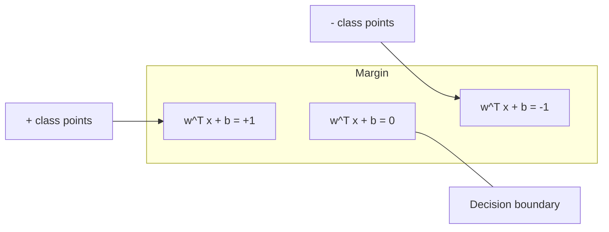
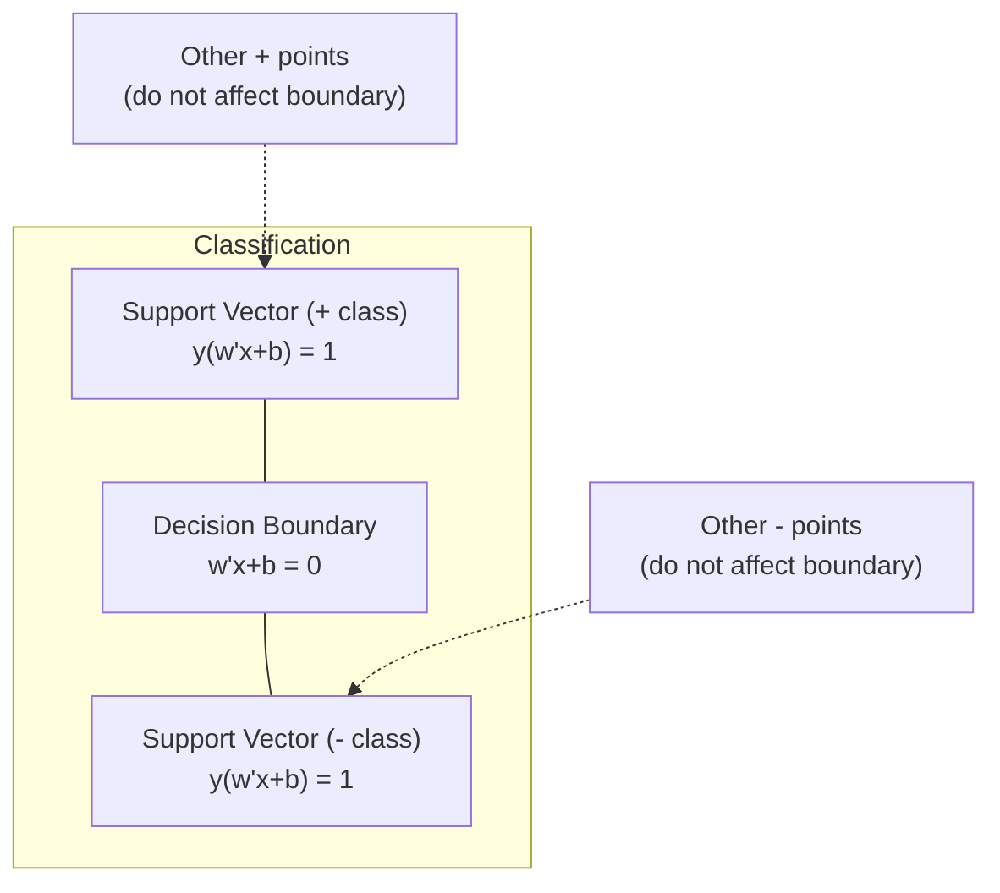
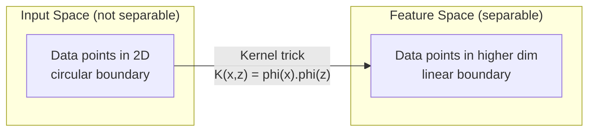

# समर्थन वेक्टर मशीनें
# 支持向量机 (SVM)


> दो वर्गों के बीच सबसे चौड़ी सड़क खोजें. यही पूरा विचार है.

>  ढूँढना दो प्रकार के बीच सबसे चौड़ा मार्ग यही है सम्पूर्ण विचार

**Type:** Build | **类型：** 构建
**Language:**पायथन**语言：**पायथन
**Prerequisites:** Phase 1 (Lessons 08 Optimization, 14 Norms and Distances, 18 Convex Optimization) | **前置知识：** Phase 1（第 8 课优化、第 14 课范数与距离、第 18 课凸优化）
**Time:** ~90 minutes | **时间：** 约 90 分钟

## सीखने के लक्ष्य

- मूल सूत्र पर शर्ट हानि और ग्रेडिएंट गिरावट का उपयोग करके खरोंच से एक रैखिक एसवीएम लागू करें
  मूल रूप में उपयोग सह पृष्ठ हानि और सीढ़ियों शून्य से कम करने के लिए वास्तविक एसवीएम
- अधिकतम मार्जिन सिद्धांत की व्याख्या करें और प्रशिक्षित मॉडल से समर्थन वेक्टरों की पहचान करें
  解释最大间隔原理,并从训练好的模型中识别支持向量
- रैखिक, बहुपद और आरबीएफ कर्नेल की तुलना करें और समझाएं कि कर्नेल ट्रिक स्पष्ट उच्च-आयामी मानचित्रण से कैसे बचता है
  तुलना करें रैखिक परमाणु, बहु-परमाणु और आरबीएफ परमाणु, व्याख्या करें कि परमाणु तकनीक स्पष्ट उच्च-विकास से कैसे बचें
- मार्जिन चौड़ाई और वर्गीकरण त्रुटियों के बीच सी पैरामीटर द्वारा नियंत्रित ट्रेडऑफ का मूल्यांकन करें
   मूल्यांकन C 参数 नियंत्रण के अंतर-विस्तार और विभाजन-त्रुटि के बीच का भार


> **【中文解读】**
> एसवीएम  सबसे बड़ा अंतर के विभाजन की सीमाएँ  परमाणु तकनीक  उच्चतम स्तर पर एसवीएम  के लिए एक उच्च स्तर पर गैर-रेखीय समस्याएं  प्रत्यक्ष समझ  उच्च स्तर पर पुनः विभाजन  के भीतर एसवीसी / एसवीआर  के उपयोग का अनुभव 

> **【拓展：SVM 在深度学习时代仍然重要的场景】**
> एसवीएम में छोटे डेटा संग्रह में (सैकड़ों से हजारों नमूने) अभी भी गहन सीखने से बेहतर है। Google में शुरुआती कचरे के मेल में एसवीएम में उपयोग में लाइटिव एसवीएम (LIBLINEAR) है, क्योंकि टीएफ-आईडीएफ में उच्च आयाम है लेकिन नमूना दुर्लभ है।

## समस्या  समस्या परिचय

आपके पास दो वर्ग के डेटा बिंदु हैं और आपको उन्हें अलग करने के लिए एक रेखा (या हाइपरप्लेन) खींचने की आवश्यकता है। अनंत रूप से कई रेखाएं काम कर सकती हैं। आपको कौन सी चुननी चाहिए?

> आपके पास दो प्रकार के डेटा बिंदु हैं, आपको एक रेखा (या एक सुपरप्लेन) खींचने की आवश्यकता है ताकि वे अलग हो सकें।

सबसे बड़ा मार्जिन वाला. मार्जिन निर्णय सीमा और प्रत्येक तरफ के निकटतम डेटा बिंदुओं के बीच की दूरी है. एक व्यापक मार्जिन का मतलब है कि वर्गीकरणकर्ता अधिक आत्मविश्वास है और अदृश्य डेटा को बेहतर सामान्य करता है।

> 间隔最大的那条──间隔是决策界限到每一边近数据点的距离──较宽的间隔意味着分类器更有信心,未见数据的泛化能力更好──

यह अंतर्ज्ञान सपोर्ट वेक्टर मशीनों के लिए नेतृत्व करता है, जो एमएल में सबसे गणितीय रूप से सुरुचिपूर्ण एल्गोरिदम में से एक है। एसवीएम गहन सीखने से पहले प्रमुख वर्गीकरण विधि थी और छोटे डेटा सेट, उच्च आयामी डेटा और समस्याओं के लिए सबसे अच्छा विकल्प है जहां आपको सिद्धांतों के साथ एक अच्छी तरह से समझने वाले मॉडल की आवश्यकता होती है। सैद्धांतिक गारंटी।

> इस धारणा ने एमएल के मध्य गणित में सबसे उत्कृष्ट एल्गोरिदमों में से एक का समर्थन किया। एसवीएम गहन अध्ययन से पहले मुख्य वर्गीकरण विधि थी, आज भी छोटे डेटा संग्रह, उच्च डेटा और सिद्धांत आश्वासन की आवश्यकता के मुद्दों का सबसे अच्छा विकल्प है।

एसवीएम सीधे चरण 1 से जुड़ते हैंः अनुकूलन संकुचित है (पढ़ना 18) , मार्जिन मानदंडों (पढ़ना 14) के साथ मापा जाता है, और कर्नेल ट्रिक उच्च-आयामी स्थान में कभी भी कंप्यूटिंग के बिना गैर-रैखिक सीमाओं को संभालने के लिए डॉट उत्पादों का उपयोग करता है।

> एसवीएम से चरण 1 直接相关:优化是凸的 (अनुच्छेद 18 课),间隔用范数衡 (अनुच्छेद 14 课), परमाणु तकनीक का उपयोग बिंदु积处理非线性边界而无需在高维空间中计算;;

> **【中文解读】**
> एसवीएम का मूल विचारः अनगिनत श्रेणियों में से एक में, निकटतम डेटा बिंदु से सबसे दूर के बिंदु पर चयन करना।

## अवधारणा का मूल अवधारणा

### अधिकतम मार्जिन वर्गीकरण

{-1, +1} में y_i लेबल और विशेषता वेक्टर x_i के साथ रैखिक रूप से अलग डेटा को देखते हुए, हम एक हाइपरप्लेन w^T x + b = 0 चाहते हैं जो कक्षाओं को अलग करता है।

> 给定标签 y_i 为 {-1, +1} के线性可分数据和特征向量 x_i, हमें एक सुपर平面 w^T x + b = 0 की आवश्यकता है ताकि वर्ग से अलग हो सके

हाइपरप्लेन से बिंदु x_i से दूरी हैः

> बिंदु x_i से सुपरप्लेन की दूरीः

```
distance = |w^T x_i + b| / ||w||
```

सही ढंग से वर्गीकृत बिंदु के लिएः y_i * (w^T x_i + b) > 0. मार्जिन दोनों तरफ हाइपरप्लेन से निकटतम बिंदु तक की दूरी का दोगुना है।

> 对于正确分类的点:y_i * (w^T x_i + b) > 0──间隔是超平面到两侧近点距离的两倍──



अनुकूलन समस्याः

> 优化问题:

```
maximize    2 / ||w||     (the margin width)
subject to  y_i * (w^T x_i + b) >= 1  for all i
```

इसी तरह (मिमीमाइज़िंग नेशन्स को अनुकूलित करने में आसान है):

> 等地( न्यूनतम मूल्य में वृद्धि^2 अधिक आसानी से अनुकूलित):

```
minimize    (1/2) ||w||^2
subject to  y_i * (w^T x_i + b) >= 1  for all i
```

यह एक घुमावदार चतुर्भुज कार्यक्रम है। इसमें एक अद्वितीय वैश्विक समाधान है। मार्जिन सीमाओं पर ठीक बैठने वाले डेटा बिंदु (जहां y_i * (w^T x_i + b) = 1) समर्थन वेक्टर हैं। वे एकमात्र बिंदु हैं जो निर्णय सीमा निर्धारित करते हैं। किसी भी गैर-समर्थन वेक्टर बिंदु को स्थानांतरित या हटा दें, और सीमा नहीं बदलती है।

> यह एक कुम्फ़्फ़-दोसर नियोजन समस्या है। इसका एक मात्र समग्र समाधान है। यह एक अंतर सीमा पर स्थित डेटा बिंदु है। (w^T x_i + b) = 1) यह समर्थन आयाम है। ये एकमात्र निर्णय बिंदु हैं जो सीमा के निर्णय बिंदुओं को स्थानांतरित करते हैं या किसी भी गैर-समर्थित आयाम को हटा देते हैं, सीमा नहीं बदलेगी।

### समर्थन वेक्टरः महत्वपूर्ण कुछ



अधिकांश प्रशिक्षण बिंदुओं से कोई संबंध नहीं है। केवल समर्थन वेक्टर महत्वपूर्ण हैं। यही कारण है कि भविष्यवाणी के समय एसवीएम स्मृति-कुशल हैंः आपको केवल समर्थन वेक्टरों को संग्रहीत करने की आवश्यकता है, पूरे प्रशिक्षण सेट को नहीं।

> अधिकांश प्रशिक्षण बिंदुएँ असंबंधित हैं। केवल समर्थन वेक्टर काम करता है। यही कारण है कि एसवीएम में पूर्वानुमान के दौरान उच्च भंडारण दक्षता हैः आपको केवल समर्थन वेक्टर को संग्रहीत करने की आवश्यकता है, न कि पूरे प्रशिक्षण सेट को।

समर्थन वेक्टरों की संख्या सामान्यीकरण त्रुटि पर भी एक सीमा देती है। डेटासेट आकार के सापेक्ष कम समर्थन वेक्टरों का अर्थ बेहतर सामान्यीकरण है।

>  समर्थन वेटमेंट की संख्या भी पानालाइजेशन त्रुटि की ऊपरी सीमा देती है  डेटासेट के आकार के मुकाबले, समर्थन वेटमेंट जितना कम होता है, इसका मतलब पानालाइजेशन उतना अच्छा होता है

### नरम मार्जिनः सी पैरामीटर के साथ शोर संभाल

वास्तविक डेटा शायद ही कभी पूरी तरह से अलग किया जा सकता है। कुछ बिंदु सीमा के गलत पक्ष पर या मार्जिन के अंदर हो सकते हैं। नरम मार्जिन सूत्र लचीले चर को पेश करके उल्लंघन की अनुमति देता है।

> वास्तविक डेटा बहुत कम पूरी तरह से उपलब्ध है। कुछ बिंदु सीमा के गलत पक्ष में या अंतराल में हो सकते हैं।

```
minimize    (1/2) ||w||^2 + C * sum(xi_i)
subject to  y_i * (w^T x_i + b) >= 1 - xi_i
            xi_i >= 0  for all i
```

लैक चर xi_i मापता है कि कितना बिंदु i मार्जिन का उल्लंघन करता है। C व्यापार-बंद को नियंत्रित करता हैः

> 松变量 xi_i 衡量点 i 违反间隔的程度──C 控制权衡:

| C value | Behavior |
|---------|----------|
| Large C | Penalizes violations heavily. Narrow margin, fewer misclassifications. Overfits |
| Small C | Allows more violations. Wide margin, more misclassifications. Underfits |

| C 值 | 行为 |
|------|------|
| 大 C | 严重惩罚违规。窄间隔，较少误分类。易过拟合 |
| 小 C | 允许更多违规。宽间隔，较多误分类。易欠拟合 |

C नियमितता बल है, उल्टा। बड़ा C = कम नियमितता। छोटा C = अधिक नियमितता।

> C है सही तात्कालिकता के विपरीत आयामों में।

### झिल्ली हानिः एसवीएम हानि फ़ंक्शन

सॉफ्ट मार्जिन एसवीएम को एक निर्बाध अनुकूलन के रूप में फिर से लिखा जा सकता हैः

> 软间隔 SVM को बिना किसी प्रतिबंध के अनुकूलित करने के लिए पुनः लिख सकते हैंः

```
minimize    (1/2) ||w||^2 + C * sum(max(0, 1 - y_i * (w^T x_i + b)))
```

max(0, 1 - y_i * f(x_i)) शब्द ही झिल्ली हानि है। यह शून्य है जब बिंदु को सही ढंग से वर्गीकृत किया जाता है और मार्जिन से परे होता है। यह रैखिक है जब बिंदु मार्जिन के अंदर होता है या गलत वर्गीकृत होता है।

> 项 max(0, 1 - y_i * f(x_i)) है सहपृष्ठ हानि。当点被正确分类而在间隔之外时为零──当点在间隔内或被误分类时为线性惩罚──

```
Hinge loss for a single point:

loss
  |
  | \
  |  \
  |   \
  |    \
  |     \_______________
  |
  +-----|-----|-------->  y * f(x)
       0     1

Zero loss when y*f(x) >= 1 (correctly classified, outside margin).
Linear penalty when y*f(x) < 1.
```

लॉजिस्टिक हानि (लॉजिस्टिक प्रतिगमन) की तुलना करेंः

> तर्कसंगत वापसी के तर्कसंगत नुकसान की तुलनाः

```
Hinge:     max(0, 1 - y*f(x))          Hard cutoff at margin
Logistic:  log(1 + exp(-y*f(x)))        Smooth, never exactly zero
```

हिंज हानि दुर्लभ समाधान पैदा करती है (केवल समर्थन वेक्टरों में गैर-शून्य योगदान होता है) । लॉजिस्टिक हानि सभी डेटा बिंदुओं का उपयोग करती है। यह भविष्यवाणी के समय एसवीएम को अधिक स्मृति-कुशल बनाता है।

> 合页损失产生稀疏解(केवल समर्थन向量有非零贡献) ⋅逻辑损失 सभी डेटा बिंदुओं का उपयोग करते हैं।

### ग्रेडिएंट अवतरण के साथ रैखिक एसवीएम का प्रशिक्षण

आप लिनेयर एसवीएम को शिंज हानि और एल 2 नियमितता पर ग्रेडिएंट गिरावट का उपयोग करके प्रशिक्षित कर सकते हैं, बिना प्रतिबंधित क्यूपी को हल किएः

> आप L2 के साथ एक साथ घटाने के लिए उपयोग कर सकते हैं।

```
L(w, b) = (lambda/2) * ||w||^2 + (1/n) * sum(max(0, 1 - y_i * (w^T x_i + b)))

Gradient with respect to w:
  If y_i * (w^T x_i + b) >= 1:  dL/dw = lambda * w
  If y_i * (w^T x_i + b) < 1:   dL/dw = lambda * w - y_i * x_i

Gradient with respect to b:
  If y_i * (w^T x_i + b) >= 1:  dL/db = 0
  If y_i * (w^T x_i + b) < 1:   dL/db = -y_i
```

इसे प्राथमिक सूत्र कहा जाता है। यह O ((n * d) प्रति युग में चलता है, जहां n नमूने की संख्या है और d विशेषताओं की संख्या है। बड़े, दुर्लभ, उच्च आयामी डेटा (पाठ वर्गीकरण) के लिए, यह तेजी से है।

> इसे मूल रूप कहा जाता है। प्रत्येक दौर का समय O (n * d) के लिए है, जिसमें n नमूना संख्या है, d विशेषता संख्या है।

> **【中文解读】**
> 合页损失(Hinge Loss) SVM का मूल हानि कार्य हैः जब नमूना सही रूप से विभाजित होता है और अंतर के बाहर होता है तो हानि 0, अन्यथा 线性惩罚── 交叉 हानि के विपरीत, 合页损失 उत्पन्न दुर्लभ समाधान केवल समर्थन के लिए है 没有零贡献,预测时只需存储这些点──C 参数控制间隔宽度与分类错误权衡:大 C = 狭间隔少犯错误(可能过合),小 C = 宽间隔多错误可能过合) 

### दोहरे सूत्र और कर्नेल ट्रिक

एसवीएम समस्या का लैग्रेंजियन डुअल (चरण 1 पाठ 18 से, केकेटी स्थितियों से) हैः

> एसवीएम 问题拉格朗日对偶 (से आया था) 条件)

```
maximize    sum(alpha_i) - (1/2) * sum_ij(alpha_i * alpha_j * y_i * y_j * (x_i . x_j))
subject to  0 <= alpha_i <= C
            sum(alpha_i * y_i) = 0
```

डुअल केवल डेटा बिंदुओं के बीच डॉट उत्पादों x_i . x_j को शामिल करता है। यह मुख्य अंतर्दृष्टि है। प्रत्येक डॉट उत्पाद को एक कर्नेल फ़ंक्शन K(x_i, x_j) के साथ बदलें और SVM स्पष्ट रूप से परिवर्तन की गणना किए बिना गैर-रैखिक सीमाएं सीख सकता है।

> x_j  यह महत्वपूर्ण अंतर्दृष्टि है  प्रत्येक बिंदु को परमाणु फ़ंक्शन K x_i, x_j के रूप में प्रतिस्थापित किया जाएगा, SVM बिना किसी स्पष्ट गणना परिवर्तन के अपरहित सीमाओं को सीख सकता है 

```
Linear kernel:      K(x, z) = x . z
Polynomial kernel:  K(x, z) = (x . z + c)^d
RBF (Gaussian):     K(x, z) = exp(-gamma * ||x - z||^2)
```

आरबीएफ कर्नेल डेटा को अनंत आयामी अंतरिक्ष में मानचित्रित करता है। इनपुट अंतरिक्ष में निकट बिंदुओं का कर्नेल मूल्य 1 के करीब होता है। दूर के बिंदुओं का कर्नेल मूल्य 0 के करीब होता है। यह किसी भी चिकनी निर्णय सीमा को सीख सकता है।

> आरबीएफ 核将数据映射到无限维空间――输入空间中相近点核值接近1――远离点核值接近0――它能学习任何光滑的决策边界――



कर्नेल ट्रिक उच्च-आयामी अंतरिक्ष में बिंदु उत्पाद की गणना करता है, कभी भी वहां जाने के बिना। D आयामों में डिग्री डी के बहुपद कर्नेल के लिए, स्पष्ट विशेषता अंतरिक्ष में O(D^d) आयाम हैं। लेकिन K(x, z) को O(D) समय में गणना की जाती है।

> 核技巧在高维空间中计算点积而无需实际到达那里──对于 D 维中的 d 次多项式核,显式特征空间有 O  D 维──但 K  X, z    时间计算──

> **【中文解读】**
> 核技巧是SVM के सबसे उत्कृष्ट गणितीय योगदान। 偶形式 केवल डेटा बिंदुओं के बीच बिंदुओं x_i · x_j से संबंधित है, इसे परमाणु फ़ंक्शन K (x_i, x_j) के रूप में प्रतिस्थापित करना है।

> **【拓展：核技巧的思想在现代 AI 中的延续】**
> 核技巧的核心思想"高维空间中计算相似度而不显式映射"Transformer के ध्यान तंत्र में इसी प्रकार का अनुभव है ध्यान分数 A(q,k) = softmax(qK^T/√d) असल में भी एक समानता परमाणु फ़ंक्शन है इसके अलावा, जीपी (高斯过程) में परमाणु विधि अभी भी एक केंद्रीय उपकरण है, जिसे Google DeepMind द्वारा बेयस अनुकूलन के लिए उपयोग किया जाता है

### प्रतिगमन के लिए एसवीएम (एसवीआर)

समर्थन वेक्टर रिग्रेशन डेटा के चारों ओर चौड़ाई के एक ट्यूब को फिट करता है। ट्यूब के अंदर के बिंदुओं में शून्य हानि होती है। ट्यूब के बाहर के बिंदुओं को रैखिक रूप से दंडित किया जाता है।

> 支持向量回归在数据周围拟合一个宽度为一的管道──管道内点损失为零──管道外点被线性惩罚──

```
minimize    (1/2) ||w||^2 + C * sum(xi_i + xi_i*)
subject to  y_i - (w^T x_i + b) <= epsilon + xi_i
            (w^T x_i + b) - y_i <= epsilon + xi_i*
            xi_i, xi_i* >= 0
```

ईप्सिलन पैरामीटर ट्यूब चौड़ाई को नियंत्रित करता है। चौड़ा ट्यूब = कम समर्थन वेक्टर = चिकनी फिट। संकीर्ण ट्यूब = अधिक समर्थन वेक्टर = तंग फिट।

> epsilon 参数 नियंत्रण पाइप चौड़ाई── चौड़ाई वाला पाइप = कम समर्थन वेट = अधिक समतल समायोजन── संकीर्ण पाइप = अधिक समर्थन वेट = अधिक घनिष्ठ समायोजन──

### क्यों एसवीएम गहन सीखने के लिए हार गए (और जब वे अभी भी जीतते हैं)

एसवीएम ने 1990 के दशक के अंत से 2010 के दशक की शुरुआत तक एमएल पर हावी रहा। गहरे सीखने ने उन्हें कई कारणों से पार कर लियाः

> एसवीएम ने 20 वीं शताब्दी के 90 के दशक के अंत से 2010 के दशक की शुरुआत तक एमएल का नेतृत्व किया।

| Factor | SVMs | Deep learning |
|--------|------|---------------|
| Feature engineering | Requires it | Learns features |
| Scalability | O(n^2) to O(n^3) for kernel | O(n) per epoch with SGD |
| Image/text/audio | Needs handcrafted features | Learns from raw data |
| Large datasets (>100k) | Slow | Scales well |
| GPU acceleration | Limited benefit | Massive speedup |

| 因素 | SVM | 深度学习 |
|------|-----|---------|
| 特征工程 | 需要手动 | 自动学习 |
| 可扩展性 | 核方法 O(n^2) 到 O(n^3) | SGD 每轮 O(n) |
| 图像/文本/音频 | 需要手工特征 | 从原始数据学习 |
| 大数据集（>10 万） | 较慢 | 扩展性好 |
| GPU 加速 | 有限收益 | 大幅提速 |

एसवीएम अभी भी इन स्थितियों में जीतते हैंः
- छोटे डेटा सेट (सैकड़ों से लेकर हजारों नमूनों तक)
  小数据集(सैकड़ों से हजारों नमूने)
- उच्च आयामी दुर्लभ डेटा (TF-IDF सुविधाओं के साथ पाठ)
  高维稀疏数据 (लेख के टीएफ-आईडीएफ विशेषताएं)
- जब आपको गणितीय गारंटी (मार्जिन सीमा) की आवश्यकता होती है
  需要数学保证时(间隔边界)
- जब प्रशिक्षण समय न्यूनतम होना चाहिए (रेखीय एसवीएम बहुत तेज है)
   प्रशिक्षण समय सबसे कम समय होना चाहिए                                                                                                                                                                                                                                                           
- स्पष्ट मार्जिन संरचना के साथ द्विआधारी वर्गीकरण
  具有清晰间隔结构的二分类
- विसंगतियों का पता लगाना (एक वर्ग का एसवीएम)
  异常检测(单类 SVM)

> एसवीएम ने निम्नलिखित परिस्थितियों में भी विजय प्राप्त कीः

## इसे बनाओ, इसे पूरा करो।
```figure
svm-margin
```

## इसे बनाओ

### चरण 1: झिल्ली हानि और ढलान

आधार, बैच और उसके ग्रेडिएंट के लिए शंकु हानि की गणना करें।

> 基础―― गणना एक बैच डेटा के सहपृष्ठ हानि और उसके स्तरों――

```python
def hinge_loss(X, y, w, b):
    n = len(X)
    total_loss = 0.0
    for i in range(n):
        margin = y[i] * (dot(w, X[i]) + b)  # 计算样本到决策边界的函数间隔
        total_loss += max(0.0, 1.0 - margin)  # 合页损失：间隔 < 1 时才有惩罚
    return total_loss / n  # 返回平均损失
```

### चरण 2: ग्रेडिएंट अवतरण के माध्यम से रैखिक एसवीएम

नियमित रूप से जंजीर हानि को कम करके प्रशिक्षित करें। कोई QP समाधान की आवश्यकता नहीं है।

> 通过最小化正则化合物损失训练――无需 QP 求解器――

```python
class LinearSVM:
    def __init__(self, lr=0.001, lambda_param=0.01, n_epochs=1000):
        self.lr = lr  # 学习率
        self.lambda_param = lambda_param  # 正则化参数（对应 1/C）
        self.n_epochs = n_epochs
        self.w = None  # 权重向量
        self.b = 0.0  # 偏置

    def fit(self, X, y):
        n_features = len(X[0])
        self.w = [0.0] * n_features
        self.b = 0.0

        for epoch in range(self.n_epochs):
            for i in range(len(X)):
                margin = y[i] * (dot(self.w, X[i]) + self.b)  # 函数间隔
                if margin >= 1:
                    # 样本在间隔之外，只需正则化梯度
                    self.w = [wj - self.lr * self.lambda_param * wj
                              for wj in self.w]
                else:
                    # 样本在间隔内或被误分类，需要额外的损失梯度
                    self.w = [wj - self.lr * (self.lambda_param * wj - y[i] * X[i][j])
                              for j, wj in enumerate(self.w)]
                    self.b -= self.lr * (-y[i])

    def predict(self, X):
        return [1 if dot(self.w, x) + self.b >= 0 else -1 for x in X]  # 根据符号预测类别
```

### चरण 3: कर्नेल फ़ंक्शन

रैखिक, बहुपद और आरबीएफ कर्नल को लागू करें।

> 实现线性核、多项式核和 RBF核──

```python
def linear_kernel(x, z):
    return dot(x, z)  # 线性核：直接点积

def polynomial_kernel(x, z, degree=3, c=1.0):
    return (dot(x, z) + c) ** degree  # 多项式核：(x·z + c)^d

def rbf_kernel(x, z, gamma=0.5):
    diff = [xi - zi for xi, zi in zip(x, z)]  # 计算差向量
    return math.exp(-gamma * dot(diff, diff))  # RBF 核：exp(-γ||x-z||²)
```

### चरण 4: मार्जिन और समर्थन वेक्टर पहचान

प्रशिक्षण के बाद, पहचानें कि कौन से बिंदु समर्थन वेक्टर हैं और मार्जिन चौड़ाई की गणना करें।

>  प्रशिक्षण के बाद, पहचानें कि कौन से बिंदु समर्थन आयाम और गणना अंतर चौड़ाई हैं

```python
def find_support_vectors(X, y, w, b, tol=1e-3):
    support_vectors = []
    for i in range(len(X)):
        margin = y[i] * (dot(w, X[i]) + b)
        if abs(margin - 1.0) < tol:
            support_vectors.append(i)
    return support_vectors
```

देखो`code/svm.py`सभी डेमो के साथ पूर्ण कार्यान्वयन के लिए।

> 完整实现(含所有演示)见 `code/svm.py`

## इसे फ्रेमवर्क के साथ लागू करें

> **【中文解读】**
> sklearn 中 SVM का उपयोग करना महत्वपूर्ण बिंदु:(1) 必须先标准化特征SVM对特征尺度敏感,因为间隔依赖于它;(2) 小数据集用 SVC(支持核函数),大数据集用 LinearSVC(使用原始形式,O(n) 每轮);(3) gamma 控制 RBF 核范围,太大→过拟合,太小→欠拟合.

स्किट-लर्न के साथः

> प्रयोग स्किट-लर्नः

```python
from sklearn.svm import SVC, LinearSVC, SVR
from sklearn.preprocessing import StandardScaler
from sklearn.pipeline import Pipeline

# 标准化 + SVM 的标准管线
clf = Pipeline([
    ("scaler", StandardScaler()),  # 标准化是 SVM 的必选项
    ("svm", SVC(kernel="rbf", C=1.0, gamma="scale")),  # RBF 核 SVM
])
clf.fit(X_train, y_train)
print(f"Accuracy: {clf.score(X_test, y_test):.4f}")
print(f"Support vectors: {clf['svm'].n_support_}")
```

महत्वपूर्णः एसवीएम को प्रशिक्षित करने से पहले हमेशा अपनी विशेषताएं स्केल करें। एसवीएम विशेषता परिमाणों के प्रति संवेदनशील होते हैं क्योंकि मार्जिन अनस्केल किए गए विशेषताओं पर निर्भर करता है, और ज्यामिति को विकृत करता है।

> 重要: प्रशिक्षण एसवीएम 前务必缩缩特征──एसवीएम लक्षण मात्रा स्तर के प्रति संवेदनशील है, क्योंकि अंतर निर्भरता के साथ, अपूर्ण लक्षणों को विकृत किया जाएगा

बड़े डेटा सेट के लिए, उपयोग करें `LinearSVC`(प्राथमिक सूत्र, O(n) प्रति युग)`SVC`(दोहरी सूत्र, O(n^2) से O(n^3)):

> 对于大数据集,使用 `LinearSVC`(原始形式,每轮 O(n)) बजाय `SVC`(ओपॉवर फॉर्म,O(n^2) तक O(n^3)):

```python
from sklearn.svm import LinearSVC

clf = Pipeline([
    ("scaler", StandardScaler()),
    ("svm", LinearSVC(C=1.0, max_iter=10000)),
])
```

## अभ्यास विषय

1. एक 2D रैखिक रूप से अलग करने योग्य डेटासेट उत्पन्न करें। अपने रैखिक एसवीएम को प्रशिक्षित करें और समर्थन वेक्टरों की पहचान करें। सत्यापित करें कि समर्थन वेक्टर निर्णय सीमा के निकटतम बिंदु हैं।
   1. 2. एक 2D 线性可分数据集 बनाएं।

2. शोर डेटासेट पर 0.001 से 1000 तक भिन्न C। प्रत्येक C मान के लिए निर्णय सीमा का पता लगाएं। चौड़े मार्जिन (अंडरफिटिंग) से संकीर्ण मार्जिन (ओवरफिटिंग) में संक्रमण का अवलोकन करें।
   2.                                                                                                                                                                                                                                                               

3. एक डेटासेट बनाएं जहां कक्षा सीमाएं गोल (रैखिक नहीं) हैं। दिखाएं कि एक रैखिक एसवीएम विफल है। आरबीएफ कर्नेल मैट्रिक्स की गणना करें और दिखाएं कि कक्षाएं कर्नेल-प्रेरित सुविधा स्थान में अलग हो जाती हैं।
   3.  एक वर्ग सीमा के लिए गोल (nonlinear) के डेटा संग्रह को बनाना  प्रदर्शन  एसवीएम  असफल  गणना RBF 核矩阵, प्रदर्शन  परमाणु प्रेरित विशेषता अंतरिक्ष में वर्ग को परिवर्तित करने योग्य

4. एक ही डेटासेट पर हिंज हानि बनाम लॉजिस्टिक हानि की तुलना करें। एक रैखिक एसवीएम और लॉजिस्टिक प्रतिगमन को प्रशिक्षित करें। गणना करें कि प्रत्येक मॉडल के निर्णय सीमा में कितने प्रशिक्षण बिंदु योगदान करते हैं (सपोर्ट वेक्टर बनाम सभी बिंदु) ।
   4. एक ही डेटाबेस पर तुलनात्मक रूप से, एक ही डेटाबेस में, एक ही डेटाबेस में, एक ही डेटाबेस में, एक ही डेटाबेस में, एक ही डेटाबेस में, एक ही डेटाबेस में, एक ही डेटाबेस में, एक ही डेटाबेस में, एक ही डेटाबेस में, एक ही डेटाबेस में, एक ही डेटाबेस में, एक ही डेटाबेस में, एक ही डेटाबेस में, एक ही डेटाबेस में, एक ही डेटाबेस में, एक ही डेटाबेस में, एक ही डेटाबेस में, एक ही डेटाबेस में, एक ही डेटाबेस में, एक ही डेटाबेस में, एक ही डेटाबेस में, एक ही डेटाबेस में, एक ही डेटाबेस में, एक ही डेटाबेस में, एक ही डेटाबेस में, एक ही डेटाबेस में, एक ही डेटाबेस में, एक ही डेटाबेस में, एक ही डेटाबेस में, एक ही डेटाबेस में, एक ही डेटाबेस में, एक ही डेटाबेस में, एक ही डेटाबेस में, एक ही डेटाबेस में, एक ही डेटाबेस में, एक ही डेटाबेस में, एक ही डेटाबेस में, एक ही डेटाबेस में, एक ही डेटाबेस में, एक ही डेटाबेस में, एक डेटाबेस में, एक डेटाबेस में, एक डेटाबेस में, एक डेटाबेस में, एक डेटाबेस में, एक डेटाबेस में, एक डेटाबेस में, एक डेटाबेस में, एक डेटाबेस में, एक डेटाबेस में, एक डेटाबेस में, एक डेटाबेस में, एक डेटाबेस में, एक डेटाबेस में, एक डेटाबेस में, एक डेटाबेस में, एक डेटाबेस में, एक डेटाबेस में, एक डेटाबेस में, एक डेटाबेस में, एक डेटाबेस में, एक डेटाबेस में, एक डेटाबेस में, एक डेटा, एक डेटाबेस में, एक डेटाबेस में, एक डेटा, एक डेटाबेस में, एक डेटा, जो एक डेटाबेस में, एक डेटा में, एक डेटा में, एक डेटाबेस में, एक डेटा, एक डेटा, एक डेटा में, एक डेटा में, एक डेटा में, एक अन्य अन्य अन्य अन्य अन्य अन्य अन्य अन्य अन्य अन्य अन्य, जोड़े, जो एक अन्य, के साथ, एक अन्य, एक अन्य अन्य अन्य अन्य अन्य, के साथ, में, एक अन्य, में, एक अन्य, जो, में, एक अन्य अन्य अन्य, में, एक अन्य, जो, में, एक अन्य, के रूप में, में, में, में, में, में, में, में

5. एसवीआर (एप्सिलन-असंवेदनशील हानि) लागू करें। इसे y = sin(x) + शोर पर समायोजित करें। भविष्यवाणियों के आसपास एप्सिलन ट्यूब को रेखांकित करें और समर्थन वेक्टरों (ट्यूब के बाहर बिंदुओं) को उजागर करें।
   5. 实现 SVR(epsilon 不敏感损失) ・拟合 y = sin(x) + noise──绘制预测周围的epsilon 管道并标记支持向量(管道外的点)。

## कीवर्ड्स  शब्द खोज तालिका

| Term | What it actually means |
|------|----------------------|
| Support vectors | The training points closest to the decision boundary. The only points that determine the hyperplane |
| Margin | The distance between the decision boundary and the nearest support vectors. SVMs maximize this |
| Hinge loss | max(0, 1 - y*f(x)). Zero when correctly classified and outside the margin. Linear penalty otherwise |
| C parameter | Trade-off between margin width and classification errors. Large C = narrow margin, small C = wide margin |
| Soft margin | SVM formulation that allows margin violations via slack variables. Handles non-separable data |
| Kernel trick | Computing dot products in a high-dimensional feature space without explicitly mapping to that space |
| Linear kernel | K(x, z) = x . z. Equivalent to standard dot product. For linearly separable data |
| RBF kernel | K(x, z) = exp(-gamma * \|\|x-z\|\|^2). Maps to infinite dimensions. Learns any smooth boundary |
| Polynomial kernel | K(x, z) = (x . z + c)^d. Maps to a feature space of polynomial combinations |
| Dual formulation | Reformulation of the SVM problem that depends only on dot products between data points. Enables kernels |
| SVR | Support Vector Regression. Fits an epsilon-tube around the data. Points inside the tube have zero loss |
| Slack variables | xi_i: measures how much a point violates the margin. Zero for correctly classified points outside margin |
| Maximum margin | The principle of choosing the hyperplane that maximizes the distance to the nearest points of each class |

## आगे पढ़ना 延伸閱讀

- [Vapnik: The Nature of Statistical Learning Theory (1995)](https://link.springer.com/book/10.1007/978-1-4757-3264-1)- एसवीएम और सांख्यिकीय शिक्षा पर मूल पाठ
  [Vapnik: The Nature of Statistical Learning Theory (1995)](https://link.springer.com/book/10.1007/978-1-4757-3264-1)- एसवीएम एवं स्टैटिस्टिकल लर्निंग थ्योरी के आधारभूत ग्रंथ
- [Cortes & Vapnik: Support-vector networks (1995)](https://link.springer.com/article/10.1007/BF00994018)- मूल एसवीएम पेपर
  [Cortes & Vapnik: Support-vector networks (1995)](https://link.springer.com/article/10.1007/BF00994018)- एसवीएम 原始论文
- [Platt: Sequential Minimal Optimization (1998)](https://www.microsoft.com/en-us/research/publication/sequential-minimal-optimization-a-fast-algorithm-for-training-support-vector-machines/)- एसएमओ एल्गोरिथ्म जिसने एसएमओ प्रशिक्षण को व्यावहारिक बनाया
  [Platt: Sequential Minimal Optimization (1998)](https://www.microsoft.com/en-us/research/publication/sequential-minimal-optimization-a-fast-algorithm-for-training-support-vector-machines/)- एसवीएम प्रशिक्षण को व्यावहारिक एसएमओ एल्गोरिथ्म में बदलना
- [scikit-learn SVM documentation](https://scikit-learn.org/stable/modules/svm.html)- कार्यान्वयन के विवरण के साथ व्यावहारिक मार्गदर्शिका
  [scikit-learn SVM 文档](https://scikit-learn.org/stable/modules/svm.html)- 实用指南及实现细节
- [LIBSVM: A Library for Support Vector Machines](https://www.csie.ntu.edu.tw/~cjlin/libsvm/)- अधिकांश एसवीएम कार्यान्वयन के पीछे सी ++ पुस्तकालय
  [LIBSVM](https://www.csie.ntu.edu.tw/~cjlin/libsvm/)- अधिकांश एसवीएम  背后的C++ 库
