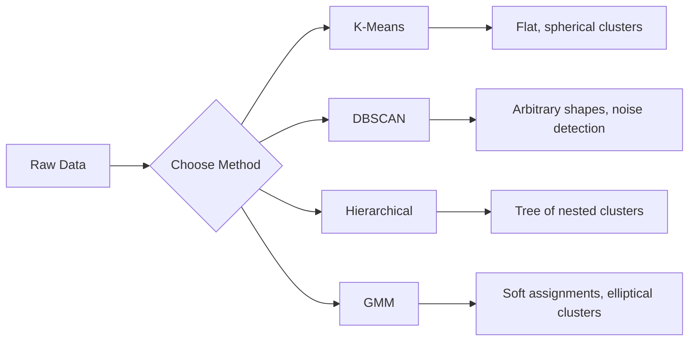

# बिना पर्यवेक्षण के सीखना
# 无监督学习


> कोई लेबल नहीं, कोई शिक्षक नहीं, एल्गोरिथम अपने आप संरचना पाता है।

> 没有标签,没有老师──算法自己发现结构──

**Type:** Build | **类型：** 构建
**Languages:** Python
**Prerequisites:** Phase 1 (Norms & Distances, Probability & Distributions), Phase 2 Lessons 1-6 | **前置知识：** Phase 1（范数与距离、概率与分布），Phase 2 第 1-6 课
**Time:** ~90 minutes | **时间：** 约 90 分钟

## सीखने के लक्ष्य

- के-मीन्स, डीबीएससीएएन और गाउसियन मिक्स मॉडल को खरोंच से लागू करें और उनके क्लस्टरिंग व्यवहार की तुलना करें
  शून्य से K-Means、DBSCAN 和高斯混合模型 (GMM) को प्राप्त करने से, उनकी सामूहिक व्यवहार की तुलना करें
- अनुकूल K का चयन करने के लिए सिल्हूट स्कोर और कोहनी विधि का उपयोग करके क्लस्टर गुणवत्ता का मूल्यांकन करें
  प्रयोग रौंदों के गुणों का मूल्यांकन करने के लिए रौंदों के गुणों का प्रयोग करें, सर्वोत्तम का चयन करें
- समझाएं कि DBSCAN K-Means से बेहतर प्रदर्शन कब करता है और पहचानें कि कौन सा एल्गोरिथ्म गैर-गोलाकार क्लस्टर और असाधारण को संभालता है
   व्याख्या DBSCAN 何時優于 K-Means, पहचानें कि किस प्रकार के एल्गोरिदम को गैर-गोलाकार  और असामान्य मानों को संभाल सकता है
- सामान्य पैटर्न से विचलित बिंदुओं को चिह्नित करने के लिए समूहबद्ध विधि का उपयोग करके एक विसंगतियों का पता लगाने पाइपलाइन का निर्माण करें
  एक संयोजन विधि का उपयोग करके असामान्य जांच पाइपलाइन का निर्माण करें, सामान्य मोड से विचलित बिंदुओं को चिह्नित करें


> **【中文解读】**
> 无监督学习没有标签, लक्ष्य डेटा में संरचना को खोजने है। K-Means सबसे क्लासिक聚类算法 है।

> **【拓展：无监督学习在真实 AI 系统中的价值】**
> Google फ़ोटो के स्वचालित फ़ोटो फ़ोटो फ़ोटो फ़ोटो फ़ोटो फ़ोटो फ़ोटो फ़ोटो फ़ोटो फ़ोटो फ़ोटो फ़ोटो फ़ोटो फ़ोटो फ़ोटो फ़ोटो फ़ोटो फ़ोटो फ़ोटो फ़ोटो फ़ोटो फ़ोटो फ़ोटो फ़ोटो फ़ोटो फ़ोटो फ़ोटो फ़ोटो फ़ोटो फ़ोटो फ़ोटो फ़ोटो फ़ोटो फ़ोटो फ़ोटो फ़ोटो फ़ोटो फ़ोटो फ़ोटो फ़ोटो फ़ोटो फ़ोटो फ़ोटो फ़ोटो फ़ोटो फ़ोटो फ़ोटो फ़ोटो फ़ोटो फ़ोटो फ़ोटो फ़ोटो फ़ोटो फ़ोटो फ़ोटो फ़ोटो फ़ोटो फ़ोटो फ़ोटो फ़ोटो फ़ोटो फ़ोटो फ़ोटो फ़ोटो फ़ोटो फ़ोटो फ़ोटो फ़ोटो फ़ोटो फ़ोटो फ़ोटो फ़ोटो फ़ोटो फ़ोटो फ़ोटो फ़ोटो फ़ोटो फ़ोटो फ़ोटो फ़ोटो फ़ोटो फ़ोटो फ़ोटो फ़ोटो फ़ोटो फ़ोटो फ़ोटो फ़ोटो फ़ोटो फ़ोटो फ़ोटो फ़ोटो फ़ोटो फ़ोटो फ़ोटो फ़ोटो फ़ोटो फ़ोटो फ़ोटो फ़ोटो फ़ोटो फ़ोटो फ़ोटो फ़ोटो फ़ोटो फ़ोटो फ़ोटो फ़ोटो फ़ोटो फ़ोटो फ़ोटो फ़ोटो फ़ोटो फ़ोटो फ़ोटो फ़ोटो फ़ोटो फ़ोटो फ़ोटो फ़ोटो फ़ोटो फ़ोटो फ़ोटो फ़ोटो फ़ोटो फ़ोटो फ़ोटो फ़ोटो फ़ोटो फ़ोटो फ़ोटो फ़ोटो फ़ोटो फ़ोटो फ़ोटो फ़ोटो फ़ोटो फ़ोटो फ़ोटो फ़ोटो फ़ोटो फ़ोटो फ़ोटो फ़ोटो फ़ोटो फ़ोटो फ़ोटो फ़ोटो फ़ोटो फ़ोटो फ़ोटो फ़ोटो फ़ोटो फ़ोटो फ़ोटो फ़ोटो फ़ोटो फ़ोटो फ़ोटो फ़ोटो फ़ोटो फ़ोटो फ़ोटो फ़ोटो फ़ोटो फ़ोटो फ़ोटो फ़ोटो

## समस्या  समस्या परिचय

अब तक हर एमएल पाठ में लेबल वाले डेटा का अनुमान लगाया गया हैः "यहां एक इनपुट है, यहाँ सही आउटपुट है।" वास्तविक दुनिया में, लेबल महंगे हैं। एक अस्पताल में लाखों मरीजों के रिकॉर्ड हैं लेकिन किसी ने भी किसी बीमारी की श्रेणी के साथ प्रत्येक को मैन्युअल रूप से टैग नहीं किया है। एक ई-कॉमर्स साइट में लाखों उपयोगकर्ता सत्र होते हैं लेकिन किसी के पास ग्राहक खंडों को हाथ से लेबल नहीं किया जाता है। सुरक्षा टीम के पास नेटवर्क लॉग हैं लेकिन किसी ने हर विसंगति को चिह्नित नहीं किया है।

> पूर्व में हर कक्षा में डेटा के साथ एक टैग थाः "यह इनपुट है, यह सही आउटपुट है।" वास्तविक दुनिया में, टैगिंग महंगी है। एक अस्पताल में लाखों मरीजों का रिकॉर्ड है, लेकिन कोई भी व्यक्ति हर टैगिंग बीमारी श्रेणी को हाथ से नहीं देता है। एक ईकॉमर्स वेबसाइट में लाखों उपयोगकर्ता बैठकें हैं, लेकिन कोई भी व्यक्ति हाथ से टैगिंग ग्राहक वर्गों को नहीं करता है। एक सुरक्षा टीम में एक नेटवर्क डायरी है, लेकिन कोई भी व्यक्ति हर असामान्य को नहीं चिह्नित करता है।

अनसुराल सीखने के बिना पैटर्न ढूंढता है, बिना बताए कि क्या देखना है। यह समान डेटा बिंदुओं को समूहित करता है, छिपे हुए संरचनाओं की खोज करता है, और विसंगतियों को सतह पर लाता है। यदि पर्यवेक्षित सीखने के लिए उत्तर कुंजी वाली पाठ्यपुस्तक से सीखना है, तो अनसुराल सीखने के लिए कच्चे डेटा को तब तक देखना है जब तक पैटर्न खुद को प्रकट नहीं करते।

> 无监督学习在未被告中寻找什么的情况下发现模式―― यह समान डेटा点分组,发现隐藏结构,揭露异常―― यदि निगरानी学习 है उत्तर के पाठ्यपुस्तक से सीखने,无监督学习 है 着原始数据直到模式自己显现――

यह बात है कि बिना लेबल के आप सीधे "सही" या "गलत" को नहीं माप सकते। आपको यह आकलन करने के लिए विभिन्न उपकरणों की आवश्यकता है कि क्या आपके एल्गोरिथ्म द्वारा पाया गया संरचना सार्थक है या नहीं।

> 关键问题: कोई टैग नहीं है, आप सीधे "对" या "错" को माप नहीं सकते हैं।

> **【中文解读】**
> 无监督学习的核心挑战是评估:没有标签就无法直接衡量"对错"――需要使用轮系数、肘部法则等标标标间接评估聚类质量――K-Means 假设是球形的且大小相近的,对异常值敏感的;DBSCAN 能够发现任意形的并自动识别噪点,但需要设置密度参数――

## अवधारणा का मूल अवधारणा

### समूह बनानाः समान चीजों को एक साथ जोड़ना

समूहबद्धता प्रत्येक डेटा बिंदु को एक समूह (क्लास्टर) को असाइन करती है ताकि एक ही समूह के भीतर के बिंदु अन्य समूहों में बिंदुओं की तुलना में एक दूसरे के समान हों। सवाल हमेशा यह होता हैः "समान" का क्या अर्थ है?

> 聚类将每个数据点分为一个组 (),使同一组内的点比其他组的点更相似―― प्रश्न हमेशा होता हैः "相似" का क्या अर्थ है?



### K-Means: कार्यघोड़ा

K-Means डेटा को K क्लस्टर में विभाजित करता है। प्रत्येक क्लस्टर में एक केंद्र (उसके द्रव्यमान का केंद्र) होता है, और प्रत्येक बिंदु निकटतम केंद्रस्थ स्थान का है।

> K-Means will data precisely divide into K 个── प्रत्येक  के पास एक गुणवत्ता है, प्रत्येक बिंदु निकटतम गुणवत्ता से संबंधित है।

लॉयड का एल्गोरिथ्म:

> लॉयड 算法:

1. प्रारंभिक केंद्र बिंदु के रूप में K यादृच्छिक बिंदुओं को चुनें
   随机选择 K 个点作为初始质心
2. प्रत्येक डेटा बिंदु को निकटतम केंद्र बिंदु पर असाइन करें
   प्रत्येक डेटा बिंदु को निकटतम गुणवत्ता केंद्र में वितरित करना
3. प्रत्येक केंद्रबिन्दु को उसके आवंटित बिंदुओं के औसत के रूप में गणना करें
   重新 गणना प्रत्येक गुण के लिए उसके वितरण बिंदु के औसत मूल्य
4. कार्य बदलना बंद होने तक चरण 2-3 दोहराएं
   重复步骤 2-3 जब तक वितरण नहीं बदलता

वस्तुनिष्ठ फ़ंक्शन (अवसर) प्रत्येक बिंदु से उसके आवंटित केंद्र बिंदु तक कुल वर्ग दूरी को मापता है। K-Means इसे न्यूनतम करता है, लेकिन केवल एक स्थानीय न्यूनतम पाता है। विभिन्न आरंभिकरण विभिन्न परिणाम दे सकते हैं।

> 目标函数 (惯性) प्रत्येक बिंदु को उसके वितरण के गुण के कुल वर्ग दूरी तक मापता है।

### K चुनना

दो मानक पद्धतिः

> 两种标准方法:

**Elbow method:**K = 1, 2, 3, ..., n के लिए K-Means चलाएं। प्लॉट निष्क्रियता बनाम K. "लुकुआ" की तलाश करें जहां अधिक क्लस्टर जोड़ने से निष्क्रियता में काफी कमी आती है।

> **肘部法则：**के लिए K = 1, 2, 3, ..., n 运行 K-Means──绘制惯性对 K 的图──寻找"肘部"增加更多不再显著减少惯性位置──

**Silhouette score:**प्रत्येक बिंदु के लिए, मापें कि यह अपने स्वयं के क्लस्टर (ए) के मुकाबले निकटतम अन्य क्लस्टर (बी) के समान है। सिल्हूट गुणांक (बी - ए) / अधिकतम ((ए, बी) है, जो -1 (गलत क्लस्टर) से लेकर +1 (अच्छी तरह से क्लस्टर) तक है। वैश्विक स्कोर के लिए सभी बिंदुओं के बीच औसत।

> **轮廓系数：**प्रत्येक बिंदु पर, इसे स्वयं के साथ समानता (a) की तुलना में हाल के अन्य बिंदुओं के समानता (b)  पर मापें।

### डीबीएससीएएन: घनत्व आधारित क्लस्टरिंग

K-Means का मानना है कि क्लस्टर गोलाकार हैं और आपको K को अग्रिम में चुनना चाहिए। DBSCAN कोई भी धारणा नहीं करता है। यह क्लस्टर को घने क्षेत्रों के रूप में पाता है जो दुर्लभ क्षेत्रों से अलग हैं।

> K-Means 假设是球形的且需要预选 K――DBSCAN 不做这些假设──它将被发现为被稀疏区域分隔的密集区域──

दो पैरामीटरः
- **eps**: पड़ोस की त्रिज्या
  **eps**क्षेत्रफल
- **min_samples**: घने क्षेत्र बनाने के लिए आवश्यक न्यूनतम बिंदु संख्या
  **min_samples**: घने क्षेत्र के गठन के लिए आवश्यक न्यूनतम अंक संख्या

तीन प्रकार के अंकः
- **Core point**: eps दूरी के भीतर कम से कम min_samples points है
  **核心点**: eps  दूरी                                                                                                                                                                                                                                                                                                                                                                                                                                                                                                                         
- **Border point**: एक कोर बिंदु के ईपी के भीतर लेकिन स्वयं एक कोर बिंदु नहीं
  **边界点**: केंद्र बिंदु के भीतर पर पर अपने आप में केंद्र बिंदु नहीं है
- **Noise point**न तो कोर और न ही सीमाएं. ये अप्रासंगिक हैं।
  **噪声点**: दोनों गैर-केंद्रित और गैर-सीमाएँ हैं।

डीबीएससीएएन एक दूसरे के ईपी के भीतर स्थित कोर बिंदुओं को एक ही क्लस्टर में जोड़ता है। सीमा बिंदुओं को पास के कोर बिंदु के क्लस्टर में शामिल किया जाता है। शोर बिंदु किसी क्लस्टर से संबंधित नहीं हैं।

> DBSCAN एक दूसरे को eps के दायरे में एक ही केंद्र बिंदु से जोड़ देगा।

ताकतः किसी भी आकार के समूहों को ढूंढता है, स्वचालित रूप से समूहों की संख्या निर्धारित करता है, असाधारण की पहचान करता है। कमजोरीः विभिन्न घनत्व के समूहों के साथ संघर्ष करता है।

> 优势: 发现任意形的,自动确定数,识别异常值.

### पदानुक्रमिक समूह

घोंसले हुए समूहों का एक वृक्ष (डेन्ड्रोग्राम) बनाता है।

> 构建嵌套的树树状图)

संश्लेषणात्मक (नीचे-ऊपर):

> 聚合式(自底上):

1. प्रत्येक बिंदु के साथ शुरू अपने स्वयं के क्लस्टर के रूप में
   开始时每个点是自己的
2. दो निकटतम समूहों को मिलाएं
   合并两个最近的
3. केवल एक क्लस्टर शेष होने तक दोहराएं
   重复 जब तक केवल एक ही शेष है
4. K क्लस्टर प्राप्त करने के लिए वांछित स्तर पर डेंड्रोग्राम काटें
   आवश्यक स्तर पर पेड़ काटना आकार चित्र प्राप्त K 个

समूहों के बीच "अवधि" को निम्नानुसार मापा जा सकता हैः
- **Single linkage**: दोनों क्लस्टरों में किसी भी दो बिंदुओं के बीच न्यूनतम दूरी
  **单链接**: दो में किसी भी दो बिंदुओं के बीच न्यूनतम दूरी
- **Complete linkage**: किसी भी दो बिंदुओं के बीच अधिकतम दूरी
  **全链接**: arbitrary दो बिंदुओं के बीच अधिकतम दूरी
- **Average linkage**: सभी जोड़े के बीच औसत दूरी
  **平均链接**सभी बिंदुओं के बीच औसत दूरी
- **Ward's method**: विलय जो कुल समूह के भीतर भिन्नता में सबसे छोटी वृद्धि का कारण बनता है
  **Ward 方法**: 内总方差增加最小的合并

### गौसी मिश्रण मॉडल (GMM)

K-Means कठिन असाइनमेंट देता हैः प्रत्येक बिंदु एक क्लस्टर से संबंधित है। GMM नरम असाइनमेंट देता हैः प्रत्येक बिंदु प्रत्येक क्लस्टर से संबंधित होने की संभावना है।

> K-Means  give out hard distribution: प्रत्येक बिंदु एक ── जीएमएम  give out soft distribution: प्रत्येक बिंदु का प्रत्येक  के लिए एक संभावना है──

जीएमएम का मानना है कि डेटा के गैसियन वितरण के मिश्रण से उत्पन्न होता है, प्रत्येक के पास अपना औसत और सह-विवर्तन होता है। अपेक्षा-अधिकतम (ईएम) एल्गोरिदम के बीच बारी बारी होती हैः

> जीएमएम 假设 डेटा के द्वारा K 个高斯分布 मिश्रित उत्पन्न, प्रत्येक अपने स्वयं के औसत मूल्य और सह-समय अंतर है।

- **E-step**: गणना की संभावना है कि प्रत्येक बिंदु प्रत्येक Gaussian से संबंधित है
  **E 步**: गणना प्रत्येक बिंदु प्रत्येक उच्च वितरण की संभावना से संबंधित है
- **M-step**: डेटा की संभावना को अधिकतम करने के लिए प्रत्येक गौशियन के औसत, सह-विवर्तन और मिश्रण भार को अद्यतन करें
  **M 步**: अधिकतम डेटा की समानता के लिए प्रत्येक उच्च वितरण के औसत मूल्य, समतुल्य अंतर और मिश्रित भार को अद्यतन करें

जीएमएम दीर्घवृत्त समूहों (के-मीन्स की तरह केवल गोलाकार नहीं) का मॉडल बना सकता है और स्वाभाविक रूप से ओवरलैप समूहों को संभालता है।

> जीएमएम 能建模圆(不只是 K-Means 的球形),自然处理重叠──

### किसको कब इस्तेमाल करना है

| Method | Best for | Avoid when |
|--------|----------|------------|
| K-Means | Large datasets, spherical clusters, known K | Irregular shapes, outliers present |
| DBSCAN | Unknown K, arbitrary shapes, outlier detection | Varying densities, very high dimensions |
| Hierarchical | Small datasets, need dendrogram, unknown K | Large datasets (O(n^2) memory) |
| GMM | Overlapping clusters, soft assignments needed | Very large datasets, too many dimensions |

| 方法 | 最适合 | 避免使用 |
|------|--------|---------|
| K-Means | 大数据集，球形簇，已知 K | 不规则形状，有异常值 |
| DBSCAN | 未知 K，任意形状，异常检测 | 密度不均匀，极高维度 |
| 层次聚类 | 小数据集，需要树状图，未知 K | 大数据集（O(n^2) 内存） |
| GMM | 重叠簇，需要软分配 | 非常大的数据集，维度太高 |

### क्लस्टरिंग के द्वारा विसंगतियों का पता लगाना

क्लस्टरिंग स्वाभाविक रूप से विसंगतियों की पहचान का समर्थन करता हैः
- **K-Means**: किसी भी केंद्रबिन्दु से दूर बिंदु विसंगति हैं
  **K-Means**किसी भी गुणवत्ता से बहुत दूर की बिंदु असामान्य मूल्य है
- **DBSCAN**: शोर बिंदु परिभाषा से विसंगति हैं
  **DBSCAN**: noise point के अनुसार परिभाषा है असामान्य मूल्य
- **GMM**: सभी गौसी के तहत कम संभावना के साथ बिंदुओं असामान्यता हैं
  **GMM**सभी उच्च वितरण में संभावना बहुत कम है

> 聚类天然支持异常检测:

## इसे बनाओ, इसे पूरा करो।

> **【中文解读】**
> शून्य से K-Means、DBSCAN 和高斯混合模型──K-Means के तीन चरणों代:随机初始化中心 → 分配每点到最近的中心 → 重新计算中心──重复直到收──DBSCAN उच्च घनत्व क्षेत्र से विस्तार शुरू, स्वचालित रूप से शोर को संसाधित करने के बिंदु──
```figure
kmeans-step
```

## इसे बनाओ

### चरण 1: K-शून्य से मतलब

```python
import math
import random


def euclidean_distance(a, b):
    return math.sqrt(sum((ai - bi) ** 2 for ai, bi in zip(a, b)))


def kmeans(data, k, max_iterations=100, seed=42):
    random.seed(seed)
    n_features = len(data[0])

    centroids = random.sample(data, k)

    for iteration in range(max_iterations):
        clusters = [[] for _ in range(k)]
        assignments = []

        for point in data:
            distances = [euclidean_distance(point, c) for c in centroids]
            nearest = distances.index(min(distances))
            clusters[nearest].append(point)
            assignments.append(nearest)

        new_centroids = []
        for cluster in clusters:
            if len(cluster) == 0:
                new_centroids.append(random.choice(data))
                continue
            centroid = [
                sum(point[j] for point in cluster) / len(cluster)
                for j in range(n_features)
            ]
            new_centroids.append(centroid)

        if all(
            euclidean_distance(old, new) < 1e-6
            for old, new in zip(centroids, new_centroids)
        ):
            print(f"  Converged at iteration {iteration + 1}")
            break

        centroids = new_centroids

    return assignments, centroids
```

### चरण 2: एलबो विधि और सिल्हूट स्कोर

```python
def compute_inertia(data, assignments, centroids):
    total = 0.0
    for point, cluster_id in zip(data, assignments):
        total += euclidean_distance(point, centroids[cluster_id]) ** 2
    return total


def silhouette_score(data, assignments):
    n = len(data)
    if n < 2:
        return 0.0

    clusters = {}
    for i, c in enumerate(assignments):
        clusters.setdefault(c, []).append(i)

    if len(clusters) < 2:
        return 0.0

    scores = []
    for i in range(n):
        own_cluster = assignments[i]
        own_members = [j for j in clusters[own_cluster] if j != i]

        if len(own_members) == 0:
            scores.append(0.0)
            continue

        a = sum(euclidean_distance(data[i], data[j]) for j in own_members) / len(own_members)

        b = float("inf")
        for cluster_id, members in clusters.items():
            if cluster_id == own_cluster:
                continue
            avg_dist = sum(euclidean_distance(data[i], data[j]) for j in members) / len(members)
            b = min(b, avg_dist)

        if max(a, b) == 0:
            scores.append(0.0)
        else:
            scores.append((b - a) / max(a, b))

    return sum(scores) / len(scores)


def find_best_k(data, max_k=10):
    print("Elbow method:")
    inertias = []
    for k in range(1, max_k + 1):
        assignments, centroids = kmeans(data, k)
        inertia = compute_inertia(data, assignments, centroids)
        inertias.append(inertia)
        print(f"  K={k}: inertia={inertia:.2f}")

    print("\nSilhouette scores:")
    for k in range(2, max_k + 1):
        assignments, centroids = kmeans(data, k)
        score = silhouette_score(data, assignments)
        print(f"  K={k}: silhouette={score:.4f}")

    return inertias
```

### चरण 3: DBSCAN खरोंच से

```python
def dbscan(data, eps, min_samples):
    n = len(data)
    labels = [-1] * n
    cluster_id = 0

    def region_query(point_idx):
        neighbors = []
        for i in range(n):
            if euclidean_distance(data[point_idx], data[i]) <= eps:
                neighbors.append(i)
        return neighbors

    visited = [False] * n

    for i in range(n):
        if visited[i]:
            continue
        visited[i] = True

        neighbors = region_query(i)

        if len(neighbors) < min_samples:
            labels[i] = -1
            continue

        labels[i] = cluster_id
        seed_set = list(neighbors)
        seed_set.remove(i)

        j = 0
        while j < len(seed_set):
            q = seed_set[j]

            if not visited[q]:
                visited[q] = True
                q_neighbors = region_query(q)
                if len(q_neighbors) >= min_samples:
                    for nb in q_neighbors:
                        if nb not in seed_set:
                            seed_set.append(nb)

            if labels[q] == -1:
                labels[q] = cluster_id

            j += 1

        cluster_id += 1

    return labels
```

### चरण 4: गौशियन मिश्रण मॉडल (ईएम एल्गोरिथ्म)

```python
def gmm(data, k, max_iterations=100, seed=42):
    random.seed(seed)
    n = len(data)
    d = len(data[0])

    indices = random.sample(range(n), k)
    means = [list(data[i]) for i in indices]
    variances = [1.0] * k
    weights = [1.0 / k] * k

    def gaussian_pdf(x, mean, variance):
        d = len(x)
        coeff = 1.0 / ((2 * math.pi * variance) ** (d / 2))
        exponent = -sum((xi - mi) ** 2 for xi, mi in zip(x, mean)) / (2 * variance)
        return coeff * math.exp(max(exponent, -500))

    for iteration in range(max_iterations):
        responsibilities = []
        for i in range(n):
            probs = []
            for j in range(k):
                probs.append(weights[j] * gaussian_pdf(data[i], means[j], variances[j]))
            total = sum(probs)
            if total == 0:
                total = 1e-300
            responsibilities.append([p / total for p in probs])

        old_means = [list(m) for m in means]

        for j in range(k):
            r_sum = sum(responsibilities[i][j] for i in range(n))
            if r_sum < 1e-10:
                continue

            weights[j] = r_sum / n

            for dim in range(d):
                means[j][dim] = sum(
                    responsibilities[i][j] * data[i][dim] for i in range(n)
                ) / r_sum

            variances[j] = sum(
                responsibilities[i][j]
                * sum((data[i][dim] - means[j][dim]) ** 2 for dim in range(d))
                for i in range(n)
            ) / (r_sum * d)
            variances[j] = max(variances[j], 1e-6)

        shift = sum(
            euclidean_distance(old_means[j], means[j]) for j in range(k)
        )
        if shift < 1e-6:
            print(f"  GMM converged at iteration {iteration + 1}")
            break

    assignments = []
    for i in range(n):
        assignments.append(responsibilities[i].index(max(responsibilities[i])))

    return assignments, means, weights, responsibilities
```

### चरण 5: परीक्षण डेटा उत्पन्न करें और सब कुछ चलाएं

```python
def make_blobs(centers, n_per_cluster=50, spread=0.5, seed=42):
    random.seed(seed)
    data = []
    true_labels = []
    for label, (cx, cy) in enumerate(centers):
        for _ in range(n_per_cluster):
            x = cx + random.gauss(0, spread)
            y = cy + random.gauss(0, spread)
            data.append([x, y])
            true_labels.append(label)
    return data, true_labels


def make_moons(n_samples=200, noise=0.1, seed=42):
    random.seed(seed)
    data = []
    labels = []
    n_half = n_samples // 2
    for i in range(n_half):
        angle = math.pi * i / n_half
        x = math.cos(angle) + random.gauss(0, noise)
        y = math.sin(angle) + random.gauss(0, noise)
        data.append([x, y])
        labels.append(0)
    for i in range(n_half):
        angle = math.pi * i / n_half
        x = 1 - math.cos(angle) + random.gauss(0, noise)
        y = 1 - math.sin(angle) - 0.5 + random.gauss(0, noise)
        data.append([x, y])
        labels.append(1)
    return data, labels


if __name__ == "__main__":
    centers = [[2, 2], [8, 3], [5, 8]]
    data, true_labels = make_blobs(centers, n_per_cluster=50, spread=0.8)

    print("=== K-Means on 3 blobs ===")
    assignments, centroids = kmeans(data, k=3)
    print(f"  Centroids: {[[round(c, 2) for c in cent] for cent in centroids]}")
    sil = silhouette_score(data, assignments)
    print(f"  Silhouette score: {sil:.4f}")

    print("\n=== Elbow Method ===")
    find_best_k(data, max_k=6)

    print("\n=== DBSCAN on 3 blobs ===")
    db_labels = dbscan(data, eps=1.5, min_samples=5)
    n_clusters = len(set(db_labels) - {-1})
    n_noise = db_labels.count(-1)
    print(f"  Found {n_clusters} clusters, {n_noise} noise points")

    print("\n=== GMM on 3 blobs ===")
    gmm_assignments, gmm_means, gmm_weights, _ = gmm(data, k=3)
    print(f"  Means: {[[round(m, 2) for m in mean] for mean in gmm_means]}")
    print(f"  Weights: {[round(w, 3) for w in gmm_weights]}")
    gmm_sil = silhouette_score(data, gmm_assignments)
    print(f"  Silhouette score: {gmm_sil:.4f}")

    print("\n=== DBSCAN on moons (non-spherical clusters) ===")
    moon_data, moon_labels = make_moons(n_samples=200, noise=0.1)
    moon_db = dbscan(moon_data, eps=0.3, min_samples=5)
    n_moon_clusters = len(set(moon_db) - {-1})
    n_moon_noise = moon_db.count(-1)
    print(f"  Found {n_moon_clusters} clusters, {n_moon_noise} noise points")

    print("\n=== K-Means on moons (will fail to separate) ===")
    moon_km, moon_centroids = kmeans(moon_data, k=2)
    moon_sil = silhouette_score(moon_data, moon_km)
    print(f"  Silhouette score: {moon_sil:.4f}")
    print("  K-Means splits moons poorly because they are not spherical")

    print("\n=== Anomaly detection with DBSCAN ===")
    anomaly_data = list(data)
    anomaly_data.append([20.0, 20.0])
    anomaly_data.append([-5.0, -5.0])
    anomaly_data.append([15.0, 0.0])
    anomaly_labels = dbscan(anomaly_data, eps=1.5, min_samples=5)
    anomalies = [
        anomaly_data[i]
        for i in range(len(anomaly_labels))
        if anomaly_labels[i] == -1
    ]
    print(f"  Detected {len(anomalies)} anomalies")
    for a in anomalies[-3:]:
        print(f"    Point {[round(v, 2) for v in a]}")
```

## इसे फ्रेमवर्क के साथ लागू करें

scikit-learn के साथ, एक ही एल्गोरिदम एक पंक्ति के होते हैंः

> उपयोग कर छोटे-लर्निंग, एक ही एल्गोरिथ्म केवल एक लाइन कोड की आवश्यकता हैः

```python
from sklearn.cluster import KMeans, DBSCAN, AgglomerativeClustering
from sklearn.mixture import GaussianMixture
from sklearn.metrics import silhouette_score as sklearn_silhouette

km = KMeans(n_clusters=3, random_state=42).fit(data)  # K-Means 聚类（默认 K-Means++ 初始化）
db = DBSCAN(eps=1.5, min_samples=5).fit(data)  # DBSCAN 密度聚类（eps 为邻域半径）
agg = AgglomerativeClustering(n_clusters=3).fit(data)  # 层次聚类
gmm_model = GaussianMixture(n_components=3, random_state=42).fit(data)  # 高斯混合模型（EM 算法）
```

स्क्रैच से संस्करण आपको ठीक-ठीक दिखाते हैं कि ये पुस्तकालय क्या गणना करते हैं। K-Means आवर्ती है आवंटित करने और पुनः गणना करने के बीच। DBSCAN घने बीज से क्लस्टर बढ़ता है। GMM अपेक्षा और अधिकतमकरण के बीच बदलता है। पुस्तकालय संस्करण संख्यात्मक स्थिरता, स्मार्ट आरंभिकरण (K-Means ++) और GPU त्वरण जोड़ते हैं, लेकिन मूल तर्क समान है।

> शून्य संस्करण से आपको यह दिखाया गया है कि इन भंडारों ने आखिरकार क्या गणना की है। K-Means in distribution and heavy calculation 代代――DBSCAN from dense seed expansion──GMM in expectation and maximization ──库 संस्करण ने संख्यात्मक स्थिरता में वृद्धि की, ️ अधिक बुद्धिमान प्रारंभिककरण── K-Means++) और GPU acceleration, लेकिन मूल तर्क एक ही है

## इसे भेजें उत्पाद

इस पाठ में K-Means, DBSCAN और GMM के कामकाजी कार्यान्वयन को स्क्रैच से उत्पन्न किया गया है। क्लस्टरिंग कोड को अधिक उन्नत अव्यवस्थित तरीकों के लिए आधार के रूप में पुनः उपयोग किया जा सकता है।

> इस वर्ग का उत्पादन शून्य से प्राप्त K-Means、DBSCAN तथा GMM── से हुआ है।

> **【拓展：聚类在用户分群和推荐系统中的应用】**
> Spotify उपयोगकर्ताओं को "स्वाद समूह" में वर्गीकृत करेगा संगीत को बढ़ावा देने के लिए प्रत्येक समूह के भीतर उपयोगकर्ताओं के पास समान श्रोता आदतें हैं。Airbnb ने खोज क्रम को अनुकूलित करने के लिए एक समूह का उपयोग किया।

> **【中文解读】**
> 无监督学习的评估比监督学习更困难──轮系数衡量内密度 vs 间分离度,范围 [-1, 1],越高越好──肘部法则寻找 WCSS(内平方和) के साथ 增加的"拐点"──GMM 使用EM 算法(期望最大化)交换更新分配和参数,比 K-Means 更灵活(圆而非球形) लेकिन धीमी──

## अभ्यास विषय

1. K-Means++ आरंभिकरण लागू करेंः यादृच्छिक सेंट्रोइड चुनने के बजाय, पहले को यादृच्छिक रूप से चुनें और प्रत्येक बाद के सेंट्रोइड को निकटतम मौजूदा सेंट्रोइड से इसकी वर्ग दूरी के समान संभावना के साथ चुनें। यादृच्छिक आरंभिकरण के लिए अभिसरण गति की तुलना करें।
   1. 实现 K-Means++ प्रारंभिककरण: क्रमशः क्रमशः क्रमशः क्रमशः क्रमशः क्रमशः क्रमशः क्रमशः क्रमशः क्रमशः क्रमशः क्रमशः क्रमशः क्रमशः क्रमशः क्रमशः क्रमशः क्रमशः क्रमशः क्रमशः क्रमशः क्रमशः क्रमशः क्रमशः क्रमशः क्रमशः क्रमशः क्रमशः क्रमशः क्रमशः क्रमशः क्रमशः क्रमशः क्रमशः क्रमशः क्रमशः क्रमशः क्रमशः क्रमशः क्रमशः क्रमशः क्रमशः क्रमशः क्रमशः क्रमशः क्रमशः क्रमशः क्रमशः क्रमशः क्रमशः क्रमशः क्रमशः क्रमशः क्रमशः क्रमशः क्रमशः क्रमशः क्रमशः क्रमशः क्रमशः क्रमशः क्रमशः क्रमशः क्रमशः क्रमशः क्रमशः क्रमशः क्रमशः क्रमशः क्रमशः क्रमशः क्रमशः क्रमशः क्रमशः क्रमशः क्रमशः क्रमशः क्रमशः क्रमशः क्रमशः क्रमशः क्रमशः क्रमशः क्रमशः क्रमशः क्रमशः क्रमशः क्रमशः क्रमशः क्रमशः क्रमशः क्रमशः क्रमशः क्रमशः क्रमशः क्रमशः क्रमशः क्रमशः क्रमशः क्रमशः क्रमशः क्रमशः क्रमशः क्रमशः क्रमशः क्रमशः क्रमशः क्रमशः क्रमशः क्रमशः क्रमशः क्रमशः क्रमशः क्रमशः क्रमशः क्रमशः क्रमशः क्रमशः क्रमशः क्रमशः क्रमशः क्रमशः क्रमशः क्रमशः क्रमशः क्रमशः क्रमशः क्रमशः क्रमशः क्रमशः क्रमशः क्रमशः क्रमशः क्रमशः क्रमशः क्रमशः क्रमशः क्रमशः क्रमशः क्रमशः क्रमशः क्रमशः क्रमशः क्रमशः क्रमशः क्रमशः क्रमशः क्रमशः क्रमशः क्रमशः क्रमशः क्रमशः क्रमशः क्रमशः क्रमशः क्रमशः क्रमशः क्रमशः क्रमशः क्रमशः क्रमशः क्रमशः क्रमशः क्रमशः क्रमशः क्रमशः क्रमशः क्रमशः क्रमशः क्रमशः क्रमशः क्रमशः क्रमशः क्रमशः क्रमशः क्रमशः क्रमशः क्रमशः क्रमशः क्रमशः क्रमशः क्रमशः क्रमशः क्रमशः क्रमशः क्रमशः क्रमशः क्रमशः क्रमशः क्रमशः क्रमशः क्रमशः क्रमशः क्रमशः क्रमशः क्रमशः क्रमशः क्रमशः क्रमशः क्रमशः क्रमशः क्रमशः क्रमशः क्रमशः क्रमशः क्रमशः क्रमशः क्रमशः क्रमशः क्रमशः क्रमशः क्रमशः क्रमशः क्रमशः क्रमशः क्रमशः क्रमशः क्रमशः क्रमशः क्रमशः क्रमशः क्रमशः क्रमशः क्रमशः क्रमशः क्रमशः क्रमशः क्रमशः क्रमशः क्रमशः क्रमशः क्रमशः क्रमशः क्रमशः क्रमशः क्रमशः क्रमशः क्रमशः क्रमशः क्रमशः क्रमशः क्रमशः क्रमशः क्रमशः क्रमशः क्रमशः क्रमशः क्रमशः क्रमशः क्रमशः
2. कोड में पदानुक्रमिक एग्लोमेरेटिव क्लस्टरिंग जोड़ें। वार्ड के लिंक को लागू करें और एक डेंडरोग्राम (घंटे हुए विलयों की एक सूची के रूप में) उत्पन्न करें। इसे विभिन्न स्तरों पर काटें और K-Means परिणामों की तुलना करें।
   2. कोड में जोड़ें स्तरों के संयोजन संयोजन।
3. एक सरल विसंगतियों का पता लगाने पाइपलाइन बनाएंः एक ही डेटा पर DBSCAN और GMM चलाएं, फ्लैग पॉइंट जो दोनों विधियों के साथ सहमत हैं वे असाधारण हैं (DBSCAN में शोर, GMM में कम संभावना) । ओवरलैप को मापें और चर्चा करें जब विधियां असहमत हों।
   3.  सरल असामान्य जांच पाइपलाइन का निर्माणः एक ही डेटा पर चल रहे DBSCAN और GMM, दो प्रकार के तरीकों को चिह्नित करना जो असामान्य मूल्य के बिंदुओं के रूप में माना जाता है।

## कीवर्ड्स  शब्द खोज तालिका

| Term | What people say | What it actually means |
|------|----------------|----------------------|
| Clustering | "Grouping similar things" | Partitioning data into subsets where within-group similarity exceeds between-group similarity, measured by a specific distance metric |
| Centroid | "The center of a cluster" | The mean of all points assigned to a cluster; used by K-Means as the cluster representative |
| Inertia | "How tight the clusters are" | Sum of squared distances from each point to its assigned centroid; lower is tighter |
| Silhouette score | "How well-separated clusters are" | For each point, (b - a) / max(a, b) where a is mean intra-cluster distance and b is mean nearest-cluster distance |
| Core point | "A point in a dense region" | A point with at least min_samples neighbors within eps distance, in DBSCAN |
| EM algorithm | "Soft K-Means" | Expectation-Maximization: iteratively compute membership probabilities (E-step) and update distribution parameters (M-step) |
| Dendrogram | "A tree of clusters" | A tree diagram showing the order and distance at which clusters were merged in hierarchical clustering |
| Anomaly | "An outlier" | A data point that does not conform to the expected pattern, identified as noise by DBSCAN or low-probability by GMM |

## आगे पढ़ना 延伸閱讀

- [Stanford CS229 - Unsupervised Learning](https://cs229.stanford.edu/notes2022fall/main_notes.pdf)- एंड्रयू एनजी के क्लस्टरिंग और ईएम पर व्याख्यान नोट्स
  [Stanford CS229 - 无监督学习](https://cs229.stanford.edu/notes2022fall/main_notes.pdf)- एंड्रयू एन के聚类和EM 讲义
- [scikit-learn Clustering Guide](https://scikit-learn.org/stable/modules/clustering.html)- सभी क्लस्टरिंग एल्गोरिदम की दृश्य उदाहरणों के साथ व्यावहारिक तुलना
  [scikit-learn 聚类指南](https://scikit-learn.org/stable/modules/clustering.html)- सभी सामूहिक एल्गोरिदम की व्यावहारिक तुलना और दृश्यता के उदाहरण
- [DBSCAN original paper (Ester et al., 1996)](https://www.aaai.org/Papers/KDD/1996/KDD96-037.pdf)- घनत्व आधारित क्लस्टरिंग की शुरुआत करने वाला पेपर
  [DBSCAN 原始论文 (Ester et al., 1996)](https://www.aaai.org/Papers/KDD/1996/KDD96-037.pdf)- घनत्व आधारित सामूहिक कार्यवाही का परिचय
