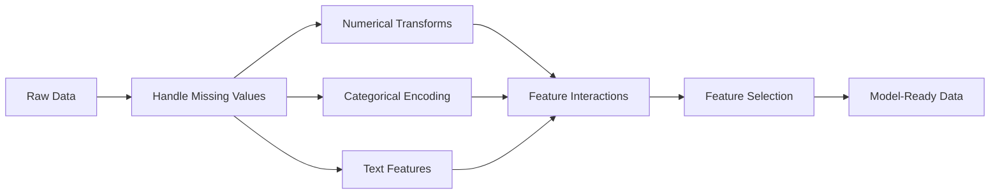

# विशेषता इंजीनियरिंग और चयन
# विशेषताएं इंजीनियरिंग और चयन


> एक अच्छी सुविधा एक हजार डेटा पॉइंट्स के लायक है।

> एक अच्छा लक्षण शीर्ष 1000 डेटा बिंदुओं

**Type:** Build | **类型：** 构建
**Languages:** Python
**Prerequisites:** Phase 1 (Statistics for ML, Linear Algebra), Phase 2 Lessons 1-7 | **前置知识：** Phase 1（统计学、线性代数），Phase 2 第 1-7 课
**Time:** ~90 minutes | **时间：** 约 90 分钟

## सीखने के लक्ष्य

- संख्यात्मक परिवर्तन (मानकीकरण, न्यूनतम अधिकतम स्केलिंग, लॉग परिवर्तन, बिल्डिंग) को लागू करें और समझाएं कि प्रत्येक उपयुक्त कब है
  实现数值变换(标准化、 मिन-मैक्स 缩放、对数变换、分箱) और अपने-अपने अनुकूलन परिदृश्यों की व्याख्या करें
- श्रेणीगत विशेषताओं के लिए एक-उष्ण, लेबल और लक्ष्य एन्कोडिंग बनाएं और लक्ष्य एन्कोडिंग में डेटा लीक जोखिम की पहचान करें
  निर्माण अद्वितीय कोड, टैग कोड और लक्ष्य कोड, पहचान लक्ष्य कोड के डेटा रिस्क जोखिम
- एक TF-IDF वेक्टरराइज़र को खरोंच से बनाएं और समझाएं कि यह पाठ वर्गीकरण के लिए कच्चे शब्द की गणना से बेहतर क्यों है
  शून्य से निर्माण TF-IDF को मापनेवाला, व्याख्या क्यों यह मूल शब्द आवृत्ति गणना से बेहतर है
- आयामता को कम करने के लिए फ़िल्टर आधारित विशेषता चयन (वियरिएंस थ्रॉश, सहसंबंध, पारस्परिक जानकारी) लागू करें
   अनुप्रयोग पर आधारित  विशेषता चयन  अंतर  मूल्य  संबंध  परस्पर सूचना) आयाम को कम करना


> **【中文解读】**
> विशेषता इंजीनियरिंग मूल डेटा को मॉडल में समझने योग्य सुविधाओं में परिवर्तित करना है। यह एमएल में सबसे अधिक समय लेने वाली चरण है। मानकीकरण, कोडिंग, पारगमन विशेषताएं, बहु-उद्देश्यीय विशेषताएं सामान्य तकनीक हैं।

> **【拓展：特征工程 vs 深度学习的自动特征学习】**
> गहन सीखने का मुख्य लाभ स्वचालित सीखने की विशेषता है। सीएनएन स्वचालित रूप से छवि विशेषताएं  ट्रांसफार्मर स्वचालित रूप से पाठ विशेषताएं ), लेकिन यह अभी भी महत्वपूर्ण है।

## समस्या  समस्या परिचय

आपके पास एक डेटा सेट है. आप एक एल्गोरिथ्म चुनते हैं. आप इसे प्रशिक्षित करते हैं. परिणाम मध्यम हैं. आप एक अधिक शानदार एल्गोरिथ्म की कोशिश करते हैं. आप अभी भी मध्यम हैं. आप हाइपरपैरामीटर को समायोजित करने में एक सप्ताह बिताते हैं. मार्जिनल सुधार.

> आप एक डेटा सेट है. आप एक एल्गोरिथ्म चुना है. आप इसे प्रशिक्षित किया है. परिणामों को सरल है. आप एक और अधिक शानदार एल्गोरिथ्म की कोशिश की है. आप एक सप्ताह के लिए इस्तेमाल किया है.

फिर किसी ने कच्चे डेटा को बेहतर सुविधाओं में बदल दिया और एक सरल लॉजिस्टिक प्रतिगमन आपके ट्यूनिंग ग्रेडिएंट-बढ़ते एंसेंबल को हराया।

> फिर किसी ने मूल डेटा को बेहतर सुविधाओं में बदल दिया, एक सरल तर्कगत वापसी ने आपके अनुकूलन की डिग्री को हराया।

यह लगातार होता है. क्लासिकल एमएल में, एल्गोरिदम के चयन से अधिक डेटा का प्रतिनिधित्व मायने रखता है। "वर्ग फुटेज" और "कमरे की संख्या" के साथ एक घर मूल्य मॉडल "अड्रेस के रूप में कच्चे स्ट्रिंग" के साथ एक मॉडल को हराएगा। चाहे छात्र कितना भी परिष्कृत हो। एल्गोरिदम केवल आपके द्वारा दिए गए काम के साथ काम कर सकता है।

> क्लासिक एमएल में, डेटा का प्रतिनिधित्व एल्गोरिदम की तुलना में अधिक महत्वपूर्ण है। "आकार" और "कमरे संख्या" के साथ एक घर मूल्य मॉडल "अडरेस्ट मूल वर्ण" के मॉडल से हार जाएगा, चाहे सीखने का उपकरण कितना जटिल हो। एल्गोरिदम केवल आपको देने वाली चीजों को संसाधित कर सकता है।

फीचर इंजीनियरिंग कच्चे डेटा को प्रतिनिधित्व में बदलने की प्रक्रिया है जो मॉडल के लिए पैटर्न को ढूंढना आसान बनाता है। फीचर चयन ध्वनि जोड़ने के बिना शोर जोड़ने वाली सुविधाओं को फेंकने की प्रक्रिया है। साथ में, वे शास्त्रीय एमएल में उच्चतम लीवरेज गतिविधि हैं।

> विशेषता इंजीनियरिंग मूल डेटा को मॉडल द्वारा पाया जाने वाले मॉडल को अधिक आसानी से प्रदर्शित करने के लिए परिवर्तित करने की प्रक्रिया है। विशेषता चयन केवल बढ़ते शोर को नहीं बढ़ाते सिग्नल के लक्षणों को छोड़ने की प्रक्रिया है। वे क्लासिक एमएल में सबसे अधिक प्रभावशाली गतिविधि हैं।

> **【中文解读】**
> "डेटा और विशेषताएं एमएल की ऊपरी सीमा को निर्धारित करती हैं, मॉडल और एल्गोरिदम केवल इस ऊपरी सीमा के करीब आते हैं।" अच्छी विशेषताएं सरल मॉडल को जटिल मॉडल से हरा सकती हैं। विशेषता इंजीनियरिंग में संख्यात्मक परिवर्तन शामिल हैं।

## अवधारणा का मूल अवधारणा

### विशेषता पाइपलाइन



### संख्यात्मक विशेषताएं

कच्चे संख्याएं शायद ही कभी मॉडल तैयार होती हैं. आम परिवर्तनः

> मूल संख्या बहुत कम सीधे मॉडल में उपयोग की जा सकती हैः

**Scaling:**सुविधाओं को एक ही सीमा पर रखें ताकि दूरी आधारित एल्गोरिदम (के-मीन्स, केएनएन, एसवीएम) सभी सुविधाओं को समान रूप से संभाल सकें। मिन-मैक्स स्केलिंग मैप्स [0, 1] तक। मानकीकरण (ज़-स्कोर) मैप्स mean=0, std=1 तक।

> **缩放：**                                                                                                                                                                                                                                                              

**Log transform:**दाएं-छेड़े वितरण (आय, जनसंख्या, शब्द गिनती) को संपीड़ित करता है। गुणात्मक संबंधों को योगीय में बदल देता है।

> **对数变换：**压缩右偏分布(收入、人口、词频) ∼将乘法关系变为加法关系

**Binning:**निरंतर मानों को श्रेणियों में परिवर्तित करता है। जब विशेषता और लक्ष्य के बीच संबंध गैर-रैखिक लेकिन चरण-wise (जैसे, आयु समूह) है।

> **分箱：**                                                                                                                                                                                                                                                              

**Polynomial features:**x^2, x^3, x1*x2 शब्द बनाता है। यह रैखिक मॉडल को अधिक सुविधाओं की कीमत पर गैर-रेखीय संबंधों को कैप्चर करने देता है।

> **多项式特征：**创建 x^2、x^3、x1*x2 项──让线性模型以更多特征为价格捕捉非线性关系──

### श्रेणीगत विशेषताएं

मॉडल को संख्याओं की आवश्यकता होती है।

> 模型需要数字──类别需要编码──

**One-hot encoding:**प्रत्येक श्रेणी के लिए एक द्विआधारी स्तंभ बनाता है। "रंग = लाल / नीला / हरा" तीन स्तंभों में बदल जाता हैः is_red, is_blue, is_green। कम कार्डिनल्टी सुविधाओं के लिए अच्छी तरह से काम करता है लेकिन कई श्रेणियों के साथ विस्फोट करता है।

> **独热编码：**प्रत्येक श्रेणी के लिए एक दोआधारीय श्रेणी बनाएं। "रंग = लाल/नीला/हरे" 变成三列:is_red、is_blue、is_green。

**Label encoding:**प्रत्येक श्रेणी को एक पूर्णांक में मैप करेंः लाल = 0, नीला = 1, हरा = 2. गलत क्रमबद्धता पेश करता है (मॉडल हरे > नीले > लाल सोच सकता है) । केवल पेड़ आधारित मॉडल के लिए उपयुक्त है जो व्यक्तिगत मानों पर विभाजित होते हैं।

> **标签编码：**प्रत्येक वर्ग को पूर्णांक में प्रदर्शित करनाः लाल=0、नीला=1、ग्रीन=2── मिथ्या क्रम में प्रस्तुत किया गया है।

**Target encoding:**प्रत्येक श्रेणी को उस श्रेणी के लिए लक्ष्य चर के औसत से बदल देता है। शक्तिशाली लेकिन खतरनाकः डेटा लीक का उच्च जोखिम। केवल प्रशिक्षण डेटा पर गणना की जानी चाहिए और परीक्षण डेटा पर लागू किया जाना चाहिए।

> **目标编码：**प्रत्येक श्रेणी को उस श्रेणी के लक्ष्य चर औसत मूल्य में प्रतिस्थापित करना  मजबूत लेकिन खतरनाक: डेटा रिलीक जोखिम उच्च केवल प्रशिक्षण डेटा पर गणना और परीक्षण डेटा पर लागू करना 

### पाठ विशेषताएं

**Count vectorizer:**यह गणना करता है कि प्रत्येक शब्द दस्तावेज़ में कितनी बार दिखाई देता है। "मक्खी मैट पर बैठी" {the: 2, cat: 1, sat: 1, on: 1, mat: 1} बन जाती है।

> **词频向量化：**計算每个词在文档中出现的次数──" बिल्ली गद्दे पर बैठी" 变成 {the: 2, cat: 1, sat: 1, on: 1, mat: 1}──

**TF-IDF:**शब्द आवृत्ति-उपवर्ती दस्तावेज़ आवृत्ति. दस्तावेजों में शब्दों का वजन कितना अद्वितीय है। "the" जैसे सामान्य शब्द कम वजन प्राप्त करते हैं। दुर्लभ, विशिष्ट शब्द उच्च वजन प्राप्त करते हैं।

> **TF-IDF：**词频-逆文档频率──按词在文档中的唯一性加权──常见词如"the" कम权重──稀有、有区分度的词获得高权重──

```
TF(word, doc) = count(word in doc) / total words in doc
IDF(word) = log(total docs / docs containing word)
TF-IDF = TF * IDF
```

### खोए हुए मूल्य

वास्तविक डेटा में छेद है।

> वास्तविक डेटा में खाली छेद है।

- **Drop rows:**केवल जब गायब डेटा दुर्लभ और यादृच्छिक है
  **删除行：** केवल जब डेटा की कमी होती है तो दुर्लभ होती है और समय के साथ होती है
- **Mean/median imputation:**सरल, वितरण आकार को बनाए रखता है (मध्यस्थ अधिक मजबूत है अप्रासंगिक)
  **均值/中位数填充：**简单,保持分布形状(中位数对异常值更鲁棒)
- **Mode imputation:**श्रेणीगत विशेषताओं के लिए
  **众数填充：**श्रेणी विशेषता के लिए
- **Indicator column:**जोड़ने से पहले एक बाइनरी कॉलम "was_this_missing" जोड़ें. तथ्य यह है कि डेटा गायब है अपने आप में सूचनात्मक हो सकता है
  **指示列：**填充前添加二进制列"यह_यह_गुम रहा था"―― डाटा अभाव स्वयं हो सकता है सूचनात्मक
- **Forward/backward fill:**समय श्रृंखला के लिए डेटा
  **前向/后向填充：**समय क्रम डेटा के लिए उपयोग किया

### विशेषता बातचीत

कभी-कभी संबंध संयोजन में होता है। "ऊंचाई" और "वेट" अकेले "बीएमआई = वजन / ऊंचाई ^ 2" की तुलना में कम भविष्यवाणी करते हैं। सुविधाओं के बीच बातचीत सुविधाओं के स्थान को गुणा करती है, इसलिए सही लोगों को चुनने के लिए डोमेन ज्ञान का उपयोग करें।

> "उच्चता" और "वजन" का एक-दूसरे से अलग होना "बीएमआई = वजन / ऊंचाई ^2" का एक-दूसरे से संबंध बनाने की क्षमता है।

### विशेषता चयन

अधिक सुविधाएँ हमेशा बेहतर नहीं होती हैं। अप्रासंगिक सुविधाएँ शोर बढ़ा देती हैं, प्रशिक्षण समय बढ़ा देती हैं और अति-फिटिंग का कारण बन सकती हैं।

> 更多特征不一定好──无关特征增加噪音、增加训练时间并可能导致过适应──

**Filter methods (pre-model):**
- संयोगः एक दूसरे से अत्यधिक संबद्ध विशेषताओं को हटा दें (रिडंडेंट)
  相关性: स्थानांतरण ऊँचाई से संबंधित विशेषताएं
- पारस्परिक सूचनाः यह मापता है कि किसी विशेषता को जानने से लक्ष्य के बारे में अनिश्चितता कम होती है
  互信息: मापने के लिए जानिए एक विशेषता लक्ष्य को कम कर सकती है अनिश्चितता
- भिन्नता सीमाः उन विशेषताओं को हटा दें जो शायद ही भिन्न हों
  方差值: लगभग अपरिवर्तित विशेषताएं हटाई गई

**Wrapper methods (model-based):**
- L1 नियमितकरण (लासो): अपरिवर्तनीय विशेषता भार को बिल्कुल शून्य तक चलाता है
  L1 正则化(Lasso): होगा无关特征权重驱动到恰好为零
- पुनरावर्ती विशेषता समाप्त करनाः ट्रेन, कम महत्वपूर्ण विशेषता हटाएं, दोहराएं
  递归特征消除: प्रशिक्षण, हटाने सबसे महत्वपूर्ण विशेषताएं, दोहराएं

**Why selection matters:**10 अच्छी सुविधाओं वाले मॉडल आमतौर पर 10 अच्छी सुविधाओं वाले मॉडल और 90 शोर वाले मॉडल से बेहतर प्रदर्शन करेंगे। शोरपूर्ण सुविधाएं मॉडल को प्रशिक्षण डेटा पैटर्न पर ओवरफिट करने का अवसर देती हैं जो सामान्य नहीं होती हैं।

> **为什么选择很重要：**एक 10 अच्छे गुणों वाला मॉडल आमतौर पर 10 अच्छे गुणों के साथ-साथ 90 शोर गुणों वाले मॉडल से अधिक होता है। शोर गुणों ने मॉडल को प्रशिक्षण डेटा में अपर्याप्त मोड का अवसर दिया है।

## इसे बनाओ, इसे पूरा करो।

> **【中文解读】**
> 0 से 0 तक के लिए मानककरण (standardisation)                                                                                                                                                                                                                                                         
```figure
feature-scaling
```

## इसे बनाओ

### चरण 1: शून्य से संख्यात्मक परिवर्तन

```python
import math


def min_max_scale(values):
    min_val = min(values)
    max_val = max(values)
    if max_val == min_val:
        return [0.0] * len(values)
    return [(v - min_val) / (max_val - min_val) for v in values]


def standardize(values):
    n = len(values)
    mean = sum(values) / n
    variance = sum((v - mean) ** 2 for v in values) / n
    std = math.sqrt(variance) if variance > 0 else 1.0
    return [(v - mean) / std for v in values]


def log_transform(values):
    return [math.log(v + 1) for v in values]


def bin_values(values, n_bins=5):
    min_val = min(values)
    max_val = max(values)
    bin_width = (max_val - min_val) / n_bins
    if bin_width == 0:
        return [0] * len(values)
    result = []
    for v in values:
        bin_idx = int((v - min_val) / bin_width)
        bin_idx = min(bin_idx, n_bins - 1)
        result.append(bin_idx)
    return result


def polynomial_features(row, degree=2):
    n = len(row)
    result = list(row)
    if degree >= 2:
        for i in range(n):
            result.append(row[i] ** 2)
        for i in range(n):
            for j in range(i + 1, n):
                result.append(row[i] * row[j])
    return result
```

### चरण 2: श्रेणीबद्ध कोडिंग खरोंच से

```python
def one_hot_encode(values):
    categories = sorted(set(values))
    cat_to_idx = {cat: i for i, cat in enumerate(categories)}
    n_cats = len(categories)

    encoded = []
    for v in values:
        row = [0] * n_cats
        row[cat_to_idx[v]] = 1
        encoded.append(row)

    return encoded, categories


def label_encode(values):
    categories = sorted(set(values))
    cat_to_int = {cat: i for i, cat in enumerate(categories)}
    return [cat_to_int[v] for v in values], cat_to_int


def target_encode(feature_values, target_values, smoothing=10):
    global_mean = sum(target_values) / len(target_values)

    category_stats = {}
    for feat, target in zip(feature_values, target_values):
        if feat not in category_stats:
            category_stats[feat] = {"sum": 0.0, "count": 0}
        category_stats[feat]["sum"] += target
        category_stats[feat]["count"] += 1

    encoding = {}
    for cat, stats in category_stats.items():
        cat_mean = stats["sum"] / stats["count"]
        weight = stats["count"] / (stats["count"] + smoothing)
        encoding[cat] = weight * cat_mean + (1 - weight) * global_mean

    return [encoding[v] for v in feature_values], encoding
```

### चरण 3: स्क्रैच से पाठ सुविधाएँ

> तीसरा चरण:文本特征──词频向量(CountVectorizer) सांख्यिकीय प्रत्येक शब्द के दस्तावेज में आने वाले समय की संख्या;TF-IDF 在词频基础上乘以逆文档频率,降低常见词权重、提升稀有词权重──sklearn 的 `TfidfVectorizer`यह इस पर आधारित उत्पादन संस्करण है।

```python
def count_vectorize(documents):
    vocab = {}
    idx = 0
    for doc in documents:
        for word in doc.lower().split():
            if word not in vocab:
                vocab[word] = idx
                idx += 1

    vectors = []
    for doc in documents:
        vec = [0] * len(vocab)
        for word in doc.lower().split():
            vec[vocab[word]] += 1
        vectors.append(vec)

    return vectors, vocab


def tfidf(documents):
    n_docs = len(documents)

    vocab = {}
    idx = 0
    for doc in documents:
        for word in doc.lower().split():
            if word not in vocab:
                vocab[word] = idx
                idx += 1

    doc_freq = {}
    for doc in documents:
        seen = set()
        for word in doc.lower().split():
            if word not in seen:
                doc_freq[word] = doc_freq.get(word, 0) + 1
                seen.add(word)

    vectors = []
    for doc in documents:
        words = doc.lower().split()
        word_count = len(words)
        tf_map = {}
        for word in words:
            tf_map[word] = tf_map.get(word, 0) + 1

        vec = [0.0] * len(vocab)
        for word, count in tf_map.items():
            tf = count / word_count
            idf = math.log(n_docs / doc_freq[word])
            vec[vocab[word]] = tf * idf
        vectors.append(vec)

    return vectors, vocab
```

### चरण 4: शून्य से अनुपस्थित मूल्य निर्धारण

> चौथा चरणः अनुपस्थिति मूल्य भरें। औसत मूल्य भरें। सामान्य स्थिति में वितरण डेटा उपयुक्त है। मध्य संख्या में असामान्य मूल्य है।

```python
def impute_mean(values):
    present = [v for v in values if v is not None]
    if not present:
        return [0.0] * len(values), 0.0
    mean = sum(present) / len(present)
    return [v if v is not None else mean for v in values], mean


def impute_median(values):
    present = sorted(v for v in values if v is not None)
    if not present:
        return [0.0] * len(values), 0.0
    n = len(present)
    if n % 2 == 0:
        median = (present[n // 2 - 1] + present[n // 2]) / 2
    else:
        median = present[n // 2]
    return [v if v is not None else median for v in values], median


def impute_mode(values):
    present = [v for v in values if v is not None]
    if not present:
        return values, None
    counts = {}
    for v in present:
        counts[v] = counts.get(v, 0) + 1
    mode = max(counts, key=counts.get)
    return [v if v is not None else mode for v in values], mode


def add_missing_indicator(values):
    return [0 if v is not None else 1 for v in values]
```

### चरण 5: स्क्रैच से फीचर चयन

> 第五步: विशेषता चयन 皮尔逊                                                                                                                                                                                                                                                          `SelectKBest``VarianceThreshold`ये ही तरीके हैं।

```python
def correlation(x, y):
    n = len(x)
    mean_x = sum(x) / n
    mean_y = sum(y) / n
    cov = sum((xi - mean_x) * (yi - mean_y) for xi, yi in zip(x, y)) / n
    std_x = math.sqrt(sum((xi - mean_x) ** 2 for xi in x) / n)
    std_y = math.sqrt(sum((yi - mean_y) ** 2 for yi in y) / n)
    if std_x == 0 or std_y == 0:
        return 0.0
    return cov / (std_x * std_y)


def mutual_information(feature, target, n_bins=10):
    feat_min = min(feature)
    feat_max = max(feature)
    bin_width = (feat_max - feat_min) / n_bins if feat_max != feat_min else 1.0
    feat_binned = [
        min(int((f - feat_min) / bin_width), n_bins - 1) for f in feature
    ]

    n = len(feature)
    target_classes = sorted(set(target))

    feat_bins = sorted(set(feat_binned))
    p_feat = {}
    for b in feat_bins:
        p_feat[b] = feat_binned.count(b) / n

    p_target = {}
    for t in target_classes:
        p_target[t] = target.count(t) / n

    mi = 0.0
    for b in feat_bins:
        for t in target_classes:
            joint_count = sum(
                1 for fb, tv in zip(feat_binned, target) if fb == b and tv == t
            )
            p_joint = joint_count / n
            if p_joint > 0:
                mi += p_joint * math.log(p_joint / (p_feat[b] * p_target[t]))

    return mi


def variance_threshold(features, threshold=0.01):
    n_features = len(features[0])
    n_samples = len(features)
    selected = []

    for j in range(n_features):
        col = [features[i][j] for i in range(n_samples)]
        mean = sum(col) / n_samples
        var = sum((v - mean) ** 2 for v in col) / n_samples
        if var >= threshold:
            selected.append(j)

    return selected


def remove_correlated(features, threshold=0.9):
    n_features = len(features[0])
    n_samples = len(features)

    to_remove = set()
    for i in range(n_features):
        if i in to_remove:
            continue
        col_i = [features[r][i] for r in range(n_samples)]
        for j in range(i + 1, n_features):
            if j in to_remove:
                continue
            col_j = [features[r][j] for r in range(n_samples)]
            corr = abs(correlation(col_i, col_j))
            if corr >= threshold:
                to_remove.add(j)

    return [i for i in range(n_features) if i not in to_remove]
```

### चरण 6: पूर्ण पाइपलाइन और डेमो

```python
import random


def make_housing_data(n=200, seed=42):
    random.seed(seed)
    data = []
    for _ in range(n):
        sqft = random.uniform(500, 5000)
        bedrooms = random.choice([1, 2, 3, 4, 5])
        age = random.uniform(0, 50)
        neighborhood = random.choice(["downtown", "suburbs", "rural"])
        has_pool = random.choice([True, False])

        sqft_with_missing = sqft if random.random() > 0.05 else None
        age_with_missing = age if random.random() > 0.08 else None

        price = (
            50 * sqft
            + 20000 * bedrooms
            - 1000 * age
            + (50000 if neighborhood == "downtown" else 10000 if neighborhood == "suburbs" else 0)
            + (15000 if has_pool else 0)
            + random.gauss(0, 20000)
        )

        data.append({
            "sqft": sqft_with_missing,
            "bedrooms": bedrooms,
            "age": age_with_missing,
            "neighborhood": neighborhood,
            "has_pool": has_pool,
            "price": price,
        })
    return data


if __name__ == "__main__":
    data = make_housing_data(200)

    print("=== Raw Data Sample ===")
    for row in data[:3]:
        print(f"  {row}")

    sqft_raw = [d["sqft"] for d in data]
    age_raw = [d["age"] for d in data]
    prices = [d["price"] for d in data]

    print("\n=== Missing Value Handling ===")
    sqft_missing = sum(1 for v in sqft_raw if v is None)
    age_missing = sum(1 for v in age_raw if v is None)
    print(f"  sqft missing: {sqft_missing}/{len(sqft_raw)}")
    print(f"  age missing: {age_missing}/{len(age_raw)}")

    sqft_indicator = add_missing_indicator(sqft_raw)
    age_indicator = add_missing_indicator(age_raw)
    sqft_imputed, sqft_fill = impute_median(sqft_raw)
    age_imputed, age_fill = impute_mean(age_raw)
    print(f"  sqft filled with median: {sqft_fill:.0f}")
    print(f"  age filled with mean: {age_fill:.1f}")

    print("\n=== Numerical Transforms ===")
    sqft_scaled = standardize(sqft_imputed)
    age_scaled = min_max_scale(age_imputed)
    sqft_log = log_transform(sqft_imputed)
    age_binned = bin_values(age_imputed, n_bins=5)
    print(f"  sqft standardized: mean={sum(sqft_scaled)/len(sqft_scaled):.4f}, std={math.sqrt(sum(v**2 for v in sqft_scaled)/len(sqft_scaled)):.4f}")
    print(f"  age min-max: [{min(age_scaled):.2f}, {max(age_scaled):.2f}]")
    print(f"  age bins: {sorted(set(age_binned))}")

    print("\n=== Categorical Encoding ===")
    neighborhoods = [d["neighborhood"] for d in data]

    ohe, ohe_cats = one_hot_encode(neighborhoods)
    print(f"  One-hot categories: {ohe_cats}")
    print(f"  Sample encoding: {neighborhoods[0]} -> {ohe[0]}")

    le, le_map = label_encode(neighborhoods)
    print(f"  Label encoding map: {le_map}")

    te, te_map = target_encode(neighborhoods, prices, smoothing=10)
    print(f"  Target encoding: {({k: round(v) for k, v in te_map.items()})}")

    print("\n=== Text Features ===")
    descriptions = [
        "large modern house with pool",
        "small cozy cottage near downtown",
        "spacious family home with large yard",
        "modern apartment downtown with view",
        "rustic cabin in rural area",
    ]
    cv, cv_vocab = count_vectorize(descriptions)
    print(f"  Vocabulary size: {len(cv_vocab)}")
    print(f"  Doc 0 non-zero features: {sum(1 for v in cv[0] if v > 0)}")

    tf, tf_vocab = tfidf(descriptions)
    print(f"  TF-IDF vocabulary size: {len(tf_vocab)}")
    top_words = sorted(tf_vocab.keys(), key=lambda w: tf[0][tf_vocab[w]], reverse=True)[:3]
    print(f"  Doc 0 top TF-IDF words: {top_words}")

    print("\n=== Polynomial Features ===")
    sample_row = [sqft_scaled[0], age_scaled[0]]
    poly = polynomial_features(sample_row, degree=2)
    print(f"  Input: {[round(v, 4) for v in sample_row]}")
    print(f"  Polynomial: {[round(v, 4) for v in poly]}")
    print(f"  Features: [x1, x2, x1^2, x2^2, x1*x2]")

    print("\n=== Feature Selection ===")
    feature_matrix = [
        [sqft_scaled[i], age_scaled[i], float(sqft_indicator[i]), float(age_indicator[i])]
        + ohe[i]
        for i in range(len(data))
    ]

    print(f"  Total features: {len(feature_matrix[0])}")

    surviving_var = variance_threshold(feature_matrix, threshold=0.01)
    print(f"  After variance threshold (0.01): {len(surviving_var)} features kept")

    surviving_corr = remove_correlated(feature_matrix, threshold=0.9)
    print(f"  After correlation filter (0.9): {len(surviving_corr)} features kept")

    binary_prices = [1 if p > sum(prices) / len(prices) else 0 for p in prices]
    print("\n  Mutual information with target:")
    feature_names = ["sqft", "age", "sqft_missing", "age_missing"] + [f"neigh_{c}" for c in ohe_cats]
    for j in range(len(feature_matrix[0])):
        col = [feature_matrix[i][j] for i in range(len(feature_matrix))]
        mi = mutual_information(col, binary_prices, n_bins=10)
        print(f"    {feature_names[j]}: MI={mi:.4f}")

    print("\n  Correlation with price:")
    for j in range(len(feature_matrix[0])):
        col = [feature_matrix[i][j] for i in range(len(feature_matrix))]
        corr = correlation(col, prices)
        print(f"    {feature_names[j]}: r={corr:.4f}")
```

## इसे फ्रेमवर्क के साथ लागू करें

> **【拓展：sklearn Pipeline 的工业级实践】**
> sklearn का ColumnTransformer + Pipeline विशेषता इंजीनियरिंग का सर्वोत्तम अभ्यास हैः अंक विशेषता और श्रेणी विशेषता को अलग से संसाधित करना, एक अंत से अंत तक एक प्रवाह लाइन को गठित करना। यह प्रशिक्षण सेट और परीक्षण सेट का उपयोग पूरी तरह से समान परिवर्तन सुनिश्चित करता है, डेटा लीक से बचता है।

स्किट-लर्न के साथ, ये परिवर्तन संश्लेषित पाइपलाइन हैंः

> उपयोग करके, इन परिवर्तनों को एक साथ संकलित किया जा सकता हैः

```python
from sklearn.preprocessing import StandardScaler, OneHotEncoder, PolynomialFeatures  # 预处理变换器
from sklearn.impute import SimpleImputer  # 缺失值填充
from sklearn.feature_extraction.text import TfidfVectorizer  # 文本 TF-IDF 向量化
from sklearn.feature_selection import mutual_info_classif, VarianceThreshold  # 特征选择
from sklearn.compose import ColumnTransformer  # 按列分组处理
from sklearn.pipeline import Pipeline  # 构建端到端流水线

numeric_pipe = Pipeline([
    ("imputer", SimpleImputer(strategy="median")),
    ("scaler", StandardScaler()),
])

categorical_pipe = Pipeline([
    ("encoder", OneHotEncoder(sparse_output=False)),
])

preprocessor = ColumnTransformer([
    ("num", numeric_pipe, ["sqft", "age"]),
    ("cat", categorical_pipe, ["neighborhood"]),
])
```

स्क्रैच संस्करणों में प्रत्येक परिवर्तन के अंदर क्या होता है, यह दिखाया गया है। पुस्तकालय संस्करणों में एज-केस हैंडलिंग, दुर्लभ मैट्रिक्स समर्थन और पाइपलाइन संरचना शामिल है, लेकिन गणित समान है।

> शून्य संस्करण से प्रत्येक परिवर्तन के भीतर क्या हुआ है, यह सटीक रूप से दिखाया गया है।

## इसे भेजें उत्पाद

इस पाठ से उत्पन्न होता हैः
- `outputs/prompt-feature-engineer.md`- कच्चे डेटा से व्यवस्थित रूप से इंजीनियरिंग सुविधाओं के लिए एक संकेत

> 本课产出:
> - `outputs/prompt-feature-engineer.md`- मूल डेटा प्रणालीकरण इंजीनियरिंग विशेषताओं से एक सुझाव शब्द

> **【拓展：自动化特征工程——Featuretools 和 AutoML】**
> फीचरटूल एक खुला स्रोत स्वचालित विशेषता इंजीनियरिंग पुस्तकालय है, जो स्वचालित रूप से संबंध प्रकार के डेटा से हजारों विशेषताएं उत्पन्न कर सकता है।

> **【中文解读】**
> TF-IDF (शब्द-频-逆文档频率) एक ग्रंथ विशेषता अभियांत्रिकी का क्लासिक तरीका हैःTF 衡量词在文档中的频率,IDF 衡量词在所有文档中的稀有程度,如"的"、"是")IDF 低,特征词(如"量子"、"区块链")IDF 高──TF-IDF 虽然简单,但在文文分类中至今仍然有效的基线特征.

## अभ्यास विषय

1. संख्यात्मक परिवर्तनों में मजबूत स्केलिंग (मध्यम और मानक विचलन के बजाय मध्य और अंतर-क्वार्टिल रेंज का उपयोग करके) जोड़ें। इसे चरम विकृति वाले डेटा पर मानक स्केलिंग के साथ तुलना करें।
   1. मध्यवर्ती और चौपायावर्ती अंतर का उपयोग औसत और मानक अंतर के बजाय किया जाता है।
2. एक-बाहर लक्ष्य एन्कोडिंग लागू करेंः प्रत्येक पंक्ति के लिए, उस पंक्ति के अपने लक्ष्य मूल्य को छोड़कर लक्ष्य औसत की गणना करें। दिखाएं कि यह साफ़ लक्ष्य एन्कोडिंग की तुलना में ओवरफिटिंग कैसे कम करता है।
   2. 实现留一法目标编码: प्रति पंक्ति, गणना को छोड़कर इस पंक्ति के अपने लक्ष्य मूल्य का लक्ष्य औसत मूल्य।
3. एक स्वचालित सुविधा चयन पाइपलाइन बनाएं जो भिन्नता सीमा, सहसंबंध फ़िल्टरिंग और आपसी सूचना रैंकिंग को जोड़ता है। इसे आवास डेटासेट पर लागू करें और सभी सुविधाओं बनाम चयनित सुविधाओं के साथ मॉडल प्रदर्शन (सरल रैखिक प्रतिगमन का उपयोग करें) की तुलना करें।
   3.  स्वचालित विशेषता चयन पाइपलाइन, संयोजन अंतर  मूल्य  संबंध  और परस्पर सूचना क्रम  को निर्माण करना  आवास डेटासेट में लागू करना, सभी विशेषताओं और चयनित विशेषताओं के मॉडल प्रदर्शन का उपयोग करके तुलना करना  सरल रैखिक वापसी का उपयोग करके) 

## कीवर्ड्स  शब्द खोज तालिका

| Term | What people say | What it actually means |
|------|----------------|----------------------|
| Feature engineering | "Making new columns" | Transforming raw data into representations that expose patterns to the model |
| Standardization | "Making it normal" | Subtracting the mean and dividing by standard deviation so the feature has mean=0 and std=1 |
| One-hot encoding | "Making dummy variables" | Creating one binary column per category, where exactly one column is 1 for each row |
| Target encoding | "Using the answer to encode" | Replacing each category with the average target value for that category, with smoothing to prevent overfitting |
| TF-IDF | "Fancy word counts" | Term Frequency times Inverse Document Frequency: words weighted by how distinctive they are across the corpus |
| Imputation | "Filling in blanks" | Replacing missing values with estimated values (mean, median, mode, or model-predicted) |
| Feature selection | "Throwing out bad columns" | Removing features that add noise or redundancy, keeping only those with signal about the target |
| Mutual information | "How much one thing tells you about another" | A measure of the reduction in uncertainty about variable Y gained by observing variable X |
| Data leakage | "Accidentally cheating" | Using information during training that would not be available at prediction time, giving falsely optimistic results |

## आगे पढ़ना 延伸閱讀

- [Feature Engineering and Selection (Max Kuhn & Kjell Johnson)](http://www.feat.engineering/)- फीचर इंजीनियरिंग के पूरे परिदृश्य को कवर करने वाली मुफ्त ऑनलाइन पुस्तक
  [Feature Engineering and Selection (Max Kuhn & Kjell Johnson)](http://www.feat.engineering/)- ् ् ् ् ् ् ् ् ् ् ् ् ् ् ् ् ् ् ् ् ् ् ् ् ् ् ् ् ् ् ् ् ् ् ् ् ् ् ् ् ् ् ् ् ् ् ् ् ् ् ् ् ् ् ् ् ् ् ् ् ् ् ् ् ् ् ् ् ् ् ् ् ् ् ् ् ् ् ् ् ् ् ् ् ् ् ् ् ् ् ् ् ् ् ् ् ् ् ् ् ् ् ् ् ् ् ् ् ् ् ् ् ् ् ् ् ् ् ् ् ् ् ् ् ् ् ् ् ् ् ् ् ् ् ् ् ् ् ् ् ् ् ् ् ् ् ् ् ् ् ् ् ् ् ् ् ् ् ् ् ् ् ् ् ् ् ् ् ् ् ् ् ् ् ् ् ् ् ् ् ् ् ् ् ् ् ् ् ् ् ् ् ् ् ् ् ् ् ् ् ् ् ् ् ् ् ् ् ् ् ् ् ् ् ् ् ् ् ् ् ् ् ् ् ् ् ् ् ् ् ् ् ् ् ् ् ् ् ् ् ् ् ् ् ् ् ् ् ् ् ् ् ् ् 
- [scikit-learn Preprocessing Guide](https://scikit-learn.org/stable/modules/preprocessing.html)- सभी मानक परिवर्तनों के लिए व्यावहारिक संदर्भ
  [scikit-learn 预处理指南](https://scikit-learn.org/stable/modules/preprocessing.html)- सभी मानक परिवर्तन के व्यावहारिक संदर्भ
- [Target Encoding Done Right (Micci-Barreca, 2001)](https://dl.acm.org/doi/10.1145/507533.507538)- लक्षित कोडिंग के बारे में मूल पेपर
  [Target Encoding Done Right (Micci-Barreca, 2001)](https://dl.acm.org/doi/10.1145/507533.507538)- 带平滑的目标编码原始论文
