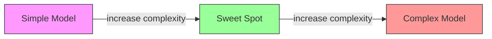
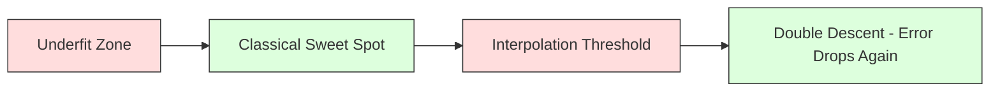
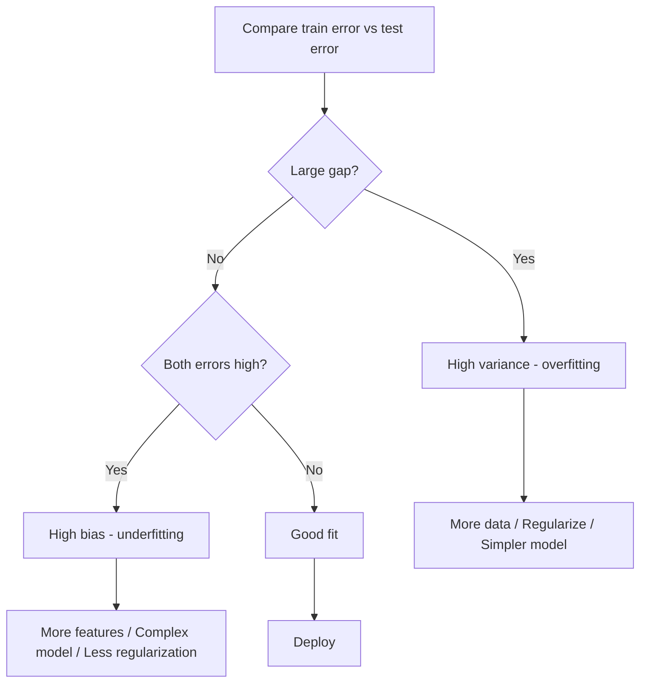
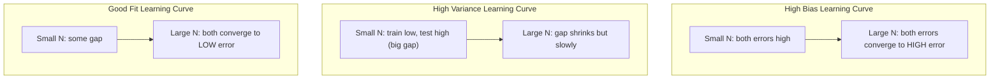
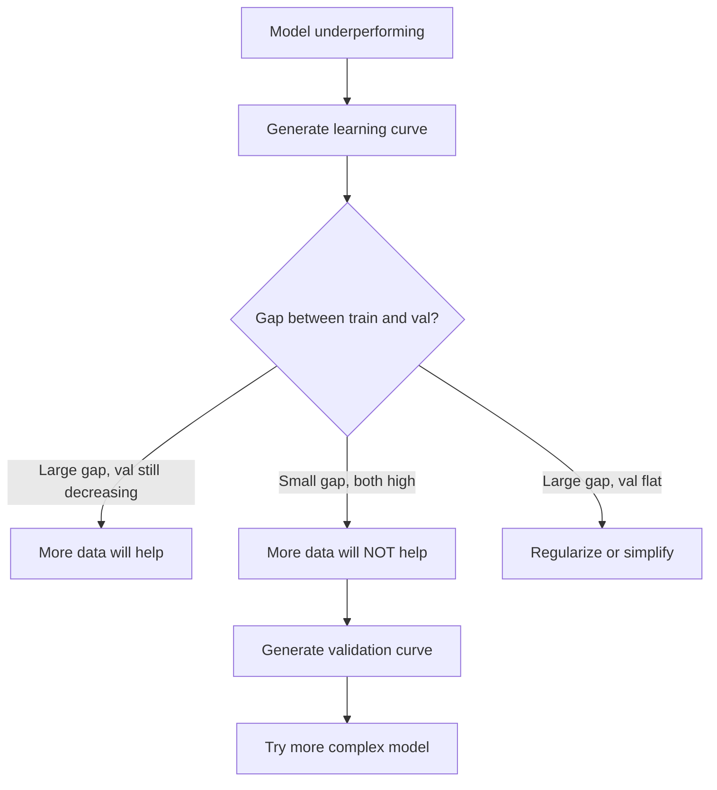

# पूर्वाग्रह-विविधता व्यापार
# 偏差-方差权衡


> प्रत्येक मॉडल त्रुटि तीन स्रोतों में से एक से आती हैः पूर्वाग्रह, भिन्नता, या शोर। आप केवल पहले दो को नियंत्रित कर सकते हैं।

> प्रत्येक मॉडल त्रुटि तीन स्रोतों में से एक से आती हैः विकृति, अंतर या शोर। आप केवल पहले दो को नियंत्रित कर सकते हैं।

**Type:** Learn | **类型：** 学习
**Language:**पायथन**语言：**पायथन
**Prerequisites:** Phase 2, Lessons 01-09 (ML basics, regression, classification, evaluation) | **前置知识：** Phase 2 第 1-9 课（ML 基础、回归、分类、评估）
**Time:** ~75 minutes | **时间：** 约 75 分钟

## सीखने के लक्ष्य

- अपेक्षित भविष्यवाणी त्रुटि के पूर्वाग्रह-विभेद विघटन का व्युत्पन्न करें और अपरिवर्तनीय शोर की भूमिका की व्याख्या करें
  推导期望预测 त्रुटि के विकृति-अवशेष विघटन, व्याख्या अपरिहार्य शोर की भूमिका
- यह निदान करें कि क्या एक मॉडल को प्रशिक्षण और परीक्षण त्रुटि पैटर्न का उपयोग करके उच्च पूर्वाग्रह या उच्च भिन्नता से पीड़ित है
  प्रयोग प्रशिक्षण त्रुटि और परीक्षण त्रुटि मोड निदान मॉडल क्या उच्च विकृति या उच्च परिमाण अंतर है
- बताएं कि कैसे नियमितकरण तकनीक (L1, L2, ड्रॉपआउट, आरंभिक रोक) भिन्नता के लिए व्यापार पूर्वाग्रह
  解释正则化技术(L1、L2、Dropout、早停) कैसे偏差 और方差 के बीच तौल करें
- जटिलता बढ़ते मॉडल के बीच पूर्वाग्रह-भिन्नता व्यापार को दर्शाने वाले प्रयोगों को लागू करें
  दृष्टिमान मॉडल जटिलता में वृद्धि के समय अंतर-अंतर-वज़न माप के प्रयोग को प्राप्त करना


> **【中文解读】**
> 偏差 (अनुकूलित) ⇒ 方差 (अनुकूलित) ⇒ 偏差 (अनुकूलित) ⇒ 偏差 (अनुकूलित) ⇒ 偏差 (अनुकूलित) ⇒ 偏差 (अनुकूलित) ⇒ 偏差 (अनुकूलित) ⇒ 偏差 (अनुकूलित) ⇒ 偏差 (अनुकूलित) ⇒ 偏差 (अनुकूलित) ⇒ 偏差 (अनुकूलित) ⇒ 偏差 (अनुकूलित) ⇒ 偏差 (अनुकूलित) ⇒ 偏差 (अनुकूलित) ⇒ 偏差 (अनुकूलित) ⇒ 偏差 (अनुकूलित) ⇒ 偏差 (अनुकूलित) ⇒ 偏差 (अनुकूलित) ⇒ 偏差 (अनुकूलित) ⇒ 偏差 (अनुकूलित) ⇒ 偏差 (अनुकूलित) ⇒ 偏差 (अनुकूलित) ⇒ 偏差 (अनुकूलित) ⇒ 偏差 (अनुकूलित) ⇒ 偏差 (अनुकूलित) ⇒ 偏差 (अनुकूलित) ⇒ 偏差 (अनुकूलित) ⇒ 偏差 (अनुकूलित) ⇒ 偏差 (अनुकूलित) ⇒ 偏差 (अनुकूलित) ⇒ ⇒ 偏差 (अनुकूलित) ⇒ ⇒ ⇒ ⇒ ⇒ ⇒ ⇒ ⇒ ⇒ ⇒ ⇒ ⇒ ⇒ ⇒ ⇒ ⇒ ⇒ ⇒ ⇒ ⇒ ⇒ ⇒ ⇒ ⇒ ⇒ ⇒ ⇒ ⇒ ⇒ ⇒ ⇒ ⇒ ⇒ ⇒ ⇒ ⇒ ⇒ ⇒ ⇒ ⇒ ⇒ ⇒ ⇒ ⇒ ⇒                                                       

> **【拓展：偏差-方差在深度学习中的新理解】**
> 经典理论认为增大模型会增加高方差,但深度学习中存在"双重下降" (दोहरी गिरावट) 现象:模型超过"插值值" (插值值) 能完美记忆训练数据) 后,测试误差反而下降──GPT-3 (1750 亿参数) 远超训练所需,但泛化性能反而更好── इसका अर्थ है कि गहन学习 में, "更大=更好" कुछ शर्तों पर, पारंपरिक偏差-差व्यों के निर्धारण की धारणा को तोड़कर स्थापित हो गया है।

## समस्या  समस्या परिचय

आपने एक मॉडल को प्रशिक्षित किया है. इसमें परीक्षण डेटा में कुछ त्रुटि है. यह त्रुटि कहां से आई है?

> आप एक मॉडल को प्रशिक्षित किया है। यह परीक्षण डेटा में कुछ त्रुटियों है। इन त्रुटियों से क्या आया है?

यदि आपका मॉडल बहुत सरल है (एक घुमावदार डेटासेट पर रैखिक प्रतिगमन), तो यह लगातार सही पैटर्न को याद करेगा। यह पूर्वाग्रह है। यदि आपका मॉडल बहुत जटिल है (15 डेटा बिंदुओं पर डिग्री-20 बहुपद), तो यह प्रशिक्षण डेटा को पूरी तरह से फिट करेगा लेकिन नए डेटा पर बहुत अलग भविष्यवाणियां देगा। यह भिन्नता है।

> यदि आपका मॉडल बहुत सरल है, तो यह वास्तविक मॉडल से दूर रहता है। यह एक अंतर है। यदि आपका मॉडल बहुत जटिल है, तो यह 15 डेटा बिंदुओं पर 20 बार अधिक संख्याओं के साथ पूरी तरह से फिट बैठता है, लेकिन नए डेटा पर एक अलग अनुमान देता है।

आप एक निश्चित मॉडल क्षमता के लिए दोनों को एक ही समय में कम नहीं कर सकते। पूर्वाग्रह को नीचे धकेलें और भिन्नता बढ़ जाती है। पूर्वाग्रह को नीचे धकेलें और पूर्वाग्रह बढ़ जाता है। इस व्यापार को समझना मशीन लर्निंग में सबसे उपयोगी नैदानिक कौशल है। यह आपको बताता है कि क्या आप अपना मॉडल अधिक जटिल या कम जटिल बनाना चाहते हैं, क्या आप अधिक डेटा प्राप्त करना चाहते हैं या बेहतर सुविधाओं का निर्माण करना चाहते हैं, क्या आप अधिक या कम नियमित करना चाहते हैं।

>  निश्चित मॉडल क्षमता के लिए, आप दोनों को एक साथ कम नहीं कर सकते हैं  दबाव कम विकृति, फ़ैसला बढ़ता है  दबाव कम विकृति, फ़ैसला बढ़ता है  समझना इस प्रकार का वजन मशीन सीखने में सबसे उपयोगी निदान कौशल है  यह आपको बताता है कि क्या मॉडल को अधिक जटिल या सरल बनाना चाहिए, क्या अधिक डेटा या बेहतर इंजीनियरिंग विशेषताएं प्राप्त करनी चाहिए, क्या अधिक या कम सही करना चाहिए 

> **【中文解读】**
> 误差 = 偏差2 + 方差 + 不可约噪声──偏差来自模型的错误假设(如用直线拟合曲线),偏差来自训练数据波动的过度敏感──诊断方法:训练误差高+测试误差高→高偏差(欠拟合);训练误差低+测试误差高→高方差(过拟合)──对应的解决方案完全不同──

## अवधारणा का मूल अवधारणा

### पूर्वाग्रहः व्यवस्थित त्रुटि

पूर्वाग्रह मापता है कि आपके मॉडल की औसत भविष्यवाणी वास्तविक मूल्य से कितनी दूर है। यदि आपने एक ही मॉडल को एक ही वितरण से प्राप्त कई अलग-अलग प्रशिक्षण सेटों पर प्रशिक्षित किया और भविष्यवाणियों का औसत बनाया, तो पूर्वाग्रह उस औसत और सच्चाई के बीच अंतर है।

> 偏差 आपके मॉडल के औसत अनुमान और वास्तविक मूल्य के बीच का अंतर मापता है  यदि आप एक ही वितरण से निकाले गए कई अलग-अलग प्रशिक्षण सेट पर एक ही मॉडल और औसत अनुमान के परिणाम पर अभ्यास करते हैं, तो偏差 उस औसत मूल्य और वास्तविक मूल्य के बीच का अंतर है

उच्च पूर्वाग्रह का मतलब है कि मॉडल वास्तविक पैटर्न को कैप्चर करने के लिए बहुत कठोर है। एक पैराबोला के अनुरूप एक सीधी रेखा हमेशा वक्र को याद करेगी, चाहे आप इसे कितना डेटा दें। यह अनुचित है।

> उच्च विकृति का अर्थ है मॉडल अतिव्यापी, वास्तविक मोड को पकड़ने में असमर्थ।

```
High bias (underfitting):
  Model always predicts roughly the same wrong thing.
  Training error: HIGH
  Test error: HIGH
  Gap between them: SMALL
```

### विविधताः प्रशिक्षण डेटा की संवेदनशीलता

वेरिएंट यह मापता है कि जब आप विभिन्न डेटा उपसमूहों पर प्रशिक्षण देते हैं तो आपकी भविष्यवाणियां कितनी बदलती हैं। यदि प्रशिक्षण सेट में छोटे बदलाव मॉडल में बड़े बदलाव का कारण बनते हैं, तो वेरिएंट अधिक है।

> 方差 माप विभिन्न डेटा सेट पर प्रशिक्षण के दौरान परिणामों के परिवर्तन की भविष्यवाणी की डिग्री  यदि प्रशिक्षण सेट में छोटे बदलावों से मॉडल में भारी परिवर्तन होता है, तो अंतर बहुत अधिक है

उच्च भिन्नता का अर्थ है कि मॉडल प्रशिक्षण डेटा में शोर फिट करता है, अंतर्निहित संकेत नहीं। एक डिग्री-20 बहुपद प्रत्येक प्रशिक्षण बिंदु के माध्यम से थ्रेड करेगा लेकिन उनके बीच जंगली रूप से झुकता है। यह ओवरफिटिंग है।

> उच्चतर अंतर का अर्थ है कि मॉडल में ध्वनि है, जो एक उपयुक्त प्रशिक्षण डेटा में है, न कि संभावित संकेतों में से एक है। एक 20 बार से अधिक घटनाएं प्रत्येक प्रशिक्षण बिंदु के माध्यम से होती हैं, लेकिन उनके बीच तीव्र कंपन होती है।

```
High variance (overfitting):
  Model fits training data perfectly but fails on new data.
  Training error: LOW
  Test error: HIGH
  Gap between them: LARGE
```

### विघटन

किसी भी बिंदु x के लिए, वर्ग हानि के तहत अपेक्षित भविष्यवाणी त्रुटि ठीक से विघटित होती हैः

> 对于任意点 x,在平方损失下,期望预测误差精确分解为:

```
Expected Error = Bias^2 + Variance + Irreducible Noise

where:
  Bias^2   = (E[f_hat(x)] - f(x))^2
  Variance = E[(f_hat(x) - E[f_hat(x)])^2]
  Noise    = E[(y - f(x))^2]             (sigma^2)
```

- `f(x)`है वास्तविक कार्य
  `f(x)`है वास्तविक फ़ंक्शन
- `f_hat(x)`यह आपके मॉडल की भविष्यवाणी है
  `f_hat(x)`है अपने मॉडल की पूर्वानुमान
- `E[...]`विभिन्न प्रशिक्षण सेटों पर अपेक्षा है
  `E[...]`विभिन्न प्रशिक्षण समूहों के लिए अपेक्षाएँ
- `y`यह अवलोकन किया गया लेबल (सच्चा फ़ंक्शन प्लस शोर) है
  `y`️️️️️️️️️️️️️️️️️️️️️️️️️️️️️️️️️️️️️️️️️️️️️️️️️️️️️️️️️️️️️️️️️️️️️️️️️️️️️️️️️️️️️️️️️️️️️️️️️️️️️️️️️️️️️️️️️️️️️️️️️️️️️️️️️️️️️️️️️️️️️️️️️️️️️️️️️️️️️️️️️️️️️️️️️️️️️️️️️️️️️️️️️️️️️️️️️️️️️️️️️️️️️️️️️️️️️️️️️️️️️️️️️️️️️️️️️️️️️️️️️️️️️️️️️️️️️️️️️️️️️️️️️️️️️️️️️️️️️️️️️️️️️️️️️️️️️️️️️️️️️️️️️️️️️️️️️️️️️️️️️️️️️️️️️️️️️️️️️️️️️️️️️️️️️️️️️️️️️️️️️️️️️️️️️️️️️️️️️️️️️️️️️️️️️️️️️️️️️️️️️️️️️️️️️️️️️️️️️️️️️️️️️️️️️️️️️️️️️️️️️️️️️️️️️️️️️️️️️️️️️️️️️️️️️️️️️️️️️️️️️️️️️️️️️️️️️️️️️️️️️️️️️️️️

शोर शब्द अपरिहार्य है. कोई मॉडल शोर डेटा पर सिग्मा^2 से बेहतर काम नहीं कर सकता है. आपका काम पूर्वाग्रह^2 और भिन्नता के बीच सही संतुलन ढूंढना है।

> 噪音项是不可约束的―― 噪音数据上没有任何模型能比 sigma^2做得更好―― 噪音项是不可约束的―― 噪音项是不可约束的―― 噪音项是不可约束的―― 噪音项是不可约束的―― 噪音项是不可约束的―― 噪音项是不可约束的―― 噪音项是不可约束的―― 噪音数据上没有任何模型能比 sigma^2做得更好的―― 噪音项的任何模型都能在含噪音数据上做得更好的―― 噪音项的比差距和差距之间的正确平衡的任务是你的任务是找到偏差的差距的差距的差距的差距的差距的差距的差距的差距的差距的差距的差距的差距的差距.

### मॉडल जटिलता बनाम त्रुटि



क्लासिक यू-आकार के वक्रः

> 经典的 U 形曲线:

| Complexity | Bias | Variance | Total Error |
|-----------|------|----------|-------------|
| Too low | HIGH | LOW | HIGH (underfitting) |
| Just right | MODERATE | MODERATE | LOWEST |
| Too high | LOW | HIGH | HIGH (overfitting) |

| 复杂度 | 偏差 | 方差 | 总误差 |
|--------|------|------|--------|
| 太低 | 高 | 低 | 高（欠拟合） |
| 刚好 | 中等 | 中等 | 最低 |
| 太高 | 低 | 高 | 高（过拟合） |

### पूर्वाग्रह नियंत्रण के रूप में नियमन

नियमन विसंगति को कम करने के लिए पूर्वग्रह को जानबूझकर बढ़ाता है। यह मॉडल को प्रतिबंधित करता है ताकि यह शोर का पीछा नहीं कर सके।

> यह एक ऐसा संयंत्र है जो शोर का पीछा नहीं कर सकता है।

- **L2 (Ridge):**सभी भारों को शून्य की ओर कम करता है, सभी विशेषताओं को बनाए रखता है, लेकिन उनके प्रभाव को कम करता है।
  **L2 (Ridge)**:: सभी विशेषताओं को बरकरार रखना, लेकिन प्रभाव को कम करना
- **L1 (Lasso):**कुछ वजन को शून्य तक धक्का देता है। सुविधा चयन करता है।
  **L1 (Lasso)**:将某些权重精确推至零――执行特征选择――
- **Dropout:**प्रशिक्षण के दौरान यादृच्छिक रूप से न्यूरॉन्स को निष्क्रिय करता है।
  **Dropout**: प्रशिक्षण समय随机禁用神经元──迫使冗余表示──
- **Early stopping:**प्रशिक्षण डेटा के मॉडल को पूरी तरह से फिट करने से पहले प्रशिक्षण बंद कर देता है।
  **早停**: in मॉडल पूरी तरह से अनुकूल प्रशिक्षण डेटा से पहले प्रशिक्षण बंद करो

नियमन शक्ति (lambda, ड्रॉपअप दर, युगों की संख्या) सीधे नियंत्रित करती है कि आप पूर्वाग्रह-भिन्नता वक्र पर कहां बैठे हैं। अधिक नियमन का मतलब है अधिक पूर्वाग्रह, कम भिन्नता।

> अधिक सामान्यीकरण का अर्थ है अधिक विकृति, कम विकृति।

### दोहरी वंशावलीः आधुनिक दृष्टिकोण

क्लासिकल थ्योरी कहती हैः मीठे बिंदु के बाद, अधिक जटिलता हमेशा दर्द करती है। लेकिन 2019 के बाद से अनुसंधान ने कुछ अप्रत्याशित दिखाया है। यदि आप अंतराल सीमा से परे मॉडल क्षमता को बढ़ाते रहते हैं (जहां मॉडल में प्रशिक्षण डेटा को पूरी तरह से फिट करने के लिए पर्याप्त मापदंड होते हैं), तो परीक्षण त्रुटि फिर से कम हो सकती है।

> 经典理论认为: सर्वोत्तम गुण के बाद, अधिक जटिलता हमेशा हानिकारक होती है। लेकिन 2019 के बाद से किए गए शोध से कुछ अप्रत्याशित घटनाएं सामने आई हैं। यदि आप मॉडल क्षमता में वृद्धि करते हैं, तो मॉडल के पास पर्याप्त तत्व हैं, परीक्षण त्रुटि फिर से कम हो सकती है।



इस "डबल वंश" घटना से पता चलता है कि बड़े पैमाने पर अतिपरिमेय तंत्रिका नेटवर्क (प्रशिक्षण उदाहरणों की तुलना में बहुत अधिक मापदंडों के साथ) अभी भी अच्छी तरह से सामान्य हो जाते हैं। शास्त्रीय पूर्वाग्रह-भिन्नता व्यापार गलत नहीं है, लेकिन यह आधुनिक शासन के लिए अपूर्ण है।

> इस प्रकार की "दोहरी घटती" घटना से पता चलता है कि बड़े पैमाने पर पारस्परिक रूप से पारस्परिक रूप से पारस्परिक रूप से पारस्परिक रूप से पारस्परिक रूप से पारस्परिक रूप से पारस्परिक रूप से पारस्परिक रूप से पारस्परिक रूप से पारस्परिक रूप से पारस्परिक रूप से पारस्परिक रूप से पारस्परिक रूप से पारस्परिक रूप से पारस्परिक रूप से पारस्परिक रूप से पारस्परिक रूप से पारस्परिक रूप से पारस्परिक रूप से पारस्परिक रूप से पारस्परिक रूप से पारस्परिक रूप से पारस्परिक रूप से पारस्परिक रूप से पारस्परिक रूप से पारस्परिक रूप से पारस्परिक रूप से पारस्परिक रूप से पारस्परिक रूप से पारस्परिक रूप से पारस्परिक रूप से पारस्परिक रूप से पारस्परिक रूप से पारस्परिक रूप से पारस्परिक रूप से पारस्परिक रूप से पारस्परिक रूप से पारस्परिक रूप से पारस्परिक रूप से पारस्परिक रूप से पारस्परिक रूप से पारस्परिक रूप से पारस्परिक रूप से पारस्परिक रूप से पारस्परिक रूप से पारस्परिक रूपिक रूप से पारस्परिक रूप से अपूर्ण है।

दोहरी गिरावट के बारे में प्रमुख टिप्पणियाँः

> 关于双重下降的关键观察:

- यह रैखिक मॉडल, निर्णय वृक्ष और तंत्रिका नेटवर्क में होता है
  यह ऑनलाइन मॉडल, निर्णय वृक्ष और तंत्रिका नेटवर्क में होता है
- अधिक डेटा वास्तव में अंतराल क्षेत्र में चोट पहुंचा सकता है (सैंपल-wise डबल उतरने)
                                                                                                                                                                                                                                                                
- अधिक प्रशिक्षण युग भी इसका कारण बन सकते हैं (युग-दृष्टि से दोहरी गिरावट)
  更多训练时代 也可能导致它(时代智慧 双重下降)
- नियमन शिखर को समतल करता है लेकिन उसे समाप्त नहीं करता है
  सामान्य रूप से समतल शिखर मूल्य है, लेकिन इसे समाप्त नहीं कर सकते

ऐसा क्यों होता है? अंतराल सीमा पर, मॉडल में सभी प्रशिक्षण बिंदुओं के लिए बस पर्याप्त क्षमता है। यह एक बहुत ही विशिष्ट समाधान में मजबूर किया जाता है जो हर बिंदु के माध्यम से धागे है, और डेटा में छोटे व्यवधान फिट में बड़े बदलाव का कारण बनते हैं। यह है जहां भिन्नता चरम पर है। सीमा से परे, मॉडल में कई संभावित समाधान हैं जो डेटा के लिए सही ढंग से फिट होते हैं। सीखने का एल्गोरिथ्म (जैसे, अप्रत्यक्ष नियमितता के साथ ग्रेडिएंट गिरावट) उनमें से सबसे सरल को चुनने का रुझान रखता है। सरल समाधानों की ओर यह अप्रत्यक्ष पूर्वाग्रह है कि अधिक पैरामीटर वाले मॉडल सामान्य क्यों होते हैं।

> क्यों ऐसा होगा? प्लग-इन मूल्य पर, मॉडल में पर्याप्त क्षमता है जो सभी प्रशिक्षण बिंदुओं के लिए उपयुक्त है। यह प्रत्येक बिंदु के माध्यम से एक विशिष्ट समाधान खोजने के लिए मजबूर है, डेटा की छोटी गतिशीलता के कारण अनुकूलन में भारी बदलाव होता है। यह एक अंतर है।

| Regime | Parameters vs Samples | Behavior |
|--------|----------------------|----------|
| Underparameterized | p << n | Classical tradeoff applies |
| Interpolation threshold | p ~ n | Variance peaks, test error spikes |
| Overparameterized | p >> n | Implicit regularization kicks in, test error drops |

| 状态 | 参数 vs 样本 | 行为 |
|------|-------------|------|
| 欠参数化 | p << n | 经典权衡适用 |
| 插值阈值 | p ~ n | 方差峰值，测试误差飙升 |
| 过参数化 | p >> n | 隐式正则化起效，测试误差下降 |

व्यावहारिक उद्देश्यों के लिएः यदि आप तंत्रिका नेटवर्क या बड़े पेड़ समूहों का उपयोग कर रहे हैं, तो इंटरपोलेशन सीमा पर न रुकें। या तो इसके नीचे रहें (स्पष्ट नियमितता के साथ) या उससे बहुत आगे जाएं। सबसे खराब जगह है सीमा पर।

> 实际操作中: यदि आप तंत्रिका नेटवर्क या बड़े पेड़ के एकीकरण का उपयोग करते हैं, तो 值处 में रुकने से बचें── या उससे बहुत कम हो, या उससे बहुत अधिक हो,                                                                                                                                                                                                                                         

### अपना मॉडल पहचानना



| Symptom | Diagnosis | Fix |
|---------|-----------|-----|
| High train error, high test error | Bias | More features, complex model, less regularization |
| Low train error, high test error | Variance | More data, regularization, simpler model, dropout |
| Low train error, low test error | Good fit | Ship it |
| Train error decreasing, test error increasing | Overfitting in progress | Early stopping |

| 症状 | 诊断 | 修复 |
|------|------|------|
| 训练误差高，测试误差高 | 偏差 | 更多特征、更复杂的模型、更少的正则化 |
| 训练误差低，测试误差高 | 方差 | 更多数据、正则化、更简单的模型、dropout |
| 训练误差低，测试误差低 | 好的拟合 | 发布它 |
| 训练误差下降，测试误差上升 | 正在过拟合 | 早停 |

### व्यावहारिक रणनीति

**When bias is the problem:**
- बहुपद या बातचीत सुविधाएँ जोड़ें
  添加多项式或交互特征
- अधिक लचीला मॉडल का उपयोग करें (रेखीय के बजाय पेड़ समूह)
  प्रयोग अधिक灵活的模型 (वृक्ष集成代替线性模型)
- नियमितता की ताकत को कम करना
  减小正则化强度
- ट्रेन अधिक समय तक (यदि अभी तक अभिसरण नहीं हुई है)
  训练更长时间(如果还没收)

**When variance is the problem:**

> **当方差是问题时：**
- अधिक प्रशिक्षण डेटा प्राप्त करें
  Get more training डेटा
- बैगिंग का प्रयोग करें (अनियमित वन)
  प्रयोग बैगिंग(随机森林)
- नियमितता में वृद्धि (उच्च लैम्ब्डा, अधिक ड्रॉपआउट)
  增加正则化(更高的 lambda、更多 dropped)
- फ़ीचर चयन (गर्मीली फ़ीचर हटाएँ)
  विशेषण चयन (शोर हटाने)
- इसे जल्दी पहचानने के लिए क्रॉस-वैलिडेशन का उपयोग करें
  प्रयोग交叉验证及早检测

### विधिओं को एक साथ रखना और भिन्नता को कम करना

असेंबली विधियां भिन्नता से लड़ने का सबसे व्यावहारिक साधन हैं।

> 集成方法 ️ ️ ️ ️ ️ ️ ️ ️ ️ ️ ️ ️ ️ ️ ️ ️ ️ ️ ️ ️ ️ ️ ️ ️ ️ ️ ️ ️ ️ ️ ️ ️ ️ ️ ️ ️ ️ ️ ️ ️ ️ ️ ️ ️ ️ ️ ️ ️ ️ ️ ️ ️ ️ ️ ️ ️ ️ ️ ️ ️ ️ ️ ️ ️ ️ ️ ️ ️ ️ ️ ️ ️ ️ ️ ️ ️ ️ ️ ️ ️ ️ ️ ️ ️ ️ ️ ️ ️ ️ ️ ️ ️ ️ ️ ️ ️ ️ ️ ️ ️ ️ ️ ️ ️ ️ ️ ️ ️ ️ ️ ️ ️ ️ ️ ️ ️ ️ ️ ️ ️ ️ ️ ️ ️ ️ ️ ️ ️ ️ ️ ️ ️ ️ ️ ️ ️ 

**Bagging (Bootstrap Aggregating)**प्रशिक्षण डेटा के विभिन्न बूटस्ट्रैप नमूनों पर कई मॉडल को प्रशिक्षित करता है, फिर उनके अनुमानों का औसत बनाता है। प्रत्येक व्यक्तिगत मॉडल में उच्च भिन्नता होती है, लेकिन औसत में बहुत कम भिन्नता होती है। यादृच्छिक जंगलों में निर्णय के पेड़ों पर लागू बैगिंग होती है।

> **Bagging（Bootstrap 聚合）**प्रशिक्षण डेटा के विभिन्न बूटस्ट्रैप ्सैम्पल पर कई मॉडल को प्रशिक्षित करें, फिर उनका अनुमान औसत करें। प्रत्येक अलग-अलग मॉडल में उच्च आयाम अंतर होता है, लेकिन औसत मूल्य में बहुत कम आयाम अंतर होता है।

यह गणितीय रूप से काम क्यों करता हैः यदि आप N स्वतंत्र भविष्यवाणियों का औसत देते हैं, जिनमें से प्रत्येक भिन्नता सिग्मा^2 के साथ, औसत का भिन्नता सिग्मा^2 / N है। मॉडल वास्तव में स्वतंत्र नहीं हैं (वे सभी समान डेटा देखते हैं), इसलिए कमी 1/N से कम है, लेकिन यह अभी भी पर्याप्त है।

> गणित सिद्धांतः यदि आप औसत N 个独立预测, प्रत्येक方差为 sigma^2, औसत मूल्य के方差为 sigma^2 / N──模型并非真正独立 (它们都看相似数据), तो घटने की मात्रा 1/N से कम है, लेकिन अभी भी बहुत ही दृश्यमान है──

**Boosting**मॉडलों को क्रमशः बनाने से पूर्वाग्रह को कम करता है, जहां प्रत्येक नया मॉडल अभी तक समूह की त्रुटियों पर ध्यान केंद्रित करता है। ग्रेडिएंट बूस्टिंग और एडाबॉस्ट मुख्य उदाहरण हैं। यदि आप बहुत सारे मॉडल जोड़ते हैं तो बूस्टिंग ओवरफिट हो सकती है, इसलिए आपको जल्दी रुकने या नियमित करने की आवश्यकता होती है।

> **Boosting** क्रमबद्ध रूप से निर्माण मॉडल के माध्यम से विकृति को कम करने के लिए, प्रत्येक नया मॉडल अब तक के लिए एकीकरण की त्रुटियों पर ध्यान केंद्रित करता है                                                                                                                                                                                                                                             

| Method | Primary Effect | Bias Change | Variance Change |
|--------|---------------|-------------|-----------------|
| Bagging | Reduces variance | No change | Decreases |
| Boosting | Reduces bias | Decreases | Can increase |
| Stacking | Reduces both | Depends on meta-learner | Depends on base models |
| Dropout | Implicit bagging | Slight increase | Decreases |

| 方法 | 主要效果 | 偏差变化 | 方差变化 |
|------|---------|---------|---------|
| Bagging | 减少方差 | 不变 | 下降 |
| Boosting | 减少偏差 | 下降 | 可能增加 |
| Stacking | 减少两者 | 取决于元学习器 | 取决于基模型 |
| Dropout | 隐式 Bagging | 略微增加 | 下降 |

**Practical rule:**यदि आपके आधार मॉडल में उच्च भिन्नता है (गहरे पेड़, उच्च डिग्री के बहुपद), बैगिंग का उपयोग करें। यदि आपके आधार मॉडल में उच्च पूर्वाग्रह है (छोटे तने, सरल रैखिक मॉडल), बूस्टिंग का उपयोग करें।

> **实践规则：**यदि आपके मूल मॉडल में उच्चतर अंतर है, तो बैगिंग का उपयोग करें।

### सीखने की वक्रता

प्रशिक्षण सेट के आकार के आधार पर सीखने के वक्र प्रशिक्षण और सत्यापन त्रुटि का पता लगाते हैं। ये आपके पास सबसे व्यावहारिक नैदानिक उपकरण हैं। एक एकल ट्रेन / परीक्षण तुलना के विपरीत, सीखने के वक्र आपको आपके मॉडल की पटरियों को दिखाते हैं और आपको बताते हैं कि क्या अधिक डेटा मदद करेगा।

> सीखने की वक्रता को प्रशिक्षण के बड़े कार्यों के रूप में चित्रित किया जाएगा। वे आपके लिए सबसे उपयोगी निदान उपकरण हैं।



उन्हें कैसे पढ़ेंः

> 如何解读:

| Scenario | Training Error | Validation Error | Gap | What It Means | What to Do |
|----------|---------------|-----------------|-----|---------------|------------|
| High bias | High | High | Small | Model cannot capture the pattern | More features, complex model, less regularization |
| High variance | Low | High | Large | Model memorizes training data | More data, regularization, simpler model |
| Good fit | Moderate | Moderate | Small | Model generalizes well | Ship it |
| High variance, improving | Low | Decreasing with more data | Shrinking | Variance problem that data can fix | Collect more data |
| High bias, flat | High | High and flat | Small and flat | More data will NOT help | Change model architecture |

| 场景 | 训练误差 | 验证误差 | 间隙 | 含义 | 应对 |
|------|---------|---------|------|------|------|
| 高偏差 | 高 | 高 | 小 | 模型无法捕捉模式 | 更多特征、更复杂模型、减少正则化 |
| 高方差 | 低 | 高 | 大 | 模型记住训练数据 | 更多数据、正则化、更简单模型 |
| 好的拟合 | 中等 | 中等 | 小 | 模型泛化良好 | 发布它 |
| 高方差，正在改善 | 低 | 随数据增加而下降 | 缩小 | 数据可以解决的方差问题 | 收集更多数据 |
| 高偏差，平坦 | 高 | 高且平坦 | 小且平坦 | 更多数据不会有帮助 | 更改模型架构 |

महत्वपूर्ण अंतर्दृष्टिः यदि दोनों वक्रों में समतलता है और अंतर छोटा है लेकिन दोनों त्रुटियां बड़ी हैं, तो अधिक डेटा बेकार है। आपको एक बेहतर मॉडल की आवश्यकता है। यदि अंतर बड़ा है और फिर भी छोटा हो रहा है, तो अधिक डेटा मदद करेगा।

> 关键洞察: यदि दो वक्रों में सपाट और छोटे अंतर होते हैं, लेकिन दो त्रुटियां अधिक होती हैं, तो अधिक डेटा बेकार हो जाता है। आपको बेहतर मॉडल की आवश्यकता होती है।

### सीखने की वक्रता कैसे उत्पन्न करें

दो दृष्टिकोण हैंः

> दो तरीके हैंः

**Approach 1: Vary training set size, fixed model.**मॉडल और हाइपरपरपैरामीटर को स्थिर रखें। प्रशिक्षण डेटा के तेजी से बड़े उप-समुच्चों पर अभ्यास करें। प्रत्येक आकार पर प्रशिक्षण त्रुटि और सत्यापन त्रुटि को मापें। यह मानक सीखने वक्र है।

> **方法 1：变化训练集大小，固定模型。**保持模型和超参数不变──越来越大的训练数据集上训练──每大小下测量训练误差和验证误差── यह मानक सीखने की वक्र है──

**Approach 2: Vary model complexity, fixed data.**डेटा को स्थिर रखें। एक जटिलता पैरामीटर (बहुपद डिग्री, पेड़ की गहराई, परतों की संख्या) को फ़्रेश करें। प्रत्येक जटिलता पर प्रशिक्षण त्रुटि और सत्यापन त्रुटि को मापें। यह एक सत्यापन वक्र है और सीधे पूर्वाग्रह-भिन्नता व्यापार दिखाता है।

> **方法 2：变化模型复杂度，固定数据。**保持数据不变──扫描复杂度参数(多项式次数、树深度、层数)── प्रत्येक जटिलता में माप प्रशिक्षण त्रुटि और सत्यापन त्रुटि में कमी।

दोनों दृष्टिकोण एक दूसरे के पूरक हैं. पहला आपको बताता है कि क्या अधिक डेटा मदद करेगा। दूसरा आपको बताता है कि क्या एक अलग मॉडल मदद करेगा। अपने अगले कदम के बारे में निर्णय लेने से पहले दोनों को चलाएं।

> दो तरीके परस्पर जोड़ते हैं। पहला आपको बताता है कि क्या अधिक डेटा मददगार है। दूसरा आपको बताता है कि क्या अलग-अलग मॉडल मददगार हैं।



## इसे बनाओ, इसे पूरा करो।

> **【中文解读】**
> 通过实验可视化偏差-方差权衡: विभिन्न जटिलताओं के बहुवचन पुनः归归归 (डिग्री 1→20) के साथ एक ही समूह डेटा के अनुरूप, प्रशिक्षण त्रुटि और परीक्षण त्रुटि के साथ जटिलता के परिवर्तनों का निरीक्षण करें।
```figure
bias-variance
```

## इसे बनाओ

कोड में `code/bias_variance.py`यहाँ है दृष्टिकोण, कदम से कदम.

> `code/bias_variance.py`मध्य कोड परिचालन पूर्ण偏差-方差分解 प्रयोग── निम्नलिखित है चरणबद्ध विधि──

### चरण 1: ज्ञात फ़ंक्शन से सिंथेटिक डेटा उत्पन्न करें

हम उपयोग करते हैं`f(x) = sin(1.5x) + 0.5x`सही फ़ंक्शन को जानने से हमें सटीक पूर्वाग्रह और भिन्नता की गणना करने में मदद मिलती है।

> हम उपयोग `f(x) = sin(1.5x) + 0.5x`                                                                                                                                                                                                                                                              

```python
def true_function(x):
    return np.sin(1.5 * x) + 0.5 * x

def generate_data(n_samples=30, noise_std=0.5, x_range=(-3, 3), seed=None):
    rng = np.random.RandomState(seed)
    x = rng.uniform(x_range[0], x_range[1], n_samples)
    y = true_function(x) + rng.normal(0, noise_std, n_samples)
    return x, y
```

### चरण 2: बूटस्ट्रैप नमूनाकरण और बहुपद फिटिंग

प्रत्येक बहुपद डिग्री के लिए, हम कई बूटस्ट्रैप प्रशिक्षण सेट खींचते हैं, बहुपद के अनुरूप होते हैं, और एक निश्चित परीक्षण ग्रिड पर भविष्यवाणियों को रिकॉर्ड करते हैं। यह हमें प्रत्येक परीक्षण बिंदु पर भविष्यवाणियों का वितरण देता है।

> प्रत्येक बहुपद के लिए, हमने कई बूटस्ट्रैप प्रशिक्षण सेट को खींच लिया, बहुपद को अनुकूलित किया, और निश्चित परीक्षण नेटवर्क पर रिकॉर्ड पूर्वानुमानों को रिकॉर्ड किया।

```python
def fit_polynomial(x_train, y_train, degree, lam=0.0):
    X = np.column_stack([x_train ** d for d in range(degree + 1)])
    if lam > 0:
        penalty = lam * np.eye(X.shape[1])
        penalty[0, 0] = 0
        w = np.linalg.solve(X.T @ X + penalty, X.T @ y_train)
    else:
        w = np.linalg.lstsq(X, y_train, rcond=None)[0]
    return w
```

हम 200 अलग-अलग बूटस्ट्रैप नमूने पर फिट होते हैं। प्रत्येक बूटस्ट्रैप नमूना एक ही अंतर्निहित वितरण से लिया जाता है लेकिन अलग-अलग बिंदुओं को शामिल करता है।

> हम 200 अलग-अलग बूटस्ट्रैप नमूने पर फिट बैठते हैं। प्रत्येक बूटस्ट्रैप नमूने एक ही निचले स्तर से अलग-अलग बिंदुओं को खींचते हैं।

### चरण 3: गणना पूर्वाग्रह^2, विविधता विघटन

प्रत्येक परीक्षण बिंदु पर भविष्यवाणियों के 200 सेट के साथ, हम परिभाषा से सीधे विघटन की गणना कर सकते हैंः

> प्रत्येक परीक्षण बिंदु पर 200 组 पूर्वानुमान के साथ, हम सीधे परिभाषित से गणना कर सकते हैंः

```python
mean_pred = predictions.mean(axis=0)
bias_sq = np.mean((mean_pred - y_true) ** 2)
variance = np.mean(predictions.var(axis=0))
total_error = np.mean(np.mean((predictions - y_true) ** 2, axis=1))
```

- `mean_pred`क्या E[f_hat(x) का अनुमान बूटस्ट्रैप नमूनों से लगाया गया है
  `mean_pred`模本估计的 E[f_hat(x]
- `bias_sq`औसत भविष्यवाणी और सत्य के बीच वर्ग अंतर है
  `bias_sq`औसत अनुमान और वास्तविक मूल्य के बीच वर्ग अंतर
- `variance`यह बूटस्ट्रैप नमूने में भविष्यवाणियों का औसत प्रसार है
  `variance`                                                                                                                                                                                                                                                              
- `total_error`लगभग बराबर bias^2 + भिन्नता + शोर
  `total_error`应约等于偏差^2 + भिन्नता + शोर

### चरण 4: सीखने की वक्रता

सीखने के वक्र प्रशिक्षण सेट के आकार को साफ करते हैं जबकि मॉडल जटिलता को तय करते हैं। वे बताते हैं कि आपका मॉडल डेटा-सीमित है या क्षमता-सीमित है।

> सीखने की वक्रता स्थिर मॉडल की जटिलता के साथ-साथ स्कैनिंग प्रशिक्षण समूहों को दर्शाती है। वे दिखाते हैं कि आपका मॉडल डेटा प्रतिबंधित है या क्षमता प्रतिबंधित है।

```python
def demo_learning_curves():
    sizes = [10, 15, 20, 30, 50, 75, 100, 150, 200, 300]
    degree = 5

    for n in sizes:
        train_errors = []
        test_errors = []
        for seed in range(50):
            x_train, y_train = generate_data(n_samples=n, seed=seed * 100)
            w = fit_polynomial(x_train, y_train, degree)
            train_pred = predict_polynomial(x_train, w)
            train_mse = np.mean((train_pred - y_train) ** 2)
            test_pred = predict_polynomial(x_test, w)
            test_mse = np.mean((test_pred - y_test) ** 2)
            train_errors.append(train_mse)
            test_errors.append(test_mse)
        # Average over runs gives the learning curve point
```

उच्च-विविधता वाले मॉडल (छोटे डेटा के साथ डिग्री 5) के लिए, आप देखते हैंः

> 对于高方差模型 (小数据上的 5 次多项式), आप देखेंगेः
- प्रशिक्षण त्रुटि कम शुरू होता है और अधिक डेटा के रूप में वृद्धि स्मृति कठिन बनाता है
   प्रशिक्षण त्रुटि कम से कम शुरू होता है, अधिक डेटा के साथ स्मृति में कठिनाई बढ़ जाती है
- परीक्षण त्रुटि उच्च शुरू होता है और मॉडल अधिक संकेत प्राप्त करने के रूप में कम हो जाता है
  测试差高 से शुरू होता है, मॉडल के साथ अधिक संकेत प्राप्त करने के साथ नीचे गिरता है
- अधिक डेटा के साथ अंतर कम हो जाता है
  间隙 अधिक डेटा के साथ और छोटा

उच्च पूर्वाग्रह मॉडल (डिग्री 1) के लिए, दोनों त्रुटियां एक ही उच्च मूल्य के लिए जल्दी से अभिसरण करती हैं और अधिक डेटा मदद नहीं करता है।

>  उच्च विकृति मॉडल (१) के लिए, दो विकृति तेजी से एक ही उच्च मूल्य तक पहुंचती है, अधिक डेटा मदद नहीं करता है

### चरण 5: नियमितता की जांच

कोड में भी शामिल है `demo_regularization_sweep()`, जो एक उच्च डिग्री बहुपद (15 डिग्री) तय करता है और 0.001 से 100 तक रिंग नियमितता ताकत को स्वीप करता है। यह एक अलग कोण से पूर्वाग्रह-वैरिएंस व्यापार को दिखाता हैः मॉडल जटिलता के बजाय, हम बाधा ताकत को बदलते हैं।

> 代码 भी शामिल `demo_regularization_sweep()`, स्थिर उच्च स्तर की बहुवचन संख्या ((15 बार) 并 0.001 से 100 扫描 रिज 正则化强度── यह भिन्न कोणों से दिखाता है कि भिन्नता-विभिन्नता वजनः मॉडल जटिलता को नहीं, बल्कि बाध्यता की तीव्रता को बदलता है──

```python
def demo_regularization_sweep():
    alphas = [0.001, 0.005, 0.01, 0.05, 0.1, 0.5, 1.0, 5.0, 10.0, 50.0, 100.0]
    for alpha in alphas:
        results = bias_variance_decomposition([15], lam=alpha)
        r = results[15]
        print(f"alpha={alpha:.3f}  bias={r['bias_sq']:.4f}  var={r['variance']:.4f}")
```

कम अल्फा पर, डिग्री -15 बहुपद लगभग निर्बाध है। भिन्नता हावी होती है क्योंकि मॉडल प्रत्येक बूटस्ट्रैप नमूने में शोर का पीछा करता है। उच्च अल्फा पर, दंड इतना मजबूत होता है कि मॉडल प्रभावी रूप से एक लगभग-समान फ़ंक्शन बन जाता है। पूर्वाग्रह हावी होता है। इष्टतम अल्फा इन चरम के बीच बैठता है।

> निम्न अल्फा में, 15 गुना बहुवचन लगभग सीमित है। कारण मॉडल प्रत्येक बूटस्ट्रैप ्सैम्पल में शोर का पीछा करता है। उच्च अल्फा में, दंड बहुत मजबूत है, मॉडल वास्तव में निकटतम नियमित फ़ंक्शन में बदल गया है।

यह एक ही यू-कुर्ब है जो विभिन्न बहुपद डिग्री से है, लेकिन एक अलग के बजाय एक निरंतर बटन द्वारा नियंत्रित किया जाता है। व्यवहार में, विनियमितता व्यापार को नियंत्रित करने का पसंदीदा तरीका है क्योंकि यह सुविधा सेट को बदलने के बिना बारीक-बीजा नियंत्रण की अनुमति देता है।

> यह परिवर्तनशील बहुवचन संख्या के U आकार के वक्र के समान है, लेकिन निरंतर घूर्णन से नहीं बल्कि अलग-अलग घूर्णन नियंत्रण से है। व्यवहार में, सहीकरण नियंत्रण के लिए सबसे अच्छा तरीका है, क्योंकि यह बिना किसी परिवर्तन के लक्षणों के संयोजन के सटीक नियंत्रण की अनुमति देता है।

## इसे फ्रेमवर्क के साथ लागू करें

sklearn प्रदान करता है `learning_curve`और `validation_curve`बूटस्ट्रैप लूप लिखने के बिना इन निदान स्वचालित करने के लिए.

> दुकान              `learning_curve`和 `validation_curve`इन निदानों को स्वचालित करने के लिए, बूटस्ट्रैप चक्र लिखने की आवश्यकता नहीं है।

### सत्यापन वक्रः स्वीप मॉडल जटिलता

```python
from sklearn.model_selection import validation_curve
from sklearn.pipeline import make_pipeline
from sklearn.preprocessing import PolynomialFeatures
from sklearn.linear_model import Ridge

degrees = list(range(1, 16))
train_scores_all = []
val_scores_all = []

for d in degrees:
    pipe = make_pipeline(PolynomialFeatures(d), Ridge(alpha=0.01))
    train_scores, val_scores = validation_curve(
        pipe, X, y, param_name="polynomialfeatures__degree",
        param_range=[d], cv=5, scoring="neg_mean_squared_error"
    )
    train_scores_all.append(-train_scores.mean())
    val_scores_all.append(-val_scores.mean())
```

यह आपको सीधे पूर्वाग्रह-वियरिएंस ट्रेडऑफ वक्र देता है। जहां सत्यापन स्कोर ट्रेन स्कोर के सापेक्ष सबसे खराब है, तब भिन्नता हावी होती है। जहां दोनों खराब हैं, तो पूर्वाग्रह हावी होता है।

> यह सीधे अंतर-अंतर-वज़न वज़न वक्रण प्रदान करता है।

### सीखने की वक्रता: स्पाइप ट्रेनिंग सेट आकार

```python
from sklearn.model_selection import learning_curve

pipe = make_pipeline(PolynomialFeatures(5), Ridge(alpha=0.01))
train_sizes, train_scores, val_scores = learning_curve(
    pipe, X, y, train_sizes=np.linspace(0.1, 1.0, 10),
    cv=5, scoring="neg_mean_squared_error"
)
train_mse = -train_scores.mean(axis=1)
val_mse = -val_scores.mean(axis=1)
```

कहानी `train_mse`और `val_mse``train_sizes`आकार आपको अपने मॉडल के बारे में सब कुछ बताता है।

> `train_mse`和 `val_mse``train_sizes`図形---आकार आपको मॉडल के बारे में सब कुछ बताता है

### नियमितता स्वीप के साथ क्रॉस-वैलिडेशन

```python
from sklearn.model_selection import cross_val_score

alphas = [0.001, 0.01, 0.1, 1.0, 10.0, 100.0]
for alpha in alphas:
    pipe = make_pipeline(PolynomialFeatures(10), Ridge(alpha=alpha))
    scores = cross_val_score(pipe, X, y, cv=5, scoring="neg_mean_squared_error")
    print(f"alpha={alpha:>7.3f}  MSE={-scores.mean():.4f} +/- {scores.std():.4f}")
```

यह एक निश्चित मॉडल जटिलता के लिए नियमितता ताकत को साफ़ करता है। आप एक ही पूर्वाग्रह-वियरिएंस ट्रेडऑफ देखेंगेः कम अल्फा का मतलब उच्च भिन्नता है, उच्च अल्फा का मतलब उच्च पूर्वाग्रह है।

> यह निश्चित मॉडल जटिलता के तहत सही ढंग से परिमार्जन की तीव्रता में है। आप समान भिन्नता-विभिन्नता के वजन को देखेंगेः निम्न अल्फा का अर्थ है उच्च भिन्नता, उच्च अल्फा का अर्थ है उच्च भिन्नता।

### सब कुछ एक साथ रखनाः एक पूर्ण निदान कार्यप्रवाह

व्यवहार में, आप इन निदानों को क्रमशः चलाते हैंः

>  प्रैक्टिस में, आप क्रमशः इन निदानों को करते हैंः

1. अपने मॉडल को प्रशिक्षित करें, ट्रेन की गणना करें और परीक्षण त्रुटि करें।
   训练你的模型──计算训练和测试误差──
2. यदि दोनों उच्च हैं तो आपके पास पूर्वाग्रह समस्या है। चरण 4 पर कूदें।
   यदि दोनों ही उच्च हों तो आपके पास अंतर समस्या हो।
3. यदि ट्रेन कम है लेकिन परीक्षण उच्च हैः आपके पास एक भिन्नता समस्या है। यह देखने के लिए एक सीखने की वक्र उत्पन्न करें कि क्या अधिक डेटा मदद करेगा। यदि नहीं, तो नियमित करें।
   यदि प्रशिक्षण कम है लेकिन परीक्षण उच्च हैः आपके पास अंतर समस्याएँ हैं।
4. एक सत्यापन वक्र उत्पन्न करें जो आपके मुख्य जटिलता पैरामीटर को भुनाने।
   जीवन अनुभव के मुख्य जटिलता पैरामीटरों को साफ़ करना
5. एक अच्छा बिंदु पर, एक सीखने वक्र उत्पन्न करें. यदि अंतर अभी भी बड़ा है, तो आपको अधिक डेटा या नियमितता की आवश्यकता है.
   ️️️️️️️️️️️️️️️️️️️️️️️️️️️️️️️️️️️️️️️️️️️️️️️️️️️️️️️️️️️️️️️️️️️️️️️️️️️️️️️️️️️️️️️️️️️️️️️️️️️️️️️️️️️️️️️️️️️️️️️️️️️️️️️️️️️️️️️️️️️️️️️️️️️️️️️️️️️️️️️️️️️️️️️️️️️️️️️️️️️️️️️️️️️️️️️️️️️️️️️️️️️️️️️️️️️️️️️️️️️️️️️️️️️️️️️️️️️️️️️️️️️️️️️️️️️️️️️️️️️️️️️️️️️️️️️️️️️️️️️️️️️️️️️️️️️️️️️️️️️️️️️️️️️️️️️️️️️️️️️️️️️️️️️️️️️️️️️️️️️️️️️️️️️️️️️️️️️️️️️️️️️️️️️️️️️️️️️️️️️️️️️️️️️️️️️️️️️️️️️️️️️️️️️️️️️️️️️️️️️️️️️️️️️️️️️️️️️️️️️️️️️️️️️️️️️️️️️️️️️️️️️️️️️️️️️️️️️️️️️️️️️️️️️️️️️️️️️️️️️️️️️️️️️️
6.  का प्रयोग करके विभिन्न अल्फा मानों के साथ रिज/लससो का प्रयोग करें`cross_val_score`अल्फा चुनें जहां क्रॉस-वैलिडेटेड त्रुटि सबसे कम है।
   उपयोग `cross_val_score`尝试不同 अल्फा 值的 Ridge/Lasso──选择交叉验证误差最低的 अल्फा──

यह अधिकांश तालिकागत डेटासेट के लिए 10-15 मिनट की गणना लेता है और अनुमान लगाने के घंटों की बचत करता है।

> अधिकांश तालिका डेटासेट के लिए, यह 10-15 मिनट का गणना की आवश्यकता है, लेकिन अनुमानों के घंटों की बचत है।

## इसे भेजें उत्पाद

इस सबक से हमें निम्नलिखित लाभ मिलता हैः `outputs/prompt-model-diagnostics.md`

> 本课产出:`outputs/prompt-model-diagnostics.md`

## अभ्यास विषय

1.  के साथ विघटन को चलाएँ`noise_std=0`(कोई शोर नहीं) क्या होता है कि irreducible त्रुटि शब्द? क्या इष्टतम जटिलता बदलता है?
   1. उपयोग `noise_std=0`(गूंज नहीं) ऑपरेशन डिस्कॉन्समेंट. क्या हुआ है?

2. प्रशिक्षण सेट का आकार 30 से बढ़ाकर 300 कर दें। यह भिन्नता घटक को कैसे प्रभावित करता है? क्या इष्टतम बहुपद डिग्री बदलता है?
   2. प्रशिक्षण समूह का आकार 30 से बढ़ाकर 300 हो जायेगा। यह किस प्रकार से अंतर को प्रभावित करेगा?

3. प्रयोग में L2 नियमितकरण (रिज रेग्रिशन) जोड़ें। एक निश्चित उच्च-डिग्री बहुपद (डिग्री 15) के लिए, लैम्ब्डा को 0 से 100 तक झाड़ें।
   3. प्रयोग में L2 सही ढंग से जोड़ें (Ridge Return) ◊ निश्चित उच्चतर बहुपदों के लिए (Degree 15) 0 से 100 तक 扫描 lambda── पेंटिंग偏差^2 和方差作为 lambda का फ़ंक्शन──

4. एक बहुपद से वास्तविक फ़ंक्शन को  में संशोधित करें`sin(x)`. कैसे पूर्वाग्रह-वारीएंस विघटन बदलता है? क्या अभी भी एक स्पष्ट अनुकूल डिग्री है?
   4. वास्तविक फ़ंक्शन को बहुवचन से परिवर्तित करना`sin(x)` अंतर-अंतर-अंतर कैसे भिन्न होता है? क्या अभी भी स्पष्ट सर्वोत्तम अवसर हैं?

5. एक सरल बूटस्ट्रैप एग्रीगेटिंग (बैगिंग) रैपर लागू करेंः बूटस्ट्रैप नमूनों और औसत भविष्यवाणियों पर 10 मॉडल प्रशिक्षित करें। दिखाएं कि यह पक्षपात को बहुत बढ़ाए बिना भिन्नता को कम करता है।
   5. 实现简单的bootstrap 聚聚合(Bagging) पैकेजिंग मशीन: Bootstrap 样本上训练10个模型并平均预测──显示这减少了方差而显著增加偏差──

> **【中文解读】**
> 偏差-方差分解的数学表达:E[((y - f_hat) ^2] = Bias^2 + Variance + sigma^2── इनमें से Bias^2 मॉडल के व्यवस्थित त्रुटि के वर्ग है, Variance is model to train data波动 की संवेदनशीलता, sigma^2 है मॉडल के लिए डेटा स्वयं की अपरिहार्य शोर है── Reducing the bias method: more complex models、 better features── Reducing the bias difference method:正则化增加数据、集成方法(Bagging)──

> **【拓展：正则化如何在偏差和方差之间取得平衡】**
> L2 सहीकरण (Ridge) बड़े पैमाने पर वजन को दंडित करके मॉडल की जटिलता को कम करने के लिए, मूल रूप से कुछ विकृति को ध्यान में रखते हुए काफी हद तक भिन्नता को कम करने के लिए कुछ विकृति को पेश करना है।

## कीवर्ड्स  शब्द खोज तालिका

| Term | What people say | What it actually means |
|------|----------------|----------------------|
| Bias | "The model is too simple" | Systematic error from wrong assumptions. The gap between the average model prediction and truth. |
| Variance | "The model is overfitting" | Error from sensitivity to training data. How much predictions change across different training sets. |
| Irreducible error | "Noise in the data" | Error from randomness in the true data-generating process. No model can eliminate it. |
| Underfitting | "Not learning enough" | Model has high bias. It misses the real pattern even on training data. |
| Overfitting | "Memorizing the data" | Model has high variance. It fits noise in training data that does not generalize. |
| Regularization | "Constraining the model" | Adding a penalty to reduce model complexity, trading bias for lower variance. |
| Double descent | "More parameters can help" | Test error decreases again when model capacity far exceeds the interpolation threshold. |
| Model complexity | "How flexible the model is" | The capacity of a model to fit arbitrary patterns. Controlled by architecture, features, or regularization. |

## आगे पढ़ना 延伸閱讀

- [Hastie, Tibshirani, Friedman: Elements of Statistical Learning, Ch. 7](https://hastie.su.domains/ElemStatLearn/)-- पूर्वाग्रह-वियरिएंस विघटन का अंतिम उपचार
  [Hastie, Tibshirani, Friedman: Elements of Statistical Learning, Ch. 7](https://hastie.su.domains/ElemStatLearn/)- 偏差-方差分解的权威论述
- [Belkin et al., Reconciling modern machine learning practice and the bias-variance trade-off (2019)](https://arxiv.org/abs/1812.11118)-- डबल अवतरण कागज
  [Belkin et al., Reconciling modern machine learning practice and the bias-variance trade-off (2019)](https://arxiv.org/abs/1812.11118)- 双重下降论文
- [Nakkiran et al., Deep Double Descent (2019)](https://arxiv.org/abs/1912.02292)-- युग-विज्ञानी और नमूना-विज्ञानी दोहरी गिरावट
  [Nakkiran et al., Deep Double Descent (2019)](https://arxiv.org/abs/1912.02292)- युग-विकीर्त 和 नमूना-विकीर्त 双重下降
- [Scott Fortmann-Roe: Understanding the Bias-Variance Tradeoff](http://scott.fortmann-roe.com/docs/BiasVariance.html)-- स्पष्ट दृश्य स्पष्टीकरण
  [Scott Fortmann-Roe: Understanding the Bias-Variance Tradeoff](http://scott.fortmann-roe.com/docs/BiasVariance.html)- स्पष्ट दृश्यता व्याख्या
