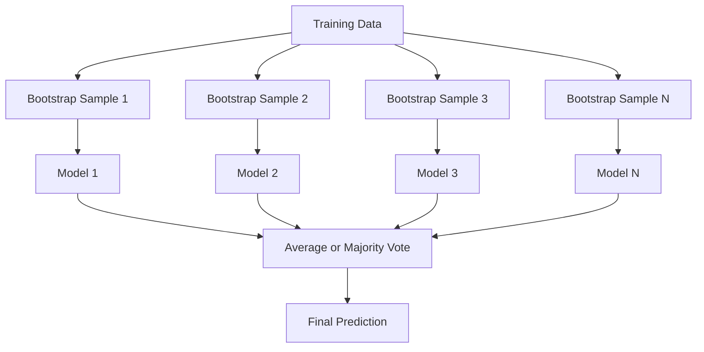
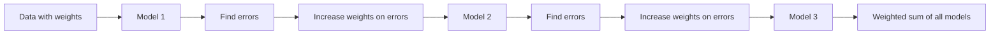
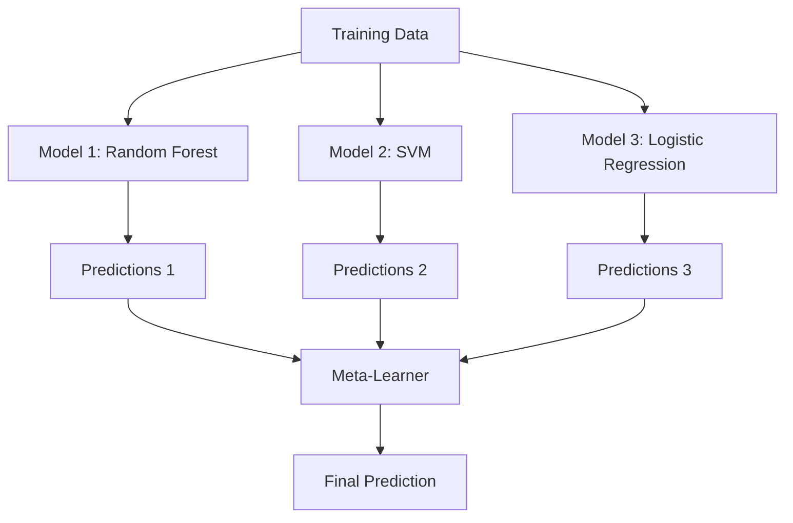

# विधिओं को एक साथ रखना
# 集成方法


> कमजोर शिक्षार्थियों का एक समूह, सही ढंग से संयुक्त होकर, एक मजबूत शिक्षार्थी बन जाता है। यह कोई दृष्टान्त नहीं है। यह एक प्रमेय है।

> एक कमजोर सीखने वाला यंत्र, सही सही संयोजन के बाद, बलशाली सीखने वाला यंत्र बन जाता है।

**Type:** Build | **类型：** 构建
**Language:**पायथन**语言：**पायथन
**Prerequisites:** Phase 2, Lesson 10 (Bias-Variance Tradeoff) | **前置知识：** Phase 2 第 10 课（偏差-方差权衡）
**Time:** ~120 minutes | **时间：** 约 120 分钟

## सीखने के लक्ष्य

- AdaBoost और ग्रेडिएंट बूस्टिंग को खरोंच से लागू करें और समझाएं कि कैसे बूस्टिंग क्रमशः पूर्वाग्रह को कम करता है
  शून्य से प्राप्त करने के लिए AdaBoost और gradient提升, व्याख्या Boosting  कैसे क्रमशः कमी विकृति
- एक बैगिंग एंसेंबल बनाएं और दिखाएं कि कैसे औसत विकोरेटेड मॉडल बढ़ते पक्षपात के बिना भिन्नता को कम करता है
  संरचना बैगिंग संयोजन, दिखाएँ औसत से संबंधित मॉडल कैसे बढ़े बिना अंतर में अंतर को कम करें
- प्रत्येक विधि के लक्ष्य के अनुसार पैकिंग, बूस्टिंग और स्टैकिंग की तुलना करें
  तुलना करें बैगिंग, बूस्टिंग और स्टैकिंग अलग-अलग उद्देश्यों के लिए त्रुटि अंतर
- समूह विविधता का मूल्यांकन करें और समझाएं कि अधिक स्वतंत्र कमजोर शिक्षार्थियों के साथ बहुमत की मतदान सटीकता में सुधार क्यों होता है
   मूल्यांकन एकीकृत विविधता, व्याख्या क्यों बहुमत मतदान सटीकता दर अधिक स्वतंत्र कमजोर सीखने के साथ बढ़ी


> **【中文解读】**
> 集成方法组合多个弱模型成一个强模型――包装(随机森林) 低方差,Boosting(XGBoost) 低偏差──XGBoost/LightGBM 在 Kaggle 比赛中占据统治地位──金融风控、推系统广泛使用──

> **【拓展：集成方法在 Kaggle 和工业界的主导地位】**
> Kaggle  संरचनात्मक डेटा प्रतियोगिता में, शीर्ष 10 के लिए लगभग 100% उपयोग एकीकरण विधि है। नेटफ्लिक्स पुरस्कार का विजेता कार्यक्रम 107 मॉडल का अधिभार एकीकरण है। उद्योग में, XGBoost + LightGBM के एकीकरण का उपयोग करके वेंटिलेशन सिस्टम का भुगतान किया गया है। अमेज़ॅन के उत्पाद की सिफारिश बहु मॉडल स्टैकिंग के लिए है। एकीकरण विधि का कारण मजबूत है, क्योंकि यह "मॉडल चयन" समस्या को "मॉडल संयोजन" समस्या में बदल देगा।

## समस्या  समस्या परिचय

एक निर्णय वृक्ष को प्रशिक्षित करना और व्याख्या करना आसान है, लेकिन यह अधिक है। एक एकल रैखिक मॉडल जटिल सीमाओं पर फिट बैठता है। आप सही मॉडल वास्तुकला को डिजाइन करने में दिन बिता सकते हैं। या आप कई अधूरे मॉडल को जोड़ सकते हैं और उनमें से किसी से भी बेहतर कुछ प्राप्त कर सकते हैं।

> 单棵决策树训练快、易解释,但会过拟应──单个线性模型在复杂边界上不适应── आप कुछ दिनों में सही मॉडल संरचना को डिजाइन कर सकते हैं, या एक ढेर में गलत मॉडल को एक साथ ला सकते हैं, जिससे किसी भी एक से बेहतर परिणाम प्राप्त हो सकता है──

इकट्ठा करने के तरीके ठीक यही करते हैं। वे तालिकागत डेटा पर कैगल प्रतियोगिताओं को जीतने के लिए सबसे विश्वसनीय तकनीक हैं, वे अधिकांश उत्पादन एमएल सिस्टम को संचालित करते हैं, और वे कार्रवाई में पूर्वाग्रह-भिन्नता व्यापार को दर्शाते हैं। बैगिंग भिन्नता को कम करता है। बढ़ावा देने से पूर्वाग्रह कम होता है। स्टैकिंग सीखता है कि किस मॉडल पर भरोसा करना है।

> 集成方法正是这样做──它们是赢得了 Kaggle 表格数据竞赛最可靠的技术,驱动了大多数生产的 ML 系统,并直观显示了偏差-方差权衡的实际运作──包装 减少方差──增强 减少偏差──堆积学习在哪些输入上信任哪些模型──

> **【中文解读】**
> 集成方法 के मूल सिद्धांतः यदि कई अधूरे मॉडल अलग-अलग त्रुटियां करते हैं, तो उनका औसत अनुमान अधिक सटीक होगा।

## अवधारणा का मूल अवधारणा

### क्यों समूह काम करते हैं

मान लीजिए आपके पास N स्वतंत्र वर्गीकरणकर्ता हैं, जिनमें से प्रत्येक की सटीकता p > 0.5 है। बहुमत की सटीकता हैः

> 假设你有N个独立分类器,每个准确率为p > 0.5──多数投票的准确率为:

```
P(majority correct) = sum over k > N/2 of C(N,k) * p^k * (1-p)^(N-k)
```

21 वर्गीकरणकर्ताओं के लिए प्रत्येक 60% सटीकता के साथ, बहुमत वोट सटीकता लगभग 74% है। 101 वर्गीकरणकर्ताओं के साथ, यह 84% तक बढ़ जाता है। मॉडल विभिन्न गलतियों को करते समय त्रुटियों को रद्द कर देता है।

> 21 ⇒ सटीकता दर 60% के लिए अलग-अलग वर्गीकरणों में, बहुमत मतदान सटीकता दर लगभग 74% है।

मुख्य आवश्यकता यह है **diversity**यदि सभी मॉडल एक ही त्रुटि करते हैं, तो उन्हें जोड़ने से कुछ भी नहीं होता है।

> 关键要求是**多样性** यदि सभी मॉडल एक ही त्रुटि करते हैं, तो उन्हें संयोजित करने में कोई मदद नहीं होती है  इसलिए एकीकरण प्रभावी है, क्योंकि विभिन्न मॉडल निम्नलिखित तरीकों से उत्पन्न होते हैंः

- विभिन्न प्रशिक्षण उप-समुहियाँ (बैगिंग)
  अलग से प्रशिक्षण 
- विभिन्न विशेषता उपसमूह (संदिग्ध वन)
  अलग अलग विशेषताएं
- अनुक्रमिक त्रुटि सुधार (बढ़ाना)
  顺序错误纠正(बूस्टिंग)
- विभिन्न मॉडल परिवार (स्टैपिंग)
  不同的模型族(स्टैकिंग)

### बैगिंग (बूटस्ट्रैप एग्रीगेटिंग)

बैगिंग प्रशिक्षण डेटा के एक अलग बूटस्ट्रैप नमूना पर प्रत्येक मॉडल को प्रशिक्षित करके विविधता पैदा करता है।

> प्रत्येक मॉडल को विविधता बनाने के लिए प्रत्येक अलग-अलग बूटस्ट्रैप में बैगिंग  प्रशिक्षण नमूना पर प्रशिक्षण नमूना



एक बूटस्ट्रैप नमूना मूल डेटा से प्रतिस्थापन के साथ खींचा जाता है, मूल के समान आकार। प्रत्येक बूटस्ट्रैप में लगभग 63.2% अद्वितीय नमूने दिखाई देते हैं। शेष 36.8% (बग के बाहर नमूने) एक मुफ्त सत्यापन सेट प्रदान करते हैं।

> बूटस्ट्रैप नमूना मूल डेटा से निकाला गया है, आकार मूल डेटा के समान है। लगभग 63.2% का एकमात्र नमूना प्रत्येक बूटस्ट्रैप में दिखाई देता है। शेष 36.8% (बाहर के बैग के नमूने) एक निः शुल्क सत्यापन संग्रह प्रदान करते हैं।

बैगिंग भिन्नता को बहुत बढ़ाए बिना कम करता है। प्रत्येक व्यक्तिगत पेड़ अपने बूटस्ट्रैप नमूने में ओवरफिट करता है, लेकिन ओवरफिटिंग प्रत्येक पेड़ के लिए अलग है, इसलिए औसत शोर को रद्द करता है।

> बैगिंग में बहुत अधिक विकृति के बिना चौड़ाई में कमी आती है। प्रत्येक एक-एक पेड़ अपने बूटस्ट्रैप के नमूने के अनुरूप होता है, लेकिन प्रत्येक पेड़ का अनुकूलन अलग होता है, इसलिए औसत से शोर का प्रतिरोध होता है।

**Random Forests**एक अतिरिक्त मोड़ के साथ बैगिंग कर रहे हैंः प्रत्येक विभाजन पर, केवल सुविधाओं के एक यादृच्छिक उपसमूह पर विचार किया जाता है। यह पेड़ों के बीच और भी अधिक विविधता पैदा करता है। उम्मीदवार सुविधाओं की विशिष्ट संख्या है `sqrt(n_features)`वर्गीकरण के लिए और`n_features / 3`प्रतिगमन के लिए।

> **随机森林**यह एक अतिरिक्त तकनीक जोड़कर है: प्रत्येक विभाजन में, केवल एक आकस्मिक विशेषता के समूह पर विचार करें।`sqrt(n_features)`, लौट लौट लिए`n_features / 3`

### बढ़ाना (अनुक्रमिक त्रुटि सुधार)

प्रत्येक नए मॉडल में उन उदाहरणों पर ध्यान केंद्रित किया जाता है जो पिछले मॉडल गलत थे।

> 顺序训练模型── प्रत्येक नई मॉडल关注之前模型弄错的样本──



प्रत्येक नए मॉडल में अब तक के समूह की व्यवस्थित त्रुटियों को सुधार दिया जाता है। अंतिम भविष्यवाणी सभी मॉडल का एक भारित योग है, जहां बेहतर मॉडल अधिक वजन प्राप्त करते हैं।

> बढ़ाना  कम करना विकृति  प्रत्येक नए मॉडल को सुधारना  आज तक एकीकृत की गई प्रणालीगत त्रुटियाँ  अंतिम भविष्यवाणी सभी मॉडल का बढ़ाना और बेहतर मॉडल का अधिक वजन प्राप्त करना 

समझौताः यदि आप बहुत सारे राउंड चलाते हैं तो बढ़ाव ओवरफिट हो सकता है, क्योंकि यह कठिन उदाहरणों को फिट करता रहता है, जिनमें से कुछ शोर हो सकता है।

> 权衡: यदि बहुत अधिक रील चल रहे हों, तो बूस्टिंग अधिक अनुकूल हो सकती है, क्योंकि यह अधिक कठिन नमूने के लिए अनुकूल हो रही है, जिनमें से कुछ शोर हो सकता है।

### एडबोस्ट

AdaBoost (अनुकूली बूस्टिंग) पहला व्यावहारिक बूस्टिंग एल्गोरिथ्म था। यह किसी भी आधार सीखने वाले, आमतौर पर निर्णय स्टंप (गहनता-1 पेड़) के साथ काम करता है।

> AdaBoost (अपना स्वयं अनुकूलन) पहला व्यावहारिक वृद्धि एल्गोरिथ्म है। यह किसी भी मूल सीखने वाले उपकरण के लिए उपयुक्त है, आमतौर पर निर्णय लेने के लिए उपयोग किया जाता है।

एल्गोरिथ्मः

> 算法流程:

```
1. Initialize sample weights: w_i = 1/N for all i

2. For t = 1 to T:
   a. Train weak learner h_t on weighted data
   b. Compute weighted error:
      err_t = sum(w_i * I(h_t(x_i) != y_i)) / sum(w_i)
   c. Compute model weight:
      alpha_t = 0.5 * ln((1 - err_t) / err_t)
   d. Update sample weights:
      w_i = w_i * exp(-alpha_t * y_i * h_t(x_i))
   e. Normalize weights to sum to 1

3. Final prediction: H(x) = sign(sum(alpha_t * h_t(x)))
```

कम त्रुटि वाले मॉडल उच्च अल्फा प्राप्त करते हैं। गलत वर्गीकृत नमूनों को अधिक वजन मिलता है इसलिए अगला मॉडल उन पर केंद्रित होता है।

>  कम त्रुटि दर वाले मॉडल को अधिक अल्फा प्राप्त होता है ️ गलत वर्गीकरण वाले नमूनों को अधिक वजन प्राप्त होता है, इसलिए अगला मॉडल उन पर ध्यान देगा️

### धीरे-धीरे बढ़ना

ग्रेडिएंट बूस्टिंग एक संवैधानिक हानि फ़ंक्शन के लिए बूस्टिंग को सामान्य बनाता है। यह नमूने को फिर से वजन करने के बजाय, वर्तमान समूह के अवशिष्ट (हानि का नकारात्मक ग्रेडिएंट) के लिए प्रत्येक नए मॉडल को फिट करता है।

> 梯度提升将升升推广到任意损失函数──重权加换样本不同, यह प्रत्येक नए मॉडल को मौजूदा एकीकृत अवशेषों के अनुकूलित करेगा损失的负梯度)──

```
1. Initialize: F_0(x) = argmin_c sum(L(y_i, c))

2. For t = 1 to T:
   a. Compute pseudo-residuals:
      r_i = -dL(y_i, F_{t-1}(x_i)) / dF_{t-1}(x_i)
   b. Fit a tree h_t to the residuals r_i
   c. Find optimal step size:
      gamma_t = argmin_gamma sum(L(y_i, F_{t-1}(x_i) + gamma * h_t(x_i)))
   d. Update:
      F_t(x) = F_{t-1}(x) + learning_rate * gamma_t * h_t(x)

3. Final prediction: F_T(x)
```

वर्ग त्रुटि हानि के लिए, छद्म-अवशिष्ट केवल वास्तविक अवशिष्ट हैंः `r_i = y_i - F_{t-1}(x_i)`प्रत्येक पेड़ सचमुच पिछले समूह की गलतियों में फिट बैठता है।

>  वर्ग त्रुटि हानि के लिए, झूठी शेष राशि वास्तविक शेष राशि हैः`r_i = y_i - F_{t-1}(x_i)` प्रत्येक पेड़ वस्तुतः एक साथ एक साथ होने से पहले एक साथ एक साथ एकीकरण में त्रुटि 

सीखने की दर (संकुचन) नियंत्रित करती है कि प्रत्येक पेड़ कितना योगदान देता है। छोटे सीखने की दरों के लिए अधिक पेड़ों की आवश्यकता होती है लेकिन बेहतर सामान्यीकरण होता है। विशिष्ट मानः 0.01 से 0.3.

> सीखने की दर (अर्थात् संकुचन) प्रत्येक पेड़ के योगदान की मात्रा को नियंत्रित करना।

### XGBoost: यह तालिका डेटा पर क्यों हावी है

XGBoost (eXtreme Gradient Boosting) इंजीनियरिंग अनुकूलन के साथ ग्रेडिएंट बूस्टिंग है जो इसे तेज़, सटीक और ओवरफिटिंग के प्रतिरोधी बनाता हैः

> XGBoost (极端梯度提升) एक ऐसी परियोजना है, जो तेजी से सटीक और अनुकूलित हो सकती हैः

- **Regularized objective:**पत्ती के वजन पर L1 और L2 दंड से प्रत्येक पेड़ को बहुत आत्मविश्वास होने से रोकता है
  **正则化目标**:                                                                                                                                                                                                                                                              
- **Second-order approximation:**हानि के पहले और दूसरे व्युत्पन्न दोनों का उपयोग करता है, जिससे बेहतर विभाजन निर्णय मिलता है
  **二阶近似**: एक चरण और दूसरे चरण के नुकसान के साथ ही, बेहतर विभाजन निर्णय देने के लिए
- **Sparsity-aware splits:**प्रत्येक विभाजन पर यादृच्छिक डेटा के लिए सबसे अच्छा दिशा सीखकर यादृच्छिक मानों को मूल रूप से संभालता है
  **稀疏感知分裂**: मूल जीवन में अनुपस्थिति का प्रबंधन, प्रत्येक विभाजन बिंदु पर सीखने के लिए अनुपस्थिति डेटा का सर्वोत्तम दिशा
- **Column subsampling:**जैसे कि आकस्मिक वन, विविधता के लिए प्रत्येक विभाजन में नमूने विशेषताएं
  **列子采样**जैसे वन में विविधता बढ़ जाती है, वैसे ही प्रत्येक विभाजन में विविधता बढ़ जाती है।
- **Weighted quantile sketch:**वितरित डेटा पर निरंतर सुविधाओं के लिए कुशलता से विभाजन बिंदुओं का पता लगाता है
  **加权分位数草图**: उच्च दक्षता में वितरित डेटा पर निरंतर विशेषता के विभाजन बिंदुओं को खोजने
- **Cache-aware block structure:**CPU कैश लाइनों के लिए अनुकूलित मेमोरी लेआउट
  **缓存感知块结构**: CPU 缓存行优化内存布局 के लिए

तालिकागत डेटा के लिए, XGBoost (और इसके उत्तराधिकारी LightGBM) ने लगातार तंत्रिका नेटवर्क से बेहतर प्रदर्शन किया है। यह जल्द ही नहीं बदल रहा है। यदि आपके डेटा पंक्तियों और स्तंभों वाली तालिका में फिट होते हैं, तो ग्रेडिएंट बूस्टिंग से शुरू करें।

> √ √ √ √ √ √ √ √ √ √ √ √ √ √ √ √ √ √ √ √ √ √ √ √ √ √ √ √ √ √ √ √ √ √ √ √ √ √ √ √ √ √ √ √ √ √ √ √ √ √ √ √ √ √ √ √ √ √ √ √ √ √ √ √ √ √ √ √ √ √ √ √ √ √ √ √ √ √ √ √ √ √ √ √ √ √ √ √ √ √ √ √ √ √ √ √ √ √ √ √ √ √ √ √ √ √ √ √ √ √ √ √ √ √ √ √ √ √ √ √ √ √ √ √ √ √ √ √ √ √ √ √ √ √ √ √ √ √ √ √ √ √ √ √ √ √ √ √ √ √ √ √ √ √ √ √ √ √ √ √ √ √ √ √ √ √ √ √ √ √ √ √ √ √ √ √ √ √ √ √ √ √ √ √ √ √ √ √ √ √ √ √ √ √ √ √ √ √ √ √ √ √ √ √ √ √ √ √ √ √ √ √ √ √ √ √ √ √ √ √ √ √ √ √ √ √ √ √ √ √ √ √ √ √ √ √ √ √ √ √ √ √ √ √ √ √ √ √ √ √ √ √ √ √ √

### स्टैपिंग (मेटा-लर्निंग)

स्टैकिंग मेटा-लर्नर के लिए विशेषता के रूप में कई आधार मॉडल की भविष्यवाणियों का उपयोग करता है।

> स्टैकिंग कई मूल मॉडल के पूर्वानुमान को एक छात्र के लक्षण के रूप में प्रस्तुत करेगा।



मेटा-लर्निंगर सीखता है कि किस आधार मॉडल पर किस इनपुट पर भरोसा करना है। यदि कुछ क्षेत्रों में यादृच्छिक वन बेहतर है और अन्य क्षेत्रों में एसवीएम, मेटा-लर्निंगर तदनुसार मार्ग बनाना सीख जाएगा।

> यदि वन के साथ कुछ क्षेत्रों में बेहतर है, तो एसवीएम अन्य क्षेत्रों में बेहतर है, तो यह एक अच्छी तरह से अनुकूलित मार्ग है।

डेटा लीक से बचने के लिए, प्रशिक्षण सेट पर क्रॉस-वैलिडेशन के माध्यम से आधार मॉडल भविष्यवाणियां उत्पन्न की जानी चाहिए। आप कभी भी आधार मॉडल को प्रशिक्षित नहीं करते हैं और एक ही डेटा पर मेटा-विशेषताओं का उत्पादन नहीं करते हैं।

> डेटा लीक से बचने के लिए, मूल मॉडल भविष्यवाणी को प्रशिक्षण सेट पर पारस्परिक सत्यापन उत्पन्न करना चाहिए।

### मतदान

सबसे सरल समूह. बस सीधे भविष्यवाणियों को जोड़ें.

> सबसे सरल का संयोजन--- प्रत्यक्ष संयोजन पूर्वानुमान---

- **Hard voting:**वर्ग लेबल पर बहुमत वोट.
  **硬投票**: वर्गों के लिए बहुमत मतदान करना
- **Soft voting:**औसत अनुमानित संभावनाएं, उच्चतम औसत संभावना के साथ वर्ग चुनें. आमतौर पर बेहतर क्योंकि यह विश्वास जानकारी का उपयोग करता है.
  **软投票**: औसत अनुमानित संभावना, औसत अनुमानित संभावना उच्चतम श्रेणी का चयन करें।

## इसे बनाओ, इसे पूरा करो।

> **【中文解读】**
> 零实现三种集成方法:Bagging(并行训练独立模型取平均) ✓AdaBoost(串行训练加权投票) ✓Gradient Boosting(串行训练纠正残差) ✓AdaBoost के मूल में पहले मॉडल के गलत वर्गीकरण के नमूने का वजन बढ़ाना शामिल है,Gradient Boosting प्रत्येक नए पेड़ के लिए एक पेड़ के अवशेष के लिए उपयुक्त है ✓
```figure
f3-ensemble-average
```

## इसे बनाओ

### चरण 1: निर्णय स्टंप (आधारार्थी)

कोड में `code/ensembles.py`हम एक निर्णय स्टंप के साथ शुरू करते हैंः एक एकल विभाजन के साथ एक पेड़।

> `code/ensembles.py`मध्य कोड शून्य से सब कुछ पूरा करना शुरू करता है।

```python
class DecisionStump:
    def __init__(self):
        self.feature_idx = None
        self.threshold = None
        self.polarity = 1
        self.alpha = None

    def fit(self, X, y, weights):
        n_samples, n_features = X.shape
        best_error = float("inf")

        for f in range(n_features):
            thresholds = np.unique(X[:, f])
            for thresh in thresholds:
                for polarity in [1, -1]:
                    pred = np.ones(n_samples)
                    pred[polarity * X[:, f] < polarity * thresh] = -1
                    error = np.sum(weights[pred != y])
                    if error < best_error:
                        best_error = error
                        self.feature_idx = f
                        self.threshold = thresh
                        self.polarity = polarity

    def predict(self, X):
        n = X.shape[0]
        pred = np.ones(n)
        idx = self.polarity * X[:, self.feature_idx] < self.polarity * self.threshold
        pred[idx] = -1
        return pred
```

### चरण 2: स्क्रैच से AdaBoost

```python
class AdaBoostScratch:
    def __init__(self, n_estimators=50):
        self.n_estimators = n_estimators
        self.stumps = []
        self.alphas = []

    def fit(self, X, y):
        n = X.shape[0]
        weights = np.full(n, 1 / n)

        for _ in range(self.n_estimators):
            stump = DecisionStump()
            stump.fit(X, y, weights)
            pred = stump.predict(X)

            err = np.sum(weights[pred != y])
            err = np.clip(err, 1e-10, 1 - 1e-10)

            alpha = 0.5 * np.log((1 - err) / err)
            weights *= np.exp(-alpha * y * pred)
            weights /= weights.sum()

            stump.alpha = alpha
            self.stumps.append(stump)
            self.alphas.append(alpha)

    def predict(self, X):
        total = sum(a * s.predict(X) for a, s in zip(self.alphas, self.stumps))
        return np.sign(total)
```

### चरण 3: स्क्रैच से ग्रेडिएंट बढ़ाना

```python
class GradientBoostingScratch:
    def __init__(self, n_estimators=100, learning_rate=0.1, max_depth=3):
        self.n_estimators = n_estimators
        self.lr = learning_rate
        self.max_depth = max_depth
        self.trees = []
        self.initial_pred = None

    def fit(self, X, y):
        self.initial_pred = np.mean(y)
        current_pred = np.full(len(y), self.initial_pred)

        for _ in range(self.n_estimators):
            residuals = y - current_pred
            tree = SimpleRegressionTree(max_depth=self.max_depth)
            tree.fit(X, residuals)
            update = tree.predict(X)
            current_pred += self.lr * update
            self.trees.append(tree)

    def predict(self, X):
        pred = np.full(X.shape[0], self.initial_pred)
        for tree in self.trees:
            pred += self.lr * tree.predict(X)
        return pred
```

### चरण 4: स्क्लेयरन के साथ तुलना करें

कोड यह सत्यापित करता है कि हमारे खरोंच से कार्यान्वयन स्क्लेर्न की सटीकता के समान उत्पादन करते हैं `AdaBoostClassifier`और `GradientBoostingClassifier`, और सभी तरीकों की तुलना एक साथ करता है।

>  कोड सत्यापन हम शून्य से प्राप्त करने के लिए उत्पादन के साथ उत्पन्न `AdaBoostClassifier`和 `GradientBoostingClassifier`समान सटीकता दर,并并排 तुलना सभी विधियाँ

## इसे फ्रेमवर्क के साथ लागू करें

### हर विधि का उपयोग कब करें

> कैसे उपयोग करें हर तरह के तरीके

| Method | Reduces | Best for | Watch out for |
|--------|---------|----------|---------------|
| Bagging / Random Forest | Variance | Noisy data, many features | Does not help with bias |
| AdaBoost | Bias | Clean data, simple base learners | Sensitive to outliers and noise |
| Gradient Boosting | Bias | Tabular data, competitions | Slow to train, easy to overfit without tuning |
| XGBoost / LightGBM | Both | Production tabular ML | Many hyperparameters |
| Stacking | Both | Getting last 1-2% accuracy | Complex, risk of overfitting meta-learner |
| Voting | Variance | Quick combination of diverse models | Only helps if models are diverse |

| 方法 | 减少 | 最适合 | 注意事项 |
|------|------|--------|---------|
| Bagging / 随机森林 | 方差 | 噪声数据、多特征 | 不能帮助偏差 |
| AdaBoost | 偏差 | 干净数据、简单基学习器 | 对异常值和噪声敏感 |
| 梯度提升 | 偏差 | 表格数据、竞赛 | 训练慢、不调参容易过拟合 |
| XGBoost / LightGBM | 两者 | 生产表格 ML | 超参数多 |
| Stacking | 两者 | 获取最后 1-2% 准确率 | 复杂、元学习器有过拟合风险 |
| Voting | 方差 | 快速组合多样模型 | 模型不多样时无帮助 |

### तालिकागत डेटा के लिए उत्पादन स्टैक

अधिकांश तालिका भविष्यवाणी समस्याओं के लिए, यह क्रम में कोशिश करने के लिए हैः

>  अधिकांश प्रपत्र पूर्वानुमान प्रश्नों के लिए, यह अनुशंसा की कोशिश क्रम हैः

1. **LightGBM or XGBoost**डिफ़ॉल्ट पैरामीटर के साथ
   **LightGBM 或 XGBoost**उपयोग默认参数
2. n_estimators, learning_rate, max_depth, min_child_weight को ट्यूनिंग करें
   调优 n_estimators、learning_rate、max_depth、min_child_weight
3. यदि आप अंतिम 0.5% की जरूरत है, 3-5 विविध मॉडल के साथ एक स्टैकिंग समूह का निर्माण
   यदि अंतिम 0.5% की आवश्यकता है, तो 3-5 विभिन्न मॉडल का निर्माण स्टैकिंग 集成
4. पूरे समय क्रॉस-वैलिडेशन का प्रयोग करें
   全程使用交叉验证

तालिकागत डेटा पर तंत्रिका नेटवर्क लगातार शोध प्रयासों के बावजूद लगभग हमेशा ग्रेडिएंट बूस्टिंग से भी खराब होते हैं। टेबनेट, नोड और इसी तरह की वास्तुकलाएं कभी-कभी मेल खाती हैं लेकिन शायद ही कभी अच्छी तरह से ट्यून किए गए एक्सजीबीओस्ट से बेहतर होती हैं।

> यद्यपि निरंतर शोध प्रयासों के बावजूद, तंत्रिका नेटवर्क में तालिका डेटा में लगभग हमेशा वृद्धि दर नहीं होती है।

## इसे भेजें उत्पाद

यह सबक हमें फल देता है`outputs/prompt-ensemble-selector.md`- एक प्रॉम्प्ट जो आपको किसी दिए गए डेटासेट के लिए सही एंसेंबल विधि चुनने में मदद करता है। अपने डेटा (आकार, सुविधा प्रकार, शोर स्तर, वर्ग संतुलन) और समस्या का वर्णन करें जिसे आप हल कर रहे हैं। प्रॉम्प्ट निर्णय चेकलिस्ट के माध्यम से चलता है, एक विधि की सिफारिश करता है, हाइपरपैरामीटर शुरू करने का सुझाव देता है, और उस विधि के लिए आम त्रुटियों के बारे में चेतावनी देता है। यह भी उत्पन्न करता है `outputs/skill-ensemble-builder.md`चयन के पूर्ण मार्गदर्शिका के साथ।

> 本课产 出 `outputs/prompt-ensemble-selector.md` एक सुझाव शब्द जो आपको एक दिए गए डेटासेट के लिए सही एकीकरण विधि का चयन करने में मदद करेगा। अपने डेटा को वर्णन करें।`outputs/skill-ensemble-builder.md`, समाहित पूर्ण चयन निर्देशन ः

## अभ्यास विषय

1. प्रत्येक राउंड के बाद प्रशिक्षण सटीकता को ट्रैक करने के लिए एडाबूस्ट कार्यान्वयन को संशोधित करें। प्लॉट सटीकता बनाम अनुमानकों की संख्या। यह कब अभिसरण करता है?
   1. 修改 AdaBoost 实现在每轮后追踪训练准确率──绘制准确率 vs 估计器数量──何时收?

2. रेग्रिशन ट्री में यादृच्छिक सुविधा जोड़कर शून्य से एक यादृच्छिक वन को लागू करें।`max_features=sqrt(n_features)`एक ही पेड़ के साथ भिन्नता में कमी की तुलना करें।
   2. शून्य से प्राप्त करने के लिए वनः पुनः प्राप्ति में वृक्षों पर अतिरिक्त गुणों का उपयोग करना`max_features=sqrt(n_features)`, औसत अनुमान, एक पेड़ से तुलना में अंतर कम

3. ग्रेडिएंट बढ़ाने के कार्यान्वयन में, प्रारंभिक रोक जोड़ेंः प्रत्येक दौर के बाद सत्यापन हानि का ट्रैक करें और जब यह लगातार 10 राउंड तक सुधार नहीं हुआ है तो रोकें। वास्तव में कितने पेड़ों की आवश्यकता है?
   3. प्रगति प्रगति में वृद्धि में वृद्धिः प्रति चरण अनुवर्ती परीक्षण हानि, लगातार 10 चरणों में सुधार नहीं रुकता है।

4. तीन आधार मॉडल (लॉजिस्टिक रेग्रिशन, निर्णय पेड़, k- निकटतम पड़ोसी) और एक लॉजिस्टिक रेग्रिशन मेटा-लर्नर के साथ एक स्टैकिंग एंसेंबली बनाएं। मेटा-विशेषताओं को उत्पन्न करने के लिए 5-गुना क्रॉस-वैलिडेशन का उपयोग करें। प्रत्येक आधार मॉडल की तुलना अकेले करें।
   4. 构建三个基础模型(逻辑归归、决策树、KNN) और एक逻辑归元学习器 के स्टैकिंग 集成── 5 折交叉验证生成元特征──与每个基础模型单独比较──

5. XGBoost को एक ही डेटासेट पर डिफ़ॉल्ट पैरामीटर के साथ चलाएं। इसकी सटीकता को अपने खरोंच से ग्रेडिएंट बढ़ाने के साथ तुलना करें। समय दोनों। गति अंतर कितना बड़ा है?
   5. एक ही डेटासेट पर डिफ़ॉल्ट पैरामीटर के साथ XGBoost को चलाने के लिए                                                                                                                                                                                                                                                    

> **【中文解读】**
> AdaBoost(स्व अनुकूलन उन्नयन) का मूल प्रक्रम: प्रशिक्षण एक कमजोर वर्ग → गणना त्रुटि दर→ वृद्धि द्वारा गलत वर्ग नमूना का वजन→ प्रशिक्षण एक कमजोर वर्ग के नीचे। अन्तिम पूर्वानुमान सभी कमजोर वर्ग के सभी वर्गों के लिए मतदान, अधिकार और त्रुटि दर में वृद्धि है।

> **【拓展：XGBoost、LightGBM、CatBoost——梯度提升树三巨头】**
> XGBoost(eXtreme Gradient Boosting) चान天奇 द्वारा 2014 में विकसित, सहीकरण, दुर्लभ डेटा प्रसंस्करण और并行计算, बन गया Kaggle 竞赛的标配工具──LightGBM(微软,2017) का उपयोग करते हुए सीधे आकृतियों पर आधारित विभाजन और पत्ते बढ़ने की रणनीति(पन्ना-बुद्धिमान), XGBoost की तुलना में प्रशिक्षण की गति 快 5-10 倍──CatBoost(Yandex,2018) स्वचालित प्रसंस्करण वर्ग विशेषताएं, बिना हाथ से संपादन करने की आवश्यकताएँ── तीन अलग-अलग क्षेत्रों में फायदे हैंः छोटे डेटा XGBoost, बड़े डेटा LightGBM, वर्गों के साथ CatBoost के कई लक्षणों──

## कीवर्ड्स  शब्द खोज तालिका

| Term | What people say | What it actually means |
|------|----------------|----------------------|
| Bagging | "Train on random subsets" | Bootstrap aggregating: train models on bootstrap samples, average predictions to reduce variance |
| Boosting | "Focus on hard examples" | Train models sequentially, each correcting errors of the ensemble so far, to reduce bias |
| AdaBoost | "Reweight the data" | Boosting via sample weight updates; misclassified points get higher weight for the next learner |
| Gradient boosting | "Fit the residuals" | Boosting via fitting each new model to the negative gradient of the loss function |
| XGBoost | "The Kaggle weapon" | Gradient boosting with regularization, second-order optimization, and systems-level speed tricks |
| Stacking | "Models on top of models" | Use predictions of base models as input features for a meta-learner |
| Random forest | "Many randomized trees" | Bagging with decision trees, adding random feature subsampling at each split for diversity |
| Ensemble diversity | "Make different mistakes" | Models must be uncorrelated in their errors for the ensemble to improve over individuals |
| Out-of-bag error | "Free validation" | Samples not in a bootstrap draw (~36.8%) serve as a validation set without needing a holdout |

## आगे पढ़ना 延伸閱讀

- [Schapire & Freund: Boosting: Foundations and Algorithms](https://mitpress.mit.edu/9780262526036/)-- AdaBoost के रचनाकारों की पुस्तक
  [Schapire & Freund: Boosting: Foundations and Algorithms](https://mitpress.mit.edu/9780262526036/)- AdaBoost 创始人的著作
- [Friedman: Greedy Function Approximation: A Gradient Boosting Machine (2001)](https://statweb.stanford.edu/~jhf/ftp/trebst.pdf)-- मूल ग्रेडिएंट बूस्टिंग पेपर
  [Friedman: Greedy Function Approximation: A Gradient Boosting Machine (2001)](https://statweb.stanford.edu/~jhf/ftp/trebst.pdf)- 梯度提升原始论文
- [Chen & Guestrin: XGBoost (2016)](https://arxiv.org/abs/1603.02754)-- XGBoost पेपर
  [Chen & Guestrin: XGBoost (2016)](https://arxiv.org/abs/1603.02754)- XGBoost 论文
- [Wolpert: Stacked Generalization (1992)](https://www.sciencedirect.com/science/article/abs/pii/S0893608005800231)-- मूल स्टैकिंग पेपर
  [Wolpert: Stacked Generalization (1992)](https://www.sciencedirect.com/science/article/abs/pii/S0893608005800231)- स्टैकिंग
- [scikit-learn Ensemble Methods](https://scikit-learn.org/stable/modules/ensemble.html)-- व्यावहारिक संदर्भ
  [scikit-learn 集成方法](https://scikit-learn.org/stable/modules/ensemble.html)- 实用参考
