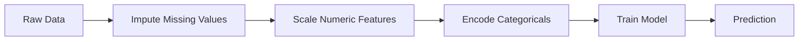
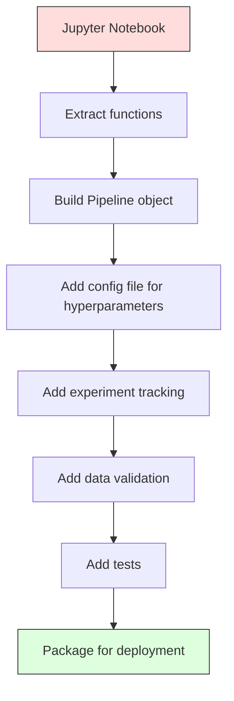

# एमएल पाइपलाइन
# एमएल 管线


> एक मॉडल एक उत्पाद नहीं है। एक पाइपलाइन है। पाइपलाइन कच्चे डेटा से लेकर तैनात भविष्यवाणी तक सब कुछ है, और हर कदम को पुनः उत्पन्न किया जाना चाहिए।

> 模型 नहीं उत्पाद है, 管线才是── 管线 है मूल डेटा से लेकर तैनाती पूर्वानुमान तक सब कुछ, हर कदम को पुनः प्राप्त करना होगा──

**Type:** Build | **类型：** 构建
**Language:**पायथन**语言：**पायथन
**Prerequisites:** Phase 2, Lesson 12 (Hyperparameter Tuning) | **前置知识：** Phase 2 第 12 课（超参数调优）
**Time:** ~120 minutes | **时间：** 约 120 分钟

## सीखने के लक्ष्य

- स्क्रैच से एक एमएल पाइपलाइन बनाएं जो इम्प्यूटेशन, स्केलिंग, एन्कोडिंग और मॉडल प्रशिक्षण को एक एकल पुनरुत्पादित वस्तु में जोड़ता है
  शून्य से निर्माण एमएल 管 line, एक एकल दोहराया जा सकता वस्तु के लिए भरा, संक्षिप्त, कोड और मॉडल प्रशिक्षण लिंक किया जाएगा
- डेटा लीक के परिदृश्यों की पहचान करें और समझाएं कि कैसे पाइपलाइन केवल प्रशिक्षण डेटा पर ट्रांसफार्मर लगाकर उन्हें रोकती है
   पहचान डेटा रिलीक के परिदृश्य, व्याख्या कैसे ट्यूबलाइन केवल प्रशिक्षण डेटा पर अनुकूलित परिवर्तक पर रिलीक को रोकने के लिए पारित करने के लिए
- एक कॉलमट्रांसफार्मर का निर्माण करें जो संख्यात्मक और श्रेणीगत विशेषताओं पर विभिन्न पूर्व-संसाधित को लागू करता है
  निर्माण स्तंभ ट्रांसफार्मर, संख्यात्मक मान और वर्ग विशेषता अनुप्रयोग
- पाइपलाइन सीरियलाइजेशन को लागू करें और यह प्रदर्शित करें कि एक ही फिट पाइपलाइन प्रशिक्षण और उत्पादन में समान परिणाम देती है
  योजनाबद्धता को प्राप्त करना, प्रशिक्षण और उत्पादन में एक ही उपयुक्तता वाले ट्यूबलाइन का प्रदर्शन करना


> **【中文解读】**
> एमएल पाइपलाइन डेटा पूर्व प्रसंस्करण, विशेषता इंजीनियरिंग, मॉडल प्रशिक्षण को एक धारा में जोड़ती है।

> **【拓展：从 sklearn Pipeline 到 MLOps 工业级管线】**
> sklearn पाइपलाइन 处理单机场景的端到端流水线, लेकिन औद्योगिक जगत में,ML 管线涉及更多环节:数据版本管理(DVC) 、实验追踪(MLflow/W&B) 、模型注册) 、持续训练(CT) 、模型服务(Seldon/TF Serving) ⋅ Google की TFX(TensorFlow Extended) और Kubeflow पाइपलाइनें हैं

## समस्या  समस्या परिचय

आपके पास एक नोटबुक है जो डेटा लोड करता है, मिडियन के साथ गायब मानों को भरता है, माप सुविधाओं, ट्रेनों एक मॉडल, और सटीकता प्रिंट करता है। यह काम करता है. आप इसे भेजते हैं।

> आपके पास एक नोटबुक है, डेटा लोड करें, मध्य संख्याओं के साथ कमी का मूल्य भरें, विशेषताएं संकुचित करें, प्रशिक्षण मॉडल, सटीकता दरों को प्रिंट करें, यह प्रभावी है, आप ऑनलाइन हैं।

एक महीने बाद, किसी ने मॉडल को फिर से प्रशिक्षित किया और अलग परिणाम प्राप्त हुए। परीक्षण डेटा (डेटा लीक) सहित पूर्ण डेटासेट पर औसत की गणना की गई। स्केलिंग पैरामीटर सहेजे नहीं गए, इसलिए निष्कर्ष अलग-अलग सांख्यिकी का उपयोग करता है। फीचर इंजीनियरिंग कोड को प्रशिक्षण और सेवा के बीच कॉपी-पेस्ट किया गया था, और कॉपी अलग-अलग थीं। एक श्रेणी स्तंभ को उत्पादन में एक नया मूल्य प्राप्त हुआ जो एन्कोडर ने कभी नहीं देखा है।

> एक महीने बाद, किसी ने पुनः प्रशिक्षण मॉडल प्राप्त किया और अलग परिणाम प्राप्त किए। मध्य-बिंदु परीक्षण डेटा के पूर्ण मात्रा डेटासेट पर गणना की गई है।

ये परिकल्पना नहीं हैं. ये सबसे आम कारण हैं कि एमएल सिस्टम उत्पादन में विफल होते हैं। पाइपलाइनें प्रत्येक परिवर्तन चरण को एक एकल, क्रमबद्ध, पुनरुत्पादित वस्तु में पैकेज करके उन सभी को हल करती हैं।

> ये परिकल्पनाएं नहीं हैं। ये उत्पादन में एमएल सिस्टम की विफलता के सबसे आम कारण हैं। इन सभी समस्याओं को हल करने के लिए प्रत्येक परिवर्तनशील चरण को एक व्यवस्थित, पुनः प्रयोज्य वस्तु में पैक करके पाइपलाइन द्वारा संचालित किया जाएगा।

> **【中文解读】**
> ML 管线解决的核心问题: प्रशिक्षण और推理 के डेटा प्रसंस्करण को पूरी तरह से संगत होना चाहिए। सबसे आम विफलता मॉडल प्रशिक्षण के दौरान पूर्ण मात्रा डेटा गणना औसत मूल्य को मानकीकृत करना है।

## अवधारणा का मूल अवधारणा

### पाइपलाइन क्या है

एक पाइपलाइन एक मॉडल के बाद डेटा परिवर्तनों का एक क्रमबद्ध अनुक्रम है। प्रत्येक चरण पिछले चरण के आउटपुट को इनपुट के रूप में लेता है। प्रशिक्षण डेटा पर एक बार पूरी पाइपलाइन को फिट किया जाता है। निष्कर्ष के समय, एक ही फिट पाइपलाइन नए डेटा को बदलती है और भविष्यवाणियां उत्पन्न करती है।

> 管线 एक क्रमबद्ध डेटा परिवर्तन क्रम है, जो एक मॉडल के बाद अंतिम है। प्रत्येक चरण में एक और चरण का आउटपुट एक इनपुट के रूप में होता है।



पाइपलाइन गारंटी देता हैः
- परिवर्तन केवल प्रशिक्षण डेटा पर लगाए जाते हैं (कोई लीक नहीं)
  变换只在训练数据上拟合(无泄漏)
- इन्फरेक्शन समय पर समान परिवर्तन लागू होते हैं
  推理时应用相同变化
- पूरे वस्तु को एक कलाकृतियों के रूप में क्रमबद्ध और तैनात किया जा सकता है
   संपूर्ण वस्तु को एक घटक के रूप में क्रमबद्ध किया जा सकता है
- पार-मान्यीकरण पाइपलाइन को प्रति तह लागू करता है, जिससे सूक्ष्म लीक को रोकना संभव हो जाता है
  交叉验证 प्रत्येक मोड़ में अनुप्रयोग पाइपलाइन, सूक्ष्म के लीक को रोकने के लिए

### डेटा लीकः चुपचाप हत्यारा

डेटा लीक तब होता है जब परीक्षण सेट से जानकारी या भविष्य के डेटा प्रशिक्षण को प्रदूषित करते हैं। पाइपलाइन सबसे आम रूपों को रोकती है।

> परीक्षण संग्रह या भविष्य के डेटा के सूचना प्रदूषण प्रशिक्षण में डेटा रिसाव होता है।

**Leaky (wrong):**
```python
X = df.drop("target", axis=1)
y = df["target"]

scaler = StandardScaler()
X_scaled = scaler.fit_transform(X)

X_train, X_test = X_scaled[:800], X_scaled[800:]
y_train, y_test = y[:800], y[800:]
```

स्केलर ने परीक्षण डेटा देखा। औसत और मानक विचलन में परीक्षण नमूने शामिल हैं। यह सटीकता अनुमानों को बढ़ाता है।

> 缩放器看到了测试数据──平均值和标准差包含测试样本── यह सटीकता दर अनुमानों को बढ़ा देगा──

**Correct:**
```python
X_train, X_test = X[:800], X[800:]

scaler = StandardScaler()
X_train_scaled = scaler.fit_transform(X_train)
X_test_scaled = scaler.transform(X_test)
```

पाइपलाइन के साथ आपको इसके बारे में सोचने की जरूरत नहीं है। पाइपलाइन इसे स्वचालित रूप से संभालती है।

> उपयोग करना, आप इन पर विचार करने की जरूरत नहीं है।

### स्क्लेर्न पाइपलाइन

sklearn के `Pipeline`चेन ट्रांसफार्मर और एक अनुमानक. यह उजागर करता है `.fit()`,`.predict()`और `.score()`जो सभी चरणों को क्रमशः लागू करते हैं।

> sklearn के `Pipeline`परिवर्तनकर्ता और अनुमानक लिंक अप. यह उजागर .`.fit()``.predict()`和 `.score()`, क्रमशः सभी चरणों को लागू करें

```python
from sklearn.pipeline import Pipeline
from sklearn.preprocessing import StandardScaler
from sklearn.linear_model import LogisticRegression

pipe = Pipeline([
    ("scaler", StandardScaler()),
    ("model", LogisticRegression()),
])

pipe.fit(X_train, y_train)
predictions = pipe.predict(X_test)
```

जब आप कॉल करते हैं`pipe.fit(X_train, y_train)`:
1. स्केलर कॉल `fit_transform`एक्स_ट्रेन पर
2. मॉडल कॉल `fit`स्केल X_train पर

जब आप कॉल करते हैं`pipe.predict(X_test)`:
1. स्केलर कॉल `transform`(फिट_ट्रांसफॉर्म नहीं) पर X_test
2. मॉडल कॉल `predict`स्केल X_test पर

स्केलर कभी भी परीक्षण डेटा को फिटिंग के दौरान नहीं देखता है। यह सब बिंदु है।

> जब आप调用 `pipe.fit(X_train, y_train)`:
> 1. 缩放器对 X_train 调用 `fit_transform`
> 2. 模型对缩放后的X_train 调用 `fit`
>
> जब आप调用 `pipe.predict(X_test)`:
> 1. 缩放器对 X_test 调用 `transform`(फिट_ट्रांसफॉर्म नहीं)
> 2. 模型对缩放后的 X_test 调用 `predict`
>
> 缩放器在拟合期间永远看不到测试数据―― यही पूरा अर्थ है――

### स्तंभट्रांसफार्मरः विभिन्न स्तंभों के लिए विभिन्न पाइपलाइन

वास्तविक डेटासेट में संख्यात्मक और श्रेणीगत स्तंभ होते हैं जिन्हें अलग-अलग पूर्व प्रसंस्करण की आवश्यकता होती है। `ColumnTransformer`यह सब संभालता है।

> वास्तविक डेटासेट में संख्यात्मक मान और श्रेणीएँ हैं, जिन्हें अलग-अलग पूर्व-प्रक्रिया की आवश्यकता होती है।`ColumnTransformer`处理 यह.

```python
from sklearn.compose import ColumnTransformer
from sklearn.preprocessing import StandardScaler, OneHotEncoder
from sklearn.impute import SimpleImputer

numeric_pipe = Pipeline([
    ("impute", SimpleImputer(strategy="median")),
    ("scale", StandardScaler()),
])

categorical_pipe = Pipeline([
    ("impute", SimpleImputer(strategy="most_frequent")),
    ("encode", OneHotEncoder(handle_unknown="ignore")),
])

preprocessor = ColumnTransformer([
    ("num", numeric_pipe, ["age", "income", "score"]),
    ("cat", categorical_pipe, ["city", "gender", "plan"]),
])

full_pipeline = Pipeline([
    ("preprocess", preprocessor),
    ("model", GradientBoostingClassifier()),
])
```

`handle_unknown="ignore"`जब एक नई श्रेणी दिखाई देती है (एक शहर मॉडल कभी नहीं देखा है), यह दुर्घटना के बजाय एक शून्य वेक्टर का उत्पादन करता है।

> OneHotEncoder 中的 `handle_unknown="ignore"`उत्पादन के लिए महत्वपूर्ण है। जब नई श्रेणियाँ (नई प्रकार के शहर) उत्पन्न होती हैं, तो यह टूटने के बजाय शून्य प्रवाह उत्पन्न करती है।

### प्रयोगों का पता लगाना

एक पाइपलाइन प्रशिक्षण को पुनः उत्पन्न करने योग्य बनाता है, लेकिन आपको यह भी ट्रैक करने की आवश्यकता है कि प्रयोगों में क्या हुआः किस हाइपरपैरामीटर का उपयोग किया गया था, किस डेटासेट संस्करण, क्या मीट्रिक थे, कौन सा कोड चलाया गया था।

> 管线让训练可复现, लेकिन आपको भी प्रयोगों में क्या हुआ है का पता लगाने की आवश्यकता हैः किस सुपरपरमाइंडर्स का उपयोग किया गया है, किस डेटासेट संस्करण, कौन सा कोड चलाया गया है,

**MLflow**सबसे आम ओपन सोर्स समाधान हैः

> **MLflow**सबसे आम खुला स्रोत समाधानः

```python
import mlflow

with mlflow.start_run():
    mlflow.log_param("max_depth", 5)
    mlflow.log_param("n_estimators", 100)
    mlflow.log_param("learning_rate", 0.1)

    pipe.fit(X_train, y_train)
    accuracy = pipe.score(X_test, y_test)

    mlflow.log_metric("accuracy", accuracy)
    mlflow.sklearn.log_model(pipe, "model")
```

प्रत्येक रन को पैरामीटर, मेट्रिक्स, कलाकृतियों और पूर्ण मॉडल के साथ रिकॉर्ड किया जाता है। आप रन की तुलना कर सकते हैं, किसी भी प्रयोग को पुनः पेश कर सकते हैं, और किसी भी मॉडल संस्करण को तैनात कर सकते हैं।

> प्रत्येक परिचालन में तत्वों, संकेतक, संरचनाओं और पूर्ण मॉडल को रिकॉर्ड किया जाता है। आप किसी भी प्रयोग को पुनः प्राप्त कर सकते हैं। किसी भी मॉडल संस्करण को तैनात कर सकते हैं।

**Weights & Biases (wandb)**एक होस्ट किए गए डैशबोर्ड के साथ एक ही कार्यक्षमता प्रदान करता हैः

> **Weights & Biases (wandb)**提供相同功能,带托管仪表盘:

```python
import wandb

wandb.init(project="my-pipeline")
wandb.config.update({"max_depth": 5, "n_estimators": 100})

pipe.fit(X_train, y_train)
accuracy = pipe.score(X_test, y_test)

wandb.log({"accuracy": accuracy})
```

### मॉडल संस्करण

प्रयोगों के बाद, आपको मॉडल संस्करणों का प्रबंधन करने की आवश्यकता है. कौन सा मॉडल उत्पादन में है?

> प्रयोग अनुवर्ती के बाद, आपको मॉडल संस्करण प्रबंधित करने की आवश्यकता है. कौन सा मॉडल उत्पादन में है? कौन सा चरण है? कौन सा पिछले सप्ताह है?

MLflow के मॉडल रजिस्ट्री में निम्नलिखित प्रावधान है:
- **Version tracking:**हर सहेजे गए मॉडल एक संस्करण संख्या प्राप्त करता है
  **版本追踪：**प्रत्येक सहेजे गए मॉडल प्राप्त संस्करण संख्या
- **Stage transitions:**"स्टेजिंग", "प्रोडक्शन", "आर्काइव्ड"
  **阶段转换：**"स्टेजिंग"、"प्रोडक्शन"、"आर्काइव्ड"
- **Approval workflow:**मॉडल को स्पष्ट रूप से उत्पादन में बढ़ावा दिया जाना चाहिए
  **审批工作流：**模型 को स्पष्ट रूप से उत्पादन में वृद्धि करनी चाहिए
- **Rollback:**तत्काल पूर्ववर्ती संस्करण पर वापस स्विच करें
  **回滚：**立即切回之前的版本

### डीवीसी के साथ डेटा वर्शनिंग

कोड git के साथ संस्करणित है। डेटा को भी संस्करणित किया जाना चाहिए, लेकिन git बड़ी फ़ाइलों को संभाल नहीं सकता है। DVC (डेटा संस्करण नियंत्रण) इस समस्या को हल करता है।

> 代码用 git 版本化──数据也应该版本化,但 git 不能处理大文件──DVC(Data Version Control) इस समस्या को हल करें──

```
dvc init
dvc add data/training.csv
git add data/training.csv.dvc data/.gitignore
git commit -m "Track training data"
dvc push
```

डीवीसी वास्तविक डेटा को रिमोट स्टोरेज (एस 3, जीसीएस, अज़ूर) में संग्रहीत करता है और एक छोटा सा `.dvc`Git में फ़ाइल हैश रिकॉर्ड करता है. जब आप एक git प्रतिबद्धता चेक,`dvc checkout`सही डेटा जो इस्तेमाल किया गया था बहाल करता है।

> DVC वास्तविक डेटा भंडारण को दूर के अंत में रखें, एक छोटा सा`.dvc`文件记录哈希──当你支付一个 git 提交时,`dvc checkout`復元當時使用的精確資料──

इसका मतलब है कि प्रत्येक गिट कॉमिट पिन्स कोड और डेटा दोनों को पूर्ण पुनः प्रयोज्य।

> इसका मतलब है कि प्रत्येक गिट 提交कर्ता को कोड और डेटा को एक साथ तय करता है 

### पुनः प्रयोज्य प्रयोग

पुनरुत्पादित प्रयोग के लिए चार चीज़ें आवश्यक होती हैंः

> एक पुनः प्रयोज्य प्रयोग के लिए चार चीजें होती हैंः

1. **Fixed random seeds:**नम्पी, रैंडम और फ्रेमवर्क (टर्च, sklearn) के लिए बीज सेट करें
   **固定随机种子：**numpy、random 和 framework(torch、sklearn) सेटअप बीज
2. **Pinned dependencies:**सटीक संस्करणों के साथ requirements.txt या poetry.lock
   **固定依赖：**requirements.txt या poetry.lock  लॉक निश्चित संस्करण
3. **Versioned data:**डीवीसी या इसी तरह का
   **版本化数据：**डीवीसी या इसी तरह के उपकरण
4. **Config files:**एक कॉन्फ़िग में सभी हाइपरपरपैरामीटर, हार्डकोड नहीं
   **配置文件：**सभी सुपरमेजरों को कॉन्फ़िगर करें, हार्ड कोड नहीं करें

```python
import numpy as np
import random

def set_seed(seed=42):
    random.seed(seed)
    np.random.seed(seed)
    try:
        import torch
        torch.manual_seed(seed)
        torch.cuda.manual_seed_all(seed)
        torch.backends.cudnn.deterministic = True
    except ImportError:
        pass
```

### नोटबुक से उत्पादन पाइपलाइन तक



सामान्य प्रगति:

> 典型演进:

1. **Notebook exploration:**त्वरित प्रयोग, विज़ुअलाइज़ेशन, फीचर आइडिया
   **notebook 探索：**快速实验、可视化、 विशेषता विचार
2. **Extract functions:**प्रीप्रोसेसिंग, फीचर इंजीनियरिंग, मूल्यांकन को मॉड्यूल में स्थानांतरित करें
   **抽取函数：**पूर्व प्रसंस्करण, विशेषताएं, मूल्यांकन को मॉड्यूल में स्थानांतरित करना
3. **Build Pipeline:**एक sklearn पाइपलाइन या कस्टम वर्ग में श्रृंखला परिवर्तन
   **构建 Pipeline：**इसे एक स्टॉक पाइपलाइन या स्वयं परिभाषित श्रेणी में परिवर्तित करें
4. **Config management:**सभी हाइपरपरपैरामीटर को यैमएल/जेएसओएन कॉन्फ़िग में स्थानांतरित करें
   **配置管理：**सभी सुपर सेमेस्टर को यैमल / जेएसओएन पर स्थानांतरित करें
5. **Experiment tracking:**MLflow या wandb लॉगिंग जोड़ें
   **实验追踪：**添加 MLflow या wandb 日志
6. **Data validation:**प्रशिक्षण से पहले योजनाओं, वितरणों और यादगार मूल्य पैटर्न की जांच करें
   **数据验证：** प्रशिक्षण पूर्व जांच योजना  वितरण  अनुपस्थिति मोड
7. **Tests:**ट्रांसफार्मर के लिए यूनिट टेस्ट, पूरे पाइपलाइन के लिए इंटीग्रेशन टेस्ट
   **测试：**变换器的单元测试、完整管线的集成测试
8. **Deployment:**पाइपलाइन को सीरियल बनाएं, एपीआई (फास्टएपीआई, फ्लास्क) में लपेटें, कंटेनर बनाएं
   **部署：**序列化管线、包成 API(फास्टएपीआई、फ्लास्क)、容器化

### पाइपलाइन की आम गलतियाँ

| Mistake | Why it is bad | Fix |
|---------|-------------|-----|
| Fitting on full data before splitting | Data leakage | Use Pipeline with cross_val_score |
| Feature engineering outside pipeline | Different transforms at train vs serve | Put all transforms in the Pipeline |
| Not handling unknown categories | Production crash on new values | OneHotEncoder(handle_unknown="ignore") |
| Hardcoded column names | Breaks when schema changes | Use column name lists from config |
| No data validation | Silently wrong predictions on bad data | Add schema checks before prediction |
| Training/serving skew | Model sees different features in prod | One Pipeline object for both |

| 错误 | 为什么坏 | 修复 |
|------|---------|------|
| 划分前在全量数据上 fit | 数据泄漏 | 用 Pipeline 配合 cross_val_score |
| 管线外做特征工程 | 训练和服务变换不同 | 把所有变换放进 Pipeline |
| 不处理未知类别 | 生产中新值导致崩溃 | OneHotEncoder(handle_unknown="ignore") |
| 硬编码列名 | schema 改变时失效 | 用配置中的列名列表 |
| 没有数据验证 | 坏数据上预测错误无提示 | 预测前加 schema 检查 |
| 训练/服务偏差 | 生产中模型看到不同特征 | 训练和服务用同一个 Pipeline 对象 |

## इसे बनाओ, इसे पूरा करो।

> **【中文解读】**
> ️️️️️️️️️️️️️️️️️️️️️️️️️️️️️️️️️️️️️️️️️️️️️️️️️️️️️️️️️️️️️️️️️️️️️️️️️️️️️️️️️️️️️️️️️️️️️️️️️️️️️️️️️️️️️️️️️️️️️️️️️️️️️️️️️️️️️️️️️️️️️️️️️️️️️️️️️️️️️️️️️️️️️️️️️️️️️️️️️️️️️️️️️️️️️️️️️️️️️️️️️️️️️️️️️️️️️️️️️️️️️️️️️️️️️️️️️️️️️️️️️️️️️️️️️️️️️️️️️️️️️️️️️️️️️️️️️️️️️️️️️️️️️️️️️️️️️️️️️️️️️️️️️️️️️️️️️️️️️️️️️️️️️️️️️️️️️️️️️️️️️️️️️️️️️️️️️️️️️️️️️️️️️️️️️️️️️️️️️️️️️️️️️️️️️️️️️️️️️️️️️️️️️️️️️️️️️️️️️️️️️️️️️️️️️️️️️️️️️️️️️️️️️️️️️️️️️️️️️️️️️️️️️️️️️️️️️️️️️️️️️️️️️️️️️️️️️️️️️️️️️️️️️️️️

> **【拓展：sklearn Pipeline 在 Kaggle 和工业界的标准模式】**
> Kaggle Grandmaster के मानक कोड ढाँचे में लगभग हमेशा एक स्टोरर्न पाइपलाइन शामिल हैः सरलइंप्यूटर + मानकस्केलर, सरलइंप्यूटर + वनहॉटएन्कोडर के साथ श्रेणी विशेषताएं, कॉलमट्रांसफॉर्मर 组合 के माध्यम से 组合后输入模型── यह सुनिश्चित करता हैः交叉验证 में प्रत्येक बार स्वतंत्र फिट、新数据推理时变化一致、代码简洁可维护── उत्पादन में, पाइपलाइन का उपयोग जॉबलिब 序列化保存, तैनाती करते समय सीधे लोड उपयोग में किया जा सकता है──
```figure
f3-pipeline-flow
```

## इसे बनाओ

कोड में `code/pipeline.py`एक पूर्ण एमएल पाइपलाइन को खरोंच से बनाता हैः

### चरण 1: कस्टम ट्रांसफार्मर

```python
class CustomTransformer:
    def __init__(self):
        self.means = None
        self.stds = None

    def fit(self, X):
        self.means = np.mean(X, axis=0)
        self.stds = np.std(X, axis=0)
        self.stds[self.stds == 0] = 1.0
        return self

    def transform(self, X):
        return (X - self.means) / self.stds

    def fit_transform(self, X):
        return self.fit(X).transform(X)
```

### चरण 2: खरोंच से पाइपलाइन

```python
class PipelineFromScratch:
    def __init__(self, steps):
        self.steps = steps

    def fit(self, X, y=None):
        X_current = X.copy()
        for name, step in self.steps[:-1]:
            X_current = step.fit_transform(X_current)
        name, model = self.steps[-1]
        model.fit(X_current, y)
        return self

    def predict(self, X):
        X_current = X.copy()
        for name, step in self.steps[:-1]:
            X_current = step.transform(X_current)
        name, model = self.steps[-1]
        return model.predict(X_current)
```

### चरण 3: पाइपलाइन के साथ क्रॉस-वैलिडेशन

कोड यह दर्शाता है कि पाइपलाइन के साथ क्रॉस-वैलिडेशन डेटा लीक को कैसे रोकता हैः स्केलर प्रत्येक तह के प्रशिक्षण डेटा पर अलग से फिट होता है।

### चरण 4: स्क्लेयरन के साथ पूर्ण उत्पादन पाइपलाइन

 के साथ एक पूर्ण पाइपलाइन`ColumnTransformer`, कई पूर्व प्रसंस्करण पथ, और एक मॉडल, उचित क्रॉस-वैलिडेशन और प्रयोग लॉगिंग के साथ प्रशिक्षित।

## इसे भेजें उत्पाद

इस पाठ से उत्पन्न होता हैः
- `outputs/prompt-ml-pipeline.md`-- एमएल पाइपलाइन बनाने और डिबग करने की क्षमता
- `code/pipeline.py`-- एक पूर्ण पाइपलाइन खरोंच से sklearn के माध्यम से

## अभ्यास विषय

1. एक पाइपलाइन बनाएं जो 3 संख्यात्मक स्तंभों और 2 श्रेणीबद्ध स्तंभों के साथ एक डेटासेट को संभालता है। उपयोग `ColumnTransformer`मध्यवर्ती गणना + संख्यात्मक पर स्केलिंग और सबसे अधिक बार गणना + एक गर्म कोडिंग को श्रेणीबद्ध करने के लिए लागू करें। 5-गुना क्रॉस-वैलिडेशन के साथ अभ्यास करें।
   1. ् ् ् ् ् ् ् ् ् ् ् ् ् ् ् ् ् ् ् ् ् ् ् ् ् ् ् ् ् ् ् ् ् ् ् ् ् ् ् ् ् ् ् ् ् ् ् ् ् ् ् ् ् ् ् ् ् ् ् ् ् ् ् ् ् ् ् ् ् ् ् ् ् ् ् ् ् ् ् ् ् ् ् ् ् ् ् ् ् ् ् ् ् ् ् ् ् ् ् ् ् ् ् ् ् ् ् ् ् ् ् ् ् ् ् ् ् ् ् ् ् ् ् ् ् ् ् ् ् ् ् ् ् ् ् ् ् ् ् ् ् ् ् ् ् ् ् ् ् ् ् ् ् ् ् ् ् ् ् ् ् ् ् ् ् ् ् ् ् ् ् ् ् ् ् ् ् ् ् ् ् ् ् ् ् ् ् ् ् ् ् ् ् ् ् ् ् ् ् ् ् ् ् ् ् ् ् ् ् ् ् ् ् ् ् ् ् ् ् ् ् ् ् ् ् ् ् ् ् ् ् ् ् ् ् ् ् ् ् ् ् ् ् ् ् ् ् ् ् ् ् ् ् ् ्`ColumnTransformer`संख्यात्मक श्रेणी अनुप्रयोगों के लिए मध्य संख्या भरें+ संकुचित करें, श्रेणीबद्ध श्रेणी अनुप्रयोगों के लिए संख्या भरें+ अद्वितीय कोडों हेतु 5 折交叉验证 प्रशिक्षण हेतु हेतु

2. जानबूझकर डेटा लीक शुरू करेंः विभाजन से पहले पूरे डेटासेट पर स्केलर को फिट करें। क्रॉस-वैलिडेशन स्कोर (लीक) की तुलना पाइपलाइन क्रॉस-वैलिडेशन स्कोर (क्लीन) से करें। अंतर कितना बड़ा है?
   2. इसलिए डेटा लीक की शुरुआत करनाः विभाजन से पहले पूर्ण मात्रा डेटा फिट स्केलर के लिए तुलना करें लीक के पारस्परिक परीक्षण की संख्या और पाइपलाइन के पारस्परिक परीक्षण की संख्या।

3. अपने पाइपलाइन को क्रमबद्ध करें `joblib.dump`इसे एक अलग स्क्रिप्ट में लोड करें और भविष्यवाणियों को चलाएं।
   3. उपयोग `joblib.dump`序列化你的管线──在另一个脚本中加载并运行预测──验证预测完全相同──

4. पाइपलाइन में एक कस्टम ट्रांसफार्मर जोड़ें जो दो सबसे महत्वपूर्ण संख्यात्मक स्तंभों के लिए बहुपद विशेषताएं (ग्रेड 2) बनाता है। पाइपलाइन में इसे कहां जाना चाहिए?
   4. एक पाइपलाइन में एक स्व-परिभाषित परिवर्तक जोड़ें, जो कि दो सबसे महत्वपूर्ण संख्यात्मक पंक्तियों के लिए बहुपद विशेषताएं उत्पन्न करता है।

5. पाइपलाइन के लिए एमएलफ्लो ट्रैकिंग सेट करें। विभिन्न हाइपरपरपैरामीटर के साथ 5 प्रयोग करें। एमएलफ्लो UI का उपयोग करें (`mlflow ui`) को तुलना करने और सबसे अच्छा मॉडल चुनने के लिए।
   5.                                                                                                                                                                                                                                                               `mlflow ui`) तुलना करें और सर्वोत्तम मॉडल चुनें

> **【中文解读】**
> ML 管线 के प्रमुख डिजाइन सिद्धांतः(1) सभी परिवर्तनों को जॉबलिब/पिकल के साथ क्रमबद्ध किया जाना चाहिए  पूर्ण फिट पाइपलाइन को संरक्षित करना, तैनाती पर सीधे लोड करना;(2) कॉलमट्रांसफॉर्मर 处理混合类型数值特征和类型特征分别变换后合并;(3) 管线内不能有任何全局状态每个变压器的适应只依赖传输的训练数据──这些原则确保了训练推理一致性──

> **【拓展：数据泄漏的六种常见形式】**
> (1) पूर्ण मात्रा डेटा पर फिट स्केलर पुनः विभाजन;(2) 目标编码 उपयोग पूर्ण मात्रा डेटा गणना औसत मूल्य;(3) 时间序列随机划分;(4) 特征选择在全量数据上做;(5) 交叉验证中重复样本出现多次;(6) 预测时使用未来才能获取的特征――管道 通过严格的适应/转变 分离防止前四种泄漏――对于时间序列和重复样本,需要特殊的交叉验证策略――

## कीवर्ड्स  शब्द खोज तालिका

| Term | What people say | What it actually means |
|------|----------------|----------------------|
| Pipeline | "Chain of transforms + model" | An ordered sequence of fitted transformers and a model, applied as one unit to prevent leakage |
| Data leakage | "Test info leaked into training" | Using information from outside the training set to build the model, inflating performance estimates |
| ColumnTransformer | "Different preprocessing per column" | Applies different pipelines to different subsets of columns, combining results |
| Experiment tracking | "Logging your runs" | Recording parameters, metrics, artifacts, and code versions for every training run |
| MLflow | "Track and deploy models" | Open-source platform for experiment tracking, model registry, and deployment |
| DVC | "Git for data" | Version control system for large data files, storing hashes in git and data in remote storage |
| Model registry | "Model version catalog" | A system that tracks model versions with stage labels (staging, production, archived) |
| Training/serving skew | "It worked in the notebook" | Differences between how data is processed during training versus inference, causing silent errors |
| Reproducibility | "Same code, same result" | The ability to get identical results from the same code, data, and configuration |

## आगे पढ़ना 延伸閱讀

- [scikit-learn Pipeline docs](https://scikit-learn.org/stable/modules/compose.html)-- आधिकारिक पाइपलाइन संदर्भ
  [scikit-learn Pipeline 文档](https://scikit-learn.org/stable/modules/compose.html)- 官方管线参考
- [MLflow documentation](https://mlflow.org/docs/latest/index.html)-- प्रयोगों का ट्रैक और मॉडल रजिस्टर
  [MLflow 文档](https://mlflow.org/docs/latest/index.html)- 实验追踪和模型注册
- [DVC documentation](https://dvc.org/doc)-- डेटा संस्करण
  [DVC 文档](https://dvc.org/doc)- डाटा संस्करण प्रबंधन
- [Sculley et al., Hidden Technical Debt in Machine Learning Systems (2015)](https://papers.nips.cc/paper/2015/hash/86df7dcfd896fcaf2674f757a2463eba-Abstract.html)-- एमएल सिस्टम की जटिलता पर अग्रणी पेपर
  [Sculley et al., Hidden Technical Debt in ML Systems (2015)](https://papers.nips.cc/paper/2015/hash/86df7dcfd896fcaf2674f757a2463eba-Abstract.html)- ML 系统复杂性的 आधारभूत论文
- [Google ML Best Practices: Rules of ML](https://developers.google.com/machine-learning/guides/rules-of-ml)-- व्यावहारिक उत्पादन एमएल सलाह
  [Google ML Best Practices](https://developers.google.com/machine-learning/guides/rules-of-ml)- 实用生产 ML 建议
