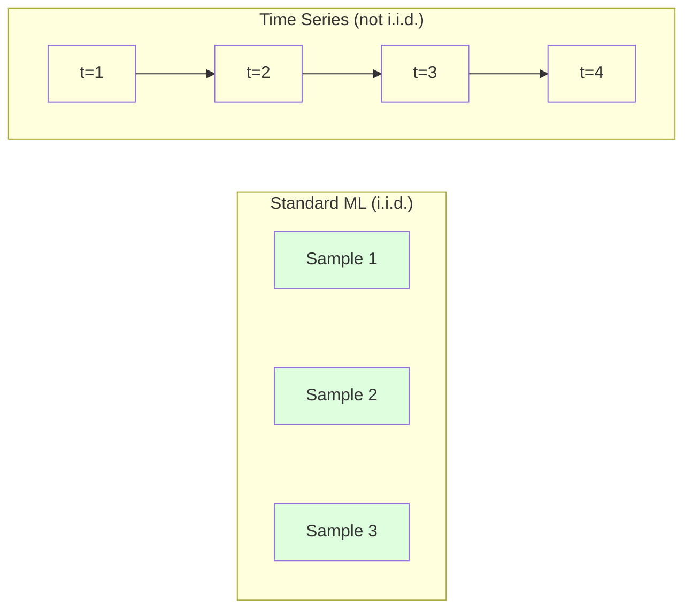
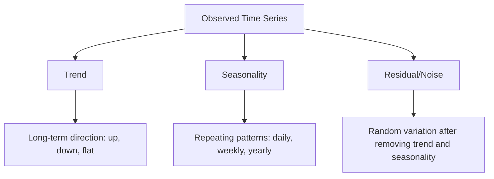
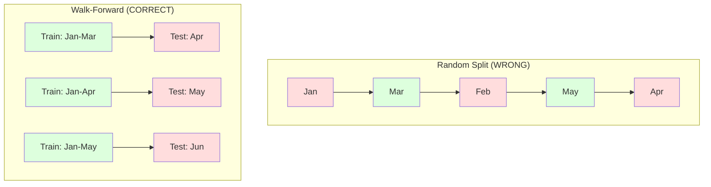

# समय श्रृंखला के मूल बातें
# समय क्रम आधार


> पिछले प्रदर्शन भविष्य के परिणामों की भविष्यवाणी करता है -- अगर आप पहले स्थिरता की जांच करें।

>  अतीत की घटनाएँ भविष्य की भविष्यवाणी कर सकती हैं  पूर्व शर्त है कि आप पहले स्थिरता की जांच करें

**Type:** Build | **类型：** 构建
**Language:**पायथन**语言：**पायथन
**Prerequisites:** Phase 2, Lessons 01-09 | **前置知识：** Phase 2 第 1-9 课
**Time:** ~90 minutes | **时间：** 约 90 分钟

## सीखने के लक्ष्य

- समय श्रृंखला को प्रवृत्ति, मौसमीता और अवशिष्ट घटकों में तोड़ें और स्थिरता का परीक्षण करें
  समय अनुक्रम को प्रवृत्ति, मौसमी और अवशेष अनुपात में विभाजित करें, और समतलता का परीक्षण करें
- समय श्रृंखला को एक पर्यवेक्षित सीखने की समस्या में बदलने के लिए देरी सुविधाओं और रूलिंग सांख्यिकी को लागू करें
  लगाड़ की विशेषताएं और रोटरी स्टैटिस्टिक्स को समय क्रम में बदलकर निगरानी सीखने की समस्या में बदल दिया जाएगा
- एक आगे की वैधता ढांचे का निर्माण करें जो भविष्य के डेटा को प्रशिक्षण में लीक होने से रोकता है
  भविष्य में डेटा लीक को रोकने के लिए पूर्व-आधारित रूल्ट प्रमाणन ढांचे का निर्माण
- समय श्रृंखला के लिए यादृच्छिक ट्रेन/परीक्षण विभाजन अमान्य क्यों हैं, इसकी व्याख्या करें और प्रदर्शन अंतर को उचित समय विभाजन के मुकाबले प्रदर्शित करें
   explain why as-time training/test division to time sequence is ineffective, और सही समय विभाजन प्रदर्शन अंतर का उपयोग


> **【中文解读】**
> 时间序列是按时间序列排列的数据──ARIMA、指数平滑是经典方法,LSTM/Transformer是深度学习方法──股票预测、销量预测、天气预报是典型应用──

> **【拓展：时间序列预测在金融和供应链中的关键角色】**
> अमेज़न का उपयोग समय अनुक्रम पूर्वानुमान से दुनिया भर में लाखों SKU के भंडार का प्रबंधन करने के लिए किया जाता है, प्रति दिन पूर्वानुमान 4 अरब से अधिक बार; उबर का उपयोग समय अनुक्रम मॉडल पूर्वानुमान आवश्यकताओं के लिए गतिशील调调价; उछाल मूल्य निर्धारण; वित्तीय संस्थानों का उपयोग ARIMA /GARCH  मॉडल पूर्वानुमान उतार-चढ़ाव दर के लिए जोखिम प्रबंधन के लिए किया जाता है।

## समस्या  समस्या परिचय

आपके पास समय के अनुसार आदेश दिया गया डेटा है दैनिक बिक्री, घंटे का तापमान, प्रति मिनट सीपीयू उपयोग, साप्ताहिक शेयर मूल्य. आप अगले मूल्य का अनुमान लगाना चाहते हैं, अगले सप्ताह, अगले तिमाही.

> आप समय क्रम के अनुसार डेटा है। दिन बिक्री, घंटे तापमान, प्रति मिनट सीपीयू उपयोग दर, शेयर की कीमत। आप अगले मूल्य का अनुमान लगाना चाहते हैं।

आप अपने मानक एमएल टूलकिट के लिए पहुंचते हैंः यादृच्छिक ट्रेन / परीक्षण विभाजन, क्रॉस-वैधता, सुविधा मैट्रिक्स में, भविष्यवाणी बाहर. हर कदम गलत है.

> आप मानक एमएल 工具 का उपयोग करें:随机训练/测试划分、交叉验证、特征矩阵输入、预测输出── प्रत्येक चरण गलत है──

समय श्रृंखला उन मान्यताओं को तोड़ती है जिन पर मानक एमएल निर्भर करता है। नमूने स्वतंत्र नहीं हैं - आज का तापमान कल के पर निर्भर करता है। यादृच्छिक विभाजन भविष्य की जानकारी अतीत में लीक करता है। बैकटेस्ट में अच्छी लग रही विशेषताएं उत्पादन में विफल होती हैं क्योंकि वे समय के साथ बदलते पैटर्न पर निर्भर करती हैं।

>  समय अनुक्रम मानक एमएल पर निर्भर होने वाली परिकल्पना को तोड़ता है। नमूना स्वतंत्र नहीं है।  आज का तापमान कल के पर निर्भर करता है।  भविष्य में सूचनाओं को अतीत में फैलाने का समय है।  पुनरावलोकन में यह अच्छा प्रतीत होता है क्योंकि वे समय के साथ बदलते मॉडल पर निर्भर करते हैं।

एक मॉडल जो यादृच्छिक क्रॉस-वैलिडेशन के साथ 95% सटीकता प्राप्त करता है, उचित समय आधारित मूल्यांकन के साथ 55% प्राप्त कर सकता है। अंतर तकनीकी नहीं है। यह एक मॉडल के बीच अंतर है जो कागज पर काम करता है और एक जो उत्पादन में काम करता है।

> एक मॉडल जो 95% सटीकता प्राप्त करता है, सही समय पर मूल्यांकन के तहत केवल 55% प्राप्त कर सकता है। यह तकनीकी विवरण नहीं है। यह कागज पर प्रभावी मॉडल और उत्पादन में प्रभावी मॉडल के बीच अंतर है।

यह सबक मूल बातें शामिल करता हैः समय डेटा को अलग क्या बनाता है, मॉडल का ईमानदारी से मूल्यांकन कैसे किया जाए, और समय श्रृंखला को उन सुविधाओं में कैसे बदल दिया जाए जो मानक एमएल मॉडल खपत कर सकते हैं।

> इस कक्षा में बुनियादी ज्ञान शामिल हैः समय डेटा को अलग कैसे बनाता है, मॉडल का ईमानदारी से मूल्यांकन कैसे किया जाता है, और समय अनुक्रम को मानक एमएल मॉडल में कैसे परिवर्तित किया जाता है, इसका उपयोग करने योग्य विशेषताएं हैं।

> **【中文解读】**
> समय अनुक्रम विश्लेषण की विशिष्टता डेटा बिंदुओं के बीच समय निर्भरता है आज का मूल्य कल के मूल्य पर निर्भर करता है यह मानक एमएल की स्वतंत्र और वितरण परिकल्पना को तोड़ता है केंद्रीय अवधारणाः समतलता स्थिरता सांख्यिकीय विशेषताएं समय के साथ परिवर्तन नहीं करती हैं; प्रवृत्ति + मौसम + अवशेष विघटन; लंबित विशेषताएं और रिंगिंग सांख्यिकीय अनुक्रम को पर्यवेक्षण सीखने की समस्या में बदल देती हैं सही मूल्यांकन विधि आगे की वैधता है, न कि आकस्मिक पारस्परिक सत्यापन

## अवधारणा का मूल अवधारणा

### समय श्रृंखला को क्या अलग बनाता है

मानक एमएल मानता है कि आईआईडी - स्वतंत्र और समान रूप से वितरित है। प्रत्येक नमूना अन्य नमूनों से स्वतंत्र रूप से एक ही वितरण से लिया जाता है। समय श्रृंखला दोनों का उल्लंघन करती हैः

> 标准 ML 假设 i.i.d.独立同分布── प्रत्येक नमूना एक ही वितरण से निकाला गया, अन्य नमूनों के साथ कोई संबंध नहीं── समय क्रम इन दो परिकल्पनाओं के विपरीत हैः

- **Not independent.**आज के शेयर की कीमत कल की कीमत पर निर्भर करती है। इस सप्ताह की बिक्री पिछले सप्ताह की बिक्री से मेल खाती है।
  ️️️️️️️️️️️️️️️️️️️️️️️️️️️️️️️️️️️️️️️️️️️️️️️️️️️️️️️️️️️️️️️️️️️️️️️️️️️️️️️️️️️️️️️️️️️️️️️️️️️️️️️️️️️️️️️️️️️️️️️️️️️️️️️️️️️️️️️️️️️️️️️️️️️️️️️️️️️️️️️️️️️️️️️️️️️️️️️️️️️️️️️️️️️️️️️️️️️️️️️️️️️️️️️️️️️️️️️️️️️️️️️️️️️️️️️️️️️️️️️️️️️️️️️️️️️️️️️️️️️️️️️️️️️️️️️️️️️️️️️️️️️️️️️️️️️️️️️️️️️️️️️️️️️️️️️️️️️️️️️️️️️️️️️️️️️️️️️️️️️️️️️️️️️️️️️️️️️️️️️️️️️️️️️️️️️️️️️️️️️️️️️️️️️️️️️️️️️️️️️️️️️️️️️️️️️️️️️️️️️️️️️️️️️️️️️️️️️️️️️️️️️️️️️️️️️️️️️️️️️️️️️️️️️️️️️️️️️️️️️️️️️️️️️️️️️️️️️️️️️️️️️️️️️️
- **Not identically distributed.**डिसेम्बर में बिक्री मार्च में बिक्री से अलग दिखती है।
  अप्रचलित वितरण। वितरण समय के साथ-साथ बदलता है।

ये उल्लंघन मामूली नहीं हैं. वे बदलते हैं कि आप सुविधाओं का निर्माण कैसे करते हैं, आप मॉडल का मूल्यांकन कैसे करते हैं, और कौन से एल्गोरिदम काम करते हैं।

> ये उल्लंघन छोटी समस्याएं नहीं हैं। ये आपके लक्षणों का निर्माण करने के तरीके को बदलते हैं, मॉडल का मूल्यांकन कैसे करते हैं और कौन से एल्गोरिदम प्रभावी हैं।



मानक एमएल में, नमूने आदान-प्रदान योग्य हैं। उन्हें मिलाकर कुछ भी नहीं बदलता। समय श्रृंखला में, क्रम सब कुछ है। मिलाकर सिग्नल को नष्ट कर देता है।

> मानक एमएल में, नमूना विनिमेय है।

### समय श्रृंखला के घटक

प्रत्येक समय श्रृंखला का संयोजन हैः

> प्रत्येक समय क्रम निम्नलिखित घटकों का संयोजन होता हैः



- **Trend**दीर्घकालिक दिशा राजस्व में वृद्धि 10% प्रति वर्ष वैश्विक तापमान में वृद्धि
  趋势:长期方向―― आय प्रतिवर्ष 10% बढ़े― वैश्विक तापमान में वृद्धि―
- **Seasonality**: निश्चित अंतराल पर दोहराए जाने वाले पैटर्न। दिसंबर में खुदरा बिक्री में तेजी आई। जुलाई में एयर कंडीशनिंग का उपयोग चरम पर है।
  季节性: तय间隔的重复模式──零售销售额在12月增长──空调使用量在7月达到峰值──
- **Residual**यदि शेष सफेद शोर जैसा दिखता है, तो विघटन ने संकेत को कैप्चर किया।
  शेषः प्रवृत्ति और मौसमी अवशेष को हटाएँ। यदि शेष ध्वनि की तरह दिखता है, तो विवरण में विघटन संकेतों को पकड़ लिया गया है।

### स्थिरीकरण

समय श्रृंखला स्थिर है यदि इसकी सांख्यिकीय गुण (औसत, भिन्नता, स्व-संबंध) समय के साथ नहीं बदलते हैं। अधिकांश भविष्यवाणी विधियों में स्थिरता का अनुमान है।

> यदि किसी समय क्रम की सांख्यिकीय विशेषताएं (उत्पादक मूल्य, अंतर, स्वयंसंबंधित) समय के साथ परिवर्तन नहीं करती हैं, तो यह स्थिर है।

**Why it matters:**एक गैर-स्थिर श्रृंखला में एक औसत है जो बहता है। जनवरी से डेटा पर प्रशिक्षित एक मॉडल ने फरवरी में दिखाए जाने वाले औसत से अलग एक औसत सीखा है। यह व्यवस्थित रूप से गलत होगा।

> **为什么重要：**असमान क्रम का औसत मूल्य 1 महीने के डेटा प्रशिक्षण मॉडल के साथ सीखा गया औसत मूल्य 2 महीने के साथ भिन्न होगा।

**How to check:**खिड़कियों पर रोलिंग औसत और रोलिंग मानक विचलन की गणना करें। यदि वे बहते हैं, तो श्रृंखला गैर-स्थिर है।

> **如何检查：**计算窗口 के भीतर रॉलिंग औसत मूल्य और रॉलिंग मानक भिन्नताएँ  यदि वे भटकते हैं, तो क्रमहीन है

**How to fix:**कच्चे मूल्यों को मॉडल करने के बजाय, लगातार मानों के बीच परिवर्तन को मॉडल करेंः

> **如何修复：**差分── न कि मूल मूल्य के निर्माण के लिए, बल्कि निरंतर मूल्य के बीच परिवर्तन के लिए निर्माणः

```
diff[t] = value[t] - value[t-1]
```

यदि एक राउंड डिफरेंसिंग से श्रृंखला स्थिर नहीं होती है, तो इसे फिर से लागू करें (दूसरी क्रम की डिफरेंसिंग) अधिकांश वास्तविक दुनिया की श्रृंखलाओं को अधिकतम दो राउंड की आवश्यकता होती है।

> यदि एक दौर के अंतर को स्थिर नहीं कर सकता है, तो इसे एक बार पुनः लागू करें।

**Example:**

> **示例：**

मूल श्रृंखला: [100, 102, 106, 112, 120]
पहला अंतरः [2, 4, 6, 8] (अभी भी ऊपर की ओर बढ़ रहा है)
दूसरा अंतरः [2, 2, 2] (स्थिर -- स्थैतिक)

मूल श्रृंखला में एक चतुर्भुज प्रवृत्ति थी। पहले अंतर ने इसे एक रैखिक प्रवृत्ति में बदल दिया। दूसरे अंतर ने इसे सपाट बना दिया। व्यवहार में, आपको शायद ही कभी दो से अधिक राउंड की आवश्यकता होती है।

> मूल क्रम में दोतरफा प्रवृत्ति है। एक चरण में भिन्नता को एक रैखिक प्रवृत्ति में बदल दिया जाता है।

**Formal test:**एग्मेंटेड डिक-फुलर (एडीएफ) परीक्षण स्थिरता के लिए मानक सांख्यिकीय परीक्षण है। शून्य परिकल्पना "सीरीज गैर-स्थिर है।" 0.05 से नीचे का p-मूल्य इसका मतलब है कि आप शून्य को अस्वीकार कर सकते हैं और स्थिरता का निष्कर्ष निकाल सकते हैं। हम एडीएफ को खरोंच से लागू नहीं करते हैं (इसके लिए असंबद्ध वितरण तालिकाओं की आवश्यकता होती है), लेकिन हमारे कोड में रोलिंग सांख्यिकीय दृष्टिकोण एक व्यावहारिक दृश्य जांच देता है।

> **正式检验：**बढ़ी हुई डिकी-फुलर (ADF) परीक्षण एक समतल सांख्यिकीय मानक परीक्षण है। शून्य परिकल्पना एक "क्रम असमान" है। p मूल्य 0.05 से कम है। इसका मतलब है कि आप शून्य परिकल्पना से इनकार कर सकते हैं और एक समतल निष्कर्ष निकाल सकते हैं।

### स्व-संयोजन

ऑटोकोरेलेशन मापता है कि समय t में एक मान समय t-k में मान के साथ कितना सहसंबंधित है (अतीत में k कदम) । ऑटोकोरेलेशन फ़ंक्शन (ACF) प्रत्येक lag k के लिए इस सहसंबंध का ग्राफ करता है।

> समय t के मूल्य और समय t-k  के मूल्य के बीच संबंध  से संबंधित फ़ंक्शन  से संबंधित फ़ंक्शन  से संबंधित फ़ंक्शन  से संबंधित फ़ंक्शन  से संबंधित फ़ंक्शन  से संबंधित फ़ंक्शन  से संबंधित फ़ंक्शन  से संबंधित फ़ंक्शन  से संबंधित फ़ंक्शन  से संबंधित फ़ंक्शन  से संबंधित फ़ंक्शन  से संबंधित फ़ंक्शन  से संबंधित फ़ंक्शन  से संबंधित फ़ंक्शन  से संबंधित फ़ंक्शन  से संबंधित फ़ंक्शन  से संबंधित फ़ंक्शन  से संबंधित फ़ंक्शन  से संबंधित फ़ंक्शन  से संबंधित फ़ंक्शन  से संबंधित फ़ंक्शन  से संबंधित फ़ंक्शन  से संबंधित फ़ंक्शन  से संबंधित फ़ंक्शन  से संबंधित फ़ंक्शन  से संबंधित फ़ंक्शन  से संबंधित फ़ंक्शन  से संबंधित फ़ंक्शन  से संबंधित फ़ंक्शन  से संबंधित फ़ंक्शन  से संबंधित फ़ंक्शन  से संबंधित फ़ंक्शन  से संबंधित फ़ंक्शन  से संबंधित फ़ंक्शन  से संबंधित फ़ंक्शन  से संबंधित फ़ंक्शन  से संबंधित फ़ंक्शन 

**ACF tells you:**
- यदि ACF 5 लेग के बाद शून्य हो जाता है, तो 5 कदम से अधिक पहले के मानों से कोई लेना-देना नहीं है।
  序列 की स्मृति बहुत दूर है। यदि ACF 5 后 में ढलकर शून्य हो जाता है, तो 5 后 में पहले का मूल्य 5 步 से अधिक हो जाता है।
- यदि ACF 12 (मासिक डेटा) पर बढ़ता है, तो वार्षिक मौसमीता होती है।
  यदि ACF में 12                                                                                                                                                                                                                                                             
- कितना लेग सुविधाओं बनाने के लिए. जहां ACF उपेक्षित हो जाता है लेग का उपयोग करें.
   निर्माण में बहुत देरी है  उपयोग में ACF  होने तक  उपेक्षित होने की देरी है 

**PACF (Partial Autocorrelation Function)**यदि आज केवल इसलिए 3 दिन पहले के साथ सहसंबंधित है क्योंकि दोनों कल के साथ सहसंबंधित हैं, तो पीएसीएफ 3 पर लेग शून्य होगा जबकि एसीएफ 3 पर नहीं होगा।

> **PACF（偏自相关函数）**️️️️️️️️️️️️️️️️️️️️️️️️️️️️️️️️️️️️️️️️️️️️️️️️️️️️️️️️️️️️️️️️️️️️️️️️️️️️️️️️️️️️️️️️️️️️️️️️️️️️️️️️️️️️️️️️️️️️️️️️️️️️️️️️️️️️️️️️️️️️️️️️️️️️️️️️️️️️️️️️️️️️️️️️️️️️️️️️️️️️️️️️️️️️️️️️️️️️️️️️️️️️️️️️️️️️️️️️️️️️️️️️️️️️️️️️️️️️️️️️️️️️️️️️️️️️️️️️️️️️️️️️️️️️️️️️️️️️️️️️️️️️️️️️️️️️️️️️️️️️️️️️️️️️️️️️️️️️️️️️️️️️️️️️️️️️️️️️️️️️️️️️️️️️️️️️️️️️️️️️️️️️️️️️️️️️️️️️️️️️️️️️️️️️️️️️️️️️️️️️️️️️️️️️️️️️️️️️️️️️️️️️️️️️️️️️️️️️️️️️️️️️️️️️️️️️️️️️️️️️️️️️️️️️️️️️️️️️️️️️️️️️️️️️️️️️️️️️️️️️️️️️️️️️

### लॅग फीचर्सः समय श्रृंखला को पर्यवेक्षित सीखने में बदलना

मानक एमएल मॉडल को एक विशेषता मैट्रिक्स एक्स और एक लक्ष्य वाई की आवश्यकता होती है। समय श्रृंखला आपको मानों का एक एकल स्तंभ देती है। पुल लेग विशेषताएं हैं।

> 标准 ML 模型 需要特征矩阵 X 和目标 y── समय क्रम आपको एक列值 देता है──桥梁是滞后特征──

[10, 12, 14, 13, 15] श्रृंखला लें और lag-1 और lag-2 सुविधाएँ बनाएंः

> 取序列 [10, 12, 14, 13, 15] 并创建滞后 1 和滞后 2 विशेषताएं

| lag_2 | lag_1 | target |
|-------|-------|--------|
| 10    | 12    | 14     |
| 12    | 14    | 13     |
| 14    | 13    | 15     |

अब आप एक मानक विघटन समस्या है. किसी भी एमएल मॉडल (रेखीय विघटन, यादृच्छिक वन, ग्रेडिएंट बढ़त) लेग से लक्ष्य की भविष्यवाणी कर सकते हैं.

> अब आपके पास एक मानक वापसी समस्या है। किसी भी एमएल मॉडल को लंबित करने के लिए लंबित किया जा सकता है।

अतिरिक्त विशेषताएं आप इंजीनियर कर सकते हैंः
- **Rolling statistics:**औसत, std, min, अंतिम k मानों पर अधिकतम
  滚动统计:过去 k 个值的平均值,标准差,最小值,最大值
- **Calendar features:**सप्ताह का दिन, महीना, छुट्टी, सप्ताहांत
  日历特征:星期几月份是否假期是否周末
- **Differenced values:**पिछले चरण से बदलाव
  差分值:与前一步的变化
- **Expanding statistics:**संचयी औसत, संचयी राशि
  扩展统计: संचय औसत मूल्य 累积和
- **Ratio features:**वर्तमान मूल्य / रॉलिंग औसत (हाल के औसत से कितनी दूर)
  अनुपात विशेषताः वर्तमान मूल्य / रोटरी औसत मूल्य (अभी के औसत मूल्य से भिन्नता)
- **Interaction features:**lag_1 * दिन_of_week (सप्ताह के दिन गति पर प्रभाव)
  交互特征:lag_1 * दिन_of_week(工作日对动量的影响)

**How many lags?**ऑटो-संदर्भ फ़ंक्शन का उपयोग करें। यदि ACF 10 तक की देरी से महत्वपूर्ण है, तो कम से कम 10 देरी का उपयोग करें। यदि साप्ताहिक मौसमीता है, तो 7 (और संभवतः 14) देरी शामिल करें। अधिक देरी मॉडल को अधिक इतिहास देती है लेकिन फिट करने के लिए अधिक सुविधाएं भी देती है, जिससे ओवरफिटिंग का खतरा बढ़ जाता है।

> **用多少个滞后？**उपयोग स्वयं संबंधित फ़ंक्शनों। यदि ACF में देरी 10 से है, तो कम से कम 10  देरी का उपयोग करें। यदि वहाँ सप्ताह के मौसम में देरी है, जिसमें 7  देरी शामिल है, तो 14  अधिक देरी मॉडल को अधिक इतिहास देता है, लेकिन यह भी अधिक विशेषताओं को अनुकूलित करने की आवश्यकता है, अधिक अनुकूलन जोखिमों को बढ़ाने के लिए।

**The target alignment trap.**जब लेग फीचर्स बनाते हैं तो लक्ष्य समय t पर मान होना चाहिए, और सभी फीचर्स को समय t-1 या उससे पहले के मानों का उपयोग करना चाहिए. यदि आप गलती से समय t पर मान को एक फीचर के रूप में शामिल करते हैं, तो आपके पास एक सही भविष्यवाणी है - और एक पूरी तरह से बेकार मॉडल। यह टाइम सीरीज़ फीचर इंजीनियरिंग में सबसे आम बग है।

> **目标对齐陷阱。** जब एक लैंडअलोन विशेषता का निर्माण होता है, तो लक्ष्य समय t का मूल्य होना चाहिए, सभी विशेषताएं समय t-1 या उससे पहले के मूल्य का उपयोग करना चाहिए। यदि आप समय t के मूल्य को एक विशेषता के रूप में नहीं मान रहे हैं, तो आपके पास एक सही भविष्यवाणी है, लेकिन यह एक पूरी तरह से बेकार मॉडल भी है। यह समय अनुक्रम विशेषता परियोजना में सबसे आम त्रुटि है।

### आगे की पुष्टि

यह इस पाठ में सबसे महत्वपूर्ण अवधारणा है। मानक k-fold क्रॉस-वैलिडेशन यादृच्छिक रूप से प्रशिक्षण और परीक्षण के लिए नमूने आवंटित करता है। समय श्रृंखला के लिए, यह भविष्य की जानकारी लीक करता है।

> यह इस वर्ग की सबसे महत्वपूर्ण अवधारणा है। मानक के अनुसार, परीक्षण का समय समय के क्रम के लिए भविष्य की जानकारी को बाहर निकालेगा।



आगे की वैधताः
1. समय t तक के आंकड़ों पर ट्रेन
   समय t 之前 के डेटा पर प्रशिक्षण
2. समय t+1 (या t+1 से t+k तक बहु-चरण के लिए) पर भविष्यवाणी करें
   समय में t+1 预测(或多步预测 t+1 तक t+k)
3. खिड़की को आगे स्लाइड करें
   पूर्ववर्ती स्लाइड विंडो
4. दोहराएँ
   重复

प्रत्येक परीक्षण तह में केवल प्रशिक्षण डेटा के बाद आने वाले डेटा होते हैं। भविष्य में कोई लीक नहीं होता है। यह आपको मॉडल के प्रदर्शन का एक ईमानदार अनुमान देता है जब तैनात किया जाता है।

> प्रत्येक परीक्षण में केवल सभी प्रशिक्षण डेटा के बाद के डेटा शामिल हैं। भविष्य में कोई रिसाव नहीं है। यह आपको मॉडल तैनाती के समय क्षमता का एक ईमानदार अनुमान प्रदान करता है।

**Expanding window**प्रशिक्षण के लिए सभी ऐतिहासिक डेटा का उपयोग करता है (विंडो बढ़ता है) । **Sliding window**एक निश्चित आकार की ट्रेनिंग विंडो (विंडो स्लाइड) का उपयोग करें। विस्तार का उपयोग करें जब आप मानते हैं कि पुराने डेटा अभी भी प्रासंगिक हैं। स्लाइड का उपयोग करें जब दुनिया बदलती है और पुराने डेटा दर्द होता है।

> **扩展窗口**प्रयोग सभी ऐतिहासिक डेटा अभ्यास करने के लिए**滑动窗口**उपयोग फिक्स्ड बड़े आकार के प्रशिक्षण विंडो (Fixed Size Training Window) ️ विंडो स्लाइड करें (When you think old data is still relevant) ️ उपयोग विस्तार विंडो (When you think old data is still relevant) ️ उपयोग स्लाइड विंडो (When you think old data is still relevant) ️ उपयोग स्लाइड विंडो (When you think old data is still relevant) ️ उपयोग स्लाइड विंडो (When you think old data is still relevant) ️ उपयोग स्लाइड विंडो (When the world changes and old data is harmful) ️

### एआरआईएमए इंट्यूशन

एरिमा क्लासिक टाइम सीरीज मॉडल है। इसमें तीन घटक हैंः

> एरिमा क्लासिक टाइम सीरीज मॉडल है। इसमें तीन घटक हैंः

- **AR (Autoregressive):**पिछले मानों से भविष्यवाणी करें। AR ((p) अंतिम p मानों का उपयोग करता है।
  AR(स्व-归归): से अतीत के मूल्य预测。AR(p) 使用最近的 p 个值。
- **I (Integrated):**स्थिरीकरण प्राप्त करने के लिए अंतर करना।
  I  积分:                                                                                                                                                                                                                                                            
- **MA (Moving Average):**पूर्वानुमान त्रुटियों से भविष्यवाणी करें। MA(q) अंतिम q त्रुटियों का उपयोग करता है।
  MA(移动平均): अतीत से पूर्वानुमान त्रुटि पूर्वानुमान。MA(q)

ARIMA ((p, d, q) तीनों को जोड़ता है। आप ACF/PACF विश्लेषण या स्वचालित खोज (ऑटो-ARIMA) के आधार पर p, d, q चुनते हैं।

> ARIMA(p,d,q) 组合了所有三成分──你基于ACF/PACF 分析或自动搜索(auto-ARIMA) 选择 p、d、q──

हम आरआईएमए को स्क्रैच से लागू नहीं करेंगे - इसके लिए संख्यात्मक अनुकूलन की आवश्यकता है जो इस पाठ के दायरे से परे है। कुंजी अंतर्दृष्टि यह समझना है कि प्रत्येक घटक क्या करता है ताकि आप आरआईएमए परिणामों की व्याख्या कर सकें और पता लगा सकें कि इसका उपयोग कब करना है।

> हम आरआईएमए को शून्य से प्राप्त नहीं करेंगे, इसके लिए इस कक्षा के दायरे से परे संख्यात्मक अनुकूलन की आवश्यकता है।

### कब क्या इस्तेमाल करें

| Approach | Best For | Handles Seasonality | Handles External Features |
|----------|---------|-------------------|------------------------|
| Lag features + ML | Tabular with many external features | With calendar features | Yes |
| ARIMA | Single univariate series, short-term | SARIMA variant | No (ARIMAX for limited) |
| Exponential smoothing | Simple trend + seasonality | Yes (Holt-Winters) | No |
| Prophet | Business forecasting, holidays | Yes (Fourier terms) | Limited |
| Neural networks (LSTM, Transformer) | Long sequences, many series | Learned | Yes |

अधिकांश व्यावहारिक समस्याओं के लिए, लेग फीचर्स + ग्रेडिएंट बूस्टिंग सबसे मजबूत प्रारंभिक बिंदु है। यह बाहरी सुविधाओं को स्वाभाविक रूप से संभालता है, स्थिरता की आवश्यकता नहीं है, और डिबग करना आसान है।

>  अधिकांश वास्तविक समस्याओं के लिए, लंबित विशेषता + 梯度提升 सबसे मजबूत प्रारंभिक बिंदु है यह स्वाभाविक रूप से बाहरी विशेषताओं को संभालती है, स्थिरता की आवश्यकता नहीं है, और इसे अनुकूलित करना आसान है

### क्षितिज और रणनीतियों की भविष्यवाणी

एक चरण पूर्वानुमान एक समय एक कदम आगे का अनुमान लगाता है। बहु-चरण पूर्वानुमान कई चरणों का अनुमान लगाता है। तीन रणनीतियाँ हैंः

> 单步预测预测 下一个时间步──多步预测预测多个时间步──有三种策略:

**Recursive (iterated):**एक कदम आगे का अनुमान लगाएं, अगले कदम के लिए भविष्यवाणी को इनपुट के रूप में उपयोग करें. सरल लेकिन त्रुटियां जमा होती हैं - प्रत्येक भविष्यवाणी पिछले भविष्यवाणी का उपयोग करती है, इसलिए गलतियां मिश्रित होती हैं।

> **递归（迭代）：**预测一步,将预测结果作为下一步的输入──简单但误差会积累每预测使用前一个预测,因此误会叠加──

**Direct:**प्रत्येक क्षितिज के लिए एक अलग मॉडल का अभ्यास करें। मॉडल-1 t+1 का अनुमान लगाता है, मॉडल-5 t+5 का अनुमान लगाता है। कोई त्रुटि संचय नहीं है, लेकिन प्रत्येक मॉडल में कम प्रशिक्षण नमूने हैं और वे जानकारी साझा नहीं करते हैं।

> **直接：**प्रत्येक पूर्वानुमान के लिए प्रशिक्षण का दायरा अलग-अलग मॉडल है। मॉडल-1  पूर्वानुमान t+1, मॉडल-5  पूर्वानुमान t+5── कोई त्रुटि संचय नहीं है, लेकिन प्रत्येक मॉडल के प्रशिक्षण नमूना कम है और जानकारी साझा नहीं करता है──

**Multi-output:**एक मॉडल को प्रशिक्षित करें जो सभी क्षितिज को एक साथ आउटपुट करता है। क्षितिज के पार जानकारी साझा करता है लेकिन एक मॉडल की आवश्यकता होती है जो कई आउटपुट (या कस्टम हानि फ़ंक्शन) का समर्थन करता है।

> **多输出：**训练一个模型同时输出所有预测范围――跨范围共享信息, लेकिन आवश्यकता समर्थन多输出模型(或自定义损失函数) 

अधिकांश व्यावहारिक समस्याओं के लिए, छोटी क्षितिज (1-5 चरणों) के लिए पुनरावर्ती और लंबी क्षितिज के लिए सीधा से शुरू करें।

>  अधिकांश वास्तविक प्रश्नों के लिए, लघु दायरा (१-५) के साथ परिणत, दीर्घ दायरा के साथ प्रत्यक्ष विधि

### समय श्रृंखला में आम गलतियाँ

| Mistake | Why it happens | How to fix |
|---------|---------------|-----------|
| Random train/test split | Habit from standard ML | Use walk-forward or temporal split |
| Using future features | Feature at time t included by mistake | Audit every feature for temporal alignment |
| Overfitting to seasonality | Model memorizes calendar patterns | Hold out a full seasonal cycle in the test set |
| Ignoring scale changes | Revenue doubles but patterns stay | Model percentage change instead of absolute |
| Too many lag features | "More history is better" | Use ACF to determine relevant lags |
| Not differencing | "The model will figure it out" | Tree models handle trends; linear models need stationarity |

## इसे बनाओ, इसे पूरा करो।

> **【中文解读】**
> शून्य से समय अनुक्रम के मूल उपकरण: लॅगॅडट्रॅक्ट जनरेटर (LEGAD AFTERTRACT GERADER) से क्रम को निगरानी सीखने के प्रारूप में बदल दिया जाएगा (Rolling Statistics)                                                                                                                                                                                                                                     

> **【拓展：从 ARIMA 到 Transformer——时间序列预测的进化】**
> 经典时间序列方法(ARIMA、Holt-Winters) एकल चर、短序列 पर अभी भी प्रभावी है। लेकिन आधुनिक विधि काफी हद तक पार हो चुकी हैः फेसबुक का भविष्यवाणी स्वचालित संसाधित节假日和季节性; अमेज़न का डीपार् उपयोग स्वयं वापसी आरएनएन बनाने की संभावना पूर्वानुमान; गूगल का टाइम्सएफएम और अमेज़न का क्रोनोस उपयोग ट्रांसफार्मर संरचना, शून्य नमूना में सफलता प्राप्त कर रहे हैं।
```figure
f3-series-decompose
```

## इसे बनाओ

कोड में `code/time_series.py`मूल निर्माण ब्लॉकों को खरोंच से लागू करता है।

> `code/time_series.py`मध्य कोड ने शून्य से कोर कंस्ट्रक्शन मॉड्यूल को प्राप्त किया है।

### लॅग फीचर निर्माता

```python
def make_lag_features(series, n_lags):
    n = len(series)
    X = np.full((n, n_lags), np.nan)
    for lag in range(1, n_lags + 1):
        X[lag:, lag - 1] = series[:-lag]
    valid = ~np.isnan(X).any(axis=1)
    return X[valid], series[valid]
```

यह एक 1D श्रृंखला को एक विशेषता मैट्रिक्स में परिवर्तित करता है जहां प्रत्येक पंक्ति में अंतिम है `n_lags`विशेषताओं के रूप में मान और लक्ष्य के रूप में वर्तमान मूल्य।

> यह एक आयाम क्रम में परिवर्तित किया जाएगा विशेषता रक्ख, प्रत्येक पंक्ति में होगा हाल ही में `n_lags`个值作为特征,当前值作为目标──

### आगे की क्रॉस-वैलिडेशन

```python
def walk_forward_split(n_samples, n_splits=5, min_train=50):
    assert min_train < n_samples, "min_train must be less than n_samples"
    step = max(1, (n_samples - min_train) // n_splits)
    for i in range(n_splits):
        train_end = min_train + i * step
        test_end = min(train_end + step, n_samples)
        if train_end >= n_samples:
            break
        yield slice(0, train_end), slice(train_end, test_end)
```

प्रत्येक विभाजन प्रशिक्षण डेटा परीक्षण डेटा से पहले सख्ती से आता है सुनिश्चित करता है। प्रशिक्षण विंडो प्रत्येक तह के साथ विस्तारित होता है।

> प्रत्येक भाग में प्रशिक्षण डेटा को सख्ती से परीक्षण डेटा से पहले सुनिश्चित करें।

### सरल ऑटोरेग्रेसिव मॉडल

एक शुद्ध एआर मॉडल केवल लीक सुविधाओं पर रैखिक प्रतिगमन हैः

> शुद्ध एआर मॉडल                                                                                                                                                                                                                                                             

```python
class SimpleAR:
    def __init__(self, n_lags=5):
        self.n_lags = n_lags
        self.weights = None
        self.bias = None

    def fit(self, series):
        X, y = make_lag_features(series, self.n_lags)
        # Solve via normal equations
        X_b = np.column_stack([np.ones(len(X)), X])
        theta = np.linalg.lstsq(X_b, y, rcond=None)[0]
        self.bias = theta[0]
        self.weights = theta[1:]
        return self
```

यह अवधारणात्मक रूप से पाठ 02 से रैखिक प्रतिगमन के समान है, लेकिन उसी चर के समय-अवरोधित संस्करणों पर लागू होता है।

> यह अवधारणा में द्वितीय श्रेणी के रैखिक वापसी के समान है, लेकिन एक ही चर के समय के पीछे संस्करण पर लागू किया गया है।

### स्थिरीकरण जांच

कोड स्थिरांक का आकलन करने के लिए दृश्य और संख्यात्मक रूप से रॉलिंग आँकड़े की गणना करता हैः

> 代码计算滚动统计量, दृश्यता और संख्यात्मक तरीके से स्थिरता का आकलन करेंः

```python
def check_stationarity(series, window=50):
    rolling_mean = np.array([
        series[max(0, i - window):i].mean()
        for i in range(1, len(series) + 1)
    ])
    rolling_std = np.array([
        series[max(0, i - window):i].std()
        for i in range(1, len(series) + 1)
    ])
    return rolling_mean, rolling_std
```

यदि रोलिंग औसत बहाव या रोलिंग स्टडी बदलता है, तो श्रृंखला गैर-स्थिर है। अंतर करना लागू करें और फिर से जांचें।

> यदि रॉलिंग औसत मूल्य भटकता है या रॉलिंग मानक भिन्नता बदलता है, तो क्रमशः असमान है।

कोड श्रृंखला के पहले आधे और दूसरे आधे की तुलना करके स्थिरता की जांच भी करता है। यदि साधनों में आधे से अधिक मानक विचलन या भिन्नता अनुपात 2x से अधिक है, तो श्रृंखला को गैर-स्थिर के रूप में चिह्नित किया जाता है।

> 代码 भी तुलना क्रम के पहले आधे और बाद के आधे भागों के माध्यम से समतलता की जांच करने के लिए पारित करता है। यदि औसत मूल्य अंतर आधे मानक अंतर से अधिक है, या अंतर अंतर 2 गुना से अधिक है, तो क्रम को असमानता के रूप में चिह्नित किया जाता है।

### स्व-संयोजन

```python
def autocorrelation(series, max_lag=20):
    n = len(series)
    mean = series.mean()
    var = series.var()
    acf = np.zeros(max_lag + 1)
    for k in range(max_lag + 1):
        cov = np.mean((series[:n-k] - mean) * (series[k:] - mean))
        acf[k] = cov / var if var > 0 else 0
    return acf
```

## इसे फ्रेमवर्क के साथ लागू करें

sklearn के साथ, आप किसी भी regresor के साथ सीधे lag सुविधाओं का उपयोग करते हैंः

> उपयोग कर sklearn, आप सीधे किसी भी regressionator के लिए लंबित कर सकते हैंः

```python
from sklearn.linear_model import Ridge
from sklearn.ensemble import GradientBoostingRegressor

X, y = make_lag_features(series, n_lags=10)

for train_idx, test_idx in walk_forward_split(len(X)):
    model = Ridge(alpha=1.0)
    model.fit(X[train_idx], y[train_idx])
    predictions = model.predict(X[test_idx])
```

एआरआईएमए के लिए, सांख्यिकीय मॉडल का उपयोग करेंः

> 对于ARIMA,使用统计模型:

```python
from statsmodels.tsa.arima.model import ARIMA

model = ARIMA(train_series, order=(5, 1, 2))
fitted = model.fit()
forecast = fitted.forecast(steps=30)
```

कोड में `time_series.py`दोनों दृष्टिकोणों को प्रदर्शित करता है और आगे चलकर सत्यापन का उपयोग करके उनकी तुलना करता है।

> `time_series.py`मध्य कोड ने दो प्रकार के तरीकों का प्रदर्शन किया, और पूर्व-आधारित रोलिंग परीक्षण का उपयोग करके तुलना करने के लिए किया।

### sklearn समय श्रृंखलाएँविभाजित

sklearn प्रदान करता है `TimeSeriesSplit`जो आगे की वैधता को लागू करता हैः

> दुकान  प्रदान `TimeSeriesSplit`, पूर्व-आधारित रोल-आउट परीक्षण को प्राप्त कियाः

```python
from sklearn.model_selection import TimeSeriesSplit

tscv = TimeSeriesSplit(n_splits=5)
for train_index, test_index in tscv.split(X):
    X_train, X_test = X[train_index], X[test_index]
    y_train, y_test = y[train_index], y[test_index]
    model.fit(X_train, y_train)
    score = model.score(X_test, y_test)
```

यह हमारे खरोंच से बराबर है`walk_forward_split`लेकिन sklearn के क्रॉस-वैलिडेशन फ्रेमवर्क में एकीकृत है। आप इसे उपयोग कर सकते हैं`cross_val_score`:

> यह हमारे शून्य से प्राप्त करने के बराबर है ।`walk_forward_split`, लेकिन स्टोरर्न के पारस्परिक सत्यापन ढांचे में एकीकृत।`cross_val_score`एकजुट उपयोगः

```python
from sklearn.model_selection import cross_val_score

scores = cross_val_score(model, X, y, cv=TimeSeriesSplit(n_splits=5))
print(f"Mean score: {scores.mean():.4f} +/- {scores.std():.4f}")
```

### मूल्यांकन मेट्रिक्स

समय श्रृंखला भविष्यवाणी में regression metrics का उपयोग किया जाता है, लेकिन समय-सचेत संदर्भ के साथः

> 时间序列预测 वापसी सूचक का उपयोग, लेकिन समय संज्ञानात्मक निम्नानुसार हैः

- **MAE (Mean Absolute Error):**औसत y_true - y_pred डिश. मूल इकाइयों में व्याख्या करने के लिए आसान. "औसत में, भविष्यवाणियों 3.2 डिग्री से अधिक हैं. "
  MAE( औसत绝对差 -                                                                                                                                                                                                                                                           
- **RMSE (Root Mean Squared Error):**औसत वर्ग त्रुटि की वर्गमूल। बड़े त्रुटियों को MAE से अधिक दंडित करता है। जब बड़े त्रुटियों को कई छोटी त्रुटियों से भी बदतर है।
  RMSE (均方根誤差): औसत方誤差的平方根── MAE से अधिक गंभीरता से दंडित बड़ी त्रुटि── जब बड़ी त्रुटि कई छोटी त्रुटियों से बदतर होती है उपयोग करते समय──
- **MAPE (Mean Absolute Percentage Error):**औसत त्रुटि / true_value = 100 स्केल-स्वतंत्र, विभिन्न श्रृंखलाओं के बीच तुलना के लिए उपयोगी है. लेकिन undefined जब सही मान शून्य हैं.
  MAPE (आसमान पूर्ण प्रतिशत अनुपात त्रुटि): वास्तविक मूल्य में त्रुटि / वास्तविक मूल्य में 100 का औसत मूल्य है, जो कि विभिन्न क्रमों में तुलना के लिए उपयुक्त है, लेकिन वास्तविक मूल्य में शून्य समय परिभाषित नहीं है।
- **Naive baseline comparison:**हमेशा सरल बेसलाइन के साथ तुलना करें। मौसमी साफ़ आधार रेखा एक अवधि से पहले (कल, पिछले सप्ताह) के मूल्य की भविष्यवाणी करती है। यदि आपका मॉडल साफ़ नहीं हरा सकता है, तो कुछ गलत है।
  朴素基线比较:始终与简单基线比较──季节性朴素基线预测一个周期前的值(昨天、上周)── यदि आपका मॉडल सरल基线 से परे नहीं जा सकता है, तो समस्या का वर्णन करें──

### घूर्णन विशेषताएं

कोड में दिखाया गया है कि लॅग फीचर्स के लिए रॉलिंग आँकड़े (मीडियम, एसटीडी, मिन, अधिकतम 7 और 14 दिनों की खिड़कियों पर) जोड़े गए हैं। ये मॉडल को हालिया रुझानों और अस्थिरता के बारे में जानकारी देते हैं जो अकेले लॅग फीचर्स नहीं पकड़ते हैं।

> 代码 ने प्रस्तुत किया जाएगा रोलआउट सांख्यिकी ((7 天和 14 天窗口的平均值、标准差、最小值、最大值) लॅग्ड विशेषता में जोड़ा गया है। ये मॉडल के लिए अद्वितीय लॅग्ड विशेषताएं प्रदान करती हैं जो हाल के रुझानों और गतिशीलता जानकारी को पकड़ नहीं सकती हैं।

उदाहरण के लिए, यदि रोलिंग औसत बढ़ रहा है, तो यह एक वृद्धिशील प्रवृत्ति का संकेत देता है। यदि रोलिंग एसटीडी बढ़ रहा है, तो यह बढ़ती अस्थिरता का संकेत देता है। ये ऐसे पैटर्न हैं जो पेड़ आधारित मॉडल सीख सकते हैं लेकिन रैखिक मॉडल नहीं कर सकते हैं।

> उदाहरण के लिए, यदि रोल औसत मूल्य बढ़ता है, तो वृद्धि की प्रवृत्ति है। यदि रोल मानक अंतर बढ़ता है, तो गतिशीलता बढ़ती है। ये ऐसे मॉडल हैं जिन्हें सीखना संभव है लेकिन रैखिक मॉडल सीख नहीं सकते हैं।

## इसे भेजें उत्पाद

इस पाठ से उत्पन्न होता हैः
- `outputs/prompt-time-series-advisor.md`-- समय श्रृंखला समस्याओं को फ्रेम करने के लिए एक संकेत
  `outputs/prompt-time-series-advisor.md` 构建时间序列问题的提示词
- `code/time_series.py`-- लेग सुविधाएँ, आगे चलकर सत्यापन, एआर मॉडल, स्थिरता जांच
  `code/time_series.py` 滞后特征、前向滚动验证、AR 模型、平稳性检查

### आपको जो मूल बातें हासिल करनी चाहिए

किसी भी मॉडल का निर्माण करने से पहले, आधार रेखाएं निर्धारित करेंः

> किसी भी मॉडल का निर्माण करने से पहले, आधार रेखा का निर्माण करेंः

1. **Last value (persistence).**भविष्यवाणी करें कि कल आज जैसा ही होगा कई श्रृंखलाओं के लिए, यह जीतना आश्चर्यजनक रूप से मुश्किल है।
   अंतिम मूल्य (अस्थायी)  भविष्यवाणी कल और आज की तरह ही है कई क्रमों के लिए, यह आश्चर्यजनक रूप से कठिन है
2. **Seasonal naive.**भविष्यवाणी करें कि आज पिछले सप्ताह (या पिछले साल) के समान दिन होगा। यदि आपका मॉडल इसे हरा नहीं सकता है, तो उसने मौसमीता के अलावा कोई उपयोगी पैटर्न नहीं सीखा है।
   季节性朴朴――预测 आज के साथ पिछले सप्ताह (या पिछले साल) एक ही दिन में ही  यदि आपका मॉडल इस आधारशिला से परे नहीं जा सकता है, तो यह किसी भी उपयोगी मॉडल को नहीं सीख पाता है 
3. **Moving average.**पिछले k मानों के औसत का अनुमान लगाएं। शोर को चिकना करता है लेकिन अचानक परिवर्तनों को कैप्चर नहीं कर सकता है।
   移动平均──预测近期 k 个值的平均值──平滑噪音但无法捕获突变──

यदि आपका फैंसी एमएल मॉडल मौसमी साफ़ आधार रेखा से हार जाता है, तो आपके पास एक बग है। सबसे आम तौर परः सुविधाओं में भविष्य का रिसाव, गलत मूल्यांकन विधि, या श्रृंखला वास्तव में यादृच्छिक और अप्रत्याशित है।

> यदि आप एक सावधानीपूर्वक डिजाइन किए गए एमएल मॉडल को एक मौसमी सरल आधार रेखा में सौंपते हैं, तो आपके पास बग है। सबसे आम बात यह है कि लक्षणों में भविष्य के रिसाव, गलत मूल्यांकन विधि, या अनुक्रम वास्तव में आकस्मिक और अप्रत्याशित है।

### व्यावहारिक सुझाव

1. **Start with plotting.**किसी भी मॉडलिंग से पहले, कच्ची श्रृंखला का नक्शा बनाएं। रुझानों, मौसमीता, असाधारणताओं, संरचनात्मक ब्रेक (व्यवहार में अचानक बदलाव) की तलाश करें। 30 सेकंड की दृश्य निरीक्षण अक्सर आपको स्वचालित विश्लेषण के एक घंटे से अधिक बताता है।
   पहले चित्रण करें। किसी भी निर्माण से पहले, मूल क्रम को चित्रित करें। प्रवृत्ति, मौसम, असामान्य मूल्य, संरचनात्मक परिवर्तनों की खोज करें।

2. **Difference first, model second.**यदि श्रृंखला में एक स्पष्ट प्रवृत्ति है, तो लेग फीचर्स बनाने से पहले इसे अलग करें। पेड़ आधारित मॉडल प्रवृत्तियों को संभाल सकते हैं, लेकिन रैखिक मॉडल नहीं कर सकते हैं, और अंतर करना कभी भी चोट नहीं पहुंचाता है।
   यदि क्रम में स्पष्ट प्रवृत्ति है, तो निर्माण में देरी के लक्षणों से पहले अग्रिम प्रवृत्ति है। पेड़ मॉडल प्रवृत्ति को संभाल सकते हैं, लेकिन रैखिक मॉडल नहीं कर सकते हैं, और भिन्नता नकारात्मक प्रभाव नहीं डाल सकती है।

3. **Hold out at least one full seasonal cycle.**यदि आपके पास साप्ताहिक मौसमीता है, तो आपके परीक्षण सेट को कम से कम एक पूर्ण सप्ताह की आवश्यकता है। यदि मासिक है, तो कम से कम एक पूर्ण महीने। अन्यथा आप यह आकलन नहीं कर सकते कि मॉडल ने मौसमी पैटर्न को कैप्चर किया है या नहीं।
   👉 कम से कम एक पूर्ण ऋतु चक्र छोड़ दें यदि आपके पास ऋतु चक्र है, तो परीक्षण सेट को कम से कम एक पूरा सप्ताह की आवश्यकता होगी यदि यह मासिक है, तो कम से कम एक पूरा महीना यदि नहीं तो आप यह आकलन नहीं कर सकते कि मॉडल ने ऋतु चक्र को पकड़ लिया है या नहीं

4. **Monitor in production.**समय श्रृंखला मॉडल समय के साथ-साथ दुनिया के परिवर्तन के साथ गिरावट आते हैं। रोलिंग आधार पर भविष्यवाणी त्रुटियों का ट्रैक करें। जब त्रुटियां बढ़ना शुरू होती हैं, तो हाल के डेटा पर मॉडल को फिर से प्रशिक्षित करें।
    उत्पादन में निगरानी  समय अनुक्रम मॉडल दुनिया के परिवर्तन के साथ बदतर  रोल तरीके से पूर्वानुमान त्रुटि का पालन  जब त्रुटि बढ़ना शुरू होती है, तो हाल के समय के डेटा के साथ पुनः प्रशिक्षण मॉडल 

5. **Beware of regime changes.**महामारी से पहले के आंकड़ों पर प्रशिक्षित मॉडल महामारी के बाद के व्यवहार की भविष्यवाणी नहीं करेगा। ज्ञात शासन परिवर्तन के संकेतकों को सुविधाओं के रूप में शामिल करें, या पुरानी डेटा को भूलने वाली स्लाइडिंग विंडो का उपयोग करें।
   वर्तमान स्थिति परिवर्तन। प्रकोप से पहले डेटा प्रशिक्षण मॉडल के साथ प्रकोप के बाद के व्यवहार की भविष्यवाणी नहीं की जा सकती है। ज्ञात स्थिति परिवर्तन के संकेतकों को लक्षण के रूप में उपयोग किया जाएगा, या पुराने डेटा को भूल जाने के लिए स्लाइड विंडो का उपयोग किया जाएगा।

6. **Log-transform skewed series.**राजस्व, कीमतें और गणनाएं अक्सर दाईं ओर झुकी हुई होती हैं। लॉग लेना भिन्नता को स्थिर करता है और गुणात्मक पैटर्न को जोड़ता है, जिसे रैखिक मॉडल संभाल सकते हैं। लॉग स्थान में पूर्वानुमान, फिर मूल इकाइयों पर वापस आने के लिए एक्सपोनेंशियल।
   संख्याओं में परिवर्तन के लिए क्रमशः क्रमशः आय, मूल्य और गणना आमतौर पर दाईं ओर होती है।

## अभ्यास विषय

1. **Stationarity experiment.**रैखिक प्रवृत्ति के साथ एक श्रृंखला उत्पन्न करें। रॉलिंग सांख्यिकी के साथ स्थिरता की जांच करें। पहले भिन्नता लागू करें। फिर से जांचें। एक चतुर्भुज प्रवृत्ति के लिए भिन्नता के कितने दौर लगते हैं?
   1. एक साथ प्रवृत्ति और मौसमी संश्लेषण समय अनुक्रम उत्पन्न करना।

2. **Lag selection.**सीजनल सीरीज (पीरियड=7) पर ACF की गणना करें। कौन से लेग में सबसे अधिक ऑटोकोरेलेशन होता है? केवल उन लेग का उपयोग करके लेग फीचर्स बनाएं (लगंतर लेग नहीं) । क्या 1 से 7 लेग का उपयोग करने की तुलना में सटीकता में सुधार होता है?
   2. 构建滞后特征(लॉग 1-7) तथा滚动统计(窗口 3、7、14)                                                                                                                                                                                                                                                  

3. **Walk-forward vs random split.**लेग फीचर्स पर एक रिज रेग्रेसशन को प्रशिक्षित करें। यादृच्छिक 80/20 विभाजन और आगे की वैधता के साथ मूल्यांकन करें। यादृच्छिक विभाजन प्रदर्शन को कितना अधिक बताता है?
   3. एक ही डेटासेट पर तुलना के साथ-साथ पूर्व-आधारित रिलिजिंग परीक्षणों में दिखाया गया है।

4. **Feature engineering.**लॅग फीचर्स में रोलिंग मीडियम (window=7), रोलिंग std (window=7) और दिन-से-सप्ताह की सुविधाएँ जोड़ें। आगे चलने वाले सत्यापन का उपयोग करके इन एक्स्ट्रा के साथ और बिना सटीकता की तुलना करें।
   4. 实现 ARIMA(p, d, q) 零──网格搜索最优参数, AIC 选择最佳模型── के साथ

5. **Multi-step forecasting.**1. दो रणनीतियों की तुलना करें: (क) एक कदम का अनुमान लगाएं, अगले कदम के लिए भविष्यवाणी को इनपुट के रूप में उपयोग करें (रिकर्सिव), और (ख) प्रत्येक क्षितिज के लिए अलग-अलग मॉडल प्रशिक्षित करें (प्रत्यक्ष) । कौन सा अधिक सटीक है?

> **【中文解读】**
> 时间序列的核心工具箱:ADF 检验判断平稳性(p-value < 0.05 拒绝非平稳假设);差分消除趋势(一阶差分 = आज - कल);滞后特征将序列转为监督学习格式(使用t-1, t-2,... 的值预测 t);滚动统计捕获局部趋势(7 天移动平均) ――前进验证是唯一正确的评估方法:每次使用过去的数据预测未来,然后滑窗──

## कीवर्ड्स  शब्द खोज तालिका

| Term | What people say | What it actually means |
|------|----------------|----------------------|
| Stationarity | "The stats don't change over time" | A series whose mean, variance, and autocorrelation structure are constant over time |
| Differencing | "Subtract consecutive values" | Computing y[t] - y[t-1] to remove trends and achieve stationarity |
| Autocorrelation (ACF) | "How a series correlates with itself" | The correlation between a time series and a lagged copy of itself, as a function of the lag |
| Partial autocorrelation (PACF) | "Direct correlation only" | Autocorrelation at lag k after removing the effect of all shorter lags |
| Lag features | "Past values as inputs" | Using y[t-1], y[t-2], ..., y[t-k] as features to predict y[t] |
| Walk-forward validation | "Time-respecting cross-validation" | Evaluation where training data always precedes test data chronologically |
| ARIMA | "The classic time series model" | AutoRegressive Integrated Moving Average: combines past values (AR), differencing (I), and past errors (MA) |
| Seasonality | "Repeating calendar patterns" | Regular, predictable cycles in a time series tied to calendar periods (daily, weekly, yearly) |
| Trend | "The long-term direction" | A persistent increase or decrease in the series level over time |
| Expanding window | "Use all history" | Walk-forward validation where the training set grows with each fold |
| Sliding window | "Fixed-size history" | Walk-forward validation where the training set is a fixed-length window that slides forward |

## आगे पढ़ना 延伸閱讀

- [Hyndman and Athanasopoulos, Forecasting: Principles and Practice (3rd ed.)](https://otexts.com/fpp3/)-- समय श्रृंखला भविष्यवाणी पर सबसे अच्छा मुफ्त पाठ्यपुस्तक
  [Hyndman & Athanasopoulos: Forecasting: Principles and Practice](https://otexts.com/fpp3/)- 免费在线教材
- [scikit-learn Time Series Split](https://scikit-learn.org/stable/modules/generated/sklearn.model_selection.TimeSeriesSplit.html)-- स्क्लेर्न का आगे चलने वाला स्प्लिटर
  [statsmodels 时间序列文档](https://www.statsmodels.org/stable/tsa.html)- पायथन  समय क्रम विश्लेषण库
- [statsmodels ARIMA docs](https://www.statsmodels.org/stable/generated/statsmodels.tsa.arima.model.ARIMA.html)-- डायग्नोस्टिक्स के साथ एआरआईएमए कार्यान्वयन
  [sklearn TimeSeriesSplit](https://scikit-learn.org/stable/modules/cross_validation.html#time-series-cross-validation)
- [Makridakis et al., The M5 Competition (2022)](https://www.sciencedirect.com/science/article/pii/S0169207021001874)-- बड़े पैमाने पर भविष्यवाणी प्रतियोगिता जिसमें एमएल विधियों बनाम सांख्यिकीय विधियों को दिखाया गया है
