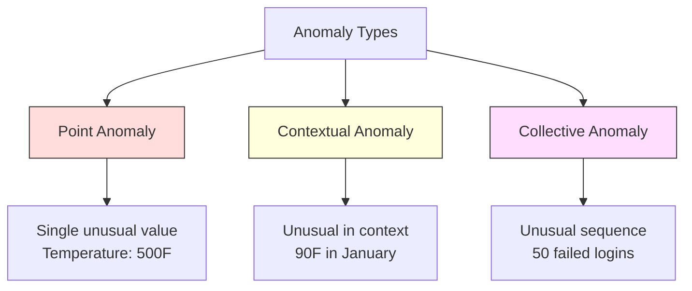
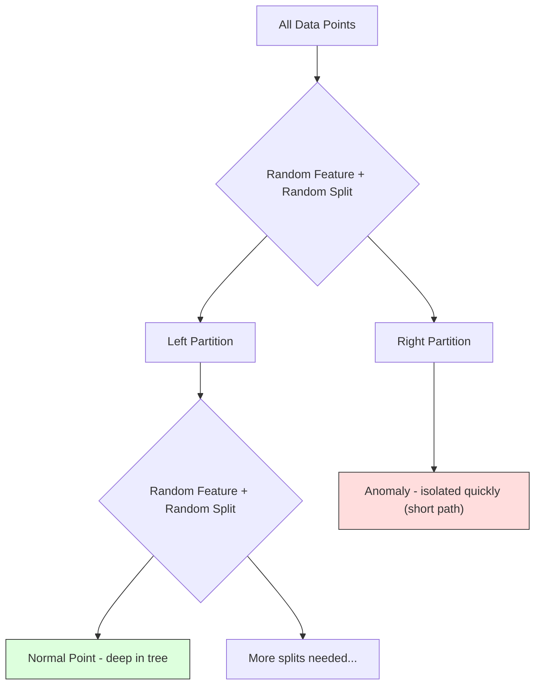
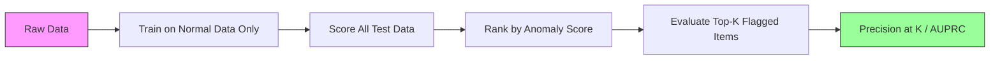

# विसंगतियों का पता लगाना
# 异常检测


> सामान्य को परिभाषित करना आसान है, असामान्य वह है जो फिट नहीं होता है।

> 正常易定义──不正常的就是不合适的──

**Type:** Build | **类型：** 构建
**Language:**पायथन**语言：**पायथन
**Prerequisites:** Phase 2, Lessons 01-09 | **前置知识：** Phase 2 第 1-9 课
**Time:** ~75 minutes | **时间：** 约 75 分钟

## सीखने के लक्ष्य

- Z-स्कोर, IQR और आइसोलेशन वन विसंगतियों का पता लगाने के तरीकों को खरोंच से लागू करें
  शून्य से प्राप्त करने से Z-स्कोर、IQR तथा पृथक्करण वन  असामान्य जांच विधि
- बिंदु, संदर्भ और सामूहिक विसंगतियों के बीच अंतर करें और प्रत्येक के लिए उपयुक्त पता लगाने की विधि चुनें
  区分点异常、上下文异常 एवं集合异常, प्रत्येक चयन के लिए उपयुक्त परीक्षण विधि
- समझाएं कि क्यों विसंगतियों की पहचान को विसंगतियों को वर्गीकृत करने के बजाय सामान्य डेटा का मॉडलिंग के रूप में ढांचा लगाया गया है
   समझाएँ कि क्यों असामान्य जांच सामान्य डेटा के निर्माण के लिए ढांचे में है और असामान्य की एक श्रेणी के लिए नहीं
- पर्यवेक्षण रहित विसंगतियों की पहचान की पर्यवेक्षण योग्य वर्गीकरण के साथ तुलना करें और नए विसंगतियों की कवरेज और सटीकता के बीच की तुलना का मूल्यांकन करें
  निरिक्षित असामान्य जांच और निरिक्षित वर्गीकरण की तुलना, नए असामान्य कवरेज दर और सटीकता दर का मूल्यांकन


> **【中文解读】**
> 异常检测找出不同数据点──信用卡欺诈检测、设备故障预警、网络入侵检测都依赖于它──孤立森林 和 一级SVM是常用方法──sklearn中的孤立森林──

> **【拓展：异常检测在金融和网络安全中的核心应用】**
> वीजा की वास्तविक समय धोखाधड़ी परीक्षण प्रणाली प्रति सेकंड लगभग 76,000 लेनदेन को संसाधित करती है, असामान्य परीक्षण + निगरानी सीखने के मिश्रित तरीके का उपयोग करती है, लगभग 150 मिलीसेकंड में यह निर्णय लेती है कि क्या धोखाधड़ी है। गूगल की वेब सुरक्षा प्रणाली असामान्य परीक्षण का उपयोग करती है डीडीओएस हमले और असामान्य लॉगिन व्यवहार का पता लगाता है।

## समस्या  समस्या परिचय

न्यूयॉर्क में दोपहर 2 बजे क्रेडिट कार्ड का उपयोग किया जाता है, फिर टोक्यो में दोपहर 2:05 बजे। एक कारखाने सेंसर 150 डिग्री पढ़ता है जब सामान्य रेंज 80-120 है। एक सर्वर प्रति सेकंड 50,000 अनुरोध भेजता है जब दैनिक औसत 200 है।

> एक张信用卡下午2点在纽约使用,然后在东京使用2:05 工厂传感器读数150°,而正常范围是80-120°,服务器每秒发送50,000 个请求,而日平均是200°.

ये विसंगति हैं, उन्हें ढूंढना मायने रखता है धोखाधड़ी अरबों डॉलर लागत है उपकरण विफलता समय लागत है नेटवर्क घुसपैठ लागत डेटा

> ये असामान्य हैं। इन्हें पता लगाना महत्वपूर्ण है। धोखाधड़ी से अरबों नुकसान हो रहे हैं। उपकरण के टूटने से समय रुक जाता है।

चुनौतीः आपने शायद ही कभी असामान्यता के उदाहरणों को लेबल किया है। धोखाधड़ी लेनदेन के 0.1% का प्रतिनिधित्व करती है। उपकरण विफलता साल में कुछ बार होती है। आप एक मानक वर्गीकरण को प्रशिक्षित नहीं कर सकते क्योंकि "अनोमेली" वर्ग में सीखने के लिए लगभग कुछ भी नहीं है। यहां तक कि अगर आपके पास कुछ लेबल हैं, तो आपने जो विसंगति देखी है, वे एकमात्र प्रकार नहीं हैं जिनका आप सामना करेंगे। कल की धोखाधड़ी योजना आज की तुलना में अलग दिखती है।

> 挑战在于:आपके पास बहुत कम असामान्य चिह्नों के नमूने हैं। धोखाधड़ी केवल 0.1% व्यापार का हिस्सा है। उपकरण खराबी प्रति वर्ष केवल कुछ ही बार होती है। आप मानक वर्गीकरण को प्रशिक्षित नहीं कर सकते हैं, क्योंकि "असामान्य" श्रेणी में लगभग कुछ भी नहीं सीख सकते हैं।

विसंगतियों का पता लगाने से समस्या उलट जाती है. क्या असामान्य है, इसके बजाय, क्या सामान्य है, सीखें। जो कुछ भी सामान्य से विचलित होता है, वह संदिग्ध है। यह बिना लेबल के काम करता है, नए प्रकार के विसंगतियों के अनुकूल होता है, और बड़े पैमाने पर डेटा सेट के लिए पैमाने पर होता है।

> 异常检测翻转了问题──不学"什么是异常",而是学"什么是正常"── किसी भी सामान्य से अलग होने वाली चीज का संदेह है── यह बिना किसी टैग के नए प्रकार के असामान्यता के अनुकूल है, और बड़े पैमाने पर डेटा संग्रह में विस्तारित है──

> **【中文解读】**
> 异常检测的关键思路反转:不学"什么是异常",而是学"什么是正常",偏离正常的就是可疑的.

## अवधारणा का मूल अवधारणा

### विसंगतियों के प्रकार

सभी विसंगतियों एक ही नहीं हैंः

> सभी असामान्य नहीं हैंः

- **Point anomalies.**एक एकल डेटा बिंदु जो संदर्भ के बावजूद असामान्य है. 500 डिग्री का तापमान रीडिंग।$50,000 from an account that normally spends $50।
  ️️️️️️️️️️️️️️️️️️️️️️️️️️️️️️️️️️️️️️️️️️️️️️️️️️️️️️️️️️️️️️️️️️️️️️️️️️️️️️️️️️️️️️️️️️️️️️️️️️️️️️️️️️️️️️️️️️️️️️️️️️️️️️️️️️️️️️️️️️️️️️️️️️️️️️️️️️️️️️️️️️️️️️️️️️️️️️️️️️️️️️️️️️️️️️️️️️️️️️️️️️️️️️️️
- **Contextual anomalies.**एक डेटा बिंदु जो संदर्भ के आधार पर असामान्य है 90 डिग्री का तापमान गर्मियों में सामान्य है, सर्दियों में असामान्य है। एक ही मूल्य, अलग संदर्भ।
  ऊपर नीचे असामान्य। नीचे नीचे नीचे असमानता के आंकड़े दिए गए हैं।
- **Collective anomalies.**एक अनुक्रम डेटा बिंदुओं है कि एक समूह के रूप में असामान्य है, भले ही प्रत्येक व्यक्तिगत बिंदु सामान्य हो सकता है. पांच लॉगिन विफलता सामान्य है. पचास एक पंक्ति में एक क्रूर बल हमले है.
  集合异常──一组数据点作为整体不正常,即使每单独的点可能是正常──五次登录失败正常──连续五十次就是暴力破解攻击──

अधिकांश विधियों में बिंदु विसंगतियों का पता लगाना होता है। संदर्भ विसंगतियों को समय या स्थान सुविधाओं की आवश्यकता होती है। सामूहिक विसंगतियों को अनुक्रम-जागरूक विधियों की आवश्यकता होती है।

> अधिकांश विधिएँ जाँच बिंदु असामान्य── ऊपर नीचे दिए गए असामान्य समय या स्थान विशेषताएँ── संग्रह असामान्य क्रम की आवश्यकता है संज्ञान विधि──



### अनियंत्रित फ्रेमिंग

मानक वर्गीकरण में, आपके पास दोनों वर्गों के लिए लेबल हैं। विसंगतियों का पता लगाने में, आपके पास आमतौर पर तीन स्थितियों में से एक हैः

> मानक वर्ग में, आपके पास दो श्रेणियों के लक्षण हैं। असामान्य परीक्षण में, आप आमतौर पर निम्नलिखित तीन स्थितियों में से एक का सामना करते हैंः

1. **Fully unsupervised.**आप सभी डेटा पर डिटेक्टर फिट और उम्मीद है कि विसंगतियों दुर्लभ है "सामान्य" मॉडल को भ्रष्ट नहीं करने के लिए पर्याप्त हैं।
   完全无监督──完全没有标签──आप सभी डेटा पर एक योग्य परीक्षक हैं, आशा है कि असामान्य पर्याप्त कम है ताकि यह "सामान्य" मॉडल को नष्ट न करे──
2. **Semi-supervised.**आप केवल सामान्य डेटा का एक साफ सेट है. आप इस साफ सेट पर फिट और बाकी सब कुछ स्कोर. यह सबसे मजबूत सेटअप जब संभव है.
   半监督──你只有一个干净的正常数据集──你在这个干净集合上适合,然后对所有其他数据打分──这是可能时最强的设置──
3. **Weakly supervised.**आपके पास कुछ लेबल किए गए विसंगतियों हैं. उन्हें मूल्यांकन के लिए उपयोग करें, प्रशिक्षण नहीं। बिना पर्यवेक्षण के प्रशिक्षित करें, फिर लेबल किए गए उपसमूह पर सटीकता / याद को मापें।
   弱监督──आपके पास कुछ निशानों के विसंगतियों हैं── इन्हें मूल्यांकन के लिए उपयोग करें, प्रशिक्षण के बजाय──无监督训练, फिर निशानों के सेट पर सटीकता दर/召回率 को मापें──

मुख्य अंतर्दृष्टिः विसंगतियों का पता लगाना वर्गीकरण से मौलिक रूप से अलग है. आप सामान्य डेटा के वितरण का मॉडल कर रहे हैं, न कि दो वर्गों के बीच निर्णय सीमा।

> 关键洞察: असामान्य जांच और वर्गीकरण में अंतर है।

### पर्यवेक्षित बनाम अनियंत्रितः व्यापार

यदि आपके पास असामान्यताओं का लेबल है, तो क्या आपको उन्हें प्रशिक्षण (निरीक्षण वर्गीकरण) के लिए या केवल मूल्यांकन (निरीक्षण रहित पता लगाने) के लिए उपयोग करना चाहिए?

> यदि आप वास्तव में चिह्नित असामान्यताओं के लिए, उन्हें प्रशिक्षण के लिए उपयोग करना चाहिए या केवल मूल्यांकन के लिए?

**Supervised (treat as classification):**
- आप पहले देखा है कि विसंगतियों की सटीक प्रकार को पकड़ता है
   आप पहले देखा है कि विशिष्ट प्रकार की असामान्य पकड़े
- ज्ञात विसंगतियों के प्रकारों पर अधिक सटीकता
  ज्ञात असामान्य प्रकारों के लिए अधिक सटीकता दर
- पूरी तरह से उपन्यास विसंगति प्रकारों को याद करता है
  完全错过新类型的异常
- नए विसंगतियों के प्रकारों के उद्भव के समय पुनर्व्यवस्था के लिए आवश्यक है
  जब नए असामान्य प्रकार के उद्भव होते हैं तो पुनः प्रशिक्षण की आवश्यकता होती है
- पर्याप्त असामान्य उदाहरणों की आवश्यकता होती है (अक्सर बहुत कम)
  需要足够的异常样本(通常太少)

**Unsupervised (model normal, flag deviations):**
- सामान्य से कोई विचलन, नए प्रकार सहित पकड़े
  न्यू टाइप सहित किसी भी विकृति को पकड़ना
- लेबल वाली असामान्यताओं की आवश्यकता नहीं है
                                                                                                                                                                                                                                                                
- उच्च झूठी सकारात्मक दर (असामान्य हर चीज बुरी नहीं होती)
  अधिक उच्च झूठी सकारात्मकता दर (जो कुछ भी असामान्य नहीं है वह बुरा है)
- वितरण शिफ्ट के लिए अधिक मजबूत
  वितरण पर स्थानांतरण

व्यवहार में, सर्वोत्तम प्रणालियों में दोनों ही शामिल हैंः व्यापक कवरेज के लिए अनियंत्रित पता लगाना, ज्ञात उच्च प्राथमिकता वाले विसंगतियों के प्रकार के लिए पर्यवेक्षित मॉडल, और अस्पष्ट मामलों के लिए मानव समीक्षा।

> अभ्यास में, सर्वोत्तम प्रणाली दो संयोजन हैंः बिना पर्यवेक्षण परीक्षण व्यापक रूप से व्यापक रूप से उपयोग किया जाता है, पर्यवेक्षण मॉडल ज्ञात उच्च प्राथमिकता वाले असामान्य प्रकार के लिए, कृत्रिम जांच मॉडल के लिए उपयोग की जाती है।

### Z-Score विधि

सबसे सरल दृष्टिकोण. प्रत्येक विशेषता के औसत और मानक विचलन की गणना करें. औसत से k मानक विचलन से अधिक किसी भी बिंदु को चिह्नित करें।

> सबसे सरल विधि है- प्रत्येक विशेषता के औसत और मानक अंतर की गणना करना। किसी भी विचलन के औसत मूल्य को अंकित करना जो कि मानक अंतर के एक बिंदु से अधिक है।

```text
z_score = (x - mean) / std
anomaly if |z_score| > threshold
```

डिफ़ॉल्ट थ्रेश 3.0 है (99.7% सामान्य डेटा एक गाउसियन वितरण के लिए 3 मानक विचलन के भीतर आता है) ।

> 默认值为3.0 ((高斯分布中99.7% के सामान्य डेटा में 3 मानक अंतर के भीतर गिरावट)

**Strengths:**सरल, तेज़, व्याख्या योग्य ("यह मान सामान्य से 4.5 मानक विचलन है") ।

> **优势：**简单――快速――可解释("यह मूल्य सामान्य से 4.5 个标准差偏离")

**Weaknesses:**यह मानता है कि डेटा सामान्य रूप से वितरित किया जाता है। प्रशिक्षण डेटा में असाधारण के प्रति संवेदनशील (असामान्य औसत को बदलते हैं और एसटीडी को बढ़ाते हैं, जिससे उन्हें पता लगाना मुश्किल हो जाता है) मल्टीमोडल वितरण पर विफलता।

> **劣势：**假设数据服从正态分布――训练数据中异常值敏感异常值会偏移平均值并膨胀标准差,使它们更难被检测) 多峰分布上失败

**When it works well:**एकल विशेषता निगरानी जहां डेटा लगभग घंटी के आकार में है सर्वर प्रतिक्रिया समय, विनिर्माण सहिष्णुता, स्थिर बेसलाइन के साथ सेंसर रीडिंग।

> **适用场景：**डाटा विशाल प्रस्तुत घंटों के आकार के एकल विशेषता निगरानी;; सर्वर प्रतिक्रिया समय,, निर्माण सार्वजनिक अंतर,, स्थिर आधार लाइन के साथ संवेदक पढ़ने;;

**When it fails:**मल्टी-क्लास्टर डेटा (दो कार्यालय स्थानों के साथ अलग-अलग बेसलाइन तापमान), विकृत डेटा (लेनदेन की मात्रा जहां $ 1000 दुर्लभ है लेकिन असामान्य नहीं), प्रशिक्षण सेट में असामान्य डेटा।

> **失效场景：**बहु बहु-वर्ग डेटा (दो कार्यालयों में अलग-अलग आधारभूत तापमान है) 偏斜数据 (एक हजार डॉलर की लेनदेन राशि दुर्लभ है लेकिन असामान्य नहीं है)  प्रशिक्षण केंद्रित है असामान्य मूल्य के साथ डेटा।

### आईक्यूआर विधि

Z-स्कोर से अधिक मजबूत. औसत और मानक विचलन के बजाय अंतर-क्वार्टिल सीमा का उपयोग करता है.

> Z-स्कोर से अधिक रूलबस. . .

```
Q1 = 25th percentile
Q3 = 75th percentile
IQR = Q3 - Q1
lower_bound = Q1 - factor * IQR
upper_bound = Q3 + factor * IQR
anomaly if x < lower_bound or x > upper_bound
```

डिफ़ॉल्ट कारक 1.5 है।

> 默认因子为 1.5──

**Strengths:**अप्रासंगिकता के लिए मजबूत (प्रतिशत चरम मानों से प्रभावित नहीं होते हैं) विकृत वितरण पर काम करता है। कोई सामान्यता धारणा नहीं है।

> **优势：**अपवादात्मक मूल्य के लिए, %位数 पर कोई प्रभाव नहीं पड़ता है।

**Weaknesses:**केवल एकतरफा (प्रत्येक विशेषता पर स्वतंत्र रूप से लागू होता है) । विशेषताओं को एक साथ विचार करने पर ही असामान्य असामान्यताओं का पता नहीं लगा सकता है (एक बिंदु प्रत्येक विशेषता में व्यक्तिगत रूप से सामान्य हो सकता है लेकिन संयुक्त स्थान में असामान्य हो सकता है) ।

> **劣势：**                                                                                                                                                                                                                                                              

**Practical note:**IQR में 1.5 कारक बॉक्स ग्राफ में दाढ़ी के अनुरूप है। दाढ़ी के बाहर बिंदु संभावित विकृति हैं। 1.5 के बजाय 3.0 का उपयोग करने से डिटेक्टर अधिक रूढ़िवादी (कम झंडे, कम झूठे सकारात्मक) बनाता है। सही कारक झूठे अलार्म के लिए आपकी सहनशीलता पर निर्भर करता है।

> **实践提示：**IQR में 1.5 कारक बॉक्स लाइन के प्रति उत्तरदायी हैं। इसके बाहर का बिंदु संभावित असामान्य मूल्य है। प्रयोग 3.0 के बजाय 1.5 करें ताकि परीक्षक अधिक संरक्षित हो।

### अलगाव वन

मुख्य अंतर्दृष्टि: विसंगतिएं कम और अलग हैं। डेटा के यादृच्छिक विभाजन में, विसंगतियों को अलग करना आसान है -- उन्हें बाकी से अलग करने के लिए कम यादृच्छिक विभाजन की आवश्यकता होती है।

> 关键洞察: विसंगति बहुत कम है और विभक्ति से भिन्न है। डेटा के आवक विभाजन में, विसंगति को अलग करना अधिक आसान है।



**How it works:**
1. कई यादृच्छिक पेड़ (एक अलगाव वन) बनाएं
   构建许多随机树 (बहुत सारे वृक्ष)
2. प्रत्येक नोड पर, एक यादृच्छिक विशेषता और सुविधा के न्यूनतम और अधिकतम के बीच यादृच्छिक विभाजन मूल्य चुनें
   प्रत्येक बिंदु पर, एक विशेषता और विशेषता न्यूनतम मूल्य और अधिकतम मूल्य के बीच एक विशेषता विभाजन मूल्य चुनें
3. तब तक विभाजित करना जारी रखें जब तक कि प्रत्येक बिंदु अलग न हो जाए (अपने स्वयं के पत्ते में)
    निरंतर विभाजन जब तक प्रत्येक बिंदु अलग नहीं हो जाते 
4. सभी पेड़ों में विसंगतियों की औसत पथ लंबाई कम होती है
   异常在所有树中平均路径长度更短

**Why it works:**सामान्य बिंदु घने क्षेत्रों में रहते हैं। अपने पड़ोसियों से एक को अलग करने के लिए कई यादृच्छिक विभाजन की आवश्यकता होती है। विसंगति दुर्लभ क्षेत्रों में रहती है। उन्हें अलग करने के लिए एक या दो यादृच्छिक विभाजन पर्याप्त हैं।

> **为什么有效：**एक विरक्त क्षेत्र में स्थित है। एक विरक्त क्षेत्र में स्थित है। एक विरक्त क्षेत्र में स्थित है।

विसंगति स्कोर सभी पेड़ों में औसत पथ लंबाई पर आधारित है, जो एक यादृच्छिक द्विआधारी खोज पेड़ की अपेक्षित पथ लंबाई से सामान्य है:

> 异常分数 सभी पेड़ों में औसत मार्ग की लंबाई पर आधारित है, जो कि क्रमशः द्विपक्षीय खोज पेड़ों की अपेक्षित मार्ग की लंबाई से एकीकरण हैः

```
score(x) = 2^(-average_path_length(x) / c(n))
```

कहाँ`c(n)`n नमूनों के लिए अपेक्षित पथ लंबाई है। 1 के पास स्कोर का अर्थ है विसंगति। 0.5 के पास स्कोर का अर्थ है सामान्य। 0 के पास स्कोर का अर्थ है बहुत सामान्य (घनता समूहों में गहराई) ।

> उनमें से `c(n)`∈ N 个样本的期望路径长度──分数接近 1 意义异常──分数接近 0.5 意义正常──分数接近 0 意义非常正常(位于密集聚类深处) 

**Strengths:**कोई वितरण परिकल्पना नहीं। उच्च आयामों में काम करता है। स्केल अच्छा (सॉब साइज में उपरेखीय क्योंकि प्रत्येक पेड़ एक उप-सॉब का उपयोग करता है) । मिश्रित विशेषता प्रकारों को संभालता है।

> **优势：**无分布假设──高维度适用──扩展性好样本量亚线性,因为每棵树使用子采样)──处理混合特征类型──

**Weaknesses:**घने क्षेत्रों में विसंगतियों के साथ संघर्ष (मास्किंग प्रभाव) । यादृच्छिक विभाजन कम प्रभावी होता है जब कई विशेषताएं अप्रासंगिक होती हैं।

> **劣势：**                                                                                                                                                                                                                                                              

**Key hyperparameters:**
- `n_estimators`अधिक वृक्ष अधिक स्थिर अंक देते हैं लेकिन धीमी गणना होती है।
  `n_estimators`: वृक्षों की संख्या 100 आमतौर पर पर्याप्त  अधिक वृक्ष अधिक स्थिर अनुपात देते हैं लेकिन गणना धीमी होती है
- `max_samples`: प्रति पेड़ के नमूने की संख्या. 256 मूल कागज में डिफ़ॉल्ट है. छोटे मानों से व्यक्तिगत पेड़ कम सटीक होते हैं लेकिन विविधता बढ़ जाती है. उप-सैंपलिंग है जो आइसोलेशन फॉरेस्ट तेजी से बनाता है - प्रत्येक पेड़ डेटा का एक छोटा अंश देखता है.
  `max_samples`: प्रत्येक पेड़ के नमूने संख्या  मूल निबंध मानता है 256  छोटे मूल्य से एक पेड़ पर्याप्त सटीक नहीं है लेकिन विविधता में वृद्धि  बच्चे के लिए अलग वन  तेजी से कारण  प्रत्येक पेड़ केवल डेटा का एक छोटा सा हिस्सा देखता है 
- `contamination`: विसंगतियों का अपेक्षित अंश. केवल सीमा निर्धारित करने के लिए प्रयोग किया जाता है. स्कोर को प्रभावित नहीं करता है।
  `contamination`: पूर्वानुमान के असामान्य अनुपात― केवल सेट करने के लिए उपयोग किया जाता हैमूल्य―

### स्थानीय आउटलियर फैक्टर (LOF)

LOF एक बिंदु के आसपास स्थानीय घनत्व की तुलना अपने पड़ोसियों के आसपास घनत्व से करता है। घने क्षेत्रों से घिरे एक दुर्लभ क्षेत्र में एक बिंदु असामान्य है।

> LOF एक बिंदु के आसपास की स्थानीय घनत्व की तुलना उसके पड़ोसी के आसपास की घनत्व से करेगा। घनी क्षेत्र के आसपास के दुर्लभ क्षेत्र में बिंदु असामान्य है।

**How it works:**
1. प्रत्येक बिंदु के लिए, अपने निकटतम पड़ोसियों के लिए खोजें
   对于每点,找到其近邻
2. स्थानीय पहुंच घनत्व की गणना करें (गोरबार कितना घनत्वपूर्ण है)
   计算局部可达密度 (अनुमानित क्षेत्र में अधिक घनत्व है)
3. प्रत्येक बिंदु की घनत्व की तुलना उसके पड़ोसियों की घनत्व से करें
   प्रत्येक बिंदु की घनत्व की तुलना उसके पड़ोसी की घनत्व से करें
4. यदि किसी बिंदु की घनत्व उसके पड़ोसियों की तुलना में बहुत कम है, तो यह एक असामान्य है
   यदि एक बिंदु की घनत्व उसके पड़ोसी से बहुत कम है, तो यह असामान्य बिंदु है

**LOF score:**
- LOF 1.0 के करीब का अर्थ है पड़ोसी के समान घनत्व (सामान्य)
  LOF  करीब 1.0 का अर्थ है पड़ोस की घनत्व के समान
- 1.0 से अधिक LOF का अर्थ है पड़ोसी की तुलना में कम घनत्व (संभावित रूप से असामान्य)
  LOF 1.0 से बड़ा है जिसका अर्थ है कि घनत्व पड़ोसी से कम है
- LOF 1.0 से अधिक (जैसे, 2.0+) का अर्थ है कि घनत्व काफी कम (संभावित विसंगति)
  LOF 远大于1.0(如2.0+) का अर्थ है घनत्व काफी कम है

"स्थानीय" भाग महत्वपूर्ण है. दो क्लस्टरों के साथ एक डेटा सेट पर विचार करेंः 1000 बिंदुओं का घना क्लस्टर और 50 बिंदुओं का एक दुर्लभ क्लस्टर। दुर्लभ क्लस्टर के किनारे पर एक बिंदु वैश्विक रूप से असामान्य नहीं है - इसमें 50 पड़ोसी हैं। लेकिन यह स्थानीय रूप से असामान्य है यदि इसके तत्काल पड़ोसी इससे अधिक घने हैं। LOF इस बारीकियों को कैप्चर करता है जो वैश्विक तरीकों से चूक जाते हैं।

> "स्थानीय" महत्वपूर्ण है। एक डेटासेट में दो समूहों के डेटासेट पर विचार करेंः एक 1000-बिंदु घनी समूह और एक 50-बिंदु दुर्लभ समूह। दुर्लभ समूह के किनारे का बिंदु समग्र असामान्य नहीं है। इसमें 50 पड़ोसी हैं। लेकिन यदि इसके निकट-अंतर में इसके मुकाबले अधिक घनी आबादी है, तो यह स्थानीय असामान्य है।

**Strengths:**स्थानीय विसंगतियों का पता लगाता है (बिंदु जो अपने पड़ोस में असामान्य हैं, भले ही वे वैश्विक स्तर पर असामान्य न हों) । विभिन्न घनत्व के समूहों पर काम करता है।

> **优势：**检测局部异常 (), जो कि आसपास के क्षेत्रों में असामान्य नहीं हैं, भले ही वे पूरे क्षेत्र में असामान्य न हों।

**Weaknesses:**बड़े डेटासेट पर धीमा (O(n^2) साफ़ कार्यान्वयन के लिए। k के विकल्प के प्रति संवेदनशील। बहुत उच्च आयामों में अच्छी तरह से काम नहीं करता (आयामीता की शाप दूरी की गणना को प्रभावित करती है) ।

> **劣势：**बड़े डेटाबेस पर गति धीमी (n^2)) ⋅ के प्रति चयन संवेदनशील (n^2) ⋅ बहुत उच्च आयाम पर प्रभाव बुरा (n^2) ⋅

### तुलना

| Method | Assumptions | Speed | Handles High Dims | Detects Local Anomalies |
|--------|------------|-------|-------------------|------------------------|
| Z-score | Normal distribution | Very fast | Yes (per feature) | No |
| IQR | None (per feature) | Very fast | Yes (per feature) | No |
| Isolation Forest | None | Fast | Yes | Partially |
| LOF | Distance is meaningful | Slow | Poorly | Yes |

### मूल्यांकन की चुनौतियां

विसंगतियों के डिटेक्टरों का मूल्यांकन वर्गीकरणकर्ताओं का मूल्यांकन करने से कठिन हैः

>  मूल्यांकन असामान्य परीक्षक मूल्यांकन वर्गीकरण से अधिक कठिनः

- **Extreme class imbalance.**0.1% विसंगतियों के साथ, सब कुछ के लिए "सामान्य" भविष्यवाणी 99.9% सटीकता देता है। सटीकता बेकार है।
  极端的类别不平衡──0.1% के असामान्य दर के तहत, सभी पूर्वानुमानों को "सामान्य" के रूप में 99.9% 准确率──准确率 बेकार है──
- **AUROC is misleading.**भारी असंतुलन के साथ, AUROC भले ही मॉडल व्यावहारिक सीमाओं पर अधिकांश विसंगतियों को याद कर सकता है।
  AUROC 具有误导性── गंभीर असंतुलन के दौरान, भले ही मॉडल व्यावहारिक मूल्य के नीचे अधिकांश असामान्यता से चूक गया हो, AUROC दिखता है कि यह अभी भी गलत है──
- **Better metrics:**Precision@k (शीर्ष k चिह्नित वस्तुओं में से, कितने वास्तविक विसंगतियों हैं), AUPRC (सटीक-पुनर्प्राप्त वक्र के तहत क्षेत्र), और एक निश्चित झूठी सकारात्मक दर पर वापस बुलाया।
  बेहतर सूचक: सटीकता@k(排名前 k 个标项 में से कुछ वास्तविक असामान्य हैं) AUPRC(精确率-召回率曲线下面积) और निश्चित假阳性率下召回率──



### विसंगतियों का पता लगाने की पाइपलाइन

व्यवहार में, विसंगतियों का पता लगाने इस कार्यप्रवाह का अनुसरण करता हैः

> अभ्यास में, असामान्य जांच निम्नलिखित कार्यप्रवाहों का पालन करती हैः

1. **Collect baseline data.**आदर्श रूप से, एक ऐसी अवधि जहां आप जानते हैं कि कोई (या बहुत कम) विसंगति नहीं है।
   收集基线数据── आदर्श रूप से, एक असामान्य अवधि है जिसे आप जानते हैं कि कोई नहीं है।
2. **Feature engineering.**कच्चे गुण और व्युत्पन्न गुण (रोलिंग सांख्यिकी, समय गुण, अनुपात) ।
   विशेषताएं इंजीनियरिंग── मूल विशेषताएं व्युत्पन्न विशेषताएं
3. **Train the detector.**मूल डेटा पर फिट। मॉडल सीखता है कि "सामान्य" कैसा दिखता है।
   训练检测器──在基线数据上拟合──模型学习"正常" के रूप में
4. **Score new data.**प्रत्येक नए अवलोकन को एक असामान्यता स्कोर मिलता है।
   नए डेटा के लिए एक अलग संख्या प्राप्त की गई।
5. **Threshold selection.**यह एक व्यावसायिक निर्णय हैः उच्च सीमा का मतलब कम झूठी अलार्म है लेकिन अधिक याद किए गए विसंगतियों।
   选择值――选择分数截断值―― यह एक व्यावसायिक निर्णय हैः उच्चतम值 का अर्थ है कम गलत रिपोर्टिंग लेकिन अधिक त्रुटि जांच――
6. **Alert and investigate.**फ्लैग किए गए अंक मानव समीक्षा या स्वचालित प्रतिक्रिया के लिए जाते हैं।
   सूचना और जांच हेतु सूचना या स्वचालित प्रतिक्रिया हेतु सूचना।
7. **Feedback collection.**इस आंकड़े का उपयोग डिटेक्टर का मूल्यांकन करने और समय के साथ सीमा को समायोजित करने के लिए करें।
   收集反── रिकॉर्ड मार्किंग项是真正的异常还是错误报道── इन डेटा मूल्यांकन परीक्षक का उपयोग करके समय के साथ अनुकूलन值──

पाइपलाइन कभी "कर नहीं जाती है।" डेटा वितरण बदलते हैं, नए विसंगतियों के प्रकार सामने आते हैं, और सीमाओं को समायोजित करने की आवश्यकता होती है। विसंगतियों का पता लगाने को एक जीवित प्रणाली के रूप में व्यवहार करें, एक बार मॉडल नहीं।

> 管线永远不会"完成"―― डाटा वितरण विस्थापन, नए असामान्य प्रकार की उपस्थिति, 值需要调整――将异常检测视为一个活系统,而不是一次性模型――

## इसे बनाओ, इसे पूरा करो।

> **【中文解读】**
> शून्य से तीन प्रकार के असामान्य परीक्षण विधि को प्राप्त करने सेःZ-स्कोर (उत्पादित किया गया है) (आधारभूत औसत और मानक अंतर पर आधारित है, जो निकटतम सामान्य वितरण के डेटा के अनुरूप है) (IQR) (आधारभूत चार-बिंदु दूरी पर आधारित है, असामान्य मान पर आधारित है) (आधारभूत वन) (आधारभूत चयन विशेषता और विभाजन बिंदु अलगाव डेटा बिंदु, असामान्य बिंदु औसत से कम विभाजन की आवश्यकता है) (आधारभूत वन उद्योग में सबसे आम अप्रयुक्त पर्यवेक्षण असामान्य परीक्षण विधि है)

> **【拓展：异常检测在 AIOps 和制造业中的应用】**
> माइक्रोसॉफ्ट एज़्यूर मॉनिटर का उपयोग असामान्य परीक्षण स्वचालित रूप से क्लाउड सेवा के प्रदर्शन असामान्य का पता लगाने; नेटफ्लिक्स का उपयोग असामान्य परीक्षण निगरानी प्रवाह सेवा के विभिन्न संकेतकों ((延迟、误报率等), दैनिक परीक्षण अरबों डेटा बिंदु; उत्पादन लाइनों में असामान्य परीक्षण का उपयोग करते हुए उपकरण विफलता का पता लगाने के लिए, विराम समय में 30% की कमी आएगी। असामान्य परीक्षण की मुख्य चुनौती नियंत्रण त्रुटि रिपोर्टिंग दर है बहुत अधिक त्रुटि रिपोर्टिंग से कर्मियों को सूचना "इम्यून" के लिए अनुमति देती है।
```figure
f3-anomaly-fence
```

## इसे बनाओ

कोड में `code/anomaly_detection.py`Z-स्कोर, IQR, और पृथक् वन को खरोंच से लागू करता है।

> `code/anomaly_detection.py`मध्य कोड ने शून्य से Z-स्कोर, IQR और आइसोलेशन फॉरेस्ट को प्राप्त किया है।

### Z-Score डिटेक्टर

```python
def zscore_detect(X, threshold=3.0):
    mean = X.mean(axis=0)
    std = X.std(axis=0)
    std[std == 0] = 1.0
    z = np.abs((X - mean) / std)
    return z.max(axis=1) > threshold
```

सरल और वेक्टरलाइज्ड। यदि कोई विशेषता सीमा से अधिक है तो एक बिंदु को ध्वजांकित करें।

> 简单且向量化── यदि कोई भी विशेषता 值 से अधिक है तो इस बिंदु को चिह्नित करें──

### आईक्यूआर डिटेक्टर

```python
def iqr_detect(X, factor=1.5):
    q1 = np.percentile(X, 25, axis=0)
    q3 = np.percentile(X, 75, axis=0)
    iqr = q3 - q1
    iqr[iqr == 0] = 1.0
    lower = q1 - factor * iqr
    upper = q3 + factor * iqr
    outside = (X < lower) | (X > upper)
    return outside.any(axis=1)
```

### शून्य से अलग वन

खरोंच से कार्यान्वयन अलग-अलग पेड़ बनाता है जो यादृच्छिक रूप से सुविधा स्थान को विभाजित करता हैः

> शून्य से निर्माण के लिए अलग-अलग स्थानों का निर्माण करना

```python
class IsolationTree:
    def __init__(self, max_depth):
        self.max_depth = max_depth

    def fit(self, X, depth=0):
        n, p = X.shape
        if depth >= self.max_depth or n <= 1:
            self.is_leaf = True
            self.size = n
            return self
        self.is_leaf = False
        self.feature = np.random.randint(p)
        x_min = X[:, self.feature].min()
        x_max = X[:, self.feature].max()
        if x_min == x_max:
            self.is_leaf = True
            self.size = n
            return self
        self.threshold = np.random.uniform(x_min, x_max)
        left_mask = X[:, self.feature] < self.threshold
        self.left = IsolationTree(self.max_depth).fit(X[left_mask], depth + 1)
        self.right = IsolationTree(self.max_depth).fit(X[~left_mask], depth + 1)
        return self
```

किसी बिंदु को अलग करने के लिए पथ की लंबाई उसके विसंगति स्कोर को निर्धारित करती है। कम पथ का अर्थ है अधिक विसंगति।

> एक बिंदु से अलग होने से पथ की लंबाई उसके असामान्य भागों की संख्या को निर्धारित करती है

`IsolationForest`वर्ग कई पेड़ों को लपेटता हैः

> `IsolationForest`类包装了多棵树:

```python
class IsolationForest:
    def __init__(self, n_estimators=100, max_samples=256, seed=42):
        self.n_estimators = n_estimators
        self.max_samples = max_samples

    def fit(self, X):
        sample_size = min(self.max_samples, X.shape[0])
        max_depth = int(np.ceil(np.log2(sample_size)))
        for _ in range(self.n_estimators):
            idx = rng.choice(X.shape[0], size=sample_size, replace=False)
            tree = IsolationTree(max_depth=max_depth)
            tree.fit(X[idx])
            self.trees.append(tree)

    def anomaly_score(self, X):
        avg_path = average path length across all trees
        scores = 2.0 ** (-avg_path / c(max_samples))
        return scores
```

सामान्यीकरण कारक `c(n)`यह n तत्वों के साथ द्विआधारी खोज पेड़ में असफल खोज की अपेक्षित पथ लंबाई है। यह बराबर है `2 * H(n-1) - 2*(n-1)/n`कहाँ`H`यह सामान्यीकरण सुनिश्चित करता है कि विभिन्न आकारों के डेटा सेटों के बीच स्कोर तुलनात्मक हैं।

> 归一化因子 `c(n)`∈ N 个元素 के द्विपक्षीय खोज वृक्ष में असफल खोज के अपेक्षित पथ की लंबाई── यह ∈ N ∈ N ∈ N ∈ N ∈ N ∈ N ∈ N ∈ N ∈ N ∈ N ∈ N ∈ N ∈ N ∈ N ∈ N ∈ N ∈ N ∈ N ∈ N ∈ N ∈ N ∈ N ∈ N ∈ N ∈ N ∈ N ∈ N ∈ N ∈ N ∈ N ∈ N ∈ N ∈ N ∈ N ∈ N ∈ N ∈ N ∈ N ∈ N ∈ N ∈ N ∈ N ∈ N ∈ N ∈ N ∈ N ∈ N ∈ N ∈ N ∈ N ∈ N ∈ N ∈ N ∈ N ∈ N ∈ N ∈ N ∈ N ∈ N ∈ N ∈ N ∈ N ∈ N ∈ N ∈ N ∈ N ∈ N ∈ N ∈ N ∈ N ∈ N ∈ N ∈ N ∈ N ∈ N ∈ N ∈ N ∈ N ∈ N ∈ N ∈ N ∈ N ∈ N ∈ N ∈ N ∈ N ∈ N        `2 * H(n-1) - 2*(n-1)/n`, उनमें से `H`यह एकीकरण विभिन्न आकारों के डेटासेट के बीच तुलनात्मक अंक सुनिश्चित करता है।

### डेमो परिदृश्य

कोड कई परीक्षण परिदृश्य उत्पन्न करता हैः

> 代码生成多个测试场景:

1. **Single cluster with outliers.**केंद्र से दूर इंजेक्शन के साथ 2D Gaussian क्लस्टर. सभी तरीकों यहाँ काम करना चाहिए.
   单聚类加异常值―― एक 2D 高聚类,远离中心处注入异常―― सभी विधियाँ इस परिदृश्य में काम कर सकती हैं――
2. **Multimodal data.**तीन समूहों के विभिन्न आकार और घनत्व के। समूहों के बीच बिंदु असामान्य हैं। Z-स्कोर संघर्ष क्योंकि प्रति विशेषता रेंज व्यापक हैं।
   कई शिखर डेटा। तीन अलग-अलग आकार और घनत्व के समूहों में से एक। समूहों के बीच के बिंदु असामान्य हैं।
3. **High-dimensional data.**50 विशेषताएं, लेकिन विसंगतियों उनमें से केवल 5 में भिन्न होते हैं। परीक्षण करता है कि क्या विधियों को विशेषताओं के एक उपसमूह में विसंगतियों का पता लगा सकता है।
   उच्च स्तर के आंकड़े ∙ 50 विशेषताएं, लेकिन विसंगति केवल 5 विशेषताओं पर भिन्न होती है ∙ परीक्षण विधि में विसंगति का पता लगाने के लिए विशेषताओं में केंद्रित है ∙

प्रत्येक डेमो में सटीकता, रिकॉल, F1 और Precision@k का उपयोग करके सभी तरीकों की तुलना की जाती है।

> प्रत्येक प्रस्तुति सटीकता दर, कॉल-बैक दर, F1 और Precision@k का उपयोग करें सभी तरीकों की तुलना करें

## इसे फ्रेमवर्क के साथ लागू करें

sklearn के साथ (पुस्तिका कार्यान्वयन का उपयोग करके, खरोंच से नहीं):

> उपयोग से शून्य से प्राप्त करने के लिए उपयोग से प्राप्त करने के लिए उपयोग से प्राप्त करने के लिए उपयोग से प्राप्त करने के लिए उपयोग से प्राप्त करने के लिए उपयोग से प्राप्त करने के लिए उपयोग से प्राप्त करने के लिए उपयोग से प्राप्त करने के लिए उपयोग से प्राप्त करने के लिए उपयोग से प्राप्त करने के लिए उपयोग से प्राप्त करने के लिए उपयोग से प्राप्त करने के लिए उपयोग से प्राप्त करने के लिए उपयोग से प्राप्त करने के लिए नहींः

```python
from sklearn.ensemble import IsolationForest
from sklearn.neighbors import LocalOutlierFactor

iso = IsolationForest(n_estimators=100, contamination=0.05, random_state=42)
iso.fit(X_train)
predictions = iso.predict(X_test)

lof = LocalOutlierFactor(n_neighbors=20, contamination=0.05, novelty=True)
lof.fit(X_train)
predictions = lof.predict(X_test)
```

नोट `contamination`यह सही ढंग से सेट करना मायने रखता है -- बहुत कम अपवादों को याद करता है, बहुत अधिक झूठी अलार्म बनाता है।

> ध्यान दें`contamination`设置预期异常比例──正确设置很重要太低会漏检异常,太高会产生错误报

कोड में `anomaly_detection.py`समान डेटा पर स्क्लेयर के साथ खरोंच से कार्यान्वयन की तुलना करता है।

> `anomaly_detection.py`मध्य कोड की तुलना शून्य से निष्पादन से कर दी गई है।

### स्क्लेयरन प्रदूषण पैरामीटर

`contamination`sklearn में पैरामीटर निरंतर विसंगति स्कोर को द्विआधारी भविष्यवाणियों में परिवर्तित करने के लिए सीमा निर्धारित करता है। यह अंतर्निहित स्कोर को नहीं बदलता है।

> sklearn 中的 `contamination`参数决定将连续异常分数转换为二值预测的值──它不改变底层分数──

```python
iso_5 = IsolationForest(contamination=0.05)
iso_10 = IsolationForest(contamination=0.10)
```

दोनों एक ही विसंगति स्कोर का उत्पादन.`iso_5`शीर्ष 5% को चिह्नित करता है जबकि `iso_10`यदि आप वास्तविक विसंगति दर नहीं जानते हैं (आप आमतौर पर नहीं करते हैं), तो प्रदूषण को "स्वचालित" पर सेट करें और सीधे कच्चे स्कोर के साथ काम करें। झूठे सकारात्मक और झूठे नकारात्मक के बीच लागत के बाजी के आधार पर अपनी सीमा निर्धारित करें।

>  दोनों में समान असामान्य तत्व होते हैं `iso_5`标记前 5%`iso_10`标记前 10%── यदि आप वास्तविक असामान्य दर को नहीं जानते हैं, तो प्रदूषण को "स्वचालित" के रूप में स्थापित करें और सीधे मूल अनुपात का उपयोग करें── मिथ्या सकारात्मकता और मिथ्या नकारात्मकता के बीच लागत तौल अपने स्वयं के मूल्य को निर्धारित करें──

### एक श्रेणी का एसवीएम

एक वर्ग एसवीएम एक उच्च आयामी सुविधा अंतरिक्ष में सामान्य डेटा के आसपास एक सीमा फिट करता है (कर्नल ट्रिक का उपयोग करके) ।

> एक और जानने योग्य अनियंत्रित असामान्य परीक्षक―एक-कक्षा एसवीएम उच्च-गुणवत्ता वाले अंतरिक्ष में सामान्य डेटा के आसपास एक सीमा के अनुरूप है।

```python
from sklearn.svm import OneClassSVM

oc_svm = OneClassSVM(kernel="rbf", gamma="auto", nu=0.05)
oc_svm.fit(X_train)
predictions = oc_svm.predict(X_test)
```

`nu`एक वर्ग एसवीएम छोटे से मध्यम डेटा सेट पर अच्छा काम करता है लेकिन बहुत बड़े डेटा के लिए स्केल नहीं करता है (कर्नल मैट्रिक्स चतुर्भुज बढ़ता है) ।

> `nu`参数近似异常比例――One-Class SVM मध्यम-छोटे डेटासेट पर अच्छा प्रभाव डालता है, लेकिन बहुत बड़े डेटा तक विस्तार नहीं कर सकता है(नक्लियर रक्चरिंग में दोहरी वृद्धि)

### ऑटोकोडर दृष्टिकोण (पूर्वावलोकन)

ऑटोकोडर तंत्रिका नेटवर्क हैं जो डेटा को संपीड़ित और पुनर्निर्माण करना सीखते हैं। सामान्य डेटा पर प्रशिक्षण। परीक्षण के समय, विसंगतियों में उच्च पुनर्निर्माण त्रुटि होती है क्योंकि नेटवर्क ने केवल सामान्य पैटर्न को पुनर्निर्माण करना सीखा है।

> स्वयं编码器 एक तंत्रिका नेटवर्क है जो सामान्य डेटा पर प्रशिक्षण देता है। परीक्षण के दौरान, असामान्यता में उच्च वजन संरचना त्रुटि होती है, क्योंकि नेटवर्क केवल सामान्य मोड को पुनः निर्माण करना सीखता है।

यह चरण 3 (डीप लर्निंग) में शामिल है, लेकिन सिद्धांत एक ही हैः मॉडल क्या सामान्य है, चिह्नित क्या विचलित है।

> यह चरण 3 में चर्चा है, लेकिन सिद्धांत एक ही हैः

### विसंगतियों का पता लगाने के लिए एक साथ

जैसे कि एंसेंबल विधियों से वर्गीकरण में सुधार होता है (पढ़ें 11) , कई विसंगतियों के डिटेक्टरों को जोड़कर पता लगाने में सुधार होता है। सबसे सरल दृष्टिकोणः

> जैसे कि एकीकरण विधि सुधार分类(第 11 课), कई असामान्य परीक्षक को संयोजन करके परीक्षण सुधार सकते हैंः

1. कई डिटेक्टर चलाएं (Z-स्कोर, IQR, आइसोलेशन फॉरेस्ट, LOF)
   运行多个检测器(Z-स्कोर、IQR、पृथक वन、LOF)
2. प्रत्येक डिटेक्टर के स्कोर को [0, 1] तक सामान्य करें
   प्रत्येक परीक्षक की संख्या को [0, 1] में बहाल करें
3. सामान्यीकृत स्कोर का औसत
   平均归归归归归归归归归归归归归归归归归归归归归归归归归归归归归归归归归归归归归归归归归归归归归归归归归归归归归归归归归归归归归归归归归归归归归归归归归归归归归归归归归归归归归归归归归归归归归归归归归归归归归归归归归归归归归归归归归归归归归归归归归归归归归归归归归归归归归归归归归归归归归归归归归归归归归归归归归归归归归归归归归归归归归归归归归归归归归归归归归归归归归归归归归归归归归归归归归归归归归归归归归归归归归归归归归归归归归归归归归归归归归归归归归归归归归归归归归归归归归归归归归归归归归归归归归归归归归归归归归归归归归归归归归归归归归归归归归归归归归归归归归归归归归归归归归归归归归归归归归归归归归归归归归归归归归归归归归归归归归归归归归归归归归归归归归归归归归归归归归归归归归归归归归归归归归归归归归归归归归归归归归归归归归归归归归归归归归归归归归归归归归归归归归归归归归归归归归归归归归归归归归归归归归归归归归归归归归归归归归归归归归归归归归归归归归归归归归归归归归归归归归归归归归归归归归归归归归归归归归归归归归归归归归归归归归归归归归归归归归归归归归归归归归归归归归归归归归归归归归归归归归归归归归归归归
4. औसत स्कोर पर सीमा से ऊपर के फ्लैग अंक
   标记平均分数超过值的点

यह गलत सकारात्मकता को कम करता है क्योंकि विभिन्न विधियों में अलग-अलग विफलता मोड होते हैं। चारों विधियों द्वारा चिह्नित एक बिंदु लगभग निश्चित रूप से विसंगति है। केवल एक द्वारा चिह्नित एक बिंदु उस विधि का एक विचित्र हो सकता है।

> यह गलत सकारात्मकता को कम करता है, क्योंकि विभिन्न तरीकों के अलग-अलग असफलता मॉडल होते हैं। सभी चार तरीकों द्वारा चिह्नित बिंदु लगभग निश्चित रूप से असामान्य होते हैं। केवल एक विधि द्वारा चिह्नित होने की संभावना केवल उस विधि की विशेषता है।

अधिक परिष्कृत इकाइयां प्रत्येक डिटेक्टर का वजन उसके अनुमानित विश्वसनीयता (यदि उपलब्ध हो तो ज्ञात विसंगतियों के साथ सत्यापन सेट पर मापा गया) द्वारा करती हैं।

> अधिक जटिल एकीकरण प्रत्येक परीक्षक के अनुमानित विश्वसनीयता में वृद्धि क्षमता (यदि संभव हो, तो ज्ञात असामान्य प्रमाणों के संग्रह पर माप)

### उत्पादन विचार

1. **Threshold drift.**डेटा वितरण के साथ, एक निश्चित सीमा अप्रचलित हो जाती है।
   मूल्य漂移── डेटा वितरण के साथ, स्थिर मूल्य पुराना हो जाता है── निगरानी असामान्य घटकों के वितरण तथा नियमित समायोजन──
2. **Alert fatigue.**बहुत सारे झूठे अलार्म और ऑपरेटर ध्यान देना बंद कर देते हैं। उच्च सीमा (कम, अधिक विश्वसनीय अलार्म) के साथ शुरू करें और विश्वास के निर्माण के रूप में इसे कम करें।
   告警疲劳──太多误报会让操作员不再关注──从高值开始(更少、更可靠的告警),随着信任建立再降低──
3. **Ensemble approach.**उत्पादन में, कई डिटेक्टरों को जोड़ें। एक बिंदु को केवल तभी चिह्नित करें जब कई विधियां सहमत हों कि यह असामान्य है। यह झूठे सकारात्मक को काफी कम करता है।
   集成方法──在生产中,组合多种检测器── केवल जब कई विधियाँ सहमत होती हैं तो असामान्य समय तक चिह्नित होते हैं── यह गलत सकारात्मकता को काफी कम करता है──
4. **Feature engineering.**कच्चे फीचर्स शायद ही कभी पर्याप्त होते हैं। रोलिंग सांख्यिकी, अनुपात, समय-से-पिछले घटना, और डोमेन-विशिष्ट सुविधाओं को जोड़ें। एक अच्छी सुविधा डिटेक्टर के चयन से अधिक मायने रखती है।
   विशेषताओं के लिए विशेषताओं को जोड़नाः विशेषताओं को जोड़नाः विशेषताओं को जोड़नाः विशेषताओं को जोड़नाः विशेषताओं को जोड़नाः विशेषताओं को जोड़नाः विशेषताओं को जोड़नाः विशेषताओं को जोड़नाः विशेषताओं को जोड़नाः विशेषताओं को जोड़नाः विशेषताओं को जोड़नाः विशेषताओं को जोड़नाः विशेषताओं को जोड़नाः विशेषताओं को जोड़नाः विशेषताओं को जोड़नाः विशेषताओं को जोड़नाः विशेषताओं को जोड़नाः विशेषताओं को जोड़नाः विशेषताओं को जोड़नाः विशेषताओं को जोड़नाः विशेषताओं को जोड़नाः विशेषताओं को जोड़नाः विशेषताओं को जोड़नाः विशेषताओं को जोड़नाः विशेषताओं को जोड़नाः विशेषताओं को जोड़नाः विशेषताओं को जोड़नाः विशेषताओं को जोड़नाः विशेषताओं को जोड़नाः विशेषताओं को जोड़नाः विशेषताओं को चुननाः
5. **Feedback loop.**जब ऑपरेटर चिह्नित वस्तुओं की जांच करते हैं और उन्हें पुष्टि या अस्वीकार करते हैं, तो उन्हें सिस्टम में वापस खिलाएं। समय के साथ लेबल किए गए डेटा को इल्यूवेट करने और डिटेक्टर को बेहतर बनाने के लिए एकत्र करें।
    चक्र  जब ऑपरेटर जांच चिह्नों को पुष्टि या निष्कासित करता है, तो  इनपुट प्रणाली  समय के साथ आंकड़ों को इकट्ठा करता है ताकि वे मूल्यांकन और सुधार कर सकें।

## इसे भेजें उत्पाद

इस पाठ से उत्पन्न होता हैः
- `outputs/skill-anomaly-detector.md`-- सही डिटेक्टर चुनने के लिए निर्णय लेने की क्षमता
  `outputs/skill-anomaly-detector.md` 选择合适检测器 के निर्णय लेने की कौशल
- `code/anomaly_detection.py`- Z-स्कोर, IQR, और स्कूलर तुलना के साथ शून्य से अलग वन
  `code/anomaly_detection.py` शून्य से प्राप्त Z-स्कोर,IQR तथा अलगाव वन,

### एक सीमा चुनना

अनियमितता स्कोर निरंतर है. आपको द्विआधारी निर्णय लेने के लिए एक सीमा की आवश्यकता है. यह एक व्यावसायिक निर्णय है, एक तकनीकी नहीं है.

> 异常分数是连续的. आपको दो-मूल्य निर्णय लेने के लिए एक 值 की आवश्यकता होती है. यह एक व्यावसायिक निर्णय है, तकनीकी निर्णय नहीं।

दो परिस्थितियों पर विचार करें:
- **Fraud detection.**धोखाधड़ी को याद करना महंगा है (चार्जबैक, ग्राहक का विश्वास) झूठे अलार्मों की जांच करने के लिए मानव विश्लेषक को 5 मिनट का खर्च आता है। अधिक धोखाधड़ी को पकड़ने के लिए सीमा को कम रखें, अधिक झूठे अलार्म स्वीकार करें।
  欺诈检测──漏检欺诈代价高昂(退款、客户信任)──误报需要分析师 5 分钟调查──设置低值以捕获更多欺诈,接受更多误报──
- **Equipment maintenance.**झूठी अलार्म का अर्थ है अनावश्यक बंद लागत$50,000. A missed failure means a $500,000 मरम्मत. इन लागतों को संतुलित करने के लिए सीमा निर्धारित करें.
  设备维护――误报意味着不必要的停机,成本50,000 美元――漏检故障意味着500,000 美元的维修――设置值以平衡这些成本――

दोनों ही मामलों में, इष्टतम सीमा गलत सकारात्मक और गलत नकारात्मक के बीच लागत अनुपात पर निर्भर करती है। विभिन्न सीमाओं पर सटीकता और याद दिलाना, लागत फ़ंक्शन को ओवरलैप करना और न्यूनतम लागत बिंदु चुनना।

> दो मामलों में, सर्वोत्तम मूल्य मिथ्या सकारात्मक और मिथ्या नकारात्मक के बीच लागत अनुपात पर निर्भर करता है।

### उत्पादन के लिए स्केलिंग

उत्पादन में वास्तविक समय में विसंगतियों का पता लगाने के लिएः

> 对于生产中的实时异常检测:

1. **Batch training, online scoring.**हाल के सामान्य आंकड़ों पर मॉडल को नियमित रूप से (दैनिक, साप्ताहिक) प्रशिक्षित करें। प्रत्येक नए अवलोकन के आने के साथ स्कोर करें।
   批量训练,在线打分──定期(每天、每周) हाल के समय में सामान्य डेटा पर प्रशिक्षण मॉडल── प्रत्येक नई अवलोकन तक पहुंचने का समय打分──
2. **Feature computation must match.**यदि आप 30 दिनों से अधिक समय के लिए रॉलिंग सांख्यिकी के साथ प्रशिक्षित हैं, तो आपको एक नए अवलोकन के लिए सुविधाओं की गणना करने के लिए 30 दिनों के इतिहास की आवश्यकता है। आवश्यक इतिहास बफर करें।
   विशेषताएं गणना करना आवश्यक है। यदि आप 30 दिनों के रोलआउट स्टैटिस्टिक्स प्रशिक्षण का उपयोग करते हैं, तो आपको नए अवलोकन गणना सुविधाओं के लिए 30 दिनों की आवश्यकता होगी।
3. **Score distribution monitoring.**समय के साथ विसंगति स्कोर के वितरण का ट्रैक करें. यदि मध्य स्कोर ऊपर की ओर बढ़ता है, तो या तो डेटा बदल रहा है या मॉडल पुराना है।
   विभाजन वितरण निगरानी  समय के साथ अनियमित विभाजन का पालन करें  यदि मध्य बिंदु ऊपरी भाग में भटकते हैं, तो डेटा बदल रहा है, या मॉडल पुराना हो गया है 
4. **Explainability.**जब आप किसी विसंगति को चिह्नित करते हैं, तो बताएं कि क्यों। Z-स्कोरः "गुण X सामान्य से 4.2 मानक विचलन है।" अलगाव वनः "यह बिंदु औसतन 3.1 विभाजन में अलग किया गया था (सामान्य अंक 8.5 लेते हैं) ।"
   可解释性──当你标记异常时,说明原因──Z-score:"特征 X 高于正常 4.2 个标准差──"पृथक वन:"该点平均被 3.1 次分隔离(正常点需要 8.5 次) 』"

## अभ्यास विषय

1. **Threshold tuning.**Z-स्कोर डिटेक्टर को 0.5 के चरणों में 1.0 से 5.0 तक के सीमाओं के साथ चलाएं। प्रत्येक सीमा पर सटीकता और याद रखें। आपके डेटा के लिए सबसे अच्छा बिंदु कहां है?
   1. सामान्य स्थिति में विभिन्न अनुपातों में असामान्यताएं दर्ज करें (%1,5%,10%)  तुलना Z-स्कोर,IQR और आइसोलेशन फॉरेस्ट की सटीकता और पुनः प्राप्ति दर

2. **Multivariate anomalies.**2D डेटा बनाएं जहां प्रत्येक विशेषता व्यक्तिगत रूप से सामान्य दिखती है, लेकिन संयोजन असामान्य है (उदाहरण के लिए, मुख्य क्लस्टर विकर्ण से दूर बिंदु) । दिखाएं कि प्रति विशेषता Z-स्कोर इन को याद करता है लेकिन अलगाव वन उन्हें पकड़ता है।
   2. 生成一个上下文异常数据集 ({{comment) 冬季和夏季不同的正常值}})                                                                                                                                                                                                                                                 

3. **LOF from scratch.**k- निकटतम पड़ोसियों का उपयोग करके स्थानीय आउटलिअर कारक को लागू करें। उसी डेटा पर sklearn के स्थानीय आउटलिअर कारक की तुलना करें। k=10 और k=50 का उपयोग करें - k का चयन परिणामों को कैसे प्रभावित करता है?
   3. 构建隔离森林的集成:训练10个隔离树,取平均路径长度──单树与集成的稳定性──

4. **Streaming anomaly detection.**स्ट्रीमिंग सेटिंग में काम करने के लिए Z-स्कोर डिटेक्टर को संशोधित करेंः नए बिंदुओं के आने के साथ चल रहे औसत और भिन्नता को अपडेट करें (वेल्फोर्ड का ऑनलाइन एल्गोरिथ्म) । एक ही डेटा पर बैच Z-स्कोर की तुलना करें।
   4. ऑटोकोडर के साथ सोच-विचार के लिए असामान्य परीक्षणः एक सरल पुनः निर्माण मॉडल का प्रशिक्षण, असामान्य के लिए एक बिंदु के साथ पुनः निर्माण त्रुटि का अंकन करें।

5. **Real-world evaluation.**ज्ञात असामान्यताओं के साथ एक डेटासेट लें (जैसे, कैगले से क्रेडिट कार्ड धोखाधड़ी) सटीकता@100, सटीकता@500 और AUPRC का उपयोग करके सभी चार तरीकों का मूल्यांकन करें। कौन सी विधि सबसे अच्छी तरह से काम करती है? क्यों?

> **【中文解读】**
> 异常检测的评估使用Precision@K(排名 K 个可疑案例中多少是真正的异常) और AUPRC(精确率-召唤率曲线下面积) सटीकता दर से अधिक सार्थक है。

## कीवर्ड्स  शब्द खोज तालिका

| Term | What people say | What it actually means |
|------|----------------|----------------------|
| Anomaly | "Outlier, unusual point" | A data point that deviates significantly from the expected pattern of normal data |
| Point anomaly | "A single weird value" | An individual observation that is unusual regardless of context |
| Contextual anomaly | "Normal value, wrong context" | An observation that is unusual given its context (time, location, etc.) but might be normal in another context |
| Isolation Forest | "Random splits to find outliers" | An ensemble of random trees that isolates anomalies with fewer splits than normal points |
| Local Outlier Factor | "Compare density to neighbors" | A method that flags points whose local density is much lower than their neighbors' density |
| Z-score | "Standard deviations from mean" | (x - mean) / std, measuring how far a point is from the center in units of standard deviation |
| IQR | "Interquartile range" | Q3 - Q1, measuring the spread of the middle 50% of data, used for robust outlier detection |
| Contamination | "Expected fraction of anomalies" | A hyperparameter telling the detector what proportion of the data it should flag as anomalous |
| Precision@k | "Of the top k flags, how many are real" | Precision computed on only the k most suspicious points, useful for imbalanced anomaly detection |
| AUPRC | "Area under precision-recall curve" | A metric that summarizes precision-recall performance across all thresholds, better than AUROC for imbalanced data |

## आगे पढ़ना 延伸閱讀

- [Liu et al., Isolation Forest (2008)](https://cs.nju.edu.cn/zhouzh/zhouzh.files/publication/icdm08b.pdf)-- मूल आइसोलेशन फॉरेस्ट पेपर
  [Liu et al.: Isolation Forest (2008)](https://ieeexplore.ieee.org/document/4781136)- अलगाव वन
- [Breunig et al., LOF: Identifying Density-Based Local Outliers (2000)](https://dl.acm.org/doi/10.1145/342009.335388)-- मूल LOF पेपर
  [Chandola et al.: Anomaly Detection: A Survey (2009)](https://dl.acm.org/doi/10.1145/1541880.1541882)- 异常检测综述
- [scikit-learn Outlier Detection docs](https://scikit-learn.org/stable/modules/outlier_detection.html)-- सभी स्क्लेयरन विसंगति डिटेक्टरों का अवलोकन
  [scikit-learn 异常检测](https://scikit-learn.org/stable/modules/outlier_detection.html)
- [Chandola et al., Anomaly Detection: A Survey (2009)](https://dl.acm.org/doi/10.1145/1541880.1541882)-- विसंगतियों का पता लगाने के तरीकों का व्यापक सर्वेक्षण
- [Goldstein and Uchida, A Comparative Evaluation of Unsupervised Anomaly Detection Algorithms (2016)](https://journals.plos.org/plosone/article?id=10.1371/journal.pone.0152173)-- वास्तविक डेटा सेट पर 10 विधियों की अनुभवजन्य तुलना
