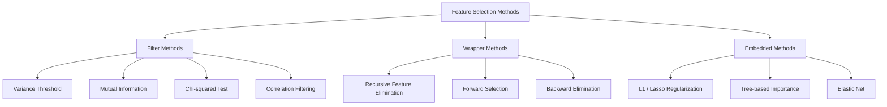
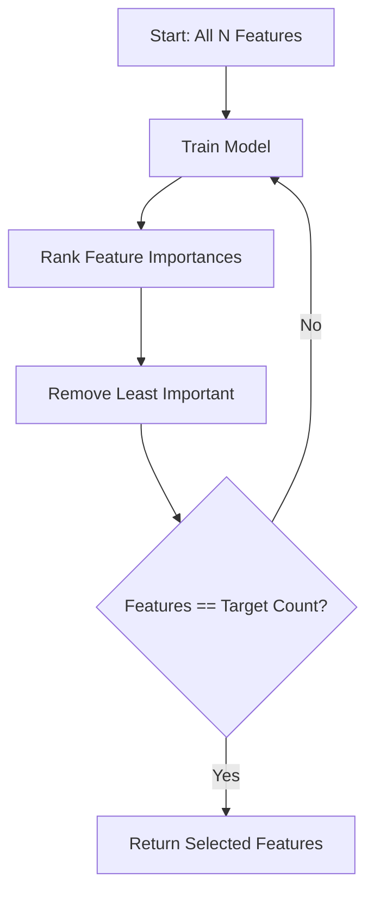
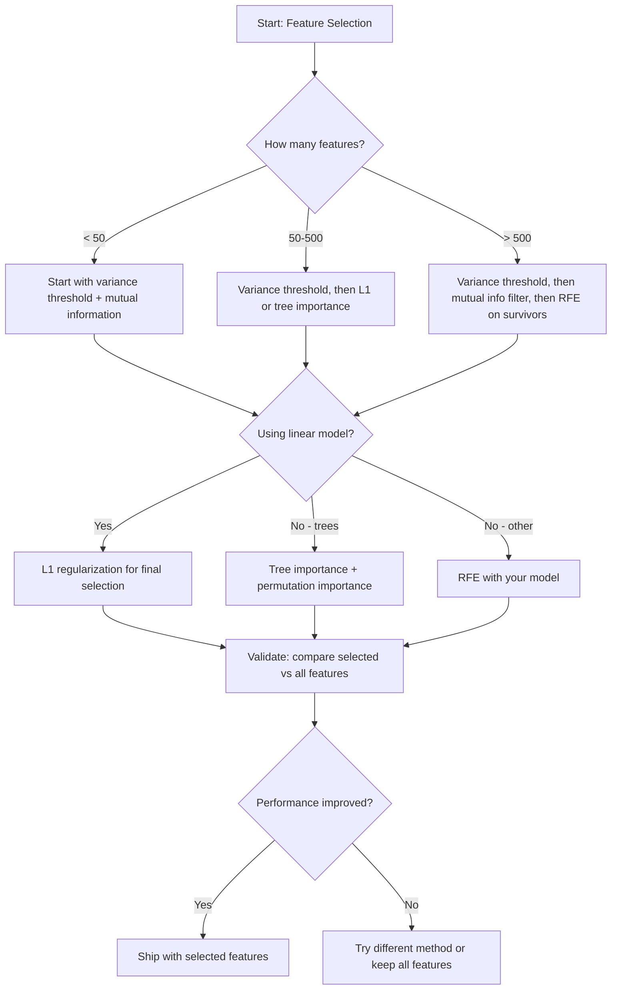

# विशेषता चयन
# विशेषता चयन


> अधिक सुविधाएँ बेहतर नहीं हैं, सही सुविधाएँ बेहतर हैं।

> विशेषताएँ अधिक से अधिक नहीं हैं।

**Type:** Build | **类型：** 构建
**Language:**पायथन**语言：**पायथन
**Prerequisites:** Phase 2, Lessons 01-09, 08 (feature engineering) | **前置知识：** Phase 2 第 1-9 课、第 8 课（特征工程）
**Time:** ~75 minutes | **时间：** 约 75 分钟

## सीखने के लक्ष्य

- फ़िल्टर विधियों (वॉरिएंट सीमा, पारस्परिक सूचना, चि-क्वायर) और रैपिंग विधियों (आरएफई, आगे चयन) को खरोंच से लागू करें
  शून्य से प्राप्त करने के लिए (अनुमानित)
- समझाएं कि आपसी सूचनाओं में क्यों गैर-रेखीय विशेषता-लक्ष्य संबंध हैं, जो कि सहसंबंध में चूक जाते हैं
   समझाएँ कि परस्पर सूचनाएँ क्यों संबंध को पकड़ सकती हैं  गलतियों के अभाज्य लक्षण-उद्देश्य संबंध
- L1 नियमितता (बंद चयन) की तुलना RFE (वॉलपेपर चयन) से करें और उनके कम्प्यूटेशनल ट्रेडऑफ का मूल्यांकन करें
  तुलना करें L1 正则化 (嵌入选择) और RFE (包装选择)
- एक सुविधा चयन पाइपलाइन का निर्माण करें जो कई तरीकों को जोड़ता है और बनाए गए डेटा पर बेहतर सामान्यीकरण प्रदर्शित करता है
  ् ् ् ् ् ् ् ् ् ् ् ् ् ् ् ् ् ् ् ् ् ् ् ् ् ् ् ् ् ् ् ् ् ् ् ् ् ् ् ् ् ् ् ् ् ् ् ् ् ् ् ् ् ् ् ् ् ् ् ् ् ् ् ् ् ् ् ् ् ् ् ् ् ् ् ् ् ् ् ् ् ् ् ् ् ् ् ् ् ् ् ् ् ् ् ् ् ् ् ् ् ् ् ् ् ् ् ् ् ् ् ् ् ् ् ् ् ् ् ् ् ् ् ् ् ् ् ् ् ् ् ् ् ् ् ् ् ् ् ् ् ् ् ् ् ् ् ् ् ् ् ् ् ् ् ् ् ् ् ् ् ् ् ् ् ् ् ् ् ् ् ् ् ् ् ् ् ् ् ् ् ् ् ् ् ् ् ् ् ् ् ् ् ् ् ् ् ् ् ् ् ् ् ् ् ् ् ् ् ् ् ् ् ् ् ् ् ् ् ् ् ् ् ् ् ् ् ् ् ् ् ् ् ् ् ् ् ् ् ् ् ् ् ् ् ् ् ् ् ् ् ् ् ् ्


> **【中文解读】**
> विशेषता चयन कई विशेषताओं में से सबसे उपयोगी उपखंडों को चुनें।

> **【拓展：特征选择在工业界的重要性】**
> वित्तीय वेंटिलेशन मॉडल में, नियामक आवश्यकता मॉडल समझाया जा सकता है कि प्रत्येक विशेषता क्यों चुना गया है। L1 औपचारिककरण (Lasso) स्वचालित रूप से महत्वपूर्ण विशेषताओं के वजन को शून्य तक संकुचित करेगा, साथ ही विशेषता चयन और मॉडल प्रशिक्षण को प्राप्त करेगा। जीन अभिव्यक्ति विश्लेषण में, 20,000 जीन में से 50 महत्वपूर्ण जीन को न केवल मॉडल प्रदर्शन में सुधार करने के लिए चुना गया है, बल्कि रोग तंत्र के अध्ययन के लिए संकेत प्रदान किया गया है। नेटफ्लिक्स पुरस्कार जीतने वाले कार्यक्रम में, विशेषता चयन कई मिलियन उम्मीदवार लक्षणों को कम करके सैकड़ों तक कम कर देगा।

## समस्या  समस्या परिचय

आपके पास 500 विशेषताएं हैं. आपका मॉडल धीरे-धीरे ट्रेन करता है, लगातार ओवरफिट करता है, और कोई भी यह समझ नहीं सकता कि उसने क्या सीखा है। आप प्रदर्शन में सुधार की उम्मीद में अधिक विशेषताएं जोड़ते हैं। यह बदतर होता है।

> आपके पास 500 विशेषताएं हैं। मॉडल प्रशिक्षण धीमा है, लगातार अनुकूलित है, कोई भी यह समझा नहीं सकता कि यह क्या सीखा है। आप अधिक विशेषताएं जोड़ते हैं और प्रदर्शन में सुधार करना चाहते हैं। परिणाम और भी खराब हैं।

यह कार्रवाई में आयामीता का अभिशाप है। जैसा कि सुविधाओं की संख्या बढ़ जाती है, सुविधाओं की जगह की मात्रा विस्फोट होती है। डेटा बिंदु दुर्लभ हो जाते हैं। बिंदुओं के बीच दूरी अभिसरण होती है। मॉडल को वास्तविक पैटर्न खोजने के लिए तेजी से अधिक डेटा की आवश्यकता होती है। शोर सुविधाएं सिग्नल सुविधाओं को डूब देती हैं। ओवरफitting डिफ़ॉल्ट बन जाता है।

> यह आयाम की शाप का वास्तविक संचालन है। विशेषता संख्या में वृद्धि के साथ, विशेषता अंतरिक्ष के आकार में विस्फोट। डेटा बिंदुओं के बीच की दूरी कम होती है।

फ़ीचर चयन एंटीडोट है. शोर को दूर करें. रिडंडेंसी को हटा दें. उन फ़ीचरों को बनाए रखें जो लक्ष्य के बारे में वास्तविक जानकारी ले जाते हैं। परिणामः तेजी से प्रशिक्षण, बेहतर सामान्यीकरण, और मॉडल जो आप वास्तव में समझा सकते हैं।

> विशेषता चयन है हलवाई। आवाज हटाएं। लापरवाही हटाएं। लक्ष्य जानकारी के वास्तविक लक्षणों को बनाए रखें। परिणाम यह हैः तेजी से प्रशिक्षण, बेहतर सामान्यीकरण, तथा आप वास्तव में समझा सकते हैं मॉडल।

लक्ष्य सभी उपलब्ध सूचनाओं का उपयोग करना नहीं है, बल्कि सही जानकारी का उपयोग करना है।

>  लक्ष्य सभी उपलब्ध सूचनाओं का उपयोग नहीं करना है।

> **【中文解读】**
> विशेषता चयन तीन प्रकार के तरीकों में से प्रत्येक में फायदे हैंः ओवर法 (उपयोग विधि) (सबसे तेज़ लेकिन विशेषताओं के बीच के अंतर को अनदेखा करने का तरीका); पैकेज विधि (पैकअप विधि) (पैकअप विधि) (पैकअप विधि) (पैकअप विधि) (पैकअप विधि) (पैकअप विधि) (पैकअप विधि) (पैकअप विधि) (पैकअप विधि) (पैकअप विधि) (पैकअप विधि) (पैकअप विधि) (पैकअप विधि) (पैकअप विधि) (पैकअप विधि) (पैकअप विधि) (पैकअप विधि) (पैकअप विधि) (पैकअप विधि) (पैकअप विधि) (पैकअप विधि) (पैकअप विधि) (पैकअप विधि) (पैकअप विधि) (पैकअप विधि) (पैकअप विधि) (पैकअप विधि) (पैकअप विधि) (पैकअप विधि) (पैकअप विधि) (पैकअप विधि) (पैकअप विधि) (पैकअप विधि) (पैकअप विधि) (पैकअप विधि) (पैकअप विधि) (पैकअप विधि) (पैकअप विधि) (पैकअप विधि) (पैकअप विधि) (पैकअप विधि) (पैकअप विधि) (पैकअप विधि) (पैकअप विधि) (पैकअप विधि) (पैकअप विधि) (पैकअप विधि) (पैकअप विधि) (पैकअप विधि) (पैकअप विधि) (पैकअप विधि) (पैकअप विधि) (पैकअप विधि) (पैकअप विधि) (पैकअप विधि) (पैकअप विधि) (पैकअप विधि) (पैकअप विधि) (पैकअप विधि) (पैकअप विधि) (पैकअप विधि) (पैकअप विधि) (पैकअप विधि) (पैकअप विधि) (पैकअप विधि) (पैकअप विधि) (पैकअप विधि) (पैकअप) (पैकअप) (पैकअप) (क) (क) (क) (क) (क) (क) (क) (क) (क) (क) (क) (क) (क) (क) (क) (क) (

## अवधारणा का मूल अवधारणा

### विशेषता चयन की तीन श्रेणियाँ

प्रत्येक विशेषता चयन विधि तीन श्रेणियों में से एक में आती हैः

> प्रत्येक विशेषता चयन विधि निम्नलिखित तीन श्रेणियों में से एक में से एक हैः



**Filter methods**वे एक मॉडल का उपयोग नहीं करते हैं। तेजी से, लेकिन वे सुविधाओं के इंटरैक्शन को याद करते हैं।

> **过滤法**उपयोग सांख्यिकीय माप प्रत्येक विशेषता के लिए स्वतंत्र रूप से मूल्यांकन किया गया है।

**Wrapper methods**एक मॉडल को फीचर सबसेट का मूल्यांकन करने के लिए प्रशिक्षित करें। वे मॉडल प्रदर्शन का उपयोग स्कोर के रूप में करते हैं। बेहतर परिणाम, लेकिन महंगा क्योंकि वे मॉडल को कई बार फिर से प्रशिक्षित करते हैं।

> **包装法** प्रशिक्षण मॉडल लक्षणों के समूह का मूल्यांकन करने के लिए ∞ का उपयोग करें ∞ का उपयोग करें ∞ का उपयोग करें ∞ का उपयोग करें ∞ का उपयोग करें ∞ का उपयोग करें ∞ का उपयोग करें ∞ का उपयोग करें ∞ का उपयोग करें ∞ का उपयोग करें ∞ का उपयोग करें ∞ का उपयोग करें ∞ का उपयोग करें ∞ का उपयोग करें ∞ का उपयोग करें ∞ का उपयोग करें ∞ का उपयोग करें ∞ का उपयोग करें ∞ का उपयोग करें ∞ का उपयोग करें ∞ का उपयोग करें ∞ का उपयोग करें ∞ का उपयोग करें ∞ का उपयोग करें ∞ का उपयोग करें ∞ का उपयोग करें ∞ का उपयोग करें ∞ का उपयोग करें ∞ का उपयोग करें ∞ का उपयोग करें ∞ का उपयोग करें ∞ का उपयोग करें ∞ का उपयोग करें ∞ का उपयोग करें ∞ का उपयोग करें ∞ का उपयोग करें ∞ का उपयोग करें ∞ का उपयोग करें ∞ का उपयोग करें ∞ का उपयोग करें ∞ का उपयोग करें ∞ का उपयोग करें ∞ का उपयोग करें ∞ का उपयोग करें ∞ का उपयोग करें ∞ का उपयोग करें ∞ का उपयोग करें ∞ का उपयोग करें ∞

**Embedded methods**मॉडल प्रशिक्षण के हिस्से के रूप में सुविधाओं का चयन करें। L1 नियमितता वजन को शून्य तक ले जाती है। निर्णय के पेड़ सबसे उपयोगी सुविधाओं पर विभाजित होते हैं। चयन फिटिंग के दौरान होता है, एक अलग चरण के रूप में नहीं।

> **嵌入法**मॉडल प्रशिक्षण प्रक्रिया में विशेषता चयन करना। L1 विधिबद्धता में वजन शून्य में संचालित किया जाएगा। निर्णय वृक्ष सबसे उपयोगी विशेषताओं पर विभाजित होता है। चयन एक अलग चरण के रूप में नहीं, बल्कि एकीकरण प्रक्रिया में होता है।

### भिन्नता की सीमा

यदि किसी विशेषता में नमूना के बीच थोड़ा भिन्नता है, तो इसमें लगभग कोई जानकारी नहीं है।

> सबसे सरल फ़िल्टरों में से एक है। यदि एक विशेषता नमूना में लगभग अपरिवर्तित है, तो यह लगभग कोई जानकारी नहीं ले जाती है।

एक विशेषता विचार करें जो 1000 नमूनों में से 999 के लिए 0.0 है. इसका भिन्नता शून्य के करीब है. कोई भी मॉडल वर्गों के बीच अंतर करने के लिए इसका उपयोग नहीं कर सकता है. इसे हटा दें।

>  विचार करें कि एक 1000 ऩम में से 999 ऩम में 0.0 के गुण हैं इसका आयाम शून्य के निकट है कोई मॉडल इसका उपयोग वर्गों में अंतर करने के लिए कर सकता है इसे हटा सकता है

```
variance(x) = mean((x - mean(x))^2)
```

एक सीमा निर्धारित करें (जैसे, 0.01) । इसके नीचे भिन्नता वाले प्रत्येक फीचर को छोड़ दें। यह लक्ष्य चर को देखने के बिना स्थिर या लगभग स्थिर फीचर्स को हटा देता है।

>  एक मूल्य सेट करें  जैसे 0.01)  हटाएँ  प्रत्येक विशेषता से कम है  यह लक्ष्य परिवर्तन को देखने की पूरी आवश्यकता नहीं है  जब तक कि निरंतर या निकटतम निरंतरता की विशेषता को हटाया जा सके 

इसका उपयोग कब करना हैः अन्य तरीकों से पहले पूर्व प्रसंस्करण चरण के रूप में। यह स्पष्ट रूप से शून्य लागत पर बेकार सुविधाओं को पकड़ता है।

> किस समय उपयोगः अन्य तरीकों से पहले पूर्व प्रसंस्करण चरणों के रूप में।

सीमाः एक विशेषता में उच्च भिन्नता हो सकती है और फिर भी शुद्ध शोर हो सकता है। भिन्नता सीमा आवश्यक है लेकिन पर्याप्त नहीं है।

> सीमांकनः एक विशेषता में उच्चतर भिन्नता हो सकती है लेकिन यह अभी भी शुद्ध शोर है।

### परस्पर सूचना

पारस्परिक सूचना यह मापती है कि विशेषता X के मूल्य को जानने से लक्ष्य Y के बारे में अनिश्चितता कम होती है।

> 互信息衡量知道特征 X का मूल्य लक्ष्य Y की अनिश्चितता को किस हद तक कम कर सकता है

```
I(X; Y) = sum_x sum_y p(x, y) * log(p(x, y) / (p(x) * p(y)))
```

यदि X और Y स्वतंत्र हैं, p(x, y) = p(x) * p(y), तो लॉग शब्द शून्य है और I(X; Y) = 0. जितना अधिक X आपको Y के बारे में बताता है, उतना ही अधिक आपसी जानकारी है।

> यदि X 和 Y 独立,p(x,y) = p(x) * p(y), तो संख्याओं के लिए शून्य,I(X;Y) = 0──X  आपको Y के बारे में अधिक जानकारी बताएं,互信息越高──

सहसंबंध के मुकाबले मुख्य लाभः आपसी जानकारी गैर-रेखीय संबंधों को कैप्चर करती है। एक विशेषता लक्ष्य के साथ शून्य सहसंबंध हो सकती है लेकिन उच्च आपसी जानकारी हो सकती है क्योंकि संबंध वर्ग या आवधिक है।

> संबंधिता के प्रति महत्वपूर्ण लाभः परस्पर सूचना को अपरेसनल संबंधों में कैप्चर करना। एक विशेषता लक्ष्य के साथ संबंधिता के लिए शून्य हो सकती है, लेकिन क्योंकि संबंध दोहरे या चक्रवर्ती हैं, परस्पर सूचना बहुत अधिक है।

निरंतर सुविधाओं के लिए, पहले डिब्बे में विवश करें (हिस्टोग्राम आधारित अनुमान) । डिब्बे की संख्या अनुमान को प्रभावित करती है - बहुत कम डिब्बे जानकारी खो देते हैं, बहुत अधिक डिब्बे शोर जोड़ते हैं। एक आम विकल्पः वर्ग ((एन) डिब्बे या स्टर्जेस का नियम (1 + लॉग2 ((एन)) ।

>                                                                                                                                                                                                                                                               


### पुनरावर्ती विशेषता उन्मूलन (RFE)

आरएफई एक रैपर विधि है। यह पुनरावृत्तिक रूप से कटौती करने के लिए मॉडल के अपने विशेषता महत्व का उपयोग करता हैः

> आरएफई एक पैकेजिंग विधि है। यह मॉडल की अपनी विशेषताओं का उपयोग करता है।

1. सभी सुविधाओं के साथ मॉडल को प्रशिक्षित करें
   सभी विशेषताएं प्रशिक्षण मॉडल के साथ
2. महत्व के अनुसार रैंक विशेषताएं (रेखीय मॉडल के लिए गुणांक, पेड़ों के लिए अशुद्धता में कमी)
   按重要性排列特征 (→ 线性模型用系数,树模型用不纯度减少)
3. कम महत्वपूर्ण विशेषता को हटा दें
   移除 सबसे महत्वपूर्ण विशेषता
4. जब तक वांछित संख्या की विशेषताएं बनी रहती हैं तब तक दोहराएं
   重复 शेष आवश्यक गुण संख्या तक



आरएफई सुविधाओं के बीच बातचीत पर विचार करता है क्योंकि मॉडल सभी शेष सुविधाओं को एक साथ देखता है। एक सुविधा को हटाने से अन्य सुविधाओं का महत्व बदल जाता है। यह इसे फ़िल्टर तरीकों की तुलना में अधिक गहन बनाता है।

> RFE  विचार करें विशेषताएं परस्पर, क्योंकि मॉडल सभी शेष विशेषताओं को एक साथ देखता है। एक विशेषता को हटाने से अन्य विशेषताओं का महत्व बदल जाता है।

लागतः आप मॉडल N को प्रशिक्षित करते हैं - लक्ष्य समय। 500 सुविधाओं और 10 के लक्ष्य के साथ, यह 490 प्रशिक्षण रन है। महंगे मॉडल के लिए, यह धीमा है। आप इसे गति से बढ़ा सकते हैं।

> 代价:你需要训练模型 N - 目标 次数──500 个特征和目标 10 个,就是490 个训练──对于昂贵的模型来说,这很慢──你可以通过每步移动多个特征来加速──如每轮移动底部10%)──

### L1 (लासो) विनियमन

L1 नियमितकरण हानि फ़ंक्शन के लिए भारों का निरपेक्ष मूल्य जोड़ता हैः

```
loss = prediction_error + alpha * sum(|w_i|)
```

अल्फा पैरामीटर नियंत्रित करता है कि आक्रामक रूप से सुविधाओं का कटाई किया जाता है। उच्च अल्फा का मतलब है अधिक वजन ठीक शून्य के लिए जाना.

> अल्फा परमानुओं का नियंत्रण विशेषता काटना शाखाओं की उत्तेजना की डिग्री  उच्च अल्फा का अर्थ है अधिक वजन सटीक शून्य  के लिए परिवर्तन

L1 पेनल्टी वजन स्थान में हीरा के आकार का प्रतिबंध क्षेत्र बनाता है। इष्टतम समाधान इस हीरे के एक कोने में उतरने का रुझान रखता है, जहां एक या अधिक वजन शून्य हैं। L2 नियमितता (किरा) एक गोल प्रतिबंध बनाता है जहां वजन सिकुड़ता है लेकिन शायद ही कभी शून्य तक पहुंचता है।

>                                                                                                                                                                                                                                                               

यह एक एम्बेडेड फीचर चयन है: प्रशिक्षण के दौरान मॉडल सीखता है कि किन सुविधाओं को अनदेखा करना है। शून्य वजन वाले फीचर्स को प्रभावी ढंग से हटा दिया जाता है।

> यह है एम्बेडेड विशेषता चयनः मॉडल प्रशिक्षण प्रक्रिया में सीखने के लिए कौन से लक्षण अनदेखा करते हैं।

लाभः एकल प्रशिक्षण रन, संबद्ध सुविधाओं को संभालता है (एक और शून्य को चुनता है), अधिकांश रैखिक मॉडल कार्यान्वयन में निर्मित।

> 优势:单次训练运行,处理相关特征(选择一个并将其他置零),内置于大多数线性模型实现中──

सीमाः केवल रैखिक मॉडल के लिए काम करता है।

> सीमा: केवल रैखिक मॉडल के लिए उपयुक्त है  अप्रासंगिक विशेषताओं की महत्व को पकड़ने में असमर्थ 

### पेड़ आधारित विशेषता का महत्व

निर्णय के पेड़ और उनके समूह (केंद्रित वन, ग्रेडिएंट बढ़ाना) स्वाभाविक रूप से विशेषताएं क्रमबद्ध करते हैं। प्रत्येक विभाजन अशुद्धता (वर्गीकरण के लिए गिनी या एंट्रोपी, विसंगति के लिए प्रतिगमन) को कम करता है। विशेषताएं जो अधिक अशुद्धता में कमी पैदा करती हैं, अधिक महत्वपूर्ण हैं।

> 决策树及其集成 (随机森林,梯度升升) 自然地对特征排名.

T पेड़ों के साथ एक यादृच्छिक जंगल के लिएः

```
importance(feature_j) = (1/T) * sum over all trees of
    sum over all nodes splitting on feature_j of
        (n_samples * impurity_decrease)
```

यह प्रत्येक विशेषता के लिए एक सामान्य महत्व स्कोर देता है। यह गैर-रैखिक संबंधों और सुविधाओं के इंटरैक्शन को स्वचालित रूप से संभालता है।

> यह प्रत्येक विशेषता के एकीकरण के महत्व का आंकड़ा देता है। यह स्वचालित रूप से अपरलैंगिक संबंधों और विशेषता के आदान-प्रदान को संसाधित करता है।

चेतावनीः पेड़ आधारित महत्व कई अद्वितीय मानों (उच्च कार्डिनलता) वाले सुविधाओं की ओर पूर्वाग्रहित है। एक यादृच्छिक आईडी कॉलम महत्वपूर्ण दिखाई देगा क्योंकि यह प्रत्येक नमूने को पूरी तरह से विभाजित करता है। एक मानसिकता जांच के रूप में परमुटेशन महत्व का उपयोग करें।

> ध्यान देंः वृक्ष मॉडल का महत्व बहुत सारे अद्वितीय गुणों के साथ है।

### उत्परिवर्तन महत्व

एक मॉडल-अज्ञानी विधिः

> एक प्रकार का मॉडल से जुड़ा नहीं तरीकाः

1. मॉडल को प्रशिक्षित करें और सत्यापन डेटा पर बेसलाइन प्रदर्शन रिकॉर्ड करें
   训练模型并记录验证数据 पर मूलभूत प्रदर्शन
2. प्रत्येक विशेषता के लिएः इसके मानों को यादृच्छिक रूप से मिलाएं, प्रदर्शन में गिरावट को मापें
   प्रत्येक विशेषता के लिएः जैसे-जैसे उसका मूल्य टूटता है, माप प्रदर्शन घटता है
3. जितना बड़ा गिरावट, उतना ही महत्वपूर्ण विशेषता
   नीचे गिरना, विशेषताएं बढ़ना

यदि किसी फीचर को मिश करना प्रदर्शन को नुकसान नहीं पहुंचाता है, तो मॉडल उस पर निर्भर नहीं करता है। यदि प्रदर्शन टूट जाता है, तो वह फीचर महत्वपूर्ण है।

> यदि किसी विशेषता को गड़बड़ करना प्रदर्शन को प्रभावित नहीं करता है, तो मॉडल उस पर निर्भर नहीं करता है। यदि प्रदर्शन टूट जाता है, तो यह विशेषता महत्वपूर्ण है।

परिवर्तन महत्व वृक्ष आधारित महत्व के कार्डिनलता पूर्वाग्रह से बचता है। लेकिन यह धीमा हैः प्रति विशेषता एक पूर्ण मूल्यांकन, स्थिरता के लिए कई बार दोहराया जाता है।

> स्थापना की अहमियत से रूख मॉडल की अहमियत के आधारभूत संख्या में अंतर से बचा जाता है।

### तुलना तालिका

| Method | Type | Speed | Nonlinear | Feature Interactions |
|--------|------|-------|-----------|---------------------|
| Variance threshold | Filter | Very fast | No | No |
| Mutual information | Filter | Fast | Yes | No |
| Correlation filter | Filter | Fast | No | No |
| RFE | Wrapper | Slow | Depends on model | Yes |
| L1 / Lasso | Embedded | Fast | No (linear) | No |
| Tree importance | Embedded | Medium | Yes | Yes |
| Permutation importance | Model-agnostic | Slow | Yes | Yes |

### निर्णय प्रवाह चार्ट



## इसे बनाओ, इसे पूरा करो।

> **【中文解读】**
> ️ ️ ️ ️ ️ ️ ️ ️ ️ ️ ️ ️ ️ ️ ️ ️ ️ ️ ️ ️ ️ ️ ️ ️ ️ ️ ️ ️ ️ ️ ️ ️ ️ ️ ️ ️ ️ ️ ️ ️ ️ ️ ️ ️ ️ ️ ️ ️ ️ ️ ️ ️ ️ ️ ️ ️ ️ ️ ️ ️ ️ ️ ️ ️ ️ ️ ️ ️ ️ ️ ️ ️ ️ ️ ️ ️ ️ ️ ️ ️ ️ ️ ️ ️ ️ ️ ️ ️ ️ ️ ️ ️ ️ ️ ️ ️ ️ ️ ️ ️ ️ ️ ️ ️ ️ ️ ️ ️ ️ ️ ️ ️ ️ ️ ️ ️ ️ ️ ️ ️ ️ ️ ️ ️ ️ ️ ️ ️ ️ ️ ️ ️ ️ ️ ️ ️ ️ ️ ️ ️ ️ ️ ️ ️ ️ ️ ️ ️ ️ ️ ️ ️ ️ ️ ️ ️ ️ ️ ️ ️ ️ ️ ️ ️ ️ ️ ️ ️ ️ ️

> **【拓展：特征选择在 LLM 时代的新意义】**
> यद्यपि गहन सीखने को "स्वचालित सीखने की विशेषता" कहा जाता है, लेकिन निम्न परिदृश्यों में विशेषता चयन अभी भी महत्वपूर्ण हैः 1) आकृति डेटा चयन विशेषताएं XGBoost / LightGBM के प्रदर्शन और प्रशिक्षण गति को बढ़ा सकती हैं; 2) व्याख्यात्मक आवश्यकताएं चिकित्सा और वित्तीय क्षेत्र में उपयोग की जाने वाली विशेषताओं की व्याख्या करने की आवश्यकता है; 3) अंतरिक्ष में सम्मिलित होने की आवश्यकता है।
```figure
f3-feature-prune
```

## इसे बनाओ

### चरण 1: ज्ञात विशेषता संरचना के साथ सिंथेटिक डेटा उत्पन्न करें

```python
import numpy as np


def make_feature_selection_data(n_samples=500, seed=42):
    rng = np.random.RandomState(seed)

    x1 = rng.randn(n_samples)
    x2 = rng.randn(n_samples)
    x3 = rng.randn(n_samples)
    x4 = x1 + 0.1 * rng.randn(n_samples)
    x5 = x2 + 0.1 * rng.randn(n_samples)

    informative = np.column_stack([x1, x2, x3, x4, x5])

    correlated = np.column_stack([
        x1 * 0.9 + 0.1 * rng.randn(n_samples),
        x2 * 0.8 + 0.2 * rng.randn(n_samples),
        x3 * 0.7 + 0.3 * rng.randn(n_samples),
        x1 * 0.5 + x2 * 0.5 + 0.1 * rng.randn(n_samples),
        x2 * 0.6 + x3 * 0.4 + 0.1 * rng.randn(n_samples),
    ])

    noise = rng.randn(n_samples, 10) * 0.5

    X = np.hstack([informative, correlated, noise])
    y = (2 * x1 - 1.5 * x2 + x3 + 0.5 * rng.randn(n_samples) > 0).astype(int)

    feature_names = (
        [f"info_{i}" for i in range(5)]
        + [f"corr_{i}" for i in range(5)]
        + [f"noise_{i}" for i in range(10)]
    )

    return X, y, feature_names
```

हम मूल सत्य जानते हैंः विशेषताएं 0-4 सूचनात्मक हैं (और 3 और 4 0 और 1 के सहसंबंधित प्रतियां हैं), विशेषताएं 5-9 सूचनात्मक विशेषताएं से सहसंबंधित हैं, विशेषताएं 10-19 शुद्ध शोर हैं। एक अच्छी चयन विधि 0-4 उच्चतम और 10-19 सबसे कम रैंक होनी चाहिए।

> हम जानते हैं वास्तविक स्थितिः लक्षण 0-4 है सूचनात्मक ((जोड़ी 3 और 4 है 0 और 1 के संबंधित संस्करण), लक्षण 5-9 है सूचनात्मक लक्षण से संबंधित, लक्षण 10-19 है शुद्ध शोर। अच्छा चयन विधि 0-4 排 सर्वोच्च, 10-19 排 न्यूनतम होना चाहिए।

### चरण 2: भिन्नता सीमा

```python
def variance_threshold(X, threshold=0.01):
    variances = np.var(X, axis=0)
    mask = variances > threshold
    return mask, variances
```

### चरण 3: पारस्परिक सूचना (विवश)

```python
def discretize(x, n_bins=10):
    min_val, max_val = x.min(), x.max()
    if max_val == min_val:
        return np.zeros_like(x, dtype=int)
    bin_edges = np.linspace(min_val, max_val, n_bins + 1)
    binned = np.digitize(x, bin_edges[1:-1])
    return binned


def mutual_information(X, y, n_bins=10):
    n_samples, n_features = X.shape
    mi_scores = np.zeros(n_features)

    y_vals, y_counts = np.unique(y, return_counts=True)
    p_y = y_counts / n_samples

    for f in range(n_features):
        x_binned = discretize(X[:, f], n_bins)
        x_vals, x_counts = np.unique(x_binned, return_counts=True)
        p_x = dict(zip(x_vals, x_counts / n_samples))

        mi = 0.0
        for xv in x_vals:
            for yi, yv in enumerate(y_vals):
                joint_mask = (x_binned == xv) & (y == yv)
                p_xy = np.sum(joint_mask) / n_samples
                if p_xy > 0:
                    mi += p_xy * np.log(p_xy / (p_x[xv] * p_y[yi]))
        mi_scores[f] = mi

    return mi_scores
```

### चरण 4: पुनरावर्ती विशेषता को समाप्त करना

```python
def simple_logistic_importance(X, y, lr=0.1, epochs=100):
    n_samples, n_features = X.shape
    w = np.zeros(n_features)
    b = 0.0

    for _ in range(epochs):
        z = X @ w + b
        pred = 1.0 / (1.0 + np.exp(-np.clip(z, -500, 500)))
        error = pred - y
        w -= lr * (X.T @ error) / n_samples
        b -= lr * np.mean(error)

    return w, b


def rfe(X, y, n_features_to_select=5, lr=0.1, epochs=100):
    n_total = X.shape[1]
    remaining = list(range(n_total))
    rankings = np.ones(n_total, dtype=int)
    rank = n_total

    while len(remaining) > n_features_to_select:
        X_subset = X[:, remaining]
        w, _ = simple_logistic_importance(X_subset, y, lr, epochs)
        importances = np.abs(w)

        least_idx = np.argmin(importances)
        original_idx = remaining[least_idx]
        rankings[original_idx] = rank
        rank -= 1
        remaining.pop(least_idx)

    for idx in remaining:
        rankings[idx] = 1

    selected_mask = rankings == 1
    return selected_mask, rankings
```

### चरण 5: L1 सुविधा चयन

```python
def soft_threshold(w, alpha):
    return np.sign(w) * np.maximum(np.abs(w) - alpha, 0)


def l1_feature_selection(X, y, alpha=0.1, lr=0.01, epochs=500):
    n_samples, n_features = X.shape
    w = np.zeros(n_features)
    b = 0.0

    for _ in range(epochs):
        z = X @ w + b
        pred = 1.0 / (1.0 + np.exp(-np.clip(z, -500, 500)))
        error = pred - y

        gradient_w = (X.T @ error) / n_samples
        gradient_b = np.mean(error)

        w -= lr * gradient_w
        w = soft_threshold(w, lr * alpha)
        b -= lr * gradient_b

    selected_mask = np.abs(w) > 1e-6
    return selected_mask, w
```

### चरण 6: वृक्ष आधारित महत्व (सरल निर्णय वृक्ष)

```python
def gini_impurity(y):
    if len(y) == 0:
        return 0.0
    classes, counts = np.unique(y, return_counts=True)
    probs = counts / len(y)
    return 1.0 - np.sum(probs ** 2)


def best_split(X, y, feature_idx):
    values = np.unique(X[:, feature_idx])
    if len(values) <= 1:
        return None, -1.0

    best_threshold = None
    best_gain = -1.0
    parent_gini = gini_impurity(y)
    n = len(y)

    for i in range(len(values) - 1):
        threshold = (values[i] + values[i + 1]) / 2.0
        left_mask = X[:, feature_idx] <= threshold
        right_mask = ~left_mask

        n_left = np.sum(left_mask)
        n_right = np.sum(right_mask)

        if n_left == 0 or n_right == 0:
            continue

        gain = parent_gini - (n_left / n) * gini_impurity(y[left_mask]) - (n_right / n) * gini_impurity(y[right_mask])

        if gain > best_gain:
            best_gain = gain
            best_threshold = threshold

    return best_threshold, best_gain


def tree_importance(X, y, n_trees=50, max_depth=5, seed=42):
    rng = np.random.RandomState(seed)
    n_samples, n_features = X.shape
    importances = np.zeros(n_features)

    for _ in range(n_trees):
        sample_idx = rng.choice(n_samples, size=n_samples, replace=True)
        feature_subset = rng.choice(n_features, size=max(1, int(np.sqrt(n_features))), replace=False)

        X_boot = X[sample_idx]
        y_boot = y[sample_idx]

        tree_imp = _build_tree_importance(X_boot, y_boot, feature_subset, max_depth)
        importances += tree_imp

    total = importances.sum()
    if total > 0:
        importances /= total

    return importances


def _build_tree_importance(X, y, feature_subset, max_depth, depth=0):
    n_features = X.shape[1]
    importances = np.zeros(n_features)

    if depth >= max_depth or len(np.unique(y)) <= 1 or len(y) < 4:
        return importances

    best_feature = None
    best_threshold = None
    best_gain = -1.0

    for f in feature_subset:
        threshold, gain = best_split(X, y, f)
        if gain > best_gain:
            best_gain = gain
            best_feature = f
            best_threshold = threshold

    if best_feature is None or best_gain <= 0:
        return importances

    importances[best_feature] += best_gain * len(y)

    left_mask = X[:, best_feature] <= best_threshold
    right_mask = ~left_mask

    importances += _build_tree_importance(X[left_mask], y[left_mask], feature_subset, max_depth, depth + 1)
    importances += _build_tree_importance(X[right_mask], y[right_mask], feature_subset, max_depth, depth + 1)

    return importances
```

### चरण 7: सभी विधियों को चलाएं और तुलना करें

कोड फ़ाइल एक ही सिंथेटिक डेटासेट पर सभी पांच विधियों को चलाती है और प्रत्येक विधि द्वारा कौन सी सुविधाएँ चुनी जाती हैं, यह दिखाने वाली तुलना तालिका छपाई करती है।

> कोड फ़ाइल एक ही संश्लेषित डेटासेट पर सभी पांच तरीकों से काम करती है, और प्रत्येक विधि द्वारा चुने गए लक्षणों को प्रदर्शित करने के लिए एक तुलनात्मक तालिका मुद्रित करती है।

## इसे फ्रेमवर्क के साथ लागू करें

scikit-learn के साथ, सुविधा चयन पाइपलाइन में बनाया गया हैः

> उपयोग करें, विशेषण चयन में शामिल हैंः

```python
from sklearn.feature_selection import (
    VarianceThreshold,
    mutual_info_classif,
    RFE,
    SelectFromModel,
)
from sklearn.linear_model import Lasso, LogisticRegression
from sklearn.ensemble import RandomForestClassifier

vt = VarianceThreshold(threshold=0.01)
X_filtered = vt.fit_transform(X)

mi_scores = mutual_info_classif(X, y)
top_k = np.argsort(mi_scores)[-10:]

rfe_selector = RFE(LogisticRegression(), n_features_to_select=10)
rfe_selector.fit(X, y)
X_rfe = rfe_selector.transform(X)

lasso_selector = SelectFromModel(Lasso(alpha=0.01))
lasso_selector.fit(X, y)
X_lasso = lasso_selector.transform(X)

rf = RandomForestClassifier(n_estimators=100)
rf.fit(X, y)
importances = rf.feature_importances_
```

शून्य से कार्यान्वयन प्रत्येक विधि के भीतर क्या होता है पता चलता है। भिन्नता सीमा सिर्फ कंप्यूटिंग है`var(X, axis=0)`एक आपसी जानकारी एक आकस्मिक तालिका में संयुक्त और मार्जिनल आवृत्तियों की गिनती है। RFE एक लूप है जो ट्रेन, रैंक और पुंजाओं को प्रशिक्षित करता है। L1 एक नरम-तारे कदम के साथ ग्रेडिएंट गिरावट है। पेड़ महत्व विभाजन के माध्यम से अशुद्धता में कमी जमा करता है। कोई जादू नहीं - केवल आंकड़े और लूप।

> शून्य से प्राप्त करने से प्रत्येक विधि के भीतर क्या होता है, इसका सटीक प्रदर्शन किया जाता है।`var(X, axis=0)`तथा प्रयोग छिपाये गये हैं। परस्पर सूचनाएँ गणितीय रेंज में संयुक्त आवृत्ति तथा सीमांत आवृत्ति हैं। आरएफई एक प्रशिक्षण, क्रमबद्धता, शाखाओं का चक्र है।

sklearn संस्करणों में मजबूती (जैसे, mutual_info_classif binning के बजाय k-NN घनत्व अनुमान का उपयोग करता है), गति (C कार्यान्वयन), और पाइपलाइन एकीकरण जोड़ते हैं।

>                                                                                                                                                                                                                                                                                                                                                                                                                                                                                                                              

## इसे भेजें उत्पाद

इस पाठ से उत्पन्न होता हैः
- `outputs/skill-feature-selector.md`-- सही सुविधा चयन विधि का चयन करने के लिए एक त्वरित संदर्भ निर्णय पेड़

## अभ्यास विषय

1. **Forward selection**RFE के विपरीत लागू करें. शून्य सुविधाओं से शुरू करें. प्रत्येक चरण में, वह सुविधा जोड़ें जो मॉडल प्रदर्शन में सबसे अधिक सुधार करती है। सुविधाओं को जोड़ने पर रोकें अब मदद नहीं करता है। चयनित सुविधाओं की तुलना RFE परिणामों के साथ करें। कौन सा तेजी से है? कौन सा बेहतर परिणाम देता है?
   1. 100 विशेषताओं के डेटा संग्रह उत्पन्न किए गए जिनमें से 10 लक्ष्य से संबंधित हैं, 90 शोर हैं) ◊ तुलनात्मक अंतर मूल्य  परस्पर सूचना और L1 सही लक्षणों की पहचान में प्रभाव 

2. **Stability selection**: run L1 feature selection 50 बार, प्रत्येक बार डेटा के एक यादृच्छिक 80% सबसैम्पल पर, थोड़ा अलग अल्फा मानों के साथ चलाएं। गणना करें कि प्रत्येक feature को कितनी बार चुना जाता है। run में > 80% में चयनित feature "stable" हैं। एकल run L1 selection के साथ stable features की तुलना करें। कौन सा अधिक विश्वसनीय है?
   2. 实现后向消除 (~)  सभी लक्षणों से प्रारंभ, व्यक्तिगत रूप से हटाया) 与前向选择比较效率和结果

3. **Multicollinearity detection**: सभी विशेषताओं के लिए सहसंबंध मैट्रिक्स की गणना करें। एक फ़ंक्शन लागू करें जो सहसंबंध सीमा (जैसे, 0.9) को देखते हुए प्रत्येक अत्यधिक सहसंबंधित जोड़े से एक विशेषता को हटा देता है (उन्हें लक्ष्य के साथ उच्च पारस्परिक जानकारी वाले को बनाए रखना) । सिंथेटिक डेटासेट पर परीक्षण करें और सत्यापित करें कि यह अधिमानतः सहसंबंधित विशेषताओं को हटा देता है।
   3. एक ही डेटाबेस पर तुलनात्मक रूप से L1 और RFE के चयन परिणामों में। क्या वे एक ही विशेषता का चयन करते हैं?

4. **Feature selection pipeline**: श्रृंखला भिन्नता सीमा, पारस्परिक सूचना फ़िल्टर, और एक पाइपलाइन में आरएफई। पहले शून्य-नल-विरोध सुविधाओं को हटा दें, फिर पारस्परिक जानकारी द्वारा शीर्ष 50% को रखें, फिर जीवित लोगों पर आरएफई चलाएं। सभी सुविधाओं पर अकेले आरएफई चलाने के साथ इस पाइपलाइन की तुलना करें। क्या पाइपलाइन तेज है? क्या यह समान रूप से सटीक है?
   4. 构建完整的特征选择管线:方差值 -> 相关性过 -> 互信息 -> L1――展示每步移除多少特征以及模型性能的变化──

5. **Permutation importance from scratch**: प्रतिस्थापन महत्व लागू करें. प्रत्येक विशेषता के लिए, इसके मानों को 10 बार मिलाएं, F1 स्कोर में औसत गिरावट को मापें। पेड़ आधारित महत्व के साथ रैंकिंग की तुलना करें। ऐसे मामलों को ढूंढें जहां वे असहमत हैं और बताएं कि क्यों (संकेतः सहसंबंधित विशेषताएं) ।

> **【中文解读】**
> विशेषता चयन की वास्तविक रणनीति: 1) पहले प्रयोग करें फ़रम फ़रम फ़रम फ़रम फ़रम फ़रम फ़रम फ़रम फ़रम फ़रम फ़रम फ़रम फ़रम फ़रम फ़रम फ़रम फ़रम फ़रम फ़रम फ़रम फ़रम फ़रम फ़रम फ़रम फ़रम फ़रम फ़रम फ़रम फ़रम फ़रम फ़रम फ़रम फ़रम फ़रम फ़रम फ़रम फ़रम फ़रम फ़रम फ़रम फ़रम फ़रम फ़रम फ़रम फ़रम फ़रम फ़रम फ़रम फ़रम फ़रम फ़रम फ़रम फ़रम फ़रम फ़रम फ़रम फ़रम फ़रम फ़रम फ़रम फ़रम फ़रम फ़रम फ़रम फ़रम फ़रम फ़रम फ़रम फ़रम फ़रम फ़रम फ़रम फ़रम फ़रम फ़रम फ़रम फ़रम फ़रम फ़रम फ़रम फ़रम फ़रम फ़रम फ़रम फ़रम फ़रम फ़रम फ़रम फ़रम फ़रम फ़रम फ़रम फ़रम फ़रम फ़रम फ़रम फ़रम फ़रम फ़रम फ़रम फ़रम फ़रम फ़रम फ़रम फ़रम फ़रम फ़रम फ़रम फ़रम फ़रम फ़रम फ़रम फ़रम फ़रम फ़रम फ़रम फ़रम फ़रम फ़रम फ़रम फ़रम फ़रम फ़रम फ़रम फ़रम फ़रम फ़रम फ़रम फ़रम फ़रम फ़रम फ़रम फ़रम फ़रम फ़रम फ़रम फ़रम फ़रम फ़रम फ़रम फ़रम फ़रम फ़रम फ़रम फ़रम फ़रम फ़रम फ़रम फ़रम फ़रम फ़रम फ़रम फ़रम फ़रम फ़रम फ़रम फ़रम फ़रम फ़रम फ़रम फ़रम फ़रम फ़रम फ़रम फ़रम फ़रम फ़र

> **【拓展：递归特征消除（RFE）的工业应用】**
> आरएफई का व्यापक रूप से प्रयोग जीनोमिक विज्ञान में किया जाता है। यह 20 हजार जीनोमिक अभिव्यक्ति में से 50-100 सबसे अधिक पूर्वानुमानात्मक जीनोमिकों को चुनने के लिए, न केवल मॉडल प्रदर्शन को बढ़ाने के लिए, बल्कि रोग संकेतकों की खोज के लिए भी उम्मीदवार प्रदान करता है। वित्तीय वेंटेज में, आरएफई ने सैकड़ों उम्मीदवार विशेषताओं में से अंतिम प्रवेशात्मक लक्षणों को चुनने में मदद की है।

## कीवर्ड्स  शब्द खोज तालिका

| Term | What people say | What it actually means |
|------|----------------|----------------------|
| Filter method | "Score features independently" | A feature selection approach that ranks features using a statistical measure without training a model, evaluating each feature in isolation |
| Wrapper method | "Use the model to pick features" | A feature selection approach that evaluates feature subsets by training a model and using its performance as the selection criterion |
| Embedded method | "The model selects features during training" | Feature selection that happens as part of model fitting, such as L1 regularization driving weights to zero |
| Mutual information | "How much one variable tells you about another" | A measure of the reduction in uncertainty about Y given knowledge of X, capturing both linear and nonlinear dependencies |
| Recursive Feature Elimination | "Train, rank, prune, repeat" | An iterative wrapper method that trains a model, removes the least important feature(s), and repeats until a target count is reached |
| L1 / Lasso regularization | "Penalty that kills features" | Adding the sum of absolute weight values to the loss function, which drives unimportant feature weights to exactly zero |
| Variance threshold | "Remove constant features" | Dropping features whose variance across samples falls below a specified threshold, filtering out features that carry no information |
| Feature importance | "Which features matter most" | A score indicating how much each feature contributes to model predictions, computed from split gains (trees) or coefficient magnitudes (linear) |
| Permutation importance | "Shuffle and measure the damage" | Evaluating feature importance by randomly shuffling each feature's values and measuring the resulting drop in model performance |
| Curse of dimensionality | "Too many features, not enough data" | The phenomenon where adding features increases the volume of the feature space exponentially, making data sparse and distances meaningless |

## आगे पढ़ना 延伸閱讀

- [An Introduction to Variable and Feature Selection (Guyon & Elisseeff, 2003)](https://jmlr.org/papers/v3/guyon03a.html)-- सुविधा चयन विधियों पर मौलिक सर्वेक्षण, जो अभी भी व्यापक रूप से संदर्भित है
  [Guyon & Elisseeff: An Introduction to Variable and Feature Selection (2003)](https://jmlr.org/papers/v3/guyon03a.html)- विशेषता चयन समग्र
- [scikit-learn Feature Selection Guide](https://scikit-learn.org/stable/modules/feature_selection.html)-- कोड उदाहरणों के साथ फिल्टर, रैपर और एम्बेडेड विधियों के लिए व्यावहारिक संदर्भ
  [scikit-learn 特征选择文档](https://scikit-learn.org/stable/modules/feature_selection.html)
- [Stability Selection (Meinshausen & Buhlmann, 2010)](https://arxiv.org/abs/0809.2932)-- मजबूत, पुनः प्राप्ति योग्य परिणामों के लिए उप-सैंपलिंग को विशेषता चयन के साथ जोड़ता है
  [Feature Engineering and Selection](http://www.feat.engineering/)- 免费在线书籍
- [Beware Default Random Forest Importances (Strobl et al., 2007)](https://bmcbioinformatics.biomedcentral.com/articles/10.1186/1471-2105-8-25)-- वृक्ष आधारित महत्व में कार्डिनलता पूर्वाग्रह का प्रदर्शन करता है और वैकल्पिक रूप से सशर्त महत्व का प्रस्ताव देता है
