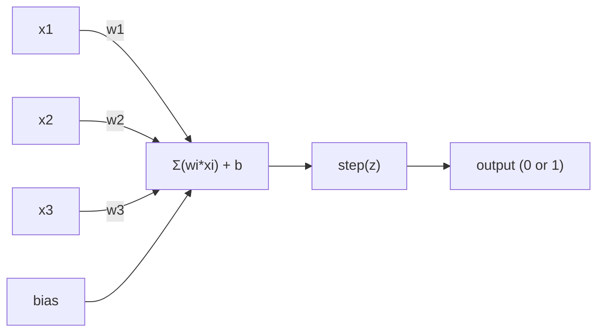
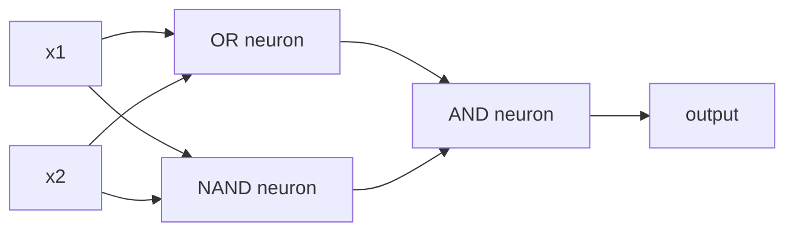

# पर्सेप्ट्रॉन से पता चलता है।

> पर्सेप्ट्रॉन तंत्रिका नेटवर्क का परमाणु है इसे खोलकर आपको वजन, पूर्वाग्रह और निर्णय मिलता है।

> 感知机是神经网络的"原子"被拆开来看,内面是权重,偏移和一个决策

> **【中文解读】**感知机是神经网络 के "原子"最小的学习单元── इसकी कार्यवाही बेहद सरल हैः इनपुट को वजन पर गुणा करना, अतिरिक्त偏置 करना, फिर एक दूसरा विकल्प बनाने का निर्णय लेना── समझने के लिए 感知机,就是 समझने के लिए "学习" का क्या मतलब है कोड मेंः लगातार संख्याओं को समायोजित करना, जब तक कि आउटपुट और वास्तविकता मेल न खाए──

**Type:** Build
**Languages:** Python
**Prerequisites:** Phase 1 (Linear Algebra Intuition)
**Time:** ~60 minutes

## सीखने के लक्ष्य

- पायथन में एक पर्सेप्ट्रॉन को खरोंच से लागू करें, जिसमें वजन अद्यतन नियम और चरण सक्रियण फ़ंक्शन शामिल हैं
  शून्य से पायथन 实现感知机, जिसमें权重更新规则和阶跃激活函数 शामिल हैं
- समझाएं कि एक एकल परिक्ट्रॉन केवल रैखिक रूप से अलग होने वाली समस्याओं को हल क्यों कर सकता है और एक्सओआर विफलता मामले का प्रदर्शन कर सकता है
   समझाएँ कि क्यों एक एकल संवेदी मशीन केवल संवेदी समस्या को हल कर सकती है, और XOR  विफलता के मामले का प्रदर्शन करती है
- XOR को हल करने के लिए OR, NAND और AND गेट को जोड़कर एक बहु-परत perceptron का निर्माण करें
  ️️️️️️️️️️️️️️️️️️️️️️️️️️️️️️️️️️️️️️️️️️️️️️️️️️️️️️️️️️️️️️️️️️️️️️️️️️️️️️️️️️️️️️️️️️️️️️️️️️️️️️️️️️️️️️️️️️️️️️️️️️️️️️️️️️️️️️️️️️️️️️️️️️️️️️️️️️️️️️️️️️️️️️️️️️️️️️️️️️️️️️️️️️️️️️️️️️️️️️️️️️️️️️️️️️️️️️️️️️️️️️️️️️️️️️️️️️️️️️️️️️️️️️️️️️️️️️️️️️️️️️️️️️️️️️️️️️️️️️️️️️️️️️️️️️️️️️️️️️️️️️️️️️️️️️️️️️️️️️️️️️️️️️️️️️️️️️️️️️️️️️️️️️️️️️️️️️️️️️️️️️️️️️️️️️️️️️️️️️️️️️️️️️️️️️️️️️️️️️️️️️️️️️️️️️️️️️️️️️️️️️️️️️️️️️️️️️️️️️️️️️️️️️️️️️️️️️️️️️️️️️️️️️️️️️️️️️️️️️️️️️️️️️️️️️️️️️️️️️️️️️️️️️️️
- XOR को स्वचालित रूप से सीखने के लिए सिग्मोइड सक्रियण और बैकप्रॉपेग के साथ दो-परत नेटवर्क को प्रशिक्षित करें
  उपयोग सिग्मोइड  सक्रिय और विपरीत दिशा प्रसार प्रशिक्षण दो स्तरीय नेटवर्क स्वचालित XOR सीखने

> **【中文解读】**इस अध्याय का उद्देश्यः शून्य से संज्ञानात्मक मशीन को प्राप्त करना, यह समझना कि एक एकल संज्ञानात्मक मशीन केवल एक ही संज्ञानात्मक समस्या का समाधान क्यों कर सकती है, और फिर कई संज्ञानात्मक मशीनों को जोड़कर इस सीमा को तोड़ना, अंततः विपरीत दिशा में प्रसारित करने के लिए स्वचालित सीखने का अधिकार है।

## समस्या  समस्या परिचय

आप वेक्टर और डॉट उत्पाद जानते हैं. आप जानते हैं कि एक मैट्रिक्स इनपुट को आउटपुट में बदल देता है. लेकिन एक मशीन कैसे सीखती है कि कौन सा परिवर्तन उपयोग करना है?

> आप जानते हैं कि आयाम और बिंदुओं को कैसे बदला जा सकता है। आप जानते हैं कि मैट्रिक्स इनपुट में परिवर्तित हो सकते हैं।

यह सबसे सरल संभव सीखने की मशीन हैः कुछ इनपुट लें, वजन से गुणा करें, एक पूर्वाग्रह जोड़ें, और एक द्विआधारी निर्णय लें। फिर समायोजित करें। यह है। हर तंत्रिका नेटवर्क कभी बनाया गया है इस विचार की परतों को एक साथ ढेर किया गया है।

> 感知机回答了这个问题──它是最简单的学习机:接收输入,乘重量,加偏置,做二分类决策,然后调整──就是这样──历史上构建的每一个神经网络都是这个思想的层层堆叠──

पर्सेप्ट्रन को समझने का अर्थ है कि कोड में "लर्निंग" का क्या मतलब हैः आउटपुट वास्तविकता से मेल खाने तक संख्याओं को समायोजित करना।

> समझें कि क्या यह वास्तव में "शिक्षा" का अर्थ है।

> **【中文解读】**आप जानते हैं कि एक रचकों को इनपुट में आउटपुट में बदल सकते हैं। लेकिन मशीनों को किस तरह के परिवर्तन का उपयोग करना चाहिए? संज्ञानात्मक मशीन ने उत्तर दियाः इनपुट गुणा भार, अतिरिक्त विकृति, दो प्रकार के निर्णय लेने के लिए, फिर गलत समायोजन के आधार पर पैरामीटर। सभी तंत्रिका नेटवर्क  चाहे कितना भी जटिल  हैं यह सरल विचारधारा का एक ढेर है।

## अवधारणा का मूल अवधारणा

### एक न्यूरॉन, एक निर्णय, एक तंत्रिका, एक निर्णय

एक परिकल्पना n इनपुट लेता है, प्रत्येक को एक वजन से गुणा करता है, उन्हें योगित करता है, एक पूर्वाग्रह जोड़ता है, और एक सक्रियण फ़ंक्शन के माध्यम से परिणाम पारित करता है।

> 感知机接收 n 个输入,将每一个输入乘重,求和,加偏置,然后通过激活函数输出结果――



चरण फ़ंक्शन क्रूर हैः यदि वजन योग प्लस पूर्वाग्रह >= 0 है, तो आउटपुट 1। अन्यथा, आउटपुट 0 है।

> 阶跃函数 बहुत सरल है粗暴: यदि加权和加偏置大于等于0,输出 1;否则输出0──

```
step(z) = 1  if z >= 0
           0  if z < 0
```

यह एक रैखिक वर्गीकरण है। वजन और पूर्वाग्रह एक रेखा (या उच्च आयामों में हाइपरप्लेन) को परिभाषित करते हैं जो इनपुट स्थान को दो क्षेत्रों में विभाजित करता है।

> यह एक रैखिक विभाजन है। भार और विकिरण एक रेखा को परिभाषित करते हैं।

> **【中文解读】**感知机的计算流程:输入 x 乘权重 w,求和后加偏置 b,最后通过阶跃函数输出 0 或 1──本质上就是一个线性分类器权重和偏置在空间中画一条线 (((或超平面),输入空间分为两个区域──

### निर्णय सीमा  निर्णय सीमा 

दो इनपुट के लिए, पर्सेप्ट्रॉन 2D अंतरिक्ष के माध्यम से एक रेखा खींचता हैः

>  दो प्रविष्टियों के लिए, 感知机在二维空间中画一条直线:

```
  x2
  ┤
  │  Class 1        /
  │    (0)          /
  │                /
  │               / w1·x1 + w2·x2 + b = 0
  │              /
  │             /     Class 2
  │            /        (1)
  ┼───────────/──────────── x1
```

रेखा के एक तरफ की हर चीज 0 आउटपुट देती है। दूसरी तरफ की हर चीज 1 आउटपुट देती है। प्रशिक्षण इस रेखा को तब तक ले जाता है जब तक कि यह कक्षाओं को सही ढंग से अलग नहीं करता।

>  एक तरफ सभी आउटपुट 0, दूसरी तरफ सभी आउटपुट 1  प्रशिक्षण की प्रक्रिया यह है कि यह लाइन को स्थानांतरित करें, जब तक कि यह सही ढंग से अलग-अलग वर्गों में नहीं खुलता

> **【中文解读】**决策界是 w·x + b = 0 条线―― प्रशिक्षण की प्रक्रिया यह है कि यह लगातार इस रेखा को आगे बढ़ता है, जब तक कि यह विभिन्न प्रकार के डेटा को सही ढंग से विभाजित नहीं करता है। गहन सीखने में, प्रत्येक स्तर नई विशेषताएं और नई निर्णय सीमाएं बनाता है।

### सीखना नियम सीखना नियम

परिक्ट्रॉन सीखने का नियम सरल हैः

> 感知机的学习规则非常简单:

```
For each training example (x, y_true):     # 对每个训练样本
    y_pred = predict(x)                    # 预测输出
    error = y_true - y_pred                # 计算误差

    For each weight:                       # 对每个权重
        w_i = w_i + learning_rate * error * x_i   # 更新权重
    bias = bias + learning_rate * error    # 更新偏置
```

यदि भविष्यवाणी सही है, तो त्रुटि = 0, कुछ भी नहीं बदलता है। यदि यह भविष्यवाणी करता है 0 लेकिन 1 होना चाहिए, तो वजन बढ़ता है। यदि यह भविष्यवाणी करता है 1 लेकिन 0 होना चाहिए, तो वजन कम होता है। सीखने की दर नियंत्रित करती है कि प्रत्येक समायोजन कितना बड़ा है।

> यदि पूर्वानुमान सही है, तो त्रुटि 0 है, कोई समायोजन नहीं किया गया है। यदि पूर्वानुमान 0 है, तो यह 1 है, तो वजन बढ़ाना चाहिए। यदि पूर्वानुमान 1 है, तो यह 0 है, तो वजन घटाना चाहिए।

> **【中文解读】**感知机的学习规则非常直觉: पूर्वानुमान करने के लिए就不动, पूर्वानुमान त्रुटि के आधार पर त्रुटि दिशा समायोजित करें वजन.`optimizer.step()`करना ही एक ही है, बस गणना अधिक जटिल है।

> **【拓展：梯度下降的起源】**感知机学习规则是最简单的梯度下降―― आधुनिक गहन सीखने में SGD (आधारणीय梯度下降) 、Adam 优化器是这个思想的延伸―― अंतर इस बात में है कि:感知机使用固定的学习率和手动计算梯度, जबकि Adam会自适应调整学习率――

### XOR समस्या XOR समस्या

यहाँ यह टूट जाता है. इन तर्क द्वारों को देखोः

> यह है जहां संज्ञानात्मक विफलता है.

```
AND gate:           OR gate:            XOR gate:
x1  x2  out         x1  x2  out         x1  x2  out
0   0   0           0   0   0           0   0   0
0   1   0           0   1   1           0   1   1
1   0   0           1   0   1           1   0   1
1   1   1           1   1   1           1   1   0
```

AND और OR रैखिक रूप से अलग हो सकते हैंः आप 0s को 1s से अलग करने के लिए एक एकल रेखा खींच सकते हैं। XOR नहीं है। कोई एकल रेखा [0,1] और [1,0] को [0,0] और [1,1] से अलग नहीं कर सकती है।

> और 和 OR 是线性可分的: आप एक条直线将 0 和 1 分开。XOR 不是──没有一条直线能将 [0,1] 和 [1,0] 与 [0,0] 和 [1,1] 分开──

```
AND (separable):        XOR (not separable):

  x2                      x2
  1 ┤  0     1            1 ┤  1     0
    │     /                 │
  0 ┤  0 / 0              0 ┤  0     1
    ┼──/──────── x1         ┼──────────── x1
       line works!          no single line works!
```

यह एक मौलिक सीमा है. एक एकल धारणा केवल रैखिक रूप से अलग समस्याओं को हल कर सकती है। मिन्स्की और पेपर्ट ने 1969 में यह साबित किया और यह लगभग एक दशक के लिए तंत्रिका नेटवर्क अनुसंधान को मार डाला।

> यह एक मौलिक सीमा है। एक एकल संवेदी मशीन केवल रैखिक भेदभाव की समस्या को हल कर सकती है। 1969 में मिन्स्की और पेपर ने इस बात का प्रमाण दिया, जिससे लगभग एक दशक तक तंत्रिका नेटवर्क अनुसंधान रुक गया।

समाधानः पर्सेप्ट्रॉन को परतों में ढेर करें। एक बहु-परत पर्सेप्ट्रॉन दो रैखिक निर्णयों को एक गैर-रेखीय निर्णय में जोड़कर XOR को हल कर सकता है।

> समाधानः संज्ञानात्मक मशीनों को एक स्तर पर रखा जा सकता है।

> **【中文解读】**XOR  समस्या संज्ञानात्मक मशीन की "अकाक्षय की" है: चाहे आप सीधे रेखा कैसे भी चित्रित करें, तो XOR के दो प्रकार के आउटपुट को अलग नहीं किया जा सकता है। 1969 में मिन्स्की और पेपर ने इस बात का प्रमाण दिया, जिससे सीधे न्यूरो नेटवर्क अध्ययन की "पहली शीतकालीन" हुई। लेकिन इसका समाधान भी बहुत ही सुरुचिपूर्ण हैः कई संज्ञानात्मक मशीनों को बहुस्तरीय में रखना, दो सीधे लाइनों के संयोजन के साथ अपरलाइन निर्णय सीमाओं को निकालना।

> **【拓展：为什么深度学习需要"深"】**单层感知机只能画直线,两层可以画折线,三层可以画任意形状──层数越多,表达函数越复杂──这就是为什么GPT-4有近100层变压器每多层,模型就能表达更复杂的模式──从感知机到GPT,核心思想一脉相承──

## इसे बनाओ।
```figure
perceptron-boundary
```

## इसे बनाओ

### चरण 1: पर्सेप्ट्रॉन वर्ग

```python
class Perceptron:
    def __init__(self, n_inputs, learning_rate=0.1):
        self.weights = [0.0] * n_inputs   # 权重初始化为 0
        self.bias = 0.0                    # 偏置初始化为 0
        self.lr = learning_rate            # 学习率控制每次调整的幅度

    def predict(self, inputs):
        total = sum(w * x for w, x in zip(self.weights, inputs))  # 加权求和：w·x
        total += self.bias                                         # 加偏置：w·x + b
        return 1 if total >= 0 else 0       # 阶跃函数：>=0 输出 1，否则输出 0

    def train(self, training_data, epochs=100):
        for epoch in range(epochs):
            errors = 0
            for inputs, target in training_data:
                prediction = self.predict(inputs)   # 前向预测
                error = target - prediction          # 计算误差
                if error != 0:
                    errors += 1
                    for i in range(len(self.weights)):
                        self.weights[i] += self.lr * error * inputs[i]  # 权重更新
                    self.bias += self.lr * error      # 偏置更新
            if errors == 0:
                print(f"Converged at epoch {epoch + 1}")  # 全部正确，收敛
                return
        print(f"Did not converge after {epochs} epochs")
```

### चरण 2: तर्क के द्वार पर प्रशिक्षण

```python
and_data = [          # AND 逻辑门数据：两个输入都为 1 时输出 1
    ([0, 0], 0),
    ([0, 1], 0),
    ([1, 0], 0),
    ([1, 1], 1),
]

or_data = [           # OR 逻辑门数据：任一输入为 1 时输出 1
    ([0, 0], 0),
    ([0, 1], 1),
    ([1, 0], 1),
    ([1, 1], 1),
]

not_data = [          # NOT 逻辑门数据：取反
    ([0], 1),
    ([1], 0),
]

print("=== AND Gate ===")
p_and = Perceptron(2)
p_and.train(and_data)
for inputs, _ in and_data:
    print(f"  {inputs} -> {p_and.predict(inputs)}")

print("\n=== OR Gate ===")
p_or = Perceptron(2)
p_or.train(or_data)
for inputs, _ in or_data:
    print(f"  {inputs} -> {p_or.predict(inputs)}")

print("\n=== NOT Gate ===")
p_not = Perceptron(1)
p_not.train(not_data)
for inputs, _ in not_data:
    print(f"  {inputs} -> {p_not.predict(inputs)}")
```

### चरण 3: XOR की विफलता को देखें

```python
xor_data = [         # XOR 逻辑门数据：两个输入不同时输出 1
    ([0, 0], 0),
    ([0, 1], 1),
    ([1, 0], 1),
    ([1, 1], 0),
]

print("\n=== XOR Gate (single perceptron) ===")
p_xor = Perceptron(2)
p_xor.train(xor_data, epochs=1000)   # 即使训练 1000 轮也无法收敛
for inputs, expected in xor_data:
    result = p_xor.predict(inputs)
    status = "OK" if result == expected else "WRONG"
    print(f"  {inputs} -> {result} (expected {expected}) {status}")
```

यह एक ठोस सबूत है कि एक एकल perceptron XOR सीखने नहीं कर सकते है।

> यह कभी नहीं प्राप्त होगा। यह एक एकल संज्ञानात्मक मशीन है जो XOR का अध्ययन नहीं कर सकती है।

> **【中文解读】**单个感知机训练 XOR 永远不会收不管训练多少轮── यह गणित की कठोर सीमा हैः एक直线 XOR के चार बिंदुओं को दो श्रेणियों में सही ढंग से विभाजित नहीं कर सकती──

### चरण 4: दो परतों के साथ XOR हल करें।

चालः XOR = (x1 OR x2) और NOT (x1 AND x2) । तीन धारणाओं को मिलाएं:

> 技巧:XOR = (x1 OR x2) और NOT (x1 AND x2)



```python
def xor_network(x1, x2):
    or_neuron = Perceptron(2)
    or_neuron.weights = [1.0, 1.0]     # OR 门的权重
    or_neuron.bias = -0.5              # OR 门的偏置

    nand_neuron = Perceptron(2)
    nand_neuron.weights = [-1.0, -1.0]  # NAND 门（AND 的取反）的权重
    nand_neuron.bias = 1.5              # NAND 门的偏置

    and_neuron = Perceptron(2)
    and_neuron.weights = [1.0, 1.0]     # AND 门的权重
    and_neuron.bias = -1.5              # AND 门的偏置

    hidden1 = or_neuron.predict([x1, x2])    # 隐藏层第 1 个神经元：OR
    hidden2 = nand_neuron.predict([x1, x2])  # 隐藏层第 2 个神经元：NAND
    output = and_neuron.predict([hidden1, hidden2])  # 输出层：AND
    return output


print("\n=== XOR Gate (multi-layer network) ===")
for inputs, expected in xor_data:
    result = xor_network(inputs[0], inputs[1])
    print(f"  {inputs} -> {result} (expected {expected})")
```

चारों मामलों में सही है. पर्सेप्ट्रॉन को परतों में ढेर करने से निर्णय सीमाएं बनती हैं जो कोई भी पर्सेप्ट्रॉन नहीं बना सकता है।

> चार मामले पूरी तरह सही हैं। संज्ञानात्मक मशीनों के ढेरों को एक ही संज्ञानात्मक मशीन बनाने में सक्षम है।

> **【中文解读】**关键洞察:XOR = (x1 OR x2) और NOT(x1 AND x2)。 प्रथम स्तरीय दो संज्ञानात्मक मशीनों के साथ अलग-अलग करें OR 和 NAND(दो straight lines), दूसरा स्तरीय उपयोग करें और दो परिणामों को एक साथ रखें。 यह दो straight lines के साथ एक गैर-रेखीय निर्णय सीमा से निकलता है。 यह आधुनिक तंत्रिका नेटवर्क के मूल सिद्धांत है प्रत्येक स्तरीय में विशेषताएं बनती हैं 

### चरण 5: दो-परत नेटवर्क को प्रशिक्षित करें

चरण 4 वजन हाथ से तार. यह XOR के लिए काम करता है, लेकिन वास्तविक समस्याओं के लिए नहीं जहां आप सही वजन पहले से नहीं जानते हैं. फिक्सः सिग्मोइड के साथ कदम समारोह की जगह और वजन स्वचालित रूप से बैकप्रॉपेग के माध्यम से सीखना.

> चरण 4 में, हाथ से वज़न सेट किया गया है। यह XOR के लिए प्रभावी है, लेकिन वास्तविक वज़न के वास्तविक प्रश्न को जानने के लिए उपयोग नहीं किया जा सकता है। समाधानः सिग्मोइड के साथ चरण कूद फ़ंक्शन का उपयोग करके, विपरीत दिशा में प्रसारण के माध्यम से स्वचालित सीखने का वज़न।

```python
class TwoLayerNetwork:
    def __init__(self, learning_rate=0.5):
        import random
        random.seed(0)
        self.w_hidden = [[random.uniform(-1, 1), random.uniform(-1, 1)] for _ in range(2)]  # 隐藏层权重（2个神经元，各2个输入）
        self.b_hidden = [random.uniform(-1, 1), random.uniform(-1, 1)]   # 隐藏层偏置
        self.w_output = [random.uniform(-1, 1), random.uniform(-1, 1)]   # 输出层权重
        self.b_output = random.uniform(-1, 1)   # 输出层偏置
        self.lr = learning_rate

    def sigmoid(self, x):
        import math
        x = max(-500, min(500, x))   # 裁剪防止溢出
        return 1.0 / (1.0 + math.exp(-x))  # sigmoid 函数：σ(x) = 1/(1+e^(-x))

    def forward(self, inputs):
        self.inputs = inputs
        self.hidden_outputs = []
        for i in range(2):
            z = sum(w * x for w, x in zip(self.w_hidden[i], inputs)) + self.b_hidden[i]  # 隐藏层线性变换
            self.hidden_outputs.append(self.sigmoid(z))  # 隐藏层激活
        z_out = sum(w * h for w, h in zip(self.w_output, self.hidden_outputs)) + self.b_output  # 输出层线性变换
        self.output = self.sigmoid(z_out)   # 输出层激活
        return self.output

    def train(self, training_data, epochs=10000):
        for epoch in range(epochs):
            total_error = 0
            for inputs, target in training_data:
                output = self.forward(inputs)       # 前向传播
                error = target - output              # 误差 = 目标 - 预测
                total_error += error ** 2            # 累计平方误差

                d_output = error * output * (1 - output)   # 输出层梯度（链式法则）

                saved_w_output = self.w_output[:]
                hidden_deltas = []
                for i in range(2):
                    h = self.hidden_outputs[i]
                    hd = d_output * saved_w_output[i] * h * (1 - h)  # 隐藏层梯度（反向传播）
                    hidden_deltas.append(hd)

                # 更新输出层权重
                for i in range(2):
                    self.w_output[i] += self.lr * d_output * self.hidden_outputs[i]
                self.b_output += self.lr * d_output

                # 更新隐藏层权重
                for i in range(2):
                    for j in range(len(inputs)):
                        self.w_hidden[i][j] += self.lr * hidden_deltas[i] * inputs[j]
                    self.b_hidden[i] += self.lr * hidden_deltas[i]
```

```python
net = TwoLayerNetwork(learning_rate=2.0)
net.train(xor_data, epochs=10000)
for inputs, expected in xor_data:
    result = net.forward(inputs)
    predicted = 1 if result >= 0.5 else 0   # 以 0.5 为阈值做二分类
    print(f"  {inputs} -> {result:.4f} (rounded: {predicted}, expected {expected})")
```

चरण 4 से दो प्रमुख अंतर. पहला, सिग्मोइड चरण समारोह की जगह ले जाता है - यह चिकनी है, इसलिए gradients मौजूद है. दूसरा, `train`विधि आउटपुट से छिपे हुए परत पर त्रुटि को पीछे की ओर फैलाती है, प्रत्येक वजन को त्रुटि में योगदान के अनुपात में समायोजित करती है। यह 20 पंक्तियों में पीछे की फैलाव है।

> चरण 4 के साथ दो महत्वपूर्ण अंतर हैं। सबसे पहले, सिग्मोइड ने चरण-उप कार्य को बदल दिया है। यह समतल है, इसलिए स्तर मौजूद है।`train` विधि त्रुटि को आउटपुट लेयर से छिपे हुए लेयर के विपरीत प्रसारित करने के लिए, प्रत्येक भार के अनुसार त्रुटि के योगदान के अनुपात में समायोजित करेगी

यह पाठ 03 की पुल है। इसके पीछे गणित है।`d_output`और `hidden_deltas`नेटवर्क ग्राफ पर लागू श्रृंखला नियम है. हम इसे सही ढंग से वहाँ प्राप्त करेंगे.

> यही तीसरी कक्षा की ओर जाने वाला पुल है।`d_output`和 `hidden_deltas`पश्चात गणित का उपयोग नेटवर्क ग्राफ पर किया जाता है 

> **【中文解读】**चरण 4 है हाथ से सेट करने के लिए वजन, लेकिन वास्तविक समस्या में हम सही वजन नहीं जानते हैं। यहाँ की सफलता यह हैः सिग्मोइड के साथ 替阶跃函数 (क्योंकि यह चलाया जा सकता है), फिर विपरीत दिशा में प्रसारण (backpropagation) के साथ स्वचालित रूप से वजन सीखें।`d_output`和 `hidden_deltas`यही है पिटोरच का नियम।`loss.backward()`में करने की बातें.

> **【拓展：PyTorch autograd 的原理】**PyTorch का स्वचालित विखंडन (अटोग्रेड) मूलतः स्वचालित रूप से निष्पादित करने वाली इस विपरीत दिशा में प्रसारण प्रक्रिया है।`backward()`时沿沿图反向传播梯度──手动写反向传播(像这里一样) को समझने का सबसे अच्छा तरीका है

## इसका प्रयोग करें।

सब कुछ आप अभी शुरू से बनाया है एक आयात में मौजूद हैः

> आप अभी से ही शून्य से निर्माण के सभी कार्य एक आयात के माध्यम से पूरा किया जा सकता हैः

```python
from sklearn.linear_model import Perceptron as SkPerceptron   # sklearn 内置的感知机
import numpy as np

X = np.array([[0,0],[0,1],[1,0],[1,1]])  # 输入数据
y = np.array([0, 0, 0, 1])               # AND 门的标签

clf = SkPerceptron(max_iter=100, tol=1e-3)  # 最多迭代 100 次，容差 0.001
clf.fit(X, y)                                # 训练
print([clf.predict([x])[0] for x in X])     # 预测所有样本
```

पांच पंक्तियाँ.`Perceptron`वर्ग एक ही बात करता है. sklearn संस्करण अभिसरण जांच, कई हानि कार्यों, और दुर्लभ इनपुट समर्थन जोड़ता है - लेकिन कोर लूप समान हैः वजन योग, कदम समारोह, त्रुटि पर वजन अद्यतन.

> 五行代码──你30行的 `Perceptron`类做的是同样的事情──sklearn 版本增加收检查、多种损失函数和稀疏输入支持但核心循环完全相同:加权和、阶跃函数、按错误更新权重──

उत्पादन नेटवर्क में क्या बदलावः

> वास्तविक अंतर वर्तमान पैमाने पर है। उत्पादन वातावरण में नेटवर्क में निम्नलिखित परिवर्तन हैंः

- चरण समारोह सिग्मोइड, ReLU, या अन्य चिकनी सक्रियण हो जाता है
  阶跃 फ़ंक्शन सिग्मोइड 、ReLU या अन्य समतल सक्रिय फ़ंक्शन में बदल जाता है
- वजन को बैकप्रॉपेग के माध्यम से स्वचालित रूप से सीखा जाता है (पाठ 03)
  权重通过反向传播自动学习 (अंतरवर्ती प्रसार स्वयंसिद्ध स्वयंसिद्ध स्वयंसिद्ध स्वयंसिद्ध स्वयंसिद्ध स्वयंसिद्ध स्वयंसिद्ध स्वयंसिद्ध स्वयंसिद्ध स्वयंसिद्ध स्वयंसिद्ध स्वयंसिद्ध स्वयंसिद्ध स्वयंसिद्ध स्वयंसिद्ध स्वयंसिद्ध स्वयंसिद्ध स्वयंसिद्ध स्वयंसिद्ध स्वयंसिद्ध स्वयंसिद्ध स्वयंसिद्ध स्वयंसिद्ध स्वयंसिद्ध स्वयंसिद्ध स्वयंसिद्ध स्वयंसिद्ध स्वयंसिद्ध स्वयंसिद्ध स्वयंसिद्ध स्वयंसिद्ध स्वयंसिद्ध स्वयंसिद्ध स्वयंसिद्ध स्वयंसिद्ध स्वयंसिद्ध स्वयंसिद्ध स्वयंसिद्ध स्वयंसिद्ध स्वयंसिद्ध स्वयंसिद्ध स्वयंसिद्ध स्वयंसिद्ध स्वयंसिद्ध स्वयंसिद्ध स्वयंसिद्ध स्वयंसिद्ध स्वयंसिद्ध स्वयंसिद्ध स्वयंसिद्ध
- परतें गहराई से बढ़ जाती हैंः 3, 10, 100+ परतें
  層数变得更深:3 層,10 層,100+ 層
- वही सिद्धांत है: प्रत्येक परत पिछले परत के आउटपुट से नई विशेषताएं बनाता है
  基本原理不变: प्रत्येक स्तर से पूर्ववर्ती स्तर के आउटपुट में नया गुण बनाएं

एक एकल perceptron केवल सीधी रेखाएं खींच सकते हैं उन्हें ढेर, और आप किसी भी आकार को आकर्षित कर सकते हैं.

> 单个感知机只能画直线――它们堆叠起来,你就能画任何形状――

> **【中文解读】**sklearn 里 Perceptron 五行代码就搞定了我们30行做的事情──核心逻辑完全相同:加权求和、阶跃函数、按差更新权重──真正差距在规模:现代网络使用可导的激活函数(如ReLU) 、反向传播自动学习、有几十到上百层──但基本原理永远是: प्रत्येक परत से ऊपर के आउटपुट में नई विशेषताएं बनाएं──

## इसे भेजें।

इस पाठ से उत्पन्न होता हैः
- `outputs/skill-perceptron.md`- एक स्तर की वास्तुकला के साथ बहु-स्तर वास्तुकला की आवश्यकता होने पर एक कौशल

> 本课产出:`outputs/skill-perceptron.md`- एकल-स्तर और बहु-स्तर संरचनाओं का उपयोग कब करना है, इस पर एक कौशल दस्तावेज

## अभ्यास विषय

1. NAND गेट पर एक perceptron को प्रशिक्षित करें (सार्वभौमिक गेट - NAND से कोई भी तर्क सर्किट बनाया जा सकता है) इसके वजन और पूर्वाग्रह को मान्य निर्णय सीमा के रूप में सत्यापित करें।
   > **练习 1：**प्रयोग संज्ञान मशीन प्रशिक्षण NAND 门 सामान्य तर्क门 किसी भी तर्क विद्युत NAND 搭建)  सत्यापित करने के लिए सीखा है कि क्या वजन और विकृति प्रभावी निर्णय सीमाएं बनाते हैं

2. प्रत्येक युग में निर्णय सीमा (w1\*x1 + w2\*x2 + b = 0) को ट्रैक करने के लिए पर्सेप्ट्रॉन वर्ग को संशोधित करें। AND गेट पर प्रशिक्षण के दौरान रेखा कैसे बदलती है, प्रिंट करें।
   > **练习 2：**修改 Perceptron 类,在每时代 记录决策边界 (w1\*x1 + w2\*x2 + b = 0) ――打印在训练 AND 门时这条线是如何移动的──

3. एक 3-इनपुट परिक्ट्रॉन बनाएं जो केवल 1 आउटपुट करता है जब 3 इनपुट में से कम से कम 2 1 (बहुमत वोट फ़ंक्शन) हैं। क्या यह रैखिक रूप से अलग किया जा सकता है? क्यों?
   > **练习 3：** एक 3 输入感知机 का निर्माण करें, जब कम से कम 2 输入 1 时输出 1  बहुमत मतदान फ़ंक्शन)  यह फ़ंक्शन 线性可分的吗? क्यों?

## Key Terms  Key Terms  Key Terms  Key Terms  Key Terms  Key Terms  Key Terms  Key Terms  Key Terms  Key Terms  Key Terms  Key Terms  Key Terms  Key Terms  Key Terms  Key Terms  Key Terms  Key Terms  Key Terms  Key Terms  Key Terms  Key Terms  Key Terms  Key Terms  Key Terms  Key Terms  Key Terms  Key Terms  Key Terms  Key Terms  Key Terms  Key Terms  Key Terms  Key Terms  Key Terms  Key Terms  Key Terms  Key Terms  Key Terms  Key Terms  Key Terms  Key Terms  Key Terms  Key Terms  Key Terms  Key Terms  Key Terms  Key Terms  Key Terms  Key Terms  Key Terms  Key Terms  Key Terms  Key Terms  Key Terms  Key Terms  Key Terms  Key Terms  Key Terms  Key Terms  Key Terms  Key Terms  Key Terms  Key Terms  Key Terms  Key Terms  Key Terms  Key Terms  Key Terms  Key Terms  Key Terms  Key Terms  Key Terms  Key Terms  Key Terms  Key Terms  Key Terms  Key Terms  Key Terms  Key Terms  Key Terms  Key Terms  Key Terms  Key Terms  Key Terms  Key Terms  Key Terms  Key Terms  Key Terms  Key Terms  Key Terms  Key Terms  Key Terms  Key Terms  Key Terms  Key Terms  Key Terms  Key Terms  Key Terms  Key Terms  Key Terms  Key Terms  Key Terms  Key Terms  Key Terms  Key Terms  Key Terms  Key Terms  Key

| Term | What people say | What it actually means |
|------|----------------|----------------------|
| Perceptron | "A fake neuron" | A linear classifier: dot product of inputs and weights, plus bias, through a step function |
| Weight | "How important an input is" | A multiplier that scales each input's contribution to the decision |
| Bias | "The threshold" | A constant that shifts the decision boundary, letting the perceptron fire even with zero inputs |
| Activation function | "The thing that squishes values" | A function applied after the weighted sum - step function for perceptrons, sigmoid/ReLU for modern networks |
| Linearly separable | "You can draw a line between them" | A dataset where a single hyperplane can perfectly separate the classes |
| XOR problem | "The thing perceptrons can't do" | Proof that single-layer networks cannot learn non-linearly-separable functions |
| Decision boundary | "Where the classifier switches" | The hyperplane w\*x + b = 0 that divides input space into two classes |
| Multi-layer perceptron | "A real neural network" | Perceptrons stacked in layers, where each layer's output feeds the next layer's input |

| 术语 | 通俗说法 | 实际含义 |
|------|---------|---------|
| 感知机 (Perceptron) | "假神经元" | 线性分类器：输入与权重的点积加偏置，过阶跃函数 |
| 权重 (Weight) | "输入的重要性" | 缩放每个输入对决策贡献的乘数 |
| 偏置 (Bias) | "阈值" | 偏移决策边界的常数，让感知机在全零输入时也能激活 |
| 激活函数 (Activation function) | "压扁数值的东西" | 加权求和后施加的函数——感知机用阶跃函数，现代网络用 sigmoid/ReLU |
| 线性可分 (Linearly separable) | "能画线分开" | 数据集可以用一个超平面完美分成两类 |
| XOR 问题 | "感知机做不到的事" | 证明单层网络无法学习非线性可分函数 |
| 决策边界 (Decision boundary) | "分类器切换的地方" | w\*x + b = 0 这个超平面，把输入空间分成两类区域 |
| 多层感知机 (MLP) | "真正的神经网络" | 感知机按层堆叠，每层的输出是下一层的输入 |

## आगे पढ़ना 延伸閱讀

- फ्रैंक रोसेनब्लेट, "द पर्सेप्ट्रोनः द ब्रेन में सूचना भंडारण और संगठन के लिए एक संभावनावादी मॉडल" (1958) -- मूल पेपर जिसने यह सब शुरू किया
  फ्रैंक रोजनब्लेट,  संज्ञानात्मक मशीन: मस्तिष्क सूचना भंडारण और संगठन की संभावना मॉडल
- मिन्स्की और पेपर्ट, "परसेप्ट्रॉन" (1969) -- पुस्तक जिसने साबित किया कि एक्सओआर एकल-परत नेटवर्क द्वारा हल नहीं किया जा सकता था और एक दशक तक परसेप्ट्रॉन अनुसंधान को मार दिया
  मिन्स्की व पेपर्ट,感知机
- माइकल नीलसन, "न्यूरल नेटवर्क और डीप लर्निंग", अध्याय 1 (http://neuralnetworksanddeeplearning.com/) -- मुक्त ऑनलाइन, सबसे अच्छा दृश्य स्पष्टीकरण कैसे नेटवर्क में perceptrons रचना
  माइकल नीलसन,  तंत्रिका नेटवर्क और गहन सीखने  अध्याय 1  मुफ्त ऑनलाइन, कैसे संज्ञानात्मक मशीनों नेटवर्क के संयोजन के बारे में सबसे अच्छा दृश्यता व्याख्या
