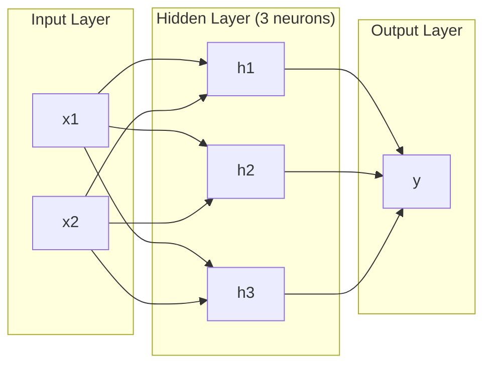
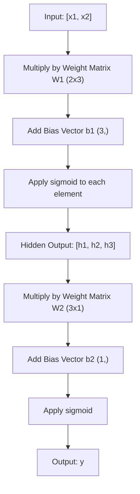
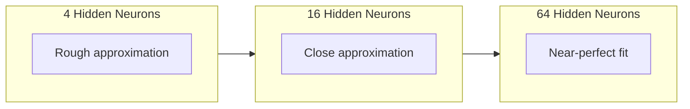

# बहु-परत नेटवर्क और फॉरवर्ड पास

> एक न्यूरॉन एक रेखा खींचता है, उन्हें ढेर कर, और आप कुछ भी खींच सकते हैं।

> एक तंत्रिका एक सीधी रेखा खींचती है। उन्हें ऊपर से ऊपर ले जाकर आप किसी भी आकार को खींच सकते हैं।

> **【中文解读】**एक तंत्रिका केवल एक सीधी रेखा खींच सकती है, लेकिन कई तंत्रिकाओं को बहुस्तरीय में रखकर, किसी भी आकार के वक्र को फिट कर सकती है। यह बहुस्तरीय नेटवर्क का मूल मूल्य है।

**Type:** Build
**Languages:** Python
**Prerequisites:** Phase 01 (Math Foundations), Lesson 03.01 (The Perceptron)
**Time:** ~90 minutes

## सीखने के लक्ष्य

- लेयर और नेटवर्क वर्गों के साथ खरोंच से एक बहु-परत नेटवर्क का निर्माण करें जो एक पूर्ण आगे पास करते हैं
  शून्य से निर्माण के साथ बहुस्तरीय नेटवर्क के प्रकार के परत और नेटवर्क, पूर्ण पूर्ववर्ती प्रसार को निष्पादित करें
- नेटवर्क की प्रत्येक परत के माध्यम से ट्रैस मैट्रिक्स आयामों को ट्रैक करें और आकार असंगतताओं की पहचान करें
   ट्रैकिंग नेटवर्क के प्रत्येक स्तर के रैंक आयाम, पहचान आकृति असंगतता समस्या
- स्पष्ट करें कि कैसे गैर-रेखीय सक्रियणों को ढेर करने से नेटवर्क को घुमावदार निर्णय सीमाओं को सीखने में सक्षम बनाता है
  解释堆叠非线性激活网络如何使网络能够学习曲的决策边界
- हाथ से ट्यून सिग्मोइड वजन के साथ 2-2-1 वास्तुकला का उपयोग करके XOR समस्या को हल करें
  प्रयोग हस्तान्तरण समायोजन का सिग्मोइड 权重, 2-2-1 架构解决 XOR 问题

> **【中文解读】**इस अध्याय का उद्देश्यः शून्य से निर्माण परत और नेटवर्क 类, समझने के लिए आगे बढ़कर प्रसार में रचकों के आयामों के परिवर्तन, यह पता लगाने के लिए कि क्यों गैर-रेखीय सक्रियण फ़ंक्शन नेटवर्क को सीखने में सक्षम बनाता है 曲 के निर्णय सीमाओं।

## समस्या  समस्या परिचय

एक न्यूरॉन एक रेखा ड्रॉवर है. यह है. आपके डेटा के माध्यम से एक सीधी रेखा. एआई में हर वास्तविक समस्या - छवि पहचान, भाषा समझ, गो खेलना - वक्रों की आवश्यकता होती है. न्यूरॉन को परतों में ढेर करना वक्रों को प्राप्त करने का तरीका है.

> 单个神经只是一个图线的工具――仅此而已―― आपके डेटा में एक सीधी रेखा खींचें――AI में प्रत्येक वास्तविक समस्या图像识别、语言理解、下围棋都需要曲线――神经堆积层就是曲线的方法──

1969 में, मिन्स्की और पेपर्ट ने यह सीमा घातक साबित कीः एक एकल-परत नेटवर्क XOR नहीं सीख सकता है। "लड़ता नहीं सीखता" - गणितीय रूप से नहीं। XOR सत्य तालिका एक तरफ [0,1] और [1,0] को एक तरफ, [0,0] और [1,1] को दूसरी तरफ रखती है। कोई एकल रेखा उन्हें अलग नहीं करती है।

> 1969 में, मिन्स्की और पेपर ने यह प्रतिबंध घातक साबित कियाः एकल स्तरीय नेटवर्क XOR को नहीं सीख सकता है।

इससे एक दशक से अधिक समय तक तंत्रिका नेटवर्क के वित्तपोषण को समाप्त कर दिया गया। पीछे की ओर देखते हुए, समाधान स्पष्ट थाः एक परत का उपयोग करना बंद करें। न्यूरॉन्स को परतों में ढेर करें। पहले परत को इनपुट स्थान को नई सुविधाओं में काटने दें, और दूसरे परत को उन सुविधाओं को उन निर्णयों में जोड़ने दें जो कोई एक लाइन नहीं ले सकती।

> यह तंत्रिका नेटवर्क के वित्त को एक दशक से अधिक समय से बाधित कर रहा है। इसके बाद, समाधान स्पष्ट हैः केवल एक स्तर का उपयोग करना बंद कर दिया गया है।

यह स्टैक बहु-परत नेटवर्क है. यह आज उत्पादन में हर गहरे सीखने के मॉडल का आधार है. आगे की पार -- इनपुट से छिपे हुए परतों से आउटपुट तक डेटा प्रवाह -- पहली चीज है जिसे आपको कुछ भी काम करने से पहले बनाने की आवश्यकता है।

> वह ढेर बहुस्तरीय नेटवर्क है। यह आज के उत्पादन वातावरण में प्रत्येक गहन सीखने के मॉडल का आधार है।

> **【中文解读】** एकल तंत्रिका केवल एक सीधी रेखा खींच सकती है, लेकिन छवि पहचान, भाषा समझ, गो गो इन वास्तविक एआई 任务都需要曲线──1969 में मिन्स्की और पेपर ने सिद्ध किया कि एकल स्तर की नेटवर्क XOR को नहीं सीख सकती है गणित में असंभव, नहीं "शैखा नहीं")  समाधान एक परत हैः पहला परत इनपुट स्पेस को नए लक्षणों में काटता है, दूसरा परत इन लक्षणों को एक जटिल निर्णयों में जोड़ता है यह सभी गहन सीखने के मॉडल का आधार है

## अवधारणा का मूल अवधारणा

### परतेंः इनपुट, छिपा हुआ, आउटपुट √ स्तरः इनपुट, छिपा हुआ, आउटपुट स्तर

बहु-परत नेटवर्क में तीन प्रकार की परतें होती हैंः

> बहुस्तरीय नेटवर्क में तीन प्रकार के स्तर हैंः

**Input layer**यह आपके कच्चे डेटा को रखता है. दो विशेषताएं दो इनपुट नोड्स का मतलब है. कोई गणना यहां नहीं होती है.

> **输入层**其实不算真正的层――它存储原始数据――两个特征意味着两个输入节点――这里没有任何计算――

**Hidden layers**-- जहां काम होता है. प्रत्येक न्यूरॉन पिछले परत से प्रत्येक आउटपुट लेता है, वजन और एक पूर्वाग्रह लागू करता है, फिर एक सक्रियण समारोह के माध्यम से परिणाम पारित करता है. "छिपा" क्योंकि आप कभी भी इन मानों को सीधे प्रशिक्षण डेटा में नहीं देखते हैं.

> **隐藏层** वास्तव में सक्रिय स्थानों में। प्रत्येक तंत्रिका को पहले स्तर के सभी आउटपुट, उपयोग और अधिभार प्राप्त होते हैं, फिर परिणाम सक्रिय फ़ंक्शन के माध्यम से प्राप्त होते हैं।

**Output layer**-- अंतिम उत्तर. द्विआधारी वर्गीकरण के लिए, सिग्मोइड के साथ एक न्यूरॉन. बहु-वर्ग के लिए, प्रति वर्ग एक न्यूरॉन.

> **输出层** अंतिम उत्तर──二分类 एक सिग्मोइड न्यूरॉन्स, शायद प्रत्येक न्यूरॉन्स के साथ



यह एक 2-3-1 नेटवर्क है. दो इनपुट, तीन छिपे हुए न्यूरॉन्स, एक आउटपुट. प्रत्येक कनेक्शन का वजन होता है. प्रत्येक न्यूरॉन्स (इनपुट को छोड़कर) एक पूर्वाग्रह है.

> यह एक 2-3-1 网络── दो इनपुट, तीन छिपे हुए तंत्रिका, एक आउटपुट── प्रत्येक कनेक्शन का एक भार है── प्रत्येक तंत्रिका (इनपुट लेयर को छोड़कर) का एक विकृति है──

प्रत्येक परत में संख्याओं का वेक्टर होता है जिसे छिपा हुआ राज्य कहा जाता है. पाठ के लिए, छिपी हुई अवस्थाएं आयाम बढ़ाती हैं - एक शब्द को 768 संख्याओं के रूप में एन्कोडिंग करना अर्थपूर्ण अर्थ को पकड़ने के लिए। चित्रों के लिए, वे आयाम को कम करते हैं - लाखों पिक्सेल को एक प्रबंधनीय प्रतिनिधित्व में संपीड़ित करते हैं। छिपी हुई अवस्था वह जगह है जहां सीखने का जीवन रहता है।

> प्रत्येक परत में एक डिजिटल वेक्टर उत्पन्न होता है, जिसे छिपा हुआ राज्य कहा जाता है। पाठ के लिए, छिपा हुआ राज्य बढ़ता है।

> **【中文解读】**तीन प्रकारः输入层(只是数据入口,不计算) 藏层(做特征变换,"隐藏"是因为训练数据里看不到这些值) ]]]]输出层(最终答案) ]] प्रत्येक स्तर से एक वेक्टर निकलता है जिसे "隐藏状态" कहा जाता है।

> **【拓展：Transformer 中的隐藏状态】**GPT/BERT में, प्रत्येक स्तर के ट्रांसफार्मर का आउटपुट एक छिपा हुआ राज्य भी है।`model(x).hidden_states[-1]`提取特征用于下游任务──

### न्यूरॉन्स और सक्रियण न्यूरॉन्स और सक्रियण फ़ंक्शन

प्रत्येक न्यूरॉन तीन काम करता हैः

> प्रत्येक तंत्रिका तीन चीजें करता हैः

1. प्रत्येक इनपुट को उसके संबंधित वजन से गुणा करें
   प्रति भार भार के अनुसार प्रत्येक इनपुट को गुणा करना
2. सभी उत्पादों को योग और एक पूर्वाग्रह जोड़ें
   सभी गुणांक और पूर्णांक को जोड़कर विस्थापन
3. एक सक्रियण फ़ंक्शन के माध्यम से राशि पारित करें
   सक्रियण फ़ंक्शन के माध्यम से

अभी के लिए, सक्रियण सिग्मोइड हैः

> वर्तमान में उपयोग में सक्रियण फ़ंक्शन सिग्मोइड हैः

```
sigmoid(z) = 1 / (1 + e^(-z))
```

सिग्मोइड किसी भी संख्या को दायरे में स्क्वाश करता है (0, 1). बड़े सकारात्मक इनपुट 1 की ओर धकेलते हैं। बड़े नकारात्मक इनपुट 0 की ओर धकेलते हैं। शून्य मानचित्र 0.5 तक। यह चिकनी वक्र सीखने को संभव बनाता है - पर्सेप्ट्रॉन के कठिन कदम के विपरीत, सिग्मोइड में हर जगह एक ग्रेडिएंट है।

> सिग्मोइड किसी भी संख्या को (0, 1) के दायरे में संकुचित करेगा। बड़ी नकारात्मक प्रविष्टि की ओर 1 की ओर बढ़ेगी।

> **【中文解读】**प्रत्येक तंत्रिका तीन काम करता हैः输入乘权重、求和加偏置、过激活函数── सिग्मोइड, किसी भी संख्या को (0, 1) 区间间── तक संकुचित करें।

### फॉरवर्ड पासः कैसे डेटा प्रवाह है

आगे की पास नेटवर्क के माध्यम से इनपुट डेटा को परत-पर-परत धकेलती है, जब तक कि यह आउटपुट तक नहीं पहुंच जाता है। आगे की पास के दौरान कोई सीख नहीं होती है। यह शुद्ध गणना हैः गुणा, जोड़ें, सक्रिय करें, दोहराएं।

> पूर्ववर्ती प्रसारण में कोई भी सीख नहीं होती है। यह शुद्ध संक्रमण हैः गुणा 加、 सक्रिय、重复──



प्रत्येक परत पर, तीन ऑपरेशन क्रमशः होते हैंः

> प्रत्येक स्तर पर, क्रमशः तीन ऑपरेशन निष्पादित करेंः

```
z = W * input + b       (linear transformation)    # 线性变换
a = sigmoid(z)           (activation)                # 激活
```

एक परत का आउटपुट अगले परत का इनपुट बन जाता है। यह संपूर्ण आगे का पास है।

> एक स्तर का आउटपुट निम्न स्तर का इनपुट बन जाता है।

> **【中文解读】**पूर्व दिशा प्रसारण है डेटा से इनपुट प्रवाह से आउटपुट प्रक्रिया कोई सीख नहीं, शुद्ध गणना प्रत्येक परत दो चीजें करेंः 线性变换 Wx + b) + गैर-线性 सक्रिय सिग्मोइड── ऊपरी परत का आउटपुट है नीचे की परत का इनपुट यह है PyTorch 里`model(x)`में करने की बातें.

### मैट्रिक्स आयामों

डीप लर्निंग में ट्रैकिंग आयाम सबसे महत्वपूर्ण डिबगिंग कौशल है। यहां 2-3-1 नेटवर्क हैः

> 追踪维度深度学习 में सबसे महत्वपूर्ण调试技能── निम्न में 2-3-1 网络 शामिल हैंः

| Step | Operation | Dimensions | Result Shape |
|------|-----------|------------|-------------|
| Input | x | -- | (2,) |
| Hidden linear | W1 * x + b1 | W1: (3, 2), b1: (3,) | (3,) |
| Hidden activation | sigmoid(z1) | -- | (3,) |
| Output linear | W2 * h + b2 | W2: (1, 3), b2: (1,) | (1,) |
| Output activation | sigmoid(z2) | -- | (1,) |

| 步骤 | 操作 | 维度 | 结果形状 |
|------|------|------|---------|
| 输入 | x | -- | (2,) |
| 隐藏层线性变换 | W1 * x + b1 | W1: (3, 2), b1: (3,) | (3,) |
| 隐藏层激活 | sigmoid(z1) | -- | (3,) |
| 输出层线性变换 | W2 * h + b2 | W2: (1, 3), b2: (1,) | (1,) |
| 输出层激活 | sigmoid(z2) | -- | (1,) |

नियमः परत k पर वजन मैट्रिक्स W का आकार है (न्यूयॉरन्स_इन_लेयर_के, न्यूरॉन_इन_लेयर_के_मिनस_1) । पंक्तियां वर्तमान परत से मेल खाती हैं। स्तंभ पिछले परत से मेल खाती हैं। यदि आकार पंक्तिबद्ध नहीं होते हैं, तो आपके पास एक बग है।

> नियम: द्वितीय स्तरीय के भारोत्तोलन के वर्ग W का आकार (द्वितीय स्तरीय न्यूरोनियम संख्या, द्वितीय स्तरीय न्यूरोनियम संख्या) 行对应应应应应应应应应应应应应应应应应应应应应应应应应应应应应应应应应应应应应应应应应应应应应应应应应应应应应应应应应应应应应应应应应应应应应应应应应应应应应应应应应应应应应应应应应应应应应应应应应应应应应应应应应应应应应应应应应应应应应应应应应应应应应应应应应应应应应应应应应应应应应应应应应应应应应应应应应应应应应应应应应应应应应应应应应应应应应应应应应应应应应应应应应应应应应应应应应应应应应应应应应应应应应应应应应应应应应应应应应应应应应应应应应应应应应应应应应应应应应应应应应应应应应应应应应应应应应应应应应应应应应应应应应应应应应应应应应应应应应应应应应应应应应应应应应应应应应应应应应应应应应应应应应应应应应应应应应应应应应应应应应应应应应应应应应应应应应应应应应应应应应应应应应应应应应应应应应应应应应应应应应应应应应应应应应应应应应应应应应应应应应应应应应应应应应应应应应应应应应应应应应应应应应应应应应应应应应应应应应应应应应应应应应应应应应应应应应应应应应应应应应应应应应应应应应应应应应应应应应应应应应应应应应应应应应应应

> **【中文解读】**追踪矩阵维度是深度学习中最重要的调试技能──规则很简单:第一个层的权重矩阵 W 形是 (第一个层神经元数, 第一个层神经元数)──行对应应应应应应应应应应应应应应应应应应应应应应应应应应应应应应应应应应应应应应应应应应应应应应应应应应应应应应应应应应应应应应应应应应应应应应应应应应应应应应应应应应应应应应应应应应应应应应应应应应应应应应应应应应应应应应应应应应应应应应应应应应应应应应应应应应应应应应应应应应应应应应应应应应应应应应应应应应应应应应应应应应应应应应应应应应应应应应应应应应应应应应应应应应应应应应应应应应应应应应应应应应应应应应应应应应应应应应应应应应应应应应应应应应应应应应应应应应应应应应应应应应应应应应应应应应应应应应应应应应应应应应应应应应应应应应应应应应应应应应应应应应应应应应应应应应应应应应应应应应应应应应应应应应应应应应应应应应应应应应应应应应应应应应应应应应应应应应应应应应应应应应应应应应应应应应应应应应应应应应应应应应应应应应应应应应应应应应应应应应应应应应应应应应应应应应应应应应应应应应应应应应应应应应应应应应应应应应应应应应应应应应应应应应应应应应应应应应应应应应应应应应应应应应应应应应应应应应

> **【拓展：维度不匹配是深度学习最常见的 bug】**PyTorch में, आप अक्सर देखते हैं `RuntimeError: mat1 and mat2 shapes cannot be multiplied` यह है कि आयाम असंगत है  यह है कि आप इस प्रकार की गलतियों को जल्दी से पहचान सकते हैं `torchsummary`या `torchinfo`मैं आप स्वचालित जांच में मदद कर सकते हैं.

### सार्वभौमिक समीकरण प्रमेय

1989 में, जॉर्ज साइबेन्को ने कुछ उल्लेखनीय साबित कियाः एक ही छिपी हुई परत और पर्याप्त न्यूरॉन्स वाले तंत्रिका नेटवर्क किसी भी निरंतर कार्य को किसी भी वांछित सटीकता के करीब ले सकते हैं।

> 1989 में, जॉर्ज साइबेन्को ने एक अविश्वसनीय तथ्य साबित कियाः एक एकल छिपी हुई परत और पर्याप्त संख्या में तंत्रिका तंत्र के साथ तंत्रिका नेटवर्क किसी भी निरंतर कार्य के निकट किसी भी सटीकता के साथ पहुंच सकता है।

इसका मतलब यह नहीं है कि एक छिपी परत हमेशा सबसे अच्छी होती है। इसका मतलब है कि वास्तुकला सैद्धांतिक रूप से सक्षम है। व्यवहार में, गहरे नेटवर्क (अधिक परतें, प्रति परत कम न्यूरॉन्स) समान कार्यों को बहुत कम कुल मापदंडों के साथ सीखते हैं। यही कारण है कि गहरे शिक्षण काम करता है।

> इसका मतलब यह नहीं है कि एक छिपा हुआ स्तर हमेशा सबसे अच्छा है। इसका मतलब है कि वास्तुकला सिद्धांत रूप में व्यवहार्य है। अभ्यास में, गहरे नेटवर्क में एक ही कार्य को सीखने के लिए एक ही कार्य को सीखने के लिए बहुत कम से कम व्यापक नेटवर्क के सामान्य तत्वों की संख्या का उपयोग किया जाता है। यही कारण है कि गहरे सीखने में प्रभावी है।

अंतर्ज्ञानः छिपे हुए परत में प्रत्येक न्यूरॉन एक "बंप" या विशेषता सीखता है। सही स्थानों पर रखे गए पर्याप्त बंप किसी भी चिकनी वक्र के करीब हो सकते हैं। अधिक न्यूरॉन, अधिक बंप, बेहतर अनुमान।

> 直觉: छिपे हुए स्तर में प्रत्येक तंत्रिका एक "कुम्भे उठ" या विशेषता सीखती है।



> **【中文解读】**️ निकटता सिद्धांत ️1989): एक छिपा हुआ परत +  पर्याप्त न्यूरॉन्स किसी भी निरंतर फ़ंक्शन के निकट हो सकता है ️ लेकिन यह एक परत के पर्याप्त होने का प्रतिनिधित्व नहीं करता है   प्रैक्टिस में, "गहरे और संकीर्ण" नेटवर्क "छोटे और चौड़े" की तुलना में अधिक उच्च प्रभावशील है ️ सीधे तौर पर, प्रत्येक छिपा हुआ तंत्रिका एक "कुंभ" या विशेषता सीखता है, पर्याप्त रूप से किसी भी वक्र से निकल सकता है ️

> **【拓展：为什么"深"比"宽"好】**理论上一层2^n 个神经元等于n 层每层2个神经元, लेकिन पूर्व के तत्वों की संख्या सूचकांक स्तर की है, बाद के 线性性.

### सम्मिश्रण क्षमता

न्यूरल नेटवर्क कम्पोजिबल हैं. आप उन्हें ढेर कर सकते हैं, उन्हें चेन कर सकते हैं, उन्हें समानांतर में चला सकते हैं। एक व्हिस्पर मॉडल ऑडियो को संसाधित करने के लिए एक एन्कोडर नेटवर्क और पाठ उत्पन्न करने के लिए एक अलग डेकोडर नेटवर्क का उपयोग करता है। आधुनिक एलएलएम केवल डेकोडर हैं। BERT केवल एन्कोडर है। T5 एन्कोडर-डेकोडर है। वास्तुकला विकल्प परिभाषित करता है कि मॉडल क्या कर सकता है।

> तंत्रिका नेटवर्क को एक साथ संकलित किया जा सकता है। आप उन्हें संकलित कर सकते हैं। आप एक साथ संकलित कर सकते हैं। आप एक साथ संकलित कर सकते हैं। आप एक साथ संकलित कर सकते हैं। आप एक साथ संकलित कर सकते हैं। आप एक साथ संकलित कर सकते हैं। आप एक साथ संकलित कर सकते हैं। आप एक साथ संकलित कर सकते हैं। आप एक साथ संकलित कर सकते हैं। आप एक साथ संकलित कर सकते हैं। आप एक साथ संकलित कर सकते हैं। आप एक साथ संकलित कर सकते हैं। आप एक साथ संकलित कर सकते हैं। आप एक साथ संकलित कर सकते हैं। आप एक साथ संकलित कर सकते हैं। आप एक साथ संकलित कर सकते हैं। आप एक साथ संकलित कर सकते हैं।

> **【中文解读】**तंत्र नेटवर्क को संकलित किया जा सकता हैः विस्पर के साथ कोडर प्रसंस्करण ध्वनि + 解码器 उत्पन्न पाठ; जीपीटी शुद्ध कोडर है;BERT शुद्ध कोडर है;T5 कोडर-解码器 है;; संरचना चयन मॉडल की क्षमता को निर्धारित करता है;;

## इसे बनाओ।
```figure
mlp-forward
```

## इसे बनाओ

शुद्ध पायथन, कोई नंपी नहीं, हर मैट्रिक्स ऑपरेशन खरोंच से लिखा गया है।

> 純 Python──不用 numpy── प्रत्येक矩阵运算从头写起──

### चरण 1: सिग्मोइड सक्रियण

```python
import math

def sigmoid(x):
    x = max(-500.0, min(500.0, x))  # 裁剪到 [-500, 500] 防止指数溢出
    return 1.0 / (1.0 + math.exp(-x))  # σ(x) = 1/(1+e^(-x))
```

[500, 500] तक की क्लैंप से अतिप्रवाह को रोक दिया जाता है। `math.exp(500)`बड़ा है, लेकिन परिमित है।`math.exp(1000)`अनंत है।

> 裁剪到 [500, 500] 可防止溢出──`math.exp(500)`बहुत बड़ा लेकिन सीमित `math.exp(1000)`यह बहुत बड़ा है।

### चरण 2: परत वर्ग

गहन सीखने में सबसे महत्वपूर्ण ऑपरेशन मैट्रिक्स गुणा है. हर परत, हर ध्यान सिर, हर आगे पास - यह नीचे तक मैटमूल है. एक रैखिक परत एक इनपुट वेक्टर लेती है, इसे एक वजन मैट्रिक्स से गुणा करती है, और एक पूर्वाग्रह वेक्टर जोड़ती हैः y = Wx + b. यह एकल समीकरण एक तंत्रिका नेटवर्क में गणना का 90% है.

> गहन सीखने में सबसे महत्वपूर्ण परिचालन矩阵乘法 है। प्रत्येक स्तर, प्रत्येक ध्यान के सिर, प्रत्येक पूर्ववर्ती प्रसारण, प्रत्येक矩阵乘法 है।

एक परत में एक वजन मैट्रिक्स और एक पूर्वाग्रह वेक्टर होता है। इसका आगे का तरीका एक इनपुट वेक्टर लेता है और सक्रिय आउटपुट लौटाता है।

> एक परत में एक भार भार रक्छा और एक विकिरण वेक्टर शामिल है। इसके आगे की विधि एक इनपुट वेक्टर प्राप्त करती है और सक्रिय होने के बाद आउटपुट को वापस करती है।

```python
class Layer:
    def __init__(self, n_inputs, n_neurons, weights=None, biases=None):
        if weights is not None:
            self.weights = weights                       # 使用指定的权重（如手动设置 XOR 的权重）
        else:
            import random
            self.weights = [
                [random.uniform(-1, 1) for _ in range(n_inputs)]  # 随机初始化权重
                for _ in range(n_neurons)
            ]                                           # 形状：(n_neurons, n_inputs)
        if biases is not None:
            self.biases = biases                         # 使用指定的偏置
        else:
            self.biases = [0.0] * n_neurons              # 偏置初始化为 0

    def forward(self, inputs):
        self.last_input = inputs                         # 保存输入（反向传播时需要）
        self.last_output = []
        for neuron_idx in range(len(self.weights)):
            z = sum(
                w * x for w, x in zip(self.weights[neuron_idx], inputs)  # 加权求和
            )
            z += self.biases[neuron_idx]                 # 加偏置
            self.last_output.append(sigmoid(z))          # sigmoid 激活
        return self.last_output
```

वजन मैट्रिक्स का आकार (n_neurons, n_inputs) है। प्रत्येक पंक्ति सभी इनपुट पर एक न्यूरॉन का वजन है। आगे की विधि न्यूरॉन के माध्यम से लूप्स करती है, वजन किए गए योग प्लस पूर्वाग्रह की गणना करती है, सिग्मोइड लागू करती है, और परिणाम एकत्र करती है।

> 权重矩阵的形状为 (n_neurons, n_inputs) ⋅ प्रत्येक पंक्ति एक तंत्रिका है सभी इनपुट के लिए भार──आगे 方法遍历神经元,计算加权和加偏置,应用 sigmoid,并收集结果──

> **【拓展：PyTorch 的 nn.Linear】**यहाँ परत है 类就是 PyTorch `nn.Linear`का सरल संस्करण`nn.Linear(in_features, out_features)`内部也是维护一个 `(out_features, in_features)`के वजन रक्खन और एक `(out_features,)`यह समझ गया है, हम 90% की गहनता को समझ गए हैं।

### चरण 3: नेटवर्क वर्ग नेटवर्क वर्ग

एक नेटवर्क परतों की एक सूची है। आगे की पास उन्हें चेन करती हैः परत k का आउटपुट परत k+1 में फ़ीड करता है।

> 网络 एक स्तरीय सूची है 前向传播将它们串联:第 K 层的输出作为第 K + 1 层的输入

```python
class Network:
    def __init__(self, layers):
        self.layers = layers   # 按顺序存储所有层

    def forward(self, inputs):
        current = inputs               # 当前层的输入
        for layer in self.layers:
            current = layer.forward(current)  # 逐层前向传播
        return current
```

यह पूरी आगे की पार है. तर्क के चार पंक्तियों. डेटा अंदर जाता है, प्रत्येक परत के माध्यम से बहता है, दूसरे पक्ष से बाहर आता है.

> यही सम्पूर्ण पूर्ववर्ती प्रसार है। चार पंक्ति तर्क है। डेटा प्रवेश करता है, प्रत्येक परत से होकर गुजरता है, दूसरे छोर से बाहर निकलता है।

> **【中文解读】**नेटवर्क 类就是 PyTorch `nn.Sequential`️ ️ ️ ️ ️ ️ ️ ️ ️ ️ ️ ️ ️ ️ ️ ️ ️ ️ ️ ️ ️ ️ ️ ️ ️ ️ ️ ️ ️ ️ ️ ️ ️ ️ ️ ️ ️ ️ ️ ️ ️ ️ ️ ️ ️ ️ ️ ️ ️ ️ ️ ️ ️ ️ ️ ️ ️ ️ ️ ️ ️ ️ ️ ️ ️ ️ ️ ️ ️ ️ ️ ️ ️ ️ ️ ️ ️ ️ ️ ️ ️ ️ ️ ️ ️ ️ ️ ️ ️ ️ ️ ️ ️ ️ ️ ️ ️ ️ ️ ️ ️ ️ ️ ️ ️ ️ ️ ️ ️ ️ ️ ️ ️ ️ ️ ️ ️ ️ ️ ️ ️ ️ ️ ️ ️ ️ ️ ️ ️ ️ ️ ️ ️ ️ ️ ️ ️ ️ ️ ️ ️ ️ ️ ️ ️ ️ 

### चरण 4: XOR के साथ हाथ से ट्यून वजन के साथ XOR को हल करने के लिए हाथ से निर्धारित वजन का उपयोग करें

पाठ 01, हम OR, NAND, और AND धारणाओं को जोड़कर XOR हल किया। अब हमारे परत और नेटवर्क वर्गों के साथ एक ही बात करें। 2-2-1 वास्तुकलाः दो इनपुट, दो छिपे हुए न्यूरॉन्स, एक आउटपुट।

> कक्षा में हम OR、NAND 和 AND 感知机 को संयोजन के माध्यम से XOR को हल करते हैं। अब हम अपनी Layer 和 Network 类 के साथ एक ही काम करते हैं।

```python
hidden = Layer(
    n_inputs=2,
    n_neurons=2,
    weights=[[20.0, 20.0], [-20.0, -20.0]],  # 大权重让 sigmoid 接近阶跃函数
    biases=[-10.0, 30.0],                      # 第一个神经元 ≈ OR，第二个 ≈ NAND
)

output = Layer(
    n_inputs=2,
    n_neurons=1,
    weights=[[20.0, 20.0]],                    # 输出层 ≈ AND
    biases=[-30.0],
)

xor_net = Network([hidden, output])

xor_data = [
    ([0, 0], 0),
    ([0, 1], 1),
    ([1, 0], 1),
    ([1, 1], 0),
]

for inputs, expected in xor_data:
    result = xor_net.forward(inputs)
    predicted = 1 if result[0] >= 0.5 else 0
    print(f"  {inputs} -> {result[0]:.6f} (rounded: {predicted}, expected: {expected})")
```

बड़े वजन (20, -20) से सिग्मोइड एक चरण समारोह की तरह कार्य करता है। पहला छिपा हुआ न्यूरॉन OR के करीब है। दूसरा NAND के करीब है। आउटपुट न्यूरॉन उन्हें AND में जोड़ता है, जो XOR है।

> बड़ा权重 (20, -20) उपयोग सिग्मोइड प्रकट किया गया है जैसे चरण कूद फ़ंक्शन── प्रथम छिपे हुए तंत्रिकाओं निकटता OR, दूसरा निकटता NAND── आउटपुट तंत्रिकाओं उन्हें संश्लेषित करेंगे और, यानी XOR──

### चरण 5: सर्कल वर्गीकरण 圆形分类

एक कठिन समस्याः 2D बिंदुओं को मूल पर केंद्रित त्रिज्या 0.5 के एक वृत्त के अंदर या बाहर वर्गीकृत करें। इसके लिए एक घुमावदार निर्णय सीमा की आवश्यकता होती है - एक एकल परिक्ट्रॉन के लिए असंभव।

> एक और कठिन प्रश्नः दो आयाम बिंदुओं को मूल बिंदु के केंद्र में विभाजित करना है, जिसका त्रिज्या 0.5 के इर्द-गिर्द या बाहर है।

```python
import random
import math

random.seed(42)

data = []
for _ in range(200):
    x = random.uniform(-1, 1)
    y = random.uniform(-1, 1)
    label = 1 if (x * x + y * y) < 0.25 else 0   # 距原点距离 < 0.5 则为"内部"
    data.append(([x, y], label))

circle_net = Network([
    Layer(n_inputs=2, n_neurons=8),   # 隐藏层：8 个神经元
    Layer(n_inputs=8, n_neurons=1),   # 输出层：1 个神经元
])
```

यादृच्छिक वजन के साथ, नेटवर्क अच्छी तरह से वर्गीकृत नहीं होगा. लेकिन आगे पास अभी भी चल रहा है. यह बिंदु है - आगे पास सिर्फ गणना है. सही वजन सीखना बैकप्रॉगरेशन है, पाठ 03.

> उपयोग के साथ-साथ, वेब विभाजन प्रभाव बहुत खराब होगा। लेकिन पूर्ववर्ती प्रसार अभी भी चल सकता है।

```python
correct = 0
for inputs, expected in data:
    result = circle_net.forward(inputs)
    predicted = 1 if result[0] >= 0.5 else 0
    if predicted == expected:
        correct += 1

print(f"Accuracy with random weights: {correct}/{len(data)} ({100*correct/len(data):.1f}%)")
```

यादृच्छिक वजन खराब सटीकता देता है - अक्सर बहुमत वर्ग की अनुमान से भी बदतर। प्रशिक्षण (पाठ 03), 8 छिपे हुए न्यूरॉन्स के साथ यह ही वास्तुकला एक घुमावदार सीमा खींचती है जो अंदर से बाहर को अलग करती है।

> ️️️️️️️️️️️️️️️️️️️️️️️️️️️️️️️️️️️️️️️️️️️️️️️️️️️️️️️️️️️️️️️️️️️️️️️️️️️️️️️️️️️️️️️️️️️️️️️️️️️️️️️️️️️️️️️️️️️️️️️️️️️️️️️️️️️️️️️️️️️️️️️️️️️️️️️️️️️️️️️️️️️️️️️️️️️️️

> **【中文解读】**随机权重的网络分类效果很差 यह बहुत सामान्य है, क्योंकि अभी तक कोई प्रशिक्षण नहीं है 前向传播只是计算,不涉及学习 प्रशिक्षण 下一课的反向传播) केवल权重的调整才会为 8 隐藏神经元足以绘制圆形的决策边界

## इसका प्रयोग करें।

PyTorch चार पंक्तियों में ऊपर सब कुछ करता हैः

> PyTorch चार पंक्ति कोड के साथ ऊपर सभी कार्यों को पूरा कर सकते हैंः

```python
import torch
import torch.nn as nn

model = nn.Sequential(       # 对应我们的 Network 类
    nn.Linear(2, 8),         # 对应 Layer(2, 8)：权重形状 (8, 2)
    nn.Sigmoid(),             # 对应 sigmoid 激活
    nn.Linear(8, 1),         # 对应 Layer(8, 1)：权重形状 (1, 8)
    nn.Sigmoid(),             # 输出层 sigmoid
)

x = torch.tensor([[0.0, 0.0], [0.0, 1.0], [1.0, 0.0], [1.0, 1.0]])  # XOR 输入
output = model(x)             # 前向传播
print(output)
```

`nn.Linear(2, 8)`है अपने परत वर्गः आकार के वजन मैट्रिक्स (8, 2), आकार के bias वेक्टर (8,) । `nn.Sigmoid()`है अपने सिग्मोइड फ़ंक्शन तत्वों के अनुसार लागू किया गया है। `nn.Sequential`आपके नेटवर्क वर्गः श्रृंखला परतों क्रम में है।

> `nn.Linear(2, 8)`यही तेरा परत 类: आकार के लिए (8, 2) का权重矩阵, आकार के लिए (8,) का偏置向量──`nn.Sigmoid()`                                                                                                                                                                                                                                                              `nn.Sequential`यही आपका नेटवर्क है

अंतर गति और पैमाने में है. PyTorch GPU पर चलता है, लाखों नमूनों के बैचों को संभालता है, और स्वचालित रूप से बैकप्रॉपेगेशन के लिए ग्रेडिएंट गणना करता है. लेकिन आगे पास तर्क आप अभी से बनाया है के समान है खरोंच से.

>  अंतर गति और आकार में है️PyTorch GPU पर चलता है, लाखों नमूनों की मात्रा को संसाधित करता है️ और स्वचालित रूप से प्रसारण की गति की गणना करता है️ लेकिन प्रसारण की पूर्ववर्ती तर्क आपके शून्य से निर्माण के साथ पूरी तरह से समान है️

> **【中文解读】**PyTorch चार पंक्ति कोड हम अपने हाथ से निर्माण के सभी तर्क को पूरा किया है।`nn.Linear`= हमारे परत,`nn.Sequential`= हमारे नेटवर्क,`nn.Sigmoid()`= हमारे सिग्मोइड में अंतर है PyTorch  समर्थन GPU त्वरण 批量处理 और स्वचालित अनुरोध, लेकिन पूर्ववर्ती प्रसार के मूल तर्क पूरी तरह से समान हैं

## इसे भेजें।

इस पाठ में नेटवर्क आर्किटेक्चर डिजाइन करने के लिए एक पुनः प्रयोज्य प्रॉम्प्ट उत्पन्न होता हैः

> इस वर्ग में एक दोहराया जा सकता है नेटवर्क संरचना डिजाइन सुझाव शब्दः

- `outputs/prompt-network-architect.md`

इसका इस्तेमाल जब आपको यह तय करने की ज़रूरत हो कि कितने परतें, कितने न्यूरॉन्स प्रति परत, और किसी दिए गए समस्या के लिए कौन से सक्रियण कार्य का उपयोग करना है।

> जब आप एक विशिष्ट समस्या के लिए तय करने की जरूरत है कि कितने स्तरों, प्रत्येक स्तर के कितने तंत्रिकाओं और उपयोग करने के लिए जो सक्रियण समारोह, आप इसका उपयोग कर सकते हैं।

## अभ्यास विषय

1. एक 2-4-2-1 नेटवर्क (दो छिपे हुए परतों) का निर्माण करें और यादृच्छिक वजन के साथ XOR डेटा पर आगे की पास चलाएं। प्रत्येक परत पर प्रतिनिधित्व कैसे बदलता है, यह देखने के लिए मध्य छिपे हुए परत आउटपुट प्रिंट करें।
   > **练习 1：**构建 2-4-2-1 网络(两个隐藏层),随机权重运 XOR 数据的前向传播──印印中隐藏层输出,观察每层如何变变数据的表示──

2. सर्कल वर्गीकरण में छिपे हुए परत का आकार 8 से 2 तक बदलें, फिर 32 तक। यादृच्छिक वजन के साथ आगे की पास को हर बार चलाएं। क्या छिपे हुए न्यूरॉन्स की संख्या आउटपुट रेंज या वितरण को बदलती है? क्यों?
   > **练习 2：**8. से 2 में बदलकर 2, फिर से 32 में बदलकर, क्रमशः क्रमशः वजन के साथ आगे बढ़कर प्रसारित करना।

3. एक `count_parameters`नेटवर्क वर्ग पर विधि जो प्रशिक्षित वजन और पूर्वाग्रहों की कुल संख्या लौटाता है। इसे 784-256-128-10 नेटवर्क (क्लासिक MNIST वास्तुकला) पर परीक्षण करें। इसमें कितने पैरामीटर हैं?
   > **练习 3：**नेटवर्क 类中实现 `count_parameters`方法, सभी प्रशिक्षित वजन और विकिरण कुल संख्या को वापस करने के लिए 方法, उपयोग 784-256-128-10 网络( क्लासिक MNIST 架构) परीक्षण, इसमें कितने पैरामीटर हैं?

4. 3-4-4-2 नेटवर्क के लिए एक फॉरवर्ड पास बनाएं। इसे RGB रंग मान (0-1 के लिए सामान्य) खिलाएं और दो आउटपुट का निरीक्षण करें। यह दो वर्गों के साथ एक सरल रंग वर्गीकरण के लिए वास्तुकला है।
   > **练习 4：**网络构建前向传播――输入 RGB 颜色值(归结到0-1),观察两个输出―― यह एक सरल द्वि रंगाई वर्गीकरण की संरचना है――

5. सिग्मोइड को "लीकी स्टेप" फ़ंक्शन से बदलेंः 0.01 * z लौटाएं यदि z < 0, तो 1.0. XOR पर आगे की पास को चरण 4 से समान हाथ से ट्यून किए गए वजन के साथ चलाएं। क्या यह अभी भी काम करता है?
   > **练习 5：**"漏斗阶跃" फ़ंक्शन से सिग्मोइड का प्रतिस्थापन करें:z < 0 时返回 0.01\*z,否则返回 1.0。

## Key Terms  Key Terms  Key Terms  Key Terms  Key Terms  Key Terms  Key Terms  Key Terms  Key Terms  Key Terms  Key Terms  Key Terms  Key Terms  Key Terms  Key Terms  Key Terms  Key Terms  Key Terms  Key Terms  Key Terms  Key Terms  Key Terms  Key Terms  Key Terms  Key Terms  Key Terms  Key Terms  Key Terms  Key Terms  Key Terms  Key Terms  Key Terms  Key Terms  Key Terms  Key Terms  Key Terms  Key Terms  Key Terms  Key Terms  Key Terms  Key Terms  Key Terms  Key Terms  Key Terms  Key Terms  Key Terms  Key Terms  Key Terms  Key Terms  Key Terms  Key Terms  Key Terms  Key Terms  Key Terms  Key Terms  Key Terms  Key Terms  Key Terms  Key Terms  Key Terms  Key Terms  Key Terms  Key Terms  Key Terms  Key Terms  Key Terms  Key Terms  Key Terms  Key Terms  Key Terms  Key Terms  Key Terms  Key Terms  Key Terms  Key Terms  Key Terms  Key Terms  Key Terms  Key Terms  Key Terms  Key Terms  Key Terms  Key Terms  Key Terms  Key Terms  Key Terms  Key Terms  Key Terms  Key Terms  Key Terms  Key Terms  Key Terms  Key Terms  Key Terms  Key Terms  Key Terms  Key Terms  Key Terms  Key Terms  Key Terms  Key Terms  Key Terms  Key Terms  Key Terms  Key Terms  Key Terms  Key Terms  Key Terms  Key

| Term | What people say | What it actually means |
|------|----------------|----------------------|
| Forward pass | "Running the model" | Pushing input through every layer -- multiply by weights, add bias, activate -- to produce an output |
| Hidden layer | "The middle part" | Any layer between input and output whose values are not directly observed in the data |
| Multi-layer network | "A deep neural network" | Layers of neurons stacked sequentially, where each layer's output feeds the next layer's input |
| Activation function | "The nonlinearity" | A function applied after the linear transformation that introduces curves into the decision boundary |
| Sigmoid | "The S-curve" | sigma(z) = 1/(1+e^(-z)), squashes any real number to (0,1), smooth and differentiable everywhere |
| Weight matrix | "The parameters" | A matrix W of shape (current_layer_neurons, previous_layer_neurons) containing learnable connection strengths |
| Bias vector | "The offset" | A vector added after the matrix multiply that lets neurons activate even when all inputs are zero |
| Universal approximation | "Neural nets can learn anything" | A single hidden layer with enough neurons can approximate any continuous function -- but "enough" can mean billions |
| Linear transformation | "The matrix multiply step" | z = W * x + b, the computation before activation, which maps inputs to a new space |
| Decision boundary | "Where the classifier switches" | The surface in input space where the network output crosses the classification threshold |

| 术语 | 通俗说法 | 实际含义 |
|------|---------|---------|
| 前向传播 (Forward pass) | "跑模型" | 把输入推过每一层——乘权重、加偏置、激活——得到输出 |
| 隐藏层 (Hidden layer) | "中间那部分" | 输入层和输出层之间的层，其值在训练数据中不可直接观测 |
| 多层网络 (Multi-layer network) | "深度神经网络" | 神经元按层堆叠，每层的输出是下一层的输入 |
| 激活函数 (Activation function) | "非线性" | 线性变换后施加的函数，让决策边界变成曲线 |
| Sigmoid | "S 曲线" | σ(z) = 1/(1+e^(-z))，把任意实数压缩到 (0,1)，处处平滑可导 |
| 权重矩阵 (Weight matrix) | "参数" | 形状为 (当前层神经元, 上一层神经元) 的矩阵，包含可学习的连接强度 |
| 偏置向量 (Bias vector) | "偏移" | 矩阵乘法后加上的向量，让神经元在全零输入时也能激活 |
| 万能逼近 (Universal approximation) | "神经网络什么都能学" | 一个隐藏层 + 足够多神经元可逼近任何连续函数——但"足够"可能意味着数十亿 |
| 线性变换 (Linear transformation) | "矩阵乘法那步" | z = Wx + b，激活前的计算，把输入映射到新空间 |
| 决策边界 (Decision boundary) | "分类器切换的地方" | 输入空间中网络输出跨过分类阈值的曲面 |

## आगे पढ़ना 延伸閱讀

- माइकल नीलसन, "न्यूरल नेटवर्क और डीप लर्निंग", अध्याय 1-2 (http://neuralnetworksanddeeplearning.com/) -- इंटरैक्टिव विज़ुअलाइज़ेशन के साथ आगे के पास और नेटवर्क संरचना का सबसे स्पष्ट मुक्त स्पष्टीकरण
  माइकल नीलसन,  तंत्रिका नेटवर्क और गहन सीखने  अध्याय 1-2  के बारे में अग्रिम प्रक्षेपण और नेटवर्क संरचना के बारे में सबसे स्पष्ट निः शुल्क व्याख्या, संगत रूप से दृश्यता
- साइबेन्को, "सिग्मोइडल फ़ंक्शन के सुपरपोझिशन द्वारा अनुमान" (1989) - मूल सार्वभौमिक अनुमान प्रमेय पेपर, आश्चर्यजनक रूप से पठनीय
  साइबेन्को, से सिग्मोइड  फ़ंक्शन पर叠加逼近(1989)原始的万能逼近定定理论文,出人意料地易读
- 3Blue1Brown, "लेकिन एक तंत्रिका नेटवर्क क्या है?https://www.youtube.com/watch?v=aircAruvnKk) -- 20 मिनट के दृश्य पैदल माध्यम से परतों, वजन, और आगे पास जो सही मानसिक मॉडल बनाता है
  3Blue1Brown, न्यूरल नेटवर्क वास्तव में क्या है?20 मिनट का वीडियो व्याख्या, आपको सही अंतर्ज्ञान बनाने में मदद करता है
- गुडफ़ेल, बेन्गियो, Courville, "डीप लर्निंग", अध्याय 6 (https://www.deeplearningbook.org/) -- बहुस्तरीय नेटवर्क के लिए मानक संदर्भ, मुफ्त ऑनलाइन
  गुडफ़ेलो, बेंगियो, कॉरविले,  गहराई से सीखना  6  多层网络的标准参考,免费在线
