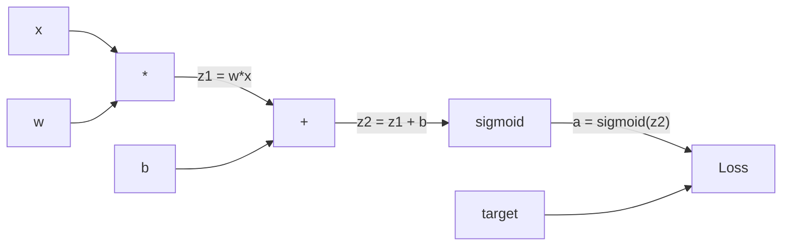
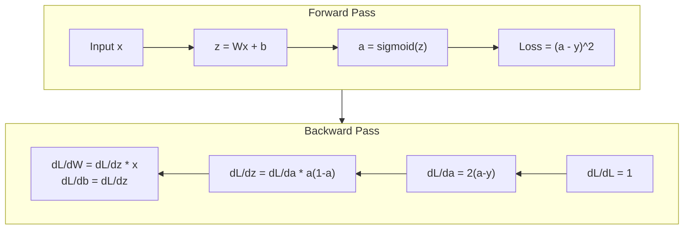
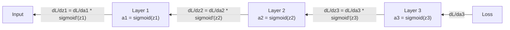

# शून्य से प्रसारण के लिए वापस प्रक्षेपण

> बैकप्रॉपेगेशन वह एल्गोरिथ्म है जो सीखने को संभव बनाता है। इसके बिना, तंत्रिका नेटवर्क केवल महंगे यादृच्छिक संख्या जनरेटर हैं।

> विपरीत प्रसारण सीखने को संभव बनाने का एल्गोरिथ्म है। इसके बिना, तंत्रिका नेटवर्क केवल महंगा आकस्मिक संख्या जनरेटर है।

> **【中文解读】**प्रतिकूल प्रसारण तंत्रिका नेटवर्क को "शिक्षा" करने में सक्षम बनाने के लिए एक मूल एल्गोरिथ्म है। इसके बिना, तंत्रिका नेटवर्क केवल एक असंख्य संख्याओं का संयोजन है। इसकी प्रकृति है कि एक बार एक श्रृंखला विधि के साथ सभी घटकों की तरक्की की गणना करें। एक बार एक बार अग्रिम प्रसारण + एक बार प्रतिकूल प्रसारण सभी 2.3M के वजन के स्तर को प्राप्त करने में सक्षम है, न कि एक-एक करके प्रयास करने के लिए 2.3M बार।

**Type:** Build
**Languages:** Python
**Prerequisites:** Lesson 03.02 (Multi-Layer Networks)
**Time:** ~120 minutes

## सीखने के लक्ष्य

- एक मूल्य आधारित ऑटोग्रेड इंजन को लागू करें जो एक कंप्यूटेशनल ग्राफ बनाता है और टॉपलॉजिकल सॉर्ट के माध्यम से ग्रेडिएंट्स की गणना करता है
  मूल्य आधारित स्वचालित लघु विभाजन इंजन को प्राप्त करना, गणना के ग्राफ का निर्माण करना और क्रमबद्ध गणना की तरक्की से गुजरना
- श्रृंखला नियम का उपयोग करके जोड़, गुणा और सिग्मोइड के लिए पीछे की ओर पास प्राप्त करें
  उपयोग के लिए संकेतन नियम का उपयोग करें
- केवल अपने खरोंच से बैकप्रॉपेगेशन इंजन का उपयोग करके XOR और सर्कल वर्गीकरण पर एक बहु-परत नेटवर्क को प्रशिक्षित करें
   केवल आप XOR और गोल आकार वर्गों पर प्रशिक्षण के साथ शून्य से निर्माण के विपरीत दिशा प्रसारण इंजन बहुस्तरीय नेटवर्क
- गहरे सिग्मोइड नेटवर्क में गायब होने वाली ग्रेडिएंट समस्या की पहचान करें और समझाएं कि ग्रेडिएंट्स का तेजी से घटना क्यों है
  识别深度 sigmoid 网络中的梯度消失问题, व्याख्या क्यों梯度会指数级缩小

> **【中文解读】**इस अध्याय का उद्देश्यः एक स्वचालित माइक्रोसॉफ्ट इंजन का निर्माण करना जो PyTorch autograd जैसा हो, श्रृंखला विधि का उपयोग करके अनुवर्ती प्रसारण का अनुवर्ती प्रसार करना, XOR और गोल आकार के विभाजन के कार्यों का प्रशिक्षण करना, तरंगता गायब होने की समस्या को समझना।

## समस्या  समस्या परिचय

आपके नेटवर्क में 768 इनपुट और 3072 आउटपुट के साथ एक छिपी हुई परत है। यह 2,359,296 वजन है। यह एक गलत भविष्यवाणी की। किस वजन ने त्रुटि का कारण बना? प्रत्येक वजन का व्यक्तिगत रूप से परीक्षण करने का मतलब 2.3 मिलियन आगे के पास है। बैकप्रॉपेगेशन एक एकल पीछे के पास में सभी 2.3 मिलियन ग्रेडिएंट की गणना करता है। यह अनुकूलन नहीं है। यह प्रशिक्षित और असंभव के बीच का अंतर है।

> आपके नेटवर्क में 768  इनपुट  3072  आउटपुट छिपे हुए स्तर हैं  यह 2,359,296  वजन है  यह गलत भविष्यवाणी करता है  किस वजन ने गलत परिणाम दिया? प्रत्येक वजन का मतलब है 230 मिलियन बार अग्रिम प्रसारण  प्रतिकूल प्रसारण  एकल प्रतिकूल प्रसारण में सभी 230 मिलियन डिग्री का गणना  यह अनुकूलन नहीं है  यह प्रशिक्षित और असंभव के बीच का अंतर है 

एक वजन लेने के लिए, इसे एक छोटी मात्रा में धक्का दें, आगे की पार फिर से चलाएं, मापें कि क्या नुकसान ऊपर या नीचे चला गया। यह आपको उस वजन के लिए ग्रेडिएंट देता है। अब नेटवर्क में प्रत्येक वजन के लिए ऐसा करें। हजारों प्रशिक्षण चरणों और लाखों डेटा बिंदुओं से गुणा करें। आपको कुछ भी उपयोगी प्रशिक्षण के लिए भूवैज्ञानिक समय की आवश्यकता होगी।

> 简单方法: एक भार उठाएं, सूक्ष्म रूप से समायोजित करें, फिर से चलें, आगे बढ़ें, मापने की हानि बढ़े या घटें। इस प्रकार आप उस भार के स्तर को प्राप्त करते हैं। अब नेटवर्क में प्रत्येक भार के लिए ऐसा करते हैं। हजारों प्रशिक्षण चरणों और लाखों डेटा बिंदुओं को गुणा करते हुए। आपको किसी भी उपयोगी चीज को प्रशिक्षित करने के लिए समय की आवश्यकता होती है।

बैकप्रॉपेगेशन इसको हल करता है. एक आगे पास, एक पीछे पास, सभी ग्रेडिएंट्स का गणना. ट्रिक है कैल्क्यूलेक्स से श्रृंखला नियम, एक संगणकीय ग्राफ पर व्यवस्थित रूप से लागू किया गया. यह एल्गोरिथ्म है जो गहन सीखने को व्यावहारिक बना दिया. इसके बिना, हम अभी भी खिलौना समस्याओं पर फंस गए होंगे.

> एक बार आगे बढ़कर प्रसार, एक बार पीछे बढ़कर प्रसार, सभी स्तरों पर गणना पूरी हो गई है।

> **【中文解读】**एक 235 मिलियन भारित नेटवर्क, यदि प्रत्येक परीक्षण में एक तरंग की गणना की जाए, तो इसके लिए 235 मिलियन बार अग्रिम-प्रसारण की आवश्यकता होती है।

## अवधारणा का मूल अवधारणा

### नेटवर्क पर लागू श्रृंखला नियम

आप चरण 01, पाठ 05 में श्रृंखला नियम देखा है। त्वरित पुनरावृत्तिः यदि y = f(g(x)), तो dy/dx = f'(g(x)) * g'(x। आप श्रृंखला के साथ व्युत्पन्न गुणा करते हैं।

> 你在第一阶段第 05 课见过链式法则──快速回顾: यदि y = f(g(x)),则 dy/dx = f'(g(x)) * g'(x)──你沿着链条将导数相乘──

न्यूरल नेटवर्क में, "चेन" इनपुट से नुकसान तक संचालन का क्रम है। प्रत्येक परत भार लागू करती है, पूर्वाग्रह जोड़ती है, सक्रियण से गुजरती है। हानि फ़ंक्शन अंतिम आउटपुट की तुलना लक्ष्य से करती है। बैकप्रॉपेगेशन इस श्रृंखला को पीछे की ओर ट्रैक करता है, यह गणना करता है कि प्रत्येक ऑपरेशन ने त्रुटि में कैसे योगदान दिया।

> तंत्रिका नेटवर्क में, "कड़ियाँ" इनपुट से हानि तक संचालन की क्रमबद्धता है। प्रत्येक स्तर पर अनुप्रयोग भार, अतिरिक्त विकृति, सक्रियण फ़ंक्शन के माध्यम से। हानि फ़ंक्शन अंततः आउटपुट और लक्ष्य की तुलना करेगा।

> **【中文解读】**链式法则: यदि y = f(g(x)),则 dy/dx = f'(g(x)) * g'(x) ・・・ में तंत्र नेटवर्क में, "链" म्हणजे इनपुट से हानि तक की एक श्रृंखला संचालन──反向传播沿着 इस कड़ी倒推, गणना प्रत्येक ऑपरेशन के लिए त्रुटि के योगदान──

> **【拓展：PyTorch autograd 的核心】**पिटॉर्च की `loss.backward()`यह पूर्ववर्ती प्रसार के समय रिकॉर्ड गणना चित्र में है, जो कि किस प्रकार के संचालन से उत्पन्न होते हैं, फिर पीछे की ओर, विपरीत प्रसार की तरफ़।

### कम्प्यूटेशनल ग्राफ्स

प्रत्येक आगे के पास एक ग्राफ बनाता है। प्रत्येक नोड एक ऑपरेशन (बहुगुणित, जोड़, सिग्मोइड) है। प्रत्येक किनारे में एक मान आगे और एक ग्रेडिएंट पीछे ले जाता है।

> प्रत्येक पूर्ववर्ती प्रसारण एक चित्र का निर्माण करते हैं। प्रत्येक खंड एक परिचालन है। प्रत्येक किनारा एक मान आगे, एक आयाम पीछे, एक आयाम पीछे, एक आयाम पीछे, एक आयाम पीछे, एक आयाम पीछे, एक आयाम पीछे, एक आयाम पीछे, एक आयाम पीछे, एक आयाम पीछे, एक आयाम पीछे, एक आयाम पीछे, एक आयाम पीछे, एक आयाम पीछे, एक आयाम पीछे, एक आयाम पीछे, एक आयाम पीछे, एक आयाम पीछे, एक आयाम पीछे, एक आयाम पीछे, एक आयाम पीछे, एक आयाम पीछे, एक आयाम पीछे, एक आयाम पीछे, एक आयाम पीछे, एक आयाम पीछे, एक आयाम पीछे, एक आयाम पीछे, एक आयाम पीछे, एक आयाम पीछे, एक आयाम पीछे, एक आयाम पीछे, एक आयाम पीछे, एक आयाम पीछे, एक आयाम पीछे, एक आयाम पीछे, एक आयाम पीछे, एक आयाम पीछे, एक आयाम के पीछे, एक आयाम के पीछे, एक आयाम के पीछे, एक आयाम के पीछे, एक आयाम के पीछे, एक आयाम के पीछे, एक आयाम के पीछे, एक आयाम के पीछे, एक आयाम के पीछे, एक आयाम के पीछे, एक आयाम के साथ, एक आयाम के साथ, एक आयाम के साथ, एक आयाम के साथ, एक आयाम के साथ, एक आयाम के साथ, एक आयाम के साथ, एक आयाम के साथ, एक आयाम के साथ, एक आयाम के साथ, एक आयाम के साथ, एक आयाम के साथ, एक आयाम के साथ, एक आयाम के साथ, एक आयाम के साथ, एक आयाम के साथ, एक आयाम के साथ, एक आयाम के साथ, एक है, एक आयाम के साथ, एक है, एक है, एक आयाम के साथ, एक है, एक है, एक है, एक है, एक है, एक है, एक है, एक है, जो एक है, एक है, जो एक है, एक है, जो एक है, एक है, जो एक है, एक है, जो है, जो एक है, एक है, जो है, जो है, एक है, जो है, जो है, एक है, एक है, जो है, एक है, जो है, जो है, एक है, जो है, जो है, एक है, जो है



आगे की ओर पासः मान बाएं से दाएं बहते हैं। x और w z1 = w*x उत्पन्न करते हैं। z2 प्राप्त करने के लिए b जोड़ें। सिग्मोइड सक्रियण a देता है। हानि फ़ंक्शन का उपयोग करके a को लक्ष्य y के साथ तुलना करें।

> पूर्व दिशा प्रसार: मूल्य से बाईं ओर दाईं ओर प्रवाह──x 和 w  उत्पन्न z1 = w*x──加 b  प्राप्त z2──सिग्मोइड  देने सक्रिय a── उपयोग हानि फ़ंक्शन एक से लक्ष्य y  तुलना करेंगे──

पीछे की ओर पासः ग्रेडिएंट दाएं से बाएं तक बहते हैं। dL/da (सक्रियता के साथ नुकसान कैसे बदलता है) से शुरू करें। da/dz2 (सिग्मोइड व्युत्पन्न) से गुणा करें। यह dL/dz2 देता है। dL/dz2 में विभाजित करें (जो dL/dz2 के बराबर है, क्योंकि z2 = z1 + b) और dL/dz1 के बराबर है। फिर dL/dw = dL/dz1 * x और dL/dx = dL/dz1 * w।

> विपरीत दिशा में प्रसारः梯度 from right to left流动──从 dL/da(损失如何随激活变化)开始──乘以 da/dz2(sigmoid 导数)──得到 dL/dz2──分为 dL/dz2──等于 dL/dz2,因为 z2 = z1 + b) 和 dL/dz1──然后 dL/dw = dL/dz1 * x,dL/dx = dL/dz1 * w。

ग्राफ में प्रत्येक नोड का एक काम है पीछे की ओर जाने के दौरानः ऊपर से आने वाले ग्रेडिएंट को ले लो, स्थानीय व्युत्पन्न से गुणा करो, और इसे नीचे ले जाओ।

> प्रतिबिंबित प्रसार में प्रत्येक बिंदु का केवल एक कार्य होता हैः उपरोक्त से उपरोक्त की तरफ़ से प्राप्त करने, अपने स्थानीय दिशाओं से गुणा करने, उपरोक्त से उपरोक्त तक पहुँचने,

> **【中文解读】**计算图中的每个节点 (乘法、加法、sigmoid) 前向传播时传递值,反向传播时传递梯度── प्रत्येक节点只需要做一个事:接收上梯度,乘以自己的局部导数,传递下去──这是反向传播的全部逻辑──

### आगे और पीछे



आगे के पास में प्रत्येक मध्यवर्ती मान संग्रहीत होता हैः z, a, प्रत्येक परत के इनपुट। पिछड़े पास में ग्रेडिएंट्स का गणना करने के लिए इन संग्रहीत मानों की आवश्यकता होती है। यह बैकप्रॉप के केंद्र में मेमोरी-गणना व्यापार है। आप गति (मिलियंस के बजाय एक पास) के लिए मेमोरी (स्टोरेज सक्रियण) का आदान-प्रदान करते हैं।

> पूर्ववत प्रसारण भंडार के सभी मध्य मूल्य:z、a、 प्रत्येक स्तर के इनपुटों के लिए। पूर्ववत प्रसारण भंडार के लिए इन भंडारों के मूल्य की गणना की आवश्यकता होती है।

> **【中文解读】**पूर्व दिशा प्रसारण भंडारण के सभी मध्य मूल्य (z、a、 प्रत्येक स्तर में प्रवेश), पूर्व दिशा प्रसारण इन मूल्यों की आवश्यकता है ताकि तीसरी गणना की जा सके।

### नेटवर्क के माध्यम से ग्रेडिएंट प्रवाह नेटवर्क में प्रवाह

तीन परतों के नेटवर्क के लिए, प्रत्येक परत के माध्यम से ग्रेडिएंट श्रृंखलाः

>  3 स्तरीय नेटवर्क के लिए, प्रत्येक स्तरीय लिंक के माध्यम से 梯度传递:



प्रत्येक परत पर, ग्रेडिएंट सिग्मोइड व्युत्पन्न द्वारा गुणा किया जाता है। सिग्मोइड व्युत्पन्न * (1 - ए) है, जो 0.25 पर अधिकतम निकलता है (जब ए = 0.5) । तीन परतों की गहराई पर, ग्रेडिएंट को अधिकतम 0.25^3 = 0.0156 से गुणा किया गया है। दस परतों की गहराईः 0.25^10 = 0.000001।

> प्रत्येक स्तर पर,梯度都乘以sigmoid के导数──sigmoid 导数是 * (1 - a), अधिकतम मूल्य 0.25 है, जबकि a = 0.5 时)──三层后,梯度最多乘以 0.25^3 = 0.0156──十层后:0.25^10 = 0.000001──

### गिरने वाले ग्रेडिएंट्स

यह गायब हो रही ग्रेडिएंट समस्या है। सिग्मोइड अपना आउटपुट 0 से 1 के बीच कुचल देता है। इसका व्युत्पन्न हमेशा 0.25 से कम होता है। पर्याप्त सिग्मोइड परतें ढेर करें और ग्रेडिएंट्स शून्य तक सिकुड़ जाते हैं। शुरुआती परतें मुश्किल से सीखती हैं क्योंकि उन्हें लगभग शून्य ग्रेडिएंट प्राप्त होते हैं।

> यही है कि सिग्मोइड की गायब होने की समस्या है। सिग्मोइड 0 और 1 के बीच तक संपीड़न करेगा। इसका निर्देशांक हमेशा 0.25 से कम होता है।

```
sigmoid(z):     Output range [0, 1]              # 输出范围 [0, 1]
sigmoid'(z):    Max value 0.25 (at z = 0)        # 导数最大值 0.25（在 z = 0 时）

After 5 layers:   gradient * 0.25^5 = 0.001x original       # 5 层后梯度缩到 0.001 倍
After 10 layers:  gradient * 0.25^10 = 0.000001x original    # 10 层后梯度几乎为零
```

यही कारण है कि गहरे सिग्मोइड नेटवर्क को प्रशिक्षित करना लगभग असंभव है. फिक्स - ReLU और इसके संस्करण - पाठ 04 का विषय है. अभी के लिए, समझें कि बैकप्रॉप सही ढंग से काम करता है. समस्या यह है कि यह क्या काम कर रहा है के माध्यम से काम कर रहा है.

> यही कारण है कि गहन सिग्मोइड  नेटवर्क लगभग असंभव है प्रशिक्षण। समाधान  RELU  और उसके परिवर्तन  है चौथी  कक्षा का विषय  अब, केवल इसके विपरीत प्रसार को समझने की आवश्यकता है कि यह खुद को अच्छी तरह से काम करता है, समस्या उस चीज़ में है जो इसके माध्यम से होती है 

> **【中文解读】**梯度消失: सिग्मोइड का निर्देशांक अधिकतम 0.25 है, प्रत्येक एक स्तर के माध्यम से एक स्तर के बाद अधिकतम 0.25 है।

> **【拓展：Transformer 中的梯度流】**ट्रांसफार्मर उपयोग残差连接(अवशिष्ट कनेक्शन) हल梯度消失 समस्याः`output = x + sublayer(x)`️ इस प्रकार की तरंग से उप-स्तरों पर सीधे प्रसार हो सकता है, जिससे जीपीटी-3 के 96-स्तर भी प्रशिक्षित हो सकते हैं️ResNet के "跨层连接" का भी यही सिद्धांत है️

### दो परत नेटवर्क के लिए ग्रेडिएंट्स व्युत्पन्न करना

इनपुट एक्स, सिग्मोइड के साथ छिपे हुए परत, सिग्मोइड के साथ आउटपुट परत और एमएसई हानि के साथ नेटवर्क के लिए ठोस गणित।

> 具体推导一个具有输入 x、sigmoid 隐藏层、sigmoid 输出层和MSE 损失的网络──

आगे की पासः
```
z1 = W1 * x + b1          # 隐藏层线性变换
a1 = sigmoid(z1)           # 隐藏层激活
z2 = W2 * a1 + b2          # 输出层线性变换
a2 = sigmoid(z2)           # 输出层激活
L = (a2 - y)^2             # MSE 损失
```

पीछे की ओर जाने का रास्ता (चिन्तन नियम को कदम से कदम लागू करना):
```
dL/da2 = 2(a2 - y)                              # 损失对输出的梯度
da2/dz2 = a2 * (1 - a2)                         # sigmoid 导数
dL/dz2 = dL/da2 * da2/dz2 = 2(a2 - y) * a2 * (1 - a2)  # 链式法则

dL/dW2 = dL/dz2 * a1                            # 输出层权重梯度
dL/db2 = dL/dz2                                  # 输出层偏置梯度

dL/da1 = dL/dz2 * W2                             # 梯度传播到隐藏层
da1/dz1 = a1 * (1 - a1)                          # sigmoid 导数
dL/dz1 = dL/da1 * da1/dz1                        # 链式法则

dL/dW1 = dL/dz1 * x                              # 隐藏层权重梯度
dL/db1 = dL/dz1                                   # 隐藏层偏置梯度
```

हर gradient स्थानीय व्युत्पन्न के उत्पाद है नुकसान से वापस पता चला है.

> प्रत्येक तह का स्थानिक मार्गदर्शक संख्या से नुकसान की संख्या में गुणा होता है।

> **【中文解读】**两层网络的梯度推导: हानि फ़ंक्शन से शुरू होकर, श्रृंखला विधि के साथ चरणबद्ध रूप से वापस गणना करें। प्रत्येक梯度 स्थानीय निर्देश संख्या का संयोजन है।

## इसे बनाओ।
```figure
backprop-vanishing
```

## इसे बनाओ

### चरण 1: मूल्य नोड मूल्य बिंदु

हमारे गणना में प्रत्येक संख्या एक मान बन जाती है. यह अपने डेटा, उसके ग्रेडिएंट को संग्रहीत करती है, और यह कैसे बनाया गया था (तो यह जानता है कि ग्रेडिएंट को पीछे की ओर कैसे गणना की जाए) ।

> हमारे गणना में प्रत्येक संख्या एक मूल्य में बदल जाती है। यह डेटा को संग्रहीत करती है, और यह कैसे बनाया जाता है।

```python
class Value:
    def __init__(self, data, children=(), op=''):
        self.data = data                          # 这个节点的数值
        self.grad = 0.0                           # 损失对这个值的梯度（初始为 0）
        self._backward = lambda: None             # 反向传播函数（初始为空操作）
        self._children = set(children)            # 产生这个值的子节点（用于拓扑排序）
        self._op = op                             # 产生这个值的操作（用于调试可视化）
```

अभी तक कोई ग्रेडिएंट नहीं (0.0)। अभी तक कोई बैकवर्ड फ़ंक्शन नहीं (नो-ऑप) ।`_children`ट्रैक जो मान इस एक उत्पन्न किया है, तो हम बाद में टॉपॉलॉजिकल रूप से ग्राफ क्रमबद्ध कर सकते हैं.

> वहाँ कोई तरंग नहीं है (0.0)`_children`इस तरह हम बाद में विस्तार से क्रमबद्ध करने के लिए इस मूल्य उत्पन्न किया है।

### चरण 2: बैकवर्ड फ़ंक्शन के साथ ऑपरेशन

प्रत्येक ऑपरेशन एक नया मान बनाता है और यह परिभाषित करता है कि ग्रेडिएंट उसके माध्यम से कैसे पीछे की ओर बहते हैं।

> प्रत्येक क्रिया एक नया मूल्य उत्पन्न करती है और यह निर्धारित करती है कि इसके विपरीत प्रवाह कैसे होता है।

```python
def __add__(self, other):
    other = other if isinstance(other, Value) else Value(other)
    out = Value(self.data + other.data, (self, other), '+')

    def _backward():
        self.grad += out.grad        # 加法的梯度：d(a+b)/da = 1，直接传递
        other.grad += out.grad       # d(a+b)/db = 1，直接传递

    out._backward = _backward
    return out

def __mul__(self, other):
    other = other if isinstance(other, Value) else Value(other)
    out = Value(self.data * other.data, (self, other), '*')

    def _backward():
        self.grad += other.data * out.grad   # 乘法的梯度：d(a*b)/da = b
        other.grad += self.data * out.grad   # d(a*b)/db = a

    out._backward = _backward
    return out
```

जोड़ने के लिएः d(a+b) /da = 1, d(a+b) /db = 1. तो दोनों इनपुट सीधे आउटपुट की ग्रेडिएंट प्राप्त करते हैं।

> 加法:d(a+b)/da = 1,d(a+b)/db = 1。 इसलिए दो इनपुट सीधे आउटपुट रेंज प्राप्त होते हैं。

गुणा के लिएः d(a*b)/da = b, d(a*b)/db = a. प्रत्येक इनपुट को दूसरे का मान गुणा आउटपुट ग्रेडिएंट मिलता है।

> 乘法:d(a*b)/da = b,d(a*b)/db = a。 प्रत्येक प्रविष्टि को एक और का मान乘以输出梯度──

`+=`एक मान कई संचालन में इस्तेमाल किया जा सकता है. इसके ग्रेडिएंट सभी पथों से ग्रेडिएंट के योग है.

> `+=`एक मूल्य कई ऑपरेशनों में उपयोग किया जा सकता है। इसकी तरंग सभी मार्गों की तरंग से आती है।

> **【中文解读】**अतिरिक्त गति का सीधा संचरण (प्रत्यक्ष संचरण)`+=`नहीं `=`, क्योंकि एक मूल्य कई ऑपरेशनों द्वारा उपयोग किया जा सकता है, सभी मार्गों से gradient को जोड़ना आवश्यक है।

### चरण 3: सिग्मोइड और हानि सिग्मोइड और हानि फ़ंक्शन

```python
import math

def sigmoid(self):
    x = self.data
    x = max(-500, min(500, x))    # 裁剪防止溢出
    s = 1.0 / (1.0 + math.exp(-x))  # 前向：计算 sigmoid
    out = Value(s, (self,), 'sigmoid')

    def _backward():
        self.grad += (s * (1 - s)) * out.grad  # 反向：sigmoid 导数 = σ(x) * (1 - σ(x))

    out._backward = _backward
    return out
```

सिग्मोइड व्युत्पन्नः सिग्मोइड(x) * (1 - सिग्मोइड(x)). हमने आगे के पास के दौरान सिग्मोइड(x) = s का गणना की। इसे पुनः उपयोग करें। कोई अतिरिक्त काम नहीं।

> सिग्मोइड 导数:सिग्मोइड(x) * (1 - सिग्मोइड(x))。 हम पहले से ही सिग्मोइड (x) = s── पुनः उपयोग करने की आवश्यकता नहीं है, अतिरिक्त काम की आवश्यकता नहीं है──

```python
def mse_loss(predicted, target):
    diff = predicted + Value(-target)  # predicted - target
    return diff * diff                  # (predicted - target)^2
```

एकल आउटपुट के लिए एमएसईः (पूर्वानुमानित - लक्ष्य) ^ 2। हम शून्य मान के साथ योग के रूप में घटावट व्यक्त करते हैं।

> 单输出 MSE:(预测 - लक्ष्य) ^2──我们将减法表示为加上取反的值──

### चरण 4: पीछे की ओर से पारित करें

टोपोलॉजिकल सॉर्ट सुनिश्चित करता है कि हम नोड्स को सही क्रम में संसाधित करें - नोड का ग्रेडिएंट पूरी तरह से जमा हो जाता है इससे पहले कि हम इसके माध्यम से प्रसारित हों।

> 拓排序 सुनिश्चित करें कि हम सही क्रम में संसाधित करें  एक                                                                                                                                                                                                                                                      

```python
def backward(self):
    topo = []                         # 拓扑排序结果
    visited = set()

    def build_topo(v):
        if v not in visited:
            visited.add(v)
            for child in v._children:    # 先访问所有子节点
                build_topo(child)
            topo.append(v)               # 子节点都访问完后，再把自己加入列表

    build_topo(self)
    self.grad = 1.0                     # 损失对自己的梯度 = 1（dL/dL = 1）
    for v in reversed(topo):            # 逆序遍历（从输出到输入）
        v._backward()                   # 每个节点执行自己的反向传播函数
```

खोने से शुरू करें (ग्रिडिएंट = 1.0, क्योंकि dL/dL = 1). क्रमबद्ध ग्राफ के माध्यम से पीछे की ओर चलें। प्रत्येक नोड का `_backward`अपने बच्चों को gradients धक्का देता है।

>                                                                                                                                                                                                                                                               `_backward`उस के नीचे की रेखा को बढ़ाएँगे।

> **【中文解读】**拓排序保证: एक节点的梯度完全累加后,才往它的子节点传播──从损失 (梯度) = 1) से शुरू,逆序遍历计算图, प्रत्येक节点把梯度传递给产生它的子节点──这是 PyTorch`loss.backward()`इसका मूल तर्क है।

### चरण 5: परत और नेटवर्क परत और नेटवर्क

```python
import random

class Neuron:
    def __init__(self, n_inputs):
        scale = (2.0 / n_inputs) ** 0.5   # He 初始化缩放因子，防止 sigmoid 饱和
        self.weights = [Value(random.uniform(-scale, scale)) for _ in range(n_inputs)]
        self.bias = Value(0.0)

    def __call__(self, x):
        act = sum((wi * xi for wi, xi in zip(self.weights, x)), self.bias)  # 加权求和 + 偏置
        return act.sigmoid()  # sigmoid 激活

    def parameters(self):
        return self.weights + [self.bias]   # 返回所有可训练参数


class Layer:
    def __init__(self, n_inputs, n_outputs):
        self.neurons = [Neuron(n_inputs) for _ in range(n_outputs)]

    def __call__(self, x):
        out = [n(x) for n in self.neurons]
        return out[0] if len(out) == 1 else out  # 单神经元时直接返回值

    def parameters(self):
        params = []
        for n in self.neurons:
            params.extend(n.parameters())
        return params


class Network:
    def __init__(self, sizes):
        self.layers = []
        for i in range(len(sizes) - 1):
            self.layers.append(Layer(sizes[i], sizes[i + 1]))  # 按尺寸列表构建层

    def __call__(self, x):
        for layer in self.layers:
            x = layer(x)                    # 逐层前向传播
            if not isinstance(x, list):
                x = [x]
        return x[0] if len(x) == 1 else x

    def parameters(self):
        params = []
        for layer in self.layers:
            params.extend(layer.parameters())
        return params

    def zero_grad(self):
        for p in self.parameters():
            p.grad = 0.0    # 清零所有梯度（每次反向传播前必须调用）
```

एक न्यूरॉन इनपुट लेता है, वजन योग + पूर्वाग्रह की गणना करता है, और सिग्मोइड लागू करता है। गहरे नेटवर्क में सिग्मोइड संतृप्ति को रोकने के लिए वर्ग ((2/n_input) द्वारा वजन आरंभिकरण पैमाने। एक परत न्यूरॉन की एक सूची है। एक नेटवर्क परतों की एक सूची है।`parameters()`विधि सभी सीखने योग्य मूल्यों को इकट्ठा करता है ताकि हम उन्हें अद्यतन कर सकें।

> न्यूरॉन 接收输入,计算加权和加偏置,然后应用 sigmoid──权重初始化按平方(2/n_inputs) 缩放以防止更深层网络中 sigmoid 和──层是 न्यूरॉन的列表──网络是层的列表──`parameters()`方法 संग्रह सभी सीखने योग्य मूल्य ताकि अद्यतन हो जाए

> **【中文解读】**न्यूरॉन = एक तंत्रिका (Neuron) (权重 + 偏置 + sigmoid), लेयर = एक तंत्रिका (Layer) (Network = 一组层)`parameters()`收集所有可训练参数,`zero_grad()`清零梯度 (~)                                                                                                                                                                                                                                                           `model.parameters()`和 `optimizer.zero_grad()`का मूल प्रकार

### चरण 6: XOR पर प्रशिक्षण XOR प्रशिक्षण

```python
random.seed(42)
net = Network([2, 4, 1])  # 2 输入 → 4 隐藏神经元 → 1 输出

xor_data = [
    ([0.0, 0.0], 0.0),
    ([0.0, 1.0], 1.0),
    ([1.0, 0.0], 1.0),
    ([1.0, 1.0], 0.0),
]

learning_rate = 1.0

for epoch in range(1000):
    total_loss = Value(0.0)
    for inputs, target in xor_data:
        x = [Value(i) for i in inputs]
        pred = net(x)                          # 前向传播
        loss = mse_loss(pred, target)          # 计算损失
        total_loss = total_loss + loss         # 累积损失

    net.zero_grad()           # 清零梯度
    total_loss.backward()     # 反向传播：计算所有参数的梯度

    for p in net.parameters():
        p.data -= learning_rate * p.grad      # 梯度下降更新权重

    if epoch % 100 == 0:
        print(f"Epoch {epoch:4d} | Loss: {total_loss.data:.6f}")

print("\nXOR Results:")
for inputs, target in xor_data:
    x = [Value(i) for i in inputs]
    pred = net(x)
    print(f"  {inputs} -> {pred.data:.4f} (expected {target})")
```

यादृच्छिक भविष्यवाणियों से XOR आउटपुट को सही करने के लिए, पूरी तरह से बैकप्रॉपेगेशन कंप्यूटिंग ग्रेडिएंट और सही दिशा में वजन को धक्का देने से प्रेरित।

> 观察损失下降──随机预测 से लेकर सही XOR 输出 तक, पूरी तरह से विपरीत दिशा में प्रसारण गणना की तरंग से ही भार सही दिशा में धकेलकर संचालित होगा──

> **【中文解读】** प्रशिक्षण चक्र: पूर्ववर्ती प्रसार →  गणना हानि → विपरीतवर्ती प्रसार →  नवीनीकृत शक्ति। यह चार चरण सभी गहन सीखने प्रशिक्षण के मूल हैं।

### चरण 7: सर्कल वर्गीकरण 圆形分类

पाठ 02 में, आप चक्र वर्गीकरण के लिए वजन हाथ से समायोजित. अब नेटवर्क उन्हें सीखने दें.

> कक्षा 02 में, आपने अपने स्वयं के नेटवर्क को उन्हें सीखने के लिए एक गोल वर्ग के वजन को समायोजित किया है।

```python
random.seed(7)

def generate_circle_data(n=100):
    data = []
    for _ in range(n):
        x1 = random.uniform(-1.5, 1.5)
        x2 = random.uniform(-1.5, 1.5)
        label = 1.0 if x1 * x1 + x2 * x2 < 1.0 else 0.0   # 距原点 < 1 则为"内部"
        data.append(([x1, x2], label))
    return data

circle_data = generate_circle_data(80)

circle_net = Network([2, 8, 1])  # 2-8-1 网络
learning_rate = 0.5

for epoch in range(2000):
    random.shuffle(circle_data)       # 打乱数据顺序
    total_loss_val = 0.0
    for inputs, target in circle_data:
        x = [Value(i) for i in inputs]
        pred = circle_net(x)
        loss = mse_loss(pred, target)
        circle_net.zero_grad()         # 清零梯度
        loss.backward()                # 反向传播
        for p in circle_net.parameters():
            p.data -= learning_rate * p.grad  # 更新权重
        total_loss_val += loss.data

    if epoch % 200 == 0:
        correct = 0
        for inputs, target in circle_data:
            x = [Value(i) for i in inputs]
            pred = circle_net(x)
            predicted_class = 1.0 if pred.data > 0.5 else 0.0
            if predicted_class == target:
                correct += 1
        accuracy = correct / len(circle_data) * 100
        print(f"Epoch {epoch:4d} | Loss: {total_loss_val:.4f} | Accuracy: {accuracy:.1f}%")
```

हम ऑनलाइन SGD का उपयोग करते हैं यहाँ - प्रत्येक नमूना के बाद वजन अपडेट करने के बजाय पूरे बैच को जमा करने के लिए। यह सममितता को तेजी से तोड़ता है और पूर्ण हानि परिदृश्य पर सिग्मोइड संतृप्ति से बचाता है। प्रत्येक युग में डेटा को मिलाकर नेटवर्क को क्रम को याद रखने से रोकता है।

> इस प्रकार, प्रत्येक नमूना के बाद वजन को अद्यतन करने के बजाय, पूरे बैच को संचित करने के लिए ऑनलाइन SGD का उपयोग किया जाता है। यह पूरे बैच को तेजी से तोड़ सकता है और पूरे नुकसान के मोड़ पर सिग्मोइड  और  को रोकने में मदद कर सकता है।

कोई हाथ से ट्यूनिंग नहीं। नेटवर्क अपने आप परिपत्र निर्णय सीमा का पता लगाता है। यह बैकप्रॉगरेशन की शक्ति हैः आप वास्तुकला, हानि समारोह, और डेटा को परिभाषित करते हैं। एल्गोरिथम वजन का आंकलन करता है।

> 无需手动调权重――网络自学画圆形决策边界―― यही विपरीत प्रसार की शक्ति हैः आप संरचना परिभाषित करते हैं、 हानि फ़ंक्शन और डेटा, एल्गोरिदम स्वयं सही वजन का पता लगाता है――

> **【中文解读】**यह ऑनलाइन SGD (आधार के लिए) के साथ है, न कि थोक अद्यतनों के साथ।

## इसका प्रयोग करें।

PyTorch कुछ पंक्तियों में ऊपर सब कुछ करता है. मूल विचार समान है - ऑटोग्रेड आगे के पास के दौरान एक गणना ग्राफ बनाता है और इसे पीछे की ओर गणना gradients के लिए ट्रैक करता है.

> PyTorch ने कुछ कोड लाइनों के साथ उपरोक्त सभी कार्यों को पूरा किया है।

```python
import torch
import torch.nn as nn

model = nn.Sequential(
    nn.Linear(2, 4),       # 对应我们的 Layer(2, 4)
    nn.Sigmoid(),           # 对应 sigmoid 激活
    nn.Linear(4, 1),       # 对应我们的 Layer(4, 1)
    nn.Sigmoid(),
)
optimizer = torch.optim.SGD(model.parameters(), lr=1.0)  # 对应我们的手动梯度下降
criterion = nn.MSELoss()  # 对应我们的 mse_loss

X = torch.tensor([[0,0],[0,1],[1,0],[1,1]], dtype=torch.float32)
y = torch.tensor([[0],[1],[1],[0]], dtype=torch.float32)

for epoch in range(1000):
    pred = model(X)                  # 前向传播
    loss = criterion(pred, y)        # 计算损失
    optimizer.zero_grad()            # 清零梯度（对应 net.zero_grad()）
    loss.backward()                  # 反向传播（对应 total_loss.backward()）
    optimizer.step()                 # 更新权重（对应 p.data -= lr * p.grad）

print("PyTorch XOR Results:")
with torch.no_grad():                # 推理模式，不计算梯度
    for i in range(4):
        pred = model(X[i])
        print(f"  {X[i].tolist()} -> {pred.item():.4f} (expected {y[i].item()})")
```

`loss.backward()`है तुम्हारा `total_loss.backward()`. .`optimizer.step()`यह आपका मैनुअल है `p.data -= lr * p.grad`. .`optimizer.zero_grad()`है तुम्हारा `net.zero_grad()`. एक ही एल्गोरिथ्म, औद्योगिक शक्ति कार्यान्वयन. PyTorch GPU त्वरण, मिश्रित परिशुद्धता, ग्रेडिएंट चेकपोइंटिंग, और सैकड़ों परत प्रकारों को संभालता है. लेकिन पीछे की पार एक ही गणना ग्राफ पर लागू श्रृंखला नियम है।

> `loss.backward()`यही तुम्हारा है`total_loss.backward()``optimizer.step()`यही तुम्हारा हाथ है`p.data -= lr * p.grad``optimizer.zero_grad()`यही तुम्हारा है`net.zero_grad()` समान एल्गोरिथ्म, औद्योगिक स्तर पर कार्यान्वयन पाईटॉर्च  GPU संसाधित 加速、混合精度、梯度检查点和数百种层类型 लेकिन विपरीत दिशा में प्रसारण के समान श्रृंखला विधि एक ही गणना के लिए लागू की जाएगी

प्रशिक्षण आगे के पास चलाता है, फिर पीछे के पास, फिर वजन अद्यतन करता है। इन्फेरेंस केवल आगे की पास चलाता है। कोई gradients, कोई अद्यतन नहीं. यह अंतर महत्वपूर्ण है क्योंकि उत्पादन में क्या होता है, वह निष्कर्ष है। जब आप क्लाउड या जीपीटी जैसे एपीआई को कॉल करते हैं, तो आप निष्कर्ष चला रहे हैं -- आपका प्रॉम्प्ट नेटवर्क के माध्यम से आगे बढ़ता है, और टोकन दूसरे छोर से बाहर आते हैं। कोई वजन परिवर्तन नहीं। बैकपॉइंट को समझना महत्वपूर्ण है क्योंकि इसने उस नेटवर्क में हर वजन को आकार दिया।

>  प्रशिक्षण चलाना पूर्व दिशा प्रसारण, फिर विपरीत दिशा प्रसारण, फिर उन्नयन चलाना权重── अनुशासन केवल पूर्व दिशा प्रसारण── बिना तरंग, बिना अद्यतन── यह अंतर महत्वपूर्ण है, क्योंकि अनुशासन उत्पादन वातावरण में होता है── जब आप क्लाउड या जीपीटी आदि एपीआई का उपयोग करते हैं, तो आप अनुशासन चलाना है अपने सुझाव शब्द पूर्व दिशा प्रसारण नेटवर्क, टोकन से दूसरे छोर से आउटपुट── शक्ति भार नहीं बदलता── अनुशासन को समझने के लिए विपरीत दिशा प्रसारण महत्वपूर्ण है, क्योंकि यह उस नेटवर्क में प्रत्येक शक्ति भार को आकार देता है──

> **【中文解读】**पिटॉर्च की `loss.backward()`= हम हाथ से लिखते हैं `backward()`,`optimizer.step()`= हम हाथ से लिखते हैं `p.data -= lr * p.grad`◊ प्रशिक्षण समय पूर्ववर्ती + विपरीतवर्ती + अद्यतन, विचार समय केवल पूर्ववर्ती ◊ जब आप GPT / Claude API ◊ को बुलाते हैं, तो यह आपके सुझाव शब्द पूर्ववर्ती नेटवर्क, आउटपुट टोकन, वजन नहीं बदलता है ◊ समझना विपरीतवर्ती प्रसार महत्वपूर्ण है, क्योंकि यह मॉडल में प्रत्येक वजन को आकार देता है ◊

## इसे भेजें।

इस पाठ से उत्पन्न होता हैः
- `outputs/prompt-gradient-debugger.md`-- किसी भी तंत्रिका नेटवर्क में ग्रेडिएंट समस्याओं (विनाश, विस्फोट, एनएएन) का निदान करने के लिए एक पुनः प्रयोज्य संकेत

> 本课产出:`outputs/prompt-gradient-debugger.md`- एक दोहराया जा सकता निदान किसी भी तंत्रिका नेटवर्क मध्य स्तर समस्या ((( गायब हो जाओ, विस्फोट, NaN) के सुझाव शब्द

## अभ्यास विषय

1. एक जोड़ें `__sub__`मान वर्ग (a - b = a + (-1 * b) के लिए विधि) । फिर एक `__neg__`विधि. (a - b) ^2 जैसे सरल अभिव्यक्ति के लिए मैनुअल गणना की तुलना करके यह सत्यापित करें कि ग्रेडिएंट सही हैं।
   > **练习 1：**给 Value 类加减法和取负操作──使用手动计算验证 (a - b) ^ 2 के gradient क्या सही है──

2. एक जोड़ें `relu`मान (आउटपुट अधिकतम ((0, x), व्युत्पन्न 1 है अगर x > 0, तो 0 है. छिपे हुए परतों में रेलू के साथ सिग्मोइड को बदलें और फिर से XOR पर ट्रेन करें. अभिसरण गति की तुलना करें. आपको तेज प्रशिक्षण देखना चाहिए - यह सबक 04 का पूर्वावलोकन करता है।
   > **练习 2：**给值 添加 ReLU 方法──ReLU 换藏层的 sigmoid,训练 XOR 并对比收速度──ReLU 应该更快这是下一课的预览──

3. एक `__pow__`पूर्णांक शक्तियों के लिए मूल्य पर विधि का उपयोग करें।`mse_loss`एक उचित के साथ `(predicted - target) ** 2`अभिव्यक्ति. सत्यापित करें कि ग्रेडिएंट मूल कार्यान्वयन से मेल खाते हैं।
   > **练习 3：**给值 添加运算方法, इसका उपयोग MSE 损失――验证梯度与原始实现一致―― के साथ पुनः लिखें।

4. प्रशिक्षण लूप में ग्रेडिएंट क्लिपिंग जोड़ेंः कॉल करने के बाद `backward()`एक गहरी नेटवर्क (4+ परतों के साथ सिग्मोइड) को प्रशिक्षित करें और कटौती के साथ और बिना हानि वक्रों की तुलना करें। यह विस्फोट gradients के खिलाफ आपका पहला बचाव है।
   > **练习 4：**प्रशिक्षण चक्र में वृद्धि तह काटना (अधिक) [-1, 1]) ◊ प्रशिक्षण 4+ परतों के सिग्मोइड  नेटवर्क, के विरूद्ध है / बिना काटना के नुकसान वक्रों ◊

5. एक दृश्य निर्माण करेंः XOR पर प्रशिक्षण के बाद, नेटवर्क में प्रत्येक पैरामीटर का ग्रेडिएंट प्रिंट करें। पहचानें कि किस परत में सबसे छोटे ग्रेडिएंट हैं। यह अवधारणा अनुभाग में आपके द्वारा पढ़े गए गायब होने वाले ग्रेडिएंट समस्या का प्रदर्शन करता है।
   > **练习 5：** प्रशिक्षण XOR 后, प्रत्येक पैरामीटर की तरंगों को प्रिंट करें,                                                                                                                                                                                                                                                      

## Key Terms  Key Terms  Key Terms  Key Terms  Key Terms  Key Terms  Key Terms  Key Terms  Key Terms  Key Terms  Key Terms  Key Terms  Key Terms  Key Terms  Key Terms  Key Terms  Key Terms  Key Terms  Key Terms  Key Terms  Key Terms  Key Terms  Key Terms  Key Terms  Key Terms  Key Terms  Key Terms  Key Terms  Key Terms  Key Terms  Key Terms  Key Terms  Key Terms  Key Terms  Key Terms  Key Terms  Key Terms  Key Terms  Key Terms  Key Terms  Key Terms  Key Terms  Key Terms  Key Terms  Key Terms  Key Terms  Key Terms  Key Terms  Key Terms  Key Terms  Key Terms  Key Terms  Key Terms  Key Terms  Key Terms  Key Terms  Key Terms  Key Terms  Key Terms  Key Terms  Key Terms  Key Terms  Key Terms  Key Terms  Key Terms  Key Terms  Key Terms  Key Terms  Key Terms  Key Terms  Key Terms  Key Terms  Key Terms  Key Terms  Key Terms  Key Terms  Key Terms  Key Terms  Key Terms  Key Terms  Key Terms  Key Terms  Key Terms  Key Terms  Key Terms  Key Terms  Key Terms  Key Terms  Key Terms  Key Terms  Key Terms  Key Terms  Key Terms  Key Terms  Key Terms  Key Terms  Key Terms  Key Terms  Key Terms  Key Terms  Key Terms  Key Terms  Key Terms  Key Terms  Key Terms  Key Terms  Key Terms  Key Terms  Key

| Term | What people say | What it actually means |
|------|----------------|----------------------|
| Backpropagation | "The network learns" | An algorithm that computes dL/dw for every weight by applying the chain rule backward through the computational graph |
| Computational graph | "The network structure" | A directed acyclic graph where nodes are operations and edges carry values (forward) and gradients (backward) |
| Chain rule | "Multiply the derivatives" | If y = f(g(x)), then dy/dx = f'(g(x)) * g'(x) -- the mathematical foundation of backpropagation |
| Gradient | "The direction of steepest ascent" | The partial derivative of the loss with respect to a parameter -- tells you how to change that parameter to reduce the loss |
| Vanishing gradient | "Deep networks don't learn" | Gradients shrink exponentially as they propagate through layers with saturating activations like sigmoid |
| Forward pass | "Running the network" | Computing the output from inputs by sequentially applying each layer's operations and storing intermediate values |
| Backward pass | "Computing gradients" | Traversing the computational graph in reverse, accumulating gradients at each node using the chain rule |
| Learning rate | "How fast it learns" | A scalar that controls the step size when updating weights: w_new = w_old - lr * gradient |
| Topological sort | "The right order" | An ordering of graph nodes where each node appears after all nodes it depends on -- ensures gradients are fully accumulated before propagation |
| Autograd | "Automatic differentiation" | A system that builds computational graphs during forward computation and automatically computes gradients -- what PyTorch's engine does |

| 术语 | 通俗说法 | 实际含义 |
|------|---------|---------|
| 反向传播 (Backpropagation) | "网络在学习" | 用链式法则沿计算图反向计算每个权重的 dL/dw 的算法 |
| 计算图 (Computational graph) | "网络结构" | 有向无环图，节点是操作，边传递值（前向）和梯度（反向） |
| 链式法则 (Chain rule) | "把导数乘起来" | y = f(g(x)) → dy/dx = f'(g(x)) * g'(x)——反向传播的数学基础 |
| 梯度 (Gradient) | "最陡上升方向" | 损失对参数的偏导数——告诉你怎么改参数能降低损失 |
| 梯度消失 (Vanishing gradient) | "深层网络学不动" | 梯度经过饱和激活函数（如 sigmoid）逐层指数级缩小 |
| 前向传播 (Forward pass) | "跑网络" | 从输入逐层计算输出，存储中间值 |
| 反向传播过程 (Backward pass) | "算梯度" | 逆序遍历计算图，用链式法则逐节点累加梯度 |
| 学习率 (Learning rate) | "学多快" | 控制权重更新步长的标量：w_new = w_old - lr * gradient |
| 拓扑排序 (Topological sort) | "正确的顺序" | 保证每个节点的梯度完全累加后再往下传播的节点排列 |
| 自动微分 (Autograd) | "自动求导" | 前向时构建计算图，自动计算梯度的系统——PyTorch 引擎的核心 |

## आगे पढ़ना 延伸閱讀

- Rumelhart, Hinton & Williams, "बैक-प्रसारण त्रुटियों द्वारा प्रतिनिधित्व सीखना" (1986) - पेपर जिसने बैक-प्रसारण को मुख्यधारा और अनलॉक बहु-परत नेटवर्क प्रशिक्षण बनाया
  Rumelhart、Hinton 和 Williams,通过反向传播误差学习表示(1986)让反向传播成为主流并解锁多层网络训练的论文
- 3Blue1Brown, "न्यूरल नेटवर्क" श्रृंखला (https://www.youtube.com/playlist?list=PLZHQObOWTQDNU6R1_67000Dx_ZCJB-3pi) -- नेटवर्क के माध्यम से बैकप्रॉपेगेशन और ग्रेडिएंट प्रवाह का सबसे अच्छा दृश्य स्पष्टीकरण
  3Blue1Brown,  तंत्रिका नेटवर्क श्रृंखला  नेटवर्क में प्रसारण और गति के विपरीत प्रवाह की सर्वोत्तम दृश्य व्याख्या पर
