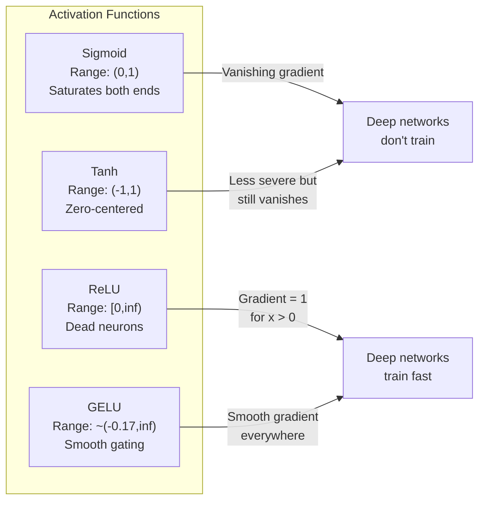
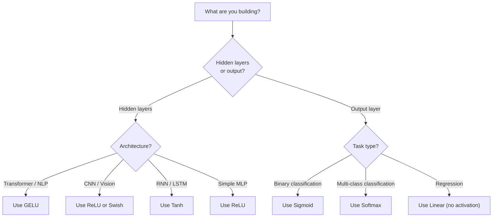

# सक्रियण फ़ंक्शन

> गैर-रेखागतता के बिना, आपका 100 परत नेटवर्क एक शानदार मैट्रिक्स गुणा है। सक्रियण वे गेट हैं जो तंत्रिका नेटवर्क को वक्र में सोचने देते हैं।

> **【中文解读】**没有非线性激活函数,100 层网络等于矩阵乘法──因为两个线性变换的复合还是线性:W2(W1x+b1) +b2 = (W2W1)x+ (W2b1+b2)──激活函数打破这种线性叠加,让每个层都能为网络增加真正的表达能力──

**Type:** Build
**Languages:** Python
**Prerequisites:** Lesson 03.03 (Backpropagation)
**Time:** ~75 minutes

## सीखने के लक्ष्य

- सिग्मोइड, टैन, रेलू, लीकी रेलू, गेलू, स्विश और सॉफ्टमैक्स को उनके व्युत्पन्नों के साथ खरोंच से लागू करें
- विभिन्न सक्रियणों के साथ 10+ परतों के माध्यम से सक्रियण परिमाणों को मापकर गायब होने वाली ग्रेडिएंट समस्या का निदान करें
- एक ReLU नेटवर्क में मृत न्यूरॉन्स का पता लगाएं और समझाएं कि GELU इस विफलता मोड से क्यों बचता है
- किसी दिए गए वास्तुकला के लिए सही सक्रियण फ़ंक्शन का चयन करें (ट्रांसफार्मर, सीएनएन, आरएनएन, आउटपुट परत)

> **【中文解读】**इस अध्याय का उद्देश्य: 7 प्रकार के सक्रियण कार्य और उनके निर्देशकों को प्राप्त करना, प्रयोगात्मक निदान और विलुप्तता की समस्या के माध्यम से, ReLU में मृत्यु तंत्रिकाओं का परीक्षण करना, विभिन्न संरचनाओं के लिए उपयुक्त सक्रियण कार्य का चयन करना।

## समस्या  समस्या परिचय

दो रैखिक परिवर्तनों को ढेर करेंः y = W2(W1x + b1) + b2. इसे विस्तारित करेंः y = W2W1x + W2b1 + b2. यह सिर्फ y = Ax + c है - एक एकल रैखिक परिवर्तन। कोई फर्क नहीं पड़ता कि आप कितने रैखिक परतों को ढेर करते हैं, परिणाम एक मैट्रिक्स गुणा करने में गिर जाता है। आपके 100 परत नेटवर्क में एक एकल परत के समान प्रतिनिधित्व शक्ति है।

> 堆叠两层线性变换: वाई = वाई2(डब्ल्यू1एक्स + बी1) + बी2。展开后: वाई = वाई2एक्स + डब्ल्यू2बी1 + बी2。 यह यात्र है वाई = अक्ष + सी एक अलग-अलग线性变换── चाहे आप कितना भी लाइनर परतें堆叠 करें, परिणाम  एक ही矩阵乘法 में संकुचित हो जाएँ── आपका 100 परतों का नेटवर्क एकल परतों के नेटवर्क के समान प्रतिनिधित्व क्षमता रखता है──

यह एक सैद्धांतिक जिज्ञासा नहीं है. इसका मतलब है कि एक गहरी रैखिक नेटवर्क सचमुच XOR नहीं सीख सकता है, एक सर्पिल डेटासेट को वर्गीकृत नहीं कर सकता है, एक चेहरे को पहचान नहीं सकता है। सक्रियण कार्यों के बिना, गहराई एक भ्रम है।

> यह सैद्धांतिक जिज्ञासा नहीं है। इसका मतलब है कि गहरी रैखिक नेटवर्क वास्तव में XOR को नहीं सीख सकता है, घुमावदार डेटासेट को विभाजित नहीं कर सकता है, मानव चेहरे को पहचान सकता है।

सक्रियण फ़ंक्शंस रैखिकता को तोड़ते हैं। वे एक गैर-रेखीय फ़ंक्शन के माध्यम से प्रत्येक परत के आउटपुट को विकृत करते हैं, जिससे नेटवर्क को निर्णय सीमाओं को मोड़ने, मनमानी कार्यों को करीब लाने और वास्तव में सीखने की क्षमता मिलती है। लेकिन गलत सक्रियण चुनें और आपके ग्रेडिएंट शून्य (गहरे नेटवर्क में सिग्मोइड) तक गायब हो जाते हैं, अनंत तक विस्फोट (गहन आरंभ के बिना असीमित सक्रियण) या आपके न्यूरॉन्स स्थायी रूप से मर जाते हैं (बड़े नकारात्मक पक्षपात के साथ रिलू) । सक्रियण फ़ंक्शन का चयन सीधे यह निर्धारित करता है कि क्या आपका नेटवर्क सीखता है।

>  सक्रियण फ़ंक्शन                                                                                                                                                                                                                                                            

> **【中文解读】**堆叠两层线性变换 y = W2(W1x+b1) +b2 展开后就是一个线性变换 y = Ax+c。不管叠加多少层,结果都等于一个矩阵乘法深度是假的── सक्रियण फ़ंक्शन打破线性,让网络能曲决策边界、逼近任意函数──选择错误激活 फ़ंक्शन会导致梯度消失(sigmoid) ٬元梯度爆炸或神经死亡(ReLU)。

## अवधारणा का मूल अवधारणा

### क्यों अस्थिरता आवश्यक है क्यों अस्थिरता आवश्यक है

मैट्रिक्स गुणात्मक है. मैट्रिक्स A से एक वेक्टर गुणा करना, फिर मैट्रिक्स B से गुणा करना AB से गुणा करने के समान है. इसका मतलब है कि 10 रैखिक परतों को ढेर करना गणितीय रूप से एक बड़े मैट्रिक्स के साथ एक रैखिक परत के बराबर है. उन सभी मापदंडों, उस सभी गहराई को बर्बाद किया गया है. आपको श्रृंखला को तोड़ने के लिए कुछ चाहिए। यह सक्रियण कार्यों का काम है।

> 矩阵乘法是组合的── पहले矩阵 A 乘量, फिर矩阵 B 乘, बराबर AB 乘── इसका अर्थ है कि गणित में 10 रैखिक परतों का ढेर एक बड़े矩阵 के रैखिक परतों के बराबर है── सभी पैरामीटर, सभी गहराई  सभी बर्बाद हो गए── आपको इस श्रृंखला को तोड़ने के लिए कुछ चाहिए── यह सक्रिय फ़ंक्शन का कार्य है──

यहाँ सबूत है. एक रैखिक परत गणना करता है f ((x) = Wx + b. स्टैक दोः

```
Layer 1: h = W1 * x + b1         # 第一层线性变换
Layer 2: y = W2 * h + b2         # 第二层线性变换
```

प्रतिस्थापनः

```
y = W2 * (W1 * x + b1) + b2      # 代入 h
y = (W2 * W1) * x + (W2 * b1 + b2)  # 展开
y = A * x + c                     # 合并为单一矩阵——深度消失了！
```

एक परत। परतों के बीच एक गैर-रेखीय सक्रियण g (() डालेंः

```
h = g(W1 * x + b1)               # 加入非线性激活
y = W2 * h + b2
```

अब प्रतिस्थापन टूट जाता है. W2 * g(W1 * x + b1) + b2 को एक ही रैखिक परिवर्तन में कम नहीं किया जा सकता है। नेटवर्क गैर-रेखीय कार्यों का प्रतिनिधित्व कर सकता है। सक्रियण के साथ प्रत्येक अतिरिक्त परत में प्रतिनिधित्व क्षमता जोड़ती है।

> 现在代入被打破了──W2 * g(W1 * x + b1) + b2 无法简化为单一线性变化──网络可以表示非线性函数──每个带激活函数的附加层都增加表示能力──

> **【中文解读】**गणितीय प्रमाण: दो रैखिक परिवर्तनों का जटिल या रैखिक है। लेकिन गैर रैखिक सक्रियण g)  के बाद, W2 * g) W1x + b1) + b2  को एक एकल रचने में एकीकृत नहीं किया जा सकता है।

### सिग्मोइड

तंत्रिका नेटवर्क के लिए मूल सक्रियण कार्य।

> तंत्रिका नेटवर्क की मूल सक्रियण फ़ंक्शन

```
sigmoid(x) = 1 / (1 + e^(-x))
```

आउटपुट रेंजः (0,1) चिकनी, विभेदक, किसी भी वास्तविक संख्या को एक संभावना-जैसे मूल्य पर मैप करता है।

> 输出范围:(0, 1)──平滑、可微, किसी भी वास्तविक संख्या को समान संभावना के मूल्य के रूप में मैगरेट करेगा──

व्युत्पन्नः

> इसके परिणाम:

```
sigmoid'(x) = sigmoid(x) * (1 - sigmoid(x))
```

इस व्युत्पन्न का अधिकतम मूल्य 0.25 है, जो x = 0 पर होता है। बैकप्रॉपेगेशन में, ग्रेडिएंट परतों के माध्यम से गुणा होता है। सिग्मोइड की दस परतों का मतलब है कि ग्रेडिएंट अधिकतम 0.25 से दस गुना गुणा होता हैः

> इस निर्देशांक का अधिकतम मूल्य 0.25 है, वर्तमान में x = 0 时.

```
0.25^10 = 0.000000953674     # 不到原始信号的百万分之一
```

मूल संकेत का एक मिलियनवें से भी कम। यह गायब हो रहा ग्रेडिएंट समस्या है। शुरुआती परतों में ग्रेडिएंट इतने छोटे हो जाते हैं कि वजन शायद ही अपडेट हो जाते हैं। नेटवर्क सीखता है - बाद के परतों में नुकसान कम होता है - लेकिन पहले परतें जमे हुए हैं। गहरे सिग्मोइड नेटवर्क बस प्रशिक्षण नहीं करते हैं।

>  मूल संकेतों के लाखों में से एक में नहीं है। यह तराजू गायब होने की समस्या है।  अग्रिम तराजू इतनी छोटी हो गई है कि वजन लगभग अद्यतन नहीं हुआ है।  पिछली तराजू का नुकसान कम हो रहा है।  अग्रिम तराजू को बंद कर दिया गया है।  गहरी सिग्मोइड  नेटवर्क मूल रूप से प्रशिक्षित नहीं हो सकता है।

अतिरिक्त समस्याः सिग्मोइड आउटपुट हमेशा सकारात्मक (0 से 1), जिसका अर्थ है कि वजन पर ग्रेडिएंट हमेशा एक ही संकेत होता है। यह ग्रेडिएंट अवतरण के दौरान ज़िग-जागिंग का कारण बनता है।

> 额外问题:sigmoid 输出总是正数(0到1), जिसका अर्थ है कि वजन का आयाम总是同号── यह आयाम को घटाने के लिए एक प्रकार का मार्ग बनाता है──

> **【中文解读】**सिग्मोइड का निर्देशांक अधिकतम केवल 0.25,10 層后梯度 मात्र शेष लाख分之一──前面几层几乎不收到梯度,无法学习──另外 सिग्मोइड 输出总是正数(0到1),导致权重梯度同号,优化路径呈形──

> **【拓展：Sigmoid 在现代 AI 中的位置】**सिग्मोइड 虽然不再用于隐藏层,但在二分类输出层仍然常用──Transformer 中的注意力分数也用软max(सिग्मोइड के सामान्यीकरण) ⋅ समझना सिग्मोइड की सीमा, यह समझना है कि क्यों ReLU/GELU 让深度学习成为可能的关键──

### तान

सिग्मोइड का केंद्रित संस्करण।

> सिग्मोइड का शून्य केंद्र संस्करण

```
tanh(x) = (e^x - e^(-x)) / (e^x + e^(-x))
```

आउटपुट रेंजः (-1, 1) शून्य-केंद्रित, जो ज़िग-जाग समस्या को समाप्त करता है।

> 输出范围:(-1, 1)──零中心化, 形问题──

व्युत्पन्नः

> इसके परिणाम:

```
tanh'(x) = 1 - tanh(x)^2
```

अधिकतम व्युत्पन्न 1.0 है x = 0 - सिग्मोइड से चार गुना बेहतर है. लेकिन गायब हो रहा ग्रेडिएंट समस्या अभी भी मौजूद है. बड़े सकारात्मक या नकारात्मक इनपुट के लिए, व्युत्पन्न शून्य के करीब है. दस परतें अभी भी ग्रेडिएंट को कुचलती हैं, केवल कम आक्रामक रूप से।

> अधिकतम निर्देशांक 1.0 है (x = 0 时)  सिग्मोइड से अच्छा 4 गुना है। लेकिन आयाम गायब होने का मुद्दा अभी भी मौजूद है।

> **【中文解读】**ताँह है सिग्मोइड का शून्य केंद्र संस्करण, आउटपुट रेंज (-1, 1),导数最大值 1.0(比 सिग्मोइड अच्छा 4 गुना) 

> **【拓展：LSTM 中的 Tanh】**LSTM 网络 के छिपे हुए राज्य और उम्मीदवार स्मृति के साथ ताण (n)                                                                                                                                                                                                                                                      

### रिलू: सफलता

सुधारित रैखिक इकाई. 2010 में नायर और हिंटन द्वारा गहन सीखने के लिए लोकप्रिय (फंक्शन स्वयं फुकुशिमा के 1969 के काम से जुड़ा हुआ है), यह सब कुछ बदल गया।

> 修正线性单元── द्वारा Nair 和 Hinton द्वारा 2010 में प्रवर्द्धित किया गया गहराई से सीखने के लिए। यह फ़ंक्शन स्वयं फ़ुकुशिमा 1969 के काम से जुड़ी हुई है।

```
relu(x) = max(0, x)
```

आउटपुट रेंजः [0, अनंत) व्युत्पन्न तुच्छ सरल हैः

```
relu'(x) = 1  if x > 0
           0  if x <= 0
```

सकारात्मक इनपुट के लिए कोई गायब हो रहा ग्रेडिएंट नहीं है. ग्रेडिएंट ठीक से 1 है, सीधे से गुजरता है. यही कारण है कि गहरे नेटवर्क को प्रशिक्षित किया गया है - ReLU परतों पर ग्रेडिएंट परिमाण को संरक्षित करता है।

> ️️️️️️️️️️️️️️️️️️️️️️️️️️️️️️️️️️️️️️️️️️️️️️️️️️️️️️️️️️️️️️️️️️️️️️️️️️️️️️️️️️️️️️️️️️️️️️️️️️️️️️️️️️️️️️️️️️️️️️️️️️️️️️️️️️️️️️️️️️️️️️️️️️️️️️️️️️️️️️️️️️️️️️️️️️️️️️️️️️️️️️️️️️️️️️️️️️️️️️️️️️️️️️️️️️️️️️️️️️️️️️️️️️️️️️️️️️️️️️️️️️️️️️️️️️️️️️️️️️️️️️️️️️️️️️️️️️️️️️️️️️️️️️️️️️️️️️️️️️️️️️️️️️️️️️️️️️️️️️️️️️️️️️️️️️️️️️️️️️️️️️️️️️️️️️️️️️️️️️️️️️️️️️️️️️️️️️️️️️️️️️️️️️️️️️️️️️️️️️️️️️️️️️️️️️️️️️️️️️️️️️️️️️️️️️️️️️️️️️️️️️️️️️️️️️️️️️️️️️️️️️️️️️️️️️️️️️️️️️️️️️️️️️️️️️️️️️️️️️️️️️️️️️️️

लेकिन एक विफलता मोड हैः मृत न्यूरॉन समस्या। यदि एक न्यूरॉन का वजन इनपुट हमेशा नकारात्मक होता है (बड़ी नकारात्मक पूर्वाग्रह या दुर्भाग्यपूर्ण वजन आरंभिकरण के कारण), तो इसका आउटपुट हमेशा शून्य होता है, इसका ग्रेडिएंट हमेशा शून्य होता है, और यह कभी अपडेट नहीं होता है। यह स्थायी रूप से मृत होता है। व्यवहार में, एक ReLU नेटवर्क में 10-40% न्यूरॉन प्रशिक्षण के दौरान मर सकते हैं।

> लेकिन एक असफल मोड हैः मृत्यु तंत्रिका समस्याएँ। यदि किसी तंत्रिका का अतिरिक्त शक्ति प्रवेश हमेशा नकारात्मक होता है (बड़ी नकारात्मक विकृति या दुर्भाग्यपूर्ण भाग्य के कारण भार प्रारंभ होने के कारण), तो इसका आउटपुट हमेशा शून्य होता है, तरंग हमेशा शून्य होता है, हमेशा नया नहीं होता है। यह स्थायी रूप से मर जाता है। अभ्यास में, 10-40% तंत्रिकाएं प्रशिक्षण के दौरान मर सकती हैं।

> **【中文解读】**RLU के लिए सही प्रविष्टि की तरंग 1 है, पूरी तरह से नहीं घटती है यही कारण है कि गहरी नेटवर्क प्रशिक्षण योग्य हो गया है लेकिन इसमें "मृत्यु तंत्रिका" समस्या हैः यदि किसी तंत्रिका का अतिरिक्त प्रविष्टि हमेशा नकारात्मक है, तो यह हमेशा 0 ̊ की तरंग 0 ̊ से बाहर निकलता है, कभी नहीं लौट सकता। अभ्यास में 10-40% RLU तंत्रिकाएं मर सकती हैं

> **【拓展：ReLU 在 CNN 中的统治地位】**ResNet、VGG、EfficientNet आदि CNN 架构都使用 ReLU (या इसके वैरिएंट) ⋅CNN में卷积层 + ReLU ≠提取视觉特征的标准组合──

### रिलू लीक

मृत न्यूरॉन्स के लिए सबसे सरल उपाय।

> 修复 मृत्यु तंत्रिका का सबसे सरल तरीका 

```
leaky_relu(x) = x        if x > 0
                alpha * x if x <= 0
```

जहां अल्फा एक छोटा सा स्थिर है, आमतौर पर 0.01। नकारात्मक पक्ष में शून्य के बजाय एक छोटा ढलान है, इसलिए मृत न्यूरॉन्स अभी भी एक ग्रेडिएंट संकेत प्राप्त करते हैं और ठीक हो सकते हैं।

> इनमें से अल्फा एक लघु सामान्य संख्या है, आमतौर पर 0.01 है। नकारात्मक पक्ष में शून्य के बजाय एक लघु झुकाव है, इसलिए मृत्यु तंत्रिका अभी भी डिग्री संकेत प्राप्त कर सकती है और पुनर्प्राप्त कर सकती है।

> **【中文解读】**रिलीकेड रिलू नकारात्मक क्षेत्र में एक छोटा सा झुकाव बनाए रखता है, जिससे मृत मस्तिष्क को अभी भी डिग्री सिग्नल प्राप्त हो सकता है, और फिर से ठीक हो सकता है।

### आधुनिक डिफ़ॉल्ट

गैसियन त्रुटि रैखिक इकाई। 2016 में हेंड्रिक्स और जिम्पेल द्वारा पेश किया गया। BERT, GPT और अधिकांश आधुनिक ट्रांसफार्मर में डिफ़ॉल्ट सक्रियण।

> 高斯差差线性单元── Hendrycks 和 Gimpel द्वारा 2016 में प्रस्तावित──BERT、GPT 和大多数现代Transformer के डिफ़ॉल्ट सक्रिय फ़ंक्शन──

```
gelu(x) = x * Phi(x)
```

जहां Phi ((x) मानक सामान्य वितरण का संचयी वितरण कार्य है। व्यवहार में प्रयोग किया जाने वाला अनुमानः

```
gelu(x) ~= 0.5 * x * (1 + tanh(sqrt(2/pi) * (x + 0.044715 * x^3)))
```

GELU हर जगह चिकनी है, छोटे नकारात्मक मानों की अनुमति देता है (रैलू के विपरीत जो शून्य तक हार्ड-क्लिप करता है), और एक संभाव्य व्याख्या हैः यह एक गौशियन वितरण के तहत सकारात्मक होने की संभावना के आधार पर प्रत्येक इनपुट का वजन करता है। यह चिकनी गेटिंग ट्रांसफार्मर वास्तुकला में रैलू से बेहतर प्रदर्शन करती है क्योंकि यह बेहतर ग्रेडिएंट प्रवाह प्रदान करती है और मृत न्यूरॉन समस्या से पूरी तरह से बचती है।

> GELU 处平滑,允许小的负值(不像 ReLU 硬截断为零),具有概率解释: यह प्रत्येक प्रविष्टि के लिए सही संभावना के लिए सही वितरण में इनपुट पर निर्भर करता है।

> **【中文解读】**GELU BERT、GPT 和大多数现代Transformer का डिफ़ॉल्ट सक्रियण फ़ंक्शन है। यह एक साधारण प्रकार का है, जिससे एक छोटा नकारात्मक मूल्य मिलता है।

> **【拓展：GPT/BERT 中的 GELU】**में ट्रांसफार्मर के FFN (पूर्व网络) में, मानक संरचना है `Linear → GELU → Linear`पायटॉर्च की `nn.GELU()`和 `F.gelu()`यही है यह फ़ंक्शन──GPT-2/3/4、BERT、ROBERTA आदि मॉडल सभी GELU उपयोग करते हैं──

### स्विस / सिलू

रामाचंद्रन और अन्य द्वारा 2017 में स्वचालित खोज के माध्यम से स्वयं-गॉट सक्रियण की खोज की गई।

```
swish(x) = x * sigmoid(x)
```

स्विश औपचारिक रूप से x * sigmoid है। गूगल ने इसे सक्रियण फ़ंक्शन स्पेस पर स्वचालित खोज के माध्यम से खोजा -- एक तंत्रिका नेटवर्क जो तंत्रिका नेटवर्क के कुछ हिस्सों को डिजाइन करता है।

GELU की तरह, यह चिकनी, गैर-एकतरफा है, और छोटे नकारात्मक मानों की अनुमति देता है। अंतर सूक्ष्म हैः स्विश गेटिंग के लिए सिग्मोइड का उपयोग करता है जबकि GELU गॉसियन सीडीएफ का उपयोग करता है। व्यवहार में, प्रदर्शन लगभग समान है। स्विश का उपयोग EfficientNet और कुछ दृष्टि मॉडल में किया जाता है। GELU भाषा मॉडल में हावी है।

> **【中文解读】**स्विश = x * सिग्मोइड(x), स्वचालित खोज के माध्यम से पाया गया है।

### सॉफ्टमैक्सः आउटपुट सक्रियण सॉफ्टमैक्सः आउटपुट परत सक्रियण फ़ंक्शन

छिपे हुए परतों में उपयोग नहीं किया जाता है। सॉफ्टमैक्स कच्चे स्कोर (लॉजिट्स) के वेक्टर को एक संभावना वितरण में परिवर्तित करता है।

```
softmax(x_i) = e^(x_i) / sum(e^(x_j) for all j)
```

प्रत्येक आउटपुट 0 से 1 के बीच होता है। सभी आउटपुटों का योग 1 तक होता है। यह इसे बहु-वर्ग वर्गीकरण के लिए मानक अंतिम सक्रियण बनाता है। सबसे बड़ा लॉजिट उच्चतम संभावना प्राप्त करता है, लेकिन argmax के विपरीत, softmax अंतर योग्य है और सापेक्ष विश्वास के बारे में जानकारी को संरक्षित करता है।

> **【中文解读】**सॉफ्टमैक्स का उपयोग छिपे हुए स्तर के लिए नहीं किया जाता है, बल्कि आउटपुट लेयर को मूल तत्वों में बदलकर संभावना वितरण में बदल जाता है। सभी आउटपुट 0-1 के बीच और कुल 1 के लिए होते हैं।

> **【拓展：Softmax 在 Transformer 中无处不在】**ट्रांसफार्मर का स्व-ध्यान तंत्र softmax  गणना ध्यान शक्ति वजन के साथः`attention = softmax(Q·K^T / sqrt(d_k))` प्रत्येक स्तर का ध्यान ध्यान ध्यान ध्यान ध्यान ध्यान ध्यान ध्यान ध्यान ध्यान ध्यान ध्यान ध्यान ध्यान ध्यान ध्यान ध्यान ध्यान ध्यान ध्यान ध्यान ध्यान ध्यान ध्यान ध्यान ध्यान ध्यान ध्यान ध्यान ध्यान ध्यान ध्यान ध्यान ध्यान ध्यान ध्यान ध्यान ध्यान ध्यान ध्यान ध्यान ध्यान ध्यान ध्यान ध्यान ध्यान ध्यान ध्यान ध्यान ध्यान ध्यान ध्यान ध्यान ध्यान ध्यान ध्यान ध्यान ध्यान ध्यान ध्यान ध्यान ध्यान ध्यान ध्यान ध्यान ध्यान ध्यान ध्यान ध्यान ध्यान ध्यान ध्यान ध्यान ध्यान ध्यान ध्यान ध्यान ध्यान ध्यान ध्यान ध्यान ध्यान ध्यान ध्यान ध्यान ध्यान ध्यान ध्यान ध्यान ध्यान ध्यान ध्यान ध्यान ध्यान ध्यान ध्यान ध्यान ध्यान ध्यान ध्यान ध्यान ध्यान ध्यान ध्यान ध्यान ध्यान ध्यान ध्यान ध्यान ध्यान ध्यान ध्यान ध्यान ध्यान ध्यान ध्यान ध्यान ध्यान ध्यान ध्यान ध्यान ध्यान ध्यान ध्यान ध्यान ध्यान ध्यान ध्यान ध्यान ध्यान ध्यान ध्यान ध्यान ध्यान ध्यान ध्यान ध्यान ध्यान ध्यान ध्यान ध्यान ध्यान ध्यान ध्यान ध्यान ध्यान ध्यान ध्यान ध्यान ध्यान ध्यान ध्यान ध्यान ध्यान ध्यान ध्यान ध्यान ध्यान ध्यान ध्यान ध्यान ध्यान ध्यान ध्यान ध्यान ध्यान ध्यान ध्यान ध्यान ध्यान ध्यान ध्यान ध्यान ध्यान ध्यान ध्यान ध्यान ध्यान ध्यान ध्यान ध्यान ध्यान ध्यान ध्यान ध्यान ध्यान ध्यान ध्यान ध्यान ध्यान ध्यान ध्यान ध्यान ध्यान ध्यान ध्यान ध्यान ध्यान ध्यान ध्यान ध्यान ध्यान ध्यान ध्यान ध्यान ध्यान ध्यान ध्यान ध्यान ध्यान ध्यान ध्यान ध्यान ध्यान ध्यान ध्यान ध्यान ध्यान ध्यान ध्यान ध्यान ध्यान ध्यान ध्यान ध्यान ध्यान ध्यान ध्यान ध्यान ध्यान ध्यान ध्यान ध्यान ध्यान ध्यान ध्यान ध्यान ध्यान ध्यान ध्यान ध्यान ध्यान ध्यान ध्यान ध्यान ध्यान ध्यान ध्यान ध्यान ध्यान ध्यान ध्यान ध्यान ध्यान ध्यान ध्यान ध्यान ध्यान ध्यान ध्यान ध्यान ध्यान ध्यान ध्यान ध्यान ध्यान ध्यान ध्यान ध्यान ध्यान ध्यान ध्यान ध्यान ध्यान ध्यान ध्यान ध्यान ध्यान ध्यान ध्यान ध्यान ध्यान ध्यान ध्यान ध्यान ध्यान ध्यान ध्यान ध्यान ध्यान ध्यान ध्यान ध्यान ध्यान ध्यान ध्यान ध्यान ध्यान ध्यान ध्यान ध्यान ध्यान ध्यान ध्यान ध्यान ध्यान ध्यान ध्यान ध्यान ध्यान ध्यान ध्यान ध्यान ध्यान ध्यान ध्यान ध्यान ध्यान ध्यान ध्यान ध्यान ध्यान ध्यान ध्यान ध्यान ध्यान ध्यान ध्यान ध्यान ध्यान ध्यान ध्यान ध्यान ध्यान ध्यान ध्यान ध्यान ध्यान ध्यान ध्यान ध्यान ध्यान ध्यान ध्यान ध्यान ध्यान ध्यान ध्यान ध्यान ध्यान ध्यान ध्यान ध्यान ध्यान ध्यान ध्यान ध्यान ध्यान ध्यान ध्यान ध्यान ध्यान ध्यान ध्यान ध्यान ध्यान ध्यान ध्यान ध्यान ध्यान ध्यान ध्यान ध्यान ध्यान ध्यान ध्यान ध्यान ध्यान ध्यान ध्यान ध्यान ध्यान ध्यान ध्यान ध्यान ध्यान ध्यान ध्यान ध्यान ध्यान ध्यान ध्यान ध्यान ध्यान ध्यान ध्यान ध्यान ध्यान ध्यान ध्यान ध्यान ध्यान ध्यान ध्यान ध्यान ध्यान ध्यान ध्यान ध्यान ध्यान ध्यान ध्यान ध्यान ध्यान ध्यान ध्यान ध्यान ध्यान ध्यान ध्यान ध्यान ध्यान ध्यान ध्यान ध्यान ध्यान ध्यान ध्यान ध्यान ध्यान ध्यान ध्यान ध्यान ध्यान ध्यान ध्यान ध्यान ध्यान ध्यान ध्यान ध्यान ध्यान ध्यान ध्यान ध्यान ध्यान ध्यान ध्यान ध्यान ध्यान ध्यान ध्यान ध्यान ध्यान ध्यान ध्यान ध्यान ध्यान ध्यान ध्यान ध्यान ध्यान ध्यान ध्यान ध्यान ध्यान ध्यान ध्यान ध्यान ध्यान ध्यान ध्यान ध्यान ध्यान ध्यान ध्यान ध्यान ध्यान ध्यान ध्यान ध्यान ध्यान ध्यान ध्यान ध्यान ध्यान ध्यान ध्यान ध्यान ध्यान ध्यान ध्यान ध्यान ध्यान ध्यान ध्यान ध्यान ध्यान ध्यान ध्यान ध्यान ध्यान ध्यान ध्यान ध्यान

### आकारों की तुलना आकारों के साथ तुलना



### कौन सा सक्रियण कब है क्या समय के साथ क्या सक्रियण समारोह



> **【中文解读】**经验法则:ट्रांसफॉर्मर/एनएलपी उपयोग GELU,CNN/视觉 उपयोग ReLU,RNN/LSTM उपयोग tanh──输出层:二分类用 sigmoid, बहुधा类用 softmax,归归不用激活──

## इसे बनाओ।
```figure
softmax-temperature
```

## इसे बनाओ

### चरण 1: डेरिवेटिव के साथ सभी सक्रियण कार्यों को लागू करें

प्रत्येक फ़ंक्शन एक एकल फ्लोट लेता है और एक फ्लोट लौटाता है। प्रत्येक व्युत्पन्न फ़ंक्शन एक ही इनपुट लेता है और ग्रेडिएंट लौटाता है।

```python
import math

def sigmoid(x):
    x = max(-500, min(500, x))  # 裁剪防止溢出
    return 1.0 / (1.0 + math.exp(-x))  # σ(x) = 1/(1+e^(-x))

def sigmoid_derivative(x):
    s = sigmoid(x)
    return s * (1 - s)  # sigmoid 导数 = σ(x)(1 - σ(x))，最大值 0.25

def tanh_act(x):
    return math.tanh(x)  # 双曲正切

def tanh_derivative(x):
    t = math.tanh(x)
    return 1 - t * t  # tanh 导数 = 1 - tanh²(x)，最大值 1.0

def relu(x):
    return max(0.0, x)  # 正区间透传，负区间归零

def relu_derivative(x):
    return 1.0 if x > 0 else 0.0  # 正区间梯度=1，负区间梯度=0

def leaky_relu(x, alpha=0.01):
    return x if x > 0 else alpha * x  # 负区间保留小斜率

def leaky_relu_derivative(x, alpha=0.01):
    return 1.0 if x > 0 else alpha  # 负区间梯度=alpha

def gelu(x):
    # GELU 近似公式，用于 GPT/BERT 等 Transformer
    return 0.5 * x * (1 + math.tanh(math.sqrt(2 / math.pi) * (x + 0.044715 * x ** 3)))

def gelu_derivative(x):
    phi = 0.5 * (1 + math.erf(x / math.sqrt(2)))  # 标准正态 CDF
    pdf = math.exp(-0.5 * x * x) / math.sqrt(2 * math.pi)  # 标准正态 PDF
    return phi + x * pdf

def swish(x):
    return x * sigmoid(x)  # Swish = x * σ(x)，用于 EfficientNet

def swish_derivative(x):
    s = sigmoid(x)
    return s + x * s * (1 - s)  # Swish 导数 = σ(x) + x·σ(x)(1-σ(x))

def softmax(xs):
    max_x = max(xs)  # 数值稳定性：减去最大值
    exps = [math.exp(x - max_x) for x in xs]
    total = sum(exps)
    return [e / total for e in exps]  # 所有输出和为 1
```

### चरण 2: कल्पना करें कि ग्रेडिएंट कहाँ मरते हैं

-5 से 5 तक 100 समान-स्थानित बिंदुओं पर ग्रेडिएंट की गणना करें। प्रत्येक सक्रियण के ग्रेडिएंट को शून्य के निकट दिखाने वाला एक पाठ हिस्टोग्राम प्रिंट करें।

```python
def gradient_scan(name, derivative_fn, start=-5, end=5, n=100):
    step = (end - start) / n
    near_zero = 0
    healthy = 0
    for i in range(n):
        x = start + i * step
        g = derivative_fn(x)
        if abs(g) < 0.01:       # 梯度接近零的区域
            near_zero += 1
        else:
            healthy += 1
    pct_dead = near_zero / n * 100
    print(f"{name:15s}: {healthy:3d} healthy, {near_zero:3d} near-zero ({pct_dead:.0f}% dead zone)")

gradient_scan("Sigmoid", sigmoid_derivative)
gradient_scan("Tanh", tanh_derivative)
gradient_scan("ReLU", relu_derivative)
gradient_scan("Leaky ReLU", leaky_relu_derivative)
gradient_scan("GELU", gelu_derivative)
gradient_scan("Swish", swish_derivative)
```

### चरण 3: गायब हो रहा ग्रेडिएंट प्रयोग

सिग्मोइड बनाम रिलू का उपयोग करके एन परतों के माध्यम से संकेत को आगे-पास करें। सक्रियण परिमाण कैसे बदलता है, इसका मापन करें।

```python
import random

def vanishing_gradient_experiment(activation_fn, name, n_layers=10, n_inputs=5):
    random.seed(42)
    values = [random.gauss(0, 1) for _ in range(n_inputs)]

    print(f"\n{name} through {n_layers} layers:")
    for layer in range(n_layers):
        weights = [random.gauss(0, 1) for _ in range(n_inputs)]
        z = sum(w * v for w, v in zip(weights, values))  # 加权求和
        activated = activation_fn(z)  # 激活
        magnitude = abs(activated)
        bar = "#" * int(magnitude * 20)
        print(f"  Layer {layer+1:2d}: magnitude = {magnitude:.6f} {bar}")  # 观察 magnitude 是否逐层缩小
        values = [activated] * n_inputs

vanishing_gradient_experiment(sigmoid, "Sigmoid")  # sigmoid 的 magnitude 会快速缩小
vanishing_gradient_experiment(relu, "ReLU")        # ReLU 的 magnitude 不会缩小
vanishing_gradient_experiment(gelu, "GELU")        # GELU 介于两者之间
```

### चरण 4: मृत न्यूरॉन डिटेक्टर

एक ReLU नेटवर्क बनाएं, उसके माध्यम से यादृच्छिक इनपुट पारित करें, गिनें कि कितने न्यूरॉन्स कभी नहीं चले जाते हैं।

```python
def dead_neuron_detector(n_inputs=5, hidden_size=20, n_samples=1000):
    random.seed(0)
    weights = [[random.gauss(0, 1) for _ in range(n_inputs)] for _ in range(hidden_size)]
    biases = [random.gauss(0, 1) for _ in range(hidden_size)]

    fire_counts = [0] * hidden_size  # 记录每个神经元的激活次数

    for _ in range(n_samples):
        inputs = [random.gauss(0, 1) for _ in range(n_inputs)]
        for neuron_idx in range(hidden_size):
            z = sum(w * x for w, x in zip(weights[neuron_idx], inputs)) + biases[neuron_idx]
            if relu(z) > 0:           # ReLU 激活 > 0 算"激活"
                fire_counts[neuron_idx] += 1

    dead = sum(1 for c in fire_counts if c == 0)          # 从未激活 = 死亡
    rarely_fire = sum(1 for c in fire_counts if 0 < c < n_samples * 0.05)  # 极少激活
    healthy = hidden_size - dead - rarely_fire

    print(f"\nDead Neuron Report ({hidden_size} neurons, {n_samples} samples):")
    print(f"  Dead (never fired):     {dead}")
    print(f"  Barely alive (<5%):     {rarely_fire}")
    print(f"  Healthy:                {healthy}")
    print(f"  Dead neuron rate:       {dead/hidden_size*100:.1f}%")

    for i, c in enumerate(fire_counts):
        status = "DEAD" if c == 0 else "WEAK" if c < n_samples * 0.05 else "OK"
        bar = "#" * (c * 40 // n_samples)
        print(f"  Neuron {i:2d}: {c:4d}/{n_samples} fires [{status:4s}] {bar}")

dead_neuron_detector()
```

### चरण 5: प्रशिक्षण तुलना - सिग्मोइड बनाम रिलू बनाम पीला

सर्कल डेटासेट पर एक ही दो-परत नेटवर्क को तीन अलग-अलग सक्रियणों के साथ प्रशिक्षित करें (सर्किल के अंदर बिंदु = वर्ग 1, बाहर = वर्ग 0) । अभिसरण गति की तुलना करें।

```python
def make_circle_data(n=200, seed=42):
    random.seed(seed)
    data = []
    for _ in range(n):
        x = random.uniform(-2, 2)
        y = random.uniform(-2, 2)
        label = 1.0 if x * x + y * y < 1.5 else 0.0  # 距原点 < sqrt(1.5) 为"内部"
        data.append(([x, y], label))
    return data


class ActivationNetwork:
    """使用指定激活函数的两层网络，用于对比不同激活函数的训练效果"""
    def __init__(self, activation_fn, activation_deriv, hidden_size=8, lr=0.1):
        random.seed(0)
        self.act = activation_fn       # 激活函数
        self.act_d = activation_deriv  # 激活函数导数
        self.lr = lr
        self.hidden_size = hidden_size

        self.w1 = [[random.gauss(0, 0.5) for _ in range(2)] for _ in range(hidden_size)]  # 隐藏层权重
        self.b1 = [0.0] * hidden_size   # 隐藏层偏置
        self.w2 = [random.gauss(0, 0.5) for _ in range(hidden_size)]  # 输出层权重
        self.b2 = 0.0                    # 输出层偏置

    def forward(self, x):
        self.x = x
        self.z1 = []
        self.h = []
        for i in range(self.hidden_size):
            z = self.w1[i][0] * x[0] + self.w1[i][1] * x[1] + self.b1[i]  # 线性变换
            self.z1.append(z)
            self.h.append(self.act(z))  # 激活（这里对比不同激活函数的效果）

        self.z2 = sum(self.w2[i] * self.h[i] for i in range(self.hidden_size)) + self.b2
        self.out = sigmoid(self.z2)  # 输出层用 sigmoid（二分类标准）
        return self.out

    def backward(self, target):
        error = self.out - target
        d_out = error * self.out * (1 - self.out)  # 输出层梯度

        for i in range(self.hidden_size):
            d_h = d_out * self.w2[i] * self.act_d(self.z1[i])  # 隐藏层梯度
            self.w2[i] -= self.lr * d_out * self.h[i]           # 更新输出层权重
            for j in range(2):
                self.w1[i][j] -= self.lr * d_h * self.x[j]     # 更新隐藏层权重
            self.b1[i] -= self.lr * d_h                          # 更新隐藏层偏置
        self.b2 -= self.lr * d_out                               # 更新输出层偏置

    def train(self, data, epochs=200):
        losses = []
        for epoch in range(epochs):
            total_loss = 0
            correct = 0
            for x, y in data:
                pred = self.forward(x)
                self.backward(y)
                total_loss += (pred - y) ** 2
                if (pred >= 0.5) == (y >= 0.5):
                    correct += 1
            avg_loss = total_loss / len(data)
            accuracy = correct / len(data) * 100
            losses.append(avg_loss)
            if epoch % 50 == 0 or epoch == epochs - 1:
                print(f"    Epoch {epoch:3d}: loss={avg_loss:.4f}, accuracy={accuracy:.1f}%")
        return losses


data = make_circle_data()

configs = [
    ("Sigmoid", sigmoid, sigmoid_derivative),    # 预期：收敛慢，梯度消失
    ("ReLU", relu, relu_derivative),              # 预期：收敛快
    ("GELU", gelu, gelu_derivative),              # 预期：收敛快且平滑
]

results = {}
for name, act_fn, act_d_fn in configs:
    print(f"\n=== Training with {name} ===")
    net = ActivationNetwork(act_fn, act_d_fn, hidden_size=8, lr=0.1)
    losses = net.train(data, epochs=200)
    results[name] = losses

print("\n=== Final Loss Comparison ===")
for name, losses in results.items():
    print(f"  {name:10s}: start={losses[0]:.4f} -> end={losses[-1]:.4f} (improvement: {(1 - losses[-1]/losses[0])*100:.1f}%)")
```

## इसका प्रयोग करें।

PyTorch इन सभी को कार्यात्मक और मॉड्यूल दोनों रूपों में प्रदान करता हैः

```python
import torch
import torch.nn as nn
import torch.nn.functional as F

x = torch.randn(4, 10)  # 4 个样本，每个 10 维

relu_out = F.relu(x)           # ReLU：对应我们的 relu()
gelu_out = F.gelu(x)           # GELU：对应我们的 gelu()
sigmoid_out = torch.sigmoid(x)  # Sigmoid：对应我们的 sigmoid()
swish_out = F.silu(x)          # Swish/SiLU：对应我们的 swish()

logits = torch.randn(4, 5)     # 4 个样本，5 个类别
probs = F.softmax(logits, dim=1)  # Softmax：对应我们的 softmax()

model = nn.Sequential(
    nn.Linear(10, 64),
    nn.GELU(),          # Transformer 标配：GELU
    nn.Linear(64, 32),
    nn.GELU(),
    nn.Linear(32, 5),   # 输出层：不加激活（logits）
)
```

ट्रांसफार्मर में छिपे हुए परतेंः GELU. सीएनएन में छिपे हुए परतें: ReLU. वर्गीकरण के लिए आउटपुट परतः सॉफ्टमैक्स. रिग्रेशन के लिए आउटपुट परतः कोई (रेखीय) । संभावनाओं के लिए आउटपुट परतः सिग्मोइड. यही है. इन डिफ़ॉल्ट से शुरू करें. जब आपके पास सबूत हों तो उन्हें बदलें।

RNNs और LSTMs छिपे हुए राज्य के लिए tanh और गेट के लिए sigmoid का उपयोग करते हैं, लेकिन अगर आप आज खरोंच से निर्माण कर रहे हैं, तो आप शायद RNNs का उपयोग नहीं कर रहे हैं. यदि आपके ReLU नेटवर्क में न्यूरॉन्स मर रहे हैं, GELU पर स्विच करें. जब तक आपके पास एक विशिष्ट कारण नहीं है, तब तक लीक ReLU तक न पहुंचें - GELU मृत न्यूरॉन्स की समस्या को हल करता है और बेहतर ग्रेडिएंट प्रवाह देता है।

> **【中文解读】**PyTorch  ने सभी सक्रिय फ़ंक्शन के फ़ंक्शनल और मॉड्यूल एपीआई प्रदान किए हैं। अनुभव विधिः ट्रांसफार्मर 隐藏层用 GELU,CNN 隐藏层用 ReLU,分类输出用 softmax,归归输出不用激活──如果 ReLU 神经元死亡,换 GELU(而不是 Leaky ReLU) ⋅

## इसे भेजें।

इस पाठ से उत्पन्न होता हैः
- `outputs/prompt-activation-selector.md`-- एक पुनः प्रयोज्य संकेत है कि आप किसी भी वास्तुकला के लिए सही सक्रियण समारोह चुनने में मदद करता है

## अभ्यास विषय

1. पैरामीटरिक रिलू (PReLU) को लागू करें जहां नकारात्मक ढलान अल्फा एक सीखने योग्य पैरामीटर है। इसे सर्कल डेटासेट पर प्रशिक्षित करें और निश्चित लीक रिलू की तुलना करें।
   > **练习 1：**                                                                                                                                                                                                                                                              

2. 10. सिग्मोइड, टैन, रिलू और जीईएलयू के लिए प्रत्येक परत पर परिमाण का ग्राफ करें। प्रत्येक सक्रियण का संकेत प्रभावी रूप से किस परत पर शून्य तक पहुंचता है?
   > **练习 2：**इस प्रयोग को 50 स्तर तक बढ़ाकर, किस सक्रियण फ़ंक्शन का सबसे पहले शून्य में संकेत दिया गया?

3. ELU (उत्पादक रैखिक इकाई) को लागू करेंः elu(x) = x यदि x > 0, अल्फा * (e^x - 1) यदि x <= 0. उसी नेटवर्क पर इसकी मृत न्यूरॉन दर की तुलना ReLU से करें।
   > **练习 3：** ELU को प्राप्त करना, उसी नेटवर्क पर ELU और RLU के मृत्यु दर के मुकाबले

4. प्रशिक्षण के दौरान चलने वाले "ग्रेडिएंट हेल्थ मॉनिटर" का निर्माण करेंः प्रत्येक युग में, प्रत्येक परत पर औसत ग्रेडिएंट ग्रेडिएंट की गणना करें। किसी भी परत का ग्रेडिएंट 0.001 से नीचे या 100 से अधिक होने पर चेतावनी प्रिंट करें।
   > **练习 4：**"दियुग स्वास्थ्य निगरानी यंत्र" का निर्माण  प्रति चक्र गणना प्रत्येक स्तर पर औसत दियुग का आकार 0.001 से कम या 100 से अधिक 

5. कक्षा 01 से XOR डेटासेट का उपयोग करने के लिए प्रशिक्षण तुलना को संशोधित करें. किस सक्रियण को XOR पर सबसे तेजी से परिवर्तित किया जाता है? यह सर्कल परिणामों से क्यों भिन्न है?
   > **练习 5：**XOR डेटासेट के साथ आकृत डेटा की तुलना करें। कौन सा सक्रियण फ़ंक्शन सबसे तेजी से प्राप्त होता है?

## Key Terms  Key Terms  Key Terms  Key Terms  Key Terms  Key Terms  Key Terms  Key Terms  Key Terms  Key Terms  Key Terms  Key Terms  Key Terms  Key Terms  Key Terms  Key Terms  Key Terms  Key Terms  Key Terms  Key Terms  Key Terms  Key Terms  Key Terms  Key Terms  Key Terms  Key Terms  Key Terms  Key Terms  Key Terms  Key Terms  Key Terms  Key Terms  Key Terms  Key Terms  Key Terms  Key Terms  Key Terms  Key Terms  Key Terms  Key Terms  Key Terms  Key Terms  Key Terms  Key Terms  Key Terms  Key Terms  Key Terms  Key Terms  Key Terms  Key Terms  Key Terms  Key Terms  Key Terms  Key Terms  Key Terms  Key Terms  Key Terms  Key Terms  Key Terms  Key Terms  Key Terms  Key Terms  Key Terms  Key Terms  Key Terms  Key Terms  Key Terms  Key Terms  Key Terms  Key Terms  Key Terms  Key Terms  Key Terms  Key Terms  Key Terms  Key Terms  Key Terms  Key Terms  Key Terms  Key Terms  Key Terms  Key Terms  Key Terms  Key Terms  Key Terms  Key Terms  Key Terms  Key Terms  Key Terms  Key Terms  Key Terms  Key Terms  Key Terms  Key Terms  Key Terms  Key Terms  Key Terms  Key Terms  Key Terms  Key Terms  Key Terms  Key Terms  Key Terms  Key Terms  Key Terms  Key Terms  Key Terms  Key Terms  Key

| Term | What people say | What it actually means |
|------|----------------|----------------------|
| Activation function | "The nonlinear part" | A function applied to each neuron's output that breaks linearity, enabling the network to learn nonlinear mappings |
| Vanishing gradient | "Gradients disappear in deep networks" | Gradients shrink exponentially through layers when the activation's derivative is less than 1, making early layers untrainable |
| Exploding gradient | "Gradients blow up" | Gradients grow exponentially through layers when the effective multiplier exceeds 1, causing unstable training |
| Dead neuron | "A neuron that stopped learning" | A ReLU neuron whose input is permanently negative, producing zero output and zero gradient |
| Sigmoid | "Squishes values to 0-1" | The logistic function 1/(1+e^-x), historically important but causes vanishing gradients in deep networks |
| ReLU | "Clips negatives to zero" | max(0, x) -- the activation that made deep learning practical by preserving gradient magnitude |
| GELU | "The transformer activation" | Gaussian Error Linear Unit, a smooth activation that weights inputs by their probability of being positive |
| Swish/SiLU | "Self-gated ReLU" | x * sigmoid(x), discovered through automated search, used in EfficientNet |
| Softmax | "Turns scores into probabilities" | Normalizes a vector of logits into a probability distribution where all values are in (0,1) and sum to 1 |
| Leaky ReLU | "ReLU that doesn't die" | max(alpha*x, x) where alpha is small (0.01), preventing dead neurons by allowing small negative gradients |
| Saturation | "The flat part of sigmoid" | Regions where an activation's derivative approaches zero, blocking gradient flow |
| Logit | "The raw score before softmax" | The unnormalized output of the final layer before applying softmax or sigmoid |

| 术语 | 通俗说法 | 实际含义 |
|------|---------|---------|
| 激活函数 (Activation function) | "非线性那部分" | 施加在每个神经元输出上的函数，打破线性，使网络能学习非线性映射 |
| 梯度消失 (Vanishing gradient) | "深层梯度消失" | 导数小于 1 的激活函数导致梯度逐层指数缩小，前面的层无法训练 |
| 梯度爆炸 (Exploding gradient) | "梯度爆炸" | 有效乘数超过 1 时梯度逐层指数增长，训练不稳定 |
| 死亡神经元 (Dead neuron) | "停止学习的神经元" | ReLU 神经元输入永远为负，输出和梯度永远为零 |
| Sigmoid | "压到 0-1" | 逻辑函数 1/(1+e^-x)，历史重要但深层网络中梯度消失 |
| ReLU | "负数变零" | max(0, x)——通过保持梯度幅度让深度学习变得可行的激活函数 |
| GELU | "Transformer 激活" | 高斯误差线性单元，按输入为正的概率加权的平滑激活 |
| Swish/SiLU | "自门控 ReLU" | x * sigmoid(x)，通过自动搜索发现，用于 EfficientNet |
| Softmax | "分数变概率" | 把 logits 归一化为概率分布，所有值在 (0,1) 且和为 1 |
| Leaky ReLU | "不会死的 ReLU" | max(alpha*x, x)，负区间保留小梯度防止神经元死亡 |
| 饱和 (Saturation) | "sigmoid 的平坦区" | 激活函数导数趋近于零的区域，阻断梯度流 |
| Logit | "softmax 前的原始分" | 最终层未归一化的输出 |

## आगे पढ़ना 延伸閱讀

- नायर एंड हिंटन, "संशोधित रैखिक इकाइयां सीमित बोल्टज़मैन मशीनों में सुधार करती हैं" (2010) - पेपर जिसने ReLU को पेश किया और गहरे नेटवर्क के प्रशिक्षण को सक्षम किया
- हेंड्रिक्स और गिम्पल, "गॉसियन त्रुटि रैखिक इकाइयां (जीईएलयू) " (2016) -- सक्रियण फ़ंक्शन पेश किया जो ट्रांसफार्मर के लिए डिफ़ॉल्ट बन गया
- रामाचंद्रन और अन्य, "सक्रियता कार्यों की खोज" (2017) - स्विश की खोज के लिए स्वचालित खोज का उपयोग किया, यह दिखाते हुए कि सक्रियण डिजाइन स्वचालित किया जा सकता है
- ग्लोरोट और बेन्गियो, "गहरे फीडफॉरवर्ड तंत्रिका नेटवर्क को प्रशिक्षित करने की कठिनाई को समझना" (2010) - पेपर जो गायब हो रहे / विस्फोटक ग्रेडिएंट का निदान करता है और जेवियर आरंभिकरण का प्रस्ताव करता है
- गुडफ़ेलो, बेन्गियो, Courville, "डीप लर्निंग" अध्याय 6.3 (https://www.deeplearningbook.org/) -- छिपे हुए इकाइयों और सक्रियण कार्यों का कठोर उपचार
