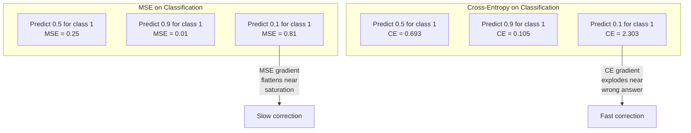
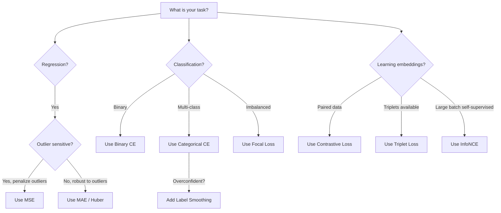

# फ़ंक्शन खोना

> आपके नेटवर्क एक भविष्यवाणी करता है. मूल सत्य इसके विपरीत कहता है. यह कितना गलत है? यह संख्या हानि है. गलत हानि फ़ंक्शन चुनें और आपका मॉडल पूरी तरह से गलत चीज के लिए अनुकूलित करता है.

> **【中文解读】**损失函数 损失函数 损失函数 损失函数 损失函数 损失函数 损失函数 损失函数 损失函数 损失函数 损失函数 损失函数 损失函数 损失函数 损失函数 损失函数 损失函数 损失函数 损失函数 损失函数 损失函数 损失函数 损失函数 损失函数 损失函数 损失函数 损失函数 损失函数 损失函数 损失函数 损失函数 损失函数 损失函数 损失函数 损失函数 损失函数 损失函数 损失函数 损失函数 损失函数 损失函数 损失函数 损失函数 损失函数 损失函数 损失函数 损失函数 损失函数 损失函数 损失函数 损失函数 损失 损失 损失 损失 损失 损失 损失 损失 损失 损失 损失 损失 损失 损失 损失 损失 损数 损失 损数 损数 损失 损失 损失 损数 损失 损数 损数 损数 损数 损数 损数 损数 损数 损数 损数 损数 损数 损数 损数 损数 损数 损数 损数 损数 损数 损数 损数 损数 损数 损数 损数 损数 损数 损数 损数 损数 损数 损数 损数 损数 损数 损 损 损数 损数 损数 损数 损数 损数 损数 损数 损数 损 损 损 损 损 损 损 损 损 损 损 损 损 损 损 损 损 损 损 损 

**Type:** Build
**Languages:** Python
**Prerequisites:** Lesson 03.04 (Activation Functions)
**Time:** ~75 minutes

## सीखने के लक्ष्य

- एमएसई, बाइनरी क्रॉस-एंट्रोपी, कैटेगरी क्रॉस-एंट्रोपी और कंट्रास्टिव लॉस (InfoNCE) को उनके ग्रेडिएंट के साथ खरोंच से लागू करें
- "सब कुछ के लिए भविष्यवाणी 0.5" विफलता मोड प्रदर्शित करके MSE वर्गीकरण में विफलता का कारण बताएं
- क्रॉस-एंट्रोपी पर लेबल चिकनाई लागू करें और वर्णन करें कि यह अत्यधिक आत्मविश्वास वाली भविष्यवाणियों को कैसे रोकता है
- रेग्रिशन, बाइनरी वर्गीकरण, मल्टी-क्लास वर्गीकरण और एम्बेडिंग सीखने के कार्यों के लिए सही हानि फ़ंक्शन चुनें

> **【中文解读】**इस अध्याय का उद्देश्य: 5 प्रकार के हानि कार्य और स्तर को प्राप्त करना, समझना कि क्यों वर्ग कार्य MSE का उपयोग नहीं कर सकते हैं, सीखना

## समस्या  समस्या परिचय

एक मॉडल वर्गीकरण समस्या पर एमएसई को कम करने के लिए आत्मविश्वास से सब कुछ के लिए 0.5 भविष्यवाणी करेगा. यह नुकसान को कम कर रहा है. यह भी बेकार है.

> एक वर्ग समस्या पर न्यूनतम MSE का मॉडल सभी इनपुट भविष्यवाणियों पर आत्मविश्वास से 0.5 होगा। यह न्यूनतम हानि में है।

हानि समारोह केवल एक चीज है कि आपके मॉडल वास्तव में अनुकूलित करता है। सटीकता नहीं। F1 स्कोर नहीं. अपने प्रबंधक को रिपोर्ट करने के लिए जो भी मीट्रिक नहीं है। अनुकूलक हानि फ़ंक्शन के ग्रेडिएंट को लेता है और उस संख्या को छोटा करने के लिए भारों को समायोजित करता है। यदि हानि फ़ंक्शन आपको क्या परवाह नहीं करता है, तो मॉडल इसे संतुष्ट करने का गणितीय रूप से सबसे सस्ता तरीका ढूंढ देगा, और यह तरीका लगभग कभी भी वह नहीं है जो आप चाहते थे।

> 损失函数 आपके मॉडल को वास्तविक रूप से अनुकूलित करने का एकमात्र लक्ष्य है। सटीकता दर नहीं है। F1 分数 नहीं है। आप प्रबंधक को रिपोर्ट करने के लिए किसी भी मापदंड नहीं है। 损失 फ़ंक्शन की तरंग प्राप्त करने और उस संख्या को छोटा करने के लिए अपना वजन समायोजित करने के लिए अनुकूलन उपकरण है। यदि हानि फ़ंक्शन आपके बारे में कुछ भी नहीं समझता है, तो मॉडल इसे पूरा करने के लिए गणित में सबसे सस्ता तरीका ढूंढता है, लेकिन यह तरीका लगभग कभी भी आपके लिए नहीं है।

यहाँ एक ठोस उदाहरण है। आपके पास एक द्विआधारी वर्गीकरण कार्य है। दो कक्षाएं, 50/50 विभाजित। आप अपने नुकसान के रूप में एमएसई का उपयोग करें। मॉडल प्रत्येक इनपुट के लिए 0.5 की भविष्यवाणी करता है। औसत एमएसई 0.25 है, जो वास्तव में कुछ भी सीखने के बिना न्यूनतम संभव है। मॉडल में शून्य भेदभाव क्षमता है लेकिन तकनीकी रूप से यह आपके नुकसान समारोह को कम कर दिया है। क्रॉस-एंट्रोपी पर स्विच करें और एक ही मॉडल को 0 या 1 की ओर भविष्यवाणियों को धक्का देने के लिए मजबूर किया जाता है, क्योंकि -log(0.5) = 0.693 एक भयानक नुकसान है, जबकि -log(0.99) = 0.01 आश्वस्त सही भविष्यवाणियों को पुरस्कृत करता है। हानि फ़ंक्शन का चयन एक मॉडल के बीच अंतर है जो सीखता है और एक मॉडल जो मीट्रिक खेलता है।

> 具体例:二元分类任务,两类各占50%──你使用MSE 作为损失──模型对每一个输入都预测0.5──平均MSE为0.25, यह वास्तव में कुछ भी नहीं सीखा है, इस मामले में संभव न्यूनतम मूल्य है──模型没有任何区分能力,但技术上已经最小化了你的损失函数──换成交叉后,同样的模型被迫将预测推向到0或1,因为 -log(0.5) =0.693是一个非常差的损失,而 -log(0.99) =0.01会奖励自信的正确预测──损失函数的选择决定了模型学习还在系统的空中钻.

यह बदतर होता है. आत्म-निरीक्षण सीखने में, आपके पास लेबल भी नहीं हैं. विपरीत हानि सीखने के संकेत को पूरी तरह से परिभाषित करती हैः क्या समान है, क्या अलग है, और मॉडल को उन्हें अलग करने के लिए कितना कठिन होना चाहिए। विपरीत हानि गलत हो जाती है और आपके एम्बेडेड एक ही बिंदु तक गिर जाते हैं - प्रत्येक इनपुट मैप एक ही वेक्टर के लिए। तकनीकी रूप से शून्य हानि। पूरी तरह से बेकार।

> अधिकतर, आत्म-निरीक्षण सीखने में, आप भी कोई टैग नहीं करते हैं️ आप तुलनात्मक हानि को सीखने के संकेतों के रूप में परिभाषित करते हैंः क्या समान है, क्या भिन्न है, मॉडल को उन्हें अलग करने के लिए कितना अधिक बल देना चाहिए️ आप अपने प्रतिरोधात्मक नुकसान के लिए एक बिंदु तक ️ प्रत्येक प्रविष्टि को एक ही आयाम तक ️ ️ ️ ️ ️ ️ ️ ️ ️ ️ ️ ️ ️ ️ ️ ️ ️ ️ ️ ️ ️ ️ ️ ️ ️ ️ ️ ️ ️ ️ ️ ️ ️ ️ ️ ️ ️ ️ ️ ️ ️ ️ ️ ️ ️ ️ ️ ️ ️ ️ ️ ️ ️ ️ ️ ️ ️ ️ ️ ️ ️ ️ ️ ️ ️ ️ ️ ️ ️ ️ ️ ️ ️ ️ ️ ️ ️ ️ ️ ️ ️ ️ ️ ️ ️ ️ ️ ️ ️ ️ ️ ️ ️ ️ ️ ️ ️ ️ ️ ️ ️ ️ ️ ️ ️ ️ ️ ️ ️ ️ ️ ️ ️ ️ ️ ️ ️ ️ ️ ️ ️ ️ ️  ️ ️ ️ ️ ️ ️ ️ ️ ️ ️ ️ ️  ️ ️  ️ ️  

> **【中文解读】**MSE बनाते समय, मॉडल का पता लगाने का अनुमान 0.5 सबसे सुरक्षित रणनीति है  हानि न्यूनतम लेकिन कोई भेदभाव क्षमता नहीं है 交叉则通过 -log (log) 惩罚不自信的预测:-log (log)  (log)  (log)  (log)  (log)  (log)  (log)  (log)  ()  () )  ()  ()  ()  () )  ()  ()  ()  ()  ()  ()  ()  ()  ()  ()  ()  ()  ()  ()  ()  ()  ()  ()  ()  ()  ()  ()  ()  ()  ()  ()  ()  ()  ()  ()  ()  ()  ()  ()  ()  ()  ()  ()  ()  ()  ()  ()  ()  ()  ()  ()  ()  ( ()  ()  ()  ()  ()  ()  ()  ()  ()  ()  ()  ()  ()  () ()  () ()  () () () () () () () () () () () () () () () () () () ()

## अवधारणा का मूल अवधारणा

### औसत वर्ग त्रुटि (MSE)  औसत वर्ग त्रुटि

पूर्वानुमान और लक्ष्य के बीच वर्ग अंतर की गणना करें, सभी नमूनों पर औसत।

> लौटाएँ कार्य का पूर्वनिर्धारित चयन--- गणना पूर्वानुमान मूल्य और लक्ष्य मूल्य के वर्ग अंतर, सभी नमूनों के लिए औसत---

```
MSE = (1/n) * sum((y_pred - y_true)^2)
```

क्यों वर्ग करना मायने रखता हैः यह बड़े त्रुटियों को चतुर्भुज रूप से दंडित करता है। 2 की त्रुटि की कीमत 4 गुना है 1. 10 की त्रुटि 100 गुना है। यह MSE को असाधारण के प्रति संवेदनशील बनाता है - एक एकल बहुत गलत भविष्यवाणी हानि पर हावी होती है।

> क्यों वर्ग महत्वपूर्ण हैः यह बड़ी त्रुटि के लिए दो बार दंडित करता है। त्रुटि 2 की कीमत 1 की 4 गुना है। त्रुटि 10 की कीमत 100 गुना है। यह एमएसई को असामान्य मूल्य के प्रति संवेदनशील बनाता है। एक गंभीर त्रुटि का अनुमान लगाने वाली बैठक पूरे नुकसान को नियंत्रित करती है।

वास्तविक संख्याः यदि आपका मॉडल आवास की कीमतों की भविष्यवाणी करता है और यह $10,000 on most houses but off by $एक हवेली पर 200,000, एमएसई आक्रामक रूप से उस एक हवेली को ठीक करने की कोशिश करेगा, संभावित रूप से अन्य 99 घरों पर प्रदर्शन को नुकसान पहुंचाएगा।

> 具体数字: यदि आपका मॉडल घर की कीमत का अनुमान लगाता है, तो अधिकांश घरों में अंतर होता है $10,000，但一栋豪宅偏差 $200,000,MSE सक्रिय होगा उस घर को मरम्मत करने की कोशिश कर सकता है, अन्य 99 घरों के प्रदर्शन को नुकसान पहुंचा सकता है।

भविष्यवाणी के संबंध में एमएसई का ग्रेडिएंट हैः

> MSE के लिए पूर्वानुमान की डिग्री निम्नानुसार हैः

```
dMSE/dy_pred = (2/n) * (y_pred - y_true)      # 梯度与误差成线性关系
```

त्रुटि में रैखिक। बड़ी त्रुटियों को बड़े ग्रेडिएंट प्राप्त होते हैं। यह एक प्रतिगमन (बड़ी त्रुटियों को बड़े सुधारों की आवश्यकता होती है) और वर्गीकरण के लिए एक बग है (आप निश्चित गलत उत्तरों को रैखिक रूप से नहीं, बल्कि तेजी से दंडित करना चाहते हैं) ।

> ️️️️️️️️️️️️️️️️️️️️️️️️️️️️️️️️️️️️️️️️️️️️️️️️️️️️️️️️️️️️️️️️️️️️️️️️️️️️️️️️️️️️️️️️️️️️️️️️️️️️️️️️️️️️️️️️️️️️️️️️️️️️️️️️️️️️️️️️️️️️️️️️️️️️️️️️️️️️️️️️️️️️️️️️️️️️️️️️️️️️️️️️️️️️️️️️️️️️️️️️️️️️️

> **【中文解读】**MSE है लौटने के काम का डिफ़ॉल्ट नुकसानः त्रुटि का वर्ग औसत. वर्ग से बड़ा त्रुटि का भुगतान अधिक मूल्य है।

> **【拓展：MSE 在 AI 中的应用】**MSE आमतौर पर वापसी कार्य में प्रयोग किया जाता है।`F.mse_loss(pred, target)`

### क्रॉस-एंट्रोपी हानि

वर्गीकरण के लिए हानि समारोह. सूचना सिद्धांत में जड़ -- यह अनुमानित संभावना वितरण और वास्तविक वितरण के बीच विचलन को मापता है.

>                                                                                                                                                                                                                                                               

**Binary Cross-Entropy (BCE) | 二元交叉熵：**

```
BCE = -(y * log(p) + (1 - y) * log(1 - p))
```

जहां y सही लेबल (0 या 1) है और p अनुमानित संभावना है।

> इनमें से y है वास्तविक标签(0 या 1),p है पूर्वानुमान संभावना──

क्यों -log(p) काम करता हैः जब सही लेबल 1 है और आप अनुमान p = 0.99, नुकसान -log(0.99) = 0.01 है। जब आप अनुमान p = 0.01, नुकसान -log(0.01) = 4.6 है। यह 460x अंतर है कि क्रॉस-एंट्रोपी काम करता है। यह क्रूरता से गलत भविष्यवाणियों को दंडित करता है जबकि मुश्किल से सही भविष्यवाणियों को दंडित करता है।

> क्यों -log(p) 有效:当真标签为1 且你预测 p = 0.99 时,损失为 -log(0.99) = 0.01──当你预测 p = 0.01 时,损失为 -log(0.01) = 4.6──那460 倍的差距就是交叉有效的原因──它残酷地惩罚自信的错误预测,而对自信的正确预测几乎没有惩罚──

ग्रेडिएंट एक ही कहानी बताता हैः

```
dBCE/dp = -(y/p) + (1-y)/(1-p)     # 梯度在预测错误时极大
```

जब y = 1 और p शून्य के करीब होता है, तो ग्रेडिएंट -1/p होता है जो नकारात्मक अनंत के करीब होता है। मॉडल को अपनी गलती को ठीक करने के लिए एक विशाल संकेत मिलता है। जब p 1 के करीब होता है, तो ग्रेडिएंट छोटा होता है। पहले से ही सही है, ठीक करने के लिए कुछ भी नहीं है।

> **【中文解读】**交叉是分类任务的标配──核心是 -log(p): पूर्वानुमान सही और आत्मविश्वासपूर्ण(p=0.99) 时损失只有0.01, पूर्वानुमान त्रुटिपूर्ण और आत्मविश्वासपूर्ण(p=0.01) 时损失高达4.6460倍差距!

> **【拓展：交叉熵在 Transformer 中】**GPT का प्रशिक्षण हानि है交叉预测下一个代币的交叉── प्रत्येक स्थान预测词表 में से कौन सा शब्द,交叉衡量预测和真实的差距──PyTorch: `F.cross_entropy(logits, labels)`

**Categorical Cross-Entropy | 多类交叉熵：**

एक ही गर्म एन्कोडेड लक्ष्य के साथ बहु-वर्ग वर्गीकरण के लिए।

```
CCE = -sum(y_i * log(p_i))          # 只有真实类别贡献损失
```

केवल सही वर्ग ही हानि में योगदान देता है (क्योंकि अन्य सभी y_i शून्य हैं) । यदि 10 वर्ग हैं और सही वर्ग को 0.1 की संभावना मिलती है (क्योंकि अनुमान लगाने के लिए), तो हानि -log(0.1) = 2.3 है। यदि सही वर्ग को 0.9 की संभावना मिलती है, तो हानि -log(0.9) = 0.105 है। मॉडल सही उत्तर पर संभावना द्रव्यमान केंद्रित करना सीखता है।

### क्यों एमएसई वर्गीकरण में विफल रहता है



एमएसई ग्रेडिएंट तब सपाट हो जाते हैं जब भविष्यवाणी 0 या 1 के करीब होती है (सिग्मोइड संतृप्ति के कारण) । क्रॉस-एंट्रोपी ग्रेडिएंट इसके लिए मुआवजा देते हैं - लॉग सिग्मोइड के सपाट क्षेत्रों को रद्द करता है, जहां उन्हें सबसे अधिक आवश्यकता होती है, मजबूत ग्रेडिएंट देता है।

> **【中文解读】**एमएसई का तराजू पूर्वानुमान में 0 या 1 时变平 ([[cause sigmoid 和) ), सुधार धीमी हो जाती है-

### लेबल Smoothing                                                                                                                                                                                                                                                                                                                                                                                                                                                                                                                          

मानक एक गर्म लेबल कहते हैं "यह 100% वर्ग 3 और 0% सब कुछ है।" यह एक मजबूत दावा है। लेबल चिकनाई इसे नरम करता हैः

> 标准的 one-hot 标签说"यह 100% 类别 3,其他都是 0%"──这是个强声明──标签平滑软化它:

```
smooth_label = (1 - alpha) * one_hot + alpha / num_classes
```

अल्फा = 0.1 और 10 वर्गों के साथः [0, 0, 1, 0, ...] के बजाय लक्ष्य [0.01, 0.01, 0.91, 0.01, ...] बन जाता है। मॉडल लक्ष्य 0.91 के बजाय 1.0.

> अल्फा = 0.1、10 个类别时: लक्ष्य से [0, 0, 1, 0, ...] 变成 [0.01, 0.01, 0.91, 0.01, ...]──模型目标 से 1.0 变成 0.91──

यह काम क्यों करता हैः एक मॉडल को सॉफ्टमैक्स के माध्यम से ठीक 1.0 आउटपुट करने की कोशिश करने के लिए लॉजिट को अनंत तक धक्का देना चाहिए। यह अत्यधिक आत्मविश्वास का कारण बनता है, सामान्यीकरण को नुकसान पहुंचाते हैं, और मॉडल को वितरण शिफ्ट के लिए नाजुक बनाता है। लेबल चिकनाई लक्ष्य को 0.9 (अल्फा = 0.1) पर कैप करता है, लॉजिट को उचित सीमा में रखता है। जीपीटी और अधिकांश आधुनिक मॉडल लेबल चिकनाई या इसके समकक्ष का उपयोग करते हैं।

> क्यों प्रभावी: सॉफ्टमैक्स को ठीक से 1.0 आउटपुट करने के लिए, लॉजिट को अनूदित करने की आवश्यकता है। इससे अत्यधिक आत्मविश्वास पैदा होता है, नुकसान होता है, यह मॉडल को वितरण में कमजोर बनाता है।

> **【中文解读】**标签平滑把硬标签 [0, 0, 1, 0, ...] 变成软标签 [0.01, 0.01, 0.91, 0.01, ...]──因为要让软max 输出 1.0 需要 Logit 趋近无穷大,这会导致过拟和过度自信──标签平滑把目标上限降至0.9,保持逻辑在合理范围内──GPT 和大多数现代模型都使用标签平滑──

### विपरीत हानि हानि के मुकाबले

कोई लेबल नहीं, कोई वर्ग नहीं, बस इनपुट के जोड़े और सवालः क्या ये समान हैं या अलग हैं?

> 没有标签──没有类别──只有输入对和这个问题:它们相似还是不同?

**SimCLR-style contrastive loss (NT-Xent / InfoNCE):**

एक छवि लें. इसके दो बढ़े हुए दृश्य बनाएँ (कट, घुमा, रंग झिझक) ये "सकारात्मक जोड़ी" हैं - वे समान एम्बेडमेंट्स होना चाहिए. बैच में प्रत्येक अन्य छवि एक "नकारात्मक जोड़ी" बनाता है - वे अलग एम्बेडमेंट्स होना चाहिए.

> 取一张图像── सृजन दो वर्धित视图(剪剪,旋转,色动)── यह "正对"它们应该有相似嵌入式──批量中的其他图像的形成"负对"它们应该有不同的嵌入式──

```
L = -log(exp(sim(z_i, z_j) / tau) / sum(exp(sim(z_i, z_k) / tau)))
```

जहां sim() कॉसिन समानता है, z_i और z_j सकारात्मक जोड़ी हैं, योग सभी नकारात्मकों पर है, और tau (तापमान) नियंत्रित करता है कि वितरण कितना तेज है। कम तापमान = कठिन नकारात्मक = अधिक आक्रामक अलगाव।

> **【中文解读】**प्रति हानि की आवश्यकता नहीं है टैग! एक चित्र के दो वर्धित संस्करणों को "सही" के रूप में लें, अन्य चित्रों को "नकारात्मक" के रूप में लें, और अन्य चित्रों को "नकारात्मक" के रूप में लें, और अन्य चित्रों को "नकारात्मक" के रूप में लें, और अन्य चित्रों को "नकारात्मक" के रूप में लें, और अन्य चित्रों को "नकारात्मक" के रूप में लें, और अन्य चित्रों को "नकारात्मक" के रूप में लें, और अन्य चित्रों को "नकारात्मक" के रूप में लें, और अन्य चित्रों को "नकारात्मक" के रूप में लें, और अन्य चित्रों को "नकारात्मक" के रूप में लें, और अन्य चित्रों को "नकारात्मक" के रूप में लें, और अन्य चित्रों को "नकारात्मक" के रूप में लें।

> **【拓展：对比学习在 RAG 和嵌入模型中】**OpenAI के पाठ-एम्बेडिंग-एडा-002、BGE、E5 आदि एम्बेडिंग मॉडल सभी तुलनात्मक सीखने की ट्रेनिंग के लिए उपयोग किए जाते हैं। RAG में, जांचकर्ता की अच्छी और खराबता एम्बेडिंग गुणवत्ता पर निर्भर करती है, जबकि एम्बेडिंग गुणवत्ता नुकसान के लिए डिज़ाइन पर निर्भर करती है। सिमसीएलआर、CLIP、 सिमसीएसई सभी इस मॉडल पर निर्भर करते हैं।

### फोकस हानि

असंतुलित डेटा सेट के लिए। मानक क्रॉस-एंट्रोपी सभी सही ढंग से वर्गीकृत उदाहरणों को समान रूप से व्यवहार करती है। फोकल हानि डाउन-वेट सरल उदाहरणः

>  असंतुलित डेटा सेट डिजाइन मानक交叉 सभी सही वर्गों के नमूने के बराबर उपचार फोकल हानि  सरल नमूने के वजन को कम करनाः

```
FL = -alpha * (1 - p_t)^gamma * log(p_t)
```

जहां p_t वास्तविक वर्ग की भविष्यवाणी की गई संभावना है और गामा फोकसिंग को नियंत्रित करता है। गामा = 0, यह मानक क्रॉस-एंट्रोपी है। गामा = 2 (डिफ़ॉल्ट) के साथः

> इनमें से p_t है वास्तविक वर्ग का पूर्वानुमान,गamma  नियंत्रण聚焦程度──गamma = 0 时退化为标准交叉──गamma = 2 时(默认值):

- सरल उदाहरण (p_t = 0.9): वजन = (0.1) ^2 = 0.01. प्रभावी रूप से अनदेखा किया गया।
  简单样本(p_t = 0.9):权重 = (0.1) ^2 = 0.01──实际被忽略──
- कठिन उदाहरण (p_t = 0.1): वजन = (0.9) ^2 = 0.81. पूर्ण ग्रेडिएंट संकेत।
  困难样本(p_t = 0.1):权重 = (0.9) ^2 = 0.81──完整梯度信号──

> **【中文解读】**फोकल लॉस 为类别不平衡设计──简单样本(p_t=0.9) का वजन केवल 0.01 है, लगभग अनदेखा किया जाता है;困难样本(p_t=0.1) का वजन 0.81, पूर्ण梯度信号── यह मॉडल कठिनाई मामलों में केंद्रित है──用于目标检测(RetinaNet), 99% है पृष्ठभूमि、1% है लक्ष्य──

### हानि फ़ंक्शन निर्णय वृक्ष  हानि फ़ंक्शन चयन फ़ंक्शन वृक्ष



> **【中文解读】**选择经验: वापसी के साथ MSE/Huber,二分类 के साथ BCE, बहुधा के साथ CCE, असंतुलन के साथ फोकल लॉस,学嵌入对比损失──

## इसे बनाओ।
```figure
cross-entropy-loss
```

## इसे बनाओ

### चरण 1: एमएसई और इसकी ग्रेडिएंट

```python
def mse(predictions, targets):
    n = len(predictions)
    total = 0.0
    for p, t in zip(predictions, targets):
        total += (p - t) ** 2            # 平方误差
    return total / n                      # 取平均

def mse_gradient(predictions, targets):
    n = len(predictions)
    grads = []
    for p, t in zip(predictions, targets):
        grads.append(2.0 * (p - t) / n)  # 梯度 = 2*(pred - true) / n
    return grads
```

### चरण 2: द्विआधारी क्रॉस-एंट्रोपी

log(0) समस्या वास्तविक है. यदि मॉडल सकारात्मक उदाहरण के लिए 0 की भविष्यवाणी करता है, तो log(0) = नकारात्मक अनंत। क्लिपिंग इससे बचाता है।

```python
import math

def binary_cross_entropy(predictions, targets, eps=1e-15):
    n = len(predictions)
    total = 0.0
    for p, t in zip(predictions, targets):
        p_clipped = max(eps, min(1 - eps, p))  # 裁剪防止 log(0)
        total += -(t * math.log(p_clipped) + (1 - t) * math.log(1 - p_clipped))  # -[y*log(p) + (1-y)*log(1-p)]
    return total / n

def bce_gradient(predictions, targets, eps=1e-15):
    grads = []
    for p, t in zip(predictions, targets):
        p_clipped = max(eps, min(1 - eps, p))
        grads.append(-(t / p_clipped) + (1 - t) / (1 - p_clipped))  # 梯度 = -y/p + (1-y)/(1-p)
    return grads
```

### चरण 3: सॉफ्टमैक्स के साथ श्रेणीगत क्रॉस-एंट्रोपी

```python
def softmax(logits):
    max_val = max(logits)  # 数值稳定性
    exps = [math.exp(x - max_val) for x in logits]
    total = sum(exps)
    return [e / total for e in exps]

def categorical_cross_entropy(logits, target_index, eps=1e-15):
    probs = softmax(logits)
    p = max(eps, probs[target_index])
    return -math.log(p)  # -log(真实类别的概率)

def cce_gradient(logits, target_index):
    probs = softmax(logits)
    grads = list(probs)              # 复制 softmax 输出
    grads[target_index] -= 1.0      # 真实类别减 1：softmax 输出 - one-hot
    return grads
```

सॉफ्टमैक्स + क्रॉस-एंट्रोपी का ग्रेडिएंट सुंदर रूप से सरल करता हैः यह सिर्फ (पूर्वानुमानित संभावना - 1) के लिए है सही वर्ग, और (पूर्वानुमानित संभावना) के लिए सभी अन्य वर्गों. यह सुरुचिपूर्ण सरलता एक संयोग नहीं है - यह है कि क्यों सॉफ्टमैक्स और क्रॉस-एंट्रोपी जोड़े जाते हैं.

> **【中文解读】**Softmax + 交叉的梯度简化为:预测概率减去一热目标──真实类别是p-1,其他类别是p──

### चरण 4: लेबल स्लीडिंग

```python
def label_smoothed_cce(logits, target_index, num_classes, alpha=0.1, eps=1e-15):
    probs = softmax(logits)
    loss = 0.0
    for i in range(num_classes):
        if i == target_index:
            smooth_target = 1.0 - alpha + alpha / num_classes  # 目标类别：0.9（alpha=0.1, 10 类）
        else:
            smooth_target = alpha / num_classes                 # 非目标类别：0.01
        p = max(eps, probs[i])
        loss += -smooth_target * math.log(p)
    return loss
```

### चरण 5: विपरीत हानि के मुकाबले हानि

```python
def cosine_similarity(a, b):
    dot = sum(x * y for x, y in zip(a, b))        # 点积
    norm_a = math.sqrt(sum(x * x for x in a))      # 向量 a 的模
    norm_b = math.sqrt(sum(x * x for x in b))      # 向量 b 的模
    if norm_a < 1e-10 or norm_b < 1e-10:
        return 0.0
    return dot / (norm_a * norm_b)                  # 余弦相似度

def contrastive_loss(anchor, positive, negatives, temperature=0.07):
    sim_pos = cosine_similarity(anchor, positive) / temperature     # 正对相似度 / 温度
    sim_negs = [cosine_similarity(anchor, neg) / temperature for neg in negatives]  # 负对相似度

    max_sim = max(sim_pos, max(sim_negs)) if sim_negs else sim_pos  # 数值稳定性
    exp_pos = math.exp(sim_pos - max_sim)
    exp_negs = [math.exp(s - max_sim) for s in sim_negs]
    total_exp = exp_pos + sum(exp_negs)

    return -math.log(max(1e-15, exp_pos / total_exp))  # -log(正对概率)
```

### चरण 6: वर्गीकरण पर एमएसई बनाम क्रॉस-एंट्रोपी

दोनों हानि कार्यों के साथ पाठ 04 (चक्र डेटासेट) से एक ही नेटवर्क को प्रशिक्षित करें। क्रॉस-एंट्रोपी को तेजी से अभिसरण देखें।

```python
import random

def sigmoid(x):
    x = max(-500, min(500, x))
    return 1.0 / (1.0 + math.exp(-x))

def make_circle_data(n=200, seed=42):
    random.seed(seed)
    data = []
    for _ in range(n):
        x = random.uniform(-2, 2)
        y = random.uniform(-2, 2)
        label = 1.0 if x * x + y * y < 1.5 else 0.0
        data.append(([x, y], label))
    return data


class LossComparisonNetwork:
    """用不同损失函数训练的网络，对比 MSE 和 BCE 的收敛速度"""
    def __init__(self, loss_type="bce", hidden_size=8, lr=0.1):
        random.seed(0)
        self.loss_type = loss_type  # "mse" 或 "bce"
        self.lr = lr
        self.hidden_size = hidden_size

        self.w1 = [[random.gauss(0, 0.5) for _ in range(2)] for _ in range(hidden_size)]
        self.b1 = [0.0] * hidden_size
        self.w2 = [random.gauss(0, 0.5) for _ in range(hidden_size)]
        self.b2 = 0.0

    def forward(self, x):
        self.x = x
        self.z1 = []
        self.h = []
        for i in range(self.hidden_size):
            z = self.w1[i][0] * x[0] + self.w1[i][1] * x[1] + self.b1[i]
            self.z1.append(z)
            self.h.append(max(0.0, z))  # ReLU 激活

        self.z2 = sum(self.w2[i] * self.h[i] for i in range(self.hidden_size)) + self.b2
        self.out = sigmoid(self.z2)  # 输出层 sigmoid
        return self.out

    def backward(self, target):
        # 根据损失类型选择不同的梯度
        if self.loss_type == "mse":
            d_loss = 2.0 * (self.out - target)  # MSE 梯度：线性
        else:
            eps = 1e-15
            p = max(eps, min(1 - eps, self.out))
            d_loss = -(target / p) + (1 - target) / (1 - p)  # BCE 梯度：在错误预测时极大

        d_sigmoid = self.out * (1 - self.out)
        d_out = d_loss * d_sigmoid

        for i in range(self.hidden_size):
            d_relu = 1.0 if self.z1[i] > 0 else 0.0
            d_h = d_out * self.w2[i] * d_relu
            self.w2[i] -= self.lr * d_out * self.h[i]
            for j in range(2):
                self.w1[i][j] -= self.lr * d_h * self.x[j]
            self.b1[i] -= self.lr * d_h
        self.b2 -= self.lr * d_out

    def compute_loss(self, pred, target):
        if self.loss_type == "mse":
            return (pred - target) ** 2
        else:
            eps = 1e-15
            p = max(eps, min(1 - eps, pred))
            return -(target * math.log(p) + (1 - target) * math.log(1 - p))

    def train(self, data, epochs=200):
        losses = []
        for epoch in range(epochs):
            total_loss = 0.0
            correct = 0
            for x, y in data:
                pred = self.forward(x)
                self.backward(y)
                total_loss += self.compute_loss(pred, y)
                if (pred >= 0.5) == (y >= 0.5):
                    correct += 1
            avg_loss = total_loss / len(data)
            accuracy = correct / len(data) * 100
            losses.append((avg_loss, accuracy))
            if epoch % 50 == 0 or epoch == epochs - 1:
                print(f"    Epoch {epoch:3d}: loss={avg_loss:.4f}, accuracy={accuracy:.1f}%")
        return losses
```

## इसका प्रयोग करें।

PyTorch सभी मानक हानि कार्यों को संख्यात्मक स्थिरता के साथ प्रदान करता हैः

```python
import torch
import torch.nn as nn
import torch.nn.functional as F

predictions = torch.tensor([0.9, 0.1, 0.7], requires_grad=True)
targets = torch.tensor([1.0, 0.0, 1.0])

mse_loss = F.mse_loss(predictions, targets)              # MSE：回归
bce_loss = F.binary_cross_entropy(predictions, targets)   # BCE：二分类

logits = torch.randn(4, 10)                              # 4 个样本，10 类
labels = torch.tensor([3, 7, 1, 9])
ce_loss = F.cross_entropy(logits, labels)                # CCE：多分类（推荐用法）
ce_smooth = F.cross_entropy(logits, labels, label_smoothing=0.1)  # 带标签平滑
```

उपयोग करें`F.cross_entropy`(नहीं `F.nll_loss`यह एक संख्यात्मक रूप से स्थिर ऑपरेशन में लॉग-सॉफ्टमैक्स और नकारात्मक लॉग-संभाव्यता को जोड़ता है। सॉफ्टमैक्स को अलग से लागू करना और लॉग लेना कम स्थिर है - आप बड़े एक्सपोनेंटियल को घटाते समय सटीकता खो देते हैं।

विपरीत सीखने के लिए, अधिकांश टीम कस्टम कार्यान्वयन या पुस्तकालयों का उपयोग करते हैं जैसे `lightly`या `pytorch-metric-learning`. कोर लूप हमेशा एक ही हैः जोड़ी-तरह की समानताएं गणना करें, सकारात्मक और नकारात्मक पर सॉफ्टमैक्स बनाएं, पीछे-पीछे फैलें।

> **【中文解读】**PyTorch 中直接用 `F.cross_entropy(logits, labels)`यह आंतरिक रूप से log-softmax और NLL को मिलाया गया है, संख्या मूल्य सबसे स्थिर है।`lightly`या `pytorch-metric-learning`库――

## इसे भेजें।

इस पाठ से उत्पन्न होता हैः
- `outputs/prompt-loss-function-selector.md`-- सही हानि फ़ंक्शन चुनने के लिए एक पुनः प्रयोज्य संकेत
- `outputs/prompt-loss-debugger.md`-- जब आपकी हानि वक्र गलत लग रहा है के लिए एक नैदानिक संकेत

## अभ्यास विषय

1. हबेर हानि (सम्य एल 1 हानि) को लागू करें, जो छोटी त्रुटियों के लिए एमएसई और बड़ी त्रुटियों के लिए एमएई है। एमएसई बनाम हबेर के साथ एक प्रतिगमन नेटवर्क का अभ्यास करें जब प्रशिक्षण लक्ष्यों में से 5% में यादृच्छिक शोर जोड़ा गया है (आउटलिवर) । अंतिम परीक्षण त्रुटि की तुलना करें।
   > **练习 1：**实现 हुबर 损失(MSE के साथ छोटी त्रुटि, MAE के साथ बड़ी त्रुटि) 

2. द्विआधारी वर्गीकरण प्रशिक्षण लूप में फोकल हानि जोड़ें। 200 युगों के बाद अल्पसंख्यक वर्ग को याद करने पर एक असंतुलित डेटासेट (90% वर्ग 0, 10% वर्ग 1) बनाएं।
   > **练习 2：**90:10 के असंतुलित डेटा संग्रह में बीसीई और फोकल लॉस की तुलना में कम वर्ग की कॉल-इन दर (Gamma=2) ।

3. अर्ध-कठिन नकारात्मक खनन के साथ त्रिभुज हानि लागू करें। 5 वर्गों के लिए 2 डी एम्बेडिंग डेटा उत्पन्न करें। प्रत्येक एंकर के लिए, सबसे कठिन नकारात्मक खोजें जो अभी भी सकारात्मक (अर्ध-कठिन) से अधिक है। आकस्मिक त्रिभुज चयन के लिए अभिसरण की तुलना करें।
   > **练习 3：**                                                                                                                                                                                                                                                              

4. MSE बनाम क्रॉस-एंट्रोपी तुलना चलाएं लेकिन प्रशिक्षण के दौरान प्रत्येक परत पर ग्रेडिएंट परिमाणों को ट्रैक करें। प्रति युग औसत ग्रेडिएंट मानदंड का ग्राफ करें। सत्यापित करें कि क्रॉस-एंट्रोपी शुरुआती युगों में बड़े ग्रेडिएंट का उत्पादन करती है जब मॉडल सबसे अनिश्चित है।
   > **练习 4：**追踪 MSE 和交叉 प्रशिक्षण में विभिन्न स्तरों की तरफ़ बढ़ोतरी, सत्यापन交叉 प्रारंभिक में अधिक तरफ़ बढ़ोतरी

5. KL विचलन हानि को लागू करें और सत्यापित करें कि KL ((सच्चे ज्ञान का अनुमान) को न्यूनतम करने से क्रॉस-एंट्रोपी के समान ग्रेडिएंट मिलता है जब वास्तविक वितरण एक-गर्म होता है। फिर नरम लक्ष्य (जैसे ज्ञान डिस्टिलिशन) का प्रयास करें जहां "सच्चे" वितरण एक शिक्षक मॉडल के नरम अधिकतम आउटपुट से आता है।
   > **练习 5：**实现 KL 散度损失,验证在一个热的真实分布时与交叉梯度相同――然后尝试知识蒸中的软目标――

## Key Terms  Key Terms  Key Terms  Key Terms  Key Terms  Key Terms  Key Terms  Key Terms  Key Terms  Key Terms  Key Terms  Key Terms  Key Terms  Key Terms  Key Terms  Key Terms  Key Terms  Key Terms  Key Terms  Key Terms  Key Terms  Key Terms  Key Terms  Key Terms  Key Terms  Key Terms  Key Terms  Key Terms  Key Terms  Key Terms  Key Terms  Key Terms  Key Terms  Key Terms  Key Terms  Key Terms  Key Terms  Key Terms  Key Terms  Key Terms  Key Terms  Key Terms  Key Terms  Key Terms  Key Terms  Key Terms  Key Terms  Key Terms  Key Terms  Key Terms  Key Terms  Key Terms  Key Terms  Key Terms  Key Terms  Key Terms  Key Terms  Key Terms  Key Terms  Key Terms  Key Terms  Key Terms  Key Terms  Key Terms  Key Terms  Key Terms  Key Terms  Key Terms  Key Terms  Key Terms  Key Terms  Key Terms  Key Terms  Key Terms  Key Terms  Key Terms  Key Terms  Key Terms  Key Terms  Key Terms  Key Terms  Key Terms  Key Terms  Key Terms  Key Terms  Key Terms  Key Terms  Key Terms  Key Terms  Key Terms  Key Terms  Key Terms  Key Terms  Key Terms  Key Terms  Key Terms  Key Terms  Key Terms  Key Terms  Key Terms  Key Terms  Key Terms  Key Terms  Key Terms  Key Terms  Key Terms  Key Terms  Key Terms  Key

| Term | What people say | What it actually means |
|------|----------------|----------------------|
| Loss function | "How wrong the model is" | A differentiable function mapping predictions and targets to a scalar that the optimizer minimizes |
| MSE | "Average squared error" | Mean of squared differences between predictions and targets; penalizes large errors quadratically |
| Cross-entropy | "The classification loss" | Measures divergence between predicted probability distribution and true distribution using -log(p) |
| Binary cross-entropy | "BCE" | Cross-entropy for two classes: -(y*log(p) + (1-y)*log(1-p)) |
| Label smoothing | "Softening the targets" | Replacing hard 0/1 targets with soft values (e.g., 0.1/0.9) to prevent overconfidence and improve generalization |
| Contrastive loss | "Pull together, push apart" | A loss that learns representations by making similar pairs close and dissimilar pairs far in embedding space |
| InfoNCE | "The CLIP/SimCLR loss" | Normalized temperature-scaled cross-entropy over similarity scores; treats contrastive learning as classification |
| Focal loss | "The imbalanced data fix" | Cross-entropy weighted by (1-p_t)^gamma to down-weight easy examples and focus on hard ones |
| Triplet loss | "Anchor-positive-negative" | Pushes anchor closer to positive than negative by at least a margin in embedding space |
| Temperature | "Sharpness knob" | A scalar divisor on logits/similarities that controls how peaked the resulting distribution is; lower = sharper |

| 术语 | 通俗说法 | 实际含义 |
|------|---------|---------|
| 损失函数 (Loss function) | "模型错多少" | 把预测和目标映射为标量的可导函数，优化器最小化这个值 |
| MSE | "平方误差平均" | 预测与目标的平方差的均值；对大误差二次惩罚 |
| 交叉熵 (Cross-entropy) | "分类损失" | 用 -log(p) 衡量预测分布和真实分布的差异 |
| 二元交叉熵 (BCE) | "二分类损失" | 两类的交叉熵：-(y*log(p) + (1-y)*log(1-p)) |
| 标签平滑 (Label smoothing) | "软化目标" | 把硬标签 0/1 换成软值（如 0.1/0.9），防止过度自信 |
| 对比损失 (Contrastive loss) | "拉近推远" | 让相似样本嵌入接近、不同样本嵌入远离的损失 |
| InfoNCE | "CLIP/SimCLR 损失" | 温度缩放的相似度交叉熵；把对比学习变成分类问题 |
| Focal Loss | "不平衡数据修复" | 交叉熵乘以 (1-p_t)^gamma，降低简单样本权重，聚焦困难样本 |
| 三元组损失 (Triplet loss) | "锚-正-负" | 让锚点离正样本比离负样本近至少一个边距 |
| 温度 (Temperature) | "尖锐度旋钮" | logits/相似度的除数，控制分布尖锐程度；越低越尖锐 |

## आगे पढ़ना 延伸閱讀

- Lin et al., "घन वस्तु पहचान के लिए फोकल हानि" (2017) -- वस्तु पहचान में चरम वर्ग असंतुलन को संभालने के लिए फोकल हानि पेश की (RetinaNet)
- चेन और अन्य, "विजुअल रिप्रेजेंटेशन के विपरीत सीखने के लिए एक सरल ढांचा" (SimCLR, 2020) -- ने NT-Xent हानि के साथ आधुनिक विपरीत सीखने की पाइपलाइन को परिभाषित किया
- Szegedy et al., "Rethinking the Inception Architecture" (2016) -- लेबल चिकनाई को एक नियमितता तकनीक के रूप में पेश किया, अब अधिकांश बड़े मॉडल में मानक है
- हिंटन एट अल., "निरोगिक नेटवर्क में ज्ञान को डिस्टिल करना" (2015) -- सॉफ्ट लक्ष्य और KL विचलन का उपयोग करके ज्ञान का डिस्टिलिशन, मॉडल संपीड़न के लिए मौलिक
