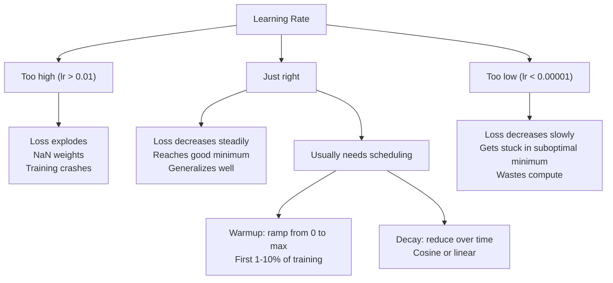
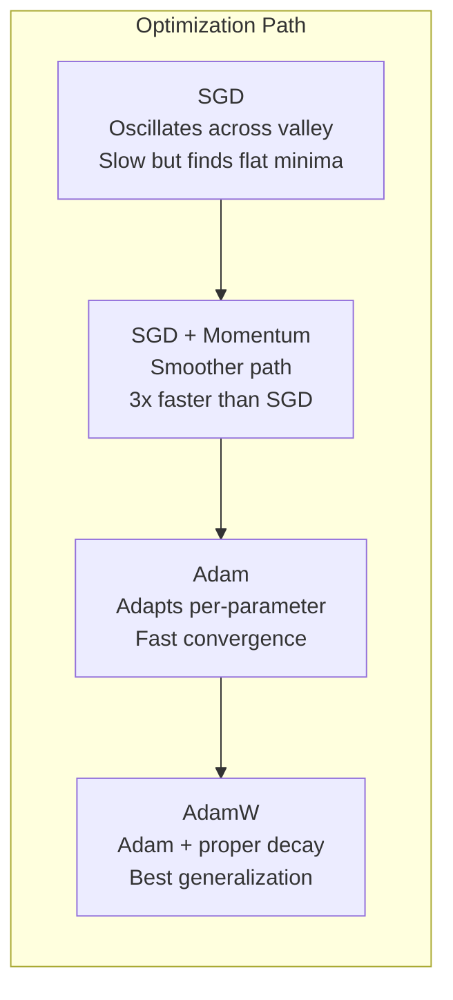
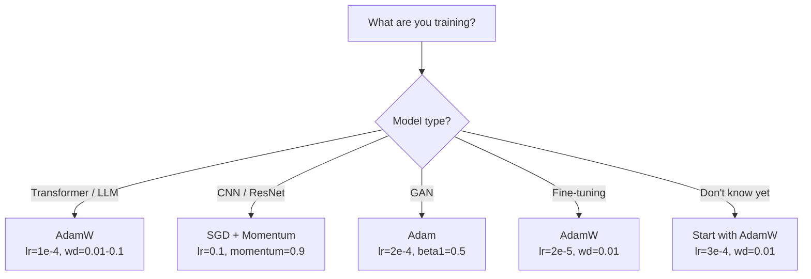

# अनुकूलक

> ग्रेडिएंट डाउनसेन्ट आपको बताता है कि किस दिशा में आगे बढ़ना है, यह बताता है कि कितनी दूर या कितनी तेजी से। एसजीडी एक पैंपस है। एडम ट्रैफिक डेटा के साथ जीपीएस है।

> **【中文解读】**梯度下降告诉你方向, लेकिन步幅和速度不说──SGD 像指南针只知道方向──Adam 像带实时路况的GPS根据历史信息调整策略──本章从零实现 SGD → Momentum → Adam → AdamW,理解每一步优化的直觉──

**Type:** Build
**Languages:** Python
**Prerequisites:** Lesson 03.05 (Loss Functions)
**Time:** ~75 minutes

## सीखने के लक्ष्य

- पायथन में स्क्रैच से SGD, गति के साथ SGD, एडम, और एडमडब्ल्यू अनुकूलक लागू करें
- बताएं कि आदम की पूर्वाग्रह सुधार प्रारंभिक प्रशिक्षण चरणों में शून्य-प्रारंभिक क्षण अनुमानों की भरपाई कैसे करती है
- यह प्रदर्शित करें कि क्यों एडमडब्ल्यू एक ही कार्य पर एल 2 नियमितता के साथ एडम की तुलना में बेहतर सामान्यीकरण का उत्पादन करता है
- ट्रांसफार्मर, सीएनएन, जीएएन और फाइन-ट्यूनिंग के लिए उपयुक्त अनुकूलक और डिफ़ॉल्ट हाइपरपैरामीटर चुनें

## समस्या  समस्या परिचय

आप ग्रेडिएंट की गणना की है. आप जानते हैं कि वजन # 4,721 नुकसान को कम करने के लिए 0.003 से कम होना चाहिए. लेकिन 0.003 किस इकाइयों में? किस पैमाने पर? और क्या आप कदम 1 पर एक ही राशि को कदम 1,000 पर ले जाना चाहिए?

> आप ने तरंग का हिसाब लगाया है। आप जानते हैं कि वजन को 0.003 से कम करके नुकसान कम करना चाहिए। लेकिन 0.003 क्या है? किस अनुपात में घटता है? चरण 1 और चरण 1,000 में समान मात्रा में बढ़ना चाहिए?

वैनिला ग्रेडिएंट गिरावट प्रत्येक चरण पर प्रत्येक पैरामीटर पर एक ही सीखने की दर लागू करती हैः w = w - lr * ग्रेडिएंट। यह तीन समस्याएं पैदा करता है जो अभ्यास में तंत्रिका नेटवर्क का प्रशिक्षण दर्दनाक बनाती हैं।

> प्रत्येक चरण में प्रत्येक तत्व के लिए समान सीखने की दर में प्रारंभिक स्तर की कमीः w = w - lr * ग्रेडिएंट।

पहले, घर्षण। नुकसान का परिदृश्य शायद ही कभी एक चिकनी कटोरे के रूप में आकार में होता है। यह एक लंबी, संकीर्ण घाटी की तरह है। ग्रिडिएंट घाटी के पार (ढीली दिशा) की ओर इंगित करता है, इसके साथ नहीं (छोटी दिशा) । संकीर्ण आयाम में ग्रिडिएंट उतार-चढ़ाव आगे-पीछे कूदता है जबकि उपयोगी आयाम के साथ छोटी प्रगति करता है। आपने देखा है कि नुकसान तेजी से गिरता है, इसलिए नहीं कि मॉडल एक साथ आता है, बल्कि इसलिए कि यह टहलता है।

> प्रथम, झोंझोल,                                                                                                                                                                                                                                                          

दूसरे, सभी मापदंडों के लिए एक सीखने की दर गलत है। कुछ वजन को बड़े अपडेट की आवश्यकता होती है (वे शुरुआती, अनुचित चरण में हैं) । दूसरों को छोटे अपडेट की आवश्यकता होती है (वे अपने इष्टतम मूल्य के करीब हैं) । एक सीखने की दर जो पहले के लिए काम करती है, बाद के को नष्ट करती है, और इसके विपरीत।

> दूसरी ओर, सभी तत्वों का साझा एक सीखने की दर गलत है। कुछ तत्वों को बड़े अपडेट की आवश्यकता होती है।

तीसरा, सड़कों के बिंदु। उच्च आयामों में, हानि परिदृश्य में विशाल समतल क्षेत्र हैं जहां गिरावट शून्य के करीब है। वैनिला एसजीडी गिरावट की गति से इन के माध्यम से क्रॉल करता है, जो प्रभावी रूप से शून्य है। मॉडल फंस गया लगता है। यह फंस गया नहीं है - यह एक समतल क्षेत्र में है, दूसरी तरफ उपयोगी उतार-चढ़ाव के साथ। लेकिन एसजीडी में इसके माध्यम से धक्का देने की कोई तंत्र नहीं है।

> तीसरा, 点── उच्च ऊंचाई पर, क्षतिग्रस्त झुकने के चेहरे पर एक बड़ा टुकड़ा समतल क्षेत्र है, तरंग शून्य के करीब है── मूल SGD से तरंगों में से एक है।

एडम तीनों को हल करता है। यह प्रति पैरामीटर दो चलती औसत बनाए रखता है - औसत ग्रेडिएंट (मोमेंटम, हैंडल ओस्किलेशन) और औसत वर्ग ग्रेडिएंट (अनुकूली दर, विभिन्न पैमाने को संभालता है) । पहले कुछ चरणों के लिए पूर्वाग्रह सुधार के साथ संयुक्त, यह आपको एक एकल अनुकूलक देता है जो डिफ़ॉल्ट हाइपरपैरामीटर के साथ 80% समस्याओं पर काम करता है। यह सबक इसे खरोंच से बनाता है ताकि आप समझ सकें कि यह बाकी 20% पर कब और क्यों विफल रहता है।

> एडम ने सभी तीन समस्याओं को हल किया। यह प्रत्येक पैरामीटर के लिए दो संचालन औसत मानों का रखरखाव करता है। यह प्रत्येक पैरामीटर के लिए औसत मानों का रखरखाव करता है। यह एक सामान्य रूप से परिभाषित है। यह एक सामान्य रूप से परिभाषित पैरामीटर के तहत 80% के लिए उपयुक्त है। यह आपको यह समझने की अनुमति देता है कि यह अन्य 20% के मुद्दों पर कब और क्यों विफल रहा है।

> **【中文解读】**मूल SGD में तीन समस्याएं हैंः झोंझोल (झोटी घाटी में आकर कूदने) ✓ एकल सीखने की दर (सभी तत्वों के लिए उपयुक्त नहीं) ✓ समतल क्षेत्र (मंच) ✓ पार नहीं कर पा रहा है ✓ शून्य पर रहने की गति (अंतर) ✓ आदम एक साथ इन तीन समस्याओं का समाधान करता हैः गतिशीलता झोंझोल को निशानाबंद करना ✓ स्व-अनुकूलन सीखने की दर (अंतर-परमानों के लिए उपयुक्त होना ✓ भिन्नता सुधार त्वरित प्रारंभिक प्राप्ति ✓✓

## अवधारणा का मूल अवधारणा

### स्टोकास्टिक ग्रेडिएंट डाउन (SGD)

सबसे सरल अनुकूलक. एक मिनी बैच पर ग्रेडिएंट की गणना और विपरीत दिशा में कदम.

> सबसे सरल अनुकूलन उपकरण--- छोटे मात्रा में गणना की तरक्की, फिर विपरीत दिशा में कदम आगे

```
w = w - lr * gradient    # 最简单的参数更新公式
```

"स्टोकास्टिक" का मतलब है कि आप डेटा के एक यादृच्छिक उपसमूह (मिनी बैच) का उपयोग कर ग्रेडिएंट का अनुमान लगाने के लिए करते हैं, पूरे डेटा सेट के बजाय। यह शोर वास्तव में उपयोगी है - यह तेज स्थानीय न्यूनतम से बचने में मदद करता है। लेकिन शोर भी कंपन का कारण बनता है।

> "क्योंकि" का अर्थ है कि आप पूरे डेटासेट के बजाय डेटा के किसी भी हिस्से का उपयोग करके गति का अनुमान लगाते हैं। यह शोर वास्तव में उपयोगी है। यह स्थानीय न्यूनतम मूल्य से बचने में मदद करता है।

सीखने की दर एकमात्र बटन है। बहुत अधिकः नुकसान भिन्न होता है। बहुत कमः प्रशिक्षण हमेशा लेता है। इष्टतम मूल्य वास्तुकला, डेटा, बैच आकार और प्रशिक्षण के वर्तमान चरण पर निर्भर करता है। आधुनिक नेटवर्क पर वैनिला एसजीडी के लिए, विशिष्ट मान 0.01 से 0.1 तक होते हैं। लेकिन एक प्रशिक्षण रन के भीतर भी, आदर्श सीखने की दर बदलती है।

> सीखने की दर अद्वितीय है। बहुत अधिक: हानि प्रसार। बहुत कमः प्रशिक्षण हमेशा अधूरा है। सर्वोत्तम मूल्य संरचना, डेटा, मात्रा और प्रशिक्षण के वर्तमान चरण पर निर्भर करता है। आधुनिक नेटवर्क पर मूल एसजीडी के लिए, सामान्य मूल्य 0.01 से 0.1 तक है। लेकिन यहां तक कि एकल प्रशिक्षण संचालन में, आदर्श सीखने की दर भी बदलती है।

### गति गति गति

गेंद-रोलिंग-डाउनहिल एनालॉग का प्रयोग अधिक होता है लेकिन सटीक होता है. केवल ग्रेडिएंट से आगे बढ़ने के बजाय, आप एक गति बनाए रखते हैं जो पिछले ग्रेडिएंट को जमा करती है।

> 球滚下山坡 की दृष्टान्त अत्यधिक प्रयोग की जाती है लेकिन यह बहुत सटीक है।

```
m_t = beta * m_{t-1} + gradient    # 速度 = 衰减 × 历史速度 + 当前梯度
w = w - lr * m_t                    # 沿速度方向更新
```

बीटा (आमतौर पर 0.9) यह नियंत्रित करता है कि कितना इतिहास रखना है। बीटा = 0.9, गति लगभग पिछले 10 ग्रेडिएंट (1 / (1 - 0.9) = 10 का औसत है।

> बीटा (अर्थात्, बीटा) = 0.9 时,动量大约是最近 10 个梯度的平均值 (/1/ (1 - 0.9) = 10) ⋅

इस प्रकार, एक ही दिशा में इंगित करने वाले ग्रेडिएंट जमा होते हैं। उस संकीर्ण घाटी में, "पार" घटक हर कदम को चिह्नित करता है और डम्बल हो जाता है। "साथ" घटक स्थिर रहता है और बढ़ जाता है। परिणाम उपयोगी दिशा में चिकनी त्वरण है।

> क्यों यह झोंपड़ को ठीक कर सकता हैः समान दिशा में तराजू जमा करना।

वास्तविक संख्याः खराब रूप से स्थिति में नुकसान परिदृश्य पर अकेले एसजीडी 10,000 कदम ले सकता है। गति (बीटा = 0.9) के साथ एसजीडी आमतौर पर एक ही समस्या पर 3,000-5,000 कदम लेता है। गति अप मार्जिनल नहीं है।

> 具体数字:                                                                                                                                                                                                                                                             

> **【拓展：SGD + Momentum 的 resurgence】**हालांकि एडम एक डिफ़ॉल्ट विकल्प है, लेकिन 2023 के शोध में दिखाया गया है कि एसजीडी+मॉमेंटम विशिष्ट कार्यों पर अभी भी फायदेमंद है।

### RMSProp के माध्यम से प्रसारित

पहली पैरामीटर प्रति अनुकूलन सीखने की दर विधि जो वास्तव में काम करती है। एक कोर्सरा व्याख्यान में हिंटन द्वारा प्रस्तावित (आधिकारिक रूप से कभी प्रकाशित नहीं किया गया) ।

> प्रथम वास्तव में प्रभावी प्रत्येक पैरामीटर स्व-अनुकूलन सीखने की दर विधि―हिंटन ने Coursera  पाठ्यक्रम में प्रस्तावित किया है

```
s_t = beta * s_{t-1} + (1 - beta) * gradient^2
w = w - lr * gradient / (sqrt(s_t) + epsilon)
```

s_t वर्ग ग्रेडिएंट्स के चल रहे औसत को ट्रैक करता है। लगातार बड़े ग्रेडिएंट्स वाले पैरामीटर को बड़ी संख्या (कम प्रभावी सीखने की दर) से विभाजित किया जाता है। छोटे ग्रेडिएंट्स वाले पैरामीटर को छोटी संख्या (बड़ी प्रभावी सीखने की दर) से विभाजित किया जाता है।

> s_t  ट्रैकिंग वर्ग梯度 के परिचालन औसत──梯度 निरंतर बड़े पैरामीटर द्वारा एक बड़ी संख्या में विभाजित किया गया है

यह "सभी मापदंडों के लिए एक सीखने की दर" समस्या को हल करता है. एक वजन जो पहले से ही बड़े अपडेट प्राप्त कर रहा है शायद अपने लक्ष्य के करीब है - इसे धीमा करें. एक वजन जो छोटे अपडेट प्राप्त कर रहा है शायद कम प्रशिक्षित है - इसे गति दें.

> यह "सभी तत्वों को एक सीखने की दर साझा करने" की समस्या को हल करता है। एक जो बड़े अपडेट किए गए वजन को प्राप्त कर चुका है वह लक्ष्य के करीब आ सकता है।

एप्सिलन (आमतौर पर 1e-8) शून्य से विभाजन को रोकता है जब किसी पैरामीटर को अपडेट नहीं किया गया है।

> Epsilon(आमतौर पर 1e-8) से बचें कि तत्वों को अद्यतन न किया जाए जब शून्य से हटाया जाए।

### एडमः गति + आरएमएसपीआरपोरम एडमः动量 + आत्म अनुकूलन सीखने की दर

एडम दोनों विचारों को जोड़ता है। यह प्रति पैरामीटर दो घातीय चलती औसत बनाए रखता हैः

> आदम ने दो प्रकार के विचारों को मिलाया। यह प्रत्येक पैरामीटर के लिए दो सूचकांकों के लिए औसत गतिशीलता बनाए रखता हैः

```
m_t = beta1 * m_{t-1} + (1 - beta1) * gradient        (first moment: mean)        # 一阶矩：梯度均值
v_t = beta2 * v_{t-1} + (1 - beta2) * gradient^2       (second moment: variance)   # 二阶矩：梯度方差
```

**Bias correction**यह मुख्य विवरण है जो अधिकांश व्याख्याओं में चूक जाती है। चरण 1 में, m_1 = (1 - बीटा 1) * ग्रेडिएंट। बीटा 1 = 0.9 के साथ, यह 0.1 * ग्रेडिएंट है - दस गुना छोटा। चलती औसत अभी तक गर्म नहीं हुई है। पूर्वाग्रह सुधार मुआवजा देता हैः

> **偏差修正**                                                                                                                                                                                                                                                              

```
m_hat = m_t / (1 - beta1^t)
v_hat = v_t / (1 - beta2^t)
```

चरण 1 में बीटा 1 = 0.9: m_hat = m_1 / (1 - 0.9) = m_1 / 0.1 = वास्तविक ग्रेडिएंट। चरण 100 मेंः (1 - 0.9^100) लगभग 1.0 है, इसलिए सुधार गायब हो जाता है। पूर्वाग्रह सुधार पहले ~ 10 चरणों के लिए मायने रखता है और ~ 50 के बाद मायने नहीं रखता है।

> 第 1 步 beta1 = 0.9 时:m_hat = m_1 / (1 - 0.9) = m_1 / 0.1 = 实际梯度──第 100 步:(1 - 0.9^100) 大约等于 1.0,修正消失──偏差修正对前 ~10 步重要,~50 步后无关紧要──

अद्यतनः

> 更新公式:

```
w = w - lr * m_hat / (sqrt(v_hat) + epsilon)
```

एडम डिफ़ॉल्टः lr = 0.001, beta1 = 0.9, beta2 = 0.999, epsilon = 1e-8. ये डिफ़ॉल्ट समस्याएं 80% के लिए काम करती हैं। जब वे नहीं करते हैं, तो पहले lr बदलें। फिर beta2। लगभग कभी भी beta1 या epsilon को नहीं बदलें।

> Adam 默认值:lr = 0.001,beta1 = 0.9,beta2 = 0.999,epsilon = 1e-8── ये默认值 80% के लिए लागू होते हैं

> **【拓展：Adam 的局限性】**यद्यपि एडम सबसे आम इस्तेमाल किया जाने वाला अनुकूलक है, यह सही नहीं हैः 1) कुछ कंवेक्स प्रश्न पर प्राप्त  नहीं जैसे SGD; 2) एडम की सर्वव्यापीता कभी SGD 差 है क्योंकि आत्म अनुकूलन सीखने की दर में ओवर-अनुकूलन का कारण बन सकता है; 3) एडम का内存 खर्चा SGD के 2-3 गुना है।

### एडमः वजन घटाने सही किया गया

L2 नियमितकरण से हानि में lambda * w^2 जोड़ता है। वैनिला SGD में, यह वजन घटाने के बराबर है (प्रत्येक चरण में वजन से lambda * w को घटाकर) । आदम में, यह समतुल्यता टूट जाती है।

> L2 औचित्य लाम्बा * w^2 को हानि में जोड़ देगा। मूल SGD में, यह वजन घटाने के बराबर है।

लोश्चिलोव और हट्टर की अंतर्दृष्टिः जब आप L2 को हानि में जोड़ते हैं और फिर एडम ग्रेडिएंट को संसाधित करता है, तो अनुकूलन सीखने की दर नियमितता शब्द को भी स्केल करती है। बड़े ग्रेडिएंट भिन्नता वाले पैरामीटर कम नियमितता प्राप्त करते हैं। छोटे भिन्नता वाले पैरामीटर अधिक प्राप्त करते हैं। यह वह नहीं है जो आप चाहते हैं - आप ग्रेडिएंट सांख्यिकीय के बावजूद समान नियमितता चाहते हैं।

> लोश्चिलोव और हट्टर का अंतर्दृष्टिः जब आप L2 को नुकसान में जोड़ते हैं तो एडम ैंडिग्रेड को संसाधित करते समय, स्व-अनुकूलन सीखने की दर भी घटती है।

एडमडब्ल्यू एडम अपडेट के बाद वजन घटाने का सीधा उपयोग करके इसे ठीक करता हैः

```
w = w - lr * m_hat / (sqrt(v_hat) + epsilon) - lr * lambda * w    # Adam 更新 + 解耦权重衰减
```

वजन घटाने की अवधि (lr * lambda * w) एडम के अनुकूलन कारक द्वारा स्केल नहीं की जाती है। प्रत्येक पैरामीटर को समान समान अनुपात में संकुचन मिलता है।

यह एक मामूली विवरण की तरह लगता है. यह नहीं है. एडम + एल 2 नियमितकरण से बेहतर समाधानों के लिए लगभग हर कार्य पर एडम + एल 2 अभ्यस्त होता है. यह ट्रांसफार्मर, विसारण मॉडल और अधिकांश आधुनिक वास्तुकला के प्रशिक्षण के लिए पायटॉर्च में डिफ़ॉल्ट अनुकूलक है।

> **【中文解读】**AdamW का महत्वपूर्ण सुधारः वजन घटाने का अधिकार नहीं है, इसका सीधा प्रभाव है।

> **【拓展：LoRA 微调中的 AdamW】**लोरा 微调 LLM 时, आम तौर पर एडमडब्ल्यू (AdamW) lr=2e-5~1e-4, वजन_बहेलना=0.01)  लोरा केवल निम्न क्रमबद्ध घटाव矩阵 A 和 B का अभ्यास करता है, एडमडब्ल्यू का वजन घटाने से इन नए घटकों की मात्रा को नियंत्रित करने में मदद मिलती है

### सीखने की दरः सबसे महत्वपूर्ण हाइपरपैरामीटर



यदि आप एक हाइपरपरमैटर को समायोजित करते हैं, तो सीखने की दर को समायोजित करें। सीखने की दर में 10 गुना बदलाव किसी भी वास्तुकला निर्णय से अधिक मायने रखता है जिसे आप करेंगे। सामान्य डिफ़ॉल्टः

> यदि आप केवल एक सुपर पैरामीटर को समायोजित करते हैं, तो सीखने की दर में 10 गुना परिवर्तन किसी भी संरचनात्मक निर्णय से महत्वपूर्ण है।

- SGD: lr = 0.01 से 0.1
  SGD:lr = 0.01 से 0.1
- आदम/आदमडब्ल्यू: lr = 1e-4 से 3e-4
  आदम/आदमW:lr = 1e-4 तक 3e-4
- परिष्कृत पूर्व-प्रशिक्षित मॉडलः lr = 1e-5 से 5e-5
  微调预训练模型:lr = 1ई-5 तक 5ई-5
- सीखने की दर में वृद्धिः पहले चरणों के 1-10% में रैखिक रैंप
  शैक्षिक वृद्धि दरः 1-10%

### अनुकूलक तुलना अनुकूलक के मुकाबले



### जब प्रत्येक अनुकूलक जीतता है



> **【拓展：深度学习中优化器的演进】**2012 में AlexNet के SGD+Momentum से 2014 में Adam के प्रस्ताव तक, फिर से 2017 में AdamW के जन्म तक  अनुकूलक के विकास ने प्रशिक्षण को "आवश्यकता के लिए कई सप्ताह संशोधन" से "डीफ़ॉल्ट पैरामीटर बस कर सकते हैं चलाने" में बदल दिया।

## इसे बनाओ, इसे पूरा करो।

> **【中文解读】**नीचे से शून्य से चार प्रकार के अनुकूलन उपकरणःSGD → SGD+Momentum → AdamW── प्रत्येक एक के आधार पर एक महत्वपूर्ण तंत्र जोड़ता है। ध्यान दें आदम के अंतर सुधार और AdamW के हल के लिए।
```figure
optimizer-trajectory
```

## इसे बनाओ

### चरण 1: वैनिला एसजीडी

> मूल SGD: तत्व सीधे घटाएं सीखने की दर गुणांक  सरल लेकिन आसान振荡

```python
class SGD:
    def __init__(self, lr=0.01):
        self.lr = lr

    def step(self, params, grads):
        for i in range(len(params)):
            params[i] -= self.lr * grads[i]
```

### चरण 2: गति के साथ SGD

> SGD+Momentum: गति परिवर्तन, संचयी ऐतिहासिक तरंगों का परिचय, एक दूसरे पर एक दूसरे के साथ एक दूसरे के साथ एक दूसरे के साथ एक दूसरे के साथ एक दूसरे के साथ एक दूसरे के साथ एक दूसरे के साथ एक दूसरे के साथ एक दूसरे के साथ एक दूसरे के साथ एक दूसरे के साथ एक दूसरे के साथ एक दूसरे के साथ एक दूसरे के साथ एक दूसरे के साथ एक दूसरे के साथ एक दूसरे के साथ एक दूसरे के साथ एक दूसरे के साथ एक दूसरे के साथ एक दूसरे के साथ एक दूसरे के साथ एक दूसरे के साथ एक दूसरे के साथ एक दूसरे के साथ एक दूसरे के साथ एक दूसरे के साथ एक दूसरे के साथ एक दूसरे के साथ एक दूसरे के साथ एक दूसरे के साथ एक दूसरे के साथ एक दूसरे के साथ एक दूसरे के साथ एक दूसरे के साथ एक दूसरे के साथ एक दूसरे के साथ एक दूसरे के साथ एक दूसरे के साथ एक दूसरे के साथ एक दूसरे के साथ एक दूसरे के साथ एक दूसरे के साथ एक साथ एक दूसरे के साथ एक साथ एक साथ एक साथ एक साथ एक साथ एक साथ एक साथ एक के साथ एक साथ एक साथ एक साथ एक के साथ एक साथ एक साथ एक साथ एक साथ एक के साथ एक साथ एक साथ एक साथ एक साथ एक के साथ एक साथ एक साथ एक साथ एक साथ एक साथ एक साथ एक साथ एक के साथ एक साथ एक साथ एक साथ एक साथ एक साथ एक साथ एक साथ एक साथ एक साथ एक साथ एक साथ एक साथ एक साथ एक साथ एक साथ एक साथ एक साथ एक साथ एक के साथ एक साथ एक साथ एक साथ एक साथ एक साथ एक साथ एक साथ एक साथ एक साथ एक साथ एक साथ एक साथ एक साथ एक साथ एक साथ एक साथ एक साथ एक साथ एक साथ एक साथ एक साथ एक साथ एक साथ एक साथ एक साथ एक साथ एक साथ एक साथ एक साथ एक साथ एक साथ एक साथ एक साथ एक साथ एक साथ एक साथ एक साथ एक साथ एक साथ एक साथ एक साथ एक साथ एक साथ एक साथ एक साथ एक साथ एक साथ एक साथ एक साथ एक साथ एक साथ एक साथ एक साथ एक साथ एक साथ एक साथ एक साथ एक साथ एक साथ एक साथ एक साथ एक साथ एक साथ एक साथ एक साथ एक साथ एक साथ एक साथ एक साथ एक साथ एक साथ एक साथ एक साथ एक साथ एक साथ एक साथ एक साथ एक साथ एक साथ एक साथ एक साथ एक साथ एक साथ एक साथ एक साथ एक साथ एक साथ एक साथ एक साथ एक साथ एक साथ एक साथ एक साथ एक साथ एक साथ एक साथ एक साथ एक साथ एक साथ एक साथ एक साथ एक साथ

```python
class SGDMomentum:
    def __init__(self, lr=0.01, beta=0.9):
        self.lr = lr
        self.beta = beta
        self.velocities = None

    def step(self, params, grads):
        if self.velocities is None:
            self.velocities = [0.0] * len(params)
        for i in range(len(params)):
            self.velocities[i] = self.beta * self.velocities[i] + grads[i]
            params[i] -= self.lr * self.velocities[i]
```

### चरण 3: एडम. . . . . . . . . . . . . . . . . . . . . . . . . . . . . . . . . . . . . . . . . . . . . . . . . . . . . . . . . . . . . . . . . . . . . . . . . . . . . . . . . . . . . . . . . . . . . . . . . . . . . . . . . . . . . . . . . . . . . . . . . . . . . . . . . . . . . . . . . . . . . . . . . . . . . . . . . . . . . . . . . . . . . . . . . . . . . . . . . . . . . . . . . . . . . . . . . . . . . . . . . . . . . . . . . . . . . . . . . . . . . . . . . . . . . . . . . . . . . . . . . . . . . . . . . . . . . . . . . . . . . . . . . . . . . . . . . . . . . . . . . . . . . . . . . . . . . . . . . . . . . . . . . . . . . . . . . . . . . . . . . . . . . . . . . . . . . . . . . . . . . . . . . . . . . . . . . . . . . . . . . . . . . . . . . . . . . . . . . . . . . . . . . . . . . . . . . . . . . . . . . . . . . . . . . . . . . . . . . . . . . . . . . . . . . . . . . . . . . . . . . . . . . . . . . . . . . . . . . . . . . . . . . . . . . . . . . . . . . . . . . . . . . . . . . . . . . . . . . . . . . . . . . .

> एडमः维护一阶矩 m (梯度平均值) और二阶矩 v (梯度方差),加上偏差修正──80% के प्रश्न का उपयोग默认参数就能跑──

```python
import math

class Adam:
    def __init__(self, lr=0.001, beta1=0.9, beta2=0.999, epsilon=1e-8):
        self.lr = lr
        self.beta1 = beta1
        self.beta2 = beta2
        self.epsilon = epsilon
        self.m = None
        self.v = None
        self.t = 0

    def step(self, params, grads):
        if self.m is None:
            self.m = [0.0] * len(params)
            self.v = [0.0] * len(params)

        self.t += 1

        for i in range(len(params)):
            self.m[i] = self.beta1 * self.m[i] + (1 - self.beta1) * grads[i]
            self.v[i] = self.beta2 * self.v[i] + (1 - self.beta2) * grads[i] ** 2

            m_hat = self.m[i] / (1 - self.beta1 ** self.t)
            v_hat = self.v[i] / (1 - self.beta2 ** self.t)

            params[i] -= self.lr * m_hat / (math.sqrt(v_hat) + self.epsilon)
```

### चरण 4: एडमडब्ल्यू

> एडमः एडम के आधार पर वजन घटाने से सीधे तत्वों के लिए खुद को घटाने से, एम और वी के संकुचन के बिना, वजन घटाने का उपाय करना।

```python
class AdamW:
    def __init__(self, lr=0.001, beta1=0.9, beta2=0.999, epsilon=1e-8, weight_decay=0.01):
        self.lr = lr
        self.beta1 = beta1
        self.beta2 = beta2
        self.epsilon = epsilon
        self.weight_decay = weight_decay
        self.m = None
        self.v = None
        self.t = 0

    def step(self, params, grads):
        if self.m is None:
            self.m = [0.0] * len(params)
            self.v = [0.0] * len(params)

        self.t += 1

        for i in range(len(params)):
            self.m[i] = self.beta1 * self.m[i] + (1 - self.beta1) * grads[i]
            self.v[i] = self.beta2 * self.v[i] + (1 - self.beta2) * grads[i] ** 2

            m_hat = self.m[i] / (1 - self.beta1 ** self.t)
            v_hat = self.v[i] / (1 - self.beta2 ** self.t)

            params[i] -= self.lr * m_hat / (math.sqrt(v_hat) + self.epsilon)
            params[i] -= self.lr * self.weight_decay * params[i]
```

### चरण 5: प्रशिक्षण तुलना

चारो अनुकूलक के साथ कक्षा 05 से सर्कल डेटासेट पर एक ही दो-परत नेटवर्क को प्रशिक्षित करें। अभिसरण की तुलना करें।

> कक्षा 5 के गोलाकार डेटा सेट को एक ही दो-स्तरीय नेटवर्क के साथ, चार प्रकार के अनुकूलक की प्राप्ति गति के मुकाबले प्रयोग करें।

```python
import random

def sigmoid(x):
    x = max(-500, min(500, x))
    return 1.0 / (1.0 + math.exp(-x))

def make_circle_data(n=200, seed=42):
    random.seed(seed)
    data = []
    for _ in range(n):
        x = random.uniform(-2, 2)
        y = random.uniform(-2, 2)
        label = 1.0 if x * x + y * y < 1.5 else 0.0
        data.append(([x, y], label))
    return data


class OptimizerTestNetwork:
    def __init__(self, optimizer, hidden_size=8):
        random.seed(0)
        self.hidden_size = hidden_size
        self.optimizer = optimizer

        self.w1 = [[random.gauss(0, 0.5) for _ in range(2)] for _ in range(hidden_size)]
        self.b1 = [0.0] * hidden_size
        self.w2 = [random.gauss(0, 0.5) for _ in range(hidden_size)]
        self.b2 = 0.0

    def get_params(self):
        params = []
        for row in self.w1:
            params.extend(row)
        params.extend(self.b1)
        params.extend(self.w2)
        params.append(self.b2)
        return params

    def set_params(self, params):
        idx = 0
        for i in range(self.hidden_size):
            for j in range(2):
                self.w1[i][j] = params[idx]
                idx += 1
        for i in range(self.hidden_size):
            self.b1[i] = params[idx]
            idx += 1
        for i in range(self.hidden_size):
            self.w2[i] = params[idx]
            idx += 1
        self.b2 = params[idx]

    def forward(self, x):
        self.x = x
        self.z1 = []
        self.h = []
        for i in range(self.hidden_size):
            z = self.w1[i][0] * x[0] + self.w1[i][1] * x[1] + self.b1[i]
            self.z1.append(z)
            self.h.append(max(0.0, z))

        self.z2 = sum(self.w2[i] * self.h[i] for i in range(self.hidden_size)) + self.b2
        self.out = sigmoid(self.z2)
        return self.out

    def compute_grads(self, target):
        eps = 1e-15
        p = max(eps, min(1 - eps, self.out))
        d_loss = -(target / p) + (1 - target) / (1 - p)
        d_sigmoid = self.out * (1 - self.out)
        d_out = d_loss * d_sigmoid

        grads = [0.0] * (self.hidden_size * 2 + self.hidden_size + self.hidden_size + 1)
        idx = 0
        for i in range(self.hidden_size):
            d_relu = 1.0 if self.z1[i] > 0 else 0.0
            d_h = d_out * self.w2[i] * d_relu
            grads[idx] = d_h * self.x[0]
            grads[idx + 1] = d_h * self.x[1]
            idx += 2

        for i in range(self.hidden_size):
            d_relu = 1.0 if self.z1[i] > 0 else 0.0
            grads[idx] = d_out * self.w2[i] * d_relu
            idx += 1

        for i in range(self.hidden_size):
            grads[idx] = d_out * self.h[i]
            idx += 1

        grads[idx] = d_out
        return grads

    def train(self, data, epochs=300):
        losses = []
        for epoch in range(epochs):
            total_loss = 0.0
            correct = 0
            for x, y in data:
                pred = self.forward(x)
                grads = self.compute_grads(y)
                params = self.get_params()
                self.optimizer.step(params, grads)
                self.set_params(params)

                eps = 1e-15
                p = max(eps, min(1 - eps, pred))
                total_loss += -(y * math.log(p) + (1 - y) * math.log(1 - p))
                if (pred >= 0.5) == (y >= 0.5):
                    correct += 1
            avg_loss = total_loss / len(data)
            accuracy = correct / len(data) * 100
            losses.append((avg_loss, accuracy))
            if epoch % 75 == 0 or epoch == epochs - 1:
                print(f"    Epoch {epoch:3d}: loss={avg_loss:.4f}, accuracy={accuracy:.1f}%")
        return losses
```

> **【拓展：GPT 训练中的优化器选择】**OpenAI की GPT 系列全部使用Adam 优化器(GPT-4 推测也使用AdamW) 』 प्रशिक्षण时一个常见技巧: एम्बेडिंग 层和输出 层的使用不同学习率──在 PyTorch 中通过参数组 实现:`optimizer = AdamW([{'params': base_params}, {'params': head_params, 'lr': lr*0.1}])`

## इसे फ्रेमवर्क के साथ लागू करें

> **【中文解读】**PyTorch 中的训练循环模式:零_grad → forward → loss → backward → clip → step → schedule──这个顺序不能搞错──CNN 用 SGD+Momentum(lr=0.1),Transformer 用 AdamW(lr=1e-4)──

PyTorch अनुकूलक पैरामीटर समूहों, ग्रेडिएंट क्लिपिंग, और सीखने की दर अनुसूची संभालते हैंः

```python
import torch
import torch.optim as optim

model = torch.nn.Sequential(
    torch.nn.Linear(784, 256),
    torch.nn.ReLU(),
    torch.nn.Linear(256, 10),
)

optimizer = optim.AdamW(model.parameters(), lr=3e-4, weight_decay=0.01)

scheduler = optim.lr_scheduler.CosineAnnealingLR(optimizer, T_max=100)

for epoch in range(100):
    optimizer.zero_grad()
    output = model(torch.randn(32, 784))
    loss = torch.nn.functional.cross_entropy(output, torch.randint(0, 10, (32,)))
    loss.backward()
    torch.nn.utils.clip_grad_norm_(model.parameters(), max_norm=1.0)
    optimizer.step()
    scheduler.step()
```

पैटर्न हमेशा हैः शून्य_ग्रेड, आगे, हानि, पीछे, (क्लिप), चरण, (अनुसूची) । इस क्रम को याद रखें। इसे गलत करना (जैसे, अनुसूचक.step() को ऑप्टिमाइज़र.step()) से पहले कॉल करना सूक्ष्म बग का एक आम स्रोत है।

सीएनएन के लिए, कई चिकित्सकों को अभी भी चरण या कॉसिन शेड्यूल के साथ एसजीडी + गति (एलआर = 0.1, गति = 0.9, वजन_बहेलना = 1 ई-4) पसंद है। एसजीडी को फ्लैटर न्यूनतम मिलता है, जो अक्सर बेहतर सामान्यीकरण करता है। ट्रांसफार्मर और एलएलएम के लिए, वार्मअप + कॉसिन बिगाड़ के साथ एडमडब्ल्यू सार्वभौमिक डिफ़ॉल्ट है। बिना एक मापा कारण के बिना सहमति से लड़ें नहीं।

## इसे भेजें उत्पाद

इस पाठ से उत्पन्न होता हैः
- `outputs/prompt-optimizer-selector.md`-- किसी भी वास्तुकला के लिए सही अनुकूलक और सीखने की दर चुनने के लिए एक निर्णय प्रम्प्ट

## अभ्यास विषय

1. वर्तमान स्थिति के बजाय "lookhead" स्थिति (w - lr * बीटा * v) पर ग्रेडिएंट की गणना करने वाले नेस्टरोव गति को लागू करें। सर्कल डेटासेट पर मानक गति के साथ अभिसरण की तुलना करें।
   > **练习 1：**实现 नेस्तरोव 动量 (), मानक गति के मुकाबले 收速度

2. प्रशिक्षण चरणों के पहले 10% के दौरान 0 से अधिकतम तक रैखिक रैंप लागू करें, फिर कोसिन गिरावट को 0 तक करें। एडम + वार्मअप बनाम एडम के साथ प्रशिक्षण करें। सर्कल डेटासेट पर 90% सटीकता तक पहुंचने में कितने युग लगते हैं, इसका माप करें।
   > **练习 2：** वार्मिंग + कॉस्मीन गिरावट को प्राप्त करना  शिक्षण दर को विनियमित करना,  वार्मिंग के अनुपात में  90%  सटीकता दर के लिए 

3. एडम प्रशिक्षण के दौरान प्रत्येक पैरामीटर के लिए प्रभावी सीखने की दर का ट्रैक करें। प्रभावी दर lr * m_hat / (sqrt(v_hat) + eps है। 10, 50 और 200 चरणों के बाद प्रभावी दरों के वितरण का ग्राफ बनाएं। क्या सभी पैरामीटर एक ही गति से अपडेट किए जा रहे हैं?
   > **练习 3：** ट्रैक एडम  प्रशिक्षण में विभिन्न तत्वों की प्रभावी सीखने की दर, विभिन्न तत्वों के अद्यतन गति अंतर को देखना

4. ग्रेडिएंट क्लिपिंग (ग्लोबल नॉर्म द्वारा क्लिप) लागू करें। अधिकतम ग्रेडिएंट नॉर्म को 1.0 पर सेट करें। उच्च सीखने की दर (एलआर = 0.01 के लिए एडम) का उपयोग करके क्लिपिंग के साथ और बिना अभ्यास करें। गणना करें कि 10 यादृच्छिक बीज के साथ और बिना कितने रन विचलित होते हैं (हानि NaN में जाती है) ।
   > **练习 4：**️️️️️️️️️️️️️️️️️️️️️️️️️️️️️️️️️️️️️️️️️️️️️️️️️️️️️️️️️️️️️️️️️️️️️️️️️️️️️️️️️️️️️️️️️️️️️️️️️️️️️️️️️️️️️️️️️️️️️️️️️️️️️️️️️️️️️️️️️️️️️️️️️️️️️️️️️️️️️️️️️️️️️️️️️️️️️️️️️️️️️️️️️️️️️️️️️️️️️️️️️️️️️️️️️️️️️️️️️️️️️️️️️️️️️️️️️️️️️️️️️️️️️️️️️️️️️️️️️️️️️️️️️️️️️️️️️️️️️️️️️️️️️️️️️️️️️️️️️️️️️️️️️️️️️️️️️️️️️️️️️️️️️️️️️️️️️️️️️️️️️️️️️️️️️️️️️️️️️️️️️️️️️️️️️️️️️️️️️️️️️️️️️️️️️️️️️️️️️️️️️️️️️️️️️️️️️️️️️️️️️️️️️️️️️️️️️️️️️️️️️️️️️️️️️️️️️️️️️️️️️️️️️️️️️️️️️️️️️️️️️️️️️️️️️️️️️️️️️️️️️️️️️️️️

5. बड़े वजन वाले नेटवर्क पर एडम बनाम एडमडब्ल्यू की तुलना करें। सभी वजन को [-5, 5] (सामान्य से बहुत बड़ा) में यादृच्छिक मानों पर प्रारंभ करें। 200 काल के लिए वजन_बदल = 0.1 के साथ प्रशिक्षित करें। दोनों अनुकूलकों के लिए प्रशिक्षण के ऊपर वजन के L2 मानदंड को रेखांकित करें। एडमडब्ल्यू को वजन में तेजी से संकुचन दिखाना चाहिए।
   > **练习 5：**️️️️️️️️️️️️️️️️️️️️️️️️️️️️️️️️️️️️️️️️️️️️️️️️️️️️️️️️️️️️️️️️️️️️️️️️️️️️️️️️️️️️️️️️️️️️️️️️️️️️️️️️️️️️️️️️️️️️️️️️️️️️️️️️️️️️️️️️️️️️️️️️️️️️️️️️️️️️️️️️️️️️️️️️️️️️️️

## Key Terms  Key Terms  Key Terms  Key Terms  Key Terms  Key Terms  Key Terms  Key Terms  Key Terms  Key Terms  Key Terms  Key Terms  Key Terms  Key Terms  Key Terms  Key Terms  Key Terms  Key Terms  Key Terms  Key Terms  Key Terms  Key Terms  Key Terms  Key Terms  Key Terms  Key Terms  Key Terms  Key Terms  Key Terms  Key Terms  Key Terms  Key Terms  Key Terms  Key Terms  Key Terms  Key Terms  Key Terms  Key Terms  Key Terms  Key Terms  Key Terms  Key Terms  Key Terms  Key Terms  Key Terms  Key Terms  Key Terms  Key Terms  Key Terms  Key Terms  Key Terms  Key Terms  Key Terms  Key Terms  Key Terms  Key Terms  Key Terms  Key Terms  Key Terms  Key Terms  Key Terms  Key Terms  Key Terms  Key Terms  Key Terms  Key Terms  Key Terms  Key Terms  Key Terms  Key Terms  Key Terms  Key Terms  Key Terms  Key Terms  Key Terms  Key Terms  Key Terms  Key Terms  Key Terms  Key Terms  Key Terms  Key Terms  Key Terms  Key Terms  Key Terms  Key Terms  Key Terms  Key Terms  Key Terms  Key Terms  Key Terms  Key Terms  Key Terms  Key Terms  Key Terms  Key Terms  Key Terms  Key Terms  Key Terms  Key Terms  Key Terms  Key Terms  Key Terms  Key Terms  Key Terms  Key Terms  Key Terms  Key Terms  Key

| Term | What people say | What it actually means |
|------|----------------|----------------------|
| Learning rate | "Step size" | The scalar multiplier on the gradient update; the single most impactful hyperparameter in training |
| SGD | "Basic gradient descent" | Stochastic gradient descent: update weights by subtracting lr * gradient, computed on a mini-batch |
| Momentum | "Rolling ball analogy" | Exponential moving average of past gradients; dampens oscillation and accelerates consistent directions |
| RMSProp | "Adaptive learning rate" | Divides each parameter's gradient by the running RMS of its recent gradients; equalizes learning rates |
| Adam | "The default optimizer" | Combines momentum (first moment) and RMSProp (second moment) with bias correction for the initial steps |
| AdamW | "Adam done right" | Adam with decoupled weight decay; applies regularization directly to weights rather than through the gradient |
| Bias correction | "Warmup for running averages" | Dividing by (1 - beta^t) to compensate for the zero-initialization of Adam's moment estimates |
| Weight decay | "Shrink the weights" | Subtracting a fraction of the weight value at each step; a regularizer that penalizes large weights |
| Learning rate schedule | "Changing lr over time" | A function that adjusts the learning rate during training; warmup + cosine decay is the modern default |
| Gradient clipping | "Capping the gradient norm" | Scaling down the gradient vector when its norm exceeds a threshold; prevents exploding gradient updates |

| 术语 | 通俗说法 | 实际含义 |
|------|---------|---------|
| 学习率 (Learning rate) | "步长" | 梯度更新的标量乘数；训练中影响最大的超参数 |
| SGD | "基础梯度下降" | 随机梯度下降：用小批量梯度更新 w -= lr * grad |
| 动量 (Momentum) | "滚球的类比" | 历史梯度的指数移动平均；抑制振荡、加速一致方向 |
| RMSProp | "自适应学习率" | 除以梯度平方的移动平均根；均衡各参数学习速度 |
| Adam | "默认优化器" | 动量 + RMSProp + 偏差修正的统一优化器 |
| AdamW | "正确的 Adam" | Adam + 解耦权重衰减；直接对参数施加正则化 |
| 偏差修正 (Bias correction) | "运行平均的热身" | 除以 (1-beta^t) 补偿 Adam 矩估计的零初始化偏差 |
| 权重衰减 (Weight decay) | "缩小权重" | 每步减去权重的一小部分；惩罚大权重的正则化手段 |
| 学习率调度 (LR schedule) | "随时间改变 lr" | 训练中调整学习率的函数；warmup + cosine decay 是现代标配 |
| 梯度裁剪 (Gradient clipping) | "限制梯度范数" | 梯度范数超限时缩小梯度；防止梯度爆炸 |

## आगे पढ़ना 延伸閱讀

- किंगमा एंड बा, "एडमः स्टोकास्टिक अनुकूलन के लिए एक विधि" (2014) -- अभिसरण विश्लेषण और पूर्वाग्रह सुधार व्युत्पन्न के साथ मूल एडम पेपर
- लोश्चिलोव और हटर, "डिकोप्ल्ड वेट डेकेड रेगुलेरेशन" (2017) -- साबित किया कि एल 2 रेगुलेरेशन और वजन में गिरावट आदम में बराबर नहीं हैं, और प्रस्तावित एडमडब्ल्यू
- स्मिथ, "ट्रेनिंग न्यूरल नेटवर्क के लिए चक्रवर्ती सीखने की दरें" (2017) -- एलआर रेंज परीक्षण और चक्रवर्ती कार्यक्रम पेश किए जो एक निश्चित सीखने की दर को समायोजित करने की आवश्यकता को समाप्त करते हैं
- रुडर, "ग्रेडिएंट डेसेंट ऑप्टिमाइजेशन एल्गोरिदम का एक अवलोकन" (2016) - सभी ऑप्टिमाइज़र वेरिएंट के सर्वश्रेष्ठ एकल सर्वेक्षण, स्पष्ट तुलना और अंतर्दृष्टि के साथ
