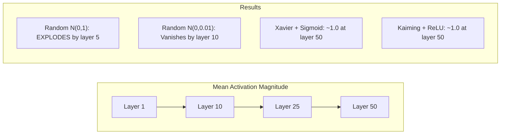
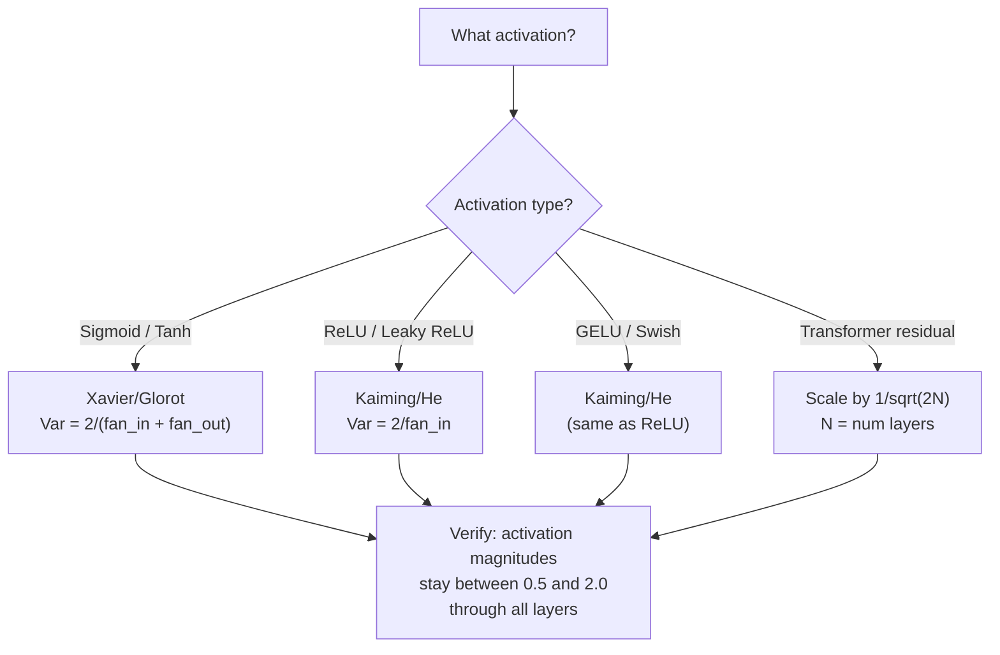

# वजन आरंभिकरण और प्रशिक्षण स्थिरता .

> गलत शुरू करें और प्रशिक्षण कभी शुरू नहीं होता है सही शुरू करें और 50 परतों के रूप में सुचारू रूप से प्रशिक्षण 3.

> **【中文解读】**50 लेयर ट्रेनिंग और 3 लेयर की तरह ही स्मूथ है। Xavier प्रारम्भिकता (सिग्मोइड/ताँह) और काइमिंग प्रारम्भिकता (ReLU/GELU) आधुनिक गहन सीखने की आधारशिला है।

**Type:** Build
**Languages:** Python
**Prerequisites:** Lesson 03.04 (Activation Functions), Lesson 03.07 (Regularization)
**Time:** ~90 minutes

## सीखने के लक्ष्य

- शून्य, यादृच्छिक, ज़ैवियर/ग्लोरोट, और कैमिंग/हे आरंभिकरण रणनीतियों को लागू करें और 50 परतों के माध्यम से सक्रियण परिमाणों पर उनके प्रभाव को मापें
- पता करें कि Xavier init Var(w) = 2/(fan_in + fan_out) का उपयोग क्यों करता है और Kaiming Var(w) = 2/fan_in का उपयोग क्यों करता है
- शून्य आरंभिकरण के साथ सममितता समस्या का प्रदर्शन करें और समझाएं कि अकेले यादृच्छिक पैमाने क्यों अपर्याप्त है
- सक्रियण फ़ंक्शन के लिए सही आरंभिकरण रणनीति से मेल खाएंः सिग्मोइड/टैन के लिए ज़ावेयर, ReLU/GELU के लिए कैमिंग

> **【中文解读】**इस अध्याय में मुख्य प्रश्नः कैसे चुनें प्रारंभिक权重,让信号在50 层网络中既不消失也不爆炸──答案是Xavier初始化(sigmoid/tanh 配套) 和凯मिंग初始化(ReLU/GELU 配套)──PyTorch का nn.

## समस्या  समस्या परिचय

सभी वजन को शून्य पर शुरू करें। कुछ भी नहीं सीखता है। प्रत्येक न्यूरॉन एक ही फ़ंक्शन की गणना करता है, एक ही ग्रेडिएंट प्राप्त करता है, और एक ही रूप से अद्यतन करता है। 10,000 युगों के बाद, आपके 512 न्यूरॉन छिपे परत अभी भी 512 प्रतियां है एक ही न्यूरॉन. आपने 512 मापदंडों के लिए भुगतान किया और 1 प्राप्त किया।

>                                                                                                                                                                                                                                                               

इनको बहुत बड़ा शुरू करें. सक्रियण नेटवर्क के माध्यम से विस्फोट करते हैं. परत 10 तक, मान 1e15 तक पहुंच जाते हैं। परत 20 तक, वे अनंत तक बहते हैं। ग्रेडिएंट एक ही पटरियों को उलटते हैं।

> प्रारंभ में बहुत बड़ा हो गया है। सक्रिय मूल्य नेटवर्क में विस्फोट हो गया है। 10 वें स्तर तक, मूल्य 1e15 तक पहुंच गया है। 20 वें स्तर तक, वे अनंत रूप से फैल रहे हैं।

उन्हें एक मानक सामान्य वितरण से यादृच्छिक रूप से आरंभ करें। 3 परतों के लिए काम करता है। 50 परतों पर, संकेत शून्य तक गिर जाता है या अनंत तक विस्फोट होता है, यह इस बात पर निर्भर करता है कि यादृच्छिक पैमाने थोड़ा बहुत छोटा या थोड़ा बहुत बड़ा था। "काम" और "तोड़ा" के बीच की सीमा रेजर-पातकी है।

> मानक-अधिकांश वितरण के साथ-साथ प्रारम्भिकता से 3 स्तर काम कर सकते हैं50 स्तर पर, संकेत  शून्य या विस्फोट के लिए अनंत है, यह निर्भर करता है कि यच्छिक पैमाने छोटा या छोटा है"प्रभावी" और "विघटन" के बीच सीमा बहुत कम है

वजन शुरू करना गहन सीखने में सबसे कम महत्व वाला निर्णय है। वास्तुकला कागजात प्राप्त करती है। अनुकूलक ब्लॉग पोस्ट प्राप्त करते हैं। प्रारंभ करने के लिए एक फुटनोट प्राप्त होता है। लेकिन इसे गलत समझें और इससे कोई फर्क नहीं पड़ता - प्रशिक्षण शुरू होने से पहले आपका नेटवर्क मर गया है।

> 权重初始化是深度学习中最低估的决策――架构能发文――优化器能写博客――初始化只能得到一个脚注―― लेकिन यदि कोई गलती हो गई तो बाकी सब कुछ मायने नहीं रखता आपका नेटवर्क प्रशिक्षण शुरू होने से पहले ही मर चुका है。

> **【中文解读】**प्रारंभिककरण गहन सीखने में सबसे कम मूल्यांकन किया जाने वाला निर्णय है। शून्य प्रारंभिककरण से समकक्षता (सभी तंत्रिका विज्ञान की तरह) होती है, जैसे-जैसे प्रारंभिककरण के अंतर से 50 परतों के नेटवर्क संकेत गायब हो जाते हैं या विस्फोट होते हैं।

> **【拓展：GPT-2 的残差缩放技巧】**जीपीटी-2  ने 1/sqrt(2N) के शेष के संकुचन को शुरू किया (N है स्तर संख्या) 😇 प्रत्येक शेष के कनेक्शन x = x + उपपरत(x) शहर में वृद्धि होगी 👉126 स्तर के लामा 3 में वृद्धि होगी 👉126 गुना 😇 संकुचन कारक 👉 करे 👉 स्थिर रहे 😇 यह तकनीक अब सभी में है 👉 ट्रांसफार्मर 👉 अपनाया गया है 😇

## अवधारणा का मूल अवधारणा

### समरूपता समस्या

एक परत में प्रत्येक न्यूरॉन की संरचना समान हैः इनपुट को वजन से गुणा करें, पूर्वाग्रह जोड़ें, सक्रियण लागू करें। यदि सभी वजन एक ही मूल्य से शुरू होते हैं (शून्य चरम मामला है), तो प्रत्येक न्यूरॉन एक ही आउटपुट की गणना करता है। बैकप्रॉपेग के दौरान, प्रत्येक न्यूरॉन को एक ही ग्रेडिएंट प्राप्त होता है। अद्यतन चरण के दौरान, प्रत्येक न्यूरॉन एक ही मात्रा में बदलता है।

> एक परत में प्रत्येक तंत्रिका का एक ही संरचना हैः इनपुट गुणा भार, अतिरिक्त विकृति, अनुप्रयोग सक्रियण फ़ंक्शन। यदि स्वामित्व भार एक ही मूल्य से शुरू होता है, तो प्रत्येक तंत्रिका एक ही आउटपुट का गणना करता है।

आप फंसे हुए हैं. नेटवर्क में सैकड़ों पैरामीटर हैं, लेकिन वे सभी लॉकस्टेप में चलते हैं. इसे सममितता कहा जाता है, और यादृच्छिक आरंभिकरण इसे तोड़ने का तरीका है. प्रत्येक न्यूरॉन वजन स्थान में एक अलग बिंदु पर शुरू होता है, इसलिए प्रत्येक एक अलग विशेषता सीखता है.

> आप पर कब्जा कर लिया गया है। नेटवर्क में सैकड़ों घटक हैं, लेकिन वे सभी एक साथ चल रहे हैं। इसे समरूपता कहा जाता है, और आकस्मिक आरंभिकरण इसका आक्रामक तरीका है। प्रत्येक तंत्रिका भारोत्तोलन स्थान में अलग-अलग बिंदुओं से शुरू होती है, इसलिए प्रत्येक अलग-अलग विशेषताएं सीखती है।

लेकिन "संदिग्ध" पर्याप्त नहीं है। *स्केल* की यादृच्छिकता निर्धारित करती है कि नेटवर्क ट्रेनों या नहीं।

> लेकिन "आसमान" भी पर्याप्त नहीं है।

### परतों के माध्यम से विविधता प्रसारण

फैन_इन इनपुट के साथ एक एकल परत पर विचार करेंः

> 考虑一个有风扇_in 个输入的单层:

```
z = w1*x1 + w2*x2 + ... + w_n*x_n
```

यदि प्रत्येक भार wi को Var(w) के साथ एक वितरण से लिया गया है और प्रत्येक इनपुट xi में Var(x) का अंतर है, तो आउटपुट भिन्नता हैः

> यदि प्रत्येक भार भार विय से आया है, तो प्रत्येक प्रविष्टि x का आयाम Var (x) है, तो आउटपुट का आयाम Var (x) हैः

```
Var(z) = fan_in * Var(w) * Var(x)
```

यदि Var(w) = 1 और fan_in = 512, आउटपुट भिन्नता 512x इनपुट भिन्नता है। 10 परतों के बादः 512 ^ 10 = 1.2e27. आपका संकेत विस्फोट हो गया है।

> यदि Var(w) = 1 且 fan_in = 512,输出差是输入差的 512 倍──10 层后:512^10 = 1.2e27──आपका संकेत विस्फोट हो चुका है──

यदि Var ((w) = 0.001 है, तो आउटपुट वैरिएंस प्रति परत 0.001 * 512 = 0.512 से घट जाती है। 10 परतों के बादः 0.512^10 = 0.00013। आपका संकेत गायब हो गया है।

> यदि Var(w) = 0.001,输出方差每层缩小 0.001 * 512 = 0.512──10 层后:0.512^10 = 0.00013──आपका संकेत गायब हो गया है──

लक्ष्य: Var(w) चुनें ताकि Var(z) = Var(x) । सिग्नल आयाम परतों के पार स्थिर रहता है।

> 目標:选择 Var(w) 使 Var(z) = Var(x) ――信号幅度逐层保持恒定──

> **【中文解读】**方差传播的数学:Var(z) = फैन_इन *Var(w) *Var(x)。 यदि फैन_इन=512 且Var(w) =1,输出方差是输入的512 倍──10 层后:512^10 = 1.2e27,信号爆炸──Xavier 和 Kaiming का लक्ष्य सभी हैं让Var(z) = Var(x),使信号幅度逐层保持恒定──

### Xavier/Glorot आरंभिकरण

ग्लोरोट और बेंगियो (2010) ने सिग्मोइड और टैन सक्रियण के लिए समाधान प्राप्त किया। आगे और पीछे दोनों पास में भिन्नता को निरंतर रखने के लिएः

> ग्लोरोट व बेन्गियो (2010) ने सिग्मोइड व टाँह के सक्रियण फ़ंक्शन के हल का प्रस्ताव दिया।

```
Var(w) = 2 / (fan_in + fan_out)
```

व्यवहार में, वजन निम्नानुसार से प्राप्त किया जाता हैः

> 实践中,权重从以下分布抽取:

```
w ~ Uniform(-limit, limit)  where limit = sqrt(6 / (fan_in + fan_out))
```

या

```
w ~ Normal(0, sqrt(2 / (fan_in + fan_out)))
```

यह काम करता है क्योंकि सिग्मोइड और टैन लगभग शून्य के करीब रैखिक हैं, जहां ठीक से आरंभिक सक्रियण रहते हैं। विविधता दर्जनों परतों के माध्यम से स्थिर रहती है।

> यह इसलिए प्रभावी है, क्योंकि सिग्मोइड और टैनह शून्य के निकट लगभग रैखिक है, जबकि सही प्रारंभिककरण का सक्रियण मूल्य वास्तव में शून्य के निकट रहता है।

### काइमिंग / वह आरंभिकता

ReLU आउटपुट का आधा मार देता है (सभी नकारात्मक शून्य हो जाता है) प्रभावी फैन_इन आधा हो जाता है क्योंकि औसत में आधे इनपुट शून्य हैं। Xavier init इस के लिए खाता नहीं है - यह आवश्यक भिन्नता को कम बताता है।

> ReLU ने आधे आउटपुट को शून्य में रखा है। सभी नकारात्मक मानों को शून्य में रखा है।

He et al. (2015) ने सूत्र को समायोजित कियाः

> He 等人 (2015) 调整了公式:

```
Var(w) = 2 / fan_in
```

वजन निम्न से प्राप्त किए जाते हैंः

> 权重从以下分布抽取:

```
w ~ Normal(0, sqrt(2 / fan_in))
```

2 का कारक ReLU को सक्रियण के आधे शून्य करने के लिए क्षतिपूर्ति करता है। इसके बिना, संकेत प्रति परत ~ 0.5x कम हो जाता है। 50 परतों के साथः 0.5^50 = 8.8e-16. काइमिंग init इससे बचाता है।

> कारण 2  क्षतिपूर्ति ReLU होगा आधा सक्रियण मूल्य सेट शून्य                                                                                                                                                                                                                                                        

> **【拓展：PyTorch 的默认初始化】**PyTorch का nn.Linear 默认使用 काइमिंग वर्दी 初始化(`nn.init.kaiming_uniform_`,mode='fan_in'), LeakyReLU के नकारात्मक_slope=sqrt(5) के साथ जोड़ा गया। इसका मतलब है जब आप लिखते हैं`nn.Linear(784, 256)`时,PyTorch 已经帮助你选择好初始化――但自定义架构(Transformer、混合专家模型) 需要手动调整──

### ट्रांसफार्मर आरंभिकरण

जीपीटी-2 ने एक अलग पैटर्न पेश किया। शेष कनेक्शन प्रत्येक उप-परत के आउटपुट को इसके इनपुट में जोड़ते हैंः

> GPT-2  ने एक अलग मोड introduced किया  शेष कनेक्शन प्रत्येक उप-स्तर के आउटपुट को उसके इनपुट पर जोड़ देगा:

```
x = x + sublayer(x)
```

प्रत्येक जोड़ भिन्नता बढ़ाता है। N अवशिष्ट परतों के साथ, भिन्नता N के अनुपात में बढ़ जाती है। GPT-2 अवशिष्ट परतों के वजन को 1/sqrt(2N) द्वारा स्केल करता है, जहां N परतों की संख्या है। यह संचित संकेत परिमाण को स्थिर रखता है।

> प्रत्येक बार अतिरिक्त होते हैं, तब फ़ैसला बढ़ेगा। जब N 个残差层 होते हैं, तब फ़ैसला N 成比例 बढ़ेगा। GPT-2 में शेष फ़ैसला का वजन 1/sqrt (२N) तक बढ़ेगा, जिसमें N है, यह फ़ैसला संख्या है।

एलएएमए 3 (405 बी पैरामीटर, 126 परतें) एक समान योजना का उपयोग करता है। इस स्केलिंग के बिना, शेष प्रवाह 126 परतों के ध्यान और फ़ीडफॉरवर्ड ब्लॉक के माध्यम से असीमित रूप से बढ़ेगा।

> Llama 3 ((4050 亿参数,126 层) इसी तरह के कार्यक्रमों का उपयोग करते हुए, कोई संकुचन नहीं होता है, शेष प्रवाह 126 层 ध्यान और पूर्व 块 के माध्यम से बढ़ता है।

> **【拓展：混合专家模型（MoE）的初始化挑战】**मिश्रित 8x7B 和 GPT-4 等 मॉडल MoE 架构 का उपयोग करते हैं, प्रत्येक टोकन केवल सक्रिय भाग विशेषज्ञों को प्रदान करता है। प्रारंभिक समय में यह सुनिश्चित करने की आवश्यकता होती हैः मार्गदर्शक का प्रारंभिक भार सभी टोकन को एक विशेषज्ञ के साथ चयन करने नहीं देता है।

```mermaid
flowchart TD
    subgraph "Zero Init"
        Z1["Layer 1<br/>All weights = 0"] --> Z2["Layer 2<br/>All neurons identical"]
        Z2 --> Z3["Layer 3<br/>Still identical"]
        Z3 --> ZR["Result: 1 effective neuron<br/>regardless of width"]
    end

    subgraph "Xavier Init"
        X1["Layer 1<br/>Var = 2/(fan_in+fan_out)"] --> X2["Layer 2<br/>Signal stable"]
        X2 --> X3["Layer 50<br/>Signal stable"]
        X3 --> XR["Result: Trains with<br/>sigmoid/tanh"]
    end

    subgraph "Kaiming Init"
        K1["Layer 1<br/>Var = 2/fan_in"] --> K2["Layer 2<br/>Signal stable"]
        K2 --> K3["Layer 50<br/>Signal stable"]
        K3 --> KR["Result: Trains with<br/>ReLU/GELU"]
    end
```



### 50 परतों के माध्यम से सक्रियण परिमाण 50 परतों सक्रियण परिमाण प्रयोग



### सही शुरुआत चुनना सही शुरुआत चुनना



## इसे बनाओ, इसे पूरा करो।
```figure
weight-init-variance
```

## इसे बनाओ

> **【中文解读】**प्रयोग डिजाइन: 50 层网络 के माध्यम से एक संकेत प्राप्त करें, प्रत्येक स्तर की सक्रियता की मात्रा को मापें।

### चरण 1: आरंभिकरण रणनीति

एक वजन मैट्रिक्स को आरंभ करने के चार तरीके। प्रत्येक पंक्तियों की एक सूची (एक 2D मैट्रिक्स) लौटाता है।

> चार प्रकार के प्रारम्भिक भार भारोत्तोलन विधि── प्रत्येक प्रकार एक श्रेणी में लौटें

```python
import math
import random


def zero_init(fan_in, fan_out):
    return [[0.0 for _ in range(fan_in)] for _ in range(fan_out)]


def random_init(fan_in, fan_out, scale=1.0):
    return [[random.gauss(0, scale) for _ in range(fan_in)] for _ in range(fan_out)]


def xavier_init(fan_in, fan_out):
    std = math.sqrt(2.0 / (fan_in + fan_out))
    return [[random.gauss(0, std) for _ in range(fan_in)] for _ in range(fan_out)]


def kaiming_init(fan_in, fan_out):
    std = math.sqrt(2.0 / fan_in)
    return [[random.gauss(0, std) for _ in range(fan_in)] for _ in range(fan_out)]
```

### चरण 2: सक्रियण फ़ंक्शन

हमें सिग्मोइड, टैन और रिलू की जरूरत है प्रत्येक init रणनीति का परीक्षण करने के लिए उसके इच्छित सक्रियण के साथ।

> हमें सिग्मोइड, टाँह और रिलू की आवश्यकता है ताकि प्रत्येक आरंभिकरण रणनीति और प्रतिक्रिया सक्रियण फ़ंक्शन के संयोजन का परीक्षण किया जा सके।

```python
def sigmoid(x):
    x = max(-500, min(500, x))
    return 1.0 / (1.0 + math.exp(-x))


def tanh_act(x):
    return math.tanh(x)


def relu(x):
    return max(0.0, x)
```

### चरण 3: आगे 50 परतों के माध्यम से पारित करें

एक गहरे नेटवर्क के माध्यम से यादृच्छिक डेटा पारित करें और प्रत्येक परत पर औसत सक्रियण परिमाण मापें।

> गहनता नेटवर्क के माध्यम से डेटा को समय पर ले जाने के लिए, प्रत्येक स्तर की औसत सक्रियता की मात्रा को मापने के लिए।

```python
def forward_deep(init_fn, activation_fn, n_layers=50, width=64, n_samples=100):
    random.seed(42)
    layer_magnitudes = []

    inputs = [[random.gauss(0, 1) for _ in range(width)] for _ in range(n_samples)]

    for layer_idx in range(n_layers):
        weights = init_fn(width, width)
        biases = [0.0] * width

        new_inputs = []
        for sample in inputs:
            output = []
            for neuron_idx in range(width):
                z = sum(weights[neuron_idx][j] * sample[j] for j in range(width)) + biases[neuron_idx]
                output.append(activation_fn(z))
            new_inputs.append(output)
        inputs = new_inputs

        magnitudes = []
        for sample in inputs:
            magnitudes.append(sum(abs(v) for v in sample) / width)
        mean_mag = sum(magnitudes) / len(magnitudes)
        layer_magnitudes.append(mean_mag)

    return layer_magnitudes
```

### चरण 4: प्रयोग।

सभी संयोजनों को चलाएंः शून्य init, यादृच्छिक N(0,1), यादृच्छिक N(0,0.01), सिग्मोइड के साथ Xavier, टैन के साथ Xavier, ReLU के साथ Kaiming। कुंजी परतों पर परिमाण प्रिंट करें।

> 运行所有组合:零初始化、随机 N(0,1)、随机 N(0,0.01)、Xavier + सिग्मोइड、Xavier + टैन、कैमिंग + ReLU。印打关键层的幅度──

```python
def run_experiment():
    configs = [
        ("Zero init + Sigmoid", lambda fi, fo: zero_init(fi, fo), sigmoid),
        ("Random N(0,1) + ReLU", lambda fi, fo: random_init(fi, fo, 1.0), relu),
        ("Random N(0,0.01) + ReLU", lambda fi, fo: random_init(fi, fo, 0.01), relu),
        ("Xavier + Sigmoid", xavier_init, sigmoid),
        ("Xavier + Tanh", xavier_init, tanh_act),
        ("Kaiming + ReLU", kaiming_init, relu),
    ]

    print(f"{'Strategy':<30} {'L1':>10} {'L5':>10} {'L10':>10} {'L25':>10} {'L50':>10}")
    print("-" * 80)

    for name, init_fn, act_fn in configs:
        mags = forward_deep(init_fn, act_fn)
        row = f"{name:<30}"
        for idx in [0, 4, 9, 24, 49]:
            val = mags[idx]
            if val > 1e6:
                row += f" {'EXPLODED':>10}"
            elif val < 1e-6:
                row += f" {'VANISHED':>10}"
            else:
                row += f" {val:>10.4f}"
        print(row)
```

### चरण 5: सममितता प्रदर्शन

दिखाएं कि शून्य init एक ही न्यूरॉन्स का उत्पादन करता है।

> ⇒ शून्य प्रारम्भिकता पूरी तरह से एक ही तंत्रिका उत्पन्न करना

```python
def symmetry_demo():
    random.seed(42)
    weights = zero_init(2, 4)
    biases = [0.0] * 4

    inputs = [0.5, -0.3]
    outputs = []
    for neuron_idx in range(4):
        z = sum(weights[neuron_idx][j] * inputs[j] for j in range(2)) + biases[neuron_idx]
        outputs.append(sigmoid(z))

    print("\nSymmetry Demo (4 neurons, zero init):")
    for i, out in enumerate(outputs):
        print(f"  Neuron {i}: output = {out:.6f}")
    all_same = all(abs(outputs[i] - outputs[0]) < 1e-10 for i in range(len(outputs)))
    print(f"  All identical: {all_same}")
    print(f"  Effective parameters: 1 (not {len(weights) * len(weights[0])})")
```

### चरण 6: स्तर-दर-परत परिमाण रिपोर्ट

50 परतों के माध्यम से सक्रियण परिमाणों का दृश्य बार चार्ट प्रिंट करें।

> 印 50 लेयर सक्रियता आयाम का दृश्यमान 条形图

```python
def magnitude_report(name, magnitudes):
    print(f"\n{name}:")
    for i, mag in enumerate(magnitudes):
        if i % 5 == 0 or i == len(magnitudes) - 1:
            if mag > 1e6:
                bar = "X" * 50 + " EXPLODED"
            elif mag < 1e-6:
                bar = "." + " VANISHED"
            else:
                bar_len = min(50, max(1, int(mag * 10)))
                bar = "#" * bar_len
            print(f"  Layer {i+1:3d}: {bar} ({mag:.6f})")
```

## इसे फ्रेमवर्क के साथ लागू करें

> **【中文解读】**पिटोरच `nn.init.xavier_uniform_``nn.init.kaiming_normal_`等函数──nn. रैखिक 默认 Kaiming Uniform, इसलिए सरल नेटवर्क"开箱即用"──लेकिन स्वनिर्धारित संरचनाओं को इन कार्यों को मैन्युअल रूप से调用 करने की आवश्यकता है──

PyTorch इन में निर्मित कार्यों के रूप में प्रदान करता हैः

> PyTorch इन इन के रूप में इनपुट फ़ंक्शन प्रदान करेगाः

```python
import torch
import torch.nn as nn

layer = nn.Linear(512, 256)

nn.init.xavier_uniform_(layer.weight)
nn.init.xavier_normal_(layer.weight)

nn.init.kaiming_uniform_(layer.weight, nonlinearity='relu')
nn.init.kaiming_normal_(layer.weight, nonlinearity='relu')

nn.init.zeros_(layer.bias)
```

जब आप कॉल करते हैं`nn.Linear(512, 256)`, PyTorch डिफ़ॉल्ट रूप से केमिंग वर्दी आरंभिकरण के लिए है. यही कारण है कि सबसे सरल नेटवर्क "बस काम" - PyTorch पहले से ही सही विकल्प बनाया है. लेकिन जब आप कस्टम वास्तुकला का निर्माण या 20 परतों से अधिक गहरा जाना, आप क्या हो रहा है समझना चाहिए और संभावित रूप से डिफ़ॉल्ट ओवरराइड.

> जब आप调用 `nn.Linear(512, 256)`时,PyTorch 默认使用Kaiming 均初始化──这就是为什么大多数简单网络"开箱即用"PyTorch 已经帮助你做出正确选择──但是当你构建自定义架构或超过20层时,你需要理解正在发生的情况并可能覆盖默认值──

ट्रांसफार्मर के लिए, HuggingFace मॉडल आमतौर पर अपने `_init_weights`GPT-2 के कार्यान्वयन 1 / sqrt द्वारा शेष अनुमानों को स्केल करता है। यदि आप खरोंच से एक ट्रांसफार्मर का निर्माण कर रहे हैं, तो आप इसे स्वयं जोड़ने की जरूरत है।

> 对于 ट्रांसफार्मर,HuggingFace 模型通常在 `_init_weights`方法中处理初始化──GPT-2 का कार्यान्वयन将残差投影缩缩放到1/sqrt(N)── यदि आप शून्य से निर्माण ट्रांसफार्मर करते हैं, तो आपको स्वयं इसे जोड़ने की आवश्यकता है──

## इसे भेजें उत्पाद

इस पाठ से उत्पन्न होता हैः
- `outputs/prompt-init-strategy.md`-- एक संकेत है कि वजन आरंभ समस्या का निदान और सही रणनीति की सिफारिश

> 本课产出:`outputs/prompt-init-strategy.md`- एक निदान अधिकार और प्रारंभिककरण समस्या और सही रणनीति का सुझाव

## अभ्यास विषय

1. लेकुन आरंभिकरण जोड़ें (Var = 1/fan_in, SELU सक्रियण के लिए डिज़ाइन किया गया) । लेकुन init + tanh के साथ 50-परत प्रयोग चलाएं और Xavier + tanh की तुलना करें।

   1. 添加 LeCun初始化(Var = 1/fan_in,为SELU 激活设计) ・・・用 LeCun初始化 + tanh 跑 50 层实验,和Xavier + tanh对比──

2. जीपीटी-2 अवशिष्ट स्केलिंग लागू करेंः अवशिष्ट धारा में जोड़ने से पहले प्रत्येक परत के आउटपुट को 1/sqrt ((2*N) से गुणा करें। 50 परतों को स्केलिंग के साथ और बिना चलाएं, मापें कि अवशिष्ट परिमाण कितनी तेजी से बढ़ता है।

   2.  GPT-2 शेष差缩放:把每层输出乘以1/sqrt(2*N) 再加到残差流──跑 50 层有缩放和无缩放,测量残差幅度增长速度──

3. एक "init स्वास्थ्य जांच" फ़ंक्शन बनाएं जो नेटवर्क के परत आयामों और सक्रियण प्रकार को लेता है, फिर सही आरंभिकरण की सिफारिश करता है और चेतावनी देता है यदि वर्तमान init समस्याएं पैदा करेगा।

   3. 创建"初始化健康检查" फ़ंक्शन: प्राप्त नेटवर्क स्तर आयाम और सक्रियण प्रकार, सही प्रारम्भिकरण की सिफारिश करें, चेतावनी दें कि क्या वर्तमान प्रारम्भिकरण समस्या पैदा करेगा

4. fan_in = 16 vs fan_in = 1024. Xavier और Kaiming fan_in के लिए अनुकूलित, लेकिन यादृच्छिक init नहीं करता है. दिखाएं कि कैसे "काम" और "ब्रीक" के बीच अंतर बड़ा परतों के साथ बड़ा होता है.

   4. उपयोग फैन_इन = 16 和 फैन_इन = 1024 跑实验──Xavier 和 Kaiming स्वयं अनुकूलन फैन_इन, लेकिन随机初始化不会── प्रदर्शन "能用" और "崩" के बीच अंतर कैसे बढ़ता है और बढ़ता है──

5. ऑर्थोगनल आरंभिकरण (एक यादृच्छिक मैट्रिक्स उत्पन्न करें, इसके एसवीडी की गणना करें, ऑर्थोगनल मैट्रिक्स यू का उपयोग करें) लागू करें। 50 परतों पर ReLU नेटवर्क के लिए कैमिंग की तुलना करें।

   5. 实现正交初始化(生成随机矩阵,计算 SVD,用正交矩阵 U) ⋅在 50 层 ReLU 网络上和 Kaiming 对比──

## कीवर्ड्स  शब्द खोज तालिका

| Term | What people say | What it actually means |
|------|----------------|----------------------|
| Weight initialization | "Set starting weights randomly" | The strategy for choosing initial weight values that determines whether a network can train at all |
| Symmetry breaking | "Make neurons different" | Using random initialization to ensure neurons learn distinct features instead of computing identical functions |
| Fan-in | "Number of inputs to a neuron" | The number of incoming connections, which determines how input variance accumulates in the weighted sum |
| Fan-out | "Number of outputs from a neuron" | The number of outgoing connections, relevant for maintaining gradient variance during backpropagation |
| Xavier/Glorot init | "The sigmoid initialization" | Var(w) = 2/(fan_in + fan_out), designed to preserve variance through sigmoid and tanh activations |
| Kaiming/He init | "The ReLU initialization" | Var(w) = 2/fan_in, accounts for ReLU zeroing half the activations |
| Variance propagation | "How signals grow or shrink through layers" | The mathematical analysis of how activation variance changes layer by layer based on weight scale |
| Residual scaling | "GPT-2's init trick" | Scaling residual connection weights by 1/sqrt(2N) to prevent variance growth through N transformer layers |
| Dead network | "Nothing trains" | A network where poor initialization causes all gradients to be zero or all activations to saturate |
| Exploding activations | "Values go to infinity" | When weight variance is too high, causing activation magnitudes to grow exponentially through layers |

| 术语 | 俗称 | 实际含义 |
|------|------|---------|
| Weight initialization / 权重初始化 | "随机设置初始权重" | 选择初始权重值的策略，决定网络能否训练 |
| Symmetry breaking / 对称性破除 | "让神经元不同" | 用随机初始化确保神经元学到不同特征，而不是计算相同函数 |
| Fan-in / 输入连接数 | "神经元的输入数" | 入连接数，决定加权和里输入方差如何累积 |
| Fan-out / 输出连接数 | "神经元的输出数" | 出连接数，与反向传播时保持梯度方差相关 |
| Xavier/Glorot init / Xavier 初始化 | "sigmoid 初始化" | Var(w) = 2/(fan_in + fan_out)，旨在通过 sigmoid/tanh 保持方差 |
| Kaiming/He init / Kaiming 初始化 | "ReLU 初始化" | Var(w) = 2/fan_in，补偿 ReLU 把一半激活置零 |
| Variance propagation / 方差传播 | "信号在层间如何放大或缩小" | 关于激活方差如何基于权重尺度逐层变化的数学分析 |
| Residual scaling / 残差缩放 | "GPT-2 的初始化技巧" | 把残差连接权重缩放 1/sqrt(2N)，防止 N 个 Transformer 层后方差增长 |
| Dead network / 死亡网络 | "什么都不训练" | 初始化不当导致所有梯度为零或所有激活饱和的网络 |
| Exploding activations / 激活爆炸 | "值到无穷" | 权重方差太高，激活幅度在层间指数增长 |

## आगे पढ़ना 延伸閱讀

- ग्लोरोट और बेन्गियो, "गहरे फीडफॉरवर्ड तंत्रिका नेटवर्क को प्रशिक्षित करने की कठिनाई को समझना" (2010) -- वैरिएंस विश्लेषण के साथ मूल ज़ावियर आरंभिकरण पेपर
  ग्लोरोट और बेन्गियो, समझ प्रशिक्षण गहराई से पूर्व तंत्रिका नेटवर्क की कठिनाई(2010)原始 Xavier初始化论文,包含方差分析
- He et al., "डिफिंग डीप इन रिफिक्सर" (2015) -- ReLU नेटवर्क के लिए Kaiming आरंभिकरण पेश किया
  He 等人,深入研究修正器(2015)为 ReLU 网络引入 काइमिंग 初始化
- Radford et al., "भाषा मॉडल असुरक्षित मल्टीटास्क लर्निंगर्स हैं" (2019) -- जीपीटी-2 पेपर जिसमें अवशिष्ट स्केलिंग आरंभिकरण है
  Radford 等人,语言模型是无监督多任务学习器(2019)GPT-2 论文,包含残差缩放初始化
- मिश्किन और मतास, "All You Need is a Good Init" (2016) - परत-अनुक्रमिक इकाई-वियरेंस आरंभिकरण, विश्लेषणात्मक सूत्रों के लिए एक अनुभवजन्य विकल्प
  मिश्किन और मतास,आपको केवल एक अच्छी प्रारंभिक की आवश्यकता है(2016)层序单位差初始化,解析公式的经验替代方案
