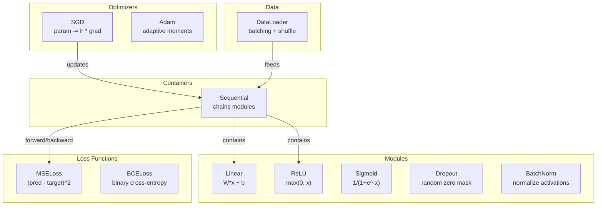
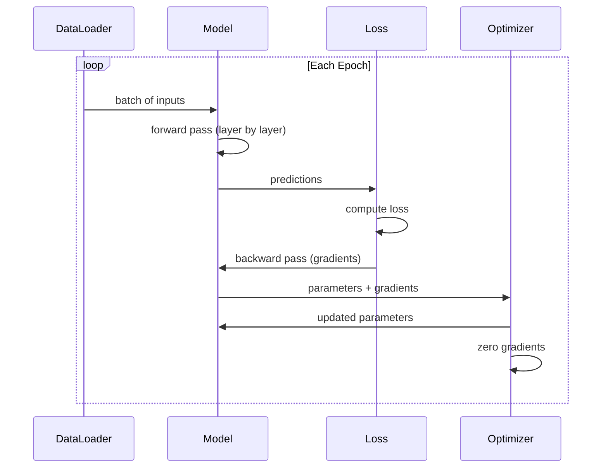
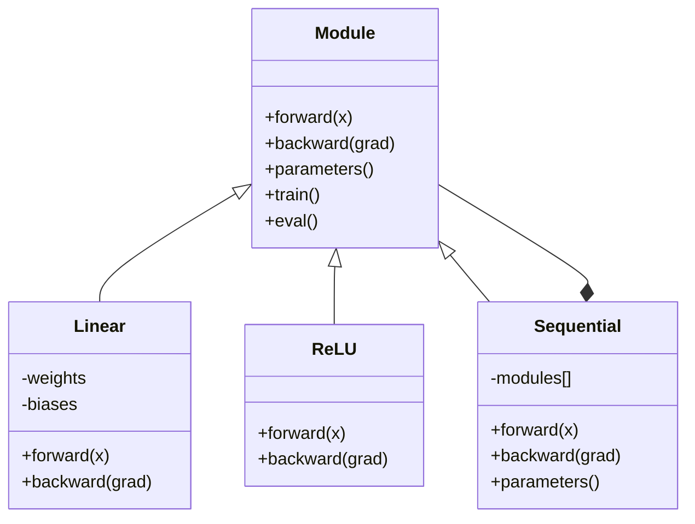

# अपना खुद का मिनी फ्रेमवर्क बनाएं अपना खुद का मिनी फ्रेमवर्क बनाएं

> आप न्यूरॉन्स, परतों, नेटवर्क, बैकपॉइंट, सक्रियण, हानि कार्यों, अनुकूलक, नियमितता, आरंभिकरण और LR अनुसूची का निर्माण किया है. सभी अलग-अलग टुकड़े के रूप में. अब उन्हें एक फ्रेमवर्क में एक साथ तार. नहीं PyTorch. नहीं TensorFlow. तुम्हारा.

> **【中文解读】**सभी पाठ्यक्रमों के अवधारणाओं को समग्र रूप से एक संपूर्ण ढांचे में शामिल करेंः स्वचालित माइक्रोसॉफ्ट इंजन, बहुस्तरीय प्रकार, अनुकूलक, व्यवस्थितीकरण, प्रशिक्षण चक्र।

**Type:** Build
**Languages:** Python
**Prerequisites:** All of Phase 03 (Lessons 01-09)
**Time:** ~120 minutes

## सीखने के लक्ष्य

- मॉड्यूल, रैखिक, ReLU, सिग्मोइड, ड्रॉपआउट, बैचनोर्म, अनुक्रमिक, हानि कार्यों, अनुकूलक और डेटा लोडर के साथ एक पूर्ण गहरी सीखने की ढांचा (~ 500 पंक्तियां) बनाएं
- मॉड्यूल अपव्यय (आगे, पीछे, पैरामीटर) और ट्रेन/ईवल मोड स्विचिंग क्यों आवश्यक है, समझाएं
- सभी घटकों को एक कामकाजी प्रशिक्षण लूप में तार करें जो सर्कल वर्गीकरण पर 4-परत नेटवर्क को प्रशिक्षित करता है
- अपने फ्रेमवर्क के प्रत्येक घटक को अपने PyTorch समकक्ष (nn.Module, nn.Sequential, optim.Adam, DataLoader) के लिए मैप करें

> **【中文解读】**इस अध्याय में चरण 03 के एकीकरण अध्याय है। इस अध्याय में सभी अवधारणाओं को एक पूर्ण ~500 行 फ्रेमवर्क में जोड़ा गया है।

## समस्या  समस्या परिचय

आपके पास अलग-अलग फाइलों में बिल्डिंग ब्लॉकों के दस पाठ हैं।`Value`एक कक्षा यहाँ, एक प्रशिक्षण लूप वहाँ, एक और फ़ाइल में वजन आरंभिकरण, एक और में सीखने की दर कार्यक्रम. एक नेटवर्क को प्रशिक्षित करने के लिए, आप पांच अलग-अलग पाठों से कॉपी-पेस्ट और उन्हें हाथ से एक साथ तार.

> आपके पास 10 वर्ग के निर्माण मॉड्यूल हैं जो विभिन्न फाइलों में फैले हुए हैं।`Value`类, वहाँ एक प्रशिक्षण चक्र है, एक अन्य फाइल में वजन आरंभिकरण है, और दूसरा है सीखने की दर समायोजन है।

यह है कि फ्रेमवर्क हल करता है. PyTorch आप देता है`nn.Module`,`nn.Sequential`,`optim.Adam`,`DataLoader`और एक प्रशिक्षण लूप पैटर्न है कि उन्हें एक साथ जोड़ता है. TensorFlow आपको देता है`keras.Layer`,`keras.Sequential`,`keras.optimizers.Adam`ये जादू नहीं हैं ये संगठनिक पैटर्न हैं जो पाइपलाइन को हर बार फिर से आविष्कार किए बिना नेटवर्क को परिभाषित, प्रशिक्षित और मूल्यांकन करना संभव बनाते हैं।

> यही एक समस्या है।`nn.Module``nn.Sequential``optim.Adam``DataLoader`और उन्हें एक साथ बांधेगा प्रशिक्षण चक्र मोड---टेंसरफ्लो  तुम्हें `keras.Layer``keras.Sequential``keras.optimizers.Adam` ये जादू नहीं हैं ये संगठन के मॉडल हैं, जिससे आप नेटवर्क को परिभाषित, प्रशिक्षित और मूल्यांकन कर सकते हैं, बिना हर बार सबको फिर से विकसित करने की आवश्यकता नहीं है

आप पायथन की 500 लाइनों में एक ही चीज का निर्माण करने जा रहे हैं. कोई नम्पी नहीं। कोई बाहरी निर्भरता नहीं। एक फ्रेमवर्क जो किसी भी फ़ीडफॉरवर्ड नेटवर्क को परिभाषित कर सकता है, इसे एसजीडी या एडम के साथ प्रशिक्षित कर सकता है, डेटा को बैच कर सकता है, ड्रॉपआउट और बैच सामान्यीकरण लागू कर सकता है, किसी भी सक्रियण का उपयोग कर सकता है, और सीखने की दर को शेड्यूल कर सकता है।

> आप लगभग 500 行 पायथन का उपयोग करेंगे  उसी तरह की चीज़ों का निर्माण करना                                                                                                                                                                                                                                                      

जब आप समाप्त कर देंगे, आप समझेंगे कि जब आप लिखते हैं तो क्या होता है।`model = nn.Sequential(...)`आप समझेंगे क्यों।`model.train()`और `model.eval()`आप समझेंगे कि क्यों।`optimizer.zero_grad()`आप इसे सब समझेंगे, क्योंकि आपने इसे सब बनाया है।

> 完成后, आप पूरी तरह से समझ जाएगा PyTorch में लिखा `model = nn.Sequential(...)`जब तक क्या हुआ है. आप समझेंगे क्यों.`model.train()`和 `model.eval()`存在──你会理解为什么 `optimizer.zero_grad()`यह एक अलग तरीका है. आप यह सब समझेंगे, क्योंकि आप खुद इसे बनाया है.

> **【中文解读】**框架 के मूल मूल्य:把散落的组件统一到一个接口下―― मॉड्यूल सब कुछ का आधार है रैखिक、ReLU、Dropout、BatchNorm 都是 मॉड्यूल── अनुक्रमिक है组合模式一堆 मॉड्यूल 串起还是一个模块── यह PyTorch के डिजाइन के साथ पूरी तरह से मेल खाता है──

> **【拓展：PyTorch 框架的设计哲学】**PyTorch के मूल डिजाइन में केवल 5 अवधारणाएं हैंः टेन्सर (Data) ̊n.Module (Model) ̊ ऑटोग्रेड (Automatic) ̊Optimer (Optimizer) ̊Optimer (DataLoader) ̊ डेटा लोडर (DataLoader) ̊) ̊ हैं।

## अवधारणा का मूल अवधारणा

### मॉड्यूल अमूर्त मॉड्यूल 抽象

PyTorch में प्रत्येक परत विरासत में है`nn.Module`एक मॉड्यूल में तीन जिम्मेदारियां होती हैंः

> पिटोरच में प्रत्येक स्तर में सभी विरासत में मिले`nn.Module`◊ एक मॉड्यूल है तीन जिम्मेदारियां:

1. **forward()**-- दिए गए इनपुट के आउटपुट की गणना करें
   **forward()**-- 给定输入计算输出
2. **parameters()**-- सभी प्रशिक्षित भार वापस
   **parameters()**-- 返回所有可训练权重
3. **backward()**-- कम्प्यूटिंग ग्रेडिएंट (पाइटोरच में ऑटोग्रेड द्वारा संचालित, हमारे में स्पष्ट)
   **backward()**-- 计算梯度(PyTorch 中由自动化 处理, हमारे ढांचे में स्पष्ट रूप से कार्यान्वयन की आवश्यकता है)

एक रैखिक परत एक मॉड्यूल है। एक ReLU सक्रियण एक मॉड्यूल है। एक ड्रॉपआउट परत एक मॉड्यूल है। एक बैच सामान्यीकरण परत एक मॉड्यूल है। उन सभी के पास एक ही इंटरफ़ेस है।

> रैखिक परत एक मॉड्यूल है。ReLU 激活 एक मॉड्यूल है。ड्रोपॉउट परत एक मॉड्यूल है。बैचनॉर्म परत एक मॉड्यूल है。उनमें एक ही इंटरफेस है。

### अनुक्रमिक कंटेनर अनुक्रमिक कंटेनर

`nn.Sequential`चेन मॉड्यूल. फॉरवर्ड पासः मॉड्यूल 1, फिर मॉड्यूल 2, फिर मॉड्यूल 3. बैकवर्ड पासः रिवर्स चेन. कंटेनर स्वयं एक मॉड्यूल है - इसमें आगे(), पैरामीटर(), और पीछे() । यह समग्र पैटर्न हैः मॉड्यूल का एक अनुक्रम स्वयं एक मॉड्यूल है।

> `nn.Sequential`将模块 串联起来──前向传播:数据流过模块 1、然后模块 2、然后模块 3──反向传播:反向遍历链──容器本身也是一个模块它有前 (),参数() 和后 (() .

> **【拓展：真实框架的额外功能】**आपके迷你框架 में PyTorch की मूल अवधारणा शामिल है, लेकिन वास्तविक ढांचा भी हैः 1) ऑटोग्राड स्वचालित微分(कोई हाथ से लिखने की आवश्यकता नहीं); 2) GPU 支持(CUDA内存管理和内核调度); 3) 分布式训练(DDP、FSDP、DeepSpeed); 4) 混合精度训练(AMP);(5) 模型序列化(state_dict + save/load) ⋅ PyTorch के कोड संग्रह 100 मिलियन से अधिक पंक्तियों पर है, लेकिन कोर अमूर्त या आप इसे प्राप्त कर रहे हैं 5 ⋅

### प्रशिक्षण बनाम मूल्यांकन मोड प्रशिक्षण और मूल्यांकन मोड

ड्रॉपअप प्रशिक्षण के दौरान यादृच्छिक रूप से न्यूरॉन्स शून्य करता है लेकिन मूल्यांकन के दौरान सब कुछ पारित करता है। बैच सामान्यीकरण प्रशिक्षण के दौरान बैच आंकड़ों का उपयोग करता है लेकिन मूल्यांकन के दौरान चल रही औसत।`train()`और `eval()`प्रत्येक मॉड्यूल में एक `training`ध्वज।

> प्रशिक्षण में ड्रॉपअप समय में तंत्रिकाओं को शून्य में डाल दिया जाता है, लेकिन मूल्यांकन में पूरी तरह से पारित किया जाता है।`train()`和 `eval()`方法切换这个行为── प्रत्येक मॉड्यूल में एक है `training`标志──

### अनुकूलक  अनुकूलक

अनुकूलक उनके ग्रेडिएंट का उपयोग करके मापदंडों को अद्यतन करता है।`param -= lr * grad`एडमः गति और भिन्नता अनुमान बनाए रखता है, फिर अद्यतन करता है. अनुकूलक नेटवर्क वास्तुकला के बारे में नहीं जानता - यह केवल मापदंडों की एक सपाट सूची और उनके gradients देखता है.

> 优化器用梯度更新参数──SGD:`param -= lr * grad`आदम:维护动量和方差估算后再更新──优化器不知网络架构它只看一个平面的参数列表和它们的梯度──

### डेटा लोडर डेटा लोडर

बैचिंग दो कारणों से मायने रखता है। पहला, आप बड़ी समस्याओं के लिए पूरे डेटासेट को मेमोरी में फिट नहीं कर सकते। दूसरा, मिनी-बैच ग्रेडिएंट डाउनग्रेड शोर प्रदान करता है जो स्थानीय न्यूनतम से बचने में मदद करता है। डेटा लोडर डेटा को बैचों में विभाजित करता है और वैकल्पिक रूप से युगों के बीच मिश्रण करता है।

> विभाजन महत्वपूर्ण कारण दो हैं। पहला, बड़ी समस्या का पूरा डेटासेट इनमेज में नहीं रखा गया है। दूसरा, मिनी-बैच 梯度 घटाने से स्थानीय न्यूनतम मूल्य से बाहर निकलने में मदद मिलती है।

> **【拓展：DataLoader 在大模型训练中的演进】**PyTorch का DataLoader है एक ही机的. बड़े मॉडल प्रशिक्षण आवश्यकता वितरित DataLoader:(1) वेबडेटासेट उपयोग के लिए प्रवाहात्मक लोड TB 级 डेटा;(2) मेटा का SPDL (स्ट्रीमिंग समानांतर डेटा लोडर) 支持从 S3/GCS 直接流式 लोड;(3) HuggingFace डेटासेट 库使用内存-मैप 文件处理超大数据集──Llama 3 का प्रशिक्षण डेटा डेटा लगभग 15T टोकन, असंभव है, पूरी तरह से内存 में लोड करें।

### फ्रेमवर्क आर्किटेक्चर



### प्रशिक्षण लूप प्रशिक्षण चक्र



### मॉड्यूल पदानुक्रम .



## इसे बनाओ, इसे पूरा करो।

> **【中文解读】**नीचे क्रमशः संरचना ढांचे के प्रत्येक घटक:मॉड्यूल 基类 → रैखिक 层 →  सक्रिय फ़ंक्शन → ड्रॉपआउट → बैचनॉर्म → अनुक्रमिक 容器 → 损失 फ़ंक्शन → 优化器 → DataLoader → 完整训练循环── प्रत्येक चरण पर प्रतिक्रिया PyTorch के एक कोर वर्ग──
```figure
gradient-clipping
```

## इसे बनाओ

### चरण 1: मॉड्यूल बेस क्लास

अमूर्त इंटरफ़ेस जो प्रत्येक परत लागू करता है।

> प्रत्येक स्तर के कार्यान्वयन के लिए एक संक्षिप्त इंटरफ़ेस

```python
class Module:
    def __init__(self):
        self.training = True

    def forward(self, x):
        raise NotImplementedError

    def backward(self, grad):
        raise NotImplementedError

    def parameters(self):
        return []

    def train(self):
        self.training = True

    def eval(self):
        self.training = False
```

### चरण 2: रैखिक परत

मूलभूत निर्माण ब्लॉक। वजन और पूर्वाग्रहों को संग्रहीत करता है, Wx + b को आगे और वजन / इनपुट ग्रेडिएंट को पीछे की ओर गणना करता है।

> 基本构建块── भंडारण भार व偏置,前向计算 Wx + b,反向计算权重/输入梯度──

> रैखिक 层是 PyTorch `nn.Linear`                                                                                                                                                                                                                                                              `sum(W[i][j] * x[j]) + b[i]`                                                                                                                                                                                                                                                              `grad[i] * input[j]`, इनपुट की डिग्री है `grad[i] * W[i][j]`🏻 ध्यान दें 维度初始化用 काइमिंग`std = sqrt(2/fan_in)`),适配 ReLU。

```python
import math
import random


class Linear(Module):
    def __init__(self, fan_in, fan_out):
        super().__init__()
        std = math.sqrt(2.0 / fan_in)
        self.weights = [[random.gauss(0, std) for _ in range(fan_in)] for _ in range(fan_out)]
        self.biases = [0.0] * fan_out
        self.weight_grads = [[0.0] * fan_in for _ in range(fan_out)]
        self.bias_grads = [0.0] * fan_out
        self.fan_in = fan_in
        self.fan_out = fan_out
        self.input = None

    def forward(self, x):
        self.input = x
        output = []
        for i in range(self.fan_out):
            val = self.biases[i]
            for j in range(self.fan_in):
                val += self.weights[i][j] * x[j]
            output.append(val)
        return output

    def backward(self, grad):
        input_grad = [0.0] * self.fan_in
        for i in range(self.fan_out):
            self.bias_grads[i] += grad[i]
            for j in range(self.fan_in):
                self.weight_grads[i][j] += grad[i] * self.input[j]
                input_grad[j] += grad[i] * self.weights[i][j]
        return input_grad

    def parameters(self):
        params = []
        for i in range(self.fan_out):
            for j in range(self.fan_in):
                params.append((self.weights, i, j, self.weight_grads))
            params.append((self.biases, i, None, self.bias_grads))
        return params
```

### चरण 3: सक्रियण मॉड्यूल

ReLU, सिग्मोइड, और टैन मॉड्यूल के रूप में. प्रत्येक बैकवर्ड पास के लिए क्या जरूरत है कैश.

> ReLU、Sigmoid 和 Tanh 作为模块── प्रत्येक缓存反向传播所需的信息──

```python
class ReLU(Module):
    def __init__(self):
        super().__init__()
        self.mask = None

    def forward(self, x):
        self.mask = [1.0 if v > 0 else 0.0 for v in x]
        return [max(0.0, v) for v in x]

    def backward(self, grad):
        return [g * m for g, m in zip(grad, self.mask)]


class Sigmoid(Module):
    def __init__(self):
        super().__init__()
        self.output = None

    def forward(self, x):
        self.output = []
        for v in x:
            v = max(-500, min(500, v))
            self.output.append(1.0 / (1.0 + math.exp(-v)))
        return self.output

    def backward(self, grad):
        return [g * o * (1 - o) for g, o in zip(grad, self.output)]


class Tanh(Module):
    def __init__(self):
        super().__init__()
        self.output = None

    def forward(self, x):
        self.output = [math.tanh(v) for v in x]
        return self.output

    def backward(self, grad):
        return [g * (1 - o * o) for g, o in zip(grad, self.output)]
```

### चरण 4: ड्रॉपआउट मॉड्यूल

प्रशिक्षण के दौरान यादृच्छिक रूप से शून्य तत्वों। शेष तत्वों को 1/(1-p) द्वारा स्केल करें ताकि अपेक्षित मान समान रहें। मूल्यांकन के दौरान कुछ भी नहीं करता है।

>  प्रशिक्षण समय随机将元素置零──按 1/(1-p) 缩放剩余元素,使期望值不变──评估时不做任何操作──

```python
class Dropout(Module):
    def __init__(self, p=0.5):
        super().__init__()
        self.p = p
        self.mask = None

    def forward(self, x):
        if not self.training:
            return x
        self.mask = [0.0 if random.random() < self.p else 1.0 / (1 - self.p) for _ in x]
        return [v * m for v, m in zip(x, self.mask)]

    def backward(self, grad):
        if self.mask is None:
            return grad
        return [g * m for g, m in zip(grad, self.mask)]
```

### चरण 5: बैचनोर्म मॉड्यूल

बैच में प्रति विशेषता शून्य औसत और इकाई भिन्नता के लिए सक्रियण को सामान्य बनाता है। मूल्यांकन मोड के लिए चल रही आंकड़े बनाए रखता है।

> सक्रियण मूल्य को क्रॉस बैच के शून्य औसत मूल्य और इकाई-वैकड अंतर में वर्गीकृत किया जाएगा।

```python
class BatchNorm(Module):
    def __init__(self, size, momentum=0.1, eps=1e-5):
        super().__init__()
        self.size = size
        self.gamma = [1.0] * size
        self.beta = [0.0] * size
        self.gamma_grads = [0.0] * size
        self.beta_grads = [0.0] * size
        self.running_mean = [0.0] * size
        self.running_var = [1.0] * size
        self.momentum = momentum
        self.eps = eps
        self.x_norm = None
        self.std_inv = None
        self.batch_input = None

    def forward_batch(self, batch):
        batch_size = len(batch)
        output_batch = []

        if self.training:
            mean = [0.0] * self.size
            for sample in batch:
                for j in range(self.size):
                    mean[j] += sample[j]
            mean = [m / batch_size for m in mean]

            var = [0.0] * self.size
            for sample in batch:
                for j in range(self.size):
                    var[j] += (sample[j] - mean[j]) ** 2
            var = [v / batch_size for v in var]

            self.std_inv = [1.0 / math.sqrt(v + self.eps) for v in var]

            self.x_norm = []
            self.batch_input = batch
            for sample in batch:
                normed = [(sample[j] - mean[j]) * self.std_inv[j] for j in range(self.size)]
                self.x_norm.append(normed)
                output = [self.gamma[j] * normed[j] + self.beta[j] for j in range(self.size)]
                output_batch.append(output)

            for j in range(self.size):
                self.running_mean[j] = (1 - self.momentum) * self.running_mean[j] + self.momentum * mean[j]
                self.running_var[j] = (1 - self.momentum) * self.running_var[j] + self.momentum * var[j]
        else:
            std_inv = [1.0 / math.sqrt(v + self.eps) for v in self.running_var]
            for sample in batch:
                normed = [(sample[j] - self.running_mean[j]) * std_inv[j] for j in range(self.size)]
                output = [self.gamma[j] * normed[j] + self.beta[j] for j in range(self.size)]
                output_batch.append(output)

        return output_batch

    def forward(self, x):
        result = self.forward_batch([x])
        return result[0]

    def backward(self, grad):
        if self.x_norm is None:
            return grad
        for j in range(self.size):
            self.gamma_grads[j] += self.x_norm[0][j] * grad[j]
            self.beta_grads[j] += grad[j]
        return [grad[j] * self.gamma[j] * self.std_inv[j] for j in range(self.size)]

    def parameters(self):
        params = []
        for j in range(self.size):
            params.append((self.gamma, j, None, self.gamma_grads))
            params.append((self.beta, j, None, self.beta_grads))
        return params
```

### चरण 6: अनुक्रमिक कंटेनर

चेन मॉड्यूल आगे से दाएं, पीछे से दाएं से बाएं जाता है।

> 串联模块──前向左到右,反向右到左──

> अनुक्रमिक 容器实现组合模式 यह स्वयं एक मॉड्यूल है, लेकिन आंतरिक रूप से एक मॉड्यूल 列表`train()`和 `eval()`递归调用每个子模块──`parameters()`聚合所有子模块 के तत्वों. यह है PyTorch `nn.Sequential`के मूल कार्यान्वयन

```python
class Sequential(Module):
    def __init__(self, *modules):
        super().__init__()
        self.modules = list(modules)

    def forward(self, x):
        for module in self.modules:
            x = module.forward(x)
        return x

    def backward(self, grad):
        for module in reversed(self.modules):
            grad = module.backward(grad)
        return grad

    def parameters(self):
        params = []
        for module in self.modules:
            params.extend(module.parameters())
        return params

    def train(self):
        self.training = True
        for module in self.modules:
            module.train()

    def eval(self):
        self.training = False
        for module in self.modules:
            module.eval()
```

### चरण 7: फ़ंक्शन खोना

एमएसई और द्विआधारी क्रॉस-एंट्रोपी। प्रत्येक हानि मूल्य वापस करता है और एक पीछे की ओर प्रदान करता है जो ग्रेडिएंट वापस करता है।

> MSE 和二元交叉── प्रत्येक लौटने के लिए हानि मूल्य,并 प्रदान करने के लिए लौटने के लिए परत梯度 के पीछे() 方法──

> 损失函数 प्रशिक्षण चक्र के आरंभ बिंदु है  विपरीत दिशा में प्रसारण                                                                                                                                                                                                                                                      `2 * (pred - target) / n`, बीसीई की डिग्री `(-target/p + (1-target)/(1-p)) / n`注意 BCE 中要使用eps 剪剪防止 log 0) 

```python
class MSELoss:
    def __call__(self, predicted, target):
        self.predicted = predicted
        self.target = target
        n = len(predicted)
        self.loss = sum((p - t) ** 2 for p, t in zip(predicted, target)) / n
        return self.loss

    def backward(self):
        n = len(self.predicted)
        return [2 * (p - t) / n for p, t in zip(self.predicted, self.target)]


class BCELoss:
    def __call__(self, predicted, target):
        self.predicted = predicted
        self.target = target
        eps = 1e-7
        n = len(predicted)
        self.loss = 0
        for p, t in zip(predicted, target):
            p = max(eps, min(1 - eps, p))
            self.loss += -(t * math.log(p) + (1 - t) * math.log(1 - p))
        self.loss /= n
        return self.loss

    def backward(self):
        eps = 1e-7
        n = len(self.predicted)
        grads = []
        for p, t in zip(self.predicted, self.target):
            p = max(eps, min(1 - eps, p))
            grads.append((-t / p + (1 - t) / (1 - p)) / n)
        return grads
```

### चरण 8: एसजीडी और एडम ऑप्टिमाइज़र

दोनों पैरामीटर सूची लेते हैं और ग्रेडिएंट का उपयोग करके वजन अपडेट करते हैं।

> 两者都接收参数列表,使用梯度更新权重──

> SGD 简单:参数 -= 学习率 × 梯度──Adam 维护一阶矩 m 和二阶矩 v,加上偏差修正(前几步梯度估计有偏差), प्रभाव在大多数任务上优于 SGD──AdamW 在Adam 基础上加解权重衰减──参数列表中的每个元素是 (容器, i, j, 梯度容器) 四组,j=None元表示偏置(一维)──

```python
class SGD:
    def __init__(self, parameters, lr=0.01):
        self.params = parameters
        self.lr = lr

    def step(self):
        for container, i, j, grad_container in self.params:
            if j is not None:
                container[i][j] -= self.lr * grad_container[i][j]
            else:
                container[i] -= self.lr * grad_container[i]

    def zero_grad(self):
        for container, i, j, grad_container in self.params:
            if j is not None:
                grad_container[i][j] = 0.0
            else:
                grad_container[i] = 0.0


class Adam:
    def __init__(self, parameters, lr=0.001, beta1=0.9, beta2=0.999, eps=1e-8):
        self.params = parameters
        self.lr = lr
        self.beta1 = beta1
        self.beta2 = beta2
        self.eps = eps
        self.t = 0
        self.m = [0.0] * len(parameters)
        self.v = [0.0] * len(parameters)

    def step(self):
        self.t += 1
        for idx, (container, i, j, grad_container) in enumerate(self.params):
            if j is not None:
                g = grad_container[i][j]
            else:
                g = grad_container[i]

            self.m[idx] = self.beta1 * self.m[idx] + (1 - self.beta1) * g
            self.v[idx] = self.beta2 * self.v[idx] + (1 - self.beta2) * g * g

            m_hat = self.m[idx] / (1 - self.beta1 ** self.t)
            v_hat = self.v[idx] / (1 - self.beta2 ** self.t)

            update = self.lr * m_hat / (math.sqrt(v_hat) + self.eps)

            if j is not None:
                container[i][j] -= update
            else:
                container[i] -= update

    def zero_grad(self):
        for container, i, j, grad_container in self.params:
            if j is not None:
                grad_container[i][j] = 0.0
            else:
                grad_container[i] = 0.0
```

### चरण 9: डेटा लोडर

डेटा को बैच में विभाजित करता है, प्रत्येक युग को वैकल्पिक रूप से मिलाता है।

> डेटा को बटों में विभाजित करना, प्रत्येक युग में चुना जा सकता है

```python
class DataLoader:
    def __init__(self, data, batch_size=32, shuffle=True):
        self.data = data
        self.batch_size = batch_size
        self.shuffle = shuffle

    def __iter__(self):
        indices = list(range(len(self.data)))
        if self.shuffle:
            random.shuffle(indices)
        for start in range(0, len(indices), self.batch_size):
            batch_indices = indices[start:start + self.batch_size]
            batch = [self.data[i] for i in batch_indices]
            inputs = [item[0] for item in batch]
            targets = [item[1] for item in batch]
            yield inputs, targets

    def __len__(self):
        return (len(self.data) + self.batch_size - 1) // self.batch_size
```

### चरण 10: सर्कल वर्गीकरण पर 4-परत नेटवर्क को प्रशिक्षित करें

सब कुछ एक साथ जोड़ें, एक मॉडल परिभाषित करें, एक हानि चुनें, एक अनुकूलक चुनें, प्रशिक्षण लूप चलाएं।

> सब कुछ एक साथ संयोजित करना, मॉडल परिभाषित करना, हानि फ़ंक्शन चुनना, अनुकूलन उपकरण चुनना, अभ्यास चक्र चलाना

> 训练循环的标准模式: प्रत्येक युग 遍历所有批次, प्रत्येक批次 中:(1) शून्य_ग्रेड 清零梯度;(2) आगे 前向计算预测;(3) 计算损失;(4) पीछे उल्टा 反向传播梯度;(5) अनुकूलक.चरण() 更新参数。圆形分类任务:点是 (x, y),标签是 x2+y2<1.5 → 1,否则 0。

```python
def make_circle_data(n=500, seed=42):
    random.seed(seed)
    data = []
    for _ in range(n):
        x = random.uniform(-2, 2)
        y = random.uniform(-2, 2)
        label = 1.0 if x * x + y * y < 1.5 else 0.0
        data.append(([x, y], [label]))
    return data


def train():
    random.seed(42)

    model = Sequential(
        Linear(2, 16),
        ReLU(),
        Linear(16, 16),
        ReLU(),
        Linear(16, 8),
        ReLU(),
        Linear(8, 1),
        Sigmoid(),
    )

    criterion = BCELoss()
    optimizer = Adam(model.parameters(), lr=0.01)

    data = make_circle_data(500)
    split = int(len(data) * 0.8)
    train_data = data[:split]
    test_data = data[split:]

    loader = DataLoader(train_data, batch_size=16, shuffle=True)

    model.train()

    for epoch in range(100):
        total_loss = 0
        total_correct = 0
        total_samples = 0

        for batch_inputs, batch_targets in loader:
            batch_loss = 0
            for x, t in zip(batch_inputs, batch_targets):
                pred = model.forward(x)
                loss = criterion(pred, t)
                batch_loss += loss

                optimizer.zero_grad()
                grad = criterion.backward()
                model.backward(grad)
                optimizer.step()

                predicted_class = 1.0 if pred[0] >= 0.5 else 0.0
                if predicted_class == t[0]:
                    total_correct += 1
                total_samples += 1

            total_loss += batch_loss

        avg_loss = total_loss / total_samples
        accuracy = total_correct / total_samples * 100

        if epoch % 10 == 0 or epoch == 99:
            print(f"Epoch {epoch:3d} | Loss: {avg_loss:.6f} | Train Accuracy: {accuracy:.1f}%")

    model.eval()
    correct = 0
    for x, t in test_data:
        pred = model.forward(x)
        predicted_class = 1.0 if pred[0] >= 0.5 else 0.0
        if predicted_class == t[0]:
            correct += 1
    test_accuracy = correct / len(test_data) * 100
    print(f"\nTest Accuracy: {test_accuracy:.1f}% ({correct}/{len(test_data)})")

    return model, test_accuracy
```

## इसे फ्रेमवर्क के साथ लागू करें

> **【中文解读】**नीचे दिए गए PyTorch कोड और आपके लघु ढांचे की संरचना पूरी तरह से मेल खाती हैः क्रमबद्ध、 रैखिक、 RELU、 सिग्मोइड、 BCELoss、 Adam、zero_grad、 पीछे की ओर、 कदम、 ट्रेन、 इवल。 एकमात्र अंतर यह है कि PyTorch ऑटोग्रेड स्वचालित गणना ग्रेड का उपयोग करता है, जबकि आपको हाथ से पीछे की ओर लिखना होगा()。 प्रशिक्षण चक्र का पांच चरण का पैटर्न अपरिवर्तित है。

यहाँ है PyTorch के बराबर आप बस बनाया है क्याः

> नीचे आपके द्वारा अभी-अभी निर्मित किए गए ढांचे के PyTorch और अन्य कार्यान्वयन के लिए नीचे दी गई जानकारी दी गई हैः

> पिटॉर्च की `nn.Sequential``nn.Linear``nn.ReLU``nn.Sigmoid``nn.BCELoss``torch.optim.Adam`अपने迷你框架 से एक-एक-应应── सबसे बड़ा अंतर है कि PyTorch ऑटोग्रेड स्वचालित गणना तह से उपयोग करता है, और GPU और मिश्रित सटीकता का समर्थन करता है।

```python
import torch
import torch.nn as nn
from torch.utils.data import DataLoader, TensorDataset

model = nn.Sequential(
    nn.Linear(2, 16),
    nn.ReLU(),
    nn.Linear(16, 16),
    nn.ReLU(),
    nn.Linear(16, 8),
    nn.ReLU(),
    nn.Linear(8, 1),
    nn.Sigmoid(),
)

criterion = nn.BCELoss()
optimizer = torch.optim.Adam(model.parameters(), lr=0.01)

for epoch in range(100):
    model.train()
    for inputs, targets in dataloader:
        optimizer.zero_grad()
        predictions = model(inputs)
        loss = criterion(predictions, targets)
        loss.backward()
        optimizer.step()

    model.eval()
    with torch.no_grad():
        test_predictions = model(test_inputs)
```

संरचना समान है।`Sequential`,`Linear`,`ReLU`,`Sigmoid`,`BCELoss`,`Adam`,`zero_grad`,`backward`,`step`,`train`,`eval`. प्रत्येक अवधारणा एक-एक के साथ मैप करता है। अंतर यह है कि PyTorch ऑटोग्रेड को स्वचालित रूप से संभालता है (प्रत्येक मॉड्यूल में पीछे की ओर लागू करने की आवश्यकता नहीं है)), GPU पर चलता है, और वर्षों से अनुकूलित किया गया है। लेकिन हड्डियां समान हैं।

> 结构 पूरी तरह से समान है`Sequential``Linear``ReLU``Sigmoid``BCELoss``Adam``zero_grad``backward``step``train``eval` प्रत्येक अवधारणा एक एक से应──区别在 PyTorch स्वचालित प्रसंस्करण ऑटोग्रेड में है (不需要在每个模块中实现后退) ), GPU 上运行,并经过多年优化,但骨架是一样的

अब जब आप PyTorch कोड देखते हैं, आप जानते हैं कि हर पंक्ति में क्या हो रहा है. यह समझ है कि पूरे बिंदु है.

> अब जब आप PyTorch कोड देखते हैं, आप निश्चित रूप से जानते हैं कि प्रत्येक पंक्ति में क्या हुआ है।

## इसे भेजें उत्पाद

इस पाठ से उत्पन्न होता हैः
- `outputs/prompt-framework-architect.md`-- फ्रेमवर्क अमूर्तियों का उपयोग करके तंत्रिका नेटवर्क वास्तुकलाओं को डिजाइन करने के लिए एक संकेत

> 本课产出:`outputs/prompt-framework-architect.md`- एक फ्रेमवर्क का उपयोग करना अमूर्त डिजाइन तंत्रिका नेटवर्क संरचना का सुझाव शब्द

> इस टिप शब्द एलएलएम को निर्देशित करेगा 任务 विशेषता के आधार पर (输入维度,输出类型,数据量)  उपयुक्त नेटवर्क संरचना  कितने स्तर  प्रत्येक स्तर  कितने तंत्रिका  किस प्रकार के सक्रियण  क्या ड्रॉपआउट/बैचनॉर्म  किस प्रकार के नुकसान और अनुकूलन यंत्र 

## अभ्यास विषय

1. एक जोड़ें `SoftmaxCrossEntropyLoss`बहु-वर्ग वर्गीकरण के लिए वर्ग। सॉफ्टमैक्स भविष्यवाणियों, गणना क्रॉस-एंट्रोपी हानि, और संश्लेषित पीछे की ओर पारित करने के लिए संभाल. एक 3-वर्ग सर्पिल डेटासेट पर परीक्षण.

   1. 添加 `SoftmaxCrossEntropyLoss`类用于多类――对预测做软max,计算交叉损失,处理组合反向传播――在 3类螺旋数据集上测试――

2. अनुकूलक में सीखने की दर अनुसूची लागू करेंः एक जोड़ें `set_lr()`पाठ 9 से कोसिन अनुसूची में विधि और तार। सर्कल वर्गीकरण को वार्मअप + कोसिन के साथ प्रशिक्षित करें और निरंतर एलआर की तुलना करें।

   2. ⇒ सुधारक में सीखने की दर को प्राप्त करना`set_lr()`方法,接入第9 课的余弦调调度──使用热升+余弦训练圆形分类器,与恒定 LR对比──

3. एक जोड़ें `save()`और `load()`अनुक्रमिक के लिए विधि जो सभी वजन को JSON फ़ाइल में क्रमबद्ध करता है और उन्हें फिर से लोड करता है। सत्यापित करें कि एक लोड मॉडल मूल के समान भविष्यवाणियां उत्पन्न करता है।

   3. 给 क्रमबद्ध 加 `save()`和 `load()`方法, सभी अधिकारों को JSON फ़ाइल में पुनः क्रमबद्ध करें और पुनः लोड करें।

4. एडम ऑप्टिमाइज़र में वजन घटाने (एल 2 नियमितता) को लागू करें।`weight_decay`प्रत्येक चरण में शून्य की ओर वजन को छोटा करने वाला पैरामीटर।

   4.                                                                                                                                                                                                                                                               `weight_decay`参数, प्रत्येक चरण में वजन को शून्य में संकुचित करना 

5. प्रति नमूना प्रशिक्षण लूप को उचित मिनी-बैच ग्रेडिएंट जमा के साथ बदलेंः एक बैच में सभी नमूनों में ग्रेडिएंट जमा करें, फिर बैच आकार द्वारा विभाजित करें और एक अनुकूलक चरण लें। मापें कि क्या यह अभिसरण गति को बदलता है।

   5. सही मिनी बैच 梯度累积 प्रति नमूना प्रशिक्षण चक्र का उपयोग करेंः एक बैच में सभी नमूने की梯度 को एकत्र करें, फिर बैच में विभाजित करें, एक बार अनुकूलन उपकरण चरण में कदम रखें।

## कीवर्ड्स  शब्द खोज तालिका

| Term | What people say | What it actually means |
|------|----------------|----------------------|
| Module | "A layer" | The base abstraction in a framework -- anything with forward(), backward(), and parameters() |
| Sequential | "Stack layers in order" | A container that chains modules, applying them in sequence for forward and reverse for backward |
| Forward pass | "Run the network" | Computing the output by passing input through each module in order |
| Backward pass | "Compute gradients" | Propagating the loss gradient through each module in reverse to compute parameter gradients |
| Parameters | "The trainable weights" | All values in the network that the optimizer can update -- weights and biases |
| Optimizer | "The thing that updates weights" | An algorithm that uses gradients to update parameters, implementing SGD, Adam, or other rules |
| DataLoader | "The thing that feeds data" | An iterator that splits a dataset into batches, optionally shuffling between epochs |
| Training mode | "model.train()" | A flag that enables stochastic behavior like dropout and batch normalization with batch stats |
| Evaluation mode | "model.eval()" | A flag that disables dropout and uses running statistics for batch normalization |
| Zero grad | "Clear the gradients" | Resetting all parameter gradients to zero before computing the next batch's gradients |

| 术语 | 俗称 | 实际含义 |
|------|------|---------|
| Module / 模块 | "一层" | 框架中的基础抽象——任何有 forward()、backward()、parameters() 的对象 |
| Sequential / 顺序容器 | "按顺序叠层" | 一个把模块串联起来的容器，前向按顺序、反向按逆序 |
| Forward pass / 前向传播 | "跑网络" | 把输入依次通过每个模块计算输出 |
| Backward pass / 反向传播 | "算梯度" | 把损失梯度反向通过每个模块计算参数梯度 |
| Parameters / 参数 | "可训练权重" | 网络中优化器能更新的所有值——权重和偏置 |
| Optimizer / 优化器 | "更新权重的东西" | 用梯度更新参数的算法，实现 SGD、Adam 或其他规则 |
| DataLoader / 数据加载器 | "喂数据的东西" | 把数据集切成批次的迭代器，可选地在 epoch 间打乱 |
| Training mode / 训练模式 | "model.train()" | 启用 Dropout、BN 用 batch 统计等随机行为的标志 |
| Evaluation mode / 评估模式 | "model.eval()" | 关闭 Dropout、BN 用运行统计量的标志 |
| Zero grad / 清零梯度 | "清掉梯度" | 在计算下一批梯度前把所有参数梯度重置为零 |

## आगे पढ़ना 延伸閱讀

- Paszke et al., "PyTorch: एक अनिवार्य शैली, उच्च प्रदर्शन गहरी शिक्षा पुस्तकालय" (2019) -- पेपर जो PyTorch के डिजाइन निर्णयों का वर्णन करता है
  Paszke 等人,PyTorch: एक आदेशात्मक शैली का उच्च प्रदर्शन गहन सीखने की库(2019) विवरण PyTorch  डिजाइन निर्णय के लिए एक लेख
- चोलेट, "पायथन के साथ गहरी शिक्षा, दूसरा संस्करण" (2021) - अध्याय 3 उसी मॉड्यूल/परत अमूर्तता के साथ केरास आंतरिक को कवर करता है
  Chollet,Python गहन सीखने द्वितीय संस्करण (2021)第 3 章 Using the same模块/层抽象讲解 Keras 内部机制
- जॉनसन, "टिनी-डीएनएन" (https://github.com/tiny-dnn/tiny-dnn) -- केवल हेडर के साथ सी ++ गहन सीखने की ढाँचा
  जॉनसन,Tiny-DNN एक शुद्ध शीर्षक फ़ाइल सी ++ गहन सीखने के ढांचे, ढांचे के आंतरिक तंत्र को समझने के लिए
