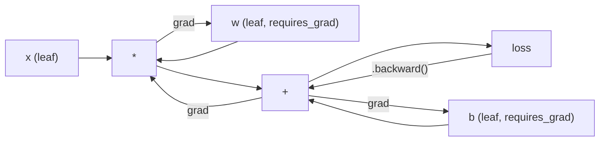
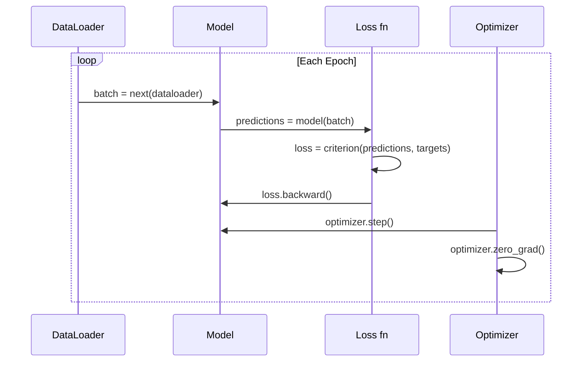

# PyTorch का परिचय PyTorch प्रवेश द्वार

> आप पिस्टन और क्रैंकशाफ्ट से इंजन बनाया है. अब सीखना कि सभी वास्तव में चलाता है.

> **【中文解读】**आप शून्य से निर्माण किया है तंत्रिका नेटवर्क के सभी घटकों को. . .

**Type:** Build
**Languages:** Python
**Prerequisites:** Lesson 03.10 (Build Your Own Mini Framework)
**Time:** ~75 minutes

## सीखने के लक्ष्य

- PyTorch के nn.Module, nn.Sequential और autograd का उपयोग करके तंत्रिका नेटवर्क का निर्माण और प्रशिक्षण
- PyTorch tensors, GPU त्वरण, और मानक प्रशिक्षण लूप (शून्य_ग्रेड, आगे, हानि, पीछे, कदम) का उपयोग करें
- अपने स्क्रैच से अपने मिनी फ्रेमवर्क घटकों को उनके PyTorch समकक्षों में परिवर्तित करें
- प्रोफ़ाइल और एक ही कार्य पर अपने शुद्ध-पायथन फ्रेमवर्क और PyTorch के बीच प्रशिक्षण गति की तुलना

> **【中文解读】**本章 迷你框架过渡到 PyTorch──核心对应关系:Module → nn.Module、手写倒退() → autograd、Python 循环 → GPU 并行──你已经在第10 课时理解底层原理,现在学习工业级实现──

## समस्या  समस्या परिचय

आपके पास एक काम करने वाला मिनी फ्रेमवर्क है। रैखिक परतें, ReLU, ड्रॉपआउट, बैच मानदंड, एडम, एक डेटा लोडर, एक प्रशिक्षण लूप। यह शुद्ध पायथन में सर्कल वर्गीकरण समस्या पर चार परत नेटवर्क को प्रशिक्षित करता है।

> आपके पास एक उपलब्ध लघु फ्रेमवर्क है। रैखिक परतों, RELU, ड्रॉपआउट, बैट एकीकरण, एडम, डेटा लोडर, प्रशिक्षण चक्र। यह शुद्ध पायथन का उपयोग करके चार स्तरीय नेटवर्क का अभ्यास करता है।

यह भी 500 गुना धीमी है PyTorch पर एक ही समस्या पर.

> लेकिन यह उसी समस्या पर PyTorch से 500 गुना धीमा है।

आपका मिनी फ्रेमवर्क एक समय में एक नमूना को निहित पायथन लूप के साथ संसाधित करता है। पायटॉर्च GPU पर चलने वाले अनुकूलित C ++ / CUDA कर्नेल में समान संचालन भेजता है। एक एकल NVIDIA A100 पर, पायटॉर्च लगभग 6 घंटे में ImageNet पर ResNet-50 (25.6M पैरामीटर) को प्रशिक्षित करता है (1.28M छवियां) । आपके फ्रेमवर्क में लगभग 3,000 घंटे लगेंगे एक ही कार्य पर - अगर यह पहले मेमोरी से बाहर नहीं निकलता है।

> अपने迷你框架 का उपयोग嵌套 के पायथन 循环 व्यक्तिगत प्रसंस्करण नमूना──PyTorch एक ही ऑपरेशन विभाजन GPU पर चलाने के लिए अनुकूलित करने के लिए C ++ / CUDA 内核── एक ही NVIDIA A100 पर,PyTorch छविनेट पर प्रशिक्षण ResNet-50(128 मिलियन छवियों) पर प्रशिक्षण 2560 मिलियन参数) लगभग 6 घंटे की आवश्यकता है।

गति एकमात्र अंतर नहीं है. आपके फ्रेमवर्क में कोई जीपीयू समर्थन नहीं है. कोई स्वचालित भेदभाव नहीं है - आपने प्रत्येक मॉड्यूल के लिए हाथ से पीछे लिखा है। कोई क्रमबद्धता नहीं है। कोई वितरित प्रशिक्षण नहीं है। कोई मिश्रित सटीकता नहीं है। प्रिंट स्टेटमेंट के बिना ग्रेडिएंट प्रवाह को डिबग करने का कोई तरीका नहीं है।

> 速度不是唯一差距──你的框架没有GPU 支持──没有自动微分你为每块块手写回后()──没有序列化──没有分布式训练──没有混合精度──没有不用打印语句就能调试梯度流的方法──

PyTorch इन सभी अंतराल को भरता है। और यह वही मानसिक मॉडल रखता है जिसे आपने पहले ही बनाया हैः मॉड्यूल, आगे(), पैरामीटर(), पीछे(), अनुकूलक। चरण() । अवधारणाएं एक-एक से स्थानांतरित होती हैं। वाक्यविन्यास लगभग समान है। अंतर यह है कि PyTorch एक दशक के सिस्टम इंजीनियरिंग को उसी इंटरफ़ेस के पीछे लपेटता है जिसे आपने खरोंच से डिज़ाइन किया है।

> PyTorch  ने इन सभी अंतरों को भर दिया है। इसके अलावा यह आपके द्वारा बनाए गए एक ही मानसिक मॉडल को बनाए रखता हैः मॉड्यूल, आगे, पैरामीटर, पीछे, अनुकूलन, कदम, अवधारणा लगभग समान है।

> **【中文解读】**आपका लघु फ्रेमवर्क PyTorch की तुलना में 500 गुना धीमा है क्योंकि Python 循环 व्यक्तिगत प्रसंस्करण नमूना, जबकि PyTorch C++/CUDA 内核并行处理──A100 上训练 ResNet-50 केवल 6 घंटे की आवश्यकता है, आपका फ्रेमवर्क 3000 घंटे की आवश्यकता है── लेकिन दोनों के मन के मॉडल पूरी तरह से मेल खाते हैंः मॉड्यूल、 फॉरवर्ड、 बैकवर्ड、 ऑप्टिमाइज़र. चरण()──

> **【拓展：PyTorch 为什么赢了 TensorFlow】**2017 में PyTorch  प्रकाशन के समय,TensorFlow  80% बाजार हिस्सेदारी पर कब्जा कर लिया गया है। लेकिन PyTorch के उत्साहपूर्ण निष्पादन(तत्काल निष्पादन) बनाने के लिए调试和原型开发远远远于TF 1.x का静态图简单――2022 तक, PyTorch में ML शोध论文 में हिस्सेदारी 75% से अधिक है――Meta、OpenAI、Anthropic、HuggingFace 全部 PyTorch का उपयोग करना──शिक्षाः डेवलपर अनुभव पूर्ण प्रदर्शन से अधिक महत्वपूर्ण है――

## अवधारणा का मूल अवधारणा

## अवधारणा का मूल अवधारणा

### क्यों पायटॉर्च जीता पायटॉर्च क्यों जीता

2015 में, TensorFlow ने आपको किसी भी चीज़ को चलाने से पहले एक स्थैतिक गणना ग्राफ को परिभाषित करने की आवश्यकता थी। आपने ग्राफ बनाया, इसे संकलित किया, फिर इसे डेटा के माध्यम से खिलाया। डिबगिंग का मतलब था ग्राफ विज़ुअलाइज़ेशन पर ध्यान देना। वास्तुकला को बदलना ग्राफ को खरोंच से पुनर्निर्माण करना था।

> 2015 में, TensorFlow  आपको किसी भी चीज़ को चलाने से पहले स्थिरता गणना रेखाचित्र को परिभाषित करने की आवश्यकता है।

PyTorch 2017 में एक अलग दर्शन के साथ लॉन्च किया गया था: उत्सुक निष्पादन. आप पायथन लिखते हैं। यह तुरंत चलता है। `y = model(x)`वास्तव में अब y की गणना करता है, "एक ग्राफ में एक नोड जोड़ें जो बाद में y की गणना करेगा।" इसका मतलब है कि मानक पायथन डिबगिंग उपकरण काम किया। प्रिंट() काम किया। pdb काम किया। यदि / अन्य आपके फॉरवर्ड पास में काम किया।

> PyTorch 2017 में लॉन्च किया गया था, विभिन्न दर्शनों को अपनाया गया थाः即时执行──你写 Python──它立即运行──`y = model(x)`现在就计算 y, बजाय"添加一个稍后计算 y 的节点到图中"―― इसका मतलब है मानक पायथन 调试工具可用──印刷() 可用──pdb可用──前进通过 中的 if/else可用──

2020 तक, बाजार ने बात की थी। एमएल शोध पत्रों में पायटॉर्च की हिस्सेदारी 7% (2017) से बढ़कर 75% (2022) हो गई। मेटा, गूगल डीपमाइंड, ओपनएआई, मानव विज्ञान और गले लगाना चेहरा सभी पायटॉर्च का उपयोग अपने प्राथमिक ढांचे के रूप में करते हैं। TensorFlow 2.x ने प्रतिक्रिया में उत्सुक निष्पादन को अपनाया - चुपचाप स्वीकार करना कि पायटॉर्च का डिजाइन सही था।

> 2020 तक, बाजार ने जवाब दिया। पीटोरच में एमएल शोध लेखों में हिस्सेदारी 7% से 2017 तक बढ़कर 75% से अधिक हो गई है।

सबक: डेवलपर अनुभव यौगिकों. एक फ्रेमवर्क जो 10% धीमा है लेकिन 50% तेजी से डिबग करने के लिए हर बार जीतता है.

> प्रशिक्षणः डेवलपर अनुभव होगा जमा― एक धीमा 10% लेकिन调试快 50% के फ्रेमवर्क हर बार जीतेंगे―

### टेंसर 张量

एक टेन्सर तीन महत्वपूर्ण गुणों के साथ एक बहुआयामी सरणी हैः आकार, डीटाइप और डिवाइस।

> 张量是有三个关键属性多维数组:形状、数据类型和设备──

```python
import torch

x = torch.zeros(3, 4)           # shape: (3, 4), dtype: float32, device: cpu
x = torch.randn(2, 3, 224, 224) # batch of 2 RGB images, 224x224
x = torch.tensor([1, 2, 3])     # from a Python list
```

**Shape**एक स्केलर आकार (), एक वेक्टर (n,), एक मैट्रिक्स (m, n), एक बैच छवियों (बैच, चैनल, ऊंचाई, चौड़ाई) है।

> **Shape**∈ M, ∈ N, ∈ M, ∈ M, ∈ M, ∈ M, ∈ M, ∈ M, ∈ M, ∈ M, ∈ M, ∈ M, ∈ M, ∈ M, ∈ M, ∈ M, ∈ M, ∈ M, ∈ M, ∈ M, ∈ M, ∈ M, ∈ M, ∈ M, ∈ M, ∈ M, ∈ M, ∈ M, ∈ M, ∈ M, ∈ M, ∈ M, ∈ M, ∈ M, ∈ M, ∈ M, ∈ M, ∈ M, ∈ M, ∈ M, ∈ M, ∈ M, ∈ M, ∈ M, ∈ M, ∈ M, ∈ M, ∈ M, ∈ M, ∈ M, ∈ M, ∈ M, ∈ M, ∈ M, ∈ M, ∈ M, ∈ M, ∈ M, ∈ M, ∈ M, ∈ M, ∈ M, ∈ M, ∈ M, ∈ M, ∈ M, ∈ M, ∈ M, ∈ M, ∈ M, ∈ M, ∈ M, ∈ M, ∈ M, ∈ M, ∈ M, ∈ M, ∈ M, ∈ M, ∈ M, ∈ M, ∈ M, ∈ M, ∈ M, ∈ M, ∈ M, ∈ M, ∈ M, ∈ M, ∈ M, ∈ M, ∈ M, ∈ M, ∈ M, ∈ M, ∈ M, ∈ M, ∈ M, ∈ M, ∈ M, ∈ M, ∈ M, ∈ M, ∈ M, ∈ M, ∈ M, ∈ M, ∈ M, ∈ M, ∈ M, ∈ M, ∈ M, ∈ M, ∈ M, ∈ M, ∈ M, ∈ M, ∈ M, ∈ M, ∈ M, ∈ M, ∈ M, ∈ M, ∈ M, ∈ M, ∈ M, ∈ M, ∈

**Dtype**सटीकता और स्मृति को नियंत्रित करता है।

> **Dtype** नियंत्रण सटीकता और内存──

| dtype | Bits | Range | Use case |
|-------|------|-------|----------|
| float32 | 32 | ~7 decimal digits | Default training |
| float16 | 16 | ~3.3 decimal digits | Mixed precision |
| bfloat16 | 16 | Same range as float32, less precision | LLM training |
| int8 | 8 | -128 to 127 | Quantized inference |

**Device**यह निर्धारित करता है कि गणना कहाँ होती है।

> **Device**निर्णय करना कि यह कहाँ होता है।

```python
device = torch.device("cuda" if torch.cuda.is_available() else "cpu")
x = torch.randn(3, 4, device=device)
x = x.to("cuda")
x = x.cpu()
```

प्रत्येक ऑपरेशन एक ही डिवाइस पर सभी Tensors की आवश्यकता होती है. यह है # 1 PyTorch त्रुटि शुरुआती हिटः `RuntimeError: Expected all tensors to be on the same device`गणना से पहले एक ही डिवाइस पर सब कुछ ले जाकर इसे ठीक करें।

> प्रत्येक ऑपरेशन में एक ही उपकरण पर सभी मात्रा की आवश्यकता होती है। यह शुरुआती छात्रों के लिए सबसे बड़ी गलती है।`RuntimeError: Expected all tensors to be on the same device`                                                                                                                                                                                                                                                              

**Reshaping**यह निरंतर समय है -- यह मेटाडेटा को बदलता है, डेटा को नहीं।

> **重塑**यह डेटा को नहीं बदलता है, यह डेटा को बदलता है।

```python
x = torch.randn(2, 3, 4)
x.view(2, 12)      # reshape to (2, 12) -- must be contiguous
x.reshape(6, 4)    # reshape to (6, 4) -- works always
x.permute(2, 0, 1) # reorder dimensions
x.unsqueeze(0)     # add dimension: (1, 2, 3, 4)
x.squeeze()        # remove size-1 dimensions
```

### ऑटोग्रेड स्वचालित रूप से

आपके मिनी फ्रेमवर्क में आपको प्रत्येक मॉड्यूल के लिए पीछे की ओर लागू करने की आवश्यकता होती है। PyTorch नहीं करता है। यह एक निर्देशित एसाइक्लिक ग्राफ (गणितीय ग्राफ) में टेन्सर पर प्रत्येक ऑपरेशन रिकॉर्ड करता है और फिर स्वचालित रूप से ग्रेडिएंट्स की गणना करने के लिए उस ग्राफ को उलटता है।

> आपके लघु ढांचे से आपको प्रत्येक मॉड्यूल के लिए पीछे की ओर निष्पादन करने की आवश्यकता होती है।



आपके फ्रेमवर्क से मुख्य अंतरः PyTorch टेप आधारित ऑटोडिफ का उपयोग करता है. प्रत्येक ऑपरेशन आगे के पास के दौरान एक "टेप" से जुड़ता है। कॉल `.backward()`टेप को उल्टा रीप्ले करता है।

> अपने फ्रेमवर्क के साथ महत्वपूर्ण अंतरः पाइटॉर्च का उपयोग मैग्नेट पर आधारित स्वचालित माइक्रोसॉर्ट्स के दौरान, प्रत्येक ऑपरेशन एक "मैग्नेट" पर एक "मैग्नेट" जोड़ दिया जाता है।`.backward()`प्रतिवर्तन पुनःप्रकाशित चुम्बक

```python
x = torch.randn(3, requires_grad=True)
y = x ** 2 + 3 * x
z = y.sum()
z.backward()
print(x.grad)  # dz/dx = 2x + 3
```

ऑटोग्रेड के तीन नियमः

> ऑटोग्राड के तीन नियम:

1. केवल पत्ती टेन्सर के साथ `requires_grad=True`जमा gradients
   中文翻译: केवल सेटअप किया गया`requires_grad=True`                                                                                                                                                                                                                                                              
2. ग्रेडिएंट डिफ़ॉल्ट रूप से जमा होते हैं -- कॉल `optimizer.zero_grad()`प्रत्येक पीछे की ओर जाने से पहले
   中文翻译:梯度默认累积每次反向传播前调用 `optimizer.zero_grad()`
3. `torch.no_grad()`ग्रेडिएंट ट्रैकिंग को अक्षम करता है (मूल्यांकन के दौरान उपयोग)
   中文翻译:`torch.no_grad()`禁用梯度追踪 (अभ्यास समय उपयोग)

> **【拓展：混合精度训练如何加速】**A100/H100 का फ्लोट16 吞吐量是 float32 का 2-4 倍──PyTorch का `torch.amp.autocast`स्वचालित रूप से矩阵乘法和卷积转为float16,同时保持软max和损失在float32──配合GradScaler 防止 float16 梯度下溢──Llama 3 का प्रशिक्षण पूरा कोर्स bfloat16 混合精度, बचत लगभग 50% का स्पष्ट भंडारण और गणना──

### nn.module.

`nn.Module`PyTorch में प्रत्येक तंत्रिका नेटवर्क घटक के लिए आधार वर्ग है. आपने पहले ही इस अमूर्तता को पाठ 10 में बनाया है। PyTorch के संस्करण में स्वचालित पैरामीटर पंजीकरण, पुनरावर्ती मॉड्यूल खोज, डिवाइस प्रबंधन, और राज्य डिक्ट सिरीलाइज़ेशन जोड़ता है।

> `nn.Module`यह PyTorch में प्रत्येक तंत्रिका नेटवर्क घटक की मूल श्रेणी है। आप इस सार को 10 वीं कक्षा में बना चुके हैं। PyTorch के संस्करण में स्वचालित घटक पंजीकरण, पुनः प्राप्ति मॉड्यूल खोज, उपकरण प्रबंधन और राज्य के आदेश क्रमबद्धता में वृद्धि हुई है।

```python
import torch.nn as nn

class MLP(nn.Module):
    def __init__(self, input_dim, hidden_dim, output_dim):
        super().__init__()
        self.layer1 = nn.Linear(input_dim, hidden_dim)
        self.relu = nn.ReLU()
        self.layer2 = nn.Linear(hidden_dim, output_dim)

    def forward(self, x):
        x = self.layer1(x)
        x = self.relu(x)
        x = self.layer2(x)
        return x
```

जब आप एक असाइनमेंट`nn.Module`या `nn.Parameter` में एक विशेषता के रूप में`__init__`, PyTorch स्वचालित रूप से इसे पंजीकृत करता है।`model.parameters()`इस कारण से आपको कभी भी मैन्युअल रूप से वजन एकत्र करने की आवश्यकता नहीं है जैसा कि आपने मिनी फ्रेमवर्क में किया था।

> जब आप में हैं`__init__`中将 `nn.Module`या `nn.Parameter` गुण के लिए मूल्य प्रदान करते समय, PyTorch स्वचालित रूप से इसे पंजीकृत करता है`model.parameters()` प्रत्येक पंजीकरण के पैरामीटर को पुनः एकत्र करें यही कारण है कि आपको हमेशा अपने छोटे फ्रेमवर्क में की तरह ही हाथ से संग्रह करने की आवश्यकता नहीं है

मुख्य निर्माण सामग्रीः

> 关键构建块:

| Module | What it does | Parameters |
|--------|-------------|------------|
| nn.Linear(in, out) | Wx + b | in*out + out |
| nn.Conv2d(in_ch, out_ch, k) | 2D convolution | in_ch*out_ch*k*k + out_ch |
| nn.BatchNorm1d(features) | Normalize activations | 2 * features |
| nn.Dropout(p) | Random zeroing | 0 |
| nn.ReLU() | max(0, x) | 0 |
| nn.GELU() | Gaussian error linear | 0 |
| nn.Embedding(vocab, dim) | Lookup table | vocab * dim |
| nn.LayerNorm(dim) | Per-sample normalization | 2 * dim |

### खोने के कार्यों और अनुकूलक .

PyTorch उत्पादन के लिए तैयार संस्करणों जहाजों आप बनाया सब कुछ.

> PyTorch  प्रदान किया है उत्पादन पर तैयार संस्करण आप सभी का निर्माण करने के लिए कार्य करता है

**Loss functions**(से `torch.nn`):

> **损失函数**(आता से `torch.nn`):

| Loss | Task | Input |
|------|------|-------|
| nn.MSELoss() | Regression | Any shape |
| nn.CrossEntropyLoss() | Multi-class classification | Logits (not softmax) |
| nn.BCEWithLogitsLoss() | Binary classification | Logits (not sigmoid) |
| nn.L1Loss() | Regression (robust) | Any shape |
| nn.CTCLoss() | Sequence alignment | Log probabilities |

नोटः `CrossEntropyLoss`संयोजन `LogSoftmax`+ `NLLLoss`आंतरिक रूप से. कच्चे लॉजिट पास करें, न कि सॉफ्टमैक्स आउटपुट. यह एक आम गलती है जो चुपचाप गलत ग्रेडिएंट का उत्पादन करती है।

> ध्यान दें:`CrossEntropyLoss`内部组合了 `LogSoftmax`+ `NLLLoss`प्रवेश मूल लॉग में, सॉफ्टमैक्स 输出 में न करें यह एक सामान्य त्रुटि है,

**Optimizers**(से `torch.optim`):

> **优化器**(आता से `torch.optim`):

| Optimizer | When to use | Typical LR |
|-----------|-------------|-----------|
| SGD(params, lr, momentum) | CNNs, well-tuned pipelines | 0.01--0.1 |
| Adam(params, lr) | Default starting point | 1e-3 |
| AdamW(params, lr, weight_decay) | Transformers, fine-tuning | 1e-4--1e-3 |
| LBFGS(params) | Small-scale, second-order | 1.0 |

### प्रशिक्षण चक्र प्रशिक्षण चक्र

प्रत्येक PyTorch प्रशिक्षण लूप एक ही 5-चरण पैटर्न का पालन करता है. आप पहले से ही पाठ 10 से यह पता है.

> प्रत्येक पिटोरच प्रशिक्षण चक्र एक ही 5 चरणों के मॉडल का पालन करता है।



कैनोनिक पैटर्नः

> 标准模式:

```python
for epoch in range(num_epochs):
    model.train()
    for inputs, targets in train_loader:
        inputs, targets = inputs.to(device), targets.to(device)
        optimizer.zero_grad()
        outputs = model(inputs)
        loss = criterion(outputs, targets)
        loss.backward()
        optimizer.step()
```

बैच लूप के अंदर पांच पंक्तियाँ जो जीपीटी-4, स्थिर विसारण और एलएएमए को प्रशिक्षित करती हैं। वास्तुकला बदलती है। डेटा बदलता है। ये पांच पंक्तियां नहीं करती हैं।

> 批量循环内五行代码── प्रशिक्षित GPT-4、 स्थिर विसारण 和 LLaMA के五行代码── संरचना परिवर्तन होगा── डेटा परिवर्तन होगा── यह五行不变──

### डेटासेट और डेटा लोडर डेटा संग्रह और डेटा लोडर

पायटॉर्च की `Dataset`दो विधियों के साथ एक अमूर्त वर्ग हैः `__len__`और `__getitem__`. .`DataLoader`बैचिंग, मिक्सिंग और मल्टी-प्रोसेस डेटा लोडिंग के साथ इसे लपेटता है।

> पिटॉर्च की `Dataset`एक अमूर्त प्रकार है, दो तरीके हैंः`__len__`和 `__getitem__``DataLoader`बट प्रसंस्करण, प्रसंस्करण और बहुप्रक्रिया डेटा लोड पैकेजिंग

```python
from torch.utils.data import Dataset, DataLoader

class MNISTDataset(Dataset):
    def __init__(self, images, labels):
        self.images = images
        self.labels = labels

    def __len__(self):
        return len(self.labels)

    def __getitem__(self, idx):
        return self.images[idx], self.labels[idx]

loader = DataLoader(dataset, batch_size=64, shuffle=True, num_workers=4)
```

`num_workers=4`वर्तमान बैच पर GPU ट्रेन करते समय समानांतर में डेटा लोड करने के लिए 4 प्रक्रियाओं का उत्पादन करता है। डिस्क-बाउंड वर्कलोड (बड़े चित्र, ऑडियो) पर, अकेले यह प्रशिक्षण गति को दोगुना कर सकता है।

> `num_workers=4` 4 प्रक्रियाओं को एक साथ लोड करने के साथ-साथ डेटा को भी उत्पन्न करना, जबकि GPU वर्तमान बैचों पर प्रशिक्षण देता है।

### GPU प्रशिक्षण GPU प्रशिक्षण

GPU में मॉडल स्थानांतरित करनाः

> GPU में मॉडल स्थानांतरित करेगाः

```python
device = torch.device("cuda" if torch.cuda.is_available() else "cpu")
model = model.to(device)
```

यह प्रत्येक पैरामीटर और बफर को जीपीयू पर पुनरावर्ती रूप से स्थानांतरित करता है। फिर प्रशिक्षण के दौरान प्रत्येक बैच को स्थानांतरित करता हैः

> यह क्रम प्रत्येक पैरामीटर और कफूज क्षेत्र को GPU में स्थानांतरित करेगा।

```python
inputs, targets = inputs.to(device), targets.to(device)
```

**Mixed precision**फ्लोट16 में आगे/पीछे चलकर आधुनिक जीपीयू (A100, H100, RTX 4090) पर मेमोरी उपयोग को आधा और मुख्य भारों को फ्लोट32 में बनाए रखकर पारगमन को दोगुना करता हैः

> **混合精度**通过在 float16 中运行前向/反向传播,同时保持主权重在 float32 में,在现代 GPU(A100、H100、RTX 4090) पर内存 उपयोग आधा,吞吐量 दुगुना होगाः

```python
from torch.amp import autocast, GradScaler

scaler = GradScaler()
for inputs, targets in loader:
    with autocast(device_type="cuda"):
        outputs = model(inputs)
        loss = criterion(outputs, targets)
    scaler.scale(loss).backward()
    scaler.step(optimizer)
    scaler.update()
    optimizer.zero_grad()
```

### तुलनाः मिनी फ्रेमवर्क बनाम पायटॉर्च बनाम जैक्स

| Feature | Mini Framework (L10) | PyTorch | JAX |
|---------|---------------------|---------|-----|
| Autodiff | Manual backward() | Tape-based autograd | Functional transforms |
| Execution | Eager (Python loops) | Eager (C++ kernels) | Traced + JIT compiled |
| GPU support | No | Yes (CUDA, ROCm, MPS) | Yes (CUDA, TPU) |
| Speed (MNIST MLP) | ~300s/epoch | ~0.5s/epoch | ~0.3s/epoch |
| Module system | Custom Module class | nn.Module | Stateless functions (Flax/Equinox) |
| Debugging | print() | print(), pdb, breakpoint() | Harder (JIT tracing breaks print) |
| Ecosystem | None | Hugging Face, Lightning, timm | Flax, Optax, Orbax |
| Learning curve | You built it | Moderate | Steep (functional paradigm) |
| Production use | Toy problems | Meta, OpenAI, Anthropic, HF | Google DeepMind, Midjourney |

## इसे बनाओ, इसे पूरा करो।

> **【中文解读】**下面用纯 PyTorch 训练一个3层 MLP做MNIST 手写数字分类(784→256→128→10) 参数只有235K,但训练模式和大模型完全一致:DataLoader → model.train() → zero_grad → forward → loss → backward → step → model.eval() ◊10 个时代 达到 ~97.8% 测试准确率──
```figure
dropout-mask
```

## इसे बनाओ

एक 3-परत MLP MNIST पर प्रशिक्षित केवल PyTorch आदिम प्रयोग कर. कोई उच्च स्तर के wrappers. नहीं.`torchvision.datasets`हम खुद कच्चे डेटा डाउनलोड और विश्लेषण करते हैं।

> शुद्ध पिटोरच मूल भाषा प्रशिक्षण के 3 स्तरीय एमएलपी करना MNIST 分类──无高级封装──无 `torchvision.datasets` हम खुद डाउनलोड और मूल डेटा का विश्लेषण करते हैं

### चरण 1: कच्चे फ़ाइलों से MNIST लोड करें

MNIST 4 gziped फ़ाइलों के रूप में जहाजः प्रशिक्षण छवियों (60,000 x 28 x 28), प्रशिक्षण लेबल, परीक्षण छवियों (10,000 x 28 x 28), परीक्षण लेबल। हम उन्हें डाउनलोड और द्विआधारी प्रारूप विश्लेषण।

> MNIST 以 4 个 gzip 文件提供: प्रशिक्षण图像(60,000 x 28 x 28) ✓ प्रशिक्षण标签、测试图像(10,000 x 28 x 28) ✓ परीक्षण标签──我们下载它们并解析二进制格式──

```python
import torch
import torch.nn as nn
import struct
import gzip
import urllib.request
import os

def download_mnist(path="./mnist_data"):
    base_url = "https://storage.googleapis.com/cvdf-datasets/mnist/"
    files = [
        "train-images-idx3-ubyte.gz",
        "train-labels-idx1-ubyte.gz",
        "t10k-images-idx3-ubyte.gz",
        "t10k-labels-idx1-ubyte.gz",
    ]
    os.makedirs(path, exist_ok=True)
    for f in files:
        filepath = os.path.join(path, f)
        if not os.path.exists(filepath):
            urllib.request.urlretrieve(base_url + f, filepath)

def load_images(filepath):
    with gzip.open(filepath, "rb") as f:
        magic, num, rows, cols = struct.unpack(">IIII", f.read(16))
        data = f.read()
        images = torch.frombuffer(bytearray(data), dtype=torch.uint8)
        images = images.reshape(num, rows * cols).float() / 255.0
    return images

def load_labels(filepath):
    with gzip.open(filepath, "rb") as f:
        magic, num = struct.unpack(">II", f.read(8))
        data = f.read()
        labels = torch.frombuffer(bytearray(data), dtype=torch.uint8).long()
    return labels
```

### चरण 2: मॉडल को परिभाषित करें।

एक 3-परत MLP: 784 -> 256 -> 128 -> 10. ReLU सक्रियण. नियमितता के लिए ड्रॉप। यह सरल रखने के लिए कोई बैच मानक नहीं है।

> एक 3 层 MLP:784 -> 256 -> 128 -> 10。ReLU 激活──Dropout 正则化──为简单起见不用BatchNorm──

```python
class MNISTModel(nn.Module):
    def __init__(self):
        super().__init__()
        self.net = nn.Sequential(
            nn.Linear(784, 256),
            nn.ReLU(),
            nn.Dropout(0.2),
            nn.Linear(256, 128),
            nn.ReLU(),
            nn.Dropout(0.2),
            nn.Linear(128, 10),
        )

    def forward(self, x):
        return self.net(x)
```

आउटपुट परत 10 कच्चे लॉगिट (एक प्रति अंक) उत्पन्न करता है। कोई softmax -- `CrossEntropyLoss`आंतरिक रूप से संभालता है।

> 输出层产生 10 个原始logits(每个数字一个) ⋅不需要软max`CrossEntropyLoss`内部处理──

पैरामीटर की संख्याः 784*256 + 256 + 256*128 + 128 + 128*10 + 10 = 235,146. आधुनिक मानकों के अनुसार छोटा। GPT-2 छोटा 124M है। यह सेकंड में ट्रेन करता है।

> 参数:784*256 + 256 + 256*128 + 128 + 128*10 + 10 = 235,146── आधुनिक मानक के अनुसार बहुत छोटा──GPT-2 छोटा है 124M── यह कुछ ही सेकंड में प्रशिक्षण पूरा कर सकता है──

### चरण 3: प्रशिक्षण चक्र

आगे-हारे-पछाड़-चरण पैटर्न।

> 标准的前进损失-后退步骤模式

```python
def train_one_epoch(model, loader, criterion, optimizer, device):
    model.train()
    total_loss = 0
    correct = 0
    total = 0
    for images, labels in loader:
        images, labels = images.to(device), labels.to(device)
        optimizer.zero_grad()
        outputs = model(images)
        loss = criterion(outputs, labels)
        loss.backward()
        optimizer.step()
        total_loss += loss.item() * images.size(0)
        _, predicted = outputs.max(1)
        correct += predicted.eq(labels).sum().item()
        total += labels.size(0)
    return total_loss / total, correct / total


def evaluate(model, loader, criterion, device):
    model.eval()
    total_loss = 0
    correct = 0
    total = 0
    with torch.no_grad():
        for images, labels in loader:
            images, labels = images.to(device), labels.to(device)
            outputs = model(images)
            loss = criterion(outputs, labels)
            total_loss += loss.item() * images.size(0)
            _, predicted = outputs.max(1)
            correct += predicted.eq(labels).sum().item()
            total += labels.size(0)
    return total_loss / total, correct / total
```

नोट `torch.no_grad()`यह ऑटोग्रेड को निष्क्रिय करता है, मेमोरी उपयोग को कम करता है और निष्कर्ष को तेज करता है। इसके बिना, PyTorch एक गणना ग्राफ बनाता है आप कभी उपयोग नहीं करते हैं।

> ध्यान मूल्यांकन समय के `torch.no_grad()`यह ऑटोग्रेड को बंद कर देता है, मेमोरी का उपयोग कम करता है और विचार को तेज करता है

### चरण 4: सब कुछ एक साथ तार करें।

```python
def main():
    device = torch.device("cuda" if torch.cuda.is_available() else "cpu")

    download_mnist()
    train_images = load_images("./mnist_data/train-images-idx3-ubyte.gz")
    train_labels = load_labels("./mnist_data/train-labels-idx1-ubyte.gz")
    test_images = load_images("./mnist_data/t10k-images-idx3-ubyte.gz")
    test_labels = load_labels("./mnist_data/t10k-labels-idx1-ubyte.gz")

    train_dataset = torch.utils.data.TensorDataset(train_images, train_labels)
    test_dataset = torch.utils.data.TensorDataset(test_images, test_labels)
    train_loader = torch.utils.data.DataLoader(
        train_dataset, batch_size=64, shuffle=True
    )
    test_loader = torch.utils.data.DataLoader(
        test_dataset, batch_size=256, shuffle=False
    )

    model = MNISTModel().to(device)
    criterion = nn.CrossEntropyLoss()
    optimizer = torch.optim.Adam(model.parameters(), lr=1e-3)

    num_params = sum(p.numel() for p in model.parameters())
    print(f"Device: {device}")
    print(f"Parameters: {num_params:,}")
    print(f"Train samples: {len(train_dataset):,}")
    print(f"Test samples: {len(test_dataset):,}")
    print()

    for epoch in range(10):
        train_loss, train_acc = train_one_epoch(
            model, train_loader, criterion, optimizer, device
        )
        test_loss, test_acc = evaluate(
            model, test_loader, criterion, device
        )
        print(
            f"Epoch {epoch+1:2d} | "
            f"Train Loss: {train_loss:.4f} | Train Acc: {train_acc:.4f} | "
            f"Test Loss: {test_loss:.4f} | Test Acc: {test_acc:.4f}"
        )

    torch.save(model.state_dict(), "mnist_mlp.pt")
    print(f"\nModel saved to mnist_mlp.pt")
    print(f"Final test accuracy: {test_acc:.4f}")
```

10 युगों के बाद अपेक्षित आउटपुटः ~ 97.8% परीक्षण सटीकता। सीपीयू पर प्रशिक्षण समयः ~ 30 सेकंड। जीपीयू परः ~ 5 सेकंड। एक ही वास्तुकला के साथ अपने मिनी फ्रेमवर्क परः ~ 45 मिनट।

> 10 个时代 后预期输出:~97.8% 测试准确率──CPU 训练时间:~30 秒──GPU:~5 秒──用迷你框架相同架构:~45 分钟──

> **【拓展：从 MNIST 到大模型】**MNIST MLP 只有 235K 参数──现代模型的规模:GPT-2 छोटा 124M、BERT-बेस 110M、Llama 3 8B──参数 वृद्धि ~1000x, लेकिन प्रशिक्षण चक्र के पांच चरणों का मोड पूरी तरह से अपरिवर्तित──区别在:数据并行(多 GPU)、模型并行(单 GPU 放不下)、梯度检查点(节省显存)、混合精度(加速计算)──ये सभी PyTorch 生态系统 का हिस्सा हैं──

## इसे फ्रेमवर्क के साथ लागू करें

> **【中文解读】**迷你框架和 PyTorch का接口几乎一致──关键区别:PyTorch 用自动微分(不需要手写倒后((、支持GPU(model.to("cuda")) 、支持混合精度训练──保存模型用 state_dict() 可移植的参数典),不要直接取模型对象──

### त्वरित तुलनाः मिनी फ्रेमवर्क बनाम पायटॉर्च

| Mini Framework (Lesson 10) | PyTorch |
|---------------------------|---------|
| `model = Sequential(Linear(784, 256), ReLU(), ...)` | `model = nn.Sequential(nn.Linear(784, 256), nn.ReLU(), ...)` |
| `pred = model.forward(x)` | `pred = model(x)` |
| `optimizer.zero_grad()` | `optimizer.zero_grad()` |
| `grad = criterion.backward()` then `model.backward(grad)` | `loss.backward()` |
| `optimizer.step()` | `optimizer.step()` |
| No GPU | `model.to("cuda")` |
| Manual backward for every module | Autograd handles everything |

इंटरफ़ेस लगभग समान है. अंतर है सब कुछ हुड के नीचे है.

> अंतर नीचे की सतह में सब कुछ में है।

### सहेजने और लोड मॉडल  सहेजें और लोड मॉडल

```python
torch.save(model.state_dict(), "model.pt")

model = MNISTModel()
model.load_state_dict(torch.load("model.pt", weights_only=True))
model.eval()
```

हमेशा बचत करें`state_dict()`(पैरामीटर शब्दकोश), मॉडल ऑब्जेक्ट नहीं। मॉडल ऑब्जेक्ट को सहेजने के लिए मक्खन का उपयोग किया जाता है, जो जब आप कोड को रीफ़ैक्टर करते हैं तो टूट जाता है। राज्य डिक्ट पोर्टेबल हैं।

> 始终保存 `state_dict()`(参数字典), बजाय मॉडल对象──保存模型对象 उपयोग मक्खन,重构代码时会破坏──राज्य का आदेश 是可移植的──

### सीखने की दर अनुसूची

```python
scheduler = torch.optim.lr_scheduler.CosineAnnealingLR(
    optimizer, T_max=10
)
for epoch in range(10):
    train_one_epoch(model, train_loader, criterion, optimizer, device)
    scheduler.step()
```

पायटॉर्च 15 से अधिक शेड्यूलर भेजता हैः स्टेपएलआर, एक्सपोनेंशियलएलआर, कॉसीनएनेलिंगएलआर, वनसाइकलएलआर, रेड्यूसएलआरओएनप्लेट। सभी एक ही अनुकूलक इंटरफ़ेस में प्लग करते हैं।

> PyTorch 提供15+ 种调度器:StepLR、ExponentialLR、CosineAnnealingLR、OneCycleLR、ReduceLROnPlateau── सभी एक ही अनुकूलन उपकरण के लिए एक ही इंटरफ़ेस में插插插──

## इसे भेजें उत्पाद

इस पाठ में दो कलाकृतियां उत्पन्न होती हैंः

> इस विषय पर दो दस्तावेज प्रस्तुत किए गए हैं:

- `outputs/prompt-pytorch-debugger.md`-- सामान्य PyTorch प्रशिक्षण विफलताओं का निदान करने के लिए एक संकेत
  中文翻译:`outputs/prompt-pytorch-debugger.md`- 诊断常见 PyTorch 训练故障的提示词
- `outputs/skill-pytorch-patterns.md`-- PyTorch प्रशिक्षण पैटर्न के लिए कौशल संदर्भ
  中文翻译:`outputs/skill-pytorch-patterns.md`- PyTorch  प्रशिक्षण मोड के कौशल संदर्भ

## अभ्यास विषय

1. **Add batch normalization.**सम्मिलित करें `nn.BatchNorm1d`प्रत्येक रैखिक परत के बाद (सक्रियता से पहले) परीक्षण सटीकता और प्रशिक्षण गति की तुलना केवल ड्रॉप-आउट संस्करण के साथ करें। बैच मानदंड कम समय में 98%+ तक पहुंचना चाहिए।

2. **Implement a learning rate finder.**एक युग के लिए प्रशिक्षण के साथ तेजी से बढ़ रही सीखने की दर (1e-7 से 1.0) । प्लॉट हानि बनाम LR। इष्टतम LR नुकसान चढ़ने से ठीक पहले है। MNIST मॉडल के लिए बेहतर LR चुनने के लिए इसका उपयोग करें।

3. **Port to GPU with mixed precision.**जोड़ें `torch.amp.autocast`और `GradScaler`एक ए 100 पर, ~ 2x गति की उम्मीद करें।

4. **Build a custom Dataset.**फैशन-MNIST (MNIST के समान प्रारूप लेकिन कपड़ों के साथ) डाउनलोड करें।`FashionMNISTDataset(Dataset)`कक्षा के साथ `__getitem__`और `__len__`. उसी MLP को अभ्यास करें और सटीकता की तुलना करें. फैशन-MNIST कठिन है - ~ 88% बनाम ~ 98% की उम्मीद करें।

5. **Replace Adam with SGD + momentum.**`SGD(params, lr=0.01, momentum=0.9)`. अभिसरण वक्रों की तुलना करें. फिर एक जोड़ें`CosineAnnealingLR`अनुसूची और देखें कि क्या SGD युग 10 द्वारा एडम को पकड़ने के लिए.

## कीवर्ड्स  शब्द खोज तालिका

| Term | What people say | What it actually means |
|------|----------------|----------------------|
| Tensor | "A multi-dimensional array" | A typed, device-aware array with automatic differentiation support baked into every operation |
| Autograd | "Automatic backprop" | A tape-based system that records operations during forward pass, then replays them in reverse to compute exact gradients |
| nn.Module | "A layer" | The base class for any differentiable computation block -- registers parameters, supports nesting, handles train/eval modes |
| state_dict | "The model weights" | An OrderedDict mapping parameter names to tensors -- the portable, serializable representation of a trained model |
| .backward() | "Compute gradients" | Traverse the computational graph in reverse, computing and accumulating gradients for every leaf tensor with requires_grad=True |
| .to(device) | "Move to GPU" | Recursively transfer all parameters and buffers to the specified device (CPU, CUDA, MPS) |
| DataLoader | "The data pipeline" | An iterator that batches, shuffles, and optionally parallelizes data loading from a Dataset |
| Mixed precision | "Use float16" | Train with float16 forward/backward for speed while keeping float32 master weights for numerical stability |
| Eager execution | "Run it now" | Operations execute immediately when called, not deferred to a later compilation step -- the core design choice that differentiates PyTorch from TF 1.x |
| zero_grad | "Reset gradients" | Set all parameter gradients to zero before the next backward pass, since PyTorch accumulates gradients by default |

## आगे पढ़ना 延伸閱讀

- पाज़्के एट अल., "पायटॉर्चः एक अनिवार्य शैली, उच्च प्रदर्शन गहरी शिक्षा पुस्तकालय" (2019) -- मूल पेपर जो पायटॉर्च के डिजाइन व्यापारों की व्याख्या करता है
  Paszke 等人,PyTorch: एक आदेशात्मक शैली का उच्च प्रदर्शन गहराई से सीखने की库(2019) व्याख्या PyTorch  डिजाइन वजन का मूल निबंध
- PyTorch Tutorials: "उदाहरणों के साथ PyTorch सीखना" (https://pytorch.org/tutorials/beginner/pytorch_with_examples.html) -- टेन्सर से nn.Module तक का आधिकारिक मार्ग
  PyTorch शिक्षण:  उदाहरण के साथ सीखना PyTorch  से张量 तक nn.Module के आधिकारिक मार्ग
- PyTorch प्रदर्शन ट्यूनिंग गाइड (https://pytorch.org/tutorials/recipes/recipes/tuning_guide.html) -- मिश्रित परिशुद्धता, डेटा लोडर श्रमिक, पिन मेमोरी, और अन्य उत्पादन अनुकूलन
  PyTorch  प्रदर्शन调优指南混合精度、DataLoader 工作进程、固定内存 और अन्य उत्पादन अनुकूलन
- होरेस हे, "गहन सीखने को ब्रोरर बनाना" (https://horace.io/brrr_intro.html) -- क्यों GPU प्रशिक्षण तेजी से है, PyTorch विशिष्ट अनुकूलन रणनीतियों के साथ
  होरेस हे, 让深度学习飞速运行为什么GPU 训练快,以及 PyTorch 特定优化策略
