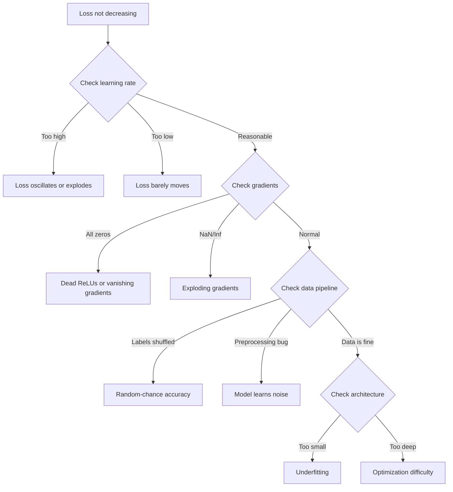
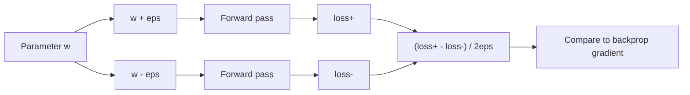
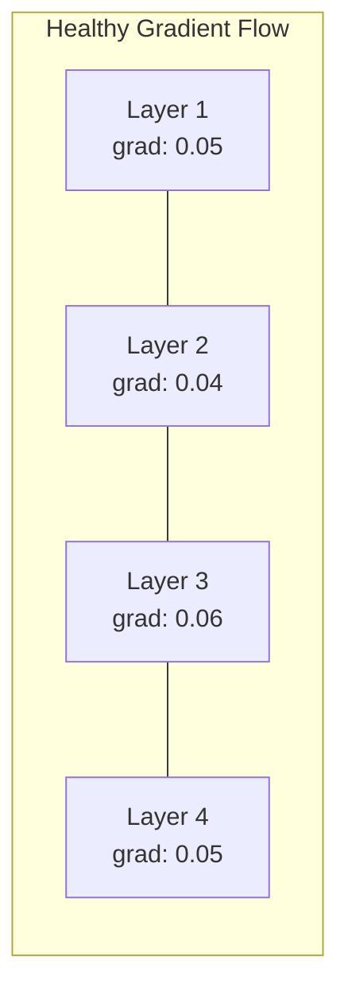
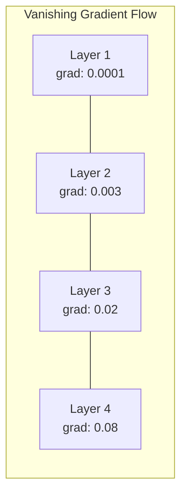
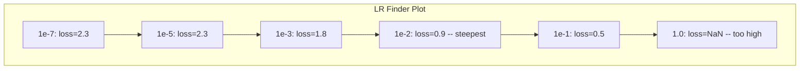

# न्यूरल नेटवर्क डिबगिंग

> आपका नेटवर्क संकलित किया गया। यह चला गया। यह एक संख्या उत्पन्न की। संख्या गलत है और कुछ भी क्रैश नहीं हुआ। सबसे कठिन प्रकार के डिबगिंग में आपका स्वागत है - जिस तरह का कोई त्रुटि संदेश नहीं है।

> **【中文解读】**网络编译了、运行了、输出了数字但数字是错误的,没有报错信息――这是最难的调试:没有错信息――本章系统介绍深度学习的调试方法论:过拟合单批 → 检查梯度 → 追踪数值稳定性 → 诊断学习率问题――

**Type:** Practice
**Type:** Build
**Languages:** Python, PyTorch
**Prerequisites:** Phase 03 Lessons 01-10 (especially backpropagation, loss functions, optimizers)
**Time:** ~90 minutes

## सीखने के लक्ष्य

- व्यवस्थित डिबगिंग रणनीतियों का उपयोग करके सामान्य तंत्रिका नेटवर्क विफलताओं (NaN हानि, फ्लैट हानि वक्र, ओवरफिटिंग, ओस्किलेशन) का निदान करें
- "ओवरफिट वन बैच" तकनीक का उपयोग करके यह सत्यापित करें कि आपका मॉडल वास्तुकला और प्रशिक्षण लूप सही है
- गिरने/विस्फोटन गिरने की समस्याओं की पहचान करने के लिए ग्रेडिएंट परिमाणों, सक्रियण वितरण और वजन मानकों का निरीक्षण करें
- एक डिबगिंग चेकलिस्ट बनाएं जो डेटा पाइपलाइन, मॉडल वास्तुकला, हानि फ़ंक्शन, अनुकूलक और सीखने की दर के मुद्दों को कवर करता है

> **【中文解读】**本章系统化地教你调试神经网络──核心方法论:过拟合单个批量(验证代码正确性)→ 梯度检查(验证反向传播)→ 激活统计(发现死 ReLU)→ 学习率搜索(找到合适的 lr)──60-70% के ML 调试时间花在"静默错误"上程序不报错但结果不对──

## समस्या  समस्या परिचय

पारंपरिक सॉफ्टवेयर टूटने पर दुर्घटनाग्रस्त हो जाता है। एक शून्य पॉइंटर एक अपवाद फेंक देता है। एक प्रकार असंगतता संकलन समय में विफल हो जाती है। एक-एक त्रुटि स्पष्ट रूप से गलत आउटपुट का उत्पादन करती है।

> 传统软件在出问题时会崩──空指针抛出异常──类型不匹配在编译时失败──差一错产生的明显错误输出──

न्यूरल नेटवर्क आपको ऐसा विलासिता नहीं देते।

> तंत्रिका नेटवर्क आपको ऐसा विलासिता नहीं देगा।

एक टूटा हुआ तंत्रिका नेटवर्क पूरा होने तक चलता है, एक हानि मूल्य प्रिंट करता है, और भविष्यवाणियों को आउटपुट करता है। नुकसान कम हो सकता है। भविष्यवाणियां यथार्थवादी लग सकती हैं। लेकिन मॉडल चुपचाप गलत है - शॉर्टकट सीखना, शोर याद रखना, या बेकार स्थानीय न्यूनतम तक पहुंचने के लिए। गूगल के शोधकर्ताओं ने अनुमान लगाया है कि एमएल डिबगिंग समय का 60-70% "चुप" बग्स पर खर्च किया जाता है जो कोई त्रुटि नहीं पैदा करते हैं लेकिन मॉडल की गुणवत्ता को कम करते हैं।

> एक समस्याग्रस्त तंत्रिका नेटवर्क पूरा होने तक चलाया जा सकता है, मुद्रण हानि मूल्य, आउटपुट अनुमानों में हानि घट सकती है। अनुमानों में तर्कसंगत लग सकता है। लेकिन मॉडल में त्रुटि हुई है।

एक कामकाजी मॉडल और एक टूटे हुए मॉडल के बीच अंतर अक्सर एक एकल गलत पंक्ति हैः एक गायब `zero_grad()`, एक ट्रांसपोस्टेड आयाम, एक सीखने की दर 10x से नीचे। कैनोनिक "न्यूरल नेटवर्क प्रशिक्षण के लिए नुस्खा" (2019) इस तरह से शुरू होता हैः "सबसे आम न्यूरल नेटवर्क त्रुटियां बग हैं जो दुर्घटना नहीं करते हैं। "

> उपयोग योग्य मॉडल और खराब मॉडल के बीच अंतर अक्सर केवल एक पंक्ति गलत स्थान कोडः अभाव `zero_grad()`、度转置错误、学习率差 10 倍──经典的"训练神经网络的方法" () 开头写道:" सबसे आम的神经网络错误是不会崩的错误──"

यह सबक आपको उन कीड़ों को खोजने के लिए सिखाता है।

> इस पाठ में आप सिखाया है कि कैसे इन बग खोजने के लिए

> **【中文解读】**传统软件有明确的错误信号(异常、编译错误)  तंत्रिका नेटवर्क में सबसे कठिन स्थान "静默错误" 程序正常运行、损失也在下降, लेकिन मॉडल地学错误了── सबसे आम तीन खाईः भूल जाओ शून्य_grad()  आयाम स्थानांतरण त्रुटि、 सीखने की दर差 10 倍──

> **【拓展：大模型训练中的调试】** प्रशिक्षण Llama 3 405B इस तरह के मॉडल(16384 块 H100,30.8M GPU 小时), एक बार प्रशिक्षण विफल होने की लागत तक पहुँचने के लिए लाखों डॉलर.

## अवधारणा का मूल अवधारणा

### डिबगिंग माइंडसेट

प्रिंट-एंड-प्रै डिबगिंग को भूल जाएं। तंत्रिका नेटवर्क डिबगिंग के लिए एक व्यवस्थित दृष्टिकोण की आवश्यकता होती है क्योंकि प्रतिक्रिया लूप धीमा होता है (प्रशिक्षण रन प्रति मिनट से घंटों तक) और लक्षण अस्पष्ट होते हैं (बुरा नुकसान का मतलब 20 अलग-अलग चीजें हो सकती हैं) ।

> 忘记印刷-प्रयास 调试――神经网络调试需要系统化方法,因为反循环很慢每次训练运行几分钟到几小时),而且症状模糊差的损失可能意味着20种不同的问题)

स्वर्ण नियम:**start simple, add complexity one piece at a time, and verify each piece independently.**

> 黄金法则:**从简单开始，一次只加一个复杂度，独立验证每个组件。**

> **【中文解读】**调试神经网络的黄金法则: सबसे सरल परिस्थितियों से शुरू करें, प्रत्येक बार केवल एक घटक जोड़ें, प्रत्येक घटक को स्वतंत्र रूप से सत्यापित करें।



### लक्षण 1: हानि घटती नहीं है लक्षण 1: हानि घटती नहीं है

यह सबसे आम शिकायत है प्रशिक्षण चक्र चलता है, युगों का समय बीतता है, और नुकसान सपाट रहता है या जंगली रूप से घिरेगा।

> यह सबसे आम शिकायत है। अभ्यास चक्र चल रहा है, युग एक से एक बीत गया है, लेकिन नुकसान एक बार फिर से गतिहीन या तीव्र झटके में है।

**Wrong learning rate.**बहुत अधिक: हानि Oscillates या NaN पर कूदता है. बहुत कमः हानि इतनी धीरे-धीरे घटती है कि यह सपाट लगती है. एडम के लिए, 1e-3 से शुरू करें। SGD के लिए, 1e-1 या 1e-2 से शुरू करें। हमेशा कुछ और गलत होने का निष्कर्ष निकालने से पहले 10 गुना तक प्रत्येक (जैसे, 1e-2, 1e-3, 1e-4) के 3 सीखने की दरों का प्रयास करें।

> **学习率错误。**太高: हानि 振荡或跳到NaN──太低: हानि 下降得太慢,看起来像不动──亚当从1e-3 开始──SGD从1e-1 或1e-2 开始──在下结论说有其他问题之前,先尝试3个学习率(相差10倍,如1e-2、1e-3、1e-4)──

**Dead ReLUs.**यदि एक ReLU न्यूरॉन एक बड़ी नकारात्मक इनपुट प्राप्त करता है, तो यह 0 और इसका ग्रेडिएंट 0 है। यह फिर से सक्रिय नहीं होता है। यदि पर्याप्त न्यूरॉन मर जाते हैं, तो नेटवर्क सीख नहीं सकता है। जांचेंः प्रत्येक ReLU परत के बाद सक्रियण का अंश प्रिंट करें जो ठीक से 0 है। यदि 50% से अधिक मृत हैं, तो LeakyReLU पर स्विच करें या सीखने की दर को कम करें।

> **死亡 ReLU。**यदि रिलू तंत्रिकाओं को बड़े नकारात्मक इनपुट प्राप्त होते हैं, तो यह आउटपुट 0, डिग्री भी 0, कभी पुनः सक्रिय नहीं होगा। यदि मृत तंत्रिकाओं का पर्याप्त संख्या है, तो नेटवर्क शुरू करने के लिए कुछ भी नहीं है।

**Vanishing gradients.**सिग्मोइड या टैन सक्रियण वाले गहरे नेटवर्क में, ग्रेडिएंट पीछे की ओर फैलते हुए तेजी से सिकुड़ जाते हैं। जब वे पहली परत तक पहुंचते हैं, तो वे ~ 0 होते हैं। पहली परतें सीखने से रोकती हैं। ठीक करेंः ReLU / GELU का उपयोग करें, शेष कनेक्शन जोड़ें, या बैच सामान्यीकरण का उपयोग करें।

> **梯度消失。**सिग्मोइड या तन्हा  सक्रिय गहरे स्तर के नेटवर्क में, तराजू विपरीत दिशा में प्रसारित होने पर सूचकांक स्तर घटता है।

**Exploding gradients.**विपरीत समस्या - ग्रेडिएंट तेजी से बढ़ते हैं. RNN और बहुत गहरे नेटवर्क में आम. हानि NaN पर कूदता है. फिक्सः ग्रेडिएंट क्लिपिंग (`torch.nn.utils.clip_grad_norm_`), सीखने की दर कम करना, या सामान्यीकरण जोड़ना।

> **梯度爆炸。**相反问题梯度指数级增长──常见于RNN 和非常深的网络──损失 跳到NaN──修复:梯度剪(`torch.nn.utils.clip_grad_norm_`) 、 कम सीखने की दर 、 या एकीकरण में वृद्धि 

### लक्षण 2: हानि घट रही है लेकिन मॉडल खराब है

नुकसान कम हो जाता है. प्रशिक्षण सटीकता 99% तक पहुंचता है. लेकिन परीक्षण सटीकता 55% है. या मॉडल वास्तविक डेटा पर बेतुका आउटपुट उत्पन्न करता है.

> हानि में कमी। प्रशिक्षण सटीकता दर 99% तक पहुंचती है। लेकिन परीक्षण सटीकता दर केवल 55% है।

**Overfitting.**मॉडल सीखने के पैटर्न के बजाय प्रशिक्षण डेटा को याद करता है। प्रशिक्षण और सत्यापन हानि के बीच अंतर समय के साथ बढ़ता है। फिक्सः अधिक डेटा, ड्रॉपआउट, वजन घटाने, जल्दी रोकना, डेटा वृद्धि।

> **过拟合。**模型在背诵训练数据而不是学习规律──训练损失和验证损失 之间的差距随时间扩大──修复:更多数据、Dropout、权重衰减、早停、数据增强──

**Data leakage.**परीक्षण डेटा प्रशिक्षण में लीक हो गया। सटीकता संदिग्ध रूप से उच्च है। सामान्य कारणः विभाजन से पहले मिक्सिंग, पूर्ण डेटासेट से आंकड़ों के साथ पूर्व प्रसंस्करण, विभाजन के माध्यम से डुप्लिकेट नमूने। फिक्सः विभाजन पहले, पूर्व प्रसंस्करण दूसरा, डुप्लिकेट की जांच।

> **数据泄漏。**测试数据混入了训练――准确率高可可疑――常见原因:划分前先打乱、 पूरे डेटासेट के सांख्यिकीय आंकड़ों का पूर्व-प्रक्रिया、跨划分的重复样本──修复:先划分再预处理、检查重复──

**Label errors.**अधिकांश वास्तविक डेटासेट में 5-10% लेबल गलत हैं (नॉर्थकट एट अल, 2021 -- "टेस्ट सेट में सर्वव्यापी लेबल त्रुटियां") मॉडल शोर सीखता है। ठीक करेंः गलत लेबल वाले उदाहरणों को खोजने और ठीक करने के लिए आत्मविश्वास से सीखने का उपयोग करें, या उच्च-हानि वाले नमूनों को अनदेखा करने के लिए हानि का उपयोग करें।

> **标签错误。**大多数真实数据集中 5-10% 的标签是错的(Northcutt 等人 2021年的论文测试套装中普遍标签错误) ・・・模型学到了噪音──修复: आत्मविश्वास से सीखकर 找出并修正错标样本,或用损失缩短 忽略高损失 样本──

### लक्षण 3: NaN या Inf में हानि  लक्षण 3: NaN या Inf में हानि

हानि मूल्य हो जाता है `nan`या `inf`प्रशिक्षण समाप्त हो गया है।

> हानि मूल्य में बदल `nan`या `inf` प्रशिक्षण मृत 

**Learning rate too high.**ग्रेडिएंट अद्यतनों को इतनी दूर चला गया कि वजन विस्फोट.

> **学习率太高。**梯度更新过冲到权重爆炸──修复: घटकर 10 गुना──

**log(0) or log(negative).**क्रॉस-एंट्रोपी हानि गणना `log(p)`. यदि आपके मॉडल के आउटपुट ठीक 0 या एक नकारात्मक संभावना है, लॉग विस्फोट.`[eps, 1-eps]`कहाँ`eps=1e-7`. .

> **log(0) 或 log(负数)。**交叉损失计算 `log(p)` यदि मॉडल आउटपुट ठीक 0 या नकारात्मक संभावना, लॉग 会爆炸──修复:把预测值制到 `[eps, 1-eps]`, उनमें से `eps=1e-7`

**Division by zero.**बैच सामान्यीकरण मानक विचलन द्वारा विभाजित होता है। निरंतर मानों वाले बैच में std=0 होता है। फिक्सः नामकरणकर्ता में epsilon जोड़ें (PyTorch डिफ़ॉल्ट रूप से ऐसा करता है, लेकिन कस्टम कार्यान्वयन नहीं हो सकते हैं) ।

> **除以零。**批归一化要除以标准差──一个常数值的批次的 std=0──修复:分母加 epsilon(PyTorch 默认这样做,但自定义实现可能没有)

**Numerical overflow.**बड़ी सक्रियण में डाला गया `exp()`फिक्सः एक्सपोनेंशिएटिंग से पहले अधिकतम घटाएं (लॉग-सॉम-एक्सप ट्रिक) ।

> **数值溢出。**बड़ा सक्रियण मूल्य इनपुट `exp()`                                                                                                                                                                                                                                                              

### तकनीक 1: ग्रेडिएंट चेकिंग

अपने विश्लेषणात्मक ग्रेडिएंट (बैकप्रॉप से) की तुलना संख्यात्मक ग्रेडिएंट (सीमित अंतर से) से करें। यदि वे असहमत हैं, तो आपके बैकप्रॉफ्ट पास में बग है।

> अपनी हल तराजू (आपकी हल तराजू) को विपरीत दिशा से प्रसारित करने से प्राप्त करें और संख्यात्मक तराजू (आपकी सीमित भिन्नता से प्राप्त होने से प्राप्त होने से प्राप्त होने से प्राप्त होने से प्राप्त करें) की तुलना करें।

पैरामीटर के लिए संख्यात्मक ग्रेडिएंट `w`:

> 参数 `w`                                                                                                                                                                                                                                                              

```
grad_numerical = (loss(w + eps) - loss(w - eps)) / (2 * eps)
```

समझौते की मेट्रिक (सपेक्ष अंतर):

> एक致性度量 (相对差异):

```
rel_diff = |grad_analytical - grad_numerical| / max(|grad_analytical|, |grad_numerical|, 1e-8)
```

यदि`rel_diff < 1e-5`: सही है।`rel_diff > 1e-3`: लगभग निश्चित रूप से एक कीट.

> यदि `rel_diff < 1e-5`: सही है, अगर `rel_diff > 1e-3`लगभग निश्चित रूप से कोई बग है।



### तकनीक 2: सक्रियण सांख्यिकीय तकनीक 2: सक्रियण सांख्यिकी

प्रशिक्षण के दौरान प्रत्येक परत के बाद सक्रियण के औसत और मानक विचलन की निगरानी करें। स्वस्थ नेटवर्क 0 के पास औसत और 1 के पास std (सामान्यकरण के बाद) या कम से कम सीमाबद्ध सक्रियण बनाए रखते हैं।

>  प्रशिक्षण समय निगरानी प्रत्येक स्तर के बाद सक्रियण मूल्य का औसत मूल्य और मानक अंतर―― स्वस्थ नेटवर्क सक्रियण मूल्य का औसत मूल्य 0 के करीब रखें 标准差 1 के करीब (नहीं) या कम से कम कोई सीमा है――

| Health indicator | Mean | Std | Diagnosis |
|-----------------|------|-----|-----------|
| Healthy | ~0 | ~1 | Network is learning normally |
| Saturated | >>0 or <<0 | ~0 | Activations stuck at extreme values |
| Dead | 0 | 0 | Neurons are dead (all zeros) |
| Exploding | >>10 | >>10 | Activations growing without bound |

| 健康指标 | 均值 | 标准差 | 诊断 |
|---------|------|--------|------|
| 健康 | ~0 | ~1 | 网络正常学习中 |
| 饱和 | >>0 或 <<0 | ~0 | 激活卡在极端值 |
| 死亡 | 0 | 0 | 神经元死了（全零） |
| 爆炸 | >>10 | >>10 | 激活无界增长 |

### तकनीक 3: ग्रेडिएंट फ्लो विज़ुअलाइज़ेशन

प्रत्येक परत के लिए औसत ग्रेडिएंट आयाम का ग्राफ बनाएं। एक स्वस्थ नेटवर्क में, ग्रेडिएंट आयामों को परतों के बीच लगभग समान होना चाहिए। यदि प्रारंभिक परतों में बाद की परतों की तुलना में 1000 गुना छोटे ग्रेडिएंट हैं, तो आपके पास गायब होने वाले ग्रेडिएंट हैं।

>  प्रत्येक स्तर की औसत तराजू की चौड़ाई का चित्रण करें स्वस्थ नेटवर्क में, प्रत्येक स्तर की तराजू की चौड़ाई लगभग समान होनी चाहिए यदि सामने के स्तर की तराजू पिछली स्तर से 1000 गुना छोटी है, तो आपके पास तराजू गायब होने का प्रश्न है





### तकनीक 4: ओवरफिट-वन-बैच टेस्ट

गहन सीखने में सबसे महत्वपूर्ण डिबगिंग तकनीक।

> गहन शिक्षा में सबसे महत्वपूर्ण एकल-अनुप्रयोग तकनीक

एक छोटे बैच (8-32 नमूने) ले लो। 100+ पुनरावृत्ति के लिए उस पर अभ्यास करें। नुकसान लगभग शून्य तक जाना चाहिए और प्रशिक्षण सटीकता 100% तक पहुंचनी चाहिए। यदि ऐसा नहीं होता है, तो आपके मॉडल या प्रशिक्षण लूप में एक मौलिक बग है - पूर्ण प्रशिक्षण के लिए आगे न बढ़ें।

> 取一个小批量(8-32个样本) 在上训练100+次代──损失应降到接近零,训练准确率应达到100%──如果不这样,你的模型或训练循环有根本的错不要进入完整训练──

इस परीक्षण में पता चलता हैः
- टूटने वाली हानि फ़ंक्शन
- टूटे हुए पीछे की पत्तियां
- डेटा को दर्शाने के लिए बहुत छोटी वास्तुकला
- मॉडल पैरामीटर से जुड़ा नहीं ऑप्टिमाइज़र
- डेटा और लेबल गलत तरीके से संरेखित

> यह परीक्षण कैप्चर कर सकता हैः नुकसान का नुकसान फ़ंक्शन, नुकसान का विपरीत प्रवाह प्रसार, संरचना बहुत छोटी नहीं दिखाती है डेटा, अनुकूलक मॉडल पैरामीटर से जुड़ा नहीं है, डेटा और लेबल असंगत है।

यह 30 सेकंड को चलाने के लिए लेता है और पूर्ण प्रशिक्षण रन डिबगिंग के घंटे बचाता है।

> यह केवल 30 सेकंड में काम करता है, आप कुछ घंटे की बचत कर सकते हैं पूर्ण प्रशिक्षण और परीक्षण समय.

> **【拓展：Andrej Karpathy 的调试建议】**कार्पैथी ने "ट्रेनिंग न्यूरल नेटवर्क के लिए नुस्खा" में दिया सुझावः 1) पहले प्रदर्शन को न संभालें, नुकसान को सुनिश्चित करें 计算正确; 2) निश्चित छोटे डेटा सेट पर ओवरलाइट; 3) संख्यात्मक और 梯度 परीक्षण के साथ 检查梯度; 4) वजन और 梯度 के पैमाने की निगरानी; 5) पहले छोटे मॉडल परीक्षण, पुनः विस्तार।

### तकनीक 5: सीखने की दर खोजक

लेस्ली स्मिथ (2017) ने नुकसान दर्ज करते हुए एक युग में सीखने की दर को बहुत छोटे से (1e-7) से बहुत बड़े (10) तक जाम करने का प्रस्ताव रखा। प्लॉट हानि बनाम सीखने की दर। इष्टतम सीखने की दर लगभग 10 गुना छोटी है जहां हानि सबसे तेजी से घटना शुरू होती है।

> लेस्ली स्मिथ ((2017) ने एक युग में आंतरिक सीखने की दर को बहुत कम से कम से कम से कम से कम से कम से कम से कम से कम से कम से कम से कम से कम से कम से कम तक बढ़ाने के लिए प्रस्तावित किया है।



इस उदाहरण में सर्वश्रेष्ठ LR: ~1e-3 (सबसे ऊंचा बिंदु से पहले एक परिमाण क्रम) ।

> इस उदाहरण में सर्वोत्तम सीखने की दर: ~1e-3(

### सामान्य पिटॉर्च कीड़े 常见 पिटॉर्च 错误

ये बग हैं जो PyTorch समुदाय में सबसे अधिक सामूहिक घंटे बर्बाद करते हैंः

> ये PyTorch 社区集体浪费 में सबसे अधिक समय बर्बाद करने वाले बग हैंः

> **【拓展：大模型训练中的 loss spike】**प्रशिक्षण में जब सुपर बड़े पैमाने पर मॉडल में (जैसे GPT-4、Llama 3) अचानक नुकसान होता है, तो अचानक नुकसान होता है, जो सामान्य मान से अचानक बहुत अधिक पुनः प्राप्ति तक कूद जाता है। संभावित कारणः 1) डेटा में असामान्य नमूना है; 2) एक बैच में डिग्री विस्फोट; 3) सीखने की दर में वृद्धि होती है।

| Bug | Symptom | Fix |
|-----|---------|-----|
| Forgetting `optimizer.zero_grad()` | Gradients accumulate across batches, loss oscillates | Add `optimizer.zero_grad()` before `loss.backward()` |
| Forgetting `model.eval()` at test time | Dropout and batch norm behave differently, test accuracy varies between runs | Add `model.eval()` and `torch.no_grad()` |
| Wrong tensor shapes | Silent broadcasting produces wrong results, no error | Print shapes after every operation during debugging |
| CPU/GPU mismatch | `RuntimeError: expected CUDA tensor` | Use `.to(device)` on model AND data |
| Not detaching tensors | Computation graph grows forever, OOM | Use `.detach()` or `with torch.no_grad()` |
| In-place operations breaking autograd | `RuntimeError: modified by in-place operation` | Replace `x += 1` with `x = x + 1` |
| Data not normalized | Loss stuck at random-chance level | Normalize inputs to mean=0, std=1 |
| Labels as wrong dtype | Cross-entropy expects `Long`, got `Float` | Cast labels: `labels.long()` |

| Bug | 症状 | 修复 |
|-----|------|------|
| 忘记 `optimizer.zero_grad()` | 梯度跨 batch 累积，loss 振荡 | 在 `loss.backward()` 前加 `optimizer.zero_grad()` |
| 测试时忘记 `model.eval()` | Dropout 和 BN 行为不同，测试准确率波动 | 加 `model.eval()` 和 `torch.no_grad()` |
| 张量形状错误 | 静默广播产生错误结果，无报错 | 调试时每个操作后打印形状 |
| CPU/GPU 不匹配 | `RuntimeError: expected CUDA tensor` | 模型和数据都用 `.to(device)` |
| 没有分离张量 | 计算图永远增长，OOM | 用 `.detach()` 或 `with torch.no_grad()` |
| 原地操作破坏 autograd | `RuntimeError: modified by in-place operation` | 把 `x += 1` 改成 `x = x + 1` |
| 数据未归一化 | Loss 卡在随机猜测水平 | 把输入归一化到 mean=0, std=1 |
| 标签 dtype 错误 | 交叉熵要 `Long`，得到了 `Float` | 转换标签：`labels.long()` |

### मास्टर डिबगिंग टेबल 调试总表

| Symptom | Likely cause | First thing to try |
|---------|-------------|-------------------|
| Loss stuck at -log(1/num_classes) | Model predicting uniform distribution | Check data pipeline, verify labels match inputs |
| Loss NaN after a few steps | Learning rate too high | Reduce LR by 10x |
| Loss NaN immediately | log(0) or division by zero | Add epsilon to log/division operations |
| Loss oscillating wildly | LR too high or batch size too small | Reduce LR, increase batch size |
| Loss decreasing then plateaus | LR too high for fine-tuning phase | Add LR schedule (cosine or step decay) |
| Training acc high, test acc low | Overfitting | Add dropout, weight decay, more data |
| Training acc = test acc = chance | Model not learning anything | Run overfit-one-batch test |
| Training acc = test acc but both low | Underfitting | Bigger model, more layers, more features |
| Gradients all zero | Dead ReLUs or detached computation graph | Switch to LeakyReLU, check `.requires_grad` |
| Out of memory during training | Batch too large or graph not freed | Reduce batch size, use `torch.no_grad()` for eval |

| 症状 | 可能原因 | 首选尝试 |
|------|---------|---------|
| Loss 卡在 -log(1/num_classes) | 模型预测均匀分布 | 检查数据管线，验证标签与输入匹配 |
| 几步后 Loss 变 NaN | 学习率太高 | 学习率降低 10 倍 |
| Loss 立即变 NaN | log(0) 或除以零 | 给 log/除法操作加 epsilon |
| Loss 剧烈振荡 | LR 太高或 batch 太小 | 降低 LR，增大 batch |
| Loss 下降后停滞 | 微调阶段 LR 太高 | 加 LR 调度（cosine 或阶梯衰减） |
| 训练 acc 高，测试 acc 低 | 过拟合 | 加 Dropout、权重衰减、更多数据 |
| 训练 acc = 测试 acc = 随机水平 | 模型没学到东西 | 跑过拟合单 batch 测试 |
| 训练 acc = 测试 acc 都低 | 欠拟合 | 更大模型、更多层、更多特征 |
| 梯度全零 | Dead ReLU 或计算图被 detach | 换 LeakyReLU，检查 `.requires_grad` |
| 训练时 OOM | Batch 太大或计算图未释放 | 减小 batch，eval 时用 `torch.no_grad()` |

## इसे बनाओ, इसे पूरा करो।

> **【中文解读】** NetworkDebugger  निदान उपकरण का निर्माणः PyTorch के आगे हुक और पीछे हुक का उपयोग करके स्वचालित रिकॉर्ड प्रत्येक स्तर के सक्रियण सांख्यिकी और स्तर सांख्यिकी।
```figure
learning-curves
```

## इसे बनाओ

एक निदान उपकरण कि सक्रियण, gradients और हानि वक्रों की निगरानी करता है। आप जानबूझकर एक नेटवर्क तोड़ देंगे और प्रत्येक समस्या का निदान करने के लिए उपकरण किट का उपयोग करेंगे।

> एक निगरानी सक्रियण मूल्य, तरंग और हानि 曲线 के निदान उपकरणबैक---आप जानबूझकर एक नेटवर्क को तोड़ देंगे, फिर प्रत्येक समस्या का निदान करने के लिए उपकरणबैक का उपयोग करेंगे---

### चरण 1: नेटवर्क डिबगर क्लास

प्रति परत सक्रियण और ग्रेडिएंट सांख्यिकी रिकॉर्ड करने के लिए एक PyTorch मॉडल में हुक।

> 给PyTorch 模型挂上子, रिकॉर्ड प्रत्येक स्तर के सक्रियण और gradient统计.

> नेटवर्कडिबगर के साथ PyTorch के आगे हुक और पीछे हुक स्वचालन निगरानी प्रत्येक स्तर──स्वास्थ्य जांच लॉजिक्स:लॉस 检查(NaN/振荡/不下降)、激活检查(>50% 零值→死亡 ReLU,时时时时时时时时时时时时时时时时时时时时时时时时时时时时时时时时时时时时时时时时时时时时时时时时时时时时时时时时时时时时时时时时时时时时时时时时时时时时时时时时时时时时时时时时时时时时时时时时时时时时时时时时时时时时时时时时时时时时时时时时时时时时时时时时时时时时时时时时时时时时时时时时时时时时时时时时时时时时时时时时时时时时时时时时时时时时时时时时时时时时时时时时时时时时时时时时时时时时时时时时时时时时时时时时时时时时时时时时时时时时时时时时时时时时时时时时时时时时时时时时时时时时时时时时时时时时时时时时时时时时时时时时时时时时时时时时时时时时时时时时时时时时时时时时时时时时时时时时时时时时时时时时时时时时时时时时时时时时时时时时时时时时时时时时时时时时时时时时时时时时时时时时时时时时时时时时时时时时时时时时时时时时时时时时时时时时时时时时时时时时时时时时时时时时时时时时时时时时时时时时时时时时时时时时时时时时时时时时时时时时时时时时时时时时时时时时时时时时时时时时时时时时时时时`print_report()`输出综合诊断报告――

```python
import torch
import torch.nn as nn
import math


class NetworkDebugger:
    def __init__(self, model):
        self.model = model
        self.activation_stats = {}
        self.gradient_stats = {}
        self.loss_history = []
        self.lr_losses = []
        self.hooks = []
        self._register_hooks()

    def _register_hooks(self):
        for name, module in self.model.named_modules():
            if isinstance(module, (nn.Linear, nn.Conv2d, nn.ReLU, nn.LeakyReLU)):
                hook = module.register_forward_hook(self._make_activation_hook(name))
                self.hooks.append(hook)
                hook = module.register_full_backward_hook(self._make_gradient_hook(name))
                self.hooks.append(hook)

    def _make_activation_hook(self, name):
        def hook(module, input, output):
            with torch.no_grad():
                out = output.detach().float()
                self.activation_stats[name] = {
                    "mean": out.mean().item(),
                    "std": out.std().item(),
                    "fraction_zero": (out == 0).float().mean().item(),
                    "min": out.min().item(),
                    "max": out.max().item(),
                }
        return hook

    def _make_gradient_hook(self, name):
        def hook(module, grad_input, grad_output):
            if grad_output[0] is not None:
                with torch.no_grad():
                    grad = grad_output[0].detach().float()
                    self.gradient_stats[name] = {
                        "mean": grad.mean().item(),
                        "std": grad.std().item(),
                        "abs_mean": grad.abs().mean().item(),
                        "max": grad.abs().max().item(),
                    }
        return hook

    def record_loss(self, loss_value):
        self.loss_history.append(loss_value)

    def check_loss_health(self):
        if len(self.loss_history) < 2:
            return "NOT_ENOUGH_DATA"
        recent = self.loss_history[-10:]
        if any(math.isnan(v) or math.isinf(v) for v in recent):
            return "NAN_OR_INF"
        if len(self.loss_history) >= 20:
            first_half = sum(self.loss_history[:10]) / 10
            second_half = sum(self.loss_history[-10:]) / 10
            if second_half >= first_half * 0.99:
                return "NOT_DECREASING"
        if len(recent) >= 5:
            diffs = [recent[i+1] - recent[i] for i in range(len(recent)-1)]
            if max(diffs) - min(diffs) > 2 * abs(sum(diffs) / len(diffs)):
                return "OSCILLATING"
        return "HEALTHY"

    def check_activations(self):
        issues = []
        for name, stats in self.activation_stats.items():
            if stats["fraction_zero"] > 0.5:
                issues.append(f"DEAD_NEURONS: {name} has {stats['fraction_zero']:.0%} zero activations")
            if abs(stats["mean"]) > 10:
                issues.append(f"EXPLODING_ACTIVATIONS: {name} mean={stats['mean']:.2f}")
            if stats["std"] < 1e-6:
                issues.append(f"COLLAPSED_ACTIVATIONS: {name} std={stats['std']:.2e}")
        return issues if issues else ["HEALTHY"]

    def check_gradients(self):
        issues = []
        grad_magnitudes = []
        for name, stats in self.gradient_stats.items():
            grad_magnitudes.append((name, stats["abs_mean"]))
            if stats["abs_mean"] < 1e-7:
                issues.append(f"VANISHING_GRADIENT: {name} abs_mean={stats['abs_mean']:.2e}")
            if stats["abs_mean"] > 100:
                issues.append(f"EXPLODING_GRADIENT: {name} abs_mean={stats['abs_mean']:.2e}")
        if len(grad_magnitudes) >= 2:
            first_mag = grad_magnitudes[0][1]
            last_mag = grad_magnitudes[-1][1]
            if last_mag > 0 and first_mag / last_mag > 100:
                issues.append(f"GRADIENT_RATIO: first/last = {first_mag/last_mag:.0f}x (vanishing)")
        return issues if issues else ["HEALTHY"]

    def print_report(self):
        print("\n=== NETWORK DEBUGGER REPORT ===")
        print(f"\nLoss health: {self.check_loss_health()}")
        if self.loss_history:
            print(f"  Last 5 losses: {[f'{v:.4f}' for v in self.loss_history[-5:]]}")
        print("\nActivation diagnostics:")
        for item in self.check_activations():
            print(f"  {item}")
        print("\nGradient diagnostics:")
        for item in self.check_gradients():
            print(f"  {item}")
        print("\nPer-layer activation stats:")
        for name, stats in self.activation_stats.items():
            print(f"  {name}: mean={stats['mean']:.4f} std={stats['std']:.4f} zero={stats['fraction_zero']:.1%}")
        print("\nPer-layer gradient stats:")
        for name, stats in self.gradient_stats.items():
            print(f"  {name}: abs_mean={stats['abs_mean']:.2e} max={stats['max']:.2e}")

    def remove_hooks(self):
        for hook in self.hooks:
            hook.remove()
        self.hooks.clear()
```

### चरण 2: ओवरफिट-वन-बैच टेस्ट.

> यह फ़ंक्शन एक बैच में ऊपर प्रशिक्षण मॉडल 200 कदम पर है, सत्यापन हानि  शून्य के करीब गिर सकती है  सटीकता दर 100% तक पहुंच सकती है यदि यह संभव नहीं है, तो मॉडल या प्रशिक्षण चक्र में मौलिक समस्याएं हैं

```python
def overfit_one_batch(model, x_batch, y_batch, criterion, lr=0.01, steps=200):
    optimizer = torch.optim.Adam(model.parameters(), lr=lr)
    model.train()
    print("\n=== OVERFIT ONE BATCH TEST ===")
    print(f"Batch size: {x_batch.shape[0]}, Steps: {steps}")

    for step in range(steps):
        optimizer.zero_grad()
        output = model(x_batch)
        loss = criterion(output, y_batch)
        loss.backward()
        optimizer.step()

        if step % 50 == 0 or step == steps - 1:
            with torch.no_grad():
                preds = (output > 0).float() if output.shape[-1] == 1 else output.argmax(dim=1)
                targets = y_batch if y_batch.dim() == 1 else y_batch.squeeze()
                acc = (preds.squeeze() == targets).float().mean().item()
            print(f"  Step {step:3d} | Loss: {loss.item():.6f} | Accuracy: {acc:.1%}")

    final_loss = loss.item()
    if final_loss > 0.1:
        print(f"\n  FAIL: Loss did not converge ({final_loss:.4f}). Model or training loop is broken.")
        return False
    print(f"\n  PASS: Loss converged to {final_loss:.6f}")
    return True
```

### चरण 3: सीखने की दर खोजक

> इस फ़ंक्शन से极小学习率 ((1e-7) सूचकांक扫到极大(10), प्रति चरण रिकॉर्ड हानि, अंततः "लॉस डाउन सबसे तेजी से बिंदु से पहले एक संख्यात्मक स्तर" की सीखने की दर का सुझाव देते हैं।

```python
def find_learning_rate(model, x_data, y_data, criterion, start_lr=1e-7, end_lr=10, steps=100):
    import copy
    original_state = copy.deepcopy(model.state_dict())
    optimizer = torch.optim.SGD(model.parameters(), lr=start_lr)
    lr_mult = (end_lr / start_lr) ** (1 / steps)

    model.train()
    results = []
    best_loss = float("inf")
    current_lr = start_lr

    print("\n=== LEARNING RATE FINDER ===")

    for step in range(steps):
        optimizer.zero_grad()
        output = model(x_data)
        loss = criterion(output, y_data)

        if math.isnan(loss.item()) or loss.item() > best_loss * 10:
            break

        best_loss = min(best_loss, loss.item())
        results.append((current_lr, loss.item()))

        loss.backward()
        optimizer.step()

        current_lr *= lr_mult
        for param_group in optimizer.param_groups:
            param_group["lr"] = current_lr

    model.load_state_dict(original_state)

    if len(results) < 10:
        print("  Could not complete LR sweep -- loss diverged too quickly")
        return results

    min_loss_idx = min(range(len(results)), key=lambda i: results[i][1])
    suggested_lr = results[max(0, min_loss_idx - 10)][0]

    print(f"  Swept {len(results)} steps from {start_lr:.0e} to {results[-1][0]:.0e}")
    print(f"  Minimum loss {results[min_loss_idx][1]:.4f} at lr={results[min_loss_idx][0]:.2e}")
    print(f"  Suggested learning rate: {suggested_lr:.2e}")

    return results
```

### चरण 4: ग्रेडिएंट चेकर

> 梯度检查器: प्रत्येक पैरामीटर के लिए, विपरीत दिशा में प्रसारित गणना के लिए पटल梯度 और सीमित अंतर प्राप्त करने के लिए संख्यात्मक मूल्य梯度`rel_diff < 1e-5`सही कहना,`> 1e-3`几乎肯定有错误── ध्यान दोहरे सटीकता के साथ करना चाहिए (double) ताकि कुछ मूल्य त्रुटि को कम किया जा सके──

```python
def _flat_to_multi_index(flat_idx, shape):
    multi_idx = []
    remaining = flat_idx
    for dim in reversed(shape):
        multi_idx.insert(0, remaining % dim)
        remaining //= dim
    return tuple(multi_idx)


def gradient_check(model, x, y, criterion, eps=1e-4):
    model.train()
    x_double = x.double()
    y_double = y.double()
    model_double = model.double()

    print("\n=== GRADIENT CHECK ===")
    overall_max_diff = 0
    checked = 0

    for name, param in model_double.named_parameters():
        if not param.requires_grad:
            continue

        layer_max_diff = 0

        model_double.zero_grad()
        output = model_double(x_double)
        loss = criterion(output, y_double)
        loss.backward()
        analytical_grad = param.grad.clone()

        num_checks = min(5, param.numel())
        for i in range(num_checks):
            idx = _flat_to_multi_index(i, param.shape)
            original = param.data[idx].item()

            param.data[idx] = original + eps
            with torch.no_grad():
                loss_plus = criterion(model_double(x_double), y_double).item()

            param.data[idx] = original - eps
            with torch.no_grad():
                loss_minus = criterion(model_double(x_double), y_double).item()

            param.data[idx] = original

            numerical = (loss_plus - loss_minus) / (2 * eps)
            analytical = analytical_grad[idx].item()

            denom = max(abs(numerical), abs(analytical), 1e-8)
            rel_diff = abs(numerical - analytical) / denom

            layer_max_diff = max(layer_max_diff, rel_diff)
            checked += 1

        overall_max_diff = max(overall_max_diff, layer_max_diff)
        status = "OK" if layer_max_diff < 1e-5 else "MISMATCH"
        print(f"  {name}: max_rel_diff={layer_max_diff:.2e} [{status}]")

    model.float()

    print(f"\n  Checked {checked} parameters")
    if overall_max_diff < 1e-5:
        print("  PASS: Gradients match (rel_diff < 1e-5)")
    elif overall_max_diff < 1e-3:
        print("  WARN: Small differences (1e-5 < rel_diff < 1e-3)")
    else:
        print("  FAIL: Gradient mismatch detected (rel_diff > 1e-3)")
    return overall_max_diff
```

### चरण 5: जानबूझकर टूटने वाले नेटवर्क

अब टूल्सकिट को टूटे नेटवर्क पर लागू करें और प्रत्येक का निदान करें।

> ️️️️️️️️️️️️️️️️️️️️️️️️️️️️️️️️️️️️️️️️️️️️️️️️️️️️️️️️️️️️️️️️️️️️️️️️️️️️️️️️️️️️️️️️️️️️️️️️️️️️️️️️️️️️️️️️️️️️️️️️️️️️️️️️️️️️️️️️️️️️️️️️️️️️️️️️️️️️️️️️️️️️️️️️️️️️️️️️️️️️️️️️️️️️️️️️️️️️️️️️️️️️️️️️️️️️️️️️️️️️️️️️️️️️️️️️️️️️️️️️️️️️️️️️️️️️️️️️️️️️️️️️️️️️️️️️️️️️️️️️️️️️️️️️️️️️️️️️️️️️️️️️️️️️️️️️️️️️️️️️️️️️️️️️️️️️️️️️️️️️️️️️️️️️️️️️️️️️️️️️️️️️️️️️️️️️️️️️️️️️️️️️️️️️️️️️️️️️️️️️️️️️️️️️️️️️️️️️️️️️️️️️️️️️️️️️️️️️️️️️️️️️️️️️️️️️️️️️️️️️️️️️️️️️️️️️️️️️️️️️️️️️️️️️️️️️️️️️️️️️️️️️️️️️

```python
def demo_broken_networks():
    torch.manual_seed(42)
    x = torch.randn(64, 10)
    y = (x[:, 0] > 0).long()

    print("\n" + "=" * 60)
    print("BUG 1: Learning rate too high (lr=10)")
    print("=" * 60)
    model1 = nn.Sequential(nn.Linear(10, 32), nn.ReLU(), nn.Linear(32, 2))
    debugger1 = NetworkDebugger(model1)
    optimizer1 = torch.optim.SGD(model1.parameters(), lr=10.0)
    criterion = nn.CrossEntropyLoss()
    for step in range(20):
        optimizer1.zero_grad()
        out = model1(x)
        loss = criterion(out, y)
        debugger1.record_loss(loss.item())
        loss.backward()
        optimizer1.step()
    debugger1.print_report()
    debugger1.remove_hooks()

    print("\n" + "=" * 60)
    print("BUG 2: Dead ReLUs from bad initialization")
    print("=" * 60)
    model2 = nn.Sequential(nn.Linear(10, 32), nn.ReLU(), nn.Linear(32, 32), nn.ReLU(), nn.Linear(32, 2))
    with torch.no_grad():
        for m in model2.modules():
            if isinstance(m, nn.Linear):
                m.weight.fill_(-1.0)
                m.bias.fill_(-5.0)
    debugger2 = NetworkDebugger(model2)
    optimizer2 = torch.optim.Adam(model2.parameters(), lr=1e-3)
    for step in range(50):
        optimizer2.zero_grad()
        out = model2(x)
        loss = criterion(out, y)
        debugger2.record_loss(loss.item())
        loss.backward()
        optimizer2.step()
    debugger2.print_report()
    debugger2.remove_hooks()

    print("\n" + "=" * 60)
    print("BUG 3: Missing zero_grad (gradients accumulate)")
    print("=" * 60)
    model3 = nn.Sequential(nn.Linear(10, 32), nn.ReLU(), nn.Linear(32, 2))
    debugger3 = NetworkDebugger(model3)
    optimizer3 = torch.optim.SGD(model3.parameters(), lr=0.01)
    for step in range(50):
        out = model3(x)
        loss = criterion(out, y)
        debugger3.record_loss(loss.item())
        loss.backward()
        optimizer3.step()
    debugger3.print_report()
    debugger3.remove_hooks()

    print("\n" + "=" * 60)
    print("HEALTHY NETWORK: Correct setup for comparison")
    print("=" * 60)
    model_good = nn.Sequential(nn.Linear(10, 32), nn.ReLU(), nn.Linear(32, 2))
    debugger_good = NetworkDebugger(model_good)
    optimizer_good = torch.optim.Adam(model_good.parameters(), lr=1e-3)
    for step in range(50):
        optimizer_good.zero_grad()
        out = model_good(x)
        loss = criterion(out, y)
        debugger_good.record_loss(loss.item())
        loss.backward()
        optimizer_good.step()
    debugger_good.print_report()
    debugger_good.remove_hooks()

    print("\n" + "=" * 60)
    print("OVERFIT-ONE-BATCH TEST (healthy model)")
    print("=" * 60)
    model_test = nn.Sequential(nn.Linear(10, 32), nn.ReLU(), nn.Linear(32, 2))
    overfit_one_batch(model_test, x[:8], y[:8], criterion)

    print("\n" + "=" * 60)
    print("LEARNING RATE FINDER")
    print("=" * 60)
    model_lr = nn.Sequential(nn.Linear(10, 32), nn.ReLU(), nn.Linear(32, 2))
    find_learning_rate(model_lr, x, y, criterion)

    print("\n" + "=" * 60)
    print("GRADIENT CHECK")
    print("=" * 60)
    model_grad = nn.Sequential(nn.Linear(10, 8), nn.ReLU(), nn.Linear(8, 2))
    gradient_check(model_grad, x[:4], y[:4], criterion)
```

## इसे फ्रेमवर्क के साथ लागू करें

> **【中文解读】**PyTorch 内置调试工具:`torch.autograd.detect_anomaly()`捕获 NaN/Inf`model.named_parameters()`遍历参数和梯度── उत्पादन पर्यावरण के साथ वजन और पूर्वाग्रह (wandb) या TensorBoard  वास्तविक समय निगरानी हानि、梯度直方图、权重分布── कुंजी यह है कि समस्या होने पर जल्दी से पता लगाने में सक्षम है कि किस स्तर पर समस्या उत्पन्न हुई है──

### PyTorch अंतर्निहित उपकरण

> PyTorch 内置工具:`detect_anomaly()`In controvert propagation中检测 NaN/Inf 并印出错位置;`named_parameters()` सभी तत्वों और उनकी तरंगों में,                                                                                                                                                                                                                                                         

```python
import torch
import torch.nn as nn

model = nn.Sequential(
    nn.Linear(768, 256),
    nn.ReLU(),
    nn.Linear(256, 10),
)

with torch.autograd.detect_anomaly():
    output = model(input_tensor)
    loss = criterion(output, target)
    loss.backward()

for name, param in model.named_parameters():
    if param.grad is not None:
        print(f"{name}: grad_mean={param.grad.abs().mean():.2e}")
```

### वजन और पूर्वाग्रह एकीकरण वजन और पूर्वाग्रह 集集集

> W&B 集成: प्रत्येक युग  रिकॉर्ड हानि、 सीखने की दर、梯度范数,并为每参数 रिकॉर्ड梯度直方图──线上仪表盘实时显示训练曲线,能快速发现损失尖、梯度爆炸或参数和──

```python
import wandb

wandb.init(project="debug-training")

for epoch in range(100):
    loss = train_one_epoch()
    wandb.log({
        "loss": loss,
        "lr": optimizer.param_groups[0]["lr"],
        "grad_norm": torch.nn.utils.clip_grad_norm_(model.parameters(), float("inf")),
    })

    for name, param in model.named_parameters():
        if param.grad is not None:
            wandb.log({f"grad/{name}": wandb.Histogram(param.grad.cpu().numpy())})
```

### TensorBoard . . . TensorBoard दृश्यमान

> टेन्सरबोर्ड 可視化:`add_scalar`记录标量(loss、精度、学习率),`add_histogram`लेख भार और तरंग का वितरण  प्रशिक्षण समय संचालन `tensorboard --logdir=runs/`start local instrumentation盘, वास्तविक समय में प्रशिक्षण वक्र और पैरामीटर वितरण परिवर्तन देखें

```python
from torch.utils.tensorboard import SummaryWriter

writer = SummaryWriter("runs/debug_experiment")

for epoch in range(100):
    loss = train_one_epoch()
    writer.add_scalar("Loss/train", loss, epoch)

    for name, param in model.named_parameters():
        writer.add_histogram(f"weights/{name}", param, epoch)
        if param.grad is not None:
            writer.add_histogram(f"gradients/{name}", param.grad, epoch)
```

### डिबग चेकलिस्ट (पूरी ट्रेनिंग से पहले)

1. एक बैच ओवरफिट टेस्ट चलाएं, अगर यह विफल हो जाता है, तो बंद करो।
2. मुद्रण मॉडल सारांश - पैरामीटर संख्या सत्यापित करने के लिए उचित है।
3. यादृच्छिक डेटा के साथ एक आगे पास चलाएं - आउटपुट आकार की जांच करें।
4. 5 युगों के लिए ट्रेन - सत्यापित हानि घटती है।
5. सक्रियण आँकड़े की जाँच करें - कोई मृत परतें, कोई विस्फोट नहीं।
6. ग्रिडिएंट प्रवाह की जांच करें - कोई गायब होने, कोई विस्फोट नहीं।
7. डेटा पाइपलाइन की जांच करें-- लेबल के साथ 5 यादृच्छिक नमूने प्रिंट करें।

> 调试清单(完整训练前):
> 1. 跑过拟合单批 测试──失败就停止──
> 2. 打印模型摘要 验证参数数合理──
> 3. प्रयोग के साथ डेटा रन एक बार पूर्व की ओर प्रसारण
> 4. 訓練 5  युग  सत्यापन हानि 在下降──
> 5. 检查 सक्रिय统计没有死层没有爆炸
> 6. 检查梯度流没有消失,没有爆炸
> 7. 验证数据管线印 5 个标签随机样本的随机样本──

## इसे भेजें उत्पाद

इस पाठ से उत्पन्न होता हैः
- `outputs/prompt-nn-debugger.md`-- तंत्रिका नेटवर्क प्रशिक्षण विफलताओं का निदान करने के लिए एक संकेत
- `outputs/skill-debug-checklist.md`-- डिबगिंग प्रशिक्षण समस्याओं के लिए निर्णय वृक्ष की जाँच सूची

डिबगिंग के लिए प्रमुख तैनाती पैटर्नः
- उत्पादन प्रशिक्षण स्क्रिप्ट में निगरानी हुक जोड़ें
- लॉग सक्रियण और W & B या TensorBoard के लिए gradient के आंकड़े हर N चरणों
- NaN हानि, मृत न्यूरॉन्स (> 80% शून्य) या ग्रेडिएंट विस्फोट के लिए स्वचालित अलर्ट लागू करें
- वास्तुकला या डेटा पाइपलाइन बदलने पर हमेशा ओवरफिट-वन-बैच टेस्ट चलाएं

> 本课产出:
> - `outputs/prompt-nn-debugger.md` निदान तंत्रिका नेटवर्क प्रशिक्षण विफलता का सुझाव शब्द
> - `outputs/skill-debug-checklist.md`调试训练 के मुद्दे का निर्णय tree清单
>
> 调试的关键部署模式:
> - 给生产训练脚本加监控子
> - प्रत्येक N 步把 सक्रियण और gradient सांख्यिकीय रिकॉर्ड W & B या TensorBoard तक
> - 实现自动告警:NaN हानि 死亡神经元(>80% 零) 梯度 विस्फोट
> - 改架构或数据管线时永远先跑过拟合单批 测试

## अभ्यास विषय

1. **Add an exploding gradient detector.** को संशोधित करें`NetworkDebugger`जब gradients एक सीमा से अधिक है पता लगाने के लिए और स्वचालित रूप से एक gradient कटौती मूल्य का सुझाव. यह एक 20-परत नेटवर्क पर परीक्षण बिना सामान्यीकरण.

   **添加梯度爆炸检测器。**修改 `NetworkDebugger`, परीक्षण तराजू मूल्य से अधिक है, स्वचालित रूप से अनुशंसा तराजू कटौती मूल्य  में 20 परत नेटवर्क पर परीक्षण 

2. **Build a dead neuron resurrector.**एक फ़ंक्शन लिखें जो मृत रेलु न्यूरॉन्स की पहचान करता है (हमेशा 0 आउटपुट) और कैमिंग आरंभिकरण के साथ उनके आने वाले वजन को फिर से आरंभ करता है। दिखाएं कि यह एक नेटवर्क को पुनर्प्राप्त करता है जहां > 70% न्यूरॉन्स मृत हैं।

   **构建死亡神经元复活器。** write a function identifying death ReLU 神经元(始终输出 0), काइमिंग प्रारंभिककरण के साथ पुनः प्रारंभ करें उनका इनपुट权重── दिखाएं यह एक >70% 神经元 मृत्यु के नेटवर्क पुनर्प्राप्त करने में सक्षम है──

3. **Implement the learning rate finder with plotting.**विस्तार `find_learning_rate`परिणामों को सीएसवी के रूप में सहेजें और एक अलग स्क्रिप्ट लिखें जो सीएसवी को पढ़ता है और मैटप्लोटलिब का उपयोग करके एलआर बनाम हानि वक्र प्रदर्शित करता है। सीआईएफएआर -10 पर रेज़नेट -18 के लिए इष्टतम एलआर की पहचान करें।

   **实现带绘图的学习率搜索器。**扩展 `find_learning_rate`, परिणाम को CSV के लिए सहेजें, और एक स्वतंत्र स्क्रिप्ट लिखें CSV को पढ़ने के लिए matplotlib के साथ चित्रण LR बनाम हानि 曲线── CIFAR-10 के ऊपर ResNet-18 में सबसे अच्छा LR को खोजने के लिए

4. **Create a data pipeline validator.**एक फ़ंक्शन लिखें जो डेटा में दोहराने वाले नमूने, लेबल वितरण असंतुलन (> 10:1 अनुपात), इनपुट सामान्यीकरण (औसत 0, std के करीब 1), और NaN/Inf मानों की जांच करता है। इसे जानबूझकर क्षतिग्रस्त डेटासेट पर चलाएं।

   **创建数据管线验证器。**写一个函数检查:训练/测试划分间的重复样本、标签分布不平衡(>10:1 比例) 输入归结(平均值接近0,std 接近1) 、数据中的 NaN/Inf 值──故意损坏的数据集上运行──

5. **Debug a real failure.**पाठ 10 से मिनी-फ्रेमवर्क लें, एक सूक्ष्म बग पेश करें (उदाहरण के लिए, वजन मैट्रिक्स को पीछे की ओर स्थानांतरित करें), और सटीक रूप से पता लगाने के लिए ग्रेडिएंट जांच का उपयोग करें कि किस पैरामीटर में गलत ग्रेडिएंट हैं। डिबगिंग प्रक्रिया का दस्तावेजीकरण करें।

   **调试一个真实失败。**取第十 课的迷你框架, एक छिपे हुए बग को पेश करना (जैसे कि विपरीत向传播中转置权重矩阵), 梯度检查精确定位哪个参数梯度不对;;记录调试过程──

## कीवर्ड्स  शब्द खोज तालिका

| Term | What people say | What it actually means |
|------|----------------|----------------------|
| Silent bug | "It runs but gives bad results" | A bug that produces no error but degrades model quality -- the dominant failure mode in ML |
| Dead ReLU | "The neurons died" | A ReLU neuron whose input is always negative, so it outputs 0 and receives 0 gradient permanently |
| Vanishing gradients | "Early layers stop learning" | Gradients shrink exponentially through layers, making weights in early layers effectively frozen |
| Exploding gradients | "Loss went to NaN" | Gradients grow exponentially through layers, causing weight updates so large they overflow |
| Gradient checking | "Verify backprop is correct" | Comparing analytical gradients from backprop to numerical gradients from finite differences |
| Overfit-one-batch | "The most important debug test" | Training on a single small batch to verify the model CAN learn -- if it cannot, something is fundamentally broken |
| LR finder | "Sweep to find the right learning rate" | Exponentially increasing the learning rate over one epoch and picking the rate just before loss diverges |
| Data leakage | "Test data leaked into training" | When information from the test set contaminates training, producing artificially high accuracy |
| Activation statistics | "Monitor layer health" | Tracking mean, std, and zero-fraction of each layer's output to detect dead, saturated, or exploding neurons |
| Gradient clipping | "Cap the gradient magnitude" | Scaling gradients down when their norm exceeds a threshold, preventing exploding gradient updates |

| 术语 | 俗称 | 实际含义 |
|------|------|---------|
| Silent bug / 静默 bug | "能跑但结果差" | 不产生错误但降低模型质量的 bug——ML 中主要的失败模式 |
| Dead ReLU / 死亡 ReLU | "神经元死了" | 输入始终为负的 ReLU 神经元，永远输出 0、梯度为 0 |
| Vanishing gradients / 梯度消失 | "前面层停止学习" | 梯度穿过层时指数缩小，使前面层的权重实际上被冻结 |
| Exploding gradients / 梯度爆炸 | "Loss 变 NaN" | 梯度穿过层时指数增长，权重更新过大而溢出 |
| Gradient checking / 梯度检查 | "验证反向传播正确" | 把反向传播的解析梯度和有限差分的数值梯度做比较 |
| Overfit-one-batch / 过拟合单 batch | "最重要的调试测试" | 在单个小 batch 上训练，验证模型能学习——如果不能，就是根本性错误 |
| LR finder / 学习率搜索器 | "扫一遍找合适学习率" | 一个 epoch 内指数级增加学习率，挑发散前一刻的学习率 |
| Data leakage / 数据泄漏 | "测试数据泄漏到训练" | 测试集信息污染了训练，产生虚假的高准确率 |
| Activation statistics / 激活统计 | "监控层健康" | 追踪每层输出的均值、标准差、零比例，检测死亡、饱和或爆炸神经元 |
| Gradient clipping / 梯度裁剪 | "限制梯度幅度" | 当梯度范数超过阈值时按比例缩小，防止梯度爆炸更新 |

## आगे पढ़ना 延伸閱讀

- स्मिथ, "शिक्षण तंत्रिका नेटवर्क के लिए चक्रवर्ती सीखने की दरें" (2017) - पेपर जो सीखने की दर सीमा परीक्षण (एलआर खोजक) की शुरुआत करता है
- नॉर्थकट और अन्य, "टेस्ट सेट में सर्वव्यापी लेबल त्रुटियां मशीन लर्निंग बेंचमार्क को अस्थिर करती हैं" (2021) -- यह दर्शाता है कि इमेजनेट, सीआईएफएआर -10 और अन्य प्रमुख बेंचमार्क में 3-6% लेबल गलत हैं
- Zhang et al., "Deep Learning Understanding Requires Re-thinking Generalization" (2017) -- न्यूरल नेटवर्क यादृच्छिक लेबल याद कर सकते हैं जो पेपर दिखाता है, यही कारण है कि ओवरफिट-एक बैच परीक्षण काम करता है
-  पर PyTorch प्रलेखन`torch.autograd.detect_anomaly`और `torch.autograd.set_detect_anomaly`अंतर्निहित NaN/Inf पता लगाने के लिए

> 延伸阅读:
> - स्मिथ,निरोगिक नेटवर्क प्रशिक्षण के लिए चक्रवर्ती सीखने की दर(2017)提出学习率范围测试(LR finder) के论文
> - नॉर्थकट 等人,टेस्ट सेट में व्यापक लेबल त्रुटियां मशीन लर्निंग बेंचमार्क को अस्थिर करें(2021) प्रमाण ImageNet、CIFAR-10等主要基准的标签 3-6% 是错的
> - Zhang 等人,Deep Learning को समझने के लिए पुनर्मूल्यांकन की आवश्यकता होती है(2017) प्रमाणन तंत्रिका नेटवर्क को याद रखने में सक्षम है
> - PyTorch 文档关于 `torch.autograd.detect_anomaly`和 `torch.autograd.set_detect_anomaly`उपयोग में आइनपुट NaN/Inf 检测
