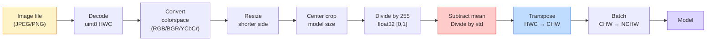
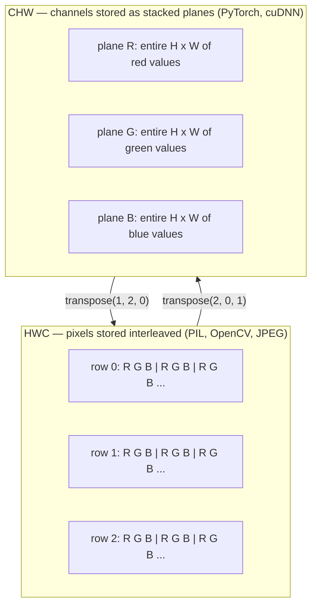

# छवि मूल बातें  पिक्सेल, चैनल, रंग स्थान   छवि आधार  像素, मार्ग और रंग स्थान

> एक छवि प्रकाश के नमूने का एक tensor है. हर दृष्टि मॉडल आप कभी भी उपयोग करेंगे इस एक तथ्य से शुरू होता है.

> **【中文解读】**图像本质上是一组光线采样值的张量多维数组)  चाहे वह मोबाइल फोटोग्राफी हो, ऑटोमोटिव ड्राइविंग हो या GPT-4V, सभी विडियो मॉडल इस मूलभूत तथ्य से उत्पन्न होते हैं ️ समझना 像素,通道 और डेटा प्रारूप "模型吃错数据" से बचने के लिए है इस प्रकार की छिपाने की बग की कुंजी️

**Type:** Build | **类型:** 动手
**Languages:** Python | **语言:** Python
**Prerequisites:** Phase 1 Lesson 12 (Tensor Operations), Phase 3 Lesson 11 (Intro to PyTorch) | **前置知识:** Phase 1 Lesson 12（张量运算）、Phase 3 Lesson 11（PyTorch 入门）
**Time:** ~45 minutes | **时间:** ~45 分钟

## सीखने के लक्ष्य

- यह समझाएं कि एक निरंतर दृश्य कैसे पिक्सेल में विवश हो जाता है और नमूना/क्वांटिकेशन निर्णय प्रत्येक डाउनस्ट्रीम मॉडल पर सीमा क्यों निर्धारित करते हैं
  चीनी अनुवादः व्याख्या कैसे एक श्रृंखला दृश्यों को विखंडित किया गया है के रूप में चित्रों, और क्यों नमूना / माप निर्णय सभी नीचे मॉडल के ऊपरी सीमा तय
- NumPy सरणी के रूप में छवियों को पढ़ें, स्लाइस करें और निरीक्षण करें और HWC और CHW लेआउट के बीच धाराप्रवाह स्विच करें
  中文翻译:读取、切片、检查图像的NumPy 数组表示, और HWC और CHW 布局 के बीच स्वचालित रूप से स्विच
- आरजीबी, ग्रेस्केल, एचएसवी और वाईसीबीसीआर के बीच परिवर्तित करें और प्रत्येक रंग स्थान का अस्तित्व क्यों है, इसका कारण बताएं
  中文翻译: RGB、灰度、HSV और YCbCr के बीच परिवर्तन, और प्रत्येक रंग अंतरिक्ष के अस्तित्व के कारणों का वर्णन
- पिक्सेल स्तर पर पूर्व प्रसंस्करण (मानक, मानकीकृत, आकार बदलें, चैनल-पहले) लागू करें ठीक उसी तरह से जैसा कि पूर्व प्रशिक्षित PyTorch दृष्टि मॉडल इसकी उम्मीद करते हैं
  中文翻译:精确按照预训练 PyTorch 视觉模型的期望做像素级预处理(归一化、标准化、缩放、通道前置)

## समस्या  समस्या परिचय

आप जो भी पेपर पढ़ेंगे, जो भी वजन आप डाउनलोड करेंगे, जो भी विजन एपीआई आप कॉल करेंगे, वह इनपुट का एक विशिष्ट एन्कोडिंग मानता है।`uint8`छवि जहां मॉडल चाहता है `float32`और यह अभी भी चल रहा है  और चुपचाप कचरा उत्पन्न करेगा। आरजीबी पर प्रशिक्षित नेटवर्क को बीजीआर खिलाएं और सटीकता दस अंक से गिर जाती है। एक मॉडल चैनल-अंतिम इनपुट जब यह चैनलों की उम्मीद करता है-पहले और पहले कन्व परत ऊंचाई को एक सुविधा चैनल के रूप में मानती है। इनमें से कोई भी त्रुटि नहीं डालता है। यह सिर्फ आपके मीट्रिक को बर्बाद करता है और आप एक सप्ताह की खोज में बिताते हैं जो उस बग के लिए रहता है जो आपने फ़ाइल को लोड किया है।

> आप पढ़ेंगे प्रत्येक लेख, डाउनलोड किया प्रत्येक पूर्व प्रशिक्षण वजन, अनुकूलित प्रत्येक दृश्य एपीआई, सभी एक विशिष्ट प्रकार के इनपुट कोड का अनुमान लगाया गया है।`uint8`图像传给需要 `float32`मॉडल में, यह अभी भी चल रहा है, लेकिन चुपचाप कचरा उत्पन्न करता है। RGB पर प्रशिक्षित नेटवर्क में बीजीआर को 10 प्रतिशत की सटीकता दर से नीचे गिरा दिया गया है। अंतिम इनपुट में एक पथ को अपेक्षित पथ पर पहुंचाया गया है। सबसे पहले मॉडल में, पहला खंड स्तर उच्चता को विशेषता पथ के रूप में मानता है। ये सभी गलतियां नहीं करते हैं, केवल आपके मापदंड को नष्ट कर देते हैं, जिससे आप एक सप्ताह का समय बिता सकते हैं फ़ाइल लोड करने के तरीके में एक बग की तलाश में।

> **【中文解读】**यह कंप्यूटर विज़ुअल इंजीनियरिंग में सबसे आम "छिपेपन कीड़े" स्रोतः डेटा प्रारूप असंगत है। मॉडल त्रुटि रिपोर्ट नहीं करेगा, लेकिन परिणाम पूरी तरह से गलत है। उदाहरण के लिए, बीजीआर को आरजीबी के रूप में रखना।

एक संभलना जटिल नहीं है जब आप जानते हैं कि यह क्या स्लाइड कर रहा है। कठिन हिस्सा यह है कि "एक छवि" का मतलब कैमरा, एक जेपीईजी डिकोडर, पीआईएल, ओपनसीवी, टॉर्चविजन और एक क्यूडीए कर्नेल के लिए अलग-अलग चीजें हैं। प्रत्येक स्टैक का अपना अक्ष क्रम, बाइट रेंज और चैनल सम्मेलन है। एक दृष्टि इंजीनियर जो इन सीधी जहाजों को टूटी हुई पाइपलाइन नहीं रख सकता है।

> एक बार जब आप जानते हैं कि वॉल्यूम में क्या स्लाइड है, तो यह जटिल नहीं है। कठिनाई का हिस्सा "छवि" के बारे में है।

इस पाठ में नींव तय की गई है ताकि शेष चरण उस पर बना सकें। अंत तक आप जानेंगे कि पिक्सेल क्या है, एक के बजाय प्रत्येक पिक्सेल में तीन संख्याएं क्यों हैं, "इमेजनेट आँकड़े के साथ सामान्यीकरण" वास्तव में क्या करता है, और इस चरण में प्रत्येक अन्य पाठ के रूप में दो या तीन लेआउट के बीच कैसे स्थानांतरित किया जाए।

> इस कक्षा का वास्तविक आधार है, ताकि इस चरण के शेष पाठ्यक्रम इस पर बनाया जा सके। अध्ययन के बाद आप जानेंगे कि विग्सिन क्या है, प्रत्येक विग्सिन में एक के बजाय तीन अंक क्यों हैं, "इमेजनेट के साथ सांख्यिकीय पुनर्मिलन" के साथ क्या किया गया है, और शेष पाठ्यक्रम में निर्धारित दो-तीन लेआउट के बीच कैसे स्विच किया गया है।

> **【拓展：数据标注与质量】**视觉任务的效果高度依赖标签数据质量──标签工作室、CVAT是主流标签工具──在工业场景中,主动学习(Active Learning) ले标签成本 को कम कर सकता हैः मॉडल अनिश्चित नमूना अनुरोधों के लिए कृत्रिम标签, अनिश्चितता के नमूने स्वचालित标签──

## अवधारणा का मूल अवधारणा

### एक नज़र में पूरी पूर्व प्रसंस्करण पाइपलाइन

प्रत्येक उत्पादन दृष्टि प्रणाली एक ही क्रम में परिवर्तनीय परिवर्तन है. एक कदम गलत हो जाता है और मॉडल यह प्रशिक्षित किया गया था की तुलना में एक अलग इनपुट देखता है.

> प्रत्येक उत्पादन स्तर विज़ुअल सिस्टम एक ही उल्टा परिवर्तन क्रम है। किसी भी चरण में गलत होने के कारण, मॉडल में देखने के लिए एक अलग प्रकार का प्रवेश प्रशिक्षण के समय से भिन्न होता है।



लाल और नीले दो बक्से 80% मौन विफलताओं के लिए रहते हैंः मानककरण की कमी और गलत लेआउट।

> लाल और नीले दोनों वर्ग 80% मौन विफलता का स्थान हैंः मानक और गलत संरचना की कमी।

> **【中文解读】**80% की गुप्तता की गलतियां दो पहलुओं पर केंद्रित हैंः 1) कोई मानकीकरण नहीं किया गया है, 2) डेटा प्रारूपण गलत है, 2) एचडब्ल्यूसी बनाम सीएचडब्ल्यू) ।

### एक पिक्सेल एक नमूना है, एक वर्ग नहीं है

कैमरा सेंसर छोटे डिटेक्टरों के ग्रिड पर उतरने वाले फोटॉन की गिनती करता है। प्रत्येक डिटेक्टर सेकंड के एक अंश के लिए प्रकाश को एकीकृत करता है और उस पर कितने फोटॉन के साथ अनुपात में एक वोल्टेज उत्सर्जित करता है। सेंसर फिर उस वोल्टेज को एक पूर्णांक में विघटित करता है। एक डिटेक्टर एक पिक्सेल बन जाता है।

> 相机传感器统计落在微小探测器网格上的光子数量―― प्रत्येक探测器 एक小段时间内积分光线,并发射与击中它的光子数量成正比电压――传感器随后将电压分散为整数――一个探测器就成为一个像素――

```
Continuous scene                 Sensor grid                     Digital image
(infinite detail)                (H x W detectors)               (H x W integers)

    ~~~~~                        +--+--+--+--+--+                 210 198 180 155 120
   ♪ ♪ ♪ मैं एक आदमी हूँ ♪ ♪ मैं एक आदमी हूँ ♪ ♪ मैं एक आदमी हूँ ♪
  ~ प्रकाश ~ ----> +--+--+--+--+--+--+----> 200 190 175 150 115
   ~~~~~                         |  |  |  |  |  |                 195 185 170 148 112
                                 +--+--+--+--+--+                 188 180 165 145 108
```

इस चरण में दो विकल्प होते हैं और वे नीचे की ओर सब कुछ पर छत तयः

- **Spatial sampling**यह तय करता है कि दृश्य के डिग्री के प्रति कितने डिटेक्टर हैं। बहुत कम, और किनारे जगे हुए हो जाते हैं (अलिज़िंग) । बहुत अधिक, और भंडारण और गणना विस्फोट।
  च. च. च. च. च. च. च. च. च. च. च. च. च. च. च. च. च. च. च. च. च. च. च. च. च. च. च. च. च. च. च. च. च. च. च. च. च. च. च. च. च. च. च. च. च. च. च. च. च. च. च. च. च. च. च. च. च. च. च. च. च. च. च. च. च. च. च. च. च. च. च. च. च. च. च. च. च. च. च. च. च. च. च. च. च. च. च. च. च. च. च. च. च. च. च. च. च. च. च. च. च. च. च. च. च. च. च. च. च. च. च. च. च. च. च. च. च. च. च. च. च. च. च. च. च. च. च. च. च. च. च. च. च. च. च. च. च. च. च. च. च. च. च. च. च. च. च. च. च. च. च. च. च. च. च. च. च. च. च. च. च. च. च. च. च. च. च. च. च. च. च. च. च. च. च. च. च. च. च. च. च. च. च. च. च. च. च. च. च. च. च. च. च. च. च. च. च. च. च. च. च. च. च. च. च. च. च. च. च. च. च. च. च. च. च. च. च. च. च. च. च. च. च. च. च. च. च. च. च. च. च. च. च. च. च. च. च. च. च. च. च. च. च. च. च. च. च. च. च. च. च. च. च. च. च.
- **Intensity quantization**8 बिट्स 256 स्तर देता है और प्रदर्शन के लिए मानक है। 10, 12, 16 बिट्स चिकित्सा इमेजिंग, एचडीआर और कच्चे सेंसर पाइपलाइन के लिए चिकनी ग्रेडिएंट और सामग्री प्रदान करते हैं।
  चीनी अनुवादः कड़ाई से निर्धारित बिजली का दबाव अधिक विस्तार से विभाजित किया गया है। 8 बिट्स ने 256  श्रेणी दी है, जो कि एक दर्जेदार मानक है। 10、12、16 बिट्स ने चिकित्सा छवि के लिए अधिक चिकनी डिग्री प्रदान की है।

पिक्सेल एक रंगीन वर्ग नहीं है जिसमें क्षेत्रफल है. यह एक मात्र माप है. जब आप आकार बदलते हैं या घूमते हैं, तो आप उस माप ग्रिड को फिर से नमूना दे रहे हैं।

> 像素 एक रंगीन वर्ग नहीं है जिसका आकार है  यह एक माप है  जब आप संकुचित या घूमते हैं, तो आप उस माप के जाल को पुनः आकार देते हैं

> **【中文解读】**像素 एक छोटा वर्ग ब्लॉक नहीं है, बल्कि एक नमूना बिंदु है 传感器 किसी स्थान पर मापा गया एक संख्यात्मक मूल्य है  संकुचन या घूर्णन छवि के दौरान, वास्तव में नमूना के लिए पुनः नमूनाकरण किया जाता है  यह अवधारणा चिकित्सा छवि में विशेष रूप से महत्वपूर्ण है  जैसे CT  MRI) और उच्च गतिशील सीमा  HDR) छवि में 

### तीन चैनल क्यों?

एक डिटेक्टर पूरे दृश्यमान स्पेक्ट्रम पर फोटॉन गिनता है जो ग्रे स्केल है। रंग प्राप्त करने के लिए, सेंसर लाल, हरे और नीले फिल्टर के एक मोज़ेक के साथ ग्रिड को कवर करता है। डेमोसाइक करने के बाद, प्रत्येक स्थानिक स्थान में तीन पूर्णांक होते हैंः लाल-फिल्टर्ड डिटेक्टर की प्रतिक्रिया, हरे-फिल्टर्ड और नीले-फिल्टर्ड पास में। ये तीन पूर्णांक एक पिक्सेल के आरजीबी ट्रिपल हैं।

> एक डिटेक्टर के आंकड़े पूरे दृश्य प्रकाश谱 पर प्रकाशतो है ग्रेड्यूटी🏼। रंग प्राप्त करने के लिए, सेंसर लाल、绿、蓝光片 के एक पहिया कवर करते हैं।

```
One pixel in memory:

    (R, G, B) = (210, 140, 30)   <- reddish-orange

An H x W RGB image:

    shape (H, W, 3)     stored as   H rows of W pixels of 3 values
                                    each in [0, 255] for uint8
```

तीन जादू नहीं है। गहराई कैमरे एक Z चैनल जोड़ते हैं। उपग्रह इन्फ्रारेड और पराबैंगनी बैंड जोड़ते हैं। चिकित्सा स्कैन में अक्सर एक चैनल (एक्स-रे, सीटी) या कई (हाइपरस्पेक्ट्रल) होते हैं। चैनलों की संख्या अंतिम अक्ष है; कन्व परतें इसके पार मिश्रण करना सीखती हैं।

> 三不是魔法──深度摄像头增加 Z通道──卫星增加红外和紫外波段──医学扫描通常有一个通道──X光、CT) 或许多通道──高光谱──通道数是最后一个轴;卷积层学习跨通道混合──

> **【拓展：多通道图像】**卫星 दूरस्थ संवेदी छवियों में आमतौर पर रेड外、紫外等 अतिरिक्त波段 (多光谱/高光谱) होते हैं; चिकित्सा सीटी 只有一个通道; गहनता摄像头 (जैसे किनेक्ट、iPhone LiDAR) गहनता通道 D. को बढ़ाएगा। इन बहु-通道 छवियों का व्यापक उपयोग कृषि निगरानी, चिकित्सा निदान और स्वचालित ड्राइविंग में किया जाता है।

### दो लेआउट सम्मेलनः एचडब्ल्यूसी और सीएचडब्ल्यू.

एक ही tensor, दो क्रम. हर पुस्तकालय एक चुनता है.

> एक ही मात्रा, दो क्रमों में से प्रत्येक एक का चयन करता है।

```
HWC (height, width, channels)           CHW (channels, height, width)

   W ->                                    H ->
  +-----+-----+-----+                     +-----+-----+
H |R G B|R G B|R G B|                   C |R R R R R R|
| +-----+-----+-----+                   | +-----+-----+
v |R G B|R G B|R G B|                   v |G G G G G G|
  +-----+-----+-----+                     +-----+-----+
                                          |B B B B B B|
                                          +-----+-----+

   PIL, OpenCV, matplotlib,              PyTorch, most deep learning
   almost every image file on disk       frameworks, cuDNN kernels
```

CHW इसलिए मौजूद है क्योंकि घुमावदार कर्नेल H और W के पार स्लाइड करते हैं। चैनल अक्ष को पहले रखने का मतलब है कि प्रत्येक कर्नेल प्रत्येक चैनल पर एक आसन्न 2D विमान देखता है, जो साफ वेक्टरिज़ करता है। डिस्क प्रारूप HWC को बनाए रखते हैं क्योंकि यह एक सेंसर से स्कैनलाइनों के बाहर आने के तरीके से मेल खाता है।

> CHW 之所以存在,是因为卷积核在H 和 W 上滑动──保持通道轴在最前面的意思是每个核看到的是每个通道的一个连续2D平面,可以干净地向量化──磁盘格式保持HWC是因为那匹配传感器扫描线的输出方式──

> **【中文解读】**HWC(高×宽×通道) PIL、OpenCV等库 का डिफ़ॉल्ट प्रारूप है, जो कि डिस्क पर संग्रहीत छवि फ़ाइलों का भी प्रारूप है。CHW(通道×高×宽) PyTorch 和 GPU 计算(cuDNN) का उपयोग करने वाला प्रारूप है, क्योंकि जब खंड核 H 和 W 上滑, मार्ग पूर्वस्थापन प्रत्येक परमाणु को निरंतर 2D सतह, गणना दक्षता अधिक है। दोनों के बीच रूपांतरण हर दिन असंख्य ऑपरेशनों को लिखना होगा。

एक पंक्ति रूपांतरण आप एक हजार बार टाइप करेंगेः

> तुम एक हजार बार एक पंक्ति में बदल जाएगाः

```
img_chw = img_hwc.transpose(2, 0, 1)      # NumPy
img_chw = img_hwc.permute(2, 0, 1)        # PyTorch tensor
```

स्मृति लेआउट, दृश्यमानः

> आंतरिक संरचना दृश्यता



### बाइट रेंज और dtype 字节 रेंज और डेटा प्रकार

तीन महामहिमों में प्रमुखता हैः

> तीन प्रकार के अधिग्रहण:

| Convention | dtype | Range | Where you see it |
|------------|-------|-------|------------------|
| Raw | `uint8` | [0, 255] | Files on disk, PIL, OpenCV output |
| Normalized | `float32` | [0.0, 1.0] | After `img.astype('float32') / 255` |
| Standardized | `float32` | roughly [-2, +2] | After subtracting mean and dividing by std |

कन्भल्यूशनल नेटवर्क को मानक इनपुट पर प्रशिक्षित किया गया था।`mean=[0.485, 0.456, 0.406]`,`std=[0.229, 0.224, 0.225]`[0, 1] सामान्य पिक्सल पर गणना की गई पूरी ImageNet प्रशिक्षण सेट पर तीन चैनलों का अंकगणितीय औसत और मानक विचलन है।`uint8`एक मॉडल में जो मानक तैरने की उम्मीद करता है, लागू दृष्टि में सबसे आम मौन विफलता है।

> 卷积网络 में मानकीकृत इनपुट पर प्रशिक्षण के लिए।`mean=[0.485, 0.456, 0.406]``std=[0.229, 0.224, 0.225]`                                                                                                                                                                                                                                                              `uint8` अपेक्षित मानकीकृत अवयव संख्याओं का मॉडल अनुप्रयोग विजन में सबसे आम चुप्पी विफलता है

> **【中文解读】**三种数据范围:(1) uint8 [0,255] 文件/PIL/OpenCV का मूल आउटपुट;(2) float32 [0,1] 归化后;(3) float32 ≈[-2,+2]  ImageNet 标准化后──把 uint8 直接给期望标准化输入的模型,是最常见的"静默失败"──ImageNet का औसत मूल्य और मानक差是整个训练集统计出来的,几乎所有训练模型都使用了这个组数──

### रंग स्थान और वे क्यों मौजूद हैं रङ स्थान और उनके अस्तित्व के कारण

आरजीबी कैप्चर प्रारूप है लेकिन यह हमेशा मॉडल के लिए सबसे उपयोगी प्रतिनिधित्व नहीं होता है।

> आरजीबी कैप्चर प्रारूप है, लेकिन हमेशा मॉडल के लिए सबसे उपयोगी अभिव्यक्ति नहीं है।

```
 RGB               HSV                       YCbCr / YUV

 R red             H hue (angle 0-360)       Y luminance (brightness)
 G green           S saturation (0-1)        Cb chroma blue-yellow
 B blue            V value/brightness (0-1)  Cr chroma red-green

 Linear to         Separates color from      Separates brightness from
 sensor output     brightness. Useful for    color. JPEG and most video
                   color thresholding, UI    codecs compress the chroma
                   sliders, simple filters   channels harder because the
                                             human eye is less sensitive
                                             to chroma detail than to Y.
```

अधिकांश आधुनिक सीएनएन के लिए आप आरजीबी फ़ीड करते हैं. आप अन्य स्थानों से मिलते हैं जबः

>  अधिकांश आधुनिक सीएनएन के लिए, आप आरजीबी में प्रवेश करते हैं आप निम्नलिखित परिदृश्यों में अन्य रंगों के स्थानों से मिलते हैंः

- **HSV** क्लासिक सीवी कोड, रंग आधारित खंडन, सफेद संतुलन।
  中文翻译: क्लासिक सीवी 代码、基于颜色的分分、白平衡──
- **YCbCr** JPEG आंतरिक, वीडियो पाइपलाइन, सुपर-रिज़ॉल्यूशन मॉडल जो केवल Y पर काम करते हैं पढ़ने के लिए।
  हिन्दी अनुवादः读取 JPEG 内部结构、视频流水线、 केवल Y 通道上操作的超分辨率模型──
- **Grayscale** ओसीआर, दस्तावेज़ मॉडल, कोई भी मामला जहां रंग संकेत के बजाय परेशानी चर है।
  चीनी भाषा अनुवादःOCR,文档模型,颜色是干扰变量而不是信号的任何场景──

आरजीबी से ग्रे स्केल एक भारित राशि है, औसत नहीं, क्योंकि मानव आंख लाल या नीले रंग की तुलना में हरे रंग के प्रति अधिक संवेदनशील हैः

> आरजीबी से 转灰度 है अतिरिक्त और औसत नहीं, क्योंकि मानव आंखें लाल या नीले रंग की तुलना में हरे रंग के प्रति अधिक संवेदनशील हैंः

```
Y = 0.299 R + 0.587 G + 0.114 B       (ITU-R BT.601, the classic weights)
```

### पहलू अनुपात, आकार बदलने, और अंतःपूरण 宽高比 缩放与插值

प्रत्येक मॉडल में एक निश्चित इनपुट आकार है (224x224 अधिकांश इमेजनेट वर्गीकरणकर्ताओं के लिए, 384x384 या 512x512 आधुनिक डिटेक्टरों के लिए) । आपकी छवियां शायद ही कभी मेल खाती हैं। तीन आकार विकल्प जो मायने रखते हैंः

> प्रत्येक मॉडल के निश्चित इनपुट आकार होते हैं। अधिकांश इमेजनेट वर्गीकरण यंत्र 224x224 हैं, आधुनिक जांचकर्ता 384x384 या 512x512) ।

- **Resize shorter side, then center crop** मानक ImageNet नुस्खा. पहलू अनुपात को बनाए रखता है, किनारे पिक्सेल की एक पट्टी फेंक देता है।
  中文翻译:缩放短边然后中心裁剪标准 ImageNet 做法──保持宽高比,丢弃一条边缘像素──
- **Resize and pad** पहलू अनुपात और प्रत्येक पिक्सेल को संरक्षित करता है, काले बार जोड़ता है।
  चीनी अनुवादः संकुचित और भरा keep宽高比和每个像素,添加黑边──检测和OCR के मानक अभ्यास──
- **Resize directly to target** छवि को बढ़ाता है। सस्ता, ज्यामिति को विकृत करता है, कई वर्गीकरण कार्यों के लिए ठीक है।
  चीनी अनुवादः सीधे लक्ष्य आकार तक संकुचित拉伸图像──成本低,扭曲几何形状, लेकिन कई分类任务 के लिए पर्याप्त──

इंटरपोलेशन विधि तय करती है कि मध्यवर्ती पिक्सल कैसे गणना की जाती है जब नया ग्रिड पुराने ग्रिड के साथ संरेखित नहीं होता हैः

> 插值方法 decide नई नेटग के साथ पुरानी नेटग के असंगत होने पर मध्य चित्रों की गणना कैसे करेंः

```
Nearest neighbour     fastest, blocky, only choice for masks/labels
Bilinear              fast, smooth, default for most image resizing
Bicubic               slower, sharper on upscaling
Lanczos               slowest, best quality, used for final display
```

अंगूठे का नियमः प्रशिक्षण के लिए द्विआधारी, आप देखेंगे संपत्ति के लिए द्विआधारी या लैंचोस, पूर्णांक वर्ग आईडी युक्त किसी भी के लिए निकटतम।

>  अनुभव विधि: द्वि-लाइनर के साथ प्रशिक्षण, द्वि-तीन या लैंचो के साथ प्रदर्शन, जिसमें निकटतम पड़ोस के लिए पूर्ण संख्या वर्ग आईडी शामिल है

> **【中文解读】**缩放时的插值方法选择:近邻 (近邻) 速度最快但会产生, केवल掩码/标签图 के लिए उपयोग किया जाता है;双线性 (双线性) 又快又平滑,是训练时的默认选择;双三次 (二立方) 慢慢但放大时更清晰;兰子 最慢但质量最好──

> **【拓展：工业部署中的视觉系统】**वास्तविक औद्योगिक तैनाती में, विज़ुअल मॉडल को देरी, मॉडल आकार, किनारे उपकरण अनुकूलन आदि की समस्या पर विचार करने की आवश्यकता होती है। टेन्सरआरटी, ओएनएनएक्स रनटाइम, ओपनवीनो एक सामान्य उपयोग में आने वाला सुझाव त्वरण उपकरण है।
```figure
conv-output-size
```

## इसे बनाओ।

### चरण 1: एक छवि टेन्सर बनाएं और उसके आकार की जांच करें।

एक निर्धारात्मक सिंथेटिक छवि के साथ शुरू करें ताकि पहली प्रयोगशाला केवल NumPy के साथ ऑफ़लाइन चल सके। फ़ाइल डिकोडिंग एक अलग सीमा हैः एक बार जब एक JPEG या PNG डिकोडर RGB बाइट्स लौटाता है, तो नीचे प्रत्येक Tensor ऑपरेशन समान होता है।

> एक निश्चितता के संश्लेषण छवि से शुरू, पहले प्रयोग को केवल NumPy की आवश्यकता है ताकि यह काम कर सके। फ़ाइल कोडेशन एक और सीमा हैः एक बार जब JPEG या PNG कोडेस्टर RGB 字节 वापस करता है, तो नीचे प्रत्येक मात्रा ऑपरेशन समान होते हैं।

```python
import numpy as np

def synthetic_rgb(h=128, w=192, seed=0):
    rng = np.random.default_rng(seed)
    yy, xx = np.meshgrid(np.linspace(0, 1, h), np.linspace(0, 1, w), indexing="ij")
    r = (np.sin(xx * 6) * 0.5 + 0.5) * 255
    g = yy * 255
    b = (1 - yy) * xx * 255
    rgb = np.stack([r, g, b], axis=-1) + rng.normal(0, 6, (h, w, 3))
    return np.clip(rgb, 0, 255).astype(np.uint8)

arr = synthetic_rgb()

print(f"type:   {type(arr).__name__}")
print(f"dtype:  {arr.dtype}")
print(f"shape:  {arr.shape}     # (H, W, C)")
print(f"min:    {arr.min()}")
print(f"max:    {arr.max()}")
print(f"pixel at (0, 0): {arr[0, 0]}")
```

अपेक्षित उत्पादन: `shape: (H, W, 3)`,`dtype: uint8`, सीमा `[0, 255]`. यह कैनोनिक डिकोड प्रतिनिधित्व है चाहे बाइट्स कैमरा से आए, एक छवि डिकोडर, या इस सिंथेटिक जनरेटर से.

> 预期输出:`shape: (H, W, 3)``dtype: uint8`、 दायरा `[0, 255]` यह है कि फ़ैशन फ़ैशन फ़ैशन फ़ैशन फ़ैशन फ़ैशन फ़ैशन फ़ैशन फ़ैशन फ़ैशन फ़ैशन फ़ैशन फ़ैशन फ़ैशन फ़ैशन फ़ैशन फ़ैशन फ़ैशन फ़ैशन फ़ैशन फ़ैशन फ़ैशन फ़ैशन फ़ैशन फ़ैशन फ़ैशन फ़ैशन फ़ैशन फ़ैशन फ़ैशन फ़ैशन फ़ैशन फ़ैशन फ़ैशन फ़ैशन फ़ैशन फ़ैशन फ़ैशन फ़ैशन फ़ैशन फ़ैशन फ़ैशन फ़ैशन फ़ैशन फ़ैशन फ़ैशन फ़ैशन फ़ैशन फ़ैशन फ़ैशन फ़ैशन फ़ैशन फ़ैशन फ़ैशन फ़ैशन फ़ैशन फ़ैशन फ़ैशन फ़ैशन फ़ैशन फ़ैशन फ़ैशन फ़ैशन फ़ैशन फ़ैशन फ़ैशन फ़ैशन फ़ैशन फ़ैशन फ़ैशन फ़ैशन फ़ैशन फ़ैशन फ़ैशन फ़ैशन फ़ैशन फ़ैशन फ़ैशन फ़ैशन फ़ैशन फ़ैशन फ़ैशन फ़ैशन फ़ैशन फ़ैशन फ़ैशन फ़ैशन फ़ैशन फ़ैशन फ़ैशन फ़ैशन फ़ैशन फ़ैशन फ़ैशन फ़ैशन फ़ैशन फ़ैशन फ़ैशन फ़ैशन फ़ैशन फ़ैशन फ़ैशन फ़ैशन फ़ैशन फ़ैशन फ़ैशन फ़ैशन फ़ैशन फ़ैशन फ़ैशन फ़ैशन फ़ैशन फ़ैशन फ़ैशन फ़ फ़ फ़ फ़ फ़ फ़ फ़ फ़ फ़ फ़ फ़ फ़ फ़ फ़ फ़ फ़ फ़ फ़ फ़ फ़ फ़ फ़ फ़ फ़ फ़ फ़ फ़ फ़ फ़ फ़ फ़ फ़ फ़ फ़ फ़ फ़ फ़ फ़ फ़ फ़ फ़ फ़ फ़ फ़ फ़ फ़ फ़ फ़ फ़ फ़ फ़ फ़ फ़ फ़ फ़ फ़ फ़ फ़ फ़ फ़ फ़ फ़ फ़ फ़ फ़ फ़ फ़ फ़ फ़ फ़ फ़ फ़ फ़ फ़ फ़ फ़ फ़ फ़ फ़ फ़ फ़ फ़ फ़ फ़ फ़ फ़ फ़ फ़ फ़ फ़ फ़ फ़ फ़ फ़ फ़ फ़ फ़ फ़ फ़ फ़ फ़ फ़ फ़ फ़ फ़ फ़ फ़ फ़ फ़ फ़ फ़ फ़ फ़ फ़ फ़ फ़ फ़ फ़ फ़ फ़ फ़ फ़ फ़ फ़ फ़ फ़ फ़ फ़ फ़ फ़ फ़ फ़ फ़ फ़ फ़ फ़ फ़ फ़ फ़ फ़ फ़ फ़ फ़ फ़ फ़ फ़ फ़ फ़ फ़ फ़ फ़ फ़ फ़ फ़ फ़ फ़ फ़ फ़ फ़ फ़ फ़ फ़ फ़

### चरण 2: विभाजन चैनल और पुनर्गठन लेआउट.

अलग से R, G, B निकालें, फिर PyTorch के लिए HWC से CHW में परिवर्तित करें।

> 分别提取 R、G、B, फिर HWC 转换为CHW 以供Pytorch使用──

```python
R = arr[:, :, 0]
G = arr[:, :, 1]
B = arr[:, :, 2]
print(f"R shape: {R.shape}, mean: {R.mean():.1f}")
print(f"G shape: {G.shape}, mean: {G.mean():.1f}")
print(f"B shape: {B.shape}, mean: {B.mean():.1f}")

arr_chw = arr.transpose(2, 0, 1)
print(f"\nHWC shape: {arr.shape}")
print(f"CHW shape: {arr_chw.shape}")
```

तीन ग्रे स्केल विमान, एक चैनल प्रति। CHW केवल अक्षों को फिर से क्रमबद्ध करता है; जब मेमोरी लेआउट इसकी अनुमति देता है तो कोई डेटा कॉपी सख्ती से आवश्यक नहीं है।

> तीन ग्रेडियट समतल, प्रत्येक मार्ग एक। CHW  केवल पुनः क्रमबद्ध करने के लिए है; जब इन-डिवाइस लेआउट अनुमति देता है, तो यह डेटा को कॉपी करने की आवश्यकता नहीं है।

### चरण 3: ग्रेस्केल और एचएसवी रूपांतरण .

वजन-समा ग्रे स्केल, फिर एक मैनुअल RGB-HSV.

> RGB 转 HSV 

```python
def rgb_to_grayscale(rgb):
    weights = np.array([0.299, 0.587, 0.114], dtype=np.float32)
    return (rgb.astype(np.float32) @ weights).astype(np.uint8)

def rgb_to_hsv(rgb):
    rgb_f = rgb.astype(np.float32) / 255.0
    r, g, b = rgb_f[..., 0], rgb_f[..., 1], rgb_f[..., 2]
    cmax = np.max(rgb_f, axis=-1)
    cmin = np.min(rgb_f, axis=-1)
    delta = cmax - cmin

    h = np.zeros_like(cmax)
    mask = delta > 0
    argmax = np.argmax(rgb_f, axis=-1)
    rmax = mask & (argmax == 0)
    gmax = mask & (argmax == 1)
    bmax = mask & (argmax == 2)
    h[rmax] = ((g[rmax] - b[rmax]) / delta[rmax]) % 6
    h[gmax] = ((b[gmax] - r[gmax]) / delta[gmax]) + 2
    h[bmax] = ((r[bmax] - g[bmax]) / delta[bmax]) + 4
    h = h * 60.0

    s = np.divide(delta, cmax, out=np.zeros_like(delta), where=cmax > 0)
    v = cmax
    return np.stack([h, s, v], axis=-1)

gray = rgb_to_grayscale(arr)
hsv = rgb_to_hsv(arr)
print(f"gray shape: {gray.shape}, range: [{gray.min()}, {gray.max()}]")
print(f"hsv   shape: {hsv.shape}")
print(f"hue range: [{hsv[..., 0].min():.1f}, {hsv[..., 0].max():.1f}] degrees")
print(f"sat range: [{hsv[..., 1].min():.2f}, {hsv[..., 1].max():.2f}]")
print(f"val range: [{hsv[..., 2].min():.2f}, {hsv[..., 2].max():.2f}]")
```

Hue [0, 1] में डिग्री, संतृप्ति और मूल्य में आता है। जो OpenCV से मेल खाता है `hsv_full`सम्मेलन।

> रंग फ़ैम में आयामों का आउटपुट, 和度和明度在 [0, 1] 范围内── यह OpenCV के साथ `hsv_full`约定一致──

### चरण 4: इसे सामान्यीकरण, मानकीकरण और उल्टा करना

कच्चे बाइट से एक पूर्व प्रशिक्षित ImageNet मॉडल की उम्मीद के लिए सटीक tensor के लिए जाओ, और फिर वापस.

> मूल अक्षर से पूर्व प्रशिक्षण तक ImageNet 模型期望的精确张量,再返回──

```python
mean = np.array([0.485, 0.456, 0.406], dtype=np.float32)
std = np.array([0.229, 0.224, 0.225], dtype=np.float32)

def preprocess_imagenet(rgb_uint8):
    x = rgb_uint8.astype(np.float32) / 255.0
    x = (x - mean) / std
    x = x.transpose(2, 0, 1)
    return x

def deprocess_imagenet(chw_float32):
    x = chw_float32.transpose(1, 2, 0)
    x = x * std + mean
    x = np.clip(x * 255.0, 0, 255).astype(np.uint8)
    return x

x = preprocess_imagenet(arr)
print(f"preprocessed shape: {x.shape}     # (C, H, W)")
print(f"preprocessed dtype: {x.dtype}")
print(f"preprocessed mean per channel:  {x.mean(axis=(1, 2)).round(3)}")
print(f"preprocessed std  per channel:  {x.std(axis=(1, 2)).round(3)}")

roundtrip = deprocess_imagenet(x)
max_diff = np.abs(roundtrip.astype(int) - arr.astype(int)).max()
print(f"roundtrip max pixel diff: {max_diff}    # should be 0 or 1")
```

प्रति चैनल औसत शून्य के करीब होना चाहिए, std एक के करीब। पूर्व-प्रक्रिया/अप्रक्रिया जोड़ी बिल्कुल वही है जो प्रत्येक टर्चvision `transforms.Normalize`कॉल हुड के नीचे कर रहा है।

> प्रत्येक मार्ग का औसत मूल्य शून्य के निकट होना चाहिए, मानक अंतर एक के निकट होना चाहिए। प्रत्येक टर्च विजन के लिए पूर्व प्रसंस्करण/विरोधी प्रसंस्करण सही है।`transforms.Normalize`调用在底层所做的事情──

### चरण 5: शून्य से घटाने से आकार बदलें

निकटतम पड़ोसी गोल प्रत्येक आउटपुट निर्देशांक एक स्रोत पिक्सेल के लिए। द्विआधारी अंतराल चार आसपास के पिक्सेल को ढूंढता है और उन्हें दूरी से मिलाता है। नीचे दोनों कार्यान्वयन अंत बिंदु-समझाने वाले निर्देशांक का उपयोग करते हैं ताकि पहला और अंतिम स्रोत पिक्सेल तय रहें।

> हाल ही में प्रत्येक आउटपुट को एक स्रोत विज़ुअल में चार चार चार से जोड़कर दो-लाइनर इनपुट मान में चार चित्रों को मिलाकर मिलाकर पाया गया है। नीचे दो कार्यान्वयनों में एक दूसरे के साथ एक बिंदु पर एक बिंदु का उपयोग किया गया है, जिससे पहला और अंतिम स्रोत विज़ुअल स्थिर रहे हैं।

```python
def resize_coordinates(source_length, target_length):
    if target_length == 1:
        return np.zeros(1, dtype=np.float32)
    return np.linspace(0, source_length - 1, target_length, dtype=np.float32)

def nearest_resize(image, target_height, target_width):
    y = np.rint(resize_coordinates(image.shape[0], target_height)).astype(int)
    x = np.rint(resize_coordinates(image.shape[1], target_width)).astype(int)
    return image[y[:, None], x[None, :]]

def bilinear_resize(image, target_height, target_width):
    y = resize_coordinates(image.shape[0], target_height)
    x = resize_coordinates(image.shape[1], target_width)
    y0 = np.floor(y).astype(int)
    x0 = np.floor(x).astype(int)
    y1 = np.minimum(y0 + 1, image.shape[0] - 1)
    x1 = np.minimum(x0 + 1, image.shape[1] - 1)
    wy = (y - y0)[:, None, None]
    wx = (x - x0)[None, :, None]

    source = image.astype(np.float32)
    top = source[y0[:, None], x0[None, :]] * (1 - wx)
    top += source[y0[:, None], x1[None, :]] * wx
    bottom = source[y1[:, None], x0[None, :]] * (1 - wx)
    bottom += source[y1[:, None], x1[None, :]] * wx
    result = top * (1 - wy) + bottom * wy
    return np.clip(np.rint(result), 0, 255).astype(image.dtype)

target_height = arr.shape[0] * 3
target_width = arr.shape[1] * 3
nearest = nearest_resize(arr, target_height, target_width)
bilinear = bilinear_resize(arr, target_height, target_width)

def local_roughness(x):
    gy = np.diff(x.astype(float), axis=0)
    gx = np.diff(x.astype(float), axis=1)
    return float(np.abs(gy).mean() + np.abs(gx).mean())

for name, out in [("nearest", nearest), ("bilinear", bilinear)]:
    print(f"{name:>8}  shape={out.shape}  roughness={local_roughness(out):6.2f}")
```

निकटतम कठोरता पर उच्चतम स्कोर करता है क्योंकि यह कठिन किनारों को बनाए रखता है। द्विआधारी अधिक चिकनी है क्योंकि प्रत्येक नए पिक्सेल प्रत्येक अक्ष पर दो स्थितियों को मिलाता है। चलाने योग्य साथी एक कैटमुल-रोम घन नाभिक के साथ प्रत्येक अक्ष में चार पड़ोसी पर एक ही अलग करने योग्य विचार को बढ़ाता है, फिर एक छवि पुस्तकालय के बिना तीन परिणाम प्रिंट करता है।

> हाल के पड़ोस की कड़ाई का स्कोर सबसे अधिक है, क्योंकि यह कठिन किनारे को बरकरार रखता है। द्वि-रेखा अधिक चिकनी है, क्योंकि प्रत्येक नए चित्र प्रत्येक अक्ष पर दो स्थानों को मिश्रित करता है।

> **【中文解读】**नव संस्करण 5 步从"调 PIL 的尺寸"改为"从零实现近邻与双线性"这是Build It 精神的归归:先用纯 NumPy理解插值的坐标映射(`np.linspace`端点对齐 + 索引集集),再去看库的封装──配套的 `code/main.py`एक ही सेट के साथ Catmull-Rom 双三次核, निकटतम / द्विआधारी / द्विआधारी तीन परिणाम के लिए मुद्रण

## इसका प्रयोग करें।

PyTorch बैच किए गए, डिवाइस-जागरूक टेंसर पर समान संचालन करता है। नीचे दिए गए कोड में कम पक्ष का आकार बदला जाता है, एक केंद्र फसल लेता है, प्रत्येक चैनल को मानकीकृत करता है, और पूर्व-प्रशिक्षित मॉडल की उम्मीद के एनसीएचडब्ल्यू टेंसर का उत्पादन करता है।

> PyTorch ने बटोरिकरण ∞ संज्ञानात्मक उपकरणों की मात्रा पर एक ही ऑपरेशन किया ∞ नीचे दिए गए कोड को संक्षिप्त करने ∞ केंद्र काटना ∞ प्रत्येक मार्ग मानकीकरण, और पूर्व प्रशिक्षण मॉडल की अपेक्षा के NCHW ∞ मात्रा का उत्पादन किया ∞

```python
import torch
import torch.nn.functional as F

image_hwc = torch.from_numpy(synthetic_rgb(256, 320))
batch = image_hwc.permute(2, 0, 1).unsqueeze(0).float() / 255.0

height, width = batch.shape[-2:]
scale = 256 / min(height, width)
resized_height = round(height * scale)
resized_width = round(width * scale)
batch = F.interpolate(
    batch,
    size=(resized_height, resized_width),
    mode="bilinear",
    align_corners=False,
    antialias=True,
)

top = (resized_height - 224) // 2
left = (resized_width - 224) // 2
batch = batch[:, :, top:top + 224, left:left + 224]

mean = torch.tensor([0.485, 0.456, 0.406]).view(1, 3, 1, 1)
std = torch.tensor([0.229, 0.224, 0.225]).view(1, 3, 1, 1)
batch = (batch - mean) / std

print(f"tensor dtype: {batch.dtype}")
print(f"batched shape: {tuple(batch.shape)}")
print(f"per-channel mean: {batch.mean(dim=(0, 2, 3)).tolist()}")
print(f"per-channel std:  {batch.std(dim=(0, 2, 3)).tolist()}")
```

चार चरण, इस सटीक क्रम मेंः बाइट्स को फ्लोट में परिवर्तित करें और एचसीडब्ल्यू को एनसीडब्ल्यू में स्विच करें, कम पक्ष को 256 पर आकार दें, एक 224x224 केंद्र फसल लें, फिर इमेजनेट औसत को घटाएं और इसके मानक विचलन से विभाजित करें। उस क्रम को उलटते हुए मौन रूप से मॉडल तक पहुंचता है।

> चार चरण, इस सटीक क्रम के अनुसारः 字节转成浮点并将HWC 换成NCHW,把短边缩小到256,取224x224 के केंद्र कटौती,然后减去ImageNet 平均值并除其标准差──颠倒这个序列会静默改变模型接收的内容──

> **【中文解读】**नव संस्करण "उद् फ्रेमवर्क实现" से `torchvision.transforms`换成裸 `torch`+ `torch.nn.functional`:permute→unpress 换布局、`F.interpolate`缩放短边(注意 `antialias=True``align_corners=False`इन दो उत्पादन स्तरों का मान) 张量切片做中心剪剪,广播减平均值除标准差── यह आपको देखने को मिलता है`transforms.Compose`                                                                                                                                                                                                                                                              

## इसे भेजें  वितरण उत्पादन आउट

इस पाठ से उत्पन्न होता हैः

> 本课产出:

- `outputs/prompt-vision-preprocessing-audit.md` एक संकेत जो किसी भी मॉडल कार्ड या डेटासेट कार्ड को सटीक पूर्व-प्रसंस्करण अपरिवर्तकों की एक चेकलिस्ट में बदल देता है जिसे एक टीम को मानना चाहिए।
  中文翻译:`outputs/prompt-vision-preprocessing-audit.md` एक टीम को पूर्व-प्रक्रिया अपरिवर्तित मात्रा स्पष्टीकरण के सुझाव के शब्दों का पालन करना चाहिए
- `outputs/skill-image-tensor-inspector.md` एक कौशल जो किसी भी छवि-आकार के टेंसर या सरणी को देखते हुए dtype, लेआउट, रेंज, और यह कच्चा, सामान्य या मानकीकृत दिखता है या नहीं, रिपोर्ट करता है।
  中文翻译:`outputs/skill-image-tensor-inspector.md` एक कौशल: किसी भी छवि के आकार का आकार या संख्या निर्धारित करना, इसके प्रकार, प्रारूप, मूल्य रेंज की रिपोर्ट करना, और यह मूल, एकीकरण या मानकीकृत दिखना।

## अभ्यास विषय

> **【中文解读】**练习题按照易/中级/难度递进;;建议至少完成中级题,Hard级适合深入研究或面试准备;;

1. **(Easy)**एक 2x2 RGB बनाएँ `uint8`चार अलग अलग रंगों के साथ array. HWC को CHW और वापस परिवर्तित, दोनों आकारों को प्रिंट, और साबित करने के लिए यात्रा वापस हर मूल्य को संरक्षित करता है।
   中文翻译: एक बनाने के लिए जिसमें चार अलग अलग रंगों के 2x2 RGB `uint8`संख्या组── HWC और CHW के बीच आ-आउट-आउट परिवर्तन, दो आकारों को मुद्रित करना, तथा प्रति-आउट-आउट परिवर्तन को प्रति-मूल्य में बनाए रखना।
2. **(Medium)**लिखें `standardize(img, mean, std)`और इसके विपरीत जो एक साथ गुजरते हैं `roundtrip_max_diff <= 1`आपके कार्यों को HWC में एक ही छवि पर और NCHW में एक ही कॉल के साथ बैच पर काम करना चाहिए।
   中文翻译:编写 `standardize(img, mean, std)` और इसके विपरीत फ़ंक्शन, अनुरोध में किसी भी uint8 图像上通过 `roundtrip_max_diff <= 1`测试,且同调用既支持单张图(HWC)也支持批量(NCHW) 👇
3. **(Hard)**एक 3-चैनल इमेजनेट मानक Tensor ले लो और इसे एक 1x1 conv के माध्यम से चलाएं जो एक एकल ग्रेस्केल चैनल में RGB के एक भारित मिश्रण को सीखता है।`[0.299, 0.587, 0.114]`, उन्हें जमे, और जाँच आउटपुट अपने मैनुअल से मेल खाता है `rgb_to_grayscale`क्या अन्य क्लासिक रंग-स्थान परिवर्तन 1x1 घुमाव के रूप में लिखा जा सकता है?
   中文翻译:取一个三通道 ImageNet 标准化张量,送进一个把 RGB 加权混合成单通道灰度的1x1卷积──把权重初始化为`[0.299, 0.587, 0.114]`प्रमाणीकरण, प्रमाणीकरण, प्रमाणीकरण, प्रमाणीकरण, प्रमाणीकरण, प्रमाणीकरण, प्रमाणीकरण, प्रमाणीकरण, प्रमाणीकरण, प्रमाणीकरण, प्रमाणीकरण, प्रमाणीकरण, प्रमाणीकरण, प्रमाणीकरण, प्रमाणीकरण, प्रमाणीकरण, प्रमाणीकरण, प्रमाणीकरण, प्रमाणीकरण, प्रमाणीकरण, प्रमाणीकरण, प्रमाणीकरण, प्रमाणीकरण, प्रमाणीकरण, प्रमाणीकरण, प्रमाणीकरण, प्रमाणीकरण, प्रमाणीकरण, प्रमाणीकरण, प्रमाणीकरण, प्रमाणीकरण, प्रमाणीकरण, प्रमाणीकरण, प्रमाणीकरण, प्रमाणीकरण, प्रमाणीकरण, प्रमाणीकरण, प्रमाणीकरण, प्रमाणीकरण, प्रमाणीकरण, प्रमाणीकरण, प्रमाणीकरण, प्रमाणीकरण, प्रमाणीकरण, प्रमाणीकरण, प्रमाणीकरण, प्रमाणीकरण, प्रमाणीकरण, प्रमाणीकरण, प्रमाणीकरण, प्रमाणीकरण, प्रमाणीकरण, प्रमाणीकरण, प्रमाणीकरण, प्रमाणीकरण, प्रमाणीकरण, प्रमाणीकरण, प्रमाणीकरण, प्रमाणीकरण, प्रमाणीकरण, प्रमाणीकरण, प्रमाणीकरण, प्रमाणीकरण, प्रमाणीकरण, प्रमाणीकरण, प्रमाणीकरण, प्रमाणीकरण, प्रमाणीकरण, प्रमाणीकरण, प्रमाणीकरण, प्रमाणीकरण, प्रमाणीकरण, प्रमाणीकरण, प्रमाणीकरण, प्रमाणीकरण, प्रमाणीकरण, प्रमाणीकरण, प्रमाणीकरण, प्रमाणीकरण, प्रमाणीकरण, प्रमाणीकरण, प्रमाणीकरण, प्रमाणीकरण, प्रमाणीकरण, प्रमाणीकरण, प्रमाणीकरण, प्रमाणीकरण, प्रमाणीकरण, प्रमाणीकरण, प्रमाणीकरण, प्रमाणीकरण, प्रमाणीकरण, प्रमाणीकरण, प्रमाणीकरण, प्रमाणीकरण, प्रमाणीकरण, प्रमाणीकरण, प्रमाणीकरण, प्रमाणीकरण, प्रमाणीकरण, प्रमाणीकरण, प्रमाणीकरण,`rgb_to_grayscale`विचार करेंः 1x1 卷积 में क्या क्लासिक रंग स्थान परिवर्तन लिख सकते हैं?

## Key Terms  Key Terms  Key Terms  Key Terms  Key Terms  Key Terms  Key Terms  Key Terms  Key Terms  Key Terms  Key Terms  Key Terms  Key Terms  Key Terms  Key Terms  Key Terms  Key Terms  Key Terms  Key Terms  Key Terms  Key Terms  Key Terms  Key Terms  Key Terms  Key Terms  Key Terms  Key Terms  Key Terms  Key Terms  Key Terms  Key Terms  Key Terms  Key Terms  Key Terms  Key Terms  Key Terms  Key Terms  Key Terms  Key Terms  Key Terms  Key Terms  Key Terms  Key Terms  Key Terms  Key Terms  Key Terms  Key Terms  Key Terms  Key Terms  Key Terms  Key Terms  Key Terms  Key Terms  Key Terms  Key Terms  Key Terms  Key Terms  Key Terms  Key Terms  Key Terms  Key Terms  Key Terms  Key Terms  Key Terms  Key Terms  Key Terms  Key Terms  Key Terms  Key Terms  Key Terms  Key Terms  Key Terms  Key Terms  Key Terms  Key Terms  Key Terms  Key Terms  Key Terms  Key Terms  Key Terms  Key Terms  Key Terms  Key Terms  Key Terms  Key Terms  Key Terms  Key Terms  Key Terms  Key Terms  Key Terms  Key Terms  Key Terms  Key Terms  Key Terms  Key Terms  Key Terms  Key Terms  Key Terms  Key Terms  Key Terms  Key Terms  Key Terms  Key Terms  Key Terms  Key Terms  Key Terms  Key Terms  Key Terms  Key

| Term | What people say | What it actually means |
|------|----------------|----------------------|
| Pixel | "A coloured square" | One sample of light intensity at one grid location — three numbers for colour, one for grayscale |
| Channel | "The colour" | One of the parallel spatial grids stacked into an image tensor; last axis in HWC, first in CHW |
| HWC / CHW | "The shape" | Axis orderings for an image tensor; disk and PIL use HWC, PyTorch and cuDNN use CHW |
| Normalize | "Scale the image" | Divide by 255 so pixels live in [0, 1] — necessary but not sufficient |
| Standardize | "Zero-center" | Subtract mean and divide by std per channel so the input distribution matches what the model was trained on |
| Grayscale conversion | "Average the channels" | A weighted sum with coefficients 0.299/0.587/0.114 that matches human luminance perception |
| Interpolation | "How resize picks pixels" | The rule that decides output values when the new grid does not align with the old one — nearest for labels, bilinear for training, bicubic for display |
| Aspect ratio | "Width over height" | The ratio that distinguishes "resize and pad" from "resize and stretch" |

> 术语对照:पिक्सेल=像素、 चैनल=通道、Normalize=归一化、Standardize=标准化、ग्रेस्केल रूपांतरण=灰度转换、Interpolation=插值、Aspect ratio=宽高比──完整中文释义见 zh.md 的术语表──

## आगे पढ़ना 延伸閱讀

- [Charles Poynton — A Guided Tour of Color Space](https://poynton.ca/PDFs/Guided_tour.pdf) रंगों की इतनी जगहें क्यों हैं और उनमें से प्रत्येक का महत्व कब है, इसका सबसे स्पष्ट तकनीकी उपचार
  चार्ल्स पॉइंटन 彩色空间导览 解释为什么有如此多的彩色空间、各自何时重要最清晰技术论述──
- [PyTorch Vision Transforms Docs](https://pytorch.org/vision/stable/transforms.html) आप वास्तव में उत्पादन में बनाने के लिए परिवर्तन के पूरे पाइपलाइन
  中文翻译:PyTorch Vision Transforms 文档生产环境中你真正要组合的完整变换流水线──
- [How JPEG Works (Colt McAnlis)](https://www.youtube.com/watch?v=F1kYBnY6mwg) क्रोमा सबसैंपलिंग, डीसीटी का एक तेज दृश्य दौरा, और क्यों जेपीईजी आरजीबी की बजाय YCbCr को कोड करता है
  中文翻译:JPEG 是如何工作的(视频)色度子采样、DCT以及JPEG 为何编码 YCbCr而不是RGB का直观讲解──
- [ImageNet Preprocessing Conventions (torchvision models)](https://pytorch.org/vision/stable/models.html) सत्य का स्रोत `mean=[0.485, 0.456, 0.406]`और क्यों हर मॉडल चिड़ियाघर में यह उम्मीद है
  中文翻译:torchvision 模型的 ImageNet 预处理约定`mean=[0.485, 0.456, 0.406]`इसका उपयोग क्यों किया जाता है?
