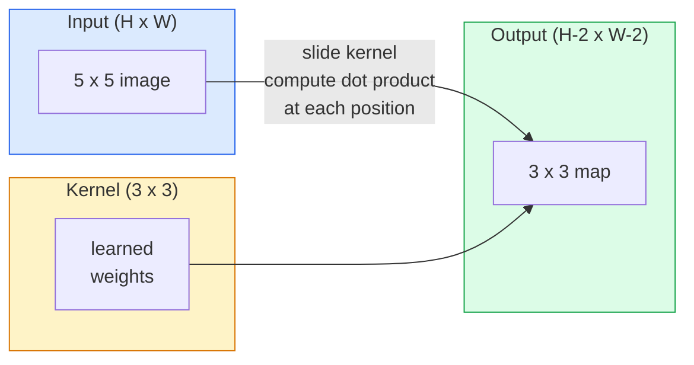
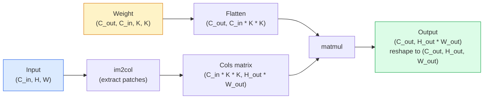

# शून्य से क्रॉल को पूरा करने से क्रॉल से क्रॉल

> एक घुमाव एक छोटी घनी परत है जिसे आप एक छवि पर स्लाइड करते हैं, प्रत्येक स्थान पर एक ही वजन साझा करते हैं।

> **【中文解读】**卷积本质上是"滑动的小型全连接层"使用同一组权重在图像的每个位置计算点积. यह हमें दो महत्वपूर्ण विशेषताएं देता हैः平移等变性: 输入移动,输出跟随移动) और参数共享 (共享) 同一特征检测器在整个图像上复用) CNN 之所以能统治计算机视觉十余年 (2012-2020),正是因为卷积是图像数据的正确归纳偏移.

**Type:** Build | **类型:** 动手
**Languages:** Python | **语言:** Python
**Prerequisites:** Phase 3 (Deep Learning Core), Phase 4 Lesson 01 (Image Fundamentals) | **前置知识:** Phase 3（深度学习核心），Phase 4 Lesson 01（图像基础）
**Time:** ~75 minutes | **时间:** ~75 分钟

## सीखने के लक्ष्य

- केवल NumPy का उपयोग करके खरोंच से 2D घुमाव को लागू करें, जिसमें नेस्टेड-लुप संस्करण और एक वेक्टरिज़ेड `im2col`संस्करण
  केवल NumPy से शून्य को पूरा करने के लिए 2D 卷积, सहित嵌套循环版 और विनिमयकारी im2col  संस्करण
- इनपुट आकार, कर्नेल आकार, पैडिंग और स्टेड के किसी भी संयोजन के लिए आउटपुट स्थानिक आकार की गणना करें, और `(H - K + 2P) / S + 1`सूत्र
  计算任意输入大小、核大小、填充和步幅组合下输出尺寸,理解公式 `(H - K + 2P) / S + 1`
- हाथ से डिजाइन किए गए कर्नेल (एज, ब्लर, शार्प, सोबेल) और समझाएं कि प्रत्येक सक्रियण पैटर्न क्यों उत्पन्न करता है
  ️️️️️️️️️️️️️️️️️️️️️️️️️️️️️️️️️️️️️️️️️️️️️️️️️️️️️️️️️️️️️️️️️️️️️️️️️️️️️️️️️️️️️️️️️️️️️️️️️️️️️️️️️️️️️️️️️️️️️️️️️️️️️️️️️️️️️️️️️️️️️️️️️️️️️️️️️️️️️️️️️️️️️️️️️️️️️️️️️️️️️️️️️️️️️️️️️️️️️️️️️️️️️️️️️️️️️️️️️️️️️️️️️️️️️️️️️️️️️️️️️️️️️️️️️️️️️️️️️️️️️️️️️️️️️️️️️️️️️️️️️️️️️️️️️️️️️️️️️️️️️️️️️️️️️️️️️️️️️️️️️️️️️️️️️️️️️️️️️️️️️️️️️️️️️️️️️️️️️️️️️️️️️️️️️️️️️️️️️️️️️️️️️️️️️️️️️️️️️️️️️️️️️️️️️️️️️️️️️️️️️️️️️️️️️️️️️️️️️️️️️️️️️️️️️️️️️️️️️️️️️️️️️️️️️️️️️️️️️️️️️️️️️️️️️️️️️️️️️️️️️️️️️️️️
- स्टैक को एक फीचर एक्सट्रैक्टर में घुमाएं और स्टैक की गहराई को रिसेप्टिव फील्ड के आकार से जोड़ें
  कई गुच्छाओं को विशेषता उत्कर्षक के रूप में ढेर करना, ढेर की गहराई और संवेदना के बीच संबंधों को समझना

> **【中文解读】**सीखने के लक्ष्य इस कक्षा को पूरा करने के बाद जो मूल क्षमताएं होनी चाहिए, उन्हें सूचीबद्ध करते हैं।


## समस्या  समस्या परिचय

224x224 आरजीबी छवि पर पूरी तरह से जुड़े परत को प्रति न्यूरॉन 224 * 224 * 3 = 150,528 इनपुट वजन की आवश्यकता होगी। 1,000 इकाइयों के साथ एक छिपी हुई परत पहले से ही 150 मिलियन पैरामीटर है  इससे पहले कि आप कुछ भी उपयोगी सीख लिया है। इससे भी बदतर, उस परत में यह धारणा नहीं है कि ऊपर बाएं और नीचे दाएं कुत्ते एक ही पैटर्न हैं। यह प्रत्येक पिक्सेल स्थिति को स्वतंत्र मानता है, जो छवियों के लिए बिल्कुल गलत हैः एक बिल्ली को तीन पिक्सेल से अनुवाद करने से नेटवर्क को अवधारणा को फिर से सीखने के लिए मजबूर नहीं होना चाहिए।

> 224x224 आरजीबी चित्र पर पूर्ण कनेक्शन परत प्रत्येक तंत्रिका को 224 * 224 * 3 = 150,528 इनपुट वज़न की आवश्यकता होती है। एक में केवल 1,000 इकाइयों की छिपी परत में पहले से ही 1.5 बिलियन पैरामीटर हैं जो आपको कुछ भी उपयोगी सीखने से पहले हैं। इससे भी बदतर, उस परत में पता नहीं है कि बाईं ओर कुत्ता और निचले दाएं कोने में कुत्ता एक ही मॉडल है। यह प्रत्येक छवि की स्थिति को स्वतंत्र मानता है, यह छवि के लिए सही है गलत हैः बिल्ली को तीन चित्रों को समतल करने के लिए मजबूर नहीं करना चाहिए।

> **【中文解读】**कुल कनेक्टिविटी लेयर प्रोसेसिंग इमेज में दो घातक समस्याएं हैंः 1) 参数 विस्फोट224x224  छवि के प्रत्येक तंत्रिका को 150,000 वजन की आवश्यकता होती है; 2) 没有平移不变性左上角猫和右下角猫被视为完全不同的模式──卷积通过参数共享(同一个核滑过全图) 和局部连接(只看邻域) 完美解决了这两个问题──

एक छवि मॉडल की आवश्यकता वाले दो गुण हैं **translation equivariance**(आउटपुट परिवर्तन होता है जब इनपुट परिवर्तन होता है) और **parameter sharing**घने परतों आपको कोई भी नहीं देता है. घुमाव आपको दोनों मुफ्त में देता है.

> 图像模型 की आवश्यकता के दो विशेषताएं हैं**平移等变性**(输入移动时输出也移动) तथा**参数共享**(सभी स्थानों पर एक ही विशेषता परीक्षण मशीन चलती है) 

कन्वॉल्यूशन का आविष्कार गहरे सीखने के लिए नहीं किया गया था। यह वही ऑपरेशन है जो जेपीईजी संपीड़न, फोटोशॉप में गौशियन ब्लर, औद्योगिक दृष्टि में किनारे का पता लगाने, और हर ऑडियो फ़िल्टर को संचालित करता है। 2012 से 2020 तक सीएनएन ने इमेजनेट पर हावी होने का कारण यह है कि कन्वॉल्यूशन डेटा के लिए सही पूर्व है जहां निकटतम मान संबंधित हैं और एक ही पैटर्न कहीं भी दिखाई दे सकता है।

> 卷积并非深度学习而发明── यह जेपीईजी संपीड़न, फोटोशॉप, औद्योगिक विजन एजिंग जांच और सभी ऑडियो波器 के समान संचालन को संचालित करता है──CNN 2012 से 2020 तक ImageNet के शासन का कारण यह है कि卷积 निकटतम मूल्य से संबंधित है और एक ही मॉडल किसी भी स्थान पर दिखाई देने वाले डेटा के लिए सही अग्रदूत है──

> **【拓展：CNN 的工业应用】**卷积并非深度学习发明的──JPEG 压缩、Photoshop 模糊、工业视觉边缘检测、音频波器都使用卷积──AI के क्षेत्र में,CNN ने स्वचालित ड्राइविंग में लक्ष्य परीक्षण (यॉलॉ) 、医学影像分析、人脸识别(FaceNet) आदि के मुख्य अनुप्रयोगों को संचालित किया है──

## अवधारणा का मूल अवधारणा

### एक नाभिक, स्लाइडिंग एक नाभिक, स्लाइडिंग

2D संभलने में एक छोटा वजन मैट्रिक्स होता है जिसे कर्नेल (या फ़िल्टर) कहा जाता है, इसे इनपुट पर स्लाइड करता है, और प्रत्येक स्थान पर तत्व-बुद्धिमान उत्पादों का योग गणना करता है। यह योग एक आउटपुट पिक्सेल बन जाता है।

> 2D 卷积取一个称为核或波器的小权重矩阵,在输入上滑动它,在每个位置计算每个元素乘积之和──这个和成为一个输出像素──



5x5 इनपुट पर एक ठोस 3x3 उदाहरण (कोई पैडिंग नहीं, चरण 1):

> 5x5 输入上具体 3x3示例(无填充,步幅 1):

```
Input X (5 x 5):                Kernel W (3 x 3):

  1  2  0  1  2                   1  0 -1
  0  1  3  1  0                   2  0 -2
  2  1  0  2  1                   1  0 -1
  1  0  2  1  3
  2  1  1  0  1

The kernel slides across every valid 3 x 3 window. Output Y is 3 x 3:

 Y[0,0] = sum( W * X[0:3, 0:3] )
 Y[0,1] = sum( W * X[0:3, 1:4] )
 Y[0,2] = sum( W * X[0:3, 2:5] )
 Y[1,0] = sum( W * X[1:4, 0:3] )
 ... and so on
```

यह एक सूत्र  **shared weights, locality, sliding window** यह पूरी बात है. बाकी सब कुछ लेखांकन है.

> 那一个公式**共享权重、局部性、滑动窗口**就是全部思想──其他都是簿记──

> **【中文解读】**卷积 के सारे विचार缩短为三点: साझा अधिकार重量(同一组参数在所有位置复用) 局部性(每次只看一个小窗口) 滑动窗口(次次遍历所有位置) ;;输出 Y का प्रत्येक तत्व है

### आउटपुट आकार सूत्र  आउटपुट आकार सूत्र

इनपुट स्थानिक आकार को देखते हुए `H`, कर्नेल आकार `K`, पैडिंग `P`, कदम `S`:

```
H_out = floor( (H - K + 2P) / S ) + 1
```

याद रखें, आप इसे वास्तुकला के अनुसार दर्जनों बार गणना करेंगे।

>  इस सूत्र को याद रखें. आप प्रत्येक संरचना में इसे कई बार गणना करेंगे.

> **【中文解读】**输出尺寸公式 `H_out = floor((H - K + 2P) / S) + 1`यह किसी भी सीएनएन वास्तुकला में सबसे सामान्य उपयोग की गणना है। "समान पैडिंग" इंगित करता है H_out = H(जब S=1 时), इस समय P = (K-1) /2/। यही कारण है कि 3x3 核 सबसे लोकप्रिय है। यह सबसे कम दुर्लभ परमाणु है, स्पष्ट केंद्र बिंदु है।

| Scenario | H | K | P | S | H_out | 中文说明 |
|----------|---|---|---|---|-------|--------|
| Valid conv, no padding | 32 | 3 | 0 | 1 | 30 | 无填充，尺寸缩小 |
| Same conv (preserves size) | 32 | 3 | 1 | 1 | 32 | 同填充，保持尺寸 |
| Downsample by 2 | 32 | 3 | 1 | 2 | 16 | 步幅2，下采样 |
| Pool 2x2 | 32 | 2 | 0 | 2 | 16 | 池化层 |
| Large receptive field | 32 | 7 | 3 | 2 | 16 | 大感受野 |

"समान पैडिंग" का अर्थ है P को चुनें ताकि H_out == H जब S == 1. विषम K के लिए, यह P = (K - 1) / 2 है। यही कारण है कि 3x3 कर्नेल पर प्रभुत्व है  वे सबसे छोटे विषम कर्नेल हैं जिनके पास अभी भी एक केंद्र है।

### पैडिंग  भरें

बिना पैडिंग के, प्रत्येक घुमाव सुविधा मानचित्र को छोटा करता है। उनमें से 20 को ढेर करें और आपकी 224x224 छवि 184x184 हो जाती है, जो सीमा पर गणना को बर्बाद करती है और शेष कनेक्शन को जटिल करती है जिन्हें मिलान के आकार की आवश्यकता होती है।

>  बिना भरने, प्रत्येक गुच्छा में घटता है                                                                                                                                                                                                                                                         

```
Zero padding (P = 1) on a 5 x 5 input:

  0  0  0  0  0  0  0
  0  1  2  0  1  2  0
  0  0  1  3  1  0  0
  0  2  1  0  2  1  0       Now the kernel can centre on pixel
  0  1  0  2  1  3  0       (0, 0) and still have three rows and
  0  2  1  1  0  1  0       three columns of values to multiply.
  0  0  0  0  0  0  0
```

अभ्यास में मिलने वाले मोडः `zero`(सबसे आम), `reflect`(कक्षा को दर्पण, जनरेटिव मॉडल में कठोर सीमाओं से बचता है), `replicate`(कप्पी किनारे), `circular`(चौकली के साथ लपेटकर, टोरोइडल समस्याओं में इस्तेमाल किया जाता है) ।

> 实践中遇到的模式:`zero`(सबसे आम)`reflect`(镜像边缘,避免生成模型中的硬边界)`replicate`(复制边缘)`circular`(अंगूर, प्रयोग में आया)

### कदम कदम चौड़ाई

स्टेड स्लाइड का स्टेप आकार है। `stride=1`यह डिफ़ॉल्ट है।`stride=2`अंतरिक्ष आयामों को आधा करता है और एक सीएनएन के अंदर एक अलग पूलिंग परत के बिना नमूना करने का एक क्लासिक तरीका है  हर आधुनिक वास्तुकला (रेसनेट, कॉन्वनेक्ट, मोबाइलनेट) कहीं अधिकतम पूल के बजाय स्टेडर्ड कन्वर्स का उपयोग करती है।

> 步幅是滑动的步长──`stride=1`                                                                                                                                                                                                                                                              `stride=2`अंतरिक्ष आयाम को आधा करने के लिए, सीएनएन के भीतर एकल इकाइयों का उपयोग नहीं किया जाता है।

```
Stride 1 on a 5 x 5 input, 3 x 3 kernel:

  starts: (0,0) (0,1) (0,2)        -> output row 0
          (1,0) (1,1) (1,2)        -> output row 1
          (2,0) (2,1) (2,2)        -> output row 2

  Output: 3 x 3

Stride 2 on the same input:

  starts: (0,0) (0,2)              -> output row 0
          (2,0) (2,2)              -> output row 1

  Output: 2 x 2
```

### कई इनपुट चैनल ।

वास्तविक छवियों में तीन चैनल होते हैं। आरजीबी इनपुट पर एक 3x3 घुमाव वास्तव में एक 3x3x3 मात्रा हैः प्रत्येक इनपुट चैनल पर एक 3x3 स्लाइस। प्रत्येक स्थानिक स्थिति पर, आप तीनों स्लाइसों पर गुणा और योग करते हैं और एक पूर्वाग्रह जोड़ते हैं।

> वास्तविक छवि में तीन मार्ग हैं। आरजीबी इनपुट पर 3x3 卷积 वास्तव में एक 3x3x3 體積 हैः प्रत्येक प्रवेश मार्ग में एक 3x3 切片── प्रत्येक स्थान पर, आप तीन से अधिक 切片 गुणा और मांग और,并加上偏置──

```
Input:   (C_in,  H,  W)        3 x 5 x 5
Kernel:  (C_in,  K,  K)        3 x 3 x 3 (one kernel)
Output:  (1,     H', W')       2D map

For a layer that produces C_out output channels, you stack C_out kernels:

Weight:  (C_out, C_in, K, K)   e.g. 64 x 3 x 3 x 3
Output:  (C_out, H', W')       64 x 3 x 3

Parameter count: C_out * C_in * K * K + C_out   (the + C_out is biases)
```

यह अंतिम पंक्ति है कि आप एक मॉडल की योजना बनाते समय गणना करेंगे। एक 64-चैनल 3x3 इनपुट पर एक 3-चैनल इनपुट पर एक conv है`64 * 3 * 3 * 3 + 64 = 1,792`पैरामीटर. सस्ते.

> अंतिम पंक्ति है कि आप योजना मॉडल में गणना करना है।`64 * 3 * 3 * 3 + 64 = 1,792`个参数──很便宜──

> **【中文解读】**多通道卷积的参数计算:参数 = C_out × C_in × K × K + C_out (偏置) ⋅ एक 3 输入通道、64 输出通道的 3x3 卷积只需要 1,792 个参数,远少于全连接层──

### Im2col ट्रिक

गुंजाइश लूप को पढ़ना आसान है लेकिन धीमा है। GPUs बड़े मैट्रिक्स गुणक चाहते हैं। ट्रिकः इनपुट की प्रत्येक रिसेप्टिव-फील्ड विंडो को एक बड़े मैट्रिक्स के एक कॉलम में समतल करें, नाभिक को एक पंक्ति में समतल करें, और पूरा घुमाव एक एकल मैटमुल बन जाता है।

> 嵌套循环易读但慢──GPU 需要大矩阵乘法──: प्रत्येक सम्मिलित क्षेत्र खिड़की के आकार में एक बड़ी矩阵 की एक पंक्ति, परमाणु प्रदर्शन एक पंक्ति में, संपूर्ण खंड में एक रक्कम乘法 में बदल जाएगा──



प्रत्येक उत्पादन conv कार्यान्वयन इस प्लस कैश-टाइलिंग ट्रिक्स (प्रत्यक्ष conv, Winograd, बड़े नाभिक के लिए FFT conv) के कुछ संस्करण है। im2col को समझें और आप मूल को समझते हैं।

> प्रत्येक उत्पादन स्तर के खंड के कार्यान्वयन में इस के कुछ प्रकार के परिवर्तन होते हैं, इसके अतिरिक्त काशविक्षण के विभाजन के लिए तकनीकें हैं।

> **【拓展：GPU 加速卷积】**सभी GPU ऊपर की卷积实现 (cuDNN) सभी im2col के चर हैं, इसके अतिरिक्त काशीज分块优化 (Cashing) (प्रत्यक्ष卷积、Winograd、FFT 卷积) ;; समझें im2col को समझें जैसे कि गहराई से सीखने के ढांचे में卷积加速 के मूल सिद्धांत को समझें。

### रिसेप्टिव फील्ड

एक एकल 3x3 कन्व 9 इनपुट पिक्सल को देखता है। दो 3x3 कन्व को स्टैक करें और दूसरी परत में एक न्यूरॉन 5x5 इनपुट पिक्सल को देखता है। तीन 3x3 कन्व 7x7 देते हैं। सामान्य तौर परः

> 单个3x3 卷积看 9 输入像素──堆叠两个3x3 卷积,第二层神经元看 5x5 输入像素──三个3x3 卷积给出7x7──一般而言:

```
RF after L stacked K x K convs (stride 1) = 1 + L * (K - 1)

With strides:   RF grows multiplicatively with stride along each layer.
```

"3x3 सभी तरह से नीचे" काम करता है (VGG, ResNet, ConvNeXt) का पूरा कारण यह है कि दो 3x3 convs एक 5x5 conv के समान इनपुट क्षेत्र को देखते हैं लेकिन कम मापदंडों और के बीच में एक अतिरिक्त गैर-रेखीयता के साथ।

> "पूरी 3x3" (VGG、ResNet、ConvNeXt) के माध्यम से जाने का पूरा कारण दो 3x3 卷积 देखने के लिए एक ही इनपुट क्षेत्र के साथ एक 5x5 卷积 है, लेकिन घटक कम है, मध्य में एक परत गैर-लाइनरी है।

> **【中文解读】**堆叠 L 层 K×K 卷积(步幅为1) का संवेदन野 = 1 + L × (K-1) ⋅ यही कारण है कि VGG、ResNet आदि नेटवर्क "पूर्ण उपयोग 3x3" हैः दो 3x3 卷积 के संवेदन野 एक 5x5 के बराबर है, लेकिन घटक कम है, बीच में एक गैर-लाइनर सक्रियण परत भी है。
```figure
convolution-kernel
```

## इसे बनाओ

## इसे बनाओ।

### चरण 1: एक सरणी को पैड करें।

सबसे छोटी आदिम से शुरू करेंः एक फ़ंक्शन जो H x W सरणी के चारों ओर शून्य के साथ पैड करता है।

> From smallest के मूलभाषा से शुरूः एक H x W 数组 के आसपास भरा हुआ शून्य का फ़ंक्शन──

```python
import numpy as np

def pad2d(x, p):
    if p == 0:
        return x
    h, w = x.shape[-2:]
    out = np.zeros(x.shape[:-2] + (h + 2 * p, w + 2 * p), dtype=x.dtype)
    out[..., p:p + h, p:p + w] = x
    return out

x = np.arange(9).reshape(3, 3)
print(x)
print()
print(pad2d(x, 1))
```

ट्रेलिंग-अक्षों की चाल `x.shape[:-2]`एक ही कार्य पर काम करता है`(H, W)`,`(C, H, W)`या `(N, C, H, W)`बिना संशोधन के।

> 尾轴技巧 `x.shape[:-2]`अर्थ एक ही कार्य को बिना संशोधन के प्रयोग किया जा सकता है`(H, W)``(C, H, W)`या `(N, C, H, W)`

### चरण 2: 2D घुमावदार लूप के साथ घोंसले हुए लूप के साथ 2D घुमावदार लूप को प्राप्त करें

संदर्भ कार्यान्वयन धीमा, लेकिन स्पष्ट है।`torch.nn.functional.conv2d`सिद्धांत रूप में नहीं।

>                                                                                                                                                                                                                                                               `torch.nn.functional.conv2d`करने के लिए कुछ है.

```python
def conv2d_naive(x, w, b=None, stride=1, padding=0):
    c_in, h, w_in = x.shape       # 输入：通道数、高、宽
    c_out, c_in_w, kh, kw = w.shape  # 权重：输出通道、输入通道、核高、核宽
    assert c_in == c_in_w          # 输入通道数必须匹配

    x_pad = pad2d(x, padding)     # 填充输入
    h_out = (h + 2 * padding - kh) // stride + 1  # 输出高度
    w_out = (w_in + 2 * padding - kw) // stride + 1  # 输出宽度

    out = np.zeros((c_out, h_out, w_out), dtype=np.float32)
    for oc in range(c_out):               # 遍历每个输出通道
        for i in range(h_out):            # 遍历输出高度
            for j in range(w_out):        # 遍历输出宽度
                hs = i * stride           # 输入中的起始行
                ws = j * stride           # 输入中的起始列
                patch = x_pad[:, hs:hs + kh, ws:ws + kw]  # 提取感受野窗口
                out[oc, i, j] = np.sum(patch * w[oc])      # 点积求和
        if b is not None:
            out[oc] += b[oc]              # 加偏置
    return out
```

चार घोंसले हुए लूप (आउटपुट चैनल, पंक्ति, स्तंभ, प्लस अप्रत्यक्ष योग C_in, kh, kw) यह जमीन सत्य है आप हर तेजी से कार्यान्वयन के खिलाफ जांच करेंगे।

> चार स्तरीय嵌套循环(输出通道、行、列,加上对C_in、kh、kw के隐式求和) 

### चरण 3: एक हाथ से डिजाइन किया गया नाभिक के साथ सत्यापित करें।

एक ऊर्ध्वाधर सोबेल कर्नेल बनाएं, इसे एक सिंथेटिक स्टेप इमेज पर लागू करें, और ऊर्ध्वाधर किनारे को चमकते हुए देखें।

>  एक ऊर्ध्वाधर सोबेल 核 का निर्माण, इसे सिंथेटिक सीढ़ियों की छवि के लिए लागू किया जाएगा,

```python
def synthetic_step_image():
    img = np.zeros((1, 16, 16), dtype=np.float32)
    img[:, :, 8:] = 1.0
    return img

sobel_x = np.array([
    [[-1, 0, 1],
     [-2, 0, 2],
     [-1, 0, 1]]
], dtype=np.float32)[None]

x = synthetic_step_image()
y = conv2d_naive(x, sobel_x, padding=1)
print(y[0].round(1))
```

कॉलम 7 पर बड़े सकारात्मक मानों की उम्मीद करें (बाएं से दाएं चमक में वृद्धि) और अन्य जगहों पर शून्य। यह एकल प्रिंट आपके दिमाग की जाँच है कि गणित सही है।

> 预期第7 列有大正值(左到右亮度增加),其他地方为零──那一次打印就是数学是否正确的完整性检查──

### चरण 4: im2col  im2col  रक्कम शुरू

इनपुट में प्रत्येक कर्नेल आकार की खिड़की को मैट्रिक्स के स्तंभ में परिवर्तित करें।`C_in=3, K=3`, प्रत्येक स्तंभ 27 संख्याओं है।

> प्रत्येक प्रविष्टि में परमाणु आकार की खिड़की को एक पंक्ति में परिवर्तित करेगा।`C_in=3, K=3`, प्रत्येक पंक्ति 27 个数

```python
def im2col(x, kh, kw, stride=1, padding=0):
    c_in, h, w = x.shape
    x_pad = pad2d(x, padding)
    h_out = (h + 2 * padding - kh) // stride + 1
    w_out = (w + 2 * padding - kw) // stride + 1

    cols = np.zeros((c_in * kh * kw, h_out * w_out), dtype=x.dtype)
    col = 0
    for i in range(h_out):
        for j in range(w_out):
            hs = i * stride
            ws = j * stride
            patch = x_pad[:, hs:hs + kh, ws:ws + kw]
            cols[:, col] = patch.reshape(-1)
            col += 1
    return cols, h_out, w_out
```

यह अभी भी एक पायथन लूप है, लेकिन अब भारी उठाने एक एकल वेक्टरिज़्ड मत्मुल होगा।

> यह अभी भी पायथन चक्र है, लेकिन अब कठिन काम एक आयामीकृत रक्छा गुणा होगा।

### चरण 5: Im2col + matmul के माध्यम से त्वरित conv के साथ Im2col + 矩阵乘法 त्वरित卷积

चार गुना लूप को एक मैट्रिक्स गुणन से प्रतिस्थापित करें।

> एक बार में चार चक्रों को एक साथ घुमाएं।

```python
def conv2d_im2col(x, w, b=None, stride=1, padding=0):
    c_out, c_in, kh, kw = w.shape
    cols, h_out, w_out = im2col(x, kh, kw, stride, padding)
    w_flat = w.reshape(c_out, -1)
    out = w_flat @ cols
    if b is not None:
        out += b[:, None]
    return out.reshape(c_out, h_out, w_out)
```

सटीकता जांचः दोनों कार्यान्वयनों को चलाएं और तुलना करें।

> सटीकता जांच: दो कार्यान्वयन और तुलना

```python
rng = np.random.default_rng(0)
x = rng.normal(0, 1, (3, 16, 16)).astype(np.float32)
w = rng.normal(0, 1, (8, 3, 3, 3)).astype(np.float32)
b = rng.normal(0, 1, (8,)).astype(np.float32)

y_naive = conv2d_naive(x, w, b, padding=1)
y_im2col = conv2d_im2col(x, w, b, padding=1)

print(f"max abs diff: {np.max(np.abs(y_naive - y_im2col)):.2e}")
```

`max abs diff`आसपास होना चाहिए `1e-5` अंतर फ्लोटिंग-पॉइंट संचय क्रम है, बग नहीं है।

> `max abs diff` चाहिए `1e-5`左右差异是浮点累加顺序造成的,不是 bug──

### चरण 6: हाथ से डिजाइन किए गए कर्नल का एक बैंक

पांच फिल्टर जो दिखाते हैं कि एक एकल कन्वि लेयर किसी भी प्रशिक्षण से पहले क्या व्यक्त कर सकता है।

> 五波器 किसी भी प्रशिक्षण से पहले क्या प्रदर्शन कर सकते हैं एक एकल गुच्छा स्तर प्रदर्शित किया

```python
KERNELS = {
    "identity": np.array([[0, 0, 0], [0, 1, 0], [0, 0, 0]], dtype=np.float32),
    "blur_3x3": np.ones((3, 3), dtype=np.float32) / 9.0,
    "sharpen": np.array([[0, -1, 0], [-1, 5, -1], [0, -1, 0]], dtype=np.float32),
    "sobel_x": np.array([[-1, 0, 1], [-2, 0, 2], [-1, 0, 1]], dtype=np.float32),
    "sobel_y": np.array([[-1, -2, -1], [0, 0, 0], [1, 2, 1]], dtype=np.float32),
}

def apply_kernel(img2d, kernel):
    x = img2d[None].astype(np.float32)
    w = kernel[None, None]
    return conv2d_im2col(x, w, padding=1)[0]
```

किसी भी ग्रे स्केल छवि पर लागू, धुंधला नरम होता है, तीक्ष्ण किनारों को ऊपर चिपकाता है, सोबेल-एक्स ऊर्ध्वाधर किनारों को उजागर करता है, सोबेल-वाई क्षैतिज किनारों को उजागर करता है। ये बिल्कुल ऐसे पैटर्न हैं जो एलेक्सनेट और वीजीजी में *पहले* प्रशिक्षित कन्व परत ने सीखना समाप्त किया क्योंकि एक अच्छे छवि मॉडल को किनारे और ब्लेब डिटेक्टरों की आवश्यकता होती है, चाहे कोई भी कार्य बाद में आता है।

>  किसी भी ग्रेड छवि,模糊柔化、化使边缘清晰、Sobel-x 点亮垂直边缘、Sobel-y 点亮水平边缘── ये बिल्कुल AlexNet 和 VGG में*पहली* प्रशिक्षण की卷积层 के अंततः सीखे गए मॉडल हैं क्योंकि एक अच्छा छवि मॉडल चाहे कोई भी बाद का काम हो, सभी को किनारे और स्पॉट परीक्षक की आवश्यकता होती है

> **【拓展：经典卷积核与 CNN 学习】**AlexNet、VGG आदि नेटवर्क की पहली गुच्छा परत की सीखी गई विशेषताएं लगभग हमेशा इन हस्तनिर्मित डिजाइनों के साथ सीमा जांचकर्ता और रंग स्पॉट जांचकर्ता के परमाणु ऊंचाई की समान हैं। यह बताता है कि चाहे कोई भी कार्य क्या हो, नीचे की दृश्य विशेषताएं सीमाएँ बनावट आम हैं

## इसका प्रयोग करें।

पायटॉर्च की `nn.Conv2d`ऑटोग्राड, CUDA कर्नल, और cuDNN अनुकूलन के साथ एक ही ऑपरेशन को समाहित करता है। आकार अर्थशास्त्र समान हैं।

> पिटॉर्च की `nn.Conv2d`स्वचालित रूप से सूक्ष्मण, CUDA 内核和 cuDNN 优化封装了相同操作──形形语义完全相同──

```python
import torch
import torch.nn as nn

conv = nn.Conv2d(in_channels=3, out_channels=64, kernel_size=3, stride=1, padding=1)
print(conv)
print(f"weight shape: {tuple(conv.weight.shape)}   # (C_out, C_in, K, K)")
print(f"bias shape:   {tuple(conv.bias.shape)}")
print(f"param count:  {sum(p.numel() for p in conv.parameters())}")

x = torch.randn(8, 3, 224, 224)
y = conv(x)
print(f"\ninput  shape: {tuple(x.shape)}")
print(f"output shape: {tuple(y.shape)}")
```

स्वैप `padding=1`के लिए`padding=0`और आउटपुट 222x222 तक गिर जाता है। स्विच `stride=1`के लिए`stride=2`और यह 112x112 तक गिर जाता है. वही सूत्र जो आपने ऊपर याद किया है.

> `padding=1`换成 `padding=0`, आउटपुट घटकर 222x222 `stride=1`换成 `stride=2`, यह 112x112 तक गिर गया है. जैसा कि आप ऊपर याद किया सूत्र है.


> **【拓展：工业部署中的视觉系统】**वास्तविक औद्योगिक तैनाती में, विज़ुअल मॉडल को देरी, मॉडल आकार, किनारे उपकरण अनुकूलन आदि की समस्या पर विचार करने की आवश्यकता होती है। टेन्सरआरटी, ओएनएनएक्स रनटाइम, ओपनवीनो एक सामान्य उपयोग में आने वाला सुझाव त्वरण उपकरण है।

## इसे भेजें  वितरण उत्पादन आउट

इस पाठ से उत्पन्न होता हैः

> 本课产出:

- `outputs/prompt-cnn-architect.md` एक संकेत जो इनपुट आकार, पैरामीटर बजट और लक्ष्य प्राप्त क्षेत्र को देखते हुए, एक स्टैक का डिजाइन करता है `Conv2d`प्रत्येक चरण में सही K/S/P के साथ परतें।
  Chinese Language Translation: दिए गए इनपुट आकार, पैरामीटर बजट और लक्ष्य अनुभूति क्षेत्र, डिजाइन प्रत्येक चरण के साथ सही K/S/P के `Conv2d`层堆的提示词──
- `outputs/skill-conv-shape-calculator.md` एक कौशल जो नेटवर्क स्पेसिफिकेशन परत के द्वारा परत से गुजरता है और प्रत्येक ब्लॉक के लिए आउटपुट आकार, रिसेप्टिव फ़ील्ड और पैरामीटर गिनती देता है।
  चीनी अनुवादः प्रत्येक खंड के आउटपुट आकार, संवेदना क्षेत्र और तत्व संख्याओं के कौशल को परत करना।

## अभ्यास विषय

> **【中文解读】**练习题按照易/中级/难度递进;;建议至少完成中级题,Hard级适合深入研究或面试准备;;


1. **(Easy | 简单)**128x128 ग्रे स्केल इनपुट और एक ढेर के लिए `[Conv3x3(s=1,p=1), Conv3x3(s=2,p=1), Conv3x3(s=1,p=1), Conv3x3(s=2,p=1)]`, प्रत्येक परत पर आउटपुट स्थानिक आकार और रिसेप्टिव क्षेत्र को हाथ से गणना करें। PyTorch के साथ सत्यापित करें`nn.Sequential`नकली वाहक।
   हाथ से गणना चार स्तरीय मात्रा के आउटपुट आकार और संवेदना क्षेत्र, PyTorch 验证

2. **(Medium | 中等)**विस्तार `conv2d_naive`और `conv2d_im2col`स्वीकार करने के लिए `groups`तर्क. दिखाओ कि.`groups=C_in=C_out`एक गहराई के अनुसार घुमाव को पुनः प्रस्तुत करता है और इसकी पैरामीटर गणना `C * K * K`इसके बजाय `C * C * K * K`. .
   扩展卷积函数支持组 参数,验证深度卷积的参数数从C×C×K×K 降至C×K×K──

3. **(Hard | 困难)** के पीछे की ओर पारित करने का कार्यान्वयन`conv2d_im2col`हाथ सेः आउटपुट की ग्रेडिएंट को देखते हुए, `x`और `w`. जाँच करें`torch.autograd.grad`ट्रिकः im2col की ग्रेडिएंट है`col2im`, और यह ओवरलैप खिड़कियों को जमा करना होगा.
   हाथ से प्राप्त करने के लिए इम् 2 कोल 卷积的反向传播, torch.autograd.grad 验证──关键: इम् 2 कोल का梯度是 col2im,需要累加重叠窗口──

## Key Terms  Key Terms  Key Terms  Key Terms  Key Terms  Key Terms  Key Terms  Key Terms  Key Terms  Key Terms  Key Terms  Key Terms  Key Terms  Key Terms  Key Terms  Key Terms  Key Terms  Key Terms  Key Terms  Key Terms  Key Terms  Key Terms  Key Terms  Key Terms  Key Terms  Key Terms  Key Terms  Key Terms  Key Terms  Key Terms  Key Terms  Key Terms  Key Terms  Key Terms  Key Terms  Key Terms  Key Terms  Key Terms  Key Terms  Key Terms  Key Terms  Key Terms  Key Terms  Key Terms  Key Terms  Key Terms  Key Terms  Key Terms  Key Terms  Key Terms  Key Terms  Key Terms  Key Terms  Key Terms  Key Terms  Key Terms  Key Terms  Key Terms  Key Terms  Key Terms  Key Terms  Key Terms  Key Terms  Key Terms  Key Terms  Key Terms  Key Terms  Key Terms  Key Terms  Key Terms  Key Terms  Key Terms  Key Terms  Key Terms  Key Terms  Key Terms  Key Terms  Key Terms  Key Terms  Key Terms  Key Terms  Key Terms  Key Terms  Key Terms  Key Terms  Key Terms  Key Terms  Key Terms  Key Terms  Key Terms  Key Terms  Key Terms  Key Terms  Key Terms  Key Terms  Key Terms  Key Terms  Key Terms  Key Terms  Key Terms  Key Terms  Key Terms  Key Terms  Key Terms  Key Terms  Key Terms  Key Terms  Key Terms  Key

| Term | What people say | What it actually means | 中文释义 |
|------|----------------|----------------------|---------|
| Convolution | "Sliding a filter" | A learnable dot product applied at every spatial location with shared weights; mathematically a cross-correlation, but everyone calls it convolution | 卷积：在所有空间位置用共享权重做可学习的点积 |
| Kernel / filter | "The feature detector" | A small weight tensor of shape (C_in, K, K) whose dot product with a window of input produces one output pixel | 核/滤波器：小型权重张量，与输入窗口做点积产生一个输出像素 |
| Stride | "How far you jump" | The step size between consecutive kernel placements; stride 2 halves each spatial dimension | 步幅：核每次滑动的步长，步幅2将空间维度减半 |
| Padding | "Zeros on the edges" | Extra values added around the input so the kernel can centre on border pixels; `same` padding keeps output size equal to input size | 填充：在输入边缘补零，使核能对齐边界像素 |
| Receptive field | "How much the neuron sees" | The patch of original input that a given output activation depends on, growing with depth and stride | 感受野：一个输出激活值所依赖的原始输入区域 |
| im2col | "The GEMM trick" | Rearranging every receptive window into columns so convolution becomes one big matrix multiply — the core of every fast conv kernel | im2col：将感受野窗口重排为列，使卷积变成矩阵乘法 |
| Depthwise conv | "One kernel per channel" | A conv with `groups == C_in`, computing each output channel from only its matching input channel; the backbone of MobileNet and ConvNeXt | 深度卷积：每通道独立卷积，MobileNet/ConvNeXt 的核心组件 |
| Translation equivariance | "Shift in, shift out" | Property that shifting the input by k pixels shifts the output by k pixels; comes for free with shared weights | 平移等变性：输入平移k像素，输出也平移k像素 |


> **【拓展：数据标注与质量】**视觉任务的效果高度依赖标签数据质量──标签工作室、CVAT是主流标签工具──在工业场景中,主动学习(Active Learning) ले标签成本 को कम कर सकता हैः मॉडल अनिश्चित नमूना अनुरोधों के लिए कृत्रिम标签, अनिश्चितता के नमूने स्वचालित标签──

## आगे पढ़ना 延伸閱讀

> **【中文解读】**延伸阅读 प्रदान करता है गहन सीखने के लिए उच्च गुणवत्ता वाले संसाधनों। ये लेख और पाठ्यक्रम इस क्षेत्र के लिए क्लासिक संदर्भ हैं, जो गहन समझ की आवश्यकता वाले पाठकों के लिए उपयुक्त हैं।


- [A guide to convolution arithmetic for deep learning (Dumoulin & Visin, 2016)](https://arxiv.org/abs/1603.07285) पैडिंग/स्टेड/डिलेशन के अंतिम आरेख जो प्रत्येक कोर्स चुपचाप कॉपी करता है
- [CS231n: Convolutional Neural Networks for Visual Recognition](https://cs231n.github.io/convolutional-networks/) मूल व्याख्या सहित कैनोनिक व्याख्यान नोट्स
- [The Annotated ConvNet (fast.ai)](https://nbviewer.org/github/fastai/fastbook/blob/master/13_convolutions.ipynb) एक नोटबुक जो मैनुअल कन्वॉल्यूशन से प्रशिक्षित अंक वर्गीकरण तक चलता है
- [Receptive Field Arithmetic for CNNs (Dang Ha The Hien)](https://distill.pub/2019/computing-receptive-fields/) रिसेप्टिव फ़ील्ड गणनाओं का पेपर-गुणवत्ता इंटरैक्टिव व्याख्याता
