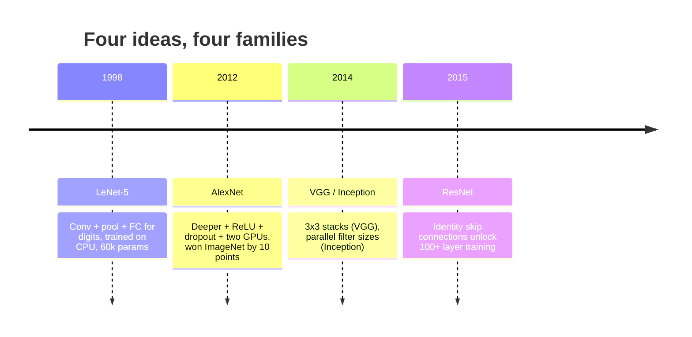
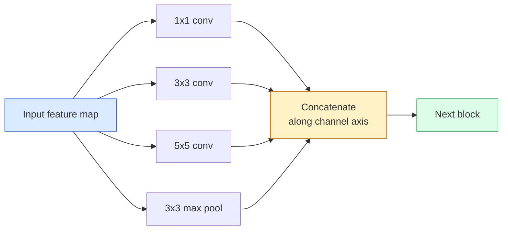
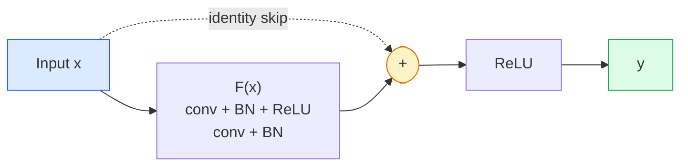

# सीएनएन  लेनेट से रेसनेट  सीएनएन वास्तुकला विकसित  लेनेट से रेसनेट तक

> पिछले तीस वर्षों के प्रत्येक प्रमुख सीएनएन एक ही गैर-रेखीयता है एक नए विचार के साथ नीचे नमूना नुस्खा।

> **【中文解读】**पिछले तीन दशकों के सभी महत्वपूर्ण सीएनएन सभी एक ही ढाँचा हैं (एक ही ढाँचा) (एक ही विचार को जोड़ना) (एक ही विचार को जोड़ना) (एक ही विचार को जोड़ना) (एक ही विचार को जोड़ना) (एक ही विचार को जोड़ना) (एक ही विचार को जोड़ना) (एक ही विचार को जोड़ना) (एक ही विचार को जोड़ना) (एक ही विचार को जोड़ना) (एक ही विचार को जोड़ना) (एक ही विचार को जोड़ना) (एक ही विचार को जोड़ना) (एक ही विचार को जोड़ना) (एक ही विचार को जोड़ना) (एक ही विचार को जोड़ना) (एक ही विचार को जोड़ना) (एक ही विचार को जोड़ना) (एक ही विचार को जोड़ना) (एक ही विचार को जोड़ना) (एक ही विचार को जोड़ना) (एक ही विचार को जोड़ना) (एक ही विचार को जोड़ना) (एक ही विचार को जोड़ना) (एक ही विचार को जोड़ना) (एक ही विचार को जोड़ना) (एक ही विचार को जोड़ना) (एक ही विचार को जोड़ना) (एक ही विचार को जोड़ना) (एक ही विचार को जोड़ना) (एक ही) (एक ही विचार को जोड़ना) (एक ही) (एक ही) (एक ही) (एक ही) (एक ही) (एक ही) (एक ही) (एक ही) (एक) (एक) (एक) (एक) (एक) (एक) (एक) (एक) (एक) (एक) (एक) (एक) (एक) (एक) (एक) (एक) (एक) (एक) (एक) (एक) (एक) (एक) (एक) (एक) (एक) (एक) (एक) (एक) (एक) (एक) (एक) (एक) (एक) (एक) (एक) (एक) (एक) (एक) (एक) (एक) (एक) (एक) (एक) (एक) (एक) (एक) (एक) (एक) (एक) (एक) (एक) (एक) (एक) (एक) (एक) (एक) (एक) (एक) (एक) (एक) (एक) (एक) (एक) (एक) (एक) (एक) (एक) (एक) (एक) (एक)

**Type:** Learn + Build | **类型:** 学习 + 动手
**Languages:** Python | **语言:** Python
**Prerequisites:** Phase 3 Lesson 11 (PyTorch), Phase 4 Lesson 01 (Image Fundamentals), Phase 4 Lesson 02 (Convolutions from Scratch) | **前置知识:** Phase 3 Lesson 11（PyTorch），Phase 4 Lesson 01（图像基础），Phase 4 Lesson 02（从零实现卷积）
**Time:** ~75 minutes | **时间:** ~75 分钟

## सीखने के लक्ष्य

- वास्तुशिल्प वंशावली को ट्रैक करें LeNet-5 -> AlexNet -> VGG -> Inception -> ResNet और प्रत्येक परिवार द्वारा योगदान दिया गया एकल नया विचार बताएं
- PyTorch में LeNet-5 को लागू करें, एक VGG शैली ब्लॉक, और एक ResNet BasicBlock, प्रत्येक 40 लाइनों से कम
- समझाएँ कि शेष कनेक्शन 1,000 परतों के नेटवर्क को अयोग्य से अत्याधुनिक क्यों बनाते हैं
- एक आधुनिक रीढ़ की हड्डी (ResNet-18, ResNet-50) पढ़ें और स्रोत को देखने से पहले इसके आउटपुट आकार, रिसेप्टिव क्षेत्र और पैरामीटर गिनती की भविष्यवाणी करें

> **【中文解读】**सीखने के लक्ष्य इस कक्षा को पूरा करने के बाद जो मूल क्षमताएं होनी चाहिए, उन्हें सूचीबद्ध करते हैं।


## समस्या  समस्या परिचय

2011 में, सर्वश्रेष्ठ इमेजनेट वर्गीकरणकर्ता ने शीर्ष-5 की सटीकता के बारे में 74% स्कोर किया। 2012 में एलेक्सनेट ने 85% अंक प्राप्त किए। 2015 में रेसनेट ने 96% अंक प्राप्त किए। कोई नया डेटा नहीं। कोई नई पीढी GPU नहीं। आर्किटेक्चर के विचारों से लाभ हुआ। एक काम कर रहे दृष्टि इंजीनियर को यह जानना होगा कि कौन सा विचार किस पेपर से आया क्योंकि 2026 में आप जो भी उत्पादन रीढ़ की हड्डी भेजते हैं वह उन ही टुकड़ों का एक पुनर्मिलन है  और क्योंकि विचार स्थानांतरित होते रहते हैंः समूहीकृत कन्वर्स सीएनएन से ट्रांसफार्मर तक गए, शेष कनेक्शन रेसनेट से अस्तित्व में हर एलएलएम तक गए, बैच सामान्यीकरण विसारण मॉडल में रहता है।

> 2011 में, सर्वश्रेष्ठ इमेजनेट वर्गीकरण टॉप-5  सटीकता दर लगभग 74% थी। 2012 में एलेक्सनेट  85% तक पहुंच गया। 2015 में रेसनेट  96% तक पहुंच गया। कोई नया डेटा नहीं है। कोई नया जीपीयू 代际 नहीं है। ये वृद्धि संरचनात्मक विचार से आती है। एक योग्य विजन इंजीनियर को यह जानना होगा कि कौन सा विचार किस लेख से आता है, क्योंकि आप 2026 में तैनात किए गए प्रत्येक उत्पादन मूल नेटवर्क में ये सभी एक ही टुकड़े के पुनःसंरचना हैं और ये विचार भी लगातार स्थानांतरित हो रहे हैंः विभाजन खंड CNN से ट्रांसफॉर्मर में स्थानांतरित हो गए, रिस्क कनेक्टिविटी रेसनेट  मौजूदा प्रत्येक LLM तक विस्तारित हो गया, थोक आवर्तन एक विस्तार मॉडल में जीवित है।

> **【中文解读】**2011-2015 के बीच ImageNet 准确率 74% से बढ़कर 96% हो गई है, यह नए डेटा या नए GPU पर निर्भर नहीं है, बल्कि वास्तुकला नवाचारों पर निर्भर है। ये नवाचार आज भी दोहराए जा रहे हैंः सीएनएन से ट्रांसफार्मर तक विभाजन, रेसनेट से शेष कनेक्शन सभी एलएलएम तक विस्तार, थोक को विस्तार मॉडल के लिए एकीकरण। प्रत्येक विचार की उत्पत्ति को समझना, आधुनिक दृश्य इंजीनियरों का मूल कार्य है।

इन नेटवर्क का अध्ययन करने के लिए आप एक आम गलती से भी बचते हैंः सबसे बड़े उपलब्ध मॉडल की तलाश करना जब एक LeNet आकार का नेटवर्क समस्या को हल करेगा। MNIST को ResNet की आवश्यकता नहीं है। प्रत्येक परिवार के स्केलिंग वक्र को जानना आपको बताता है कि उस पर कहां बैठना है।

> 按顺序学习这些网络还能让你避免一个常见错误: जब LeNet का बड़ा नेटवर्क समस्या को हल कर सकता है, तो सबसे बड़ा उपलब्ध मॉडल का उपयोग करें।

## अवधारणा का मूल अवधारणा

### चार विचार जो दृष्टि को बदलते हैं कंप्यूटर दृष्टि के चार विचार बदलते हैं



शास्त्रीय दृष्टि में कुछ भी इस तरह से महत्वपूर्ण नहीं था कि इन चार कूदने.

> 经典视觉 में इस चार बार से ज्यादा कुछ भी महत्वपूर्ण नहीं है

### LeNet-5 (1998)

यान लेकुन के अंक पहचानकर्ता. 60,000 मापदंडों. दो conv-pool ब्लॉक, दो पूरी तरह से जुड़े परतों, टैन सक्रियण. यह टेम्पलेट प्रत्येक सीएनएन विरासत में परिभाषितः

> यान लेकुन का डिजिटल पहचानकर्ता 60.000 पैरामीटर  दो वॉल्यूम-पिकिश्ड ब्लॉक, दो पूर्ण कनेक्शन परत, ताँ  सक्रिय  यह प्रत्येक सीएनएन शहर के विरासत के मॉड्यूल को परिभाषित करता हैः

```
input (1, 32, 32)
  conv 5x5 -> (6, 28, 28)
  avg pool 2x2 -> (6, 14, 14)
  conv 5x5 -> (16, 10, 10)
  avg pool 2x2 -> (16, 5, 5)
  flatten -> 400
  dense -> 120
  dense -> 84
  dense -> 10
```

आधुनिक दुनिया में जो कुछ भी सीएनएन कहते हैं  बारी बारी बारी घुमाव और एक छोटे से वर्गीकरण सिर को फ़ीड करने के लिए नीचे नमूना  अधिक परतों, बड़े चैनलों और बेहतर सक्रियण के साथ लेनेट है।

> आधुनिक दुनिया में सीएनएन के सभी प्रकार के आदान-प्रदान का एक छोटे से वर्गीकरण के रूप में जाना जाता है।

> **【中文解读】**LeNet-5 ने सभी सीएनएन के बुनियादी मॉड्यूल को परिभाषित कियाः卷积 → 池化 → 卷积 → 池化 → 全连接── केवल 60,000 पैरामीटर, लेकिन गहन सीखने के विज़ुअल सिस्टम की बुनियादी संरचना को स्थापित किया।

### AlexNet (2012) गहन सीखने का उछाल बिंदु

तीन बदलावों ने इमेजनेट को एक साथ तोड़ दियाः

> तीन बदलावों ने इमेजनेट को तोड़ दिया:

1. **ReLU**टैन के बजाय ग्रेडिएंट गायब हो जाते हैं। प्रशिक्षण छह गुना तेज होता है।
2. **Dropout**नियमितता एक परत बन जाती है, एक चाल नहीं।
3. **Depth and width**. पांच संकुल परतों, तीन घने परतों, 60M मापदंडों, दो GPU पर प्रशिक्षित मॉडल के पार विभाजित उन पर.

पेपर के चित्र 2 में अभी भी GPU को दो समानांतर धाराओं के रूप में विभाजित दिखाया गया है। यह समानांतर हार्डवेयर के समाधान था, वास्तुकला की जानकारी नहीं है  लेकिन उपरोक्त तीन विचार अभी भी आपके द्वारा उपयोग किए जाने वाले प्रत्येक मॉडल में हैं।

> 论文 के चित्र 2  अभी भी दिखाता है कि GPU को दो समवर्ती प्रवाहों में विभाजित किया गया है।

> **【拓展：AlexNet 的遗产】**AlexNet  के तीन नवाचारों की शुरूआत आज तक मौजूद हैंः 1) ReLU  सक्रिय फ़ंक्शन ने तराजू गायब होने की समस्या को हल किया; 2) ड्रॉपआउट और सुधार से बचने के लिए; 3) गहराई + चौड़ाई के स्केलआउट विचारों को।

### VGG (2014) ∙ 3x3 卷积的极致堆积

VGG ने पूछाः क्या होता है अगर आप केवल 3x3 घुमाव का उपयोग करते हैं और आप गहराई में जाते हैं?

> VGG 问道: यदि आप केवल 3x3 卷积 और गहराई का उपयोग करते हैं, तो क्या होगा?

```
stack:   conv 3x3 -> conv 3x3 -> pool 2x2
repeat:  16 or 19 conv layers
```

दो 3x3 कन्व एक 5x5 कन्व के समान 5x5 इनपुट क्षेत्र को देखते हैं लेकिन कम पैरामीटर (2 * 9 * C ^ 2 = 18C ^ 2 बनाम 25 * C ^ 2) और बीच में एक अतिरिक्त ReLU के साथ। VGG इस अवलोकन को एक संपूर्ण वास्तुकला में बदल दिया। सरलता  एक ब्लॉक प्रकार, दोहराया  इसे बाद में आने वाले सभी चीजों के लिए संदर्भ बिंदु बना दिया।

>  दो 3x3 卷积 देखने के 5x5 输入区域 के साथ एक 5x5 卷积 समान है, लेकिन तत्व कम हैं(2*9*C^2 = 18C^2 बनाम 25*C^2), बीच में अतिरिक्त ReLU──VGG इस अवलोकन को एक पूर्ण संरचना में बदल देगा──简洁性 एक ब्लॉक प्रकार, पुनः उपयोग जिससे यह सब कुछ के संदर्भ बिंदु बन जाता है──

लागत: 138 मिलियन पैरामीटर, प्रशिक्षण में धीमा, अनुमान लगाने में महंगा।

> 代价1.38 अरब参数, प्रशिक्षण धीमा, सिफारिश महंगी

### शुरुआत (2014, उसी वर्ष)

गूगल का जवाब था "मुझे किस नाभिक का आकार इस्तेमाल करना चाहिए? " सभी समानान्तर रूप से।

> गूगल के जवाब में "क्या उपयोग करना चाहिए?



प्रत्येक शाखा चैनल मिश्रण के लिए 1x1 , स्थानीय बनावट के लिए 3x3 , बड़े पैटर्न के लिए 5x5 , शिफ्ट-इनवेरिएंट सुविधाओं के लिए एकीकरण और कॉनकेट को अगली परत को चुनने देता है जो भी शाखा उपयोगी है। शुरुआत v1 ने प्रत्येक शाखा के अंदर 1x1 घुमाव को एक बोतल के गले के रूप में इस्तेमाल किया पैरामीटर गिनती को समझदार रखने के लिए।

> प्रत्येक शाखा में विभिन्न पहलुओं के लिए 1x1 का उपयोग किया जाता है, जो कि मार्ग मिश्रण, 3x3 के लिए स्थानीय बनावट, 5x5 के लिए एक बड़ा मॉडल, इकाइकरण के लिए उपयोग किया जाता है, जो कि समतल, अपरिवर्तित विशेषताएं हैं।

### गिरावट की समस्या  退化问题:越深反反越差

2015 तक, VGG-19 काम किया और VGG-32 नहीं किया। गहराई मदद करने के लिए था, लेकिन ~ 20 परतों के बाद प्रशिक्षण और परीक्षण हानि दोनों बदतर हो गया। यह ओवरफिटिंग नहीं है। यह अनुकूलक उपयोगी वजन खोजने में विफल रहता है क्योंकि प्रत्येक परत के माध्यम से ग्रेडिएंट गुणात्मक रूप से सिकुड़ते हैं।

> 2015 तक, वीजीजी-19 能工作但VGG-32不行──深度应该有助,但超过20层后训练和测试损失都变得更差──那不是过拟──那就是优化器因为梯度在每层乘法缩小而无法找到有用权重──

```
Plain deep network:
  y = f_L( f_{L-1}( ... f_1(x) ... ) )

Gradient wrt early layer:
  dL/dW_1 = dL/dy * df_L/df_{L-1} * ... * df_2/df_1 * df_1/dW_1

Each multiplicative term has magnitude roughly (weight magnitude) * (activation gain).
Stack 100 of them with gains < 1 and the gradient is effectively zero.
```

VGG 19 परतों पर काम करता था क्योंकि बैच मानक (एक साथ प्रकाशित) ने सक्रियण को अच्छी तरह से स्केल किया था। लेकिन बैच मानक भी 30 से अधिक परतों से अधिक गहराई को नहीं बचा सकता था।

> VGG ने 19 स्तरों पर काम किया क्योंकि वस्तुओं की एकीकरण (उत्पादन) ने सक्रियता में अच्छा संकुचन बनाए रखा है।

### ResNet (2015)  शेष कड़ी  गहन सीखने का सफलता

वह, झांग, रेन, सन ने एक बदलाव प्रस्तावित किया जो सब कुछ ठीक करता हैः

> उन्होंने एक सुधार प्रस्ताव रखा।

```
standard block:   y = F(x)
residual block:   y = F(x) + x
```

`+ x`मतलब कि परत हमेशा ड्राइविंग के दौरान कुछ भी नहीं करने का विकल्प चुन सकता है `F(x)`शून्य से शून्य तक। एक 1,000 परत ResNet अब एक परत नेटवर्क के रूप में ज्यादा से ज्यादा बुरा है, क्योंकि प्रत्येक अतिरिक्त ब्लॉक में एक तुच्छ भागने का ढक्कन है। उस गारंटी के साथ, अनुकूलक हर ब्लॉक * थोड़ा * उपयोगी  और थोड़ा उपयोगी बनाने के लिए तैयार है, 100 बार ढेर, अत्याधुनिक है।

> `+ x`मतलब इस स्तर को हमेशा से ही पारित किया जा सकता है।`F(x)`倾向于零来选择什么都不做―― एक 1000 परत के रेसनेट अब सबसे अधिक 1 परत के नेटवर्क के समान ही खराब है, क्योंकि प्रत्येक अतिरिक्त ब्लॉक का एक सरल पलायन मार्ग है―― इस गारंटी के साथ, अनुकूलक प्रत्येक ब्लॉक को थोड़ा* उपयोगी बनाने के लिए तैयार है, थोड़ा* उपयोगी, 100 बार ढेर, यह सबसे उन्नत है――



ब्लॉक के दो संस्करण हर जगह दिखाई देते हैंः

> 两种块变体无处不在:

- **BasicBlock**(ResNet-18, ResNet-34): दो 3x3 convs, दोनों के चारों ओर छोड़ दें।
  中文翻译:基本块两个3x3卷积,跨两者的跳跃──
- **Bottleneck**(ResNet-50, -101, -152): 1x1 नीचे, 3x3 मध्य, 1x1 ऊपर, ट्रिओ के चारों ओर छोड़ दें। सस्ता जब चैनल की संख्या अधिक है।
  中文翻译:瓶块1x1 降维、3x3 中间、1x1 升维,跨三者跳跃──通道数高时更便宜──

जब स्किप को डाउनसैम्पल (स्ट्रेड=2) पार करना होता है, तो आकृति से मेल खाने के लिए पहचान पथ को 1x1 स्ट्रेड=2 conv से बदल दिया जाता है।

> जब कूदने को पार पार करने की आवश्यकता होती है (stride=2) तो,恒等 मार्ग को 1x1stride=2 के वॉल्यूम के अनुरूप आकार में बदल दिया जाता है।

### क्यों अवशेष दृष्टि से परे महत्व है

यह विचार वास्तव में छवि वर्गीकरण के बारे में नहीं था। यह "अपनी उंगलियों को पार करने और उम्मीद करने के लिए कि ग्रेडिएंट जीवित रहे" से गहरे नेटवर्क को एक विश्वसनीय, स्केलेबल इंजीनियरिंग उपकरण में बदलने के बारे में था। अगले चरण के बारे में आप जो भी ट्रांसफार्मर पढ़ेंगे, उसके प्रत्येक ब्लॉक में बिल्कुल वही स्किप कनेक्शन है। रेसनेट के बिना, कोई जीपीटी नहीं है।

> यह विचार वास्तव में छवि वर्गीकरण के बारे में नहीं है। यह गहरी नेटवर्क को "प्रार्थना तराजू जीवित रह सकती है" से विश्वसनीय, विस्तार योग्य इंजीनियरिंग उपकरण में बदलने के बारे में है।

> **【拓展：残差连接与 Transformer】**शेष अंतर कनेक्शन ने न केवल दृश्य को बदल दिया, यह गहरी नेटवर्क को " प्रार्थना स्तर पर जीवित रहने में सक्षम" से विश्वसनीय इंजीनियरिंग उपकरण में बदल दिया। प्रत्येक ट्रांसफार्मर ब्लॉक (GPT,BERT,Claude के पीछे के मॉडल सहित) पूरी तरह से एक ही कूद कनेक्शन का उपयोग करता है।`y = F(x) + x`यह गहराई से सीखने की सबसे महत्वपूर्ण प्रक्रियाओं में से एक है।

> **【拓展：工业部署中的视觉系统】**वास्तविक औद्योगिक तैनाती में, विज़ुअल मॉडल को देरी, मॉडल आकार, किनारे उपकरण अनुकूलन आदि की समस्या पर विचार करने की आवश्यकता होती है। टेन्सरआरटी, ओएनएनएक्स रनटाइम, ओपनवीनो एक सामान्य उपयोग में आने वाला सुझाव त्वरण उपकरण है।

```figure
pooling
```

## इसे बनाओ

## इसे बनाओ।

### चरण 1: LeNet-5 को लागू करें।

एक न्यूनतम, वफादार LeNet. Tanh सक्रियण, औसत pooling. आधुनिकता के लिए एकमात्र अनुदान है कि हम उपयोग करते हैं.`nn.CrossEntropyLoss`मूल गौसी कनेक्शन के बजाय नीचे धारा.

> एक न्यूनतम  वफादार LeNet  सक्रिय, औसत                                                                                                                                                                                                                                                        `nn.CrossEntropyLoss`और मूल उच्च कनेक्शन नहीं है।

```python
import torch
import torch.nn as nn
import torch.nn.functional as F

class LeNet5(nn.Module):
    def __init__(self, num_classes=10):
        super().__init__()
        self.conv1 = nn.Conv2d(1, 6, kernel_size=5)
        self.conv2 = nn.Conv2d(6, 16, kernel_size=5)
        self.pool = nn.AvgPool2d(2)
        self.fc1 = nn.Linear(16 * 5 * 5, 120)
        self.fc2 = nn.Linear(120, 84)
        self.fc3 = nn.Linear(84, num_classes)

    def forward(self, x):
        x = self.pool(torch.tanh(self.conv1(x)))
        x = self.pool(torch.tanh(self.conv2(x)))
        x = torch.flatten(x, 1)
        x = torch.tanh(self.fc1(x))
        x = torch.tanh(self.fc2(x))
        return self.fc3(x)

net = LeNet5()
x = torch.randn(1, 1, 32, 32)
print(f"output: {net(x).shape}")
print(f"params: {sum(p.numel() for p in net.parameters()):,}")
```

अपेक्षित उत्पादन: `output: torch.Size([1, 10])`,`params: 61,706`यह पूरी संख्या वर्गीकरण है जो आधुनिक दृष्टि की शुरुआत की।

> 预期输出:`output: torch.Size([1, 10])``params: 61,706` यह आधुनिक विज़ुअरी के पूर्ण डिजिटल वर्गीकरण का उद्घाटन है

### चरण 2: एक VGG ब्लॉक को लागू करें VGG ब्लॉक

एक पुनः प्रयोज्य ब्लॉकः दो 3x3 कन्वर्स, रिलू, बैच मानक, अधिकतम पूल।

> एक पुनः प्रयोज्य ब्लॉक: दो 3x3 卷积、ReLU、批量归归归归归归归归归最大池归归──

```python
class VGGBlock(nn.Module):
    def __init__(self, in_c, out_c):
        super().__init__()
        self.conv1 = nn.Conv2d(in_c, out_c, kernel_size=3, padding=1)
        self.bn1 = nn.BatchNorm2d(out_c)
        self.conv2 = nn.Conv2d(out_c, out_c, kernel_size=3, padding=1)
        self.bn2 = nn.BatchNorm2d(out_c)
        self.pool = nn.MaxPool2d(2)

    def forward(self, x):
        x = F.relu(self.bn1(self.conv1(x)))
        x = F.relu(self.bn2(self.conv2(x)))
        return self.pool(x)

class MiniVGG(nn.Module):
    def __init__(self, num_classes=10):
        super().__init__()
        self.stack = nn.Sequential(
            VGGBlock(3, 32),
            VGGBlock(32, 64),
            VGGBlock(64, 128),
        )
        self.head = nn.Sequential(
            nn.AdaptiveAvgPool2d(1),
            nn.Flatten(),
            nn.Linear(128, num_classes),
        )

    def forward(self, x):
        return self.head(self.stack(x))

net = MiniVGG()
x = torch.randn(1, 3, 32, 32)
print(f"output: {net(x).shape}")
print(f"params: {sum(p.numel() for p in net.parameters()):,}")
```

CIFAR आकार के इनपुट पर तीन VGG ब्लॉक, एक अनुकूलन पूल, एक रैखिक परत. ~ 290k पैरामीटर. CIFAR-10 के लिए पर्याप्त है।

> CIFAR आकार में इनपुट पर तीन VGG 块, स्व अनुकूलन池化, एक लाइनर परत, लगभग 290,000 पैरामीटर, CIFAR-10 के लिए

### चरण 3: एक ResNet BasicBlock ResNet बुनियादी ब्लॉक को लागू करें

रेसनेट-18 और रेसनेट-34 की मूल संरचना।

> रेसनेट-18 और रेसनेट-34 के मुख्य निर्माण खंडों में से एक

```python
class BasicBlock(nn.Module):
    def __init__(self, in_c, out_c, stride=1):
        super().__init__()
        self.conv1 = nn.Conv2d(in_c, out_c, kernel_size=3, stride=stride, padding=1, bias=False)
        self.bn1 = nn.BatchNorm2d(out_c)
        self.conv2 = nn.Conv2d(out_c, out_c, kernel_size=3, stride=1, padding=1, bias=False)
        self.bn2 = nn.BatchNorm2d(out_c)
        if stride != 1 or in_c != out_c:
            self.shortcut = nn.Sequential(
                nn.Conv2d(in_c, out_c, kernel_size=1, stride=stride, bias=False),
                nn.BatchNorm2d(out_c),
            )
        else:
            self.shortcut = nn.Identity()

    def forward(self, x):
        out = F.relu(self.bn1(self.conv1(x)))
        out = self.bn2(self.conv2(out))
        out = out + self.shortcut(x)
        return F.relu(out)
```

`bias=False`संकुल परतों पर बैच-नॉर्म सम्मेलन है  बीएन के बीटा पैरामीटर पहले से ही पूर्वाग्रह को संभालता है, इसलिए संकुल पूर्वाग्रह को भी ले जाना एक अपशिष्ट है।`shortcut`केवल जब कदम या चैनल की संख्या बदलती है तो वास्तविक कन्वे की आवश्यकता होती है; अन्यथा यह एक नो-ऑप पहचान है।

> 卷积层上 `bias=False`यह कि वस्तुगत एकीकरण के लिए बीटा पैरामीटर पहले ही विकृति से निपट चुके हैं, इसलिए एक ही समय में वॉल्यूम विकृति को बर्बाद किया गया है।`shortcut`केवल चरणों या मार्गों के परिवर्तन के दौरान वास्तविक मात्रा की आवश्यकता होती है; अन्यथा यह निष्क्रिय निरंतरता है।

### चरण 4: एक छोटा ResNet बनायें

CIFAR आकार के इनपुट के लिए एक काम कर ResNet प्राप्त करने के लिए BasicBlocks के चार समूहों को ढेर करें.

> 堆叠四组 BasicBlock 以获得适用于 CIFAR आकार输入工作ResNet──

```python
class TinyResNet(nn.Module):
    def __init__(self, num_classes=10):
        super().__init__()
        self.stem = nn.Sequential(
            nn.Conv2d(3, 32, kernel_size=3, stride=1, padding=1, bias=False),
            nn.BatchNorm2d(32),
            nn.ReLU(inplace=True),
        )
        self.layer1 = self._make_group(32, 32, num_blocks=2, stride=1)
        self.layer2 = self._make_group(32, 64, num_blocks=2, stride=2)
        self.layer3 = self._make_group(64, 128, num_blocks=2, stride=2)
        self.layer4 = self._make_group(128, 256, num_blocks=2, stride=2)
        self.head = nn.Sequential(
            nn.AdaptiveAvgPool2d(1),
            nn.Flatten(),
            nn.Linear(256, num_classes),
        )

    def _make_group(self, in_c, out_c, num_blocks, stride):
        blocks = [BasicBlock(in_c, out_c, stride=stride)]
        for _ in range(num_blocks - 1):
            blocks.append(BasicBlock(out_c, out_c, stride=1))
        return nn.Sequential(*blocks)

    def forward(self, x):
        x = self.stem(x)
        x = self.layer1(x)
        x = self.layer2(x)
        x = self.layer3(x)
        x = self.layer4(x)
        return self.head(x)

net = TinyResNet()
x = torch.randn(1, 3, 32, 32)
print(f"output: {net(x).shape}")
print(f"params: {sum(p.numel() for p in net.parameters()):,}")
```

चार समूहों में से प्रत्येक दो ब्लॉक। समूहों की शुरुआत में चरण 2, 3, 4. चैनल गिनती प्रत्येक डाउनसैम्पल पर दोगुनी होती है। लगभग 2.8M पैरामीटर। यह मानक नुस्खा है जो ResNet-152 तक साफ पैमाने पर है।

> चार समूह प्रति समूह दो ब्लॉक हैं। दूसरा, तीन, चार समूह 2 से शुरू होता है।

### चरण 5: पैरामीटर-टू-फ़ेचर दक्षता की तुलना करें

तीनों नेटवर्क के माध्यम से एक ही इनपुट चलाएं और पैरामीटर गिनती की तुलना करें।

> सभी तीन नेटवर्क के माध्यम से समान इनपुट होगा और तुलनात्मक संख्याएँ करेगा।

```python
def summary(name, net, x):
    y = net(x)
    params = sum(p.numel() for p in net.parameters())
    print(f"{name:12s}  input {tuple(x.shape)} -> output {tuple(y.shape)}  params {params:>10,}")

x = torch.randn(1, 3, 32, 32)
summary("LeNet5",     LeNet5(),       torch.randn(1, 1, 32, 32))
summary("MiniVGG",    MiniVGG(),      x)
summary("TinyResNet", TinyResNet(),   x)
```

तीन मॉडल, तीन युग, पैरामीटर गिनती में तीन आदेशों के परिमाण के लिए CIFAR-10 सटीकता के लिए, आपको लगभग की जरूरत हैः LeNet 60%, MiniVGG 89%, TinyResNet 93% प्रशिक्षण के कुछ युगों के बाद।

> तीन मॉडल, तीन समय, घटक संख्या तीन संख्या वर्गों के लिए CIFAR-10 准确率, प्रशिक्षण कुछ युगों 后大致需要:LeNet 60%、MiniVGG 89%、TinyResNet 93%──


## इसका प्रयोग करें।

`torchvision.models`कॉल हस्ताक्षर परिवारों में समान है, जो बिल्कुल रीढ़ की हड्डी अमूर्तता का बिंदु है।

> `torchvision.models` आपको उपरोक्त सभी मॉडल का पूर्व प्रशिक्षण संस्करण  सभी परिवारों में हस्ताक्षर का उपयोग पूरी तरह से समान है, यही ओरेकेन नेटवर्क एस्ट्रॉजेशन का अर्थ है

```python
from torchvision.models import resnet18, ResNet18_Weights, vgg16, VGG16_Weights

r18 = resnet18(weights=ResNet18_Weights.IMAGENET1K_V1)
r18.eval()

print(f"ResNet-18 params: {sum(p.numel() for p in r18.parameters()):,}")
print(r18.layer1[0])
print()

v16 = vgg16(weights=VGG16_Weights.IMAGENET1K_V1)
v16.eval()
print(f"VGG-16   params: {sum(p.numel() for p in v16.parameters()):,}")
```

ResNet-18 में 11.7M पैरामीटर हैं। VGG-16 में 138M है। इसी तरह की ImageNet शीर्ष-1 सटीकता (69.8% बनाम 71.6%) । शेष कनेक्शन आपको 12x पैरामीटर दक्षता जीतने के लिए खरीदते हैं। यही कारण है कि ResNet संस्करणों ने 2016 से 2021 में ViT आने तक हावी रहे और अभी भी वास्तविक दुनिया में तैनाती पर हावी हैं जहां गणना प्रतिबंध है।

> **【中文解读】**ResNet-18(1170 मिलियन सेमीमीटर) बनाम VGG-16(1.38 अरब सेमीमीटर),ImageNet 准确率相近, लेकिन सेमीमीटर दक्षता 12 गुना भिन्न है।

स्थानांतरण सीखने के लिए, नुस्खा हमेशा एक ही हैः लोड पूर्व प्रशिक्षित, रीढ़ को फ्रीज, वर्गीकरण सिर की जगह।

>                                                                                                                                                                                                                                                               

```python
for p in r18.parameters():
    p.requires_grad = False
r18.fc = nn.Linear(r18.fc.in_features, 10)
```

अब आपके पास 10 वर्ग CIFAR वर्गीकरण है जो छविनेट द्वारा भुगतान किए गए प्रतिनिधित्वों को विरासत में देता है।

> तीन पंक्ति कोड──आपके पास अब एक 10 वर्ग CIFAR वर्गीकरण है, यह ImageNet  भुगतान प्राप्त करने का प्रतिनिधित्व विरासत में मिला है──


> **【拓展：数据标注与质量】**视觉任务的效果高度依赖标签数据质量──标签工作室、CVAT是主流标签工具──在工业场景中,主动学习(Active Learning) ले标签成本 को कम कर सकता हैः मॉडल अनिश्चित नमूना अनुरोधों के लिए कृत्रिम标签, अनिश्चितता के नमूने स्वचालित标签──

## इसे भेजें  वितरण उत्पादन आउट

इस पाठ से उत्पन्न होता हैः

> 本课产出:

- `outputs/prompt-backbone-selector.md` एक संकेत जो सही सीएनएन परिवार (लेनेट/वीजीजी/रेसनेट/मोबाइलनेट/कन्विनएक्सटी) को चुनता है।
  चश्मा अनुवादः给定任务、数据集大小和计算预算,选择正确 CNN 家族的提示词──
- `outputs/skill-residual-block-reviewer.md` एक कौशल जो PyTorch मॉड्यूल को पढ़ता है और स्किप-कनेक्शन त्रुटियों को चिह्नित करता है (चरण परिवर्तन पर शॉर्टकट गायब, शॉर्टकट सक्रियण क्रम, जोड़ के सापेक्ष BN प्लेसमेंट) ।
  中文翻译:读取 PyTorch 模块并标记跳跃连接错误的技能──

## अभ्यास विषय

> **【中文解读】**练习题按照易/中级/难度递进;;建议至少完成中级题,Hard级适合深入研究或面试准备;;


1. **(Easy | 简单)** के लिए हाथ से मापदंडों की गणना करें`TinyResNet`एक परत के बाद एक। तुलना करें `sum(p.numel() for p in net.parameters())`. पैरामीटर बजट का अधिकांश भाग  convs, BN या वर्गीकरण प्रमुख कहाँ जाता है?
   ️️️️️️️️️️️️️️️️️️️️️️️️️️️️️️️️️️️️️️️️️️️️️️️️️️️️️️️️️️️️️️️️️️️️️️️️️️️️️️️️️️️️️️️️️️️️️️️️️️️️️️️️️️️️️️️️️️️️️️️️️️️️️️️️️️️️️️️️️️️️️️️️️️️️️️️️️️️️️️️️️️️️️️️️️️️️️️️️️️️️️️️️️️️️️️️️️️️️️️️️️️️️️️️️️️️️️️️️️️️️️️️️️️️️️️️️️️️️️️️️️️️️️️️️️️️️️️️️️️️️️️️️️️️️️️️️️️️️️️️️️️️️️️️️️️️️️️️️️️️️️️️️️️️️️️️️️️️️️️️️️️️️️️️️️️️️️️️️️️️️️️️️️️️️️️️️️️️️️️️️️️️️️️️️️️️️️️️️️️️️️️️️️️️️️️️️️️️️️️️️️️️️️️️️️️️️️️️️️️️️️️️️️️️️️️️️️️️️️️️️️️️️️️️️️️️️️️️️️️️️️️️️️️️️️️️️️️️️️️️️️️️️️️️️️️️️️️️️️️️️️️️️️️️️

2. **(Medium | 中等)**बोतल गला ब्लॉक (1x1 -> 3x3 -> 1x1 स्किप के साथ) को लागू करें और इसका उपयोग CIFAR के लिए ResNet-50 शैली का नेटवर्क बनाने के लिए करें।`TinyResNet`. .
    बोतल गला ब्लॉक को प्राप्त करना, ResNet-50 风格网络 का निर्माण करना,

3. **(Hard | 困难)** से स्किप कनेक्शन को हटा दें`BasicBlock`, CIFAR-10 पर 34 ब्लॉक "प्लेन" नेटवर्क और 34 ब्लॉक ResNet को 10 युगों तक प्रत्येक के लिए प्रशिक्षित करें। दोनों के लिए प्लॉट प्रशिक्षण हानि बनाम युग। He et al. Figure 1 परिणाम को पुनः प्रस्तुत करें जहां सरल गहरे नेटवर्क अपने पतले जुड़वां की तुलना में उच्च हानि के लिए अभिसरण करता है।
   ️️️️️️️️️️️️️️️️️️️️️️️️️️️️️️️️️️️️️️️️️️️️️️️️️️️️️️️️️️️️️️️️️️️️️️️️️️️️️️️️️️️️️️️️️️️️️️️️️️️️️️️️️️️️️️️️️️️️️️️️️️️️️️️️️️️️️️️️️️️️️️️️️️️️️️️️️️️️️️️️️️️️️️️️️️️️️️️️️️️️️️️️️️️️️️️️️️️️️️️️️️️️️️️️️️️️️️️️️️️️️️️️️️️️️️️️️️️️️️️️️️️️️️️️️️️️️️️️️️️️️️️️️️️️️️️️️️️️️️️️️️️️️️️️️️️️️️️️️️️️️️️️️️️️️️️️️️️️️️️️️️️️️️️️️️️️️️️️️️️️️️️️️️️️️️️️️️️️️️️️️️️️️️️️️️️️️️️️️️️️️️️️️️️️️️️️️️️️️️️️️️️️️️️️️️️️️️️️️️️️️️️️️️️️️️️️️️️️️️️️️️️️️️️️️️️️️️️️️️️️️️️️️️️️️️️️️️️️️️️️️️️️️️️️️️️️️️️️️️️️️️️️️️️️

## Key Terms  Key Terms  Key Terms  Key Terms  Key Terms  Key Terms  Key Terms  Key Terms  Key Terms  Key Terms  Key Terms  Key Terms  Key Terms  Key Terms  Key Terms  Key Terms  Key Terms  Key Terms  Key Terms  Key Terms  Key Terms  Key Terms  Key Terms  Key Terms  Key Terms  Key Terms  Key Terms  Key Terms  Key Terms  Key Terms  Key Terms  Key Terms  Key Terms  Key Terms  Key Terms  Key Terms  Key Terms  Key Terms  Key Terms  Key Terms  Key Terms  Key Terms  Key Terms  Key Terms  Key Terms  Key Terms  Key Terms  Key Terms  Key Terms  Key Terms  Key Terms  Key Terms  Key Terms  Key Terms  Key Terms  Key Terms  Key Terms  Key Terms  Key Terms  Key Terms  Key Terms  Key Terms  Key Terms  Key Terms  Key Terms  Key Terms  Key Terms  Key Terms  Key Terms  Key Terms  Key Terms  Key Terms  Key Terms  Key Terms  Key Terms  Key Terms  Key Terms  Key Terms  Key Terms  Key Terms  Key Terms  Key Terms  Key Terms  Key Terms  Key Terms  Key Terms  Key Terms  Key Terms  Key Terms  Key Terms  Key Terms  Key Terms  Key Terms  Key Terms  Key Terms  Key Terms  Key Terms  Key Terms  Key Terms  Key Terms  Key Terms  Key Terms  Key Terms  Key Terms  Key Terms  Key Terms  Key Terms  Key Terms  Key

| Term | What people say | What it actually means | 中文释义 |
|------|----------------|----------------------|---------|
| Backbone | "The model" | The stack of convolutional blocks that produces the feature map fed to the task head | 骨干网络：产生特征图的卷积块堆叠 |
| Residual connection | "Skip connection" | `y = F(x) + x`; lets the optimiser learn identity by setting F to zero, which makes arbitrary depth trainable | 残差连接/跳跃连接：让任意深度可训练 |
| BasicBlock | "Two 3x3 convs with a skip" | The ResNet-18/34 building block: conv-BN-ReLU-conv-BN-add-ReLU | 基本块：ResNet-18/34 的构建单元 |
| Bottleneck | "1x1 down, 3x3, 1x1 up" | The ResNet-50/101/152 block; cheap at high channel counts because the 3x3 runs on a reduced width | 瓶颈块：1x1降维-3x3卷积-1x1升维 |
| Degradation problem | "Deeper is worse" | Past ~20 plain conv layers, both training and test error increase; solved by residual connections, not by more data | 退化问题：层数加深后训练和测试误差都增大 |
| Stem | "The first layer" | The initial conv that converts 3-channel input into the base feature width; usually 7x7 stride 2 for ImageNet, 3x3 stride 1 for CIFAR | 茎部：网络的初始卷积层 |
| Head | "The classifier" | The layers after the final backbone block: adaptive pool, flatten, linear(s) | 头部：骨干网络之后的分类器层 |
| Transfer learning | "Pretrained weights" | Loading a backbone trained on ImageNet and fine-tuning only the head on your task | 迁移学习：加载预训练权重，只微调头部 |

## आगे पढ़ना 延伸閱讀

> **【中文解读】**延伸阅读 प्रदान करता है गहन सीखने के लिए उच्च गुणवत्ता वाले संसाधनों। ये लेख और पाठ्यक्रम इस क्षेत्र के लिए क्लासिक संदर्भ हैं, जो गहन समझ की आवश्यकता वाले पाठकों के लिए उपयुक्त हैं।


- [Deep Residual Learning for Image Recognition (He et al., 2015)](https://arxiv.org/abs/1512.03385) रेसनेट पेपर; हर आंकड़ा अध्ययन करने लायक है
- [Very Deep Convolutional Networks (Simonyan & Zisserman, 2014)](https://arxiv.org/abs/1409.1556) वीजीजी पेपर; अभी भी "क्यों 3x3" के लिए सबसे अच्छा संदर्भ
- [ImageNet Classification with Deep CNNs (Krizhevsky et al., 2012)](https://papers.nips.cc/paper_files/paper/2012/hash/c399862d3b9d6b76c8436e924a68c45b-Abstract.html) AlexNet; कागज जिसने हस्तनिर्मित सुविधा युग को समाप्त कर दिया
- [Going Deeper with Convolutions (Szegedy et al., 2014)](https://arxiv.org/abs/1409.4842) आरंभ v1; समानांतर फ़िल्टर विचार जो अभी भी दृष्टि परिवर्तनकों में दिखाई देता है
