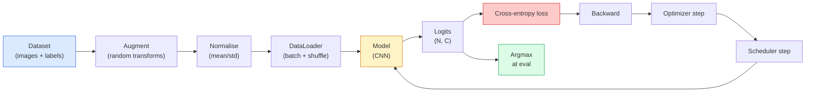

# छवि वर्गीकरण

> एक वर्गीकरण पिक्सेल से वर्गों पर संभावना वितरण के लिए एक समारोह है. बाकी सब पाइपलाइन है.

> **【中文解读】**图像分类器本质上是像素 से类概率分布 फ़ंक्शन──检测(分类区域) 、 विभाजन(分类像素) 、检索(分类相似度排序) अंततः सभी分类──掌握分类的完整流水线──数据集、增强、训练、评估) सभी विजन कार्यों का आधार है──

**Type:** Build | **类型:** 动手
**Languages:** Python | **语言:** Python
**Prerequisites:** Phase 2 Lesson 09 (Model Evaluation), Phase 3 Lesson 10 (Mini Framework), Phase 4 Lesson 03 (CNNs) | **前置知识:** Phase 2 Lesson 09（模型评估），Phase 3 Lesson 10（迷你框架），Phase 4 Lesson 03（CNN）
**Time:** ~75 minutes | **时间:** ~75 分钟

## सीखने के लक्ष्य

- सीआईएफएआर-10 पर एक अंत-से-अंत छवि वर्गीकरण पाइपलाइन बनाएंः डेटासेट, संवर्धन, मॉडल, प्रशिक्षण लूप, मूल्यांकन
- प्रत्येक घटक (डेटा लोडर, हानि, अनुकूलक, अनुसूचक, वृद्धि) की भूमिका को समझाएं और भविष्यवाणी करें कि उनमें से किसी एक को तोड़ने का परिणाम हानि वक्र में कैसे प्रकट होता है
- मिश्रण, कटआउट और लेबल चिकनाई को खरोंच से लागू करें और यह औचित्य दें कि प्रत्येक को जोड़ने के लायक कब है
- संचयी सटीकता से परे डेटासेट और मॉडल विफलताओं का निदान करने के लिए एक भ्रम मैट्रिक्स और प्रति वर्ग सटीकता/पुनर्विचार तालिका पढ़ें

> **【中文解读】**सीखने के लक्ष्य इस कक्षा को पूरा करने के बाद जो मूल क्षमताएं होनी चाहिए, उन्हें सूचीबद्ध करते हैं।


## समस्या  समस्या परिचय

प्रत्येक दृष्टि कार्य जो जहाजों को किसी स्तर पर छवि वर्गीकरण में कम करता है। पता लगाने क्षेत्र को वर्गीकृत करता है। विभाजन पिक्सल को वर्गीकृत करता है। कक्षा केंद्रों के समानता के आधार पर प्राप्त करना। वर्गीकरण सही प्राप्त करना  डेटासेट लूप, वृद्धि नीति, हानि, मूल्यांकन  वह कौशल है जो चरण में प्रत्येक अन्य कार्य में स्थानांतरित होता है।

> प्रत्येक वितरित दृश्य कार्य को किसी प्रकार से छवि वर्गों में वर्गीकृत किया गया है। परीक्षण वर्ग क्षेत्रों में वर्गीकृत किया गया है। विभाजन वर्गों में वर्गीकृत किया गया है। क्रमबद्धता को श्रेणी केंद्र के अनुरूप क्रमबद्ध किया गया है। वर्गीकरण को डेटासेट चक्रों के लिए किया गया है, वृद्धि रणनीति, हानि समारोह, मूल्यांकन, प्रत्येक कार्य के कौशल को इस चरण में स्थानांतरित किया गया है।

> **【中文解读】**सभी वास्तविक तैनाती के दृश्य कार्यों को मूल रूप से छवि वर्गीकरण में वर्गीकृत किया जा सकता हैः लक्ष्य परीक्षण "क्षेत्र वर्गीकरण" है, भाषा विभाजन "क्षेत्र वर्गीकरण" है, छवि खोज "वर्ग केंद्र समानता क्रम" है।

अधिकांश वर्गीकरण बग मॉडल में नहीं हैं। वे पाइपलाइन में रहते हैंः एक टूटने वाले मानकीकरण, एक असहज प्रशिक्षण सेट, बढ़ाव जो लेबल को विकृत करता है, प्रशिक्षण डेटा से दूषित सत्यापन विभाजन, सीखने की दर जो चुपचाप युग 30 के बाद भिन्न होती है। एक सीएनएन जो सही सेटअप के साथ सीआईएफएआर -10 पर 93% तक पहुंचता है, आमतौर पर एक टूटे हुए के साथ 70-75% स्कोर करता है, और नुकसान वक्र हमेशा यथार्थवादी लगता है।

> अधिकांश वर्ग बग मॉडल में नहीं हैं। वे प्रवाह लाइन में मौजूद हैंः गलत एकीकरण, अराजकता प्रशिक्षण सेट, विकृत लेबल की वृद्धि, प्रशिक्षित डेटा प्रदूषण की सत्यापन सेट, 30 वें युग में चुपचाप प्रसारण के बाद सीखने की दर। एक सही रूप से तैनात सीआईएफएआर-10 पर 93% तक पहुंच सकता है, गलत रूप से तैनात होने पर आमतौर पर केवल 70-75% तक पहुंच सकता है, और हानि कर्वन हमेशा उचित दिखता है।

इस सबक में पाइपलाइन को हाथ से तारों से जोड़ दिया गया है ताकि हर भाग का निरीक्षण किया जा सके।`torchvision.datasets`यह एक कीट छिपा सकता है.

> इस कोर्स में पूरे जलप्रवाह को बनाया गया है, ताकि प्रत्येक भाग का निरीक्षण किया जा सके।`torchvision.datasets`कुछ भी हो सकता है कीड़े की छिपी हुई चीज़ों में

> **【中文解读】**अधिकांश वर्ग बग मॉडल में ही नहीं, बल्कि प्रवाह में हैंः एकीकरण करना गलत है, प्रशिक्षण संयोजन नहीं गड़बड़ है, बढ़ाना है, लेबल को नष्ट करना है, परीक्षण संयोजन को प्रशिक्षित किया गया है डेटा प्रदूषण, सीखने की दर स्पसारित है।

## अवधारणा का मूल अवधारणा

### वर्गीकरण पाइपलाइन



इस लूप में हर पंक्ति में एक बग रह सकता है। क्रॉस-एंट्रोपी कच्चे लॉजिट लेता है, न कि softmax आउटपुट, तो किसी भी `model(x).softmax()`इससे पहले कि नुकसान चुपचाप गलत ग्रेडिएंट गणना करता है।

> इस चक्र में प्रत्येक पंक्ति में बग हो सकता है जहां मौजूद है।`model(x).softmax()`शहर में गहरे गहरे गहरे गहरे गहरे गहरे गहरे गहरे गहरे गहरे गहरे गहरे गहरे गहरे गहरे गहरे गहरे गहरे गहरे गहरे गहरे गहरे गहरे गहरे गहरे गहरे गहरे गहरे गहरे गहरे गहरे गहरे गहरे गहरे गहरे गहरे गहरे गहरे गहरे गहरे गहरे गहरे गहरे गहरे गहरे गहरे गहरे गहरे गहरे गहरे गहरे गहरे गहरे गहरे गहरे गहरे गहरे गहरे गहरे गहरे गहरे गहरे गहरे गहरे गहरे गहरे गहरे गहरे गहरे गहरे गहरे गहरे गहरे गहरे गहरे गहरे गहरे गहरे गहरे गहरे गहरे गहरे गहरे गहरे गहरे गहरे गहरे गहरे गहरे गहरे गहरे गहरे गहरे गहरे गहरे गहरे गहरे गहरे गहरे गहरे गहरे गहरे गहरे गहरे गहरे गहरे गहरे गहरे गहरे गहरे गहरे गहरे गहरे गहरे गहरे गहरे गहरे गहरे गहरे गहरे गहरे गहरे

> **【中文解读】**流水线中每一行都可能藏有 bug──交叉接收是原始logits(未经软max 的值), यदि पहले softmax पुनः传入 हानि 函数 किया गया है, त梯度计算就完全错了但不会报错── वृद्धि केवल इनपुट पर लागू होती है, लेबल नहीं  मिश्रण के अलावा, जो दोनों को मिलाता है। `optimizer.zero_grad()`यह एक बार होता है, इसे छोड़ने से ग्रेडिएंट जमा हो जाते हैं और यह एक बहुत ही अस्थिर सीखने की दर की तरह दिखता है। इन बगों में से प्रत्येक त्रुटि के बिना सीखने की वक्र को सपाट करता है।

### क्रॉस-एंट्रोपी, लॉजिट और सॉफ्टमैक्स

एक वर्गीकरण उत्पादित करता है `C`प्रति छवि logits कहा जाता संख्याओं। softmax लागू करने से उन्हें एक संभावना वितरण में परिवर्तित करता हैः

> प्रति छवि के लिए वर्गीकरण उपकरण उत्पन्न `C`个数字, तथाकथित logits. 个数字, तथाकथित logits. 个数字, तथाकथित logits.

```
softmax(z)_i = exp(z_i) / sum_j exp(z_j)
```

क्रॉस-एंट्रोपी सही वर्ग की नकारात्मक लॉग संभावना को मापता हैः

> 交叉 सही श्रेणी के नकारात्मक प्रति संख्या संभावना मापें:

```
CE(z, y) = -log( softmax(z)_y )
        = -z_y + log( sum_j exp(z_j) )
```

दाएं हाथ का रूप संख्यात्मक रूप से स्थिर है (लॉग-सॉम-एक्सप) ।`nn.CrossEntropyLoss`एक ऑपरेशन में सॉफ्टमैक्स + एनएलएल को मिलाता है और सीधे कच्चे लॉजिट लेता है। पहले सॉफ्टमैक्स को स्वयं लागू करना लगभग हमेशा एक बग होता है  आप लॉग ((मॉफ्टमैक्स(मॉफ्टमैक्स(ज़)) का गणना करते हैं), एक अर्थहीन मात्रा।

> सही तरफ़ का रूप है संख्यात्मक स्थिर (log-sum-exp)`nn.CrossEntropyLoss`एक ऑपरेशन में मर्ज हुआ softmax + NLL, सीधे प्राप्त मूल लॉजिट्स── स्वयम्से पहले softmax  लगभग हमेशा एक बग आप गणना लॉग में softmax softmax z))), एक निरर्थक मात्रा──

> **【中文解读】**पिटॉर्च की `nn.CrossEntropyLoss`内部已融合了软max + 负对数似然,直接传入原始逻辑即可── यदि आप पहले हाथ से सॉफ्टमैक्स को समायोजित करते हैं फिर से हानि में प्रसारित करते हैं, तो दो बार सॉफ्टमैक्स करने के बराबर है, gradience गणना पूरी तरह से गलत──

### वृद्धि का काम क्यों होता है

एक सीएनएन में अनुवाद के लिए प्रेरक पूर्वाग्रह है (वेट शेयरिंग से) लेकिन फसल, फ्लिप, रंग जिक्र या ऑक्ल्यूशन के लिए कोई अंतर्निहित अपरिवर्तनीयता नहीं है। इसे इन अपरिवर्तनीयताओं को सिखाने का एकमात्र तरीका यह है कि उसे पिक्सेल दिखाएं जो उन्हें व्यायाम करते हैं। प्रशिक्षण के दौरान प्रत्येक यादृच्छिक परिवर्तन यह कहने का एक तरीका हैः "इन दोनों छवियों का एक ही लेबल है; उन विशेषताओं को जानें जो अंतर को अनदेखा करते हैं। "

> सीएनएन के अनुसार, समानांतरों के लिए एक विशेष पक्ष है, लेकिन काटने, फेरबदल, रंगों की गति या छाया के लिए कोई अंतर्निहित अपरिवर्तनीयता नहीं है।

> **【拓展：数据增强与模型泛化】**डेटा वर्धित आधुनिक एआई का सबसे शक्तिशाली निः शुल्क विनियमन उपकरण है। रेसनेट, इफ़ेसिफ़ेंटनेट आदि के क्लासिक मॉडल प्रशिक्षण में, वर्धित रणनीति के अच्छे बुरे सीधे 3-5% की सटीकता दर को प्रभावित करते हैं। Google के RandAugment और AutoAugment द्वारा खोज विधि स्वचालित रूप से सबसे अच्छा वर्धित संयोजन चुनने के लिए, ImageNet पर व्यापक रूप से सत्यापित किया गया है।

```
Original crop:  "dog facing left"
Flip:           "dog facing right"       <- same label, different pixels
Rotate(+15):    "dog, slight tilt"
Colour jitter:  "dog in warmer light"
RandomErasing:  "dog with patch missing"
```

नियमः बढ़ाव लेबल को संरक्षित करना चाहिए। एक अंक पर कटआउट और घूर्णन "6" को "9" में फ्लिप कर सकते हैं; उस डेटासेट के लिए आप छोटे घूर्णन रेंज का उपयोग करते हैं और अंक-विशिष्ट अपरिवर्तितियों का सम्मान करने वाले बढ़ाव चुनते हैं।

> 規則:增强必须保持标签不变―― अंक के लिए छायांकन और घूर्णन संभव है "6" को "9" में बदल दें; उस डेटासेट के लिए, आप छोटे घूर्णन दायरे का उपयोग करते हैं,并选择尊重数字特定不变性的增强──

### मिश्रण और कटमिश

साधारण बढ़ाव पिक्सेल को बदल देता है लेकिन लेबल को एक ही गर्म रखता है। **Mixup**और **cutmix**दोनों को इंटरपोला करके इसे तोड़ें।

> सामान्य रूप से एक ही गर्म के लिए लेबल रखने के लिए**Mixup**和 **cutmix**दोनों के बीच यह मुद्दा तोड़ा गया है।

```
Mixup:
  lambda ~ Beta(a, a)
  x = lambda * x_i + (1 - lambda) * x_j
  y = lambda * y_i + (1 - lambda) * y_j

Cutmix:
  paste a random rectangle of x_j into x_i
  y = area-weighted mix of y_i and y_j
```

यह मदद क्यों करता हैः मॉडल को एक-गर्म लक्ष्य को याद करना बंद कर देता है और कक्षाओं के बीच इंटरपोलेट करना सीखता है। प्रशिक्षण हानि बढ़ जाती है, परीक्षण सटीकता बढ़ जाती है। यह किसी भी वर्गीकरण के लिए सबसे सस्ता एकल मजबूती उन्नयन है।

> क्यों उपयोगीः मॉडल रोक स्मृति शिखर के एक-गर्म  लक्ष्य, वर्गों के बीच में प्रवेश करना सीखना। प्रशिक्षण हानि बढ़ी, परीक्षण सटीकता दर भी बढ़ी। यह किसी भी वर्ग के लिए सबसे सस्ता रूलैबिकता उन्नयन है।

> **【拓展：Mixup 在大模型中的应用】**मिश्रण के विचार को एनएलपी के क्षेत्र में विस्तारित किया गया है। पाठ में सम्मिलित होने के लिए सम्मिलित मूल्य मिश्रण किया गया है। चैटजीपीटी आदि एलएलएम के प्रशिक्षण में, लेबल समतल और सॉफ्ट लेबल तकनीक का भी व्यापक रूप से उपयोग किया जाता है, जिससे मॉडल को अधिक परिष्कृत संभावना आउटपुट उत्पन्न करने में मदद मिलती है, अत्यधिक आत्मविश्वास कम होता है।

### लेबल चिकनाई

एक भ्रमित चचेरे भाई के बजाय प्रशिक्षण के खिलाफ`[0, 0, 1, 0, 0]`, ट्रेन के खिलाफ`[eps/C, eps/C, 1-eps, eps/C, eps/C]`एक छोटे से के लिए `eps`जैसे 0.1. मॉडल को मनमाने ढंग से तेज लॉजिट का उत्पादन करने से रोकता है और लगभग बिना किसी लागत के माप सुधारता है।`nn.CrossEntropyLoss(label_smoothing=0.1)`PyTorch 1.10 के बाद से।

> मिश्रण के निकट निकट`[0, 0, 1, 0, 0]` अभ्यास करें, बल्कि उपयोग करें `[eps/C, eps/C, 1-eps, eps/C, eps/C]`, उनमें से `eps`उदाहरण के लिए, 0.1 ⋅ मॉडल को किसी भी प्रकार के परिष्कृत लॉजिट उत्पन्न करने से रोकना, लगभग शून्य लागत में सुधार करना।`nn.CrossEntropyLoss(label_smoothing=0.1)`मध्य में

### सटीकता से परे मूल्यांकन

संकलित सटीकता असंतुलन को छिपाती है। 90-10 द्विआधारी वर्गीकरण जो हमेशा बहुमत वर्ग के स्कोर का पूर्वानुमान करता है 90%। उपकरण जो वास्तव में आपको बताता है कि क्या हो रहा हैः

> 总体准确率隐藏不平衡──一总是预测多数类 90-10 二分类器能获得90%──真正告诉你发生了什么工具:

- **Per-class accuracy** प्रति वर्ग एक संख्या; तुरंत निम्न प्रदर्शन वाली श्रेणियों को प्रकट करता है।
  Chinese: प्रत्येक वर्ग एक संख्या है; तुरंत खराब प्रदर्शन की श्रेणी को उजागर करना
- **Confusion matrix** C x C ग्रिड के साथ पंक्ति i col j = सही वर्ग i की संख्या वर्ग j के रूप में भविष्यवाणी की; विघात सही है, off-विघात जहां आपका मॉडल रहता है.
  中文翻译:混矩阵C x C 网格,行 i 列 j = 真实类别 i 被预测为类别 j 的计数;对角线是正确的,非对角线是你的模型出错的地方──
- **Top-1 / Top-5** चाहे सही वर्ग शीर्ष 1 या शीर्ष 5 भविष्यवाणियों में हो; ImageNet के लिए शीर्ष-5 मायने रखता है क्योंकि "नॉर्विच टेरियर" बनाम "नॉर्फ़ॉक टेरियर" जैसी कक्षाएं वास्तव में अस्पष्ट हैं।
  中文翻译:Top-1 / Top-5正确类别是否在前1或前5 预测中;Top-5对 ImageNet 很重要,因为像"नॉरविच टेरियर" vs "नॉर्फ़ॉक टेरियर" 这样的类别确实模两可──
- **Calibration (ECE)** क्या 0.8 विश्वसनीयता पूर्वानुमान 80% समय सही है? आधुनिक नेटवर्क व्यवस्थित रूप से अत्यधिक विश्वसनीय हैं; तापमान स्केलिंग या लेबल चिकनाई के साथ ठीक करें।
  中文翻译:校准(ECE) 0.8 置信度的预测 80% का समय क्या है?

> **【拓展：工业部署中的视觉系统】**वास्तविक औद्योगिक तैनाती में, विज़ुअल मॉडल को देरी, मॉडल आकार, किनारे उपकरण अनुकूलन आदि की समस्या पर विचार करने की आवश्यकता होती है। टेन्सरआरटी, ओएनएनएक्स रनटाइम, ओपनवीनो एक सामान्य उपयोग में आने वाला सुझाव त्वरण उपकरण है।


## इसे बनाओ, इसे पूरा करो।

> **【中文解读】**इस भाग के माध्यम से कोड को शून्य से लागू किया जा सकता है कोर एल्गोरिदम। इस तरह के "शुरुआत से" तरीके से फ्रेमवर्क के पीछे के सिद्धांत को समझने में मदद मिलेगी, समस्याओं का सामना करते समय ब्लैक बॉक्स में फंस नहीं जाएगा।

```figure
receptive-field
```

## इसे बनाओ

### चरण 1: एक निर्धारक सिंथेटिक डेटासेट

CIFAR-10 डिस्क पर रहता है. इस पाठ को पुनः प्रयोज्य और तेज़ बनाने के लिए हम एक सिंथेटिक डेटासेट बनाते हैं जो CIFAR  32x32 आरजीबी छवियों की तरह दिखता है। मॉडल को कक्षा-विशिष्ट संरचना के साथ सीखना चाहिए। वास्तविक CIFAR-10 पर एक ही पाइपलाइन अपरिवर्तित काम करती है।

> CIFAR-10 डिस्क पर मौजूद है। इस कोर्स को पुनः प्राप्त करने योग्य और तेज़ बनाने के लिए, हमने एक ऐसा बनाया है जो CIFAR के संश्लेषित डेटासेट की तरह दिखता है।

```python
import numpy as np
import torch
from torch.utils.data import Dataset


def synthetic_cifar(num_per_class=1000, num_classes=10, seed=0):
    rng = np.random.default_rng(seed)
    X = []
    Y = []
    for c in range(num_classes):
        centre = rng.uniform(0, 1, (3,))
        freq = 2 + c
        for _ in range(num_per_class):
            yy, xx = np.meshgrid(np.linspace(0, 1, 32), np.linspace(0, 1, 32), indexing="ij")
            r = np.sin(xx * freq) * 0.5 + centre[0]
            g = np.cos(yy * freq) * 0.5 + centre[1]
            b = (xx + yy) * 0.5 * centre[2]
            img = np.stack([r, g, b], axis=-1)
            img += rng.normal(0, 0.08, img.shape)
            img = np.clip(img, 0, 1)
            X.append(img.astype(np.float32))
            Y.append(c)
    X = np.stack(X)
    Y = np.array(Y)
    idx = rng.permutation(len(X))
    return X[idx], Y[idx]


class ArrayDataset(Dataset):
    def __init__(self, X, Y, transform=None):
        self.X = X
        self.Y = Y
        self.transform = transform

    def __len__(self):
        return len(self.X)

    def __getitem__(self, i):
        img = self.X[i]
        if self.transform is not None:
            img = self.transform(img)
        img = torch.from_numpy(img).permute(2, 0, 1)
        return img, int(self.Y[i])
```

प्रत्येक वर्ग को अपना रंग पैलेट और आवृत्ति पैटर्न मिलता है, साथ ही गौशियन शोर मॉडल को पिक्सेल को याद करने के बजाय संकेत सीखने के लिए मजबूर करता है। दस वर्ग, प्रत्येक में एक हजार छवियां, प्रतिस्थापित।

> प्रत्येक श्रेणी में अपनी खुद की रेंज और आवृत्ति मोड होती है, जिसमें उच्च शोर के साथ-साथ स्मृति के बजाय मॉडल सीखने के संकेतों को मजबूर करने के लिए दस श्रेणियां होती हैं, प्रत्येक श्रेणी में एक हजार चित्र, विघटित हैं।

### चरण 2: सामान्यीकरण और वृद्धि

दोनों परिवर्तन है कि हर दृष्टि पाइपलाइन है.

> प्रत्येक दृश्य धारा में दो परिवर्तन होते हैं।

```python
def standardize(mean, std):
    mean = np.array(mean, dtype=np.float32)
    std = np.array(std, dtype=np.float32)
    def _fn(img):
        return (img - mean) / std
    return _fn


def random_hflip(p=0.5):
    def _fn(img):
        if np.random.random() < p:
            return img[:, ::-1, :].copy()
        return img
    return _fn


def random_crop(pad=4):
    def _fn(img):
        h, w = img.shape[:2]
        padded = np.pad(img, ((pad, pad), (pad, pad), (0, 0)), mode="reflect")
        y = np.random.randint(0, 2 * pad)
        x = np.random.randint(0, 2 * pad)
        return padded[y:y + h, x:x + w, :]
    return _fn


def compose(*fns):
    def _fn(img):
        for fn in fns:
            img = fn(img)
        return img
    return _fn
```

फसल से पहले प्रतिबिंबित पैड, शून्य पैड नहीं, क्योंकि काले सीमाएं एक संकेत है मॉडल एक बेकार तरीके से अनदेखा करना सीखेंगे।

> 剪裁前 उपयोग प्रतिबिंब भरने के बजाय शून्य भरने के लिए, क्योंकि काले सीमांकन एक अनुचित तरीके से मॉडल सम्मेलन के लिए उपेक्षित संकेत है।

### चरण 3: मिश्रण

प्रशिक्षण चरण के अंदर दो छवियों और दो लेबल को मिलाता है। एक बैच परिवर्तन के रूप में लागू किया जाता है ताकि यह डेटासेट के अंदर के बजाय आगे के पास रहता है।

> प्रशिक्षण चरण में दो छवियों और दो लेबलों को मिलाकर किया जाता है।

```python
def mixup_batch(x, y, num_classes, alpha=0.2):
    if alpha <= 0:
        return x, torch.nn.functional.one_hot(y, num_classes).float()
    lam = float(np.random.beta(alpha, alpha))
    idx = torch.randperm(x.size(0), device=x.device)
    x_mixed = lam * x + (1 - lam) * x[idx]
    y_onehot = torch.nn.functional.one_hot(y, num_classes).float()
    y_mixed = lam * y_onehot + (1 - lam) * y_onehot[idx]
    return x_mixed, y_mixed


def soft_cross_entropy(logits, soft_targets):
    log_probs = torch.log_softmax(logits, dim=-1)
    return -(soft_targets * log_probs).sum(dim=-1).mean()
```

`soft_cross_entropy`यह सामान्य एक गर्म मामले में कम हो जाता है जब लक्ष्य बिल्कुल एक गर्म है।

> `soft_cross_entropy`── जब लक्ष्य ठीक है एक-गर्म , यह सामान्य एक-गर्म  स्थिति में विघटित होता है──

### चरण 4: प्रशिक्षण लूप

पूरा नुस्खाः एक डेटा पास, ग्रेडिएंट एक बार प्रति बैच, शेड्यूलर एक समय के लिए कदम.

> पूर्ण योजना: डेटा को एक बार फिर से किया जाना, प्रत्येक बैच को एक बार रैंकिंग, प्रत्येक युग को एक बार सीखने की दर से समायोजित किया जाना

```python
import torch
import torch.nn as nn
from torch.utils.data import DataLoader
from torch.optim import SGD
from torch.optim.lr_scheduler import CosineAnnealingLR

def train_one_epoch(model, loader, optimizer, device, num_classes, use_mixup=True):
    model.train()
    total, correct, loss_sum = 0, 0, 0.0
    for x, y in loader:
        x, y = x.to(device), y.to(device)
        if use_mixup:
            x_m, y_soft = mixup_batch(x, y, num_classes)
            logits = model(x_m)
            loss = soft_cross_entropy(logits, y_soft)
        else:
            logits = model(x)
            loss = nn.functional.cross_entropy(logits, y, label_smoothing=0.1)
        optimizer.zero_grad()
        loss.backward()
        optimizer.step()
        loss_sum += loss.item() * x.size(0)
        total += x.size(0)
        # Training accuracy vs the un-mixed labels `y` is only an approximation
        # when mixup is on (the model saw soft targets, not y). Treat it as a
        # rough progress signal; rely on val accuracy for real performance.
        with torch.no_grad():
            pred = logits.argmax(dim=-1)
            correct += (pred == y).sum().item()
    return loss_sum / total, correct / total


@torch.no_grad()
def evaluate(model, loader, device, num_classes):
    model.eval()
    total, correct = 0, 0
    loss_sum = 0.0
    cm = torch.zeros(num_classes, num_classes, dtype=torch.long)
    for x, y in loader:
        x, y = x.to(device), y.to(device)
        logits = model(x)
        loss = nn.functional.cross_entropy(logits, y)
        pred = logits.argmax(dim=-1)
        for t, p in zip(y.cpu(), pred.cpu()):
            cm[t, p] += 1
        loss_sum += loss.item() * x.size(0)
        total += x.size(0)
        correct += (pred == y).sum().item()
    return loss_sum / total, correct / total, cm
```

पांच अपरिवर्तनीय आप जांच जब आप एक प्रशिक्षण लूप लिखते हैंः

> प्रत्येक लेखन प्रशिक्षण चक्र के दौरान जांच के पांच अपरिवर्तनीय मात्राः

1. `model.train()`प्रशिक्षण से पहले, `model.eval()`मूल्यांकन से पहले  ड्रॉपआउट और बैचनॉर्म व्यवहार को उलट देता है।
2. `.zero_grad()`पहले`.backward()`. .
3. `.item()`जब मैट्रिक्स इकट्ठा करने के लिए तो कुछ भी जीवित गणना ग्राफ रखने के लिए.
4. `@torch.no_grad()`मूल्यांकन के दौरान  स्मृति और समय की बचत करता है, सूक्ष्म दुर्घटनाओं को रोकता है।
5. कच्चे लॉजिट के मुकाबले अर्गमैक्स, सॉफ्टमैक्स नहीं  समान परिणाम, एक ऑपरेशन कम।

### चरण 5: इसे एक साथ रखें

`TinyResNet`पिछले पाठ से, कुछ काल के लिए प्रशिक्षण, मूल्यांकन.

> उपयोग上一课的 `TinyResNet`, प्रशिक्षण कई युगों, मूल्यांकन

```python
from main import synthetic_cifar, ArrayDataset
from main import standardize, random_hflip, random_crop, compose
from main import mixup_batch, soft_cross_entropy
from main import train_one_epoch, evaluate
# TinyResNet comes from the previous lesson (03-cnns-lenet-to-resnet).
# Adjust the import path to wherever you stored the previous lesson's code.
from cnns_lenet_to_resnet import TinyResNet  # example placeholder

X, Y = synthetic_cifar(num_per_class=500)
split = int(0.9 * len(X))
X_train, Y_train = X[:split], Y[:split]
X_val, Y_val = X[split:], Y[split:]

mean = [0.5, 0.5, 0.5]
std = [0.25, 0.25, 0.25]
train_tf = compose(random_hflip(), random_crop(pad=4), standardize(mean, std))
eval_tf = standardize(mean, std)

train_ds = ArrayDataset(X_train, Y_train, transform=train_tf)
val_ds = ArrayDataset(X_val, Y_val, transform=eval_tf)

train_loader = DataLoader(train_ds, batch_size=128, shuffle=True, num_workers=0)
val_loader = DataLoader(val_ds, batch_size=256, shuffle=False, num_workers=0)

device = "cuda" if torch.cuda.is_available() else "cpu"
model = TinyResNet(num_classes=10).to(device)
optimizer = SGD(model.parameters(), lr=0.1, momentum=0.9, weight_decay=5e-4, nesterov=True)
scheduler = CosineAnnealingLR(optimizer, T_max=10)

for epoch in range(10):
    tr_loss, tr_acc = train_one_epoch(model, train_loader, optimizer, device, 10, use_mixup=True)
    va_loss, va_acc, _ = evaluate(model, val_loader, device, 10)
    scheduler.step()
    print(f"epoch {epoch:2d}  lr {scheduler.get_last_lr()[0]:.4f}  "
          f"train {tr_loss:.3f}/{tr_acc:.3f}  val {va_loss:.3f}/{va_acc:.3f}")
```

सिंथेटिक डेटासेट पर, यह पांच युगों के भीतर लगभग सही सत्यापन सटीकता तक पहुंचता है, जो कि बिंदु हैः पाइपलाइन सही है, मॉडल सीख सकता है कि क्या सीखना है। वास्तविक CIFAR-10 के लिए डेटासेट को स्विच करें और एक ही लूप ट्रेनों को बिना परिवर्तन के ~ 90% तक।

> संश्लेषित डेटाबेस में, यह पांच युगों में लगभग सही सत्यापन सटीकता दर तक पहुंच सकता है, यही है मुख्य बिंदुः प्रवाह लाइन सही है, मॉडल सीख सकता है कि क्या सीखना है।

### चरण 6: भ्रम मैट्रिक्स पढ़ें

सटीकता अकेले आपको कभी नहीं बताती कि मॉडल कहां विफल है। भ्रम मैट्रिक्स ऐसा करता है।

>                                                                                                                                                                                                                                                               

```python
def print_confusion(cm, labels=None):
    c = cm.shape[0]
    labels = labels or [str(i) for i in range(c)]
    print(f"{'':>6}" + "".join(f"{l:>5}" for l in labels))
    for i in range(c):
        row = cm[i].tolist()
        print(f"{labels[i]:>6}" + "".join(f"{v:>5}" for v in row))
    print()
    tp = cm.diag().float()
    fp = cm.sum(dim=0).float() - tp
    fn = cm.sum(dim=1).float() - tp
    prec = tp / (tp + fp).clamp_min(1)
    rec = tp / (tp + fn).clamp_min(1)
    f1 = 2 * prec * rec / (prec + rec).clamp_min(1e-9)
    for i in range(c):
        print(f"{labels[i]:>6}  prec {prec[i]:.3f}  rec {rec[i]:.3f}  f1 {f1[i]:.3f}")

_, _, cm = evaluate(model, val_loader, device, 10)
print_confusion(cm)
```

पंक्तियाँ सच्चे वर्ग हैं, स्तंभ भविष्यवाणियां हैं। कक्षा 3 और 5 के बीच ऑफ-डायगोनल गिनती का एक समूह का मतलब है कि मॉडल उन दोनों को भ्रमित करता है और आपको लक्षित डेटा संग्रह या वर्ग-विशिष्ट वृद्धि के लिए एक प्रारंभिक बिंदु देता है।

> पंक्ति वास्तविक श्रेणी है, पंक्ति भविष्यवाणी है। श्रेणी 3 और 5 के बीच गैर-प्रतिपक्षीय रेखागणना के संचय का अर्थ है कि मॉडल इन दोनों श्रेणियों को मिलाता है, और आपको विशिष्ट डेटा संग्रह या श्रेणी विशिष्ट वृद्धि के लिए प्रारंभिक बिंदु प्रदान करता है।


## इसे फ्रेमवर्क के साथ लागू करें

> **【中文解读】**इस भाग में दिखाया गया है कि इस तकनीक को कैसे तेजी से लागू किया जाए। इस प्रकार के एक परिपक्व ढांचे का उपयोग करके बग कम किए जा सकते हैं और विकास दक्षता में सुधार किया जा सकता है।


`torchvision`वास्तविक CIFAR-10 के लिए पूरी पाइपलाइन चार पंक्तियों के साथ एक प्रशिक्षण लूप है।

> `torchview`उपरोक्त सभी सामग्री को सामान्य उपयोग के घटक के रूप में कवर किया जाएगा। वास्तविक CIFAR-10 के लिए, पूर्ण प्रवाह लाइन चार पंक्तियों का कोड है।

```python
from torchvision.datasets import CIFAR10
from torchvision.transforms import Compose, RandomCrop, RandomHorizontalFlip, ToTensor, Normalize

mean = (0.4914, 0.4822, 0.4465)
std = (0.2470, 0.2435, 0.2616)
train_tf = Compose([
    RandomCrop(32, padding=4, padding_mode="reflect"),
    RandomHorizontalFlip(),
    ToTensor(),
    Normalize(mean, std),
])
eval_tf = Compose([ToTensor(), Normalize(mean, std)])

train_ds = CIFAR10(root="./data", train=True,  download=True, transform=train_tf)
val_ds   = CIFAR10(root="./data", train=False, download=True, transform=eval_tf)
```

दो बातें ध्यान देने योग्य हैंः औसत/एसटीडी **dataset-specific** CIFAR-10 प्रशिक्षण सेट पर गणना की गई है, ImageNet पर नहीं  और प्रतिबिंब पैड समुदाय-पूर्वनिर्धारित फसल नीति है। यहां ImageNet के आंकड़ों को कॉपी-पेस्ट करना एक ~ 1% सटीकता लीक है जो किसी को भी नहीं पकड़ता है जब तक कि कोई मॉडल को प्रोफाइल नहीं करता है।

> 两点注意事项: औसत मूल्य/标准差是**数据集特定的** CIFAR-10  प्रशिक्षण सेट पर गणना, और न कि ImageNet  प्रतिबिंब भरने समुदाय के लिए डिफ़ॉल्ट कट कट रणनीति है                                                                                                                                                                                                                                              


> **【拓展：数据标注与质量】**视觉任务的效果高度依赖标签数据质量──标签工作室、CVAT是主流标签工具──在工业场景中,主动学习(Active Learning) ले标签成本 को कम कर सकता हैः मॉडल अनिश्चित नमूना अनुरोधों के लिए कृत्रिम标签, अनिश्चितता के नमूने स्वचालित标签──

## इसे भेजें उत्पाद

> **【中文解读】**इस खंड में इस बात पर ध्यान दिया गया है कि मॉडल को उपलब्ध उत्पादों के रूप में कैसे तैनात किया जाए। मूल से लेकर उत्पादन स्तर तक, प्रदर्शन अनुकूलन, त्रुटि प्रसंस्करण, निगरानी आदि के कई आयामों पर विचार करने की आवश्यकता है।


इस पाठ से उत्पन्न होता हैः

- `outputs/prompt-classifier-pipeline-auditor.md` एक संकेत जो उपरोक्त पांच अपरिवर्तित के लिए प्रशिक्षण स्क्रिप्ट का ऑडिट करता है और पहला उल्लंघन प्रकट करता है।
- `outputs/skill-classification-diagnostics.md` एक कौशल जो, भ्रम मैट्रिक्स और वर्ग नामों की सूची को देखते हुए, प्रति वर्ग विफलताओं का सारांश देता है और सबसे प्रभावशाली एकल समाधान का प्रस्ताव करता है।

> **【中文解读】**练习题按照易/中级/难度递进;;建议至少完成中级题,Hard级适合深入研究或面试准备;;


## अभ्यास विषय

1. **(Easy | 简单)**संश्लेषण डेटासेट पर पांच युगों तक एक ही मॉडल को मिश्रण के साथ और बिना प्रशिक्षित करें। दोनों के लिए प्लॉट ट्रेन और वैल हानि। बताएं कि मिश्रण के साथ ट्रेन हानि क्यों अधिक है जबकि वैल सटीकता समान या बेहतर है।
   वि॰ वि॰ वि॰ वि॰ वि॰ वि॰ वि॰ वि॰ वि॰ वि॰ वि॰ वि॰ वि॰ वि॰ वि॰ वि॰ वि॰ वि॰ वि॰ वि॰ वि॰ वि॰ वि॰ वि॰ वि॰ वि॰ वि॰ वि॰ वि॰ वि॰ वि॰ वि॰ वि॰ वि॰ वि॰ वि॰ वि॰ वि॰ वि॰ वि॰ वि॰ वि॰ वि॰ वि॰ वि॰ वि॰ वि॰ वि॰ वि॰ वि॰ वि॰ वि॰ वि॰ वि॰ वि॰ वि॰ वि॰ वि॰ वि॰ वि॰ वि॰ वि॰ वि॰ वि॰ वि॰ वि॰ वि॰ वि॰ वि॰ वि॰ वि॰ वि॰ वि॰ वि॰ वि॰ वि॰ वि॰ वि॰ वि॰ वि॰ वि॰ वि॰ वि॰ वि॰ वि॰ वि॰ वि॰ वि॰ वि॰ वि॰ वि॰ वि॰ वि॰ वि॰ वि॰ वि॰ वि॰ वि॰ वि॰ वि॰ वि॰ वि॰ वि॰ वि॰ वि॰ वि॰ वि॰ वि॰ वि॰ वि॰ वि॰ वि॰ वि॰ वि॰ वि॰ वि॰ वि॰ वि॰ वि॰ वि॰ वि॰ वि॰ वि॰ वि॰ वि॰ वि॰ वि॰ वि॰ वि॰ वि॰ वि॰ वि॰ वि॰ वि॰ वि॰ वि॰ वि॰ वि॰ वि॰ वि॰ वि॰ वि॰ वि॰ वि॰ वि॰ वि॰ वि॰ वि॰ वि॰ वि॰ वि॰ वि॰ वि॰ वि॰ वि॰ वि॰ वि॰ वि॰ वि॰ वि॰ वि॰ वि॰

2. **(Medium | 中等)**प्रत्येक प्रशिक्षण छवि में कटाई  शून्य से एक यादृच्छिक 8x8 वर्ग  को लागू करें और एक अपघटन बनाम कोई वृद्धि, hflip+crop, hflip+crop+cutout, hflip+crop+mixup चलाएं। प्रत्येक के लिए वैल सटीकता रिपोर्ट करें।
                                                                                                                                                                                                                                                                 

3. **(Hard | 困难)**एक CIFAR-100 पाइपलाइन (100 वर्ग, समान इनपुट आकार) का निर्माण करें और प्रकाशित सटीकता के 1% के भीतर एक ResNet-34 प्रशिक्षण रन को पुनः प्रस्तुत करें। अतिरिक्तः तीन सीखने की दरों और दो वजन घटाने को झाड़ो, स्थानीय CSV में लॉग करें, अंतिम भ्रम-मैट्रिक्स-शीर्ष-भ्रष्टाचार तालिका उत्पन्न करें।
   建建 CIFAR-100 流水线(100 类),复现 ResNet-34 प्रशिक्षण परिणाम से सार्वजनिक सटीकता दर अनुपात 1% 以内。进阶:搜索三种学习率和两种权重衰减, CSV तक रिकॉर्ड,生成混矩阵中最容易混的类别对──

## Key Terms  Key Terms  Key Terms  Key Terms  Key Terms  Key Terms  Key Terms  Key Terms  Key Terms  Key Terms  Key Terms  Key Terms  Key Terms  Key Terms  Key Terms  Key Terms  Key Terms  Key Terms  Key Terms  Key Terms  Key Terms  Key Terms  Key Terms  Key Terms  Key Terms  Key Terms  Key Terms  Key Terms  Key Terms  Key Terms  Key Terms  Key Terms  Key Terms  Key Terms  Key Terms  Key Terms  Key Terms  Key Terms  Key Terms  Key Terms  Key Terms  Key Terms  Key Terms  Key Terms  Key Terms  Key Terms  Key Terms  Key Terms  Key Terms  Key Terms  Key Terms  Key Terms  Key Terms  Key Terms  Key Terms  Key Terms  Key Terms  Key Terms  Key Terms  Key Terms  Key Terms  Key Terms  Key Terms  Key Terms  Key Terms  Key Terms  Key Terms  Key Terms  Key Terms  Key Terms  Key Terms  Key Terms  Key Terms  Key Terms  Key Terms  Key Terms  Key Terms  Key Terms  Key Terms  Key Terms  Key Terms  Key Terms  Key Terms  Key Terms  Key Terms  Key Terms  Key Terms  Key Terms  Key Terms  Key Terms  Key Terms  Key Terms  Key Terms  Key Terms  Key Terms  Key Terms  Key Terms  Key Terms  Key Terms  Key Terms  Key Terms  Key Terms  Key Terms  Key Terms  Key Terms  Key Terms  Key Terms  Key Terms  Key

| Term | What people say | What it actually means | 中文释义 |
|------|----------------|----------------------|---------|
| Logits | "Raw outputs" | The pre-softmax vector of C numbers per image; cross-entropy expects these, not softmaxed values | Logits：softmax 之前的原始输出向量，交叉熵直接接收它 |
| Cross-entropy | "The loss" | Negative log-probability of the correct class; combines log-softmax and NLL in one stable op | 交叉熵：正确类别的负对数概率，融合了 log-softmax 和 NLL |
| DataLoader | "The batcher" | Wraps a dataset with shuffling, batching, and (optional) multi-worker loading; gets blamed for half of training bugs | 数据加载器：封装数据集的打乱、分批、多进程加载 |
| Augmentation | "Random transforms" | Any pixel-level transform at training time that preserves the label; teaches invariances the CNN does not have natively | 数据增强：训练时保持标签不变的像素级变换，教会模型 CNN 天生不具备的不变性 |
| Mixup / Cutmix | "Mix two images" | Blend both inputs and labels so the classifier learns smooth interpolations instead of hard boundaries | Mixup/Cutmix：混合两张图像及其标签，让分类器学习平滑插值 |
| Label smoothing | "Softer targets" | Replace one-hot with (1-eps, eps/(C-1), ...); improves calibration and slightly boosts accuracy | 标签平滑：用软标签替代 one-hot，改善概率校准 |
| Top-k accuracy | "Top-5" | The correct class is in the k highest-probability predictions; used on datasets with genuinely ambiguous classes | Top-k 准确率：正确类别在前 k 个预测中即算对 |
| Confusion matrix | "Where errors live" | C x C table where entry (i, j) counts images of true class i predicted as j; diagonal is right, off-diagonal tells you what to fix | 混淆矩阵：C×C 表格，对角线是正确预测，非对角线揭示混淆的类别对 |

> **【中文解读】**延伸阅读 प्रदान करता है गहन सीखने के लिए उच्च गुणवत्ता वाले संसाधनों। ये लेख और पाठ्यक्रम इस क्षेत्र के लिए क्लासिक संदर्भ हैं, जो गहन समझ की आवश्यकता वाले पाठकों के लिए उपयुक्त हैं।


## आगे पढ़ना 延伸閱讀

- [CS231n: Training Neural Networks](https://cs231n.github.io/neural-networks-3/) अभी भी एक ही पृष्ठ पर प्रशिक्षण पाइपलाइन का सबसे स्पष्ट दौरा
- [Bag of Tricks for Image Classification (He et al., 2019)](https://arxiv.org/abs/1812.01187) प्रत्येक छोटे ट्रिक जो एक साथ इमेजनेट पर रेसनेट की सटीकता में 3-4% जोड़ता है
- [mixup: Beyond Empirical Risk Minimization (Zhang et al., 2017)](https://arxiv.org/abs/1710.09412) मूल मिश्रित पेपर; तीन पृष्ठ सिद्धांत और आश्वस्त प्रयोग
- [Why temperature scaling matters (Guo et al., 2017)](https://arxiv.org/abs/1706.04599) कागज जो साबित आधुनिक नेटवर्क गलत कैलिब्रेट कर रहे हैं और एक स्केलर पैरामीटर के साथ तय किया
