# वस्तु का पता लगाना  YOLO खरोंच से  目标检测   YOLO को शून्य से प्राप्त करना

> पता लगाने वर्गीकरण प्लस प्रतिगमन है, सुविधा मानचित्र में प्रत्येक स्थिति पर चलाया, फिर गैर-अधिकतम दमन के साथ साफ किया।

> **【中文解读】**目标检测 = 分类 +归归, विशेषता के प्रत्येक स्थान पर चलें, फिर गैर-极大值抑制 (NMS) का उपयोग करके पुनः परीक्षण बॉक्स को साफ करें।

> **【拓展：YOLO 在自动驾驶中的应用】**यलो स्वचालित ड्राइविंग में सबसे अधिक इस्तेमाल होने वाला वास्तविक समय लक्ष्य परीक्षण एल्गोरिथ्म है, जो एक साथ लोगों, वाहनों, यातायात संकेतों आदि का परीक्षण कर सकता है। यलोव1 से यलोव8 तक, गति और सटीकता में लगातार सुधार, उद्योग में सबसे लोकप्रिय परीक्षण ढांचे में से एक है।

**Type:** Build | **类型:** 动手
**Languages:** Python | **语言:** Python
**Prerequisites:** Phase 4 Lesson 03 (CNNs), Phase 4 Lesson 04 (Image Classification), Phase 4 Lesson 05 (Transfer Learning) | **前置知识:** Phase 4 Lesson 03（CNN），Phase 4 Lesson 04（图像分类），Phase 4 Lesson 05（迁移学习）
**Time:** ~75 minutes | **时间:** ~75 分钟

## सीखने के लक्ष्य

- ग्रिड-और-एंकर डिजाइन की व्याख्या करें जो पता लगाने को घने भविष्यवाणी की समस्या में बदल देता है और आउटपुट टेंसर में प्रत्येक संख्या का क्या अर्थ है
- बॉक्स के बीच इंटरसेक्शन-ऑन-यूनीयन की गणना करें और शून्य से गैर-अधिकतम दमन लागू करें
- पूर्व प्रशिक्षित रीढ़ की हड्डी के ऊपर एक न्यूनतम YOLO शैली का सिर बनाएं, जिसमें वर्गीकरण, वस्तुत्व और बॉक्स-रिग्रेशन हानि शामिल है
- एक डिटेक्शन मीट्रिक पंक्ति (सटीकता@0.5, याद रखें, mAP@0.5, mAP@0.5:0.95) पढ़ें और चुनें कि किस बटन को आगे मोड़ना है

> **【中文解读】**सीखने के लक्ष्य इस कक्षा को पूरा करने के बाद जो मूल क्षमताएं होनी चाहिए, उन्हें सूचीबद्ध करते हैं।


## समस्या  समस्या परिचय

वर्गीकरण कहता है "यह छवि एक कुत्ता है।" पता लगाने का कहना है "पिक्सल (112, 40, 280, 210), एक बिल्ली (400, 180, 560, 310) पर एक कुत्ता है, और फ्रेम में कुछ और नहीं है।" यह एक संरचनात्मक परिवर्तन  प्रति छवि एक लेबल के बजाय लेबल वाले बॉक्स की एक चर संख्या की भविष्यवाणी करना  यह है कि प्रत्येक स्वायत्त प्रणाली, हर निगरानी उत्पाद, हर दस्तावेज़ लेआउट पार्सर, और हर फैक्टरी दृष्टि रेखा निर्भर करती है।

> 分类说" यह चित्र एक कुत्ता है"──检测说"像素 (112, 40, 280, 210) में एक कुत्ता है, (400, 180, 560, 310) में एक बिल्ली है, चित्र में कुछ और नहीं है──" यह एक संरचनात्मक परिवर्तन है अनुमानित चर संख्या के साथ लेबल के फ्रेम के बजाय प्रत्येक छवि एक लेबल प्रत्येक स्वचालित ड्राइविंग प्रणाली है प्रत्येक निगरानी उत्पाद प्रत्येक दस्तावेज संस्करण चेहरे के विश्लेषक और प्रत्येक कारखाने दृश्य उत्पादन लाइन पर निर्भर है──

> **【中文解读】**分类说" यह张图是一只狗",检测说"狗在 (112,40,280,210),猫在 (400,180,560,310) "...... यह एक संरचनात्मक परिवर्तन है एक लेबल को पूर्वानुमान से लेकर अनिश्चित संख्या में पूर्वानुमान के लिए लेबल के साथ फ्रेम है स्वचालित ड्राइविंग, सुरक्षा निगरानी, दस्तावेज संस्करणों के चेहरे का विश्लेषण और कारखाने गुणवत्ता परीक्षण की केंद्रीय क्षमता

पहचान भी वह जगह है जहाँ दृष्टि में हर इंजीनियरिंग ट्रांजेक्शन एक ही बार दिखाई देता है। आप सही बॉक्स चाहते हैं (प्रतिगमन सिर), आप प्रत्येक बॉक्स के लिए सही वर्ग चाहते हैं (वर्गीकरण सिर), आप मॉडल को पता है जब वहाँ पता लगाने के लिए कुछ भी नहीं है (वस्तुत्व स्कोर), और आप वास्तव में प्रति वस्तु एक भविष्यवाणी चाहते हैं (गैर-अधिकतम दमन). इनमें से किसी को भी याद न करें और पाइपलाइन या तो वस्तुओं को याद करती है, भ्रमपूर्ण बॉक्स रिपोर्ट करती है, या एक ही वस्तु को थोड़ा अलग स्थानों पर पंद्रह बार भविष्यवाणी करती है।

> 检测也是视觉中所有的工程权衡同时出现的地方──你要框准确(回归头),你要每个框的类别正确(分类头),你要模型知道哪里没有什么要检测(目标性分数),你要每个真实物体恰好一个预测(非极大值抑制)──缺少任何一个,流水线要么漏检测物体,要么报告幻觉框,要么把同一物体在略微不同的位置预测十五次.

YOLO (You Only Look Once, Redmon et al. 2016) डिजाइन था जिसने एक कन्वर्ट नेट के एक ही आगे के पास के साथ इसे वास्तविक समय में पूरा किया, और वही संरचनात्मक निर्णय अभी भी आधुनिक डिटेक्टरों (YOLOv8, YOLOv9, YOLO-NAS, RT-DETR) की रीढ़ हैं। मूल को जानें और प्रत्येक संस्करण एक ही भागों की पुनर्व्यवस्था बन जाता है।

> YOLO(You Only Look Once, Redmon 等 2016) एक ही समय में चल रहे सभी वास्तविक समय में चल रहे सभी कार्यों को विकसित करने के लिए एक ही खंड के माध्यम से विकसित किया गया है।

> **【中文解读】**检测是视觉中所有工程权衡的交汇点:框要准确 (回归头) 类别要正确 (回归头) 类别要正确 (分类头) 要知道哪里没有物体 (无物体)   检测是视觉中所有工程权衡的交汇点:框要准确 (回归头) 类别要正确 (分类头)  要知道哪里没有物体 (无物体)    检测是视觉中所有工程权衡的交汇点:框要准确 (回归头) 类别要正确 (分类头)   知道哪里没有物体 (无物体)                                                                                                                                                                         

## अवधारणा का मूल अवधारणा

> **【中文解读】**इस भाग में मूल अवधारणाओं और सिद्धांतों की आधारभूत जानकारी दी गई है। इन अवधारणाओं को प्राप्त करना बाद में होने वाली प्रक्रियाओं के लिए एक शर्त है।


### घने भविष्यवाणी के रूप में पता लगाना

एक वर्गीकरण प्रति छवि C संख्याओं आउटपुट करता है। एक YOLO शैली डिटेक्टर आउटपुट करता है।`(S x S x (5 + C))`प्रति छवि संख्या, जहां S अंतरिक्ष ग्रिड आकार है।

> 分类器 प्रति张图像输出 C 个数字――YOLO 风格的检测器 प्रति张图像输出 `(S x S x (5 + C))`个数字, जिनमें से S है अंतरिक्ष网格大小──

```mermaid
flowchart LR
    IMG["Input 416x416 RGB"] --> BB["Backbone<br/>(ResNet, DarkNet, ...)"]
    BB --> FM["Feature map<br/>(C_feat, 13, 13)"]
    FM --> HEAD["Detection head<br/>(1x1 convs)"]
    HEAD --> OUT["Output tensor<br/>(13, 13, B * (5 + C))"]
    OUT --> DEC["Decode<br/>(grid + sigmoid + exp)"]
    DEC --> NMS["Non-max suppression"]
    NMS --> RESULT["Final boxes"]

    style IMG fill:#dbeafe,stroke:#2563eb
    style HEAD fill:#fef3c7,stroke:#d97706
    style NMS fill:#fecaca,stroke:#dc2626
    style RESULT fill:#dcfce7,stroke:#16a34a
```



प्रत्येक `S * S`ग्रिड कोशिकाओं भविष्यवाणी `B`प्रत्येक बॉक्स के लिएः

> प्रत्येक `S * S`网格单元预测 `B`个框──对于每一个框:

- 4 संख्याओं ज्यामिति का वर्णन करते हैंः `tx, ty, tw, th`. .
  中文翻译:4 个数字描述几何形状:`tx, ty, tw, th`(केंद्र偏移和宽高缩放)
- 1 संख्या वस्तुत्व स्कोर हैः "क्या इस सेल में केंद्रित कोई वस्तु है?
  चीनी अनुवादः1 个数字是目标性分数:"क्या इस इकाई केंद्र में कोई वस्तु है?
- C संख्या वर्ग संभावनाएं हैं।
  चीनी भाषा में अनुवादःC 个数字是类别概率──

प्रति सेल कुलः `B * (5 + C)`. VOC के लिए `S=13, B=2, C=20`, जो प्रति सेल 50 संख्याओं है।

> प्रति इकाई कुल राशिः`B * (5 + C)` VOC डेटा के लिए,`S=13, B=2, C=20`, यानी प्रत्येक इकाई में 50 अंक हैं।

### ग्रिड और एंकर क्यों

सादा प्रतिगमन भविष्यवाणी करेगा `(x, y, w, h)`प्रत्येक वस्तु के लिए एक पूर्ण निर्देशांक के रूप में। यह एक conv नेटवर्क के लिए कठिन है क्योंकि छवि का अनुवाद करने से सभी भविष्यवाणियों को एक ही राशि से अनुवाद नहीं करना चाहिए  प्रत्येक वस्तु स्थानिक रूप से लंगरबद्ध है। ग्रिड प्रत्येक ग्राउंड-सत्य बॉक्स को ग्रिड सेल को सौंपकर इसका उत्तर देता है जिसका केंद्र पड़ता है; केवल उस सेल के लिए जिम्मेदार है।

> शुद्ध रूप से वापस आ जाएगा हर वस्तु को `(x, y, w, h)`                                                                                                                                                                                                                                                              

एंकर एक दूसरी समस्या को संबोधित करते हैं। एक 3x3 conv आसानी से एक 500 पिक्सेल चौड़ाई बॉक्स को 16 पिक्सेल रिसेप्टिव फील्ड फीचर सेल से वापस नहीं कर सकता है। इसके बजाय, हम पूर्व-परिभाषित करते हैं `B`प्रत्येक सेल में पहले बॉक्स के आकार (अंकर्स) होते हैं और प्रत्येक एंकर से छोटे डेल्टा की भविष्यवाणी करते हैं। मॉडल कुछ भी नहीं से पीछे हटने के बजाय सही एंकर चुनना और इसे आगे बढ़ाना सीखता है।

> 框 solve second problem──3x3 卷积 卷积 卷积 卷积 卷积 卷积 卷积 卷积 卷积 卷积 卷积 卷积 卷积 卷积 卷积 卷积 卷积 卷积 卷积 卷积 卷积 卷积 卷积 卷积 卷积 卷积 卷积 卷积 卷积 卷积 卷积 卷积 卷积 卷积 卷积 卷积 卷积 卷积 卷积  卷积                                                                                                                                                                          `B`个先验框形形 (框),并预测对每框的小偏移量──模型学习选择正确的框并微调,而不是从零回归──

```
Anchor box priors (example for 416x416 input):

  small:   (30,  60)
  medium:  (75,  170)
  large:   (200, 380)

At each grid cell, every anchor emits (tx, ty, tw, th, obj, c_1, ..., c_C).
```

आधुनिक डिटेक्टर अक्सर फ़्पएन का उपयोग प्रति रिज़ॉल्यूशन विभिन्न एंकर सेट के साथ करते हैं  उच्च रिज़ॉल्यूशन वाले नक्शे पर छोटी एंकर, गहरे निम्न रिज़ॉल्यूशन वाले नक्शे पर बड़े एंकर। एक ही विचार, अधिक पैमाने।

> आधुनिक परीक्षक आमतौर पर FPN का उपयोग करते हैं, विभिन्न फ़ैसलाओं पर विभिन्न फ़ैसलाओं का उपयोग करते हैं।

### डिकोडिंग भविष्यवाणियां

कच्चे`tx, ty, tw, th`बॉक्स निर्देशांक नहीं हैं; वे प्रतिगमन लक्ष्य हैं जिन्हें ग्राफिंग से पहले परिवर्तित किया जाना हैः

> मूल `tx, ty, tw, th`यह एक अनुक्रमणिका नहीं है; यह एक प्रतिफल लक्ष्य है जिसे चित्रण में परिवर्तन के पूर्व में बदलना आवश्यक हैः

```
centre x  = (sigmoid(tx) + cell_x) * stride
centre y  = (sigmoid(ty) + cell_y) * stride
width     = anchor_w * exp(tw)
height    = anchor_h * exp(th)
```

`sigmoid`सेल के अंदर केंद्र के ऑफसेट रखता है। `exp`एक संकेत फ्लिप के बिना लंगर से मुक्त रूप से चौड़ाई पैमाने अनुमति देता है। `stride`यह डिकोडिंग चरण v2 के बाद से हर YOLO संस्करण में एक ही है।

> `sigmoid`केन्द्र के विस्थापन को एकाइयों में सीमित करना`exp`让宽度可以从框自由缩放而无需符号翻转而来`stride`इसे YOLOv2 से शुरू करने के लिए एक ही चरण में सभी YOLO संस्करणों में शामिल किया गया है।

### यूआई

दो बॉक्स के बीच डिटेक्शन की सार्वभौमिक समानता मीट्रिकः

> 检测中 दो बॉक्स के बीच सामान्य समानता मापः

```
IoU(A, B) = area(A intersect B) / area(A union B)
```

IoU = 1 का अर्थ है समान; IoU = 0 का अर्थ है कोई ओवरलैप नहीं। भविष्यवाणी और ग्राउंड-सत्य बॉक्स के बीच IoU वह है जो यह तय करता है कि क्या एक भविष्यवाणी सही सकारात्मक (आमतौर पर IoU >= 0.5) के रूप में गिना जाता है। दो भविष्यवाणियों के बीच IoU वह है जो NMS डिडप्लिकेट करने के लिए उपयोग करता है।

> IoU = 1 पूरी तरह से समान है; IoU = 0 पूरी तरह से overlapping नहीं है।

### अधिकतम से बाहर दबाए जाने

आसन्न एंकर पर प्रशिक्षित एक कन्व नेटवर्क अक्सर एक ही वस्तु के लिए ओवरलैप बॉक्स की भविष्यवाणी करेगा। एनएमएस उच्चतम विश्वसनीयता भविष्यवाणी रखता है और एक सीमा से ऊपर आईओयू के साथ किसी भी अन्य भविष्यवाणी को हटा देता है।

> आसन्न  फ्रेम पर प्रशिक्षण के लिए एक संकुल नेटवर्क आमतौर पर एक ही वस्तु के कई ओवरलैप के फ्रेम का अनुमान लगाने के लिए होता है।

```
NMS(boxes, scores, iou_threshold):
    sort boxes by score descending
    keep = []
    while boxes not empty:
        pick the top-scoring box, add to keep
        remove every box with IoU > iou_threshold to the picked box
    return keep
```

वस्तु पहचान के लिए सामान्य सीमाः 0.45। हाल के डिटेक्टर मानक एनएमएस को `soft-NMS`,`DIoU-NMS`, या सीधे दमन सीखें (RT-DETR) लेकिन संरचनात्मक उद्देश्य एक ही है।

> 典型值: लक्ष्य检测用 0.45──最近检测器用 `soft-NMS``DIoU-NMS`替代标准 NMS,或直接学习抑制策略(RT-DETR), लेकिन संरचना उद्देश्य समान है।

### नुकसान

YOLO हानि वजन के साथ तीन हानि जोड़ दिया जाता हैः

> YOLO  हानि तीन हानि फ़ंक्शन + अधिकार और है:

```
L = lambda_coord * L_box(pred, target, where obj=1)
  + lambda_obj   * L_obj(pred, 1,     where obj=1)
  + lambda_noobj * L_obj(pred, 0,     where obj=0)
  + lambda_cls   * L_cls(pred, target, where obj=1)
```

केवल उन कोशिकाओं में जो किसी वस्तु को शामिल करते हैं, वे बॉक्स-रिक्श और वर्गीकरण हानि में योगदान देते हैं। वस्तुओं के बिना कोशिकाएं केवल वस्तुत्व हानि में योगदान देती हैं (मॉडल को चुप रहने के लिए सिखा रही हैं) ।`lambda_noobj`आमतौर पर छोटा होता है (~0.5) क्योंकि कोशिकाओं का विशाल बहुमत खाली होता है और अन्यथा कुल हानि पर हावी होता है।

>  केवल वस्तुओं के युक्त इकाई के लिए फ़्रेम वापसी और वर्गीकृत हानि में योगदान है`lambda_noobj`आमतौर पर बहुत छोटा होता है, क्योंकि अधिकांश इकाइयां खाली होती हैं, अन्यथा कुल हानि पर हावी होती हैं।

आधुनिक संस्करणों में एमएसई बॉक्स हानि को सीआईओयू / डीआईओयू (जो सीधे आईओयू को अनुकूलित करता है) के लिए आदान-प्रदान किया जाता है, वर्ग असंतुलन के लिए फोकल हानि का उपयोग किया जाता है, और गुणवत्ता फोकल हानि के साथ वस्तुत्व को संतुलित किया जाता है। तीन घटक संरचना अपरिवर्तित है।

> 现代变体用 CIoU/DIoU(直接优化 IoU) प्रतिस्थापन MSE 框损失,用焦失 处理类别不平衡,用质量焦失平衡目标性──三组件结构不变──

### पता लगाने की माप

सटीकता का पता लगाने के लिए स्थानांतरित नहीं करता है. चार संख्याओं है कि करते हैंः

> 准确率不适用于检测──四个有用指标:

- **Precision@IoU=0.5** भविष्यवाणियों में से कितने वास्तव में सही हैं, सकारात्मक के रूप में गिने जाते हैं।
  中文翻译:**Precision@IoU=0.5** सही होने के अनुमान में, कुछ भी सही नहीं हैं 
- **Recall@IoU=0.5** वास्तविक वस्तुओं में से, हम कितने पाया.
  中文翻译:**Recall@IoU=0.5** सभी वास्तविक वस्तुओं में, हम मिल गया है कितना
- **AP@0.5** सटीकता-पुनर्प्राप्त वक्र क्षेत्र IoU सीमा 0.5 पर; प्रत्येक वर्ग में एक संख्या।
  中文翻译:**AP@0.5** IoU 值 0.5 नीचे का सटीक दर-उपचार दर वक्र क्षेत्रफल; प्रत्येक श्रेणी में एक संख्या है
- **mAP@0.5:0.95** एपी के औसत 0.5, 0.55, ..., 0.95 के पार आईओयू की सीमाओं।
  中文翻译:**mAP@0.5:0.95** AP U मूल्य 0.5、0.55、...、0.95 ऊपर का औसत मूल्य──COCO指标; सबसे कठोर、 सूचना मात्रा अधिकतम──

सभी चार रिपोर्ट करें। mAP@0.5 पर मजबूत लेकिन mAP@0.5:0.95 पर कमजोर एक डिटेक्टर लगभग लेकिन कसकर नहीं स्थानिककरण कर रहा है; बेहतर बॉक्स-रिग्रेशन हानि के साथ ठीक करें। उच्च परिशुद्धता और कम याद करने वाला एक डिटेक्टर बहुत संरक्षक है; विश्वसनीयता सीमा को कम करें या वस्तुत्व वजन बढ़ाएं।

> 报告全部四个指标──一个在mAP@0.5上强但在mAP@0.5:0.95上弱的检测器定位粗略但不精确;更好的框回归损失来修复──一个高精度低召回的检测器太保守; 低置信度值或增加目标性权重──

> **【拓展：工业部署中的视觉系统】**वास्तविक औद्योगिक तैनाती में, विज़ुअल मॉडल को देरी, मॉडल आकार, किनारे उपकरण अनुकूलन आदि की समस्या पर विचार करने की आवश्यकता होती है। टेन्सरआरटी, ओएनएनएक्स रनटाइम, ओपनवीनो एक सामान्य उपयोग में आने वाला सुझाव त्वरण उपकरण है।

> **【拓展：数据标注与质量】**视觉任务的效果高度依赖标签数据质量──标签工作室、CVAT是主流标签工具──在工业场景中,主动学习(Active Learning) ले标签成本 को कम कर सकता हैः मॉडल अनिश्चित नमूना अनुरोधों के लिए कृत्रिम标签, अनिश्चितता के नमूने स्वचालित标签──


## इसे बनाओ, इसे पूरा करो।

> **【中文解读】**इस भाग के माध्यम से कोड को शून्य से लागू किया जा सकता है कोर एल्गोरिदम। इस तरह के "शुरुआत से" तरीके से फ्रेमवर्क के पीछे के सिद्धांत को समझने में मदद मिलेगी, समस्याओं का सामना करते समय ब्लैक बॉक्स में फंस नहीं जाएगा।

```figure
object-detection-nms
```

## इसे बनाओ

### चरण 1: आईओयू

पूरे पाठ का कार्यघोड़ा।`(x1, y1, x2, y2)`प्रारूप।

> इस वर्ग के मूल उपकरण──处理两组 `(x1, y1, x2, y2)`格式的框──

```python
import numpy as np

def box_iou(boxes_a, boxes_b):
    ax1, ay1, ax2, ay2 = boxes_a[:, 0], boxes_a[:, 1], boxes_a[:, 2], boxes_a[:, 3]
    bx1, by1, bx2, by2 = boxes_b[:, 0], boxes_b[:, 1], boxes_b[:, 2], boxes_b[:, 3]

    inter_x1 = np.maximum(ax1[:, None], bx1[None, :])
    inter_y1 = np.maximum(ay1[:, None], by1[None, :])
    inter_x2 = np.minimum(ax2[:, None], bx2[None, :])
    inter_y2 = np.minimum(ay2[:, None], by2[None, :])

    inter_w = np.clip(inter_x2 - inter_x1, 0, None)
    inter_h = np.clip(inter_y2 - inter_y1, 0, None)
    inter = inter_w * inter_h

    area_a = (ax2 - ax1) * (ay2 - ay1)
    area_b = (bx2 - bx1) * (by2 - by1)
    union = area_a[:, None] + area_b[None, :] - inter
    return inter / np.clip(union, 1e-8, None)
```

एक  लौटाता है`(N_a, N_b)`जोड़ी के साथ आईओयू की मैट्रिक्स का उपयोग करें। एक एकल ग्राउंड-सत्य बॉक्स के खिलाफ उपयोग करके सरणी में से एक आकार बनाकर`(1, 4)`. .

>  लौटें `(N_a, N_b)`                                                                                                                                                                                                                                                              `(1, 4)`形形即可对单个真实框使用──

### चरण 2: गैर-मैकस दमन

```python
def nms(boxes, scores, iou_threshold=0.45):
    order = np.argsort(-scores)
    keep = []
    while len(order) > 0:
        i = order[0]
        keep.append(i)
        if len(order) == 1:
            break
        rest = order[1:]
        ious = box_iou(boxes[[i]], boxes[rest])[0]
        order = rest[ious <= iou_threshold]
    return np.array(keep, dtype=np.int64)
```

निर्धारक,`O(N log N)`और `torchvision.ops.nms`समान इनपुट पर।

> 确定性的,排序复杂度 `O(N log N)`, पर समान इनपुट पर`torchvision.ops.nms`के व्यवहार में मेलजोल

### चरण 3: बॉक्स एन्कोडिंग और डिकोडिंग

पिक्सेल निर्देशांक और `(tx, ty, tw, th)`लक्ष्य कि नेटवर्क वास्तव में पीछे हटता है.

```python
def encode(box_xyxy, cell_x, cell_y, stride, anchor_wh):
    x1, y1, x2, y2 = box_xyxy
    cx = 0.5 * (x1 + x2)
    cy = 0.5 * (y1 + y2)
    w = x2 - x1
    h = y2 - y1
    tx = cx / stride - cell_x
    ty = cy / stride - cell_y
    tw = np.log(w / anchor_wh[0] + 1e-8)
    th = np.log(h / anchor_wh[1] + 1e-8)
    return np.array([tx, ty, tw, th])


def decode(tx_ty_tw_th, cell_x, cell_y, stride, anchor_wh):
    tx, ty, tw, th = tx_ty_tw_th
    cx = (sigmoid(tx) + cell_x) * stride
    cy = (sigmoid(ty) + cell_y) * stride
    w = anchor_wh[0] * np.exp(tw)
    h = anchor_wh[1] * np.exp(th)
    return np.array([cx - w / 2, cy - h / 2, cx + w / 2, cy + h / 2])


def sigmoid(x):
    return 1.0 / (1.0 + np.exp(-x))
```

परीक्षणः एक बॉक्स को एन्कोड करें और फिर डिकोड करें  आपको मूल के बहुत करीब कुछ वापस मिलना चाहिए (जब तक सिग्मोइड उल्टा पूरी तरह से पलट नहीं जाता जब `tx`पोस्ट सिग्मोइड रेंज में नहीं है) ।

### चरण 4: न्यूनतम YOLO सिर

एक 1x1 कन्वर्ट पर सुविधा मानचित्र, पुनर्गठन करने के लिए `(B, S, S, num_anchors, 5 + C)`. .

```python
import torch
import torch.nn as nn

class YOLOHead(nn.Module):
    def __init__(self, in_c, num_anchors, num_classes):
        super().__init__()
        self.num_anchors = num_anchors
        self.num_classes = num_classes
        self.conv = nn.Conv2d(in_c, num_anchors * (5 + num_classes), kernel_size=1)

    def forward(self, x):
        n, _, h, w = x.shape
        y = self.conv(x)
        y = y.view(n, self.num_anchors, 5 + self.num_classes, h, w)
        y = y.permute(0, 3, 4, 1, 2).contiguous()
        return y
```

आउटपुट आकार: `(N, H, W, num_anchors, 5 + C)`. अंतिम आयाम बरकरार है `[tx, ty, tw, th, obj, cls_0, ..., cls_{C-1}]`. .

### चरण 5: मूल सत्य का कार्य

प्रत्येक मूल सत्य बॉक्स के लिए, तय करें कि कौन `(cell, anchor)`जिम्मेदार है।

```python
def assign_targets(boxes_xyxy, classes, anchors, stride, grid_size, num_classes):
    num_anchors = len(anchors)
    target = np.zeros((grid_size, grid_size, num_anchors, 5 + num_classes), dtype=np.float32)
    has_obj = np.zeros((grid_size, grid_size, num_anchors), dtype=bool)

    for box, cls in zip(boxes_xyxy, classes):
        x1, y1, x2, y2 = box
        cx, cy = 0.5 * (x1 + x2), 0.5 * (y1 + y2)
        gx, gy = int(cx / stride), int(cy / stride)
        bw, bh = x2 - x1, y2 - y1

        ious = np.array([
            (min(bw, aw) * min(bh, ah)) / (bw * bh + aw * ah - min(bw, aw) * min(bh, ah))
            for aw, ah in anchors
        ])
        best = int(np.argmax(ious))
        aw, ah = anchors[best]

        target[gy, gx, best, 0] = cx / stride - gx
        target[gy, gx, best, 1] = cy / stride - gy
        target[gy, gx, best, 2] = np.log(bw / aw + 1e-8)
        target[gy, gx, best, 3] = np.log(bh / ah + 1e-8)
        target[gy, gx, best, 4] = 1.0
        target[gy, gx, best, 5 + cls] = 1.0
        has_obj[gy, gx, best] = True
    return target, has_obj
```

एंकर चयन "भूमि सत्य के साथ सबसे अच्छा आकार IoU" है। यह एक सस्ता प्रॉक्सी है जो YOLOv2/v3 असाइनमेंट से मेल खाता है। v5 और बाद में अधिक परिष्कृत रणनीतियों (कार्य-अनुकूलन मिलान, गतिशील k) का उपयोग करते हैं जो एक ही विचार को परिष्कृत करते हैं।

### चरण 6: तीन हानि

```python
def yolo_loss(pred, target, has_obj, lambda_coord=5.0, lambda_obj=1.0, lambda_noobj=0.5, lambda_cls=1.0):
    has_obj_t = torch.from_numpy(has_obj).bool()
    target_t = torch.from_numpy(target).float()

    # box-regression loss: only on cells with objects
    box_pred = pred[..., :4][has_obj_t]
    box_true = target_t[..., :4][has_obj_t]
    loss_box = torch.nn.functional.mse_loss(box_pred, box_true, reduction="sum")

    # objectness loss
    obj_pred = pred[..., 4]
    obj_true = target_t[..., 4]
    loss_obj_pos = torch.nn.functional.binary_cross_entropy_with_logits(
        obj_pred[has_obj_t], obj_true[has_obj_t], reduction="sum")
    loss_obj_neg = torch.nn.functional.binary_cross_entropy_with_logits(
        obj_pred[~has_obj_t], obj_true[~has_obj_t], reduction="sum")

    # classification loss on cells with objects
    cls_pred = pred[..., 5:][has_obj_t]
    cls_true = target_t[..., 5:][has_obj_t]
    loss_cls = torch.nn.functional.binary_cross_entropy_with_logits(
        cls_pred, cls_true, reduction="sum")

    total = (lambda_coord * loss_box
             + lambda_obj * loss_obj_pos
             + lambda_noobj * loss_obj_neg
             + lambda_cls * loss_cls)
    return total, {"box": loss_box.item(), "obj_pos": loss_obj_pos.item(),
                   "obj_neg": loss_obj_neg.item(), "cls": loss_cls.item()}
```

पांच हाइपर-पैरामीटर जो हर YOLO ट्यूटोरियल या तो हार्ड कोड या स्वीप करता है। अनुपात मायने रखते हैंः`lambda_coord=5, lambda_noobj=0.5`मूल YOLOv1 कागज को दर्शाता है और अभी भी एक उचित डिफ़ॉल्ट के रूप में काम करता है।

### चरण 7: इन्फेरेंस पाइपलाइन

कच्चे सिर आउटपुट को डिकोड करें, सिग्मोइड/एक्सपी, वस्तुत्व पर सीमा और एनएमएस लागू करें।

```python
def postprocess(pred_tensor, anchors, stride, img_size, conf_threshold=0.25, iou_threshold=0.45):
    pred = pred_tensor.detach().cpu().numpy()
    grid_h, grid_w = pred.shape[1], pred.shape[2]
    num_anchors = len(anchors)

    boxes, scores, classes = [], [], []
    for gy in range(grid_h):
        for gx in range(grid_w):
            for a in range(num_anchors):
                tx, ty, tw, th, obj, *cls = pred[0, gy, gx, a]
                score = sigmoid(obj) * sigmoid(np.array(cls)).max()
                if score < conf_threshold:
                    continue
                cls_idx = int(np.argmax(cls))
                cx = (sigmoid(tx) + gx) * stride
                cy = (sigmoid(ty) + gy) * stride
                w = anchors[a][0] * np.exp(tw)
                h = anchors[a][1] * np.exp(th)
                boxes.append([cx - w / 2, cy - h / 2, cx + w / 2, cy + h / 2])
                scores.append(float(score))
                classes.append(cls_idx)

    if not boxes:
        return np.zeros((0, 4)), np.zeros((0,)), np.zeros((0,), dtype=int)
    boxes = np.array(boxes)
    scores = np.array(scores)
    classes = np.array(classes)
    keep = nms(boxes, scores, iou_threshold)
    return boxes[keep], scores[keep], classes[keep]
```

> **【中文解读】**इस भाग में दिखाया गया है कि इस तकनीक को कैसे तेजी से लागू किया जाए। इस प्रकार के एक परिपक्व ढांचे का उपयोग करके बग कम किए जा सकते हैं और विकास दक्षता में सुधार किया जा सकता है।


यह पूर्ण मूल्यांकन पथ हैः सिर -> डिकोड -> सीमा -> एनएमएस।


> **【拓展：视觉模型的持续学习】**उत्पादन वातावरण में, दृश्य मॉडल को नए डेटा को लगातार अनुकूलित करने की आवश्यकता होती है। यह ऑटोमोटिव ड्राइविंग और औद्योगिक गुणवत्ता जांच में विशेष रूप से महत्वपूर्ण है।

## इसे फ्रेमवर्क के साथ लागू करें

`torchvision.models.detection`एक पूर्व-प्रशिक्षित मॉडल को लोड करने में तीन पंक्तियां होती हैं।

```python
import torch
from torchvision.models.detection import fasterrcnn_resnet50_fpn_v2

model = fasterrcnn_resnet50_fpn_v2(weights="DEFAULT")
model.eval()
with torch.no_grad():
    predictions = model([torch.randn(3, 400, 600)])
print(predictions[0].keys())
print(f"boxes:  {predictions[0]['boxes'].shape}")
print(f"scores: {predictions[0]['scores'].shape}")
print(f"labels: {predictions[0]['labels'].shape}")
```

वास्तविक समय में निष्कर्ष पाइपलाइन के लिए, `ultralytics`(YOLOv8/v9) मानक हैः `from ultralytics import YOLO; model = YOLO('yolov8n.pt'); model(img)`. मॉडल आंतरिक रूप से डिकोडिंग और एनएमएस संभालता है और वही लौटाता है `boxes / scores / labels`तीन बार आप ऊपर बनाया है।

> **【中文解读】**इस खंड में इस बात पर ध्यान दिया गया है कि मॉडल को उपलब्ध उत्पादों के रूप में कैसे तैनात किया जाए। मूल से लेकर उत्पादन स्तर तक, प्रदर्शन अनुकूलन, त्रुटि प्रसंस्करण, निगरानी आदि के कई आयामों पर विचार करने की आवश्यकता है।


## इसे भेजें उत्पाद

इस पाठ से उत्पन्न होता हैः

- `outputs/prompt-detection-metric-reader.md` एक संकेत जो एक बदल जाता है `precision, recall, AP, mAP@0.5:0.95`एक पंक्ति निदान और सबसे उपयोगी अगले प्रयोग में एक पंक्ति में पंक्ति।
- `outputs/skill-anchor-designer.md` एक कौशल जो मूल सत्य बक्से के डेटासेट को देखते हुए k-means पर चलता है `(w, h)`और एफपीएन स्तर के अनुसार एंकर सेट वापस करता है प्लस कवरेज आंकड़े आप एंकर की सही संख्या चुनने की जरूरत है।

> **【中文解读】**练习题按照易/中级/难度递进;;建议至少完成中级题,Hard级适合深入研究或面试准备;;


## अभ्यास विषय

1. **(Easy | 简单)**कार्यान्वयन`box_iou`और इसके खिलाफ दौड़ `torchvision.ops.box_iou`1000 यादृच्छिक बॉक्स जोड़े पर. अधिकतम पूर्ण अंतर नीचे है की जांच करें.`1e-6`. .
   实现 `box_iou`और टॉर्च विजन के साथ 1000 पर प्रदर्शन करने के लिए, अधिकतम त्रुटि का प्रमाण < 1e-6

2. **(Medium | 中等)**बंदरगाह `yolo_loss`एक संस्करण जो `CIoU`MSE के बजाय बॉक्स हानि। 100 छवि सिंथेटिक डेटासेट पर दिखाएं कि CIoU समान समय में MSE की तुलना में एक बेहतर अंतिम mAP@0.5:0.95 के लिए अभिसरण करता है।
   `yolo_loss`改为使用CIoU 框损失(替代MSE), संश्लेषित डेटासेट पर CIoU 收到更高的mAP的证明

3. **(Hard | 困难)**मल्टी-स्केल इन्फेरेंस लागू करेंः मॉडल के माध्यम से तीन रिज़ॉल्यूशंस पर एक ही छवि को फ़ीड करें, बॉक्स भविष्यवाणियों को एकजुट करें, और अंत में एक एकल एनएमएस चलाएं। एक लंबे सेट पर एमएपी लिफ्ट बनाम एकल-स्केल इन्फेरेंस को मापें।
   बहुआयामी विचारधारा को प्राप्त करनाः तीन रिज़ॉल्यूशन से अलग-अलग जांच, संयुक्त और पूर्वानुमान के बाद एक NMS, एक एकल-आयामी के तुलना में माप के साथ वृद्धि करना

## Key Terms  Key Terms  Key Terms  Key Terms  Key Terms  Key Terms  Key Terms  Key Terms  Key Terms  Key Terms  Key Terms  Key Terms  Key Terms  Key Terms  Key Terms  Key Terms  Key Terms  Key Terms  Key Terms  Key Terms  Key Terms  Key Terms  Key Terms  Key Terms  Key Terms  Key Terms  Key Terms  Key Terms  Key Terms  Key Terms  Key Terms  Key Terms  Key Terms  Key Terms  Key Terms  Key Terms  Key Terms  Key Terms  Key Terms  Key Terms  Key Terms  Key Terms  Key Terms  Key Terms  Key Terms  Key Terms  Key Terms  Key Terms  Key Terms  Key Terms  Key Terms  Key Terms  Key Terms  Key Terms  Key Terms  Key Terms  Key Terms  Key Terms  Key Terms  Key Terms  Key Terms  Key Terms  Key Terms  Key Terms  Key Terms  Key Terms  Key Terms  Key Terms  Key Terms  Key Terms  Key Terms  Key Terms  Key Terms  Key Terms  Key Terms  Key Terms  Key Terms  Key Terms  Key Terms  Key Terms  Key Terms  Key Terms  Key Terms  Key Terms  Key Terms  Key Terms  Key Terms  Key Terms  Key Terms  Key Terms  Key Terms  Key Terms  Key Terms  Key Terms  Key Terms  Key Terms  Key Terms  Key Terms  Key Terms  Key Terms  Key Terms  Key Terms  Key Terms  Key Terms  Key Terms  Key Terms  Key Terms  Key Terms  Key

| Term | What people say | What it actually means | 中文释义 |
|------|----------------|----------------------|---------|
| Anchor | "Box prior" | A pre-defined box shape at each grid cell from which the network predicts deltas instead of absolute coordinates | 锚框：预定义的框形状，网络只预测相对于锚框的偏移量 |
| IoU | "Overlap" | Intersection-over-union of two boxes; the universal similarity measure in detection | IoU：交并比，检测中通用的相似度度量 |
| NMS | "Deduplicate" | Greedy algorithm that keeps highest-score predictions and removes overlapping ones above a threshold | NMS：非极大值抑制，去除重复检测框 |
| Objectness | "Is there something here" | Per-anchor, per-cell scalar predicting whether an object is centred in that cell | 置信度/目标性：预测该位置是否有物体 |
| Grid stride | "Downsample factor" | Pixels per grid cell; a 416-px input with a 13-grid head has stride 32 | 网格步长：每个网格单元对应的像素数 |
| mAP | "Mean average precision" | Average of the area under the precision-recall curve, averaged over classes and (for COCO) IoU thresholds | mAP：平均精度均值，检测的核心评估指标 |
| AP@0.5 | "PASCAL VOC AP" | Average precision with IoU threshold 0.5; the lenient version of the metric | AP@0.5：IoU 阈值 0.5 的平均精度（宽松版） |
| mAP@0.5:0.95 | "COCO AP" | Average over IoU thresholds 0.5..0.95 step 0.05; the strict version and current community standard | mAP@0.5:0.95：多个 IoU 阈值的平均（严格版，COCO 标准） |

> **【中文解读】**延伸阅读 प्रदान करता है गहन सीखने के लिए उच्च गुणवत्ता वाले संसाधनों। ये लेख और पाठ्यक्रम इस क्षेत्र के लिए क्लासिक संदर्भ हैं, जो गहन समझ की आवश्यकता वाले पाठकों के लिए उपयुक्त हैं।


## आगे पढ़ना 延伸閱讀

- [YOLOv1: You Only Look Once (Redmon et al., 2016)](https://arxiv.org/abs/1506.02640) आधारभूत कागज; हर YOLO तब से इस संरचना का एक परिष्करण है
- [YOLOv3 (Redmon & Farhadi, 2018)](https://arxiv.org/abs/1804.02767) पेपर जो बहु-पैमाना FPN शैली के सिर पेश किया; अभी भी सबसे स्पष्ट आरेख
- [Ultralytics YOLOv8 docs](https://docs.ultralytics.com) वर्तमान उत्पादन संदर्भ; डेटासेट प्रारूपों, विस्तार, प्रशिक्षण व्यंजनों को कवर करता है
- [The Illustrated Guide to Object Detection (Jonathan Hui)](https://jonathan-hui.medium.com/object-detection-series-24d03a12f904) पूर्ण डिटेक्टर चिड़ियाघर का सर्वश्रेष्ठ सादा अंग्रेजी दौरा; यह समझने के लिए अमूल्य है कि डीईटीआर, रेटिनानेट, एफसीओएस और योलो कैसे संबंधित हैं
