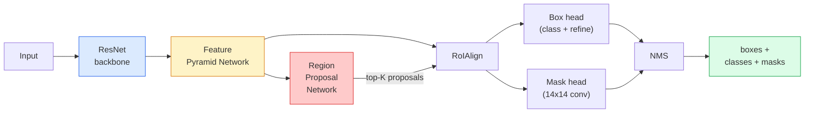

# उदाहरण विभाजन  मुखौटा R-CNN  उदाहरण विभाजन  मुखौटा R-CNN

> एक छोटे से मास्क शाखा फास्टर आर-सीएनएन डिटेक्टर में जोड़ें और आप उदाहरण विभाजन है। कठिन भाग RoIAlign है, और यह कठिन है यह लगता है से.

> **【中文解读】**फास्ट आर-सीएनएन परीक्षक पर एक छिपा हुआ विभाजन जोड़ने पर उदाहरण विभाजन प्राप्त होता है। कठिनाई यह है कि RoIAlign विभिन्न आकार के उम्मीदवार क्षेत्रों को एक साथ एक निश्चित आकार के लक्षण चित्र के साथ बनाए रखेगा, और अंतरिक्ष सटीकता बनाए रखेगा। उदाहरण विभाजन और भाषा विभाजन का अंतर यह है कि उदाहरण विभाजन विभिन्न प्रकार के व्यक्तियों को अलग कर सकता है।

> **【拓展：实例分割的应用】**मास्क आर-सीएनएन  व्यापक रूप से स्वचालित ड्राइविंग में उपयोग किया जाता है 区分不同车辆和行人) 机器人抓取 识别单个物体轮) 视频编辑 精确图)   RoIAlign 技术 बाद में भी विजन ट्रांसफार्मर के एडाप्टर में उपयोग किया जाता है 

**Type:** Build + Learn | **类型:** 动手 + 学习
**Languages:** Python | **语言:** Python
**Prerequisites:** Phase 4 Lesson 06 (YOLO), Phase 4 Lesson 07 (U-Net) | **前置知识:** Phase 4 Lesson 06（YOLO），Phase 4 Lesson 07（U-Net）
**Time:** ~75 minutes | **时间:** ~75 分钟

## सीखने के लक्ष्य

- मास्क आर-सीएनएन आर्किटेक्चर के अंत-से-अंत का पता लगाएंः रीढ़ की हड्डी, एफपीएन, आरपीएन, रोआलिग्न, बॉक्स हेड, मास्क हेड
- RoIAlign को स्क्रैच से लागू करें और समझाएं कि RoIPool का अब उपयोग क्यों नहीं किया जाता है
- मशाल दृष्टि का उपयोग करें `maskrcnn_resnet50_fpn_v2`उत्पादन-गुणवत्ता वाले इंस्टेंट मास्क के लिए पूर्व-प्रशिक्षित मॉडल और इसका आउटपुट प्रारूप सही ढंग से पढ़ें
- बॉक्स और मास्क हेड को बदलकर और रीढ़ की हड्डी को जमे हुए रखकर एक छोटे कस्टम डेटासेट पर फाइन-ट्यून मास्क आर-सीएनएन

> **【中文解读】**सीखने के लक्ष्य इस कक्षा को पूरा करने के बाद जो मूल क्षमताएं होनी चाहिए, उन्हें सूचीबद्ध करते हैं।


## समस्या  समस्या परिचय

अर्थिक विभाजन आपको प्रति वर्ग एक मुखौटा देता है। इंस्टैंस सेगमेंटेशन आपको प्रति वस्तु एक मुखौटा देता है, भले ही दो वस्तुएं एक वर्ग साझा करें। व्यक्तियों की गिनती, फ्रेमों के पार ट्रैकिंग, और चीजों (एक दीवार में प्रत्येक ईंट का सीमांकन बॉक्स, माइक्रोस्कोप छवि में प्रत्येक सेल) मापने के लिए सभी उदाहरण सेगमेंटेशन की आवश्यकता होती है।

> 语义分给你每类一个掩码――实例分给你每类物体一个掩码―― यहां तक कि दो वस्तुएं भी एक ही श्रेणी में आती हैं――数个体、跨跟踪和测量东西―― दीवार में प्रत्येक ब्लॉक के सीमा框、显微镜图像中每细胞) सभी को उदाहरण विभाजन की आवश्यकता है――

मास्क आर-सीएनएन (He et al., 2017) ने इस समस्या को फेस-प्लस-ए-मास्क के रूप में इंस्टेंट सेगमेंट को रीफ्रेमिंग करके हल किया। डिजाइन इतना साफ था कि अगले पांच वर्षों तक लगभग हर इंस्टेंट सेगमेंट पेपर मास्क आर-सीएनएन संस्करण था, और टॉर्चविजन कार्यान्वयन अभी भी छोटे से मध्यम डेटासेट के लिए उत्पादन डिफ़ॉल्ट है।

> मास्क आर-सीएनएन (R-CNN) (He等,2017) द्वारा उदाहरण विभाजन को पुनः परिभाषित करके परीक्षण और छिपाई के लिए इस समस्या को हल करने के लिए डिज़ाइन किया गया है।

कठिन इंजीनियरिंग समस्या नमूनाकरण हैः आप एक प्रस्ताव बॉक्स से एक निश्चित आकार की विशेषता क्षेत्र को कैसे काटते हैं जिसका कोन पिक्सेल सीमाओं के साथ संरेखित नहीं होता है? यह गलत होने पर हर जगह एक मैप बिंदु का दसवां हिस्सा खर्च होता है। RoIAlign जवाब है।

> 困难的工程问题是采样: आप कोण बिंदु से अलग-अलग छवि सीमा के साथ एक समान उम्मीदवार के फ्रेम में एक निश्चित आकार के विशेषता क्षेत्र को कैसे काटते हैं? यह गलत करना कि सभी स्थानों पर सभी शून्य बिंदुओं का नुकसान होगा।

## अवधारणा का मूल अवधारणा

> **【中文解读】**इस भाग में मूल अवधारणाओं और सिद्धांतों की आधारभूत जानकारी दी गई है। इन अवधारणाओं को प्राप्त करना बाद में होने वाली प्रक्रियाओं के लिए एक शर्त है।


### वास्तुकला



पांच टुकड़े समझने के लिएः

1. **Backbone** ResNet-50 या ResNet-101 ImageNet पर प्रशिक्षित। चरण 4, 8, 16, 32 में फीचर मैप्स की पदानुक्रम का उत्पादन करता है।
   中文翻译: ImageNet 上训练的ResNet-50或ResNet-101──生成步幅为4、8、16、32 的层级特征图──
2. **FPN (Feature Pyramid Network)** ऊपर-नीचे + साइडल कनेक्शन जो प्रत्येक स्तर C चैनलों को अर्थिक समृद्ध सुविधाएं देते हैं। डिटेक्शन क्वेरीज वस्तु के आकार से मेल खाने वाले FPN स्तर को देखते हैं।
   चीनी भाषा अनुवादः से ऊपर और नीचे तक कनेक्ट करने के लिए, प्रत्येक स्तर के लिए C 个通道 के लिए अर्थपूर्ण गुण प्रदान करना।
3. **RPN (Region Proposal Network)** एक छोटा सा कन्विल हेड जो हर एंकर स्थिति में "क्या यहां कोई वस्तु है? " और "मैं बॉक्स को कैसे परिष्कृत करूं? " का अनुमान लगाता है। प्रति छवि ~ 1000 प्रस्ताव उत्पन्न करता है।
   एक छोटा सा गुच्छा, प्रत्येक बिंदु पर स्थिति पूर्वानुमान "क्या यहाँ कोई वस्तु है? " और" सीमा सीमा फ्रेम को कैसे सुधारें? "
4. **RoIAlign** किसी भी FPN स्तर पर किसी भी बॉक्स से फिक्स्ड साइज (जैसे 7x7) फीचर पैच का नमूना लें। द्विआधारी नमूनाकरण, कोई मात्रा नहीं।
   中文翻译: किसी भी FPN 级别 के किसी भी फ्रेम में आकार आकार में आकार में आकार में आकार में आकार में आकार में आकार में आकार में आकार में आकार में आकार में आकार में आकार में आकार में आकार में आकार में आकार में आकार में आकार में आकार में आकार में आकार में आकार में आकार में आकार में आकार में आकार में आकार में आकार में आकार में आकार में आकार में आकार में आकार में आकार में आकार में आकार में आकार में आकार में आकार में आकार में आकार में आकार में आकार में आकार में आकार में आकार में आकार में आकार में आकार में आकार में आकार में आकार में आकार में आकार में आकार में आकार में आकार में आकार में आकार में आकार में आकार में आकार में आकार में आकार में आकार में आकार में आकार में आकार में आकार में आकार में आकार में आकार में आकार में आकार में आकार में आकार में आकार में आकार में आकार में आकार में आकार में आकार में आकार में आकार में आकार में आकार में आकार में आकार में आकार में आकार में आकार में आकार में आकार में आकार में आकार में आकार में आकार में आकार में आकार में आकार में आकार में आकार में आकार में आकार में आकार में आकार में आकार में आकार में आकार में आकार में आकार में आकार में आकार में आकार में आकार में आकार में आकार में आकार में आकार में आकार में आकार में आकार में आकार में आकार में आकार में आकार में आकार में आकार में आकार में आकार में आकार में आकार में आकार में आकार में आकार में आकार में आकार में आकार में आकार में आकार में आकार में आकार में आकार में आकार में आकार में आकार में आकार में आकार में आकार में आकार में आकार में आकार में आकार में आकार में आकार में आकार में आकार में आकार में आकार में आकार में आकार में आकार में आकार में आकार में आकार में आकार में आकार में आकार में आकार में आकार में आकार में आकार में आकार में आकार में आकार में आकार में आकार में आकार में आकार में आकार में आकार में आकार में आकार में आकार में आकार में आकार में आकार में आकार में आकार में आकार में आकार में आकार में आकार में आकार में आकार में आकार में आकार में आकार में आकार में आकार में आकार में आकार में आकार में आकार में आकार में आकार में आकार में आकार में आकार में आकार में आकार में आकार में आकार में आकार में आकार में आकार में आकार में आकार में आकार में आकार में आकार में आकार में आकार में आकार में आकार में आकार में आकार में आकार में आकार में आकार में आकार में आकार में आकार में आकार में आकार में आकार में आकार में आकार में आकार में आकार में आकार में आकार में आकार में आकार में आकार
5. **Heads** दो परत बॉक्स हेड जो बॉक्स को परिष्कृत करता है और एक वर्ग चुनता है, प्लस एक छोटा सा कन्विट हेड जो एक आउटपुट देता है `28x28`प्रत्येक प्रस्ताव के लिए द्विआधारी मुखौटा।
   中文翻译: दो स्तरीय बॉक्स सिर के लिए प्रयोग किया जाता है परिधि बॉक्स और चयन वर्ग, प्रत्येक उम्मीदवार क्षेत्र के लिए एक छोटा सा卷积头 के साथ आउटपुट `28x28`का द्वितीयक छिपा हुआ कोडः

### RoIAlign क्यों नहीं RoIPool

मूल फास्ट आर-सीएनएन ने रोइपॉल का उपयोग किया, जो एक प्रस्ताव बॉक्स को ग्रिड में विभाजित करता है, प्रत्येक सेल में अधिकतम विशेषता लेता है, और सभी निर्देशांक को पूर्णांक में गोल करता है। यह गोल करना इनपुट पिक्सेल निर्देशांक से विशेषता मानचित्र को अपर्याप्त करता है। 224x224 छवि पर एक पूर्ण विशेषता मानचित्र पिक्सेल  छोटा होता है, जब विशेषता मानचित्र चरण 32 है।

> मूल फास्ट आर-सीएनएन रोआईपूल का उपयोग करके, यह उम्मीदवारों के फ्रेम को एक नेटवर्क में विभाजित करेगा, प्रत्येक वर्ग में सबसे अधिक विशेषता मान लेगा, और सभी सीटों को चौथे स्थान पर एक पूर्णांक में शामिल करेगा। इस तरह का प्रवेश एक विशेषता छवि के साथ एक इनपुट छवि के लिए एक स्थान पर एक विशेषता छवि तक प्रभावित करेगा। 224x224 के चित्रों पर प्रभाव बहुत छोटा है, लेकिन 32 समय के लिए एक विशेषता छवि का पैमाना विनाशकारी है।

```
RoIPool:
  box (34.7, 51.3, 98.2, 142.9)
  round -> (34, 51, 98, 142)
  split grid -> round each cell boundary
  misalignment accumulates at every step

RoIAlign:
  box (34.7, 51.3, 98.2, 142.9)
  sample at exact float coordinates using bilinear interpolation
  no rounding anywhere
```

RoIAlign ने COCO पर AP मास्क को 3-4 अंक तक मुफ्त में बढ़ा दिया है। स्थानीयकरण के बारे में चिंतित हर डिटेक्टर अब इसका उपयोग  YOLOv7 seg, RT-DETR, Mask2Former दोनों तरह से करता है।

> RoIAlign में COCO 上免费提升掩码 AP 3-4 个点── प्रत्येक ध्यान से पता लगाने की सटीकता का जांचकर्ता अब सभी इसका उपयोग करते हैंYOLOv7 सेग、RT-DETR、Mask2Former 无一例外──

### एक पैराग्राफ में आरपीएन

फीचर मैप की हर स्थिति पर विभिन्न आकारों और आकारों के K एंकर बॉक्स रखें। प्रत्येक एंकर के लिए वस्तुत्व स्कोर और एंकर को बेहतर फिट होने वाले बॉक्स में बदलने के लिए एक प्रतिगमन ऑफसेट की भविष्यवाणी करें। शीर्ष ~ 1,000 बॉक्स स्कोर के अनुसार रखें, 0.7 पर एनएमएस लागू करें, और सिरों को जीवित लोगों को सौंप दें। आरपीएन को अपनी मिनी-लॉस के साथ प्रशिक्षित किया गया है  पाठ 6 से YOLO हानि के समान संरचना, केवल दो वर्गों (वस्तु / कोई वस्तु नहीं) के साथ।

> प्रत्येक स्थान पर K 个 个 个 个 个 个 个 个 个 个 个 个 个 个 个 个 个 个 个 个 个 个 个 个 个 个 个 个 个 个 个 个 个 个 个 个 个 个 个 个 个 个 个 个 个 个 个 个 个 个 个 个 个 个 个 个 个 个 个 个 个 个 个 个 个 个 个 个 个 个 个 个 个 个 个 个 个 个 个 个 个 个 个 个 个 个 个 个 个 个 个 个 个 个 个 个 个 个 个 个 个 个 个 个 个 个 个 个 个 个 个 个 个 个 个 个 个 个 个 个 个 个 个 个 个 个 个 个 个 个 个 个 个 个 个 个 个 个 个 个 个 个 个 个 个 个 个 个 个 个 个 个 个 个 个 个 个 个 个 个 个 个 个 个 个 个 个 个 个 个 个 个 个 个 个 个 个 个 个 个 个 个 个 个 个 个 个 个 个 个 个 个 个 个 个 个 个 个 个 个 个 个 个 个 个 个 个 个 个 个 个 个 个 个 个 个 个 个 个 个 个 个 个 个 个 个 个 个 个 个 个 个 个 个 个 个 个 个 个 个 个 个 个 个 个 个 个 个 个 个 个 个 个

### मुखौटा सिर

प्रत्येक प्रस्ताव के लिए (रोआईएलाइन के बाद) मास्क हेड एक छोटा एफसीएन हैः चार 3x3 convs, एक 2x deconv, एक अंतिम 1x1 conv जो उत्पादन करता है `num_classes` पर आउटपुट चैनल`28x28`केवल पूर्वानुमानित वर्ग के अनुरूप चैनल रखा जाता है; दूसरों को अनदेखा किया जाता है। यह वर्गीकरण से मुखौटा भविष्यवाणी को अलग करता है।

>  प्रत्येक उम्मीदवार क्षेत्र के लिए  (RoIAlign 之后), कवर कडेड एक छोटा FCN हैः चार 3x3 卷积、 एक 2x 反卷积、 एक अंतिम 1x1 卷积, `28x28`फ़ैसला दर पर उत्पन्न`num_classes`个输出通道―― केवल पूर्वानुमान वर्ग के लिए अनुकूलित मार्गों को ही संरक्षित करना; शेष मार्गों को अनदेखा किया जाता है―― यह पूर्वानुमान और पूर्वानुमान वर्ग के समाधान को छिपाएगा──

अंतिम द्विआधारी मुखौटा बनाने के लिए प्रस्ताव के मूल पिक्सेल आकार के लिए 28x28 मुखौटा को ऊपर नमूना दें।

> 28x28 掩码 पर नमूना को उम्मीदवार क्षेत्र के मूल चित्र आकार तक ले जाना, अंतिम दो-मूल्य掩码 का उत्पादन करना

### घाटे

मास्क आर-सीएनएन के चार घाटे हैं जो एक साथ जोड़े गए हैंः

> मुखौटा आर-सीएनएन चार हानि फ़ंक्शन के साथः

```
L = L_rpn_cls + L_rpn_box + L_box_cls + L_box_reg + L_mask
```

- `L_rpn_cls`,`L_rpn_box` आरपीएन प्रस्तावों के लिए वस्तुनिष्ठता + बॉक्स प्रतिगमन।
  中文翻译:RPN 候选区的目标性和边界框归归损失──
- `L_box_cls` सिर के वर्गीकरणकर्ता पर (C+1) वर्गों (ग्राउंड सहित) पर क्रॉस-एंट्रोपी।
  中文翻译:头部分类器上 (C+1) 个类别(含背景) के交叉损失──
- `L_box_reg` सिर के बॉक्स पर चिकनी L1 परिष्करण।
  中文翻译:头部边界框修正的平滑 L1 损失──
- `L_mask` 28x28 मास्क आउटपुट पर प्रति पिक्सेल द्विआधारी क्रॉस-एंट्रोपी।
  中文翻译:28x28 掩码输出上逐像素二元交叉损失──

प्रत्येक हानि का अपना डिफ़ॉल्ट वजन होता है; मशाल दृष्टि कार्यान्वयन उन्हें कंस्ट्रक्टर तर्क के रूप में उजागर करता है।

> प्रत्येक हानि का अपना डिफ़ॉल्ट वजन होता है; टॉर्च विजन  को प्राप्त करने के लिए उन्हें संरचनात्मक फ़ंक्शन पैरामीटर के रूप में उजागर करना 

### आउटपुट प्रारूप

`torchvision.models.detection.maskrcnn_resnet50_fpn_v2`प्रति छवि एक डिक्ट की सूची देता हैः

```
{
    "boxes":  (N, 4) in (x1, y1, x2, y2) pixel coordinates,
    "labels": (N,) class IDs, 0 = background so indices are 1-based,
    "scores": (N,) confidence scores,
    "masks":  (N, 1, H, W) float masks in [0, 1] — threshold at 0.5 for binary,
}
```

> **【中文解读】**इस भाग के माध्यम से कोड को शून्य से लागू किया जा सकता है कोर एल्गोरिदम। इस तरह के "शुरुआत से" तरीके से फ्रेमवर्क के पीछे के सिद्धांत को समझने में मदद मिलेगी, समस्याओं का सामना करते समय ब्लैक बॉक्स में फंस नहीं जाएगा।


मास्क पहले से ही पूर्ण छवि संकल्प है. 28x28 सिर उत्पादन आंतरिक रूप से ऊपर नमूना किया गया है.

> **【拓展：工业部署中的视觉系统】**वास्तविक औद्योगिक तैनाती में, विज़ुअल मॉडल को देरी, मॉडल आकार, किनारे उपकरण अनुकूलन आदि की समस्या पर विचार करने की आवश्यकता होती है। टेन्सरआरटी, ओएनएनएक्स रनटाइम, ओपनवीनो एक सामान्य उपयोग में आने वाला सुझाव त्वरण उपकरण है।

> **【拓展：数据标注与质量】**视觉任务的效果高度依赖标签数据质量──标签工作室、CVAT是主流标签工具──在工业场景中,主动学习(Active Learning) ले标签成本 को कम कर सकता हैः मॉडल अनिश्चित नमूना अनुरोधों के लिए कृत्रिम标签, अनिश्चितता के नमूने स्वचालित标签──


## इसे बनाओ, इसे पूरा करो।
```figure
cv3-roialign-sampling
```

## इसे बनाओ

### चरण 1: आरओआईएलाइनिंग स्क्रैच से

यह मास्क आर-सीएनएन का एक घटक है जिसे प्रोसा की तुलना में कोड के रूप में समझना आसान है।

> यह मास्क आर-सीएनएन में एकमात्र ऐसा घटक है जिसे कोड के साथ समझने में आसान है।

```python
import torch
import torch.nn.functional as F

def roi_align_single(feature, box, output_size=7, spatial_scale=1 / 16.0):
    """
    feature: (C, H, W) single-image feature map
    box: (x1, y1, x2, y2) in original image pixel coordinates
    output_size: side of the output grid (7 for box head, 14 for mask head)
    spatial_scale: reciprocal of the feature map stride
    """
    C, H, W = feature.shape
    x1, y1, x2, y2 = [c * spatial_scale - 0.5 for c in box]
    bin_w = (x2 - x1) / output_size
    bin_h = (y2 - y1) / output_size

    grid_y = torch.linspace(y1 + bin_h / 2, y2 - bin_h / 2, output_size)
    grid_x = torch.linspace(x1 + bin_w / 2, x2 - bin_w / 2, output_size)
    yy, xx = torch.meshgrid(grid_y, grid_x, indexing="ij")

    gx = 2 * (xx + 0.5) / W - 1
    gy = 2 * (yy + 0.5) / H - 1
    grid = torch.stack([gx, gy], dim=-1).unsqueeze(0)
    sampled = F.grid_sample(feature.unsqueeze(0), grid, mode="bilinear",
                            align_corners=False)
    return sampled.squeeze(0)
```

प्रत्येक संख्या एक द्विआधारी नमूना स्थिति पर है. कोई गोल, कोई मात्रा, कोई गिरावट gradients नहीं.

> प्रत्येक संख्यात्मक मूल्य दोतरफा स्थान पर स्थित है। कोई आयाम नहीं है, कोई आयाम नहीं है।

### चरण 2: टॉर्चविजन के RoIAlign की तुलना करें

```python
from torchvision.ops import roi_align

feature = torch.randn(1, 16, 50, 50)
boxes = torch.tensor([[0, 10, 20, 100, 90]], dtype=torch.float32)  # (batch_idx, x1, y1, x2, y2)

ours = roi_align_single(feature[0], boxes[0, 1:].tolist(), output_size=7, spatial_scale=1/4)
theirs = roi_align(feature, boxes, output_size=(7, 7), spatial_scale=1/4, sampling_ratio=1, aligned=True)[0]

print(f"shape ours:   {tuple(ours.shape)}")
print(f"shape theirs: {tuple(theirs.shape)}")
print(f"max|diff|:    {(ours - theirs).abs().max().item():.3e}")
```

के साथ`sampling_ratio=1`और `aligned=True`, दोनों अंदर से मेल खाते हैं `1e-5`. .

> `sampling_ratio=1`且 `aligned=True`时, दोनों के अंतर `1e-5`में

### चरण 3: पूर्व प्रशिक्षित मास्क आर-सीएनएन लोड करें

```python
import torch
from torchvision.models.detection import maskrcnn_resnet50_fpn_v2, MaskRCNN_ResNet50_FPN_V2_Weights

model = maskrcnn_resnet50_fpn_v2(weights=MaskRCNN_ResNet50_FPN_V2_Weights.DEFAULT)
model.eval()
print(f"params: {sum(p.numel() for p in model.parameters()):,}")
print(f"classes (including background): {len(model.roi_heads.box_predictor.cls_score.out_features * [0])}")
```

46M पैरामीटर, 91 वर्ग (COCO) । पहला वर्ग (ID 0) पृष्ठभूमि है; मॉडल वास्तव में पता लगाने वाली सभी चीजें id 1 से शुरू होती हैं।

> 46000000参数,91 个类别(COCO)。第一个类别(id 0) 是背景;模型实际检测所有类别从 id 1 开始。

### चरण 4: निष्कर्ष निकालें

```python
with torch.no_grad():
    x = torch.randn(3, 400, 600)
    predictions = model([x])
p = predictions[0]
print(f"boxes:  {tuple(p['boxes'].shape)}")
print(f"labels: {tuple(p['labels'].shape)}")
print(f"scores: {tuple(p['scores'].shape)}")
print(f"masks:  {tuple(p['masks'].shape)}")
```

मुखौटा टेन्सर आकार है `(N, 1, H, W)`प्रति वस्तु द्विआधारी मास्क प्राप्त करने के लिए 0.5 पर सीमाः

> 掩码张量形为 `(N, 1, H, W)` 0.5 के लिए प्रत्येक वस्तु के द्वि-मूल्य छिपाव प्राप्त करेंः

```python
binary_masks = (p['masks'] > 0.5).squeeze(1)  # (N, H, W) boolean
```

### चरण 5: कस्टम वर्ग गणना के लिए सिर स्विच

सामान्य सूक्ष्म-ट्यूनिंग नुस्खाः रीढ़ की हड्डी, एफपीएन और आरपीएन का पुनः उपयोग करें; दो वर्गीकरण प्रमुखों को प्रतिस्थापित करें।

> 常见的微调方案: पुनः उपयोग骨干网络、FPN 和 RPN; दो वर्ग के सिरों को प्रतिस्थापित करना

```python
from torchvision.models.detection.faster_rcnn import FastRCNNPredictor
from torchvision.models.detection.mask_rcnn import MaskRCNNPredictor

def build_custom_maskrcnn(num_classes):
    model = maskrcnn_resnet50_fpn_v2(weights=MaskRCNN_ResNet50_FPN_V2_Weights.DEFAULT)
    in_features = model.roi_heads.box_predictor.cls_score.in_features
    model.roi_heads.box_predictor = FastRCNNPredictor(in_features, num_classes)
    in_features_mask = model.roi_heads.mask_predictor.conv5_mask.in_channels
    hidden_layer = 256
    model.roi_heads.mask_predictor = MaskRCNNPredictor(in_features_mask, hidden_layer, num_classes)
    return model

custom = build_custom_maskrcnn(num_classes=5)
print(f"custom cls_score.out_features: {custom.roi_heads.box_predictor.cls_score.out_features}")
```

`num_classes`पृष्ठभूमि वर्ग शामिल करना चाहिए, इसलिए 4 वस्तु वर्गों के साथ डेटासेट का उपयोग करता है `num_classes=5`. .

> `num_classes` पृष्ठभूमि वर्गों को शामिल करना चाहिए, इसलिए 4 वस्तु वर्गों के डेटा संग्रह का उपयोग करना चाहिए `num_classes=5`

### चरण 6: प्रशिक्षण की आवश्यकता न होने वाली चीज़ों को ठंढें

छोटे डेटा सेट पर, रीढ़ की हड्डी और FPN को फ्रीज करें। केवल RPN वस्तु + प्रतिगमन और दो सिर सीखते हैं।

> छोटे डेटा संग्रह में, केवल आरपीएन के लक्ष्य + वापसी और दो प्रमुख भागों में भाग लेने के लिए।

```python
def freeze_backbone_and_fpn(model):
    # torchvision Mask R-CNN packs the FPN inside `model.backbone` (as
    # `model.backbone.fpn`), so iterating `model.backbone.parameters()` covers
    # both the ResNet feature layers and the FPN lateral/output convs.
    for p in model.backbone.parameters():
        p.requires_grad = False
    return model

custom = freeze_backbone_and_fpn(custom)
trainable = sum(p.numel() for p in custom.parameters() if p.requires_grad)
print(f"trainable after freeze: {trainable:,}")
```

> **【中文解读】**इस भाग में दिखाया गया है कि इस तकनीक को कैसे तेजी से लागू किया जाए। इस प्रकार के एक परिपक्व ढांचे का उपयोग करके बग कम किए जा सकते हैं और विकास दक्षता में सुधार किया जा सकता है।


500 चित्र डेटासेट पर यह अभिसरण और अति-अनुकूलन के बीच का अंतर है।


> **【拓展：视觉模型的持续学习】**उत्पादन वातावरण में, दृश्य मॉडल को नए डेटा को लगातार अनुकूलित करने की आवश्यकता होती है। यह ऑटोमोटिव ड्राइविंग और औद्योगिक गुणवत्ता जांच में विशेष रूप से महत्वपूर्ण है।

## इसे फ्रेमवर्क के साथ लागू करें

मशाल दृष्टि में मास्क आर-सीएनएन के लिए पूर्ण प्रशिक्षण लूप 40 पंक्तियों का है और कार्य  आदान-प्रदान डेटा सेट और जाने के बीच सार्थक रूप से नहीं बदलता है।

```python
def train_step(model, images, targets, optimizer):
    model.train()
    loss_dict = model(images, targets)
    losses = sum(loss for loss in loss_dict.values())
    optimizer.zero_grad()
    losses.backward()
    optimizer.step()
    return {k: v.item() for k, v in loss_dict.items()}
```

`targets`सूची में प्रति छवि के साथ लेख होना चाहिए `boxes`,`labels`और `masks`(जैसे `(num_instances, H, W)`मॉडल प्रशिक्षण के दौरान चार नुकसान का एक डिक्ट और मूल्यांकन के दौरान भविष्यवाणियों की एक सूची, पर टैग किया पर वापस करता है `model.training`. .

`pycocotools`evaluator बॉक्स और मास्क दोनों के लिए mAP@IoU=0.5:0.95 उत्पन्न करता है; आपको यह जानने के लिए दोनों संख्याओं की आवश्यकता है कि क्या बॉक्स हेड या मास्क हेड बोतल की गर्दन है।

> **【中文解读】**इस खंड में इस बात पर ध्यान दिया गया है कि मॉडल को उपलब्ध उत्पादों के रूप में कैसे तैनात किया जाए। मूल से लेकर उत्पादन स्तर तक, प्रदर्शन अनुकूलन, त्रुटि प्रसंस्करण, निगरानी आदि के कई आयामों पर विचार करने की आवश्यकता है।


## इसे भेजें उत्पाद

इस पाठ से उत्पन्न होता हैः

> **【中文解读】**练习题按照易/中级/难度递进;;建议至少完成中级题,Hard级适合深入研究或面试准备;;


- `outputs/prompt-instance-vs-semantic-router.md` एक प्रम्प्ट जो तीन प्रश्न पूछता है और उदाहरण बनाम अर्थिक बनाम पैनप्टिक प्लस सटीक मॉडल चुनता है।
- `outputs/skill-mask-rcnn-head-swapper.md` एक कौशल जो किसी भी मशाल दृष्टि का पता लगाने मॉडल पर सिर बदलने के लिए कोड की 10 पंक्तियों को उत्पन्न करता है, नई दी गई है `num_classes`. .

## अभ्यास विषय

1. **(Easy)**अपने RoIAlign के खिलाफ सत्यापित करें`torchvision.ops.roi_align`100 यादृच्छिक बक्से पर। अधिकतम पूर्ण अंतर की रिपोर्ट करें। RoIPool (पूर्व 2017 व्यवहार) भी चलाएं और सीमा के पास बक्से पर यह ~ 1-2 फीचर मैप पिक्सल से भिन्न होता है।
2. **(Medium)**ठीक-ठीक `maskrcnn_resnet50_fpn_v2`50 चित्रों के कस्टम डेटासेट पर (किसी भी दो वर्गः गुब्बारे, मछली, गड्ढे, लोगो) रीढ़ की हड्डी को फ्रीज करें, 20 युगों के लिए ट्रेन करें, रिपोर्ट मास्क AP@0.5।
3. **(Hard)**मास्क आर-सीएनएन के मास्क हेड को 28x28 के बजाय 56x56 पर भविष्यवाणी करने वाले हेड से बदलें। mAP@IoU = 0.75 को पहले और बाद में मापें। समझाएं कि लाभ (या एक की कमी) अपेक्षित सीमा-सटीकता / मेमोरी ट्रेडऑफ से क्यों मेल खाता है।

> **【中文解读】**术语表中的"क्या लोग कहते हैं" बनाम "क्या वास्तव में इसका मतलब है" 区分日常口语和精确技术含义──在团队协作中,统一术语定义可以避免大量沟通误解──


## कीवर्ड्स  शब्द खोज तालिका

| Term | What people say | What it actually means |
|------|----------------|----------------------|
| Mask R-CNN | "Detection plus masks" | Faster R-CNN + a small FCN head that predicts a 28x28 mask per proposal per class |
| FPN | "Feature pyramid" | Top-down + lateral connections that give every stride level C channels of semantic-rich features |
| RPN | "Region proposer" | A small conv head that produces ~1000 object/no-object proposals per image |
| RoIAlign | "No-rounding crop" | Bilinearly samples a fixed-size feature grid from any float-coordinate box |
| RoIPool | "Pre-2017 crop" | Same purpose as RoIAlign but rounds box coordinates; obsolete |
| Mask AP | "Instance mAP" | Average precision computed with mask IoU instead of box IoU; the COCO instance segmentation metric |
| Binary mask head | "Per-class mask" | Predicts one binary mask per class for each proposal; only the predicted class's channel is kept |
| Background class | "Class 0" | The catch-all "no object" class; indices for real classes start at 1 |

> **【中文解读】**延伸阅读 प्रदान करता है गहन सीखने के लिए उच्च गुणवत्ता वाले संसाधनों। ये लेख और पाठ्यक्रम इस क्षेत्र के लिए क्लासिक संदर्भ हैं, जो गहन समझ की आवश्यकता वाले पाठकों के लिए उपयुक्त हैं।


## आगे पढ़ना 延伸閱讀

- [Mask R-CNN (He et al., 2017)](https://arxiv.org/abs/1703.06870) पेपर; RoIAlign पर अनुभाग 3 महत्वपूर्ण पाठ है
- [FPN: Feature Pyramid Networks (Lin et al., 2017)](https://arxiv.org/abs/1612.03144) एफपीएन पेपर; हर आधुनिक डिटेक्टर इसका उपयोग करता है
- [torchvision Mask R-CNN tutorial](https://pytorch.org/tutorials/intermediate/torchvision_tutorial.html) सूक्ष्म समायोजन लूप के लिए संदर्भ
- [Detectron2 model zoo](https://github.com/facebookresearch/detectron2/blob/main/MODEL_ZOO.md) लगभग प्रत्येक डिटेक्शन और सेगमेंटेशन वेरिएंट के लिए प्रशिक्षित वजन के साथ उत्पादन कार्यान्वयन
