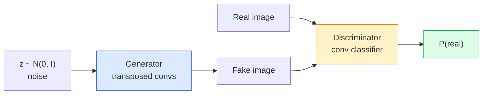
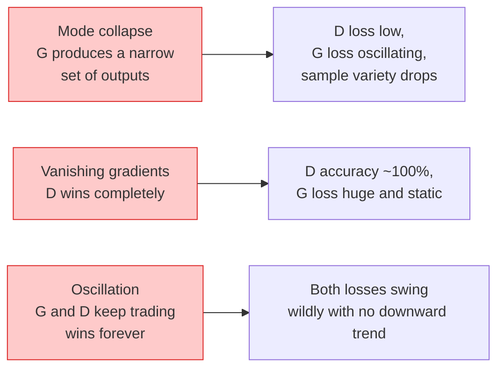

# छवि पीढ़ी  GANs  छवि पीढ़ी  उत्पादन के खिलाफ नेटवर्क

> एक GAN एक निश्चित खेल में दो तंत्रिका नेटवर्क है एक ड्रॉ, एक आलोचना। वे एक साथ बेहतर हो जाते हैं जब तक कि चित्र आलोचक को मूर्ख नहीं बनाते।

> **【中文解读】**GAN (Generator Against Network) दो तंत्रिका नेटवर्क के एक भाग हैं: जनरेटर पेंटिंग,判别器挑毛病, दोनों एक साथ प्रगति करते हैं, जब तक जनरेटर को दोष नहीं दिया जाता।

> **【拓展：GAN 的遗产】**GAN में StyleGAN में ([[人脸生成]]),[[CycleGAN]] में [[风格迁移]],[[Super-Resolution GAN]] में [[图像超分辨率]] का उपयोग काफी महत्वपूर्ण है।

**Type:** Build | **类型:** 动手
**Languages:** Python | **语言:** Python
**Prerequisites:** Phase 4 Lesson 03 (CNNs), Phase 3 Lesson 06 (Optimizers), Phase 3 Lesson 07 (Regularization) | **前置知识:** Phase 4 Lesson 03（CNN），Phase 3 Lesson 06（优化器），Phase 3 Lesson 07（正则化）
**Time:** ~75 minutes | **时间:** ~75 分钟

## सीखने के लक्ष्य

- जनरेटर और भेदभावकर्ता के बीच न्यूनतम खेल की व्याख्या करें और संतुलन p_model = p_data के अनुरूप क्यों है
- PyTorch में एक DCGAN लागू करें और इसे 60 से कम लाइनों में सुसंगत 32x32 सिंथेटिक छवियों उत्पन्न करने के लिए प्राप्त करें
- तीन मानक ट्रिक्स के साथ GAN प्रशिक्षण को स्थिर करेंः गैर-स saturating हानि, स्पेक्ट्रल मानदंड, TTUR (दो-टाइम-स्केल अपडेट नियम)
- प्रशिक्षण वक्रों को पढ़ें जो मोड कोलप, ओस्किलेशन और भेदभाव-जीत-पूर्ण से स्वस्थ अभिसरण को अलग करते हैं

> **【中文解读】**सीखने के लक्ष्य इस कक्षा को पूरा करने के बाद जो मूल क्षमताएं होनी चाहिए, उन्हें सूचीबद्ध करते हैं।


## समस्या  समस्या परिचय

वर्गीकरण एक नेटवर्क को छवियों को लेबल पर मैप करने के लिए सिखाता है। पीढ़ी समस्या को उलट देती हैः नए छवियों का नमूना लें जो ऐसा लगते हैं जैसे वे एक ही वितरण से आए हैं। कोई "सही" आउटपुट नहीं है जिसके खिलाफ आप भिन्न हो सकते हैं; केवल एक वितरण है जिसे आप नक्कल करना चाहते हैं।

> विभाजनात्मक नेटवर्क छवि को टैग पर मैप करेगा। यह प्रश्न उलट-पुलट हुआः नमूना समान वितरण वाली नई छवि से प्रतीत होता है।

मानक हानि फ़ंक्शन (MSE, क्रॉस-एंट्रोपी) "क्या यह नमूना वास्तविक वितरण से आया है" को माप नहीं सकते। प्रति पिक्सेल त्रुटि को कम करने से धुंधली औसत उत्पन्न होती है, यथार्थवादी नमूने नहीं। सफलता नुकसान को सीखना थाः एक दूसरे नेटवर्क को प्रशिक्षित करना जिसका काम वास्तविक से नकली को अलग करना है, और जनरेटर को धक्का देने के लिए अपने निर्णय का उपयोग करना।

> 标准损失函数(MSE、交叉) यह माप नहीं कर सकता है कि यह नमूना वास्तविक वितरण से आया है या नहीं।

GANs (Goodfellow et al., 2014) ने उस ढांचे को परिभाषित किया। 2018 तक StyleGAN 1024x1024 चेहरे का उत्पादन कर रहा था जो तस्वीरों से अलग नहीं हो सकते थे। तब से प्रसार मॉडल ने गुणवत्ता और नियंत्रण में सिंहासन संभाला है, लेकिन प्रत्येक चाल जो प्रसार को व्यावहारिक बनाती है  सामान्यीकरण विकल्प, लटेंट स्पेस, सुविधा हानि  पहली बार GAN पर समझा गया था।

> GAN(Goodfellow आदि, २०१४ ने उस ढांचे को परिभाषित किया। 2018 तक StyleGAN  ने तस्वीरों के साथ असंगत 1024x1024 面部 का उत्पादन कर सका। विस्तार मॉडल ने गुणवत्ता और नियंत्रण में बाद में अपना स्थान हासिल किया, लेकिन विस्तार के व्यावहारिक उपयोग की प्रत्येक तकनीक  एकीकरण चयन,潜空间, विशेषता हानि को सबसे पहले GAN पर समझा गया था।

## अवधारणा का मूल अवधारणा

> **【中文解读】**इस भाग में मूल अवधारणाओं और सिद्धांतों की आधारभूत जानकारी दी गई है। इन अवधारणाओं को प्राप्त करना बाद में होने वाली प्रक्रियाओं के लिए एक शर्त है।


### दोनों नेटवर्क



**generator**G शोर का वेक्टर लेता है `z`और एक छवि आउटपुट करता है।**discriminator**D एक छवि लेता है और एक एकल स्केलर आउटपुट करता हैः छवि वास्तविक होने की संभावना।

> **生成器**G 接收噪音向量 `z`और एक तस्वीर का उत्पादन किया**判别器**D 接收一张图像并输出一个标量: इस图像为真实图像的概率──

### खेल

जी चाहता है कि डी गलत हो। डी सही होना चाहता है। औपचारिक रूप सेः

> G आशा D 判断错, D आशा判断正确――形式化地:

```
min_G max_D  E_x[log D(x)] + E_z[log(1 - D(G(z)))]
```

दाएं से बाएं पढ़ेंः D वास्तविक पर सटीकता अधिकतम कर रहा है (`log D(real)`) और नकली (`log (1 - D(fake))`) छवियों. G नकली पर D की सटीकता को कम कर रहा है  वह चाहता है `D(G(z))`उच्च होने के लिए.

> से दाएं से बाईं ओर पढ़ने के लिए:D`log D(real)`) और झूठी छवि(`log(1 - D(fake))`) की वर्गीकरण सटीकता दर। G में न्यूनतम D पर फर्जी छवियों की वर्गीकरण सटीकता दर  यह चाहता है `D(G(z))`尽可能高.

गुडफेलो ने साबित किया कि इस न्यूनतम में वैश्विक संतुलन है जहां `p_G = p_data`, डी हर जगह 0.5 आउटपुट है, और उत्पन्न और वास्तविक वितरण के बीच जेन्सेन-शैनन विचलन शून्य है. कठिन भाग वहाँ प्राप्त करने के लिए है.

> अच्छा आदमी इस बहुत छोटे बहुत बड़े खेल के अस्तित्व को साबित किया है, इस समय`p_G = p_data`,D सभी स्थानों पर 0.5 आउटपुट उत्पन्न वितरण और वास्तविक वितरण के बीच जेन्सेन-शैनन षण्णता शून्य है। कठिनाई का हिस्सा है कि संतुलन कैसे प्राप्त करें।

### न संतोषजनक हानि

उपरोक्त रूप संख्यात्मक रूप से अस्थिर है। प्रशिक्षण के शुरुआती समय में,`D(G(z))`हर नकली के लिए लगभग शून्य है, तो `log(1 - D(G(z)))`G के संबंध में गायब हो रहे gradients है. फिक्सः फ्लिप G का नुकसान.

> उपरोक्त प्रारूप में संख्यात्मक मूल्य पर अस्थिरता।`D(G(z))`प्रत्येक नकली नमूना शून्य के करीब है, इसलिए `log(1 - D(G(z)))`G के gradient के लिए प्रवृत्ति गायब हो जाती है।

```
L_D = -E_x[log D(x)] - E_z[log(1 - D(G(z)))]
L_G = -E_z[log D(G(z))]                          # non-saturating
```

अब कब`D(G(z))`जी का नुकसान बड़ा है और इसका ग्रेडिएंट सूचनात्मक है. हर आधुनिक जीएएन इस प्रकार के साथ ट्रेनों.

> 现在,当 `D(G(z))`接近零时,G का नुकसान बहुत बड़ा,梯度信息充足── प्रत्येक आधुनिक GAN सभी इस परिवर्तन प्रशिक्षण का उपयोग करते हैं──

### डीसीजीएएन वास्तुकला नियम

Radford, Metz, Chintala (2015) ने वर्षों के असफल प्रयोगों को पांच नियमों में विभाजित किया जो GAN प्रशिक्षण को स्थिर बनाते हैंः

> Radford、Metz、Chintala(2015) will多年失败实验的经验提炼为五条使GAN 训练稳定的规则:

1. एकजुटता को चरणबद्ध कन्व (दोनों जाल) से प्रतिस्थापित करें।
   中文翻译:用步幅卷积替代池化层 (दो网络都适用)
2. G के आउटपुट और D के इनपुट को छोड़कर जनरेटर और भेदभावकर्ता दोनों में बैच मानदंड का उपयोग करें।
   चीनी अनुवादः जनरेटर और निर्णयकर्ता में सभी समूह एकीकरण का उपयोग करते हैं, लेकिन G का आउटपुट लेयर और D का इनपुट लेयर को छोड़कर।
3. गहरे वास्तुकला पर पूरी तरह से जुड़े परतों को हटा दें।
   中文翻译:                                                                                                                                                                                                                                                             
4. G आउटपुट को छोड़कर सभी परतों पर ReLU का उपयोग करता है ([-1, 1] में आउटपुट के लिए टैन) ।
   中文翻译:G 在所有层使用 ReLU,输出层除外(输出层用 tanh 将值域限制在 [-1, 1])。
5. D सभी परतों पर LeakyReLU (नकारात्मक_झल = 0.2) का उपयोग करता है।
   中文翻译:D 在所有层使用LeakyReLU(负斜率=0.2)。

हर आधुनिक कंवा-आधारित GAN (स्टाइलगेन, बिगगेन, गिगागेन) अभी भी इन नियमों से शुरू होता है और एक-एक करके टुकड़े बदल देता है।

> प्रत्येक आधुनिक वॉल्यूम आधारित GAN (StyleGAN, BigGAN, GigaGAN) अभी भी इन नियमों से उत्पन्न होता है, उनमें से प्रत्येक घटक को प्रतिस्थापित करता है।

### विफलता मोड और उनके हस्ताक्षर



- **Mode collapse**: G एक छवि पाता है जो D को मूर्ख बनाता है और केवल वही उत्पन्न करता है। फिक्सः मिनी बैच भेदभाव, स्पेक्ट्रल मानदंड, या लेबल-कंडीशनिंग जोड़ें।
  中文翻译:模式塌G 找到一张能骗过D的图像,然后只生成那张──修复:添加小批量判别、谱归归归归归归归归归归归归归归归归归归归归归归归归归归归归归归归归归归归归归归归归归归归归归归归归归归归归归归归归归归归归归归归归归归归归归归归归归归归归归归归归归归归归归归归归归归归归归归归归归归归归归归归归归归归归归归归归归归归归归归归归归归归归归归归归归归归归归归归归归归归归归归归归归归归归归归归归归归归归归归归归归归归归归归归归归归归归归归归归归归归归归归归归归归归归归归归归归归归归归归归归归归归归归归归归归归归归归归归归归归归归归归归归归归归归归归归归归归归归归归归归归归归归归归归归归归归归归归归归归归归归归归归归归归归归归归归归归归归归归归归归归归归归归归归归归归归归归归归归归归归归归归归归归归归归归归归归归归归归归归归归归归归归归归归归归归归归归归归归归归归归归归归归归归归归归归归归归归归归归归归归归归归归归归归归归归归归归归归归归归归归归归归归归归归归归归归归归归归归归归归归归归归归归归归归归归归归归归归归归归归归归归归归归归归归归归归归归归归归归归归归归归归归归归归归归归归归归归归归归归归归归归归归归归归归归归
- **Discriminator wins**D बहुत मजबूत हो जाता है, G के ग्रेडिएंट गायब हो जाते हैं। ठीकः छोटे D, कम D सीखने की दर, या वास्तविक लेबल पर लेबल चिकनाई लागू करें।
  चीनी अनुवादः判别器完胜D 变得太强太快,G 的梯度消失──修复:缩小 D、降低 D 学习率或对真实标签进行平滑──
- **Oscillation**TTUR (D G से 2-4 गुना तेजी से सीखता है), या Wasserstein हानि पर स्विच करें।
  中文翻译:振荡两个网络交换占优,永远无法接近平衡──修复:TTUR(D比 G 快 2-4倍) 或切换到瓦斯斯特林 损失──

### मूल्यांकन

जीएएन के पास कोई जमीन की सच्चाई नहीं है, तो आप कैसे जानते हैं कि वे काम कर रहे हैं?

> GAN 没有标准答案, तो कैसे पता करें कि वे सामान्य रूप से काम कर रहे हैं?

- **Sample inspection** बस प्रत्येक युग के अंत में 64 नमूनों को देखें।
  中文翻译:样本检查每时代 结束时看64个样本──这是不可省的步骤──
- **FID (Fréchet Inception Distance)** वास्तविक और उत्पन्न सेटों के वितरण के बीच की दूरी।
  中文翻译:FID(Fréchet Inception Distance) 真实集和生成集在 Inception-v3 विशेषताएं वितरण के बीच की दूरी──越低越好──社区标准──
- **Inception Score** वृद्ध, अधिक नाजुक; एफआईडी पसंद करते हैं।
  中文翻译:Inception Score较老、较脆弱;优先使用FID──
- **Precision/Recall for generative models** गुणवत्ता (सटीकता) और कवरेज (रिटर्न) को अलग से मापता है।
  चीनी अनुवादः उत्पन्न मॉडल की सटीकता दर/कॉल-इन दर分别衡量质量精确率) और覆盖度召回率比单独的FID更有信息量

छोटे संश्लेषण डेटा रन के लिए नमूना निरीक्षण पर्याप्त है।

> छोटे पैमाने पर संश्लेषित डेटा प्रयोगों के लिए, नमूना जांच पर्याप्त है

> **【中文解读】**इस भाग के माध्यम से कोड को शून्य से लागू किया जा सकता है कोर एल्गोरिदम। इस तरह के "शुरुआत से" तरीके से फ्रेमवर्क के पीछे के सिद्धांत को समझने में मदद मिलेगी, समस्याओं का सामना करते समय ब्लैक बॉक्स में फंस नहीं जाएगा।

> **【拓展：工业部署中的视觉系统】**वास्तविक औद्योगिक तैनाती में, विज़ुअल मॉडल को देरी, मॉडल आकार, किनारे उपकरण अनुकूलन आदि की समस्या पर विचार करने की आवश्यकता होती है। टेन्सरआरटी, ओएनएनएक्स रनटाइम, ओपनवीनो एक सामान्य उपयोग में आने वाला सुझाव त्वरण उपकरण है।

> **【拓展：数据标注与质量】**视觉任务的效果高度依赖标签数据质量──标签工作室、CVAT是主流标签工具──在工业场景中,主动学习(Active Learning) ले标签成本 को कम कर सकता हैः मॉडल अनिश्चित नमूना अनुरोधों के लिए कृत्रिम标签, अनिश्चितता के नमूने स्वचालित标签──


## इसे बनाओ, इसे पूरा करो।
```figure
cv-gan-image
```

## इसे बनाओ

### चरण 1: जनरेटर

एक छोटा डीसीजीएएन जनरेटर जो 64 आयामी शोर लेता है और 32x32 छवि का उत्पादन करता है।

> एक छोटे सीसीजीएएन उत्पादक, 64 维 शोर प्राप्त और 32x32 图像生成

```python
import torch
import torch.nn as nn

class Generator(nn.Module):
    def __init__(self, z_dim=64, img_channels=3, feat=64):
        super().__init__()
        self.net = nn.Sequential(
            nn.ConvTranspose2d(z_dim, feat * 4, kernel_size=4, stride=1, padding=0, bias=False),
            nn.BatchNorm2d(feat * 4),
            nn.ReLU(inplace=True),
            nn.ConvTranspose2d(feat * 4, feat * 2, kernel_size=4, stride=2, padding=1, bias=False),
            nn.BatchNorm2d(feat * 2),
            nn.ReLU(inplace=True),
            nn.ConvTranspose2d(feat * 2, feat, kernel_size=4, stride=2, padding=1, bias=False),
            nn.BatchNorm2d(feat),
            nn.ReLU(inplace=True),
            nn.ConvTranspose2d(feat, img_channels, kernel_size=4, stride=2, padding=1, bias=False),
            nn.Tanh(),
        )

    def forward(self, z):
        return self.net(z.view(z.size(0), -1, 1, 1))
```

चार ट्रांसपोस्टेड कन्वे, प्रत्येक के साथ `kernel_size=4, stride=2, padding=1`तो वे साफ स्थानिक आकार दोगुना. आउटपुट सक्रियण में [-1, 1] via tanh.

> चार रूपांतरण खंड, प्रत्येक उपयोग `kernel_size=4, stride=2, padding=1`इसलिये शुद्ध भूमि में अंतरिक्ष आकार दुगुना होगा।

### चरण 2: भेदभाव

जनरेटर का दर्पण. लीकरीलु, कदम convs, एक स्केलर लॉजिट के साथ समाप्त होता है.

> 生成器的镜像──LeakyReLU、步幅卷积,最终输出一个标量逻辑──

```python
class Discriminator(nn.Module):
    def __init__(self, img_channels=3, feat=64):
        super().__init__()
        self.net = nn.Sequential(
            nn.Conv2d(img_channels, feat, kernel_size=4, stride=2, padding=1),
            nn.LeakyReLU(0.2, inplace=True),
            nn.Conv2d(feat, feat * 2, kernel_size=4, stride=2, padding=1, bias=False),
            nn.BatchNorm2d(feat * 2),
            nn.LeakyReLU(0.2, inplace=True),
            nn.Conv2d(feat * 2, feat * 4, kernel_size=4, stride=2, padding=1, bias=False),
            nn.BatchNorm2d(feat * 4),
            nn.LeakyReLU(0.2, inplace=True),
            nn.Conv2d(feat * 4, 1, kernel_size=4, stride=1, padding=0),
        )

    def forward(self, x):
        return self.net(x).view(-1)
```

अंतिम कन्वर्ट एक `4x4` तक विशेषता मानचित्र`1x1`. आउटपुट प्रति छवि एक स्केलर है; हानि गणना के दौरान सिग्मोइड का उपयोग करें।

> अंतिम एक卷 `4x4`विशेषताओं को संकुचित करने के लिए`1x1` प्रति张图像输出一个标量; केवल हानि गणना करते समय लागू करें

### चरण 3: प्रशिक्षण चरण

वैकल्पिकः एक बार डी अद्यतन, फिर जी एक बार, प्रत्येक बैच.

> 交替进行: प्रत्येक बैच 先更新 D 一次,再更新 G 一次──

```python
import torch.nn.functional as F

def train_step(G, D, real, z, opt_g, opt_d, device):
    real = real.to(device)
    bs = real.size(0)

    # D step
    opt_d.zero_grad()
    d_real = D(real)
    d_fake = D(G(z).detach())
    loss_d = (F.binary_cross_entropy_with_logits(d_real, torch.ones_like(d_real))
              + F.binary_cross_entropy_with_logits(d_fake, torch.zeros_like(d_fake)))
    loss_d.backward()
    opt_d.step()

    # G step
    opt_g.zero_grad()
    d_fake = D(G(z))
    loss_g = F.binary_cross_entropy_with_logits(d_fake, torch.ones_like(d_fake))
    loss_g.backward()
    opt_g.step()

    return loss_d.item(), loss_g.item()
```

`G(z).detach()`D चरण महत्वपूर्ण हैः हम नहीं चाहते कि ग्रेडिएंट G में प्रवाह के दौरान इसके अद्यतन. यह भूलना है कि क्लासिक शुरुआती बग है.

> D 步骤中的 `G(z).detach()`至关重要: हम नहीं चाहते कि डी के अपडेट के दौरान ग्रेड वापस G. भूलना एक आम शुरुआती त्रुटि है।

### चरण 4: सिंथेटिक आकारों पर पूर्ण प्रशिक्षण लूप

```python
from torch.utils.data import DataLoader, TensorDataset
import numpy as np

def synthetic_images(num=2000, size=32, seed=0):
    rng = np.random.default_rng(seed)
    imgs = np.zeros((num, 3, size, size), dtype=np.float32) - 1.0
    for i in range(num):
        r = rng.uniform(6, 12)
        cx, cy = rng.uniform(r, size - r, size=2)
        yy, xx = np.meshgrid(np.arange(size), np.arange(size), indexing="ij")
        mask = (xx - cx) ** 2 + (yy - cy) ** 2 < r ** 2
        color = rng.uniform(-0.5, 1.0, size=3)
        for c in range(3):
            imgs[i, c][mask] = color[c]
    return torch.from_numpy(imgs)

device = "cuda" if torch.cuda.is_available() else "cpu"
data = synthetic_images()
loader = DataLoader(TensorDataset(data), batch_size=64, shuffle=True)

G = Generator(z_dim=64, img_channels=3, feat=32).to(device)
D = Discriminator(img_channels=3, feat=32).to(device)
opt_g = torch.optim.Adam(G.parameters(), lr=2e-4, betas=(0.5, 0.999))
opt_d = torch.optim.Adam(D.parameters(), lr=2e-4, betas=(0.5, 0.999))

for epoch in range(10):
    for (batch,) in loader:
        z = torch.randn(batch.size(0), 64, device=device)
        ld, lg = train_step(G, D, batch, z, opt_g, opt_d, device)
    print(f"epoch {epoch}  D {ld:.3f}  G {lg:.3f}")
```

`Adam(lr=2e-4, betas=(0.5, 0.999))`डीसीजीएएन डिफ़ॉल्ट है  कम बीटा 1 गति अवधि को विरोधी खेल को बहुत अधिक स्थिर करने से रोकता है।

> `Adam(lr=2e-4, betas=(0.5, 0.999))`यह डीसीजीएएन की डिफ़ॉल्ट कॉन्फ़िगरेशन है_ कम बीटा1_ से रोकें_

### चरण 5: नमूनाकरण

```python
@torch.no_grad()
def sample(G, n=16, z_dim=64, device="cpu"):
    G.eval()
    z = torch.randn(n, z_dim, device=device)
    imgs = G(z)
    imgs = (imgs + 1) / 2
    return imgs.clamp(0, 1)
```

हमेशा नमूना लेने से पहले मूल्यांकन मोड पर स्विच करें। DCGAN के लिए यह मायने रखता है क्योंकि बैच मानदंड चलाने के आंकड़े बैच के आंकड़ों के बजाय उपयोग किए जाते हैं।

> 采样前务必切换到 eval 模式――DCGAN के लिए यह महत्वपूर्ण है, क्योंकि बैच एकीकरण का उपयोग संचालन समय की सांख्यिकी के बजाय वर्तमान बैच की सांख्यिकी के साथ किया जाएगा।

### चरण 6: स्पेक्ट्रल सामान्यीकरण

नेटवर्क की गारंटी देने वाले भेदभावकर्ता में बीएन के लिए एक ड्रॉप-इन प्रतिस्थापन 1-लिप्सचिट है। अधिकांश "डी बहुत मुश्किल से जीतता है" विफलताओं को ठीक करता है।

> 谱归结是判别器中批归结的即插即用替代方案,保证网络是1-Lipschitz的──能修复大多数"D 赢得太彻底"的问题──

```python
from torch.nn.utils import spectral_norm

def build_sn_discriminator(img_channels=3, feat=64):
    return nn.Sequential(
        spectral_norm(nn.Conv2d(img_channels, feat, 4, 2, 1)),
        nn.LeakyReLU(0.2, inplace=True),
        spectral_norm(nn.Conv2d(feat, feat * 2, 4, 2, 1)),
        nn.LeakyReLU(0.2, inplace=True),
        spectral_norm(nn.Conv2d(feat * 2, feat * 4, 4, 2, 1)),
        nn.LeakyReLU(0.2, inplace=True),
        spectral_norm(nn.Conv2d(feat * 4, 1, 4, 1, 0)),
    )
```

> **【中文解读】**इस भाग में दिखाया गया है कि इस तकनीक को कैसे तेजी से लागू किया जाए। इस प्रकार के एक परिपक्व ढांचे का उपयोग करके बग कम किए जा सकते हैं और विकास दक्षता में सुधार किया जा सकता है।


स्वैप `Discriminator`के लिए`build_sn_discriminator()`स्पेक्ट्रल मानदंड सबसे आसान एकल मजबूती उन्नयन है आप लागू कर सकते हैं।

> `Discriminator`替换为 `build_sn_discriminator()` सामान्यतः                                                                                                                                                                                                                                                             


> **【拓展：视觉模型的持续学习】**उत्पादन वातावरण में, दृश्य मॉडल को नए डेटा को लगातार अनुकूलित करने की आवश्यकता होती है। यह ऑटोमोटिव ड्राइविंग और औद्योगिक गुणवत्ता जांच में विशेष रूप से महत्वपूर्ण है।

## इसे फ्रेमवर्क के साथ लागू करें

गंभीर पीढ़ी के लिए, पूर्व-प्रशिक्षित वजन का उपयोग करें या प्रसार पर स्विच करें। दो मानक पुस्तकालयः

- `torch_fidelity`अनुकूलन मूल्यांकन कोड लिखने के बिना अपने जनरेटर पर FID / आईएस गणना करता है।
- `pytorch-gan-zoo`(उपरास) और `StudioGAN`जहाज द्वारा DCGAN, WGAN-GP, SN-GAN, StyleGAN और BigGAN के परीक्षण किए गए कार्यान्वयन।

2026 में, GAN अभी भी वास्तविक समय छवि उत्पादन (लैटेंसी <10 ms), शैली हस्तांतरण, सटीक नियंत्रण के साथ छवि-से-छवि अनुवाद (Pix2Pix, CycleGAN) के लिए सबसे अच्छा विकल्प है। फैलाव फोटोरियलिज्म और पाठ कंडीशनिंग पर जीतता है।

> **【中文解读】**इस खंड में इस बात पर ध्यान दिया गया है कि मॉडल को उपलब्ध उत्पादों के रूप में कैसे तैनात किया जाए। मूल से लेकर उत्पादन स्तर तक, प्रदर्शन अनुकूलन, त्रुटि प्रसंस्करण, निगरानी आदि के कई आयामों पर विचार करने की आवश्यकता है।


## इसे भेजें उत्पाद

इस पाठ से उत्पन्न होता हैः

- `outputs/prompt-gan-training-triage.md` एक संकेत जो प्रशिक्षण वक्र विवरण पढ़ता है और विफलता मोड (मोड कोलप, डी-विन्स, ओस्किलेशन) प्लस एकल अनुशंसित फिक्स चुनता है।
- `outputs/skill-dcgan-scaffold.md` एक कौशल जो एक DCGAN से एक मंच लिखा है `z_dim`, लक्ष्य `image_size`और `num_channels`, प्रशिक्षण लूप और नमूना बचत सहित।

> **【中文解读】**练习题按照易/中级/难度递进;;建议至少完成中级题,Hard级适合深入研究或面试准备;;


## अभ्यास विषय

1. **(Easy)**सिंथेटिक सर्कल डेटासेट पर उपरोक्त DCGAN को प्रशिक्षित करें और प्रत्येक युग के अंत में 16 नमूनों का एक ग्रिड सहेजें। किस युग द्वारा उत्पन्न सर्कल स्पष्ट रूप से गोल हो जाते हैं?
2. **(Medium)**भेदभावकर्ता के बैच मानदंड को स्पेक्ट्रल मानदंड से बदलें. दोनों संस्करणों को एक साथ प्रशिक्षित करें. कौन सा तेजी से अभिसरण करता है? तीन बीजों में कौन सा कम भिन्नता है?
3. **(Hard)**एक सशर्त DCGAN लागू करेंः वर्ग लेबल को G और D दोनों में फ़ीड करें (G में शोर को एक-गर्म करें, D में एक वर्ग एम्बेडिंग चैनल को संकुचित करें) पाठ 7 से सिंथेटिक "चक्र बनाम वर्ग" डेटासेट पर अभ्यास करें और दिखाएं कि विशिष्ट लेबल के साथ नमूना ले कर वर्ग कंडीशनिंग काम करती है।

> **【中文解读】**术语表中的"क्या लोग कहते हैं" बनाम "क्या वास्तव में इसका मतलब है" 区分日常口语和精确技术含义──在团队协作中,统一术语定义可以避免大量沟通误解──


## कीवर्ड्स  शब्द खोज तालिका

| Term | What people say | What it actually means |
|------|----------------|----------------------|
| Generator (G) | "The draws-stuff net" | Maps noise to images; trained to fool the discriminator |
| Discriminator (D) | "The critic" | Binary classifier; trained to distinguish real from generated images |
| Minimax | "The game" | min over G, max over D of an adversarial loss; equilibrium is p_G = p_data |
| Non-saturating loss | "The numerically sane version" | G's loss is -log(D(G(z))) instead of log(1 - D(G(z))) to avoid vanishing gradients early in training |
| Mode collapse | "Generator makes one thing" | G produces only a small subset of the data distribution; fix with SN, minibatch discrimination, or larger batch |
| TTUR | "Two learning rates" | D learns faster than G, typically by a factor of 2-4; stabilises training |
| Spectral norm | "1-Lipschitz layer" | A weight-normalisation that bounds each layer's Lipschitz constant; stops D from becoming arbitrarily steep |
| FID | "Fréchet Inception Distance" | Distance between Inception-v3 feature distributions of real and generated sets; the standard evaluation metric |

> **【中文解读】**延伸阅读 प्रदान करता है गहन सीखने के लिए उच्च गुणवत्ता वाले संसाधनों। ये लेख और पाठ्यक्रम इस क्षेत्र के लिए क्लासिक संदर्भ हैं, जो गहन समझ की आवश्यकता वाले पाठकों के लिए उपयुक्त हैं।


## आगे पढ़ना 延伸閱讀

- [Generative Adversarial Networks (Goodfellow et al., 2014)](https://arxiv.org/abs/1406.2661) कागज जो सब कुछ शुरू किया
- [DCGAN (Radford, Metz, Chintala, 2015)](https://arxiv.org/abs/1511.06434) जीएएन को प्रशिक्षित करने वाले वास्तुकला नियम
- [Spectral Normalization for GANs (Miyato et al., 2018)](https://arxiv.org/abs/1802.05957) सबसे उपयोगी स्थिरता चाल
- [StyleGAN3 (Karras et al., 2021)](https://arxiv.org/abs/2106.12423) सोटा गान; यह पिछले दशक के हर ट्रिक की सबसे बड़ी हिट एल्बम की तरह पढ़ता है
