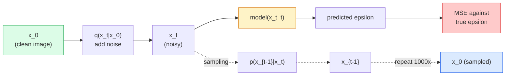

# छवि पीढ़ी  विसारण मॉडल  छवि निर्माण  प्रसार मॉडल

> एक विसारण मॉडल को निंदा करना सीखना है. इसे शोर की छवि से एक छोटा सा शोर निकालने के लिए प्रशिक्षित करें, इसे एक हजार बार पीछे की ओर दोहराएं, और आपके पास एक छवि जनरेटर है।

> **【中文解读】**扩散模型学习去噪音: प्रशिक्षण नेटवर्क एक छोटे से शोर के साथ छवियों में शोर को हटाने के लिए, प्रतिवर्ती बार बार 1000 बार शुद्ध शोर से छवि उत्पन्न करने में सक्षम है।

> **【拓展：扩散模型的革命】**扩散模型在 2022 साल के बाद GAN 成为图像生成的主流── स्थिर विसार potential space diffusion── latente diffusion) का उपयोग करके संभावित अंतरिक्ष विसार (लैटिन विसार) का उपयोग करके गणना लागत में भारी कमी आई है, डीडीआईएम 采样器 1000 से 20 चरणों तक कदमों की संख्या का अनुमान लगाएगा।

**Type:** Build | **类型:** 动手
**Languages:** Python | **语言:** Python
**Prerequisites:** Phase 4 Lesson 07 (U-Net), Phase 1 Lesson 06 (Probability), Phase 3 Lesson 06 (Optimizers) | **前置知识:** Phase 4 Lesson 07（U-Net），Phase 1 Lesson 06（概率），Phase 3 Lesson 06（优化器）
**Time:** ~75 minutes | **时间:** ~75 分钟

## सीखने के लक्ष्य

- आगे की शोर प्रक्रिया का व्युत्पन्न करें `x_0 -> x_1 -> ... -> x_T`और समझाएँ कि क्यों बंद-रूप `q(x_t | x_0)`किसी भी t के लिए holds
- एक डीडीपीएम शैली प्रशिक्षण लक्ष्य को लागू करें जो प्रत्येक चरण में जोड़ा गया शोर को पीछे हटाती है, और एक नमूना जो शुद्ध शोर से छवि में वापस चलता है
- एक समय-कंडीशनिंग यू-नेट (सीपीयू पर प्रशिक्षण के लिए पर्याप्त छोटे) का निर्माण जो किसी भी समय चरण के लिए शोर की भविष्यवाणी करता है
- डीडीपीएम और डीडीआईएम नमूना लेने के बीच अंतर और जब प्रत्येक उपयुक्त हो (पाठ 23 प्रवाह मिलान और गहराई में सुधारित प्रवाह को कवर करता है) को समझाएं।

> **【中文解读】**सीखने के लक्ष्य इस कक्षा को पूरा करने के बाद जो मूल क्षमताएं होनी चाहिए, उन्हें सूचीबद्ध करते हैं।


## समस्या  समस्या परिचय

जीएनएस एक शॉट उत्पन्न करते हैंः शोर में, छवि बाहर, एक आगे पास। वे तेज और प्रशिक्षित करने में कठिन हैं। विसारण मॉडल पुनरावृत्ति के साथ उत्पन्न होते हैंः शुद्ध शोर से शुरू होते हैं, छोटे चरणों में वर्णित होते हैं, छवि उभरती है। वे धीमे और प्रशिक्षित करने में आसान हैं। पिछले पांच वर्षों से इस गुण का वर्चस्व रहा हैः कोई भी छोटी टीम एक विसारण मॉडल को प्रशिक्षित कर सकती है और उचित नमूने प्राप्त कर सकती है; GAN प्रशिक्षण एक शिल्प है जिसे आप वर्षों के असफल रन के दौरान सीखते हैं।

> GAN एक बार प्रकृति उत्पन्न करनाः शोर में प्रवेश करना, चित्र निकालना, एक बार आगे बढ़ना। वे तेजी से होते हैं, लेकिन प्रशिक्षण कठिन होता है। प्रसारण मॉडल पीढ़ी उत्पन्न करनाः शुद्ध शोर से शुरू होता है, छोटे कदम से शोर तक, चित्र धीरे-धीरे प्रकट होते हैं। वे धीमी गति से होते हैं, लेकिन आसानी से प्रशिक्षण देते हैं।

प्रशिक्षण स्थिरता के अलावा, विसारण की पुनरावर्ती संरचना वह है जो आधुनिक छवि पीढ़ी के लिए सब कुछ खोलती हैः पाठ कंडीशनिंग, इनपेंटिंग, छवि संपादन, सुपर-रिज़ॉल्यूशन, नियंत्रित शैली। नमूना लूप के प्रत्येक चरण में एक नया प्रतिबंध लगाने का स्थान होता है। यह हुक है कि क्यों स्थिर विसारण, इमेज, DALL-E 3, मिडयात्रा, और हर नियंत्रित छवि मॉडल आप उपयोग करेंगे सभी विसारण आधारित हैं।

> स्थिरता को प्रशिक्षित करने के अलावा, प्रसार की पीढ़ी संरचना आधुनिक छवि उत्पादन के लिए किए गए सभी कार्यों को अनलॉक करती हैः पाठ अनुकूलन, छवि मरम्मत, छवि संपादन, अल्ट्रा रिज़ॉल्यूशन, नियंत्रित शैली। नमूना चक्र के प्रत्येक चरण में एक नया संयोजन डाला जाता है।

इस पाठ में न्यूनतम डीडीपीएम का निर्माण किया गया हैः आगे शोर, पीछे की ओर डीनोइंग, प्रशिक्षण लूप। अगला पाठ (स्थिर विसारण) इसे एक वीएई, एक पाठ एन्कोडर और वर्गीकरणकर्ता मुक्त मार्गदर्शन के साथ एक उत्पादन प्रणाली में तार करता है।

> इस वर्ग में न्यूनतम डीडीपीएम का निर्माण किया गया है: पूर्व दिशा में वृद्धि हुई शोर, बाद दिशा में कमी हुई शोर, प्रशिक्षण चक्र, अगला वर्ग स्थिर प्रसार, इसे उत्पादन प्रणाली में जोड़ा जाएगा, जिसमें वीएई,文本编码器和无分类器引导, शामिल हैं।

## अवधारणा का मूल अवधारणा

> **【中文解读】**इस भाग में मूल अवधारणाओं और सिद्धांतों की आधारभूत जानकारी दी गई है। इन अवधारणाओं को प्राप्त करना बाद में होने वाली प्रक्रियाओं के लिए एक शर्त है।


### आगे की प्रक्रिया

एक तस्वीर लें `x_0`. एक छोटी मात्रा में गौसीन शोर जोड़ने के लिए प्राप्त करने के लिए .`x_1`. . और थोड़ी मात्रा जोड़ें प्राप्त करने के लिए .`x_2`. . . . . . . . . . . . . . . . . . . . . . . . . . . . . . . . . . . . . . . . . . . . . . . . . . . . . . . . . . . . . . . . . . . . . . . . . . . . . . . . . . . . . . . . . . . . . . . . . . . . . . . . . . . . . . . . . . . . . . . . . . . . . . . . . . . . . . . . . . . . . . . . . . . . . . . . . . . . . . . . . . . . . . . . . . . . . . . . . . . . . . . . . . . . . . . . . . . . . . . . . . . . . . . . . . . . . . . . . . . . . . . . . . . . . . . . . . . . . . . . . . . . . . . . . . . . . . . . . . . . . . . . . . . . . . . . . . . . . . . . . . . . . . . . . . . . . . . . . . . . . . . . . . . . . . . . . . . . . . . . . . . . . . . . . . . . . . . . . . . . . . . . . . . . . . . . . . . . . . . . . . . . . . . . . . . . . . . . . . . . . . . . . . . . . . . . . . . . . . . . . . . . . . . . . . . . . . . . . . . . . . . . . . . . . . . . . . . . . . . . . . . . . . . . . . . . . . . . . . . . . . . . . . . . . . . . . . . . . . . . . . . . . . . . . . . . . . . . . . . . . . . . . . . . . .`x_T`शुद्ध गौसीय शोर से लगभग असंगत है।

> 取一张图像 `x_0`, एक और उच्च शोर मिलता है .`x_1`, एक और एक मिल जाओ`x_2`, लगातार T                                                                                                                                                                                                                                                                                                                                                                                                                                                                                                                           `x_T`शुद्ध उच्च शोर से लगभग असम्भव है।

```
q(x_t | x_{t-1}) = N(x_t; sqrt(1 - beta_t) * x_{t-1},  beta_t * I)
```

`beta_t`एक छोटा वेरिएंसी शेड्यूल है, जो आमतौर पर 0.0001 से 0.02 तक T=1000 चरणों पर रैखिक होता है। प्रत्येक चरण सिग्नल को थोड़ा छोटा करता है और नया शोर इंजेक्ट करता है।

> `beta_t`यह एक छोटा सा अंतर है, आमतौर पर T=1000 चरणों में 0.0001 से 0.02 तक बढ़ता है। प्रत्येक चरण में थोड़ा छोटा संकेत होता है और नई आवाज में प्रवेश होता है।

### बंद-रूप की छलांग

एक समय में एक कदम शोर जोड़ने एक मार्कोव श्रृंखला है, लेकिन गणित तहः आप नमूना कर सकते हैं `x_t`सीधे `x_0`एक कदम में।

> एक कदम बढ़ाना एक मार्कॉफ चेन है, लेकिन गणित में यह तह हो सकता हैः आप सीधे से कदम उठा सकते हैं।`x_0`采样 `x_t`

```
Define alpha_t = 1 - beta_t
Define alpha_bar_t = prod_{s=1..t} alpha_s

Then:
  q(x_t | x_0) = N(x_t; sqrt(alpha_bar_t) * x_0,  (1 - alpha_bar_t) * I)

Equivalently:
  x_t = sqrt(alpha_bar_t) * x_0 + sqrt(1 - alpha_bar_t) * epsilon
  where epsilon ~ N(0, I)
```

इस एकल समीकरण है कि फैलाव व्यावहारिक है का पूरा कारण है. प्रशिक्षण के दौरान आप एक यादृच्छिक चुनते हैं`t`, नमूना `x_t`सीधे `x_0`, और एक कदम में ट्रेन  पूरे मार्कोव श्रृंखला का अनुकरण करने की जरूरत नहीं है।

> यह एक ही विधि है विस्तार मॉडल के व्यावहारिक उपयोग के सभी कारणों में से एक है।`t`, सीधे से`x_0`采样 `x_t`, प्रशिक्षण को पूरा करने के लिए एक कदम के लिए पूर्ण मार्कोव श्रृंखला की आवश्यकता नहीं है।

### उल्टा प्रक्रिया

आगे की प्रक्रिया तय है। उल्टा प्रक्रिया `p(x_{t-1} | x_t)`विसारण मॉडल भविष्यवाणी नहीं करते हैं`x_{t-1}`सीधे; वे शोर की भविष्यवाणी `epsilon`चरण t में जोड़ा गया, और गणित से प्राप्त होता है `x_{t-1}`इससे।

> पूर्ववर्ती प्रक्रिया निश्चित है।`p(x_{t-1} | x_t)`                                                                                                                                                                                                                                                              `x_{t-1}`; वे अगले चरण के शोर का अनुमान लगाते हैं `epsilon`, फिर गणित से प्रेरित हो जाओ`x_{t-1}`



### प्रशिक्षण हानि

प्रत्येक प्रशिक्षण चरण के लिएः

> प्रत्येक प्रशिक्षण चरण:

1. एक असली छवि का नमूना `x_0`. .
   中文翻译:采样一张真实图像 `x_0`
2. समय की एक पैमाना का नमूना `t`[1, T] से समान रूप से।
   中文翻译: से [1, T] 中均采样一个时间步 `t`
3. नमूना शोर `epsilon ~ N(0, I)`. .
   中文翻译:采样噪音 `epsilon ~ N(0, I)`
4. गणना `x_t = sqrt(alpha_bar_t) * x_0 + sqrt(1 - alpha_bar_t) * epsilon`. .
   中文翻译:计算 `x_t = sqrt(alpha_bar_t) * x_0 + sqrt(1 - alpha_bar_t) * epsilon`
5. भविष्यवाणी करें`epsilon_theta(x_t, t)`नेटवर्क के साथ।
   中文翻译:用网络预测 `epsilon_theta(x_t, t)`
6. न्यूनतम `|| epsilon - epsilon_theta(x_t, t) ||^2`. .
   中文翻译: न्यूनतमकरण `|| epsilon - epsilon_theta(x_t, t) ||^2`

यह है. तंत्रिका नेटवर्क किसी भी समय शोर की भविष्यवाणी करना सीखता है. नुकसान एमएसई है. कोई विरोधी खेल नहीं है, कोई पतन, कोई हलचल नहीं है.

> यही है। किसी भी समय के दौरान किसी भी प्रकार के शोर का अनुमान लगाना।

### नमूना लेने वाला (DDPM)

उत्पन्न करने के लिएः  से शुरू करें`x_T ~ N(0, I)`और एक समय में एक कदम पीछे की ओर चलें।

```
for t = T, T-1, ..., 1:
    eps = model(x_t, t)
    x_{t-1} = (1 / sqrt(alpha_t)) * (x_t - (beta_t / sqrt(1 - alpha_bar_t)) * eps) + sqrt(beta_t) * z
    where z ~ N(0, I) if t > 1, else 0
return x_0
```

कुंजी यह है कि भले ही उलटा सशर्त रूप सामान्य रूप से बंद रूप में ज्ञात नहीं है, इस विशिष्ट गौशियन आगे प्रक्रिया के लिए यह है. बदसूरत दिखने वाले गुणांक हैं जो बेयज़ के नियम आपको देता है.

> मुख्य बात यह है कि, यद्यपि सामान्य परिस्थितियों में विपरीत स्थिति की संभावना का कोई समापन रूप का समाधान नहीं है, लेकिन इस विशिष्ट उच्चतर प्रगति प्रक्रिया के लिए कुछ है।

### क्यों 1000 कदम

आगे की शोर अनुसूची का चयन किया जाता है ताकि प्रत्येक चरण में बस पर्याप्त शोर जोड़ा जाए ताकि रिवर्स चरण लगभग गौशियन हो। बहुत कम चरण और रिवर्स चरण गौशियन से दूर है, नेटवर्क इसे अच्छी तरह से मॉडल नहीं कर सकता है। बहुत अधिक चरण और नमूनाकरण कम लाभ के साथ महंगा हो जाता है। रैखिक अनुसूची के साथ T = 1000 डीडीपीएम डिफ़ॉल्ट है।

> पूर्ववर्ती शोर विनियमन के डिजाइन से प्रत्येक चरण में केवल पर्याप्त रूप से कम शोर होता है, जिससे प्रतिवर्ती चरणों की संख्या उच्च से अधिक होती है।

### डीडीआईएम: 20 गुना तेजी से नमूनाकरण

प्रशिक्षण एक ही है। नमूना परिवर्तन। डीडीआईएम (संग और सहयोगियों, 2020) एक निर्णायक उल्टा प्रक्रिया को परिभाषित करता है जो पुनः प्रशिक्षण के बिना समय चरणों को छोड़ देता है। डीडीआईएम के साथ 50 चरणों में नमूनाकरण लगभग 1000 चरणों की डीडीपीएम गुणवत्ता देता है। प्रत्येक उत्पादन प्रणाली डीडीआईएम या एक और भी तेज़ संस्करण (डीडीएम-सोलवर, यूलर पूर्वज) का उपयोग करती है।

> 训练方式不变,采样方式改变──DDIM(Song等,2020) एक निश्चितता की विपरीत प्रक्रिया को परिभाषित करता है, समय के चरणों से कूद सकता है और पुनः प्रशिक्षण की आवश्यकता नहीं है──डीडीआईएम के साथ 50 चरणों की चलन से 1000 चरणों के करीब डीडीपीएम की गुणवत्ता प्राप्त हो सकती है── प्रत्येक उत्पादन प्रणाली डीडीआईएम या अधिक तेज़ परिवर्तनों का उपयोग करती है──डीपीएम-सोलवर、ईलर पूर्वज)──

### समय की स्थिति

नेटवर्क `epsilon_theta(x_t, t)`आधुनिक विसारण मॉडल इंजेक्शन`t`सिनोसाइडल समय एम्बेडमेंट के माध्यम से (ट्रांसफार्मर में स्थिति एन्कोडिंग के समान विचार) जो प्रत्येक यू-नेट स्तर पर फीचर मानचित्रों में जोड़े जाते हैं।

> 网络 `epsilon_theta(x_t, t)`需要知道它在去噪哪个时间步步──现代扩散模型通过正弦时间嵌入(与变压器中位置编码思路相同) 插入 `t`, प्रत्येक यू-नेट स्तर की विशेषताओं के चित्रों पर चित्रण किया गया है

```
t_embedding = sinusoidal(t)
feature_map += MLP(t_embedding)
```

समय की स्थिति के बिना नेटवर्क को छवि से ही शोर का स्तर अनुमान लगाना पड़ता है, जो काम करता है लेकिन नमूना-कुशलता बहुत कम है।

>  समय की स्थिति के बिना, नेटवर्क को खुद छवि से शोर स्तर का अनुमान लगाना चाहिए, ताकि यद्यपि यह काम कर सके लेकिन नमूना दक्षता बहुत कम हो।

> **【拓展：工业部署中的视觉系统】**वास्तविक औद्योगिक तैनाती में, विज़ुअल मॉडल को देरी, मॉडल आकार, किनारे उपकरण अनुकूलन आदि की समस्या पर विचार करने की आवश्यकता होती है। टेन्सरआरटी, ओएनएनएक्स रनटाइम, ओपनवीनो एक सामान्य उपयोग में आने वाला सुझाव त्वरण उपकरण है।

> **【拓展：数据标注与质量】**视觉任务的效果高度依赖标签数据质量──标签工作室、CVAT是主流标签工具──在工业场景中,主动学习(Active Learning) ले标签成本 को कम कर सकता हैः मॉडल अनिश्चित नमूना अनुरोधों के लिए कृत्रिम标签, अनिश्चितता के नमूने स्वचालित标签──


## इसे बनाओ, इसे पूरा करो।

> **【中文解读】**इस भाग के माध्यम से कोड को शून्य से लागू किया जा सकता है कोर एल्गोरिदम। इस तरह के "शुरुआत से" तरीके से फ्रेमवर्क के पीछे के सिद्धांत को समझने में मदद मिलेगी, समस्याओं का सामना करते समय ब्लैक बॉक्स में फंस नहीं जाएगा।

```figure
cv-diffusion-image
```

## इसे बनाओ

### चरण 1: शोर कार्यक्रम

```python
import torch

def linear_beta_schedule(T=1000, beta_start=1e-4, beta_end=2e-2):
    return torch.linspace(beta_start, beta_end, T)


def precompute_schedule(betas):
    alphas = 1.0 - betas
    alphas_cumprod = torch.cumprod(alphas, dim=0)
    return {
        "betas": betas,
        "alphas": alphas,
        "alphas_cumprod": alphas_cumprod,
        "sqrt_alphas_cumprod": torch.sqrt(alphas_cumprod),
        "sqrt_one_minus_alphas_cumprod": torch.sqrt(1.0 - alphas_cumprod),
        "sqrt_recip_alphas": torch.sqrt(1.0 / alphas),
    }

schedule = precompute_schedule(linear_beta_schedule(T=1000))
```

एक बार पूर्व गणना करें, प्रशिक्षण और नमूना लेने के दौरान सूचकांक द्वारा एकत्र करें।

> 预计算一次,训练和采样时通过索引取用──

### चरण 2: आगे फैलाव (q_sample)

```python
def q_sample(x0, t, noise, schedule):
    sqrt_a = schedule["sqrt_alphas_cumprod"][t].view(-1, 1, 1, 1)
    sqrt_one_minus_a = schedule["sqrt_one_minus_alphas_cumprod"][t].view(-1, 1, 1, 1)
    return sqrt_a * x0 + sqrt_one_minus_a * noise
```

एक पंक्ति बंद फॉर्म। `t`समय के चरणों का एक बैच है, बैच में प्रति छवि एक।

> एक पंक्ति बंद रूप मेंः`t`एक समय के लिए एक तस्वीर है।

### चरण 3: एक छोटा समय-कंडीशनिंग यू-नेट

```python
import torch.nn as nn
import torch.nn.functional as F
import math

def timestep_embedding(t, dim=64):
    half = dim // 2
    freqs = torch.exp(-math.log(10000) * torch.arange(half, device=t.device) / half)
    args = t[:, None].float() * freqs[None]
    emb = torch.cat([args.sin(), args.cos()], dim=-1)
    return emb


class TinyUNet(nn.Module):
    def __init__(self, img_channels=3, base=32, t_dim=64):
        super().__init__()
        self.t_mlp = nn.Sequential(
            nn.Linear(t_dim, base * 4),
            nn.SiLU(),
            nn.Linear(base * 4, base * 4),
        )
        self.t_dim = t_dim
        self.enc1 = nn.Conv2d(img_channels, base, 3, padding=1)
        self.enc2 = nn.Conv2d(base, base * 2, 4, stride=2, padding=1)
        self.mid = nn.Conv2d(base * 2, base * 2, 3, padding=1)
        self.dec1 = nn.ConvTranspose2d(base * 2, base, 4, stride=2, padding=1)
        self.dec2 = nn.Conv2d(base * 2, img_channels, 3, padding=1)
        self.time_proj = nn.Linear(base * 4, base * 2)

    def forward(self, x, t):
        t_emb = timestep_embedding(t, self.t_dim)
        t_emb = self.t_mlp(t_emb)
        t_proj = self.time_proj(t_emb)[:, :, None, None]

        h1 = F.silu(self.enc1(x))
        h2 = F.silu(self.enc2(h1)) + t_proj
        h3 = F.silu(self.mid(h2))
        d1 = F.silu(self.dec1(h3))
        d2 = torch.cat([d1, h1], dim=1)
        return self.dec2(d2)
```

दो-स्तरीय यू-नेट समय कंडीशनिंग बोतल गला पर इंजेक्ट किया गया. वास्तविक छवियों के लिए गहराई और चौड़ाई को स्केल.

> 两层 U-Net,在瓶层注入时间条件化―― वास्तविक छवियों के लिए, गहराई और चौड़ाई में वृद्धि हो सकती है――

### चरण 4: प्रशिक्षण लूप

```python
def train_step(model, x0, schedule, optimizer, device, T=1000):
    model.train()
    x0 = x0.to(device)
    bs = x0.size(0)
    t = torch.randint(0, T, (bs,), device=device)
    noise = torch.randn_like(x0)
    x_t = q_sample(x0, t, noise, schedule)
    pred = model(x_t, t)
    loss = F.mse_loss(pred, noise)
    optimizer.zero_grad()
    loss.backward()
    optimizer.step()
    return loss.item()
```

यह प्रशिक्षण लूप है कोई GAN खेल, कोई विशेष हानि, एक MSE कॉल नहीं।

> यह पूरी प्रशिक्षण चक्र है। कोई जीएएन नहीं है, कोई विशेष हानि नहीं है, केवल एक एमएसई की आवश्यकता है।

### चरण 5: नमूना लेने वाला (डीडीपीएम)

```python
@torch.no_grad()
def sample(model, schedule, shape, T=1000, device="cpu"):
    model.eval()
    x = torch.randn(shape, device=device)
    betas = schedule["betas"].to(device)
    sqrt_one_minus_a = schedule["sqrt_one_minus_alphas_cumprod"].to(device)
    sqrt_recip_alphas = schedule["sqrt_recip_alphas"].to(device)

    for t in reversed(range(T)):
        t_batch = torch.full((shape[0],), t, dtype=torch.long, device=device)
        eps = model(x, t_batch)
        coef = betas[t] / sqrt_one_minus_a[t]
        mean = sqrt_recip_alphas[t] * (x - coef * eps)
        if t > 0:
            x = mean + torch.sqrt(betas[t]) * torch.randn_like(x)
        else:
            x = mean
    return x
```

एक बैच के नमूने बनाने के लिए 1000 आगे पास. वास्तविक कोड में आप एक डीडीआईएम 50 चरणों नमूना लेने के लिए यह आदान-प्रदान करेंगे.

> 1000 बार आगे बढ़कर प्रसारित करने के लिए एक बैच नमूना उत्पन्न करना है।

### चरण 6: डीडीआईएम नमूना (निर्धारक, ~ 20 गुना तेज़)

```python
@torch.no_grad()
def sample_ddim(model, schedule, shape, steps=50, T=1000, device="cpu", eta=0.0):
    model.eval()
    x = torch.randn(shape, device=device)
    alphas_cumprod = schedule["alphas_cumprod"].to(device)

    ts = torch.linspace(T - 1, 0, steps + 1).long()
    for i in range(steps):
        t = ts[i]
        t_prev = ts[i + 1]
        t_batch = torch.full((shape[0],), t, dtype=torch.long, device=device)
        eps = model(x, t_batch)
        a_t = alphas_cumprod[t]
        a_prev = alphas_cumprod[t_prev] if t_prev >= 0 else torch.tensor(1.0, device=device)
        x0_pred = (x - torch.sqrt(1 - a_t) * eps) / torch.sqrt(a_t)
        sigma = eta * torch.sqrt((1 - a_prev) / (1 - a_t) * (1 - a_t / a_prev))
        dir_xt = torch.sqrt(1 - a_prev - sigma ** 2) * eps
        noise = sigma * torch.randn_like(x) if eta > 0 else 0
        x = torch.sqrt(a_prev) * x0_pred + dir_xt + noise
    return x
```

> **【中文解读】**इस भाग में दिखाया गया है कि इस तकनीक को कैसे तेजी से लागू किया जाए। इस प्रकार के एक परिपक्व ढांचे का उपयोग करके बग कम किए जा सकते हैं और विकास दक्षता में सुधार किया जा सकता है।


`eta=0`पूरी तरह से निर्धारक है (एक ही शोर इनपुट हमेशा एक ही आउटपुट का उत्पादन करता है) ।`eta=1`डीडीपीएम को ठीक करता है।

> `eta=0`                                                                                                                                                                                                                                                              `eta=1`则退化为DDPM──


> **【拓展：视觉模型的持续学习】**उत्पादन वातावरण में, दृश्य मॉडल को नए डेटा को लगातार अनुकूलित करने की आवश्यकता होती है। यह ऑटोमोटिव ड्राइविंग और औद्योगिक गुणवत्ता जांच में विशेष रूप से महत्वपूर्ण है।

## इसे फ्रेमवर्क के साथ लागू करें

उत्पादन कार्य के लिए उपयोग करें `diffusers`:

```python
from diffusers import DDPMScheduler, UNet2DModel

unet = UNet2DModel(sample_size=32, in_channels=3, out_channels=3, layers_per_block=2)
scheduler = DDPMScheduler(num_train_timesteps=1000)
```

पुस्तकालय तैयार शेड्यूलर (डीडीपीएम, डीडीआईएम, डीपीएम-सोलवर, यूलर, हेन), कॉन्फ़िगरेबल यू-नेट, पाठ-टू-इमेज और छवि-टू-इमेज के लिए पाइपलाइन और लोरा फाइन-ट्यूनिंग हेल्पर्स भेजता है।

अनुसंधान के लिए,`k-diffusion`(कैथरीन क्रॉसन) सबसे वफादार संदर्भ कार्यान्वयन और सबसे अच्छा नमूनाकरण संस्करण है।

> **【中文解读】**इस खंड में इस बात पर ध्यान दिया गया है कि मॉडल को उपलब्ध उत्पादों के रूप में कैसे तैनात किया जाए। मूल से लेकर उत्पादन स्तर तक, प्रदर्शन अनुकूलन, त्रुटि प्रसंस्करण, निगरानी आदि के कई आयामों पर विचार करने की आवश्यकता है।


## इसे भेजें उत्पाद

इस पाठ से उत्पन्न होता हैः

- `outputs/prompt-diffusion-sampler-picker.md` एक प्रॉम्प्ट जो गुणवत्ता लक्ष्य, विलंबता बजट और कंडीशनिंग प्रकार के आधार पर डीडीपीएम / डीडीआईएम / डीपीएम-सोलवर / एयूलर का चयन करता है।
- `outputs/skill-noise-schedule-designer.md` एक कौशल जो समय के साथ सिग्नल-टू-शोर अनुपात के डायग्नोस्टिक ग्राफिक्स के साथ टी और लक्ष्य भ्रष्टाचार स्तर के साथ रैखिक, कॉसिन, या सिग्मोइड बीटा कार्यक्रम का उत्पादन करता है।

> **【中文解读】**练习题按照易/中级/难度递进;;建议至少完成中级题,Hard级适合深入研究或面试准备;;


## अभ्यास विषय

1. **(Easy)**आगे की प्रक्रिया को दृश्यमान करें: एक छवि लें और एक साजिश बनाएं `x_t`पर`t in [0, 100, 250, 500, 750, 1000]`. . यह सत्यापित करें .`x_1000`शुद्ध गौसीन शोर की तरह लग रहा है.
2. **(Medium)**20 युगों के लिए सिंथेटिक सर्कल डेटासेट पर TinyUNet को प्रशिक्षित करें और 16 सर्कल का नमूना लें। DDPM (1000 चरण) और DDIM (50 चरण) नमूनाकरण की तुलना करें  क्या वे एक ही शोर बीज से समान छवियां उत्पन्न करते हैं?
3. **(Hard)**एक कोसिन शोर कार्यक्रम लागू करें (निचोल और धारीवाल, 2021):`alpha_bar_t = cos^2((t/T + s) / (1 + s) * pi / 2)`. समान मॉडल को रैखिक और कोसिन अनुसूची के साथ प्रशिक्षित करें और दिखाएं कि कोसिन कम चरणों की गिनती पर बेहतर नमूने देता है।

> **【中文解读】**术语表中的"क्या लोग कहते हैं" बनाम "क्या वास्तव में इसका मतलब है" 区分日常口语和精确技术含义──在团队协作中,统一术语定义可以避免大量沟通误解──


## कीवर्ड्स  शब्द खोज तालिका

| Term | What people say | What it actually means |
|------|----------------|----------------------|
| Forward process | "Add noise over time" | Fixed Markov chain that corrupts an image into Gaussian noise over T steps |
| Reverse process | "Denoise step by step" | Learned distribution that walks back from noise to image |
| Epsilon prediction | "Predict the noise" | The training target: `epsilon_theta(x_t, t)` predicts the noise added at step t |
| Beta schedule | "Noise amounts" | Sequence of T small variances that define how much noise enters per step |
| alpha_bar_t | "Cumulative retain factor" | Product of (1 - beta_s) up to time t; bigger t means less signal left |
| DDPM sampler | "Ancestral, stochastic" | Samples each x_{t-1} from its conditional Gaussian; 1000 steps |
| DDIM sampler | "Deterministic, fast" | Rewrites sampling as a deterministic ODE; 20-100 steps with similar quality |
| Time conditioning | "Tell the model which t" | Sinusoidal embedding of t injected into the U-Net so it knows the noise level |

> **【中文解读】**延伸阅读 प्रदान करता है गहन सीखने के लिए उच्च गुणवत्ता वाले संसाधनों। ये लेख और पाठ्यक्रम इस क्षेत्र के लिए क्लासिक संदर्भ हैं, जो गहन समझ की आवश्यकता वाले पाठकों के लिए उपयुक्त हैं।


## आगे पढ़ना 延伸閱讀

- [Denoising Diffusion Probabilistic Models (Ho et al., 2020)](https://arxiv.org/abs/2006.11239) पेपर जो फैलाव को व्यावहारिक बनाता है और FID पर GANs को हराता है
- [Improved DDPM (Nichol & Dhariwal, 2021)](https://arxiv.org/abs/2102.09672) कॉसिन अनुसूची और वी-पारामीटरकरण
- [DDIM (Song, Meng, Ermon, 2020)](https://arxiv.org/abs/2010.02502) निर्धारात्मक नमूना जो वास्तविक समय में निष्कर्ष संभव बना दिया
- [Elucidating the Design Space of Diffusion (Karras et al., 2022)](https://arxiv.org/abs/2206.00364) प्रत्येक फैलाव डिजाइन विकल्प का एक एकीकृत दृश्य; वर्तमान सर्वश्रेष्ठ संदर्भ
