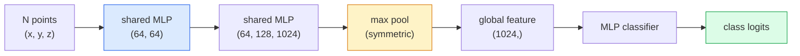

# 3D दृश्य  बिंदु बादल और NeRFs  3D दृश्य  点云与NeRF

> 3D दृष्टि दो स्वादों में आती है। बिंदु बादल सेंसर के कच्चे आउटपुट हैं। NeRFs सीखने वाले वॉल्यूमट्रिक क्षेत्र हैं। दोनों का जवाब है "कहाँ अंतरिक्ष में क्या है।"

> **【中文解读】**3D विज़ुअलिटी में दो प्रकार के प्रकार हैंः बिंदु云 है सेंसर (LIDAR, गहराई से चलने वाला) का मूल आउटपुट; NeRF (Neural Radiation Field) का अध्ययन किया गया है।

> **【拓展：3D 视觉的应用】**NeRF का उपयोग वर्चुअल रियलिटी/增强现实 (VR/AR) 、建筑可视化、自动驾驶场景重建──3D गौशियन स्प्लैटिंग(下一课) में किया जाता है।

**Type:** Learn + Build | **类型:** 学习 + 动手
**Languages:** Python | **语言:** Python
**Prerequisites:** Phase 4 Lesson 03 (CNNs), Phase 1 Lesson 12 (Tensor Operations) | **前置知识:** Phase 4 Lesson 03（CNN），Phase 1 Lesson 12（张量运算）
**Time:** ~45 minutes | **时间:** ~45 分钟

## सीखने के लक्ष्य

- स्पष्ट (बिंदु बादल, जाल, वोक्सल) और अप्रत्यक्ष (सीग्न दूरी क्षेत्र, NeRF) 3D प्रतिनिधित्वों को अलग करना और जब प्रत्येक का उपयोग किया जाता है
- PointNet के सममित फ़ंक्शन ट्रिक को समझें जो एक तंत्रिका नेटवर्क के परिवर्तन-विवर्तन को बिन्दुओं के अनियमित सेट पर अपरिवर्तित बनाता है
- एक NeRF आगे पास का पता लगाएंः रे कास्टिंग, वॉल्यूमेट्रिक रेंडरिंग, स्थिति एन्कोडिंग, MLP घनत्व + रंग सिर
- उपयोग करें`nerfstudio`या `instant-ngp`एक छोटे सेट की पोस्ट की गई छवियों से पूर्व-प्रशिक्षित 3D पुनर्निर्माण के लिए

> **【中文解读】**सीखने के लक्ष्य इस कक्षा को पूरा करने के बाद जो मूल क्षमताएं होनी चाहिए, उन्हें सूचीबद्ध करते हैं।


## समस्या  समस्या परिचय

एक कैमरा 2D छवि का उत्पादन करता है। एक LIDAR बिना किसी क्रमबद्धता के 3D बिंदुओं का एक सेट का उत्पादन करता है। एक संरचना-मोशन पाइपलाइन 3D कुंजी बिंदुओं का एक दुर्लभ बादल का उत्पादन करती है। एक NeRF कुछ मुद्रित छवियों से एक पूरे 3D दृश्य का पुनर्निर्माण करता है। ये सभी "दृष्टि" हैं लेकिन उनमें से कोई भी सीएनएन के लिए वांछित घने टेंसर की तरह नहीं दिखता है।

> 相机产生 2D图像──LiDAR 产生一组无序的3D点──运动恢复结构流水线产生稀疏的3D 关键点云──NeRF से कुछ स्थानों पर姿像重建整个3D场景──ये सभी "दृश्य" हैं, लेकिन कोई भी ऐसा नहीं दिखता है जैसे सीएनएन 想要的密集张量──

3 डी दृष्टि महत्वपूर्ण है क्योंकि लगभग हर उच्च-मूल्य वाली रोबोट कार्य 3 डी में चलता हैः पकड़ना, बाधाओं से बचना, नेविगेशन, एआर अवरुद्ध, 3 डी सामग्री कैप्चर। एक दृष्टि इंजीनियर जो केवल 2 डी छवियों को समझता है, उसे क्षेत्र के सबसे तेजी से बढ़ते स्लाइस (एआर / वीआर सामग्री, रोबोटिक्स, स्वायत्त ड्राइविंग स्टैक, रियल एस्टेट या निर्माण के लिए एनईआरएफ आधारित 3 डी पुनर्निर्माण) से बाहर रखा गया है।

> 3D विज़ुअलाइज़ेशन महत्वपूर्ण है, क्योंकि लगभग हर उच्च मूल्य वाले मशीन का कार्य 3D में चलता हैः पकड़ने, बचाने, navigation, AR 遮、3D सामग्री कैप्चर। केवल 2D छवि के विज़ुअलाइज़ेशन इंजीनियर को इस क्षेत्र के सबसे तेजी से बढ़ते भाग के बाहर लॉक किया गया है।

दो प्रतिनिधित्व अलग-अलग कारणों से हावी हैं। बिंदु बादल सेंसर आपको मुफ्त में देते हैं। NeRF और उनके उत्तराधिकारी (3D गौशियन स्प्लैटिंग, तंत्रिका SDF) जब आप एक तंत्रिका नेटवर्क को एक दृश्य सीखने के लिए कहते हैं तो आपको मिलता है।

> 两种表示因不同原因占据主导──点云是传感器免费给你──NeRF 及其后继者(3D 高斯、神经SDF)

## अवधारणा का मूल अवधारणा

> **【中文解读】**इस भाग में मूल अवधारणाओं और सिद्धांतों की आधारभूत जानकारी दी गई है। इन अवधारणाओं को प्राप्त करना बाद में होने वाली प्रक्रियाओं के लिए एक शर्त है।


### बिंदु बादल

एक बिंदु बादल R^3 में N बिंदुओं का एक अनियमित सेट है, वैकल्पिक रूप से प्रत्येक में विशेषताएं (रंग, तीव्रता, सामान्य) होती हैं।

> 点云是 R^3 में N 个点 के असंक्रमित集合, प्रत्येक बिंदु में विशेषताएं हैं।

```
cloud = [
  (x1, y1, z1, r1, g1, b1),
  (x2, y2, z2, r2, g2, b2),
  ...
  (xN, yN, zN, rN, gN, bN),
]
```

कोई ग्रिड नहीं, कोई कनेक्टिविटी नहीं दो गुण यह तंत्रिका नेटवर्क के लिए मुश्किल बनाते हैंः

> 无网格,没有连接关系―― दो विशेषताएं इसे तंत्रिका नेटवर्क के लिए बहुत कठिन बनाती हैंः

- **Permutation invariance** आउटपुट को बिंदु क्रम पर निर्भर नहीं होना चाहिए।
  中文翻译:**置换不变性** आउटपुट बिंदुओं के क्रम पर निर्भर नहीं कर सकता
- **Variable N** एक ही मॉडल को विभिन्न आकार के बादलों को संभालना होगा।
  中文翻译:**可变 N**एक मॉडल को विभिन्न आकारों के बिंदुओं को संभालना होगा

PointNet (Qi et al., 2017) ने दोनों को एक विचार के साथ हल कियाः प्रत्येक बिंदु पर एक साझा MLP लागू करें, फिर एक समानुपातिक फ़ंक्शन (मैक्स पूल) के साथ एकत्र करें। परिणाम एक निश्चित आकार का वेक्टर है जो क्रम पर निर्भर नहीं करता है।

> PointNet ((Qi 等,2017) ने एक विचार के साथ दो समस्याओं को हल कियाः प्रत्येक बिंदु अनुप्रयोग साझा MLP के लिए, फिर एक निश्चित आकार के साथ परिणाम है।

```
f(P) = max_{p in P} MLP(p)
```

यह प्वाइंटनेट का पूरा कोर है। गहरे संस्करण (प्वाइंटनेट++, प्वाइंट ट्रांसफार्मर) पदानुक्रमिक नमूनाकरण और स्थानीय संश्लेषण जोड़ते हैं लेकिन सममित फ़ंक्शन ट्रिक अपरिवर्तित है।

> यही पॉइंटनेट के पूरे कोर है। अधिक गहराई से भिन्नता (पॉइंटनेट++、पॉइंट ट्रांसफार्मर) ने लेवल-आधारित नमूनाकरण और स्थानीय सामूहिकता में वृद्धि की है, लेकिन इसके लिए फ़ंक्शन तकनीक में कोई बदलाव नहीं हुआ है।

### प्वाइंटनेट वास्तुकला



"साझा एमएलपी" का अर्थ है कि प्रत्येक बिंदु पर एक ही एमएलपी स्वतंत्र रूप से चलता है। दक्षता के लिए बिंदु आयाम पर 1x1 कन्वि के रूप में लागू किया जाता है।

> "साझा एमएलपी" का अर्थ है एक ही एमएलपी प्रत्येक बिंदु पर स्वतंत्र रूप से चलना।

### न्यूरल रेडिएंस फील्ड (NeRFs)

NeRFs (Mildenhall et al., 2020) ने सवाल उठाया "क्या हम N तस्वीरों से 3D दृश्य का पुनर्निर्माण कर सकते हैं? " और एक तंत्रिका नेटवर्क के साथ जवाब दिया जो दृश्य है। नेटवर्क मानचित्र `(x, y, z, viewing_direction)``(density, colour)`एक नया दृश्य प्रस्तुत करने के लिए इस नेटवर्क पर एक किरण कास्टिंग लूप है।

> NeRF(Mildenhall आदि,2020) ने उत्तर दिया"क्या N 张照片 से 3D दृश्य का पुनर्निर्माण किया जा सकता है?`(x, y, z, 观察方向)`映射到 `(密度, 颜色)`

```
NeRF MLP:  (x, y, z, theta, phi) -> (sigma, r, g, b)

To render a pixel (u, v) of a new view:
  1. Cast a ray from the camera through pixel (u, v)
  2. Sample points along the ray at distances t_1, t_2, ..., t_N
  3. Query the MLP at each point
  4. Composite the colours weighted by (1 - exp(-sigma * dt))
  5. The sum is the rendered pixel colour
```

एक हानि प्रशिक्षण तस्वीरों में ग्राउंड-सत्य पिक्सेल के साथ रेंडर किए गए पिक्सेल की तुलना करती है। रेंडरिंग चरण के माध्यम से बैकप्रॉप एमएलपी को अपडेट करता है। कोई 3 डी ग्राउंड सत्य, कोई स्पष्ट ज्यामिति नहीं  दृश्य एमएलपी वजन में संग्रहीत है।

> 损失 फ़ंक्शन तुलना रंगाई चित्रों और प्रशिक्षण तस्वीरों में वास्तविक चित्रों──通过 染步骤的反向传播更新 MLP──没有3D真值,没有显式几何场景存储在 MLP 权重中──

### NeRF में स्थिति एन्कोडिंग

एक वैनिला एमएलपी पर `(x, y, z)`उच्च आवृत्ति विवरण का प्रतिनिधित्व नहीं कर सकता क्योंकि एमएलपी कम आवृत्तियों की ओर स्पेक्ट्राली पूर्वाग्रह हैं। एनईआरएफ प्रत्येक निर्देशांक को एमएलपी से पहले फ़ूरियर विशेषता वेक्टर में एन्कोडिंग करके इसे ठीक करता हैः

> सामान्य एमएलपी में `(x, y, z)`ऊपर उच्च आवृत्ति विवरण प्रदर्शित करने में असमर्थ है, क्योंकि MLP 频谱偏向低频──NeRF 通过在每个坐标送入 MLP 里叶特征向量来修复这个问题:

```
gamma(p) = (sin(2^0 pi p), cos(2^0 pi p), sin(2^1 pi p), cos(2^1 pi p), ...)
```

L=10 आवृत्ति स्तर तक। यह वही ट्रान्सफार्मर है जो स्थिति के लिए उपयोग करता है, और यह विसारण समय कंडीशनिंग (पाठ 10) में फिर से दिखाई देता है। इसके बिना, NeRF धुंधला दिखते हैं।

> अधिकतम L=10 个频率级别── यह ट्रांसफार्मर के समान स्थान पर प्रयोग की गई तकनीक है, जो फिर से विस्तार मॉडल के समय की स्थिति में दिखाई देती है।

### वॉल्यूमेट्रिक रेंडरिंग

```
C(r) = sum_i T_i * (1 - exp(-sigma_i * delta_i)) * c_i

T_i  = exp(- sum_{j<i} sigma_j * delta_j)
delta_i = t_{i+1} - t_i
```

`T_i`यह प्रेषणता है  कितना प्रकाश बिंदु i तक जीवित रहता है `(1 - exp(-sigma_i * delta_i))`बिंदु i पर अस्पष्टता है। `c_i`अंतिम पिक्सेल एक रे के साथ एक भारित योग है.

> `T_i`                                                                                                                                                                                                                                                              `(1 - exp(-sigma_i * delta_i))`                                                                                                                                                                                                                                                              `c_i`                                                                                                                                                                                                                                                              

### एनईआरएफ की जगह क्या ले गया

शुद्ध एनईआरएफ प्रशिक्षण में धीमे (घंटे) और प्रति छवि प्रति सेकंड (सेकंड) में धीमे होते हैं।

> 纯 NeRF 训练慢(小时级) 且染慢(每张图像秒级) ⋅后续发展:

- **Instant-NGP**(2022)  हैश-ग्रिड एन्कोडिंग MLP की स्थिति इनपुट की जगह लेती है; सेकंड में ट्रेनें।
  中文翻译:**Instant-NGP**(2022) 哈希网格编码替代 MLP 的位置输入; सेकंड级训练──
- **Mip-NeRF 360** अनलिमिटेड दृश्यों और विरोधी-अलिज़िंग को संभालता है।
  中文翻译:**Mip-NeRF 360**                                                                                                                                                                                                                                                              
- **3D Gaussian Splatting**(2023)  3D Gaussians के साथ वॉल्यूमेट्रिक क्षेत्र को बदल देता है; मिनटों में ट्रेनें, वास्तविक समय में रेंडर करती हैं। वर्तमान उत्पादन डिफ़ॉल्ट।
  中文翻译:**3D 高斯泼溅**(2023)  लाखों 3D 高斯替代体积场;分钟级训练,实时染──当前生产默认方案──

2026 में लगभग हर वास्तविक NeRF उत्पाद वास्तव में 3D Gaussian splatting है. मानसिक मॉडल अभी भी NeRF है.

> 2026 में लगभग सभी वास्तविक NeRF उत्पाद वास्तव में 3D हैं।

### डेटासेट और बेंचमार्क

- **ShapeNet** 3D CAD मॉडल को बिंदु बादलों के रूप में वर्गीकृत और खंडित करना।
  中文翻译:ShapeNet3D CAD 模型的点云分类和分割──
- **ScanNet** विभाजन के लिए वास्तविक इनडोर स्कैन।
  中文翻译:ScanNet真实室内扫描,用于分割──
- **KITTI** स्वायत्त ड्राइविंग के लिए बाहरी LIDAR पॉइंट क्लाउड।
  中文翻译:KITTI户外 LiDAR 点云, इस्तेमाल किया जाता है स्वयंचलित ड्राइविंग。
- **NeRF Synthetic**/**Blended MVS** दृश्य संश्लेषण के लिए प्रस्तुत छवि डेटासेट।
  中文翻译:NeRF सिंथेटिक / ब्लेंड एमवीएस带位姿的图像数据集,用于视角合成──
- **Mip-NeRF 360**डेटासेट  अनलिमिटेड असली दृश्यों।
  中文翻译:Mip-NeRF 360 数据集无界真实场景──

> **【中文解读】**इस भाग के माध्यम से कोड को शून्य से लागू किया जा सकता है कोर एल्गोरिदम। इस तरह के "शुरुआत से" तरीके से फ्रेमवर्क के पीछे के सिद्धांत को समझने में मदद मिलेगी, समस्याओं का सामना करते समय ब्लैक बॉक्स में फंस नहीं जाएगा।

> **【拓展：工业部署中的视觉系统】**वास्तविक औद्योगिक तैनाती में, विज़ुअल मॉडल को देरी, मॉडल आकार, किनारे उपकरण अनुकूलन आदि की समस्या पर विचार करने की आवश्यकता होती है। टेन्सरआरटी, ओएनएनएक्स रनटाइम, ओपनवीनो एक सामान्य उपयोग में आने वाला सुझाव त्वरण उपकरण है।

> **【拓展：数据标注与质量】**视觉任务的效果高度依赖标签数据质量──标签工作室、CVAT是主流标签工具──在工业场景中,主动学习(Active Learning) ले标签成本 को कम कर सकता हैः मॉडल अनिश्चित नमूना अनुरोधों के लिए कृत्रिम标签, अनिश्चितता के नमूने स्वचालित标签──


## इसे बनाओ, इसे पूरा करो।
```figure
nerf-rays
```

## इसे बनाओ

### चरण 1: प्वाइंटनेट वर्गीकरण

```python
import torch
import torch.nn as nn

class PointNet(nn.Module):
    def __init__(self, num_classes=10):
        super().__init__()
        self.mlp1 = nn.Sequential(
            nn.Conv1d(3, 64, 1),    nn.BatchNorm1d(64),   nn.ReLU(inplace=True),
            nn.Conv1d(64, 64, 1),   nn.BatchNorm1d(64),   nn.ReLU(inplace=True),
        )
        self.mlp2 = nn.Sequential(
            nn.Conv1d(64, 128, 1),  nn.BatchNorm1d(128),  nn.ReLU(inplace=True),
            nn.Conv1d(128, 1024, 1), nn.BatchNorm1d(1024), nn.ReLU(inplace=True),
        )
        self.head = nn.Sequential(
            nn.Linear(1024, 512),   nn.BatchNorm1d(512),  nn.ReLU(inplace=True),
            nn.Dropout(0.3),
            nn.Linear(512, 256),    nn.BatchNorm1d(256),  nn.ReLU(inplace=True),
            nn.Dropout(0.3),
            nn.Linear(256, num_classes),
        )

    def forward(self, x):
        # x: (N, 3, num_points) — transposed for Conv1d
        x = self.mlp1(x)
        x = self.mlp2(x)
        x = torch.max(x, dim=-1)[0]       # (N, 1024)
        return self.head(x)

pts = torch.randn(4, 3, 1024)
net = PointNet(num_classes=10)
print(f"output: {net(pts).shape}")
print(f"params: {sum(p.numel() for p in net.parameters()):,}")
```

लगभग 1.6M पैरामीटर. प्रति बादल 1,024 अंक पर चलता है.

> लगभग 160 हज़ार पैरामीटर।

### चरण 2: स्थिति एन्कोडिंग

```python
def positional_encoding(x, L=10):
    """
    x: (..., D) -> (..., D * 2 * L)
    """
    freqs = 2.0 ** torch.arange(L, dtype=x.dtype, device=x.device)
    args = x.unsqueeze(-1) * freqs * 3.141592653589793
    sinc = torch.cat([args.sin(), args.cos()], dim=-1)
    return sinc.reshape(*x.shape[:-1], -1)

x = torch.randn(5, 3)
y = positional_encoding(x, L=10)
print(f"input:  {x.shape}")
print(f"encoded: {y.shape}     # (5, 60)")
```

गुणा करके `2^l * pi`यह धीरे-धीरे अधिक आवृत्तियों देता है।

> 乘以 `2^l * pi` वृद्धि की दर

### चरण 3: लघु एनईआरएफ एमएलपी

```python
class TinyNeRF(nn.Module):
    def __init__(self, L_pos=10, L_dir=4, hidden=128):
        super().__init__()
        self.L_pos = L_pos
        self.L_dir = L_dir
        pos_dim = 3 * 2 * L_pos
        dir_dim = 3 * 2 * L_dir
        self.trunk = nn.Sequential(
            nn.Linear(pos_dim, hidden), nn.ReLU(inplace=True),
            nn.Linear(hidden, hidden),  nn.ReLU(inplace=True),
            nn.Linear(hidden, hidden),  nn.ReLU(inplace=True),
            nn.Linear(hidden, hidden),  nn.ReLU(inplace=True),
        )
        self.sigma = nn.Linear(hidden, 1)
        self.color = nn.Sequential(
            nn.Linear(hidden + dir_dim, hidden // 2), nn.ReLU(inplace=True),
            nn.Linear(hidden // 2, 3), nn.Sigmoid(),
        )

    def forward(self, x, d):
        x_enc = positional_encoding(x, self.L_pos)
        d_enc = positional_encoding(d, self.L_dir)
        h = self.trunk(x_enc)
        sigma = torch.relu(self.sigma(h)).squeeze(-1)
        rgb = self.color(torch.cat([h, d_enc], dim=-1))
        return sigma, rgb

nerf = TinyNeRF()
x = torch.randn(128, 3)
d = torch.randn(128, 3)
s, c = nerf(x, d)
print(f"sigma: {s.shape}   rgb: {c.shape}")
```

मूल NeRF की तुलना में छोटा (जिसमें गहराई के 2 MLP ट्रंक हैं) । वास्तुकला को प्रदर्शित करने के लिए पर्याप्त है।

> मूल NeRF के साथ तुलना में बहुत छोटा है।

### चरण 4: एक किरण के साथ वॉल्यूमेट्रिक रेंडर

```python
def volumetric_render(sigma, rgb, t_vals):
    """
    sigma: (..., N_samples)
    rgb:   (..., N_samples, 3)
    t_vals: (N_samples,) distances along the ray
    """
    delta = torch.cat([t_vals[1:] - t_vals[:-1], torch.full_like(t_vals[:1], 1e10)])
    alpha = 1.0 - torch.exp(-sigma * delta)
    trans = torch.cumprod(torch.cat([torch.ones_like(alpha[..., :1]), 1.0 - alpha + 1e-10], dim=-1), dim=-1)[..., :-1]
    weights = alpha * trans
    rendered = (weights.unsqueeze(-1) * rgb).sum(dim=-2)
    depth = (weights * t_vals).sum(dim=-1)
    return rendered, depth, weights


N = 64
t_vals = torch.linspace(2.0, 6.0, N)
sigma = torch.rand(N) * 0.5
rgb = torch.rand(N, 3)
rendered, depth, weights = volumetric_render(sigma, rgb, t_vals)
print(f"rendered colour: {rendered.tolist()}")
print(f"depth:           {depth.item():.2f}")
```

> **【中文解读】**इस भाग में दिखाया गया है कि इस तकनीक को कैसे तेजी से लागू किया जाए। इस प्रकार के एक परिपक्व ढांचे का उपयोग करके बग कम किए जा सकते हैं और विकास दक्षता में सुधार किया जा सकता है।


एक किरण, 64 नमूने, एक आरजीबी पिक्सेल और एक गहराई के लिए समग्र.

> एक प्रकाश, 64 个采样点,合成为一个RGB 像素和深度值


> **【拓展：视觉模型的持续学习】**उत्पादन वातावरण में, दृश्य मॉडल को नए डेटा को लगातार अनुकूलित करने की आवश्यकता होती है। यह ऑटोमोटिव ड्राइविंग और औद्योगिक गुणवत्ता जांच में विशेष रूप से महत्वपूर्ण है।

## इसे फ्रेमवर्क के साथ लागू करें

असली काम के लिएः

- `nerfstudio`(Tancik et al.)  वर्तमान संदर्भ पुस्तकालय के लिए NeRF / तत्काल-NGP / Gaussian Splatting. कमांड लाइन प्लस एक वेब दर्शक.
- `pytorch3d`(मेटा)  अंतर योग्य रेंडरिंग, बिंदु-क्लाउड उपयोगिताओं, मेष ऑपरेशन.
- `open3d` बिंदु क्लाउड प्रसंस्करण, पंजीकरण, दृश्य

> **【中文解读】**इस खंड में इस बात पर ध्यान दिया गया है कि मॉडल को उपलब्ध उत्पादों के रूप में कैसे तैनात किया जाए। मूल से लेकर उत्पादन स्तर तक, प्रदर्शन अनुकूलन, त्रुटि प्रसंस्करण, निगरानी आदि के कई आयामों पर विचार करने की आवश्यकता है।


तैनाती के लिए, 3 डी गौशियन स्प्लेटिंग ने काफी हद तक शुद्ध एनईआरएफ को बदल दिया है क्योंकि यह 100 गुना तेज़ बनाता है। पुनर्निर्माण की गुणवत्ता तुलनात्मक है।


## इसे भेजें उत्पाद

इस पाठ से उत्पन्न होता हैः

> **【中文解读】**练习题按照易/中级/难度递进;;建议至少完成中级题,Hard级适合深入研究或面试准备;;


- `outputs/prompt-3d-task-router.md` एक प्रॉम्प्ट जो कार्य और इनपुट डेटा के आधार पर सही 3D प्रतिनिधित्व (बिंदु बादल, मेष, वोक्सेल, NeRF, Gaussian splat) को रूट करता है।
- `outputs/skill-point-cloud-loader.md` एक कौशल है कि एक PyTorch लिखने के लिए `Dataset`.ply / .pcd / .xyz फ़ाइलों के लिए सही मानकीकरण, केंद्र और बिंदु नमूनाकरण के साथ।

## अभ्यास विषय

1. **(Easy)**PointNet के प्रतिस्थापन-अवस्थित होने का प्रमाण देंः एक ही बादल को दो बार, एक बार प्वाइंट्स के साथ मिलाकर चलाएं। फ्लोटिंग-पॉइंट शोर तक आउटपुट समान हैं।
2. **(Medium)**एक न्यूनतम किरण-उत्पादन कार्य को लागू करें जो कैमरे के अंतर्निहित और मुद्रा को देखते हुए, H x W छवि के प्रत्येक पिक्सेल के लिए किरण मूल और दिशा उत्पन्न करता है।
3. **(Hard)**एक TinyNeRF को रंगीन घन के रेंडर किए गए दृश्यों के सिंथेटिक डेटासेट पर प्रशिक्षित करें (विभेदक रेंडर या सरल रे ट्रैसर के माध्यम से उत्पन्न) । काल 1, 10 और 100 में रेंडरिंग हानि की रिपोर्ट करें। किस काल में मॉडल पहचान योग्य दृश्य उत्पन्न करता है?

> **【中文解读】**术语表中的"क्या लोग कहते हैं" बनाम "क्या वास्तव में इसका मतलब है" 区分日常口语和精确技术含义──在团队协作中,统一术语定义可以避免大量沟通误解──


## कीवर्ड्स  शब्द खोज तालिका

| Term | What people say | What it actually means |
|------|----------------|----------------------|
| Point cloud | "3D points from LIDAR" | Unordered set of (x, y, z) + optional features per point |
| PointNet | "First neural net on point clouds" | Shared MLP per point + symmetric (max) pool; permutation-invariant by construction |
| NeRF | "MLP that is the scene" | Network mapping (x, y, z, dir) to (density, colour); rendered by ray casting |
| Positional encoding | "Fourier features" | Encode each coordinate into sin/cos at multiple frequencies to overcome MLP low-frequency bias |
| Volumetric rendering | "Ray integration" | Composite samples along a ray into a single pixel using transmittance and alpha |
| Instant-NGP | "Hash-grid NeRF" | Replaces NeRF's coordinate MLP with a multi-resolution hash grid; 100-1000x faster |
| 3D Gaussian splatting | "Millions of Gaussians" | Scene = collection of 3D Gaussians; renders in real time, trains in minutes |
| SDF | "Signed distance field" | Function returning signed distance to the nearest surface; another implicit representation |

> **【中文解读】**延伸阅读 प्रदान करता है गहन सीखने के लिए उच्च गुणवत्ता वाले संसाधनों। ये लेख और पाठ्यक्रम इस क्षेत्र के लिए क्लासिक संदर्भ हैं, जो गहन समझ की आवश्यकता वाले पाठकों के लिए उपयुक्त हैं।


## आगे पढ़ना 延伸閱讀

- [PointNet (Qi et al., 2017)](https://arxiv.org/abs/1612.00593) प्रतिस्थापन-अवचल वर्गीकरण
- [NeRF (Mildenhall et al., 2020)](https://arxiv.org/abs/2003.08934) पेपर जिसने तस्वीरों से 3D पुनर्निर्माण को तंत्रिका नेटवर्क की समस्या बना दिया
- [Instant-NGP (Müller et al., 2022)](https://arxiv.org/abs/2201.05989) हैश ग्रिड, 1000x गति
- [3D Gaussian Splatting (Kerbl et al., 2023)](https://arxiv.org/abs/2308.04079) निर्माण में एनईआरएफ की जगह ले जाने वाली वास्तुकला
