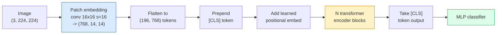

# विजन ट्रांसफार्मर (वीटी) 视觉 ट्रांसफार्मर

> छवि को पैच में काटें, प्रत्येक पैच को एक शब्द के रूप में देखें, एक मानक ट्रांसफार्मर चलाएं. पीछे मत देखो.

> **【中文解读】**इसे एक "शब्द" के रूप में सेट करें, फिर मानक ट्रांसफार्मर का उपयोग करें।

> **【拓展：ViT 与 GPT-4V】**वीआईटी जीपीटी-4वी, क्लॉड की दृश्य क्षमता, एलएलएवीए आदि के कई मॉडल के दृश्य कोडिंग डिवाइस हैं। 2021 से लेकर अब तक, वीआईटी कंप्यूटर विजन की बुनियादी ढांचे बन गई है, जिसका उपयोग क्लिप, सैम, डिनो आदि के लिए किया जाता है।

**Type:** Build | **类型:** 动手
**Languages:** Python | **语言:** Python
**Prerequisites:** Phase 7 Lesson 02 (Self-Attention), Phase 4 Lesson 04 (Image Classification) | **前置知识:** Phase 7 Lesson 02（自注意力），Phase 4 Lesson 04（图像分类）
**Time:** ~45 minutes | **时间:** ~45 分钟

## सीखने के लक्ष्य

- न्यूनतम ViT बनाने के लिए पैच एम्बेडिंग, सीखे गए स्थिति एम्बेडिंग, वर्ग टोकन और ट्रांसफार्मर एन्कोडर ब्लॉक को खरोंच से लागू करें
- समझाएं कि क्यों माना जाता था कि वीआईटी को बड़े पैमाने पर पूर्व-प्रशिक्षण डेटा की आवश्यकता होगी जब तक डीआईटी और एमएई इसके विपरीत साबित नहीं करते
- अपने वास्तुकला पूर्व में ViT, Swin, और ConvNeXt की तुलना करें (कोई नहीं, स्थानीय खिड़की ध्यान, conv रीढ़ की हड्डी)
-  के प्रयोग से एक छोटे से डेटासेट पर पूर्व प्रशिक्षित ViT को ठीक से समायोजित करें`timm`और मानक रैखिक-संड / बारीक-ट्यूनिंग नुस्खा

> **【中文解读】**सीखने के लक्ष्य इस कक्षा को पूरा करने के बाद जो मूल क्षमताएं होनी चाहिए, उन्हें सूचीबद्ध करते हैं।


## समस्या  समस्या परिचय

एक दशक तक, संकुचन कंप्यूटर दृष्टि के पर्याय था। सीएनएन के पास मजबूत प्रेरक पूर्वाग्रह थे  स्थानीयता, अनुवाद समतुल्यता  जो किसी ने नहीं सोचा था कि आप इसे बदल सकते हैं। फिर डोसोविट्स्की और अन्य (2020) ने दिखाया कि सपाट छवि पैचों पर लागू एक साधारण ट्रांसफार्मर, बिना किसी संकुचन मशीनरी के, पैमाने पर सबसे अच्छे सीएनएन से मेल खा सकता है या हरा सकता है।

> एक दशक से, उलटापन कंप्यूटर विजन का नाम है। सीएनएन में बहुत मजबूत उलटापन है। स्थानीयता, समस्थानिकता, आदि परिवर्तनशीलता। कोई नहीं सोचता कि आप इसे बदल सकते हैं। फिर डोसोविट्स्की आदि। 2020 में, सामान्य ट्रांसफार्मर को दिखाया गया है।

ImageNet-1k पर ViT ResNet से हार गया। वीआईटी ने इमेजनेट-21k या जेएफटी-300एम पर पूर्व-प्रशिक्षित किया और फिर इमेजनेट-1k पर ठीक से समायोजित किया। निष्कर्ष यह था कि ट्रांसफार्मर में उपयोगी पूर्ववर्ती नहीं थे लेकिन पर्याप्त डेटा से उन्हें सीख सकते थे। बाद के काम (DeiT, MAE, DINO) ने दिखाया कि सही प्रशिक्षण व्यंजनों के साथ  मजबूत वृद्धि, आत्म-निरीक्षण पूर्व प्रशिक्षण, डिस्टिलिशन  छोटे डेटा पर भी वीटी ठीक प्रशिक्षण।

>                                                                                                                                                                                                                                                               

2026 तक, शुद्ध सीएनएन अभी भी किनारे उपकरणों पर प्रतिस्पर्धी हैं (ConvNeXt सबसे मजबूत है), लेकिन ट्रांसफार्मर बाकी सब कुछ पर हावी हैंः खंडन (मास्क 2 फॉर्मर, सेग फॉर्मर), पता लगाने (DETR, RT-DETR), मल्टीमोडल (CLIP, SigLIP), वीडियो (VideoMAE, VJEPA) ।

> 2026 तक, शुद्ध सीएनएन पर सीमांत उपकरणों पर अभी भी प्रतिस्पर्धा है, लेकिन ट्रांसफार्मर ने बाकी सब कुछ पर शासन कियाः विभाजन, डिवीजन, डिवीजन, डिवीजन, डिवीजन, डिवीजन, डिवीजन, डिवीजन, डिवीजन, डिवीजन, डिवीजन, डिवीजन, डिवीजन, डिवीजन, डिवीजन, डिवीजन, डिवीजन, डिवीजन, डिवीजन, डिवीजन, डिवीजन, डिवीजन, डिवीजन, डिवीजन, डिवीजन, डिवीजन, डिवीजन, डिवीजन, डिवीजन, डिवीजन, डिवीजन, डिवीजन, डिवीजन, डिवीजन, डिवीजन, डिवीजन, डिवीजन, डिवीजन, डिवीजन, डिवीजन, डिवीजन, डिवीजन, डिवीजन, डिवीजन, डिवीजन, डिवीजन, डिवीजन, डिवीजन, डिवीजन, डिवीजन, डिवीजन, डिवीजन, डिवीजन, डिवीजन, डिवीजन, डिवीजन, डिवीजन, डिवीजन, डिवीजन, डिवीजन, डिवीजन, डिवीजन, डिवीजन, डिवीजन, डिवीजन, डिवीजन, डिवीजन, डिवीजन, डिवीजन, डिवीजन, डिवीजन, डिवीजन, डिवीजन, डिवीजन, डिवीजन, डिवीजन, डिवीजन, डिवीजन, डिवीजन, डिवीजन, डिवीजन, डिवीजन, डिवीजन, डिवीजन, डिवीजन, डिवीजन, डिवीजन, डिवीजन, डिवीजन, डिवीजन, डिवीजन, डिवीजन, डिवीजन, डिवीजन, डिवीजन, डिवीजन, डिवीजन, डिवीजन, डिवीजन, डिवीजन, डिवीजन, डिवीजन, डिवीजन, डिवीजन, डिवीजन, डिवीजन, डिवीजन, डिवीजन, डिवीजन, डिवीजन, डिवीजन, डिवीजन, डिवीजन, डिवीजन, डिवीजन, डिवीजन, डिवीजन, डिवीजन, डिवीजन, डिवीजन, डि

## अवधारणा का मूल अवधारणा

> **【中文解读】**इस भाग में मूल अवधारणाओं और सिद्धांतों की आधारभूत जानकारी दी गई है। इन अवधारणाओं को प्राप्त करना बाद में होने वाली प्रक्रियाओं के लिए एक शर्त है।


### पाइपलाइन



सात चरण। पैच -> टोकन -> ध्यान -> वर्गीकरणकर्ता। प्रत्येक संस्करण (DeiT, Swin, ConvNeXt, MAE पूर्व प्रशिक्षण) सात में से एक या दो को बदलता है और बाकी को अकेला छोड़ देता है।

> 七步──补丁 -> टोकन -> 注意力 -> 分类器── प्रत्येक变体(DeiT、Swin、ConvNeXt、MAE 预训练) केवल परिवर्तन सात चरणों में से एक दो चरणों, शेष बरकरार रहेगा

### पैच एम्बेडिंग

पहला कन्भ रहस्य है. कर्नेल आकार 16, चरण 16, तो एक 224x224 छवि 16x16 पैचों की 14x14 ग्रिड बन जाती है, प्रत्येक 768-dim एम्बेडिंग के लिए प्रक्षेपित। यह एकल कन्भ दोनों पैच करता है और रैखिक रूप से प्रोजेक्ट करता है।

> पहला खंड गुप्त स्थान है। 16 चरणों का आकार 16 है। इस प्रकार 224x224 का चित्र 14x14 के 16x16 परिशिष्ट के रूप में बदल गया है। प्रत्येक परिशिष्ट का अनुमान 768 आयामों में लगाया गया है।

```
Input:  (3, 224, 224)
Conv (3 -> 768, k=16, s=16, no padding):
Output: (768, 14, 14)
Flatten spatial: (196, 768)
```

196 पैच = 196 टोकन। प्रत्येक टोकन का फीचर आयाम 768 (ViT-B), 1024 (ViT-L), या 1280 (ViT-H) है।

> 196 个补丁 = 196 个符号── प्रत्येक符号的特征维度为 768(ViT-B)、1024(ViT-L) 或 1280(ViT-H)。

### वर्ग टोकन

एक एकल सीखा वेक्टर अनुक्रम के लिए तैयार किया गयाः

> एक सीखने योग्य वेट्यूम क्रम के सामने जोड़ा गयाः

```
tokens = [CLS; patch_1; patch_2; ...; patch_196]   shape (197, 768)
```

N ट्रांसफार्मर ब्लॉक के बाद, `[CLS]`आउटपुट वैश्विक छवि प्रतिनिधित्व है। वर्गीकरण सिर केवल इस एक वेक्टर पढ़ता है।

> 经过 N 个 ट्रांसफार्मर 块后,`[CLS]`का आउटपुट संपूर्ण चित्र का प्रतिनिधित्व करता है।

### स्थितिगत सम्मिलन

ट्रांसफार्मर में स्थानिक स्थिति का कोई अंतर्निहित विचार नहीं है। प्रत्येक टोकन में एक सीखा वेक्टर जोड़ेंः

> ट्रांसफार्मर 没有内置的空间位置概念── प्रत्येक टोकन को एक सीखने योग्य वेटमेंट जोड़ेंः

```
tokens = tokens + learned_pos_embedding   (also shape (197, 768))
```

एम्बेडिंग मॉडल का एक पैरामीटर है; ग्रेडिएंट आधारित प्रशिक्षण इसे 2D छवि संरचना के अनुकूल बनाता है। सिनोसाइडल 2D विकल्प मौजूद हैं लेकिन अभ्यास में शायद ही कभी उपयोग किए जाते हैं।

> 嵌入是模型的参数;梯度 पर आधारित प्रशिक्षण इसे 2D 图像结构  के अनुकूल बनाता है।

### ट्रांसफार्मर एन्कोडर ब्लॉक

मानक, बहु-मुख्य आत्म-ध्यान, एमएलपी, अवशिष्ट कनेक्शन, पूर्व-परत मानक।

> 标准结构──多头自注意力、MLP、残差连接、前置 LayerNorm──

```
x = x + MSA(LN(x))
x = x + MLP(LN(x))

MLP is two-layer with GELU: Linear(d -> 4d) -> GELU -> Linear(4d -> d)
```

ViT-B/16 इन ब्लॉक में से 12 को ढेर करता है, प्रत्येक में 12 ध्यान सिर होते हैं, कुल 86M पैरामीटर होते हैं।

> ViT-B/16  12 ऐसे ब्लॉकों को ढेर कर रहा है, प्रत्येक में 12 ध्यान देने वाले प्रमुख हैं, कुल 86 मिलियन पैरामीटर हैं।

### पूर्व-एलएन क्यों

एलएन के बाद इस्तेमाल किए जाने वाले शुरुआती ट्रांसफार्मर (`x = LN(x + sublayer(x))`(क) और बिना वार्मिंग के 6-8 परतों के बाद प्रशिक्षण के लिए संघर्ष किया।`x = x + sublayer(LN(x))`) गहरे नेटवर्क को स्थिर रूप से गर्म किए बिना ट्रेन करता है। हर वीटी और हर आधुनिक एलएलएम प्री-एलएन का उपयोग करता है।

> 早期 ट्रांसफार्मर 使用后置 LN(`x = LN(x + sublayer(x))`), बहुत मुश्किल है बिना पूर्व ताप के स्थिति में प्रशिक्षण 6-8 層 से अधिक`x = x + sublayer(LN(x))`) बिना पूर्व ताप के यानि अधिक गहरे नेटवर्क का स्थिर प्रशिक्षण हेतु हेतु हेतु हेतु हेतु हेतु हेतु हेतु हेतु हेतु हेतु हेतु हेतु हेतु हेतु हेतु हेतु हेतु हेतु हेतु हेतु हेतु हेतु हेतु हेतु हेतु हेतु हेतु हेतु हेतु हेतु हेतु हेतु हेतु हेतु हेतु हेतु हेतु हेतु हेतु हेतु हेतु हेतु हेतु हेतु हेतु हेतु हेतु हेतु हेतु हेतु हेतु हेतु हेतु हेतु हेतु हेतु हेतु हेतु हेतु हेतु हेतु हेतु हेतु हेतु हेतु हेतु हेतु हेतु हेतु हेतु हेतु हेतु हेतु हेतु हेतु हेतु हेतु हेतु हेतु हेतु हेतु हेतु हेतु हेतु हेतु हेतु हेतु हेतु हेतु हेतु हेतु हेतु हेतु हेतु हेतु हेतु हेतु हेतु हेतु हेतु हेतु हेतु हेतु हेतु हेतु हेतु हेतु हेतु हेतु हेतु हेतु हेतु हेतु हेतु हेतु हेतु हेतु हेतु हेतु हेतु हेतु हेतु हेतु हेतु हेतु हेतु हेतु हेतु हेतु हेतु हेतु हेतु हेतु हेतु हेतु हेतु हेतु हेतु हेतु हेतु हेतु हेतु हेतु हेतु हेतु हेतु हेतु हेतु हेतु हेतु हेतु हेतु हेतु हेतु हेतु हेतु हेतु हेतु हेतु हेतु हेतु हेतु हेतु हेतु हेतु हेतु हेतु हेतु हेतु हेतु हेतु हेतु हेतु हेतु हेतु हेतु हेतु हेतु हेतु हेतु हेतु हेतु हेतु हेतु हेतु हेतु हेतु हेतु हेतु हेतु हेतु हेतु हेतु हेतु हेतु हेतु हेतु हेतु हेतु हेतु हेतु हेतु हेतु हेतु हेतु हेतु हेतु हेतु हेतु हेतु हेतु हेतु हेतु हेतु हेतु हेतु हेतु हेतु हेतु हेतु हेतु हेतु हेतु हेतु हेतु हेतु हेतु हेतु हेतु हेतु हेतु हेतु हेतु हेतु हेतु हेतु हेतु हेतु हेतु हेतु हेतु हेतु हेतु हेतु हेतु हेतु हेतु हेतु हेतु हेतु हेतु हेतु हेतु हेतु हेतु हेतु हेतु हेतु हेतु हेतु हेतु हेतु हेतु हेतु हेतु हेतु हेतु हेतु हेतु हेतु हेतु हेतु हेतु हेतु हेतु हेतु हेतु हेतु हेतु हेतु हेतु हेतु हेतु हेतु हेतु हेतु हेतु हेतु हेतु हेतु हेतु हेतु हेतु हेतु हेतु हेतु हेतु हेतु हेतु हेतु हेतु हेतु हेतु हेतु हेतु हेतु हेतु हेतु हेतु हेतु हेतु हेतु हेतु हेतु हेतु हेतु हेतु हेतु हेतु हेतु हेतु हेतु हेतु हेतु हेतु हेतु हेतु हेतु हेतु हेतु हेतु हेतु हेतु हेतु हेतु हेतु हेतु हेतु हेतु हेतु हेतु हेतु हेतु हेतु हेतु हेतु हेतु हेतु हेतु हेतु हेतु हेतु हेतु हेतु हेतु हेतु हेतु हेतु हेतु हेतु हेतु हेतु हेतु हेतु हेतु हेतु हेतु हेतु हेतु हेतु हेतु हेतु हेतु हेतु हेतु हेतु हेतु हेतु हेतु हेतु हेतु हेतु हेतु हेतु हेतु हेतु हेतु हेतु हेतु हेतु हेतु हेतु हेतु हेतु हेतु हेतु हेतु हेतु हेतु हेतु हेतु हेतु हेतु हेतु हेतु हेतु हेतु हेतु हेतु हेतु हेतु हेतु हेतु हेतु हेतु हेतु हेतु हेतु हेतु हेतु हेतु हेतु हेतु हेतु हेतु हेतु हेतु हेतु हेतु हेतु हेतु हेतु हेतु हेतु हेतु हेतु हेतु हेतु हेतु हेतु हेतु हेतु हेतु हेतु हेतु हेतु हेतु हेतु हेतु हेतु हेतु हेतु हेतु हेतु हेतु हेतु हेतु हेतु हेतु हेतु हेतु हेतु हेतु हेतु हेतु हेतु हेतु हेतु हेतु हेतु हेतु हेतु हेतु हेतु हेतु हेतु हेतु हेतु हेतु हेतु हेतु हेतु हेतु हेतु हेतु हेतु हेतु हेतु हेतु हेतु हेतु हेतु हेतु हेतु हेतु

### पैच आकार का व्यापार-बदला

- 16x16 पैच -> 196 टोकन, मानक।
  中文翻译:16x16 补丁 -> 196 个代币,标准配置──
- 32x32 पैच -> 49 टोकन, तेज लेकिन कम संकल्प.
  中文翻译:32x32 补丁 -> 49 个代币,更快但分辨率更低──
- 8x8 पैच -> 784 टोकन, ठीक लेकिन O(n^2) ध्यान लागत पैमाने बुरी तरह से.
  中文翻译:8x8 补丁 -> 784 个代币,更精细但O(n^2) ध्यान शक्ति लागत बढ़ी गंभीरतया。

बड़े पैच = कम टोकन = तेज़ लेकिन कम स्थानिक विवरण। स्विनवी 2 पदानुक्रमिक खिड़कियों में 4x4 पैच का उपयोग करता है।

> अधिक बड़ा जोड़ = अधिक कम टोकन = अधिक तेज़ लेकिन अंतरिक्ष विवरण कम──SwinV2 लेवलकरण विंडो में 4x4 जोड़ों का उपयोग करते हैं──

### ImageNet-1k पर ViT को प्रशिक्षित करने के लिए DeiT का नुस्खा

मूल वीआईटी को सीएनएन को हराने के लिए जेएफटी -300एम की आवश्यकता थी। डेआईटी (टौव्रोन एट अल, 2020) ने चार परिवर्तनों के साथ केवल इमेजनेट -१के पर वीआईटी-बी को 81.8% शीर्ष-1 तक प्रशिक्षित कियाः

> मूल ViT 需要JFT-300M 才能击败CNN──DeiT(Touvron等,2020) केवल चार सुधारों के साथ就在ImageNet-1k 上将 ViT-B 训练到81.8% शीर्ष-1:

1. भारी वृद्धिः रैंडम ऑगमेंट, मिक्सअप, कट मिक्स, रैंडम मिटाना।
   中文翻译:强数据增强: रैंडम ऑगमेंट、मिक्सअप、कटमिक्स、रैंडम मिटाना。
2. स्टोकास्टिक गहराई (प्रशिक्षण के दौरान पूरी ब्लॉक को यादृच्छिक रूप से गिरा दें) ।
   中文翻译:随机深度(训练时随机丢弃整个块)
3. दोहराया गया बढ़ाव (एक बैच पर 3 बार एक ही छवि का नमूना लिया गया) ।
   中文翻译:重复增强(同一图像在每批中采样 3 次) 
4. सीएनएन शिक्षक से डिस्टिलिशन (वैकल्पिक, सटीकता को और बढ़ाता है) ।
   中文翻译: से सीएनएन शिक्षक模型蒸(可选,进一步提升精度)

हर आधुनिक वीआईटी प्रशिक्षण नुस्खा डेआईटी से आता है।

> प्रत्येक आधुनिक वीटी प्रशिक्षण कार्यक्रम डेटी से उत्पन्न होता है।

### स्विन बनाम कन्वेनेक्स

- **Swin**(Liu et al., 2021)  खिड़की आधारित ध्यान. प्रत्येक ब्लॉक स्थानीय खिड़की के भीतर भाग लेता है; बारी-बारी से ब्लॉक खिड़की के माध्यम से जानकारी मिश्रण करने के लिए खिड़की को स्थानांतरित करते हैं। ध्यान ऑपरेटर को बनाए रखते हुए एक सीएनएन-जैसी स्थानीयता वापस लाता है।
  中文翻译:**Swin**(Liu 等,2021)  खिड़की पर आधारित ध्यान। प्रत्येक ब्लॉक स्थानीय खिड़की के भीतर ध्यान केंद्रित करता है।
- **ConvNeXt**(लिउ एट अल, 2022)  ने सीएनएन को फिर से डिज़ाइन किया जो स्विन के वास्तुकला विकल्पों से मेल खाता है (गहनता से कन्वर्स, लेयरनॉर्म, जीईएलयू, उल्टा बोतल गला) । दिखाया कि अंतर "ध्यान बनाम घुमाव" नहीं है बल्कि "आधुनिक प्रशिक्षण नुस्खा + वास्तुकला" है।
  中文翻译:**ConvNeXt**(Liu 等,2022)  पुनः डिज़ाइन किया गया CNN,匹配 Swin का आर्किटेक्चर चयन(深度可分离卷积、LayerNorm、GELU、倒置瓶)  दिखाता है कि अंतर" ध्यान बनाम卷积" नहीं है बल्कि" आधुनिक प्रशिक्षण कार्यक्रम + 架构"

2026 में, ConvNeXt-V2 और Swin-V2 दोनों उत्पादन-ग्रेड हैं; सही विकल्प आपके निष्कर्ष स्टैक (ConvNeXt किनारे के लिए बेहतर संकलित करता है) और प्री-ट्रेनिंग कॉर्पस पर निर्भर करता है।

> 2026 साल,ConvNeXt-V2 和 Swin-V2 都是生产级方案;正确选择取决于推理(ConvNeXt 在边缘设备上编译更好) 和预训语料──

### एमएई पूर्व प्रशिक्षण

मास्क ऑटोकोडर (He et al., 2022): यादृच्छिक रूप से 75% पैचों को मास्क करें, एन्कोडर को केवल दृश्यमान 25% को संसाधित करने के लिए प्रशिक्षित करें, एन्कोडर के आउटपुट से मास्क किए गए पैचों को पुनर्निर्माण करने के लिए एक छोटे से डिकोडर को प्रशिक्षित करें। प्री-ट्रेनिंग के बाद, डिकोडर को त्याग दें और एन्कोडर को ठीक से ट्यून करें।

> 掩码自编码器(他等,2022):随机掩藏 75% की补丁,训练编码器只处理可见的25%,训练一个小解码器从编码器输出重建被掩藏的补丁──预训后丢弃解码器,微调编码器──

MAE केवल ImageNet-1k पर ही ViT को प्रशिक्षित करता है, SOTA को हिट करता है, और वर्तमान डिफ़ॉल्ट स्व-निरीक्षण नुस्खा है।

> एमएई उपयोग वीटी  केवल ImageNet-1k 上可训练, SOTA तक पहुंचना,  वर्तमान में स्व-निरीक्षण प्रशिक्षण कार्यक्रम है

> **【中文解读】**इस भाग के माध्यम से कोड को शून्य से लागू किया जा सकता है कोर एल्गोरिदम। इस तरह के "शुरुआत से" तरीके से फ्रेमवर्क के पीछे के सिद्धांत को समझने में मदद मिलेगी, समस्याओं का सामना करते समय ब्लैक बॉक्स में फंस नहीं जाएगा।

> **【拓展：工业部署中的视觉系统】**वास्तविक औद्योगिक तैनाती में, विज़ुअल मॉडल को देरी, मॉडल आकार, किनारे उपकरण अनुकूलन आदि की समस्या पर विचार करने की आवश्यकता होती है। टेन्सरआरटी, ओएनएनएक्स रनटाइम, ओपनवीनो एक सामान्य उपयोग में आने वाला सुझाव त्वरण उपकरण है।

> **【拓展：数据标注与质量】**视觉任务的效果高度依赖标签数据质量──标签工作室、CVAT是主流标签工具──在工业场景中,主动学习(Active Learning) ले标签成本 को कम कर सकता हैः मॉडल अनिश्चित नमूना अनुरोधों के लिए कृत्रिम标签, अनिश्चितता के नमूने स्वचालित标签──


## इसे बनाओ, इसे पूरा करो।
```figure
batchnorm-inference
```

## इसे बनाओ

### चरण 1: पैच एम्बेडिंग

```python
import torch
import torch.nn as nn

class PatchEmbedding(nn.Module):
    def __init__(self, in_channels=3, patch_size=16, dim=192, image_size=64):
        super().__init__()
        assert image_size % patch_size == 0
        self.proj = nn.Conv2d(in_channels, dim, kernel_size=patch_size, stride=patch_size)
        num_patches = (image_size // patch_size) ** 2
        self.num_patches = num_patches

    def forward(self, x):
        x = self.proj(x)
        return x.flatten(2).transpose(1, 2)
```

एक कन्वि, एक फ्लैट, एक ट्रांसपोज. यह पूरी छवि-से-टोकन कदम है.

> एक गुच्छा, एक तराजू, एक परिवर्तन। यह चित्र के सभी चरणों में से एक है।

### चरण 2: ट्रांसफार्मर ब्लॉक

पूर्व-एलएन, बहु-मुख्य आत्म-विचार, जीईएलयू के साथ एमएलपी, अवशिष्ट कनेक्शन।

> पूर्वनिवेश LN、多头自注意力、带 GELU के MLP、残差连接──

```python
class Block(nn.Module):
    def __init__(self, dim, num_heads, mlp_ratio=4, dropout=0.0):
        super().__init__()
        self.ln1 = nn.LayerNorm(dim)
        self.attn = nn.MultiheadAttention(dim, num_heads, dropout=dropout, batch_first=True)
        self.ln2 = nn.LayerNorm(dim)
        self.mlp = nn.Sequential(
            nn.Linear(dim, dim * mlp_ratio),
            nn.GELU(),
            nn.Dropout(dropout),
            nn.Linear(dim * mlp_ratio, dim),
            nn.Dropout(dropout),
        )

    def forward(self, x):
        a, _ = self.attn(self.ln1(x), self.ln1(x), self.ln1(x), need_weights=False)
        x = x + a
        x = x + self.mlp(self.ln2(x))
        return x
```

`nn.MultiheadAttention`सिरों में विभाजन, स्केल बिंदु उत्पाद, और आउटपुट प्रक्षेपण को संभालता है। `batch_first=True`तो आकार हैं `(N, seq, dim)`. .

> `nn.MultiheadAttention`处理多头拆分、缩放点积和输出投影──`batch_first=True`बनाने की`(N, seq, dim)`

### चरण 3: वीआईटी

```python
class ViT(nn.Module):
    def __init__(self, image_size=64, patch_size=16, in_channels=3,
                 num_classes=10, dim=192, depth=6, num_heads=3, mlp_ratio=4):
        super().__init__()
        self.patch = PatchEmbedding(in_channels, patch_size, dim, image_size)
        num_patches = self.patch.num_patches
        self.cls_token = nn.Parameter(torch.zeros(1, 1, dim))
        self.pos_embed = nn.Parameter(torch.zeros(1, num_patches + 1, dim))
        self.blocks = nn.ModuleList([
            Block(dim, num_heads, mlp_ratio) for _ in range(depth)
        ])
        self.ln = nn.LayerNorm(dim)
        self.head = nn.Linear(dim, num_classes)
        nn.init.trunc_normal_(self.pos_embed, std=0.02)
        nn.init.trunc_normal_(self.cls_token, std=0.02)

    def forward(self, x):
        x = self.patch(x)
        cls = self.cls_token.expand(x.size(0), -1, -1)
        x = torch.cat([cls, x], dim=1)
        x = x + self.pos_embed
        for blk in self.blocks:
            x = blk(x)
        x = self.ln(x[:, 0])
        return self.head(x)

vit = ViT(image_size=64, patch_size=16, num_classes=10, dim=192, depth=6, num_heads=3)
x = torch.randn(2, 3, 64, 64)
print(f"output: {vit(x).shape}")
print(f"params: {sum(p.numel() for p in vit.parameters()):,}")
```

लगभग 2.8M पैरामीटर  एक छोटा ViT CPU पर टरेबल। वास्तविक ViT-B 86M है; के साथ एक ही वर्ग परिभाषा `dim=768, depth=12, num_heads=12`. .

> लगभग 2.80 मिलियन पैरामीटर एक CPU पर प्रशिक्षित करने योग्य छोटे ViT है। वास्तविक ViT-B में 86 मिलियन पैरामीटर हैं; समान श्रेणी परिभाषा, केवल आवश्यकता है।`dim=768, depth=12, num_heads=12`

### चरण 4: मानसिकता जांच  एकल छवि निष्कर्ष

```python
logits = vit(torch.randn(1, 3, 64, 64))
print(f"logits: {logits}")
print(f"probs:  {logits.softmax(-1)}")
```

> **【中文解读】**इस भाग में दिखाया गया है कि इस तकनीक को कैसे तेजी से लागू किया जाए। इस प्रकार के एक परिपक्व ढांचे का उपयोग करके बग कम किए जा सकते हैं और विकास दक्षता में सुधार किया जा सकता है।


त्रुटि के बिना चलना चाहिए. संभावनाओं का योग 1 है.

> 应无错运行――概率之和为1――


> **【拓展：视觉模型的持续学习】**उत्पादन वातावरण में, दृश्य मॉडल को नए डेटा को लगातार अनुकूलित करने की आवश्यकता होती है। यह ऑटोमोटिव ड्राइविंग और औद्योगिक गुणवत्ता जांच में विशेष रूप से महत्वपूर्ण है।

## इसे फ्रेमवर्क के साथ लागू करें

`timm`ImageNet पूर्व प्रशिक्षित वजन के साथ सभी ViT संस्करण जहाज. एक पंक्तिः

```python
import timm

model = timm.create_model("vit_base_patch16_224", pretrained=True, num_classes=10)
```

`timm`यह 2026 में दृष्टि ट्रांसफार्मर के लिए उत्पादन डिफ़ॉल्ट है। यह उसी एपीआई के तहत वीआईटी, डेआईटी, स्विन, स्विन-वी2, कॉन्वनेएक्सटी, कॉन्वनेएक्सटी-वी2, मैक्सवीआईटी, एमवीआईटी, इफ़ेक्टिवफॉर्मर और दर्जनों अन्य लोगों का समर्थन करता है।

बहु-मॉडल कार्य के लिए (छवि + पाठ), `transformers`इन सभी में छवि एन्कोडर एक ViT संस्करण है।

> **【中文解读】**इस खंड में इस बात पर ध्यान दिया गया है कि मॉडल को उपलब्ध उत्पादों के रूप में कैसे तैनात किया जाए। मूल से लेकर उत्पादन स्तर तक, प्रदर्शन अनुकूलन, त्रुटि प्रसंस्करण, निगरानी आदि के कई आयामों पर विचार करने की आवश्यकता है।


## इसे भेजें उत्पाद

इस पाठ से उत्पन्न होता हैः

- `outputs/prompt-vit-vs-cnn-picker.md` एक संकेत जो डेटासेट आकार, गणना और निष्कर्ष स्टैक के आधार पर एक ViT, एक ConvNeXt, या एक Swin के बीच चुनता है।
- `outputs/skill-vit-patch-and-pos-embed-inspector.md` एक कौशल जो एक ViT के पैच एम्बेडिंग और स्थितित्मक एम्बेडिंग आकारों को मॉडल की अपेक्षित अनुक्रम लंबाई से मेल खाती है, सबसे आम पोर्टिंग बग को पकड़ता है।

> **【中文解读】**练习题按照易/中级/难度递进;;建议至少完成中级题,Hard级适合深入研究或面试准备;;


## अभ्यास विषय

1. **(Easy)**ऊपर की छोटी ViT के माध्यम से आगे जाने के लिए प्रत्येक मध्यवर्ती Tensor के आकार प्रिंट करें। पुष्टि करेंः इनपुट `(N, 3, 64, 64)`-> पैच `(N, 16, 192)`-> CLS के साथ `(N, 17, 192)`-> वर्गीकरणकर्ता इनपुट `(N, 192)`-> आउटपुट `(N, num_classes)`. .
2. **(Medium)**एक पूर्व प्रशिक्षित को ठीक से समायोजित करें `timm`पाठ 4 से सिंथेटिक-सीआईएफएआर डेटासेट पर ViT-S/16 की तुलना करें। उसी डेटा पर ResNet-18 के ठीक-ठीक समायोजन के साथ तुलना करें। प्रशिक्षण समय और अंतिम सटीकता की रिपोर्ट करें।
3. **(Hard)**छोटे ViT के लिए MAE प्री-ट्रेनिंग लागू करेंः पैचों का 75% मास्क करें, मास्क किए गए पैचों को पुनर्निर्माण करने के लिए एन्कोडर + एक छोटा डिकोडर प्रशिक्षित करें। प्री-ट्रेनिंग से पहले और बाद में सिंथेटिक डेटा पर रैखिक-सॉन्ड सटीकता का मूल्यांकन करें।

> **【中文解读】**术语表中的"क्या लोग कहते हैं" बनाम "क्या वास्तव में इसका मतलब है" 区分日常口语和精确技术含义──在团队协作中,统一术语定义可以避免大量沟通误解──


## कीवर्ड्स  शब्द खोज तालिका

| Term | What people say | What it actually means |
|------|----------------|----------------------|
| Patch embedding | "The first conv" | A conv with kernel size = stride = patch size; turns the image into a grid of token embeddings |
| Class token | "[CLS]" | A learned vector prepended to the token sequence; its final output is the global image representation |
| Positional embedding | "Learned pos" | A learned vector added to every token so the transformer knows where each patch came from |
| Pre-LN | "LayerNorm before sublayer" | The stable transformer variant: `x + sublayer(LN(x))` instead of `LN(x + sublayer(x))` |
| Multi-head attention | "Parallel attention" | Standard transformer attention split into num_heads independent subspaces, concatenated afterwards |
| ViT-B/16 | "Base, patch 16" | The canonical size: dim=768, depth=12, heads=12, patch_size=16, image=224; ~86M params |
| DeiT | "Data-efficient ViT" | ViT trained on ImageNet-1k alone with strong augmentation; proved large pretraining datasets are not strictly required |
| MAE | "Masked autoencoder" | Self-supervised pretraining: mask 75% of patches, reconstruct; the dominant ViT pretraining recipe |

> **【中文解读】**延伸阅读 प्रदान करता है गहन सीखने के लिए उच्च गुणवत्ता वाले संसाधनों। ये लेख और पाठ्यक्रम इस क्षेत्र के लिए क्लासिक संदर्भ हैं, जो गहन समझ की आवश्यकता वाले पाठकों के लिए उपयुक्त हैं।


## आगे पढ़ना 延伸閱讀

- [An Image is Worth 16x16 Words (Dosovitskiy et al., 2020)](https://arxiv.org/abs/2010.11929) वीआईटी पेपर
- [DeiT: Data-efficient Image Transformers (Touvron et al., 2020)](https://arxiv.org/abs/2012.12877) अकेले ImageNet-1k पर ViT को कैसे प्रशिक्षित किया जाए
- [Masked Autoencoders are Scalable Vision Learners (He et al., 2022)](https://arxiv.org/abs/2111.06377) एमएई पूर्व प्रशिक्षण
- [timm documentation](https://huggingface.co/docs/timm) प्रत्येक दृष्टि परिवर्तनक के लिए संदर्भ जिसे आप उत्पादन में उपयोग करेंगे
