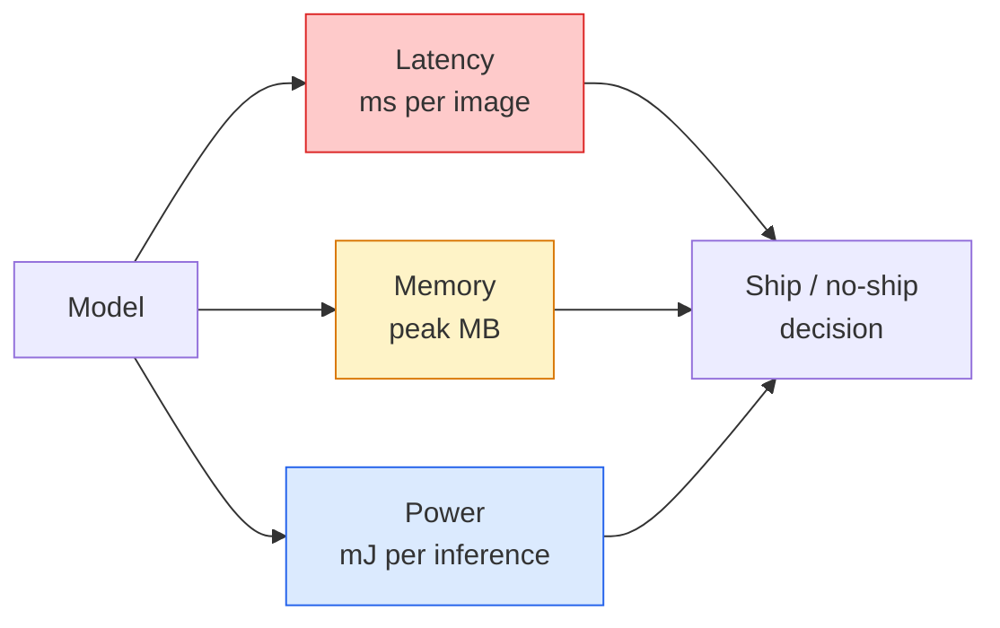

# वास्तविक समय दृश्य  सीमा तैनाती  वास्तविक समय दृश्य  边缘部署

> एज इन्फेरेंस 90 की सटीकता मॉडल को 2 जीबी रैम वाले डिवाइस पर 30 फ़ीप्स प्रति सेकंड पर चलाने का अनुशासन है। सटीकता के प्रत्येक प्रतिशत बिंदु का लेनदेन लैटेंस के मिलीसेकंड के साथ किया जाता है।

> **【中文解读】**边缘推理 एक संतुलन कला हैः 90% 精度率 का मॉडल केवल 2GB内存 वाले उपकरणों पर 30fps 运行 🏻 प्रत्येक शत分点 की सटीकता दर में मिलीसेकंड की दर पर देरी होती है 🏻

> **【拓展：边缘 AI 的应用】**边缘部署在智能手机 (智能手机) 人脸解锁,拍照美化) 无人机 (无人机) 实时目标检测) 工业物联网 (IoT) 缺陷检测) 自动驾驶 (车载推理) 中至关重要──MobileNet、YOLO-nano、EfficientNet 常见的轻量级模型──

**Type:** Learn + Build | **类型:** 学习 + 动手
**Languages:** Python | **语言:** Python
**Prerequisites:** Phase 4 Lesson 04 (Image Classification), Phase 10 Lesson 11 (Quantization) | **前置知识:** Phase 4 Lesson 04（图像分类），Phase 10 Lesson 11（量化）
**Time:** ~75 minutes | **时间:** ~75 分钟

## सीखने के लक्ष्य

- किसी भी PyTorch मॉडल के लिए अनुमानित विलंबता, पीक मेमोरी और आउटपुट को मापें, और FLOPs / पैराम्स / विलंबता व्यापार-ऑफ पढ़ें
- PyTorch के प्रशिक्षण के बाद के क्वांटिज़ेशन का उपयोग करके एक दृष्टि मॉडल को INT8 में क्वांटिज़ करें और सटीकता हानि < 1% की पुष्टि करें
- ONNX में निर्यात करें और ONNX रनटाइम या TensorRT के साथ संकलित करें; तीन सबसे आम निर्यात विफलताओं और उनके समाधान का नाम दें
- किनारे की सीमा के लिए MobileNetV3, EfficientNet-Lite, ConvNeXt-Tiny या MobileViT को कब चुनना है, समझाएं

> **【中文解读】**सीखने के लक्ष्य इस कक्षा को पूरा करने के बाद जो मूल क्षमताएं होनी चाहिए, उन्हें सूचीबद्ध करते हैं।


## समस्या  समस्या परिचय

प्रशिक्षण समय दृष्टि मॉडल एक तैरते बिंदु राक्षस है। 100M पैरामीटर, 10 GFLOPs प्रति आगे पास, 2 जीबी वीआरएएम। इनमें से कोई भी फोन, कार की सूचना मनोरंजन इकाई, एक औद्योगिक कैमरा, या एक ड्रोन पर फिट नहीं होता है। एक दृष्टि प्रणाली को भेजने का मतलब है कि एक ही भविष्यवाणियों को एक बजट में फिट करना है जो 100 गुना छोटा है।

>  प्रशिक्षण के दौरान दृश्य मॉडल एक अव्वल बिंदु है। 1 बिलियन पैरामीटर है। प्रत्येक बार 10 GFLOPs के प्रसारण के लिए 2 जीबी का उपयोग किया जाता है। ये सभी उपकरण नहीं हैं।

तीन बटन अधिकांश काम करते हैंः मॉडल चयन (एक ही नुस्खा के साथ एक छोटी वास्तुकला), क्वांटिसेशन (एफपी 32 के बजाय इंटी 8) और निष्कर्ष रनटाइम (ओएनएनएक्स रनटाइम, टेंसरआरटी, कोर एमएल, टीएफएलआईटी) । उन्हें सही करना एक वर्कस्टेशन पर चलने वाले डेमो और $ 30 कैमरा मॉड्यूल पर जहाज करने वाले उत्पाद के बीच अंतर है।

> तीन चक्रों ने अधिकांश काम कियाः मॉडल चयन (उदाहरण) √ √ √ √ √ √ √ √ √ √ √ √ √ √ √ √ √ √ √ √ √ √ √ √ √ √ √ √ √ √ √ √ √ √ √ √ √ √ √ √ √ √ √ √ √ √ √ √ √ √ √ √ √ √ √ √ √ √ √ √ √ √ √ √ √ √ √ √ √ √ √ √ √ √ √ √ √ √ √ √ √ √ √ √ √ √ √ √ √ √ √ √ √ √ √ √ √ √ √ √ √ √ √ √ √ √ √ √ √ √ √ √ √ √ √ √ √ √ √ √ √ √ √ √ √ √ √ √ √ √ √ √ √ √ √ √ √ √ √ √ √ √ √ √ √ √ √ √ √ √ √ √ √ √ √ √ √ √ √ √ √ √ √ √ √ √ √ √ √ √ √ √ √ √ √ √ √ √ √ √ √ √ √ √ √ √ √ √ √ √ √ √ √ √ √ √ √ √ √ √ √ √ √ √ √ √ √ √ √ √ √ √ √ √ √ √ √ √ √ √ √ √ √ √ √ √ √ √ √ √ √ √ √ √ √ √ √ √ √ √ √ √ √ √ √ √ √ 

इस पाठ में पहले माप अनुशासन स्थापित किया जाता है (आप जो नहीं माप सकते हैं उसे अनुकूलित नहीं कर सकते हैं), फिर तीन बटन चलते हैं। लक्ष्य हर किनारे रनटाइम को सीखना नहीं है, बल्कि यह जानना है कि कौन से लीवर मौजूद हैं और यह कैसे सत्यापित करें कि प्रत्येक आपके विचार के अनुसार है।

> इस कक्षा में पहले माप विधि का निर्माण किया गया है, फिर तीन चक्रों के माध्यम से, लक्ष्य प्रत्येक किनारे पर काम करना सीखना नहीं है, बल्कि यह जानना है कि कौन से लिफ्ट हैं और कैसे सत्यापित करें कि प्रत्येक लिफ्ट ने आपके विचार से क्या किया है।

## अवधारणा का मूल अवधारणा

> **【中文解读】**इस भाग में मूल अवधारणाओं और सिद्धांतों की आधारभूत जानकारी दी गई है। इन अवधारणाओं को प्राप्त करना बाद में होने वाली प्रक्रियाओं के लिए एक शर्त है।


### तीनों बजट



- **Latency**: p50, p95, p99. केवल p50 का औसत करके पूंछ व्यवहार छिपाया जाता है जो वास्तविक समय प्रणालियों के लिए मायने रखता है।
  中文翻译:**延迟**:p50、p95、p99── केवल देखें p50  औसत मूल्य वास्तविक समय प्रणाली के लिए महत्वपूर्ण尾部 व्यवहारों में छिपा हुआ होगा──
- **Peak memory**यह महत्वपूर्ण है क्योंकि एम्बेडेड लक्ष्य पर ओओएम घातक हैं।
  中文翻译:**峰值内存**: उपकरण द्वारा देखा गया अधिकतम मूल्य, स्थिर औसत मूल्य नहीं है। महत्वपूर्ण है क्योंकि ओओएम में एम्बेडेड लक्ष्य पर घातक है।
- **Power / energy**: बैटरी संचालित डिवाइस पर प्रति अनुमान प्रति मिलीयूल्स। अक्सर CPU/GPU उपयोग समय * द्वारा प्रॉक्सी।
  中文翻译:**功耗/能量**: पंप आपूर्ति उपकरण पर प्रति विचार की मिलीजोज संख्या। आमतौर पर सीपीयू/जीपीयू उपयोग दर ×  समय के लिए निकटता।

एक तालिका (मॉडल, लेटेन्स, मेमोरी, सटीकता) वह है जिससे एक किनारे निर्णय लिया जाता है। प्रत्येक सेल को लक्ष्य डिवाइस पर मापा जाता है, न कि कार्यस्थान पर।

> एक张 (模型, 延迟, 内存, 精度) का रूप सीमा पर तैनाती निर्णयों के आधार पर है। प्रत्येक डेटा लक्ष्य उपकरण पर मापा जाता है, न कि कार्य स्टेशन पर।

### माप अनुशासन

तीन नियम जो प्रत्येक किनारे प्रोफ़ाइल का पालन करना चाहिएः

> प्रत्येक किनारे प्रदर्शन विश्लेषण के तीन नियम हैं जिनका पालन किया जाना चाहिए:

1. **Warm up**मापने से पहले 5-10 डमी फॉरवर्ड पास वाले मॉडल। ठंडे कैश और JIT संकलन गैर-प्रतिनिधात्मक पहले संख्याएं उत्पन्न करते हैं।
   中文翻译:**预热** माप पूर्व प्रयोग 5-10 बार भर्चुअल पूर्ववर्ती प्रसार पूर्व热模型── शीत缓存 एवं JIT 编译会产生不具代表性的初始数据──
2. **Synchronise** के साथ GPU कार्यभार`torch.cuda.synchronize()`समय ब्लॉक से पहले और बाद में. इसके बिना आप नाभिक डिस्पैच मापते हैं, नाभिक निष्पादन नहीं.
   中文翻译:**同步**                                                                                                                                                                                                                                                              `torch.cuda.synchronize()`साथ ही जीपीयू 工作负载──否则आपने मापने का तरीका内核调度 है, न कि内核执行──
3. **Fix input sizes**224x224 पर विलंबता 512x512 पर विलंबता नहीं है।
   中文翻译:**固定输入尺寸** उत्पादन रिज़ॉल्यूशन का उपयोग करना──224x224  上的延迟不等于 512x512  上的延迟──

### प्रॉक्सी के रूप में फ्लोप

फ्लोप्स (निष्कर्ष के अनुसार फ्लोटिंग-पॉइंट ऑपरेशन) लटेंसी के लिए एक सस्ता, डिवाइस-स्वतंत्र प्रॉक्सी है। वास्तुकला तुलना के लिए उपयोगी, पूर्ण वॉल-क्लॉक के रूप में भ्रामक। 10% अधिक फ्लोप्स वाला एक मॉडल व्यवहार में 2 गुना तेज़ हो सकता है क्योंकि यह हार्डवेयर-अनुकूल ओप्स (गहनता से कन्वेयर अच्छी तरह से संकलित करता है, बड़े 7x7 कन्वेयर नहीं) का उपयोग करता है।

> FLOPs (FLOPs) (प्रति विचार की浮点运算数) सस्ते हैं, उपकरण से संबंधित नहीं हैं, देरी के लिए एक एजेंट संकेत है। यह वास्तुकला तुलना के लिए उपयुक्त है, लेकिन समय के साथ गलतफहमी है।

नियमः वास्तुकला खोज के लिए FLOP का उपयोग करें, तैनाती निर्णयों के लिए डिवाइस पर विलंब का उपयोग करें।

> नियमः FLOP के उपयोग से संरचना खोज, उपकरण पर देरी से तैनाती निर्णय।

### एक पैराग्राफ में मात्रा

FP32 वजन और सक्रियण को INT8 से बदलें। मॉडल आकार 4x गिरता है, मेमोरी बैंडविड्थ 4x गिरता है, हार्डवेयर पर गणना 2-4x गिरती है जिसमें INT8 कर्नेल (प्रत्येक आधुनिक मोबाइल SoC, Tensor कोर के साथ प्रत्येक NVIDIA GPU) हैं। दृष्टि कार्यों पर सटीकता हानि आमतौर पर 0.1-1 प्रतिशत अंक है।

> FP32  भार और सक्रियण को INT8 में बदलना ⋅ मॉडल आकार 4 गुना कम हो गया,内存带宽 4 गुना कम हो गया, INT8 के आंतरिक हार्डवेयर पर गणना की मात्रा 2-4 गुना कम हो गई।

प्रकारः

> 类型:

- **Dynamic** INT8 तक क्वांटिज़ वजन, FP में गणना की गई सक्रियण। आसान, छोटी गति।
  中文翻译:**动态**权重量化为INT8, सक्रियण मूल्य以 FP 计算――简单,加速有限――
- **Static (post-training)** क्वांटिज़ वेट + एक छोटे से कैलिब्रेशन सेट पर कैलिब्रेशन सक्रियण रेंज। गतिशील से बहुत तेज।
  中文翻译:**静态（训练后）**量化权重 + 在小校准集上校准激活范围──比动态快得多──
- **Quantisation-aware training (QAT)** प्रशिक्षण के दौरान क्वांटिसेशन का अनुकरण करें ताकि मॉडल इसके आसपास सीख सके।
  中文翻译:**量化感知训练（QAT）** प्रशिक्षण समय模拟量化,让模型学会适应──精度最好,需要标签数据──

दृष्टि के लिए, प्रशिक्षण के बाद स्थैतिक मात्रा 95% लाभ प्रदान करती है, 5% प्रयास के साथ। केवल QAT का उपयोग करें जब PTQ से सटीकता का नुकसान अस्वीकार्य हो।

>  विज़ुअल मिशन के लिए, 5% के प्रयास के साथ प्रशिक्षण के बाद स्थिरता मापने का 95% लाभ प्राप्त करना  केवल जब PTQ की सटीकता का नुकसान अस्वीकार्य होता है तभी QAT का उपयोग किया जाता है

### कटाई और डिस्टिलिशन

- **Pruning** अनावश्यक वजन (महानता आधारित) या चैनल (संरचित) को हटा दें। यह अतिपरिमेट्रिक मॉडल पर अच्छा काम करता है; पहले से ही कॉम्पैक्ट वास्तुकला पर कम उपयोगी है।
  中文翻译:**剪枝** स्थानांतरण महत्वपूर्ण नहीं है वजन (आकार के आधार पर) या मार्ग (संरचनात्मक) ।
- **Distillation** एक छोटे छात्र को एक बड़े शिक्षक के लॉजिट की नकल करने के लिए प्रशिक्षित करें। अक्सर मॉडल को छोटा करके खोई गई सटीकता का अधिकांश हिस्सा बहाल करता है। उत्पादन किनारे मॉडल के लिए मानक।
  中文翻译:**蒸馏** प्रशिक्षण小模型(学生)模仿大模型(教师) के लॉजिट्स──通常能恢复缩小模型损失的大部分精度──生产级边缘模型的标准做法──

### निष्कर्ष रनटाइम

- **PyTorch eager** धीमी गति से, तैनाती के लिए नहीं, केवल विकास के लिए उपयोग करें।
  中文翻译:**PyTorch eager**慢, नहीं प्रयोग किया जाता है तैनाती हेतु.
- **TorchScript** विरासत।`torch.compile`और ONNX निर्यात।
  中文翻译:**TorchScript**遗留方案──已被 `torch.compile`和 ONNX 导出取代──
- **ONNX Runtime**CPU, CUDA, CoreML, TensorRT, OpenVINO सभी ONNX प्रदाताओं है. यहाँ से शुरू करें.
  中文翻译:**ONNX Runtime**中性运行时──CPU、CUDA、CoreML、TensorRT、OpenVINO सभी में ONNX  प्रदाता हैं──从这里开始──
- **TensorRT** एनवीआईडीए का संकलक। एनवीआईडीए जीपीयू (वर्क्सस्टेशन और जेटसन) पर सर्वश्रेष्ठ विलंबता। ONNX रनटाइम या स्टैंडअलोन के साथ एकीकृत।
  中文翻译:**TensorRT**NVIDIA का编译器──在NVIDIA GPU(工作站和Jetson)上延迟最低──
- **Core ML** आईओएस/मैकोस के लिए एप्पल का रनटाइम। आवश्यकताएँ `.mlmodel`या `.mlpackage`. .
  中文翻译:**Core ML**Apple के iOS/macOS 运行时──需要 `.mlmodel`या `.mlpackage`
- **TFLite** Android/ARM के लिए Google का रनटाइम। आवश्यकताएँ `.tflite`. .
  中文翻译:**TFLite**Google के Android/ARM 运行时──需要 `.tflite`
- **OpenVINO** इंटेल के सीपीयू/वीपीयू के लिए रनटाइम। आवश्यकताएँ `.xml`+ `.bin`. .
  中文翻译:**OpenVINO**इंटेल के सीपीयू/वीपीयू 运行时――需要 `.xml`+ `.bin`

अभ्यास मेंः निर्यात PyTorch -> ONNX -> लक्ष्य के लिए रनटाइम चुनें। ONNX भाषा है।

> 实践中:导出 PyTorch -> ONNX -> 选择目标运行时。ONNX 是通用语言。

### एज वास्तुकला पिकर

| Budget | Model | Why |
|--------|-------|-----|
| < 3M params | MobileNetV3-Small | Compiles everywhere, good baseline |
| 3-10M | EfficientNet-Lite-B0 | Best accuracy per param on TFLite |
| 10-20M | ConvNeXt-Tiny | Best accuracy-per-param, CPU-friendly |
| 20-30M | MobileViT-S or EfficientViT | Transformer with ImageNet accuracy |
| 30-80M | Swin-V2-Tiny | If stack supports window attention |

इन सभी को INT8 में मात्राबद्ध करें जब तक आपके पास ऐसा करने का कोई विशिष्ट कारण न हो।

> **【中文解读】**इस भाग के माध्यम से कोड को शून्य से लागू किया जा सकता है कोर एल्गोरिदम। इस तरह के "शुरुआत से" तरीके से फ्रेमवर्क के पीछे के सिद्धांत को समझने में मदद मिलेगी, समस्याओं का सामना करते समय ब्लैक बॉक्स में फंस नहीं जाएगा।

> **【拓展：工业部署中的视觉系统】**वास्तविक औद्योगिक तैनाती में, विज़ुअल मॉडल को देरी, मॉडल आकार, किनारे उपकरण अनुकूलन आदि की समस्या पर विचार करने की आवश्यकता होती है। टेन्सरआरटी, ओएनएनएक्स रनटाइम, ओपनवीनो एक सामान्य उपयोग में आने वाला सुझाव त्वरण उपकरण है।

> **【拓展：数据标注与质量】**视觉任务的效果高度依赖标签数据质量──标签工作室、CVAT是主流标签工具──在工业场景中,主动学习(Active Learning) ले标签成本 को कम कर सकता हैः मॉडल अनिश्चित नमूना अनुरोधों के लिए कृत्रिम标签, अनिश्चितता के नमूने स्वचालित标签──


## इसे बनाओ, इसे पूरा करो।
```figure
cnn-param-count
```

## इसे बनाओ

### चरण 1: विलंबता को सही ढंग से मापें

```python
import time
import torch

def measure_latency(model, input_shape, device="cpu", warmup=10, iters=50):
    model = model.to(device).eval()
    x = torch.randn(input_shape, device=device)
    with torch.no_grad():
        for _ in range(warmup):
            model(x)
        if device == "cuda":
            torch.cuda.synchronize()
        times = []
        for _ in range(iters):
            if device == "cuda":
                torch.cuda.synchronize()
            t0 = time.perf_counter()
            model(x)
            if device == "cuda":
                torch.cuda.synchronize()
            times.append((time.perf_counter() - t0) * 1000)
    times.sort()
    return {
        "p50_ms": times[len(times) // 2],
        "p95_ms": times[int(len(times) * 0.95)],
        "p99_ms": times[int(len(times) * 0.99)],
        "mean_ms": sum(times) / len(times),
    }
```

गर्म करें, समक्रमण करें, उपयोग करें `time.perf_counter()`. प्रतिशत रिपोर्ट करें, सिर्फ बुरा नहीं.

> 预热、同步、使用 `time.perf_counter()`                                                                                                                                                                                                                                                              

### चरण 2: पैरामीटर और FLOP गिनती

```python
def parameter_count(model):
    return sum(p.numel() for p in model.parameters())

def flops_estimate(model, input_shape):
    """
    Rough FLOP count for a conv/linear-only model. For production use `fvcore` or `ptflops`.
    """
    total = 0
    def conv_hook(m, inp, out):
        nonlocal total
        c_out, c_in, kh, kw = m.weight.shape
        h, w = out.shape[-2:]
        total += 2 * c_in * c_out * kh * kw * h * w
    def linear_hook(m, inp, out):
        nonlocal total
        total += 2 * m.in_features * m.out_features
    hooks = []
    for m in model.modules():
        if isinstance(m, torch.nn.Conv2d):
            hooks.append(m.register_forward_hook(conv_hook))
        elif isinstance(m, torch.nn.Linear):
            hooks.append(m.register_forward_hook(linear_hook))
    model.eval()
    with torch.no_grad():
        model(torch.randn(input_shape))
    for h in hooks:
        h.remove()
    return total
```

वास्तविक परियोजनाओं के लिए उपयोग `fvcore.nn.FlopCountAnalysis`या `ptflops`; वे प्रत्येक मॉड्यूल प्रकार को सही ढंग से संभालते हैं।

> 真实项目使用 `fvcore.nn.FlopCountAnalysis`या `ptflops`; वे प्रत्येक प्रकार के मॉड्यूल प्रकारों को सही ढंग से संभाल सकते हैं।

### चरण 3: प्रशिक्षण के बाद स्थैतिक मात्रा

```python
def quantise_ptq(model, calibration_loader, backend="x86"):
    import torch.ao.quantization as tq
    model = model.eval().cpu()
    model.qconfig = tq.get_default_qconfig(backend)
    tq.prepare(model, inplace=True)
    with torch.no_grad():
        for x, _ in calibration_loader:
            model(x)
    tq.convert(model, inplace=True)
    return model
```

तीन चरणः कॉन्फ़िगर करें, तैयार करें (निरीक्षक डालें), वास्तविक डेटा के साथ मापें, परिवर्तित करें (फ्यूज + क्वांटिज़) ।`Conv -> BN -> ReLU`-> `ConvBnReLU`), जो `torch.ao.quantization.fuse_modules`हैंडल।

> तीन चरण:配置、准备(插入观察器) 、 using true数据校准、转换(融合 + 量化)  आवश्यकता मॉडल मिला है(`Conv -> BN -> ReLU`-> `ConvBnReLU`),`torch.ao.quantization.fuse_modules`处理此事──

### चरण 4: ONNX को निर्यात करें

```python
def export_onnx(model, sample_input, path="model.onnx"):
    model = model.eval()
    torch.onnx.export(
        model,
        sample_input,
        path,
        input_names=["input"],
        output_names=["output"],
        dynamic_axes={"input": {0: "batch"}, "output": {0: "batch"}},
        opset_version=17,
    )
    return path
```

`opset_version=17`2026 में सुरक्षित चूक है।`dynamic_axes`आप मनमाने बैच आकार के साथ ONNX मॉडल चला सकते हैं।

> `opset_version=17`यह 2026 के लिए सुरक्षा मान है।`dynamic_axes` अनुमति ONNX 模型 任意批量大小运行──

### चरण 5: बेंचमार्क और तुलना की व्यवस्था

```python
import torch.nn as nn
from torchvision.models import mobilenet_v3_small

def compare_regimes():
    model = mobilenet_v3_small(weights=None, num_classes=10)
    params = parameter_count(model)
    flops = flops_estimate(model, (1, 3, 224, 224))
    lat_fp32 = measure_latency(model, (1, 3, 224, 224), device="cpu")
    print(f"FP32 MobileNetV3-Small: {params:,} params  {flops/1e9:.2f} GFLOPs  "
          f"p50={lat_fp32['p50_ms']:.2f}ms  p95={lat_fp32['p95_ms']:.2f}ms")
```

 के लिए एक ही फ़ंक्शन चलाएँ`resnet50`,`efficientnet_v2_s`और `convnext_tiny`और आपके पास तुलना तालिका है आपको तैनाती निर्णय के लिए आवश्यकता है।

> `resnet50``efficientnet_v2_s`和 `convnext_tiny` उसी फ़ंक्शन को चलाने से आपको तैनाती निर्णय लेने के लिए आवश्यक अनुपात का आंकड़ा मिलता है

> **【中文解读】**इस भाग में दिखाया गया है कि इस तकनीक को कैसे तेजी से लागू किया जाए। इस प्रकार के एक परिपक्व ढांचे का उपयोग करके बग कम किए जा सकते हैं और विकास दक्षता में सुधार किया जा सकता है।


> **【拓展：视觉模型的持续学习】**उत्पादन वातावरण में, दृश्य मॉडल को नए डेटा को लगातार अनुकूलित करने की आवश्यकता होती है। यह ऑटोमोटिव ड्राइविंग और औद्योगिक गुणवत्ता जांच में विशेष रूप से महत्वपूर्ण है।

## इसे फ्रेमवर्क के साथ लागू करें

उत्पादन स्टैक तीन मार्गों में से एक पर अभिसरण करते हैंः

- **Web / serverless**: PyTorch -> ONNX -> ONNX रनटाइम (सीपीयू या CUDA प्रदाता) । सबसे आसान, अधिकांश के लिए पर्याप्त अच्छा।
- **NVIDIA edge (Jetson, GPU server)**PyTorch -> ONNX -> TensorRT. सबसे अच्छा विलंबता, सबसे बड़ी इंजीनियरिंग प्रयास.
- **Mobile**: PyTorch -> ONNX -> कोर ML (iOS) या TFLite (Android) निर्यात से पहले मात्रा।

> **【中文解读】**इस खंड में इस बात पर ध्यान दिया गया है कि मॉडल को उपलब्ध उत्पादों के रूप में कैसे तैनात किया जाए। मूल से लेकर उत्पादन स्तर तक, प्रदर्शन अनुकूलन, त्रुटि प्रसंस्करण, निगरानी आदि के कई आयामों पर विचार करने की आवश्यकता है।


माप के लिए, `torch-tb-profiler`,`nvprof`/`nsys`, और macOS पर उपकरण परत-पर-परत टूटने देते हैं। `benchmark_app`(OpenVINO) और `trtexec`(टेन्सरआरटी) स्वतंत्र सीएलआई संख्याएं दें।


## इसे भेजें उत्पाद

> **【中文解读】**练习题按照易/中级/难度递进;;建议至少完成中级题,Hard级适合深入研究或面试准备;;


इस पाठ से उत्पन्न होता हैः

- `outputs/prompt-edge-deployment-planner.md` एक संकेत जो रीढ़ की हड्डी, क्वांटिसेशन रणनीति, और लक्षित डिवाइस और विलंबता एसएलए दिए गए रनटाइम को चुनता है।
- `outputs/skill-latency-profiler.md` एक कौशल जो वार्मअप, सिंक्रनाइज़ेशन, पर्सेंटाइल और मेमोरी ट्रैकिंग के साथ एक पूर्ण विलंब-बेंचमार्किंग स्क्रिप्ट लिखता है।

## अभ्यास विषय

1. **(Easy)** के लिए p50 विलंबता मापें`resnet18`,`mobilenet_v3_small`,`efficientnet_v2_s`और `convnext_tiny`सीपीयू पर 224x224 पर। तालिका रिपोर्ट और पहचानें कि कौन सा वास्तुकला सबसे अच्छा सटीकता है.
2. **(Medium)**प्रशिक्षण के बाद स्थैतिक मात्रा को लागू करें `mobilenet_v3_small`. CIFAR-10 या इसी तरह के एक लंबे समय तक चल रहे उपसमूह पर FP32 बनाम INT8 विलंबता और सटीकता हानि की रिपोर्ट करें।
3. **(Hard)**निर्यात`convnext_tiny`ONNX, इसे चलाओ`onnxruntime`के साथ `CPUExecutionProvider`, और PyTorch उत्सुक मूल रेखा के साथ विलंबता की तुलना करें. पहली परत की पहचान करें जहां ONNX रनटाइम तेजी से है और क्यों समझाएं.

> **【中文解读】**术语表中的"क्या लोग कहते हैं" बनाम "क्या वास्तव में इसका मतलब है" 区分日常口语和精确技术含义──在团队协作中,统一术语定义可以避免大量沟通误解──


## कीवर्ड्स  शब्द खोज तालिका

| Term | What people say | What it actually means |
|------|----------------|----------------------|
| Latency | "How fast" | Time from input to output; p50/p95/p99 percentiles, not mean |
| FLOPs | "Model size" | Floating-point ops per forward pass; rough proxy for compute cost |
| INT8 quantisation | "8-bit" | Replace FP32 weights/activations with 8-bit integers; ~4x smaller, 2-4x faster |
| PTQ | "Post-training quantisation" | Quantise a trained model without retraining; easy, usually enough |
| QAT | "Quantisation-aware training" | Simulate quantisation during training; best accuracy, requires labelled data |
| ONNX | "The neutral format" | Model exchange format supported by every mainstream inference runtime |
| TensorRT | "NVIDIA compiler" | Compiles ONNX into an optimised engine for NVIDIA GPUs |
| Distillation | "Teacher -> student" | Train a small model to mimic a big model's logits; recovers most lost accuracy |

> **【中文解读】**延伸阅读 प्रदान करता है गहन सीखने के लिए उच्च गुणवत्ता वाले संसाधनों। ये लेख और पाठ्यक्रम इस क्षेत्र के लिए क्लासिक संदर्भ हैं, जो गहन समझ की आवश्यकता वाले पाठकों के लिए उपयुक्त हैं।


## आगे पढ़ना 延伸閱讀

- [EfficientNet (Tan & Le, 2019)](https://arxiv.org/abs/1905.11946) कुशल वास्तुकला के लिए यौगिक स्केलिंग
- [MobileNetV3 (Howard et al., 2019)](https://arxiv.org/abs/1905.02244) h-swish और squeeze-excite के साथ मोबाइल-प्रथम वास्तुकला
- [A Practical Guide to TensorRT Optimization (NVIDIA)](https://developer.nvidia.com/blog/accelerating-model-inference-with-tensorrt-tips-and-best-practices-for-pytorch-users/) कागज में दर दरों को कैसे प्राप्त करें
- [ONNX Runtime docs](https://onnxruntime.ai/docs/) क्वांटिसेशन, ग्राफ अनुकूलन, प्रदाता चयन
