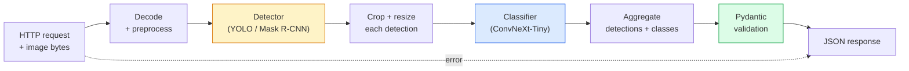

# एक पूर्ण दृष्टि पाइपलाइन  Capstone  निर्माण पूर्ण दृष्टि प्रवाह  毕业项目

> एक उत्पादन दृष्टि प्रणाली मॉडल और नियमों की एक श्रृंखला है जो डेटा अनुबंधों से सिलाई जाती है। टुकड़े पहले से ही इस चरण में हैं; कैपस्टोन उन्हें अंत से अंत तक एक साथ जोड़ता है।

> **【中文解读】**उत्पादन स्तर विज़ुअल सिस्टम कई मॉडल और नियमों के माध्यम से डेटा अनुबंधों के माध्यम से संबद्ध और संबद्ध श्रृंखला है। इस चरण के पहले पाठ्यक्रम में पहले से ही प्रत्येक घटक शामिल है, इस स्नातक परियोजना में उन्हें डेटा लोड, पूर्व प्रसंस्करण, मॉडल तर्क, बाद के प्रसंस्करण और परिणाम आउटपुट सहित अंत तक इकट्ठा किया जाएगा।

**Type:** Build | **类型:** 动手
**Languages:** Python | **语言:** Python
**Prerequisites:** Phase 4 Lessons 01-15 | **前置知识:** Phase 4 Lessons 01-15
**Time:** ~120 minutes | **时间:** ~120 分钟

## सीखने के लक्ष्य

- एक उत्पादन दृष्टि पाइपलाइन डिजाइन करें जो वस्तुओं का पता लगाता है, उन्हें वर्गीकृत करता है, और प्रत्येक विफलता पथ के साथ संरचित JSON  उत्सर्जित करता है
- एक डिटेक्टर (मास्क आर-सीएनएन या यॉलॉ), एक वर्गीकरणकर्ता (ConvNeXt-Tiny) और एक डेटा अनुबंध (पायदान्टिक) को एक सेवा में प्लग करें
- अंत-से-अंत पाइपलाइन का बेंचमार्क करें और पहला बोतल गला (आमतौर पर पूर्व प्रसंस्करण, फिर डिटेक्टर) की पहचान करें
- एक न्यूनतम FastAPI सेवा भेजें जो छवि अपलोड को स्वीकार करता है, पाइपलाइन चलाता है, और वर्गीकरण के साथ पता लगाने को लौटाता है

> **【中文解读】**सीखने के लक्ष्य इस कक्षा को पूरा करने के बाद जो मूल क्षमताएं होनी चाहिए, उन्हें सूचीबद्ध करते हैं।


## समस्या  समस्या परिचय

व्यक्तिगत दृष्टि मॉडल उपयोगी हैं; दृष्टि उत्पाद उनकी श्रृंखलाएं हैं। एक खुदरा शेल्फ ऑडिट एक डिटेक्टर प्लस एक उत्पाद वर्गीकरण प्लस एक मूल्य-ओसीआर पाइपलाइन है। स्वायत्त ड्राइविंग एक 2 डी डिटेक्टर प्लस एक 3 डी डिटेक्टर प्लस एक सेगमेंटर प्लस एक ट्रैकर प्लस एक प्लानर है। एक चिकित्सा प्री-स्क्रीन एक सेगमेंटर प्लस एक क्षेत्र वर्गीकरण प्लस एक क्लिनिक UI है।

> 单个视觉模型有用;视觉产品是它们的链条──零售货架审计是检测器加产品分类器加价 OCR 流水线──自动驾驶是2D检测器加3D检测器加分器加跟踪器加规划器──医疗预测是分器加区域分类器加临床UI──

इन श्रृंखलाओं को तार करना वह हिस्सा है जो एक एमएल प्रोटोटाइप को उत्पाद से अलग करता है। मॉडल के बीच प्रत्येक इंटरफ़ेस बग के लिए एक नया स्थान है। प्रत्येक निर्देशांक परिवर्तन, प्रत्येक सामान्यीकरण, प्रत्येक मास्क आकार परिवर्तन एक चुप्पी विफलता उम्मीदवार है। एक पाइपलाइन अपने सबसे कमजोर इंटरफ़ेस के रूप में मजबूत है।

> 连接这些链条是将 ML原型与产品区分开来的部分――模型之间的每个接口都是错误的新处处――每次坐标变化、每次归化、每次掩码缩缩都是默默失败的候选人――流水线的强度取决于最弱的接口――

इस कैपस्टोन में न्यूनतम व्यवहार्य पाइपलाइन सेट की जाती हैः पता लगाने + वर्गीकरण + संरचित आउटपुट + एक सेवा परत। इस कंकाल में चरण 4 स्लॉट में बाकी सब कुछः YOLOv8 के लिए मास्क आर-सीएनएन को स्वैप करें, एक ओसीआर हेड जोड़ें, एक खंड शाखा जोड़ें, एक ट्रैकर जोड़ें। वास्तुकला स्थिर है; टुकड़े प्लग करने योग्य हैं।

> इस बिद्यालय परियोजना में न्यूनतम चलाने योग्य जलप्रवाह लाइन का निर्माण किया गया है: परीक्षण + 分类 + 结构化输出 + 服务层。 चौथे चरण के अन्य सभी चीजें इस ढांचे में सम्मिलित हैंः मास्क आर-सीएन को YOLOv8 में बदलें, ओसीआर सिर जोड़ें, विभाजन शाखा जोड़ें, ट्रैकर जोड़ें── संरचना स्थिर है; घटक को सम्मिलित किया जा सकता है──

## अवधारणा का मूल अवधारणा

> **【中文解读】**इस भाग में मूल अवधारणाओं और सिद्धांतों की आधारभूत जानकारी दी गई है। इन अवधारणाओं को प्राप्त करना बाद में होने वाली प्रक्रियाओं के लिए एक शर्त है।


### पाइपलाइन



दो मॉडल चरण महंगे हैं, जबकि पांच अन्य चरणों में कीड़े रहते हैं।

> 七阶段── दो मॉडल चरण महंगे हैं; शेष पाँच चरण बग 藏身之处──

### Pydantic के साथ डेटा अनुबंध

प्रत्येक मॉडल सीमा एक टाइप वस्तु बन जाती है, जिससे चुपचाप विफलताएं जोर से होती हैं।

> प्रत्येक मॉडल सीमाएँ वर्गीकृत वस्तुओं में बदल जाती हैं।

```
Detection(
    box: tuple[float, float, float, float],   # (x1, y1, x2, y2), absolute pixels
    score: float,                              # [0, 1]
    class_id: int,                             # from detector's label map
    mask: Optional[list[list[int]]],           # RLE-encoded if present
)

PipelineResult(
    image_id: str,
    detections: list[Detection],
    classifications: list[Classification],
    inference_ms: float,
)
```

जब एक डिटेक्टर बॉक्स वापस `(cx, cy, w, h)`इसके बजाय `(x1, y1, x2, y2)`, Pydantic की सत्यापन सीमा पर विफल रहता है और आप तुरंत पता लगाने के बजाय एक डाउनस्ट्रीम फसल डिबग जो चुपचाप रिक्त क्षेत्रों को वापस देता है।

> 当检测器返回 `(cx, cy, w, h)`और `(x1, y1, x2, y2)`️️️️️️️️️️️️️️️️️️️️️️️️️️️️️️️️️️️️️️️️️️️️️️️️️️️️️️️️️️️️️️️️️️️️️️️️️️️️️️️️️️️️️️️️️️️️️️️️️️️️️️️️️️️️️️️️️️️️️️️️️️️️️️️️️️️️️️️️️️️️️️️️️️️️️️️️️️️️️️️️️️️️️️️️️️️️️️️️️️️️️️️️️️️️️️️️️️️️️️️️️️️️️️️️️️️️️️️️️️️️️️️️️️️️️️️️️️️️️️️️️️️️️️️️️️️️️️️️️️️️️️️️️️️️️️️️️️️️️️️️️️️️️️️️️️️️️️️️️️️️️️️️️️️️️️️️️️️️️️️️️️️️️️️️️️️️️️️️️️️️️️️️️️️️️️️️️️️️️️️️️️️️️️️️️️️️️️️️️️️️️️️️️️️️️️️️️️️️️️️️️️️️️️️️️️️️️️️️️️️️️️️️️️️️️️️️️️️️️️️️️️️️️️️️️️️️️️️️️️️️️️️️️️️️️️️️️️️️️️️️️️️️️️️️️️️️️️️️️️️️️️️️️️️️

### जहां विलंबता जाती है

लगभग हर दृष्टि पाइपलाइन में तीन सत्य हैं:

> लगभग प्रत्येक दृश्य जलप्रवाह के तीन तथ्य होते हैंः

1. **Preprocessing is often the biggest single block.**JPEG को डिकोड करना, रंग स्थानों को परिवर्तित करना, आकार बदलना  ये CPU-bound हैं और भूलना आसान है।
   中文翻译:**预处理通常是最大的单一开销。**解码 JPEG 转换色空间 缩放 缩放 缩放 缩放 缩放 缩放 缩放 缩放 缩放 缩放 缩放 缩放 缩放 缩放 缩放 缩放 缩放 缩放 缩放 缩放 缩放 缩放 缩放 缩放 缩放 缩放 缩放 缩放 缩放 缩放 缩放 缩放 缩放 缩放 缩放 缩放 缩放 缩放 缩放 缩放 缩放 缩放 缩放 缩放 缩放 缩放 缩放 缩放 缩放 缩放 缩放 缩放 缩放 缩放 缩放 缩放 缩放 缩放 缩放 缩放 缩放 缩放 缩放 缩放 缩放 缩放 缩放 缩放 缩放 缩放 缩放 缩放 缩放 缩放 缩放 缩放 缩放 缩放 缩放 缩放 缩放 缩放 缩放 缩放 缩放 缩放 缩放 缩放 缩放 缩放 缩放 缩放 缩放 缩放 缩放 缩放 缩放 缩放 缩放 缩放 缩放 缩放 缩放 缩放 缩放 缩放 缩放 缩放 缩放 缩放 缩放 缩放 缩放 缩放 缩放 缩放 缩放 缩放 缩放 缩放 缩放 缩放 缩放 缩放 缩放 缩放 缩放 缩放 缩放 缩放 缩放 缩放 缩放 缩放 缩放 缩放 缩放 缩放 缩放 缩放 缩放 缩放 缩放 缩放 缩放 缩放 缩放 缩放
2. **The detector dominates GPU time.**70-90% GPU समय पता लगाने आगे पास में है।
   中文翻译:**检测器占据 GPU 时间的主导。**70-90% के जीपीयू का समय परीक्षण के पूर्व प्रसार पर खर्च होता है।
3. **Postprocessing (NMS, RLE encode/decode) is cheap on GPU, expensive on CPU.**हमेशा वास्तविक लक्ष्य के साथ प्रोफ़ाइल.
   中文翻译:**后处理（NMS、RLE 编解码）在 GPU 上便宜，在 CPU 上昂贵。**始终在实际目标上分析──

वितरण को जानना ही अनुकूलन को प्राथमिकता सूची में बदल देता है।

>  वितरण की स्थिति को समझकर इसे प्राथमिकता सूची में अनुकूलित किया जा सकता है

### विफलता मोड

- **Empty detections** रिक्त सूची लौटाएं, दुर्घटनाग्रस्त न हों। लॉग.
  中文翻译:**空检测结果** लौट लौट लौट空列表, मत टूट──记录日志──
- **Out-of-bounds boxes** कटौती से पहले छवि आकार को क्लैंप करें।
  中文翻译:**越界框**剪剪前限制到图像尺寸内──
- **Tiny crops** वर्गीकरण के न्यूनतम इनपुट से छोटे बॉक्स के लिए वर्गीकरण छोड़ दें।
  中文翻译:**微小裁剪** कूद से छोटा से वर्ग की न्यूनतम प्रविष्टि के बॉक्स के वर्गों में से
- **Corrupt upload** 400 प्रतिक्रिया के साथ एक विशिष्ट त्रुटि कोड, 500 नहीं।
  中文翻译:**损坏的上传** वापसी के साथ विशिष्ट त्रुटि कोड के 400  प्रतिक्रिया, नहीं 500 
- **Model load failure** सेवा शुरू करने पर विफलता, पहले अनुरोध पर नहीं।
  中文翻译:**模型加载失败** सेवा प्रारंभ में विफलता, पहले अनुरोध के बजाय 

एक उत्पादन पाइपलाइन इन सभी को बिना सामान्य लेखन के संभालती है `try/except`हर असफलता को एक नामित कोड और एक प्रतिक्रिया मिलती है।

> उत्पादन स्तर प्रवाह लाइन हर स्थिति को संभालते समय विफलता के पाना प्रकार को छिपाने की आवश्यकता नहीं है`try/except` प्रत्येक असफलता का नाम है 

### बैचिंग

एक उत्पादन सेवा कई ग्राहकों की सेवा करती है। अनुरोधों के बीच बैचिंग डिटेक्शन और वर्गीकरण पारगमन को गुणा करता है। व्यापारः एक बैच भरने की प्रतीक्षा करने से अतिरिक्त विलंबता। विशिष्ट सेटअपः 20ms तक के अनुरोध एकत्र करें, बैच एक साथ करें, प्रक्रिया करें, प्रतिक्रियाएं वितरित करें। `torchserve`और `triton`यह मूल रूप से करें; अनुमानित लोड के साथ छोटी सेवाएं अपने स्वयं के माइक्रो-बैचर को रोल करें।

> उत्पादन सेवा एक ही समय में कई ग्राहक सेवाएं प्रदान करती हैं।`torchserve`和 `triton`मूल जीवन समर्थन; लोड करने योग्य लघु सेवा स्वयं को प्राप्त कर सकती है

> **【拓展：工业部署中的视觉系统】**वास्तविक औद्योगिक तैनाती में, विज़ुअल मॉडल को देरी, मॉडल आकार, किनारे उपकरण अनुकूलन आदि की समस्या पर विचार करने की आवश्यकता होती है। टेन्सरआरटी, ओएनएनएक्स रनटाइम, ओपनवीनो एक सामान्य उपयोग में आने वाला सुझाव त्वरण उपकरण है।

> **【拓展：数据标注与质量】**视觉任务的效果高度依赖标签数据质量──标签工作室、CVAT是主流标签工具──在工业场景中,主动学习(Active Learning) ले标签成本 को कम कर सकता हैः मॉडल अनिश्चित नमूना अनुरोधों के लिए कृत्रिम标签, अनिश्चितता के नमूने स्वचालित标签──

> **【拓展：合成数据与数据增强】**जब वास्तविक डेटा की कमी होती है, तो संश्लेषित डेटा (जैसे ब्लेंडर, यूनिटी) और डेटा वृद्धि (जैसे एल्बमेंटेशन) दो प्रभावी रणनीतियाँ हैं। एनवीआईडीआईए का ओम्निवर्स प्लेटफॉर्म उच्च गुणवत्ता वाले संश्लेषित प्रशिक्षण डेटा का उत्पादन कर सकता है, जो ऑटोमोटिव ड्राइविंग और मशीनों के क्षेत्र में व्यापक रूप से लागू होता है।


## इसे बनाओ, इसे पूरा करो।

> **【中文解读】**इस भाग के माध्यम से कोड को शून्य से लागू किया जा सकता है कोर एल्गोरिदम। इस तरह के "शुरुआत से" तरीके से फ्रेमवर्क के पीछे के सिद्धांत को समझने में मदद मिलेगी, समस्याओं का सामना करते समय ब्लैक बॉक्स में फंस नहीं जाएगा।

```figure
v4-vision-pipeline
```

## इसे बनाओ

### चरण 1: डेटा अनुबंध

```python
from pydantic import BaseModel, Field
from typing import List, Optional, Tuple

class Detection(BaseModel):
    box: Tuple[float, float, float, float]
    score: float = Field(ge=0, le=1)
    class_id: int = Field(ge=0)
    mask_rle: Optional[str] = None


class Classification(BaseModel):
    detection_index: int
    class_id: int
    class_name: str
    score: float = Field(ge=0, le=1)


class PipelineResult(BaseModel):
    image_id: str
    detections: List[Detection]
    classifications: List[Classification]
    inference_ms: float
```

कोड के पांच सेकंड किसी भी गंभीर पाइपलाइन पर डिबगिंग के एक घंटे बचाता है।

> 五秒的代码能节省任何严流水线上一小时的调试──

### चरण 2: न्यूनतम पाइपलाइन वर्ग

```python
import time
import numpy as np
import torch
from PIL import Image

class VisionPipeline:
    def __init__(self, detector, classifier, class_names,
                 device="cpu", min_crop=32):
        self.detector = detector.to(device).eval()
        self.classifier = classifier.to(device).eval()
        self.class_names = class_names
        self.device = device
        self.min_crop = min_crop

    def preprocess(self, image):
        """
        image: PIL.Image or np.ndarray (H, W, 3) uint8
        returns: CHW float tensor on device
        """
        if isinstance(image, Image.Image):
            image = np.asarray(image.convert("RGB"))
        tensor = torch.from_numpy(image).permute(2, 0, 1).float() / 255.0
        return tensor.to(self.device)

    @torch.no_grad()
    def detect(self, image_tensor):
        return self.detector([image_tensor])[0]

    @torch.no_grad()
    def classify(self, crops):
        if len(crops) == 0:
            return []
        batch = torch.stack(crops).to(self.device)
        logits = self.classifier(batch)
        probs = logits.softmax(-1)
        scores, cls = probs.max(-1)
        return list(zip(cls.tolist(), scores.tolist()))

    def run(self, image, image_id="anonymous"):
        t0 = time.perf_counter()
        tensor = self.preprocess(image)
        det = self.detect(tensor)

        crops = []
        detections = []
        valid_indices = []
        for i, (box, score, cls) in enumerate(zip(det["boxes"], det["scores"], det["labels"])):
            x1, y1, x2, y2 = [max(0, int(b)) for b in box.tolist()]
            x2 = min(x2, tensor.shape[-1])
            y2 = min(y2, tensor.shape[-2])
            detections.append(Detection(
                box=(x1, y1, x2, y2),
                score=float(score),
                class_id=int(cls),
            ))
            if (x2 - x1) < self.min_crop or (y2 - y1) < self.min_crop:
                continue
            crop = tensor[:, y1:y2, x1:x2]
            crop = torch.nn.functional.interpolate(
                crop.unsqueeze(0),
                size=(224, 224),
                mode="bilinear",
                align_corners=False,
            )[0]
            crops.append(crop)
            valid_indices.append(i)

        class_preds = self.classify(crops)

        classifications = []
        for valid_idx, (cls_id, cls_score) in zip(valid_indices, class_preds):
            classifications.append(Classification(
                detection_index=valid_idx,
                class_id=int(cls_id),
                class_name=self.class_names[cls_id],
                score=float(cls_score),
            ))

        return PipelineResult(
            image_id=image_id,
            detections=detections,
            classifications=classifications,
            inference_ms=(time.perf_counter() - t0) * 1000,
        )
```

प्रत्येक इंटरफ़ेस टाइप किया जाता है. प्रत्येक विफलता पथ एक विशिष्ट हैंडलिंग निर्णय है.

> प्रत्येक इंटरफेस वर्गीकृत है। प्रत्येक असफलता पथ में स्पष्ट प्रसंस्करण निर्णय हैं।

### चरण 3: एक डिटेक्टर और एक वर्गीकरण तार

```python
from torchvision.models.detection import maskrcnn_resnet50_fpn_v2
from torchvision.models import convnext_tiny

# Use ImageNet-pretrained weights for a realistic pipeline without training
detector = maskrcnn_resnet50_fpn_v2(weights="DEFAULT")
classifier = convnext_tiny(weights="DEFAULT")
class_names = [f"imagenet_class_{i}" for i in range(1000)]

pipe = VisionPipeline(detector, classifier, class_names)

# Smoke test with a synthetic image
test_image = (np.random.rand(400, 600, 3) * 255).astype(np.uint8)
result = pipe.run(test_image, image_id="demo")
print(result.model_dump_json(indent=2)[:500])
```

### चरण 4: फास्टएपीआई सेवा

```python
from fastapi import FastAPI, UploadFile, HTTPException
from io import BytesIO

app = FastAPI()
pipe = None  # initialised on startup

@app.on_event("startup")
def load():
    global pipe
    detector = maskrcnn_resnet50_fpn_v2(weights="DEFAULT").eval()
    classifier = convnext_tiny(weights="DEFAULT").eval()
    pipe = VisionPipeline(detector, classifier, class_names=[f"c{i}" for i in range(1000)])

@app.post("/detect")
async def detect_endpoint(file: UploadFile):
    if file.content_type not in {"image/jpeg", "image/png", "image/webp"}:
        raise HTTPException(status_code=400, detail="unsupported image type")
    data = await file.read()
    try:
        img = Image.open(BytesIO(data)).convert("RGB")
    except Exception:
        raise HTTPException(status_code=400, detail="cannot decode image")
    result = pipe.run(img, image_id=file.filename or "upload")
    return result.model_dump()
```

दौड़ो`uvicorn main:app --host 0.0.0.0 --port 8000`. परीक्षण के साथ `curl -F 'file=@dog.jpg' http://localhost:8000/detect`. .

> उपयोग `uvicorn main:app --host 0.0.0.0 --port 8000`运行――用 `curl -F 'file=@dog.jpg' http://localhost:8000/detect`测试──

### चरण 5: पाइपलाइन को बेंचमार्क करें

```python
import time

def benchmark(pipe, num_runs=20, image_size=(400, 600)):
    img = (np.random.rand(*image_size, 3) * 255).astype(np.uint8)
    pipe.run(img)  # warm up

    stages = {"preprocess": [], "detect": [], "classify": [], "total": []}
    for _ in range(num_runs):
        t0 = time.perf_counter()
        tensor = pipe.preprocess(img)
        t1 = time.perf_counter()
        det = pipe.detect(tensor)
        t2 = time.perf_counter()
        crops = []
        for box in det["boxes"]:
            x1, y1, x2, y2 = [max(0, int(b)) for b in box.tolist()]
            x2 = min(x2, tensor.shape[-1])
            y2 = min(y2, tensor.shape[-2])
            if (x2 - x1) >= pipe.min_crop and (y2 - y1) >= pipe.min_crop:
                crop = tensor[:, y1:y2, x1:x2]
                crop = torch.nn.functional.interpolate(
                    crop.unsqueeze(0), size=(224, 224), mode="bilinear", align_corners=False
                )[0]
                crops.append(crop)
        pipe.classify(crops)
        t3 = time.perf_counter()
        stages["preprocess"].append((t1 - t0) * 1000)
        stages["detect"].append((t2 - t1) * 1000)
        stages["classify"].append((t3 - t2) * 1000)
        stages["total"].append((t3 - t0) * 1000)

    for stage, times in stages.items():
        times.sort()
        print(f"{stage:12s}  p50={times[len(times)//2]:7.1f} ms  p95={times[int(len(times)*0.95)]:7.1f} ms")
```

CPU पर विशिष्ट आउटपुटः प्रीप्रोसेस ~3 ms, डिटेक्ट 300-500 ms, वर्गीकृत 20-40 ms, कुल 350-550 ms। GPU पर, डिटेक्ट 20-40 ms है और प्रीप्रोसेस + वर्गीकृत सापेक्ष रूप से अधिक मायने रखता है।

> CPU पर विशिष्ट आउटपुटः प्रीप्रैसेसिंग लगभग 3ms; 300-500ms; 20-40ms; कुल 350-550ms; GPU पर, प्रीप्रैसेसिंग और विभाजन के सापेक्ष अनुपात अधिक महत्वपूर्ण हो गया है।

> **【中文解读】**इस भाग में दिखाया गया है कि इस तकनीक को कैसे तेजी से लागू किया जाए। इस प्रकार के एक परिपक्व ढांचे का उपयोग करके बग कम किए जा सकते हैं और विकास दक्षता में सुधार किया जा सकता है।


> **【拓展：视觉模型的持续学习】**उत्पादन वातावरण में, दृश्य मॉडल को नए डेटा को लगातार अनुकूलित करने की आवश्यकता होती है। यह ऑटोमोटिव ड्राइविंग और औद्योगिक गुणवत्ता जांच में विशेष रूप से महत्वपूर्ण है।

## इसे फ्रेमवर्क के साथ लागू करें

उत्पादन टेम्पलेट एक ही संरचना में अभिसरण करते हैं, और इसके अतिरिक्तः

- **Model versioning** हमेशा उत्तर में मॉडल नाम और वजन हैश को लॉग करें।
- **Per-request trace IDs** प्रत्येक अनुरोध के लिए प्रत्येक चरण का समय रिकॉर्ड करें ताकि आप धीमी प्रतिक्रियाओं को चरणों के साथ जोड़ सकें।
- **Fallback path** यदि वर्गीकरणकर्ता समय समाप्त हो जाता है, तो पूरी मांग को विफल करने के बजाय बिना वर्गीकरण के पता लगाने को लौटाएं।
- **Safety filters** NSFW/PII फ़िल्टर वर्गीकरण के बाद, प्रतिक्रिया सेवा से बाहर जाने से पहले चलाया जाता है।
- **Batch endpoint** एक `/detect_batch`बड़े पैमाने पर प्रसंस्करण के लिए छवि URL की सूची स्वीकार करना।

उत्पादन सेवा के लिए, `torchserve`,`Triton Inference Server`और `BentoML`बैचिंग, संस्करण, मीट्रिक, और स्वास्थ्य जांच को संभालते हैं।`FastAPI`सीधे प्रोटोटाइप और छोटे पैमाने पर उत्पादों के लिए ठीक है।

> **【中文解读】**इस खंड में इस बात पर ध्यान दिया गया है कि मॉडल को उपलब्ध उत्पादों के रूप में कैसे तैनात किया जाए। मूल से लेकर उत्पादन स्तर तक, प्रदर्शन अनुकूलन, त्रुटि प्रसंस्करण, निगरानी आदि के कई आयामों पर विचार करने की आवश्यकता है।


## इसे भेजें उत्पाद

इस पाठ से उत्पन्न होता हैः

- `outputs/prompt-vision-service-shape-reviewer.md` एक संकेत जो अनुबंध/उत्तर आकार उल्लंघन के लिए विजन सेवा के कोड की समीक्षा करता है और पहले टूटने वाले बग का नाम देता है।
- `outputs/skill-pipeline-budget-planner.md` एक कौशल जो लक्ष्य विलंबता और पारगम्यता को देखते हुए, पाइपलाइन के प्रत्येक चरण के लिए एक समय बजट आवंटित करता है और यह दर्शाता है कि किस चरण को अपना बजट सबसे पहले याद आएगा।

> **【中文解读】**练习题按照易/中级/难度递进;;建议至少完成中级题,Hard级适合深入研究或面试准备;;


## अभ्यास विषय

1. **(Easy)**किसी भी खुले डेटासेट से 10 छवियों पर पाइपलाइन चलाएं। प्रति चरण औसत समय और प्रति छवि पता लगाने की गणना का वितरण रिपोर्ट करें।
2. **(Medium)** में मुखौटा आउटपुट फ़ील्ड जोड़ें`Detection`JSON 10 वस्तुओं के लिए भी 1MB से कम रहता है सत्यापित करें।
3. **(Hard)**वर्गीकरणकर्ता के सामने एक माइक्रो-बैचर जोड़ेंः 10 एमएस तक फसलें एकत्र करें, उन्हें एक GPU कॉल में सभी वर्गीकृत करें, प्रति अनुरोध परिणाम वापस करें। प्रति सेकंड 5 समवर्ती अनुरोधों पर संचलन वृद्धि और अतिरिक्त विलंबता मापें।

> **【中文解读】**术语表中的"क्या लोग कहते हैं" बनाम "क्या वास्तव में इसका मतलब है" 区分日常口语和精确技术含义──在团队协作中,统一术语定义可以避免大量沟通误解──


## कीवर्ड्स  शब्द खोज तालिका

| Term | What people say | What it actually means |
|------|----------------|----------------------|
| Pipeline | "The system" | An ordered chain of preprocessing, inference, and postprocessing steps with a typed interface between each pair |
| Data contract | "The schema" | Pydantic / dataclass definitions that every stage input and output conforms to; catches integration bugs at the boundary |
| Preprocessing | "Before the model" | Decoding, colour conversion, resizing, normalising; usually the biggest CPU time sink |
| Postprocessing | "After the model" | NMS, mask resize, threshold, RLE encode; cheap on GPU, expensive on CPU |
| Microbatcher | "Collect then forward" | Aggregator that waits a fixed window for multiple requests, runs a single batched forward pass |
| Trace ID | "Request id" | Per-request identifier logged at every stage so slow requests can be traced end-to-end |
| Failure code | "Named error" | Specific error code per failure class instead of generic 500; enables client retry logic |
| Health check | "Readiness probe" | Cheap endpoint that reports whether the service can answer; loadbalancers rely on this |

> **【中文解读】**延伸阅读 प्रदान करता है गहन सीखने के लिए उच्च गुणवत्ता वाले संसाधनों। ये लेख और पाठ्यक्रम इस क्षेत्र के लिए क्लासिक संदर्भ हैं, जो गहन समझ की आवश्यकता वाले पाठकों के लिए उपयुक्त हैं।


## आगे पढ़ना 延伸閱讀

- [Full Stack Deep Learning — Deploying Models](https://fullstackdeeplearning.com/course/2022/lecture-5-deployment/) उत्पादन एमएल तैनाती का कैनोनिक अवलोकन
- [BentoML docs](https://docs.bentoml.com) बैचिंग, वर्शनिंग और मेट्रिक्स के साथ सेवा ढांचे
- [torchserve docs](https://pytorch.org/serve/) पायटॉर्च की आधिकारिक सेवा पुस्तकालय
- [NVIDIA Triton Inference Server](https://developer.nvidia.com/triton-inference-server) बैचिंग और मल्टी-मॉडल समर्थन के साथ उच्च आउटपुट सेवा
