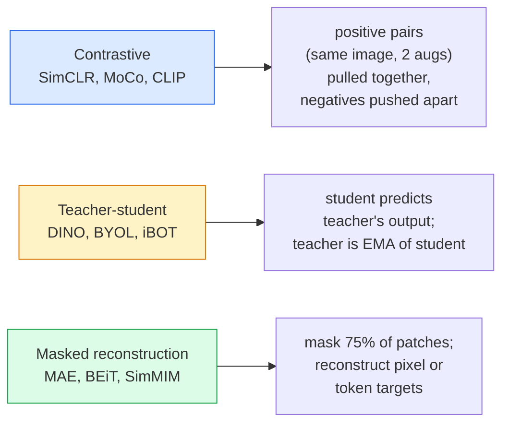

# स्व-निरीक्षण दृष्टि  SimCLR, DINO, MAE  自监督视觉  SimCLR, DINO, MAE

> लेबल पर्यवेक्षित दृष्टि का बोतल गला है। आत्म-नियंत्रित पूर्व प्रशिक्षण उन्हें हटा देता हैः 100 मिलियन लेबल रहित छवियों से दृश्य विशेषताएं सीखें, 10 हजार लेबल वाले पर बारीकी से ट्यून करें।

> **【中文解读】**标签是监督学习的瓶──自监督预训练 ने इस प्रतिबंध को समाप्त कर दियाः 1 बिलियन张无标签图像中学习视觉特征, फिर 10 हजार张标签图像上微调──三种主流方法:SimCLR(对比学习)、DINO(自蒸)、MAE(掩码自编码器)

> **【拓展：自监督学习是 GPT 的秘密】**जीपीटी एक स्वनिरीक्षण मॉडल है। यह एक स्वयंनिरीक्षण मॉडल है। यह एक स्वयंनिरीक्षण मॉडल है। यह एक स्वयंनिरीक्षण मॉडल है।

**Type:** Learn + Build | **类型:** 学习 + 动手
**Languages:** Python | **语言:** Python
**Prerequisites:** Phase 4 Lesson 04 (Image Classification), Phase 4 Lesson 14 (ViT) | **前置知识:** Phase 4 Lesson 04（图像分类），Phase 4 Lesson 14（ViT）
**Time:** ~75 minutes | **时间:** ~75 分钟

## सीखने के लक्ष्य

- तीन प्रमुख स्व-निरीक्षण परिवारों का पता लगाएं  विपरीत (SimCLR), शिक्षक-छात्र (DINO), मुखौटा पुनर्निर्माण (MAE)  और बताएं कि प्रत्येक क्या अनुकूलित करता है
- एक InfoNCE हानि को खरोंच से लागू करें और समझाएं कि 512 बैच का काम क्यों होता है लेकिन 32 बैच का विफलता क्यों होती है
- समझाएं कि क्यों MAE का 75% मास्किंग अनुपात मनमाने ढंग से नहीं है और यह पाठ के लिए BERT के 15% से कैसे भिन्न है
- रैखिक जांच और शून्य शॉट निकासी के लिए DINOv2 या MAE ImageNet चेकपोस्ट का उपयोग करें

> **【中文解读】**सीखने के लक्ष्य इस कक्षा को पूरा करने के बाद जो मूल क्षमताएं होनी चाहिए, उन्हें सूचीबद्ध करते हैं।


## समस्या  समस्या परिचय

पर्यवेक्षित इमेजनेट में 1.3 मिलियन लेबल वाली छवियां हैं, जिनकी टिप्पणी करने के लिए अनुमानित $ 10 मिलियन की लागत है। चिकित्सा और औद्योगिक डेटा सेट छोटे और लेबल करने के लिए अधिक महंगे हैं। प्रत्येक दृष्टि टीम पूछती हैः क्या हम सस्ते अनलेबल डेटा पर प्री-ट्रेन कर सकते हैं  यूट्यूब फ्रेम, वेब क्रॉल, वेबकैम फुटेज, उपग्रह स्वीप  और फिर एक छोटे लेबल सेट पर ठीक-ठीक ट्यून कर सकते हैं?

> 监督式 ImageNet में 1.3 मिलियन लेबल छवियां हैं, अनुमानित लेबल लागत 10 मिलियन डॉलर है। मेडिकल और औद्योगिक डेटाबेस छोटे हैं, लेबल लागत अधिक है। प्रत्येक वीडियो टीम यह पूछ रही हैः क्या हम सस्ते अनलेबल डेटा पर प्री-ट्रेन कर सकते हैं?

आत्म-निरीक्षण सीखने का जवाब है। LAION या JFT पर प्रशिक्षित एक आधुनिक आत्म-निरीक्षण ViT जब ठीक से ट्यून किया जाता है तो निगरानी ImageNet सटीकता तक पहुंचता है या उससे बढ़ जाता है। यह पर्यवेक्षित प्री-प्रशिक्षण की तुलना में डाउनस्ट्रीम कार्यों (डिटेक्शन, खंडन, गहराई) को बेहतर स्थानांतरित करता है। DINOv2 (मेटा, 2023) और MAE (मेटा, 2022) स्थानांतरित दृष्टि सुविधाओं के लिए वर्तमान उत्पादन डिफ़ॉल्ट हैं।

> स्वनिरीक्षण सीखने यही उत्तर है। आधुनिक स्वनिरीक्षण ViT 微调后 तक पहुँचने या उससे अधिक निगरानी के रूप में ImageNet 准确率। यह भी नीचे游任务 की ओर बढ़ रहा है।

अवधारणात्मक बदलाव यह है कि बहाना कार्य  वह चीज जो मॉडल को करने के लिए प्रशिक्षित किया गया है  डाउनस्ट्रीम कार्य नहीं होना चाहिए। इससे मॉडल को उपयोगी विशेषताएं सीखने को मजबूर किया जाता है। ग्रे स्केल की छवियों के रंग की भविष्यवाणी करें, छवियों को घुमाएं और मॉडल से घूर्णन को वर्गीकृत करने के लिए कहें, पैचों को मास्क करें और उन्हें पुनर्निर्माण करें  सभी काम किया है। इस पैमाने के तीन दृष्टिकोण विपरीत सीखने, शिक्षक-छात्रा डिस्टिलिशन और मास्क पुनर्निर्माण हैं।

> 概念 पर परिवर्तन पूर्वनिर्धारित कार्य है मॉडल को प्रशिक्षित किया गया है जो कुछ भी करना है जरूरी नहीं कि नीचे का कार्य हो महत्वपूर्ण है कि यह मॉडल को उपयोगी विशेषताएं सीखने के लिए मजबूर करता है                                                                                                                                                                                                                                        

## अवधारणा का मूल अवधारणा

> **【中文解读】**इस भाग में मूल अवधारणाओं और सिद्धांतों की आधारभूत जानकारी दी गई है। इन अवधारणाओं को प्राप्त करना बाद में होने वाली प्रक्रियाओं के लिए एक शर्त है।


### तीन परिवार



### विपरीत सीखने (SimCLR)

एक छवि लें, दो यादृच्छिक वृद्धि करें, दो दृश्य प्राप्त करें। दोनों को एक ही एन्कोडर और एक प्रोजेक्शन हेड के माध्यम से फ़ीड करें। एक नुकसान को कम करें जो कहता है "ये दो एम्बेडमेंट करीब होना चाहिए" और "यह एम्बेडमेंट बैच में हर अन्य छवि के एम्बेडमेंट से दूर होना चाहिए।"

> 取一张图像,施加两种随机增强,获得两种视图――将两者通过同一编码器加投影头――最小化一个损失函数:"ये दो嵌入应该接近"和"यह嵌入应该远离批次中所有其他图像嵌入"――

```
Loss for positive pair (z_i, z_j) among 2N views per batch:

   L_ij = -log( exp(sim(z_i, z_j) / tau) / sum_k in batch \ {i} exp(sim(z_i, z_k) / tau) )

sim = cosine similarity
tau = temperature (0.1 standard)
```

यह InfoNCE हानि है. इसमें प्रति सकारात्मक कई नकारात्मक की आवश्यकता होती है, इसलिए बैच आकार मायने रखता है।

> यह InfoNCE 损失 है। इसके लिए प्रत्येक सही नमूना को कई नकारात्मक नमूनों का सामना करना पड़ता है, इसलिए बैच आकार महत्वपूर्ण है।

### शिक्षक-छात्रा (DINO)

एक ही वास्तुकला वाले दो नेटवर्कः छात्र और शिक्षक। शिक्षक छात्र के वजन का एक घातीय चलती औसत (ईएमए) है। दोनों छवि के बढ़े हुए दृश्य देखते हैं। छात्र का उत्पादन शिक्षक के  स्पष्ट नकारात्मकताओं से मेल खाने के लिए प्रशिक्षित किया जाता है।

>  दो समान संरचनाओं के नेटवर्क: छात्र और शिक्षक── शिक्षक के वजन का सूचकांक चलती औसत(ईएमए) छात्र के वजन से आता है── दोनों ही चित्रों के बढ़ते दृश्यों को देखते हैं── छात्र के आउटपुट को प्रशिक्षित किया जाता है ताकि शिक्षक के  कोई स्पष्ट नकारात्मक नमूना नहीं हो──

```
loss = CE( student_output(view_1),  teacher_output(view_2) )
     + CE( student_output(view_2),  teacher_output(view_1) )

teacher_weights = m * teacher_weights + (1 - m) * student_weights   (m ≈ 0.996)
```

"एक स्थिर की भविष्यवाणी" करने के लिए यह क्यों नहीं गिरता हैः शिक्षक का आउटपुट केंद्रित (प्रति आयाम औसत घटाएं) और तेज (छोटे तापमान से विभाजित करें) है। केंद्रित एक आयाम को हावी होने से रोकता है; तेज आउटपुट को समान रूप से गिरने से रोकता है।

> क्यों नहीं गिरता "पूर्वानुमान सामान्य संख्या": शिक्षक के आउटपुट के दौरान (<<<<<<<<<<<<<<<<<<<<<<<<<<<<<<<<<<<<<<<<<<<<<<<<<<<<<<<<<<<<<<<<<<<<<<<<<<<<<<<<<<<<<<<<<<<<<<<<<<<<<<<<<<<<<<<<<<<<<<<<<<<<<<<<<<<<<<<<<<<<<<<<<<<<<<<<<<<<<<<<<<<<<<<<<<<<<<<<<<<<<<<<<<<<<<<<<<<<<<<<<<<<<<<<<<<<<<<<<<<<<<<<<<<<<<<<<<<<<<<<<<<<<<<<<<<<<<<<<<<<<<<<<<<<<<<<<<<<<<<<<<<<<<<<<<<<<<<<<<<<<<<<<<<<<<<<<<<<<<<<<<<<<<<<<<<<<<<<<<<<<<<<<<<<<<<<<<<<<<<<<<<<<<<<<<<<<<<<<<<<<<<<<<<<<<<<<<<<<<<<<<<<<<<<<<<<<<<<<<<<<<<<<<<<<<<<<<<<<<<<<<<<<<<<<<<<<<<<<<<<<<<<<<<<<<<<<<<<<<<<<<<<<<<<<<<<

DINO 142M क्यूरेट की गई छवियों पर DINOv2 का स्केल बढ़ाता है। परिणामस्वरूप शून्य-शॉट दृश्य निकासी और घने भविष्यवाणी के लिए वर्तमान SOTA है।

> DINO DINOv2 का आधार है, जो 1.42 बिलियन चैंपियन छवियों पर विस्तारित है।

### मास्क पुनर्निर्माण (MAE)

एक ViT इनपुट के 75% पैचों को मास्क करें। केवल दृश्यमान 25% को एन्कोडर के माध्यम से पारित करें। एक छोटा डिकोडर मास्क किए गए स्थानों पर एन्कोडर के आउटपुट प्लस मास्क टोकन प्राप्त करता है, और मास्क किए गए पैचों के पिक्सेल को पुनर्निर्माण करने के लिए प्रशिक्षित होता है।

> 掩蔽VIT 输入 का 75% 补丁── केवल 25% 编码器 के माध्यम से दिखाई देगा── एक छोटा डिलीवर प्राप्त编码器 आउटपुट प्लस छिपा स्थान का छिपा टोकन, प्रशिक्षण पुनः निर्माण छिपा补丁 के चित्रों──

```
Encoder:  visible 25% of patches -> features
Decoder:  features + mask tokens at masked positions -> reconstructed pixels
Loss:     MSE between reconstructed and original pixels on masked patches only
```

MAE को काम करने के लिए प्रमुख डिजाइन विकल्पः

> बनाने के लिए MAE 生效的关键设计选择:

- **75% mask ratio** उच्च. एन्कोडर को अर्थिक विशेषताएं सीखने के लिए मजबूर करता है; 25% का पुनर्निर्माण लगभग तुच्छ होगा (पड़ोसी पिक्सल इतने सहसंबंधित हैं कि सीएनएन इसे नाखून दे सकता है) ।
  中文翻译:**75% 掩码率**很高──迫使编码器学习语义特征; पुनः निर्माण 25% 几乎是平凡的相邻像素高度相关, एक सीएनएन 就能做到) 
- **Asymmetric encoder/decoder** बड़े ViT एन्कोडर केवल दृश्यमान पैच देखता है; एक छोटा डिकोडर (8 परत, 512-dim) पुनर्निर्माण संभालता है। 3x तेजी से पूर्व प्रशिक्षण naive BEiT की तुलना में।
  中文翻译:**非对称编码器/解码器** बड़े ViT 编码器只看可见补丁;小型解码器(8 层,512 维) पुनः निर्माण को संसाधित करना──比朴素 BEiT 预训练快 3 倍──
- **Pixel-space reconstruction target** BEiT के टोकन लक्ष्य से सरल और ViT पर बेहतर काम करता है।
  中文翻译:**像素空间重建目标**BET के टोकन 化目标 से सरल, ViT में 上效果更好──

पूर्व प्रशिक्षण के बाद, डिकोडर को फेंक दें।

> 预训练后丢弃解码器──编码器就是特征提取器──

### 75% क्यों नहीं 15%

BERT 15% टोकन को कवर करता है। MAE 75% को कवर करता है। अंतर सूचना घनत्व है।

> BERT 15% के टोकन को छुपाता है।

- प्राकृतिक भाषा में प्रति टोकन उच्च एंट्रॉपी है. 15% टोकन की भविष्यवाणी करना अभी भी कठिन है क्योंकि प्रत्येक मुखौटा स्थिति में कई व्यवहार्य पूर्णताएं हैं।
  Chinese Translation: प्राकृतिक भाषा प्रत्येक टोकन के  बहुत उच्च  अनुमान 15% टोकन  अभी भी मुश्किल है, क्योंकि प्रत्येक छिपे हुए स्थान में बहुत सारे उचित पूरक हैं
- छवि पैच में कम एंट्रॉपी होती है  एक अनमास्क पड़ोस अक्सर मास्क पैच के पिक्सल को लगभग सटीक रूप से निर्धारित करता है। भविष्यवाणी करने के लिए अर्थिक समझ की आवश्यकता होती है, आपको आक्रामक रूप से मास्क करना होगा।
  चित्र सुधार के 低未掩蔽的邻域通常几乎完全决定了被掩蔽补丁的像素──

75% पर्याप्त उच्च है कि सरल स्थानिक निष्कर्षण कार्य को हल नहीं कर सकता है; एन्कोडर को छवि सामग्री का प्रतिनिधित्व करना चाहिए।

> 75% उच्च से सरल अंतरिक्ष आउटपुट कार्य को हल नहीं कर सकता है; एडिटर को छवि सामग्री प्रदर्शित करनी चाहिए।

### रैखिक जांच मूल्यांकन

स्व-निरीक्षण पूर्व प्रशिक्षण के बाद, मानक मूल्यांकन एक है **linear probe**: एन्कोडर को फ्रीज करें, ImageNet लेबल पर शीर्ष पर एक एकल रैखिक वर्गीकरण को प्रशिक्षित करें। शीर्ष-1 सटीकता रिपोर्ट करें।

> स्व监督预训练 के बाद, मानक मूल्यांकन**线性探测**结编码器, 标签上训练单个线性分类器, 结编码器, 标签上训练单个线性分类器, 结编码器, 标签上训练单个线性分类器, 结编码器, 标签上训练单个线性分类器, 标签上训练单个线性分类器, 标签上训练单个线性分类器, 标签上训练单个线性分类器, 标签上训练单个线性分类器, 标签上训练单个线性分类器, 标签上训练单个线性分类器, 准确率, 报告

- सिमकलर रेज़नेट-50: ~71% (2020)
- DINO ViT-S/16: ~77% (2021)
- एमएई ViT-L/16: ~76% (2022)
- DINOv2 ViT-g/14: ~86% (2023)

रैखिक जांच सुविधा गुणवत्ता का शुद्ध उपाय है; बारीक-बारी से समायोजित करने से आमतौर पर 2-5 अंक जोड़ते हैं लेकिन सिर को फिर से प्रशिक्षित करने के प्रभाव में भी मिश्रण होता है।

> 线性探测 (线性探测) गुणात्मक गुणों का शुद्ध माप है; लघु调 आमतौर पर 2-5 प्रतिशत अंक बढ़ाते हैं, लेकिन सिर के पुनः प्रशिक्षण के प्रभाव को भी मिश्रित करते हैं।

> **【拓展：工业部署中的视觉系统】**वास्तविक औद्योगिक तैनाती में, विज़ुअल मॉडल को देरी, मॉडल आकार, किनारे उपकरण अनुकूलन आदि की समस्या पर विचार करने की आवश्यकता होती है। टेन्सरआरटी, ओएनएनएक्स रनटाइम, ओपनवीनो एक सामान्य उपयोग में आने वाला सुझाव त्वरण उपकरण है।

> **【拓展：数据标注与质量】**视觉任务的效果高度依赖标签数据质量──标签工作室、CVAT是主流标签工具──在工业场景中,主动学习(Active Learning) ले标签成本 को कम कर सकता हैः मॉडल अनिश्चित नमूना अनुरोधों के लिए कृत्रिम标签, अनिश्चितता के नमूने स्वचालित标签──


## इसे बनाओ, इसे पूरा करो।

> **【中文解读】**इस भाग के माध्यम से कोड को शून्य से लागू किया जा सकता है कोर एल्गोरिदम। इस तरह के "शुरुआत से" तरीके से फ्रेमवर्क के पीछे के सिद्धांत को समझने में मदद मिलेगी, समस्याओं का सामना करते समय ब्लैक बॉक्स में फंस नहीं जाएगा।

```figure
data-augmentation
```

## इसे बनाओ

### चरण 1: दो दृश्य वृद्धि पाइपलाइन

```python
import torch
import torchvision.transforms as T

two_view_train = lambda: T.Compose([
    T.RandomResizedCrop(96, scale=(0.2, 1.0)),
    T.RandomHorizontalFlip(),
    T.ColorJitter(0.4, 0.4, 0.4, 0.1),
    T.RandomGrayscale(p=0.2),
    T.ToTensor(),
])


class TwoViewDataset(torch.utils.data.Dataset):
    def __init__(self, base):
        self.base = base
        self.aug = two_view_train()

    def __len__(self):
        return len(self.base)

    def __getitem__(self, i):
        img, _ = self.base[i]
        v1 = self.aug(img)
        v2 = self.aug(img)
        return v1, v2
```

प्रत्येक __getitem__एक ही छवि के दो बढ़े हुए दृश्य लौटाता है; लेबल की आवश्यकता नहीं है।

> हर बार`__getitem__` return same image के दो enhanced views; no need tag

### चरण 2: InfoNCE हानि

```python
import torch.nn.functional as F

def info_nce(z1, z2, tau=0.1):
    """
    z1, z2: (N, D) L2-normalised embeddings of paired views
    """
    N, D = z1.shape
    z = torch.cat([z1, z2], dim=0)  # (2N, D)
    sim = z @ z.T / tau              # (2N, 2N)

    mask = torch.eye(2 * N, dtype=torch.bool, device=z.device)
    sim = sim.masked_fill(mask, float("-inf"))

    targets = torch.cat([torch.arange(N, 2 * N), torch.arange(0, N)]).to(z.device)
    return F.cross_entropy(sim, targets)
```

फोन करने से पहले L2 एम्बेड को सामान्य करें। `tau=0.1`यह SimCLR डिफ़ॉल्ट है; कम नुकसान को तेज बनाता है और अधिक नकारात्मक की आवश्यकता होती है।

> 调用前对嵌入做 L2 归一化──`tau=0.1` SimCLR 默认值; जितना कम नुकसान होगा उतना ही अधिक नकारात्मक नमूना की आवश्यकता होगी

### चरण 3: सूचना आयोग के स्वास्थ्य जांच

```python
z1 = F.normalize(torch.randn(16, 32), dim=-1)
z2 = z1.clone()
loss_same = info_nce(z1, z2, tau=0.1).item()
z2_random = F.normalize(torch.randn(16, 32), dim=-1)
loss_random = info_nce(z1, z2_random, tau=0.1).item()
print(f"InfoNCE with identical pairs:  {loss_same:.3f}")
print(f"InfoNCE with random pairs:     {loss_random:.3f}")
```

समान जोड़े कम हानि (बड़े बैच और ठंडे तापमान के लिए 0 के करीब) देना चाहिए। यादृच्छिक जोड़े 16 जोड़े बैच के साथ log(2N-1) = ~log(31) = ~3.4 देना चाहिए।

> समानोत्पादक प्रतिरोध कम हानि (उच्च मात्रा और ठंडे तापमान के नीचे 0 के करीब) ◊随机对应应应给出 log (२एन-१) = ~log (३१) = ~3.4 (१६)

### चरण 4: MAE शैली का मास्क

```python
def random_mask_indices(num_patches, mask_ratio=0.75, seed=0):
    g = torch.Generator().manual_seed(seed)
    n_keep = int(num_patches * (1 - mask_ratio))
    perm = torch.randperm(num_patches, generator=g)
    visible = perm[:n_keep]
    masked = perm[n_keep:]
    return visible.sort().values, masked.sort().values


num_patches = 196
visible, masked = random_mask_indices(num_patches, mask_ratio=0.75)
print(f"visible: {len(visible)} / {num_patches}")
print(f"masked:  {len(masked)} / {num_patches}")
```

> **【中文解读】**इस भाग में दिखाया गया है कि इस तकनीक को कैसे तेजी से लागू किया जाए। इस प्रकार के एक परिपक्व ढांचे का उपयोग करके बग कम किए जा सकते हैं और विकास दक्षता में सुधार किया जा सकता है।


एक दिए गए बीज के लिए सरल, तेज़ और निर्धारक। वास्तविक MAE कार्यान्वयन इसे बैच करते हैं और प्रति नमूना मास्क रखते हैं।

> 简单、快速、给定种子确定性――实际 MAE 实现会批量处理并保留每个样本的掩码――


> **【拓展：视觉模型的持续学习】**उत्पादन वातावरण में, दृश्य मॉडल को नए डेटा को लगातार अनुकूलित करने की आवश्यकता होती है। यह ऑटोमोटिव ड्राइविंग और औद्योगिक गुणवत्ता जांच में विशेष रूप से महत्वपूर्ण है।

## इसे फ्रेमवर्क के साथ लागू करें

DINOv2 2026 में उत्पादन मानक हैः

```python
import torch
from transformers import AutoImageProcessor, AutoModel

processor = AutoImageProcessor.from_pretrained("facebook/dinov2-base")
model = AutoModel.from_pretrained("facebook/dinov2-base")
model.eval()

# Per-image embeddings for zero-shot retrieval
with torch.no_grad():
    inputs = processor(images=[pil_image], return_tensors="pt")
    outputs = model(**inputs)
    embedding = outputs.last_hidden_state[:, 0]  # CLS token
```

768-डिम एम्बेडिंग आधुनिक छवि पुनर्प्राप्ति, घने पत्राचार और शून्य-शॉट ट्रांसफर पाइपलाइन की रीढ़ है। डाउनस्ट्रीम कार्य पर ठीक-ठीक ट्यूनिंग के लिए शायद ही कभी एक रैखिक सिर से अधिक की आवश्यकता होती है।

छवि-पाठ एम्बेडमेंट के लिए, SigLIP या OpenCLIP समकक्ष है; MAE शैली के सूक्ष्म-ट्यूनिंग के लिए, `timm`प्रत्येक MAE चेकपोस्ट पर रेपो जहाज।

> **【中文解读】**इस खंड में इस बात पर ध्यान दिया गया है कि मॉडल को उपलब्ध उत्पादों के रूप में कैसे तैनात किया जाए। मूल से लेकर उत्पादन स्तर तक, प्रदर्शन अनुकूलन, त्रुटि प्रसंस्करण, निगरानी आदि के कई आयामों पर विचार करने की आवश्यकता है।


## इसे भेजें उत्पाद

> **【中文解读】**练习题按照易/中级/难度递进;;建议至少完成中级题,Hard级适合深入研究或面试准备;;


इस पाठ से उत्पन्न होता हैः

- `outputs/prompt-ssl-pretraining-picker.md` एक प्रॉम्प्ट जो डेटासेट आकार, गणना और डाउनस्ट्रीम कार्य को देखते हुए SimCLR / MAE / DINOv2 का चयन करता है।
- `outputs/skill-linear-probe-runner.md` किसी भी ठंडे एन्कोडर + लेबल वाले डेटासेट के लिए रैखिक-सॉन्ड मूल्यांकन लिखने का कौशल।

## अभ्यास विषय

1. **(Easy)**जांचें कि यदि आप अच्छी तरह से संरेखित एम्बेडमेंट के लिए तापमान कम करते हैं तो InfoNCE हानि घटती है और यदि आप यादृच्छिक एम्बेडमेंट के लिए तापमान कम करते हैं तो बढ़ जाती है। एक प्लॉट बनाएं `tau in [0.05, 0.1, 0.2, 0.5]`हानि के विरुद्ध।
2. **(Medium)**एक DINO शैली केंद्र बफर लागू करें। दिखाएं कि केंद्र के बिना, छात्र कुछ युगों के भीतर एक निरंतर वेक्टर में गिर जाता है।
3. **(Hard)**सीआईएफएआर -100 पर टीनीयूएनट का उपयोग करके टीनीयूएनट को पाठ 10 से रीढ़ की हड्डी के रूप में प्रशिक्षित करें। 10, 50 और 200 युगों पर रैखिक-सॉन्ड सटीकता की रिपोर्ट करें। दिखाएं कि एक एमएई-प्रशिक्षित रैखिक जांच उसी 1,000-छवि उपसमूह पर खरोंच से पर्यवेक्षित रैखिक जांच से बेहतर है।

> **【中文解读】**术语表中的"क्या लोग कहते हैं" बनाम "क्या वास्तव में इसका मतलब है" 区分日常口语和精确技术含义──在团队协作中,统一术语定义可以避免大量沟通误解──


## कीवर्ड्स  शब्द खोज तालिका

| Term | What people say | What it actually means |
|------|----------------|----------------------|
| Self-supervised | "Label-free" | A pretext task that produces useful representations from unlabelled data |
| Pretext task | "The fake task" | The objective used during SSL (reconstruct patches, match views); discarded after pretraining |
| Linear probe | "Frozen encoder + linear head" | Standard SSL evaluation: train only a linear classifier on top of frozen features |
| InfoNCE | "Contrastive loss" | softmax over cosine similarities; positive pair is the target class, all others are negatives |
| EMA teacher | "Moving-average teacher" | Teacher whose weights are an exponential moving average of the student's; used by BYOL, MoCo, DINO |
| Mask ratio | "% of patches hidden" | Fraction of patches masked during MAE; 75% for vision, 15% for text |
| Representation collapse | "Constant output" | SSL failure where the encoder outputs a constant vector for all inputs; prevented by centring, sharpening, or negatives |
| DINOv2 | "Production SSL backbone" | Meta's 2023 self-supervised ViT; strongest general-purpose image features in 2026 |

> **【中文解读】**延伸阅读 प्रदान करता है गहन सीखने के लिए उच्च गुणवत्ता वाले संसाधनों। ये लेख और पाठ्यक्रम इस क्षेत्र के लिए क्लासिक संदर्भ हैं, जो गहन समझ की आवश्यकता वाले पाठकों के लिए उपयुक्त हैं।


## आगे पढ़ना 延伸閱讀

- [SimCLR (Chen et al., 2020)](https://arxiv.org/abs/2002.05709) विपरीत सीखने का संदर्भ
- [DINO (Caron et al., 2021)](https://arxiv.org/abs/2104.14294) गति, केन्द्रितता, तेज करने वाले शिक्षक-छात्रा
- [MAE (He et al., 2022)](https://arxiv.org/abs/2111.06377) विटी के लिए पूर्व प्रशिक्षण के लिए मास्क ऑटोकोडर
- [DINOv2 (Oquab et al., 2023)](https://arxiv.org/abs/2304.07193) उत्पादन सुविधाओं के लिए स्व-निरीक्षण वाले वीटी को स्केल करना
