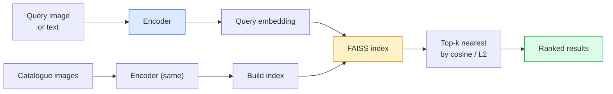

# छवि पुनर्प्राप्ति और मीट्रिक सीखने

> एक रिकवरी प्रणाली में अंतरिक्ष को एम्बेड करने में दूरी के आधार पर उम्मीदवारों को रैंक किया जाता है। मीट्रिक सीखने उस अंतरिक्ष को आकार देने का अनुशासन है ताकि दूरी का मतलब आप क्या चाहते हैं।

> **【中文解读】**检索系统通过嵌入空间中的距离对候选图像排序――度量学习就是塑造这个空间,使得距离反映你想要的语义关系相似图像靠近,不相似图像离远――对比损失 (contrastive loss) 和三元组损失 (triple loss) 是核心方法――

> **【拓展：检索系统的应用】**以图搜图(Google Images、淘宝拍照搜) 、人脸识别(FaceNet)、推系统(Pinterest) सभी मात्रा में सीखने पर निर्भर करते हैं。CLIP का तुलनात्मक प्रशिक्षण本质上 भी एक मात्रा में सीखने वाला प्रकार है。

**Type:** Build | **类型:** 动手
**Languages:** Python | **语言:** Python
**Prerequisites:** Phase 4 Lesson 14 (ViT), Phase 4 Lesson 18 (CLIP) | **前置知识:** Phase 4 Lesson 14（ViT），Phase 4 Lesson 18（CLIP）
**Time:** ~45 minutes | **时间:** ~45 分钟

## सीखने के लक्ष्य

- त्रिपुला, विपरीत और प्रॉक्सी आधारित मीट्रिक सीखने के नुकसान की व्याख्या करें और किसी दिए गए डेटासेट के लिए सही एक चुनें
- L2 मानकीकरण और कॉसिन समानता को सही ढंग से लागू करें और "एक ही आइटम" और "एक ही वर्ग" के बीच अंतर का लेखांकन करें
- एक FAISS सूचकांक बनाएं, इसे पाठ और छवि द्वारा क्वेरी करें, और एक लंबे समय तक किए गए क्वेरी सेट के लिए recall@K रिपोर्ट करें
- DINOv2, CLIP, और SigLIP का उपयोग शेल्फ से बाहर एम्बेडिंग रीढ़ की हड्डी के रूप में करें और जानें कि प्रत्येक जीतता है

> **【中文解读】**सीखने के लक्ष्य इस कक्षा को पूरा करने के बाद जो मूल क्षमताएं होनी चाहिए, उन्हें सूचीबद्ध करते हैं।


## समस्या  समस्या परिचय

उत्पादन दृष्टि में रिकवरी हर जगह हैः डुप्लिकेट डिटेक्शन, रिवर्स छवि खोज, दृश्य खोज ("समान उत्पादों को ढूंढें"), अनुहार की पुनः पहचान, निगरानी के लिए व्यक्ति की पुनः पहचान, ई-कॉमर्स के लिए इंस्टेंट-लेवल मिलान। उत्पाद प्रश्न हमेशा एक ही हैः "इस क्वेरी छवि को देखते हुए, मेरी सूची को रैंक करें। "

> 检索在生产视觉中无处不在:重复检测、反向图像搜索、视觉搜索("寻找相似产品") 的人脸重识别、监控人员重识别、电商实例级匹配──产品问题总是相同:"给定这张查询图像,对我的目录排序──"

दो डिजाइन निर्णय पूरे सिस्टम को आकार देते हैं। एम्बेडिंग  कौन सा मॉडल वेक्टर उत्पन्न करता है। सूचकांक  पैमाने पर निकटतम पड़ोसियों को कैसे ढूंढें। दोनों 2026 में वस्तु हैं (एम्बेडिंग के लिए DINOv2, इंडेक्स के लिए FAISS), जो बार को बढ़ाता हैः कठिन हिस्सा आपके आवेदन के लिए *क्या समान है* को परिभाषित करना है, फिर एम्बेडिंग अंतरिक्ष को आकार देना ताकि दूरी मेल खाए।

> 两个设计决策塑造整个系统――嵌入什么模型产生向量――索引如何大规模找到近邻――两者都是商品(DINOv2嵌入用,FAISS索引用), इससे बढ़ते मानदंडः困难的部分是为您的应用定义*什么算相似*,然后塑造嵌入空间使距离匹配――

यह आकार देना मीट्रिक सीखने है। यह एक छोटा लेकिन उच्च लीवरिंग अनुशासन है।

> यह एक छोटा लेकिन उच्च स्तरीय विषय है।

## अवधारणा का मूल अवधारणा

> **【中文解读】**इस भाग में मूल अवधारणाओं और सिद्धांतों की आधारभूत जानकारी दी गई है। इन अवधारणाओं को प्राप्त करना बाद में होने वाली प्रक्रियाओं के लिए एक शर्त है।


### एक नज़र में प्राप्त करना



### चार हार परिवार

| Loss | Requires | Pros | Cons |
|------|----------|------|------|
| **Contrastive** | (anchor, positive) + negatives | Simple, works with any pair label | Slow to converge without many negatives |
| **Triplet** | (anchor, positive, negative) | Intuitive; direct margin control | Hard-triplet mining is expensive |
| **NT-Xent / InfoNCE** | Pairs + batch-mined negatives | Scales to large batches | Needs big batch or momentum queue |
| **Proxy-based (ProxyNCA)** | Class labels only | Fast, stable, no mining | Can overfit to proxies on small datasets |

अधिकांश उत्पादन उपयोग मामलों के लिए, एक पूर्व-प्रशिक्षित रीढ़ की हड्डी के साथ शुरू करें और केवल एक मीट्रिक-लर्निंग बारीक-ट्यूनिंग जोड़ें यदि शेल्फ-ऑफ-द-शेल्फ एम्बेडमेंट आपके परीक्षण सेट पर खराब प्रदर्शन करते हैं।

>  अधिकांश उत्पादन परिदृश्यों के लिए, पूर्व प्रशिक्षण के बाद से, केवल तभी जब आपके परीक्षण संग्रह में मौजूदा एम्बेड का प्रदर्शन खराब होता है, तो ही मात्रा में सीखने की क्षमता बढ़ जाती है

### औपचारिक रूप से त्रिभुज हानि

```
L = max(0, ||f(a) - f(p)||^2 - ||f(a) - f(n)||^2 + margin)
```

लंगर खींचें `a`सकारात्मक के निकट `p`, नकारात्मक से दूर धक्का `n`, के साथ `margin`तीन-छवि संरचना किसी भी समानता क्रम के लिए सामान्यीकरण।

> 点 `a`拉近正样本 `p`, 推远负样本 `n`, उपयोग `margin`确保间隔──三图像结构可推广到任何相似度排序──

खनन विषयः आसान त्रिगुट (`n`पहले से ही दूर `a`) शून्य हानि का योगदान देते हैं; केवल हार्ड ट्रिपल नेटवर्क को पढ़ाते हैं।`n` से अधिक`p`लेकिन मार्जिन के भीतर) 2016 फेसनेट नुस्खा है और अभी भी हावी है।

> 挖掘很重要:简单三元组`n`已远离 `a`) योगदान शून्य हानि; केवल कठिनाई`n`तुलना`p`远但在边缘内) 2016 में फेसनेट का कार्यक्रम है, जो आज भी प्रमुख है।

### कॉसिन समानता बनाम L2

दो मीट्रिक, दो सम्मेलनः

> 两种度,两种约定:

- **Cosine**: वेक्टरों के बीच कोण। L2 मानकीकृत एम्बेडमेंट की आवश्यकता होती है।
  中文翻译:**余弦**:向量间角度── L2 归结嵌入所──
- **L2**: यूक्लिडियन दूरी. कच्चे या सामान्यीकृत एम्बेडमेंट पर काम करता है, लेकिन आमतौर पर L2-नियमित + वर्ग L2 के साथ जोड़ा जाता है।
  中文翻译:**L2**: 欧氏距离── मूल या归化嵌入 के लिए उपयुक्त, लेकिन आमतौर पर L2 归化 + 平方 L2 配对使用──

अधिकांश आधुनिक नेट के लिए दोनों समान हैंः `||a - b||^2 = 2 - 2 cos(a, b)`कब`||a|| = ||b|| = 1`. उस सम्मेलन को चुनें जो आपके एम्बेडिंग प्रशिक्षण से मेल खाता हो; उन्हें चुपचाप मिलाकर "सभी से करीब" का अर्थ बदल जाता है।

> 对于大多数现代网络,两者等价:当 `||a|| = ||b|| = 1`时,`||a - b||^2 = 2 - 2 cos(a, b)` चयन और सम्मिलन प्रशिक्षण के अनुरूप नियोजन;混用会静默改变"最近"的含义

### याद@के

मानक निकासी मीट्रिकः

```
recall@K = fraction of queries where at least one correct match is in the top K results
```

रिपोर्ट recall@1, @5, @10 साथ में। एक recall@10 0.95 से ऊपर है और recall@1 0.5 से नीचे है इसका मतलब है कि एम्बेडिंग स्पेस में सही संरचना है लेकिन रैंकिंग शोर है  लंबे समय तक ठीक-ट्यून या एक फिर से रैंकिंग चरण का प्रयास करें।

> क्रमबद्ध रिपोर्ट याद@1、@5、@10── याद@10  से अधिक 0.95 लेकिन याद@1  से कम 0.5 मतलब है कि अंतरिक्ष संरचना में सम्मिलित सही है लेकिन क्रमबद्ध है शोर प्रयास अधिक लंबा के लिए लघु समायोजन या पुनः क्रमबद्ध चरणों。

डुप्लिकेट डिटेक्शन के लिए, सटीकता @ K अधिक मायने रखता है क्योंकि प्रत्येक झूठी सकारात्मक उपयोगकर्ता द्वारा दिखाई देने वाली गलती है। दृश्य खोज के लिए, recall@ K उत्पाद संकेत है।

> 对于重复检测,精度@K更重要,因为每个假阳性都是用户可见的错误――对于视觉搜索,Remall@K是产品信号――

### FAISS एक पैराग्राफ में

फेसबुक एआई समानता खोज. निकटतम पड़ोसी खोज के लिए वास्तविक पुस्तकालय. तीन सूचकांक विकल्पः

> फेसबुक एआई समानुपातिकता खोजों।

- `IndexFlatIP`/`IndexFlatL2` क्रूर बल, सटीक, कोई प्रशिक्षण. ~ 1M वेक्टर तक का उपयोग करें.
  中文翻译:`IndexFlatIP`/`IndexFlatL2` हिंसक खोज, सटीक, बिना प्रशिक्षण के  लगभग 100,000 सेक्टर के अंदर उपयोग करने के लिए उपयुक्त 
- `IndexIVFFlat` K कोशिकाओं में विभाजन, केवल निकटतम कुछ कोशिकाओं की खोज करें.
  中文翻译:`IndexIVFFlat` K 个单元 में विभाजित, केवल हालिया कुछ इकाइयों को खोजें──近似、快速, प्रशिक्षण डेटा की आवश्यकता──
- `IndexHNSW` ग्राफ आधारित, कई क्वेरी के लिए सबसे तेज, बड़े सूचकांक आकार।
  中文翻译:`IndexHNSW`आधारित चित्र, अधिक पूछताछ, सबसे तेज़, सूचकांक बड़ा बड़ा

100k वेक्टर के लिए आप शायद चाहते हैं `IndexFlatIP`10M के लिए आप चाहते हैं`IndexIVFFlat`. उत्पाद मात्रा के साथ 100M+ के लिए (`IndexIVFPQ`) ।

> 100.000 से अधिक उपयोग किया जाता है`IndexFlatIP`余弦相似度即可──1000万用 `IndexIVFFlat`❖ 1 अरब से अधिक गुणांक`IndexIVFPQ`)。

### इंस्टेंस लेवल बनाम कैटेगरी लेवल रिट्रीव

एक ही नाम के साथ दो बहुत अलग समस्याएंः

> 两个名字相同但非常不同的问题:

- **Category-level** "मेरी सूची में बिल्लियों को ढूंढें।" वर्ग-सशर्त समानता; ऑफ-द-शेल्फ CLIP / DINOv2 एम्बेडमेंट अच्छी तरह से काम करते हैं।
  中文翻译:**类别级**"मेरे कैटलॉग में मांसाहार ढूंढें"──类别条件相似度;现成的 CLIP / DINOv2 嵌入即可──
- **Instance-level** "मेरी सूची में यह उत्पाद ढूंढें।" एक ही वर्ग के समान वस्तुओं के बीच बारीक भेदभाव की आवश्यकता है; शेल्फ में एम्बेडेड कम प्रदर्शन करते हैं; मीट्रिक सीखने के मामलों के साथ बारीक समायोजन।
  中文翻译:**实例级**"मेरे कैटलॉग में यह विशिष्ट उत्पाद** ढूंढना"── आवश्यक है कि वस्तुओं के बीच की छोटी-छोटी अंतरण; वर्तमान में एम्बेडेड प्रदर्शन अच्छा नहीं है; मात्रा सीखने के लिए सूक्ष्म विन्यास बहुत महत्वपूर्ण है──

मॉडल चुनने से पहले हमेशा पूछें कि आप किस एक को हल कर रहे हैं।

> चयन करने से पहले, आपको यह स्पष्ट करना होगा कि आप किस समस्या का समाधान कर रहे हैं।

> **【中文解读】**इस भाग के माध्यम से कोड को शून्य से लागू किया जा सकता है कोर एल्गोरिदम। इस तरह के "शुरुआत से" तरीके से फ्रेमवर्क के पीछे के सिद्धांत को समझने में मदद मिलेगी, समस्याओं का सामना करते समय ब्लैक बॉक्स में फंस नहीं जाएगा।

> **【拓展：工业部署中的视觉系统】**वास्तविक औद्योगिक तैनाती में, विज़ुअल मॉडल को देरी, मॉडल आकार, किनारे उपकरण अनुकूलन आदि की समस्या पर विचार करने की आवश्यकता होती है। टेन्सरआरटी, ओएनएनएक्स रनटाइम, ओपनवीनो एक सामान्य उपयोग में आने वाला सुझाव त्वरण उपकरण है।

> **【拓展：数据标注与质量】**视觉任务的效果高度依赖标签数据质量──标签工作室、CVAT是主流标签工具──在工业场景中,主动学习(Active Learning) ले标签成本 को कम कर सकता हैः मॉडल अनिश्चित नमूना अनुरोधों के लिए कृत्रिम标签, अनिश्चितता के नमूने स्वचालित标签──


## इसे बनाओ, इसे पूरा करो।
```figure
metric-embedding
```

## इसे बनाओ

### चरण 1: त्रिप्लट हानि

```python
import torch
import torch.nn.functional as F

def triplet_loss(anchor, positive, negative, margin=0.2):
    d_ap = F.pairwise_distance(anchor, positive, p=2)
    d_an = F.pairwise_distance(anchor, negative, p=2)
    return F.relu(d_ap - d_an + margin).mean()
```

एक पंक्ति. L2 मानकीकृत या कच्चे एम्बेडेड पर काम करता है.

> एक पंक्ति कोड── L2 归一化或原始嵌入 हेतु उपयुक्त──

### चरण 2: अर्ध-कठिन खनन

एम्बेडमेंट्स और लेबल के बैच को देखते हुए, प्रत्येक एंकर के लिए सबसे कठिन अर्ध-कठिन नकारात्मक खोजें।

>  एक बैच में इम्बेड और लेबल दिए, प्रत्येक बिंदु के लिए सबसे कठिन अर्ध-असली नमूना ढूंढना

```python
def semi_hard_negatives(emb, labels, margin=0.2):
    dist = torch.cdist(emb, emb)
    same_class = labels[:, None] == labels[None, :]
    diff_class = ~same_class
    N = emb.size(0)

    positives = dist.clone()
    positives[~same_class] = float("-inf")
    positives.fill_diagonal_(float("-inf"))
    pos_idx = positives.argmax(dim=1)

    semi_hard = dist.clone()
    semi_hard[same_class] = float("inf")
    d_ap = dist[torch.arange(N), pos_idx].unsqueeze(1)
    semi_hard[dist <= d_ap] = float("inf")
    neg_idx = semi_hard.argmin(dim=1)

    fallback_mask = semi_hard[torch.arange(N), neg_idx] == float("inf")
    if fallback_mask.any():
        hardest = dist.clone()
        hardest[same_class] = float("inf")
        neg_idx = torch.where(fallback_mask, hardest.argmin(dim=1), neg_idx)
    return pos_idx, neg_idx
```

प्रत्येक एंकर को वर्ग में सबसे कठिन सकारात्मक और अर्ध-कठोर नकारात्मक मिलता है जो सकारात्मक से आगे है लेकिन मार्जिन के भीतर है।

> प्रत्येक  बिंदु प्राप्त करने के लिए वर्ग में सबसे कठिन वास्तविक नमूना और एक तुलनात्मक रूप से कठिन नमूना दूर लेकिन सीमा के भीतर आधा कठिन नकारात्मक नमूना है।

### चरण 3: याद करें

```python
def recall_at_k(query_emb, gallery_emb, query_labels, gallery_labels, k=1):
    sim = query_emb @ gallery_emb.T
    _, top_k = sim.topk(k, dim=-1)
    matches = (gallery_labels[top_k] == query_labels[:, None]).any(dim=-1)
    return matches.float().mean().item()
```

L2 मानकीकृत एम्बेडेड पर आंतरिक उत्पाद द्वारा शीर्ष-के कॉसिन द्वारा शीर्ष-के के बराबर है। कम से कम एक सही पड़ोसी के साथ क्वेरीओं के औसत अनुपात की रिपोर्ट करें।

> L2 归结嵌入内积上-k等于余弦上-k―― रिपोर्ट में कम से कम एक सही पड़ोसी के पूछताछ का औसत अनुपात है――

### चरण 4: इसे एक साथ रखना

```python
import torch
import torch.nn as nn
from torch.optim import Adam

class Encoder(nn.Module):
    def __init__(self, in_dim=128, emb_dim=64):
        super().__init__()
        self.net = nn.Sequential(
            nn.Linear(in_dim, 128), nn.ReLU(),
            nn.Linear(128, emb_dim),
        )

    def forward(self, x):
        return F.normalize(self.net(x), dim=-1)

torch.manual_seed(0)
num_classes = 6
protos = F.normalize(torch.randn(num_classes, 128), dim=-1)

def sample_batch(bs=32):
    labels = torch.randint(0, num_classes, (bs,))
    x = protos[labels] + 0.15 * torch.randn(bs, 128)
    return x, labels

enc = Encoder()
opt = Adam(enc.parameters(), lr=3e-3)

for step in range(200):
    x, y = sample_batch(32)
    emb = enc(x)
    pos_idx, neg_idx = semi_hard_negatives(emb, y)
    loss = triplet_loss(emb, emb[pos_idx], emb[neg_idx])
    opt.zero_grad(); loss.backward(); opt.step()
```

> **【中文解读】**इस भाग में दिखाया गया है कि इस तकनीक को कैसे तेजी से लागू किया जाए। इस प्रकार के एक परिपक्व ढांचे का उपयोग करके बग कम किए जा सकते हैं और विकास दक्षता में सुधार किया जा सकता है।


कुछ सौ चरणों के बाद एम्बेडिंग क्लस्टर प्रति वर्ग एक क्लस्टर बनाते हैं।

>  कुछ सौ चरणों के बाद, प्रत्येक वर्ग एक 🏼 को एक साथ एक साथ एक साथ एक साथ एक साथ एक साथ एक साथ एक साथ एक साथ एक साथ एक साथ एक साथ एक साथ एक साथ एक साथ एक साथ एक साथ एक साथ एक साथ एक साथ एक साथ एक साथ एक साथ एक साथ एक साथ एक साथ एक साथ एक साथ एक साथ एक साथ एक साथ एक साथ एक साथ एक साथ एक साथ एक साथ एक साथ एक साथ एक साथ एक साथ एक साथ एक साथ एक साथ एक साथ एक साथ एक साथ एक साथ एक साथ एक साथ एक साथ एक साथ एक साथ एक साथ एक साथ एक साथ एक साथ एक साथ एक साथ एक साथ एक साथ एक साथ एक साथ एक साथ एक साथ एक साथ एक साथ एक साथ एक साथ एक साथ एक साथ एक साथ एक साथ एक साथ एक साथ एक साथ एक साथ एक साथ एक साथ एक साथ एक साथ एक साथ एक साथ एक साथ एक साथ एक साथ एक साथ एक साथ एक साथ एक साथ एक साथ एक साथ एक साथ एक साथ एक साथ एक साथ एक साथ एक साथ एक साथ एक साथ एक साथ एक साथ एक साथ एक साथ एक साथ एक साथ एक साथ एक साथ एक साथ एक साथ एक साथ एक साथ एक साथ एक साथ एक साथ एक साथ एक साथ एक साथ एक साथ एक साथ एक साथ एक साथ एक साथ एक साथ एक साथ एक साथ एक साथ एक साथ एक साथ एक साथ एक साथ एक साथ एक साथ एक साथ एक साथ एक साथ एक साथ एक साथ एक साथ एक साथ एक साथ एक साथ एक साथ एक साथ एक साथ एक साथ एक साथ एक साथ एक साथ एक साथ एक साथ एक साथ एक साथ एक साथ एक साथ एक साथ एक साथ एक साथ एक साथ एक साथ एक साथ एक साथ एक साथ एक साथ एक साथ एक साथ एक साथ एक साथ एक साथ एक साथ एक साथ एक साथ एक साथ एक साथ एक साथ एक साथ एक साथ एक साथ एक साथ एक साथ एक साथ एक साथ एक साथ एक साथ एक साथ एक साथ एक साथ एक साथ एक साथ एक साथ एक साथ एक साथ एक


> **【拓展：视觉模型的持续学习】**उत्पादन वातावरण में, दृश्य मॉडल को नए डेटा को लगातार अनुकूलित करने की आवश्यकता होती है। यह ऑटोमोटिव ड्राइविंग और औद्योगिक गुणवत्ता जांच में विशेष रूप से महत्वपूर्ण है।

## इसे फ्रेमवर्क के साथ लागू करें

2026 में उत्पादन स्टैकः

- **DINOv2 + FAISS**सामान्य प्रयोजन के दृश्य निकासी। शेल्फ से काम करता है।
- **CLIP + FAISS** जब प्रश्न पाठ हैं।
- **Fine-tuned DINOv2 + FAISS** उदाहरण स्तर पर पुनर्प्राप्ती, फेस री-आईडी, फैशन, ई-कॉमर्स।
- **Milvus / Weaviate / Qdrant** FAISS या HNSW के आसपास प्रबंधित वेक्टर DB रैपर।

> **【中文解读】**इस खंड में इस बात पर ध्यान दिया गया है कि मॉडल को उपलब्ध उत्पादों के रूप में कैसे तैनात किया जाए। मूल से लेकर उत्पादन स्तर तक, प्रदर्शन अनुकूलन, त्रुटि प्रसंस्करण, निगरानी आदि के कई आयामों पर विचार करने की आवश्यकता है।


SOTA उदाहरण निकालने के लिए, नुस्खा हैः DINOv2 रीढ़ की हड्डी, एम्बेडिंग सिर जोड़ें, एक तिप्पी के साथ ठीक-ट्यून या उदाहरण-लेबल जोड़े पर InfoNCE हानि, FAISS में सूचकांक।


## इसे भेजें उत्पाद

> **【中文解读】**练习题按照易/中级/难度递进;;建议至少完成中级题,Hard级适合深入研究或面试准备;;


इस पाठ से उत्पन्न होता हैः

- `outputs/prompt-retrieval-loss-picker.md` एक संकेत जो किसी दिए गए पुनर्प्राप्ति समस्या के लिए त्रिपुला / InfoNCE / ProxyNCA चुनता है।
- `outputs/skill-recall-at-k-runner.md` एक कौशल जो ट्रेन/वॉल/गैलरी विभाजन और उचित डेटा अनुबंध के साथ recall@K के लिए एक स्वच्छ मूल्यांकन हर्नस लिखता है।

## अभ्यास विषय

1. **(Easy)**ऊपर दिए गए खेलौना उदाहरण को चलाएं। प्रशिक्षण से पहले और बाद में पीसीए के साथ एम्बेडमेंट को रेखांकित करें ताकि छह क्लस्टरों का गठन हो सके।
2. **(Medium)**एक प्रोक्सीएनसीए हानि कार्यान्वयन जोड़ेंः प्रति वर्ग एक सीखा "प्रॉक्सी", कॉसिन समानता पर मानक क्रॉस-एंट्रोपी। खिलौना डेटा पर अभिसरण गति बनाम तिपाई हानि की तुलना करें।
3. **(Hard)**1,000 ImageNet सत्यापन छवियों को ले लो, HuggingFace के माध्यम से DINOv2 के साथ एम्बेड करें, एक FAISS फ्लैट सूचकांक बनाएं, और उसी छवियों के खिलाफ रिकॉल@{1, 5, 10} रिपोर्ट करें जैसे क्वेरी (1.0) और ImageNet लेबल के साथ एक लंबे समय तक विभाजित के खिलाफ ग्राउंड सत्य।

> **【中文解读】**术语表中的"क्या लोग कहते हैं" बनाम "क्या वास्तव में इसका मतलब है" 区分日常口语和精确技术含义──在团队协作中,统一术语定义可以避免大量沟通误解──


## कीवर्ड्स  शब्द खोज तालिका

| Term | What people say | What it actually means |
|------|----------------|----------------------|
| Metric learning | "Shape the space" | Training an encoder so distances in its output space reflect a target similarity |
| Triplet loss | "Pull and push" | L = max(0, d(a, p) - d(a, n) + margin); the canonical metric-learning loss |
| Semi-hard mining | "Useful negatives" | Negatives further from the anchor than the positive but within margin; empirically the most informative |
| Proxy-based loss | "Class prototypes" | One learned proxy per class; cross-entropy over similarity-to-proxies; no pair mining |
| Recall@K | "Top-K hit rate" | Fraction of queries with at least one correct result in the top K |
| Instance retrieval | "Find this exact thing" | Fine-grained matching; off-the-shelf features usually underperform |
| FAISS | "The NN library" | Facebook's nearest-neighbour library; supports exact and approximate indexes |
| HNSW | "Graph index" | Hierarchical navigable small world; fast approximate NN with small memory overhead |

> **【中文解读】**延伸阅读 प्रदान करता है गहन सीखने के लिए उच्च गुणवत्ता वाले संसाधनों। ये लेख और पाठ्यक्रम इस क्षेत्र के लिए क्लासिक संदर्भ हैं, जो गहन समझ की आवश्यकता वाले पाठकों के लिए उपयुक्त हैं।


## आगे पढ़ना 延伸閱讀

- [FaceNet: A Unified Embedding for Face Recognition (Schroff et al., 2015)](https://arxiv.org/abs/1503.03832) त्रिपुट हानि / अर्ध-कठिन खनन कागज
- [In Defense of the Triplet Loss for Person Re-Identification (Hermans et al., 2017)](https://arxiv.org/abs/1703.07737) त्रिपुराण सूक्ष्म समायोजन के लिए व्यावहारिक मार्गदर्शिका
- [FAISS documentation](https://github.com/facebookresearch/faiss/wiki) प्रत्येक सूचकांक, प्रत्येक व्यापार-बदला
- [SMoT: Metric Learning Taxonomy (Kim et al., 2021)](https://arxiv.org/abs/2010.06927) आधुनिक घाटे और उनके संबंध का सर्वेक्षण
