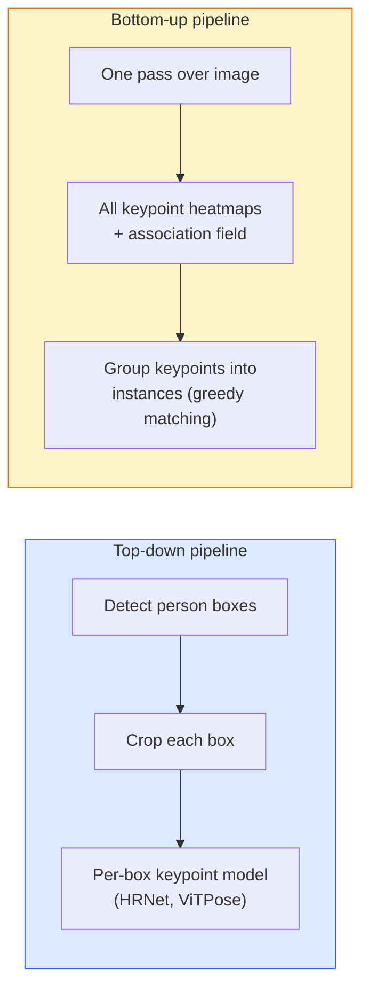

# Keypoint Detection & Pose Estimation  Keypoint Detection और पोझिशन अनुमान

> एक आसन क्रमबद्ध कुंजी बिंदुओं का एक सेट है एक कुंजी बिंदु डिटेक्टर एक हीटमैप रेग्रेसर है बाकी सब कुछ लेखांकन है।

> **【中文解读】**姿态 एक क्रमबद्ध महत्वपूर्ण बिंदुओं का एक समूह है। 姿态 अनुमान व्यापक रूप से गति विश्लेषण में उपयोग किया जाता है।

> **【拓展：姿态估计的应用】**OpenPose、MediaPipe、YOLO-Pose is a common usage of gesture estimation tool── आवेदन के परिदृश्य में शामिल हैंः

**Type:** Build | **类型:** 动手
**Languages:** Python | **语言:** Python
**Prerequisites:** Phase 4 Lesson 06 (Detection), Phase 4 Lesson 07 (U-Net) | **前置知识:** Phase 4 Lesson 06（目标检测），Phase 4 Lesson 07（U-Net）
**Time:** ~45 minutes | **时间:** ~45 分钟

## सीखने के लक्ष्य

- ऊपर-नीचे और नीचे-ऊपर स्थिति अनुमान को अलग करें और प्रत्येक का उपयोग कब किया जाता है, यह बताएं
- प्रति कुंजी बिंदु गॉसियन लक्ष्य के साथ K कुंजी बिंदुओं के लिए रिग्रेशन हीटमैप और निष्कर्षण पर कुंजी बिंदु निर्देशांक निकालें
- भाग आत्मीयता क्षेत्रों (PAFs) और नीचे-ऊपर पाइपलाइनों को उदाहरणों में कुंजी बिंदुओं को कैसे जोड़ते हैं, को समझाएं
- उत्पादन कुंजी बिंदु अनुमान के लिए मीडियापाइप पोज़ या एमएमपीओएस का उपयोग करें और उनके आउटपुट प्रारूप को समझें

> **【中文解读】**सीखने के लक्ष्य इस कक्षा को पूरा करने के बाद जो मूल क्षमताएं होनी चाहिए, उन्हें सूचीबद्ध करते हैं।


## समस्या  समस्या परिचय

मुख्य बिंदु कार्यों के कई नाम हैंः मानव मुद्रा (17 शरीर जोड़), चेहरे के लैंडमार्क (68 या 478 अंक), हाथ (21 अंक), जानवरों के लैंडमार्क, रोबोट वस्तुओं के लैंडमार्क, चिकित्सा शरीर रचना के लैंडमार्क। उनमें से प्रत्येक एक ही संरचना साझा करता हैः किसी वस्तु पर K विवश बिंदुओं का पता लगाएं और उनके (x, y) निर्देशांक आउटपुट करें।

> 关键点任务隐藏在许多名称下:人体姿态(17 个身体关节) 面部特征点(68 个点) 、手部(21 个点) 、动物姿态、机器人物体姿态、医学解剖标志── प्रत्येक में एक ही संरचना हैः जांच वस्तु पर K 个离散点并输出它们的 (x, y) 坐标──

आसन अनुमान गति कैप्चर, फिटनेस ऐप, खेल विश्लेषण, इशारा नियंत्रण, एनीमेशन, एआर ट्राई-ऑन और रोबोटिक पकड़ का आधार है। 2 डी मामला परिपक्व है; 3 डी आसन (एक ही कैमरे से दुनिया के निर्देशांक में संयुक्त स्थिति का अनुमान लगाना) वर्तमान अनुसंधान सीमा है।

> 姿態估算是动作捕捉,健身应用,運動分析,手势控制,动画,AR 试穿和机器人抓取的基础──2D 形势已经成熟;3D 姿態(单个相机估计世界坐标中的关节位置) वर्तमान अनुसंधान के अग्रिम में है──

इंजीनियरिंग का सवाल पैमाने है. एक छवि, एक व्यक्ति का आसन 20ms की समस्या है. 30 fps पर भीड़ में बहु व्यक्ति का आसन विभिन्न वास्तुकलाओं के साथ एक अलग समस्या है।

> 工程 समस्या है आकार। एकल छवि, एकल व्यक्ति की मुद्रा 20ms की समस्या है।

## अवधारणा का मूल अवधारणा

> **【中文解读】**इस भाग में मूल अवधारणाओं और सिद्धांतों की आधारभूत जानकारी दी गई है। इन अवधारणाओं को प्राप्त करना बाद में होने वाली प्रक्रियाओं के लिए एक शर्त है।


### ऊपर-नीचे बनाम नीचे-ऊपर



- **Top-down** पहले लोगों का पता लगाएं, फिर प्रत्येक फसल पर प्रति व्यक्ति की कुंजी बिंदु मॉडल चलाएं। उच्चतम सटीकता; लोगों की संख्या के साथ रैखिक रूप से मापें।
  中文翻译:**自顶向下**पहले मानव शरीर के फ्रेम का परीक्षण करें, फिर प्रत्येक काटने क्षेत्र के लिए काम करें एक व्यक्ति की महत्वपूर्ण बिंदु मॉडल── उच्चतम सटीकता; साथ ही संख्यात्मक विस्तार──
- **Bottom-up** एक आगे पास सभी कुंजी बिंदुओं के साथ एक संघ क्षेत्र की भविष्यवाणी करता है; उन्हें समूहबद्ध करें। भीड़ के आकार के बावजूद निरंतर समय।
  中文翻译:**自底向上** एक बार पूर्ववर्ती प्रसार पूर्वानुमान सभी महत्वपूर्ण बिंदुओं को जोड़ने के लिए; फिर分组── चाहे मानव समूह का आकार कितना भी बड़ा हो, यह समय का एक सामान्य संख्या है──

शीर्ष-डाउन (एचआरनेट, वीटीपीओएस) सटीकता नेता है; नीचे-अप (ओपनपोज, उच्च एचआरएनटी) भीड़ वाले दृश्यों के लिए पारगमन नेता है।

> स्वेप向下 (HRNet、ViTPose) 精度 नेता है; स्वेप-ऊपर (OpenPose、HigherHRNet) 拥挤场景的吞吐量 नेता है。

### हीटमैप रिग्रेशन

पीछे हटने के बजाय `(x, y)`सीधे, भविष्यवाणी `H x W`एक Gaussian ब्लाब के साथ प्रत्येक कुंजी बिंदु के लिए गर्मी नक्शा सही स्थान पर केंद्रित.

>                                                                                                                                                                                                                                                                                                                                                                                                                                                                                                                              `(x, y)`, बल्कि प्रत्येक महत्वपूर्ण बिंदु के लिए एक `H x W`热力图, वास्तविक स्थान के केंद्र में उच्च स्थानों पर रखा गया

```
target[k, y, x] = exp(-((x - cx_k)^2 + (y - cy_k)^2) / (2 sigma^2))
```

निष्कर्ष पर, प्रत्येक हीटमैप का argmax पूर्वानुमानित कुंजी बिंदु स्थान है।

क्यों हीटमैप प्रत्यक्ष प्रतिगमन से बेहतर काम करते हैंः नेटवर्क की स्थानिक संरचना (conv सुविधा मानचित्र) प्राकृतिक रूप से स्थानिक आउटपुट के साथ संरेखित होती है। गौशियन लक्ष्य भी नियमित करते हैं  एक छोटी स्थानिकरण त्रुटि शून्य के बजाय एक छोटा नुकसान पैदा करती है।

> क्यों हीट力图 सीधे लौटने से बेहतर हैः नेटवर्क का अंतरिक्ष संरचना (,) अंतरिक्ष आउटपुट प्राकृतिक रूप से संतुलित है।

### उपपिक्सेल स्थानिकरण

Argmax पूर्णांक निर्देशांक देता है। उप-पिक्सेल सटीकता के लिए, argmax और उसके पड़ोसियों के लिए एक पैराबॉल को फिट करके परिष्कृत करें, या प्रसिद्ध ऑफसेट का उपयोग करें `(dx, dy) = 0.25 * (heatmap[y, x+1] - heatmap[y, x-1], ...)`दिशा।

> Argmax  दे पूर्णांक坐标── प्राप्त करने के लिए द्विपद सटीकता, argmax  और उसके आस-पास के क्षेत्र के लिए उपयुक्त पॉल्यूजर लाइनों के लिए सटीकता से गुजर सकता है──

### भाग संबद्धता क्षेत्र (PAFs)

नीचे-ऊपर संघन के लिए ओपनपोज की चाल। प्रत्येक जोड़े से जुड़े कुंजी बिंदुओं (जैसे बाएं कंधे से बाएं कंधे तक) के लिए, एक 2-चैनल क्षेत्र की भविष्यवाणी करें जो एक से दूसरे की ओर इंगित करने वाले इकाई वेक्टर को एन्कोड करता है। एक कंधे को अपनी कंधे के साथ जोड़ने के लिए, उम्मीदवार जोड़े को जोड़ने वाली रेखा के साथ PAF को एकीकृत करें; उच्चतम समाक के साथ जोड़ा मिलान किया जाता है।

```
For each connection (limb):
  PAF channels: 2 (unit vector x, y)
  Line integral: sum over sample points of (PAF . line_direction)
  Higher integral = stronger match
```

सुरुचिपूर्ण और प्रति व्यक्ति फसल के बिना मनमाने भीड़ आकार के लिए पैमाने पर।

### COCO कुंजी बिंदु

मानक बॉडी-पोज डेटासेटः प्रति व्यक्ति 17 कुंजी बिंदु, पीसीके (सही कुंजी बिंदुओं का प्रतिशत) और ओकेएस (ऑब्जेक्ट कुंजी बिंदु समानता) के रूप में मीट्रिक। ओकेएस आईओयू का कुंजी बिंदु एनालॉग है और यह वही है जो COCO mAP@OKS रिपोर्ट करता है।

> 标准人体姿态数据集: प्रति व्यक्ति 17 个关键点,PCK(正确关键点百分比) और OKS(目标关键点相似度) के रूप में माप──OKS 关键点版的 IoU,  COCO mAP@OKS 报告的内容──

### 2D बनाम 3D

- **2D pose** छवि निर्देशांक; उत्पादन गुणवत्ता पर हल किया गया (MediaPipe, HRNet, ViTPose) ।
- **3D pose** दुनिया/कैमरा समन्वय; अभी भी सक्रिय अनुसंधान। सामान्य दृष्टिकोणः
  - एक छोटे से MLP (VideoPose3D) के साथ 3D 2D भविष्यवाणियों को बढ़ाएं।
  - छवि से प्रत्यक्ष 3D प्रतिगमन (PyMAF, MHFormer)
  - जमीन सत्य के लिए मल्टी-व्यू सेटअप (सीएमयू पैनॉप्टिक) ।

> **【中文解读】**इस भाग के माध्यम से कोड को शून्य से लागू किया जा सकता है कोर एल्गोरिदम। इस तरह के "शुरुआत से" तरीके से फ्रेमवर्क के पीछे के सिद्धांत को समझने में मदद मिलेगी, समस्याओं का सामना करते समय ब्लैक बॉक्स में फंस नहीं जाएगा।

> **【拓展：工业部署中的视觉系统】**वास्तविक औद्योगिक तैनाती में, विज़ुअल मॉडल को देरी, मॉडल आकार, किनारे उपकरण अनुकूलन आदि की समस्या पर विचार करने की आवश्यकता होती है। टेन्सरआरटी, ओएनएनएक्स रनटाइम, ओपनवीनो एक सामान्य उपयोग में आने वाला सुझाव त्वरण उपकरण है।

> **【拓展：数据标注与质量】**视觉任务的效果高度依赖标签数据质量──标签工作室、CVAT是主流标签工具──在工业场景中,主动学习(Active Learning) ले标签成本 को कम कर सकता हैः मॉडल अनिश्चित नमूना अनुरोधों के लिए कृत्रिम标签, अनिश्चितता के नमूने स्वचालित标签──


## इसे बनाओ, इसे पूरा करो।
```figure
cv3-pose-heatmap
```

## इसे बनाओ

### चरण 1: गौशियन हीटमैप लक्ष्य

```python
import numpy as np
import torch

def gaussian_heatmap(size, cx, cy, sigma=2.0):
    yy, xx = np.meshgrid(np.arange(size), np.arange(size), indexing="ij")
    return np.exp(-((xx - cx) ** 2 + (yy - cy) ** 2) / (2 * sigma ** 2)).astype(np.float32)

hm = gaussian_heatmap(64, 32, 32, sigma=2.0)
print(f"peak: {hm.max():.3f} at ({hm.argmax() % 64}, {hm.argmax() // 64})")
```

एक चैनल अक्ष के साथ ढेर किए गए प्रति कुंजी बिंदु हीटमैप पूर्ण लक्ष्य टेंसर प्रदान करते हैं।

> प्रत्येक महत्वपूर्ण बिंदु के ताप शक्ति के पथ के साथ एक पूर्ण लक्ष्य के रूप में एक साथ जमा हो जाते हैं।

### चरण 2: छोटा कुंजी बिंदु सिर

यू-नेट शैली मॉडल जो K हीटमैप चैनलों को आउटपुट करता है।

> एक यू-नेट 风格的模型,输出 K 个热力图通道──

```python
import torch.nn as nn
import torch.nn.functional as F

class TinyKeypointNet(nn.Module):
    def __init__(self, num_keypoints=4, base=16):
        super().__init__()
        self.down1 = nn.Sequential(nn.Conv2d(3, base, 3, 2, 1), nn.ReLU(inplace=True))
        self.down2 = nn.Sequential(nn.Conv2d(base, base * 2, 3, 2, 1), nn.ReLU(inplace=True))
        self.mid = nn.Sequential(nn.Conv2d(base * 2, base * 2, 3, 1, 1), nn.ReLU(inplace=True))
        self.up1 = nn.ConvTranspose2d(base * 2, base, 2, 2)
        self.up2 = nn.ConvTranspose2d(base, num_keypoints, 2, 2)

    def forward(self, x):
        h1 = self.down1(x)
        h2 = self.down2(h1)
        h3 = self.mid(h2)
        u1 = self.up1(h3)
        return self.up2(u1)
```

इनपुट `(N, 3, H, W)`, आउटपुट `(N, K, H, W)`. गॉसियन लक्ष्यों के खिलाफ प्रति पिक्सेल एमएसई हानि है.

### चरण 3: इन्फरेंस  कुंजी बिंदु निर्देशांक निकालें

```python
def heatmap_to_coords(heatmaps):
    """
    heatmaps: (N, K, H, W)
    returns:  (N, K, 2) float coordinates in image pixels
    """
    N, K, H, W = heatmaps.shape
    hm = heatmaps.reshape(N, K, -1)
    idx = hm.argmax(dim=-1)
    ys = (idx // W).float()
    xs = (idx % W).float()
    return torch.stack([xs, ys], dim=-1)

coords = heatmap_to_coords(torch.randn(2, 4, 32, 32))
print(f"coords: {coords.shape}")  # (2, 4, 2)
```

उप-पिक्सेल परिष्करण के लिए, argmax के आसपास इंटरपोलेट करें।

### चरण 4: सिंथेटिक कुंजी बिंदु डेटासेट

सरलः एक सफेद कैनवास पर चार बिंदुओं को खींचें और उन्हें भविष्यवाणी करना सीखें।

```python
def make_synthetic_sample(size=64):
    img = np.ones((3, size, size), dtype=np.float32)
    rng = np.random.default_rng()
    kps = rng.integers(8, size - 8, size=(4, 2))
    for cx, cy in kps:
        img[:, cy - 2:cy + 2, cx - 2:cx + 2] = 0.0
    hms = np.stack([gaussian_heatmap(size, cx, cy) for cx, cy in kps])
    return img, hms, kps
```

एक छोटे से मॉडल के लिए एक मिनट में सीखने के लिए पर्याप्त आसान है।

### चरण 5: प्रशिक्षण

```python
model = TinyKeypointNet(num_keypoints=4)
opt = torch.optim.Adam(model.parameters(), lr=3e-3)

for step in range(200):
    batch = [make_synthetic_sample() for _ in range(16)]
    imgs = torch.from_numpy(np.stack([b[0] for b in batch]))
    hms = torch.from_numpy(np.stack([b[1] for b in batch]))
    pred = model(imgs)
    # Upsample pred to full resolution
    pred = F.interpolate(pred, size=hms.shape[-2:], mode="bilinear", align_corners=False)
    loss = F.mse_loss(pred, hms)
    opt.zero_grad(); loss.backward(); opt.step()
```

> **【中文解读】**इस भाग में दिखाया गया है कि इस तकनीक को कैसे तेजी से लागू किया जाए। इस प्रकार के एक परिपक्व ढांचे का उपयोग करके बग कम किए जा सकते हैं और विकास दक्षता में सुधार किया जा सकता है।


> **【拓展：视觉模型的持续学习】**उत्पादन वातावरण में, दृश्य मॉडल को नए डेटा को लगातार अनुकूलित करने की आवश्यकता होती है। यह ऑटोमोटिव ड्राइविंग और औद्योगिक गुणवत्ता जांच में विशेष रूप से महत्वपूर्ण है।

## इसे फ्रेमवर्क के साथ लागू करें

- **MediaPipe Pose** गूगल का उत्पादन स्थिति अनुमानक; वेबजीएल + मोबाइल रनटाइम 10ms से कम विलंबता के साथ जहाज।
- **MMPose**(OpenMMLab)  व्यापक अनुसंधान कोडबेस; प्रत्येक SOTA वास्तुकला पूर्व-प्रशिक्षित वजन के साथ।
- **YOLOv8-pose** एकल आगे के पास के साथ सबसे तेज वास्तविक समय बहु-व्यक्ति मुद्रा।
- **transformers HumanDPT / PoseAnything** खुले शब्दावली के लिए नए दृष्टि-भाषा दृष्टिकोण (किसी भी वस्तु, किसी भी कुंजी बिंदु सेट) ।

> **【中文解读】**इस खंड में इस बात पर ध्यान दिया गया है कि मॉडल को उपलब्ध उत्पादों के रूप में कैसे तैनात किया जाए। मूल से लेकर उत्पादन स्तर तक, प्रदर्शन अनुकूलन, त्रुटि प्रसंस्करण, निगरानी आदि के कई आयामों पर विचार करने की आवश्यकता है।


## इसे भेजें उत्पाद

> **【中文解读】**练习题按照易/中级/难度递进;;建议至少完成中级题,Hard级适合深入研究或面试准备;;


इस पाठ से उत्पन्न होता हैः

- `outputs/prompt-pose-stack-picker.md` एक प्रॉम्प्ट जो मीडियापाइप / YOLOv8-pose / HRNet / ViTPose को लेटेंसी, भीड़ का आकार और 2D बनाम 3D आवश्यकता को देखते हुए चुनता है।
- `outputs/skill-heatmap-to-coords.md` एक कौशल जो प्रत्येक उत्पादन मुद्रा मॉडल द्वारा उपयोग किए जाने वाले उप-पिक्सेल हीटमैप-टू-कोऑर्डिनेट रूटीन को लिखता है।

## अभ्यास विषय

1. **(Easy)**कृत्रिम 4-बिंदु डेटासेट पर छोटे कुंजी बिंदु मॉडल को प्रशिक्षित करें। 200 चरणों के बाद पूर्वानुमानित और वास्तविक कुंजी बिंदुओं के बीच एल 2 त्रुटि का औसत रिपोर्ट करें।
2. **(Medium)**उप-पिक्सेल परिष्करण जोड़ेंः argmax स्थिति को देखते हुए, पड़ोसी पिक्सेल से x और y के साथ 1D पैराबॉल फिट करें। सटीकता वृद्धि बनाम पूर्णांक argmax रिपोर्ट करें।
3. **(Hard)**एक 2 व्यक्ति सिंथेटिक डेटासेट बनाएं जहां प्रत्येक छवि में 4 कुंजी बिंदु पैटर्न के दो उदाहरण दिखाए जाते हैं। PAF के साथ नीचे-ऊपर पाइपलाइन का अभ्यास करें जो भविष्यवाणी करते हैं कि किस कुंजी बिंदु किस उदाहरण से संबंधित है, और OKS का मूल्यांकन करें।

> **【中文解读】**术语表中的"क्या लोग कहते हैं" बनाम "क्या वास्तव में इसका मतलब है" 区分日常口语和精确技术含义──在团队协作中,统一术语定义可以避免大量沟通误解──


## कीवर्ड्स  शब्द खोज तालिका

| Term | What people say | What it actually means |
|------|----------------|----------------------|
| Keypoint | "A landmark" | A specific ordered point on an object (joint, corner, feature) |
| Pose | "The skeleton" | An ordered set of keypoints belonging to one instance |
| Top-down | "Detect then pose" | Two-stage pipeline: person detector + per-crop keypoint model; highest accuracy |
| Bottom-up | "Pose first, group later" | Single-pass all-keypoint prediction + grouping; constant time in crowd size |
| Heatmap | "Gaussian target" | H x W tensor per keypoint with peak at the true location; the preferred regression target |
| PAF | "Part Affinity Field" | 2-channel unit vector field encoding limb directions; used to group keypoints into instances |
| OKS | "Keypoint IoU" | Object Keypoint Similarity; the COCO metric for pose |
| HRNet | "High-Resolution Net" | The dominant top-down keypoint architecture; preserves high-res features throughout |

> **【中文解读】**延伸阅读 प्रदान करता है गहन सीखने के लिए उच्च गुणवत्ता वाले संसाधनों। ये लेख और पाठ्यक्रम इस क्षेत्र के लिए क्लासिक संदर्भ हैं, जो गहन समझ की आवश्यकता वाले पाठकों के लिए उपयुक्त हैं।


## आगे पढ़ना 延伸閱讀

- [OpenPose (Cao et al., 2017)](https://arxiv.org/abs/1812.08008) PAF के साथ नीचे-ऊपर; अभी भी दृष्टिकोण का सबसे अच्छा लेखन
- [HRNet (Sun et al., 2019)](https://arxiv.org/abs/1902.09212) ऊपर से नीचे की संदर्भ वास्तुकला
- [ViTPose (Xu et al., 2022)](https://arxiv.org/abs/2204.12484) एक पोज़ रीढ़ की हड्डी के रूप में सादा ViT; कई बेंचमार्क पर वर्तमान SOTA
- [MediaPipe Pose](https://developers.google.com/mediapipe/solutions/vision/pose_landmarker) उत्पादन वास्तविक समय में स्थिति; 2026 में सबसे तेजी से तैनात स्टैक
