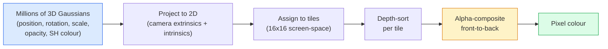

# 3 डी गौशियन स्प्लैटिंग खरोंच से शून्य से 3 डी को साकार करने के लिए

> एक दृश्य 3D Gaussians के लाखों के बादल है. प्रत्येक एक स्थिति, अभिविन्यास, पैमाने, अस्पष्टता, और एक रंग है कि देखने की दिशा पर निर्भर करता है. उन्हें rasterise, वापस props के माध्यम से rasterisation, किया.

> **【中文解读】**3D 高(3DGS) लाखों 3D 高球 का उपयोग करके दृश्यों को प्रदर्शित करने के लिए किया गया है। प्रत्येक高 में स्थिति, दिशा, संकुचन, अस्पष्टता और दृश्य के साथ संबंधित रंग हैं।

> **【拓展：3DGS vs NeRF】**3 डी गौशियन स्प्लैटिंग नेआरएफ का वास्तविक समय प्रतिस्थापन है। 3 डीजीएस ने स्पष्ट 3 डी उच्च प्रदर्शन के माध्यम से वास्तविक समय में स्प्लैटिंग को प्राप्त किया है, जबकि उच्च गुणवत्ता को बनाए रखता है। VR/AR में गेम, फिल्म विशेषताओं में विशाल क्षमता है।

**Type:** Build | **类型:** 动手
**Languages:** Python | **语言:** Python
**Prerequisites:** Phase 4 Lesson 13 (3D Vision & NeRF), Phase 1 Lesson 12 (Tensor Operations), Phase 4 Lesson 10 (Diffusion basics optional) | **前置知识:** Phase 4 Lesson 13（3D 视觉与 NeRF），Phase 1 Lesson 12（张量运算），Phase 4 Lesson 10（扩散基础，可选）
**Time:** ~90 minutes | **时间:** ~90 分钟

## सीखने के लक्ष्य

- समझाएं कि 3D गौशियन स्प्लैटिंग ने 2026 में फोटोरियलिस्टिक 3D पुनर्निर्माण के लिए उत्पादन डिफ़ॉल्ट के रूप में NeRF की जगह क्यों ली
- प्रति गॉसियन पैरामीटर (स्थिति, घूर्णन चतुर्भुज, पैमाने, अस्पष्टता, गोलाकार सामंजस्य रंग, वैकल्पिक विशेषता) और प्रत्येक में कितने फ्लोट योगदान करते हैं, बताएं
-  का उपयोग करके एक 2 डी Gaussian splatting rasterizer को खरोंच से लागू करें`alpha`रचना, फिर दिखाएं कि कैसे 3D मामले एक ही लूप में परियोजनाओं
- उपयोग करें`nerfstudio`,`gsplat`या `SuperSplat`20-50 तस्वीरों से एक दृश्य को पुनर्निर्माण करने और निर्यात करने के लिए `KHR_gaussian_splatting`glTF विस्तार या OpenUSD 26.03 `UsdVolParticleField3DGaussianSplat`योजना

> **【中文解读】**सीखने के लक्ष्य इस कक्षा को पूरा करने के बाद जो मूल क्षमताएं होनी चाहिए, उन्हें सूचीबद्ध करते हैं।


## समस्या  समस्या परिचय

एक NeRF एक दृश्य को MLP के वजन के रूप में संग्रहीत करता है। प्रत्येक रेंडर किए गए पिक्सेल में एक किरण के साथ सैकड़ों MLP क्वेरी होती है। प्रशिक्षण में घंटे लगते हैं, रेंडर में सेकंड लगते हैं, और वजन को संपादित नहीं किया जा सकता है।

> NeRF ने MLP के लिए दृश्य भंडारण के लिए भार को परिभाषित किया है। प्रत्येक छवि को प्रकाश के साथ सैकड़ों बार MLP के लिए पूछताछ की जाती है। प्रशिक्षण में कुछ घंटे लगते हैं, प्रशिक्षण में कुछ सेकंड लगते हैं, भार को संपादित नहीं किया जा सकता है। यदि आप दृश्य में एक कुर्सी को स्थानांतरित करना चाहते हैं, तो आपको फिर से प्रशिक्षण देना होगा।

3 डी गौशियन स्प्लैटिंग (केर्बल, कोपानस, लेमकुहलर, ड्रेटकीस, सिगग्राफ 2023) ने उन सभी को बदल दिया। एक दृश्य 3 डी गौसीन्स का स्पष्ट सेट है। रेन्डरिंग 100+ fps पर GPU रास्टराइजेशन है। प्रशिक्षण में मिनट लगते हैं। संपादन सीधा हैः Gaussians के एक उपसमूह का अनुवाद करें और आप कुर्सी स्थानांतरित कर दिया है। 2026 तक, क्रोनोस समूह ने गौशियन स्प्लेट के लिए एक glTF विस्तार को मंजूरी दे दी है, ओपनयूएसडी 26.03 एक गौशियन स्प्लेट योजना भेजता है, Zillow और अपार्टमेंट्स.कॉम उनके साथ रियल एस्टेट का निर्माण करते हैं, और 3 डी पुनर्निर्माण पर अधिकांश नए शोध पत्र 3 डीजीएस के मूल विचार के संस्करण हैं।

> 3D 高斯(Kerbl、Kopanas、Leimkühler、Drettakis,SIGGRAPH 2023) ने इन सभी को हटा दिया। दृश्य एक स्पष्ट 3D 高斯 के सेट है। 染是100+ fps के GPU प्रकाश化── प्रशिक्षण केवल कुछ मिनटों की आवश्यकता है। संपादन सीधे हैः平移部分高斯就移动椅子── 2026 तक, क्रोनोस समूह 已批准高斯 के glTF विस्तार, उपयोग करेंUSD 26.03 附带高斯模式,Zillow 和 Apartments.com वे 染房地产, अधिकांश नए 3D 重建研究论文 हैं कोर 3DGS 思想的变化──

मानसिक मॉडल सरल है, गणित में पर्याप्त चल रहे भाग हैं कि अधिकांश परिचय रास्टरीकरण से शुरू होते हैं और प्रोजेक्शन और गोलाकार सामंजस्यों से आगे बढ़ते हैं। यह सबक पूरी चीज बनाता है  पहले 2D संस्करण, फिर 3D विस्तार।

> मन का मॉडल बहुत सरल है, गणित में पर्याप्त भाग है, अधिकांश परिचय प्रकाशिकी से शुरू होकर प्रोजेक्शन और गेंद के कार्यों पर कूदते हैं।

## अवधारणा का मूल अवधारणा

> **【中文解读】**इस भाग में मूल अवधारणाओं और सिद्धांतों की आधारभूत जानकारी दी गई है। इन अवधारणाओं को प्राप्त करना बाद में होने वाली प्रक्रियाओं के लिए एक शर्त है।


### एक गौशियन क्या ले जाता है

एक 3 डी गौशियन अंतरिक्ष में इन गुणों के साथ एक पैरामीटर ब्लेब हैः

```
position         mu         (3,)    centre in world coordinates
rotation         q          (4,)    unit quaternion encoding orientation
scale            s          (3,)    log-scales per axis (exponentiated at render time)
opacity          alpha      (1,)    post-sigmoid opacity [0, 1]
SH coefficients  c_lm       (3 * (L+1)^2,)   view-dependent colour
```

घूर्णन + पैमाने 3x3 सह-परिवर्तन का निर्माणः `Sigma = R S S^T R^T`. यह 3 डी में गौशियन का आकार है. गोलाकार सामंजस्य दृश्य दिशा के साथ रंग को बदल देता है  तेजस्वी चमक, दृश्य-निर्भर चमक  बिना प्रति दृश्य बनावट के भंडारण के। SH डिग्री 3 के साथ आपको प्रति रंग चैनल 16 गुणांक, केवल रंग के लिए 48 फ्लोट प्रति गौशियन मिलता है।

> 旋转 + 缩放构建 3x3 协方差矩阵:`Sigma = R S S^T R^T` यह 3D में काओस का आकार है  गेंद फ़ंक्शन रंग को देखने के अनुसार बदलता है उच्च प्रकाश微妙的光泽、视角相关发光                                                                                                                                                                                                                                         

एक दृश्य में आमतौर पर 1-5 मिलियन गौसीयन होते हैं। प्रत्येक में लगभग 60 फ्लोट (3 + 4 + 3 + 1 + 48 + मिक्स) होते हैं। यह पांच मिलियन-गौसीयन दृश्य के लिए 240 एमबी है। यह प्रति बिंदु बनावट वाले समकक्ष बिंदु बादल से बहुत छोटा है, और उच्च संकल्प पर फिर से प्रस्तुत किए गए एनईआरएफ के एमएलपी वजन से आकार का एक आदेश छोटा है।

> एक विशिष्ट परिदृश्य में 100-500 मिलियन काउंट्स हैं। प्रत्येक में 60 浮点数 हैं। 3 + 4 + 3 + 1 + 48 + अन्य)  500 मिलियन काउंट्स के परिदृश्य में लगभग 240 MB बराबर मूल्य के साथ-साथ एक-एक-एक-एक-एक-एक-एक-एक-एक-एक-एक-एक-एक-एक-एक-एक-एक-एक-एक-एक-एक-एक-एक-एक-एक-एक-एक-एक-एक-एक-एक-एक-एक-एक-एक-एक-एक-एक-एक-एक-एक-एक-एक-एक-एक-एक-एक-एक-एक-एक-एक-एक-एक-एक-एक-एक-एक-एक-एक-एक-एक-एक-एक-एक-एक-एक-एक-एक-एक-एक-एक-एक-एक-एक-एक-एक-एक-एक-एक-एक-एक-एक-एक-एक-एक-एक-एक-एक-एक-एक-एक-एक-एक-एक-एक-एक-एक-एक-एक-एक-एक-एक-एक-एक-एक-एक-एक-एक-एक-एक-एक-एक-एक-एक-एक-एक-एक-एक-एक-एक-एक-एक-एक-एक-एक-एक-एक-एक-एक-एक-एक-एक-एक-एक-एक-एक-एक-एक-एक-एक-एक-एक-एक-एक-एक-एक-एक-एक-एक-एक-एक-एक-एक-एक-एक-एक-एक-एक-एक-एक-एक-एक-एक-एक-एक-एक-एक-एक-एक-एक-एक-एक-एक-एक-एक-एक-एक-एक-एक-एक-एक-एक-एक-एक-एक-एक-एक-एक-एक-एक-एक-एक-एक-एक-एक-एक-एक-एक-एक-एक-एक-एक-एक-एक-एक-एक-एक-एक-एक-एक-एक-एक-एक-एक-एक-एक-एक-एक-एक-एक-एक-एक-एक-एक-एक-एक-एक-एक

### रेसटेरिज़ेशन, न कि रे मार्चिंग



पांच चरण, सभी GPU के अनुकूल. प्रति पिक्सेल कोई MLP क्वेरी नहीं. एक एकल RTX 3080 Ti 147 fps पर 6 मिलियन स्प्लैट देता है।

> 五步,全部 GPU 友好──无需每像素 MLP 查询──单张 RTX 3080 Ti 以 147 fps 染 600 万──

### प्रक्षेपण चरण

3 डी गॉसियन विश्व स्थिति में `mu`3D सह-विवर्तन के साथ `Sigma`स्क्रीन स्थिति पर एक 2D Gaussian के लिए परियोजनाओं `mu'`2D सह-विवर्तन के साथ `Sigma'`:

```
mu' = project(mu)
Sigma' = J W Sigma W^T J^T          (2 x 2)

W = viewing transform (rotation + translation of camera)
J = Jacobian of the perspective projection at mu'
```

2D Gaussian के पदचिह्न एक दीर्घवृत्त है जिसका अक्षों के स्ववेक्टर हैं `Sigma'`उस दीर्घवृत्त के अंदर प्रत्येक पिक्सेल Gaussian के योगदान प्राप्त करता है, द्वारा भारित`exp(-0.5 * (p - mu')^T Sigma'^-1 (p - mu'))`. .

### अल्फा-संयोजन नियम

एक पिक्सेल के लिए, इसे कवर करने वाले गौसीयन को सामने से पीछे (या उल्टे सूत्र के साथ बराबर सामने से पीछे) क्रमबद्ध किया जाता है। 1980 के दशक के बाद से प्रत्येक अर्ध-पारदर्शी रास्टरर के समान समीकरण के साथ रंग का निर्माण किया गया हैः

```
C_pixel = sum_i alpha_i * T_i * c_i

T_i = prod_{j < i} (1 - alpha_j)       transmittance up to i
alpha_i = opacity_i * exp(-0.5 * d^T Sigma'^-1 d)   local contribution
c_i = eval_SH(SH_i, view_direction)    view-dependent colour
```

यह है**the same equation as NeRF's volumetric render**यह पहचान है कि क्यों दर्शाया गुणवत्ता मेल खाता है NeRF  दोनों एक ही चमक-क्षेत्र समीकरण एकीकृत कर रहे हैं।

> यह**与 NeRF 的体积渲染方程相同**, केवल स्पष्ट दुर्लभता का संग्रह पर आधारित है न कि प्रकाश के साथ घनी मात्रा में। यह समीकरण है कि रंग गुणवत्ता के साथ मेल खाने की वजह से NeRF दोनों एक ही विकिरण क्षेत्र के साथ एक ही मात्रा है।

### यह अंतर क्यों है

प्रत्येक चरण  प्रोजेक्शन, टाइल असाइनमेंट, अल्फा कंपोजिटिंग, SH मूल्यांकन  गॉसियन मापदंडों के संबंध में भिन्न हो सकता है। ग्राउंड-सत्य छवि को देखते हुए, रेंडर पिक्सेल हानि, रैस्टरर के माध्यम से बैकप्रॉप, सभी को अपडेट करें `(mu, q, s, alpha, c_lm)`लगभग 30,000 पुनरावृत्ति से अधिक Gaussians अपनी सही स्थिति, पैमाने, और रंग खोजने के लिए.

> प्रत्येक चरण में, प्रतिबिंबों का अनुमान लगाना, चित्रों का वितरण, अल्फा संश्लेषण, एसएच का मूल्यांकन, उच्चतम तत्वों के लिए एक छोटा सा है।`(mu, q, s, alpha, c_lm)`                                                                                                                                                                                                                                                              

### घनत्व और काटने

गॉसियन के एक निश्चित सेट में एक जटिल दृश्य शामिल नहीं हो सकता है। प्रशिक्षण में दो अनुकूलन तंत्र शामिल हैंः

>  स्थिर मात्रा में उच्च स्तर जटिल परिदृश्यों को कवर नहीं कर सकता है।

- **Clone**एक Gaussian अपनी वर्तमान स्थिति पर जब इसकी ग्रेडिएंट परिमाण उच्च है लेकिन इसके पैमाने छोटे है  पुनर्निर्माण अधिक विवरण की जरूरत है यहाँ।
  中文翻译:**克隆** जब ऊँचाई बढ़ेगी लेकिन घटती है तो वर्तमान स्थान पर एक ऊँचाई पर पुनर्निर्माण के लिए अधिक विवरण की आवश्यकता होगी
- **Split**एक बड़े पैमाने पर गौशियन दो छोटे लोगों में विभाजित जब इसकी ग्रेडिएंट उच्च है  एक बड़ा गौशियन क्षेत्र में फिट होने के लिए बहुत चिकनी है।
  中文翻译:**分裂** जब बड़े पैमाने पर उच्च स्तरीयता उच्च हो, तो इसे दो छोटे से बड़े भागों में विभाजित करें एक बड़ा उच्च स्तरीय स्लाइड उपयुक्त नहीं है।
- **Prune**गौसीन जिनके अस्पष्टता एक सीमा से नीचे गिरती है  वे योगदान नहीं कर रहे हैं।
  中文翻译:**修剪**अपारदर्शिता मूल्य से कम अप्रदान अप्रदान अप्रदान अप्रदान अप्रदान अप्रदान अप्रदान अप्रदान अप्रदान अप्रदान अप्रदान अप्रदान अप्रदान अप्रदान अप्रदान अप्रदान अप्रदान अप्रदान अप्रदान अप्रदान अप्रदान अप्रदान अप्रदान अप्रदान अप्रदान अप्रदान अप्रदान अप्रदान अप्रदान अप्रदान अप्रदान अप्रदान अप्रदान अप्रदान अप्रदान 

घनत्व प्रत्येक N पुनरावृत्ति में चलता है। एक दृश्य आमतौर पर प्रशिक्षण के अंत में ~ 100k प्रारंभिक गौसी (एसएफएम बिंदुओं से बीज) से 1-5M तक बढ़ता है।

> 密集化每N 次代运行一次──场景通常从约10万初始高斯 (SfM 点播种) से बढ़कर प्रशिक्षण समाप्त होने पर 100-500万──

### एक पैराग्राफ में गोलाकार सामंजस्य

दृश्य-निर्भर रंग एक फ़ंक्शन है `c(direction)`यूनिट गोला पर. गोलाकार सामंजस्य गोला के Fourier आधार हैं. डिग्री पर ट्रंकट`L`और आप प्राप्त `(L+1)^2`एक नए दृश्य के लिए रंग का मूल्यांकन करने के लिए सीखे गए SH गुणांक और देखने की दिशा में मूल्यांकन किए गए आधार के बीच एक बिंदु उत्पाद है। डिग्री 0 = एक गुणांक = निरंतर रंग। डिग्री 3 = 16 गुणांक = लैम्बरटियन छायांकन, चश्मा और हल्के प्रतिबिंब को कैप्चर करने के लिए पर्याप्त है। एसडी गौशियन स्प्लेटिंग पेपर डिफ़ॉल्ट रूप से डिग्री 3 का उपयोग करते हैं।

### 2026 उत्पादन स्टैक

```
1. Capture         smartphone / DJI drone / handheld scanner
2. SfM / MVS       COLMAP or GLOMAP derives camera poses + sparse points
3. Train 3DGS      nerfstudio / gsplat / inria official / PostShot (~10-30 min on RTX 4090)
4. Edit            SuperSplat / SplatForge (clean floaters, segment)
5. Export          .ply -> glTF KHR_gaussian_splatting or .usd (OpenUSD 26.03)
6. View            Cesium / Unreal / Babylon.js / Three.js / Vision Pro
```

### 4D और जनरेटिव वेरिएंट

- **4D Gaussian Splatting** गौसीन्स समय के कार्यों हैं; वॉल्यूमेट्रिक वीडियो (सुपरमैन 2026, ए $ एपी रॉकी के "हेलीकॉप्टर") के लिए उपयोग किया जाता है।
- **Generative splats** पाठ-से-स्प्लैट मॉडल (वर्ल्ड लैब्स द्वारा मार्बल) जो पूरे दृश्यों को पगलाते हैं।
- **3D Gaussian Unscented Transform** NVIDIA NuRec का स्वायत्त ड्राइविंग सिमुलेशन के लिए संस्करण।

> **【中文解读】**इस भाग के माध्यम से कोड को शून्य से लागू किया जा सकता है कोर एल्गोरिदम। इस तरह के "शुरुआत से" तरीके से फ्रेमवर्क के पीछे के सिद्धांत को समझने में मदद मिलेगी, समस्याओं का सामना करते समय ब्लैक बॉक्स में फंस नहीं जाएगा।

> **【拓展：工业部署中的视觉系统】**वास्तविक औद्योगिक तैनाती में, विज़ुअल मॉडल को देरी, मॉडल आकार, किनारे उपकरण अनुकूलन आदि की समस्या पर विचार करने की आवश्यकता होती है। टेन्सरआरटी, ओएनएनएक्स रनटाइम, ओपनवीनो एक सामान्य उपयोग में आने वाला सुझाव त्वरण उपकरण है।

> **【拓展：数据标注与质量】**视觉任务的效果高度依赖标签数据质量──标签工作室、CVAT是主流标签工具──在工业场景中,主动学习(Active Learning) ले标签成本 को कम कर सकता हैः मॉडल अनिश्चित नमूना अनुरोधों के लिए कृत्रिम标签, अनिश्चितता के नमूने स्वचालित标签──


## इसे बनाओ, इसे पूरा करो।
```figure
cv3-gaussian-splat
```

## इसे बनाओ

### चरण 1: एक 2D गौशियन

हम पहले एक 2D rasteriser बनाने. 3D मामले को इसे करने के लिए नीचे गिरावट के बाद प्रोजेक्शन.

```python
import torch
import torch.nn as nn
import torch.nn.functional as F


def eval_2d_gaussian(means, covs, points):
    """
    means:  (G, 2)      centres
    covs:   (G, 2, 2)   covariance matrices
    points: (H, W, 2)   pixel coordinates
    returns: (G, H, W)  density at every pixel for every Gaussian
    """
    G = means.size(0)
    H, W, _ = points.shape
    flat = points.view(-1, 2)
    inv = torch.linalg.inv(covs)
    diff = flat[None, :, :] - means[:, None, :]
    d = torch.einsum("gpi,gij,gpj->gp", diff, inv, diff)
    density = torch.exp(-0.5 * d)
    return density.view(G, H, W)
```

`einsum`क्या वर्गिक रूप `diff^T Sigma^-1 diff`प्रत्येक (गॉसियन, पिक्सेल) जोड़े के लिए।

### चरण 2: 2 डी स्प्लैटिंग रास्टरीज़र

2D में गहराई का कोई मतलब नहीं है, इसलिए हम आदेश के लिए एक Gaussian per-शिक्षित स्केल का उपयोग.

```python
def rasterise_2d(means, covs, colours, opacities, depths, image_size):
    """
    means:     (G, 2)
    covs:      (G, 2, 2)
    colours:   (G, 3)
    opacities: (G,)     in [0, 1]
    depths:    (G,)     per-Gaussian scalar used for ordering
    image_size: (H, W)
    returns:   (H, W, 3) rendered image
    """
    H, W = image_size
    yy, xx = torch.meshgrid(
        torch.arange(H, dtype=torch.float32, device=means.device),
        torch.arange(W, dtype=torch.float32, device=means.device),
        indexing="ij",
    )
    points = torch.stack([xx, yy], dim=-1)

    densities = eval_2d_gaussian(means, covs, points)
    alphas = opacities[:, None, None] * densities
    alphas = alphas.clamp(0.0, 0.99)

    order = torch.argsort(depths)
    alphas = alphas[order]
    colours_sorted = colours[order]

    T = torch.ones(H, W, device=means.device)
    out = torch.zeros(H, W, 3, device=means.device)
    for i in range(means.size(0)):
        a = alphas[i]
        out += (T * a)[..., None] * colours_sorted[i][None, None, :]
        T = T * (1.0 - a)
    return out
```

तेजी से नहीं  एक वास्तविक कार्यान्वयन टाइल आधारित CUDA कर्नेल  लेकिन सही गणित और पूरी तरह से अंतर का उपयोग करता है।

### चरण 3: एक प्रशिक्षित 2D स्प्लैट दृश्य

```python
class Splats2D(nn.Module):
    def __init__(self, num_splats=128, image_size=64, seed=0):
        super().__init__()
        g = torch.Generator().manual_seed(seed)
        H, W = image_size, image_size
        self.means = nn.Parameter(torch.rand(num_splats, 2, generator=g) * torch.tensor([W, H]))
        self.log_scale = nn.Parameter(torch.ones(num_splats, 2) * math.log(2.0))
        self.rot = nn.Parameter(torch.zeros(num_splats))  # single angle in 2D
        self.colour_logits = nn.Parameter(torch.randn(num_splats, 3, generator=g) * 0.5)
        self.opacity_logit = nn.Parameter(torch.zeros(num_splats))
        self.depth = nn.Parameter(torch.rand(num_splats, generator=g))

    def covs(self):
        s = torch.exp(self.log_scale)
        c, si = torch.cos(self.rot), torch.sin(self.rot)
        R = torch.stack([
            torch.stack([c, -si], dim=-1),
            torch.stack([si, c], dim=-1),
        ], dim=-2)
        S = torch.diag_embed(s ** 2)
        return R @ S @ R.transpose(-1, -2)

    def forward(self, image_size):
        covs = self.covs()
        colours = torch.sigmoid(self.colour_logits)
        opacities = torch.sigmoid(self.opacity_logit)
        return rasterise_2d(self.means, covs, colours, opacities, self.depth, image_size)
```

`log_scale`,`opacity_logit`और `colour_logits`यह सभी निर्बंधित पैरामीटर हैं जो रेंडर समय पर सही सक्रियण के माध्यम से मैप किए गए हैं। यह प्रत्येक 3DGS कार्यान्वयन के लिए मानक पैटर्न है।

### चरण 4: लक्ष्य छवि के लिए 2D Gaussians फिट

```python
import math
import numpy as np

def make_target(size=64):
    yy, xx = np.meshgrid(np.arange(size), np.arange(size), indexing="ij")
    img = np.zeros((size, size, 3), dtype=np.float32)
    # Red circle
    mask = (xx - 20) ** 2 + (yy - 20) ** 2 < 10 ** 2
    img[mask] = [1.0, 0.2, 0.2]
    # Blue square
    mask = (np.abs(xx - 45) < 8) & (np.abs(yy - 40) < 8)
    img[mask] = [0.2, 0.3, 1.0]
    return torch.from_numpy(img)


target = make_target(64)
model = Splats2D(num_splats=64, image_size=64)
opt = torch.optim.Adam(model.parameters(), lr=0.05)

for step in range(200):
    pred = model((64, 64))
    loss = F.mse_loss(pred, target)
    opt.zero_grad(); loss.backward(); opt.step()
    if step % 40 == 0:
        print(f"step {step:3d}  mse {loss.item():.4f}")
```

200 से अधिक चरणों में 64 गौसी दोनों आकारों में बस जाते हैं। यह स्पष्ट ज्यामितीय आदिम पर ग्रेडिएंट-डिसेन्शन का पूरा विचार है।

### चरण 5: 2D से 3D तक

3 डी विस्तार एक ही लूप बनाए रखता है।

1. प्रतिगौसियन घूर्णन एक एकल कोण के बजाय एक चतुर्भुज है।
2. सहानुभूति है`R S S^T R^T`के साथ`R`चतुर्थी से निर्मित और `S = diag(exp(log_scale))`. .
3. प्रक्षेपण `(mu, Sigma) -> (mu', Sigma')` पर परिप्रेक्ष्य प्रक्षेपण के कैमरा एक्सट्रिनसिक्स और जैकोबियन का उपयोग करता है`mu`. .
4. रंग एक गोलाकार-समन्वय विस्तार बन जाता है; इसे देखने की दिशा में मूल्यांकन करें।
5. गहराई-सरट वास्तविक कैमरा-स्पेस z से है सीखने वाले स्केलर के बजाय।

प्रत्येक उत्पादन कार्यान्वयन (`gsplat`,`inria/gaussian-splatting`,`nerfstudio`) टाइल्स आधारित CUDA कर्नेल के साथ GPU पर ठीक यही करता है।

### चरण 6: गोलाकार सामंजस्य का मूल्यांकन

3 डिग्री तक SH आधार में प्रत्येक चैनल के लिए 16 शब्द होते हैं। मूल्यांकनः

```python
def eval_sh_degree_3(sh_coeffs, dirs):
    """
    sh_coeffs: (..., 16, 3)   last dim is RGB channels
    dirs:      (..., 3)       unit vectors
    returns:   (..., 3)
    """
    C0 = 0.282094791773878
    C1 = 0.488602511902920
    C2 = [1.092548430592079, 1.092548430592079,
          0.315391565252520, 1.092548430592079,
          0.546274215296039]
    x, y, z = dirs[..., 0], dirs[..., 1], dirs[..., 2]
    x2, y2, z2 = x * x, y * y, z * z
    xy, yz, xz = x * y, y * z, x * z

    result = C0 * sh_coeffs[..., 0, :]
    result = result - C1 * y[..., None] * sh_coeffs[..., 1, :]
    result = result + C1 * z[..., None] * sh_coeffs[..., 2, :]
    result = result - C1 * x[..., None] * sh_coeffs[..., 3, :]

    result = result + C2[0] * xy[..., None] * sh_coeffs[..., 4, :]
    result = result + C2[1] * yz[..., None] * sh_coeffs[..., 5, :]
    result = result + C2[2] * (2.0 * z2 - x2 - y2)[..., None] * sh_coeffs[..., 6, :]
    result = result + C2[3] * xz[..., None] * sh_coeffs[..., 7, :]
    result = result + C2[4] * (x2 - y2)[..., None] * sh_coeffs[..., 8, :]

    # degree 3 terms omitted here for brevity; full 16-coefficient version in the code file
    return result
```

> **【中文解读】**इस भाग में दिखाया गया है कि इस तकनीक को कैसे तेजी से लागू किया जाए। इस प्रकार के एक परिपक्व ढांचे का उपयोग करके बग कम किए जा सकते हैं और विकास दक्षता में सुधार किया जा सकता है।


सीखा `sh_coeffs`इस Gaussian के लिए "हर दिशा में रंग" स्टोर. रेंडर समय आप वर्तमान दृश्य दिशा के खिलाफ मूल्यांकन और एक 3 वेक्टर RGB मिलता है.


> **【拓展：视觉模型的持续学习】**उत्पादन वातावरण में, दृश्य मॉडल को नए डेटा को लगातार अनुकूलित करने की आवश्यकता होती है। यह ऑटोमोटिव ड्राइविंग और औद्योगिक गुणवत्ता जांच में विशेष रूप से महत्वपूर्ण है।

## इसे फ्रेमवर्क के साथ लागू करें

वास्तविक 3DGS कार्य के लिए, उपयोग करें `gsplat`(मेटा) या `nerfstudio`:

```bash
pip install nerfstudio gsplat
ns-download-data example
ns-train splatfacto --data path/to/data
```

`splatfacto`एक आरटीएक्स 4090 पर 10-30 मिनट का समय लगता है एक विशिष्ट दृश्य के लिए।

2026 में महत्वपूर्ण निर्यात विकल्पः

- `.ply` कच्चे गौसीन क्लाउड (पोर्टेबल, सबसे बड़ी फ़ाइल) ।
- `.splat` प्लेकैनवास / सुपरस्प्लेट क्वांटिज़्ड प्रारूप।
- glTF `KHR_gaussian_splatting` क्रोनोस मानक, दर्शकों के बीच पोर्टेबल (फेब्रुवारी 2026 आरसी) ।
- ओपनयूएसडी `UsdVolParticleField3DGaussianSplat` USD-native, NVIDIA Omniverse और Vision Pro पाइपलाइन के लिए।

> **【中文解读】**इस खंड में इस बात पर ध्यान दिया गया है कि मॉडल को उपलब्ध उत्पादों के रूप में कैसे तैनात किया जाए। मूल से लेकर उत्पादन स्तर तक, प्रदर्शन अनुकूलन, त्रुटि प्रसंस्करण, निगरानी आदि के कई आयामों पर विचार करने की आवश्यकता है।


4D / गतिशील दृश्यों के लिए, `4DGS`और `Deformable-3DGS`समय के साथ भिन्न साधनों और अस्पष्टताओं के साथ एक ही मशीनरी का विस्तार करें।


## इसे भेजें उत्पाद

> **【中文解读】**练习题按照易/中级/难度递进;;建议至少完成中级题,Hard级适合深入研究或面试准备;;


इस पाठ से उत्पन्न होता हैः

- `outputs/prompt-3dgs-capture-planner.md` एक संकेत जो किसी दिए गए दृश्य प्रकार के लिए कैप्चर सत्र (फोटो की संख्या, कैमरा पथ, प्रकाश व्यवस्था) की योजना बनाता है।
- `outputs/skill-3dgs-export-router.md` एक कौशल जो सही निर्यात प्रारूप चुनता है (`.ply`/`.splat`/ glTF / USD) डाउनस्ट्रीम दर्शक या इंजन को दिया गया है।

## अभ्यास विषय

1. **(Easy)**एक अलग सिंथेटिक छवि पर 2D स्प्लैट ट्रेनर ऊपर चलाएं।`num_splats`में `[16, 64, 256]`और प्रत्येक के लिए एमएसई बनाम चरण का ग्राफ। घटती रिटर्न के बिंदु की पहचान करें।
2. **(Medium)**2 डी रास्टराइज़र को 2 डिग्री-2 हार्मोनिक के माध्यम से एक स्केलर "दृष्टिकोण कोण" पर निर्भर प्रति-गॉसियन आरजीबी रंगों का समर्थन करने के लिए बढ़ाएं। लक्ष्य छवियों की एक जोड़ी पर अभ्यास करें और मॉडल दोनों का पुनर्निर्माण करता है।
3. **(Hard)**क्लोन`nerfstudio`और ट्रेन `splatfacto`आपके पास मौजूद किसी भी दृश्य (डस्क, प्लांट, चेहरा, कमरा) की 20 तस्वीरों पर कैप्चर करें।`KHR_gaussian_splatting`और इसे एक दर्शक में खोलें (Three.js `GaussianSplats3D`, सुपरस्प्लेट, बेबीलोन.जेएस V9). प्रशिक्षण समय, गौसीन की संख्या, और प्रस्तुत एफपीएस रिपोर्ट।

> **【中文解读】**术语表中的"क्या लोग कहते हैं" बनाम "क्या वास्तव में इसका मतलब है" 区分日常口语和精确技术含义──在团队协作中,统一术语定义可以避免大量沟通误解──


## कीवर्ड्स  शब्द खोज तालिका

| Term | What people say | What it actually means |
|------|----------------|----------------------|
| 3DGS | "Gaussian splats" | Explicit scene representation as millions of 3D Gaussians with per-Gaussian position, rotation, scale, opacity, SH colour |
| Covariance | "Shape of the Gaussian" | `Sigma = R S S^T R^T`; orientation and anisotropic scale of one Gaussian |
| Alpha compositing | "Back-to-front blend" | Same equation as NeRF's volumetric render, now over an explicit sparse set |
| Densification | "Clone and split" | Adaptive addition of new Gaussians where reconstruction is under-fit |
| Pruning | "Delete low-opacity" | Remove Gaussians that have collapsed to near-zero opacity during training |
| Spherical harmonics | "View-dependent colour" | Fourier basis on the sphere; stores colour as a function of viewing direction |
| Splatfacto | "nerfstudio's 3DGS" | The easiest path to training 3DGS in 2026 |
| `KHR_gaussian_splatting` | "glTF standard" | Khronos 2026 extension that makes 3DGS portable across viewers and engines |

> **【中文解读】**延伸阅读 प्रदान करता है गहन सीखने के लिए उच्च गुणवत्ता वाले संसाधनों। ये लेख और पाठ्यक्रम इस क्षेत्र के लिए क्लासिक संदर्भ हैं, जो गहन समझ की आवश्यकता वाले पाठकों के लिए उपयुक्त हैं।


## आगे पढ़ना 延伸閱讀

- [3D Gaussian Splatting for Real-Time Radiance Field Rendering (Kerbl et al., SIGGRAPH 2023)](https://repo-sam.inria.fr/fungraph/3d-gaussian-splatting/) मूल कागज
- [gsplat (Meta/nerfstudio)](https://github.com/nerfstudio-project/gsplat) उत्पादन गुणवत्ता वाले CUDA रास्टराइज़र
- [nerfstudio Splatfacto](https://docs.nerf.studio/nerfology/methods/splat.html) संदर्भ प्रशिक्षण नुस्खा
- [Khronos KHR_gaussian_splatting extension](https://github.com/KhronosGroup/glTF/blob/main/extensions/2.0/Khronos/KHR_gaussian_splatting/README.md) 2026 पोर्टेबल प्रारूप
- [OpenUSD 26.03 release notes](https://openusd.org/release/) `UsdVolParticleField3DGaussianSplat`योजना
- [THE FUTURE 3D State of Gaussian Splatting 2026](https://www.thefuture3d.com/blog-0/2026/4/4/state-of-gaussian-splatting-2026) उद्योग का अवलोकन
