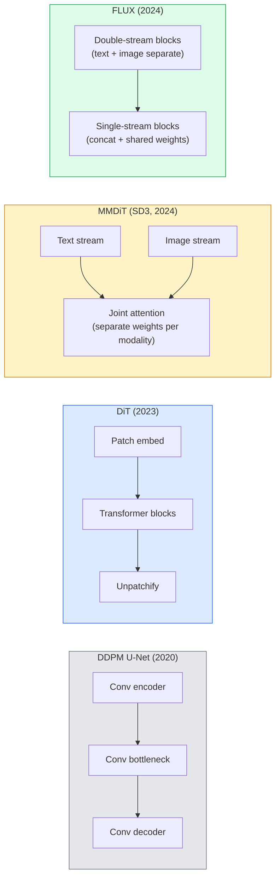

# प्रसारण ट्रांसफार्मर और सुधारित प्रवाह .

> यू-नेट विसारण का रहस्य नहीं है. इसे एक ट्रांसफार्मर के साथ बदलें, शोर कार्यक्रम को एक सीधी रेखा प्रवाह के लिए बदलें, और अचानक आपके पास एसडी3, फ्लुक्स, और प्रत्येक 2026 पाठ-से-छवि मॉडल है।

> **【中文解读】**यू-नेट नहीं है फैलाव मॉडल का रहस्य। ट्रांसफार्मर के साथ यू-नेट को बदलना, सीधे प्रवाह के साथ ध्वनि समायोजन को बदलना।

> **【拓展：DiT 是 2024-2026 的趋势】**डिफ्यूजन ट्रांसफार्मर (DiT) का ट्रांसफार्मर का可扩展性带入扩散模型──Sora(视频生成)、स्थिर डिफ्यूजन 3、FLUX 都采用DiT 架构── सुधारित प्रवाह

**Type:** Learn + Build | **类型:** 学习 + 动手
**Languages:** Python | **语言:** Python
**Prerequisites:** Phase 4 Lesson 10 (Diffusion DDPM), Phase 4 Lesson 14 (ViT), Phase 7 Lesson 02 (Self-Attention) | **前置知识:** Phase 4 Lesson 10（扩散 DDPM），Phase 4 Lesson 14（ViT），Phase 7 Lesson 02（自注意力）
**Time:** ~75 minutes | **时间:** ~75 分钟

## सीखने के लक्ष्य

- यू-नेट डीडीपीएम (पाठ 10) से डिफ्यूजन ट्रांसफार्मर (डीआईटी), एमएमडीआईटी (एसडी3) और सिंगल+डबल-स्ट्रीम डीआईटी (एफएलयूएक्स) तक विकास का पता लगाएं
- सुधारित प्रवाह की व्याख्या करेंः शोर और डेटा के बीच एक सीधी रेखा की प्रक्षेपवक्र में मॉडल 1000 के बजाय 20 चरणों में नमूना क्यों ले सकते हैं
- एक छोटी सी डीटी ब्लॉक और एक सुधारित प्रवाह प्रशिक्षण लूप को लागू करें, दोनों 100 लाइनों से कम
- वास्तुकला, पैरामीटर की गिनती और लाइसेंसिंग द्वारा मॉडल वेरिएंट (SD3, FLUX.1-dev, FLUX.1-schnell, Z-Image, Qwen-Image) को अलग करें

> **【中文解读】**सीखने के लक्ष्य इस कक्षा को पूरा करने के बाद जो मूल क्षमताएं होनी चाहिए, उन्हें सूचीबद्ध करते हैं।


## समस्या  समस्या परिचय

पाठ 10 ने यू-नेट डेनोइज़र के साथ एक डीडीपीएम बनाया। उस नुस्खा ने 2020-2023 में हावी कियाः यू-नेट + बीटा शेड्यूल + शोर-पूर्वानुमान हानि। इसने स्थिर विसार 1.5 और 2.1 और डेल-ई 2 का उत्पादन किया।

> कक्षा 10 यू-नेट के साथ डीडीपीएम का निर्माण किया गया। यह योजना 2020-2023 में प्रमुख थीः यू-नेट + बीटा 调度 + 噪音预测损失। यह स्थिर विसारण 1.5 और 2.1 तथा DALL-E 2 का उत्पादन किया।

प्रत्येक 2026 के अत्याधुनिक टेक्स्ट-टू-इमेज मॉडल ने इसे पार कर लिया है। स्थिर विसारण 3, FLUX, SD4, Z-Image, Qwen-Image, Hunyuan-Image  कोई भी यू-नेट का उपयोग नहीं करता है। वे विसारण ट्रांसफार्मर (DiT) का उपयोग करते हैं। SD3 और FLUX भी DDPM शोर कार्यक्रम को सही प्रवाह के लिए बदलते हैं, जो शोर से डेटा तक का रास्ता सीधा करता है और सुसंगतता या आसुत संस्करणों के साथ 1-4 चरण निष्कर्ष को सक्षम बनाता है।

> प्रत्येक 2026 के अग्रिम ग्रंथ-प्रतिमा मॉडल से पहले ही इसे पार कर चुके हैं। स्थिर विसारण 3、FLUX、SD4、Z-Image、Qwen-Image、Hunyuan-Image कोई यू-नेट का उपयोग नहीं करता है। वे विस्तारित ट्रांसफार्मर का उपयोग करते हैं।

बदलाव महत्वपूर्ण है क्योंकि यह कारण है कि विसारक आधारित छवि उत्पादन नियंत्रित, शीघ्र-सटीक (SD3/SD4 हल पाठ रेंडरिंग) और उत्पादन-तेज हो गया। डीटी + सुधारित प्रवाह को समझना 2026 जनरेटिव-इमेज स्टैक को समझना है।

> यह परिवर्तन महत्वपूर्ण है, क्योंकि यह विस्तारित छवि उत्पादन पर आधारित है जो नियंत्रण योग्य हो गया है।

## अवधारणा का मूल अवधारणा

> **【中文解读】**इस भाग में मूल अवधारणाओं और सिद्धांतों की आधारभूत जानकारी दी गई है। इन अवधारणाओं को प्राप्त करना बाद में होने वाली प्रक्रियाओं के लिए एक शर्त है।


### यू-नेट से ट्रांसफार्मर तक



- **DiT**(पीबल्स और Xie, 2023)  लटेंट पैच पर एक ViT-जैसे ट्रांसफार्मर के साथ यू-नेट की जगह लें। अनुकूलन परत मानदंड (AdaLN) के माध्यम से कंडीशनिंग।
  中文翻译:**DiT**(पीबल्स और Xie,2023) उद्लास ViT का ट्रांसफार्मर 替换 U-Net 处理潜变量补丁──通过自适应层归归一化(AdaLN) 进行条件化──
- **MMDiT**(SD3, Esser et al., 2024)  पाठ और छवि टोकन के लिए अलग वजन वाले दो धाराएं जो एक संयुक्त ध्यान साझा करती हैं।
  中文翻译:**MMDiT**(SD3,Esser आदि,2024)  दो धाराओं में से एक को पाठ और छवि टोकन को पुनः संसाधित करने का अधिकार है, साझा संयुक्त ध्यान।
- **FLUX**(ब्लैक फॉरेस्ट लैब्स, 2024)  पहले एन ब्लॉक एसडी3 की तरह डबल स्ट्रीम हैं, बाद के ब्लॉक उच्च गहराई पर दक्षता के लिए कॉनकेटेड और साझा वजन (सिंगल स्ट्रीम) हैं।
  中文翻译:**FLUX**(ब्लैक फॉरेस्ट लैब्स, 2024) 前 N 个块像 SD3 一样双流,后续块拼接并共享权重(单流) ताकि गहरे स्तर की दक्षता में सुधार हो सके──
- **Z-Image**(2025)  6B पैरामीटर पर एक कुशल एकल-प्रवाह डीटी जो "हर कीमत पर पैमाने" को चुनौती देता है।
  中文翻译:**Z-Image**(२०२५) ६० बिलियन सेमीमीटर के उच्च दक्षता वाले एकल प्रवाह को चुनौती देने के लिए "बचत लागत विस्तार" के विचार

### एक पैराग्राफ में सुधारित प्रवाह

डीडीपीएम आगे की प्रक्रिया को एक शोर SDE के रूप में परिभाषित करता है जहां `x_t`एक सीडीई के साथ एक हजार छोटे कदमों से हल किया गया है।

> डीडीपीएम को पूर्ववर्ती प्रक्रिया के रूप में परिभाषित किया जाएगा शोर के साथ-साथ सूक्ष्म अनुपात (SDE) ।`x_t`渐渐被损坏──学习到的反向是第二个SDE,通过1000小步求解──

सुधारित प्रवाह एक को परिभाषित करता है **straight-line**स्वच्छ डेटा और शुद्ध शोर के बीच अंतरालः

>  संपूर्ण प्रवाह शुद्ध डेटा और शुद्ध शोर के बीच परिभाषित करता है**直线**插值:

```
x_t = (1 - t) * x_0 + t * epsilon,     t in [0, 1]
```

गति का अनुमान लगाने के लिए एक नेटवर्क को प्रशिक्षित करें `v_theta(x_t, t) = epsilon - x_0` स्वच्छ डेटा से शोर तक सीधे मार्ग के साथ आगे की दिशा (`dx_t/dt`) नमूना लेने के दौरान, आप शोर से डेटा की ओर कदम उठाने के लिए इस गति को पीछे की ओर एकीकृत करते हैं। परिणामस्वरूप ओडीई एक सीधी रेखा के बहुत करीब है, इसलिए नमूना लेने के लिए कम एकीकरण चरणों की आवश्यकता होती है।

> 训练网络预测速度 `v_theta(x_t, t) = epsilon - x_0` शुद्ध डेटा से लेकर शोर के सीधा मार्ग पर अग्रिम दिशा में`dx_t/dt`)。 उदाहरण के लिए, ध्वनि से डेटा की ओर की गति को उलट करने के लिए, ओडीई को सीधे लाइन के करीब लाने की आवश्यकता होती है, इसलिए, उदाहरण के लिए, आवश्यक积分 चरणों की संख्या में भारी कमी होती है。

SD3 यह कहते हैं **Rectified Flow Matching**. FLUX, Z-Image और अधिकांश 2026 मॉडल एक ही उद्देश्य का उपयोग करते हैं। आम निष्कर्षः 20-30 Euler चरण (निर्धारक) बनाम 50+ DDIM चरण पुराने DDPM शासन में। डिस्टिल / टर्बो / त्वरण / LCM संस्करण इसे 1-4 चरणों तक कम करते हैं।

> SD3 को कहा जाएगा**整流流匹配**◊FLUX、Z-Image 和大多数 2026 साल मॉडल उपयोग एक ही लक्ष्य──典型推理:20-30 步 Euler(确定性) बनाम 旧 DDPM 方案 के 50+ 步 DDIM──蒸/turbo/schnell/LCM 变体降至1-4 步──

### एडाएलएन कंडीशनिंग

समय चरण और वर्ग/पाठ पर डीटी की स्थिति **adaptive layer norm**: भविष्यवाणी `scale`और `shift`U-Nets में FiLM शैली मॉड्यूलेशन और हर आधुनिक DiT में डिफ़ॉल्ट से बहुत साफ।

>  से**自适应层归一化**समय के लिए शर्तें और वर्ग/लेखः से शर्तें`scale`和 `shift`, LayerNorm 后应用―― U-Net में FiLM 风格调制更干净, प्रत्येक आधुनिक DiT का默认方案――

```
cond -> MLP -> (scale, shift, gate)
norm(x) * (1 + scale) + shift, then residual add * gate
```

### एसडी3 और फ्लुक्स में पाठ एन्कोडर

- **SD3**तीन पाठ एन्कोडर का उपयोग करता हैः दो CLIP मॉडल + T5-XXL। एम्बेडमेंट्स को कॉंकेटेड किया गया और पाठ कंडीशनिंग के रूप में छवि स्ट्रीम में डाला गया।
- **FLUX**एक CLIP-L + T5-XXL का उपयोग करता है।
- **Qwen-Image / Z-Image**वेरिएंट अपने मूल LLM के अनुरूप अपने स्वयं के इन-हाउस पाठ एन्कोडर का उपयोग करते हैं।

पाठ एन्कोडर एक बड़ा हिस्सा है क्यों SD3/FLUX कारण के बारे में संकेतों के बारे में बहुत बेहतर है SD1.5 से. T5-XXL अकेले 4.7B पैरामीटर है.

### वर्गीकरणकर्ता मुक्त मार्गदर्शन अभी भी लागू है

सुधारित प्रवाह नमूना बदलता है, न कि कंडीशनिंग। वर्गीकरण मुक्त मार्गदर्शन (प्रशिक्षण के दौरान 10% संभावना के साथ ड्रॉप पाठ, निष्कर्ष पर सशर्त और असीमित भविष्यवाणियों को मिलाएं) सुधारित प्रवाह के साथ समान रूप से काम करता है। अधिकांश 2026 मॉडल SD1.5 के 7.5 से कम 3.5-5  मार्गदर्शन पैमाने का उपयोग करते हैं क्योंकि सुधारित प्रवाह मॉडल डिफ़ॉल्ट रूप से अधिक सख्ती से संकेतों का पालन करते हैं।

### स्थिरता, टर्बो, शनेल, एलसीएम

एक ही विचार के लिए चार नामः धीमी गति से कई चरणों के मॉडल को तेजी से कुछ चरणों के मॉडल में डिस्टिल करें।

- **LCM (Latent Consistency Model)** एक छात्र को प्रशिक्षित करें जो अंतिम का अनुमान लगाता है `x_0`किसी भी मध्यवर्ती से `x_t`एक कदम में।
- **SDXL Turbo / FLUX schnell** 1-4 चरणों के मॉडल विरोधी विसारण डिस्टिलिशन के साथ प्रशिक्षित।
- **SD Turbo** लटेंट विसारण के लिए अनुकूलित ओपनएआई शैली के अनुरूपता मॉडल।

किसी भी नए मॉडल जहाजों का उत्पादन सेवा एक "पूर्ण गुणवत्ता" चेकपोस्ट और एक "टर्बो / त्वरित" संस्करण दोनों के साथ होता है। शनेल ("जर्मन में तेजी से", ब्लैक फॉरेस्ट लैब्स की सम्मेलन) 1-4 चरणों में चलता है और वास्तविक समय पाइपलाइनों में फिट बैठता है।

### 2026 में मॉडल परिदृश्य

| Model | Size | Architecture | License |
|-------|------|--------------|---------|
| Stable Diffusion 3 Medium | 2B | MMDiT | SAI Community |
| Stable Diffusion 3.5 Large | 8B | MMDiT | SAI Community |
| FLUX.1-dev | 12B | Double + Single Stream DiT | non-commercial |
| FLUX.1-schnell | 12B | same, distilled | Apache 2.0 |
| FLUX.2 | — | iterated FLUX.1 | mixed |
| Z-Image | 6B | S3-DiT (Scalable Single-Stream) | permissive |
| Qwen-Image | ~20B | DiT + Qwen text tower | Apache 2.0 |
| Hunyuan-Image-3.0 | ~80B | DiT | research |
| SD4 Turbo | 3B | DiT + distillation | SAI Commercial |

FLUX.1-schnell 2026 ओपन-सोर्स डिफ़ॉल्ट है। Z-Image दक्षता नेता है। FLUX.2 और SD4 वर्तमान गुणवत्ता युक्तियाँ हैं।

### इस चरण की बदलाव का महत्व क्यों है

डीडीपीएम + यू-नेट काम किया। डीटी + सुधारित प्रवाह काम करता है **better, faster, and scales more cleanly**. आरएनएन से एनएलपी में ट्रांसफार्मर तक के संक्रमण के समानांतरः दोनों वास्तुकलाओं ने एक ही समस्या को हल किया, लेकिन ट्रांसफार्मर पैमाने पर और अब हावी हैं। 2026 के प्रत्येक लेख में छवि, वीडियो या 3 डी पीढ़ी पर एक डीटी-आकार का डेनोइज़र और आमतौर पर एक सुधारित प्रवाह उद्देश्य का उपयोग किया जाता है। यू-नेट डीडीपीएम अब मुख्य रूप से शैक्षिक है (पाठ 10) ।

> डीडीपीएम + यू-नेट 可行──DiT + 整流流**更好、更快、扩展更干净**◊ यह परिवर्तन एनएलपी में आरएनएन से ट्रांसफार्मर के संक्रमण के समान हैः दो प्रकार के ढांचे ने एक ही समस्या को हल किया, लेकिन ट्रांसफार्मर और अधिक विस्तार योग्य और अंतिम रूप से प्रमुख है।

> **【拓展：工业部署中的视觉系统】**वास्तविक औद्योगिक तैनाती में, विज़ुअल मॉडल को देरी, मॉडल आकार, किनारे उपकरण अनुकूलन आदि की समस्या पर विचार करने की आवश्यकता होती है। टेन्सरआरटी, ओएनएनएक्स रनटाइम, ओपनवीनो एक सामान्य उपयोग में आने वाला सुझाव त्वरण उपकरण है।

> **【拓展：数据标注与质量】**视觉任务的效果高度依赖标签数据质量──标签工作室、CVAT是主流标签工具──在工业场景中,主动学习(Active Learning) ले标签成本 को कम कर सकता हैः मॉडल अनिश्चित नमूना अनुरोधों के लिए कृत्रिम标签, अनिश्चितता के नमूने स्वचालित标签──


## इसे बनाओ, इसे पूरा करो।

> **【中文解读】**इस भाग के माध्यम से कोड को शून्य से लागू किया जा सकता है कोर एल्गोरिदम। इस तरह के "शुरुआत से" तरीके से फ्रेमवर्क के पीछे के सिद्धांत को समझने में मदद मिलेगी, समस्याओं का सामना करते समय ब्लैक बॉक्स में फंस नहीं जाएगा।

```figure
cv3-rectified-flow
```

## इसे बनाओ

### चरण 1: AdaLN के साथ एक DiT ब्लॉक

```python
import torch
import torch.nn as nn


class AdaLNZero(nn.Module):
    """
    Adaptive LayerNorm with a gate. Predicts (scale, shift, gate) from the conditioning.
    Init such that the whole block starts as identity ("zero init").
    """

    def __init__(self, dim, cond_dim):
        super().__init__()
        self.norm = nn.LayerNorm(dim, elementwise_affine=False)
        self.mlp = nn.Linear(cond_dim, dim * 3)
        nn.init.zeros_(self.mlp.weight)
        nn.init.zeros_(self.mlp.bias)

    def forward(self, x, cond):
        scale, shift, gate = self.mlp(cond).chunk(3, dim=-1)
        h = self.norm(x) * (1 + scale.unsqueeze(1)) + shift.unsqueeze(1)
        return h, gate.unsqueeze(1)


class DiTBlock(nn.Module):
    def __init__(self, dim=192, heads=3, mlp_ratio=4, cond_dim=192):
        super().__init__()
        self.adaln1 = AdaLNZero(dim, cond_dim)
        self.attn = nn.MultiheadAttention(dim, heads, batch_first=True)
        self.adaln2 = AdaLNZero(dim, cond_dim)
        self.mlp = nn.Sequential(
            nn.Linear(dim, dim * mlp_ratio),
            nn.GELU(),
            nn.Linear(dim * mlp_ratio, dim),
        )

    def forward(self, x, cond):
        h, gate1 = self.adaln1(x, cond)
        a, _ = self.attn(h, h, h, need_weights=False)
        x = x + gate1 * a
        h, gate2 = self.adaln2(x, cond)
        x = x + gate2 * self.mlp(h)
        return x
```

`AdaLNZero`प्रशिक्षण पहचान से ब्लॉक को दूर धकेलता है; यह गहराई से ट्रांसफार्मर विसारण मॉडल को नाटकीय रूप से स्थिर करता है।

### चरण 2: एक छोटी सी डीआईटी

```python
def timestep_embedding(t, dim):
    import math
    half = dim // 2
    freqs = torch.exp(-math.log(10000) * torch.arange(half, device=t.device) / half)
    args = t[:, None].float() * freqs[None]
    return torch.cat([args.sin(), args.cos()], dim=-1)


class TinyDiT(nn.Module):
    def __init__(self, image_size=16, patch_size=2, in_channels=3, dim=96, depth=4, heads=3):
        super().__init__()
        self.patch_size = patch_size
        self.num_patches = (image_size // patch_size) ** 2
        self.patch = nn.Conv2d(in_channels, dim, kernel_size=patch_size, stride=patch_size)
        self.pos = nn.Parameter(torch.zeros(1, self.num_patches, dim))
        self.time_mlp = nn.Sequential(
            nn.Linear(dim, dim * 2),
            nn.SiLU(),
            nn.Linear(dim * 2, dim),
        )
        self.blocks = nn.ModuleList([DiTBlock(dim, heads, cond_dim=dim) for _ in range(depth)])
        self.norm_out = nn.LayerNorm(dim, elementwise_affine=False)
        self.head = nn.Linear(dim, patch_size * patch_size * in_channels)

    def forward(self, x, t):
        n = x.size(0)
        x = self.patch(x)
        x = x.flatten(2).transpose(1, 2) + self.pos
        t_emb = self.time_mlp(timestep_embedding(t, self.pos.size(-1)))
        for blk in self.blocks:
            x = blk(x, t_emb)
        x = self.norm_out(x)
        x = self.head(x)
        return self._unpatchify(x, n)

    def _unpatchify(self, x, n):
        p = self.patch_size
        h = w = int(self.num_patches ** 0.5)
        x = x.view(n, h, w, p, p, -1).permute(0, 5, 1, 3, 2, 4).reshape(n, -1, h * p, w * p)
        return x
```

### चरण 3: सुधारित प्रवाह प्रशिक्षण

```python
import torch.nn.functional as F

def rectified_flow_train_step(model, x0, optimizer, device):
    model.train()
    x0 = x0.to(device)
    n = x0.size(0)
    t = torch.rand(n, device=device)
    epsilon = torch.randn_like(x0)
    x_t = (1 - t[:, None, None, None]) * x0 + t[:, None, None, None] * epsilon

    target_velocity = epsilon - x0
    pred_velocity = model(x_t, t)

    loss = F.mse_loss(pred_velocity, target_velocity)
    optimizer.zero_grad()
    loss.backward()
    optimizer.step()
    return loss.item()
```

डीडीपीएम के शोर-पूर्वानुमान हानि (पाठ 10) की तुलना करेंः एक ही संरचना, अलग लक्ष्य। शोर की भविष्यवाणी करने के बजाय `epsilon`, हम भविष्यवाणी करते हैं **velocity** `epsilon - x_0`, जो डेटा से ध्वनि को सीधे रेखा अंतराल के साथ इंगित करता है।

### चरण 4: एयूलर नमूना

सुधारित प्रवाह एक ओडीई है। यूलर की विधि सबसे सरल है और, एक अच्छी तरह से प्रशिक्षित सुधारित प्रवाह मॉडल के लिए, 20+ चरणों पर उच्च-क्रम के समाधानों के समान ही सटीक है।

```python
@torch.no_grad()
def rectified_flow_sample(model, shape, steps=20, device="cpu"):
    model.eval()
    x = torch.randn(shape, device=device)
    dt = 1.0 / steps
    t = torch.ones(shape[0], device=device)
    for _ in range(steps):
        v = model(x, t)
        x = x - dt * v
        t = t - dt
    return x
```

20 चरणों पर एक प्रशिक्षित मॉडल पर यह 1000 चरणों के डीडीपीएम के समान नमूने उत्पन्न करता है।

### चरण 5: अंत-से-अंत धुएं परीक्षण

```python
import numpy as np

def synthetic_blobs(num=200, size=16, seed=0):
    rng = np.random.default_rng(seed)
    out = np.zeros((num, 3, size, size), dtype=np.float32)
    yy, xx = np.meshgrid(np.arange(size), np.arange(size), indexing="ij")
    for i in range(num):
        cx, cy = rng.uniform(4, size - 4, size=2)
        r = rng.uniform(2, 4)
        mask = (xx - cx) ** 2 + (yy - cy) ** 2 < r ** 2
        colour = rng.uniform(-1, 1, size=3)
        for c in range(3):
            out[i, c][mask] = colour[c]
    return torch.from_numpy(out)
```

> **【中文解读】**इस भाग में दिखाया गया है कि इस तकनीक को कैसे तेजी से लागू किया जाए। इस प्रकार के एक परिपक्व ढांचे का उपयोग करके बग कम किए जा सकते हैं और विकास दक्षता में सुधार किया जा सकता है।


ट्रेन ए `TinyDiT`500 कदम के बाद, नमूना आउटपुट रंग के हल्के धब्बे की तरह दिखना चाहिए।


> **【拓展：视觉模型的持续学习】**उत्पादन वातावरण में, दृश्य मॉडल को नए डेटा को लगातार अनुकूलित करने की आवश्यकता होती है। यह ऑटोमोटिव ड्राइविंग और औद्योगिक गुणवत्ता जांच में विशेष रूप से महत्वपूर्ण है।

## इसे फ्रेमवर्क के साथ लागू करें

FLUX / SD3 / Z-Image के साथ वास्तविक छवि निर्माण के लिए, `diffusers`एक एकीकृत एपीआई के साथ जहाजों में से प्रत्येकः

```python
from diffusers import FluxPipeline, StableDiffusion3Pipeline
import torch

pipe = FluxPipeline.from_pretrained(
    "black-forest-labs/FLUX.1-schnell",
    torch_dtype=torch.bfloat16,
).to("cuda")

out = pipe(
    prompt="a golden retriever surfing a tsunami, hyperrealistic, studio lighting",
    guidance_scale=0.0,           # schnell was trained without CFG
    num_inference_steps=4,
    max_sequence_length=256,
).images[0]
out.save("surf.png")
```

तीन पंक्तियों।`FLUX.1-schnell`चार चरणों में. मॉडल आईडी के लिए स्विच करें `black-forest-labs/FLUX.1-dev`सीएफजी के साथ 20-30 चरणों पर उच्च गुणवत्ता के लिए।

SD3 के लिएः

> **【中文解读】**इस खंड में इस बात पर ध्यान दिया गया है कि मॉडल को उपलब्ध उत्पादों के रूप में कैसे तैनात किया जाए। मूल से लेकर उत्पादन स्तर तक, प्रदर्शन अनुकूलन, त्रुटि प्रसंस्करण, निगरानी आदि के कई आयामों पर विचार करने की आवश्यकता है।


```python
pipe = StableDiffusion3Pipeline.from_pretrained(
    "stabilityai/stable-diffusion-3.5-large",
    torch_dtype=torch.bfloat16,
).to("cuda")
out = pipe(prompt, guidance_scale=3.5, num_inference_steps=28).images[0]
```


## इसे भेजें उत्पाद

> **【中文解读】**练习题按照易/中级/难度递进;;建议至少完成中级题,Hard级适合深入研究或面试准备;;


इस पाठ से उत्पन्न होता हैः

- `outputs/prompt-dit-model-picker.md` गुणवत्ता, विलंबता और लाइसेंस प्रतिबंधों के कारण SD3, FLUX.1-dev, FLUX.1-schnell, Z-Image, SD4 Turbo के बीच विकल्प।
- `outputs/skill-rectified-flow-trainer.md` AdaLN DiT और Euler नमूनाकरण के साथ सही प्रवाह के लिए एक पूर्ण प्रशिक्षण लूप लिखता है।

## अभ्यास विषय

1. **(Easy)**सिंथेटिक ब्लोब डेटासेट पर ऊपर के TinyDiT को 500 चरणों तक प्रशिक्षित करें। 10, 20, और 50 Euler चरणों के साथ उत्पादित नमूनों की तुलना करें।
2. **(Medium)**पाठ को अनुकूलित करने के लिए एक सीखा वर्ग एम्बेडिंग को समय एम्बेडिंग के साथ जोड़ें (10 रंग के अनुसार "वर्ग" ब्लेब) वर्ग 0, 5 और 9 के साथ नमूना और रंग मेल खाने की पुष्टि करें।
3. **(Hard)**एक ही आकार के नेटवर्क के ठीक-फ्लो और DDPM संस्करणों से उत्पन्न नमूनों के बीच एक ही संख्या में चरणों के लिए एक ही डेटा पर प्रशिक्षित फ्रेचेट दूरी (FID प्रॉक्सी) की गणना करें। रिपोर्ट जो तेजी से अभिसरण करती है।

> **【中文解读】**术语表中的"क्या लोग कहते हैं" बनाम "क्या वास्तव में इसका मतलब है" 区分日常口语和精确技术含义──在团队协作中,统一术语定义可以避免大量沟通误解──


## कीवर्ड्स  शब्द खोज तालिका

| Term | What people say | What it actually means |
|------|----------------|----------------------|
| DiT | "Diffusion transformer" | Transformer that replaces the U-Net as the diffusion denoiser; operates on patchified latents |
| AdaLN | "Adaptive layer norm" | Timestep/text conditioning via learned scale, shift, gate applied after LayerNorm; standard in every modern DiT |
| MMDiT | "Multi-modal DiT (SD3)" | Separate weight streams for text and image tokens that share a joint self-attention |
| Single-stream / double-stream | "FLUX trick" | First N blocks double-stream (separate weights per modality), later blocks single-stream (concat + shared weights) for efficiency |
| Rectified flow | "Straight-line noise-to-data" | Linear interpolation between data and noise; network predicts velocity; fewer ODE steps needed at inference |
| Velocity target | "epsilon - x_0" | The regression target in rectified flow; points from clean data to noise |
| CFG guidance | "classifier-free guidance" | Mix conditional and unconditional predictions; still used in rectified-flow models |
| Schnell / turbo / LCM | "1-4 step distillation" | Small-step variants distilled from full-quality models; production real-time |

> **【中文解读】**延伸阅读 प्रदान करता है गहन सीखने के लिए उच्च गुणवत्ता वाले संसाधनों। ये लेख और पाठ्यक्रम इस क्षेत्र के लिए क्लासिक संदर्भ हैं, जो गहन समझ की आवश्यकता वाले पाठकों के लिए उपयुक्त हैं।


## आगे पढ़ना 延伸閱讀

- [Scalable Diffusion Models with Transformers (Peebles & Xie, 2023)](https://arxiv.org/abs/2212.09748) डीआईटी पेपर
- [Scaling Rectified Flow Transformers (Esser et al., SD3 paper)](https://arxiv.org/abs/2403.03206) MMDiT और पैमाने पर सुधारित प्रवाह
- [FLUX.1 model card and technical report (Black Forest Labs)](https://huggingface.co/black-forest-labs/FLUX.1-dev) डबल + सिंगल स्ट्रीम विवरण
- [Z-Image: Efficient Image Generation Foundation Model (2025)](https://arxiv.org/html/2511.22699v1) 6B पर एकल प्रवाह डीआईटी
- [Elucidating the Design Space of Diffusion (Karras et al., 2022)](https://arxiv.org/abs/2206.00364) प्रत्येक विसारण डिजाइन व्यापार-बंद के लिए संदर्भ
- [Latent Consistency Models (Luo et al., 2023)](https://arxiv.org/abs/2310.04378) LCM- LoRA आपको 4- चरण का निष्कर्ष कैसे देता है
