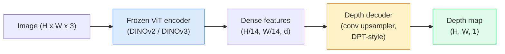

# मोनोकुलर गहराई और ज्यामिति अनुमान

> एक गहराई का नक्शा एक एकल-चैनल छवि है जहां प्रत्येक पिक्सेल कैमरे से दूरी है। इसे एक आरजीबी फ्रेम से भविष्यवाणी करना स्टीरियो या लिडर के बिना असंभव था। 2026 में एक जमे हुए वीआईटी एन्कोडर प्लस एक हल्के सिर जमीन की सच्चाई के कुछ प्रतिशत के भीतर हो जाता है।

> **【中文解读】**गहनता रेखाचित्र एक एकल-मार्ग छवि है, प्रत्येक छवि का मूल्य एक छवि की दूरी को दर्शाता है। एक एकल-चेंग आरजीबी छवि पूर्वानुमान गहनता को पहले असंभव माना जाता था।

> **【拓展：深度估计的应用】**单目深度估计在自动驾驶 (自动驾驶) 补充 LiDAR) AR/VR (场景理解) 机器人导航、3D 照片效果) 背景虚化 (背景虚化)  में महत्वपूर्ण अनुप्रयोगों में शामिल हैं।

**Type:** Build + Use | **类型:** 动手 + 应用
**Languages:** Python | **语言:** Python
**Prerequisites:** Phase 4 Lesson 14 (ViT), Phase 4 Lesson 17 (Self-Supervised Vision), Phase 4 Lesson 07 (U-Net) | **前置知识:** Phase 4 Lesson 14（ViT），Phase 4 Lesson 17（自监督视觉），Phase 4 Lesson 07（U-Net）
**Time:** ~60 minutes | **时间:** ~60 分钟

## सीखने के लक्ष्य

- सापेक्ष और मीट्रिक गहराई और स्थिति को अलग करें जो प्रत्येक उत्पादन मॉडल (MiDaS, Marigold, Depth Anything V3, ZoeDepth) हल करता है
- बिना माप के मनमाने एकल छवियों के लिए गहराई का अनुमान लगाने के लिए गहराई कुछ भी V3 (DINOv2 रीढ़ की हड्डी) का उपयोग करें
- स्पष्ट करें कि एक ही छवि (प्रदर्शनीय संकेत, बनावट ग्रेडिएंट, सीखे गए पूर्व) से मोनोकुलर गहराई क्यों काम करती है और यह क्या नहीं बहाल कर सकती है (मूर्त पैमाने, अछूता ज्यामिति)
- गहिराई मानचित्र और पिनहोल कैमरा अंतर्निहित का उपयोग करके 2D डिटेक्शन को 3D बिंदुओं पर ले जाएं

> **【中文解读】**सीखने के लक्ष्य इस कक्षा को पूरा करने के बाद जो मूल क्षमताएं होनी चाहिए, उन्हें सूचीबद्ध करते हैं।


## समस्या  समस्या परिचय

गहराई 2 डी कंप्यूटर विजन में गायब अक्ष है। आरजीबी को देखते हुए, आप जानते हैं कि छवि विमान में चीजें कहां दिखाई देती हैं; आप नहीं जानते कि वे कितनी दूर हैं। गहराई सेंसर (स्टीरियो रिग, लिडर, उड़ान समय) इसे सीधे हल करते हैं लेकिन महंगे, नाजुक और सीमा में सीमित हैं।

> गहरीता 2D कंप्यूटर विज़ुअल में अनुपस्थित धुरी है। RGB दिए गए, आप जानते हैं कि वस्तुएं छवि सतह पर स्थित हैं; आप नहीं जानते कि वे कितनी दूर हैं।

मोनोकुलर गहराई अनुमान  एक आरजीबी फ्रेम से गहराई की भविष्यवाणी  धुंधला, अविश्वसनीय आउटपुट उत्पन्न करने के लिए उपयोग किया जाता है। 2026 तक बड़े पूर्व प्रशिक्षित एन्कोडरों ने यह बदल दियाः गहराई कुछ भी V3 एक जमे हुए DINOv2 रीढ़ का उपयोग करता है और गहराई के नक्शे का उत्पादन करता है जो इनडोर, आउटडोर, चिकित्सा और उपग्रह डोमेन में सामान्य हो जाते हैं। मैरिगोल्ड ने गहराई को एक सशर्त विसारण समस्या के रूप में पुनः तैयार किया है। ZoeDepth वास्तविक मीट्रिक दूरी को पीछे हटता है।

>                                                                                                                                                                                                                                                               

गहराई 2D डिटेक्शन और 3D समझ के बीच का पुल भी है: एक डिटेक्टेड बॉक्स के पिक्सल को गहराई से गुणा करें और आप 2D ऑब्जेक्ट को 3D बिंदु बादल में उठाएंगे। यह हर एआर ऑक्ल्यूशन सिस्टम का मूल है, हर बाधा-अवरोध पाइपलाइन, और हर "कप उठाएं" रोबोट।

> गहराई भी 2D जांच और 3D समझ के बीच की पुल हैः जांच की गई फ्रेम के चित्र को गहराई से गुणा करना, आप 2D वस्तुओं को 3D बिंदु तक बढ़ा सकते हैं।

## अवधारणा का मूल अवधारणा

> **【中文解读】**इस भाग में मूल अवधारणाओं और सिद्धांतों की आधारभूत जानकारी दी गई है। इन अवधारणाओं को प्राप्त करना बाद में होने वाली प्रक्रियाओं के लिए एक शर्त है।


### सापेक्ष बनाम मीट्रिक गहराई

- **Relative depth** आदेश दिया `z`वास्तविक दुनिया की इकाई के बिना मान। "पिक्सेल ए पिक्सेल बी से करीब है, लेकिन दूरी का अनुपात मीटर से लंगड़ा नहीं है। "
  中文翻译:**相对深度** क्रमबद्ध `z`值,没有真实世界单位──"像素 A比像素 B近, लेकिन दूरी अनुपात 不定到米──"
- **Metric depth** कैमरे से मीटर में पूर्ण दूरी। मॉडल को छवि संकेतों और वास्तविक दूरी के बीच सांख्यिकीय संबंध सीखना चाहिए।
  中文翻译:**度量深度** फ़ैमेज से निकलती हुई निरपेक्ष दूरी (अ)  से                                                                                                                                                                                                                                                      

MiDaS और Depth Anything V3 सापेक्ष गहराई का उत्पादन करते हैं। Marigold सापेक्ष गहराई का उत्पादन करता है। ZoeDepth, UniDepth और Metric3D मीट्रिक गहराई का उत्पादन करते हैं। मीट्रिक मॉडल कैमरा अंतर्निहित के प्रति संवेदनशील हैं; सापेक्ष मॉडल नहीं हैं।

> MiDaS तथा गहराई कुछ भी V3  उत्पन्न करने के लिए गहराई के सापेक्ष है──Marigold  उत्पन्न करने के लिए गहराई के सापेक्ष है──ZoeDeepth、UniDepth 和 Metric3D  उत्पन्न करने के लिए गहराई का माप करें── माप मॉडल के लिए संवेदनशील है;

### एन्कोडर-डेकोडर पैटर्न



गहराई कुछ भी V3 एन्कोडर को फ्रीज करता है और केवल डीपीटी-शैली के डिकोडर को प्रशिक्षित करता है। एन्कोडर समृद्ध सुविधाएं प्रदान करता है; डिकोडर उन्हें छवि रिज़ॉल्यूशन तक वापस इंटरपोल करता है और गहराई को पीछे छोड़ देता है।

> गहराई कुछ भी V3 结编码器, केवल प्रशिक्षण DPT 风格的解码器──编码器 प्रदान समृद्ध विशेषताएं;解码器 उन्हें चित्रण रिज़ॉल्यूशन में वापस घुमाएगा और गहराई में वापस लौटाएगा──

### क्यों एक ही छवि गहराई पैदा करती है

2D छवि में कई मोनोकुलर संकेत होते हैं जो गहराई से संबंधित होते हैंः

> एक 2D छवि में गहराई से संबंधित कई एकल दृश्य संकेत शामिल हैंः

- **Perspective** 3D में समानांतर रेखाएं 2D में अभिसरण करती हैं।
  中文翻译:**透视**3D के मध्य में समपातिक रेखाएँ 2D के मध्य में汇聚
- **Texture gradient** दूर की सतहों में छोटे, घने बनावट होती है।
  中文翻译:**纹理梯度** दूर के सतह के बनावट अधिक छोटे अधिक घनिष्ठ
- **Occlusion order** निकटतम वस्तुओं से दूर की वस्तुएं अवरुद्ध होती हैं।
  中文翻译:**遮挡顺序** निकट वस्तुएं  दूर वस्तुओं  छिपाएँ
- **Size constancy** ज्ञात वस्तुओं (कार, मनुष्य) अनुमानित पैमाने देते हैं।
  中文翻译:**大小恒常性** ज्ञात वस्तुओं (~ ∼)  लगभग आकार प्रदान करते हैं
- **Atmospheric perspective** दूर की वस्तुएं बाहरी दृश्यों में धुंधली और नीली दिखाई देती हैं।
  中文翻译:**大气透视** दूरस्थ वस्तुएं बाहरी दृश्यों में अधिक से अधिक नीली दिखाई देती हैं

एक वीआईटी अरबों छवियों पर प्रशिक्षित इन संकेतों को आंतरिक रूप से एकीकृत करता है पर्याप्त डेटा और एक मजबूत रीढ़ की हड्डी के साथ, मोनोकुलर गहराई किसी स्पष्ट 3 डी पर्यवेक्षण के बिना उचित सटीकता तक पहुंचती है।

> अरबों चित्रों पर प्रशिक्षित वीटी इन संकेतों को एकीकृत करेगा। पर्याप्त डेटा और मजबूत अस्थि संरचना के साथ, किसी भी स्पष्ट 3 डी निगरानी की आवश्यकता नहीं है।

### मोनोकुलर गहराई क्या नहीं कर सकती

- **Absolute metric scale**नेटवर्क यह जानने के बिना कि कप 1 मीटर या 10 मीटर दूर है, "कप के रूप में दो बार दूर है" भविष्यवाणी कर सकता है।
- **Occluded geometry** कुर्सी का पीठ अदृश्य है और इसे विश्वसनीय रूप से अनुमान नहीं लगाया जा सकता है।
- **Truly untextured / reflective surfaces** दर्पण, ग्लास, समान दीवारें। नेटवर्क विश्वसनीय लेकिन गलत गहराई रिपोर्ट करता है।

### 2026 में गहराई कुछ भी V3

- वैनिला DINOv2 ViT-L/14 को एन्कोडर के रूप में (मुस्कृत) ।
- डीपीटी डिकोडर।
- विभिन्न स्रोतों से प्रस्तुत चित्र जोड़े पर प्रशिक्षित (फोटोमेट्रिक स्थिरता के अलावा स्पष्ट गहराई पर्यवेक्षण की आवश्यकता नहीं है) ।
-  से स्थानिक रूप से सुसंगत ज्यामिति भविष्यवाणी करता है**an arbitrary number of visual inputs, with or without known camera poses**. .
- मोनोकुलर गहराई, किसी भी दृश्य ज्यामिति, दृश्य रेंडरिंग, कैमरा पोज़ अनुमान।

यह 2026 में गहराई की जरूरत होने पर कॉल करने के लिए ड्रॉप-इन मॉडल है।

> यह 2026 में आप गहराई से जरूरत है जब सीधे अनुकूलन मॉडल है।

### गहराई के लिए मैरिगोल्ड  विसारण

मैरिगोल्ड (के एट अल, सीवीपीआर 2024) ने गहराई अनुमान को सशर्त छवि-से-छवि प्रसार के रूप में फिर से तैयार किया। कंडीशनिंगः आरजीबी। लक्ष्यः गहराई का नक्शा। रीढ़ के रूप में पूर्व प्रशिक्षित स्थिर विसार 2 यू-नेट का उपयोग करता है। आउटपुट गहराई के नक्शे वस्तु सीमाओं पर असाधारण रूप से तेज हैं। व्यापार-ऑफः फीड-फॉरवर्ड मॉडल (10-50 चरणों को अस्वीकार करने वाले) की तुलना में धीमा अनुमान।

> Marigold(Ke 等,CVPR 2024) को गहराई अनुमान पुनः ढांचा के लिए चित्र के विस्तार की स्थिति में चित्रों को पुनः ढांचा प्रदान करेगा।

### अंतर्निहित और पिनहोल कैमरा

एक पिक्सेल उठाने के लिए `(u, v)`गहराई से`d`एक 3D बिंदु पर `(X, Y, Z)`कैमरा निर्देशांक मेंः

```
fx, fy, cx, cy = camera intrinsics
X = (u - cx) * d / fx
Y = (v - cy) * d / fy
Z = d
```

अंतर्निहित वस्तुएं EXIF मेटाडेटा, एक माप पैटर्न, या एक मोनोकुलर अंतर्निहित अनुमानक (प्रोस्पेक्टिव फील्ड्स, यूनिडीपथ) से आती हैं। अंतर्निहित वस्तुओं के बिना, आप अभी भी 60-70 डिग्री FOV और मध्यम-रिज़ॉल्यूशन सिद्धांतों को मानकर एक बिंदु बादल को प्रस्तुत कर सकते हैं  दृश्य के लिए उपयोग करने योग्य, माप के लिए नहीं।

### मूल्यांकन

दो मानक माप:

- **AbsRel**(मूर्त सापेक्ष त्रुटि): `mean(|d_pred - d_gt| / d_gt)`. कम बेहतर है. उत्पादन मॉडल के लिए 0.05-0.1।
- **delta < 1.25**(तारे की सटीकता): पिक्सल का अंश जहां `max(d_pred/d_gt, d_gt/d_pred) < 1.25`. उच्च बेहतर है. 0.9 + SOTA के लिए.

सापेक्ष गहराई (गहनता कुछ भी V3, MiDaS) के लिए, मूल्यांकन दोनों मीट्रिक के पैमाने और शिफ्ट अपरिवर्तित संस्करणों का उपयोग करता है।

> **【中文解读】**इस भाग के माध्यम से कोड को शून्य से लागू किया जा सकता है कोर एल्गोरिदम। इस तरह के "शुरुआत से" तरीके से फ्रेमवर्क के पीछे के सिद्धांत को समझने में मदद मिलेगी, समस्याओं का सामना करते समय ब्लैक बॉक्स में फंस नहीं जाएगा।

> **【拓展：工业部署中的视觉系统】**वास्तविक औद्योगिक तैनाती में, विज़ुअल मॉडल को देरी, मॉडल आकार, किनारे उपकरण अनुकूलन आदि की समस्या पर विचार करने की आवश्यकता होती है। टेन्सरआरटी, ओएनएनएक्स रनटाइम, ओपनवीनो एक सामान्य उपयोग में आने वाला सुझाव त्वरण उपकरण है।

> **【拓展：数据标注与质量】**视觉任务的效果高度依赖标签数据质量──标签工作室、CVAT是主流标签工具──在工业场景中,主动学习(Active Learning) ले标签成本 को कम कर सकता हैः मॉडल अनिश्चित नमूना अनुरोधों के लिए कृत्रिम标签, अनिश्चितता के नमूने स्वचालित标签──


## इसे बनाओ, इसे पूरा करो।
```figure
depth-sweep
```

## इसे बनाओ

### चरण 1: गहराई मीट्रिक

```python
import torch

def abs_rel_error(pred, target, mask=None):
    if mask is not None:
        pred = pred[mask]
        target = target[mask]
    return (torch.abs(pred - target) / target.clamp(min=1e-6)).mean().item()


def delta_accuracy(pred, target, threshold=1.25, mask=None):
    if mask is not None:
        pred = pred[mask]
        target = target[mask]
    ratio = torch.maximum(pred / target.clamp(min=1e-6), target / pred.clamp(min=1e-6))
    return (ratio < threshold).float().mean().item()
```

मूल्यांकन से पहले हमेशा अमान्य गहराई पिक्सल (शून्य, NaN, संतृप्त) को मास्क करें।

### चरण 2: स्केल-एंड-शिफ्ट संरेखण

अपेक्षाकृत गहराई वाले मॉडल के लिए, गणना मेट्रिक्स से पहले भविष्यवाणी को आधारभूत सत्य के साथ संरेखित करें।`a * pred + b = target`:

```python
def align_scale_shift(pred, target, mask=None):
    if mask is not None:
        p = pred[mask]
        t = target[mask]
    else:
        p = pred.flatten()
        t = target.flatten()
    A = torch.stack([p, torch.ones_like(p)], dim=1)
    coeffs, *_ = torch.linalg.lstsq(A, t.unsqueeze(-1))
    a, b = coeffs[:2, 0]
    return a * pred + b
```

दौड़ें`align_scale_shift`पहले`abs_rel_error`MiDaS/ Depth Anything का मूल्यांकन करते समय।

### चरण 3: गहरी गहराई को बिंदु बादल तक ले जाएं

```python
import numpy as np

def depth_to_point_cloud(depth, intrinsics):
    H, W = depth.shape
    fx, fy, cx, cy = intrinsics
    v, u = np.meshgrid(np.arange(H), np.arange(W), indexing="ij")
    z = depth
    x = (u - cx) * z / fx
    y = (v - cy) * z / fy
    return np.stack([x, y, z], axis=-1)


depth = np.random.uniform(0.5, 4.0, (240, 320))
intr = (320.0, 320.0, 160.0, 120.0)
pc = depth_to_point_cloud(depth, intr)
print(f"point cloud shape: {pc.shape}  (H, W, 3)")
```

एक फ़ंक्शन, प्रत्येक 3 डी-लिफ्ट अनुप्रयोग. बिंदु बादल निर्यात करने के लिए`.ply`और मेशलैब या क्लाउड कंपारे में खोलें।

### चरण 4: सिंथेटिक गहराई दृश्य के साथ धुआं परीक्षण

```python
def synthetic_depth(size=96):
    yy, xx = np.meshgrid(np.arange(size), np.arange(size), indexing="ij")
    # Floor: linear gradient from near (top) to far (bottom)
    depth = 1.0 + (yy / size) * 4.0
    # Box in the middle: closer
    mask = (np.abs(xx - size / 2) < size / 6) & (np.abs(yy - size * 0.6) < size / 6)
    depth[mask] = 2.0
    return depth.astype(np.float32)


gt = torch.from_numpy(synthetic_depth(96))
pred = gt + 0.3 * torch.randn_like(gt)  # simulated prediction
aligned = align_scale_shift(pred, gt)
print(f"before align  absRel = {abs_rel_error(pred, gt):.3f}")
print(f"after align   absRel = {abs_rel_error(aligned, gt):.3f}")
```

### चरण 5: गहराई कुछ भी V3 उपयोग (संदर्भ)

```python
import torch
from transformers import pipeline
from PIL import Image

pipe = pipeline(task="depth-estimation", model="LiheYoung/depth-anything-v2-large")

image = Image.open("street.jpg").convert("RGB")
out = pipe(image)
depth_np = np.array(out["depth"])
```

> **【中文解读】**इस भाग में दिखाया गया है कि इस तकनीक को कैसे तेजी से लागू किया जाए। इस प्रकार के एक परिपक्व ढांचे का उपयोग करके बग कम किए जा सकते हैं और विकास दक्षता में सुधार किया जा सकता है।


तीन पंक्तियों।`out["depth"]`एक पीआईएल ग्रे स्केल है; गणित के लिए numpy में परिवर्तित करें. गहराई कुछ भी V3 के लिए विशेष रूप से, मॉडल आईडी एक बार जारी किया गया है के लिए स्विच; एपीआई अपरिवर्तित है।


> **【拓展：视觉模型的持续学习】**उत्पादन वातावरण में, दृश्य मॉडल को नए डेटा को लगातार अनुकूलित करने की आवश्यकता होती है। यह ऑटोमोटिव ड्राइविंग और औद्योगिक गुणवत्ता जांच में विशेष रूप से महत्वपूर्ण है।

## इसे फ्रेमवर्क के साथ लागू करें

- **Depth Anything V3**(मेटा एआई / बाइटडेंस, 2024-2026)  सापेक्ष गहराई के लिए डिफ़ॉल्ट। उत्पादन में सबसे तेज़ ViT-बड़े रीढ़ की हड्डी मॉडल।
- **Marigold**(ETH, 2024)  उच्चतम दृश्य गुणवत्ता, धीमा अनुमान।
- **UniDepth**(ETH, 2024)  कैमरा अंतर्निहित अनुमान के साथ मीट्रिक गहराई।
- **ZoeDepth**(इंटेल, 2023)  मीट्रिक गहराई; पुरानी, अभी भी विश्वसनीय।
- **MiDaS v3.1** विरासत लेकिन स्थिर; तुलना के लिए अच्छा आधार।

विशिष्ट समावेशन पैटर्नः

1. आरजीबी फ्रेम आता है.
2. गहराई मॉडल गहराई का नक्शा बनाता है।
3. डिटेक्टर बॉक्स बनाता है।
4. 3D में गहराई से लिफ्ट बॉक्स सेंट्रोइड्स; उपलब्ध होने पर बिंदु बादल के साथ विलय करें।
5. डाउनस्ट्रीम: एआर अवरुद्ध, पथ नियोजन, वस्तु आकार अनुमान, स्टीरियो प्रतिस्थापन।

> **【中文解读】**इस खंड में इस बात पर ध्यान दिया गया है कि मॉडल को उपलब्ध उत्पादों के रूप में कैसे तैनात किया जाए। मूल से लेकर उत्पादन स्तर तक, प्रदर्शन अनुकूलन, त्रुटि प्रसंस्करण, निगरानी आदि के कई आयामों पर विचार करने की आवश्यकता है।


वास्तविक समय उपयोग के लिए, गहराई कुछ भी V2 छोटा (INT8 क्वांटिज़्ड) 518x518 पर उपभोक्ता जीपीयू पर ~ 30 फ़ीप्स पर हिट करता है।


## इसे भेजें उत्पाद

> **【中文解读】**练习题按照易/中级/难度递进;;建议至少完成中级题,Hard级适合深入研究或面试准备;;


इस पाठ से उत्पन्न होता हैः

- `outputs/prompt-depth-model-picker.md` गहराई कुछ भी V3, Marigold, UniDepth, MiDaS के बीच चयन किया गया लटेंसी, मीट्रिक बनाम सापेक्ष आवश्यकता, और दृश्य प्रकार दिया गया।
- `outputs/skill-depth-to-pointcloud.md` एक कौशल जो सटीक आंतरिक हैंडलिंग और निर्यात के साथ गहराई के नक्शे से बिंदु बादलों का निर्माण करता है `.ply`. .

## अभ्यास विषय

1. **(Easy)**अपने डेस्क की किसी भी 10 छवियों पर गहराई कुछ भी V2 चलाएं। गहराई को ग्रे स्केल पीएनजी के रूप में सहेजें और निरीक्षण करें। एक वस्तु की पहचान करें जिसकी अनुमानित गहराई गलत लगती है और समझाएं कि मोनोकुलर संकेत क्यों विफल रहे हैं।
2. **(Medium)**RGB + गहराई से गहराई कुछ भी V2 दिया, एक बिंदु बादल तक उठाने और के साथ रेंडर`open3d`. दो दृश्यों (आंदरूनी / बाहरी) की तुलना करें और ध्यान दें कि कौन सा अधिक विश्वसनीय दिखता है।
3. **(Hard)**पांच जोड़े चित्र लें जो केवल एक ज्ञात वस्तु की स्थिति से भिन्न होते हैं (उदाहरण के लिए बोतल 30 सेमी करीब ले जाया गया है) दोनों पर मीट्रिक गहराई की भविष्यवाणी करने के लिए UniDepth का उपयोग करें। भविष्यवाणी की गई दूरी डेल्टा बनाम वास्तविक 30 सेमी की रिपोर्ट करें।

> **【中文解读】**术语表中的"क्या लोग कहते हैं" बनाम "क्या वास्तव में इसका मतलब है" 区分日常口语和精确技术含义──在团队协作中,统一术语定义可以避免大量沟通误解──


## कीवर्ड्स  शब्द खोज तालिका

| Term | What people say | What it actually means |
|------|----------------|----------------------|
| Monocular depth | "Single-image depth" | Depth estimation from one RGB frame, no stereo or LiDAR |
| Relative depth | "Ordered depth" | Ordered z-values without real-world units |
| Metric depth | "Absolute distance" | Depth in metres; requires calibration or a model trained with metric supervision |
| AbsRel | "Absolute relative error" | Mean of |d_pred - d_gt| / d_gt; standard depth metric |
| Delta accuracy | "delta < 1.25" | Fraction of pixels with prediction within 25% of ground truth |
| Pinhole camera | "fx, fy, cx, cy" | The camera model used to lift (u, v, d) to (X, Y, Z) |
| DPT | "Dense Prediction Transformer" | The conv-based decoder used on top of frozen ViT encoders for depth |
| DINOv2 backbone | "The reason it works" | Self-supervised features that generalise across domains without depth labels |

> **【中文解读】**延伸阅读 प्रदान करता है गहन सीखने के लिए उच्च गुणवत्ता वाले संसाधनों। ये लेख और पाठ्यक्रम इस क्षेत्र के लिए क्लासिक संदर्भ हैं, जो गहन समझ की आवश्यकता वाले पाठकों के लिए उपयुक्त हैं।


## आगे पढ़ना 延伸閱讀

- [Depth Anything V3 paper page](https://depth-anything.github.io/) DINOv2 एन्कोडर के साथ SOTA मोनोकुलर गहराई
- [Marigold (Ke et al., CVPR 2024)](https://marigoldmonodepth.github.io/) विसारक आधारित गहराई का अनुमान
- [UniDepth (Piccinelli et al., 2024)](https://arxiv.org/abs/2403.18913) आंतरिक तत्वों के साथ मीट्रिक गहराई
- [MiDaS v3.1 (Intel ISL)](https://github.com/isl-org/MiDaS) कैनोनिक सापेक्ष गहराई की आधार रेखा
- [DINOv3 blog post (Meta)](https://ai.meta.com/blog/dinov3-self-supervised-vision-model/) गहिराई सटीकता को बढ़ाने वाले एन्कोडर परिवार
