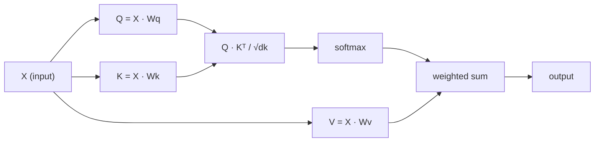

# खुद पर ध्यान देना
# आत्म ध्यान शून्य से प्राप्त

> ध्यान एक खोज तालिका है जहां प्रत्येक शब्द से पूछा जाता है "मेरे लिए कौन मायने रखता है?"  और उत्तर सीखता है।

> ध्यान एक खोज तालिका है, जिसमें से प्रत्येक शब्द "मेरे लिए कौन महत्वपूर्ण है? "

> **【中文解读】**स्व-विचार ट्रांसफार्मर का मूल है: Q*K^T  गणना प्रत्येक टोकन अन्य टोकन की चिंता के लिए ➡ समझ Q/K/V का सीधा ज्ञान GPT/BERT की आधारभूत है

**Type:** Build | **类型:** 动手
**Language:**पायथन**语言:**पायथन
**Prerequisites:** Phase 3 (Deep Learning Core), Phase 5 Lesson 10 (Sequence-to-Sequence) | **前置知识:** 阶段 3（深度学习基础），阶段 5 第 10 课（序列到序列）
**Time:** ~90 minutes | **时间:** ~90 分钟

## सीखने के लक्ष्य

- केवल NumPy का उपयोग करके स्केल-डॉट-प्रोडक्ट स्व-विचार को स्क्रैच से लागू करें, जिसमें क्वेरी/की/मूल्य अनुमान और सॉफ्टमैक्स-वेटेड योग शामिल है
   केवल NumPy का उपयोग करें  शून्य से संकुचित बिंदुओं को प्राप्त करने के लिए  ध्यान केंद्रित करें, जिसमें प्रश्न/की/मूल्य पर विचार करना और softmax + अधिकार प्राप्त करना शामिल है
- एक बहु-हेड ध्यान परत बनाएं जो सिरों को विभाजित करता है, समानांतर ध्यान की गणना करता है, और परिणामों को एक साथ जोड़ता है
   बहु-उद्देश्य स्तर का निर्माण, उद्देश्य विभाजन उद्देश्य गणना एवं परिणाम संयोजन
- ध्यान मैट्रिक्स टोकन संबंधों को कैसे कैप्चर करता है इसका पता लगाएं और समझाएं कि क्यूआरटी द्वारा स्केलिंग सॉफ्टमैक्स संतृप्ति को रोकती है
  追踪注意力矩阵 कैसे टोकन 关系 को पकड़ने के लिए,并解释为什么除以 sqrt(d_k) 能防止软max 和
- दो दिशाओं के ध्यान को ऑटोरेग्रेसिव (डेकोडर शैली) ध्यान में परिवर्तित करने के लिए कारणात्मक मास्किंग का उपयोग करें
  应用因果掩码将双向注意力转换为自归归 (स्व归) 解码器风格) ध्यान

## समस्या  समस्या परिचय

आरएनएन एक समय में एक टोकन को क्रमबद्ध करता है। जब तक आप टोकन 50 तक पहुंच जाते हैं, तब तक टोकन 1 से जानकारी को 50 संपीड़न चरणों के माध्यम से दबा दिया गया है। लंबी दूरी की निर्भरता को एक निश्चित आकार की छिपी हुई स्थिति में कुचल दिया जाता है।

> RNN  व्यक्तिगत टोकन  प्रसंस्करण क्रम  जब आप 50 वें टोकन  तक पहुंचते हैं, तो पहले टोकन से प्राप्त जानकारी को 50 बार संपीड़ित कर दिया गया है  लम्बी दूरी पर निर्भरता को स्थिर आकार की छिपी हुई स्थिति में दबाया गया है यह LSTM 门控无法完全解决的瓶──

2014 के बहदानु ध्यान पत्र ने फिक्स दिखायाः डिकोडर को प्रत्येक एन्कोडर स्थिति को पीछे देखने दें और यह तय करें कि वर्तमान चरण के लिए कौन से मायने रखते हैं। लेकिन यह अभी भी एक आरएनएन पर बुल्ट किया गया था। 2017 के "अंतर्वार्ता आपको केवल एक चीज की आवश्यकता है" पेपर ने एक तेज सवाल पूछाः क्या होगा यदि ध्यान * केवल * तंत्र है? कोई पुनरावृत्ति नहीं। कोई घुमाव नहीं। बस ध्यान।

> 2014 में बहदाऊ ध्यान कार्य में सुधार विधि का प्रदर्शन किया गया थाः कृपया एक एडिटर को प्रत्येक एडिटर के स्थान पर ध्यान दें, और यह निर्धारित करें कि वर्तमान चरणों के लिए क्या महत्वपूर्ण है। लेकिन यह अभी भी आरएनएन के शीर्ष पर संलग्न है। 2017 के "ध्यान वह सब है जिसकी आपको आवश्यकता है" के अध्ययन में एक और भी महत्वपूर्ण प्रश्न उठाया गया हैः यदि ध्यान एकमात्र तंत्र है? कोई चक्र नहीं है।

आत्म-ध्यान एक अनुक्रम में प्रत्येक स्थिति को एक समानान्तर चरण में प्रत्येक अन्य स्थिति की देखभाल करने की अनुमति देता है। यही ट्रांसफार्मर को तेज, स्केलेबल और प्रमुख बनाता है।

> ध्यान से क्रम में प्रत्येक स्थान को एक ही समानांतर चरण में सभी अन्य स्थानों पर ध्यान केंद्रित करने दें। यही कारण है कि ट्रांसफार्मर तेजी से विस्तार और प्रभुत्व रखता है।

> **【中文解读】**RNN की सूचना प्रसारण की तरह传话游戏经过多步后信息严重失真──Bahdanau ध्यान दें कि कोडर को "回头看" करने के लिए प्रत्येक स्थान पर ध्यान दें, लेकिन अभी भी RNN पर निर्भर है── ट्रांसफार्मर की क्रांतिकारीता यह हैः पूरी तरह से एक चक्र को त्याग दें, केवल एक तंत्र के साथ ध्यान दें── स्वयं ध्यान दें कि क्रम में प्रत्येक स्थान सीधे सभी अन्य स्थानों पर ध्यान केंद्रित कर सकता है, चरण से चरण तक।──

## अवधारणा का मूल अवधारणा

### डेटाबेस खोज एनालॉग डेटाबेस खोज प्रकार

ध्यान को एक नरम डेटाबेस खोज के रूप में सोचेंः

> ध्यान से कल्पना करें सॉफ्टवेयर डेटाबेस खोजेंः

```
Traditional database:
  Query: "capital of France"  -->  exact match  -->  "Paris"

Attention:
  Query: "capital of France"  -->  similarity to ALL keys  -->  weighted blend of ALL values
```

प्रत्येक टोकन तीन वेक्टर उत्पन्न करता हैः
- **Query (Q)**"मैं क्या खोज रहा हूँ?
  **查询 (Query, Q)**:"मैं क्या तलाश कर रहा हूँ? "
- **Key (K)**"मैं क्या शामिल है?
  **键 (Key, K)**:"मैं क्या शामिल है? "
- **Value (V)**: "यदि चयनित हो तो मैं क्या जानकारी प्रदान करूँ?
  **值 (Value, V)**:"अगर चुना जाता है, मैं क्या जानकारी प्रदान करता हूँ? "

एक क्वेरी और सभी कुंजी के बीच बिंदु उत्पाद ध्यान स्कोर का उत्पादन करता है। उच्च स्कोर का मतलब है "यह कुंजी मेरी क्वेरी से मेल खाती है।" उन स्कोर का वजन मानों है। आउटपुट मानों का एक भारित योग है।

> 查询与所有键的点积产生注意分数――高分 का अर्थ है" यह कुंजी मेरे प्रश्न के अनुरूप है"―― ये अंक मूल्य के प्रति गुणा करते हैं――输出是值的加权求和――

> **【中文解读】**ध्यान के डेटाबेस प्रकार Q/K/V को समझने का सबसे अच्छा तरीका है। Q "मैं कुछ ढूंढ रहा हूँ", K "मेरे पास कुछ है", V "मेरी वास्तविक सामग्री" है। Q और K के बिंदुओं का एक सापेक्षता है, softmax को एकीकरण के बाद एक भार के रूप में, V के लिए एक अतिरिक्त अधिकार और मांग है।

> **【拓展：注意力机制在真实系统中的应用】**GPT 系列 उपयोग因果自注意力( प्रत्येक टोकन केवल पिछले टोकन को देख सकता है);BERT उपयोग双向自注意力( प्रत्येक टोकन 能看到所有 टोकन);交叉注意力(क्रॉस-注意力)则在T5、稳定分散等模型中连接编码器和编码器──理解Q/K/V是理解所有这些变体的基础──

### Q, K, V गणना

प्रत्येक टोकन एम्बेडिंग तीन सीखे वजन मैट्रिक्स के माध्यम से प्रक्षेपित किया जाता हैः

> प्रत्येक टोकन 嵌入 करने के लिए तीन सीखने के अधिकार रक्कम के माध्यम से प्रोजेक्शनः

```
Input embeddings (sequence of n tokens, each d-dimensional):

  X = [x1, x2, x3, ..., xn]       shape: (n, d)

Three weight matrices:

  Wq  shape: (d, dk)
  Wk  shape: (d, dk)
  Wv  shape: (d, dv)

Projections:

  Q = X @ Wq    shape: (n, dk)      each token's query
  K = X @ Wk    shape: (n, dk)      each token's key
  V = X @ Wv    shape: (n, dv)      each token's value
```

दृश्य रूप से, एक संकेत के लिएः

> 直观地看, एक टोकन के लिएः

```
             Wq
  x_i ------[*]------> q_i    "What am I looking for?"
       |
       |     Wk
       +----[*]------> k_i    "What do I contain?"
       |
       |     Wv
       +----[*]------> v_i    "What do I offer?"
```

### ध्यान मैट्रिक्स

एक बार जब आप सभी टोकन के लिए Q, K, V है, ध्यान स्कोर एक मैट्रिक्स बनाते हैंः

> एक बार जब आप सभी टोकन Q  K  V है, ध्यान अंक एक रचः

```
Scores = Q @ K^T    shape: (n, n)

              k1    k2    k3    k4    k5
        +-----+-----+-----+-----+-----+
   q1   | 2.1 | 0.3 | 0.1 | 0.8 | 0.2 |   <- how much q1 attends to each key
        +-----+-----+-----+-----+-----+
   q2   | 0.4 | 1.9 | 0.7 | 0.1 | 0.3 |
        +-----+-----+-----+-----+-----+
   q3   | 0.2 | 0.6 | 2.3 | 0.5 | 0.1 |
        +-----+-----+-----+-----+-----+
   q4   | 0.9 | 0.1 | 0.4 | 1.7 | 0.6 |
        +-----+-----+-----+-----+-----+
   q5   | 0.1 | 0.3 | 0.2 | 0.5 | 2.0 |
        +-----+-----+-----+-----+-----+

Each row: one token's attention over the entire sequence
```

### क्यों स्केल?
एक बार में एक क्वेरी को देखें कुंजी को झाड़ते हैंः प्रत्येक पंक्ति प्रत्येक टोकन को स्कोर करती है, सॉफ्टमैक्स स्कोर को वजन में बदल देता है, और संदर्भ वेक्टर मानों का वजन मिश्रण है।

```figure
attention-matrix
```

### पैमाना क्यों?

यदि dk = 64, तो डॉट उत्पाद दसियों की सीमा में हो सकते हैं, जिससे सॉफ्टमैक्स को उन क्षेत्रों में धकेल दिया जा सकता है जहां ग्रेडिएंट गायब हो जाते हैं। फिक्सः वर्ग द्वारा विभाजित करें।

> बिंदु积随维度 dk 增长── यदि dk = 64, बिंदु积可能在几十的范围内,将软max 推进梯度消失的区域──修复方法:除以平方dk)──

```
Scaled scores = (Q @ K^T) / sqrt(dk)
```

यह मानों को एक सीमा में रखता है जहां सॉफ्टमैक्स उपयोगी ग्रेडिएंट उत्पन्न करता है।

> यह मूल्य को नरम अधिकतम के भीतर बनाए रखने के लिए उपयोगी डिग्री उत्पन्न कर सकता है।

> **【中文解读】**缩放因子 1/sqrt(dk) एक महत्वपूर्ण है लेकिन आसानी से अनदेखी की जाती है विवरणों में से एक है।

### सॉफ्टमैक्स स्कोर को वजन में बदल देता है सॉफ्टमैक्स स्कोर को वजन में बदल देता है

सॉफ्टमैक्स कच्चे स्कोर को प्रत्येक पंक्ति में संभावना वितरण में परिवर्तित करता हैः

> Softmax प्रति पंक्ति संभावना वितरण में मूल अंक को परिवर्तित करेगाः

```
Raw scores for q1:   [2.1, 0.3, 0.1, 0.8, 0.2]
                            |
                         softmax
                            |
Attention weights:   [0.52, 0.09, 0.07, 0.14, 0.08]   (sums to ~1.0)
```

अब प्रत्येक टोकन में एक सेट वजन है जो बताता है कि प्रत्येक अन्य टोकन पर कितना ध्यान देना है।

> अब प्रत्येक टोकन का एक समूह है, जो अन्य प्रत्येक टोकन पर ध्यान देने की डिग्री को दर्शाता है।

> **【拓展：注意力矩阵的可解释性】**ध्यान शक्ति (N×N) एक महत्वपूर्ण उपकरण है। ध्यान शक्ति के माध्यम से, मॉडल का पता लगाया जा सकता है। उदाहरण के लिए, शब्द "यह" आमतौर पर अपने संदर्भ के नाम पर अत्यधिक ध्यान केंद्रित करता है।

### मूल्य के वजन योग मूल्य के अतिरिक्त अधिकार और

प्रत्येक टोकन के लिए अंतिम आउटपुट सभी मूल्य वेक्टरों का एक भारित योग हैः

> प्रत्येक टोकन का अंतिम आउटपुट सभी मूल्य वेक्टर के अतिरिक्त है

```
output_i = sum( attention_weight[i][j] * v_j  for all j )

For token 1:
  output_1 = 0.52 * v1 + 0.09 * v2 + 0.07 * v3 + 0.14 * v4 + 0.08 * v5
```

### पूर्ण पाइपलाइन



एक पंक्ति में सूत्रः

> एक सूत्र

```
Attention(Q, K, V) = softmax( Q @ K^T / sqrt(dk) ) @ V
```

## इसे बनाओ, इसे पूरा करो।
```figure
softmax-attention-scaling
```

## इसे बनाओ

### चरण 1: सॉफ्टमैक्स को शून्य से प्राप्त करें

सॉफ्टमैक्स कच्चे लॉग को संभावनाओं में परिवर्तित करता है। संख्यात्मक स्थिरता के लिए अधिकतम घटाएं।

> सॉफ्टमैक्स मूल लॉग को 概率 में परिवर्तित करेगा।

```python
import numpy as np

def softmax(x):
    shifted = x - np.max(x, axis=-1, keepdims=True)
    exp_x = np.exp(shifted)
    return exp_x / np.sum(exp_x, axis=-1, keepdims=True)

logits = np.array([2.0, 1.0, 0.1])
print(f"logits:  {logits}")
print(f"softmax: {softmax(logits)}")
print(f"sum:     {softmax(logits).sum():.4f}")
```

### चरण 2: स्केल बिंदु उत्पाद ध्यान. चरण 2: ध्यान केंद्रित करने के लिए बिंदु जमा करें.

कोर फ़ंक्शन. क्यू, के, वी मैट्रिक्स लेता है और ध्यान आउटपुट प्लस वजन मैट्रिक्स लौटाता है.

> 核心函数──接收 Q、K、V 矩阵, लौट लौट ध्यान आउटपुट और वजन矩阵──

```python
def scaled_dot_product_attention(Q, K, V):
    dk = Q.shape[-1]
    scores = Q @ K.T / np.sqrt(dk)
    weights = softmax(scores)
    output = weights @ V
    return output, weights
```

### चरण 3: आत्म-ध्यान कक्षा के साथ सीखने की प्रक्षेपण ।

एक पूर्ण स्व-विचार मॉड्यूल के साथ Wq, Wk, Wv वजन मैट्रिक्स के साथ Xavier-जैसे स्केलिंग के साथ शुरू किया गया।

> एक पूर्ण स्व-विचार मॉड्यूल, जिसमें Wq、Wk、Wv 权重矩阵, प्रयोग Xavier 式缩放初始化──

```python
class SelfAttention:
    def __init__(self, d_model, dk, dv, seed=42):
        rng = np.random.default_rng(seed)
        scale = np.sqrt(2.0 / (d_model + dk))
        self.Wq = rng.normal(0, scale, (d_model, dk))
        self.Wk = rng.normal(0, scale, (d_model, dk))
        scale_v = np.sqrt(2.0 / (d_model + dv))
        self.Wv = rng.normal(0, scale_v, (d_model, dv))
        self.dk = dk

    def forward(self, X):
        Q = X @ self.Wq
        K = X @ self.Wk
        V = X @ self.Wv
        output, weights = scaled_dot_product_attention(Q, K, V)
        return output, weights
```

### चरण 4: इसे एक वाक्य पर चलाएँ।

एक वाक्य के लिए नकली एम्बेड बनाएं और ध्यान वजन देखें।

> एक वाक्य में, ध्यान के अधिकार को ध्यान में रखते हुए,

```python
sentence = ["The", "cat", "sat", "on", "the", "mat"]
n_tokens = len(sentence)
d_model = 8
dk = 4
dv = 4

rng = np.random.default_rng(42)
X = rng.normal(0, 1, (n_tokens, d_model))

attn = SelfAttention(d_model, dk, dv, seed=42)
output, weights = attn.forward(X)

print("Attention weights (each row: where that token looks):\n")
print(f"{'':>6}", end="")
for token in sentence:
    print(f"{token:>6}", end="")
print()

for i, token in enumerate(sentence):
    print(f"{token:>6}", end="")
    for j in range(n_tokens):
        w = weights[i][j]
        print(f"{w:6.3f}", end="")
    print()
```

### चरण 5: ASCII हीटमैप के साथ ध्यान का दृश्य बनाएं।

त्वरित दृश्य के लिए पात्रों के लिए ध्यान वजन का नक्शा।

> ध्यान शक्ति को तेजी से दृश्यता के लिए वर्णों में पुनः प्रदर्शित करना

```python
def ascii_heatmap(weights, tokens, chars=" ░▒▓█"):
    n = len(tokens)
    print(f"\n{'':>6}", end="")
    for t in tokens:
        print(f"{t:>6}", end="")
    print()

    for i in range(n):
        print(f"{tokens[i]:>6}", end="")
        for j in range(n):
            level = int(weights[i][j] * (len(chars) - 1) / weights.max())
            level = min(level, len(chars) - 1)
            print(f"{'  ' + chars[level] + '   '}", end="")
        print()

ascii_heatmap(weights, sentence)
```

## इसे फ्रेमवर्क के साथ लागू करें

पायटॉर्च की `nn.MultiheadAttention`क्या हम बनाया है, प्लस बहु-हेड विभाजन और आउटपुट प्रक्षेपण करता हैः

> पिटॉर्च की `nn.MultiheadAttention`हमने जो सामग्री बनाई है, उसे पूरी तरह से पूरा किया है, और कई अलग-अलग और आउटपुट प्रोजेक्ट्स भी शामिल हैंः

```python
import torch
import torch.nn as nn

d_model = 8
n_heads = 2
seq_len = 6

mha = nn.MultiheadAttention(embed_dim=d_model, num_heads=n_heads, batch_first=True)

X_torch = torch.randn(1, seq_len, d_model)

output, attn_weights = mha(X_torch, X_torch, X_torch)

print(f"Input shape:            {X_torch.shape}")
print(f"Output shape:           {output.shape}")
print(f"Attention weight shape: {attn_weights.shape}")
print(f"\nAttn weights (averaged over heads):")
print(attn_weights[0].detach().numpy().round(3))
```

मुख्य अंतरः मल्टी-हेड ध्यान समानांतर में कई ध्यान कार्यों को चलाता है, प्रत्येक आकार dk = d_model / n_heads के अपने स्वयं के Q, K, V अनुमानों के साथ, फिर परिणामों को संश्लेषित करता है। यह मॉडल को एक साथ विभिन्न संबंध प्रकारों पर ध्यान देने की अनुमति देता है।

> 关键区别:多头注意力并行运行多头注意力函数, प्रत्येक के पास अपना स्वयं का Q、K、V 投影,大小为 dk = d_model / n_heads,然后拼接结果──这让模型可以同时关注不同类型的关系──

> **【中文解读】**पिटॉर्च की `nn.MultiheadAttention` हमारे शून्य से प्राप्त सभी तर्क को कवर करना, इसके अलावा बहु-उद्भाजन और आउटपुट परिकल्पनाएँ बहु-उद्भाजन का लाभ यह है कि मॉडल को विभिन्न प्रकार के संबंधों पर ध्यान केंद्रित करने में एक प्रमुख भाषा-भाषा संबंधों पर ध्यान केंद्रित कर सकता है, दूसरा भाषा-शब्द संबंधों पर ध्यान केंद्रित कर सकता है, एक ध्यान केंद्रित स्थिति संबंध भी है

> **【拓展：多头注意力的生物学类比】**विभिन्न ध्यान के सिर विभिन्न प्रकार के टोकन 间 संबंध को समझने के लिए सीखते हैं। अध्ययन से पता चलता है कि ट्रांसफार्मर के विभिन्न सिरों ने वास्तव में विभिन्न भाषाओं के मॉडल को सीखा हैः कुछ संबंधित संबंधित शब्दों पर ध्यान केंद्रित करते हैं, कुछ संबंधित शब्दों पर निर्भर करते हैं, कुछ संबंधित संकेतन पर निर्भर करते हैं, कुछ संबंधित संकेतन पर निर्भर करते हैं।

## इसे भेजें उत्पाद

इस पाठ से उत्पन्न होता हैः
- `outputs/prompt-attention-explainer.md` डेटाबेस खोज एनालॉग के माध्यम से ध्यान को समझाने के लिए एक संकेत

> 本课产生:
> - `outputs/prompt-attention-explainer.md` DATABASE के माध्यम से खोजें

## अभ्यास विषय

1. संशोधित करें`scaled_dot_product_attention`एक वैकल्पिक मास्क मैट्रिक्स को स्वीकार करने के लिए जो सॉफ्टमैक्स से पहले कुछ स्थितियों को नकारात्मक अनंत पर सेट करता है (इस तरह कारण / डिकोडर मास्किंग काम करता है)
   修改 `scaled_dot_product_attention`इस प्रकार से, एक अक्षम्य अदृश्य को हटाया जा सकता है।

2. मल्टी हेड ध्यान को स्क्रैच से लागू करेंः Q, K, V में विभाजित करें `n_heads`टुकड़े, प्रत्येक पर ध्यान चलाएं, एक साथ बंधा, और एक अंतिम वजन मैट्रिक्स के माध्यम से परियोजना Wo
                                                                                                                                                                                                                                                                 `n_heads`块,分别运行注意力,拼接,并通过最终权重矩阵 Wo 投影

3. एक ही लंबाई के दो अलग-अलग वाक्य लें, उन्हें एक ही स्व-ध्यान उदाहरण के माध्यम से खिलाएं, और उनके ध्यान पैटर्न की तुलना करें। क्या परिवर्तन? क्या वही रहता है?
   एक ही लंबाई के दो अलग-अलग वाक्य लें, एक ही आत्म-ध्यान  उदाहरण के माध्यम से, उनकी तुलना करें ध्यान मोड 

## कीवर्ड्स  शब्द खोज तालिका

| Term | What people say / 人们怎么说 | What it actually means / 实际含义 |
|------|------------------------------|----------------------------------|
| Query (Q) | "The question vector" / "问题向量" | A learned projection of the input that represents what information this token is looking for. 输入的学习投影，表示这个 token 在寻找什么信息。 |
| Key (K) | "The label vector" / "标签向量" | A learned projection that represents what information this token contains, matched against queries. 学习投影，表示这个 token 包含什么信息，与查询匹配。 |
| Value (V) | "The content vector" / "内容向量" | A learned projection carrying the actual information that gets aggregated based on attention scores. 学习投影，携带根据注意力分数聚合的实际信息。 |
| Scaled dot-product attention | "The attention formula" / "注意力公式" | softmax(QK^T / sqrt(dk)) @ V — scaling prevents softmax saturation in high dimensions. softmax(QK^T / sqrt(dk)) @ V — 缩放防止高维时 softmax 饱和。 |
| Self-attention | "The token looks at itself and others" / "token 看自己和其他 token" | Attention where Q, K, V all come from the same sequence, letting every position attend to every other position. Q、K、V 都来自同一序列的注意力，让每个位置关注所有其他位置。 |
| Attention weights | "How much focus" / "多少关注" | A probability distribution over positions, produced by softmax over scaled dot products. 位置上的概率分布，由缩放点积上的 softmax 产生。 |
| Multi-head attention | "Parallel attention" / "并行注意力" | Running multiple attention functions with different projections, then concatenating results for richer representations. 使用不同投影运行多个注意力函数，然后拼接结果以获得更丰富的表示。 |

## आगे पढ़ना 延伸閱讀

- [Attention Is All You Need (Vaswani et al., 2017)](https://arxiv.org/abs/1706.03762) मूल ट्रांसफार्मर पेपर
  Vaswani 等人(2017)  原始 ट्रांसफार्मर 论文

- [The Illustrated Transformer (Jay Alammar)](https://jalammar.github.io/illustrated-transformer/) पूर्ण वास्तुकला का सर्वश्रेष्ठ दृश्य पारगमन
  जय Alammar का दृश्यमानता ट्रांसफार्मर  最佳完整架构可视化讲解

- [The Annotated Transformer (Harvard NLP)](https://nlp.seas.harvard.edu/annotated-transformer/) स्पष्टीकरण के साथ लाइन-दर-लाइन PyTorch कार्यान्वयन
  हार्वर्ड एनएलपी का नोटिस संस्करण ट्रांसफार्मर  逐行 PyTorch 实现与解释

> **【拓展：Flash Attention 与注意力优化】**標準 स्व-विचार का O(N^2) 内存开销是长序列处理的瓶──Flash Attention(2022) विभाजन ब्लॉक गणना और重计算 रणनीति के माध्यम से, गणितीय परिणामों में परिवर्तन के बिना内存 जटिलता O(N)  तक कम हो जाएगी। यह जीपीटी-4 के 128K 上下文窗口 आदि के वास्तविक अनुप्रयोगों में महत्वपूर्ण है।
