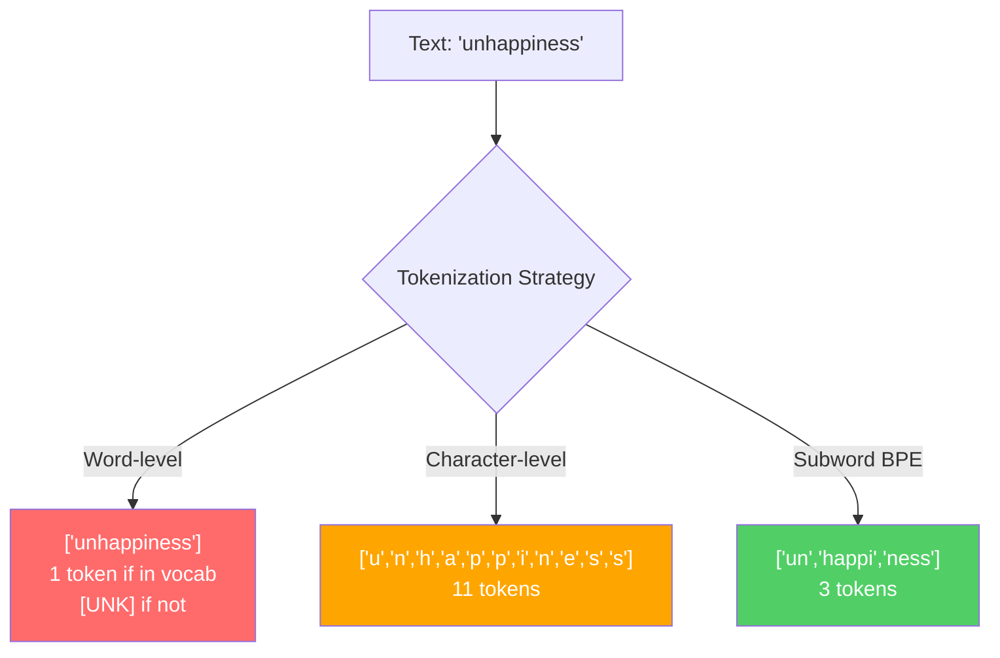
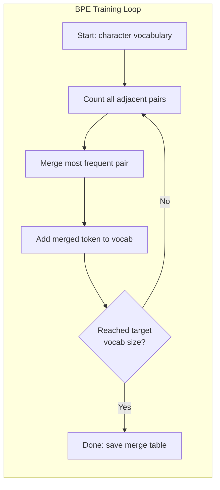
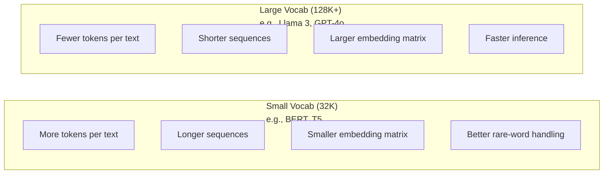

# टोकन: बीपीई, वर्डपीस, सैंटेंसपीस

> आपका LLM अंग्रेजी नहीं पढ़ता है, यह पूर्णांक पढ़ता है। टोकनराइज़र तय करता है कि क्या ये पूर्णांक अर्थ रखते हैं या इसे बर्बाद करते हैं।

> **【中文解读】**LLM 不读英文,它读整数──分词器决定这些整数是有意义还是浪费──子词分词(子词分词) में शब्द श्रेणी और字符 श्रेणी के बीच संतुलन का एक बिंदु मिलता हैः

> **【拓展：BPE→GPT系列】**OpenAI के सभी मॉडल(GPT-2、GPT-3、GPT-4) सभी BPE 分词器──tiktoken है GPT 系列 के分词器库──分词质量 सीधे प्रभावित पर नीचे विंडो उपयोग दर"दुर्भाग्य से" 拆分4 टोकन बनाम 1 टोकन, बराबर ऊपर नीचे विंडो संकुचन 75%──

**Type:** Build
**Languages:** Python
**Prerequisites:** Phase 05 (NLP Foundations)
**Time:** ~90 minutes

## सीखने के लक्ष्य

- BPE, WordPiece, और Unigram टोकनकरण एल्गोरिदम को खरोंच से लागू करें और उनकी विलय रणनीतियों की तुलना करें
  शून्य से BPE 、WordPiece 和 Unigram 分词算法 को प्राप्त करने के लिए, उनकी तुलना करें
- व्याख्या करें कि शब्दावली का आकार मॉडल दक्षता को कैसे प्रभावित करता हैः बहुत छोटा लंबा अनुक्रम बनाता है, बहुत बड़ा अपशिष्ट पैरामीटर को एम्बेड करता है
  解释词表大小 कैसे प्रभावित मॉडल दक्षता: बहुत छोटा उत्पन्न लंबा क्रम, बहुत बड़ा बर्बाद एम्बेड पैरामीटर
- भाषाओं और कोड के बीच टोकनाइज़ेशन कलाकृतियों का विश्लेषण करें, यह पहचानें कि विशिष्ट टोकनाइज़र कहां टूटते हैं
  ️ ️ ️ ️ ️ ️ ️ ️ ️ ️ ️ ️ ️ ️ ️ ️ ️ ️ ️ ️ ️ ️ ️ ️ ️ ️ ️ ️ ️ ️ ️ ️ ️ ️ ️ ️ ️ ️ ️ ️ ️ ️ ️ ️ ️ ️ ️ ️ ️ ️ ️ ️ ️ ️ ️ ️ ️ ️ ️ ️ ️ ️ ️ ️ ️ ️ ️ ️ ️ ️ ️ ️ ️ ️ ️ ️ ️ ️ ️ ️ ️ ️ ️ ️ ️ ️ ️ ️ ️ ️ ️ ️ ️ ️ ️ ️ ️ ️ ️ ️ ️ ️ ️ ️ ️ ️ ️ ️ ️ ️ ️ ️ ️ ️ ️ ️ ️ ️ ️ ️ ️ ️ ️ ️ ️ ️ ️ ️ ️ ️ ️ ️ ️ ️ ️ ️ ️ ️ ️ ️ ️ ️ ️ ️ ️ ️ ️ ️ ️ ️ ️ ️ ️ ️ ️ ️ ️ ️ ️ ️ ️ ️ ️ ️ ️ ️ ️ ️ ️ ️ ️ ️ ️ ️ ️ ️ ️ ️ ️ ️ ️ ️ ️ ️ ️ ️ ️ ️ ️ ️ ️ ️ ️ ️ ️ ️ ️ ️ ️ ️ ️ ️ ️ ️ ️ ️ ️ ️ ️ ️ ️ ️ ️ ️ ️ ️ ️ ️ ️ ️ ️ ️ ️ ️ ️ ️ ️ ️ ️ ️ ️ ️ ️ ️ ️ ️ ️ ️ ️ ️ ️ ️ ️ ️ ️ ️ ️ ️ ️ ️ ️ ️ ️ ️ ️
- टेक्स्ट को टोकन बनाने और परिणाम टोकन आईडी की जांच करने के लिए टिक्टोकन और वाक्यांश टुकड़े पुस्तकालयों का उपयोग करें
  उपयोग करें tiktoken 和 वाक्य टुकड़ा 库分词文本并检查生成的代码 ID

> **【中文解读】**इस अध्याय के सीखने के लक्ष्य के चार आयामों के आसपासः कार्यान्वयन (~) ️ हाथ से लिखने BPE/WordPiece/Unigram 算法) ️ समझ (~) ️ शब्द表大小的工程权衡) ️ विश्लेषण (~) ️跨语言分词的边界情况) ️应用 (~) ️ टिक टोकन/ वाक्ये 工具库) ️分词是LLM 管线的第一步,直接影响模型效率和成本──

## समस्या  समस्या परिचय

आपका एमएलए अंग्रेजी नहीं पढ़ता है, यह किसी भी भाषा को नहीं पढ़ता है। यह संख्याओं को पढ़ता है।

> आपका LLM 不读英文──它不读任何语言──它读数字──

"हैलो, दुनिया! " और [15496, 11, 995, 0] के बीच का अंतर टोकनाइज़र है। मॉडल इसे संसाधित करने से पहले प्रत्येक शब्द, प्रत्येक स्थान, प्रत्येक अंकन चिह्न को एक पूर्णांक में परिवर्तित किया जाना चाहिए। यह रूपांतरण तटस्थ नहीं है। यह मॉडल में धारणाओं को बेक करता है जिसे बाद में रद्द नहीं किया जा सकता है।

> "हैलो, दुनिया! " और [15496, 11, 995, 0] के बीच का पुल है分词器── प्रत्येक शब्द、 प्रत्येक रिक्त स्थान、 प्रत्येक संकेत बिंदु प्रतीक सभी को पूर्णांक में परिवर्तित करना चाहिए, मॉडल इसे संभाल सकता है── यह परिवर्तन मध्यम नहीं है यह मॉडल में फिक्स्ड होने का अनुमान है, और बाद में इसे रद्द नहीं किया जा सकता

यह गलत हो जाओ और अपने मॉडल कई टोकन के साथ आम शब्दों को एन्कोडिंग क्षमता बर्बाद. "दुर्भाग्य से" एक के बजाय चार टोकन बन जाता है। आपके 128K संदर्भ विंडो सिर्फ 75% तक संकुचित बहु-शब्दाओं में भारी पाठ के लिए. इसे सही करें और एक ही संदर्भ विंडो में दो बार अधिक अर्थ होता है। "यह मॉडल कोड को अच्छी तरह से संभालता है" और "यह मॉडल पायथन पर थूकता है" के बीच अंतर अक्सर टोकनराइज़र को प्रशिक्षित करने के तरीके से नीचे आता है।

> गलत किया, आपका मॉडल कई टोकन के साथ क्षमता बर्बाद करेगा 编码常见词――"दुर्भाग्य से" चार टोकन में बदल जाता है एक नहीं ⋅आप 128K के उपरोक्त संस्करण के लिए बहुवचन शब्द घन ग्रंथ के लिए सीधे 75% कम हो गया है ⋅ कर के लिए, इसी तरह उपरोक्त संस्करण के लिए दो बार की जानकारी को लोड कर सकते हैं ⋅" यह मॉडल कोड को अच्छी तरह से संसाधित करता है "और" यह मॉडल पायथन में ऊपर का उपयोग करता है " के अंतर, अक्सर यह निर्भर करता है कि कैसे प्रशिक्षण किया जाता है ⋅

प्रत्येक एपीआई कॉल आप जीपीटी-4 या क्लाउड के लिए करते हैं प्रति टोकन की कीमत है. प्रत्येक टोकन आपके मॉडल उत्पन्न करता है लागत गणना. एक आउटपुट का प्रतिनिधित्व करने के लिए कम टोकन की आवश्यकता होती है, तेजी से अंत-से-अंत inference. Tokenization पूर्व प्रसंस्करण नहीं है. यह वास्तुकला है.

> आप प्रत्येक बार GPT-4 या क्लाउड के एपीआई का उपयोग करते हैं, वे टोकन के अनुसार 计费的── आपके मॉडल द्वारा उत्पन्न प्रत्येक टोकन का उपयोग करने की क्षमता का उपयोग करते हैं── यह कहते हैं कि एक आउटपुट आवश्यक टोकन 越少,端到端推理就越快──分词不是预处理──它是架构──

> **【中文解读】**分词 एक साधारण पूर्व प्रसंस्करण चरण नहीं है, बल्कि मॉडल संरचना का हिस्सा है। प्रत्येक बार GPT-4 एपीआई का उपयोग करने पर टोकन 计费, प्रत्येक टोकन का उत्पादन व्यय करने की क्षमता है। "दुर्भाग्य से" 4 टोकन में विभाजित किया गया है जिसका अर्थ है कि उपरोक्त विंडो उपयोग दर 75% कम हो गई है।

> **【拓展：API 定价与分词效率】**जीपीटी-4o का निर्धारण$5/M input tokens、$15/एम आउटपुट टोकन── एक ही चीनी में, GPT-2 分词器 के साथ 500 टोकन का उपभोग हो सकता है, GPT-4o के o200k_base 分词器 के साथ केवल 200 टोकन की आवश्यकता होती है, लागत अंतर 2.5 गुना── यही कारण है कि Llama 3 शब्द का उपयोग 32K से 128K तक बढ़ाएगा।

>  **【前置】**学本节前 कृपया पहले समझेंः 1) चरण 05 (NLP मूल बातें)  समझें पाठ का तरक्कीकरण表示、词嵌入基础; 2) पायथन 字典/counter与贪心算法实现模式; 3) UTF-8 编码、Unicode 码点(codepoint) 字节 के संबंध; 4) 概率论基础频率统计与互信息── इन बैठकों को समझना मुश्किल है BPE के 合并据判──

## अवधारणा का मूल अवधारणा

### तीन तरीके जो असफल हुए (और एक जो जीत गया)

पाठ को संख्याओं में बदलने के तीन स्पष्ट तरीके हैं जिनमें से दो पैमाने पर काम नहीं करते हैं।

> पाठ को संख्यात्मक रूप से परिवर्तित करने के तीन स्पष्ट तरीके हैं। इनमें से दो बड़े पैमाने पर परिदृश्यों में काम नहीं कर सकते हैं।

**Word-level tokenization**"cat sat" ["the", "cat", "sat"] बन जाता है. सरल. लेकिन "tokenization" के बारे में क्या? या "GPT-4o"? या एक जर्मन यौगिक शब्द जैसे "Geschwindigkeitsbegrenzung"? शब्द स्तर प्रत्येक भाषा में प्रत्येक शब्द को कवर करने के लिए एक विशाल शब्दावली की आवश्यकता होती है. एक शब्द को याद करते हुए आप भयभीत हो जाते हैं`[UNK]`टोकन -- मॉडल का यह कहने का तरीका है "मुझे नहीं पता कि यह क्या है". अकेले अंग्रेजी में एक मिलियन से अधिक शब्द रूप हैं. कोड, URL, वैज्ञानिक संकेतन, और 100 अन्य भाषाओं को जोड़ें और आपको एक अंतहीन शब्दावली की आवश्यकता है।

> **词级分词**按空格和标点拆分──" बिल्ली बैठ गई" 变成 ["The", "cat", "sat"]──很简单──但" टोकनाइज़ेशन" 呢?GPT-4o" 呢?或德语复合词 "Geschwindigkeitsbegrenzung" 呢?词级分词需要一个巨大的词表来覆盖每种语言的每一个词──遗漏一个词就会出现可怕的`[UNK]`token模型在说"我完全不知道这是什么"──仅英语就有超过一百万词形──加上代码、URL、科学记记数法和100种其他语言,你需要一个无限大的词表──

**Character-level tokenization**"hello" ["h", "e", "l", "l", "o"] बन जाता है। शब्दावली छोटी है (कुछ सौ वर्ण) । कोई अज्ञात टोकन कभी नहीं। लेकिन अनुक्रम बेहद लंबा हो जाता है. एक वाक्य जो 10 शब्द स्तर टोकन होगा 50 वर्ण स्तर टोकन बन जाता है. मॉडल को सीखना होगा कि "t", "h", "e" एक साथ "the" का मतलब है -- एक इंसान को तीन साल की उम्र में सीखने की किसी चीज पर ध्यान देने की क्षमता को जलाना।

> **字符级分词**走向另一个极端──"हैलो" 变成 ["h", "e", "l", "l", "o"]──词表很小(几百个字符)──永远不会出现未知符号──但序列变得极长──一个10个词级符号的句子变成50个字符级符号──模型必须学会 "t"、"h"、"e"组合起来是"把注意力容量浪费在人类三岁就学会的事物上──

**Subword tokenization**सामान्य शब्द पूरे रहते हैंः "the" एक टोकन है। दुर्लभ शब्द सार्थक टुकड़ों में विघटित होते हैंः "असंतोष" ["un", "happy", "ness"] हो जाता है। शब्दावली प्रबंधनीय बनी रहती है (30K से 128K टोकन) । अनुक्रम छोटे रहते हैं। अज्ञात टोकन अनिवार्य रूप से गायब हो जाते हैं क्योंकि किसी भी शब्द को उपशब्दों के टुकड़ों से बनाया जा सकता है।

> **子词分词**找到了最佳平衡点──常见词保持完整:"the" 是一个标志──罕见词分解为有意义的片段:"不快乐" 变成 ["un", "happy", "ness"]──词表保持在可控范围(30K到128K 个标志)──序列保持简短──未知标志 基本消失,因为任何词都可以由子词片段构建──

> **【中文解读】**词级分词) 词级分词 (शब्द-स्तर) का प्रश्न 词表爆炸英语有百万级词形,加上代码、URL、科学记数法等语言,词表会无限增长──字符级分词 (字符级分词) 字符级分词) 字符级分词 (字符级分词) 字表小,但序列太长,模型要学会 "t"+"h"+"e" 组合为"the",浪费注意力容量──子词分词在两者之间取得平衡:常见词保持完整,罕见词分为有意义的片段──

>  **【类比】**分词器像"乐高积木分类工厂":常见词("the") बनाया गया एक पूरा ब्लॉक बड़ा积木直接用,罕见词("असंतुष्टि") को "un"+"happy"+"ness" में विभाजित किया गया 三块标准小积木拼起来──词级是只卖整块定制积木(漏货就崩),字符级是只卖单个原点(拼一句话要100个)──BPE है "高频组合自动包包成块",自适应找到成本与表达力的平衡点──

हर आधुनिक LLM उपशब्द टोकनकरण का उपयोग करता है. GPT-2, GPT-4, BERT, Llama 3, Claude - उन सभी. सवाल यह है कि कौन सा एल्गोरिथ्म है.

> प्रत्येक आधुनिक LLM में शब्द का प्रयोग होता है।



### बीपीईः बाइट जोड़ी एन्कोडिंग

बीपीई एक लालची संपीड़न एल्गोरिथ्म है जो टोकनकरण के लिए पुनः उपयोग किया गया है। यह विचार सूचकांक कार्ड पर फिट होने के लिए पर्याप्त सरल है।

> बीपीई एक पुनः प्रयोग किया गया है, जो कि एक शब्द का एक संक्षिप्त रूप है।

प्रत्येक अक्षर को अलग से शुरू करें, प्रशिक्षण पाठ्यक्रम में प्रत्येक आसन्न जोड़ी को गिनें, सबसे अधिक बार होने वाले जोड़े को नए टोकन में मिलाएं, जब तक आप अपने लक्षित शब्दावली आकार तक नहीं पहुंच जाते, तब तक दोहराएं।

> एकल वर्ण से शुरू करना। भाषा में सभी आसन्न वर्णों के लिए एक साथ आने की आवृत्ति।
```figure
tokenizer-bpe
```

यहाँ BPE एक छोटे से corpus पर चल रहा है "निम्न", "सबसे कम", और "नवीनतम" शब्दों के साथः

```
Corpus (with word frequencies):
  "lower"  x5
  "lowest" x2
  "newest" x6

Step 0 -- Start with characters:
  l o w e r       (x5)
  l o w e s t     (x2)
  n e w e s t     (x6)

Step 1 -- Count adjacent pairs:
  (e,s): 8    (s,t): 8    (l,o): 7    (o,w): 7
  (w,e): 13   (e,r): 5    (n,e): 6    ...

Step 2 -- Merge most frequent pair (w,e) -> "we":
  l o we r        (x5)
  l o we s t      (x2)
  n e we s t      (x6)

Step 3 -- Recount and merge (e,s) -> "es":
  l o we r        (x5)
  l o we s t      (x2)    <- 'es' only forms from 'e'+'s', not 'we'+'s'
  n e we s t      (x6)    <- wait, the 'e' before 'we' and 's' after 'we'

Actually tracking this precisely:
  After "we" merge, remaining pairs:
  (l,o): 7   (o,we): 7   (we,r): 5   (we,s): 8
  (s,t): 8   (n,e): 6    (e,we): 6

Step 3 -- Merge (we,s) -> "wes" or (s,t) -> "st" (tied at 8, pick first):
  Merge (we,s) -> "wes":
  l o we r        (x5)
  l o wes t       (x2)
  n e wes t       (x6)

Step 4 -- Merge (wes,t) -> "west":
  l o we r        (x5)
  l o west        (x2)
  n e west        (x6)

...continue until target vocab size reached.
```

विलय तालिका टोकनराइज़र है। नए पाठ को कोड करने के लिए, वे सीखे गए क्रम में विलय लागू करें। प्रशिक्षण कॉर्पस निर्धारित करता है कि कौन से विलय मौजूद हैं, और यह विकल्प स्थायी रूप से आकार देता है कि मॉडल क्या देखता है।

> 合并表就是分词器──编码新文本时,按学习顺序应用合并──训练语料决定了哪些合并存在,这个选择永久地塑造了模型看到的内容──

> **【中文解读】**बीपीई का मूल प्रशिक्षण चक्रः एकल वर्ण से शुरू होकर, सभी आसन्न वर्णों के लिए उद्भव की आवृत्ति के साथ, सभी आसन्न वर्णों के लिए एक नए टोकन के रूप में एकीकरण की उच्चतम आवृत्ति होगी, लक्ष्य शब्द表大小──合并表(मिश्रण तालिका) तक पहुंच जाएगी।

> **【拓展：BPE 的压缩原理】**बीपीई मूल रूप से 1994 में एक सामान्य डेटा संपीड़न एल्गोरिथ्म था। सन् २०१६ में सेंनरिक 等人 ने इसे एनएलपी क्षेत्र में पेश किया। उत्पादन वातावरण में, टिकटोकन ने रुस्ट में बीपीई को लागू किया, कोडिंग गति प्रति सेकंड लाखों टोकन तक पहुंच सकती है।

> ️ **【易错点】**手写 BPE 三个常见 bug:(1) **忘了每次合并后重新计数** सीधे  पर शुरूआती जोड़ी ऊपर चक्र गिनती, परिणामस्वरूप  हम  बाद में भी पुराने बार में उपयोग करते हैं (e,s), परिणाम                                                                                                                                                                                                                                             **合并顺序错乱**编码时必须根据训练时学到的合并级别 严格从低到高应用,先合并 "th" 再合并 "the",颠倒会得到完全不同的代币;(3) **未做预分词（pre-tokenization）** सीधे पूरे语料 पर BPE करना, "ई सी" (e c) (the cat) के बीच में跨词合并) दिखाई देगा, अर्थहीन跨词 टोकन (跨词 टोकन) का प्रशिक्षण करेगा।



### बाइट-स्तर बीपीई (जीपीटी-2, जीपीटी-3, जीपीटी-4)

मानक बीपीई यूनिकोड वर्णों पर काम करता है। बाइट-स्तर बीपीई कच्चे बाइट्स (0-255) पर काम करता है। यह आपको ठीक 256 की आधार शब्दावली देता है, किसी भी भाषा या एन्कोडिंग को संभालता है, और कभी भी अज्ञात टोकन का उत्पादन नहीं करता है।

> 标准 BPE 操作 Unicode 字符──字节级 BPE 操作原始字节(0-255)。 यह आपको एक असल में 256 基础词表 देता है, जो किसी भी भाषा या कोड को संभाल सकता है, कभी भी अज्ञात टोकन नहीं उत्पन्न करेगा。

जीपीटी-2 ने इस दृष्टिकोण को पेश किया। आधार शब्दावली हर संभव बाइट को कवर करती है। बीपीई इसके ऊपर बिल्ड करता है। ओपनएआई की टिक्टोकन लाइब्रेरी बाइट-स्तरीय बीपीई को इन शब्दावली आकारों के साथ लागू करती हैः

> GPT-2 ने इस पद्धति को शुरू किया है। आधार शब्द表覆盖每个可能的字节──BPE 合并在其上构建──OpenAI के टिक टोकन库 ने字节级 BPE को लागू किया है।

> **【中文解读】**字节级 BPE(बाइट-स्तरीय BPE) 是GPT-2 引入的关键创新──传统 BPE 操作 यूनिकोड 字符,而字节级 BPE 直接操作原始字节(0-255),基础词表恰好 256 个,理论上可处理任何语言或编码,永远不会出现 [UNK] टोकन──这就是为什么GPT 系列模型能处理代码、emoji、多语言混合文本而不会"卡住"──

> 🤔 **【困惑】**प्रश्नः क्यों बीपीई का संयोजन क्रम इतना महत्वपूर्ण है? प्रशिक्षित अच्छा分词器能"修改" है? एः संयोजन क्रम है分词器 का"程序"编码时必须严格按照训练时学到的级别从小到大应用:若级=5是"th",rank=100是"the",遇到"时先合成"th",再合成"the"――任意颠倒或单独跳过某步骤会产生不同的符号序列――生产中**不要修改合并表**, क्योंकि यह और मॉडल की एम्बेडिंग 矩阵强绑定改一个代币的ID,模型会输出乱码──需要改词表只能重训分词器 +重训模型嵌入──

- जीपीटी-2: 50,257 टोकन
- GPT-3.5/GPT-4: ~100,256 टोकन (cl100k_base एन्कोडिंग)
- GPT-4o: 200,019 टोकन (o200k_base encoding)

### WordPiece (BERT)

WordPiece BPE के समान दिखता है लेकिन पिक अलग तरह से विलय करता है। कच्चे आवृत्ति के बजाय, यह प्रशिक्षण डेटा की संभावना को अधिकतम करता हैः

> WordPiece BPE के समान दिखता है, लेकिन यह मूल आवृत्ति का उपयोग नहीं करता है, बल्कि प्रशिक्षण डेटा की अधिकतम क्षमता का उपयोग करता हैः

```
BPE merge criterion:      count(A, B)
WordPiece merge criterion: count(AB) / (count(A) * count(B))
```

बीपीई पूछता हैः "कौन सी जोड़ी सबसे अधिक बार दिखाई देती है?" वर्डपीस पूछता हैः "कौन सी जोड़ी आप आकस्मिक रूप से उम्मीद से अधिक बार एक साथ दिखाई देती है?" यह सूक्ष्म अंतर अलग-अलग शब्दावली पैदा करता है। वर्डपीस विलय को पसंद करता है जहां सह-घटना आश्चर्यजनक है, न कि केवल अक्सर।

> BPE 问:"WordPiece 问:"WordPiece 问:"WordPiece 问:"WordPiece 问:"WordPiece 问:"WordPiece 问:"WordPiece 问:"WordPiece 问:"WordPiece 问:"WordPiece 问:"WordPiece 问:"WordPiece 问:"WordPiece 问:"WordPiece 问:"WordPiece 问:"WordPiece 问:"WordPiece 问:"WordPiece 问:"WordPiece 问:"WordPiece 问:"WordPiece 问:"WordPiece 问:"WordPiece 问:"WordPiece 问:"WordPiece 问:"WordPiece 问:"WordPiece 问:"WordPiece 问:"WordPiece 问:"WordPiece "WordPiece "WordPiece "WordPiece "WordPiece "WordPiece "WordPiece "WordPiece "WordPiece "WordPiece "WordPiece "WordPiece "WordPiece "WordPiece"WordPiece"WordPie"WordPie"WordPiece"WordPiece"WordPie"WordPie"WordPie"WordPie"WordPie"WordPie"WordPie"WordPie"WordPie"WordPie"WordPie"W"WordPie"WordPie"W"WordPie"W"WordPie"W"WordPie"W"W"WordP"W"W"W"W"W"W"W"W"W"W"W"W"W"W"W"W"W"W"W"W

वर्डपीस निरंतरता उपशब्दों के लिए एक "##" पूर्वावलोकन का भी उपयोग करता हैः

> WordPiece भी "##" का उपयोग करता है

```
"unhappiness" -> ["un", "##happi", "##ness"]
"embedding"   -> ["em", "##bed", "##ding"]
```

"##" उपसर्ग आपको बताता है कि यह टुकड़ा पिछले टोकन का अनुसरण करता है। BERT 30,522 टोकन के साथ वर्डपीस का उपयोग करता है। प्रत्येक BERT संस्करण - DistilBERT, RoBERTa का टोकनराइज़र वास्तव में BPE है, लेकिन BERT स्वयं वर्डपीस है।

> "##" पहले आपको यह भाग बतायें अगला एक टोकन──BERT उपयोग वर्डपीस, शब्द表为 30,522 个 टोकन── प्रत्येक BERT 变体DistilBERT, ROBERTa का分词器 असल में BPE है, लेकिन BERT स्वयं वर्डपीस──

### वाक्यछंद (लमा, टी5)

SentencePiece इनपुट को व्हाइटस्पेस सहित यूनिकोड वर्णों की कच्ची धारा के रूप में व्यवहार करता है। कोई पूर्व-टोकनाइजेशन कदम नहीं है। शब्दों की सीमाओं के बारे में कोई भाषा-विशिष्ट नियम नहीं हैं। यह इसे वास्तव में भाषा-अज्ञानी बनाता है - यह चीनी, जापानी, थाई और अन्य भाषाओं पर काम करता है जहां स्थान शब्दों को अलग नहीं करते हैं।

> SentencePiece को मूल यूनिकोड 字符流 के रूप में सम्मिलित किया जाएगा, जिसमें रिक्त स्थान शामिल है।

SentencePiece दो एल्गोरिदम का समर्थन करता हैः

> वाक्यपीस 支持两种算法:

- **BPE mode**: मानक बीपीई के समान विलय तर्क, कच्चे वर्ण अनुक्रमों पर लागू
  中文翻译:**BPE 模式**: मानक बीपीई के समान के साथ संयोजन तर्क, मूल वर्ण क्रम में प्रयोग किया जाता है
- **Unigram mode**: एक बड़ी शब्दावली के साथ शुरू होता है और फिर से टोकन को हटा देता है जो समग्र संभावना को कम से कम प्रभावित करता है। BPE का विपरीत - विलय के बजाय कटौती।
  中文翻译:**Unigram 模式**: से 代移除 代移除 代移除 代移除 代移除 代移除 代移除 代移除 代移除 代移除 代移除 代移除 代移除 代移除 代移除 代移除 代移除 代移除 代移除 代移除 代移除 代移除 代移除 代移除 代移除 代移除 代移除 代移除 代移除 代移除 代移除 代移除 代移除 代移除 代移除 代移除 代移除 代移除 代移除 代移除 代移除 代移除 代移除 代移除 代移除 代移除 代移除 代移除 代移除 代移除 代移除 代移除 代移除 代移除 代移除 代移除 代移除 代移除 代移除 代移除 代移除 代移除 代移除 代移除 代移除 代移除 代移除 代移除 代移除 代移除 代移除 代移除 代移除 代移除 代移除 代移除 代移除 代移除 代移除 代移除 代移除 代移除 代移除 代移除 代移除 代移除 代移除 代移除 代移除 代移除 代移除 代移除 代移除 代移除 代移除 代代代移除 代移除 代移除 代代代移除 代代代代移除 

Llama 2 32000 टोकन के साथ SentencePiece BPE का उपयोग करता है। T5 32,000 टोकन के साथ SentencePiece Unigram का उपयोग करता है। नोटः Llama 3 ने 128,256 टोकन के साथ एक टिक टोकन आधारित बाइट-स्तर BPE टोकनराइज़र पर स्विच किया।

> Llama 2 使用 वाक्यपीस BPE,词表为 32,000 个 टोकन。T5 使用 वाक्यपीस यूनिग्राम,词表为 32,000 个 टोकन。 ध्यान दें: Llama 3 切换到了基于 टिक टोकन的字节级 BPE 分词器,词表为 128,256 个 टोकन。

> **【中文解读】**SentencePiece की विशिष्टता यह है कि यह इसे मूल यूनिकोड 字符流 (include空格) के रूप में सम्मिलित करता है, किसी भी भाषा के पूर्व分词ों में नहीं करता है। यह इसे चीनी में, जापानी में, ताइवान में और अन्य भाषाओं में अच्छा प्रदर्शन करता है। यह दो प्रकार के एल्गोरिदम का समर्थन करता हैः बीपीई 模式 (自底上合并) और यूनिक्रम 模式 (自顶向下剪枝) ⋅ लामा 2 SentencePiece BPE ⋅ 32K 词表), जबकि लामा 3 ⋅ स्विच किया गया है Tiktoken श्रेणी 字节 风格 BPE ⋅ 128K 词表) ⋅

> **【拓展：SentencePiece 在开源模型中的地位】**Google T5(110 बिलियन参数)、Llama 2(7B-70B)、Mistral 7B 等开源模型都使用SentencePiece。 इसका फायदा भाषा से संबंधित नहीं हैएक分词器 के साथ 100+ भाषाओं को संसाधित कर सकता है बिना किसी भाषा विशिष्ट पूर्वसंसाधित नियमों की आवश्यकता के。Unigram 模式 का एक अनूठा फायदा भी हैः यह कई分词候选 और इसकी संभावनाओं को आउटपुट कर सकता है, जो रू棒 के मॉडल प्रशिक्षण के लिए उपयोग किया जा सकता है。

### शब्दावली आकार व्यापार

यह एक वास्तविक इंजीनियरिंग निर्णय है जिसके मापने योग्य परिणाम हैं।

> यह एक वास्तविक परियोजना निर्णय है जिसका परिणाम मापा जा सकता है।



कंक्रीट संख्याएं। 4,096-आयामी एम्बेडिंग के साथ 128K शब्दावली के लिए, एम्बेडिंग मैट्रिक्स अकेले 128,000 x 4,096 = 524 मिलियन पैरामीटर है। 32K शब्दावली के लिए, यह 131 मिलियन पैरामीटर है। यह अकेले टोकनराइज़र विकल्प से 400M पैरामीटर अंतर है।

> 具体数字── 128K शब्द表和 4,096 维嵌入, केवल嵌入矩阵就有128,000 x 4,096 = 5.24 बिलियन参数── 32K शब्द表,则是1.31 बिलियन参数──仅分词器选择就带来了400 मिलियन参数差异──

लेकिन बड़ी शब्दावली पाठ को अधिक आक्रामक रूप से संपीड़ित करती है। एक ही अंग्रेजी पैराग्राफ जो 32K शब्दावली के साथ 100 टोकन लेता है, 128K शब्दावली के साथ 70 टोकन ले सकता है। इसका मतलब है कि उत्पादन के दौरान 30% कम आगे की उत्तीर्णियां होती हैं। लाखों अनुरोधों को पूरा करने वाले मॉडल के लिए, यह गणना लागत में प्रत्यक्ष कमी है।

> लेकिन अधिक बड़े शब्दकोश अधिक सक्रिय रूप से संपीड़ित पाठ हैं। 32K शब्दकोश के साथ एक ही अंग्रेजी खंड में 100 टोकन की आवश्यकता हो सकती है, 128K शब्दकोश के साथ केवल 70 टोकन की आवश्यकता हो सकती है। इसका मतलब है कि उत्पादन समय में 30% की कमी है।

प्रवृत्ति स्पष्ट हैः शब्दावली का आकार बढ़ रहा है। GPT-2 ने 50,257 का उपयोग किया। GPT-4 ने ~ 100K का उपयोग किया। Llama 3 ने 128K का उपयोग किया। GPT-4o ने 200K का उपयोग किया।

> 趋势很明确:词表大小在增长──GPT-2 用 50,257──GPT-4 用约100K──Llama 3 用 128K──GPT-4o 用 200K──

| Model | Vocab Size | Tokenizer Type | Avg Tokens per English Word |
|-------|-----------|----------------|---------------------------|
| BERT | 30,522 | WordPiece | ~1.4 |
| GPT-2 | 50,257 | Byte-level BPE | ~1.3 |
| Llama 2 | 32,000 | SentencePiece BPE | ~1.4 |
| GPT-4 | ~100,256 | Byte-level BPE | ~1.2 |
| Llama 3 | 128,256 | Byte-level BPE (tiktoken) | ~1.1 |
| GPT-4o | 200,019 | Byte-level BPE | ~1.0 |

### बहुभाषी कर

मुख्य रूप से अंग्रेजी में प्रशिक्षित टोकन बनाने वाले अन्य भाषाओं के प्रति क्रूर हैं। जीपीटी-2 के टोकन बनाने वाले में कोरियाई पाठ प्रति शब्द औसतन 2-3 टोकन है। चीनी खराब हो सकता है। इसका मतलब है कि कोरियाई उपयोगकर्ता के पास प्रभावी रूप से एक संदर्भ विंडो है जो अंग्रेजी उपयोगकर्ता के आकार का आधा है - कम सूचना घनत्व के लिए एक ही कीमत का भुगतान करना।

> मुख्यतः अंग्रेजी में प्रशिक्षण के लिए अलग-अलग भाषाओं के लिए अलग-अलग शब्द हैं। यह केवल आधा अंग्रेजी उपयोगकर्ता के लिए समान मूल्य है, लेकिन सूचना घनत्व कम है।

इसीलिए Llama 3 ने अपनी शब्दावली को 32K से बढ़ाकर 128K कर दिया है। गैर-अंग्रेजी स्क्रिप्ट के लिए समर्पित अधिक टोकन का मतलब है कि भाषाओं के बीच अधिक उचित संपीड़न।

> यही कारण है कि लामा 3 शब्द का आकार 32K से बढ़ाकर 128K कर देगा।

> **【中文解读】**多语言税 (多语言税) एक बहुभाषी कर है जिसे शब्दयंत्र डिजाइन में सबसे आसानी से अनदेखा किया जाता है। उदाहरण के लिए, GPT-2 分词器 के अनुसार,韩文 औसत प्रत्येक शब्द को 2-3 टोकन की आवश्यकता होती है, चीनी भाषा में यह बेहतर हो सकती है। इसका मतलब है कि केवल अंग्रेजी उपयोगकर्ता के लिए एक ही कीमत का भुगतान करना होगा।

> **【拓展：多语言分词的实际影响】**जीपीटी-3.5 के cl100k_base 分词器 में, एक खंड 1000 字 के चीनी भाषा के लिए लगभग ~ 1500 टोकन की आवश्यकता होती है, जबकि समान मात्रा में अंग्रेजी जानकारी केवल ~ 500 टोकन की आवश्यकता होती है। इसका मतलब है कि चीनी भाषा के उपयोगकर्ता के एपीआई में 3 गुना अंग्रेजी उपयोगकर्ता का निर्माण होता है। लामा 3 के 128K शब्द का प्रदर्शन चीनी भाषा के टोकन की दक्षता को लगभग 2 गुना बढ़ाएगा, लेकिन अंग्रेजी के साथ अभी भी अंतर है। यह भी एक राष्ट्रीय उत्पाद मॉडल है जो विशेष रूप से चीनी भाषा के लिए विशेष रूप से Qwen DeepSeek को अनुकूलित करता है।

## इसे बनाओ, इसे पूरा करो।
```figure
tokenizer-tradeoff
```

## इसे बनाओ

### चरण 1: चरित्र स्तर टोकनाइज़र

मूल से शुरू करें. एक वर्ण स्तर टोकनराइज़र प्रत्येक वर्ण को उसके यूनिकोड कोड बिंदु पर मैप करता है. कोई प्रशिक्षण की आवश्यकता नहीं है. कोई अज्ञात टोकन नहीं. बस एक प्रत्यक्ष मैपिंग।

> मूल से शुरू── वर्ण श्रेणी分词器 प्रत्येक वर्ण को उसके यूनिकोड कोड बिंदु तक मैगज़ेट करेगा── बिना प्रशिक्षण── बिना अज्ञात टोकन── केवल प्रत्यक्ष मैगज़ेट──

```python
class CharTokenizer:
    def encode(self, text):
        return [ord(c) for c in text]

    def decode(self, tokens):
        return "".join(chr(t) for t in tokens)
```

"hello" बन जाता है [104, 101, 108, 108, 111]. प्रत्येक चरित्र का अपना टोकन है. यह मूल रेखा है जिस पर हम सुधार करते हैं।

> "हैलो" 变成 [104, 101, 108, 108, 111]── प्रत्येक अक्षर अपना प्रतीक है── यह हम सुधारना चाहते हैं की मूल लाइन──

### चरण 2: स्क्रैच से BPE टोकनाइज़र

वास्तविक कार्यान्वयन. हम कच्चे बाइट्स (जैसे GPT-2), जोड़े गिनती, सबसे अधिक बार मिलाएं, और क्रम में प्रत्येक विलय रिकॉर्ड करते हैं। विलय तालिका टोकनराइज़र है।

> वास्तविकता को प्राप्त करना। हम मूलभूत साक्षरता पर अभ्यास करते हैं।

```python
from collections import Counter

class BPETokenizer:
    def __init__(self):
        self.merges = {}
        self.vocab = {}

    def _get_pairs(self, tokens):
        pairs = Counter()
        for i in range(len(tokens) - 1):
            pairs[(tokens[i], tokens[i + 1])] += 1
        return pairs

    def _merge_pair(self, tokens, pair, new_token):
        merged = []
        i = 0
        while i < len(tokens):
            if i < len(tokens) - 1 and tokens[i] == pair[0] and tokens[i + 1] == pair[1]:
                merged.append(new_token)
                i += 2
            else:
                merged.append(tokens[i])
                i += 1
        return merged

    def train(self, text, num_merges):
        tokens = list(text.encode("utf-8"))
        self.vocab = {i: bytes([i]) for i in range(256)}

        for i in range(num_merges):
            pairs = self._get_pairs(tokens)
            if not pairs:
                break
            best_pair = max(pairs, key=pairs.get)
            new_token = 256 + i
            tokens = self._merge_pair(tokens, best_pair, new_token)
            self.merges[best_pair] = new_token
            self.vocab[new_token] = self.vocab[best_pair[0]] + self.vocab[best_pair[1]]

        return self

    def encode(self, text):
        tokens = list(text.encode("utf-8"))
        for pair, new_token in self.merges.items():
            tokens = self._merge_pair(tokens, pair, new_token)
        return tokens

    def decode(self, tokens):
        byte_sequence = b"".join(self.vocab[t] for t in tokens)
        return byte_sequence.decode("utf-8", errors="replace")
```

प्रशिक्षण लूप BPE का मूल हैः जोड़ों की गिनती, विजेता को मिलाएं, दोहराएं। प्रत्येक विलय टोकन की कुल संख्या को कम करता है।`num_merges`राउंड्स, शब्द संग्रह 256 (बेस बाइट्स) से 256 + num_merges तक बढ़ता है।

> प्रशिक्षण चक्र बीपीई का मूल है: आंकड़ा प्रति बार, सह并胜者,重复── प्रत्येक बार सह并减少总代币 数──经过 `num_merges`轮后,词表 से 256 (基础字节) बढ़कर 256 + संख्या_संयोजन हो गया है

एन्कोडिंग को वे जिस क्रम में सीखते हैं उसी क्रम में विलय किया जाता है। यह मायने रखता है। यदि विलय 1 ने "th" बनाया और विलय 5 ने "the" बनाया, तो एन्कोडिंग को पहले विलय 1 को लागू करना चाहिए ताकि विलय 5 में "the" + "e" से "the" बन सके।

> 编码按学习的确顺序应用合并── यह बहुत महत्वपूर्ण है── यदि合并 1 创建 "th",合并 5 创建 "the",编码必须先应用合并 1,这样 "the"才能在合并 5 中由"th" + "e" 形成──

डिकोडिंग विपरीत हैः शब्दावली में प्रत्येक टोकन आईडी की तलाश करें, बाइट्स को एक साथ जोड़ें, UTF-8 में डिकोड करें।

> 解码是逆过程:在词表中查找每个代币 ID,拼接字节,解码为 UTF-8──

### चरण 3: रंडट्रिप को एन्कोड और डिकोड करें

```python
corpus = (
    "The cat sat on the mat. The cat ate the rat. "
    "The dog sat on the log. The dog ate the frog. "
    "Natural language processing is the study of how computers "
    "understand and generate human language. "
    "Tokenization is the first step in any NLP pipeline."
)

tokenizer = BPETokenizer()
tokenizer.train(corpus, num_merges=40)

test_sentences = [
    "The cat sat on the mat.",
    "Natural language processing",
    "tokenization pipeline",
    "unhappiness",
]

for sentence in test_sentences:
    encoded = tokenizer.encode(sentence)
    decoded = tokenizer.decode(encoded)
    raw_bytes = len(sentence.encode("utf-8"))
    ratio = len(encoded) / raw_bytes
    print(f"'{sentence}'")
    print(f"  Tokens: {len(encoded)} (from {raw_bytes} bytes) -- ratio: {ratio:.2f}")
    print(f"  Roundtrip: {'PASS' if decoded == sentence else 'FAIL'}")
```

संपीड़न अनुपात आपको बताता है कि टोकनराइज़र कितना प्रभावी है। 0.50 का अनुपात का अर्थ है कि टोकनराइज़र ने पाठ को कच्चे बाइट्स के आधे से अधिक टोकन तक संपीड़ित किया। कम बेहतर है। प्रशिक्षण पाठ्यक्रम पर, अनुपात अच्छा होगा। वितरण से बाहर पाठ पर "असंतोष" (जो corpus में दिखाई नहीं देता है), अनुपात बदतर होगा - टोकनराइज़र अदृश्य पैटर्न के लिए वर्ण स्तर कोडिंग में वापस गिर जाता है।

> 压缩比告诉你分词器的效率──比率 0.50 अर्थ分词器文本将被压缩为原始字节数的一半──越低越好── प्रशिक्षण语料 में,比率会很好──

### चरण 4: टिक टॉक के साथ तुलना करें

```python
import tiktoken

enc = tiktoken.get_encoding("cl100k_base")

texts = [
    "The cat sat on the mat.",
    "unhappiness",
    "Hello, world!",
    "def fibonacci(n): return n if n < 2 else fibonacci(n-1) + fibonacci(n-2)",
    "Geschwindigkeitsbegrenzung",
]

for text in texts:
    our_tokens = tokenizer.encode(text)
    tiktoken_tokens = enc.encode(text)
    tiktoken_pieces = [enc.decode([t]) for t in tiktoken_tokens]
    print(f"'{text}'")
    print(f"  Our BPE:   {len(our_tokens)} tokens")
    print(f"  tiktoken:  {len(tiktoken_tokens)} tokens -> {tiktoken_pieces}")
```

tiktoken एक ही एल्गोरिथ्म का उपयोग करता है लेकिन 100,000 विलय के साथ पाठ के सैकड़ों गीगाबाइट पर प्रशिक्षित किया गया है। एल्गोरिथ्म समान है। अंतर प्रशिक्षण डेटा और विलय की संख्या है। 40 विलय के साथ पैराग्राफ पर प्रशिक्षित आपका टोकन 40 विलय के साथ tiktoken के 100K विलय के साथ प्रतिस्पर्धा नहीं कर सकता है। लेकिन तंत्र एक विशाल corpus पर है।

> tiktoken पूरी तरह से एक ही एल्गोरिथ्म का उपयोग करता है, लेकिन 100 GB 文本 पर 100,000 बार संयोजन को प्रशिक्षित किया गया है। एल्गोरिथ्म पूरी तरह से एक ही है। अंतर प्रशिक्षण डेटा और संयोजन बार में है।

### चरण 5: शब्दावली विश्लेषण

```python
def analyze_vocabulary(tokenizer, test_texts):
    total_tokens = 0
    total_chars = 0
    token_usage = Counter()

    for text in test_texts:
        encoded = tokenizer.encode(text)
        total_tokens += len(encoded)
        total_chars += len(text)
        for t in encoded:
            token_usage[t] += 1

    print(f"Vocabulary size: {len(tokenizer.vocab)}")
    print(f"Total tokens across all texts: {total_tokens}")
    print(f"Total characters: {total_chars}")
    print(f"Avg tokens per character: {total_tokens / total_chars:.2f}")

    print(f"\nMost used tokens:")
    for token_id, count in token_usage.most_common(10):
        token_bytes = tokenizer.vocab[token_id]
        display = token_bytes.decode("utf-8", errors="replace")
        print(f"  Token {token_id:4d}: '{display}' (used {count} times)")

    unused = [t for t in tokenizer.vocab if t not in token_usage]
    print(f"\nUnused tokens: {len(unused)} out of {len(tokenizer.vocab)}")
```

यह आपके शब्दावली में ज़िपफ़ वितरण का पता चलता है. कुछ टोकन हावी होते हैं (अंतरिक्ष, "the", "e") । अधिकांश टोकन शायद ही कभी उपयोग किए जाते हैं. उत्पादन टोकन इस वितरण के लिए अनुकूलित करते हैं - सामान्य पैटर्न को छोटे टोकन आईडी प्राप्त होते हैं, दुर्लभ पैटर्न को लंबे प्रतिनिधित्व प्राप्त होते हैं।

> **【中文解读】**词表分析 ने Zipf वितरण नियम का खुलासा कियाः कुछ टोकन 占占占绝大部分使用量 (जैसे रिक格、"the"、"e"), अधिकांश टोकन 很少被使用── उत्पादन श्रेणी分词器 इस वितरण के लिए अनुकूलन常见模式获得短 टोकन ID,罕见模式使用更长的表示── यही कारण है कि शब्द表大小是工程权衡而不是越大越好──

> **【拓展：生产环境的词表优化】**जीपीटी-4o के o200k_base 词表 में 200,019  टोकन हैं, लेकिन सबसे आम इस्तेमाल किए जाने वाले 1000  टोकन  दैनिक अंग्रेजी ग्रंथों को कवर करते हैं लगभग 80% की उपस्थिति की आवृत्ति ⋅ में तैनाती LLM ⋅ में, एम्बेडिंग 矩阵的大小直接由词表决定:128K 词表 x 4096 维 = 5.24 亿参数, केवल एम्बेडिंग परत में लगभग 2GB 显存占用FP16) ⋅

## इसे फ्रेमवर्क के साथ लागू करें

अब देखो कि उत्पादन उपकरण कैसे दिखते हैं।

> अब देखिए उत्पादन उपकरण क्या हैं।

### टिक टॉक (ओपनएआई)

```python
import tiktoken

enc = tiktoken.get_encoding("cl100k_base")

text = "Tokenizers convert text to integers"
tokens = enc.encode(text)
print(f"Tokens: {tokens}")
print(f"Pieces: {[enc.decode([t]) for t in tokens]}")
print(f"Roundtrip: {enc.decode(tokens)}")
```

tiktoken रास्ट में लिखा गया है पायथन बंधन के साथ. यह प्रति सेकंड लाखों टोकन को एन्कोड करता है. वही BPE एल्गोरिथ्म, औद्योगिक-शक्ति कार्यान्वयन।

> tiktoken उपयोग Rust 编写并提供 Python 绑定──每秒编码数百万代币──同样BPE 算法,工业级实现──

### गले लगाना चेहरा टोकन

```python
from tokenizers import Tokenizer
from tokenizers.models import BPE
from tokenizers.trainers import BpeTrainer
from tokenizers.pre_tokenizers import ByteLevel

tokenizer = Tokenizer(BPE())
tokenizer.pre_tokenizer = ByteLevel()

trainer = BpeTrainer(vocab_size=1000, special_tokens=["<pad>", "<eos>", "<unk>"])
tokenizer.train(["corpus.txt"], trainer)

output = tokenizer.encode("The cat sat on the mat.")
print(f"Tokens: {output.tokens}")
print(f"IDs: {output.ids}")
```

गले लगाने वाले चेहरे टोकन बनाने वाले पुस्तकालय भी है रस्ट के नीचे हुड. यह सेकंड में गीगाबाइट पैमाने पर कॉर्पो पर बीपीई को प्रशिक्षित करता है. यह आप अपने स्वयं के मॉडल को प्रशिक्षित करते समय उपयोग करते हैं।

> गले लगाना चेहरे टोकन बनाने वाले 库底层 भी Rust है। यह कुछ सेकंड में GB स्तर की भाषा सामग्री पर BPE को प्रशिक्षित कर सकता है। यह आप अपने मॉडल को प्रशिक्षित करते समय उपयोग करने का उपकरण है।

### लामा का टोकन लोड करना

```python
from transformers import AutoTokenizer

tokenizer = AutoTokenizer.from_pretrained("meta-llama/Llama-3.1-8B")

text = "Tokenizers are the unsung heroes of LLMs"
tokens = tokenizer.encode(text)
print(f"Token IDs: {tokens}")
print(f"Tokens: {tokenizer.convert_ids_to_tokens(tokens)}")
print(f"Vocab size: {tokenizer.vocab_size}")

multilingual = ["Hello world", "Hola mundo", "Bonjour le monde"]
for text in multilingual:
    ids = tokenizer.encode(text)
    print(f"'{text}' -> {len(ids)} tokens")
```

Llama 3 की 128K की शब्दावली जीपीटी-2 की 50K की शब्दावली की तुलना में गैर-अंग्रेजी पाठ को काफी बेहतर संपीड़ित करती है. आप इसे स्वयं सत्यापित कर सकते हैं - एक ही वाक्य को कई भाषाओं में एन्कोड करें और टोकन गिनें।

> Llama 3 का 128K 词表缩写非英文文本比 GPT-2 का 50K 词表好得多──आप स्वयं को सत्यापित कर सकते हैं कई भाषाओं में कोडिंग के साथ एक वाक्य में并计算代币数──

## इसे भेजें उत्पाद

यह सबक हमें फल देता है`outputs/prompt-tokenizer-analyzer.md`-- एक पुनः प्रयोज्य संकेत जो किसी भी पाठ और मॉडल संयोजन के लिए टोकनकरण दक्षता का विश्लेषण करता है. इसे एक पाठ नमूना खिलाता है और यह आपको बताता है कि मॉडल के टोकनराइज़र इसे सबसे अच्छा संभालता है.

> 本课产 出 `outputs/prompt-tokenizer-analyzer.md` एक दोहराया जा सकता है शीघ्र, विश्लेषण किसी भी पाठ और मॉडल संयोजन के शब्दकुशलता.

## अभ्यास विषय

1. प्रत्येक विलय चरण में शब्दावली को प्रिंट करने के लिए बीपीई टोकनाइज़र को संशोधित करें। देखें कि "t" + "h" "th" कैसे बन जाता है, फिर "th" + "e" "the" कैसे बन जाता है। ट्रैक करें कि सामान्य अंग्रेजी शब्द कैसे टुकड़ा-टुकड़ा इकट्ठा होते हैं।
   中文翻译:修改 BPE 分词器,在每次合并步骤打印词表――观察 "t" + "h" 如何变成 "th",然后 "th" + "e" 如何变成 "the"──追踪常见英文词汇如何被逐步组装──

2. विशेष टोकन जोड़ें (`<pad>`,`<eos>`,`<unk>`) को BPE टोकनराइज़र में सौंपें। उन्हें आईडी 0, 1, 2 सौंपें और सभी अन्य टोकन को तदनुसार स्थानांतरित करें। BPE चलाने से पहले एक पूर्व-टोकनिकेशन चरण लागू करें जो सफेद स्थान पर विभाजित होता है।
   中文翻译:向 BPE 分词器添加特殊符号(`<pad>``<eos>``<unk>`)── वितरण आईडी 0、1、2 并相应移动其他代币──实现一个在运行 BPE 前按空格分拆的预分词步骤──

3. वर्डपीस विलय मानदंड (वार्तिकता के बजाय संभावना अनुपात) को लागू करें। एक ही कॉर्पस पर बीपीई और वर्डपीस दोनों को समान संख्या में विलय के साथ प्रशिक्षित करें। परिणाम वाली शब्दावली की तुलना करें - कौन सा भाषाई रूप से अधिक सार्थक उपशब्द उत्पन्न करता है?
   中文翻译:实现 WordPiece 合并标准(似然比替代频率) ⋅ उसी语料 पर उसी合并次数 का अभ्यास करें BPE 和 WordPiece── तुलनात्मक रूप से उत्पन्न शब्द表 कौन सा अधिक भाषाई अर्थ वाला उपशब्द उत्पन्न होता है?

4. एक बहुभाषी टोकनराइज़र दक्षता बेंचमार्क बनाएं। अंग्रेजी, स्पेनिश, चीनी, कोरियाई और अरबी में 10 वाक्य लें। प्रत्येक को टिक टोकन (cl100k_base) के साथ टोकन बनाएं और प्रति वर्ण औसत टोकन मापें। प्रत्येक भाषा के लिए "बहुभाषी कर" को मात्राबद्ध करें।
   中文翻译:构建多语言分词效率基准──取英文、西班牙文、中文、韩文和阿拉伯文各 10 个句子──使用Tiktoken(cl100k_base)分词并测量每字符平均代号 数──量化每种语言的"多语言税"──

5. अपने BPE टोकनराइज़र को एक बड़े कॉर्पस पर प्रशिक्षित करें (विकिपीडिया लेख डाउनलोड करें) । उसी पाठ पर टिक्टोकन के 10% के भीतर संपीड़न अनुपात प्राप्त करने के लिए विलय की संख्या को ट्यून करें। यह आपको कॉर्पस आकार, विलय संख्या और संपीड़न गुणवत्ता के बीच संबंध को समझने के लिए मजबूर करता है।
   चीनी भाषा अनुवादः BPE 分词器在更大的语料上训练 BPE 分词器(下载一篇维基百科文章) 』调整并次数使压缩比在同一文本上与Tik Token 相差不超过10%──这迫使你理解语料大小、合并次数和压缩质量之间的关系──

## कीवर्ड्स  शब्द खोज तालिका

| Term | What people say | What it actually means | 中文释义 |
|------|----------------|----------------------|---------|
| Token | "A word" | A unit in the model's vocabulary -- could be a character, subword, word, or multi-word chunk | 词元，模型词表中的基本单元 |
| BPE | "Some compression thing" | Byte Pair Encoding -- iteratively merge the most frequent adjacent pair of tokens until the target vocabulary size is reached | 字节对编码，贪心合并最高频相邻对 |
| WordPiece | "BERT's tokenizer" | Like BPE but merges maximize the likelihood ratio count(AB)/(count(A)*count(B)) instead of raw frequency | 基于似然比的子词分词，BERT 使用 |
| SentencePiece | "A tokenizer library" | A language-agnostic tokenizer that operates on raw Unicode without pre-tokenization, supporting BPE and Unigram algorithms | 语言无关的分词库，支持 BPE/Unigram |
| Vocabulary size | "How many words it knows" | The total number of unique tokens: GPT-2 has 50,257, BERT has 30,522, Llama 3 has 128,256 | 词表大小，直接影响嵌入矩阵参数量 |
| Fertility | "Not a tokenizer term" | Average number of tokens per word -- measures tokenizer efficiency across languages (1.0 is perfect, 3.0 means the model works three times harder) | 生育率，每词平均 token 数，衡量分词效率 |
| Byte-level BPE | "GPT's tokenizer" | BPE operating on raw bytes (0-255) instead of Unicode characters, guaranteeing no unknown tokens for any input | 字节级 BPE，基础词表恰好 256 个字节 |
| Merge table | "The tokenizer file" | Ordered list of pair merges learned during training -- this IS the tokenizer, and order matters | 合并表，训练学到的有序合并规则 |
| Pre-tokenization | "Splitting on spaces" | Rules applied before subword tokenization: whitespace splitting, digit separation, punctuation handling | 预分词，子词分词前的规则化拆分 |
| Compression ratio | "How efficient the tokenizer is" | Tokens produced divided by input bytes -- lower means better compression and faster inference | 压缩比，token 数/输入字节数，越低越好 |

## आगे पढ़ना 延伸閱讀

- [Sennrich et al., 2016 -- "Neural Machine Translation of Rare Words with Subword Units"](https://arxiv.org/abs/1508.07909)-- पेपर जो एनएलपी के लिए बीपीई की शुरुआत करता है, 1994 के संपीड़न एल्गोरिदम को आधुनिक टोकनकरण की नींव में बदल देता है
- [Kudo & Richardson, 2018 -- "SentencePiece: A simple and language independent subword tokenizer"](https://arxiv.org/abs/1808.06226)-- भाषा-अज्ञानी टोकनकरण जो बहुभाषी मॉडल को व्यावहारिक बनाता है
- [OpenAI tiktoken repository](https://github.com/openai/tiktoken)-- उत्पादन बीपीई कार्यान्वयन में रास्ट के साथ पायथन बंधन, GPT-3.5/4/4o द्वारा उपयोग किया जाता है
- [Hugging Face Tokenizers documentation](https://huggingface.co/docs/tokenizers)-- उत्पादन स्तर के टोकनराइज़र प्रशिक्षण के साथ Rust प्रदर्शन
