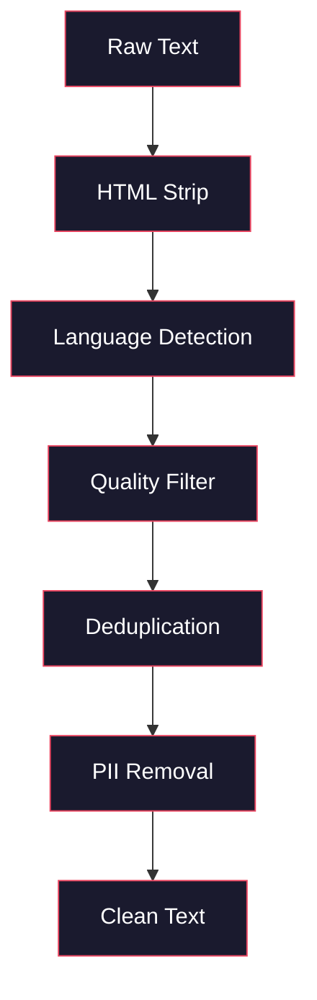
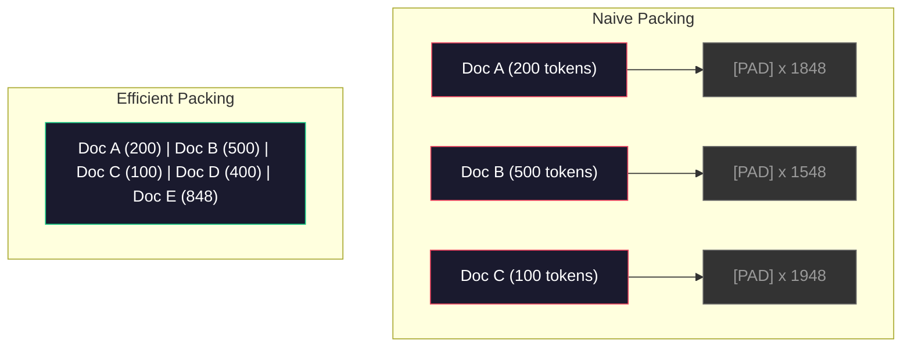

# पूर्व प्रशिक्षण के लिए डेटा पाइपलाइन

> मॉडल एक दर्पण है. यह जो भी डेटा आप उसे खिलाते हैं को दर्पण करता है. इसे कूड़ेदान खिलाता है, यह कूड़ेदान को पूरी तरलता से दर्पण करता है.

> **【中文解读】**模型 एक आरेख है, जो आपके द्वारा दिए गए डेटा को प्रतिबिंबित करता है। 预训练数据管线包括:去重,语言检测,内容过,流式分词,分块,打乱和批处理. सभी ऑपरेशन को टीबी स्तर के डेटा पर बिना内存 तक लोड किए किए किए पूरा किया जाना चाहिए।

> **【拓展：数据质量→GPT-4/Claude】**GPT-4 और क्लाउड का उच्च गुणवत्ता आउटपुट精心设计的数据管线 से उत्पन्न होता है। लामा 3 का पूर्व प्रशिक्षण डेटा 15T टोकन शामिल है, कठोर परिश्रम और गुणवत्ता के माध्यम से पार किया गया है।

**Type:** Build
**Languages:** Python
**Prerequisites:** Phase 10, Lessons 01-02 (Tokenizers, Building a Tokenizer)
**Time:** ~90 minutes

## सीखने के लक्ष्य

- एक स्ट्रीमिंग डेटा पाइपलाइन बनाएं जो मेमोरी में लोड किए बिना टेक्स्ट के टेराबाइट्स को टोकन, टुकड़े, मिक्स और बैच करता है
  ् ् ् ् ् ् ् ् ् ् ् ् ् ् ् ् ् ् ् ् ् ् ् ् ् ् ् ् ् ् ् ् ् ् ् ् ् ् ् ् ् ् ् ् ् ् ् ् ् ् ् ् ् ् ् ् ् ् ् ् ् ् ् ् ् ् ् ् ् ् ् ् ् ् ् ् ् ् ् ् ् ् ् ् ् ् ् ् ् ् ् ् ् ् ् ् ् ् ् ् ् ् ् ् ् ् ् ् ् ् ् ् ् ् ् ् ् ् ् ् ् ् ् ् ् ् ् ् ् ् ् ् ् ् ् ् ् ् ् ् ् ् ् ् ् ् ् ् ् ् ् ् ् ् ् ् ् ् ् ् ् ् ् ् ् ् ् ् ् ् ् ् ् ् ् ् ् ् ् ् ् ् ् ् ् ् ् ् ् ् ् ् ् ् ् ् ् ् ् ् ् ् ् ् ् ् ् ् ् ् ् ् ् ् ् ् ् ् ् ् ् ् ् ् ् ् ् ् ् ् ् ् ् ् ् ् ् ् ् ् ् ् ् ् ् ् ् ् ् ् ् ् ् ् ्
- वास्तविक पूर्व-शिक्षण पाइपलाइनों में उपयोग किए जाने वाले डेटा गुणवत्ता फ़िल्टर (डिडप्लिकेशन, भाषा का पता लगाना, सामग्री फ़िल्टरिंग) को लागू करना
  实现真实预训练管线中使用的数据质量过器(去重、语言检测、内容过)
- ध्यान मास्क और दस्तावेज सीमा प्रबंधन के साथ निश्चित लंबाई के प्रशिक्षण अनुक्रम बनाएं
  चित्त ध्यान छिपावे और दस्तावेज सीमा प्रसंस्करण के लिए निश्चित लंबाई प्रशिक्षण क्रम का निर्माण
- प्रोफ़ाइल पाइपलाइन पारगमन डेटा लोडर GPU प्रशिक्षण गति के साथ बनाए रखने के लिए सुनिश्चित करने के लिए
  ️️️️️️️️️️️️️️️️️️️️️️️️️️️️️️️️️️️️️️️️️️️️️️️️️️️️️️️️️️️️️️️️️️️️️️️️️️️️️️️️️️️️️️️️️️️️️️️️️️️️️️️️️️️️️️️️️️️️️️️️️️️️️️️️️️️️️️️️️️️️️️️️️️️️️️️️️️️️️️️️️️️️️️️️️️️️️️️️️️️️️️️️️️️️️️️️️️️️️️️️️️️️️️️️️️️️️️️️️️️️️️️️️️️️️️️️️️️️️️️️️️️️️️️️️️️️️️️️️️️️️️️️️️️️️️️️️️️️️️️️️️️️️️️️️️️️️️️️️️️️️️️️️️️️️️️️️️️️️️️️️️️️️️️️️️️️️️️️️️️️️️️️️️️️️️️️️️️️️️️️️️️️️️️️️️️️️️️️️️️️️️️️️️️️️️️️️️️️️️️️️️️️️️️️️️️️️️️️️️️️️️️️️️️️️️️️️️️️️️️️️️️️️️️️️️️️️️️️️️️️️️️️️️️️️️️️️️️️️️️️️️️️️️️️️️️️️️️️️️️️️️️️️️️️️

> **【中文解读】**इस कोर्स में फोकस किया गया है डेटा ट्यूब लाइन LLM  गुणवत्ता का वास्तविक निर्णायक कारक  आप एक प्रवाहात्मक डेटा ट्यूब लाइन का निर्माण करेंगे, जिसे टीबी 级 डेटा पर पुनः प्राप्त किया जाएगा  MinHash+LSH)  गुणवत्ता过、分词打包和批处理, तथा सभी ऑपरेशनों को डेटा का पूरा भार内存 में नहीं किया जा सकता है 

## समस्या  समस्या परिचय

आपके पास एक टोकन है, अब आपको डेटा की जरूरत है।

> तुम एक शब्द है. अब तुम डेटा की जरूरत है.

कोई डेटा सेट नहीं, कोई सीएसवी फ़ाइल नहीं. टेराबाइट्स पाठ -- साफ, डिडप्लिकेट, गुणवत्ता के लिए फ़िल्टर, निश्चित लंबाई के अनुक्रमों में टोकन, और यादृच्छिक बैच में पर्याप्त तेजी से सेवा की है कि आपका 8-जीपीयू क्लस्टर अगले बैच के लिए कभी इंतजार नहीं करता है।

> ️ ️ ️ ️ ️ ️ ️ ️ ️ ️ ️ ️ ️ ️ ️ ️ ️ ️ ️ ️ ️ ️ ️ ️ ️ ️ ️ ️ ️ ️ ️ ️ ️ ️ ️ ️ ️ ️ ️ ️ ️ ️ ️ ️ ️ ️ ️ ️ ️ ️ ️ ️ ️ ️ ️ ️ ️ ️ ️ ️ ️ ️ ️ ️ ️ ️ ️ ️ ️ ️ ️ ️ ️ ️ ️ ️ ️ ️ ️ ️ ️ ️ ️ ️ ️ ️ ️ ️ ️ ️ ️ ️ ️ ️ ️ ️ ️ ️ ️ ️ ️ ️ ️ ️ ️ ️ ️ ️ ️ ️ ️ ️ ️ ️ ️ ️ ️ ️ ️ ️ ️ ️ ️ ️ ️ ️ ️ ️ ️ ️ ️ ️ ️ ️ ️ ️ ️ ️ ️ ️ ️ ️ ️ ️ ️ ️ ️ ️ ️ ️ ️  ️ ️ ️ ️ ️ ️ ️ ️ ️ ️ ️ ️  ️ ️   ️  

अधिकांश लोग सोचते हैं कि एलएलएम प्रशिक्षण मॉडल वास्तुकला के बारे में है। यह नहीं है। Llama 3 ने 15.6 ट्रिलियन टोकन का उपयोग किया। GPT-3 ने 300 बिलियन का उपयोग किया। डीपसेक-वी 2 ने 8.1 ट्रिलियन का उपयोग किया। तीनों में वास्तुकला लगभग समान हैः ध्यान और फीडफॉरवर्ड परतों के साथ स्टैक किए गए ट्रांसफार्मर ब्लॉक। आउटपुट गुणवत्ता में अंतर डेटा से भारी मात्रा में आता है।

> अधिकांश लोग मानते हैं कि प्रशिक्षण LLM मॉडल संरचना के बारे में है। यह नहीं है। लामा 3 ने 15.6 बिलियन टोकन का उपयोग किया। GPT-3 ने 3000 बिलियन का उपयोग किया। डीपसईक-वी 2 ने 8.1 बिलियन का उपयोग किया।

डीपमाइंड के चिंचिला पेपर ने यह सटीक बताया। किसी दिए गए कम्प्यूटिंग बजट के लिए, प्रशिक्षण टोकन के लिए मॉडल मापदंडों का एक इष्टतम अनुपात है। चिंचिला ने दिखाया कि 2022 में अधिकांश मॉडल काफी कम प्रशिक्षित थे -- उनके पास देखने वाले डेटा की मात्रा के लिए बहुत सारे पैरामीटर थे। 1.4 ट्रिलियन टोकन (चिंचिला-उत्तम) पर प्रशिक्षित 70B पैरामीटर मॉडल ने 300 बिलियन टोकन (गोफर) पर प्रशिक्षित 280B मॉडल से बेहतर प्रदर्शन किया।

> डीपमाइंड के चिंचिला 论文 ने इस बात को सटीक रूप से समझाया है। किसी दिए गए गणना बजट के लिए, मॉडल पैरामीटर और प्रशिक्षण टोकन के बीच सबसे अच्छा अनुपात है। चिंचिला ने दिखाया है कि 2022 के अधिकांश मॉडल गंभीर रूप से प्रशिक्षण से कम हैं। वे देखने वाले डेटा की मात्रा के लिए बहुत अधिक पैरामीटर हैं। 1.4 बिलियन टोकन पर प्रशिक्षित 70B पैरामीटर मॉडल (Chinchilla Optimal) 3000 बिलियन टोकन पर प्रशिक्षित 280B मॉडल (Gopher) से अधिक है।

आपका डेटा पाइपलाइन यह निर्धारित करता है कि आपका मॉडल भाषा सीखता है या शोर सीखता है।

> आपका डेटा ट्यूबलाइन तय करता है कि आपका मॉडल भाषा या शोर सीखता है।

> **【中文解读】**चिंचिला 论文(DeepMind 2022) प्रमाणः स्थिर गणना शक्ति बजट में, मॉडल तत्वों और प्रशिक्षण टोकन संख्याओं का अनुपात बराबर होना चाहिए विस्तार।

> **【拓展：数据混合比的工程经验】**एलएएमए 3 के सार्वजनिक डेटा वितरण अनुपात में लगभग 50% वेब पेज डेटा, 25% कोड, 13% किताबें और शोधपत्र, 8% गणित, 4% बहुभाषी वेब पेज, जीपीटी-4 के प्रशिक्षण डेटा में बड़ी संख्या में कोड शामिल हैं, तर्क क्षमता में सुधार) और शैक्षणिक दस्तावेजों में सुधार (वास्तविकता में सुधार) ।

>  **【前置】**学本节前कृपया पहले समझेंः(1) चरण 10·01 和 02(分词器)  समझ टोकन 与字节流;(2) चरण 10·01  उल्लेखित चिनचिला स्केलिंग कानून समझ参数与 टोकन数的最佳比例;(3) पायथन 生成器 / `IterableDataset`/`datasets.stream`流式处理范式;(4) MinHash + LSH 近似去重算法(不熟悉请先看Llama 3 / RefinedWeb 论文的相关章节)

## अवधारणा का मूल अवधारणा

### डेटा कहाँ से आया

प्रत्येक बड़े भाषा मॉडल को स्रोतों के मिश्रण पर प्रशिक्षित किया जाता है। सटीक रचना अधिकांश प्रयोगशालाओं के लिए एक सावधानीपूर्वक संरक्षित रहस्य है, लेकिन हम श्रेणियों को समझने के लिए पर्याप्त जानते हैं।

> प्रत्येक प्रमुख भाषा मॉडल मिश्रित डेटा स्रोत पर प्रशिक्षित है। अधिकांश प्रयोगशालाओं में सटीक संरचना की गोपनीयता होती है, लेकिन हम सभी को समझने के लिए पर्याप्त ज्ञान प्राप्त है।

| Source | Size | Quality | Used By |
|--------|------|---------|---------|
| Common Crawl | ~250 TB raw | Low (needs heavy filtering) | GPT-3, Llama, most open models |
| Wikipedia | ~20 GB | High | Every major LLM |
| GitHub code | ~1 TB+ | Medium (lots of duplicates, dead code) | StarCoder, CodeLlama, DeepSeek-Coder |
| Books (BookCorpus, Pile) | ~100 GB | High | GPT-2, GPT-3, early models |
| Academic papers (arXiv, S2ORC) | ~100 GB | High for STEM | Llama, Galactica |
| StackOverflow, Reddit | ~100 GB | Medium | Llama, Falcon |
| Curated web (C4, RefinedWeb) | ~5 TB | Medium-High (pre-filtered) | T5, Falcon |

Llama 3 ने अपने डेटा मिक्स का खुलासा कियाः लगभग 50% वेब डेटा, 25% कोड, 13% किताबें और अकादमिक पत्र, 8% गणित डेटा, और 4% बहुभाषी वेब डेटा। कुल 15.6 ट्रिलियन टोकन थे जो 5 टीबी से अधिक कच्चे पाठ के स्रोतों से थे।

> Llama 3 ने अपने डेटा वितरण अनुपात को खुलासा कियाः लगभग 50% 网页数据、25% 代码、13% 书籍 एवं学术论文、8% 数学数据 और 4% 多语言网页数据── कुल 15.6 बिलियन टोकन, 5 TB से अधिक मूल ग्रंथ के डेटा स्रोत से प्राप्त हुए हैं।

अनुपात उतना ही मायने रखता है जितना कि कुल आकार। बहुत अधिक वेब डेटा और मॉडल एक रेडिट चप्पू बन जाता है। बहुत कम कोड और यह प्रोग्राम नहीं कर सकता है। बहुत कम गणित और यह तर्क में विफल रहता है। इस मिश्रण को सही करना LLM के प्रशिक्षण के सबसे कठिन भागों में से एक है, और कोई सूत्र नहीं है - यह प्रयोग और मूल्यांकन की आवश्यकता है।

> उदाहरण के लिए, कुल आकार के साथ समान रूप से महत्वपूर्ण है। बहुत अधिक वेब पेज डेटा, मॉडल Reddit में बदल जाता है। बहुत कम कोड, यह प्रोग्राम नहीं करेगा।

### डेटा क्लीनिंग

कच्चे वेब डेटा गंदा है. एक आम क्रॉल डंप में शामिल हैंः

> एक विशिष्ट सामान्य क्रॉल 转储包含:

- HTML टैग और जावास्क्रिप्ट
  中文翻译:HTML 标签和 जावास्क्रिप्ट
- बॉयलरप्लेट हेडर, फुटर्स, नेविगेशन मेनू
  中文翻译:样板页眉、页脚、导航菜单
- दोहरे पृष्ठ (सही और लगभग दोहरे)
  中文翻译:重复页面(精确和近似重复)
- मशीन द्वारा उत्पन्न स्पैम
  中文翻译:机器生成的垃圾内容
- व्यक्तिगत रूप से पहचान योग्य जानकारी (PII)
  中文翻译:个人身份信息(पीआईआई)
- कम गुणवत्ता वाला पाठ (किवर्ड की सूची, एसईओ स्पैम)
  中文翻译:低质量文本(关键词列表、SEO 垃圾)
- पाठ के रूप में एन्कोड की गई गैर-पाठ सामग्री
  中文翻译:编码为文本的非文本内容

इसे साफ करना वैकल्पिक नहीं है। यह एक मॉडल के बीच अंतर है जो सुसंगत पैराग्राफ उत्पन्न करता है और एक जो उत्पाद सूचियों के साथ मिश्रित HTML टैग आउटपुट करता है।

> ् ् ् ् ् ् ् ् ् ् ् ् ् ् ् ् ् ् ् ् ् ् ् ् ् ् ् ् ् ् ् ् ् ् ् ् ् ् ् ् ् ् ् ् ् ् ् ् ् ् ् ् ् ् ् ् ् ् ् ् ् ् ् ् ् ् ् ् ् ् ् ् ् ् ् ् ् ् ् ् ् ् ् ् ् ् ् ् ् ् ् ् ् ् ् ् ् ् ् ् ् ् ् ् ् ् ् ् ् ् ् ् ् ् ् ् ् ् ् ् ् ् ् ् ् ् ् ् ् ् ् ् ् ् ् ् ् ् ् ् ् ् ् ् ् ् ् ् ् ् ् ् ् ् ् ् ् ् ् ् ् ् ् ् ् ् ् ् ् ् ् ् ् ् ् ् ् ् ् ् ् ् ् ् ् ् ् ् ् ् ् ् ् ् ् ् ् ् ् ् ् ् ् ् ् ् ् ् ् ् ् ् ् ् ् ् ् ् ् ् ् ् ् ् ् ् ् ् ् ् ् ् ् ् ् ् ् ् ् ् ् ् ् ् ् ् ् ् ् ् ् ् ् ् ्

>  **【类比】**डाटा管线像"自来水厂的多级过系统":原水(Common Crawl)→ 沉池(HTML 剥离)→ 沙(语言检测)→ 活性炭(质量分类器过 SEO 垃圾)→ 反透(MinHash 近似去重)→ 紫外线(PII 脱敏)→ 出水口(打包成代币片) ⋅ किसी भी एक वर्ग में漏掉, आख़िरी प्रवाह में "पानी" ⋅有杂质模型学到的就是杂质而非语言──Chinchilla 文文指出, तय मॉडल गुणवत्ता का मॉडल आकार नहीं है बल्कि "पानी की शुद्धता × 水量"──



प्रत्येक कदम शोर की एक श्रेणी को समाप्त करता हैः

> प्रत्येक चरण में शोर को समाप्त करनाः

**HTML stripping:**सभी मार्कअप हटा दें. केवल दृश्यमान पाठ सामग्री को रखें. पुस्तकालयों की तरह `trafilatura`या `readability`नेविगेशन, विज्ञापन और बॉयलरप्लेट को त्यागते हुए लेख सामग्री निकालें।

> **HTML 剥离：**移除所有标记──只保留可见文本内容──`trafilatura`या `readability`等库提取文章内容,同时丢弃导航、广告和样板──

**Language detection:**प्रत्येक दस्तावेज़ को वर्गीकृत करने के लिए फास्टटेक्स्ट के भाषा पहचान मॉडल (lid.176.bin) का उपयोग करें। अपने लक्षित भाषाओं में फ़िल्टर करें। 0.8 से कम आत्मविश्वास के साथ अंग्रेजी के रूप में वर्गीकृत एक दस्तावेज़ शायद शुद्ध अंग्रेजी नहीं है।

> **语言检测：**उपयोग फास्टटेक्स्ट का भाषा पहचान मॉडल (FASTTExt Language Identification Model) (lid.176.bin)

**Quality filtering:**यह दिलचस्प है। रिफाइनडवेब (फैल्कन के पीछे डेटासेट) एक जटिलता आधारित फ़िल्टर का उपयोग करता हैः विकिपीडिया पर एक छोटे से भाषा मॉडल को प्रशिक्षित करें, फिर प्रत्येक दस्तावेज़ को स्कोर करें। उच्च जटिलता का मतलब है कि दस्तावेज़ विकिपीडिया से अलग है - संभवतः स्पैम, खोजशब्द सूची या मशीन-जनित सामग्री। एक सीमा से ऊपर की जटिलता वाले दस्तावेज़ हटा दिए जाते हैं।

> **质量过滤：**यह दिलचस्प हिस्सा है। रिफाइन वेब (फाल्कन के पीछे का डेटा संग्रह) भ्रम आधारित फ़िल्टर का उपयोग करता हैः विकिपीडिया पर एक छोटे से भाषा मॉडल को प्रशिक्षित करें, फिर प्रत्येक लेख के लिए एक रेटिंग प्रदान करें। उच्च भ्रम का मतलब है कि विकिपीडिया की तरह नहीं है।

**Deduplication:**सबसे प्रभावशाली सफाई चरण. कॉमन क्रॉल में बड़ी संख्या में डुप्लिकेट पृष्ठ शामिल हैं - कानूनी अस्वीकरण, कुकी सूचनाएं, सेवा की शर्तें। डुप्लिकेट पर प्रशिक्षण कचरा गणना और मॉडल को याद रखने और विशिष्ट अनुच्छेदों को शाब्दिक रूप से फिर से उबालने के लिए कर सकता है।

> **去重：**影响最大的清洗步骤──Common Crawl 包含大量重复页面法律声明、cookie 通知、服务条款──重复数据 पर अभ्यास करने में व्यय गणना क्षमता, भी हो सकती है, जिससे मॉडल के शब्द-शब्द स्मरण और पुनश्चरण के विशिष्ट खंडों में वृद्धि हो सकती है──

**PII removal:**नाम, ईमेल पते, फोन नंबर, सामाजिक सुरक्षा नंबर, संरचित PII के लिए Regex आधारित पता लगाना, संदर्भ में नाम के लिए NER मॉडल।

> **PII 移除：**姓名、电子邮件地址、电话号码、社会安全号码── संरचनात्मक PII उपयोग正则检测,上下文中的姓名 उपयोग NER 模型──

> **【中文解读】**डाटा सफाई पूर्व प्रशिक्षण में सबसे ज्यादा असभ्य है लेकिन सबसे महत्वपूर्ण घटक है। मूल वेब पेज डेटा भरा हुआ है:HTML 标签、导航菜单、机器生成的SEO 垃圾、个人隐私信息(PII) ❏ सफाई管线依次执行:HTML 剥离 → 语言检测 → 质量过 → 去重 → PII 移除。RefinedWeb उपयोग困惑度过 विकिपीडिया पर प्रशिक्षित एक छोटा भाषा मॉडल, प्रत्येक लेख के लिए रेटिंग, उच्च उलझन度文档 垃圾内容) को हटाने──

> **【拓展：去重的工程影响】**लामा टीम रिपोर्ट के अनुसार, लगभग 38% वेब पेज डेटा को पुनः स्थानांतरित करने के माध्यम से। कॉमन क्रॉल में से अधिक से अधिक तीसरे भाग में से एक पृष्ठ दोहराया या निकटतापूर्वक दोहराया गया है।

> ️ **【易错点】**चार सामान्य गड्ढे: ((1) **整库加载进内存**`datasets.load_dataset("common_crawl", split="train")`默认会实例化全部15T टोकन, अनिवार्य रूप से OOM; अनिवार्य रूप से उपयोग करना`streaming=True`या `IterableDataset`;(2) **去重时把"高密度优质内容"误删**文档 A 包含整篇 विकिपीडिया(5KB),文档 B 只是引用一句话的博客(500 字),MinHash 误判为高相似度──修复:在 shingle 之前对每篇文档归归一化长度,或对小文档用更保守的值;(3) **打包（pack）跨文档 attention 漏 mask**把3 篇短文拼拼进2048 टोकन,但没有添加文件边界面具,第1 末尾的 टोकन 会"看到"第2 开头的 टोकन,造成跨文档污染;修复:使用FlashAttention的 `varlen`接口 या ब्लॉक-आयामी ध्यान मुखौटा;(4) **配比（mix）在 epoch 间漂移**मिश्रण 时按"文档级"而不是" टोकन 级"采样, परिणाम小文档被过度采样、大文档欠采样──

### MinHash के साथ डिडप्लिकेशन

सटीक डिडप्लिकेशन आसान हैः प्रत्येक दस्तावेज़ को हैश करें, डुप्लिकेट हटाएं। लेकिन लगभग डुप्लिकेट असली समस्या है। इसके चारों ओर थोड़ा अलग विज्ञापनों के साथ एक ही समाचार लेख की दो प्रतियां लगभग डुप्लिकेट हैं। सामग्री 95% समान है, लेकिन बाइट-टू-बाइट वे भिन्न हैं।

> 精确去重很简单: प्रत्येक आलेख के लिए 哈希,移除重复──但近似重复才是真正的问题──同一新闻文章 के दो प्रतियां,周围广告略有不同,就是近似重复──内容 95% समान,但字节不同──

MinHash + स्थान-संवेदनशील हैशिंग (LSH) इसको कुशलतापूर्वक हल करता है।

> MinHash + 局部敏感哈希(LSH)高效地 हल किया यह समस्या


विचारः

> 核心思想:

1. **Shingling:**प्रत्येक दस्तावेज़ को n-ग्राम (जैसे, 5 ग्राम शब्दों या वर्णों के) के सेट में परिवर्तित करें। 3-शब्दों के शिंगल के साथ "त्वरित भूरे लोर" {"त्वरित भूरे लोर"} बन जाता है।
   中文翻译:**Shingling：**将每篇文档转换为一组 n-gram 集合(如 5词或 5字符的 n-gram) ・・・"त्वरित भूरे लोर" 用 3词 shingle 变为 {"त्वरित भूरे लोर"}。

2. **MinHash:**प्रत्येक दस्तावेज़ के शिंगल सेट के लिए, k हैश मानों की गणना करें। प्रत्येक हैश मान एक अलग हैश फ़ंक्शन के तहत सभी शिंगल पर न्यूनतम हैश है। यह एक निश्चित आकार का "हस्ताक्षर" बनाता है जो किसी भी दो दस्तावेजों के बीच जैकार्ड समानता के करीब है।
   中文翻译:**MinHash：**प्रत्येक दस्तावेज़ के लिए छिलके का संचलन गणना k 个哈希值── प्रत्येक哈希值 सभी छिलके के लिए अलग-अलग哈希 फ़ंक्शन के तहत न्यूनतम है── यह एक निश्चित आकार का "हस्ताक्षर" बनाता है, जो किसी भी दो दस्तावेज़ों के जैकर्ड समानता के समान है──

3. **LSH:**दस्तावेजों को अपने MinHash हस्ताक्षर के बैंड के आधार पर बाल्ट में समूह करें। एक ही बाल्ट में दस्तावेज उम्मीदवार लगभग डुप्लिकेट हैं। यह प्रत्येक जोड़ी की तुलना से बचता है - आप केवल उम्मीदवारों की तुलना करते हैं।
   中文翻译:**LSH：**根据MinHash 签名条带将文档分组到桶中──同一桶中的文档是候选人近似重复── इससे दो मतभेदों से बचा जा सकता है केवल उम्मीदवारों के साथ तुलना करना

4. **Verify:**प्रत्येक उम्मीदवार जोड़ी के लिए, जैकार्ड की सटीक समानता की गणना करें। यदि समानता एक सीमा (आमतौर पर 0.8) से अधिक है तो एक प्रति हटा दें।
   中文翻译:**验证：**प्रत्येक उम्मीदवार के लिए, गणना सटीक जैकार्ड समरूपता। यदि समरूपता मूल्य से अधिक है, तो एक प्रति को हटा दिया जाता है।

लामा टीम ने बताया कि उन्होंने अपने वेब डेटा का लगभग 38% डिडप्लिकेशन के माध्यम से हटा दिया। यह कोई छोटी संख्या नहीं है। कॉमन क्रॉल का एक तिहाई से अधिक दोहरी या लगभग दोहरी सामग्री है।

> लामा टीम की रिपोर्ट में लगभग 38% वेब पेज डेटा को पुनः स्थानांतरित करने के लिए कहा गया है। यह एक छोटा सा आंकड़ा नहीं है।

### अनुक्रम पैकिंग

आपके मॉडल में निश्चित लंबाई के इनपुट अनुक्रमों की उम्मीद है आपके दस्तावेज़ों में परिवर्तनीय लंबाई है. कुछ 50 टोकन हैं. कुछ 50,000 टोकन हैं.

> आपके मॉडल की उम्मीद है कि आपके दस्तावेज़ की लंबाई एक नहीं है। कुछ 50 टोकन हैं। कुछ 50,000 टोकन हैं।

साफ़-साफ़ दृष्टिकोणः प्रत्येक दस्तावेज़ को अधिकतम अनुक्रम लंबाई तक पैड करें। यह पैडिंग टोकन पर भारी गणना को बर्बाद करता है जो सीखने में कुछ भी योगदान नहीं देता है।

> 朴素方法: प्रत्येक दस्तावेज़ को अधिकतम क्रम लंबाई तक भरा जाए।

बेहतर दृष्टिकोणः एक एकल अनुक्रम में कई दस्तावेजों को पैक करें, क्रम के अंत टोकन द्वारा अलग। 2048 टोकन अनुक्रम में तीन छोटे दस्तावेज हो सकते हैं जो उनके बीच [ईओएस] टोकन के साथ संश्लेषित हैं।

> बेहतर तरीकाः एक 2048 टोकन के लिए एक क्रम में तीन लघु दस्तावेज हो सकते हैं, मध्य में [EOS] टोकन 连接──

> 🤔 **【困惑】**Q: 既然包装会跨文档污染,为什么不直接使用填充?多浪费点算力换正确性不是更稳定吗? A: 因为预训练算力极其昂贵Llama 3 训练成本估计为10亿美元――包装 把序列平均填充率从 ~40%带填充)升至~95%+,等于把训练成本砍掉一半以上 ((约省5000万美元) ⋅ सही做法不是退回填充,而是用文件边界的填充方式FlashAttention 的`cu_seqlens`या ब्लॉक-आयामी ध्यान) 1  अंतिम क्वेरी को 2  के कुंजी/मूल्य तक नहीं देखना है।



ध्यान मास्क को सही ढंग से सेट किया जाना चाहिए। दस्तावेज़ A से टोकन एक ही पैक अनुक्रम के भीतर दस्तावेज़ B से टोकन को ध्यान में नहीं रखना चाहिए। इसके लिए ब्लॉक-आयामी ध्यान मास्क की आवश्यकता होती है।

> ध्यान ध्यान ध्यान छिपाने की आवश्यकता है सही ढंग से सेट करना चाहिए।

लंबे दस्तावेजों को अनुक्रम सीमाओं पर टुकड़ों में विभाजित किया जाता है। विभाजन बिंदु मायने रखता हैः वाक्य के बीच में विभाजन मॉडल को अपूर्ण विचार देखने के लिए मजबूर करता है। कुछ पाइपलाइनें अनुच्छेद या वाक्य सीमाओं में विभाजन को संरेखित करती हैं जब संभव हो।

> 长文档序列边界处被切断或分分成块──分分点很重要:句子中分迫使模型看到不完整的思想── कुछ管线在可能时将分点对齐到段落或句子边界──

> **【中文解读】**序列打包(Sequence Packing) is going to change长文档 भरावे to fixed length training sequence 技术── सरल विधि PAD 填充会浪费大量算力──高效方法将多个短文档用 [EOS] 分隔拼接进同一序列,但需要块对角注意力掩码(block-diagonal attention mask)文档 A का टोकन एक ही क्रम में文档 B का टोकन ध्यान नहीं देना चाहिए──

> **【拓展：Chinchilla 定律与过度训练】**चिनचिल्ला के नियम के अनुसार मॉडल पैरामीटर और प्रशिक्षण टोकन संख्याएं बढ़े हैं। लेकिन लामा 3 के 70 बी मॉडल 15 टी टोकन पर प्रशिक्षण करते हैं। यह "अधिकतम पर विचार करें" रणनीति हैः अधिक खर्च की प्रशिक्षण लागत एक बार की है, लेकिन छोटे मॉडल सेवा लागत स्थायी रूप से कम है।

### चिंचिला स्केलिंग कानून

एक निश्चित गणना बजट C (FLOP में मापा जाता है) के लिए, आदर्श मॉडल आकार N और डेटासेट आकार D निम्नानुसार हैंः

>  निश्चित गणना बजट के लिए C(以 FLOPs 衡量), सबसे अच्छा मॉडल आकार N 和 डेटा集 आकार D  निम्नानुसार हैः

```
N_opt ~ C^0.5
D_opt ~ C^0.5
```

अभ्यास में, इसका मतलब है कि आपको मॉडल आकार और डेटासेट आकार को लगभग समान रूप से मापना चाहिए। 10 गुना अधिक मापदंडों वाले मॉडल को समान हानि तक पहुंचने के लिए लगभग 10 गुना अधिक प्रशिक्षण टोकन की आवश्यकता होती है।

> अभ्यास में, इसका मतलब है कि आपको मॉडल आकार और डेटाबेस आकार के समान अनुपात में विस्तार करना चाहिए।

| Model | Parameters | Training Tokens | Chinchilla-Optimal? |
|-------|-----------|----------------|-------------------|
| GPT-3 | 175B | 300B | No (undertrained 3-4x) |
| Chinchilla | 70B | 1.4T | Yes (by design) |
| Llama 2 | 70B | 2T | Overtrained (intentionally) |
| Llama 3 | 70B | 15T | Heavily overtrained |

Llama 3 जानबूझकर Chinchilla कानून का उल्लंघन करता है। मेटा ने पाया कि अधिक डेटा पर ओवरट्रेनिंग - कम्प्यूटिंग-ऑप्टिमाइल अनुपात से बहुत परे - निष्कर्ष के लिए बेहतर मॉडल पैदा करता है। अतिरिक्त प्रशिक्षण लागत एक बार भुगतान की जाती है, लेकिन छोटे मॉडल को हमेशा के लिए सेवा करने के लिए सस्ता होता है। इसे कभी-कभी "उपलब्धता-ऑप्टिमाइल" स्केलिंग दृष्टिकोण कहा जाता है, और यह 2024 से उद्योग मानक बन गया है।

> Llama 3 ने Chinchilla के नियम का उल्लंघन किया है। मेटा ने पाया है कि अधिक डेटा के साथ अधिक से अधिक अत्यधिक प्रशिक्षण दूर से गणना करने का सबसे अच्छा अनुपात बेहतर मॉडल उत्पन्न कर सकता है। अतिरिक्त प्रशिक्षण लागत केवल एक बार भुगतान की जाती है, लेकिन छोटे मॉडल स्थायी रूप से अधिक सस्ती सेवा। इसे कभी-कभी "अनुमानित सर्वोत्तम" संकुचन विधि कहा जाता है, जो 2024 से उद्योग मानक बन गया है।

## इसे बनाओ, इसे पूरा करो।
```figure
l5-data-pipeline
```

## इसे बनाओ

### चरण 1: पाठ को साफ करना

HTML को स्ट्रिप करें, व्हाइटस्पेस को सामान्य करें, गैर-पाठ सामग्री को हटा दें. हम अपने छोटे कॉर्पस के रूप में एक सार्वजनिक डोमेन पाठ (प्रोजेक्ट गुटेनबर्ग) का उपयोग करेंगे।

> 剥离 HTML、归一化空白、移除文本内容──我们将使用公共领域文本 (古堡计划)作为小型语料──

```python
import re

def clean_text(text):
    text = re.sub(r"<[^>]+>", "", text)
    text = re.sub(r"http\S+", "", text)
    text = re.sub(r"[^\x20-\x7E\n]", "", text)
    text = re.sub(r"\n{3,}", "\n\n", text)
    text = re.sub(r" {2,}", " ", text)
    return text.strip()

def quality_filter(text, min_words=50, max_ratio_caps=0.3, max_ratio_special=0.1):
    words = text.split()
    if len(words) < min_words:
        return False
    caps_ratio = sum(1 for w in words if w.isupper()) / len(words)
    if caps_ratio > max_ratio_caps:
        return False
    special_chars = sum(1 for c in text if not c.isalnum() and not c.isspace())
    if special_chars / max(len(text), 1) > max_ratio_special:
        return False
    return True
```

गुणवत्ता फ़िल्टर एसईओ स्पैम (ALL CAPS), मशीन-जनित शोर (उच्च विशेष वर्ण अनुपात) और स्टब पृष्ठ (बहुत छोटा) को पकड़ता है। ये तीन चेक अकेले वेब क्रॉल से एक आश्चर्यजनक मात्रा में कचरा निकालते हैं।

> 质量过器捕获 SEO 垃圾(全大写) 机器生成的噪音(高特殊字符比例) 和存储页面(太短) 

### चरण 2: MinHash डिडप्लिकेशन

शून्य से MinHash लागू करें. कोई बाहरी पुस्तकालयों की आवश्यकता नहीं है - बस`hashlib`. .

> 零实现 MinHash──不需要外部库只需 `hashlib`

```python
import hashlib
from collections import defaultdict

def get_shingles(text, k=5):
    words = text.lower().split()
    if len(words) < k:
        return set()
    return {" ".join(words[i:i+k]) for i in range(len(words) - k + 1)}

def minhash_signature(shingles, num_hashes=128):
    signature = []
    for i in range(num_hashes):
        min_hash = float("inf")
        for shingle in shingles:
            h = int(hashlib.sha256(f"{i}:{shingle}".encode()).hexdigest(), 16)
            min_hash = min(min_hash, h)
        signature.append(min_hash)
    return signature

def lsh_buckets(signature, bands=16):
    rows_per_band = len(signature) // bands
    buckets = []
    for b in range(bands):
        start = b * rows_per_band
        band_data = tuple(signature[start:start + rows_per_band])
        bucket_hash = hashlib.md5(str(band_data).encode()).hexdigest()
        buckets.append((b, bucket_hash))
    return buckets

def deduplicate(documents, threshold=0.8, num_hashes=128, bands=16):
    signatures = []
    shingle_sets = []
    for doc in documents:
        shingles = get_shingles(doc)
        shingle_sets.append(shingles)
        signatures.append(minhash_signature(shingles, num_hashes))

    bucket_map = defaultdict(list)
    for doc_idx, sig in enumerate(signatures):
        for band_id, bucket_hash in lsh_buckets(sig, bands):
            bucket_map[(band_id, bucket_hash)].append(doc_idx)

    duplicate_pairs = set()
    for bucket_docs in bucket_map.values():
        if len(bucket_docs) < 2:
            continue
        for i in range(len(bucket_docs)):
            for j in range(i + 1, len(bucket_docs)):
                duplicate_pairs.add((bucket_docs[i], bucket_docs[j]))

    removed = set()
    for i, j in duplicate_pairs:
        if i in removed or j in removed:
            continue
        s1, s2 = shingle_sets[i], shingle_sets[j]
        if not s1 or not s2:
            continue
        jaccard = len(s1 & s2) / len(s1 | s2)
        if jaccard >= threshold:
            removed.add(j)

    return [doc for idx, doc in enumerate(documents) if idx not in removed], len(removed)
```

`num_hashes=128`और `bands=16`अधिक हैश अधिक सटीक समानता अनुमान देते हैं। अधिक बैंड अधिक झूठे सकारात्मक की लागत पर यादृच्छिकता (अधिक डुप्लिकेट पकड़ते हैं) को बढ़ाते हैं। ये मान सामान्य वेब पाठ के लिए अच्छी तरह से काम करते हैं।

> `num_hashes=128`和 `bands=16`参数 नियंत्रण सटीकता-उपचार दर का वजन  अधिक ह ह ह ह ह ह ह ह ह ह ह ह ह ह ह ह ह ह ह ह ह ह ह ह ह ह ह ह ह ह ह ह ह ह ह ह ह ह ह ह ह ह ह ह ह ह ह ह ह ह ह ह ह ह ह ह ह ह ह ह ह ह ह ह ह ह ह ह ह ह ह ह ह ह ह ह ह ह ह ह ह ह ह ह ह ह ह ह ह ह ह ह ह ह ह ह ह ह ह ह ह ह ह ह ह ह ह ह ह ह ह ह ह ह ह ह ह ह ह ह ह ह ह ह ह ह ह ह ह ह ह ह ह ह ह ह ह ह ह ह ह ह ह ह ह ह ह ह ह ह ह ह ह ह ह ह ह ह ह ह ह ह ह ह ह ह ह ह ह ह ह ह ह ह ह ह ह ह ह ह ह ह ह ह ह ह ह ह ह ह ह ह ह ह ह ह ह ह ह ह ह ह ह ह ह ह ह ह ह ह ह ह ह ह ह ह ह ह ह ह ह ह ह ह ह ह ह ह ह ह ह ह ह ह ह ह ह ह ह ह ह ह ह ह ह ह ह ह ह ह ह ह ह ह ह ह ह ह ह ह ह ह ह ह ह ह ह ह ह ह ह ह ह ह ह ह ह ह ह ह ह ह ह ह ह ह ह ह ह ह ह ह ह ह ह ह ह ह ह ह ह ह ह ह ह ह ह ह ह ह ह ह ह ह ह ह ह ह ह ह ह ह ह ह ह ह ह ह ह ह ह ह ह ह ह ह ह ह ह ह ह ह ह ह ह ह ह ह ह ह ह ह ह ह ह ह ह ह ह ह ह ह ह ह ह ह ह ह ह ह ह ह ह ह ह ह ह ह ह ह ह ह ह ह ह ह ह ह ह ह ह ह ह ह ह ह ह ह ह ह ह ह ह ह ह ह ह ह ह ह ह ह ह ह ह ह ह ह ह ह ह ह ह ह ह ह ह ह ह ह ह ह ह ह ह ह ह ह ह ह ह ह ह ह ह ह ह ह ह ह ह ह ह ह ह ह ह ह ह ह ह ह ह ह ह ह ह ह ह ह ह ह ह ह ह ह ह ह ह ह ह ह ह ह ह ह ह ह ह ह ह ह ह ह

### चरण 3: टोकन और पैक अनुक्रम

साफ, डिडप्लिकेट पाठ लें, उसे टोकन बनाएं, और प्रशिक्षण के लिए निश्चित लंबाई के अनुक्रमों में पैक करें।

> 取清洗、去重后的文本,分词,打包为固定长度序列用于训练──

```python
def tokenize_corpus(documents, tokenizer):
    all_tokens = []
    for doc in documents:
        tokens = tokenizer.encode(doc)
        all_tokens.extend(tokens)
        all_tokens.append(tokenizer.eos_id)
    return all_tokens

def pack_sequences(token_ids, seq_length, pad_id=0):
    sequences = []
    attention_masks = []
    for i in range(0, len(token_ids), seq_length):
        seq = token_ids[i:i + seq_length]
        mask = [1] * len(seq)
        if len(seq) < seq_length:
            pad_count = seq_length - len(seq)
            seq = seq + [pad_id] * pad_count
            mask = mask + [0] * pad_count
        sequences.append(seq)
        attention_masks.append(mask)
    return sequences, attention_masks
```

### चरण 4: प्रशिक्षण के लिए डेटा लोडर

पैक अनुक्रमों के यादृच्छिक बैच उत्पन्न करें. यह प्रशिक्षण लूप खपत है.

> उत्पादन क्रमशः क्रमशः क्रमशः क्रमशः क्रमशः क्रमशः क्रमशः क्रमशः क्रमशः क्रमशः क्रमशः क्रमशः क्रमशः क्रमशः क्रमशः क्रमशः क्रमशः क्रमशः क्रमशः क्रमशः क्रमशः क्रमशः क्रमशः क्रमशः क्रमशः क्रमशः क्रमशः क्रमशः क्रमशः क्रमशः क्रमशः क्रमशः क्रमशः क्रमशः क्रमशः क्रमशः क्रमशः क्रमशः क्रमशः क्रमशः क्रमशः क्रमशः क्रमशः क्रमशः क्रमशः क्रमशः क्रमशः क्रमशः क्रमशः क्रमशः क्रमशः क्रमशः क्रमशः क्रमशः क्रमशः क्रमशः क्रमशः क्रमशः क्रमशः क्रमशः क्रमशः क्रमशः क्रमशः क्रमशः क्रमशः क्रमशः क्रमशः क्रमशः क्रमशः क्रमशः क्रमशः क्रमशः क्रमशः क्रमशः क्रमशः क्रमशः क्रमशः क्रमशः क्रमशः क्रमशः क्रमशः क्रमशः क्रमशः क्रमशः क्रमशः क्रमशः क्रमशः क्रमशः क्रमशः क्रमशः क्रमशः क्रमशः क्रमशः क्रमशः क्रमशः क्रमशः क्रमशः क्रमशः क्रमशः क्रमशः क्रमशः क्रमशः क्रमशः क्रमशः क्रमशः क्रमशः क्रमशः क्रमशः क्रमशः क्रमशः क्रमशः क्रमशः क्रमशः क्रमशः क्रमशः क्रमशः क्रमशः क्रमशः क्रमशः क्रमशः क्रमशः क्रमशः क्रमशः क्रमशः क्रमशः क्रमशः क्रमशः क्रमशः क्रमशः क्रमशः क्रमशः क्रमशः क्रमशः क्रमशः क्रमशः क्रमशः क्रमशः क्रमशः क्रमशः क्रमशः क्रमशः क्रमशः क्रमशः क्रमशः क्रमशः क्रमशः क्रमशः क्रमशः क्रमशः क्रमशः क्रमशः क्रमशः क्रमशः क्रमशः क्रमशः क्रमशः क्रमशः क्रमशः क्रमशः क्रमशः क्रमशः क्रमशः क्रमशः क्रमशः क्रमशः क्रमशः क्रमशः क्रमशः क्रमशः क्रमशः क्रमशः क्रमशः क्रमशः क्रमशः क्रमशः क्रमशः क्रमशः क्रमशः क्रमशः क्रमशः क्रमशः क्रमशः क्रमशः क्रमशः क्रमशः क्रमशः क्रमशः क्रमशः क्रमशः क्रमशः क्रमशः क्रमशः क्रमशः क्रमशः क्रमशः क्रमशः क्रमशः क्रमशः क्रमशः क्रमशः क्रमशः क्रमशः क्रमशः क्रमशः क्रमशः क्रमशः क्रमशः क्रमशः क्रमशः क्रमशः क्रमशः क्रमशः क्रमशः क्रमशः क्रमशः क्रमशः क्रमशः क्रमशः क्रमशः क्रमशः क्रमशः क्रमशः क्रमशः क्रमशः क्रमशः क्रमशः क्रमशः क्रमशः क्रमशः क्रमशः क्रमशः क्रमशः क्रमशः क्रमशः क्रमशः क्रमशः क्रमशः क्रमशः क्रमशः क्रमशः क्रमशः क्रमशः क्रमशः क्रमशः क्रमशः क्रमशः क्रमशः क्रमशः क्रमशः क्रमशः क्रमशः क्रमशः क्रमशः क्रमशः क्रम

```python
import random

class PreTrainingDataLoader:
    def __init__(self, sequences, attention_masks, batch_size, shuffle=True):
        self.sequences = sequences
        self.attention_masks = attention_masks
        self.batch_size = batch_size
        self.shuffle = shuffle

    def __len__(self):
        return (len(self.sequences) + self.batch_size - 1) // self.batch_size

    def __iter__(self):
        indices = list(range(len(self.sequences)))
        if self.shuffle:
            random.shuffle(indices)
        for start in range(0, len(indices), self.batch_size):
            batch_idx = indices[start:start + self.batch_size]
            batch_seqs = [self.sequences[i] for i in batch_idx]
            batch_masks = [self.attention_masks[i] for i in batch_idx]
            yield batch_seqs, batch_masks
```

### चरण 5: डेटासेट आँकड़े

महत्वपूर्ण संख्याओं की गणना करेंः कुल टोकन, अद्वितीय टोकन, संपीड़न अनुपात, दस्तावेज़ लंबाई वितरण।

> 计算关键指标:总代码 数、唯一代码 数、压缩比、文档长度分布──

```python
from collections import Counter

def compute_statistics(documents, token_ids, sequences, tokenizer_vocab_size):
    total_chars = sum(len(d) for d in documents)
    total_tokens = len(token_ids)
    unique_tokens = len(set(token_ids))
    compression_ratio = total_chars / total_tokens

    doc_lengths = [len(d.split()) for d in documents]
    avg_doc_length = sum(doc_lengths) / max(len(doc_lengths), 1)
    max_doc_length = max(doc_lengths) if doc_lengths else 0
    min_doc_length = min(doc_lengths) if doc_lengths else 0

    token_counts = Counter(token_ids)
    top_tokens = token_counts.most_common(10)

    non_pad_tokens = sum(sum(1 for t in seq if t != 0) for seq in sequences)
    total_positions = sum(len(seq) for seq in sequences)
    utilization = non_pad_tokens / max(total_positions, 1)

    stats = {
        "total_documents": len(documents),
        "total_characters": total_chars,
        "total_tokens": total_tokens,
        "unique_tokens": unique_tokens,
        "vocab_utilization": unique_tokens / tokenizer_vocab_size,
        "compression_ratio": compression_ratio,
        "avg_doc_length_words": avg_doc_length,
        "max_doc_length_words": max_doc_length,
        "min_doc_length_words": min_doc_length,
        "num_sequences": len(sequences),
        "sequence_utilization": utilization,
        "top_10_tokens": top_tokens,
    }
    return stats
```

संपीड़न अनुपात आपको बताता है कि टोकन इस कॉर्पस पर कितना कुशल है। अंग्रेजी पाठ आमतौर पर प्रति टोकन लगभग 3-4 वर्णों तक संपीड़ित होता है। यदि आप प्रति टोकन 1.5 वर्ण देखते हैं, तो आपका टोकनराइज़र बहुत आक्रामक रूप से विभाजित हो रहा है। यदि आप 8+ देखते हैं, तो यह बहुत डोमेन-विशिष्ट विलय सीख गया है।

> 压缩比告诉你分词器在此语料上的效率── अंग्रेज़ी ग्रंथ आमतौर पर प्रत्येक टोकन में लगभग 3-4 वर्णों तक संपीड़ित होते हैं── यदि आप प्रत्येक टोकन में 1.5 वर्ण देखते हैं, तो分词器分断过于激进── यदि आप 8+ देखते हैं, तो यह बहुत विशिष्ट क्षेत्र में एकीकरण प्राप्त हुआ है──

अनुक्रम उपयोग आपको बताता है कि आपके पैक अनुक्रमों में से कितना वास्तविक डेटा बनाम पैडिंग है. 90% से नीचे का मतलब है कि आपका पैकिंग अप्रभावी है - आप पैडिंग टोकन पर गणना बर्बाद कर रहे हैं.

> 序列 उपयोगिता दर आपको बताता है कि 序列 में से कितना 包包 包 包 包 包 包 包 包 包 包 包 包 包 包 包 包 包 包 包 包 包 包 包 包 包 包 包 包 包 包 包 包 包 包 包 包 包 包 包 包 包 包 包 包 包 包 包 包 包 包 包 包 包 包 包 包 包 包 包 包 包 包 包 包 包 包 包 包 包 包 包 包 包 包 包 包 包 包 包 包 包 包 包 包 包 包 包 包 包 包 包 包 包 包 包 包 包 包 包 包 包 包 包 包 包 包 包 包 包 包 包 包 包 包 包 包 包 包 包 包 包 包 包 包 包 包 包 包 包 包 包 包 包 包 包 包 包 包 包                                                                                                                                                                                                                      

## इसे फ्रेमवर्क के साथ लागू करें

### HuggingFace डेटासेट की तुलना करें

HuggingFace के डेटा सेट पुस्तकालय में एक ही corpus लोड करें और पाइपलाइन गति की तुलना करें।

> 通过 HuggingFace के डेटासेट 库加载相同语料并比较管线速度──

```python
from datasets import load_dataset
from transformers import AutoTokenizer

ds = load_dataset("wikitext", "wikitext-2-raw-v1", split="train")
tokenizer = AutoTokenizer.from_pretrained("meta-llama/Meta-Llama-3-8B")

import time

start = time.time()
tokenized = ds.map(
    lambda x: tokenizer(x["text"], truncation=True, max_length=2048),
    batched=True,
    num_proc=4,
)
hf_time = time.time() - start
total_tokens = sum(len(t) for t in tokenized["input_ids"])
print(f"HuggingFace: {total_tokens:,} tokens in {hf_time:.2f}s ({total_tokens/hf_time:,.0f} tokens/sec)")
```

HuggingFace पाइपलाइन में हुड के नीचे रस्ट टोकनाइज़र और 4 कोरों में समानांतर प्रसंस्करण का उपयोग किया जाता है। आपकी शुद्ध पायथन पाइपलाइन 10-50 गुना धीमी होगी। यही अंतर है कि उत्पादन टीमों द्वारा संकलित टोकनाइज़र का उपयोग क्यों किया जाता है। एल्गोरिथ्म समान है। कार्यान्वयन भाषा अंतर है।

> HuggingFace 管线底层 उपयोग Rust 分词器和 4 核并行处理。 आपका शुद्ध पायथन 管线会慢10-50倍── यही कारण है कि उत्पादन टीम का उपयोग编译分词器──算法相同──实现语言是区别──

## इसे भेजें उत्पाद

इस पाठ में LLM प्रशिक्षण पाइपलाइनों में डेटा गुणवत्ता को मान्य करने और डिबग करने के लिए एक संकेत मिलता है।`outputs/prompt-data-quality-checker.md`. .

> इस कोर्स को प्रमाणन एवं प्रसंस्करण के लिए प्रयोग किया जाता है।`outputs/prompt-data-quality-checker.md`

## अभ्यास विषय

1. **Easy:**सरल हेरिस्टिक (वर्ण सेट विश्लेषण) का उपयोग करके सफाई पाइपलाइन में भाषा का पता लगाने को जोड़ें। केवल अंग्रेजी दस्तावेजों को फ़िल्टर करें और मापें कि कितने दस्तावेज हटाए जाते हैं।
2. **Medium:**MinHash के निकट-डिडप्लिकेशन के साथ SHA-256 हैश का उपयोग करके सटीक डिडप्लिकेशन लागू करें। वेब-स्क्रैप किए गए कॉर्पस पर प्रत्येक विधि द्वारा पकड़े गए डुप्लिकेट की संख्या की तुलना करें।
3. **Hard:**एक जटिलता आधारित गुणवत्ता फ़िल्टर बनाएं। विकिपीडिया पाठ पर एक छोटे से बिग्राम भाषा मॉडल को प्रशिक्षित करें, प्रत्येक दस्तावेज़ को जटिलता के आधार पर स्कोर करें, और निचले 20% को हटा दें। फ़िल्टर किए गए बनाम अनफ़िल्टर किए गए डेटा पर प्रशिक्षण करते समय मॉडल आउटपुट गुणवत्ता की तुलना करें।

## कीवर्ड्स  शब्द खोज तालिका

| Term | What people say | What it actually means | 中文释义 |
|------|----------------|----------------------|---------|
| Common Crawl | "The internet" | A non-profit that crawls the web monthly -- ~250TB raw, the starting point for most LLM training data | 通用爬虫，LLM 训练数据的起点 |
| MinHash | "Some hashing trick" | A technique to estimate Jaccard similarity between sets using fixed-size signatures -- enables near-duplicate detection at scale | 最小哈希，近似重复检测的核心技术 |
| LSH | "Locality-Sensitive Hashing" | A method to group similar items into the same bucket -- reduces pairwise comparisons from O(n^2) to near-linear | 局部敏感哈希，将 O(n^2) 降为近似线性 |
| Sequence packing | "Concatenating documents" | Fitting multiple documents into fixed-length sequences with proper attention masks -- eliminates padding waste | 序列打包，消除填充浪费 |
| Chinchilla scaling | "Train on more data" | For a fixed compute budget, optimal performance requires scaling model size and training tokens roughly equally | Chinchilla 缩放定律，参数和数据应等比增长 |
| Fertility | "Tokens per word" | Average number of tokens per word -- 1.3 for English in GPT-4, higher for non-Latin scripts | 生育率，每词 token 数 |
| Data mixing | "Choosing training data" | The ratio of code vs text vs math vs multilingual data -- no formula, requires experimentation | 数据混合比，需实验确定 |
| Perplexity filter | "Quality scoring" | Use a small language model to score documents -- high perplexity means the text is unlike clean reference data | 困惑度过滤，低质量文档评分高 |
| Deduplication | "Removing copies" | Eliminating exact and near-duplicate documents -- typically removes 30-40% of raw web data | 去重，通常移除 30-40% 网页数据 |
| Attention mask | "Which tokens to look at" | A binary mask that prevents attention across document boundaries in packed sequences | 注意力掩码，阻止跨文档注意力 |

## आगे पढ़ना 延伸閱讀

- [Hoffmann et al., 2022 -- Training Compute-Optimal Large Language Models (Chinchilla)](https://arxiv.org/abs/2203.15556)-- पेपर जो डेटा स्केल के बारे में हमारी सोच को बदल गया
- [Penedo et al., 2023 -- The RefinedWeb Dataset for Falcon LLM](https://arxiv.org/abs/2306.01116)-- उच्च गुणवत्ता के लिए सामान्य क्रॉल को फ़िल्टर करने का तरीका
- [Touvron et al., 2023 -- Llama 2: Open Foundation and Fine-Tuned Chat Models](https://arxiv.org/abs/2307.09288)-- Llama 2 के लिए डेटा पाइपलाइन विवरण
- [Lee et al., 2022 -- Deduplicating Training Data Makes Language Models Better](https://arxiv.org/abs/2107.06499)-- क्यों डिडप्लिकेशन आप सोचते हैं से अधिक मायने रखता है
- [Broder, 1997 -- On the Resemblance and Containment of Documents](https://ieeexplore.ieee.org/document/666900)-- मूल मिन्हैश पेपर
- [Meta, 2024 -- Llama 3 Technical Report](https://arxiv.org/abs/2407.21783)-- 15.6T टोकन, डेटा मिश्रण अनुपात, फिल्टरिंग पाइपलाइन
