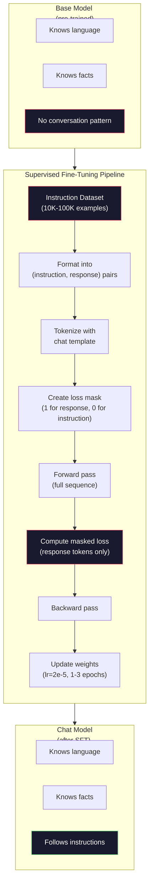

# निर्देश संरेखण (SFT) ✓ ✓ ✓ ✓ ✓ ✓ ✓ ✓ ✓ ✓ ✓ ✓ ✓ ✓ ✓ ✓ ✓ ✓ ✓ ✓ ✓ ✓ ✓ ✓ ✓ ✓ ✓ ✓ ✓ ✓ ✓ ✓ ✓ ✓ ✓ ✓ ✓ ✓ ✓ ✓ ✓ ✓ ✓ ✓ ✓ ✓ ✓ ✓ ✓ ✓ ✓ ✓ ✓ ✓ ✓ ✓ ✓ ✓ ✓ ✓ ✓ ✓ ✓ ✓ ✓ ✓ ✓ ✓ ✓ ✓ ✓ ✓ ✓ ✓ ✓ ✓ ✓ ✓ ✓ ✓ ✓ ✓ ✓ ✓ ✓ ✓ ✓ ✓ ✓ ✓ ✓ ✓ ✓ ✓ ✓ ✓ ✓ ✓ ✓ ✓ ✓ ✓ ✓ ✓ ✓ ✓ ✓ ✓ ✓ ✓ ✓ ✓ ✓ ✓ ✓ ✓ ✓ ✓ ✓ ✓ ✓ ✓ ✓ ✓ ✓ ✓ ✓ ✓ ✓ ✓ ✓ ✓ ✓ ✓ ✓ ✓ ✓ ✓ ✓ ✓ ✓ ✓ ✓ ✓ ✓ ✓ ✓ ✓ ✓ ✓ ✓ ✓ ✓ ✓ ✓ ✓ ✓ ✓ ✓ ✓ ✓ ✓ ✓ ✓ ✓ ✓ ✓ ✓ ✓ ✓ ✓ ✓ ✓ ✓ ✓ ✓ ✓ ✓ ✓ ✓ ✓ ✓ ✓ ✓ ✓ ✓ ✓ ✓ ✓ ✓ ✓ ✓ ✓ ✓ ✓ ✓ ✓ ✓ ✓ ✓ ✓ ✓ ✓ ✓ ✓ ✓ ✓ ✓ ✓ ✓ ✓ ✓ ✓ ✓ ✓ ✓ ✓ ✓ ✓ ✓ ✓ ✓ ✓ ✓ ✓ ✓ ✓ ✓ ✓ ✓ ✓ ✓ ✓ ✓ ✓ ✓ ✓ ✓ ✓ ✓ ✓ ✓ ✓ ✓ ✓ ✓ ✓ ✓ ✓ ✓ ✓

> एक बेस मॉडल अगले टोकन की भविष्यवाणी करता है. यह है. यह निर्देशों का पालन नहीं करता है, प्रश्नों का जवाब नहीं देता है, या हानिकारक अनुरोधों को अस्वीकार नहीं करता है. एसएफटी एक टोकन भविष्यवाणी और एक उपयोगी सहायक के बीच पुल है. हर मॉडल आप कभी बात की है - क्लाउड, जीपीटी, लामा चैट - इस कदम से गुजर गया है.

> **【中文解读】**基础模型 केवल अगले टोकन का पूर्वानुमान करेगा। यह निर्देशों का पालन नहीं करेगा, प्रश्न का उत्तर देगा या प्रतिकूल अनुरोधों को अस्वीकार करेगा।

> **【拓展：SFT→ChatGPT】**ChatGPT का प्रशिक्षण प्रक्रम:GPT-3.5 预训练 → SFT(उन्होंने मानव के साथ बातचीत डेटा को कम किया)→ RLHF(उन्होंने मानव के साथ बातचीत को कम किया)

>  **【前置】**学本节前 कृपया पहले समझेंःचरण 10·04(प्रारंभिक प्रशिक्षण मिनी जीपीटी)  समझना पूर्व प्रशिक्षण कैसे प्राप्त करें आधार मॉडल;चरण 11·08(LoRA)  समझना लघु调的具体技术(本节是全参微调,LoRA是其轻量版);PyTorch 训练循环基础(loss、optimizer、backward) 👇

**Type:** Build
**Languages:** Python (with numpy)
**Prerequisites:** Phase 10, Lesson 04 (Pre-Training a Mini GPT)
**Time:** ~90 minutes

>  **【类比】**SFT = 给"博学"上课──预训让会说所有人话(语言能力),但不会对话(你说"你好",它说"今日天气不错"纯统计接龙)──SFT 用10,000对"问答"示范教它"问你好应该回答你好"从统计变成会谈──

> ️ **【易错点】**SFT 数据准备 के 3 个坑:(1) **指令格式不统一**कुछ नमूना उपयोग `User:`/`Assistant:`, कुछ उपयोग `<|user|>`/`<|assistant|>`,模型学不会统一格式;务必固定模板(如ChatML) ――(2) **拒绝样本不足**100,000 वार्ता में केवल 50 条" हानिकारक अनुरोध अस्वीकार करें", मॉडल अस्वीकार नहीं करेगा; कम से कम 5-10%  ️️️️️️️️️️️️️️️️️️️️️️️️️️️️️️️️️️️️️️️️️️️️️️️️️️️️️️️️️️️️️️️️️️️️️️️️️️️️️️️️️️️️️️️️️️️️️️️️️️️️️️️️️️️️️️️️️️️️️️️️️️️️️️️️️️️️️️️️️️️️️️️️️️️️️️️️️️️️️️️️️️️️️️️️️️️️️️️️️️️️️️️️️️️️️️️️️️️️️️️️️️️️️️️️️️️️️️️️️️️️️️️️️️️️️️️️️️️️️️️️️️️️️️️️️️️️️️️️️️️️️️️️️️️️️️️️️️️️️️️️️️️️️️️️️️️️️️️️️️️️️️️️️️️️️️️️️️️️️️️️️️️️️️️️️️️️️️️️️️️️️️️️️️️️️️️️️️️️️️️️️️️️️️️️️️️️️️️️️️️️️️️️️️️️️️️️️️️️️️️️️️️️️️️️️️️️️️️️️️️️️️️️️️️️️️️️️️️️️️️️️️️️️️️️️️️️️️️️️️️️️️️️️️️️️️️️️️️️️** catastrophic forgetting**SFT 数据太狭 (全是客服对话), मॉडल सामान्य उपयोग क्षमता भूल गया; आम तौर पर 20-30% सामान्य उपयोग डेटा में शामिल हो गया।

## सीखने के लक्ष्य

- एक मूल भाषा मॉडल को निर्देशों का पालन करने वाले सहायक में परिवर्तित करने के लिए पर्यवेक्षित सूक्ष्म-ट्यूनिंग (SFT) को लागू करना
  实现监督微调(SFT),将基础语言模型转换为指令跟随助手
- सिस्टम, उपयोगकर्ता और सहायक भूमिकाओं के साथ चैट टेम्पलेट्स का उपयोग करके प्रशिक्षण डेटा प्रारूपित करें, और गैर-सहायक टोकन पर मास्क हानि
  उपयोग带 प्रणाली/उपयोगकर्ता/सहायक 角色的聊天模板 स्वरूपण प्रशिक्षण डेटा,并对非助理代币 进行损失掩码
- एसएफटी की आवश्यकता क्यों है, यह समझाएंः आधार मॉडल प्रश्नों के उत्तर देने के बजाय पाठ को जारी रखते हैं
  explicit why need SFT: आधार मॉडल है जारी पाठ और न जवाब समस्या
- एक लंबे समय तक चल रहे निर्देश सेट पर आधार मॉडल बनाम बारीक-की-करने वाले मॉडल प्रतिक्रियाओं की तुलना करके एसएफटी गुणवत्ता का मूल्यांकन करें
   एसएफटी गुणवत्ता का आकलन करने के लिए मूल मॉडल की तुलना में सूक्ष्म मॉडल की प्रतिक्रिया के माध्यम से

> **【中文解读】**इस कोर्स में बुनियादी मॉडल को निर्देश के साथ सहायक के रूप में परिवर्तित किया जाएगा।

## समस्या  समस्या परिचय

आप पाठ 04 में एक मॉडल प्रशिक्षित किया है. यह एक अनुक्रम दिया अगले टोकन की भविष्यवाणी कर सकते हैं. इसे "ट्रांसफॉर्मर वास्तुकला" खिला और यह "प्राकृतिक भाषा प्रसंस्करण में क्रांति लाया है" के साथ जारी रख सकता है. यह एक अगले टोकन भविष्यवाणी के लिए प्रभावशाली है.

> आप चौथे वर्ग में एक मॉडल को प्रशिक्षित करते हैं। यह अगले एक टोकन का अनुमान लगा सकता है। यह "ट्रांसफॉर्मर वास्तुकला" में प्रवेश करता है। यह "प्राकृतिक भाषा प्रसंस्करण में क्रांति लाया है" को लिख सकता है।

अब यह कोशिश करोः इसे "फ्रांस की राजधानी क्या है? " एक आधार मॉडल "पेरिस" का जवाब नहीं देता। यह पैटर्न जारी रखता है। यह "जर्मनी की राजधानी क्या है? स्पेन की राजधानी क्या है?" क्योंकि उसने उन दस्तावेजों से सीखा जिसमें प्रश्नों की सूची है। या यह "एक सवाल है कि कई लोगों को पूछता है" पैदा कर सकता है क्योंकि यह एक संभावित अगले टोकन के निरंतरता है. मॉडल में *उत्तर देने* की कोई अवधारणा नहीं है। यह केवल जानता है * जारी रखने के लिए।

> 现在试试这个:输入 "फ्रांस की राजधानी क्या है? 基础模型不会回答"पेरिस. "它会继续模式──它可能生成 "जर्मनी की राजधानी क्या है? स्पेन की राजधानी क्या है?" चूंकि यह इस प्रकार के एक प्रश्न का उत्तर देता है।

यह GPT-3 (आधार मॉडल, जून 2020 में जारी) और ChatGPT (निर्देश-ट्यून, नवंबर 2022 में जारी) के बीच अंतर है। एक ही वास्तुकला। एक ही पूर्व-प्रशिक्षण। अंतर 20,000 से 100,000 सावधानीपूर्वक तैयार किए गए (निर्देश, प्रतिक्रिया) जोड़े है जो मॉडल को बातचीत पैटर्न का पालन करने के लिए सिखाया।

> यही GPT-3 (आधार मॉडल,2020 के जून में जारी) और ChatGPT (आदेश लघु संशोधन संस्करण,2022 के नवंबर में जारी) के बीच का अंतर है।

स्टैनफोर्ड अल्पाका ने साबित किया कि आपको लाखों उदाहरणों की आवश्यकता नहीं है। मार्च 2023 में, उन्होंने GPT-3.5 द्वारा उत्पन्न केवल 52,000 निर्देश-प्रतिसाद जोड़े पर Llama 7B को ठीक से समायोजित किया। कुल लागतः $600. The result was a chatbot that could follow instructions, answer questions, and hold conversations. Not as good as ChatGPT, but shockingly close for $600 और कुछ घंटे का प्रशिक्षण।

> स्टैनफोर्ड अल्पाका 证明你不需要数百万样本──2023年3月, वे केवल 52,000 条 GPT-3.5 生成的指示-回复对微调的Llama 7B──总成本:600 美元──结果是一个能遵循指令──回答问题和进行对话的聊天机器人──不像ChatGPT 好,但考虑到600 美元和几小时的训练,已经惊地接近──

मेटा के Llama 2 चैट ने अपने प्रारंभिक SFT चरण के लिए केवल ~27,000 उच्च गुणवत्ता वाले उदाहरणों का उपयोग किया। मुख्य अंतर्दृष्टिः गुणवत्ता मात्रा से अधिक मायने रखती है। कुशल टिप्पणीकारों द्वारा लिखे गए 27,000 उदाहरण इंटरनेट से स्क्रैप किए गए 1 मिलियन शोर उदाहरणों को हराते हैं।

> मेटा के Llama 2 Chat प्रारंभिक SFT चरण में केवल लगभग 27,000 条 उच्च गुणवत्ता वाले नमूने का उपयोग किया गया है।

> **【中文解读】**GPT-3(2020.6) और ChatGPT(2022.11) के बीच केवल अंतर 2 हज़ार से 10 हज़ार तक है।

> **【拓展：Llama 2 的 SFT 数据质量标准】**मेटा सार्वजनिक रूप से एलएमए 2 चैट के एसएफटी डेटा को पेशेवर मार्किंग टीम द्वारा लिखित किया गया है, प्रत्येक डेटा को कई दौर से गुजरना पड़ा है। यह इंटरनेट से QA को पकड़ने के शुरुआती तरीकों के साथ है।

## अवधारणा का मूल अवधारणा

### एसएफटी वास्तव में क्या करता है

पर्यवेक्षित ठीक-ठीक प्रशिक्षण पहले से ही प्रशिक्षण लूप जारी रखता है - आगे पास, गणना हानि, पीछे पास, अद्यतन वजन - लेकिन एक अलग प्रकार के डेटा पर। कच्चे पाठ के बजाय, आप संरचित बातचीत पर प्रशिक्षण देते हैंः

> 监督微调延续预训练 के समान प्रशिक्षण चक्र前向传播、计算损失、反向传播、更新权重 पर, लेकिन विभिन्न प्रकार के डेटा पर।

```json
{
  "system": "You are a helpful assistant.",
  "user": "What is the capital of France?",
  "assistant": "The capital of France is Paris."
}
```

मॉडल पहले से ही जानता है कि पेरिस फ्रांस की राजधानी है। यह विकिपीडिया, पाठ्यपुस्तकों और वेब पृष्ठों पर पूर्व-शिक्षण के दौरान सीखा गया था। एसएफटी मॉडल को नए तथ्य नहीं सिखाता है। यह मॉडल को एक नया *व्यवहार* सिखाता हैः जब आप एक प्रश्न देखते हैं, तो एक उत्तर उत्पन्न करें। जब आप एक निर्देश देखते हैं, तो एक पूरा करें। जब आप एक हानिकारक अनुरोध देखते हैं, तो एक अस्वीकार उत्पन्न करें।

> 模型已经知道巴黎是法国的首都── यह प्रारंभिक प्रशिक्षण के दौरान विकिपीडिया, पाठ्यपुस्तक और वेब पेज से इस बिंदु पर सीखा गया──SFT नहीं सिखाता मॉडल नई बातें── यह मॉडल एक नया व्यवहार सिखाता हैः समस्या को देखने पर, जवाब देने पर, निर्देशों को देखने पर, पूरा करने पर, अस्वीकार करने पर, अस्वीकार करने पर।

इसे इस तरह से सोचिए. पूर्व प्रशिक्षण मॉडल ज्ञान देता है. एसएफटी मॉडल शिष्टाचार देता है.

> इस प्रकार सोचें: पूर्व प्रशिक्षण मॉडल ज्ञान को प्रदान करें।

> **【中文解读】**एसएफटी का मूल रूप निरंतर पूर्व प्रशिक्षण के प्रशिक्षण चक्र है, लेकिन डेटा मूल पाठ से संरचनात्मक संवाद में बदल गया है। मुख्य तकनीक हानि छिपा कोड हैः केवल सहायक में प्रतिक्रिया भाग गणना हानि। इसका मतलब है कि मॉडल सीखना "कैसे जवाब देना" है, न कि "कैसे पाठ जारी रखना"।

### डेटा प्रारूप

तीन प्रारूप उद्योग पर हावी हैं. प्रत्येक एक ही जानकारी को कोड करता है - किसने क्या कहा - अलग-अलग सीमांकन के साथ।

> उद्योग में मुख्यधारा के तीन प्रकार के प्रारूप हैं। प्रत्येक कोड में एक ही जानकारी है।

**Alpaca Format**(स्टैनफोर्ड, मार्च 2023):

```json
{
  "instruction": "Summarize the following article in 3 sentences.",
  "input": "The European Central Bank raised interest rates...",
  "output": "The ECB increased rates by 25 basis points..."
}
```

सरल और व्यापक रूप से प्रयोग किया जाता है।`input`स्टैनफोर्ड ने इस प्रारूप में 52,000 उदाहरण जारी किए, $600 के लिए GPT-3.5 द्वारा उत्पन्न। इसने ओपन सोर्स निर्देश ट्यूनिंग आंदोलन की शुरुआत की।

> 简单且广泛使用──`input`字段是可选的许多指令不需要额外上下文──斯坦福以此格式发布了52,000个样本,由GPT-3.5生成,成本600 美元──这开启了开源指令微调运动──

**ShareGPT Format**(संयुक्त राष्ट्र, 2023):

```json
{
  "conversations": [
    {"from": "system", "value": "You are a helpful assistant."},
    {"from": "human", "value": "What causes tides?"},
    {"from": "gpt", "value": "Tides are caused by the gravitational pull of the Moon..."},
    {"from": "human", "value": "How often do they occur?"},
    {"from": "gpt", "value": "Most coastal areas experience two high tides and two low tides per day..."}
  ]
}
```

"फॉर" फ़ील्ड में "मानव" और "gpt" का उपयोग कन्वेंशन द्वारा किया जाता है, भले ही वास्तविक मॉडल का कोई फर्क न पड़े। Vicuna को 70,000 ShareGPT वार्तालापों पर प्रशिक्षित किया गया था जो उपयोगकर्ता-साझा ChatGPT प्रतिलेखन से स्क्रैप किए गए थे।

> 支持多轮对话──"से" 字段习惯性使用"人"和"gpt", चाहे वास्तविक मॉडल क्या हो──Vicuna में उपयोगकर्ता साझा किए गए चैटजीपीटी वार्तालाप रिकॉर्ड से प्राप्त 70,000 个 ShareGPT वार्तालाप प्रशिक्षण──

**ChatML Format**(ओपनएआई, जो कई ओपन सोर्स मॉडल द्वारा प्रयोग किया जाता है):

```
<|im_start|>system
You are a helpful assistant.<|im_end|>
<|im_start|>user
What is the capital of France?<|im_end|>
<|im_start|>assistant
The capital of France is Paris.<|im_end|>
```

विशेष टोकन का उपयोग करता है (`<|im_start|>`,`<|im_end|>`) भूमिकाओं को परिभाषित करने के लिए। इन टोकन को टोकन के शब्दावली में जोड़ दिया जाता है। क्यूवेन, यी और कई अन्य मॉडल चैटएमएल का उपयोग करते हैं।

> प्रयोग विशेष टोकन(`<|im_start|>``<|im_end|>`) 分隔角色── ये टोकन 微调期间添加到分词器词表中──क्यूवेन、Yi 和许多其他模型使用ChatML──

तीनों प्रारूप एक ही काम करते हैंः वे मॉडल को कहते हैं "यह निर्देश है, यह प्रतिक्रिया है, यह पैटर्न सीखें।"

> 三种格式都做同样的事:告诉模型"यह निर्देश है, यह प्रतिक्रिया है, सीखना यह मोड है".""

### यह क्यों काम करता है

मॉडल पहले से ही पूर्व प्रशिक्षण से भाषा को जानता है। उसने प्रश्नों के अरबों उदाहरण देखे हैं, जिसके बाद उत्तर, निर्देशों के बाद पूर्णता और लोगों के बीच बातचीत के बाद। पैटर्न पहले से ही वजन में एन्कोड किए गए हैं।

> 模型 पहले से ही भाषा सीख चुकी है। यह अरबों प्रश्नों के उत्तरों का अनुसरण करता है।

एसएफटी इस लट्त क्षमता को केंद्रित करता है। मॉडल को संदर्भ से यह पता लगाने की आवश्यकता होने के बजाय कि उसे किसी प्रश्न का उत्तर देना चाहिए या दस्तावेज़ को जारी रखना चाहिए, एसएफटी स्पष्ट रूप से बातचीत के पैटर्न पर प्रशिक्षण देता है। कुछ हज़ार उदाहरणों के बाद, मॉडल सीखता हैः जब आप सहायक भूमिका मार्कर देखते हैं, तो एक उपयोगी प्रतिक्रिया उत्पन्न करते हैं।

> एसएफटी  इस संभावित क्षमता पर केंद्रित है  अब मॉडल की आवश्यकता नहीं है  यह निष्कर्ष है कि यह प्रश्न का उत्तर देना चाहिए या फिर इसे लिखना चाहिए 

यही कारण है कि 27,000 उदाहरण पर्याप्त हैं. आप मॉडल अंग्रेजी नहीं सिखा रहे हैं. आप उसे दुनिया के बारे में तथ्य नहीं सिखा रहे हैं. आप उसे एक सरल व्यवहार सिखा रहे हैंः निर्देशों का जवाब दें. ज्ञान पहले से ही वहाँ था.

> यही कारण है कि 27,000 उदाहरण पर्याप्त हैं। आप इसे दुनिया के बारे में तथ्य नहीं सिखा रहे हैं। आप इसे एक सरल व्यवहार सिखा रहे हैं।

### छिपी हुई हानि

यह एसएफटी में सबसे महत्वपूर्ण तकनीकी विवरण है, और अधिकांश ट्यूटोरियल इसे छोड़ देते हैं।

> यह एसएफटी में सबसे महत्वपूर्ण तकनीकी विवरण है, अधिकांश पाठ्यक्रमों को छोड़ दिया गया है।

प्री-ट्रेनिंग के दौरान, आप प्रत्येक टोकन पर हानि की गणना करते हैं। मॉडल अनुक्रम में प्रत्येक अगले टोकन की भविष्यवाणी करना सीखता है। एसएफटी के दौरान, आप केवल * प्रतिक्रिया* टोकन पर हानि की गणना करते हैं। निर्देश टोकन संदर्भ के लिए वहां हैं, लेकिन मॉडल को गलत तरीके से "पूर्वानुमान" करने के लिए दंडित नहीं किया जाता है।

> 预训练时,你对每一个代币 计算损失――模型学习预测序列中的每一个下一个代币――SFT 时,你只对*回复*代币 计算损失――指令代币 提供上下文,但模型不会因"预测"而不准确而受到惩罚――

क्यों? क्योंकि आप नहीं चाहते कि मॉडल * निर्देश उत्पन्न करना सीखें। आप चाहते हैं कि यह * निर्देशों का जवाब देना सीखें। यदि आप निर्देश टोकन पर हानि का गणना करते हैं, तो आप मॉडल को भविष्यवाणी करने के लिए प्रशिक्षित कर रहे हैं "फ्रांस की राजधानी क्या है? " जैसे कि यह वह है जो सवाल पूछता है। यह ग्रेडिएंट सिग्नल को बर्बाद करता है और मॉडल को इसकी भूमिका के बारे में भ्रमित कर सकता है।

> क्यों? क्योंकि आप नहीं चाहते मॉडल学会* उत्पन्न* निर्देश── आप चाहते हैं कि यह अध्ययन* प्रतिक्रिया* निर्देश── यदि आप निर्देश टोकन 计算损失 को देखते हैं, तो आप प्रशिक्षण मॉडल पूर्वानुमान में "फ्रांस की राजधानी क्या है? "

अभ्यास में, आप एक हानि मुखौटा बनाते हैंः 1 प्रतिक्रिया टोकन के लिए, 0 निर्देश टोकन के लिए. औसत से पहले इस मुखौटा से प्रति टोकन हानि गुणा करें.

> 實踐中,你创建一个损失掩码:回复代币为 1,指令代币为 0――平均之前将每代币的损失乘以这个掩码――

```
Tokens:    [SYS] You are helpful [USER] What is the capital? [ASST] Paris is the capital [EOS]
Loss mask:   0    0    0     0      0     0   0  0     0       1     1    1   1     1      1
```

केवल टोकन के बाद `[ASST]`मॉडल आगे के पास के दौरान पूरी बातचीत को देखता है (उपलब्ध प्रतिक्रिया के लिए निर्देश की आवश्यकता होती है) लेकिन केवल प्रतिक्रिया की कितनी अच्छी तरह से भविष्यवाणी की गई है, इसके आधार पर अपने वजन को अपडेट करता है।

>  केवल `[ASST]`后的符号 贡献损失──模型在前向传播中看到完整对话它需要指令才能产生正确回复),但只根据预测回复的好坏来更新权重──

### प्रशिक्षण हाइपरपरपैरामीटर

एसएफटी में पूर्व-प्रशिक्षण से काफी अलग हाइपरपैरामीटर होते हैं. आप स्क्रैच से प्रशिक्षण नहीं दे रहे हैं. आप एक मॉडल को समायोजित कर रहे हैं जो पहले से ही काम करता है.

> एसएफटी प्रयोग के सुपर पैरामीटर पूर्व प्रशिक्षण से बिलकुल अलग हैं। आप पूर्व प्रशिक्षण से नहीं हैं। आप एक पहले से ही प्रभावी मॉडल को समायोजित कर रहे हैं।

| Parameter | Pre-Training (Llama 2 7B) | SFT (Llama 2 Chat) |
|-----------|---------------------------|---------------------|
| Learning rate | 3e-4 (peak) | 2e-5 |
| Epochs | 1 (single pass over data) | 2 |
| Batch size | 4M tokens | 64 examples |
| Warmup steps | 2,000 | 0-100 |
| Weight decay | 0.1 | 0.0-0.1 |
| Data size | 2T tokens | 27,000 examples |

एसएफटी के लिए सीखने की दर 15 गुना कम है। यह महत्वपूर्ण है। बारीक-बारी से ट्यूनिंग के दौरान उच्च सीखने की दर पूर्व-शिक्षित ज्ञान को नष्ट कर देती है। मॉडल "भूल" जाता है कि उसने क्या सीखा है और छोटे बारीक-बारी से ट्यूनिंग डेटासेट पर ओवरटाइप करता है। यह विनाशकारी भूल है।

> एसएफटी की सीखने की दर 15 गुना कम है। यह महत्वपूर्ण है।

> **【中文解读】**损失掩码是SFT में सबसे महत्वपूर्ण तकनीकी विवरणों में से एक है। 损失掩码是SFT में सबसे महत्वपूर्ण तकनीकी विवरणों में से एक है। 损失 गणना में सबसे महत्वपूर्ण तकनीकी विवरणों में से एक है। 损失掩码是SFT में सबसे महत्वपूर्ण तकनीकी विवरणों में से एक है। 损失掩码是SFT में सबसे महत्वपूर्ण तकनीकी विवरणों में से एक है। 损失掩码是SFT में सबसे महत्वपूर्ण तकनीकी विवरणों में से एक है। 损失掩码是SFT में सबसे महत्वपूर्ण तकनीकी विवरणों में से एक है। 损失掩码是SFT में सबसे महत्वपूर्ण तकनीकी विवरणों में से एक है। 损失掩码是SFT में सबसे महत्वपूर्ण तकनीकी विवरणों में से एक है। 损失掩码是SFT में सबसे महत्वपूर्ण तकनीकी विवरणों में से एक है। 损失掩码是SFT में सबसे महत्वपूर्ण तकनीकी विवरणों में से एक है। 损失掩码是SFT में सबसे महत्वपूर्ण तकनीकी विवरणों में से एक है। 损失掩码是SFT में सबसे महत्वपूर्ण तकनीकी विवरणों में से एक है। 损失掩码符是SFT में सबसे महत्वपूर्ण विशेषता है। 损失损失损失是SFT में सबसे महत्वपूर्ण विशेषता है।

> **【拓展：SFT 的数据规模与成本】**SFT डेटा की मात्रा पूर्व प्रशिक्षण से बहुत कम हैः Llama 2 Chat 27,000 条, Alpaca 52,000 条, Vicka 70,000 条 बातचीत से अधिक लागत।

दो युग का मतलब है कि मॉडल प्रत्येक प्रशिक्षण उदाहरण को दो बार देखता है. एक छोटे से डेटासेट पर 3 से अधिक युग याद करने के लिए नेतृत्व करते हैं - मॉडल सामान्यीकरण के बजाय प्रशिक्षण उदाहरणों को शाब्दिक पुनः पेश करना शुरू करता है.

> 两时代的意思模型看每训练样本两次――小型数据集上超过3时代会导致记忆化模型开始逐字复现训练样本而不是泛化――

### भूलना विनाशकारी

ठीक से ट्यूनिंग सामान्य क्षमताओं को नष्ट कर सकता है। निर्देशों के बाद डेटा पर बहुत लंबे समय तक प्रशिक्षित करें और मॉडल कोड लिखने, गणित करने या रचनात्मक पाठ बनाने की अपनी क्षमता खो देता है। यह अपने प्रशिक्षण डेटा के विशिष्ट प्रारूप में बहुत अच्छा हो जाता है और बाकी सब कुछ में भयानक हो जाता है।

> 微调可能破坏通用能力──指令跟随数据上训练太久,模型会失去编码写能力──数学或创意文本产出能力──它变得非常擅长训练数据的特定格式,但在其他方面变得非常糟糕──

तीन उपाय:

> तीन प्रकार की राहत रणनीति

1. **Low learning rate.**1ई-5 से 5ई-5 तक छोटे अपडेट से पूर्व-प्रशिक्षित सुविधाओं का कम विनाश होता है।

2. **Short training.**मॉडल ओवरफिट होने से पहले रुकें।

3. **Mix in pre-training data.**Llama 2 Chat ने एसएफटी डेटासेट में कच्चे पूर्व-प्रशिक्षण डेटा का एक छोटा प्रतिशत (2-5%) मिलाया। यह निर्देशों के बाद नए व्यवहार को सीखने के दौरान इसकी सामान्य क्षमताओं के मॉडल को "याद दिलाता है"।

### वास्तविक संख्याएँ

10,000 उच्च गुणवत्ता वाले निर्देश जोड़े पर एक 7B मॉडल को ठीक से समायोजित करने में लगभग एक घंटे का समय लगता है एक ही NVIDIA A100 80GB GPU पर। यहाँ गणित हैः

> NVIDIA A100 80GB GPU पर 10,000 条 उच्च गुणवत्ता निर्देशों के साथ माइक्रो मोड 7B मॉडल के लिए लगभग 1 घंटे की आवश्यकता हैः

- 10,000 उदाहरणों x 512 टोकन औसत = 5.12M टोकन
- 2 युग = 10.24M टोकन कुल
- A100 7B मॉडल के लिए बारीक-बारी से ट्यूनिंग के लिए आउटपुटः ~3,000 टोकन/सेकंड
- 10.24M / 3,000 = ~3,400 सेकंड = ~57 मिनट

हमारे मिनी जीपीटी (4 परतें, 128 डिम्स) के लिए प्रशिक्षण लगभग तत्काल है। मुद्दा मैकेनिक्स को समझना है, पैमाने को नहीं।

>  हमारे लिए ️️️️️️️️️️️️️️️️️️️️️️️️️️️️️️️️️️️️️️️️️️️️️️️️️️️️️️️️️️️️️️️️️️️️️️️️️️️️️️️️️️️️️️️️️️️️️️️️️️️️️️️️️️️️️️️️️️️️️️️️️️️️️️️️️️️️️️️️️️️️️️️️️️️️️️️️️️️️️️️️️️️️️️️️️️️️️️️️️️️️️️️️️️️️️️️️️️️️️️️️️️️️️️️️️️️️️️️️️️️️️️️️️️️️️️️️️️️️️️️️️️️️️️️️️️️️️️️️️️️️️️️️️️️️️️️️️️️️️️️️️️️️️️️️️️️️️️️️️️️️️️️️️️️️️️️️️️️️️️️️️️️️️️️️️️️️️️️️️️️️️️️️️️️️️️️️️️️️️️️️️️️️️️️️️️️️️️️️️️️️️️️️️️️️️️️️️️️️️️️️️️️️️️️️️️️️️️️️️️️️️️️️️️️️️️️️️️️️️️️️️️️️️️️️️️️️️️️️️️️️️️️️️️️️️️️️️️️️️️️️️️️️️️️️️️️️️️️️️️️️️️️️



## इसे बनाओ, इसे पूरा करो।
```figure
loss-masking
```

## इसे बनाओ

### चरण 1: निर्देश डेटासेट

एक सिंथेटिक निर्देश डेटा सेट बनाएं. उत्पादन में, स्केल एआई और एंथ्रोपिक जैसी कंपनियां इनको लिखने के लिए मानव एनोटेटरों को नियोजित करती हैं. हम उन्हें प्रारूप प्रदर्शित करने के लिए प्रोग्रामेटिक रूप से बनाएंगे।

> संश्लेषण निर्देश डेटाबेस बनाएं उत्पादन में, स्केल एआई और एंथ्रोपिक आदि कंपनियों ने इन्हें लिखने के लिए कृत्रिम लेजरों को काम पर रखा हम प्रोग्राम का उपयोग करके इन्हें प्रदर्शित करने के लिए स्वरूपों में बनाएँ

```python
import numpy as np

INSTRUCTION_DATA = [
    {
        "instruction": "What is the capital of France?",
        "response": "The capital of France is Paris."
    },
    {
        "instruction": "Explain gravity in one sentence.",
        "response": "Gravity is the force that attracts objects with mass toward each other."
    },
    {
        "instruction": "Write a haiku about the ocean.",
        "response": "Waves crash on the shore, salt and foam beneath the sun, endless blue expanse."
    },
    {
        "instruction": "What is 15 multiplied by 7?",
        "response": "15 multiplied by 7 is 105."
    },
    {
        "instruction": "Name three programming languages.",
        "response": "Three programming languages are Python, Rust, and TypeScript."
    },
    {
        "instruction": "Summarize photosynthesis.",
        "response": "Photosynthesis converts sunlight, water, and carbon dioxide into glucose and oxygen."
    },
    {
        "instruction": "What year did World War II end?",
        "response": "World War II ended in 1945."
    },
    {
        "instruction": "Define machine learning.",
        "response": "Machine learning is a field where algorithms learn patterns from data to make predictions."
    },
]
```

आठ उदाहरण छोटे हैं स्टैनफोर्ड अल्पाका ने 52,000 का इस्तेमाल किया है, लेकिन यांत्रिकी एक जैसी है चाहे आपके पास 8 हो या 52,000: टोकन, मास्क, केवल उत्तरों पर गणना हानि।

> 八个例子很少──斯坦福阿尔帕卡 52,000 个的使用了──但是无论你有8个还是有52,000个,机制都是相同的:分词、掩码、只对回复计算损失──

### चरण 2: चैट टेम्पलेट के साथ टोकन बनाएं

निर्देश-उत्तर जोड़े को विशेष रोल मार्करों के साथ टोकन अनुक्रमों में परिवर्तित करें। मार्कर मॉडल को बताते हैं कि निर्देश कहां समाप्त होता है और प्रतिक्रिया कहां शुरू होती है।

>  आदेश-प्रत्यक्षान्त को विशेष भूमिका के साथ परिवर्तित करने के लिए संकेत 序列 में से एक में से एक में परिभाषित करें।

```python
SPECIAL_TOKENS = {
    "INST_START": 253,
    "INST_END": 254,
    "RESP_START": 255,
}


def tokenize_instruction_pair(instruction, response, vocab_size=256):
    inst_tokens = list(instruction.encode("utf-8"))
    resp_tokens = list(response.encode("utf-8"))

    inst_tokens = [min(t, vocab_size - 4) for t in inst_tokens]
    resp_tokens = [min(t, vocab_size - 4) for t in resp_tokens]

    tokens = (
        [SPECIAL_TOKENS["INST_START"]]
        + inst_tokens
        + [SPECIAL_TOKENS["INST_END"]]
        + [SPECIAL_TOKENS["RESP_START"]]
        + resp_tokens
    )

    return tokens


def create_loss_mask(tokens):
    mask = np.zeros(len(tokens), dtype=np.float32)
    in_response = False

    for i, token in enumerate(tokens):
        if token == SPECIAL_TOKENS["RESP_START"]:
            in_response = True
            continue
        if in_response:
            mask[i] = 1.0

    return mask
```

हानि मुखौटा सभी निर्देश टोकन के लिए शून्य और सभी प्रतिक्रिया टोकन के लिए है।`RESP_START`टोकन स्वयं 0 का मुखौटा प्राप्त करता है क्योंकि यह एक सीमा है, प्रतिक्रिया सामग्री का हिस्सा नहीं है.

> 损失掩码对命令令令令 全为 0,对回复令令令 全为 1──`RESP_START`टोकन स्वार्थी छुपा कोड 0 है, क्योंकि यह अलग करने वाला है, सामग्री का हिस्सा नहीं है।

### चरण 3: छिपा हुआ क्रॉस-एंट्रोपी हानि

मानक क्रॉस-एंट्रोपी, लेकिन हानि मुखौटा से गुणा. केवल प्रतिक्रिया टोकन gradient में योगदान.

> 标准交叉, लेकिन गुणा हानि掩码, केवल वापसी टोकन 贡献梯度

```python
def masked_cross_entropy_loss(logits, targets, loss_mask):
    batch, seq_len, vocab_size = logits.shape
    logits_flat = logits.reshape(-1, vocab_size)
    targets_flat = targets.reshape(-1)
    mask_flat = loss_mask.reshape(-1)

    max_logits = logits_flat.max(axis=-1, keepdims=True)
    log_softmax = logits_flat - max_logits - np.log(
        np.exp(logits_flat - max_logits).sum(axis=-1, keepdims=True)
    )

    per_token_loss = -log_softmax[np.arange(len(targets_flat)), targets_flat]

    masked_loss = per_token_loss * mask_flat
    num_response_tokens = mask_flat.sum()
    if num_response_tokens == 0:
        return 0.0
    loss = masked_loss.sum() / num_response_tokens

    return loss
```

नामक है `num_response_tokens`नहीं`seq_len`यदि आप अनुक्रम की कुल लंबाई से विभाजित करते हैं, तो लंबे निर्देश ग्रेडिएंट सिग्नल को पतला करते हैं। प्रतिक्रिया टोकन गिनती द्वारा विभाजित करने से निर्देश लंबाई के बावजूद प्रति प्रतिक्रिया टोकन के लिए समान वजन सुनिश्चित होता है।

> 分母是 `num_response_tokens`, नहीं `seq_len` यदि कुल क्रम की लंबाई को छोड़कर, अधिक लम्बे आदेश दुर्लभता梯度信号── यदि कुल क्रम की लंबाई को छोड़कर, प्रत्येक दोहराव टोकन को सुनिश्चित करें 权重相等, चाहे आदेश की लंबाई कितनी भी हो──

### चरण 4: एसएफटी प्रशिक्षण लूप

Lesson 04 से MiniGPT का पुनः उपयोग करें। प्रशिक्षण लूप प्री-ट्रेनिंग के समान दिखता है, लेकिन निर्देश स्वरूपण और छिपे हुए नुकसान के साथ।

> 👉️️️️️️️️️️️️️️️️️️️️️️️️️️️️️️️️️️️️️️️️️️️️️️️️️️️️️️️️️️️️️️️️️️️️️️️️️️️️️️️️️️️️️️️️️️️️️️️️️️️️️️️️️️️️️️️️️️️️️️️️️️️️️️️️️️️️️️️️️️️️️️️️️️️️️️️️️️️️️️️️️️️️️️️️️️️️️️️️️️️️️️️️️️️️️️️️️️️️️️️️️️️️️️️️️️️️️️️️️️️️️️️️️️️️️️️️️️️️️️️️️️️️️️️️️️️️️️️️️️️️️️️️️️️️️️️️️️️️️️️️️️️️️️️️️️️️️️️️️️️️️️️️️️️️️️️️️️️️️️️️️️️️️️️️️️️️️️️️️️️️️️️️️️️️️️️️️️️️️️️️️️️️️️️️️️️️️️️️️️️️️️️️️️️️️️️️️️️️️️️️️️️️️️️️️️️️️️️️️️️️️️️️️️️️️️️️️️️️️️️️️️️️️️️️️️️️️️️️️️️️️️️️️️️️️️️️️️️️️️️️️️️️️️️️️️️️️️️️️️️️️️️️️️️️

```python
import sys
import os
sys.path.insert(0, os.path.join(os.path.dirname(__file__), "..", "..", "04-pre-training-mini-gpt", "code"))
from main import MiniGPT, LayerNorm, FeedForward, MultiHeadAttention, TransformerBlock, Embedding


def sft_train(model, dataset, num_epochs=2, lr=2e-5, seq_len=64):
    formatted_data = []
    for example in dataset:
        tokens = tokenize_instruction_pair(example["instruction"], example["response"])
        mask = create_loss_mask(tokens)
        formatted_data.append((tokens, mask))

    print(f"SFT Training: {len(formatted_data)} examples, {num_epochs} epochs, lr={lr}")
    print(f"Total tokens: {sum(len(t) for t, _ in formatted_data):,}")
    print()

    losses = []

    for epoch in range(num_epochs):
        epoch_loss = 0.0
        num_batches = 0

        indices = np.random.permutation(len(formatted_data))

        for idx in indices:
            tokens, mask = formatted_data[idx]

            if len(tokens) < 3:
                continue
            if len(tokens) > seq_len:
                tokens = tokens[:seq_len]
                mask = mask[:seq_len]

            input_ids = np.array(tokens[:-1]).reshape(1, -1)
            target_ids = np.array(tokens[1:]).reshape(1, -1)
            loss_mask = np.array(mask[1:]).reshape(1, -1)

            logits = model.forward(input_ids)
            loss = masked_cross_entropy_loss(logits, target_ids, loss_mask)

            batch_size, s_len, v_size = logits.shape
            probs = np.exp(logits - logits.max(axis=-1, keepdims=True))
            probs = probs / probs.sum(axis=-1, keepdims=True)
            dlogits = probs.copy()
            dlogits[np.arange(batch_size)[:, None], np.arange(s_len), target_ids] -= 1.0

            mask_expanded = loss_mask[:, :, np.newaxis]
            num_resp = loss_mask.sum()
            if num_resp > 0:
                dlogits = dlogits * mask_expanded / num_resp

            for block in model.blocks:
                block.ffn.W1 -= lr * np.random.randn(*block.ffn.W1.shape) * 0.01
                block.ffn.W2 -= lr * np.random.randn(*block.ffn.W2.shape) * 0.01
                block.ffn.b1 -= lr * np.random.randn(*block.ffn.b1.shape) * 0.01
                block.ffn.b2 -= lr * np.random.randn(*block.ffn.b2.shape) * 0.01

            epoch_loss += loss
            num_batches += 1
            losses.append(loss)

        avg_loss = epoch_loss / max(num_batches, 1)
        print(f"Epoch {epoch + 1}/{num_epochs} | Avg Loss: {avg_loss:.4f}")

    return model, losses
```

सीखने की दर 2e-5 है, जो Llama 2 चैट से मेल खाती है. इसे प्री-ट्रेनिंग में इस्तेमाल किए जाने वाले 3e-4 की तुलना करें - 15 गुना छोटा। ग्रेडिएंट छिपा हुआ हैः निर्देश टोकन शून्य ग्रेडिएंट का उत्पादन करते हैं। केवल प्रतिक्रिया टोकन वजन को धक्का देते हैं।

> सीखने की दर 2e-5,与Llama 2 चैट 一致──与预训练的 3e-4 相比小 15倍──梯度被掩码: निर्देश टोकन 产生零梯度──只有回复 टोकन 推动权重更新──

### चरण 5: बेस बनाम एसएफटी मॉडल की तुलना करें

SFT का पूरा बिंदु व्यवहार परिवर्तन है. आइए यह मापें कि मॉडल कच्चे पाठ के निरंतरताओं के मुकाबले निर्देश-फॉर्मेट इनपुट पर कैसे प्रतिक्रिया करता है।

> SFT का पूरा अर्थ व्यवहार में परिवर्तन में है। आइए जांच मॉडल के माध्यम से देखें कि निर्देश प्रारूप में प्रवेश के खिलाफ मूल पाठ को फिर से लिखने के लिए इसे कैसे मापें।

```python
def generate_response(model, prompt_tokens, max_new_tokens=50, temperature=0.8):
    tokens = list(prompt_tokens)
    seq_len = model.embedding.pos_embed.shape[0]

    for _ in range(max_new_tokens):
        context = np.array(tokens[-seq_len:]).reshape(1, -1)
        logits = model.forward(context)
        next_logits = logits[0, -1, :]

        next_logits = next_logits / max(temperature, 1e-8)
        probs = np.exp(next_logits - next_logits.max())
        probs = probs / probs.sum()
        probs = np.clip(probs, 1e-10, 1.0)
        probs = probs / probs.sum()

        next_token = np.random.choice(len(probs), p=probs)
        tokens.append(int(next_token))

    return tokens


def evaluate_instruction_following(model, instructions):
    print("Evaluating instruction following:")
    print("-" * 50)

    for instruction in instructions:
        tokens = (
            [SPECIAL_TOKENS["INST_START"]]
            + [min(t, 252) for t in list(instruction.encode("utf-8"))]
            + [SPECIAL_TOKENS["INST_END"]]
            + [SPECIAL_TOKENS["RESP_START"]]
        )

        output = generate_response(model, tokens, max_new_tokens=30, temperature=0.6)
        response_start = len(tokens)
        response_tokens = output[response_start:]
        response_bytes = bytes([t for t in response_tokens if t < 128])
        response_text = response_bytes.decode("utf-8", errors="replace")

        print(f"  Q: {instruction}")
        print(f"  A: {response_text[:80]}")
        print()
```

8 उदाहरणों के साथ एक छोटे से मॉडल पर, प्रतिक्रियाएं सार्थक नहीं होंगी। यह उम्मीद की जाती है। महत्वपूर्ण बात * संरचना* हैः मॉडल आगे बढ़ने के बजाय प्रतिक्रिया मार्कर के बाद आउटपुट उत्पन्न करना सीखता है।

> केवल 8 उदाहरणों के माइक्रोटाइप मॉडल पर, प्रतिक्रिया का कोई अर्थ नहीं होगा। यह अपेक्षित है। महत्वपूर्ण है कि मॉडल अध्ययन के बाद अधिक निर्देश उत्पन्न करने के बजाय, प्रतिक्रिया के निशान पर आउटपुट उत्पन्न होता है।

### चरण 6: भूलने के भयानक उपाय

SFT से पहले और बाद में मॉडल की अगली टोकन भविष्यवाणी क्षमता की तुलना करें। यदि SFT सामान्य क्षमताओं को नुकसान पहुंचाता है, तो कच्चे पाठ पर नुकसान बढ़ जाएगा।

> तुलना करें SFT पूर्ववर्ती मॉडल के निम्न टोकन  पूर्वानुमान क्षमता  यदि SFT  सामान्य उपयोग क्षमता को नुकसान पहुंचाता है, तो मूल पाठ पर हानि बढ़ेगी

```python
def measure_forgetting(model, test_text, seq_len=64):
    tokens = np.array(list(test_text.encode("utf-8")[:512]))

    total_loss = 0.0
    num_windows = 0

    for start in range(0, len(tokens) - seq_len - 1, seq_len):
        input_ids = tokens[start:start + seq_len].reshape(1, -1)
        target_ids = tokens[start + 1:start + seq_len + 1].reshape(1, -1)

        logits = model.forward(input_ids)

        batch, s_len, vocab_size = logits.shape
        logits_flat = logits.reshape(-1, vocab_size)
        targets_flat = target_ids.reshape(-1)

        max_logits = logits_flat.max(axis=-1, keepdims=True)
        log_softmax = logits_flat - max_logits - np.log(
            np.exp(logits_flat - max_logits).sum(axis=-1, keepdims=True)
        )

        loss = -log_softmax[np.arange(len(targets_flat)), targets_flat].mean()
        total_loss += loss
        num_windows += 1

    return total_loss / max(num_windows, 1)
```

वास्तविक ठीक-ठीक करने में, आप प्रशिक्षण के दौरान इस मीट्रिक को ट्रैक करेंगे। यदि कच्चे पाठ में नुकसान 10-15% से अधिक बढ़ जाता है, तो आपका एसएफटी बहुत आक्रामक है। सीखने की दर को कम करें या युगों की संख्या को कम करें।

> वास्तविक सूक्ष्म में, आपको पूरे प्रशिक्षण प्रक्रिया के दौरान इस सूचक का पालन करना चाहिए। यदि मूल पाठ हानि 10-15% से अधिक बढ़ जाती है, तो यह संकेत देता है कि एसएफटी बहुत सक्रिय हो गया है।

## इसे फ्रेमवर्क के साथ लागू करें

### पूर्ण एसएफटी पाइपलाइन डेमो

```python
if __name__ == "__main__":
    np.random.seed(42)

    test_text = """The transformer architecture processes sequences through self-attention.
Each layer applies multi-head attention followed by a feedforward network.
Residual connections and layer normalization stabilize deep networks.
The model learns to predict the next token given all previous tokens."""

    print("=" * 70)
    print("INSTRUCTION TUNING (SFT) DEMO")
    print("=" * 70)
    print()

    model = MiniGPT(
        vocab_size=256, embed_dim=128, num_heads=4,
        num_layers=4, max_seq_len=128, ff_dim=512
    )
    print(f"Model: {model.count_parameters():,} parameters")
    print(f"Config: 4 layers, 4 heads, 128 dims (mini GPT from Lesson 04)")
    print()

    print("PRE-SFT: Measuring base model loss on raw text")
    base_loss = measure_forgetting(model, test_text)
    print(f"  Base model loss: {base_loss:.4f}")
    print()

    print("=" * 70)
    print("SFT TRAINING")
    print("=" * 70)

    model, losses = sft_train(
        model, INSTRUCTION_DATA, num_epochs=3, lr=2e-5, seq_len=128
    )

    print()
    print("POST-SFT: Measuring fine-tuned model loss on raw text")
    sft_loss = measure_forgetting(model, test_text)
    print(f"  SFT model loss: {sft_loss:.4f}")
    print(f"  Change: {((sft_loss - base_loss) / base_loss * 100):+.1f}%")
    if abs(sft_loss - base_loss) / base_loss < 0.15:
        print("  Minimal forgetting (< 15% change)")
    else:
        print("  Significant forgetting detected")
    print()

    print("=" * 70)
    print("INSTRUCTION FOLLOWING EVALUATION")
    print("=" * 70)
    print()

    test_instructions = [
        "What is the capital of France?",
        "Name a programming language.",
        "Define gravity.",
    ]
    evaluate_instruction_following(model, test_instructions)

    print("=" * 70)
    print("DATA FORMAT EXAMPLES")
    print("=" * 70)
    print()

    for i, example in enumerate(INSTRUCTION_DATA[:3]):
        tokens = tokenize_instruction_pair(example["instruction"], example["response"])
        mask = create_loss_mask(tokens)
        resp_count = int(mask.sum())
        total_count = len(tokens)
        print(f"  Example {i + 1}: {total_count} tokens, {resp_count} response tokens ({resp_count/total_count:.0%} of sequence)")
        print(f"    Instruction: {example['instruction']}")
        print(f"    Response: {example['response']}")
        print()

    print("=" * 70)
    print("TRAINING LOSS CURVE")
    print("=" * 70)
    print()

    if losses:
        window = max(1, len(losses) // 5)
        for i in range(0, len(losses), window):
            chunk = losses[i:i + window]
            avg = sum(chunk) / len(chunk)
            print(f"  Steps {i:3d}-{i + len(chunk) - 1:3d}: avg loss = {avg:.4f}")
```

## इसे भेजें उत्पाद

यह सबक हमें फल देता है`outputs/prompt-sft-data-curator.md`-- एक प्रॉम्प्ट जो आपको एसएफटी के लिए निर्देश डेटा सेट डिजाइन और क्यूरेट करने में मदद करता है। एक लक्ष्य क्षमता (कोड जनरेशन, गणित, बातचीत) को देखते हुए, यह प्रारूप विनिर्देशों, गुणवत्ता मानदंडों और विविधता आवश्यकताओं के साथ डेटा संग्रह योजना का उत्पादन करता है।

## अभ्यास विषय

1. सिस्टम शीघ्र समर्थन जोड़ें. संशोधित करें `tokenize_instruction_pair`एक प्रणाली संदेश को स्वीकार करने और निर्देश से पहले इसे तैयार करने के लिए। विभिन्न प्रणाली संकेतों के साथ 5 उदाहरण बनाएं ("आप एक कवि हैं", "आप एक गणित शिक्षक हैं") और सत्यापित करें कि मॉडल प्रशिक्षण के दौरान विभिन्न प्रणाली संकेतों को देखता है।

2. डेटा मिक्सिंग लागू करें। एक फ़ंक्शन बनाएं जो एक एसएफटी डेटासेट और एक कच्चे पाठ कॉर्पस लेता है, फिर प्रशिक्षण बैच उत्पन्न करता है जहां 5% उदाहरण कच्चे पाठ (कोई मास्क नहीं) और 95% निर्देश जोड़े (मास्क किए गए) हैं। 3 युग चलाएं और शुद्ध एसएफटी प्रशिक्षण के साथ भूलने वाले मीट्रिक की तुलना करें।

3. एक डेटा गुणवत्ता स्कोरर बनाएं। प्रत्येक निर्देश-उत्तर जोड़ी के लिए, गणना करेंः (ए) टोकन में प्रतिक्रिया लंबाई, (बी) निर्देश-प्रतिसाद अनुपात, (सी) शब्दावली विविधता (अद्वितीय टोकन / कुल टोकन) । प्रतिक्रिया लंबाई < 10 टोकन या विविधता < 0.3 के साथ उदाहरणों को फ़िल्टर करें। दिखाएं कि फ़िल्टरिंग अंतिम हानि को कैसे प्रभावित करता है।

4. मल्टी-टर्न वार्तालाप प्रशिक्षण लागू करें। 3-टर्न वार्तालापों को संभालने के लिए टोकनकरण का विस्तार करें (उपयोगकर्ता-सहायक-उपयोगकर्ता-सहायक-उपयोगकर्ता-सहायक) । हानि मुखौटा को तीनों सहायक मोड़ों को कवर करना चाहिए। एक उदाहरण के लिए टोकन-मुखौटा संरेखण प्रिंट करके मुखौटा सही है।

5. सीखने की दरों की तुलना करें। एक ही मॉडल को तीन बार lr=1e-4, lr=2e-5, और lr=1e-6 के साथ प्रशिक्षित करें। हानि वक्रों को रेखांकित करें। 1e-4 रन में तेजी से प्रारंभिक गिरावट दिखानी चाहिए लेकिन उच्च अंतिम नुकसान (ओवरफिटिंग) दिखाना चाहिए। 1e-6 रन को मुश्किल से चलना चाहिए। 2e-5 रन को सबसे अच्छा स्थान होना चाहिए।

## कीवर्ड्स  शब्द खोज तालिका

| Term | What people say | What it actually means | 中文释义 |
|------|----------------|----------------------|---------|
| SFT | "Fine-tuning on conversations" | Supervised Fine-Tuning: continuing training on (instruction, response) pairs with loss computed only on response tokens | 监督微调，在指令-回复对上继续训练，仅对回复 token 计算损失 |
| Instruction tuning | "Teaching the model to follow instructions" | Training on explicit instruction-response pairs so the base model learns the conversation pattern, not new knowledge | 指令微调，训练基础模型学会对话模式而非新知识 |
| Loss masking | "Ignoring the prompt" | Setting loss to zero for instruction tokens so gradients only flow from response token predictions | 损失掩码，指令 token 损失设为零，梯度仅来自回复预测 |
| ChatML | "Chat Markup Language" | A token format using `<\|im_start\|>` and `<\|im_end\|>` delimiters to mark speaker roles in conversation data | 聊天标记语言，用特殊 token 标记对话角色 |
| Alpaca format | "Stanford's format" | A JSON format with instruction/input/output fields, used for 52K GPT-3.5-generated examples that cost $600 | Alpaca 格式，Stanford 的 JSON 指令格式，52K 样本成本 $600 |
| Catastrophic forgetting | "The model gets dumber" | Fine-tuning destroys pre-trained capabilities because gradient updates overwrite general knowledge with task-specific patterns | 灾难性遗忘，微调破坏预训练能力 |
| Weight tying | "Shared embeddings" | Using the same matrix for input token embeddings and output prediction head, saving parameters and improving coherence | 权重共享，输入输出共用嵌入矩阵 |
| Chat template | "How you format the prompt" | The specific token sequence (role markers, delimiters) that structures a conversation for the model | 聊天模板，格式化对话的 token 序列 |

## आगे पढ़ना 延伸閱讀

- [Ouyang et al., 2022 -- "Training language models to follow instructions with human feedback" (InstructGPT)](https://arxiv.org/abs/2203.02155)-- पेपर जो OpenAI में निर्देश ट्यूनिंग + RLHF की शुरुआत करता है
- [Taori et al., 2023 -- "Stanford Alpaca: An Instruction-following LLaMA Model"](https://github.com/tatsu-lab/stanford_alpaca)-- $600 के लिए 52K निर्देश उदाहरण, SFT छोटे डेटा सेट पर काम करता है साबित करने के लिए
- [Touvron et al., 2023 -- "Llama 2: Open Foundation and Fine-Tuned Chat Models"](https://arxiv.org/abs/2307.09288)-- मेटा की SFT + RLHF पाइपलाइन 27K उच्च गुणवत्ता वाले उदाहरणों के साथ
- [Chiang et al., 2023 -- "Vicuna: An Open-Source Chatbot Impressing GPT-4"](https://lmsys.org/blog/2023-03-30-vicuna/)-- 70K ShareGPT वार्तालापों पर प्रशिक्षण
- [Zhou et al., 2023 -- "LIMA: Less Is More for Alignment"](https://arxiv.org/abs/2305.11206)-- यह साबित करना कि 1000 सावधानीपूर्वक चुनिंदा उदाहरण बहुत बड़े डेटा सेट पर एसएफटी से मेल खा सकते हैं
