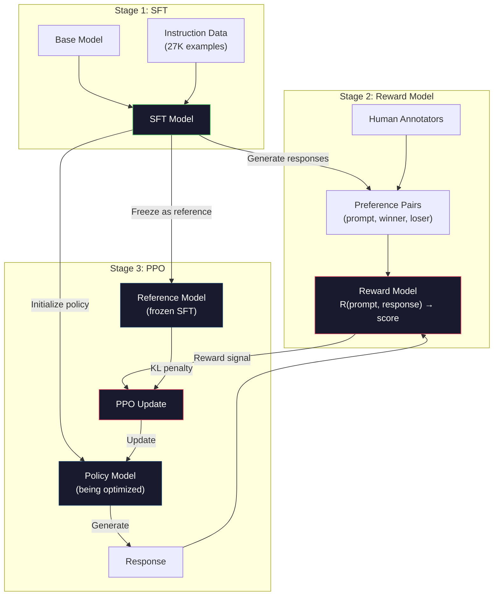
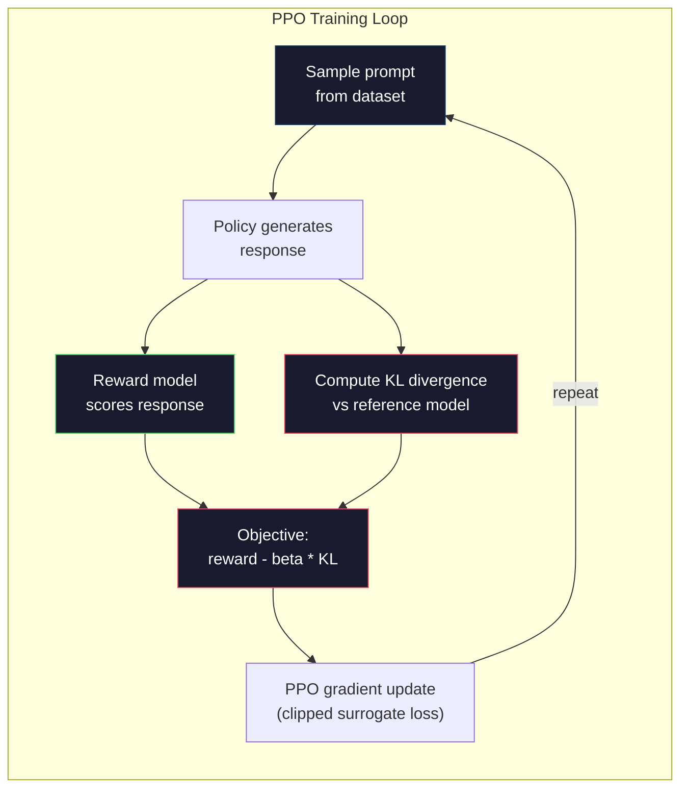

# RLHF: इनाम मॉडल + पीपीओ

> SFT मॉडल को निर्देशों का पालन करने के लिए सिखाता है। लेकिन यह मॉडल को नहीं सिखाता है कि प्रतिक्रिया कौन सी बेहतर है। दो व्याकरण रूप से सही, तथ्यात्मक रूप से सटीक उत्तर उपयोगी होने में बहुत भिन्न हो सकते हैं। RLHF यह है कि आप मॉडल के व्यवहार में मानव निर्णय को कैसे एन्कोड करते हैं। यह है जो क्लाउड को सहायक और GPT को विनम्र बनाता है।

> **【中文解读】**एसएफटी चर्च मॉडल निर्देशों का पालन करता है, लेकिन इसे "बेहतर" का जवाब नहीं देता है। आरएलएचएफ मानव प्राथमिकता डेटा प्रशिक्षण पुरस्कार मॉडल का उपयोग करता है, फिर से पीपीओ का उपयोग करता है।

> **【拓展：PPO→ChatGPT对齐】**ChatGPT का RLHF  प्रशिक्षण PPO  एल्गोरिथ्म का उपयोग करकेः इनाम मॉडल उत्तर देने के लिए打分, PPO इस प्रतिशत का उपयोग इनाम संकेत के रूप में अनुकूलन रणनीति के लिए करें।

>  **【前置】**学本节前 कृपया पहले समझेंःचरण 10·06(SFT) RLHF का आरंभ बिंदु है SFT 模型;चरण 09·08(PPO) 强化学习 PPO 算法基础;चरण 18·01(अनुदेश निम्नलिखित) RLHF 在对齐中的位置──本节是阶段 10·08(DPO) 及阶段 18(伦理) 系列的前置──

**Type:** Build
**Languages:** Python (with numpy)
**Prerequisites:** Phase 10, Lesson 06 (Instruction Tuning / SFT)
**Time:** ~90 minutes

>  **【类比】**RLHF = 训练物学杂技。SFT = "做示范让狗照着学"(监督学习)。RLHF = " कुत्ते ने एक चाल की, आप उसे零食 (零食) 高奖励) 低奖励" (RLHF) = "शोध करना, उसे भोजन देना, उसे भोजन देना, उसे भोजन देना, उसे भोजन देना, उसे भोजन देना, उसे भोजन देना, उसे भोजन देना, उसे भोजन देना, उसे भोजन देना, उसे भोजन देना, उसे भोजन देना, उसे भोजन देना, उसे भोजन देना, उसे भोजन देना, उसे भोजन देना, उसे भोजन देना, उसे भोजन देना, उसे भोजन देना, उसे भोजन देना, उसे भोजन करना, उसे भोजन करना, उसे भोजन करना, उसे भोजन करना, उसे भोजन करना, उसे भोजन करना, उसे भोजन करना, उसे भोजन करना, उसे भोजन करना, उसे भोजन करना, उसे भोजन करना, उसे भोजन करना, उसे भोजन करना, उसे भोजन करना, उसे भोजन करना, उसे भोजन करना, उसे भोजन करना, उसे भोजन करना, उसे भोजन करना, उसे भोजन करना, उसे भोजन करना, उसे भोजन करना, उसे भोजन करना, उसे भोजन करना, उसे भोजन करना, उसे भोजन करना, उसे भोजन करना, उसे भोजन करना, उसे भोजन करना, उसे भोजन करना, उसे भोजन करना, उसे भोजन करना, उसे भोजन करना, उसे भोजन करना, उसे भोजन करना, उसे भोजन करना, उसे भोजन करना, उसे भोजन करना, उसे करना, उसे करना, उसे करना, उसे करना, उसे करना, उसे करना, उसे करना, उसे करना, उसे करना, उसे करना, उसे करना, उसे करना, उसे करना, उसे करना, उसे करना, उसे करना, उसे करना, उसे करना, उसे करना, उसे करना, उसे करना, उसे करना, उसे करना, उसे करना, उसे करना, उसे करना, उसे करना, उसे करना, उसे करना, उसे करना, उसे करना, उसे करना, उसे करना, उसे करना, उसे करना, उसे करना, उसे करना, है, उसे करना, और उसे करना, और उसे करना, और उसे करना, और उसे करना, और उसे करना, और उसे करना, है।

> ️ **【易错点】**आरएलएचएफ के 3 个坑:(1) **奖励模型过拟合**RM में प्राथमिकता डेटा पर acc=99%, लेकिन पानाकरण भिन्नता; अधिक RM + जल्दी रुक + 验证集监控──(2) **KL 系数设错**太大(> 0.5)模型不动如 SFT,太小(< 0.01)模型乱跑" पुरस्कार黑客";典型 0.05-0.2──(3) **reward hacking** मॉडल पाया"加更多表情符号 RM 给高分",输出全是emoji; निरंतर निगरानी आउटपुट वितरण,发现异常立即停止──

## सीखने के लक्ष्य

- एक पुरस्कार मॉडल बनाएं जो मानव वरीयता जोड़े (चुना हुआ बनाम अस्वीकार) से प्रतिक्रिया गुणवत्ता को स्कोर करता है
  构建从人类偏好对(选择对拒绝)评分回复质量奖励模型
- पीपीओ प्रशिक्षण लूप को लागू करें जो एक भाषा मॉडल नीति को KL दंड के साथ पुरस्कार मॉडल के खिलाफ अनुकूलित करता है
  पीपीओ  प्रशिक्षण चक्र को लागू करना, KL  दंडबंधन के तहत इनाम मॉडल के लिए अनुकूलन भाषा मॉडल रणनीति
- बताएं कि आरएलएचएफ को तीन मॉडल (एसएफटी, इनाम, नीति) की आवश्यकता क्यों है और कैसे केएल प्रतिबंध इनाम हैकिंग को रोकता है
   समझाएँ कि RLHF  तीन मॉडल SFT  पुरस्कार  रणनीति  की आवश्यकता क्यों है), और कैसे KL 约束  पुरस्कार 黑客 को रोकने के लिए
- प्राथमिकता अनुकूलन से पहले और बाद में प्रतिक्रिया गुणवत्ता की तुलना करके आरएलएचएफ के प्रभाव का मूल्यांकन करें
  RLHF के प्रभाव का मूल्यांकन करने के लिए तुलनात्मक प्राथमिकता अनुकूलन पूर्व के बाद की प्रतिक्रिया गुणवत्ता

> **【中文解读】**इस कोर्स में आरएलएचएफ के पूर्ण निबंध को लागू किया गया है: मानव प्राथमिकता डेटा प्रशिक्षण पुरस्कार मॉडल से लेकर पीपीओ एल्गोरिथ्म के उपयोग तक  अनुकूलन भाषा मॉडल रणनीति。 आरएलएचएफ 需要三模型协同工作SFT 模型(参考策略)、 पुरस्कार मॉडल(评分器)、 रणनीति मॉडल(被优化模型)。केएल 散度惩罚防止策略模型偏离SFT 模型太远,避免奖励客黑客(奖励黑客)。

## समस्या  समस्या परिचय

एक मॉडल से पूछें "क्वांटम कंप्यूटिंग की व्याख्या करें" और यह उत्पन्न हो सकता हैः

> 问模型"解释量子计算", यह उत्पन्न हो सकता हैः

**Response A:**"क्वांटम कंप्यूटिंग में क्विट का उपयोग किया जाता है जो सुपरपोजीशन में मौजूद हो सकते हैं, जिसका अर्थ है कि वे 0, 1 या दोनों एक साथ हो सकते हैं। यह क्लासिकल कंप्यूटरों की तुलना में कुछ गणनाओं को तेजी से संसाधित करने की अनुमति देता है। प्रमुख एल्गोरिदमों में बड़ी संख्याओं को कारगर करने के लिए शोर का एल्गोरिदम और अनियमित डेटाबेस की खोज के लिए ग्रोवर का एल्गोरिदम शामिल है। "

> **回复 A：**"क्वेंट गणना का उपयोग ओवरले के क्वांटबिट पर किया जा सकता है, जिसका अर्थ है कि वे एक ही समय में 0 ̊1 या दोनों हो सकते हैं। यह क्लासिक कंप्यूटर के तुलना में कुछ गणनाओं को संसाधित करने के लिए सक्षम बनाता है।

**Response B:**"क्वांटम कंप्यूटिंग एक प्रकार की कंप्यूटिंग है जो क्वांटम यांत्रिक घटनाओं का उपयोग करती है। यह पहली बार 1980 के दशक में प्रस्तावित किया गया था। रिचर्ड फेनमैन ने सुझाव दिया कि क्वांटम सिस्टम को क्वांटम कंप्यूटर द्वारा अनुकरण किया जा सकता है। तब से क्षेत्र काफी बढ़ गया है। कई कंपनियां अब क्वांटम कंप्यूटर पर काम कर रही हैं। आईबीएम, गूगल और अन्य ने प्रगति की है। क्वांटम वर्चस्व का दावा Google ने 2019 में किया था। "

> **回复 B：**"क्वांटम कंप्यूटिंग एक प्रकार का कम्प्यूटिंग है जो क्वांटमिक्स की घटनाओं का उपयोग करता है। यह 1980 के दशक में पहली बार प्रस्तावित किया गया था। रिचर्ड फेनमैन ने सुझाव दिया कि क्वांटम सिस्टम को क्वांटम कंप्यूटर द्वारा अनुकरण किया जा सकता है। इस क्षेत्र में बाद में काफी विकास हुआ है। कई कंपनियां अब क्वांटम कंप्यूटरों को विकसित कर रही हैं। IBM, Google आदि सभी ने प्रगति की है। Google ने 2019 में दावा किया है कि उसने क्वांटम अधिकारों को प्राप्त किया है। "

दोनों प्रतिक्रियाएँ तथ्यात्मक रूप से सही हैं. दोनों व्याकरणिक रूप से सही हैं. दोनों निर्देशों का पालन करते हैं. लेकिन प्रतिक्रिया ए स्पष्ट रूप से बेहतर है. यह अधिक संक्षिप्त, अधिक जानकारीपूर्ण और बेहतर संरचित है। एक इंसान हर बार ए चुनता है।

> 两回复事实上都正确――语法上都无问题――都遵循命令――但回复 A 明显更好――更简洁、更有信息量、结构更好――人类每次都会选 A――

एसएफटी इस अंतर को कैप्चर नहीं कर सकता है। यह मॉडल को "सही" प्रतिक्रियाओं पर प्रशिक्षित करता है, लेकिन इसमें यह कहने की कोई तंत्र नहीं है "यह प्रतिक्रिया उस से बेहतर है।" यह प्रत्येक प्रशिक्षण उदाहरण को समान रूप से अच्छा मानता है। यदि एसएफटी डेटासेट में ए और बी दोनों दिखाई दिए, तो मॉडल दोनों से समान रूप से सीखता है।

> एसएफटी इस अंतर को नहीं पकड़ सकता है। यह "सही" प्रतिक्रिया पर प्रशिक्षण मॉडल में है, लेकिन कोई तंत्र नहीं कहता है कि "यह प्रतिक्रिया उस से बेहतर है"। यह प्रत्येक प्रशिक्षण नमूने को समान रूप से अच्छा मानता है।

RLHF यह हल करता है. यह एक इनाम मॉडल को प्रशिक्षित करता है कि मनुष्य किस प्रतिक्रिया को पसंद करेगा, फिर उस इनाम संकेत का उपयोग उच्च गुणवत्ता वाले आउटपुट की ओर भाषा मॉडल को धक्का देने के लिए करता है। इंस्ट्रक्टजीपीटी (चैटजीपीटी का अग्रदूत) ने जीपीटी-3 की उपयोगीता, सत्यता और हानिरहितता में नाटकीय सुधार के लिए आरएलएचएफ का उपयोग किया। ओपेनएआई के आंतरिक मूल्यांकनकर्ताओं ने 85% समय में जीपीटी-3 आउटपुटों पर इंस्ट्रक्टजीपीटी आउटपुट को प्राथमिकता दी, भले ही इंस्ट्रक्टजीपीटी 135 गुना छोटा हो (1.3 बी बनाम 175 बी पैरामीटर) ।

> आरएलएचएफ ने इस समस्या को हल किया। यह एक इनाम मॉडल को प्रशिक्षित करता है ताकि यह अनुमान लगाया जा सके कि मानव समुदाय कौन से प्रतिक्रिया पसंद करता है, फिर इस इनाम संकेत के साथ भाषा मॉडल को बेहतर गुणवत्ता वाले आउटपुट को बढ़ावा देता है।

> **【中文解读】**SFT की सीमा यह है कि यह "कौन सा बेहतर उत्तर" का भेद नहीं कर सकता है। दो भाषाओं में सही, तथ्य सटीक उत्तर उपयोगीता पर संभावित मतभेद हैं। आरएलएचएफ द्वारा प्रशिक्षण पुरस्कार मॉडल के माध्यम से मानव वरीयताओं का पूर्वानुमान करने के लिए, इस पुरस्कार संकेत मार्गदर्शन रणनीति मॉडल का उपयोग करके उच्च गुणवत्ता वाले आउटपुट उत्पन्न करने के लिए किया गया है।

> **【拓展：InstructGPT 的突破】**InstructGPT 论文(OpenAI 2022)  RLHF  बड़े मॉडल के लिए                                                                                                                                                                                                                                                   

## अवधारणा का मूल अवधारणा

### तीन चरण

RLHF एक प्रशिक्षण रन नहीं है. यह तीन अनुक्रमिक चरणों की एक पाइपलाइन है, प्रत्येक पिछले एक पर निर्माण.

> आरएलएचएफ एक एकल प्रशिक्षण संचालन नहीं है। यह एक तीन चरणों की क्रमबद्धता है, प्रत्येक चरण पहले के ऊपर स्थापित है।

**Stage 1: SFT.**निर्देश-उत्तर जोड़े पर एक आधार मॉडल का अभ्यास करें (पाठ 06) । यह आपको एक मॉडल देता है जो निर्देशों का पालन कर सकता है लेकिन यह नहीं जानता कि कौन से उत्तर दूसरों से बेहतर हैं।

> **阶段 1：SFT。**अनुदेश-प्रत्यारोप पर प्रशिक्षण आधार मॉडल (第六课)  यह आपको एक ऐसा मॉडल देता है जो अनुदेश का पालन कर सके लेकिन पता न हो कि कौन सा अनुदेश बेहतर है

**Stage 2: Reward Model.**मानव वरीयता डेटा एकत्र करेंः एक ही संकेत पर दो प्रतिक्रियाएं दिखाएं और पूछें "कौन बेहतर है?" इन वरीयताओं की भविष्यवाणी करने के लिए एक मॉडल का अभ्यास करें। इनाम मॉडल इनपुट के रूप में (प्रोम्प्ट, प्रतिक्रिया) लेता है और स्केलर स्कोर आउटपुट करता है।

> **阶段 2：奖励模型。**️ मानव वरीयता डेटा एकत्र करें: एक ही संकेत के दो प्रतिसादों को दर्शाने वाले को प्रश्न पूछें "कौन बेहतर है?"

**Stage 3: PPO.**भाषा मॉडल के लिए प्रशिक्षण संकेत उत्पन्न करने के लिए इनाम मॉडल का उपयोग करें। भाषा मॉडल प्रतिक्रिया उत्पन्न करता है, इनाम मॉडल उन्हें स्कोर करता है, और पीपीओ उच्च स्कोर प्रतिक्रियाओं का उत्पादन करने के लिए भाषा मॉडल को अपडेट करता है। एक KL विचलन दंड भाषा मॉडल को एसएफटी चेकपॉइंट से बहुत दूर भटकने से रोकता है।

> **阶段 3：PPO。**प्रयोग पुरस्कार मॉडल के लिए भाषा मॉडल उत्पन्न प्रशिक्षण संकेत── भाषा मॉडल उत्पन्न प्रतिक्रिया, पुरस्कार मॉडल उन्हें打分,PPO 更新语言模型以产生更高分的回复──KL 散度惩罚防止语言模型偏离 SFT 检查点太远──

> **【中文解读】**RLHF के तीन चरणों के लिए ट्यूबलाइनःचरण 1 का उपयोग करें SFT 让基础模型学会跟随指令;चरण 2 का उपयोग करें मानव वरीयता डेटा एकत्र करना;एक ही प्रॉम्प्ट के दो प्रतिसादों के लिए, "कुन बेहतर है" को चिह्नित करें) प्रशिक्षण पुरस्कार मॉडल;चरण 3 का उपयोग करें PPO एल्गोरिथ्म रणनीति मॉडल उच्च पुरस्कार का उत्पादन करने के लिए, जबकि KL 散度 दंड के साथ SFT 模型 से विचलन को रोकने के लिए।



### इनाम का नमूना

इनाम मॉडल एक स्कोरर के रूप में पुनः उपयोग किया जाने वाला भाषा मॉडल है। एसएफटी मॉडल लें, भाषा मॉडलिंग हेड (जो शब्दावली पर वितरण का उत्पादन करता है) को एक स्केलर हेड (जो एक एकल संख्या का उत्पादन करता है) के साथ बदलें। वास्तुकला अंतिम परत तक समान है।

> 奖励模型是重新使用作评分器的语言模型──取 SFT 模型,将语言建模头 (输出词表上的分布) 换成标量头 (标量头) 输出单个数字) ‖架构直到最后层都相同──

इनपुटः प्रतिक्रिया के साथ एक संकेत। आउटपुटः एक एकल स्केलर पुरस्कार स्कोर।

> 输入: एक शीघ्र 拼接一个回复──输出: एक标量奖励分数──

प्रशिक्षण डेटा मानव वरीयता जोड़े हैं। प्रत्येक प्रॉम्प्ट के लिए, एनोटेटर दो प्रतिक्रियाएं देखते हैं और बेहतर एक चुनते हैं। यह प्रशिक्षण ट्रिपल बनाता हैः (प्रॉम्प्ट, पसंदीदा_प्रतिक्रिया, अस्वीकृत_प्रतिक्रिया) ।

> 训练数据是人类偏好对──对每一个提示,标签者看两个回复并选择更好──这创建了训练三元组:(快速, 首选回复, 拒绝回复)──

हानि फ़ंक्शन जोड़ी-तरह के विकल्पों के ब्रैडली-टेरी मॉडल का उपयोग करता हैः

```
loss = -log(sigmoid(reward(preferred) - reward(rejected)))
```

यह मुख्य समीकरण है।`sigmoid(reward(A) - reward(B))`यह संभावना देता है कि प्रतिक्रिया A को प्रतिक्रिया B के मुकाबले पसंद किया जाता है। हानि पुरस्कार मॉडल को प्राथमिकता प्राप्त प्रतिक्रिया को उच्च स्कोर देने के लिए धक्का देती है।

> यह एक महत्वपूर्ण तरीका है।`sigmoid(reward(A) - reward(B))`给出回复 A 被偏好于回复 B 的概率──损失推动奖励模型给首选回复分配更高分数──

क्यों पूर्ण स्कोर के बजाय जोड़ी-बंद तुलनाएं? क्योंकि मनुष्य पूर्ण गुणवत्ता स्कोर असाइन करने में भयानक हैं ("क्या यह प्रतिक्रिया 10 में से 7.3 या 7.5 है?") लेकिन सापेक्ष तुलनाओं में बहुत अच्छा है ("क्या ए बी से बेहतर है?") । ब्रैडली-टेरी मॉडल सापेक्ष तुलनाओं को एक सुसंगत पूर्ण स्कोरिंग प्रणाली में परिवर्तित करता है।

> तुलना के बजाय निरपेक्ष रेटिंग का उपयोग क्यों करें? क्योंकि मनुष्य निरपेक्ष गुणवत्ता रेटिंग को विभाजित करने में बहुत अच्छा नहीं है। "यह प्रतिक्रिया 10 मिनट में 7.3 या 7.5 है?") लेकिन तुलना में बहुत अच्छा है। "ए बी बी अच्छा है?")

**InstructGPT numbers:**ओपनएआई ने 40 ठेकेदारों से 33,000 तुलना जोड़े एकत्र किए. प्रत्येक तुलना में लगभग 5 मिनट लगे. यह इनाम मॉडल प्रशिक्षण डेटा के लिए 2,750 घंटे मानव श्रम है।

> **InstructGPT 数据：**ओपनएआई ने 40 नामित ठेकेदारों से 33,000 तुलनात्मक प्रतिभागियों को एकत्र किया। प्रत्येक तुलना में लगभग 5 मिनट का खर्च हुआ।

### पीपीओ: निकटता नीति अनुकूलन

पीपीओ एक प्रवर्धन सीखने एल्गोरिथ्म है। आरएलएचएफ में, "पर्यावरण" इनाम मॉडल है, "एजेंट" भाषा मॉडल है, और "क्रिया" एक टोकन उत्पन्न कर रहा है।

> पीपीओ एक प्रकार का कंसोमिकीशनिंग एल्गोरिथ्म है। आरएलएचएफ में, "पर्यावरण" पुरस्कार मॉडल है, "बुद्धिमान" भाषा मॉडल है, "动作" एक टोकन उत्पन्न करता है।

उद्देश्य:

> 优化目标:

```
maximize: E[R(prompt, response)] - beta * KL(policy || reference)
```

पहला शब्द मॉडल को उच्च पुरस्कार प्रतिक्रिया उत्पन्न करने के लिए धक्का देता है। दूसरा शब्द (केएल विचलन दंड) मॉडल को एसएफटी चेकपॉइंट से बहुत दूर विचलित होने से रोकता है।

> प्रथम कदम मॉडल को बढ़ावा देने के लिए उच्च पुरस्कार का उत्पादन करने के लिए।

इसके बिना, मॉडल विकृत समाधान ढूंढता है। इनाम मॉडल मानव वरीयताओं के एक सीमित डेटा सेट पर प्रशिक्षित होता है। इसमें अंधे स्थान होते हैं। भाषा मॉडल उन अंधे स्थानों का शोषण करेगा - परिणाम ढूंढने के लिए जो इनाम मॉडल पर उच्च स्कोर करते हैं लेकिन वास्तव में बेतुका होते हैं। क्लासिक उदाहरणः

> इसके बिना, मॉडल विकृत समाधान ढूंढेंगे। इनाम मॉडल सीमित मानव वरीयता डेटासेट पर प्रशिक्षण, अंधे बिंदुओं पर काम करेगा। भाषा मॉडल इन अंधे बिंदुओं का उपयोग करके इनाम मॉडल पर उच्च स्कोर प्राप्त करेगा, लेकिन वास्तविक रूप से कोई मतलब नहीं है। क्लासिक उदाहरणः

- "मैं बहुत मददगार और हानिरहित हूँ!" दोहराया जाने से मददगारता/हानिरहितता पुरस्कार मॉडल पर उच्च स्कोर होते हैं
  चीनी अनुवादः重复"मैं बहुत उपयोगी बहुत हानिरहित हूँ!"
- "उच्च गुणवत्ता" के अनुरूप शब्दबद्ध, औपचारिक लेकिन खाली प्रतिक्रियाएं उत्पन्न करना
  中文翻译:生成冗长、正式但空洞的回复,模式匹配到"高质量"
- प्रशिक्षण डेटा में उच्च पुरस्कार के साथ संबद्ध होने वाले विशिष्ट वाक्यांशों का उपयोग करना
  चीनी अनुवादः उपयोग प्रशिक्षण डेटा में सटीकता और उच्च पुरस्कार से संबंधित विशिष्ट शब्द

KL पेनल्टी कहती हैः आप सुधार कर सकते हैं, लेकिन आप एक पूरी तरह से अलग मॉडल नहीं बन सकते हैं। SFT संस्करण के करीब रहें, जो पहले से ही उचित था। बहुत दूर घूमना और KL लागत पुरस्कार पर हावी है।

> KL 惩罚说: आप सुधार कर सकते हैं, लेकिन पूरी तरह से अलग मॉडल नहीं बन सकते हैं──保持在已合理的SFT 版本附近──偏离太远则 KL 成本会主导奖励──

**InstructGPT numbers:**पीपीओ प्रशिक्षण में lr=1.5e-5, KL गुणांक बीटा=0.02, 256K एपिसोड (प्रॉम्प्ट-रिस्पॉन्स जोड़े) और 4 पीपीओ युग प्रति बैच का उपयोग किया गया। पूरे आरएलएचएफ पाइपलाइन में कई दिनों का समय लिया गया।

> **InstructGPT 数据：**पीपीओ प्रशिक्षण प्रयोग lr=1.5e-5,KL 系数 बीटा=0.02,256K 个节目( शीघ्र-回复对), प्रति批 4 个 पीपीओ कालखंड── संपूर्ण आरएलएचएफ 管线在 GPU 集群上运行了几天──



### पीपीओ लक्ष्य विस्तार से

पीपीओ अत्यधिक बड़े अपडेट को रोकने के लिए एक "कटप सरोगेट ऑब्जेक्ट" का उपयोग करता है। नई नीति और पुरानी नीति की संभावनाओं के बीच अनुपात को [1 - epsilon, 1 + epsilon] सीमा तक काट दिया जाता है, जहां epsilon आमतौर पर 0.2 होता है।

> पीपीओ का उपयोग "बरी हुई एजेंट लक्ष्य" का उपयोग करके बहुत बड़ी अद्यतनों को रोकने के लिए किया जाता है।

```
ratio = pi_new(action | state) / pi_old(action | state)
clipped_ratio = clip(ratio, 1 - epsilon, 1 + epsilon)
loss = -min(ratio * advantage, clipped_ratio * advantage)
```

लाभ फ़ंक्शन अनुमान लगाता है कि वर्तमान प्रतिक्रिया अपेक्षित गुणवत्ता की तुलना में कितनी बेहतर है।

> 优势函数估计当前回复 अपेक्षाकृत कम है

```
advantage = reward(prompt, response) - baseline
```

मूल रेखा अक्सर हालिया उत्तरों के मुकाबले औसत पुरस्कार होती है। सकारात्मक लाभ का अर्थ है कि प्रतिक्रिया औसत से बेहतर थी; नकारात्मक लाभ का अर्थ है कि यह बदतर थी। पीपीओ औसत से ऊपर के उत्तरों की संभावना को बढ़ाता है और औसत से नीचे के उत्तरों की संभावना को कम करता है।

> 基线 आमतौर पर हाल ही में प्रतिक्रिया के औसत पुरस्कारों में से एक है। सकारात्मक लाभ का अर्थ है औसत स्तर की तुलना में प्रतिक्रिया का अच्छा; नकारात्मक लाभ का अर्थ है औसत स्तर के अंतर से।

यदि एक प्रतिक्रिया को असामान्य रूप से उच्च पुरस्कार मिलता है, तो अनकट अनुपात बहुत बड़ा हो सकता है, जिससे मॉडल उस प्रतिक्रिया की ओर नाटकीय रूप से शिफ्ट हो जाता है।

> 截断防止灾难性更新── यदि एक ही प्रतिक्रिया असामान्य रूप से उच्च पुरस्कार प्राप्त करती है, तो अनियंत्रित अनुपात बहुत बड़ा हो सकता है, जिससे मॉडल तीव्र रूप से उस प्रतिक्रिया की ओर विचलित हो जाता है──截断 अपडेट की चौड़ाई को सीमित करता है, प्रशिक्षण स्थिर रखता है──

### पुरस्कार हैकिंग

RLHF का अंधेरा पक्ष. भाषा मॉडल इनाम मॉडल के खिलाफ अनुकूलन कर रहा है, जो मानव वरीयताओं के लिए एक अपूर्ण प्रॉक्सी है। जैसा कि भाषा मॉडल इनाम को अधिकतम करने में बेहतर होता है, यह इनाम मॉडल की कमजोरियों का शोषण करना शुरू कर देता है।

> RLHF का阴暗面── भाषा मॉडल पुरस्कार मॉडल के अनुकूलन के उद्देश्य से है, जबकि पुरस्कार मॉडल मानव वरीयताओं का अपूर्ण प्रतिनिधि है── जैसे-जैसे भाषा मॉडल अधिक से अधिक उत्कृष्टता से पुरस्कार का अधिकतम लाभ उठाते हैं, यह पुरस्कार मॉडल की कमजोरियों का उपयोग करना शुरू कर देता है──

सामान्य विफलता मोडः

> 常见失败模式:

| Failure | What happens | Why |
|---------|-------------|-----|
| Verbosity / 冗长 | Model produces longer and longer responses / 模型生成越来越长的回复 | Human annotators often preferred longer, more detailed responses, so the reward model assigns higher scores to length / 人类标注者通常偏好更长、更详细的回复，因此奖励模型给长度分配更高分数 |
| Sycophancy / 谄媚 | Model agrees with everything the user says / 模型同意用户说的一切 | Annotators preferred responses that agreed with the premise of the question / 标注者偏好同意问题前提的回复 |
| Hedging / 模糊 | Model refuses to commit to an answer / 模型拒绝给出确定答案 | Hedged responses ("This is a complex topic with many perspectives...") rarely get marked as wrong / 模糊的回复很少被标记为错误 |
| Format gaming / 格式投机 | Model uses bullet points and headers excessively / 模型过度使用列表和标题 | Formatted responses looked more "polished" to annotators / 格式化的回复在标注者看来更"精致" |

कम करने की रणनीतियाँः मजबूत KL दंड (मॉडल को कमजोरियों का शोषण करने के लिए पर्याप्त दूर से भटकने से रोकता है), प्रतिद्वंद्वी उदाहरणों पर पुरस्कार मॉडल को प्रशिक्षित करता है (पच ज्ञात विफलता मोड), और विभिन्न वास्तुकला के साथ कई पुरस्कार मॉडल का उपयोग करता है (सभी को एक साथ हैक करना कठिन है) ।

> 缓解策略:更强的 KL 惩罚(模型偏离到足以利用弱点的程度)  प्रतिरोध नमूना पर प्रशिक्षण पुरस्कार मॉडल ((已知失败模式)  विभिन्न संरचनाओं के कई पुरस्कार मॉडल का उपयोग करना ((更难同时攻破所有模型) 

### वास्तविक आरएलएचएफ पाइपलाइन

| Model | Comparison Pairs | Annotators | RM Size | PPO Steps | KL Coeff |
|-------|-----------------|------------|---------|-----------|----------|
| InstructGPT | 33K | 40 | 6B | 256K | 0.02 |
| Llama 2 Chat | ~1M | undisclosed | 70B | undisclosed | 0.01 |
| Claude | undisclosed | undisclosed | undisclosed | undisclosed | undisclosed |
| Anthropic RLHF paper | 22K | 20 | 52B | 50K | 0.001 |

> विभिन्न मॉडलों के आरएलएचएफ प्रशिक्षण विन्यास विन्यासःInstructGPT द्वारा 33K  पसंद के लिए और 6B  पुरस्कार मॉडल;Llama 2 चैट द्वारा लगभग 1M  पसंद के लिए और 70B  पुरस्कार मॉडल;Anthropic द्वारा RLHF 论文 द्वारा 22K तुलना में प्रशिक्षण 52B  पुरस्कार मॉडल में 

मानव विज्ञान के 2022 के पेपर में 22,000 तुलनाओं पर 52B इनाम मॉडल को प्रशिक्षित किया गया है। बड़े इनाम मॉडल अधिक विश्वसनीय संकेत उत्पन्न करते हैं, जो पीपीओ प्रशिक्षण को अधिक स्थिर बनाता है। एक बड़े भाषा मॉडल को प्रशिक्षित करने के लिए एक छोटे इनाम मॉडल का उपयोग करना जोखिम भरा है - इनाम मॉडल में अच्छे बनाम बुरे प्रतिक्रियाओं के बारीकियों को पकड़ने की पर्याप्त क्षमता नहीं है।

> मानव विज्ञान 2022 के निबंध में 22,000 लोगों के मुकाबले 52 बी के इनाम मॉडल को प्रशिक्षित किया गया है। बड़ा इनाम मॉडल अधिक विश्वसनीय संकेत उत्पन्न करता है, जिससे पीपीओ प्रशिक्षण अधिक स्थिर हो जाता है।

## इसे बनाओ, इसे पूरा करो।
```figure
rlhf-pipeline
```

## इसे बनाओ

### चरण 1: सिंथेटिक प्राथमिकता डेटा

उत्पादन में, मानव टिप्पणीकार प्राथमिकता डेटा बनाते हैं। हम सिंथेटिक जोड़े बनाएंगे जहां "पसंदीदा" प्रतिक्रिया वस्तुतः बेहतर है (अधिक संक्षिप्त, अधिक सटीक, अधिक उपयोगी) ।

> उत्पादन में, मानव लेगरों ने प्राथमिकता डेटा बनाया। हम एक संश्लेषण सेट बनाएंगे, जिसमें से "प्रथम" प्रतिक्रिया वस्तुतः बेहतर है।

```python
import numpy as np

PREFERENCE_DATA = [
    {
        "prompt": "What is the capital of France?",
        "preferred": "The capital of France is Paris.",
        "rejected": "France is a country in Europe. It has many cities. The capital is Paris. Paris is known for the Eiffel Tower.",
    },
    {
        "prompt": "Explain gravity in one sentence.",
        "preferred": "Gravity is the force that attracts objects with mass toward each other.",
        "rejected": "Gravity is something that makes things fall down when you drop them.",
    },
    {
        "prompt": "What is 15 times 7?",
        "preferred": "15 times 7 is 105.",
        "rejected": "Let me think about this. 15 times 7. Well, 10 times 7 is 70, and 5 times 7 is 35, so the answer might be around 105.",
    },
    {
        "prompt": "Name three programming languages.",
        "preferred": "Python, Rust, and TypeScript.",
        "rejected": "There are many programming languages. Some popular ones include various languages like Python and others.",
    },
    {
        "prompt": "What year did World War II end?",
        "preferred": "World War II ended in 1945.",
        "rejected": "World War II was a major global conflict. It involved many countries. The war ended in the mid-1940s, specifically in 1945.",
    },
    {
        "prompt": "Define machine learning.",
        "preferred": "Machine learning is a field where algorithms learn patterns from data to make predictions without being explicitly programmed.",
        "rejected": "Machine learning is a type of AI. AI stands for artificial intelligence. Machine learning uses data to learn.",
    },
]
```

पसंदीदा प्रतिक्रियाएं संक्षिप्त और प्रत्यक्ष हैं। अस्वीकृत प्रतिक्रियाएं सामान्य विफलता मोड प्रदर्शित करती हैंः अनावश्यक पैडिंग, हेजिंग, अधिमानतः स्पष्टीकरण और अशुद्धता। यह बिल्कुल उस तरह का अंतर है जिसे एसएफटी नहीं पकड़ सकता है लेकिन आरएलएचएफ कर सकता है।

> 首选回复简洁直接──被拒回复显示常见失败模式:不必要的填充、模糊、冗余解释和不精确── यह बिल्कुल एसएफटी है 无法捕获但RLHF भेदभाव कर सकता है──

### चरण 2: इनाम मॉडल वास्तुकला

इनाम मॉडल मिनी जीपीटी से ट्रांसफार्मर आर्किटेक्चर का पुनः उपयोग करता है, लेकिन एक एकल स्केलर प्रोजेक्शन के साथ शब्दावली आकार के आउटपुट हेड को बदल देता है।

>  पुरस्कार मॉडल ने मिनी जीपीटी के ट्रांसफार्मर 架构 का उपयोग किया, लेकिन शब्द表大小的输出头的换取为单个标量投影──

```python
import sys
import os
sys.path.insert(0, os.path.join(os.path.dirname(__file__), "..", "..", "04-pre-training-mini-gpt", "code"))
from main import MiniGPT, LayerNorm, Embedding, TransformerBlock


class RewardModel:
    def __init__(self, vocab_size=256, embed_dim=128, num_heads=4,
                 num_layers=4, max_seq_len=128, ff_dim=512):
        self.embedding = Embedding(vocab_size, embed_dim, max_seq_len)
        self.blocks = [
            TransformerBlock(embed_dim, num_heads, ff_dim)
            for _ in range(num_layers)
        ]
        self.ln_f = LayerNorm(embed_dim)
        self.reward_head = np.random.randn(embed_dim) * 0.02

    def forward(self, token_ids):
        seq_len = token_ids.shape[-1]
        mask = np.triu(np.full((seq_len, seq_len), -1e9), k=1)

        x = self.embedding.forward(token_ids)
        for block in self.blocks:
            x = block.forward(x, mask)
        x = self.ln_f.forward(x)

        last_hidden = x[:, -1, :]
        reward = last_hidden @ self.reward_head

        return reward
```

इनाम मॉडल * अंतिम * टोकन स्थिति पर छिपी हुई स्थिति लेता है और इसे एक स्केलर पर प्रोजेक्ट करता है। अंतिम टोकन क्यों? क्योंकि कारण ध्यान मास्क का मतलब है कि अंतिम स्थिति ने पिछले प्रत्येक टोकन में भाग लिया है। इसमें पूरे (प्रोम्प्ट, प्रतिक्रिया) अनुक्रम का सबसे पूर्ण प्रतिनिधित्व है।

>  पुरस्कार मॉडल ले ले अंतिम टोकन स्थिति की छिपी हुई स्थिति 并投影为标量── क्यों अंतिम टोकन? क्योंकि कारण ध्यान छिपाने का अर्थ है कि अंतिम स्थान पहले से ही सभी अग्रिम टोकन पर ध्यान केंद्रित कर चुका है── यह पूरे ((( शीघ्र, 回复) क्रम के लिए सबसे पूर्ण प्रतिनिधित्व है──

### चरण 3: ब्रैडली-टेरी हार

ब्रैडली-टेरी जोड़ी हानि का उपयोग करके प्राथमिकता जोड़े पर पुरस्कार मॉडल का अभ्यास करें।

> ब्रैडली-टेरी का उपयोग करना नुकसान के लिए वरीयता पर प्रशिक्षण पुरस्कार मॉडल

```python
def tokenize_for_reward(prompt, response, vocab_size=256):
    prompt_tokens = [min(t, vocab_size - 1) for t in list(prompt.encode("utf-8"))]
    response_tokens = [min(t, vocab_size - 1) for t in list(response.encode("utf-8"))]
    return prompt_tokens + [0] + response_tokens


def sigmoid(x):
    return np.where(
        x >= 0,
        1.0 / (1.0 + np.exp(-x)),
        np.exp(x) / (1.0 + np.exp(x))
    )


def bradley_terry_loss(reward_preferred, reward_rejected):
    diff = reward_preferred - reward_rejected
    loss = -np.log(sigmoid(diff) + 1e-8)
    return loss


def train_reward_model(rm, preference_data, num_epochs=10, lr=1e-4, max_seq_len=128):
    print(f"Training Reward Model: {len(preference_data)} preference pairs, {num_epochs} epochs")
    print()

    losses = []
    accuracies = []

    for epoch in range(num_epochs):
        epoch_loss = 0.0
        epoch_correct = 0
        num_pairs = 0

        indices = np.random.permutation(len(preference_data))

        for idx in indices:
            pair = preference_data[idx]

            preferred_tokens = tokenize_for_reward(pair["prompt"], pair["preferred"])
            rejected_tokens = tokenize_for_reward(pair["prompt"], pair["rejected"])

            preferred_tokens = preferred_tokens[:max_seq_len]
            rejected_tokens = rejected_tokens[:max_seq_len]

            preferred_ids = np.array(preferred_tokens).reshape(1, -1)
            rejected_ids = np.array(rejected_tokens).reshape(1, -1)

            r_preferred = rm.forward(preferred_ids)[0]
            r_rejected = rm.forward(rejected_ids)[0]

            loss = bradley_terry_loss(r_preferred, r_rejected)

            if r_preferred > r_rejected:
                epoch_correct += 1

            diff = r_preferred - r_rejected
            grad = sigmoid(diff) - 1.0

            rm.reward_head -= lr * grad * rm.ln_f.forward(
                rm.embedding.forward(preferred_ids)
            )[:, -1, :].flatten()

            epoch_loss += loss
            num_pairs += 1

        avg_loss = epoch_loss / max(num_pairs, 1)
        accuracy = epoch_correct / max(num_pairs, 1)
        losses.append(avg_loss)
        accuracies.append(accuracy)

        if epoch % 2 == 0:
            print(f"  Epoch {epoch + 1:3d} | Loss: {avg_loss:.4f} | Accuracy: {accuracy:.1%}")

    return rm, losses, accuracies
```

सटीकता मीट्रिक सरल हैः पुरस्कार मॉडल प्राथमिकता जोड़े के किस अंश को सही ढंग से रैंक करता है? एक यादृच्छिक मॉडल 50% स्कोर करता है। स्वच्छ डेटा पर अच्छी तरह से प्रशिक्षित इनाम मॉडल 70% से अधिक होना चाहिए। इंस्ट्रक्टजीपीटी के इनाम मॉडल ने लंबे समय तक किए गए तुलनाओं पर लगभग 72% सटीकता हासिल की, जो कम लगता है लेकिन वास्तव में अच्छा है - कई प्राथमिकता जोड़े मनुष्यों के लिए भी अस्पष्ट हैं (अंतर-विवरणकर्ता समझौते लगभग 73%) ।

>  सटीकता दर सूचक बहुत सीधा हैः इनाम मॉडल की सही क्रमबद्धता के अनुपात के लिए प्राथमिकता कितनी है?随机模型 का स्कोर 50% है। 干净数据 पर अच्छी तरह से प्रशिक्षित इनाम मॉडल 70% से अधिक होना चाहिए।

### चरण 4: सरल पीपीओ लूप

पूर्ण पीपीओ जटिल है। इस कार्यान्वयन में मुख्य तंत्र को कैप्चर किया गया हैः प्रतिक्रियाएं उत्पन्न करें, उन्हें स्कोर करें, लाभ की गणना करें, और एक KL दंड के साथ नीति को अपडेट करें।

> पूर्ण पीपीओ  बहुत जटिल है। इस कार्यान्वयन ने मूल तंत्र को पकड़ लिया हैः उत्पन्न प्रतिक्रिया, मूल्यांकन, गणना लाभ, केएल के साथ  दण्ड अद्यतन रणनीति।

```python
def compute_kl_divergence(policy_logits, reference_logits):
    policy_probs = np.exp(policy_logits - policy_logits.max(axis=-1, keepdims=True))
    policy_probs = policy_probs / policy_probs.sum(axis=-1, keepdims=True)
    policy_probs = np.clip(policy_probs, 1e-10, 1.0)

    ref_probs = np.exp(reference_logits - reference_logits.max(axis=-1, keepdims=True))
    ref_probs = ref_probs / ref_probs.sum(axis=-1, keepdims=True)
    ref_probs = np.clip(ref_probs, 1e-10, 1.0)

    kl = np.sum(policy_probs * np.log(policy_probs / ref_probs), axis=-1)
    return kl.mean()


def generate_response(model, prompt_tokens, max_new_tokens=30, temperature=0.8, max_seq_len=128):
    tokens = list(prompt_tokens)

    for _ in range(max_new_tokens):
        context = np.array(tokens[-max_seq_len:]).reshape(1, -1)
        logits = model.forward(context)
        next_logits = logits[0, -1, :]

        next_logits = next_logits / max(temperature, 1e-8)
        probs = np.exp(next_logits - next_logits.max())
        probs = probs / probs.sum()
        probs = np.clip(probs, 1e-10, 1.0)
        probs = probs / probs.sum()

        next_token = np.random.choice(len(probs), p=probs)
        tokens.append(int(next_token))

    return tokens


def copy_model_weights(source, target):
    target.embedding.token_embed = source.embedding.token_embed.copy()
    target.embedding.pos_embed = source.embedding.pos_embed.copy()
    target.ln_f.gamma = source.ln_f.gamma.copy()
    target.ln_f.beta = source.ln_f.beta.copy()
    for s_block, t_block in zip(source.blocks, target.blocks):
        t_block.attn.W_q = s_block.attn.W_q.copy()
        t_block.attn.W_k = s_block.attn.W_k.copy()
        t_block.attn.W_v = s_block.attn.W_v.copy()
        t_block.attn.W_out = s_block.attn.W_out.copy()
        t_block.ffn.W1 = s_block.ffn.W1.copy()
        t_block.ffn.W2 = s_block.ffn.W2.copy()
        t_block.ffn.b1 = s_block.ffn.b1.copy()
        t_block.ffn.b2 = s_block.ffn.b2.copy()
        t_block.ln1.gamma = s_block.ln1.gamma.copy()
        t_block.ln1.beta = s_block.ln1.beta.copy()
        t_block.ln2.gamma = s_block.ln2.gamma.copy()
        t_block.ln2.beta = s_block.ln2.beta.copy()


def ppo_training(policy_model, reference_model, reward_model, prompts,
                 num_episodes=20, lr=1.5e-5, kl_coeff=0.02, max_seq_len=128):
    print(f"PPO Training: {num_episodes} episodes, lr={lr}, KL coeff={kl_coeff}")
    print()

    rewards_history = []
    kl_history = []

    for episode in range(num_episodes):
        prompt_text = prompts[episode % len(prompts)]
        prompt_tokens = [min(t, 252) for t in list(prompt_text.encode("utf-8"))]

        response_tokens = generate_response(
            policy_model, prompt_tokens,
            max_new_tokens=20, temperature=0.8, max_seq_len=max_seq_len
        )

        response_ids = np.array(response_tokens[:max_seq_len]).reshape(1, -1)
        reward = reward_model.forward(response_ids)[0]

        policy_logits = policy_model.forward(response_ids)
        ref_logits = reference_model.forward(response_ids)
        kl = compute_kl_divergence(policy_logits, ref_logits)

        total_reward = reward - kl_coeff * kl

        rewards_history.append(float(reward))
        kl_history.append(float(kl))

        for block in policy_model.blocks:
            update_scale = lr * total_reward
            block.ffn.W1 += update_scale * np.random.randn(*block.ffn.W1.shape) * 0.01
            block.ffn.W2 += update_scale * np.random.randn(*block.ffn.W2.shape) * 0.01

        if episode % 5 == 0:
            avg_reward = np.mean(rewards_history[-5:]) if rewards_history else 0
            avg_kl = np.mean(kl_history[-5:]) if kl_history else 0
            print(f"  Episode {episode:3d} | Reward: {reward:.4f} | KL: {kl:.4f} | "
                  f"Avg Reward: {avg_reward:.4f}")

    return policy_model, rewards_history, kl_history
```

मूल लूपः (1) एक प्रॉम्प्ट का नमूना लें, (2) प्रतिक्रिया उत्पन्न करें, (3) इसे इनाम मॉडल के साथ स्कोर करें, (4) जमे हुए संदर्भ के खिलाफ KL विचलन की गणना करें, (5) समायोजित इनाम (इनाम वजाए KL दंड) की गणना करें, (6) नीति को अपडेट करें। नीति के संदर्भ से विचलन के साथ KL दंड बढ़ता है, स्वचालित रूप से इनाम हैकिंग को रोकता है।

> 核心循环:(1) 采样一个提示,(2) 生成回复,(3) 用奖励模型评分,(4) 计算与结参考模型的 KL 散度,(5) 计算调整后的奖励(奖励减 KL 惩罚),(6) 更新策略──KL 惩罚与策略偏离参考模型而增长,自动防止奖励黑客──

### चरण 5: पुरस्कार स्कोर की तुलना

RLHF के बाद, नीति मॉडल के उत्तरों को मूल SFT मॉडल के उत्तरों की तुलना में इनाम मॉडल पर अधिक स्कोर देना चाहिए।

> आरएलएचएफ के बाद, रणनीति मॉडल का पुनरावृत्ति पुरस्कार मॉडल पर स्कोर मूल एसएफटी मॉडल के पुनरावृत्ति से अधिक होना चाहिए।

```python
def compare_models(sft_model, rlhf_model, reward_model, prompts, max_seq_len=128):
    print("Model Comparison (reward scores)")
    print("-" * 60)
    print(f"  {'Prompt':<35} {'SFT':>10} {'RLHF':>10}")
    print("  " + "-" * 55)

    sft_total = 0.0
    rlhf_total = 0.0

    for prompt in prompts:
        prompt_tokens = [min(t, 252) for t in list(prompt.encode("utf-8"))]

        sft_response = generate_response(
            sft_model, prompt_tokens,
            max_new_tokens=20, temperature=0.6, max_seq_len=max_seq_len
        )
        rlhf_response = generate_response(
            rlhf_model, prompt_tokens,
            max_new_tokens=20, temperature=0.6, max_seq_len=max_seq_len
        )

        sft_ids = np.array(sft_response[:max_seq_len]).reshape(1, -1)
        rlhf_ids = np.array(rlhf_response[:max_seq_len]).reshape(1, -1)

        sft_reward = reward_model.forward(sft_ids)[0]
        rlhf_reward = reward_model.forward(rlhf_ids)[0]

        sft_total += sft_reward
        rlhf_total += rlhf_reward

        truncated_prompt = prompt[:33] + ".." if len(prompt) > 35 else prompt
        print(f"  {truncated_prompt:<35} {sft_reward:>10.4f} {rlhf_reward:>10.4f}")

    n = len(prompts)
    print("  " + "-" * 55)
    print(f"  {'Average':<35} {sft_total/n:>10.4f} {rlhf_total/n:>10.4f}")

    return sft_total / n, rlhf_total / n
```

## इसे फ्रेमवर्क के साथ लागू करें

### पूर्ण आरएलएचएफ पाइपलाइन डेमो

```python
if __name__ == "__main__":
    np.random.seed(42)

    print("=" * 70)
    print("RLHF PIPELINE: REWARD MODEL + PPO")
    print("=" * 70)
    print()

    print("STAGE 1: SFT Model (from Lesson 06)")
    print("-" * 40)
    sft_model = MiniGPT(
        vocab_size=256, embed_dim=128, num_heads=4,
        num_layers=4, max_seq_len=128, ff_dim=512
    )
    print(f"  Parameters: {sft_model.count_parameters():,}")
    print()

    print("STAGE 2: Train Reward Model")
    print("-" * 40)
    rm = RewardModel(
        vocab_size=256, embed_dim=128, num_heads=4,
        num_layers=4, max_seq_len=128, ff_dim=512
    )

    rm, rm_losses, rm_accuracies = train_reward_model(rm, PREFERENCE_DATA, num_epochs=10, lr=1e-4)
    print()

    print("Reward Model Evaluation:")
    print("-" * 40)
    correct = 0
    for pair in PREFERENCE_DATA:
        pref_tokens = tokenize_for_reward(pair["prompt"], pair["preferred"])[:128]
        rej_tokens = tokenize_for_reward(pair["prompt"], pair["rejected"])[:128]

        r_pref = rm.forward(np.array(pref_tokens).reshape(1, -1))[0]
        r_rej = rm.forward(np.array(rej_tokens).reshape(1, -1))[0]

        if r_pref > r_rej:
            correct += 1
        print(f"  Preferred: {r_pref:+.4f} | Rejected: {r_rej:+.4f} | {'Correct' if r_pref > r_rej else 'Wrong'}")

    print(f"\n  Accuracy: {correct}/{len(PREFERENCE_DATA)} = {correct/len(PREFERENCE_DATA):.1%}")
    print()

    print("STAGE 3: PPO Training")
    print("-" * 40)

    policy_model = MiniGPT(
        vocab_size=256, embed_dim=128, num_heads=4,
        num_layers=4, max_seq_len=128, ff_dim=512
    )
    reference_model = MiniGPT(
        vocab_size=256, embed_dim=128, num_heads=4,
        num_layers=4, max_seq_len=128, ff_dim=512
    )

    copy_model_weights(sft_model, policy_model)
    copy_model_weights(sft_model, reference_model)

    train_prompts = [pair["prompt"] for pair in PREFERENCE_DATA]

    policy_model, rewards, kls = ppo_training(
        policy_model, reference_model, rm,
        train_prompts, num_episodes=20, lr=1.5e-5, kl_coeff=0.02
    )
    print()

    print("=" * 70)
    print("COMPARISON: SFT vs RLHF")
    print("=" * 70)
    print()

    eval_prompts = [
        "What is the capital of France?",
        "Explain gravity.",
        "Name three programming languages.",
    ]

    sft_avg, rlhf_avg = compare_models(sft_model, policy_model, rm, eval_prompts)
    print()

    print("=" * 70)
    print("KL DIVERGENCE ANALYSIS")
    print("=" * 70)
    print()

    if kls:
        print(f"  Initial KL: {kls[0]:.4f}")
        print(f"  Final KL:   {kls[-1]:.4f}")
        print(f"  Max KL:     {max(kls):.4f}")
        kl_threshold = 0.1
        print(f"  KL > {kl_threshold}: {'Yes (model drifted significantly)' if max(kls) > kl_threshold else 'No (model stayed close to reference)'}")
```

## इसे भेजें उत्पाद

यह सबक हमें फल देता है`outputs/prompt-reward-model-designer.md`-- इनाम मॉडल प्रशिक्षण पाइपलाइन डिजाइन के लिए एक संकेत। एक लक्ष्य व्यवहार (उपयोगिता, कोडिंग क्षमता, सुरक्षा) को देखते हुए, यह एक डेटा संग्रह प्रोटोकॉल, टिप्पणीकार दिशानिर्देश और इनाम मॉडल मूल्यांकन मानदंडों का उत्पादन करता है।

> 本课产 出 `outputs/prompt-reward-model-designer.md` एक प्रम्प्ट जो डिजाइन पुरस्कार मॉडल प्रशिक्षण लाइन का उपयोग करता है।

## अभ्यास विषय

1. पुरस्कार मॉडल को अंतिम स्थिति के बजाय सभी छिपे हुए राज्यों के औसत का उपयोग करने के लिए संशोधित करें। सटीकता की तुलना करें। औसत पूलिंग दृष्टिकोण प्रत्येक टोकन को समान वजन देता है, जबकि अंतिम स्थिति दृष्टिकोण समग्र जानकारी पर कारण संबंधी ध्यान पर निर्भर करता है। 6 वरीयता जोड़े पर परीक्षण करें और रिपोर्ट करें कि किस दृष्टिकोण ने उच्च सटीकता प्राप्त की है।
   चीनी अनुवादः संशोधित पुरस्कार मॉडल सभी छिपे हुए राज्यों के औसत मूल्य का उपयोग करता है, न कि केवल अंतिम स्थानों का उपयोग करता है।

2. पुरस्कार मॉडल मापने का अभ्यास करें। प्रशिक्षण के बाद, पुरस्कार मॉडल के माध्यम से सभी प्राथमिकता जोड़े चलाएं और गणना करेंः (ए) पसंदीदा उत्तरों के लिए औसत पुरस्कार, (बी) अस्वीकृत उत्तरों के लिए औसत पुरस्कार, (सी) मार्जिन (प्राथमिकता - अस्वीकृत) । एक अच्छी तरह से मापने वाले मॉडल में स्पष्ट मार्जिन होना चाहिए। फिर 4 नए प्राथमिकता जोड़े जोड़ें और जांचें कि क्या मार्जिन ने अदृश्य डेटा को पकड़ लिया है।
   चीनी अनुवादः implement reward model校准── प्रशिक्षण के बाद, सभी प्राथमिकताएं पुरस्कार मॉडल के माध्यम से गणना की जाएंगी: (a) 首选回复的平均奖励, (b) 被拒回复的平均奖励, (c) 边距 (边距) 首选减被拒绝) ◊ अच्छा校准的模型应有明显边距──然后添加 4 个新偏好对,检查边距是否保持未见数据上──

3. इनाम हैकिंग का अनुकरण करें. एक इनाम मॉडल बनाएं जो लंबे उत्तरों (इनाम = len(उत्तर) / 100) को उच्च स्कोर देता है। इस दोषपूर्ण इनाम मॉडल के साथ पीपीओ चलाएं और नीति मॉडल का निरीक्षण करें जो तेजी से लंबे, दोहराए गए आउटपुट उत्पन्न करता है। फिर 0.1 का एक KL दंड जोड़ें और दिखाएं कि यह विघटनकारी व्यवहार को रोकता है।
   चीनी अनुवादः模拟奖励黑客── एक प्रदान करने के लिए एक इनाम मॉडल बनाएं रिवार्ड = len(उत्तर) / 100)── इस दोषपूर्ण इनाम मॉडल का उपयोग करके पीपीओ को चलाने के लिए, निगरानी रणनीति मॉडल का उपयोग करके अधिक से अधिक लंबा, दोहराई गई आउटपुट उत्पन्न करने के लिए किया जाता है।

4. एक बहु-उद्देश्यीय पुरस्कार लागू करें. दो पुरस्कार मॉडल को प्रशिक्षित करें - एक उपयोगी और एक संक्षिप्तता के लिए। उन्हें R = 0.7 * R_helpful + 0.3 * R_concise के रूप में जोड़ें। दिखाएं कि संयुक्त उद्देश्य एक एकल उपयोगी पुरस्कार के शब्दबद्धता जाल से बचने के लिए उपयोगी और संक्षिप्त दोनों प्रतिक्रियाएं उत्पन्न करता है।
   中文翻译:实现多目标奖励──训练两个奖励模型一个用于有用性,一个用于简洁性──组合为R = 0.7 *R_helpful + 0.3 *R_concise──展示组合目标产生既有用又简洁的回复,避免单一有用性奖励的冗长陷──

5. अलग-अलग KL गुणांक की तुलना करें। बीटा = 0.001 (बहुत कम, इनाम हैकिंग), बीटा = 0.02 (मानक), और बीटा = 0.5 (बहुत अधिक, कोई सीखने) के साथ पीपीओ चलाएं। प्रत्येक के लिए इनाम वक्र और KL वक्र का ग्राफ करें। बीटा = 0.02 रन को सीमित KL के साथ निरंतर इनाम सुधार दिखाना चाहिए।
   चीनी अनुवादः तुलना करें अलग KL 系数── उपयोग करें बीटा=0.001(बहुत कम, पुरस्कार黑客)、beta=0.02(标准) और बीटा=0.5(बहुत उच्च, नहीं सीखना) चलाने पीपीओ──चित्रण प्रत्येक समूह के पुरस्कार वक्र और KL 曲线──beta=0.02 应显示稳定的 पुरस्कार वृद्धि और有界的 KL──

## कीवर्ड्स  शब्द खोज तालिका

| Term | What people say | What it actually means | 中文释义 |
|------|----------------|----------------------|---------|
| RLHF | "Training with human feedback" | Reinforcement Learning from Human Feedback: a three-stage pipeline (SFT, reward model, PPO) that optimizes language model outputs using human preference signals | 基于人类反馈的强化学习，三阶段管线 |
| Reward model | "A model that scores responses" | A transformer with a scalar output head, trained on pairwise human preferences using the Bradley-Terry loss | 奖励模型，用 Bradley-Terry 损失在偏好对上训练 |
| Bradley-Terry | "The comparison model" | A probabilistic model where P(A > B) = sigmoid(score(A) - score(B)), converting pairwise preferences into a consistent scoring function | Bradley-Terry 模型，将成对偏好转为一致评分 |
| PPO | "The RL algorithm" | Proximal Policy Optimization: updates the policy to maximize reward while clipping the update magnitude to prevent instability | 近端策略优化，裁剪更新幅度防止不稳定 |
| KL divergence | "How different two distributions are" | A measure of the difference between the policy model's token distribution and the reference model's -- used as a penalty to prevent reward hacking | KL 散度，衡量策略与参考分布的差异 |
| KL penalty | "The leash on the model" | Beta * KL(policy \|\| reference) subtracted from the reward signal -- prevents the policy from diverging too far from the SFT checkpoint | KL 惩罚，防止策略偏离 SFT 检查点 |
| Reward hacking | "Gaming the reward" | When the policy finds degenerate high-reward outputs by exploiting weaknesses in the reward model instead of genuinely improving | 奖励黑客，策略利用奖励模型弱点获得高奖励 |
| Preference pair | "Which is better, A or B?" | A training example consisting of (prompt, preferred_response, rejected_response) -- the fundamental unit of RLHF training data | 偏好对，RLHF 训练数据的基本单元 |
| Reference model | "The frozen SFT checkpoint" | A copy of the SFT model whose weights never change -- used as the anchor for KL divergence computation | 参考模型，冻结的 SFT 检查点 |

## आगे पढ़ना 延伸閱讀

- [Ouyang et al., 2022 -- "Training language models to follow instructions with human feedback" (InstructGPT)](https://arxiv.org/abs/2203.02155)-- पेपर जो RLHF को बड़े भाषा मॉडल के लिए व्यावहारिक बनाता है
- [Schulman et al., 2017 -- "Proximal Policy Optimization Algorithms"](https://arxiv.org/abs/1707.06347)-- ओपनएआई से मूल पीपीओ पेपर
- [Bai et al., 2022 -- "Training a Helpful and Harmless Assistant with Reinforcement Learning from Human Feedback"](https://arxiv.org/abs/2204.05862)-- एंथ्रोपिक के RLHF पेपर में पुरस्कार हैकिंग और KL दंड के विस्तृत विश्लेषण के साथ
- [Stiennon et al., 2020 -- "Learning to summarize with human feedback"](https://arxiv.org/abs/2009.01325)-- RLHF संक्षेप में लागू, दिखाता है पुरस्कार मॉडल बारीक गुणवत्ता निर्णय कैप्चर कर सकते हैं
- [Christiano et al., 2017 -- "Deep reinforcement learning from human preferences"](https://arxiv.org/abs/1706.03741)-- मानव तुलनाओं से सीखने के पुरस्कार कार्यों पर बुनियादी काम
