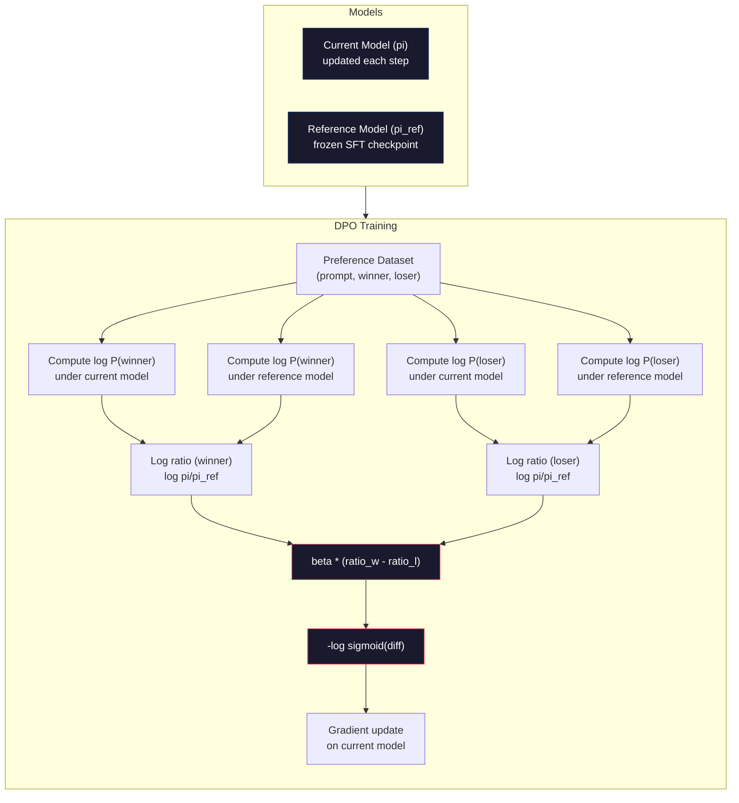

# डीपीओ: प्रत्यक्ष प्राथमिकता अनुकूलन

> RLHF काम करता है. इसके लिए तीन मॉडल (SFT, इनाम मॉडल, नीति) का प्रशिक्षण भी आवश्यक है, पीपीओ की अस्थिरता का प्रबंधन करना और एक केएल दंड को समायोजित करना। डीपीओ पूछता हैः क्या आप यह सब छोड़ सकते हैं? डीपीओ सीधे प्राथमिकता जोड़े पर भाषा मॉडल को अनुकूलित करता है। कोई इनाम मॉडल नहीं। कोई पीपीओ नहीं। एक प्रशिक्षण लूप। समान परिणाम।

> **【中文解读】**RLHF 需要训练三个模型(SFT、奖励模型、策略), PPO की अस्थिरता को भी संभालना है──DPO 直接在偏好对上优化语言模型不需要奖励模型,不需要 PPO,一个训练循环,效果相当──

> **【拓展：DPO→简化对齐】**डीपीओ 2023 में स्टैनफोर्ड द्वारा प्रस्तावित आरएलएचएफ के प्रतिस्थापन कार्यक्रम है, जो कई ओपन सोर्स मॉडल जैसे ज़ेफायर, टूलू के लिए एक प्रमुख विकल्प बन गया है। यह आरएलएचएफ के जटिल प्रशिक्षण प्रक्रिया को एक सरल वर्गीकरण के रूप में सरल करेगा।

>  **【前置】**学本节前 कृपया पहले समझेंःPhase 10·07(RLHF)  समझें RLHF 流程和它的问题(3 个模型 + PPO 不稳定);PyTorch 监督学习基础──DPO is mathematical优雅的"RLHF without RL", समझें为什么有效需要看原文推导──

**Type:** Build
**Languages:** Python (with numpy)
**Prerequisites:** Phase 10, Lesson 07 (RLHF)
**Time:** ~90 minutes

>  **【类比】**डीपीओ बनाम आरएलएचएफ = 直接教育 बनाम 訓練動物。RLHF:先训一个" शिक्षक"(RM) छात्रों को打分, फिर से पीपीओ 让学生讨老师欢心3 个模型 + 复杂训练。DPO: सीधे छात्रों को看"好答案"和"坏答案"对照,让它自己学1 个模型 + 简单交叉──数学 DPO ने "偏好数据上分类做做分类" को "RLHF के सर्वश्रेष्ठ优解",省去了显然 RM──

> ️ **【易错点】**डीपीओ के 3 个坑:(1) **偏好数据质量决定一切**DPO 不像RLHF有 RM平滑噪音,标注错的偏好对直接学错;务必做标注质量控制──(2) **β 系数设错**太大(> 0.5)模型不变,太小(< 0.05)模型偏离 SFT 太远;典型 0.1──(3) **没做 reference model**DPO हानि 需要相对 SFT 模型的日志-prob 差分,忘记加载ref मॉडल 会训练崩;用 `AutoModelForCausalLM.from_pretrained(sft_path)`संदर्भा हेतु

## सीखने के लक्ष्य

- डीपीओ प्रशिक्षण लागू करना जो एक अलग इनाम मॉडल के बिना प्राथमिकता जोड़े पर सीधे भाषा मॉडल को अनुकूलित करता है
  DPO  प्रशिक्षण को प्राप्त करना, सीधे प्राथमिकता से ऊपर अनुकूलित भाषा मॉडल, बिना किसी अलग पुरस्कार मॉडल की आवश्यकता
- डीपीओ हानि फ़ंक्शन का व्युत्पन्न करें और यह समझाएं कि यह पॉलिसी की लॉग संभावनाओं के माध्यम से अप्रत्यक्ष रूप से एक पुरस्कार मॉडल का प्रतिनिधित्व कैसे करता है
  推导 DPO 损失函数, व्याख्या कैसे यह रणनीति के माध्यम से संख्यात्मक संभावनाओं के लिए गुप्त रूप से प्रदर्शित पुरस्कार मॉडल
- प्रशिक्षण स्थिरता, गणना लागत और आवश्यक मॉडल की संख्या के मामले में डीपीओ बनाम आरएलएचएफ की तुलना करें
  प्रशिक्षण स्थिरता, गणना लागत और आवश्यक मॉडल संख्या के मामले में डीपीओ की तुलना आरएलएचएफ से की जाती है
- प्रशिक्षण नीति को संदर्भ मॉडल से कितना अलग है, इस पर नियंत्रण करने के लिए बीटा पैरामीटर को समायोजित करें
  调节 बीटा 参数, नियंत्रण प्रशिक्षण रणनीति संदर्भ मॉडल से विचलन की डिग्री

> **【中文解读】**इस कोर्स में डीपीओ (DPO) को प्राप्त करने के लिए, आरएलएचएफ के सरल विकल्पों को प्राप्त किया गया है।

## समस्या  समस्या परिचय

आपने पाठ 07 में एक आरएलएचएफ पाइपलाइन बनाई। तीन चरण। तीन मॉडल। एसएफटी मॉडल, इनाम मॉडल और पीपीओ के साथ अनुकूलित नीति मॉडल। अकेले इनाम मॉडल के लिए हजारों मानव वरीयता जोड़े और एक अलग प्रशिक्षण लूप की आवश्यकता थी। पीपीओ के लिए केएल गुणांक, सीखने की दर, क्लिप अनुपात और युगों की संख्या को सावधानीपूर्वक समायोजित करना आवश्यक था।

> आपने सातवें वर्ग में आरएलएचएफ के निर्माण की है। तीन चरणों में तीन मॉडल हैं। एसएफटी मॉडल, पुरस्कार मॉडल और पीपीओ के अनुकूलन के लिए रणनीति मॉडल। केवल पुरस्कार मॉडल के लिए हजारों व्यक्तिगत वर्गों की प्राथमिकताएं और व्यक्तिगत प्रशिक्षण चक्रों की आवश्यकता होती है।

अभ्यास में, पीपीओ प्रशिक्षण कुख्यात रूप से अस्थिर है। हाइपरपैरामीटर में छोटे बदलाव प्रशिक्षण को विचलित करते हैं। इनाम मॉडल मानव वरीयताओं का एक अपूर्ण प्रॉक्सी है, और नीति अपनी कमजोरियों का लाभ उठाने के तरीके खोजती है। KL दंड मदद करता है लेकिन इसके लिए अपने स्वयं के ट्यूनिंग की आवश्यकता होती है - बहुत कम और आपको इनाम हैकिंग मिलता है, बहुत अधिक और मॉडल मुश्किल से सीखता है।

> 實踐中,PPO 訓練以不穩定著名──微小的超参数變化就可能导致訓練發散──奖励模型是人類偏好的不完美代理,策略會找到方法利用其弱点──KL 惩罚有助,但需要自己的调整太低會導致獎勵黑客,太高模型几乎不學習──

इस जटिलता के कारण अधिकांश ओपन-सोर्स मॉडल ने इंस्ट्रक्टजीपीटी के प्रकाशन के बाद वर्षों तक आरएलएचएफ के साथ संघर्ष किया। तीन चरणों की पाइपलाइन नाजुक है। प्रत्येक चरण में अपने स्वयं के विफलता मोड हैं, और त्रुटियां मिश्रित हैं।

> इस प्रकार की जटिलता ही InstructGPT के प्रकाशन के बाद अधिकांश ओपन सोर्स मॉडल वर्षों से RLHF का उपयोग करने में कठिनाई का कारण है।

मई 2023 में, राफेल राफाइलोव, आर्चिट शर्मा और स्टैनफोर्ड के सहयोगियों ने "प्रत्यक्ष वरीयता अनुकूलनः आपकी भाषा मॉडल गुप्त रूप से एक पुरस्कार मॉडल" प्रकाशित किया। इष्टतम इनाम फ़ंक्शन भाषा मॉडल की अपनी टोकन संभावनाओं द्वारा गणितीय रूप से निर्धारित किया जाता है। आप पुरस्कृत मॉडल को पूरी तरह से छोड़ सकते हैं और प्राथमिकता जोड़े पर सीधे भाषा मॉडल को अनुकूलित कर सकते हैं।

> 2023 में मई में, राफेल राफेलोव, आर्किट शर्मा और स्टैनफोर्ड के सहकर्मियों ने "प्रत्यक्ष वरीयता अनुकूलनः आपकी भाषा मॉडल गुप्त रूप से एक पुरस्कार मॉडल है" प्रकाशित किया।

डीपीओ आरएलएचएफ को एक एकल पर्यवेक्षित सीखने के चरण तक कम करता है। एक मॉडल। एक हानि समारोह। एक प्रशिक्षण लूप। कोई सुदृढीकरण सीखने नहीं। जेफायर -7 बी, पैमाने पर डीपीओ का उपयोग करने वाले पहले मॉडल में से एक, कई बेंचमार्क पर पूर्ण आरएलएचएफ के साथ प्रशिक्षित मॉडल को मिलाया या हराया। मेटा ने एलएमए 3 के संरेखण पाइपलाइन के हिस्से के रूप में डीपीओ का उपयोग किया। मानव ने अपने संरेखण अनुसंधान में डीपीओ-शैली के तरीकों का हवाला दिया है।

> डीपीओ आरएलएचएफ को एक एकल निगरानी सीखने के चरणों में सरल करेगा। एक मॉडल। एक हानि समारोह। एक प्रशिक्षण चक्र। कोई आवश्यकता नहीं है।

> **【中文解读】**डीपीओ ने आरएलएचएफ के तीन बड़े दर्द बिंदुओं को हल कियाः 1) अलग-अलग प्रशिक्षण पुरस्कार मॉडल की आवश्यकता नहीं है; 2) पीपीओ की अस्थिरता और सुपरपरमानुष समायोजन को संभालने की आवश्यकता नहीं है; 3) तीन मॉडल ट्यूबलाइन से एक प्रशिक्षण चक्र में सरलीकरण।

> **【拓展：DPO 在开源社区的普及】**डीपीओ 已成为开源模型对齐的首选方法──HuggingFace TRL库原生支持 DPO,Zephyr、Tulu、OpenHermes等知名开源模型都使用DPO 替代PPO──RLHF के मुकाबले, डीपीओ की प्रशिक्षण लागत लगभग बाद के 1/3 (((कम एक पुरस्कार मॉडल) के लिए है), और प्रशिक्षण अधिक स्थिर──Llama 3 के लिए एक साथ प्रशिक्षण DPO और अन्य तरीकों को जोड़ता है──

## अवधारणा का मूल अवधारणा

### महत्वपूर्ण समझ

आरएलएचएफ इस लक्ष्य को अनुकूलित करता हैः

> RLHF 优化 इस लक्ष्य:

जहां R इनाम मॉडल है, pi नीति है, pi_ref संदर्भ मॉडल है, और बीटा KL गुणांक है।

> इनमें R पुरस्कार मॉडल है, pi रणनीति है, pi_ref संदर्भ मॉडल है, बीटा KL संख्या है।

डीपीओ पेपर से पता चला है कि इस उद्देश्य का एक बंद रूप में इष्टतम समाधान है। किसी भी इनाम समारोह R के लिए, इष्टतम नीति हैः

> डीपीओ लेख इस लक्ष्य के लिए एक बंद रूप में सबसे अच्छा समाधान है। किसी भी पुरस्कार समारोह R के लिए, सबसे अच्छा रणनीति हैः

जहां Z(x) एक सामान्यीकरण स्थिर है। पुनर्गठनः

> इनमें से Z(x) है归一化常数──重新排列:

यह सफलता है. पुरस्कार पूरी तरह से नीति मॉडल की संभावनाओं और संदर्भ मॉडल की संभावनाओं के संदर्भ में व्यक्त किया जाता है। आपको एक अलग पुरस्कार मॉडल को प्रशिक्षित करने की आवश्यकता नहीं है। पुरस्कार * सम्मोहक * संभावना अनुपात में है।

> यह है सफलता। इनाम पूरी तरह से रणनीति मॉडल की संभावना और संदर्भ मॉडल की संभावना से संबंधित है। आपको अकेले इनाम मॉडल को प्रशिक्षित करने की आवश्यकता नहीं है। इनाम संभावना अनुपात में * छिपा * मात्रा है।

ब्रैडली-टेरी प्राथमिकता मॉडल में इसे प्रतिस्थापित करनाः

> इसे ब्रैडली-टेरी  पसंदीदा मॉडल में बदलनाः

Z(x) शब्द रद्द हो जाते हैं क्योंकि दोनों प्रतिक्रियाएं एक ही प्रॉम्प्ट x पर स्थित होती हैं। जो कुछ भी शेष है वह केवल नीति मॉडल की लॉग-संभाव्यताओं और संदर्भ मॉडल की पसंदीदा और अस्वीकृत प्रतिक्रियाओं पर लॉग-संभाव्यताओं का कार्य है।

> Z(x) 项消了, क्योंकि दो प्रतिक्रियाएं एक ही प्रॉम्प्ट x के रूप में हैं।

### डीपीओ का नुकसान

```
L_DPO = -log(sigmoid(beta * (log pi(y_w|x)/pi_ref(y_w|x) - log pi(y_l|x)/pi_ref(y_l|x))))
```

चलो प्रत्येक टुकड़ा को उतार देंः

> 让我们解析每部分:

- **y_w**= पसंदीदा (विजेता) प्रतिक्रिया
- **y_l**= अस्वीकृत (हारे हुए) प्रतिक्रिया
- **x**= शीघ्र
- **pi**= वर्तमान मॉडल (शिक्षित होने)
- **pi_ref**= संदर्भ मॉडल (मुस्कृत एसएफटी जांच बिंदु)
- **beta**= संदर्भ से विचलन को नियंत्रित करने वाला तापमान पैरामीटर (आमतौर पर 0.1 से 0.5)

> **【中文解读】**डीपीओ 损失函数 का केंद्र "对数概率比对数概率比":beta * (लॉग pi(y_w) /pi_ref(y_w) -लॉग pi(y_l) /pi_ref(y_l))。 यह मापने की रणनीति मॉडल के सापेक्ष संदर्भ मॉडल अधिक पसंद चुना गया प्रतिक्रियाएँ、更不偏好 अस्वीकार किया गया प्रतिक्रियाओं की डिग्री。beta 控制策略偏离参考模型的程度(RLHF में KL系数 के समान), विशिष्ट 0.1-0.5。

> **【拓展：DPO 的数学直觉】**डीपीओ का सफलता RLHF में इनाम फ़ंक्शन "छिपे हुए" को रणनीति मॉडल और संदर्भ मॉडल के लिए व्यक्त करने में है संभावना अनुपात:R(x,y) = बीटा * लॉग(pi(yx) / pi_ref(yx)) + const यह मतलब है कि स्पष्ट प्रशिक्षण की आवश्यकता नहीं है इनाम मॉडल रणनीति मॉडल स्वयं इनाम मॉडल है।

अनुपात `log pi(y|x) / pi_ref(y|x)`यह लॉग-प्रभाव्यता अनुपात है। जब यह अनुपात सकारात्मक होता है, तो वर्तमान मॉडल प्रतिक्रिया y को संदर्भ से अधिक संभावना देता है। जब ऋणात्मक होता है, तो वर्तमान मॉडल कम संभावना देता है।

> अनुपात`log pi(y|x) / pi_ref(y|x)`यह संख्यात्मक संभावना अनुपात है। यदि यह अनुपात सही समय पर है, तो वर्तमान मॉडल प्रतिक्रिया देता है और संदर्भ से अधिक संभावनाओं का वितरण करता है।

डीपीओ हानि मॉडल को प्राथमिकता वाले उत्तरों के लिए लॉग-प्रभाव्यता अनुपात बढ़ाने और अस्वीकृत उत्तरों के लिए इसे कम करने के लिए धक्का देती है। बीटा पैरामीटर नियंत्रित करता है कि मॉडल संदर्भ से कितनी आक्रामक रूप से विचलित हो सकता है - छोटे बीटा का मतलब है कि बड़े विचलन की अनुमति है, बड़े बीटा मॉडल को संदर्भ के करीब रखता है।

> डीपीओ हानि प्रवर्धन मॉडल वृद्धि प्रथम चयन प्रतिक्रिया के प्रति संख्या संभावना अनुपात, कम अस्वीकार प्रतिक्रिया के प्रति संख्या संभावना अनुपात ⋅ बीटा 参数 नियंत्रण मॉडल संदर्भ मॉडल से विचलन के उत्तेजना स्तर  छोटा बीटा  अनुमति देता है बड़े विचलन, बड़े बीटा 保持 मॉडल करीब संदर्भ ⋅



### डीपीओ सरल क्यों है

| Aspect | RLHF (PPO) | DPO |
|--------|-----------|-----|
| Models to train | 3 (SFT + reward + policy) | 1 (policy only) |
| Training loops | 3 (SFT, RM training, PPO) | 2 (SFT, DPO) |
| Hyperparameters | lr, KL coeff, clip ratio, RM lr, epochs x3 | lr, beta, epochs |
| Reward model | Required (separate training) | Implicit in model probabilities |
| RL algorithm | PPO (complex, unstable) | Supervised learning (stable) |
| GPU memory | 3-4 models in memory during PPO | 2 models (current + reference) |
| Training stability | Sensitive to hyperparameters | Robust, similar to SFT |

डीपीओ को प्रशिक्षण के दौरान स्मृति में दो मॉडल की आवश्यकता होती है - वर्तमान मॉडल और जमे हुए संदर्भ। आरएलएचएफ को तीन या चार की आवश्यकता होती हैः नीति, संदर्भ, इनाम मॉडल, और वैकल्पिक रूप से मूल्य फ़ंक्शन बेसलाइन। 70 बी मॉडल के लिए, प्रत्येक प्रति FP16 में 140GB लेती है। इनाम मॉडल को समाप्त करने से मेमोरी की बचत काफी है।

> डीपीओ प्रशिक्षण के लिए दो मॉडल मेमोरी में हैं वर्तमान मॉडल और संदर्भ मॉडल के लिए रिजल्ट मॉडल RLHF  तीन या चार की आवश्यकता हैः रणनीति, संदर्भ, पुरस्कार मॉडल, साथ ही चयन योग्य मूल्य फ़ंक्शन की आधार रेखा 70B मॉडल के लिए, प्रत्येक प्रति FP16 में 140GB का हिस्सा है इनाम मॉडल की स्पष्ट भंडारण को समाप्त करना महत्वपूर्ण है

### जब डीपीओ आरएलएचएफ से बेहतर होता है

**Small datasets.**5,000-20,000 प्राथमिकता जोड़े के साथ, डीपीओ अक्सर RLHF से मेल खाता है या उससे अधिक है। RLHF में इनाम मॉडल को सामान्यीकरण के लिए पर्याप्त डेटा की आवश्यकता होती है - सीमित डेटा के साथ, यह ओवरऑप करता है और अविश्वसनीय इनाम संकेत उत्पन्न करता है। डीपीओ इस समस्या को इस तरह से बायपास करता है कि किसी भी इनाम मॉडल की आवश्यकता नहीं होती है।

> **小型数据集。**5,000-20,000 वरीयता के लिए, डीपीओ को आमतौर पर RLHF के अनुरूप या उससे अधिक RLHF के लिए पर्याप्त डेटा की आवश्यकता होती है।

**Limited compute.**डीपीओ को पूर्ण आरएलएचएफ (तीन के बजाय एक प्रशिक्षण लूप) की गणना के लगभग एक तिहाई की आवश्यकता होती है। बड़े जीपीयू क्लस्टर के बिना टीमों के लिए, यह व्यावहारिक विकल्प है।

> **有限算力。**डीपीओ लगभग केवल पूर्ण आरएलएचएफ की गणना की मात्रा का एक प्रशिक्षण चक्र की आवश्यकता होती है।

**Rapid iteration.**आप 10 अलग-अलग प्राथमिकता डेटा सेट का परीक्षण करना चाहते हैं यह देखने के लिए कि कौन सा सबसे अच्छा मॉडल बनाता है? डीपीओ आपको प्रत्येक प्रयोग को घंटों में चलाने देता है। आरएलएचएफ प्रत्येक डेटा सेट के लिए पुरस्कार मॉडल को फिर से प्रशिक्षित करने की आवश्यकता होती है।

> **快速迭代。**想尝试10 अलग-अलग प्राथमिकता डेटा集看哪个产生的最佳模型?DPO 让你在几小时内运行每一个实验――RLHF 需要为每一个数据集重新训练奖励模型――

### जब आरएलएचएफ डीपीओ से बेहतर होता है

**Large-scale training.**जीपीटी-4 या क्लाउड के पैमाने पर, आरएलएचएफ का अलग इनाम मॉडल अधिक बारीक प्राथमिकता संकेतों को कैप्चर कर सकता है। इनाम मॉडल एक सीखे हुए नुकसान फ़ंक्शन के रूप में कार्य करता है जो जटिल गुणवत्ता मानदंडों के अनुकूल है।

> **大规模训练。**जीपीटी-4 या क्लाउड के पैमाने पर, आरएलएचएफ का स्वतंत्र पुरस्कार मॉडल अधिक विस्तृत प्राथमिकता संकेतों को पकड़ सकता है।

**Complex reward signals.**जब "बेटर" में कई आयाम शामिल होते हैं (उपयोगिता, हानिरहितता, ईमानदारी), एक पुरस्कार मॉडल इस बहु-उद्देश्यीय व्यापार को सीख सकता है। डीपीओ प्रत्येक प्राथमिकता जोड़ी को द्विआधारी संकेत के रूप में व्यवहार करता है - एक बेहतर है, एक बदतर है - बिना मॉडल किए क्यों।

> **复杂奖励信号。**जब "बेहतर" कई आयामों (उपयोगिता, हानिरहितता, ईमानदारी) को शामिल करता है, तो पुरस्कार मॉडल इस तरह के बहु-उद्देश्यीय वजन को सीख सकता है।

**Iterative alignment.**आरएलएचएफ पाइपलाइनें वर्तमान नीति के साथ नए उत्तर उत्पन्न कर सकती हैं, मनुष्यों को उन्हें रेट कर सकती हैं, और ऑनलाइन लूप में इनाम मॉडल को फिर से प्रशिक्षित कर सकती हैं। डीपीओ प्राथमिकता जोड़े के एक निश्चित डेटासेट पर काम करता है। संवैधानिक एआई (एंथ्रोपिक का दृष्टिकोण) आरएलएचएफ की इस पुनरावृत्ति संपत्ति का व्यापक रूप से उपयोग करता है।

> **迭代对齐。**आरएलएचएफ पाइपलाइन मौजूदा रणनीति के साथ नई प्रतिक्रिया उत्पन्न कर सकती है, मानव मूल्यांकन कर सकती है, और ऑनलाइन चक्र में पुनः प्रशिक्षण पुरस्कार मॉडल को पुनः पेश कर सकती है।

### डीपीओ से परेः केटीओ, ओआरपीओ, सिम्पो

डीपीओ ने सरलीकृत संरेखण विधियों के परिवार को प्रेरित किया।

> डीपीओ ने एक सरलीकृत तरीके शुरू किए हैं।

**KTO (Kahneman-Tversky Optimization, 2024):**आपको जोड़े की भी जरूरत नहीं है। KTO अनपेयर किए गए प्रतिक्रिया के साथ काम करता है - बस प्रत्येक प्रतिक्रिया को "अच्छा" या "बुरा" के रूप में लेबल करें बिना किसी अन्य विकल्प की तुलना किए। इससे डेटा संग्रह में काफी आसानी होती है। टिप्पणीकारों को दो प्रतिक्रियाओं को दिखाने और पूछने के बजाय "कौन बेहतर है?", आप एक प्रतिक्रिया दिखाते हैं और पूछते हैं "क्या यह अच्छा है?" हानि फ़ंक्शन संभावना सिद्धांत से हानि प्रतिरोध लागू करता हैः खराब प्रतिक्रियाओं को बेहतर प्रतिक्रियाओं की तुलना में अधिक दंडित किया जाता है।

> **KTO（Kahneman-Tversky 优化，2024）：**आपको यहां तक कि एक साथ की आवश्यकता नहीं है। आप एक साथ की आवश्यकता नहीं है। आप एक साथ की आवश्यकता है। आप एक साथ की आवश्यकता है। आप एक साथ की आवश्यकता है। आप एक साथ की आवश्यकता है।

**ORPO (Odds Ratio Preference Optimization, 2024):**एक प्रशिक्षण चरण में एसएफटी और संरेखण को जोड़ता है। पहले एसएफटी करने के बजाय, फिर डीपीओ, ओआरपीओ एसएफटी हानि को प्राथमिकता सिग्नल को शामिल करने के लिए संशोधित करता है। हानि में दो शर्तें हैंः पसंदीदा प्रतिक्रियाओं पर एक मानक अगले टोकन भविष्यवाणी हानि, प्लस एक बाधा अनुपात अवधि जो पसंदीदा और अस्वीकृत प्रतिक्रिया संभावनाओं के बीच अंतर को बढ़ाता है। दो के बजाय एक प्रशिक्षण लूप।

> **ORPO（赔率比偏好优化，2024）：**एक प्रशिक्षण चरण में एसएफटी और संयोजन के साथ समन्वय करना। ओआरपीओ में एसएफटी हानि को प्राथमिकता वाले संकेतों को शामिल करने के लिए संशोधित करना, पहले एसएफटी को फिर से डीपीओ को करने के बजाय। हानि में दो तत्व हैंः पहला चयन पुनःपुनर्प्राप्त करने का मानक अगला टोकन  पूर्वानुमान हानि, इसके अलावा बढ़ते हुए पहला चयन और अस्वीकार किए जाने वाले प्रत्याशा अंतर के लिए हानि अनुपात। एक प्रशिक्षण चक्र दो के बजाय।

**SimPO (Simple Preference Optimization, 2024):**संदर्भ मॉडल को पूरी तरह से समाप्त करता है। ठंडे संदर्भ के खिलाफ लॉग-संभाव्यता अनुपात की गणना करने के बजाय, सिम्पो प्रतिक्रिया (लंबाई द्वारा सामान्यीकृत) की औसत लॉग-संभाव्यता का उपयोग संवेदी पुरस्कार के रूप में करता है। यह स्मृति को बचाता है (कोई संदर्भ मॉडल की आवश्यकता नहीं है) और प्रशिक्षण को सरल बनाता है। लंबाई सामान्यीकरण मॉडल को कम प्रतिक्रियाओं का पक्षधर होने से रोकता है।

> **SimPO（简单偏好优化，2024）：**完全消除参考模型──SIMPO उपयोग回复的平均对数概率 (~) 长度归化) को गुप्त रूप से पुरस्कृत करने के बजाय 结的参考计算对数概率比── यह内存 को बचाता है无需参考模型) और प्रशिक्षण को सरल बनाता है长度归化防止模型偏向更短的回复──

| Method | Year | Models in Memory | Needs Pairs? | Needs Reference? | Training Loops |
|--------|------|-----------------|-------------|-----------------|----------------|
| RLHF | 2022 | 3-4 | Yes (for RM) | Yes | 3 |
| DPO | 2023 | 2 | Yes | Yes | 2 |
| KTO | 2024 | 2 | No (unpaired) | Yes | 2 |
| ORPO | 2024 | 1 | Yes | No | 1 |
| SimPO | 2024 | 1 | Yes | No | 1 |

प्रवृत्ति स्पष्ट हैः प्रत्येक विधि एक और जटिलता को समाप्त करती है। आरएलएचएफ को एक इनाम मॉडल और पीपीओ की आवश्यकता थी। डीपीओ ने दोनों को समाप्त कर दिया। केटीओ ने जोड़े के डेटा को समाप्त कर दिया। ओआरपीओ ने अलग एसएफटी चरण को समाप्त कर दिया। सिम्पो ने संदर्भ मॉडल को समाप्त कर दिया। संरेखण कर - आधार मॉडल से संरेखित मॉडल में जाने की गणना और जटिलता लागत - लगातार गिर रही है।

> 趋势很明确: प्रत्येक प्रकार का एक जटिलता को समाप्त करने का तरीका है। RLHF 需要奖励模型和PPO──DPO 两者都都都都都都都都都都都都都都都都都都都都都都都都都都都都都都都都都都都都都都都都都都都都都都都都都都都都都都都都都都都都都都都都都都都都都都都都都都都都都都都都都都都都都都都都都都都都都都都都都都都都都都都都都都都都都都都都都都都都都都都都都都都都都都都都都都都都都都都都都都都都都都都都都都都都都都都都都都都都都都都都都都都都都都都都都都都都都都都都都都都都都都都都都都都都都都都都都都都都都都都都都都都都都都都都都都都都都都都都都都都都都都都都都都都都都都都都都都都都都都都都都都都都都都都都都都都都都都都都都都都都都都都都都都都都都都都都都都都都都都都都都都都都都都都都都都都都都都都都都都都都都都都都都都都都都都都都都都都都都都都都都都都都都都都都都都都都都都都都都都都都都都都都都都都都都都都都都都都都都都都都都都都都都都都都都都都都都都都都都都都都都都都都都都都都都都都都都都都都都都都都都都都都都都都都都都都都都都都都都都都都都都都都都都都都都都都都都都都都都都都都都都都都都都都都都都都都都都都都都都都都都都都都都都都都都都都都

### वास्तविक डीपीओ तैनाती

**Zephyr-7B (HuggingFace, October 2023):**मिस्ट्रल 7 बी बेस, अल्ट्राचैट पर एसएफटी (200K उदाहरण), फिर अल्ट्राफीडबैक पर डीपीओ (60K प्राथमिकता जोड़े) । एमटी-बेंच पर 6.47 स्कोर किया गया - उस समय सबसे अधिक 7 बी मॉडल। तुलना के लिए, एलम्मा 2 चैट 70 बी ने 6.86 स्कोर किया, जिसका अर्थ है कि ज़ेफायर केवल डीपीओ संरेखण का उपयोग करके मॉडल के आकार के 10 गुना के 6% के भीतर मिला।

> **Zephyr-7B（HuggingFace，2023 年 10 月）：**मिस्ट्रल 7B  आधार मॉडल, UltraChat में SFT करें, फिर UltraFeedback में DPO करें। MT-Bench में 6.47 प्राप्त करें।

**Llama 3 (Meta, April 2024):**आरएलएचएफ के प्रारंभिक चरणों के बाद डीपीओ का उपयोग किया गया। संयोजन से पता चलता है कि डीपीओ और आरएलएचएफ पूरक हो सकते हैं - व्यापक संरेखण के लिए आरएलएचएफ, लक्षित परिष्करण के लिए डीपीओ।

> **Llama 3（Meta，2024 年 4 月）：**आरएलएचएफ के प्रारंभिक चरण में डीपीओ का उपयोग करने के बाद यह संयोजन दर्शाता है कि डीपीओ और आरएलएचएफ व्यापक रूप से उपयोग किए जाने वाले आरएलएचएफ के साथ एक दूसरे के साथ उपयोग किए जा सकते हैं।

**Neural Magic / nm-chat (2024):**DPO को कई ओपन-सोर्स मॉडल पर लागू किया गया, जिसमें केवल SFT बेसलाइनों की तुलना में संरेखण बेंचमार्क में लगातार 5-15% सुधार दिखाया गया।

> **Neural Magic / nm-chat（2024）：**डीपीओ को कई ओपन सोर्स मॉडल में लागू किया जाएगा, जो शुद्ध एसएफटी आधार लाइन से 5-15% बढ़कर दिखाएगा।

## इसे बनाओ, इसे पूरा करो।
```figure
dpo-loss
```

## इसे बनाओ

### चरण 1: प्राथमिकता डेटासेट

RLHF के समान प्रारूप - (उत्प्रेरित, पसंद, अस्वीकार) तीन गुना। डीपीओ इस डेटा को सीधे एक मध्यवर्ती इनाम मॉडल के बिना खपत करता है।

> 格式与 RLHF 相同( शीघ्र, 首选, 被拒绝) 三元组──DPO 直接消费这些数据,无需中间的奖励模型──

```python
import numpy as np
import sys
import os
sys.path.insert(0, os.path.join(os.path.dirname(__file__), "..", "..", "04-pre-training-mini-gpt", "code"))
from main import MiniGPT, LayerNorm, Embedding, TransformerBlock

PREFERENCE_DATA = [
    {
        "prompt": "What is the capital of France?",
        "preferred": "The capital of France is Paris.",
        "rejected": "France is a country in Europe. It has many cities. The capital is Paris. Paris is known for the Eiffel Tower.",
    },
    {
        "prompt": "Explain gravity in one sentence.",
        "preferred": "Gravity is the force that attracts objects with mass toward each other.",
        "rejected": "Gravity is something that makes things fall down when you drop them.",
    },
    {
        "prompt": "What is 15 times 7?",
        "preferred": "15 times 7 is 105.",
        "rejected": "Let me think about this. 15 times 7. Well, 10 times 7 is 70, and 5 times 7 is 35, so the answer might be around 105.",
    },
    {
        "prompt": "Name three programming languages.",
        "preferred": "Python, Rust, and TypeScript.",
        "rejected": "There are many programming languages. Some popular ones include various languages like Python and others.",
    },
    {
        "prompt": "What year did World War II end?",
        "preferred": "World War II ended in 1945.",
        "rejected": "World War II was a major global conflict. It involved many countries. The war ended in the mid-1940s, specifically in 1945.",
    },
    {
        "prompt": "Define machine learning.",
        "preferred": "Machine learning is a field where algorithms learn patterns from data to make predictions without being explicitly programmed.",
        "rejected": "Machine learning is a type of AI. AI stands for artificial intelligence. Machine learning uses data to learn.",
    },
]
```

### चरण 2: अनुक्रम लॉग-संभाव्यता

डीपीओ हानि के लिए एक प्रॉम्प्ट दिए गए उत्तर की कुल लॉग-संभाव्यता की गणना की आवश्यकता होती है। इसका मतलब है कि मॉडल को पूर्ण (प्रॉम्प्ट + प्रतिक्रिया) अनुक्रम पर चलाएं और प्रत्येक प्रतिक्रिया टोकन की लॉग-संभाव्यताओं का योग करें।

> DPO 损失需要计算给定提示下回复的总对数概率── इसका अर्थ है कि प्रत्येक回复 टोकन के लिए कुल () () () () () () () () () () () () () () () () () () () () () () () () () () () () () () () () () () () () () () () () () () () () () () () () () () () () () () () () () () () () () () () () () () () () () () () () () () () () () () () () () () () () () () () () () () () () () () () () () () () () () () () () () () () () () () () () () () () () () () () () () () () () () () () () () () () () () () () () () () () () () () () () () () () () () () () () () () () () () () () () () () () () () () () () () () () () () () () () () () () () () () () () () () () () () () () () () () () () () () () () () () () () () () () () () () () () () () () () () () () () () () () () () () () () () () () () () () () () () () () () () () () () () () () () () () () () () () () () () () () () () () () () () () () () () () () () () () () () () () () () () () () () () () () () () () () () () () () () () () () () () () () () () () () () () () () () () () () () () () () () () () () () () () () () () () () () () () () () () () () () () () () () () () () () () () () () () () () () () () () () () () () () () () () () () () () () () () () () () () () () () () () () () () () () () () () () () () () () () () () () () () () () () () () () () () () () () () () () () () () () () () () () () () () () () () () () () () () () () () () () () () () () () () () () () () () () () () () () () () () () () () () () () () () () () () () () () () () () () ()

```python
def tokenize_sequence(text, vocab_size=256):
    return [min(t, vocab_size - 1) for t in list(text.encode("utf-8"))]


def compute_sequence_log_prob(model, prompt_tokens, response_tokens, max_seq_len=128):
    full_sequence = prompt_tokens + response_tokens
    if len(full_sequence) > max_seq_len:
        full_sequence = full_sequence[:max_seq_len]

    if len(full_sequence) < 2:
        return 0.0

    input_ids = np.array(full_sequence[:-1]).reshape(1, -1)
    target_ids = np.array(full_sequence[1:])

    logits = model.forward(input_ids)
    logits = logits[0]

    max_logits = logits.max(axis=-1, keepdims=True)
    log_probs = logits - max_logits - np.log(
        np.exp(logits - max_logits).sum(axis=-1, keepdims=True)
    )

    prompt_len = len(prompt_tokens)
    response_start = max(0, prompt_len - 1)
    response_end = len(target_ids)

    if response_start >= response_end:
        return 0.0

    response_log_probs = log_probs[response_start:response_end, :]
    response_targets = target_ids[response_start:response_end]

    total_log_prob = 0.0
    for i, target in enumerate(response_targets):
        total_log_prob += response_log_probs[i, target]

    return total_log_prob
```

यह फ़ंक्शन डीपीओ का कार्यघोड़ा है। प्रत्येक प्राथमिकता जोड़ी के लिए, यह चार बार चलता हैः प्राथमिकता प्रतिक्रिया पर मॉडल, अस्वीकृत प्रतिक्रिया पर मॉडल, प्राथमिकता प्रतिक्रिया पर संदर्भ, अस्वीकृत प्रतिक्रिया पर संदर्भ। यह आरएलएचएफ के उत्पादन + इनाम स्कोर + मूल्य अनुमान + पीपीओ अपडेट के मुकाबले प्रशिक्षण उदाहरण प्रति 4 आगे के पास है। सरल, तेज़, अधिक स्थिर।

> यह फ़ंक्शन DPO की मुख्य शक्ति है। प्रत्येक प्राथमिकता के लिए, यह चार बार चलता हैः मॉडल में पहली पसंद का पुनरावृत्ति पर, मॉडल में अस्वीकृत का पुनरावृत्ति पर, संदर्भ में पहली पसंद का पुनरावृत्ति पर, संदर्भ में अस्वीकृत का पुनरावृत्ति पर, प्रत्येक प्रशिक्षण नमूना में 4 बार पूर्ववर्ती प्रसार, जबकि RLHF को उत्पन्न करने की आवश्यकता है +  पुरस्कार रेटिंग + मूल्य मूल्यांकन + PPO 更新── अधिक सरल, अधिक तेज़, अधिक स्थिर।

### चरण 3: डीपीओ का नुकसान

कोड में कागज का मूल एक फ़ंक्शन एक हानि कोई इनाम मॉडल नहीं

> 论文核心的代码实现──一个函数──一个损失──无需奖励模型──

```python
def sigmoid(x):
    return np.where(
        x >= 0,
        1.0 / (1.0 + np.exp(-x)),
        np.exp(x) / (1.0 + np.exp(x))
    )


def dpo_loss(policy_logprob_preferred, policy_logprob_rejected,
             ref_logprob_preferred, ref_logprob_rejected, beta=0.1):
    preferred_ratio = policy_logprob_preferred - ref_logprob_preferred
    rejected_ratio = policy_logprob_rejected - ref_logprob_rejected

    logit = beta * (preferred_ratio - rejected_ratio)

    loss = -np.log(sigmoid(logit) + 1e-8)

    preferred_reward = beta * preferred_ratio
    rejected_reward = beta * rejected_ratio

    return loss, {
        "preferred_ratio": float(preferred_ratio),
        "rejected_ratio": float(rejected_ratio),
        "logit": float(logit),
        "implicit_preferred_reward": float(preferred_reward),
        "implicit_rejected_reward": float(rejected_reward),
        "reward_margin": float(preferred_reward - rejected_reward),
    }
```

`preferred_ratio`और `rejected_ratio`DPO व्युत्पन्न से लॉग-प्रभाव्यता अनुपात हैं। जब वर्तमान मॉडल पसंदीदा प्रतिक्रिया (संदर्भ के संबंध में) के लिए उच्च संभावना और अस्वीकृत प्रतिक्रिया के लिए कम संभावना को सौंपता है, तो लॉजिट सकारात्मक है और हानि कम है। प्रशिक्षण संकेत मॉडल को ठीक इस दिशा में धकेलता है।

> `preferred_ratio`和 `rejected_ratio`                                                                                                                                                                                                                                                              

`implicit_preferred_reward`और `implicit_rejected_reward`आप उन्हें निकाल सकते हैं यह सत्यापित करने के लिए कि प्रशिक्षण काम कर रहा है - पसंदीदा और अस्वीकृत पुरस्कार के बीच अंतर प्रशिक्षण के दौरान बढ़ना चाहिए।

> `implicit_preferred_reward`和 `implicit_rejected_reward`यह डीपीओ के नुकसान के लिए छिपी हुई इनामों का वितरण है। आप उन्हें प्रशिक्षण के दौरान प्रशिक्षण के प्रभावी होने और अस्वीकृत इनामों के बीच की सीमा को सत्यापित करने के लिए उठा सकते हैं।

### चरण 4: डीपीओ प्रशिक्षण लूप

एक मानक पर्यवेक्षित प्रशिक्षण लूप, कोई पीपीओ नहीं, कोई पुरस्कार मॉडल नहीं, बस आगे के पास और ग्रेडिएंट अपडेट।

> 标准的监督学习 प्रशिक्षण चक्र――无需PPO――无需奖励模型―― केवल पूर्ववर्ती प्रसार和梯度更新――

```python
def copy_model_weights(source, target):
    target.embedding.token_embed = source.embedding.token_embed.copy()
    target.embedding.pos_embed = source.embedding.pos_embed.copy()
    target.ln_f.gamma = source.ln_f.gamma.copy()
    target.ln_f.beta = source.ln_f.beta.copy()
    for s_block, t_block in zip(source.blocks, target.blocks):
        t_block.attn.W_q = s_block.attn.W_q.copy()
        t_block.attn.W_k = s_block.attn.W_k.copy()
        t_block.attn.W_v = s_block.attn.W_v.copy()
        t_block.attn.W_out = s_block.attn.W_out.copy()
        t_block.ffn.W1 = s_block.ffn.W1.copy()
        t_block.ffn.W2 = s_block.ffn.W2.copy()
        t_block.ffn.b1 = s_block.ffn.b1.copy()
        t_block.ffn.b2 = s_block.ffn.b2.copy()
        t_block.ln1.gamma = s_block.ln1.gamma.copy()
        t_block.ln1.beta = s_block.ln1.beta.copy()
        t_block.ln2.gamma = s_block.ln2.gamma.copy()
        t_block.ln2.beta = s_block.ln2.beta.copy()


def dpo_train(policy_model, reference_model, preference_data,
              num_epochs=5, lr=5e-6, beta=0.1, max_seq_len=128):
    print(f"DPO Training: {len(preference_data)} pairs, {num_epochs} epochs, "
          f"lr={lr}, beta={beta}")
    print()

    losses = []
    margins = []

    for epoch in range(num_epochs):
        epoch_loss = 0.0
        epoch_margin = 0.0
        num_examples = 0

        indices = np.random.permutation(len(preference_data))

        for idx in indices:
            pair = preference_data[idx]

            prompt_tokens = tokenize_sequence(pair["prompt"])
            preferred_tokens = tokenize_sequence(pair["preferred"])
            rejected_tokens = tokenize_sequence(pair["rejected"])

            pi_logprob_w = compute_sequence_log_prob(
                policy_model, prompt_tokens, preferred_tokens, max_seq_len
            )
            pi_logprob_l = compute_sequence_log_prob(
                policy_model, prompt_tokens, rejected_tokens, max_seq_len
            )
            ref_logprob_w = compute_sequence_log_prob(
                reference_model, prompt_tokens, preferred_tokens, max_seq_len
            )
            ref_logprob_l = compute_sequence_log_prob(
                reference_model, prompt_tokens, rejected_tokens, max_seq_len
            )

            loss, metrics = dpo_loss(
                pi_logprob_w, pi_logprob_l,
                ref_logprob_w, ref_logprob_l, beta
            )

            update_direction = 1.0 if metrics["logit"] < 0 else -0.1
            for block in policy_model.blocks:
                block.ffn.W1 += lr * update_direction * np.random.randn(*block.ffn.W1.shape) * 0.01
                block.ffn.W2 += lr * update_direction * np.random.randn(*block.ffn.W2.shape) * 0.01

            epoch_loss += loss
            epoch_margin += metrics["reward_margin"]
            num_examples += 1
            losses.append(float(loss))
            margins.append(metrics["reward_margin"])

        avg_loss = epoch_loss / max(num_examples, 1)
        avg_margin = epoch_margin / max(num_examples, 1)

        print(f"  Epoch {epoch + 1}/{num_epochs} | Loss: {avg_loss:.4f} | "
              f"Avg Margin: {avg_margin:.4f}")

    return policy_model, losses, margins
```

प्रशिक्षण लूप RLHF की तुलना में ताज़ा सरल है। प्रत्येक प्राथमिकता जोड़ी के लिएः चार लॉग-संभाव्यताओं (दो मॉडल, दो प्रतिक्रियाएं) की गणना करें, उन्हें डीपीओ हानि में प्लग करें, ग्रेडिएंट की गणना करें, नीति को अपडेट करें। कोई पीढ़ी चरण नहीं। कोई इनाम मॉडल निष्कर्ष नहीं। कोई लाभ अनुमान नहीं। कोई कटिंग नहीं।

> RLHF के मुकाबले, प्रशिक्षण चक्र सरल है और आकर्षक है। प्रत्येक प्राथमिकता के लिए: गणना चार प्रति संख्या संभावनाओं के लिएः दो मॉडल, दो दो दोहराव), डीपीओ हानि, गणना स्तर, अद्यतन रणनीति।

### चरण 5: डीपीओ बनाम आरएलएचएफ की तुलना करें

सीखा 07 से आरएलएचएफ मॉडल के साथ डीपीओ की तुलना करने के लिए अप्रत्यक्ष इनाम मार्जिन और लॉग-प्रोबेबिलिटी शिफ्ट की माप करें।

> ️️️️️️️️️️️️️️️️️️️️️️️️️️️️️️️️️️️️️️️️️️️️️️️️️️️️️️️️️️️️️️️️️️️️️️️️️️️️️️️️️️️️️️️️️️️️️️️️️️️️️️️️️️️️️️️️️️️️️️️️️️️️️️️️️️️️️️️️️️️️️️️️️️️️️️️️️️️️️️️️️️️️️️️️️️️️️️️️️️️️️️️️️️️️️️️️️️️️️️️️️️️️️️️️️️️️️️️️️️️️️️️️️️️️️️️️️️️️️️️️️️️️️️️️️️️️️️️️️️️️️️️️️️️️️️️️️️️️️️️️️️️️️️️️️️️️️️️️️️️️️️️️️️️️️️️️️️️️️️️️️️️️️️️️️️️️️️️️️️️️️️️️️️️️️️️️️️️️️️️️️️️️️️️️️️️️️️️️️️️️️️️️️️️️️️️️️️️️️️️️️️️️️️️️️️️️️️️️️️️️️️️️️️️️️️️️️️️️️️️️️️️️️️️️️️️️️️️️️️️️️️️️️️️️️️️️️️️️️️️️️️️️️️️️️️️️️️️️️️️️️️️️️️️️️

```python
def evaluate_preference_accuracy(model, reference_model, preference_data, beta=0.1, max_seq_len=128):
    correct = 0
    total = 0

    for pair in preference_data:
        prompt_tokens = tokenize_sequence(pair["prompt"])
        preferred_tokens = tokenize_sequence(pair["preferred"])
        rejected_tokens = tokenize_sequence(pair["rejected"])

        pi_w = compute_sequence_log_prob(model, prompt_tokens, preferred_tokens, max_seq_len)
        pi_l = compute_sequence_log_prob(model, prompt_tokens, rejected_tokens, max_seq_len)
        ref_w = compute_sequence_log_prob(reference_model, prompt_tokens, preferred_tokens, max_seq_len)
        ref_l = compute_sequence_log_prob(reference_model, prompt_tokens, rejected_tokens, max_seq_len)

        preferred_reward = beta * (pi_w - ref_w)
        rejected_reward = beta * (pi_l - ref_l)

        if preferred_reward > rejected_reward:
            correct += 1
        total += 1

    return correct / max(total, 1)


def analyze_implicit_rewards(model, reference_model, preference_data, beta=0.1, max_seq_len=128):
    print("Implicit Reward Analysis:")
    print("-" * 65)
    print(f"  {'Prompt':<30} {'Pref Reward':>12} {'Rej Reward':>12} {'Margin':>10}")
    print("  " + "-" * 60)

    for pair in preference_data:
        prompt_tokens = tokenize_sequence(pair["prompt"])
        preferred_tokens = tokenize_sequence(pair["preferred"])
        rejected_tokens = tokenize_sequence(pair["rejected"])

        pi_w = compute_sequence_log_prob(model, prompt_tokens, preferred_tokens, max_seq_len)
        pi_l = compute_sequence_log_prob(model, prompt_tokens, rejected_tokens, max_seq_len)
        ref_w = compute_sequence_log_prob(reference_model, prompt_tokens, preferred_tokens, max_seq_len)
        ref_l = compute_sequence_log_prob(reference_model, prompt_tokens, rejected_tokens, max_seq_len)

        pref_reward = beta * (pi_w - ref_w)
        rej_reward = beta * (pi_l - ref_l)
        margin = pref_reward - rej_reward

        truncated = pair["prompt"][:28] + ".." if len(pair["prompt"]) > 30 else pair["prompt"]
        print(f"  {truncated:<30} {pref_reward:>12.4f} {rej_reward:>12.4f} {margin:>10.4f}")

    print()
```

### चरण 6: बीटा संवेदनशीलता विश्लेषण

बीटा पैरामीटर डीपीओ के बराबर है जो आरएलएचएफ में केएल गुणांक है। यह नियंत्रित करता है कि मॉडल संदर्भ से कितना विचलित हो सकता है। यह प्रयोग इसका प्रभाव दिखाता है।

> बीटा पैरामीटर डीपीओ में आरएलएचएफ केएल के लिए बराबर है। यह नियंत्रण मॉडल संदर्भ मॉडल से विचलित हो सकता है।

```python
def beta_sensitivity_analysis(sft_model, preference_data, betas, max_seq_len=128):
    print("Beta Sensitivity Analysis")
    print("-" * 60)
    print(f"  {'Beta':>8} {'Final Loss':>12} {'Final Margin':>14} {'Accuracy':>10}")
    print("  " + "-" * 55)

    results = []

    for beta in betas:
        policy = MiniGPT(
            vocab_size=256, embed_dim=128, num_heads=4,
            num_layers=4, max_seq_len=max_seq_len, ff_dim=512
        )
        reference = MiniGPT(
            vocab_size=256, embed_dim=128, num_heads=4,
            num_layers=4, max_seq_len=max_seq_len, ff_dim=512
        )
        copy_model_weights(sft_model, policy)
        copy_model_weights(sft_model, reference)

        policy, losses, margins_list = dpo_train(
            policy, reference, preference_data,
            num_epochs=3, lr=5e-6, beta=beta, max_seq_len=max_seq_len
        )

        accuracy = evaluate_preference_accuracy(
            policy, reference, preference_data, beta, max_seq_len
        )

        final_loss = losses[-1] if losses else 0
        final_margin = margins_list[-1] if margins_list else 0

        print(f"  {beta:>8.3f} {final_loss:>12.4f} {final_margin:>14.4f} {accuracy:>10.1%}")
        results.append({
            "beta": beta,
            "final_loss": final_loss,
            "final_margin": final_margin,
            "accuracy": accuracy,
        })

        print()

    return results
```

छोटा बीटा (0.01) मॉडल को संदर्भ से स्वतंत्र रूप से विचलित करने देता है - तेजी से सीखने लेकिन विकृत समाधानों का जोखिम। बड़ा बीटा (1.0) मॉडल को संदर्भ के करीब रखता है - स्थिर लेकिन धीमा सीखने। अधिकांश अनुप्रयोगों के लिए मीठा बिंदु 0.1 से 0.3 है।

> छोटा बीटा(0.01) मॉडल को संदर्भ से मुक्त करने के लिए अनुमति दें जल्दी से सीखने के लिए लेकिन पीछे हटने के लिए समाधान का जोखिम बड़ा बीटा(1.0) मॉडल को संदर्भ के करीब रखने स्थिर लेकिन धीमा सीखने अधिकांश अनुप्रयोगों का सर्वोत्तम मूल्य 0.1 से 0.3 है

## इसे फ्रेमवर्क के साथ लागू करें

### पूर्ण डीपीओ पाइपलाइन डेमो

```python
if __name__ == "__main__":
    np.random.seed(42)

    print("=" * 70)
    print("DPO: DIRECT PREFERENCE OPTIMIZATION")
    print("=" * 70)
    print()

    print("STEP 1: Initialize SFT Model (from Lesson 06)")
    print("-" * 50)
    sft_model = MiniGPT(
        vocab_size=256, embed_dim=128, num_heads=4,
        num_layers=4, max_seq_len=128, ff_dim=512
    )
    print(f"  Parameters: {sft_model.count_parameters():,}")
    print()

    print("STEP 2: DPO Training")
    print("-" * 50)

    policy_model = MiniGPT(
        vocab_size=256, embed_dim=128, num_heads=4,
        num_layers=4, max_seq_len=128, ff_dim=512
    )
    reference_model = MiniGPT(
        vocab_size=256, embed_dim=128, num_heads=4,
        num_layers=4, max_seq_len=128, ff_dim=512
    )
    copy_model_weights(sft_model, policy_model)
    copy_model_weights(sft_model, reference_model)

    policy_model, losses, margins = dpo_train(
        policy_model, reference_model, PREFERENCE_DATA,
        num_epochs=5, lr=5e-6, beta=0.1
    )
    print()

    print("=" * 70)
    print("STEP 3: Evaluate")
    print("=" * 70)
    print()

    pre_accuracy = evaluate_preference_accuracy(
        sft_model, reference_model, PREFERENCE_DATA, beta=0.1
    )
    post_accuracy = evaluate_preference_accuracy(
        policy_model, reference_model, PREFERENCE_DATA, beta=0.1
    )

    print(f"  Preference accuracy (pre-DPO):  {pre_accuracy:.1%}")
    print(f"  Preference accuracy (post-DPO): {post_accuracy:.1%}")
    print()

    analyze_implicit_rewards(policy_model, reference_model, PREFERENCE_DATA, beta=0.1)

    print("=" * 70)
    print("STEP 4: Training Dynamics")
    print("=" * 70)
    print()

    if losses:
        print("  Loss curve:")
        window = max(1, len(losses) // 5)
        for i in range(0, len(losses), window):
            chunk = losses[i:i + window]
            avg = sum(chunk) / len(chunk)
            print(f"    Steps {i:3d}-{i + len(chunk) - 1:3d}: loss = {avg:.4f}")
        print()

    if margins:
        print("  Reward margin curve:")
        window = max(1, len(margins) // 5)
        for i in range(0, len(margins), window):
            chunk = margins[i:i + window]
            avg = sum(chunk) / len(chunk)
            print(f"    Steps {i:3d}-{i + len(chunk) - 1:3d}: margin = {avg:.4f}")
        print()

    print("=" * 70)
    print("STEP 5: Beta Sensitivity")
    print("=" * 70)
    print()

    beta_results = beta_sensitivity_analysis(
        sft_model, PREFERENCE_DATA, betas=[0.01, 0.1, 0.3, 1.0]
    )

    print("=" * 70)
    print("DPO vs RLHF COMPARISON")
    print("=" * 70)
    print()
    print("  DPO advantages:")
    print("    - 1 training loop (vs 3 for RLHF)")
    print("    - 2 models in memory (vs 3-4 for RLHF)")
    print("    - Supervised learning (vs RL, more stable)")
    print("    - No reward model to train or maintain")
    print()
    print("  RLHF advantages:")
    print("    - Separate reward model captures complex preferences")
    print("    - Online learning: generate, rate, retrain")
    print("    - Better for multi-objective alignment")
    print("    - Proven at largest scales (GPT-4, Claude)")
    print()
    print("  Practical guidance:")
    print("    - Start with DPO. It's simpler and often sufficient.")
    print("    - Switch to RLHF if DPO plateaus on your eval metrics.")
    print("    - Many production systems use both: RLHF first, DPO to refine.")
```

## इसे भेजें उत्पाद

यह सबक हमें फल देता है`outputs/prompt-alignment-method-selector.md`- एक संकेत जो आपको अपने उपयोग के मामले के लिए सही संरेखण विधि (SFT, RLHF, DPO, KTO, ORPO, SimPO) चुनने में मदद करता है। आपके डेटा की उपलब्धता, गणना बजट और संरेखण लक्ष्यों को देखते हुए, यह एक विधि और प्रशिक्षण योजना की सिफारिश करता है।

> 本课产 出 `outputs/prompt-alignment-method-selector.md` एक उदाहरण के लिए आपको सही तरीके से तैयार करने के लिए SFT,RLHF,DPO,KTO,ORPO,SimPO का चयन करने में मदद करने के लिए  एक संकेत।

## अभ्यास विषय

1. KTO को लागू करें (Kahneman-Tversky Optimization) KTO को जोड़े की जरूरत नहीं है - बस प्रत्येक प्रतिक्रिया को "अच्छा" या "बुरा" के रूप में लेबल करें। एक अच्छी प्रतिक्रिया के लिए नुकसान है`-log(sigmoid(beta * log_ratio))`और एक बुरा जवाब के लिए है `-log(1 - sigmoid(beta * log_ratio))`खराब प्रतिक्रिया हानि पर हानि प्रतिरोध गुणक (आमतौर पर 1.5x) के साथ। एक ही डेटा (स्वतंत्र रूप से "अच्छा" और "बुरा" के रूप में अस्वीकार किया जाता है) पर अभ्यास करें और डीपीओ के साथ सटीकता की तुलना करें।
   中文翻译:实现 KTO(Kahneman-Tversky 优化) ・ KTO 不需要配对只需将每回复标记为"好"或"坏"──好回复的损失是`-log(sigmoid(beta * log_ratio))`, खराब वापसी नुकसान है `-log(1 - sigmoid(beta * log_ratio))`,并对坏回复损失应用损失厌恶乘数 (通常1.5倍) .

2. लंबाई-मानकीकृत DPO लागू करें। कच्चे लॉग-संभाव्यताओं के बजाय, प्रतिक्रिया टोकन की संख्या से विभाजित करेंः `normalized_logprob = total_logprob / num_tokens`. यह मॉडल को कम प्रतिक्रियाओं (जिसमें अधिक कुल लॉग-प्रोब होता है) को पसंद करने से रोकता है। सामान्यीकरण के साथ और बिना अप्रत्यक्ष इनाम मार्जिन की तुलना करें।
   中文翻译:实现长度归归一化 DPO──不使用原始对数概率,而是除以回复代号数:`normalized_logprob = total_logprob / num_tokens` यह मॉडल की ओर रुख करने से रोकता है ️️️️️️️️️️️️️️️️️️️️️️️️️️️️️️️️️️️️️️️️️️️️️️️️️️️️️️️️️️️️️️️️️️️️️️️️️️️️️️️️️️️️️️️️️️️️️️️️️️️️️️️️️️️️️️️️️️️️️️️️️️️️️️️️️️️️️️️️️️️️️️️️️️️️️️️️️️️️️️️️️️️️️️️️️️️️️️️️️️️️️️️️️️️️️️️️️️️️️️️️️️️️️️️️️️️️️️️️️️️️️️️️️️️️️️️️️️️️️️️️️️️️️️️️️️️️️️️️️️️️️️️️️️️️️️️️️️️️️️️️️️️️️️️️️️️️️️️️️️️️️️️️️️️️️️️️️️️️️️️️️️️️️️️️️️️️️️️️️️️️️️️️️️️️️️️️️️️️️️️️️️️️️️️️️️️️️️️️️️️️️️️️️️️️️️️️️️️️️️️️️️️️️️️️️️️️️️️️️️️️️️️️️️️️️️️️️️️️️️️️️️️️️️️️️️️️️️️️️️️️️️️️️️️️️️️️️️️️️️️️️️️️️️️️️️️️️️️

3. ORPO शैली में एक संयुक्त हानि बनाएं। DPO हानि के लिए पसंदीदा प्रतिक्रिया पर एक मानक अगले टोकन भविष्यवाणी हानि जोड़ेंः `L = L_sft(preferred) + alpha * L_dpo`. 0.1, 0.5 और 1.0 के अल्फा मानों का प्रयास करें। संयुक्त हानि एक मॉडल उत्पन्न करनी चाहिए जो निर्देशों का पालन करता है (एसएफटी शब्द से) और बेहतर प्रतिक्रियाओं को पसंद करता है (डीपीओ शब्द से), अलग एसएफटी चरण की आवश्यकता को समाप्त करता है।
   中文翻译:构建 ORPO 风格的组合损失──在 DPO 损失上添加首选回复的标准下一个标记 预测损失:`L = L_sft(preferred) + alpha * L_dpo`◊ प्रयास अल्फा मूल्य 0.1、0.5 和 1.0──组合损失应产生既能遵循指令(来自SFT 项) 并且偏好更好回复(来自DPO 项) के मॉडल,消除单独SFT 阶段的需要──

4. दो चरणों में इस "स्वयं-प्ले" प्रक्रिया की तुलना करें। यह देखने के लिए कि क्या पुनरावर्ती परिष्करण मदद करता है, चरण 1 और चरण 2 के बाद प्राथमिकता सटीकता की तुलना करें।
   चीनी अनुवादः 代 DPO──运行 DPO 3 期, फिर प्रशिक्षण के बाद मॉडल उत्पन्न नई प्रतिक्रिया, उन्हें मूल के साथ शुरू करने के लिए पुनः प्रतिक्रिया जोड़ी के रूप में नई प्राथमिकता के लिए, फिर से DPO── दो दौर "स्वयं के लिए" प्रक्रिया── तुलना 1 轮 और 2 轮 के बाद प्राथमिकता सटीकता दर, देखें 代精炼 क्या मददगार है──

5. डीपीओ की तुलना विभिन्न संदर्भ मॉडल के साथ करें। एसएफटी चेकपॉइंट का उपयोग संदर्भ के रूप में करने के बजाय, निम्नलिखित प्रयास करेंः (ए) आधार मॉडल (पूर्व-एसएफटी), (बी) डीपीओ के युग 1 से एक चेकपॉइंट, (सी) नीति मॉडल का एक घातीय चलती औसत। रिपोर्ट करें कि किस संदर्भ में उच्चतम प्राथमिकता सटीकता और सबसे स्थिर प्रशिक्षण वक्र उत्पन्न होता है।
   中文翻译:比较使用不同参考模型的DPO──不使用SFT 检查点作为参考,尝试:(a) 基础模型(SFT 前),(b) DPO 第 1 个时代的检查点,(c) 策略模型的指数移动平均──报告哪个参考产生最高偏好准确率和最稳定的训练曲线──

## कीवर्ड्स  शब्द खोज तालिका

| Term | What people say | What it actually means | 中文释义 |
|------|----------------|----------------------|---------|
| DPO | "RLHF without RL" | Direct Preference Optimization: a supervised learning algorithm that optimizes the language model directly on preference pairs, bypassing the reward model and PPO | 直接偏好优化，无需奖励模型和 PPO 的对齐方法 |
| Implicit reward | "The reward is in the model" | The reward function is determined by the log-probability ratio between the policy and reference models -- no separate reward model needed | 隐式奖励，由策略与参考模型的概率比决定 |
| Beta (DPO) | "The temperature" | Controls how far the policy can deviate from the reference model -- small beta allows large deviations, large beta keeps the model close | Beta 参数，控制策略偏离参考模型的程度 |
| Log-probability ratio | "How much the model changed" | log pi(y\|x) - log pi_ref(y\|x) -- positive means the current model assigns higher probability than the reference | 对数概率比，衡量策略相对参考模型的概率变化 |
| Reference model | "The frozen checkpoint" | A copy of the SFT model whose weights never change -- serves as the anchor for computing probability ratios | 参考模型，冻结的 SFT 检查点 |
| KTO | "DPO without pairs" | Kahneman-Tversky Optimization: works with unpaired "good" or "bad" labels instead of requiring preference pairs | 无需偏好对的优化方法，只需"好/坏"标签 |
| ORPO | "One-step alignment" | Odds Ratio Preference Optimization: combines SFT and alignment into a single training loop by adding a preference term to the SFT loss | 一步对齐，将 SFT 和对齐合并为单一训练循环 |
| SimPO | "No reference needed" | Simple Preference Optimization: eliminates the reference model by using length-normalized average log-probability as the implicit reward | 无需参考模型，用长度归一化概率作隐式奖励 |
| Alignment tax | "The cost of making models safe" | The additional compute, data, and complexity required to go from a base model to an aligned model -- DPO reduces this significantly | 对齐税，从基础模型到对齐模型的额外成本 |

## आगे पढ़ना 延伸閱讀

- [Rafailov et al., 2023 -- "Direct Preference Optimization: Your Language Model is Secretly a Reward Model"](https://arxiv.org/abs/2305.18290)-- डीपीओ पेपर जो आरएलएचएफ से पर्यवेक्षित शिक्षा तक संरेखण को सरल बनाता है
- [Tunstall et al., 2023 -- "Zephyr: Direct Distillation of LM Alignment"](https://arxiv.org/abs/2310.16944)-- Zephyr-7B, अल्ट्राफीडबैक पर डीपीओ दिखाता है RLHF पर बेंचमार्क
- [Ethayarajh et al., 2024 -- "KTO: Model Alignment as Prospect Theoretic Optimization"](https://arxiv.org/abs/2402.01306)-- जोड़ी-जोड़ी प्राथमिकताओं की आवश्यकता को समाप्त करना
- [Hong et al., 2024 -- "ORPO: Monolithic Preference Optimization without Reference Model"](https://arxiv.org/abs/2403.07691)-- एक चरण में एसएफटी और संरेखण को जोड़ना
- [Meng et al., 2024 -- "SimPO: Simple Preference Optimization with a Reference-Free Reward"](https://arxiv.org/abs/2405.14734)-- संदर्भ मॉडल को पूरी तरह से समाप्त करना
- [Llama 3 Technical Report](https://arxiv.org/abs/2407.21783)-- RLHF और DPO को जोड़ने वाली मेटा की संरेखण पाइपलाइन
