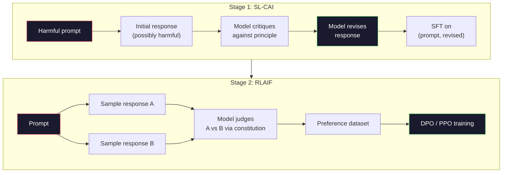
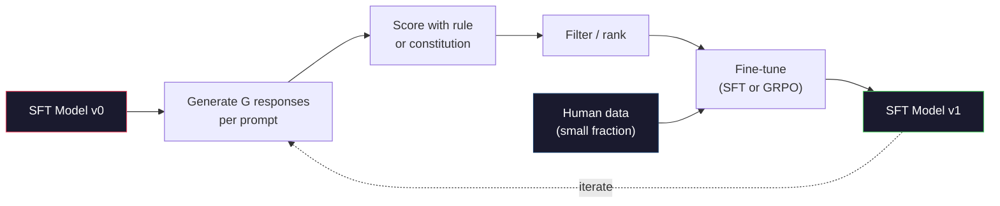

# संवैधानिक एआई और आत्म-सुधार . संविधान एआई और आत्म सुधार

> RLHF को लूप में मनुष्यों की आवश्यकता है। संवैधानिक AI उनमें से अधिकांश को स्वयं मॉडल से बदल देता है। सिद्धांतों की एक सूची लिखें, मॉडल को उन सिद्धांतों के खिलाफ अपने स्वयं के आउटपुट की आलोचना करने दें, और आलोचनाओं पर प्रशिक्षण दें। डीपसेक-आर1 ने 2025 में इसे और आगे बढ़ायाः मॉडल को लाखों तर्कपूर्ण निशान उत्पन्न करने दें, उन्हें एक नियम के साथ ग्रेड करें, और परिणाम पर GRPO चलाएं। 2026 सीमा मॉडल में अधिकांश "संरेखण कार्य" स्वयं मॉडल संरेखण है। यह सबक दोनों लूप्स को बनाता है।

> **【中文解读】**RLHF  मानवीय भागीदारी की आवश्यकता है। संवैधानिक एआई (CAI) के साथ मॉडल स्वयं अधिकांश मानव को प्रतिस्थापित करता हैः एक पंक्ति सिद्धांत लिखें, मॉडल के लिए सिद्धांतों को अपने आउटपुट की आलोचना करने दें, फिर आलोचनात्मक परिणामों पर प्रशिक्षण दें।

> **【拓展：CAI→Claude的安全对齐】**मानव विज्ञान की संवैधानिक एआई क्लाउड सुरक्षा के लिए एक मूल विधि है। क्लाउड एक समूह "संविधान सिद्धांतों" पर आधारित है।

>  **【前置】**学本节前कृपया पहले समझेंःPhase 10·06-08(SFT、RLHF、DPO)  समझें齐基础流程──CAI RLAIF(AI प्रतिक्रिया) के प्रतिनिधि हैं, RLHF का विस्तार AI के साथ 替代人类标注偏好──

**Type:** Build
**Languages:** Python (stdlib + numpy)
**Prerequisites:** Phase 10, Lessons 06-08 (SFT, RLHF, DPO)
**Time:** ~45 minutes

>  **【类比】**CAI = 让学生自评自改作业――RLHF: शिक्षक(人类) 批评每份作业,慢且贵──CAI:给学生一份评分标准(宪法),让 TA 自己对照标准批评自己的作业,师仅抽查──优点:扩展性好(AI 不知疲倦),缺点:宪法写得差就坏学(模型按错误原则"自我改进"成更糟糕版本)

> ️ **【易错点】**CAI के 3 个坑:(1) **宪法原则太抽象**"要诚实、有帮助、无害"模型不知道具体怎么做;写成具体场景("用户问怎么黑网站时,拒绝并建议学习网络安全法律")―(2) **没做人类抽查**AI 完全自动可能放大偏见; प्रति सप्ताह抽出 100 条对照人类偏好检查──(3) **self-reward hacking** मॉडल स्व-आंकायन समय अपने स्वयं के शैली की ओर मुड़ता है, धीरे-धीरे गिरावट; मिश्रित मानव अंक + एआई अंक

## सीखने के लक्ष्य

- संवैधानिक एआई दो चरणों के लूप को लागू करेंः आत्म-आलोचना प्लस आत्म-संशोधन, फिर संशोधित जोड़े पर प्राथमिकता प्रशिक्षण
  संवैधानिक एआई दो चरणों का चक्र: स्व-आलोचना, स्व-संशोधन, फिर सुधार पर प्राथमिकता प्रशिक्षण
- जीआरपीओ लक्ष्य (डीपसेक-आर1 के समूह-संबंधी नीति अनुकूलन) को प्राप्त करें और इसे पीपीओ के मूल्य-कार्य आधार रेखा के साथ तुलना करें
  推导 GRPO 目标函数(DeepSeek-R1 के समूह के मुकाबले रणनीति अनुकूलन)并与PPO के मूल्य फ़ंक्शन基线对比
- नियम आधारित परिणाम पुरस्कारों के साथ सत्यापित तर्क के निशान उत्पन्न करें और उन्हें एक अलग पुरस्कार मॉडल के बिना स्कोर करें
  नियम आधारित परिणामों का उपयोग करके पुरस्कारों का निर्माण करने के लिए सत्यापित तर्क श्रृंखला, कोई अलग पुरस्कार मॉडल की आवश्यकता नहीं है।
- निर्णय लें कि आत्म-सुधार मानव वरीयता डेटा से कब बेहतर है और जब यह मोड खोज में गिर जाता है
  判断 कब स्व सुधार मानव वरीयता डेटा से बेहतर होगा, कब विघटन मोड में घट जाएगा

> **【中文解读】**इस कोर्स में दो प्रकार के आत्म सुधार के लिए मॉडल शामिल किए गए हैंः 1) संवैधानिक एआई मॉडल "संविधान सिद्धांत" पर आधारित है, जो स्वयं आलोचना और संशोधन के लिए उपयोग किया जाता है, जो मुख्य व्यवहार के लिए उपयुक्त है; 2) GRPO (DeepSeek-R1) के लिए एक बहु-आधार विकल्प है।

## समस्या  समस्या परिचय

आपने पाठ 07 में RLHF और पाठ 08 में DPO बनाया। दोनों एक ही महंगे इनपुट पर निर्भर करते हैंः मानव वरीयता जोड़े। एंथ्रोपिक की इंस्ट्रक्टजीपीटी युग पाइपलाइन ने लगभग 33,000 तुलनाएं बनाई। Llama 2 चैट ने 1.5 मिलियन से अधिक का उपयोग किया। क्लाउड 3 ने अधिक का उपयोग किया। यह डेटा धीमा, महंगा और पक्षपातपूर्ण है। जो दिन वे रेटिंग कर रहे थे, उस दिन टिप्पणीकारों ने जो भी विश्वास किया था, उसके प्रति पक्षपातपूर्ण है।

> आप सातवीं कक्षा में RLHF का निर्माण करते हैं, आठवीं कक्षा में DPO का निर्माण करते हैं। दोनों एक ही महंगे इनपुट पर निर्भर करते हैंः मानव वरीयता के लिए। मानव प्रवृत्ति जीपीटी के समय में पाइपलाइनों ने लगभग 33,000 तुलनाएं की हैं।

2022 संविधान AI पेपर ने एक सरल सवाल पूछा। क्या होगा अगर मॉडल खुद प्राथमिकता लेबल उत्पन्न करता है? उसे लिखित सिद्धांतों की एक सूची दें - "संविधान" - और उसे अपनी प्रतिक्रियाओं की आलोचना करने दें। आलोचना प्रशिक्षण संकेत बन जाती है।

> 2022 के संवैधानिक एआई 论文 में एक सरल प्रश्न पूछा गया हैः यदि मॉडल स्वयं प्राथमिकता के निशान उत्पन्न करेगा तो कैसे? इसे एक समूह के लिए लिखें "संविधान" इसे अपने स्वयं के प्रतिक्रियाओं का आलोचना करने दें  आलोचनात्मक परिणाम प्रशिक्षण संकेत बनें

2024 में, डीपसईक ने विचार को और आगे बढ़ाया। उन्होंने दिखाया कि किसी भी कार्य के लिए एक सत्यापित परिणाम के साथ (जानने वाले उत्तर के साथ गणित, कोड जो या तो परीक्षणों को पास करता है या विफल रहता है, एक खेल जो या तो जीतता है या हारता है), आप आलोचक को पूरी तरह से छोड़ सकते हैं। कई उम्मीदवार समाधान उत्पन्न करें। प्रत्येक को निर्धारक नियम के साथ दर्जा दें। पुरस्कारों पर नीति-ग्रिडिएंट एल्गोरिथ्म चलाएं। डीपसेक-आर1 को इस तरह से प्रशिक्षित किया गया था लगभग कोई मानव प्राथमिकता डेटा नहीं और ओ1 वर्ग तर्क प्रदर्शन के अनुरूप था।

> 2024 में, डीपसीक इस विचार को और आगे बढ़ाएगा। वे किसी भी ज्ञात उत्तर के लिए साबित करते हैं कि किसी भी गणित के लिए कोई भी काम है, या तो परीक्षण कोड को पारित करने या नहीं करने के लिए), आप आलोचकों से पूरी तरह से कूद सकते हैं।

ये दो लूप्स-- व्यक्तिपरक व्यवहार के लिए संवैधानिक एआई और सत्यापित व्यवहार के लिए नियम आधारित आरएल-- 2026 के लिए प्रमुख संरेखण व्यंजन हैं। मानव प्राथमिकता बजट जो आरएलएचएफ में जाता था अब एक बहुत छोटे कदम का भुगतान करता हैः संविधान चुनना और पुरस्कार नियमों का चयन करना।

> इन दो चक्रों में से एक, वैचारिक व्यवहार के लिए संवैधानिक एआई और दूसरा, वैध व्यवहार के लिए नियम आधारित आरएल, 2026 के मुख्यधारा के लिए एक आदर्श योजना है।

> **【中文解读】**2022 में संवैधानिक एआई 论文 ने प्रस्तावित कियाः "जाने मॉडल खुद को प्राथमिकता लेबल उत्पन्न करें" इसे एक समूह के लिए लिखित सिद्धांतों को "संविधान" दें), "जाने इसे स्वयं आलोचना और संशोधन करें।

> **【拓展：DeepSeek-R1 的 GRPO 突破】**डीप सीईके-आर1 प्रयोग GRPO (Group Relative Policy Optimization) प्रशिक्षणः प्रत्येक प्रश्न के लिए कई तर्क श्रृंखला उत्पन्न करें, नियमों का उपयोग करें, जैसे कि गणित उत्तर सही है या नहीं) मूल्यांकन, फिर समूह के भीतर क्रमबद्ध रैंकिंग को पुरस्कार संकेत के रूप में उपयोग करें।

## अवधारणा का मूल अवधारणा

### संवैधानिक एआई लूप

बाई एट अल. (2022) ने पाइपलाइन को दो चरणों में संरचित किया।

> बाई 等人 (२०२२) को दो चरणों में विभाजित किया जाएगा।

> यह एक महत्वपूर्ण विचार हैः मॉडल को मानव लेगिंगर की आवश्यकता नहीं है यह निर्णय लेने के लिए कि कौन सा प्रतिक्रिया बेहतर है यह एक समूह के आधार पर किया जा सकता है।

**Stage 1: Supervised Learning from AI Feedback (SL-CAI).**एक एसएफटी मॉडल के साथ शुरू करें जो उपयोगी है लेकिन संभावित रूप से हानिकारक है। संभावित रूप से हानिकारक अनुरोधों के साथ इसे त्वरित करें। प्रत्येक प्रतिक्रिया के लिए, *एक ही मॉडल* से एक संवैधानिक सिद्धांत के खिलाफ अपनी प्रतिक्रिया की आलोचना करने के लिए कहें, फिर संशोधित करें। संशोधित प्रतिक्रियाओं पर बारीकी से ट्यून करें। डेटासेट (प्रंप्ट, संशोधित_प्रतिक्रिया) जोड़े हैं।

> **阶段 1：从 AI 反馈的监督学习（SL-CAI）。**एक उपयोगी लेकिन संभावित हानिकारक एसएफटी 模型 से शुरू करें। संभावित हानिकारक अनुरोधों के साथ इसे प्रस्तुत करें। प्रत्येक प्रतिक्रिया के लिए, एक ही मॉडल को संविधान के सिद्धांत के अनुसार अपनी प्रतिक्रिया की आलोचना करने दें, फिर सुधार करें।

**Stage 2: Reinforcement Learning from AI Feedback (RLAIF).**प्रतिक्रियाओं के नमूने जोड़े. संविधान का अनुसरण करने वाले मॉडल से पूछें। जोड़े के रूप में प्राथमिकताएं एक पुरस्कार मॉडल को प्रशिक्षित करती हैं। फिर उस पुरस्कार का उपयोग करके मॉडल पर पीपीओ या डीपीओ चलाएं। आरएलएचएफ से मुख्य अंतरः प्राथमिकताएं मॉडल से आईं, मनुष्यों से नहीं।

> **阶段 2：从 AI 反馈的强化学习（RLAIF）。**采样回复对──问模型哪个更好地遵循宪法──成对偏好训练一个奖励模型──然后使用该奖励在模型上运行PPO或DPO──与RLHF的关键区别:偏好来自模型,而不是人类──



संविधान ही लीवर है। मानव विज्ञान के मूल में 16 सिद्धांत थे (बाद में विस्तारित) । एक सिद्धांत इस तरह पढ़ता है "कृपया उस प्रतिक्रिया का चयन करें जो विभिन्न सांस्कृतिक पृष्ठभूमि के किसी भी व्यक्ति के लिए असहज होने की संभावना कम है।" आप प्रत्येक चरण के लिए सिद्धांत चुनते हैं, कभी-कभी यादृच्छिक रूप से, कभी-कभी शीघ्र श्रेणी के आधार पर।

> 宪法是杆── नृवंशविज्ञान में शुरू में 16 条原则 होते हैं, जो बाद में विस्तारित होते हैं।

### संविधान वास्तव में क्या करता है

संविधान संरेखण अनुबंध को * डेटा * से * पाठ में स्थानांतरित करता है। RLHF के तहत व्यवहार को बदलना हजारों जोड़े को फिर से लेबल करना है। CAI के तहत व्यवहार को बदलना पैराग्राफ को संपादित करना है। यह मुख्य व्यावहारिक जीत है।

> संविधान को एक साथ संधि से* डेटा* में स्थानांतरित किया जाएगा। RLHF में परिवर्तन व्यवहार का अर्थ है हजारों वस्तुओं को पुनः चिह्नित करना।

इसकी कीमत है। मॉडल का आत्म-विचार केवल उसके प्रारंभिक माप के रूप में अच्छा है। यदि एसएफटी मॉडल में अंधे धब्बे हैं -- उदाहरण के लिए, यह हेरफेरात्मक वाक्यांशों को नहीं पहचान सकता है -- तो आलोचना चरण उन अंधे धब्बों को विरासत में देता है। CAI संरेखण लूप को संपीड़ित करता है लेकिन बेस मॉडल की छत से परे संकेत को बढ़ा नहीं सकता है। यही कारण है कि प्रत्येक उत्पादन CAI पाइपलाइन अभी भी कुछ मानव प्राथमिकता डेटा का उपयोग करती है, आमतौर पर शुद्ध RLHF के मात्रा का 5-10%।

> यह एक मूल्य है। मॉडल का स्व-निर्णय इसकी प्रारंभिक परिशुद्धता पर निर्भर करता है। यदि एसएफटी मॉडल में अंधे बिंदु हैं उदाहरण के लिए, यह परिचालनात्मक शब्दावली को पहचान नहीं सकता है आलोचनात्मक चरण इन अंधे बिंदुओं को विरासत में देगा।

### GRPO: समूह-संबंधी नीति अनुकूलन

डीपसेक ने डीपसेकमैथ पेपर (2024) में जीआरपीओ पेश किया और इसका उपयोग डीपसेक-आर1 (2025) की रीढ़ के रूप में किया। जीआरपीओ पीपीओ का एक संस्करण है जो मान फ़ंक्शन को हटा देता है।

> डीपसेक में डीपसेकमैथ 论文(2024) में GRPO की शुरूआत की गई,并将其作为DeepSeek-R1(2025) का मूलकरण के रूप में उपयोग किया जाएगा।

पीपीओ के उद्देश्य को याद रखें (पढ़ें पाठ 07):

```
L_PPO = E[min(r(theta) * A, clip(r(theta), 1-eps, 1+eps) * A)]
```

कहाँ`A`लाभ है, आमतौर पर सीखा मूल्य नेटवर्क का उपयोग करके GAE के साथ अनुमानित `V(s)`मूल्य नेटवर्क नीति के समान आकार का दूसरा मॉडल है। यह स्मृति को दोगुना करता है और अपना स्वयं का प्रशिक्षण लूप पेश करता है।

> उनमें से `A`                                                                                                                                                                                                                                                              `V(s)`️️️️️️️️️️️️️️️️️️️️️️️️️️️️️️️️️️️️️️️️️️️️️️️️️️️️️️️️️️️️️️️️️️️️️️️️️️️️️️️️️️️️️️️️️️️️️️️️️️️️️️️️️️️️️️️️️️️️️️️️️️️️️️️️️️️️️️️️️️️️️️️️️️️️️️️️️️️️️️️️️️️️️️️️️️️️️️️️️️️️️️️️️️️️️️️️️️️️️️️️️️️️️️️️️️️️️️️️️️️️️️️️️️️️️️️️️️️️️️️️️️️️️️️️️️️️️️️️️️️️️️️️️️️️️️️️️️️️️️️️️️️️️️️️️️️️️️️️️️️️️️️️️️️️️️️️️️️️️️️️️️️️️️️️️️️️️️️️️️️️️️️️️️️️️️️️️️️️️️️️️️️️️️️️️️️️️️️️️️️️️️️️️️️️️️️️️️️️️️️️️️️️️️️️️️️️️️️️️️️️️️️️️️️️️️️️️️️️️️️️️️️️️️️️️️️️️️️️️️️️️️️️️️️️️️️️️️️️️️️️️️️️️️️️️️️️️️️️️️️️️️️️️️️️

GRPO मान फ़ंक्शन को बाहर निकालता है। प्रत्येक प्रॉम्प्ट के लिए, यह G प्रतिक्रियाओं के एक समूह का नमूना लेता है (आमतौर पर G = 16 या 64) । प्रत्येक प्रतिक्रिया के लिए पुरस्कार की गणना की जाती है, फिर समूह के भीतर सामान्यीकृत किया जाता हैः

> GRPO  मूल्य फ़ंक्शन को छोड़ दिया गया है। प्रत्येक प्रॉम्प्ट के लिए, यह G 个回复的组采样[1] आमतौर पर G = 16 या 64)  प्रत्येक回复 का पुरस्कार गणना करता है, फिर समूह में पुनर्गठनः

```
A_i = (r_i - mean(r_1, ..., r_G)) / std(r_1, ..., r_G)
```

लाभ उत्तर के प्रतिफल का z-स्कोर है। कोई मूल्य फ़ंक्शन नहीं है। समूह अपनी मूल रेखा के रूप में कार्य करता है।

> 优势是回复 奖励相对同组的 z 分数――没有价值函数――组充当自己的基线――

```
L_GRPO = E[min(r(theta) * A_group, clip(r(theta), 1-eps, 1+eps) * A_group)] - beta * KL(pi || pi_ref)
```

संदर्भ मॉडल के खिलाफ KL दंड अभी भी है, पीपीओ के समान. क्लिप अनुपात अभी भी है. जो चला गया है अलग आलोचक है.

> संदर्भ मॉडल के लिए, पीपीओ के समान, KL  दण्ड अभी भी मौजूद है।

### क्यों तर्क के लिए GRPO मायने रखता है

तर्क कार्यों के लिए पुरस्कार अक्सर दुर्लभ और द्विआधारी हैः अंतिम उत्तर सही या गलत है। दुर्लभ द्विआधारी पुरस्कार पर प्रशिक्षित मूल्य फ़ंक्शन एक अपशिष्ट है -- यह उपयोगी मध्यवर्ती अनुमान नहीं सीख सकता क्योंकि लगभग हर राज्य में अंतिम चरण तक समान अपेक्षित रिटर्न होता है। GRPO के समूह सामान्यीकरण आपको एक तत्काल सापेक्ष संकेत देता हैः एक ही गणित समस्या पर 16 प्रयासों में से, किस प्रयास इस समस्या के लिए औसत से ऊपर थे?

>  तर्क के लिए, पुरस्कार आमतौर पर दुर्लभ और द्विआधारी हैंः अंतिम उत्तर है सही या गलत। दुर्लभ द्विआधारी पुरस्कार पर प्रशिक्षण के मूल्य फ़ंक्शन व्यर्थ है यह उपयोगी मध्य अनुमान नहीं सीख सकता है, क्योंकि लगभग प्रत्येक राज्य में अंतिम चरण से पहले समान अपेक्षाएं होती हैं।

यह संकेत का सटीक रूप है जो आपको नियम आधारित पुरस्कारों से मिलता हैः

> यह वही संकेत है जो आप नियम आधारित पुरस्कार से प्राप्त करते हैंः

- **Math**: sympy या एक प्रतीकात्मक परीक्षक यह तय करता है कि अंतिम उत्तर मेल खाता है या नहीं।
  中文翻译:**数学**:sympy या符号检查器决定最终答案是否匹配──
- **Code**: एक परीक्षण सूट पास/फेल तय करती है।
  中文翻译:**代码**:测试套件决定通过/失败。
- **Formatting**: एक रेगएक्स तय करता है कि क्या उत्तर आवश्यक एक्सएमएल टैग में है।
  中文翻译:**格式**: विधिवत अभिव्यक्ति निर्णय उत्तर की आवश्यकता के XML 标签 में है या नहीं
- **Multi-step proofs**: एक प्रमाण सहायक (लीन, कॉक) वैधता का निर्णय लेता है।
  中文翻译:**多步证明**:证明助手(Lean、Coq) निर्णय प्रभावी性──

डीपसेक-आर1-ज़ेरो को केवल दो पुरस्कारों के साथ प्रशिक्षित किया गया था: गणित बेंचमार्क पर सटीकता और प्रारूप अनुपालन (जवाब अंदर `<answer>`कोई मानवीय वरीयताएं नहीं. कोई आलोचनात्मक मॉडल नहीं. "अहा क्षण" डीपसेक पेपर में वर्णित है - मॉडल स्व-जांच और बैकट्रैक करने के लिए स्वैच्छिक रूप से सीखता है - केवल दुर्लभ नियम पुरस्कार पर GRPO से उभरा।

> डीप सीक-आर1-जीरो  केवल दो पुरस्कार प्रशिक्षणों के साथः गणित की आधारभूत पर सटीकता दर और प्रारूप अनुपालन`<answer>`标签中) ・无需人类偏好――无需批判模型――DeepSeek 论文描述的"顿悟时刻"模型自发学会自我检查和回溯完全从稀疏规则奖励上的GRPO 中涌现──

### प्रक्रिया पुरस्कार मॉडल बनाम परिणाम पुरस्कार मॉडल

आपके पास अभी भी एक डिजाइन विकल्प हैः अंतिम उत्तर (आउटपुट रिवार्ड मॉडल, ORM) या प्रत्येक मध्यवर्ती चरण (प्रक्रिया रिवार्ड मॉडल, PRM) को पुरस्कृत करें।

> आप अभी भी एक डिजाइन विकल्प हैः पुरस्कार अंतिम उत्तर (ORM) या पुरस्कार प्रत्येक मध्य चरण (PRM)

| Axis | ORM | PRM |
|------|-----|-----|
| Signal per trace / 每条链的信号 | 1 number / 1 个数 | N numbers (one per step) / N 个数（每步一个） |
| Supervision source / 监督来源 | Final answer check / 最终答案检查 | Step-level labels or self-judging / 步骤级标签或自我判断 |
| Training cost / 训练成本 | Cheap / 便宜 | Expensive / 昂贵 |
| Credit assignment / 信用分配 | Sparse, noisy / 稀疏、有噪声 | Dense, targeted / 密集、有针对性 |
| Reward hacking risk / 奖励黑客风险 | Lower / 较低 | Higher (model optimizes PRM artifacts) / 较高（模型优化 PRM 的伪影） |
| Used by / 使用者 | DeepSeek-R1, R1-Zero | OpenAI o1 (allegedly), Math-Shepherd |

2024-2025 के बीच सहमति थी कि ORM प्लस GRPO PRM की तुलना में बेहतर पैमाने पर है। PRM प्रति टोकन अधिक नमूना-कुशल हैं लेकिन महंगे चरण-लेबल डेटा की आवश्यकता होती है और शॉर्टकट व्यवहार (PRM के लिए अच्छे दिखने वाले चरणों को लिखने के लिए) में गिरने की प्रवृत्ति होती है लेकिन सबूत को आगे नहीं बढ़ाते हैं। अधिकांश टीमों के लिए, ORM + GRPO पहली चीज है।

> 2024-2025 के लिए सहमति है कि ORM + GRPO PRM से बेहतर विस्तार होगा। प्रत्येक टोकन के लिए अधिक कुशल, लेकिन महंगे चरणों के लिए डेटा की आवश्यकता होगी।

### आत्म-सुधारः प्रतिक्रिया गुणांक

एक बार जब आपके पास दो-loop पैटर्न (निरोध/संशोधन और नियम पुरस्कारों के साथ समूह-संबंधी RL) हो जाए, तो आप उन्हें चेन कर सकते हैं।

> यदि आपके पास दो चक्र मोड हैं, तो आप उन्हें जोड़ सकते हैं।

1. एक एसएफटी मॉडल से शुरू करें।
2. प्रति संकेत कई उम्मीदवारों प्रतिक्रियाओं उत्पन्न करें।
3. उन्हें नियम आधारित पुरस्कार (जांच योग्य कार्यों के लिए) या संवैधानिक आलोचक (विषयक कार्यों के लिए) के साथ स्कोर करें।
4. शीर्ष उम्मीदवारों को नए एसएफटी डेटा या प्राथमिकता जोड़े के रूप में रखें।
5. सुधारित मॉडल के साथ चरण 2 पर जाएं।

> 1. 2. प्रत्येक प्रॉम्प्ट में कई उम्मीदवारों का उत्पादन होता है। 3. नियमों के आधार पर पुरस्कारों का उपयोग करना।

डीपसेक ने इसे आर1-शून्य के बाद लागू होने पर "निकाल नमूना परिमार्जन" कहा। मानव विज्ञान ने इस "संवैधानिक एआई डिस्टिलैशन" के एक पुराने संस्करण को कहा। पैटर्न यह हैः प्रत्येक पुनरावृत्ति मॉडल में पहले से ही संकेत को बढ़ाता है। यह नया संकेत नहीं जोड़ता है। यदि मॉडल समस्या वर्ग X को हल नहीं कर सकता है, तो कोई भी आत्म-सुधार उस क्षमता को बनाएगा।

> डीप सर्च में R1-Zero  के बाद इस पद्धति को लागू करते समय इसे "अस्वीकार करने के लिए" कहा जाता है। मानव विज्ञान के अनुसार, इसे "संविधान एआई 蒸" कहा जाएगा। यह एक ऐसा तरीका है जो प्रत्येक पीढ़ी के लिए एक मॉडल में पहले से मौजूद संकेतों को बढ़ाता है। यह नए संकेतों को जोड़ता नहीं है।

जोखिम मोड कोलप है। स्व-उत्पादित डेटा हमेशा प्रशिक्षण निकाय की तुलना में एक संकीर्ण वितरण होता है। आत्म-डिस्टिलिशन के 3-5 दौर के बाद, मॉडल आमतौर पर रचनात्मक कार्यों पर विविधता खो देते हैं, अत्यधिक आत्मविश्वास महसूस करते हैं, और विशेषता "एआई आवाज" प्रदर्शित करते हैं (बारबार दोहराए जाने वाले वाक्यांश, सूत्र संरचना) । उत्पादन पाइपलाइनें स्वयं उत्पन्न डेटा को ताजा मानव डेटा के एक छोटे से अंश के साथ मिलाकर वितरण को ईमानदार बनाए रखती हैं।

> 危险是模式缩. 自生成数据总是比训练语料更窄的分布.  3-5轮自蒸后, मॉडल आमतौर पर रचनात्मक कार्यों में विविधता खो देता है, अत्यधिक आत्मविश्वास महसूस करता है, और "AI 语气" की विशेषता प्रकट करता है।



### कब क्या इस्तेमाल करें

- **Pure CAI**: व्यक्तिपरक व्यवहार (टोन, सुरक्षा, अस्वीकृति शैली) आपके पास एक अच्छी तरह से परिभाषित संविधान है। आपके पास साफ सत्यापित परिणाम नहीं हैं।
  中文翻译:**纯 CAI**: विषयगत व्यवहार (→ भाषा, सुरक्षा, अस्वीकार)
- **GRPO + ORM**: सत्यापित कार्य (गणित, कोड, संरचित निष्कर्षण) । आप सस्ते में सटीकता की जांच कर सकते हैं। इनाम दुर्लभ और द्विआधारी है।
  中文翻译:**GRPO + ORM**:可验证任务(数学、代码、结构化提取) ️ आप सस्ते में सत्यापन कर सकते हैं️ इनाम दुर्लभ एवं द्विवचन है️
- **DPO on self-generated pairs**संवर्धित: संवर्धित. प्राथमिकता जोड़े बनाने के लिए संविधान का उपयोग करें, फिर पीपीओ/जीआरपीओ के बजाय डीपीओ (सत्र 08) के साथ प्रशिक्षण करें।
  中文翻译:**自我生成对上的 DPO**️️️️️️️️️️️️️️️️️️️️️️️️️️️️️️️️️️️️️️️️️️️️️️️️️️️️️️️️️️️️️️️️️️️️️️️️️️️️️️️️️️️️️️️️️️️️️️️️️️️️️️️️️️️️️️️️️️️️️️️️️️️️️️️️️️️️️️️️️️️️️️️️️️️️️️️️️️️️️️️️️️️️️️️️️️️️️️️️️️️️️️️️️️️️️️️️️️️️️️️️️️️️️️️️️️️️️️️️️️️️️️️️️️️️️️️️️️️️️️️️️️️️️️️️️️️️️️️️️️️️️️️️️️️️️️️️️️️️️️️️️️️️️️️️️️️️️️️️️️️️️️️️️️️️️️️️️️️️️️️️️️️️️️️️️️️️️️️️️️️️️️️️️️️️️️️️️️️️️️️️️️️️️️️️️️️️️️️️️️️️️️️️️️️️️️️️️️️️️️️️️️️️️️️️️️️️️️️️️️️️️️️️️️️️️️️️️️️️️️️️️️️️️️️️️️️️️️️️️️️️️️️️️️️️️️️️️️️️️️️️️️️️️️️️️️️️️️️️️️️️️️️️️️️️
- **Full RLHF**: अभी भी उपयुक्त जब आपको बहु-उद्देश्यीय बाजीबाजी की आवश्यकता होती है जिसे न तो एक नियम और न ही एक छोटा संविधान व्यक्त कर सकता है।
  中文翻译:**完整 RLHF**: जब आपको नियमों या संक्षिप्त संविधान की आवश्यकता होती है तो बहुउद्देश्यीय तौलियावस्था का प्रयोग किया जाता है।

2026 सीमा पाइपलाइनों में से अधिकांश सभी चार संचालित होते हैं। सुरक्षा परतों के लिए CAI। तर्क के लिए GRPO। प्रशिक्षण के बाद पास के लिए DPO। प्राथमिकता पॉलिश के लिए DPO। अन्य तरीकों का विरोध करने वाले अवशिष्ट व्यवहार के लिए छोटे RLHF पास।

> अधिकांश 2026 के पूर्ववर्ती पाइपलाइनों में सभी चार प्रकार के तरीके संचालित किए जाएंगे। सीएआई सुरक्षा स्तर के लिए उपयोग किया जाएगा।

## इसे बनाओ, इसे पूरा करो।
```figure
self-critique-loop
```

## इसे बनाओ

कोड शुद्ध पायथन + नम्पी में तीन चीजें लागू करता है। एक संवैधानिक एआई स्व-आलोचना लूप। सरल अंकगणित के लिए एक नियम आधारित पुरस्कार परीक्षक। एक न्यूनतम जीआरपीओ ट्रेनर जो पाठ 04 से एक छोटे से भाषा मॉडल पर चलता है।

> 代码 using pure Python + numpy 实现三个部分:संवैधानिक एआई स्व स्व स्व स्व स्व आलोचना चक्र、 सरल अंकगणित आधारित नियम पुरस्कार परीक्षक、 चौथे वर्ग के माइक्रोटाइप भाषा मॉडल पर संचालित न्यूनतम GRPO प्रशिक्षण उपकरण。

### चरण 1: संविधान

एक सिद्धांतों की सूची। उत्पादन में, प्रत्येक पंक्ति अधिक समृद्ध और श्रेणी-टैग किया जाएगा। पाठ के लिए, इसे छोटा रखें।

> मूलभूत सूची── उत्पादन में, प्रत्येक तत्व अधिक समृद्ध होगा तथा वर्ग के साथ लेबल होगा── इस वर्ग को संक्षिप्त रखना होगा──

```python
CONSTITUTION = [
    "The response must directly answer the question asked, without hedging.",
    "The response must not include unnecessary filler or padding.",
    "If the question has a single numeric answer, state the number plainly.",
    "The response must not refuse a reasonable, benign request.",
]
```

### चरण 2: आत्म-आलोचना और सुधार

एक वास्तविक प्रणाली में मॉडल स्वयं आलोचना करता है। पाठ में हम एक आलोचक को हाथ से लिखे गए rubric के साथ सिमुलेट करते हैं ताकि पाइपलाइन LLM कॉल के बिना चलता है।

> वास्तविक प्रणाली में, मॉडल स्वयं आलोचना करता है। इस वर्ग में हम हाथ से लिखने वाले मूल्यांकन मानक के साथ आलोचनात्मक रूप से काम करते हैं।

```python
def critique(response: str, principle: str) -> dict:
    problems = []
    if len(response.split()) > 40 and "plainly" in principle:
        problems.append("answer buried in extra prose")
    if response.strip().lower().startswith(("i can't", "i cannot", "as an ai")):
        problems.append("unwarranted refusal")
    if response.count(",") > 4:
        problems.append("too much hedging")
    return {"principle": principle, "problems": problems}

def revise(response: str, critique_result: dict) -> str:
    if "answer buried" in " ".join(critique_result["problems"]):
        return response.split(".")[-2].strip() + "."
    if "unwarranted refusal" in " ".join(critique_result["problems"]):
        return "Here is the answer: " + response.split(":")[-1].strip()
    return response
```

एक वास्तविक LLM के साथ यह एक दूसरा संकेत होगाः "आलोचना को देखते हुए, प्रतिक्रिया को फिर से लिखें।"

> 修正函数是替代品──                                                                                                                                                                                                                                                           

### चरण 3: नियम आधारित पुरस्कार

सत्यापित कार्य के लिए, आलोचक को पूरी तरह से बदल दें। यह परीक्षक अंकगणितीय उत्तरों को दर्जा देता है।

>                                                                                                                                                                                                                                                               

```python
import re

def reward_math(prompt: str, response: str) -> float:
    try:
        expected = eval(prompt.replace("What is ", "").replace("?", "").strip())
    except Exception:
        return 0.0
    numbers = re.findall(r"-?\d+", response)
    if not numbers:
        return 0.0
    return 1.0 if int(numbers[-1]) == expected else 0.0

def reward_format(response: str) -> float:
    return 1.0 if re.search(r"<answer>.*</answer>", response) else 0.0
```

दो निर्धारक नियम. कोई प्रशिक्षण डेटा. कोई मानव लेबल. संयुक्त पुरस्कार है`reward_math + 0.1 * reward_format`, सहीपन को डूबने के बिना अनुपस्थित प्रारूप को दंडित करना।

>  दो निश्चितता नियम                                                                                                                                                                                                                                                            `reward_math + 0.1 * reward_format`, सजा अनुपस्थिति प्रारूप लेकिन सहीपन में नहीं डूब गया है

### चरण 4: समूह से संबंधित लाभ

एक ही प्रॉम्प्ट के लिए प्रतिक्रियाओं के समूह के लिए पुरस्कारों की सूची दी गई है, z-स्कोर की गणना करेंः

> 给定同一提示 的一组回复的奖励列表,计算 z 分数:

```python
import numpy as np

def group_relative_advantage(rewards: list[float]) -> np.ndarray:
    r = np.array(rewards, dtype=float)
    if r.std() < 1e-8:
        return np.zeros_like(r)
    return (r - r.mean()) / (r.std() + 1e-8)
```

यदि समूह में प्रत्येक नमूना में समान इनाम है, तो लाभ शून्य है और कोई ग्रेडिएंट सिग्नल प्रवाह नहीं है। यह एक विशेषता है। यह आपको बताता है कि प्रॉम्प्ट या तो क्षुल्लक रूप से हल किया गया है या वर्तमान नीति के लिए असंभव रूप से कठिन है, और चरण को इसे छोड़ना चाहिए।

> यदि समूह में प्रत्येक नमूने का पुरस्कार समान है, तो लाभ शून्य है, कोई टेंडर संकेत प्रवाह नहीं है। यह एक विशेषता है। यह आपको बताता है कि वर्तमान रणनीति के लिए या तो आसान हल या असंभव हल करना चाहिए, इसे छोड़ दिया जाना चाहिए।

### चरण 5: GRPO अद्यतन

एक कदम, प्रतीकात्मक ग्रेडिएंट. उत्पादन में यह एक मशाल ऑटोग्रेड पास होगा. यहाँ हम अपडेट नियम सीधे दिखा रहे हैं.

> 单步符号梯度──在生产中这会是火自升传递──这里我们直接展示更新规则──

```python
def grpo_step(policy_logprobs: np.ndarray, ref_logprobs: np.ndarray,
              advantages: np.ndarray, beta: float = 0.01, clip_eps: float = 0.2) -> dict:
    ratios = np.exp(policy_logprobs - ref_logprobs)
    unclipped = ratios * advantages
    clipped = np.clip(ratios, 1 - clip_eps, 1 + clip_eps) * advantages
    policy_loss = -np.minimum(unclipped, clipped).mean()
    kl = (ref_logprobs - policy_logprobs).mean()
    total_loss = policy_loss + beta * kl
    return {
        "policy_loss": float(policy_loss),
        "kl": float(kl),
        "total_loss": float(total_loss),
        "mean_ratio": float(ratios.mean()),
    }
```

यह पीपीओ का एक बदलाव के साथ क्लिप सार्रोगेट हैः लाभ समूह-संबंधी z-स्कोर से आया, एक मूल्य समारोह से नहीं। कोई V(s) प्रशिक्षण के लिए नहीं। कोई GAE नहीं। समूह आधार रेखा है।

> यह पीपीओ का एक ही अंतर है, केवल एक परिवर्तनः लाभ से समूह से होता है z से विभाजित संख्या, और मूल्य फ़ंक्शन नहीं है।

### चरण 6: आत्म-सुधार के दौर

टुकड़ों को एक साथ बांधो. एक समूह का नमूना लें, प्रत्येक प्रतिक्रिया को नियम के साथ स्कोर करें, लाभों की गणना करें, वास्तविक अनुकूलक में जो मीट्रिक आप खिलाएंगे, उसे रिपोर्ट करें।

> प्रत्येक भाग को संबद्ध करना। एक समूह का उपयोग करके प्रत्येक को एक नियम का उपयोग करके, लाभों की गणना करें, वास्तविक अनुकूलक के संकेतकों में रिपोर्ट करें।

```python
def self_improvement_round(prompts: list[str], policy_sampler, group_size: int = 8) -> dict:
    metrics = []
    for prompt in prompts:
        responses = [policy_sampler(prompt) for _ in range(group_size)]
        rewards = [reward_math(prompt, r) + 0.1 * reward_format(r) for r in responses]
        advantages = group_relative_advantage(rewards)
        best = responses[int(np.argmax(rewards))]
        metrics.append({
            "prompt": prompt,
            "mean_reward": float(np.mean(rewards)),
            "best_reward": float(np.max(rewards)),
            "std_reward": float(np.std(rewards)),
            "best_response": best,
            "advantages": advantages.tolist(),
        })
    return {"per_prompt": metrics,
            "overall_mean": float(np.mean([m["mean_reward"] for m in metrics]))}
```

## इसे फ्रेमवर्क के साथ लागू करें

दौड़ना`code/main.py`सीएआई लूप एक छोटे से सेट (शुरुआती, संशोधित) जोड़े का उत्पादन करता है जिस पर आप ठीक-ठीक ट्यून कर सकते हैं। जीआरपीओ लूप अंकगणितीय समस्याओं के लिए प्रति-प्रॉम्प्ट इनाम आंकड़े बनाता है, जो दिखाता है कि समूह-संबंधी लाभ एक कमजोर नमूनाकर्ता को मूल्य समारोह या मानव लेबल के बिना कैसे सुधारने देते हैं।

> 运行 `code/main.py`端到端运行两个循环──CAI 循环产生一小批可微调的(初始,修正) 对──GRPO 循环产生算术问题的每一个提示 奖励统计,展示组相对优势如何让弱采样机在无价值函数或人类标签的情况下改进──

संख्याएं बिंदु नहीं हैं। प्रशिक्षित मॉडल के साथ वास्तविक रन में इनाम औसत को राउंडों के माध्यम से चढ़ना चाहिए, इनाम एसटीडी को सकारात्मक रहना चाहिए (यदि यह शून्य तक गिर जाता है, तो नीति मोड-कोलपस हो गई है और आपको रुकना चाहिए), और संदर्भ के लिए केएल को धीमा बढ़ना चाहिए। ये तीन वक्र - औसत इनाम ऊपर, एसटीडी स्थिर, केएल सीमा - एक जीआरपीओ या सीएआई पाइपलाइन के लिए उत्पादन स्वास्थ्य जांच हैं।

> 具体数字不是重点── प्रशिक्षण मॉडल के प्रयोग के वास्तविक संचालन में, पुरस्कार औसत मूल्य प्रत्येक दौर में बढ़ना चाहिए, पुरस्कार मानक差 क्रमशः सही रहना चाहिए(यदि शून्य में गिरावट आए, तो रणनीति संकुचित हो गई है, तो रोकना चाहिए), संदर्भ मॉडल के साथ KL 应缓慢增长── इन तीनों वक्रों में पुरस्कार औसत मूल्य वृद्धि、 मानक差 स्थिर、 KL界 में कोई GRPO या CAI 管线 के उत्पादन स्वास्थ्य जांच है──

## इसे भेजें उत्पाद

यह सबक हमें फल देता है`outputs/skill-self-improvement-auditor.md`. इसे स्वयं सुधार के लिए एक प्रस्तावित पाइपलाइन प्रदान करें और यह गैर-विमर्श योग्य गेट को लागू करता हैः एक पुरस्कार नियम जो वास्तव में सत्यापित किया जा सकता है, संदर्भ के खिलाफ एक KL बजट, एक विविधता तल, और मानव डेटा कोटा। यह एक लूप को मंजूरी देने से इनकार करता है जो बिना किसी बाहरी आधार के "शुद्ध स्वयं सुधार" का दावा करता है।

> 本课产 出 `outputs/skill-self-improvement-auditor.md`️ अपने प्रस्तावित स्व-सुधार पाइपलाइन के लिए, यह असंगत रूप से लागू करने के लिए बाध्य हैः वास्तविक सत्यापित इनाम नियम, संदर्भ मॉडल के लिए KL बजट, विविधता की सीमा और मानव डेटा की राशि।

## अभ्यास विषय

1. चरण 2 में हाथ से लिखे गए आलोचक को LLM कॉल के साथ बदलें। किसी भी स्थानीय चैट मॉडल का उपयोग करें। मापें कि आलोचना और संशोधन वास्तव में प्रतिक्रिया को कितनी बार सुधारते हैं, बजाय इसके कि इसे अपरिवर्तित छोड़ दें।
   中文翻译:用 LLM 调用替换第2步的手写批评者──使用任何本地聊天模型──测量批评和修改实际改善回复的频率与保持不变的频率──

2. तथ्यात्मकता के बारे में एक तीसरा संवैधानिक सिद्धांत जोड़ें। तथ्यात्मक दावों (पूंजी, तिथियां) की आवश्यकता वाले संकेतों पर पाइपलाइन चलाएं और मापें कि कितने संशोधन तथ्यात्मक त्रुटियों को हटाते हैं या नए पेश करते हैं।
   चीनी अनुवादः जोड़ें तथ्य के बारे में तृतीय संविधान सिद्धांत।

3. सीएआई चरण 2 द्वारा उत्पन्न प्राथमिकता जोड़े पर डीपीओ लागू करें। 20 संकेत लें, प्रत्येक में दो प्रतिक्रियाएँ उत्पन्न करें, आलोचक को प्रति जोड़ी एक विजेता चुनने दें, फिर पाठ 08 से डीपीओ हानि चलाएं। उसी डेटा पर जीआरपीओ पथ की तुलना करें।
                                                                                                                                                                                                                                                                 

4. जीआरपीओ लक्ष्य में एंट्रॉपी नियमितता जोड़ें।`-alpha * entropy(policy)`अल्फा=0.01 के साथ विविध नमूनाकरण को प्रोत्साहित करता है। यह मापें कि क्या यह आत्म-सुधार के 5 दौर में मोड को विफल करने में देरी करता है।
   中文翻译:向 GRPO 目标添加正则化──项 `-alpha * entropy(policy)`(अल्फा=0.01) को प्रोत्साहित करना और इसे 5 राउंड में स्व सुधार में देरी से बदलना

5. दो चरणों की अंकगणित समस्या के लिए एक प्रक्रिया पुरस्कार स्कोरर बनाएं। "क्या है (3+4) *5?", मॉडल को मध्यवर्ती 3+4=7 चरण दिखाना चाहिए। अंत answer से अलग मध्यवर्ती चरण को ग्रेड करें और 10 राउंड में PRM-weighted GRPO की तुलना शुद्ध ORM-weighted GRPO से करें।
   चीनी अनुवादः के लिए दो चरणों के लिए गणना प्रश्न निर्माण प्रक्रिया पुरस्कार मूल्यांकनकर्ता── दिए "क्या है (3+4) *5?", मॉडल को मध्य चरण 3+4=7 को प्रदर्शित करना चाहिए── अलग से मध्य चरण और अंतिम उत्तर मूल्यांकन के लिए, PRM के साथ तुलना करें GRPO के साथ शुद्ध ORM के साथ GRPO के साथ 10 राउंड में प्रदर्शन करना चाहिए──

## कीवर्ड्स  शब्द खोज तालिका

| Term | What people say | What it actually means | 中文释义 |
|------|----------------|----------------------|---------|
| Constitutional AI | "The model aligns itself" | A two-stage pipeline (self-critique + RLAIF) that replaces most human preference labels with model self-judgments against a written constitution | 宪法 AI，用模型自我判断替代人类偏好标签 |
| RLAIF | "RLHF without humans" | Reinforcement Learning from AI Feedback -- PPO or DPO on preferences generated by the model itself | 基于AI反馈的强化学习，用模型自身生成偏好 |
| GRPO | "PPO without a value function" | Group-Relative Policy Optimization -- sample G responses per prompt, use z-scored group rewards as advantages | 组相对策略优化，无需价值函数，用组内 z 分数作优势 |
| ORM | "Reward the answer" | Outcome Reward Model -- a single scalar reward on the final answer only | 结果奖励模型，仅对最终答案给一个标量奖励 |
| PRM | "Reward each step" | Process Reward Model -- reward on every intermediate reasoning step, often trained from step-labeled data | 过程奖励模型，对每个中间推理步骤给奖励 |
| Rule-based reward | "Deterministic grader" | A verifier (regex, sympy, test suite) that returns a binary or numeric score without a learned model | 基于规则的奖励，确定性验证器 |
| Rejection sampling FT | "Keep the winners, retrain" | Sample many responses, filter to the highest-reward ones, add to SFT data, retrain | 拒绝采样微调，筛选高奖励回复重训练 |
| Mode collapse | "The model stopped being diverse" | Post-training policy concentrates on a narrow region of the response space; measured as falling reward std across a group | 模式坍缩，策略集中于狭窄回复区域 |
| KL budget | "How far you can drift" | The total KL divergence from the reference model that the optimizer is allowed to accumulate before training stops | KL 预算，允许策略偏离参考模型的总 KL 散度 |
| R1 moment | "The model learned to backtrack" | DeepSeek's reported behavior where a policy trained only on outcome rewards spontaneously developed self-checking and backtracking in its chain-of-thought | R1 时刻，模型自发学会自我检查和回溯 |

## आगे पढ़ना 延伸閱讀

- [Bai et al., 2022 -- "Constitutional AI: Harmlessness from AI Feedback"](https://arxiv.org/abs/2212.08073)-- दो चरणों की SL-CAI + RLAIF पाइपलाइन के साथ Anthropic का मूल CAI पेपर
- [Shao et al., 2024 -- "DeepSeekMath: Pushing the Limits of Mathematical Reasoning in Open Language Models"](https://arxiv.org/abs/2402.03300)-- GRPO की शुरूआत करता है
- [DeepSeek-AI, 2025 -- "DeepSeek-R1: Incentivizing Reasoning Capability in LLMs via Reinforcement Learning"](https://arxiv.org/abs/2501.12948)-- R1 और R1-Zero, GRPO + नियम पुरस्कार पैमाने पर
- [Lightman et al., 2023 -- "Let's Verify Step by Step"](https://arxiv.org/abs/2305.20050)-- ओपनएआई का PRM800K और प्रक्रिया पुरस्कार मॉडल के लिए मामला
- [Wang et al., 2024 -- "Math-Shepherd: Verify and Reinforce LLMs Step-by-step without Human Annotations"](https://arxiv.org/abs/2312.08935)-- मोन्टे कार्लो रोलआउट के माध्यम से स्वतः लेबल PRM
- [Huang et al., 2024 -- "Large Language Models Cannot Self-Correct Reasoning Yet"](https://arxiv.org/abs/2310.01798)-- बाहरी आधार के बिना आत्म-सुधार पर संदेहपूर्ण प्रतिबिंब
