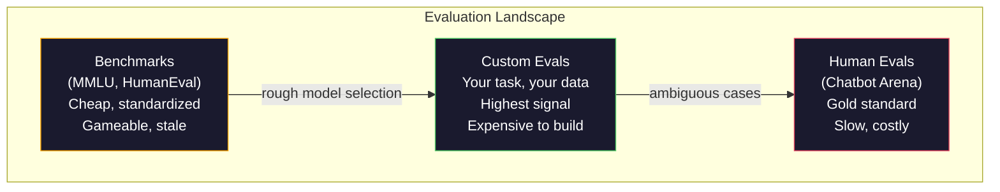
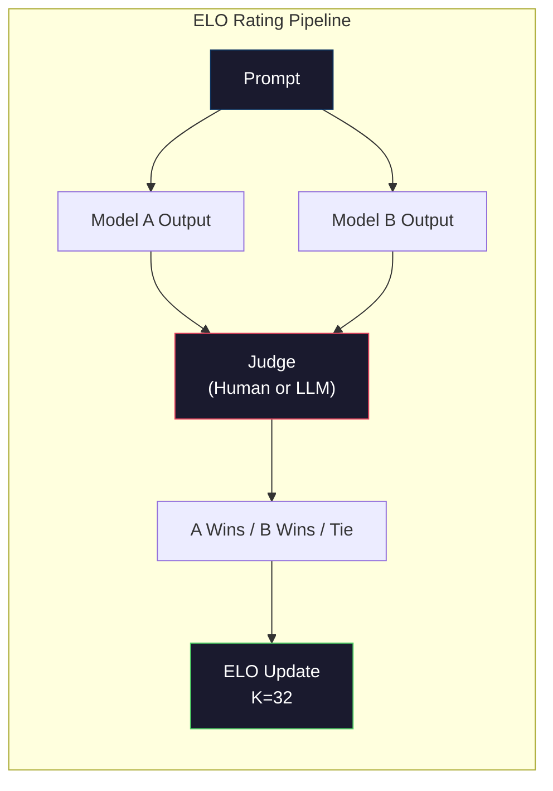

# मूल्यांकनः बेंचमार्क, Evals, LM Harness  मूल्यांकन:基准、评测、LM Harness

> गुडहार्ट का नियम: जब कोई उपाय लक्ष्य बन जाता है, तो यह अच्छा उपाय नहीं होता है. हर सीमा प्रयोगशाला खेल बेंचमार्क. एमएमएलयू स्कोर बढ़ते हैं जबकि मॉडल अभी भी "स्ट्रॉबेरी" में आर की संख्या को विश्वसनीय रूप से नहीं गिन सकते हैं. एकमात्र मूल्यांकन जो मायने रखता है वह है आपका मूल्यांकन - आपके कार्य पर, आपके डेटा के साथ।

> **【中文解读】**प्राचीन समय का विशिष्ट नियमः जब एक सूचक लक्ष्य बन जाता है, तो यह एक अच्छा सूचक नहीं होता है।

> **【拓展：LLM评测→实际应用】**LLM 评测体系包括:MMLU (MMLU) 知识 (知识) HumanEval (HumanEval) 代码 (MATH)  गणित (Mathematics) Arena (Mathematics) ) 人类偏好 (Human preferences) . लेकिन वास्तविक अनुप्रयोग में सबसे महत्वपूर्ण है कि आप अपने स्वयं के मूल्यांकन करें  अपने स्वयं के कार्यों और डेटा पर परीक्षण करें .

>  **【前置】**学本节前कृपया पहले हावी हो जाओःचरण 10·01-05(LLM 基础);चरण 11·10(मूल्यांकन)

>  **【类比】**通用基准 = 全国高考(适合人,但和具体工作能力无关) ⋅自家 eval = 公司面试题(精准对应你的需求) ⋅选模型时高考分数(MMLU) केवल初,最终要看面试(自家 eval)表现──Goodhart 定律警告:刷高考分数的学生不一定工作能力强──

**Type:** Build
**Languages:** Python
**Prerequisites:** Phase 10, Lessons 01-05 (LLMs from Scratch)
**Time:** ~90 minutes

## सीखने के लक्ष्य

- एक भाषा मॉडल के साथ बहु-विकल्प और खुला-सीमित बेंचमार्क चलाता है कि एक कस्टम मूल्यांकन हर्नर बनाएं
  निर्माण स्व-परिभाषा मूल्यांकन उपकरण, भाषा मॉडल पर बहुविकल्पीय प्रश्न और खुला आधार परीक्षण
- बताएं कि मानक बेंचमार्क (एमएमएलयू, ह्यूमनईवल) क्यों संतृप्त होते हैं और सीमा मॉडल को अलग करने में विफल रहते हैं
  解释为什么标准基准(MMLU、HumanEval)会和且无法区分前沿模型
- उचित माप के साथ कार्य-विशिष्ट मूल्यांकन लागू करेंः सटीक मैच, F1, BLEU, और LLM-as-judge स्कोरिंग
  实现带正确指标的任务特定评测:精确匹配、F1、BLEU 和 LLM-as-judge 评分
- केवल सार्वजनिक रैंकिंग बोर्डों पर निर्भर होने के बजाय आपके विशिष्ट उपयोग मामले को लक्षित करने के लिए एक कस्टम मूल्यांकन सूट डिज़ाइन करें
  निर्माण विशिष्ट उपयोग के उदाहरणों के लिए स्व-परिभाषित मूल्यांकन सूट, न कि केवल सार्वजनिक रैंकिंग पर निर्भर करता है

> **【中文解读】**इस विषय पर फोकस LLM 评估的工程实践──核心观点:公共基准(MMLU、HumanEval) द्वारा 和,前沿 मॉडल की संख्या 3 分 के दायरे में संपीड़ित की गई है, अंतर सांख्यिकीय शोर है और वास्तविक क्षमता अंतर नहीं है── एकमात्र महत्वपूर्ण आपके कार्य, आपके डेटा, आपके असफलता मोड के तहत मूल्यांकन है──

## समस्या  समस्या परिचय

एमएमएलयू को वर्ष 2020 में 57 विषयों में 15,908 प्रश्नों के साथ प्रकाशित किया गया था। तीन वर्षों के भीतर, सीमा मॉडल ने इसे संतृप्त किया। GPT-4 ने 86.4% स्कोर किया। क्लाउड 3 ओपस ने 86.8% स्कोर किया। Llama 3 405B ने 88.6% स्कोर किया। रैंकिंग बोर्ड को 3 अंक की सीमा में संपीड़ित किया गया जहां अंतर सांख्यिकीय शोर हैं, वास्तविक क्षमता अंतराल नहीं।

> MMLU 2020 में प्रकाशित हुआ, जिसमें 57 学科 के 15,908 问题 शामिल हैं। तीन वर्षों में, अग्रणी मॉडल पर  और इसे मिला है। GPT-4  86.4% , क्लाउड 3 ओपस  86.8% , लामा 3 405B  88.6% । रैंकिंग 3  के दायरे में संकुचित हो गई है, अंतर सांख्यिकीय शोर है, वास्तविक क्षमता अंतर नहीं है।

इस बीच, वही मॉडल उन कार्यों में विफल रहते हैं जिन्हें 10 वर्षीय बिना सोचे समझे संभालता है। क्लाउड 3.5 सोनट, एमएमएलयू पर 88.7% अंक प्राप्त करते हुए, शुरू में "स्ट्रॉबेरी" में अक्षरों की गिनती नहीं कर सका -- एक ऐसा कार्य जिसमें शून्य दुनिया का ज्ञान और शून्य तर्क की आवश्यकता होती है, केवल चरित्र स्तर पर पुनरावृत्ति। HumanEval ने 164 समस्याओं के साथ कोड जनरेशन का परीक्षण किया। मॉडल 90% से अधिक स्कोर करते हैं जबकि अभी भी कोड का उत्पादन करते हैं जो किनारे मामलों पर दुर्घटनाग्रस्त होता है जो कोई भी जूनियर डेवलपर पकड़ सकता है।

> इस बीच, ये मॉडल 10 साल के बच्चे के लिए एक सफल मिशन पर असफल रहे। क्लाउड 3.5 सोनट एमएमएलयू ने 88.7% अंक प्राप्त किए, लेकिन शुरुआत में "स्ट्रॉबेरी" में कुछ आरएस की गणना नहीं की। इस मिशन को किसी भी विश्व ज्ञान या तर्क की आवश्यकता नहीं है, केवल वर्णक स्तर के लिए।

बेंचमार्क प्रदर्शन और वास्तविक दुनिया की विश्वसनीयता के बीच अंतर LLM मूल्यांकन की केंद्रीय समस्या है। बेंचमार्क आपको बताते हैं कि बेंचमार्क पर मॉडल कैसा प्रदर्शन करता है। वे आपको लगभग कुछ नहीं बताते कि यह मॉडल आपके विशिष्ट कार्य पर कैसे प्रदर्शन करेगा, आपके विशिष्ट डेटा के साथ, आपके विशिष्ट विफलता मोड के तहत। यदि आप ग्राहक सहायता बॉट बना रहे हैं, तो एमएमएलयू अप्रासंगिक है। यदि आप एक कोड सहायक बना रहे हैं, तो ह्यूमनईवल केवल फ़ंक्शन स्तर के जनरेशन को कवर करता है - यह डिबगिंग, रीफ़ैक्टरिंग या फ़ाइलों के बीच कोड की व्याख्या के बारे में कुछ नहीं कहता है।

> 基准 प्रदर्शन और वास्तविक दुनिया की विश्वसनीयता के बीच की खाई LLM  मूल्यांकन का मूल प्रश्न है 基准 आपको मॉडल के आधार पर प्रदर्शन बताता है 基准 बताता है 基准 आपको मॉडल के आपके विशिष्ट कार्यों 具体数据 具体失败模式 में कैसे प्रदर्शन करेगा इस बारे में लगभग कुछ नहीं बताता  यदि आप ग्राहक सहायता मशीनों का निर्माण करते हैं, तो MMLU 无关紧要  यदि आप कोड सहायक का निर्माण करते हैं, तो मानव युग केवल फ़ंक्शन स्तरों को कवर करता है  पर संशोधन  पुनः निर्माण या फ़ाइल कोड व्याख्या एक ज्ञानहीन है 

आपको कस्टम मूल्यांकन की आवश्यकता है. इसलिए नहीं कि बेंचमार्क बेकार हैं - वे मोटे मॉडल चयन के लिए उपयोगी हैं - लेकिन क्योंकि अंतिम मूल्यांकन को आपके तैनाती की शर्तों से बिल्कुल मेल खाना चाहिए।

> आपको स्वयं की परिभाषा मूल्यांकन करने की आवश्यकता है। यह इसलिए नहीं है क्योंकि आधारभूत संरचना का उपयोग नहीं किया जाता है, बल्कि इसलिए है क्योंकि अंतिम मूल्यांकन आपके तैनाती की शर्तों से पूरी तरह मेल खाता है।

> **【中文解读】**基准分数 और वास्तविक दुनिया की विश्वसनीयता के बीच 沟 LLM 评价 के मूल प्रश्न हैं। GPT-4 MMLU 86.4% Claude 3 Opus 86.8% Llama 3 405B 88.6% 3 分 का अंतर सांख्यिकीय शोर है। लेकिन ये मॉडल "स्ट्राबैरी में कुछ आर हैं" जैसे सरल कार्यों में अभी भी विफल रहते हैं।

> **【拓展：Arena 评测与 Elo 评分】**Chatbot Arena(LMSYS) का उपयोग अंधेरे परीक्षण Elo 评分 मानव उपयोगकर्ता के साथ दो अनाम मॉडल बातचीत并投票选择更好的回复── यह वर्तमान में मान्यता प्राप्त सबसे विश्वसनीय मॉडल रैंकिंग विधि है──GPT-4o、Claude 3.5 Sonnet、Gemini 1.5 Pro

## अवधारणा का मूल अवधारणा

### ईवल परिदृश्य

मूल्यांकन की तीन श्रेणियां हैं, प्रत्येक में अलग-अलग लागत और संकेत की गुणवत्ता होती है।

> तीन प्रकार के मूल्यांकन हैं, जिनमें विभिन्न लागत और संकेत गुणवत्ता है।

**Benchmarks**एक मॉडल को बेंचमार्क के साथ चलाएं और एक स्कोर प्राप्त करें। लाभः हर कोई एक ही परीक्षण का उपयोग करता है, ताकि आप मॉडल की तुलना कर सकें। नुकसानः मॉडल और प्रशिक्षण डेटा इन बेंचमार्क को तेजी से दूषित करते हैं। प्रयोगशालाएं बेंचमार्क प्रश्नों सहित डेटा पर प्रशिक्षण देती हैं। स्कोर बढ़ते हैं। क्षमता नहीं हो सकती है।

> **基准**️️️️️️️️️️️️️️️️️️️️️️️️️️️️️️️️️️️️️️️️️️️️️️️️️️️️️️️️️️️️️️️️️️️️️️️️️️️️️️️️️️️️️️️️️️️️️️️️️️️️️️️️️️️️️️️️️️️️️️️️️️️️️️️️️️️️️️️️️️️️️️️️️️️️️️️️️️️️️️️️️️️️️️️️️️️️️️️️️️️️️️️️️️️️️️️️️️️️️️️️️️️️️️️️️️️️️️️️️️️️️️️️️️️️️️️️️️️️️️️️️️️️️️️️️️️️️️️️️️️️️️️️️️️️️️️️️️️️️️️️️️️️️️️️️️️️️️️️️️️️️️️️️️️️️️️️️️️️️️️️️️️️️️️️️️️️️️️️️️️️️️️️️️️️️️️️️️️️️️️️️️️️️️️️️️️️️️️️️️️️️️️️️️️️️️️️️️️️️️️️️️️️️️️️️️️️️️️️️️️️️️️️️️️️️️️️️️️️️️️️️️️️️️️️️️️️️️️️️️️️️️️️️️️️️️️️️️️️️️️️️️️️️️️️️️️️️️️️️️️️️️️️️️️️

**Custom evals**एक SQL जनरेटर आपके डेटाबेस योजना पर मूल्यांकन किया जाता है। ये बनाने के लिए महंगे हैं लेकिन वे एकमात्र मूल्यांकन हैं जो उत्पादन प्रदर्शन का अनुमान लगाता है।

> **自定义评估**यह आपके द्वारा विशिष्ट उपयोग के लिए निर्मित परीक्षण सेट है। आप इनपुट, अपेक्षित आउटपुट और मूल्यांकन फ़ंक्शन को परिभाषित करते हैं।

**Human evals**उपयोग भुगतान किए गए एनोटेटर मॉडल आउटपुट का मूल्यांकन करने के लिए उपयोगी, सटीकता, धाराप्रवाहता और सुरक्षा जैसे मानदंडों पर। स्वचालित स्कोरिंग विफल होने वाले खुले अंत कार्यों के लिए स्वर्ण मानक। चैटबॉट एरेना ने 100+ मॉडल पर 2 मिलियन से अधिक मानव वरीयता वोट एकत्र किए हैं। नकारात्मक पक्षः लागत ($0.10-$2.00 प्रति निर्णय) और गति (घंटे से दिन तक) ।

> **人工评估**उपयोग भुगतान करने वाले लेगरों द्वारा उपयोगिता, सत्यता, प्रवाह और सुरक्षा जैसे मानकों के आधार पर मूल्यांकन मॉडल आउटपुट। यह स्वचालित मूल्यांकन विफलता के खुले कार्यों का स्वर्ण मानक है। चैटबॉट एरेना ने 200 मिलियन से अधिक व्यक्तिगत वर्ग वरीयता वोट एकत्र किए हैं, जिसमें 100+ मॉडल शामिल हैं।$0.10-$2.00) और गति ((数小时到数天) 



### बेंचमार्क क्यों टूटते हैं

तीन तंत्रों से बेंचमार्क स्कोर वास्तविक क्षमता को प्रतिबिंबित करना बंद कर देते हैं।

> तीनों तंत्रों से मूलभूत तत्वों की संख्या वास्तविक क्षमता को प्रतिबिंबित नहीं करती है।

**Data contamination.**प्रशिक्षण निकाय इंटरनेट को स्क्रैप करते हैं. बेंचमार्क प्रश्न इंटरनेट पर रहते हैं. मॉडल प्रशिक्षण के दौरान उत्तर देखते हैं. यह पारंपरिक अर्थ में धोखा नहीं है - प्रयोगशालाएं जानबूझकर बेंचमार्क डेटा शामिल नहीं करती हैं. लेकिन वेब पैमाने पर स्क्रैपिंग इसे बाहर करना लगभग असंभव बनाता है।

> **数据污染。** प्रशिक्षण की सामग्री इंटरनेट से प्राप्त करें। इंटरनेट पर आधारभूत समस्याएं मौजूद हैं। मॉडल प्रशिक्षण में उत्तर देखा है। यह पारंपरिक अर्थ में धोखा नहीं है। प्रयोगशाला में आधारभूत डेटा नहीं होगा।

**Teaching to the test.**प्रयोगशालाएं बेंचमार्क प्रदर्शन के लिए प्रशिक्षण मिश्रणों को अनुकूलित करती हैं। यदि प्रशिक्षण मिश्रण का 5% MMLU शैली बहुविकल्पीय विकल्प है, तो मॉडल प्रारूप और उत्तर वितरण सीखता है। MMLU 4-तरफा बहुविकल्पीय विकल्प है। मॉडल सीखते हैं कि उत्तर वितरण लगभग समान है A / B / C / D, जो मदद करता है, भले ही मॉडल उत्तर नहीं जानता है।

> **应试训练。**实验室为基准性能优化训练混合―― यदि 5% का प्रशिक्षण मिश्रण MMLU 风格的多选题,模型就学会了形式和答案分布――MMLU是四选一――模型学到答案分布大致均分布在A/B/C/D, यह यहां तक कि मॉडल को पता नहीं है जब उत्तर अनुमान लगाने में मदद करता है――

**Saturation.**जब प्रत्येक सीमा मॉडल एक बेंचमार्क पर 85-90% स्कोर करता है, तो बेंचमार्क भेदभाव करना बंद कर देता है। शेष 10-15% प्रश्न अस्पष्ट, गलत लेबल वाले या अस्पष्ट डोमेन ज्ञान की आवश्यकता हो सकती है। एमएमएलयू पर 87% से 89% में सुधार का मतलब यह हो सकता है कि मॉडल ने दो और अस्पष्ट प्रश्न याद किए, यह नहीं कि यह स्मार्ट हो गया।

> **饱和。**जब पूर्ववर्ती मॉडल में 85-90% के बीच की तुलना में, की तुलना में कोई अंतर नहीं है। शेष 10-15% के प्रश्नों में मतभेद हो सकते हैं।

### उलझनः शीघ्र स्वास्थ्य जांच

विडंबना एक मॉडल टोकन के अनुक्रम द्वारा कितना आश्चर्यचकित है, यह मापता है। औपचारिक रूप से, यह एक्सपोनेंशियल औसत नकारात्मक लॉग-संभाव्यता हैः

> 困惑度 माप मॉडल पर टोकन 序列 के आश्चर्य की डिग्री                                                                                                                                                                                                                                                       

```
PPL = exp(-1/N * sum(log P(token_i | context)))
```

10 की गुंतागुंत का मतलब है कि मॉडल औसत में, प्रत्येक टोकन स्थिति पर 10 विकल्पों के बीच समान रूप से चुनने के रूप में अनिश्चित है। निचला बेहतर है। GPT-2 को विकीटेक्सट -103 पर ~30 की गुंतागुंत मिलता है। GPT-3 को ~20 मिलता है। Llama 3 8B को ~7 मिलता है।

> 困惑度 10 मतलब मॉडल औसत के अनुसार प्रत्येक टोकन में 位置 की अनिश्चितता बराबर है  10 个选项中均选择──越低越好──GPT-2 在 WikiText-103 上困惑度约30──GPT-3 约20──Llama 3 8B 约7──

एक मॉडल में सामान्य पैटर्न की भविष्यवाणी करने में अच्छा होने के साथ-साथ दुर्लभ लेकिन महत्वपूर्ण पैटर्न पर भयानक होने से कम भ्रम हो सकता है। यह निर्देशों के पालन, तर्क या तथ्यात्मक सटीकता के बारे में भी कुछ नहीं कहता है। इसे एक मानसिकता जांच के रूप में उपयोग करें, अंतिम निर्णय नहीं।

>  confusionity एक ही परीक्षण सेट पर तुलना मॉडल में उपयोगी है, लेकिन वहाँ अंधे बिंदु हैं।  मॉडल अच्छा भविष्यवाणी सामान्य मॉडल के माध्यम से कम confusionity प्राप्त कर सकते हैं, लेकिन दुर्लभ लेकिन महत्वपूर्ण मॉडल पर बहुत कम हो सकता है।  यह भी निर्देश का पालन करने के लिए संकेत नहीं दे सकता है, तर्क या तथ्य सटीकता इसे एक स्वास्थ्य जांच के रूप में, लेकिन अंतिम निर्णय नहीं है।

### न्यायिक पद

एक कमजोर मॉडल के आउटपुट का मूल्यांकन करने के लिए एक मजबूत मॉडल का उपयोग करें। विचार सरल हैः GPT-4o या क्लाउड सोनट से पूछें कि सटीकता, उपयोगीता और सुरक्षा के लिए 1-5 पैमाने पर प्रतिक्रिया को रेट करें। यह GPT-4o-mini के साथ प्रति निर्णय लगभग $ 0.01 की लागत है और मानव निर्णयों के साथ आश्चर्यजनक रूप से अच्छी तरह से संरेखित है - अधिकांश कार्यों पर लगभग 80% सहमति।

> प्रयोग मजबूत मॉडल कमजोर मॉडल के आउटपुट का आकलन करें। विचार बहुत सरल हैः GPT-4o या क्लाउड सोनेट को सटीकता, उपयोगिता और सुरक्षा पर 1-5 分评分 पर रखें। GPT-4o-मिनी के साथ प्रत्येक निर्णय लगभग $0.01 है, मानव निर्णय से संबंध अद्भुत है। अधिकांश कार्यों पर लगभग 80% एकीकरण है।

स्कोरिंग प्रॉम्प्ट मॉडल से अधिक मायने रखता है। एक अस्पष्ट प्रॉम्प्ट ("इस प्रतिक्रिया को रेट करें") शोर स्कोर का उत्पादन करता है। एक रूब्रिक ("स्कोर 5 यदि उत्तर तथ्यात्मक रूप से सही है और एक स्रोत का हवाला देता है, 4 यदि सही है लेकिन स्रोत नहीं है, 3 यदि आंशिक रूप से सही है ...") के साथ एक संरचित प्रॉम्प्ट लगातार, पुनरावृत्ति योग्य स्कोर का उत्पादन करता है।

> 评分快速比模型更重要──模糊的快速("给这个回复打分") 杂的分数产生──带有评分标准的结构化快速("यदि उत्तर तथ्य सही और स्रोत पर उद्धृत है तो 5 分, सही लेकिन स्रोत पर नहीं, भाग सही है तो 3 分...") 杂的分数产生──可复制的分数──

विफलता मोडः न्यायाधीश मॉडल स्थिति पूर्वाग्रह प्रदर्शित करते हैं (जोड़ी-तरह की तुलना में पहले प्रतिक्रिया को पसंद करते हैं), शब्द पूर्वाग्रह (अधिक प्रतिक्रियाओं को पसंद करते हैं), और स्व-प्राधान्य (जीपीटी-4 की दरें समकक्ष क्लाउड आउटपुट से अधिक हैं) ।

> 失败模式: समीक्षा मॉडल प्रदर्शन स्थिति偏见(成对比中偏好第一回复) 冗长偏见(偏好更长的回复) और स्व偏见(GPT-4 पर GPT-4 输出评分高于等价的Claude 输出) ◊缓解措施:随机化顺序、按长度归结、使用与被评价模型不同的评审──

### जोड़े के अनुसार तुलनाओं से ईएलओ रेटिंग

चैटबॉट एरेना का दृष्टिकोण। विभिन्न मॉडल से एक ही संकेत पर दो प्रतिक्रियाएं दिखाएं। एक मानव (या एलएलएम न्यायाधीश) बेहतर एक का चयन करता है। इन हजारों तुलनाओं से, प्रत्येक मॉडल के लिए एक ELO रेटिंग की गणना करें - शतरंज में उपयोग की जाने वाली एक ही प्रणाली।

> चैटबॉट एरेना के तरीके― प्रदर्शन एक ही प्रॉम्प्ट के दो दो प्रतिपादनों पर अलग-अलग मॉडल से मानव  या एलएलएम 评审) बेहतर चयन― हजारों बार तुलना में प्रत्येक मॉडल के लिए गणना की गई एलो रेटिंग के साथ एक ही प्रणाली 

ईएलओ के फायदेः सापेक्ष रैंकिंग पूर्ण स्कोरिंग की तुलना में अधिक विश्वसनीय है, संबंध को सुरुचिपूर्ण ढंग से संभालती है, और प्रत्येक आउटपुट को स्वतंत्र रूप से स्कोर करने की तुलना में कम तुलना के साथ अभिसरण करती है। 2026 की शुरुआत से, चैटबॉट एरेना रैंकों में जीपीटी -4ओ, क्लाउड 3.5 सोनट, और जेमिनी 1.5 प्रो एक दूसरे से 20 ईएलओ अंक के भीतर शीर्ष पर हैं।

> ELO 优势: तुलनात्मक रैंकिंग से अधिक विश्वसनीय, उत्कृष्टता से निपटने के लिए平局, प्राप्त करने की आवश्यकता तुलनात्मक रूप से कम स्वतंत्र रैंकिंग से है।



### समरूप ढांचे

**lm-evaluation-harness**(EleutherAI): मानक ओपन-सोर्स मूल्यांकन ढांचा। 200+ बेंचमार्क का समर्थन करता है। एक कमांड के साथ MMLU, HellaSwag, ARC, आदि के खिलाफ किसी भी Hugging Face मॉडल चलाएं। ओपन एलएलएम लीडरबोर्ड द्वारा उपयोग किया जाता है।

> **lm-evaluation-harness**(EleutherAI): मानक खुला स्रोत मूल्यांकन ढांचा── समर्थन 200+ 基准── एक条命令对任何 Hugging Face 模型运行 MMLU、HellaSwag、ARC等──Open LLM Leaderboard 使用──

**RAGAS**: मूल्यांकन ढांचा विशेष रूप से आरएजी पाइपलाइनों के लिए। यह विश्वसनीयता (क्या उत्तर प्राप्त संदर्भ से मेल खाता है?), प्रासंगिकता (क्या प्राप्त संदर्भ प्रश्न से संबंधित है?), और उत्तर की सटीकता को मापता है।

> **RAGAS**: विशेष रूप से RAG 管线 के मूल्यांकन ढांचे हेतु उपयोग किया जाता है।

**promptfoo**: शीघ्र इंजीनियरिंग के लिए कॉन्फ़िग-चालित मूल्यांकन। YAML में परीक्षण मामलों को परिभाषित करें, कई मॉडल के खिलाफ चलाएं, पास / विफलता रिपोर्ट प्राप्त करें। प्रतिगमन परीक्षण प्रमाणीकरण के लिए उपयोगी - सुनिश्चित करें कि एक शीघ्र परिवर्तन मौजूदा परीक्षण मामलों को नहीं तोड़ता है।

> **promptfoo**:配置驱动的快速 工程评测── YAML में परिभाषित परीक्षण उपयोग उदाहरण, कई मॉडल के संचालन के लिए, प्राप्त / विफलता रिपोर्ट── शीघ्र वापसी परीक्षण सुनिश्चित करने के लिए त्वरित परिवर्तन मौजूदा परीक्षण उपयोग उदाहरणों को नष्ट नहीं करेगा सुनिश्चित करने के लिए उपयोग किया जाता है──

### कस्टम ईवल बनाना

उत्पादन के लिए मायने रखता है केवल एक मूल्यांकन।

> 生产中唯一重要评测──流程:

1. **Define the task.**"उत्तर देने के लिए सवाल" बहुत अस्पष्ट है। "ग्राहक शिकायत ईमेल के आधार पर, उत्पाद का नाम, समस्या श्रेणी और भावना निकालें" एक ऐसा काम है जिसे आप मूल्यांकन कर सकते हैं।
   中文翻译:1. **定义任务。**模型到底应该做什么?要精确――"回答问题"太模糊――"给定客户投诉邮件,提取产品名称、问题类别和情感"是可以评估的任务──

2. **Create test cases.**प्रोटोटाइप eval के लिए न्यूनतम 50 और उत्पादन के लिए 200+। प्रत्येक परीक्षण मामले एक (इनपुट, अपेक्षित_आउटपुट) जोड़ी है। किनारे मामलों में शामिल करेंः खाली इनपुट, प्रतिकूल इनपुट, अस्पष्ट इनपुट, अन्य भाषाओं में इनपुट।
   中文翻译:2. **创建测试用例。**मूल प्रकार की समीक्षा कम से कम 50 , उत्पादन 200+ प्रत्येक परीक्षण उपयोग उदाहरण  (输入, 期望输出)                                                                                                                                                                                                                                                

3. **Define scoring.**संरचित आउटपुट के लिए सटीक मैच। पाठ समानता के लिए BLEU/ROUGE। खुला-अंत गुणवत्ता के लिए LLM-जैसे-जजज। निष्कर्षण कार्यों के लिए F1। वजन के साथ कई मीट्रिक को मिलाएं।
   中文翻译:3. **定义评分。**结构化输出用精确匹配──文本相似度用 BLEU/ROUGE── ओपन式质量用 LLM-as-judge──抽取任务用 F1──组合多个指标并加权──

4. **Automate.**प्रत्येक मूल्यांकन एक कमांड के साथ चलता है. कोई मैनुअल कदम नहीं. परिणामों को एक प्रारूप में स्टोर करें जो समय के साथ तुलना करने में सक्षम बनाता है।
   中文翻译:4.**自动化。**प्रत्येक मूल्यांकन एक आदेश निष्पादन, बिना हाथ के चरणों, समय के साथ तुलनात्मक स्वरूप भंडारण परिणामों के साथ किया जाता है।

5. **Track over time.**एक मूल्यांकन स्कोर अलग से अर्थहीन है. आपको ट्रेंड लाइन की आवश्यकता है. क्या अंतिम संकेत परिवर्तन के बाद स्कोर में सुधार हुआ? क्या यह मॉडल स्विच करने के बाद वापस आया? अपने संकेतों के साथ अपने मूल्यांकन को संस्करण।
   中文翻译:5. **追踪趋势。**评测分数孤立看无意义──你需要趋势线──上次提示更改后分数升级了吗?切换模型后退了吗?像版本化提示 一样版本化评测──

| Eval Type | Cost per judgment | Agreement with humans | Best for |
|-----------|------------------|----------------------|----------|
| Exact match / 精确匹配 | ~$0 | 100% (when applicable) / 100%（适用时） | Structured output, classification / 结构化输出、分类 |
| BLEU/ROUGE | ~$0 | ~60% | Translation, summarization / 翻译、摘要 |
| LLM-as-judge / LLM 评审 | ~$0.01 | ~80% | Open-ended generation / 开放式生成 |
| Human eval / 人工评估 | $0.10-$2.00 | N/A (is the ground truth) / N/A（即真实标准） | Ambiguous, high-stakes tasks / 有歧义、高风险任务 |

## इसे बनाओ, इसे पूरा करो।
```figure
perplexity-loss
```

## इसे बनाओ

### चरण 1: न्यूनतम समता

मूल अमूर्तियों को परिभाषित करें। एक मूल्यांकन मामले में एक इनपुट, एक अपेक्षित आउटपुट और एक वैकल्पिक मेटाडेटा डिक्ट होता है। एक स्कोरर एक भविष्यवाणी और एक संदर्भ लेता है और 0 से 1 के बीच एक स्कोर लौटाता है।

> 定义核心抽象──评测用例有输入、期望输出和可选的元数据字典──评分器接受预测和参考并返回 0 到 1 之间的分数──

```python
import json
from collections import Counter

class EvalCase:
    def __init__(self, input_text, expected, metadata=None):
        self.input_text = input_text
        self.expected = expected
        self.metadata = metadata or {}

class EvalSuite:
    def __init__(self, name, cases, scorers):
        self.name = name
        self.cases = cases
        self.scorers = scorers

    def run(self, model_fn):
        results = []
        for case in self.cases:
            prediction = model_fn(case.input_text)
            scores = {}
            for scorer_name, scorer_fn in self.scorers.items():
                scores[scorer_name] = scorer_fn(prediction, case.expected)
            results.append({
                "input": case.input_text,
                "expected": case.expected,
                "prediction": prediction,
                "scores": scores,
            })
        return results
```

### चरण 2: गुणों की गणना

सटीक मैच, टोकन F1 और एक अनुकरणीय LLM-जैसे-जजज स्कोरर का निर्माण करें।

> 构建精确匹配、 टोकन F1 和模拟的 LLM-as-judge 评分器──

```python
def exact_match(prediction, expected):
    return 1.0 if prediction.strip().lower() == expected.strip().lower() else 0.0

def token_f1(prediction, expected):
    pred_tokens = set(prediction.lower().split())
    exp_tokens = set(expected.lower().split())
    if not pred_tokens or not exp_tokens:
        return 0.0
    common = pred_tokens & exp_tokens
    precision = len(common) / len(pred_tokens)
    recall = len(common) / len(exp_tokens)
    if precision + recall == 0:
        return 0.0
    return 2 * (precision * recall) / (precision + recall)

def llm_judge_simulated(prediction, expected):
    pred_words = set(prediction.lower().split())
    exp_words = set(expected.lower().split())
    if not exp_words:
        return 0.0
    overlap = len(pred_words & exp_words) / len(exp_words)
    length_penalty = min(1.0, len(prediction) / max(len(expected), 1))
    return round(overlap * 0.7 + length_penalty * 0.3, 3)
```

### चरण 3: ELO रेटिंग सिस्टम

ELO अद्यतन के साथ जोड़ी तुलना लागू करें. यह बिल्कुल प्रणाली है Chatbot Arena मॉडल रैंक करने के लिए उपयोग करता है.

> 实现带 ELO 更新成对比较── यह चैटबॉट एरेना के लिए रैंकिंग मॉडल का सिस्टम है──

```python
class ELOTracker:
    def __init__(self, k=32, initial_rating=1500):
        self.ratings = {}
        self.k = k
        self.initial_rating = initial_rating
        self.history = []

    def _ensure_player(self, name):
        if name not in self.ratings:
            self.ratings[name] = self.initial_rating

    def expected_score(self, rating_a, rating_b):
        return 1 / (1 + 10 ** ((rating_b - rating_a) / 400))

    def record_match(self, player_a, player_b, outcome):
        self._ensure_player(player_a)
        self._ensure_player(player_b)

        ea = self.expected_score(self.ratings[player_a], self.ratings[player_b])
        eb = 1 - ea

        if outcome == "a":
            sa, sb = 1.0, 0.0
        elif outcome == "b":
            sa, sb = 0.0, 1.0
        else:
            sa, sb = 0.5, 0.5

        self.ratings[player_a] += self.k * (sa - ea)
        self.ratings[player_b] += self.k * (sb - eb)

        self.history.append({
            "a": player_a, "b": player_b,
            "outcome": outcome,
            "rating_a": round(self.ratings[player_a], 1),
            "rating_b": round(self.ratings[player_b], 1),
        })

    def leaderboard(self):
        return sorted(self.ratings.items(), key=lambda x: -x[1])
```

### चरण 4: उलझन गणना

टोकन संभावनाओं का उपयोग करके उलझन गणना करें. व्यवहार में आप मॉडल के लॉजिट से ये प्राप्त करेंगे. यहां हम एक संभावना वितरण के साथ सिमुलेशन.

> प्रयोग टोकन 概率计算困惑度── अभ्यास मेंआप मॉडल के लॉजिट्स से ये मान प्राप्त करते हैं── यहाँ हम संभावना वितरण模拟──

```python
import numpy as np

def perplexity(log_probs):
    if not log_probs:
        return float("inf")
    avg_neg_log_prob = -np.mean(log_probs)
    return float(np.exp(avg_neg_log_prob))

def token_log_probs_simulated(text, model_quality=0.8):
    np.random.seed(hash(text) % 2**31)
    tokens = text.split()
    log_probs = []
    for i, token in enumerate(tokens):
        base_prob = model_quality
        if len(token) > 8:
            base_prob *= 0.6
        if i == 0:
            base_prob *= 0.7
        prob = np.clip(base_prob + np.random.normal(0, 0.1), 0.01, 0.99)
        log_probs.append(float(np.log(prob)))
    return log_probs
```

### चरण 5: समग्र परिणाम

एक मूल्यांकन रन पर संक्षेप में आंकड़े की गणना करेंः औसत, औसत, एक सीमा पर पास दर, और प्रति-मेट्रिक टूटने।

> 计算评测运行的汇总计: औसत मूल्य、中位数、值通过率和每指标细分──

```python
def summarize_results(results, threshold=0.8):
    all_scores = {}
    for r in results:
        for metric, score in r["scores"].items():
            all_scores.setdefault(metric, []).append(score)

    summary = {}
    for metric, scores in all_scores.items():
        arr = np.array(scores)
        summary[metric] = {
            "mean": round(float(np.mean(arr)), 3),
            "median": round(float(np.median(arr)), 3),
            "std": round(float(np.std(arr)), 3),
            "min": round(float(np.min(arr)), 3),
            "max": round(float(np.max(arr)), 3),
            "pass_rate": round(float(np.mean(arr >= threshold)), 3),
            "n": len(scores),
        }
    return summary

def print_summary(summary, suite_name="Eval"):
    print(f"\n{'=' * 60}")
    print(f"  {suite_name} Summary")
    print(f"{'=' * 60}")
    for metric, stats in summary.items():
        print(f"\n  {metric}:")
        print(f"    Mean:      {stats['mean']:.3f}")
        print(f"    Median:    {stats['median']:.3f}")
        print(f"    Std:       {stats['std']:.3f}")
        print(f"    Range:     [{stats['min']:.3f}, {stats['max']:.3f}]")
        print(f"    Pass rate: {stats['pass_rate']:.1%} (threshold >= 0.8)")
        print(f"    N:         {stats['n']}")
```

### चरण 6: पूरी पाइपलाइन चलाएं

सब कुछ एक साथ जोड़ें। एक कार्य को परिभाषित करें, परीक्षण मामले बनाएं, दो मॉडल का अनुकरण करें, मूल्यांकन करें, जोड़ी तुलनाओं से ELO की गणना करें, और रैंकिंग बोर्ड प्रिंट करें।

> सभी भागों को संबद्ध करना. . . . . . . . . . . . . . . . . . . . . . . . . . . . . . . . . . . . . . . . . . . . . . . . . . . . . . . . . . . . . . . . . . . . . . . . . . . . . . . . . . . . . . . . . . . . . . . . . . . . . . . . . . . . . . . . . . . . . . . . . . . . . . . . . . . . . . . . . . . . . . . . . . . . . . . . . . . . . . . . . . . . . . . . . . . . . . . . . . . . . . . . . . . . . . . . . . . . . . . . . . . . . . . . . . . . . . . . . . . . . . . . . . . . . . . . . . . . . . . . . . . . . . . . . . . . . . . . . . . . . . . . . . . . . . . . . . . . . . . . . . . . . . . . . . . . . . . . . . . . . . . . . . . . . . . . . . . . . . . . . . . . . . . . . . . . . . . . . . . . . . . . . . . . . . . . . . . . . . . . . . . . . . . . . . . . . . . . . . . . . . . . . . . . . . . . . . . . . . . . . . . . . . . . . . . . . . . . . . . . . . . . . . . . . . . . . . . . . . . . . . . . . . . . . . . . . . . . . . . . . . . . . . . . . . . . . . . . . . . . . . . . . . . . . . . . . . . . . . . . . . .

```python
def demo_model_good(prompt):
    responses = {
        "What is the capital of France?": "Paris",
        "What is 2 + 2?": "4",
        "Who wrote Hamlet?": "William Shakespeare",
        "What language is PyTorch written in?": "Python and C++",
        "What is the boiling point of water?": "100 degrees Celsius",
    }
    return responses.get(prompt, "I don't know")

def demo_model_bad(prompt):
    responses = {
        "What is the capital of France?": "Paris is the capital city of France",
        "What is 2 + 2?": "The answer is four",
        "Who wrote Hamlet?": "Shakespeare",
        "What language is PyTorch written in?": "Python",
        "What is the boiling point of water?": "212 Fahrenheit",
    }
    return responses.get(prompt, "Unknown")

cases = [
    EvalCase("What is the capital of France?", "Paris"),
    EvalCase("What is 2 + 2?", "4"),
    EvalCase("Who wrote Hamlet?", "William Shakespeare"),
    EvalCase("What language is PyTorch written in?", "Python and C++"),
    EvalCase("What is the boiling point of water?", "100 degrees Celsius"),
]

suite = EvalSuite(
    name="General Knowledge",
    cases=cases,
    scorers={
        "exact_match": exact_match,
        "token_f1": token_f1,
        "llm_judge": llm_judge_simulated,
    },
)

results_good = suite.run(demo_model_good)
results_bad = suite.run(demo_model_bad)

print_summary(summarize_results(results_good), "Model A (concise)")
print_summary(summarize_results(results_bad), "Model B (verbose)")
```

"अच्छा" मॉडल सटीक उत्तर देता है। "बुरा" मॉडल शब्दावली पैराफ्रेसेस देता है। सटीक मैच शब्दावली मॉडल को गंभीरता से दंडित करता है। टोकन एफ 1 और एलएलएम-जैसे-जजज अधिक क्षमाशील हैं। यह दर्शाता है कि मीट्रिक विकल्प महत्वपूर्ण क्यों हैः एक ही मॉडल महान या भयानक दिखता है, यह इस बात पर निर्भर करता है कि आप इसे कैसे स्कोर करते हैं।

> "अच्छा" मॉडल सटीक उत्तर देता है। "बुरा" मॉडल एक लंबा रिप्लाई देता है। "अच्छा" मॉडल एक लंबा रिप्लाई देता है। "अच्छा" मॉडल एक लंबा रिप्लाई देता है। "अच्छा" मॉडल एक लंबा रिप्लाई देता है। "अच्छा" मॉडल एक लंबा रिप्लाई देता है। "अच्छा" मॉडल एक लंबा रिप्लाई देता है। "अच्छा" मॉडल एक लंबा रिप्लाई देता है। "अच्छा" मॉडल एक लंबा रिप्लाई देता है। "अच्छा" मॉडल एक लंबा रिप्लाई देता है। "अच्छा" मॉडल एक लंबा रिप्लाई देता है। "अच्छा" मॉडल एक लंबा रिप्लाई करता है। "अच्छा" मॉडल एक अच्छा रिप्लाई करता है। "अच्छा" मॉडल एक अच्छा है। "अच्छा" मॉडल एक अच्छा है। "अच्छा" मॉडल एक अच्छा है। "अच्छा" मॉडल" मॉडल एक अच्छा है। "अच्छा" मॉडल" मॉडल एक अच्छा है। "अच्छा" मॉडल" मॉडल एक अच्छा है। "अच्छा" मॉडल एक अच्छा मॉडल है जो एक अच्छा है, "अच्छा" मॉडल है, "अच्छा" मॉडल है, "अच्छा" यह निर्भर करता है कि आप कैसे रेटिंग करते हैं।

### चरण 7: ईएलओ टूर्नामेंट

कई राउंड में मॉडल के बीच जोड़ी तुलना चलाएं।

>                                                                                                                                                                                                                                                               

```python
elo = ELOTracker(k=32)

for case in cases:
    pred_a = demo_model_good(case.input_text)
    pred_b = demo_model_bad(case.input_text)

    score_a = token_f1(pred_a, case.expected)
    score_b = token_f1(pred_b, case.expected)

    if score_a > score_b:
        outcome = "a"
    elif score_b > score_a:
        outcome = "b"
    else:
        outcome = "tie"

    elo.record_match("model_a_concise", "model_b_verbose", outcome)

print("\nELO Leaderboard:")
for name, rating in elo.leaderboard():
    print(f"  {name}: {rating:.0f}")
```

### चरण 8: उलझन

विभिन्न गुणवत्ता स्तरों के "मॉडल" में जटिलता की तुलना करें।

> तुलनात्मक स्तर पर "मॉडल" की उलझन

```python
test_text = "The quick brown fox jumps over the lazy dog in the garden"

for quality, label in [(0.9, "Strong model"), (0.7, "Medium model"), (0.4, "Weak model")]:
    log_probs = token_log_probs_simulated(test_text, model_quality=quality)
    ppl = perplexity(log_probs)
    print(f"  {label} (quality={quality}): perplexity = {ppl:.2f}")
```

## इसे फ्रेमवर्क के साथ लागू करें

### i-मूल्यांकन-हार्नेस (EleutherAI)

किसी भी मॉडल पर बेंचमार्क चलाने के लिए मानक उपकरण।

> किसी भी मॉडल पर चलाने के लिए आधारभूत मानक उपकरण

```python
# pip install lm-eval
# Command line:
# lm_eval --model hf --model_args pretrained=meta-llama/Llama-3.1-8B --tasks mmlu --batch_size 8

# Python API:
# import lm_eval
# results = lm_eval.simple_evaluate(
#     model="hf",
#     model_args="pretrained=meta-llama/Llama-3.1-8B",
#     tasks=["mmlu", "hellaswag", "arc_easy"],
#     batch_size=8,
# )
# print(results["results"])
```

### शीघ्रfoo

शीघ्र इंजीनियरिंग के लिए कॉन्फ़िग-चालित मूल्यांकन। YAML में परीक्षणों को परिभाषित करें और कई प्रदाताओं के खिलाफ चलाएं।

> 配置驱动的提示 工程评测── YAML में परिभाषित परीक्षण并对多个供应商运行──

```yaml
# promptfoo.yaml
providers:
  - openai:gpt-4o-mini
  - anthropic:claude-3-haiku

prompts:
  - "Answer in one word: {{question}}"

tests:
  - vars:
      question: "What is the capital of France?"
    assert:
      - type: contains
        value: "Paris"
  - vars:
      question: "What is 2 + 2?"
    assert:
      - type: equals
        value: "4"
```

### आरएजी मूल्यांकन के लिए आरएजीएएस

```python
# pip install ragas
# from ragas import evaluate
# from ragas.metrics import faithfulness, answer_relevancy, context_precision
#
# result = evaluate(
#     dataset,
#     metrics=[faithfulness, answer_relevancy, context_precision],
# )
# print(result)
```

RAGAS मापता है कि क्या सामान्य मूल्यांकनों की कमी हैः क्या मॉडल के जवाब प्राप्त संदर्भ में आधारित है, न कि केवल क्या जवाब "सही" है सार में.

> RAGAS 测量通用评测遗漏的东西: मॉडल का उत्तर क्या खोज पर आधारित है, न कि केवल उत्तर अमूर्त अर्थ में "सही" है।

## इसे भेजें उत्पाद

यह सबक हमें फल देता है`outputs/prompt-eval-designer.md`-- एक पुनः प्रयोज्य प्रॉम्प्ट जो किसी भी कार्य के लिए कस्टम मूल्यांकन सूट डिजाइन करता है। इसे एक कार्य विवरण दें और यह परीक्षण मामलों, स्कोरिंग कार्यों और पास / विफलता सीमा सिफारिश उत्पन्न करता है।

> 本课产 出 `outputs/prompt-eval-designer.md` एक दोहराया जा सकता है शीघ्र, किसी भी कार्य के लिए डिजाइन स्व-परिभाषित मूल्यांकन सेटपमेंट── दिया गया है, यह परीक्षण उपयोग उदाहरण उत्पन्न करता है、 मूल्यांकन समारोह और पारित/ असफलमूल्य सुझाव──

यह भी उत्पादन करता है `outputs/skill-llm-evaluation.md`-- कार्य प्रकार, बजट और विलंबता आवश्यकताओं के आधार पर सही मूल्यांकन रणनीति चुनने के लिए एक निर्णय ढांचा।

> और उत्पादन`outputs/skill-llm-evaluation.md` कार्य प्रकार, बजट और देरी की आवश्यकता के आधार पर सही मूल्यांकन रणनीति का चयन करने के लिए निर्णय ढांचे।

## अभ्यास विषय

1. एक "समानता" स्कोरर जोड़ें जो मॉडल के माध्यम से एक ही इनपुट को 5 बार चलाता है और मापता है कि आउटपुट कितनी बार मेल खाते हैं। निर्धारात्मक इनपुट पर असंगत उत्तर नाजुक संकेत या उच्च तापमान सेटिंग्स का पता लगाते हैं।
   चीनी अनुवादः "संयोजन" मूल्यांकनकर्ता जोड़ा जाएगा, मॉडल के माध्यम से एक ही प्रविष्टि 5 बार और मापने के लिए एक ही आवृत्ति का उत्पादन करेगा।

2. ELO ट्रैकर को कई जज फ़ंक्शन (सही मैच, F1, LLM-as-judge) का समर्थन करने के लिए बढ़ाएं और उन्हें वजन करें। तुलना करें कि जब आप F1 के खिलाफ भारी सटीक मैच का वजन करते हैं तो रैंकिंग बोर्ड कैसे बदलता है।
   中文翻译:扩展 ELO 跟踪器支持多种评审函数(精确匹配、F1、LLM-as-judge)并加权──比较重度加权精确匹配与重度加权 F1 时排行榜如何变化──

3. एक विशिष्ट कार्य के लिए एक मूल्यांकन सूट बनाएंः ईमेल को 5 श्रेणियों में वर्गीकृत करें। किनारे मामलों सहित विभिन्न उदाहरणों के साथ 100 परीक्षण मामले बनाएं (ईमेल जो कई श्रेणियों से संबंधित हो सकते हैं, खाली ईमेल, अन्य भाषाओं में ईमेल) । मापें कि विभिन्न "मॉडल" (नियम आधारित, कीवर्ड मिलान, अनुकरण LLM) प्रदर्शन कैसे करते हैं।
   中文翻译: 为了特定任务构建评测套件:邮件分为5类. 100 测试用例创建,包括多样样例和边缘情况.

4. प्रदूषण का पता लगानाः मूल्यांकन प्रश्नों और प्रशिक्षण पाठ्यक्रम के एक सेट को देखते हुए, जांचें कि प्रशिक्षण डेटा में मूल्यांकन प्रश्नों (या बंद पैराफ्रेसेस) का प्रतिशत क्या है। यह शोधकर्ता की प्रमाणित वैधता का लेखांकन है।
   चीनी अनुवादः प्रदूषण परीक्षण को लागू करनाः एक समूह की समीक्षा करने की समस्या और प्रशिक्षण की सामग्री, परीक्षण करने के लिए कितने प्रतिशत की समीक्षा करने की समस्याएं हैं।

5. एक "मॉडल डिफर" टूल बनाएं। दो मॉडल संस्करणों से मूल्यांकन परिणामों को देखते हुए, यह रेखांकित करें कि कौन से विशिष्ट परीक्षण मामले सुधार हुए, कौन से पीछे चले गए, और कौन समान रहे। यह कोड डिफर के मूल्यांकन समकक्ष है - यह समझने के लिए आवश्यक है कि क्या एक परिवर्तन ने मदद की या चोट पहुंचाई।
   中文翻译:构建"模型 diff"工具──给定两个模型版本的评测结果,高亮哪些测试用例改进了─哪些退步了─哪些保持不变──这是评测版的代码 diff理解改进是帮助还是伤害的关键──

## कीवर्ड्स  शब्द खोज तालिका

| Term | What people say | What it actually means | 中文释义 |
|------|----------------|----------------------|---------|
| MMLU | "The benchmark" | Massive Multitask Language Understanding -- 15,908 multiple choice questions across 57 subjects, saturated above 88% by 2025 | 大规模多任务语言理解，57 科目 15908 题选择题 |
| HumanEval | "Code eval" | 164 Python function-completion problems from OpenAI, tests only isolated function generation | 代码评估，164 个 Python 函数补全题 |
| SWE-bench | "Real coding eval" | 2,294 GitHub issues from 12 Python repos, measures end-to-end bug fixing including test generation | 真实编码评估，2294 个 GitHub issue 端到端修复 |
| Perplexity | "How confused the model is" | exp(-avg(log P(token_i given context))) -- lower means the model assigns higher probability to the actual tokens | 困惑度，越低表示模型预测越准确 |
| ELO rating | "Chess ranking for models" | A relative skill rating computed from pairwise win/loss records, used by Chatbot Arena to rank 100+ models | Elo 等级分，来自成对比较的相对技能评分 |
| LLM-as-judge | "Using AI to grade AI" | A strong model scores a weaker model's outputs against a rubric, ~80% agreement with human judges at ~$0.01/judgment | LLM 评审，用强模型给弱模型打分，约 $0.01/次 |
| Data contamination | "The model saw the test" | Training data includes benchmark questions, inflating scores without improving real capability | 数据污染，训练数据包含基准题目 |
| Eval suite | "A bunch of tests" | A versioned collection of (input, expected_output, scorer) triples that measure a specific capability | 评测套件，版本化的测试集合 |
| Pass rate | "What percentage it gets right" | Fraction of eval cases scoring above a threshold -- more actionable than mean score because it measures reliability | 通过率，得分超过阈值的用例比例 |
| Chatbot Arena | "Model ranking website" | LMSYS platform with 2M+ human preference votes, producing the most trusted LLM leaderboard via ELO ratings | Chatbot Arena，200 万+人类偏好投票的模型排名平台 |

## आगे पढ़ना 延伸閱讀

- [Hendrycks et al., 2021 -- "Measuring Massive Multitask Language Understanding"](https://arxiv.org/abs/2009.03300)-- एमएमएलयू पेपर, अभी भी इसकी संतृप्ति के बावजूद सबसे अधिक उल्लिखित एलएलएम बेंचमार्क
- [Chen et al., 2021 -- "Evaluating Large Language Models Trained on Code"](https://arxiv.org/abs/2107.03374)-- ओपनएआई से मानव इवल पेपर, स्थापित कोड जनरेशन मूल्यांकन पद्धति
- [Zheng et al., 2023 -- "Judging LLM-as-a-Judge"](https://arxiv.org/abs/2306.05685)-- स्थिति पूर्वाग्रह और शब्द पूर्वाग्रह के निष्कर्षों सहित LLM का मूल्यांकन करने के लिए LLM का उपयोग करने का व्यवस्थित विश्लेषण
- [LMSYS Chatbot Arena](https://chat.lmsys.org/)-- 2M+ वोटों के साथ भीड़-भाड़ वाले मॉडल तुलना मंच, वास्तविक दुनिया में सबसे विश्वसनीय LLM रैंकिंग
